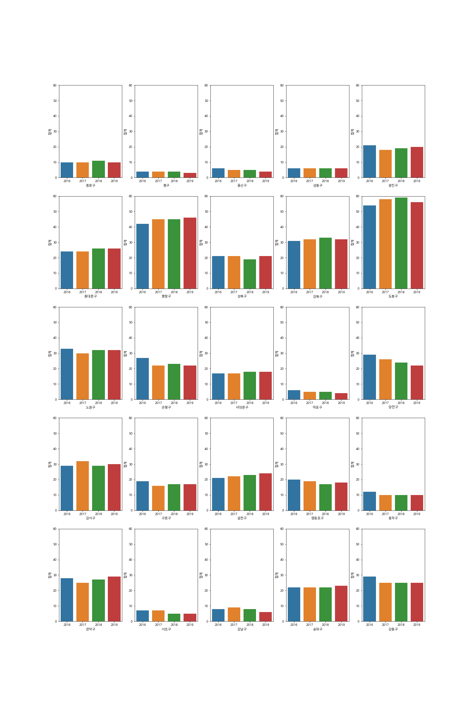

## 실버존(Silver Zone)
황수영 신선민 박범진 이정우


# 서울이 과연 노인들이 살기 좋은 곳인가?

sbs 데이터저널리즘팀에서 민식이법으로 촉발된 어린이 교통안전 문제를 집중 조명했다. 이어서 또 다른 교통 약자인 노인의 안전 문제를 점검한다. 최근 13년 간 노인 교통사고 데이터와 서울시 생활인구 데이터를 살폈고, GIS 분석 기법을 통해 노인보호구역의 실태와 사각지대를 확인했다.

## 실버존(silver zone)   
노인보호구역이란 교통약자인 노인을 교통사고 위험에서 **보호**하기 위해 양로원, 경로당, 노인복지시설 등 노인들의 **통행량이 많은 구역**을 선정하여 **노인들의 안전한 통행**을 보장하고자 하는 지정된 **교통약자보호구역**으로 **실버존(Silver Zone)**이라고도 한다.   


- 총 인구 수 감소 & 노인 수 증가
- 총 인구 수 대비 노인 인구 수 비율 증가

<div style = "float:left;">
     
</div>
<div style = "float:left;">
    
</div>

- 서울시 고령자 현황 통계 (서울시 공공데이터 포털)

##  아이는 줄고, 노인은 늘고

 

## 노인 보호 구역, 어린이 구역의 11.4 %


```python
m
```


<div style="width:100%;"><div style="position:relative;width:100%;height:0;padding-bottom:60%;"><span style="color:#565656">Make this Notebook Trusted to load map: File -> Trust Notebook</span><iframe src="about:blank" style="position:absolute;width:100%;height:100%;left:0;top:0;border:none !important;" data-html=PCFET0NUWVBFIGh0bWw+CjxoZWFkPiAgICAKICAgIDxtZXRhIGh0dHAtZXF1aXY9ImNvbnRlbnQtdHlwZSIgY29udGVudD0idGV4dC9odG1sOyBjaGFyc2V0PVVURi04IiAvPgogICAgCiAgICAgICAgPHNjcmlwdD4KICAgICAgICAgICAgTF9OT19UT1VDSCA9IGZhbHNlOwogICAgICAgICAgICBMX0RJU0FCTEVfM0QgPSBmYWxzZTsKICAgICAgICA8L3NjcmlwdD4KICAgIAogICAgPHNjcmlwdCBzcmM9Imh0dHBzOi8vY2RuLmpzZGVsaXZyLm5ldC9ucG0vbGVhZmxldEAxLjYuMC9kaXN0L2xlYWZsZXQuanMiPjwvc2NyaXB0PgogICAgPHNjcmlwdCBzcmM9Imh0dHBzOi8vY29kZS5qcXVlcnkuY29tL2pxdWVyeS0xLjEyLjQubWluLmpzIj48L3NjcmlwdD4KICAgIDxzY3JpcHQgc3JjPSJodHRwczovL21heGNkbi5ib290c3RyYXBjZG4uY29tL2Jvb3RzdHJhcC8zLjIuMC9qcy9ib290c3RyYXAubWluLmpzIj48L3NjcmlwdD4KICAgIDxzY3JpcHQgc3JjPSJodHRwczovL2NkbmpzLmNsb3VkZmxhcmUuY29tL2FqYXgvbGlicy9MZWFmbGV0LmF3ZXNvbWUtbWFya2Vycy8yLjAuMi9sZWFmbGV0LmF3ZXNvbWUtbWFya2Vycy5qcyI+PC9zY3JpcHQ+CiAgICA8bGluayByZWw9InN0eWxlc2hlZXQiIGhyZWY9Imh0dHBzOi8vY2RuLmpzZGVsaXZyLm5ldC9ucG0vbGVhZmxldEAxLjYuMC9kaXN0L2xlYWZsZXQuY3NzIi8+CiAgICA8bGluayByZWw9InN0eWxlc2hlZXQiIGhyZWY9Imh0dHBzOi8vbWF4Y2RuLmJvb3RzdHJhcGNkbi5jb20vYm9vdHN0cmFwLzMuMi4wL2Nzcy9ib290c3RyYXAubWluLmNzcyIvPgogICAgPGxpbmsgcmVsPSJzdHlsZXNoZWV0IiBocmVmPSJodHRwczovL21heGNkbi5ib290c3RyYXBjZG4uY29tL2Jvb3RzdHJhcC8zLjIuMC9jc3MvYm9vdHN0cmFwLXRoZW1lLm1pbi5jc3MiLz4KICAgIDxsaW5rIHJlbD0ic3R5bGVzaGVldCIgaHJlZj0iaHR0cHM6Ly9tYXhjZG4uYm9vdHN0cmFwY2RuLmNvbS9mb250LWF3ZXNvbWUvNC42LjMvY3NzL2ZvbnQtYXdlc29tZS5taW4uY3NzIi8+CiAgICA8bGluayByZWw9InN0eWxlc2hlZXQiIGhyZWY9Imh0dHBzOi8vY2RuanMuY2xvdWRmbGFyZS5jb20vYWpheC9saWJzL0xlYWZsZXQuYXdlc29tZS1tYXJrZXJzLzIuMC4yL2xlYWZsZXQuYXdlc29tZS1tYXJrZXJzLmNzcyIvPgogICAgPGxpbmsgcmVsPSJzdHlsZXNoZWV0IiBocmVmPSJodHRwczovL3Jhd2Nkbi5naXRoYWNrLmNvbS9weXRob24tdmlzdWFsaXphdGlvbi9mb2xpdW0vbWFzdGVyL2ZvbGl1bS90ZW1wbGF0ZXMvbGVhZmxldC5hd2Vzb21lLnJvdGF0ZS5jc3MiLz4KICAgIDxzdHlsZT5odG1sLCBib2R5IHt3aWR0aDogMTAwJTtoZWlnaHQ6IDEwMCU7bWFyZ2luOiAwO3BhZGRpbmc6IDA7fTwvc3R5bGU+CiAgICA8c3R5bGU+I21hcCB7cG9zaXRpb246YWJzb2x1dGU7dG9wOjA7Ym90dG9tOjA7cmlnaHQ6MDtsZWZ0OjA7fTwvc3R5bGU+CiAgICAKICAgICAgICAgICAgPG1ldGEgbmFtZT0idmlld3BvcnQiIGNvbnRlbnQ9IndpZHRoPWRldmljZS13aWR0aCwKICAgICAgICAgICAgICAgIGluaXRpYWwtc2NhbGU9MS4wLCBtYXhpbXVtLXNjYWxlPTEuMCwgdXNlci1zY2FsYWJsZT1ubyIgLz4KICAgICAgICAgICAgPHN0eWxlPgogICAgICAgICAgICAgICAgI21hcF8yYjEwMWJjNzc4Mjg0ZmRjYWZkZDUwMDUxMWQ0YTFhYyB7CiAgICAgICAgICAgICAgICAgICAgcG9zaXRpb246IHJlbGF0aXZlOwogICAgICAgICAgICAgICAgICAgIHdpZHRoOiAxMDAuMCU7CiAgICAgICAgICAgICAgICAgICAgaGVpZ2h0OiAxMDAuMCU7CiAgICAgICAgICAgICAgICAgICAgbGVmdDogMC4wJTsKICAgICAgICAgICAgICAgICAgICB0b3A6IDAuMCU7CiAgICAgICAgICAgICAgICB9CiAgICAgICAgICAgIDwvc3R5bGU+CiAgICAgICAgCiAgICA8c2NyaXB0IHNyYz0iaHR0cHM6Ly91bnBrZy5jb20vbGVhZmxldC5mZWF0dXJlZ3JvdXAuc3ViZ3JvdXBAMS4wLjIvZGlzdC9sZWFmbGV0LmZlYXR1cmVncm91cC5zdWJncm91cC5qcyI+PC9zY3JpcHQ+CjwvaGVhZD4KPGJvZHk+ICAgIAogICAgCiAgICAgICAgICAgIDxkaXYgY2xhc3M9ImZvbGl1bS1tYXAiIGlkPSJtYXBfMmIxMDFiYzc3ODI4NGZkY2FmZGQ1MDA1MTFkNGExYWMiID48L2Rpdj4KICAgICAgICAKPC9ib2R5Pgo8c2NyaXB0PiAgICAKICAgIAogICAgICAgICAgICB2YXIgbWFwXzJiMTAxYmM3NzgyODRmZGNhZmRkNTAwNTExZDRhMWFjID0gTC5tYXAoCiAgICAgICAgICAgICAgICAibWFwXzJiMTAxYmM3NzgyODRmZGNhZmRkNTAwNTExZDRhMWFjIiwKICAgICAgICAgICAgICAgIHsKICAgICAgICAgICAgICAgICAgICBjZW50ZXI6IFszNy41NTAyLCAxMjYuOTgyXSwKICAgICAgICAgICAgICAgICAgICBjcnM6IEwuQ1JTLkVQU0czODU3LAogICAgICAgICAgICAgICAgICAgIHpvb206IDEwLAogICAgICAgICAgICAgICAgICAgIHpvb21Db250cm9sOiB0cnVlLAogICAgICAgICAgICAgICAgICAgIHByZWZlckNhbnZhczogZmFsc2UsCiAgICAgICAgICAgICAgICB9CiAgICAgICAgICAgICk7CgogICAgICAgICAgICAKCiAgICAgICAgCiAgICAKICAgICAgICAgICAgdmFyIHRpbGVfbGF5ZXJfNzI5ZTBlNjllMjRmNDg4ZGJjNzRkMDVlMjc1MDhhOGIgPSBMLnRpbGVMYXllcigKICAgICAgICAgICAgICAgICJodHRwczovL2NhcnRvZGItYmFzZW1hcHMte3N9Lmdsb2JhbC5zc2wuZmFzdGx5Lm5ldC9saWdodF9hbGwve3p9L3t4fS97eX0ucG5nIiwKICAgICAgICAgICAgICAgIHsiYXR0cmlidXRpb24iOiAiXHUwMDI2Y29weTsgXHUwMDNjYSBocmVmPVwiaHR0cDovL3d3dy5vcGVuc3RyZWV0bWFwLm9yZy9jb3B5cmlnaHRcIlx1MDAzZU9wZW5TdHJlZXRNYXBcdTAwM2MvYVx1MDAzZSBjb250cmlidXRvcnMgXHUwMDI2Y29weTsgXHUwMDNjYSBocmVmPVwiaHR0cDovL2NhcnRvZGIuY29tL2F0dHJpYnV0aW9uc1wiXHUwMDNlQ2FydG9EQlx1MDAzYy9hXHUwMDNlLCBDYXJ0b0RCIFx1MDAzY2EgaHJlZiA9XCJodHRwOi8vY2FydG9kYi5jb20vYXR0cmlidXRpb25zXCJcdTAwM2VhdHRyaWJ1dGlvbnNcdTAwM2MvYVx1MDAzZSIsICJkZXRlY3RSZXRpbmEiOiBmYWxzZSwgIm1heE5hdGl2ZVpvb20iOiAxOCwgIm1heFpvb20iOiAxOCwgIm1pblpvb20iOiAwLCAibm9XcmFwIjogZmFsc2UsICJvcGFjaXR5IjogMSwgInN1YmRvbWFpbnMiOiAiYWJjIiwgInRtcyI6IGZhbHNlfQogICAgICAgICAgICApLmFkZFRvKG1hcF8yYjEwMWJjNzc4Mjg0ZmRjYWZkZDUwMDUxMWQ0YTFhYyk7CiAgICAgICAgCiAgICAKICAgICAgICAgICAgdmFyIHRpbGVfbGF5ZXJfYjg3ZDFmOThjMWU3NDMyOTk0ZGRkZmMxZDNhMzFlMzIgPSBMLnRpbGVMYXllcigKICAgICAgICAgICAgICAgICJodHRwczovL3tzfS50aWxlLm9wZW5zdHJlZXRtYXAub3JnL3t6fS97eH0ve3l9LnBuZyIsCiAgICAgICAgICAgICAgICB7ImF0dHJpYnV0aW9uIjogIkRhdGEgYnkgXHUwMDI2Y29weTsgXHUwMDNjYSBocmVmPVwiaHR0cDovL29wZW5zdHJlZXRtYXAub3JnXCJcdTAwM2VPcGVuU3RyZWV0TWFwXHUwMDNjL2FcdTAwM2UsIHVuZGVyIFx1MDAzY2EgaHJlZj1cImh0dHA6Ly93d3cub3BlbnN0cmVldG1hcC5vcmcvY29weXJpZ2h0XCJcdTAwM2VPRGJMXHUwMDNjL2FcdTAwM2UuIiwgImRldGVjdFJldGluYSI6IGZhbHNlLCAibWF4TmF0aXZlWm9vbSI6IDE4LCAibWF4Wm9vbSI6IDE4LCAibWluWm9vbSI6IDAsICJub1dyYXAiOiBmYWxzZSwgIm9wYWNpdHkiOiAxLCAic3ViZG9tYWlucyI6ICJhYmMiLCAidG1zIjogZmFsc2V9CiAgICAgICAgICAgICkuYWRkVG8obWFwXzJiMTAxYmM3NzgyODRmZGNhZmRkNTAwNTExZDRhMWFjKTsKICAgICAgICAKICAgIAogICAgICAgICAgICB2YXIgZmVhdHVyZV9ncm91cF84N2QzZGViYzc1YTI0MjNlOTM3ZjFiYzMxMzZhZjA1OCA9IEwuZmVhdHVyZUdyb3VwKAogICAgICAgICAgICAgICAge30KICAgICAgICAgICAgKS5hZGRUbyhtYXBfMmIxMDFiYzc3ODI4NGZkY2FmZGQ1MDA1MTFkNGExYWMpOwogICAgICAgIAogICAgCiAgICAgICAgICAgIHZhciBmZWF0dXJlX2dyb3VwX3N1Yl9ncm91cF9hNDY1MDE0ZjRmMWE0ZjhiOGIzZmVjMzU5OGQyZGQzMCA9IEwuZmVhdHVyZUdyb3VwLnN1Ykdyb3VwKAogICAgICAgICAgICAgICAgZmVhdHVyZV9ncm91cF84N2QzZGViYzc1YTI0MjNlOTM3ZjFiYzMxMzZhZjA1OAogICAgICAgICAgICApOwogICAgICAgICAgICBmZWF0dXJlX2dyb3VwX3N1Yl9ncm91cF9hNDY1MDE0ZjRmMWE0ZjhiOGIzZmVjMzU5OGQyZGQzMC5hZGRUbyhtYXBfMmIxMDFiYzc3ODI4NGZkY2FmZGQ1MDA1MTFkNGExYWMpOwogICAgICAgIAogICAgCiAgICAgICAgICAgIHZhciBjaXJjbGVfZjI5ZWExOTYyZWQ1NGZkNDgwZjg1MTQzNmQyYjFmNTMgPSBMLmNpcmNsZSgKICAgICAgICAgICAgICAgIFszNy42MzU3MzIsIDEyNy4wMTg3MzZdLAogICAgICAgICAgICAgICAgeyJidWJibGluZ01vdXNlRXZlbnRzIjogdHJ1ZSwgImNvbG9yIjogInJlZCIsICJkYXNoQXJyYXkiOiBudWxsLCAiZGFzaE9mZnNldCI6IG51bGwsICJmaWxsIjogZmFsc2UsICJmaWxsQ29sb3IiOiAicmVkIiwgImZpbGxPcGFjaXR5IjogMC4yLCAiZmlsbFJ1bGUiOiAiZXZlbm9kZCIsICJsaW5lQ2FwIjogInJvdW5kIiwgImxpbmVKb2luIjogInJvdW5kIiwgIm9wYWNpdHkiOiAxLjAsICJyYWRpdXMiOiAyMDAsICJzdHJva2UiOiB0cnVlLCAid2VpZ2h0IjogM30KICAgICAgICAgICAgKS5hZGRUbyhmZWF0dXJlX2dyb3VwX3N1Yl9ncm91cF9hNDY1MDE0ZjRmMWE0ZjhiOGIzZmVjMzU5OGQyZGQzMCk7CiAgICAgICAgCiAgICAKICAgICAgICAgICAgdmFyIGNpcmNsZV83ZmRiNDFlYmE3YTI0YmIwODM5ZDEwNjExNGFkOThjNCA9IEwuY2lyY2xlKAogICAgICAgICAgICAgICAgWzM3LjYyODUwNywgMTI3LjAxODE2Nl0sCiAgICAgICAgICAgICAgICB7ImJ1YmJsaW5nTW91c2VFdmVudHMiOiB0cnVlLCAiY29sb3IiOiAicmVkIiwgImRhc2hBcnJheSI6IG51bGwsICJkYXNoT2Zmc2V0IjogbnVsbCwgImZpbGwiOiBmYWxzZSwgImZpbGxDb2xvciI6ICJyZWQiLCAiZmlsbE9wYWNpdHkiOiAwLjIsICJmaWxsUnVsZSI6ICJldmVub2RkIiwgImxpbmVDYXAiOiAicm91bmQiLCAibGluZUpvaW4iOiAicm91bmQiLCAib3BhY2l0eSI6IDEuMCwgInJhZGl1cyI6IDIwMCwgInN0cm9rZSI6IHRydWUsICJ3ZWlnaHQiOiAzfQogICAgICAgICAgICApLmFkZFRvKGZlYXR1cmVfZ3JvdXBfc3ViX2dyb3VwX2E0NjUwMTRmNGYxYTRmOGI4YjNmZWMzNTk4ZDJkZDMwKTsKICAgICAgICAKICAgIAogICAgICAgICAgICB2YXIgY2lyY2xlX2FmYjI2MjFlZmJiMTQyMzc5NzMwNjJlZjg5NzU4ZjgxID0gTC5jaXJjbGUoCiAgICAgICAgICAgICAgICBbMzcuNDgwNzA2Mjk5OTk5OTk0LCAxMjYuOTgyNzc2NTk5OTk5OThdLAogICAgICAgICAgICAgICAgeyJidWJibGluZ01vdXNlRXZlbnRzIjogdHJ1ZSwgImNvbG9yIjogInJlZCIsICJkYXNoQXJyYXkiOiBudWxsLCAiZGFzaE9mZnNldCI6IG51bGwsICJmaWxsIjogZmFsc2UsICJmaWxsQ29sb3IiOiAicmVkIiwgImZpbGxPcGFjaXR5IjogMC4yLCAiZmlsbFJ1bGUiOiAiZXZlbm9kZCIsICJsaW5lQ2FwIjogInJvdW5kIiwgImxpbmVKb2luIjogInJvdW5kIiwgIm9wYWNpdHkiOiAxLjAsICJyYWRpdXMiOiAyMDAsICJzdHJva2UiOiB0cnVlLCAid2VpZ2h0IjogM30KICAgICAgICAgICAgKS5hZGRUbyhmZWF0dXJlX2dyb3VwX3N1Yl9ncm91cF9hNDY1MDE0ZjRmMWE0ZjhiOGIzZmVjMzU5OGQyZGQzMCk7CiAgICAgICAgCiAgICAKICAgICAgICAgICAgdmFyIGNpcmNsZV8yMWY0YTQxZTBlNDE0MDhjOTc3MzJhNTU0YWZlMGU4ZCA9IEwuY2lyY2xlKAogICAgICAgICAgICAgICAgWzM3LjQ4MzAyMDQ2LCAxMjcuMDQwODA2OV0sCiAgICAgICAgICAgICAgICB7ImJ1YmJsaW5nTW91c2VFdmVudHMiOiB0cnVlLCAiY29sb3IiOiAicmVkIiwgImRhc2hBcnJheSI6IG51bGwsICJkYXNoT2Zmc2V0IjogbnVsbCwgImZpbGwiOiBmYWxzZSwgImZpbGxDb2xvciI6ICJyZWQiLCAiZmlsbE9wYWNpdHkiOiAwLjIsICJmaWxsUnVsZSI6ICJldmVub2RkIiwgImxpbmVDYXAiOiAicm91bmQiLCAibGluZUpvaW4iOiAicm91bmQiLCAib3BhY2l0eSI6IDEuMCwgInJhZGl1cyI6IDIwMCwgInN0cm9rZSI6IHRydWUsICJ3ZWlnaHQiOiAzfQogICAgICAgICAgICApLmFkZFRvKGZlYXR1cmVfZ3JvdXBfc3ViX2dyb3VwX2E0NjUwMTRmNGYxYTRmOGI4YjNmZWMzNTk4ZDJkZDMwKTsKICAgICAgICAKICAgIAogICAgICAgICAgICB2YXIgY2lyY2xlX2FmNDRiYjAxZGQzMzQ4OTJhY2Q4Y2NlOTdiMDg3OGQ3ID0gTC5jaXJjbGUoCiAgICAgICAgICAgICAgICBbMzcuNDkyMzI0NzIsIDEyNy4wMTY4MTI0XSwKICAgICAgICAgICAgICAgIHsiYnViYmxpbmdNb3VzZUV2ZW50cyI6IHRydWUsICJjb2xvciI6ICJyZWQiLCAiZGFzaEFycmF5IjogbnVsbCwgImRhc2hPZmZzZXQiOiBudWxsLCAiZmlsbCI6IGZhbHNlLCAiZmlsbENvbG9yIjogInJlZCIsICJmaWxsT3BhY2l0eSI6IDAuMiwgImZpbGxSdWxlIjogImV2ZW5vZGQiLCAibGluZUNhcCI6ICJyb3VuZCIsICJsaW5lSm9pbiI6ICJyb3VuZCIsICJvcGFjaXR5IjogMS4wLCAicmFkaXVzIjogMjAwLCAic3Ryb2tlIjogdHJ1ZSwgIndlaWdodCI6IDN9CiAgICAgICAgICAgICkuYWRkVG8oZmVhdHVyZV9ncm91cF9zdWJfZ3JvdXBfYTQ2NTAxNGY0ZjFhNGY4YjhiM2ZlYzM1OThkMmRkMzApOwogICAgICAgIAogICAgCiAgICAgICAgICAgIHZhciBjaXJjbGVfMzcwZmNiOTQ4MDI0NDRlY2E3ZTIyOTgzYmExYjk0MmYgPSBMLmNpcmNsZSgKICAgICAgICAgICAgICAgIFszNy40ODQ1Mjg0NiwgMTI3LjAzNjE0MjcwMDAwMDAxXSwKICAgICAgICAgICAgICAgIHsiYnViYmxpbmdNb3VzZUV2ZW50cyI6IHRydWUsICJjb2xvciI6ICJyZWQiLCAiZGFzaEFycmF5IjogbnVsbCwgImRhc2hPZmZzZXQiOiBudWxsLCAiZmlsbCI6IGZhbHNlLCAiZmlsbENvbG9yIjogInJlZCIsICJmaWxsT3BhY2l0eSI6IDAuMiwgImZpbGxSdWxlIjogImV2ZW5vZGQiLCAibGluZUNhcCI6ICJyb3VuZCIsICJsaW5lSm9pbiI6ICJyb3VuZCIsICJvcGFjaXR5IjogMS4wLCAicmFkaXVzIjogMjAwLCAic3Ryb2tlIjogdHJ1ZSwgIndlaWdodCI6IDN9CiAgICAgICAgICAgICkuYWRkVG8oZmVhdHVyZV9ncm91cF9zdWJfZ3JvdXBfYTQ2NTAxNGY0ZjFhNGY4YjhiM2ZlYzM1OThkMmRkMzApOwogICAgICAgIAogICAgCiAgICAgICAgICAgIHZhciBjaXJjbGVfN2JmYTg2NWNhMDUxNDMxY2E5MWI5NzdjNjVjNzYxMDMgPSBMLmNpcmNsZSgKICAgICAgICAgICAgICAgIFszNy40ODE3MDQyLCAxMjcuMDI0NjEyNl0sCiAgICAgICAgICAgICAgICB7ImJ1YmJsaW5nTW91c2VFdmVudHMiOiB0cnVlLCAiY29sb3IiOiAicmVkIiwgImRhc2hBcnJheSI6IG51bGwsICJkYXNoT2Zmc2V0IjogbnVsbCwgImZpbGwiOiBmYWxzZSwgImZpbGxDb2xvciI6ICJyZWQiLCAiZmlsbE9wYWNpdHkiOiAwLjIsICJmaWxsUnVsZSI6ICJldmVub2RkIiwgImxpbmVDYXAiOiAicm91bmQiLCAibGluZUpvaW4iOiAicm91bmQiLCAib3BhY2l0eSI6IDEuMCwgInJhZGl1cyI6IDIwMCwgInN0cm9rZSI6IHRydWUsICJ3ZWlnaHQiOiAzfQogICAgICAgICAgICApLmFkZFRvKGZlYXR1cmVfZ3JvdXBfc3ViX2dyb3VwX2E0NjUwMTRmNGYxYTRmOGI4YjNmZWMzNTk4ZDJkZDMwKTsKICAgICAgICAKICAgIAogICAgICAgICAgICB2YXIgY2lyY2xlXzZiZjUwN2ZkYmNmZTQ0ZjA5YWIxNmI2MmZlZTJlZWU1ID0gTC5jaXJjbGUoCiAgICAgICAgICAgICAgICBbMzcuNDkwNTgwOTgsIDEyNy4wMTE3Njg4MDAwMDAwMV0sCiAgICAgICAgICAgICAgICB7ImJ1YmJsaW5nTW91c2VFdmVudHMiOiB0cnVlLCAiY29sb3IiOiAicmVkIiwgImRhc2hBcnJheSI6IG51bGwsICJkYXNoT2Zmc2V0IjogbnVsbCwgImZpbGwiOiBmYWxzZSwgImZpbGxDb2xvciI6ICJyZWQiLCAiZmlsbE9wYWNpdHkiOiAwLjIsICJmaWxsUnVsZSI6ICJldmVub2RkIiwgImxpbmVDYXAiOiAicm91bmQiLCAibGluZUpvaW4iOiAicm91bmQiLCAib3BhY2l0eSI6IDEuMCwgInJhZGl1cyI6IDIwMCwgInN0cm9rZSI6IHRydWUsICJ3ZWlnaHQiOiAzfQogICAgICAgICAgICApLmFkZFRvKGZlYXR1cmVfZ3JvdXBfc3ViX2dyb3VwX2E0NjUwMTRmNGYxYTRmOGI4YjNmZWMzNTk4ZDJkZDMwKTsKICAgICAgICAKICAgIAogICAgICAgICAgICB2YXIgY2lyY2xlX2MwMDRiOTM1NTA4NzQ2OWRiYTU2ZDQ5NDJlN2RiYTVhID0gTC5jaXJjbGUoCiAgICAgICAgICAgICAgICBbMzcuNDgyMjM3MDEsIDEyNi45ODMwNDgwOTk5OTk5OV0sCiAgICAgICAgICAgICAgICB7ImJ1YmJsaW5nTW91c2VFdmVudHMiOiB0cnVlLCAiY29sb3IiOiAicmVkIiwgImRhc2hBcnJheSI6IG51bGwsICJkYXNoT2Zmc2V0IjogbnVsbCwgImZpbGwiOiBmYWxzZSwgImZpbGxDb2xvciI6ICJyZWQiLCAiZmlsbE9wYWNpdHkiOiAwLjIsICJmaWxsUnVsZSI6ICJldmVub2RkIiwgImxpbmVDYXAiOiAicm91bmQiLCAibGluZUpvaW4iOiAicm91bmQiLCAib3BhY2l0eSI6IDEuMCwgInJhZGl1cyI6IDIwMCwgInN0cm9rZSI6IHRydWUsICJ3ZWlnaHQiOiAzfQogICAgICAgICAgICApLmFkZFRvKGZlYXR1cmVfZ3JvdXBfc3ViX2dyb3VwX2E0NjUwMTRmNGYxYTRmOGI4YjNmZWMzNTk4ZDJkZDMwKTsKICAgICAgICAKICAgIAogICAgICAgICAgICB2YXIgY2lyY2xlXzk3MGViZmI3YWZmYjQ2MTc4NGNjNzRlNWY3NDVhNjA1ID0gTC5jaXJjbGUoCiAgICAgICAgICAgICAgICBbMzcuNDU3NzA1MiwgMTI3LjA1NjY0MDk5OTk5OTk4XSwKICAgICAgICAgICAgICAgIHsiYnViYmxpbmdNb3VzZUV2ZW50cyI6IHRydWUsICJjb2xvciI6ICJyZWQiLCAiZGFzaEFycmF5IjogbnVsbCwgImRhc2hPZmZzZXQiOiBudWxsLCAiZmlsbCI6IGZhbHNlLCAiZmlsbENvbG9yIjogInJlZCIsICJmaWxsT3BhY2l0eSI6IDAuMiwgImZpbGxSdWxlIjogImV2ZW5vZGQiLCAibGluZUNhcCI6ICJyb3VuZCIsICJsaW5lSm9pbiI6ICJyb3VuZCIsICJvcGFjaXR5IjogMS4wLCAicmFkaXVzIjogMjAwLCAic3Ryb2tlIjogdHJ1ZSwgIndlaWdodCI6IDN9CiAgICAgICAgICAgICkuYWRkVG8oZmVhdHVyZV9ncm91cF9zdWJfZ3JvdXBfYTQ2NTAxNGY0ZjFhNGY4YjhiM2ZlYzM1OThkMmRkMzApOwogICAgICAgIAogICAgCiAgICAgICAgICAgIHZhciBjaXJjbGVfMmQ4Mzk4OTYxNGFlNDdlOWE4MDE2OWEwNTk0Y2RkZTYgPSBMLmNpcmNsZSgKICAgICAgICAgICAgICAgIFszNy40ODI4MTA3NywgMTI3LjAxMDgzNTAwMDAwMDAxXSwKICAgICAgICAgICAgICAgIHsiYnViYmxpbmdNb3VzZUV2ZW50cyI6IHRydWUsICJjb2xvciI6ICJyZWQiLCAiZGFzaEFycmF5IjogbnVsbCwgImRhc2hPZmZzZXQiOiBudWxsLCAiZmlsbCI6IGZhbHNlLCAiZmlsbENvbG9yIjogInJlZCIsICJmaWxsT3BhY2l0eSI6IDAuMiwgImZpbGxSdWxlIjogImV2ZW5vZGQiLCAibGluZUNhcCI6ICJyb3VuZCIsICJsaW5lSm9pbiI6ICJyb3VuZCIsICJvcGFjaXR5IjogMS4wLCAicmFkaXVzIjogMjAwLCAic3Ryb2tlIjogdHJ1ZSwgIndlaWdodCI6IDN9CiAgICAgICAgICAgICkuYWRkVG8oZmVhdHVyZV9ncm91cF9zdWJfZ3JvdXBfYTQ2NTAxNGY0ZjFhNGY4YjhiM2ZlYzM1OThkMmRkMzApOwogICAgICAgIAogICAgCiAgICAgICAgICAgIHZhciBjaXJjbGVfOGYwYTc5OTk2N2MyNDI0ZjgwMjUwZGJmNWUwZTRkNzYgPSBMLmNpcmNsZSgKICAgICAgICAgICAgICAgIFszNy42ODA0ODI3Mzk3LCAxMjcuMDU2OTU4NTk5OTk5OTldLAogICAgICAgICAgICAgICAgeyJidWJibGluZ01vdXNlRXZlbnRzIjogdHJ1ZSwgImNvbG9yIjogInJlZCIsICJkYXNoQXJyYXkiOiBudWxsLCAiZGFzaE9mZnNldCI6IG51bGwsICJmaWxsIjogZmFsc2UsICJmaWxsQ29sb3IiOiAicmVkIiwgImZpbGxPcGFjaXR5IjogMC4yLCAiZmlsbFJ1bGUiOiAiZXZlbm9kZCIsICJsaW5lQ2FwIjogInJvdW5kIiwgImxpbmVKb2luIjogInJvdW5kIiwgIm9wYWNpdHkiOiAxLjAsICJyYWRpdXMiOiAyMDAsICJzdHJva2UiOiB0cnVlLCAid2VpZ2h0IjogM30KICAgICAgICAgICAgKS5hZGRUbyhmZWF0dXJlX2dyb3VwX3N1Yl9ncm91cF9hNDY1MDE0ZjRmMWE0ZjhiOGIzZmVjMzU5OGQyZGQzMCk7CiAgICAgICAgCiAgICAKICAgICAgICAgICAgdmFyIGNpcmNsZV82YmI0NzQ5NDMyNDE0MjM3YmFmZjg2MDRhMGIxZTk1YSA9IEwuY2lyY2xlKAogICAgICAgICAgICAgICAgWzM3LjYzMzE5NDksIDEyNy4wNjQxOTA2OTU1OTk5OV0sCiAgICAgICAgICAgICAgICB7ImJ1YmJsaW5nTW91c2VFdmVudHMiOiB0cnVlLCAiY29sb3IiOiAicmVkIiwgImRhc2hBcnJheSI6IG51bGwsICJkYXNoT2Zmc2V0IjogbnVsbCwgImZpbGwiOiBmYWxzZSwgImZpbGxDb2xvciI6ICJyZWQiLCAiZmlsbE9wYWNpdHkiOiAwLjIsICJmaWxsUnVsZSI6ICJldmVub2RkIiwgImxpbmVDYXAiOiAicm91bmQiLCAibGluZUpvaW4iOiAicm91bmQiLCAib3BhY2l0eSI6IDEuMCwgInJhZGl1cyI6IDIwMCwgInN0cm9rZSI6IHRydWUsICJ3ZWlnaHQiOiAzfQogICAgICAgICAgICApLmFkZFRvKGZlYXR1cmVfZ3JvdXBfc3ViX2dyb3VwX2E0NjUwMTRmNGYxYTRmOGI4YjNmZWMzNTk4ZDJkZDMwKTsKICAgICAgICAKICAgIAogICAgICAgICAgICB2YXIgY2lyY2xlX2JiNzVmOGE2MGVlNDQxODU5MTk4ZDY3NmQ5ZWMyZDczID0gTC5jaXJjbGUoCiAgICAgICAgICAgICAgICBbMzcuNjQzNTYxNzkzNSwgMTI3LjA2MTU4OTA5ODUwMDAxXSwKICAgICAgICAgICAgICAgIHsiYnViYmxpbmdNb3VzZUV2ZW50cyI6IHRydWUsICJjb2xvciI6ICJyZWQiLCAiZGFzaEFycmF5IjogbnVsbCwgImRhc2hPZmZzZXQiOiBudWxsLCAiZmlsbCI6IGZhbHNlLCAiZmlsbENvbG9yIjogInJlZCIsICJmaWxsT3BhY2l0eSI6IDAuMiwgImZpbGxSdWxlIjogImV2ZW5vZGQiLCAibGluZUNhcCI6ICJyb3VuZCIsICJsaW5lSm9pbiI6ICJyb3VuZCIsICJvcGFjaXR5IjogMS4wLCAicmFkaXVzIjogMjAwLCAic3Ryb2tlIjogdHJ1ZSwgIndlaWdodCI6IDN9CiAgICAgICAgICAgICkuYWRkVG8oZmVhdHVyZV9ncm91cF9zdWJfZ3JvdXBfYTQ2NTAxNGY0ZjFhNGY4YjhiM2ZlYzM1OThkMmRkMzApOwogICAgICAgIAogICAgCiAgICAgICAgICAgIHZhciBjaXJjbGVfMGE4OWQ4Y2ZiYWEyNDQ4NzhkZjNiNjJmZDdhZjg0M2MgPSBMLmNpcmNsZSgKICAgICAgICAgICAgICAgIFszNy42NDMyNTUzMTM5LCAxMjcuMDc0MzUxNjgwNTk5OTldLAogICAgICAgICAgICAgICAgeyJidWJibGluZ01vdXNlRXZlbnRzIjogdHJ1ZSwgImNvbG9yIjogInJlZCIsICJkYXNoQXJyYXkiOiBudWxsLCAiZGFzaE9mZnNldCI6IG51bGwsICJmaWxsIjogZmFsc2UsICJmaWxsQ29sb3IiOiAicmVkIiwgImZpbGxPcGFjaXR5IjogMC4yLCAiZmlsbFJ1bGUiOiAiZXZlbm9kZCIsICJsaW5lQ2FwIjogInJvdW5kIiwgImxpbmVKb2luIjogInJvdW5kIiwgIm9wYWNpdHkiOiAxLjAsICJyYWRpdXMiOiAyMDAsICJzdHJva2UiOiB0cnVlLCAid2VpZ2h0IjogM30KICAgICAgICAgICAgKS5hZGRUbyhmZWF0dXJlX2dyb3VwX3N1Yl9ncm91cF9hNDY1MDE0ZjRmMWE0ZjhiOGIzZmVjMzU5OGQyZGQzMCk7CiAgICAgICAgCiAgICAKICAgICAgICAgICAgdmFyIGNpcmNsZV9jYzBmY2Q2YTNhZmQ0MjRlOGQ3NGYxMTY3NTY0NDFjMiA9IEwuY2lyY2xlKAogICAgICAgICAgICAgICAgWzM3LjYyMTcxOTg5OTk5OTk5NSwgMTI3LjA3ODk1NjMxXSwKICAgICAgICAgICAgICAgIHsiYnViYmxpbmdNb3VzZUV2ZW50cyI6IHRydWUsICJjb2xvciI6ICJyZWQiLCAiZGFzaEFycmF5IjogbnVsbCwgImRhc2hPZmZzZXQiOiBudWxsLCAiZmlsbCI6IGZhbHNlLCAiZmlsbENvbG9yIjogInJlZCIsICJmaWxsT3BhY2l0eSI6IDAuMiwgImZpbGxSdWxlIjogImV2ZW5vZGQiLCAibGluZUNhcCI6ICJyb3VuZCIsICJsaW5lSm9pbiI6ICJyb3VuZCIsICJvcGFjaXR5IjogMS4wLCAicmFkaXVzIjogMjAwLCAic3Ryb2tlIjogdHJ1ZSwgIndlaWdodCI6IDN9CiAgICAgICAgICAgICkuYWRkVG8oZmVhdHVyZV9ncm91cF9zdWJfZ3JvdXBfYTQ2NTAxNGY0ZjFhNGY4YjhiM2ZlYzM1OThkMmRkMzApOwogICAgICAgIAogICAgCiAgICAgICAgICAgIHZhciBjaXJjbGVfYzRkYTBmYzEyMjdhNDA4OGI5Y2JjZjkxNGM3YzZmYzYgPSBMLmNpcmNsZSgKICAgICAgICAgICAgICAgIFszNy42MjcyNTA5OTY4LCAxMjcuMDUyODM0Nzg4NTAwMDFdLAogICAgICAgICAgICAgICAgeyJidWJibGluZ01vdXNlRXZlbnRzIjogdHJ1ZSwgImNvbG9yIjogInJlZCIsICJkYXNoQXJyYXkiOiBudWxsLCAiZGFzaE9mZnNldCI6IG51bGwsICJmaWxsIjogZmFsc2UsICJmaWxsQ29sb3IiOiAicmVkIiwgImZpbGxPcGFjaXR5IjogMC4yLCAiZmlsbFJ1bGUiOiAiZXZlbm9kZCIsICJsaW5lQ2FwIjogInJvdW5kIiwgImxpbmVKb2luIjogInJvdW5kIiwgIm9wYWNpdHkiOiAxLjAsICJyYWRpdXMiOiAyMDAsICJzdHJva2UiOiB0cnVlLCAid2VpZ2h0IjogM30KICAgICAgICAgICAgKS5hZGRUbyhmZWF0dXJlX2dyb3VwX3N1Yl9ncm91cF9hNDY1MDE0ZjRmMWE0ZjhiOGIzZmVjMzU5OGQyZGQzMCk7CiAgICAgICAgCiAgICAKICAgICAgICAgICAgdmFyIGNpcmNsZV85YzJiNzRhMWZkMDM0N2M2OGNmZmE3YTllOTcxYWEwZSA9IEwuY2lyY2xlKAogICAgICAgICAgICAgICAgWzM3LjU1ODEyMzE5LCAxMjYuODQ3NTUwMDk5OTk5OTldLAogICAgICAgICAgICAgICAgeyJidWJibGluZ01vdXNlRXZlbnRzIjogdHJ1ZSwgImNvbG9yIjogInJlZCIsICJkYXNoQXJyYXkiOiBudWxsLCAiZGFzaE9mZnNldCI6IG51bGwsICJmaWxsIjogZmFsc2UsICJmaWxsQ29sb3IiOiAicmVkIiwgImZpbGxPcGFjaXR5IjogMC4yLCAiZmlsbFJ1bGUiOiAiZXZlbm9kZCIsICJsaW5lQ2FwIjogInJvdW5kIiwgImxpbmVKb2luIjogInJvdW5kIiwgIm9wYWNpdHkiOiAxLjAsICJyYWRpdXMiOiAyMDAsICJzdHJva2UiOiB0cnVlLCAid2VpZ2h0IjogM30KICAgICAgICAgICAgKS5hZGRUbyhmZWF0dXJlX2dyb3VwX3N1Yl9ncm91cF9hNDY1MDE0ZjRmMWE0ZjhiOGIzZmVjMzU5OGQyZGQzMCk7CiAgICAgICAgCiAgICAKICAgICAgICAgICAgdmFyIGNpcmNsZV9lYTI3ODFhMjc3YjA0YjMwYTg1ODk4NDJhYTExYWQzYyA9IEwuY2lyY2xlKAogICAgICAgICAgICAgICAgWzM3LjU2MjI1ODA3LCAxMjYuODQyODk2Nl0sCiAgICAgICAgICAgICAgICB7ImJ1YmJsaW5nTW91c2VFdmVudHMiOiB0cnVlLCAiY29sb3IiOiAicmVkIiwgImRhc2hBcnJheSI6IG51bGwsICJkYXNoT2Zmc2V0IjogbnVsbCwgImZpbGwiOiBmYWxzZSwgImZpbGxDb2xvciI6ICJyZWQiLCAiZmlsbE9wYWNpdHkiOiAwLjIsICJmaWxsUnVsZSI6ICJldmVub2RkIiwgImxpbmVDYXAiOiAicm91bmQiLCAibGluZUpvaW4iOiAicm91bmQiLCAib3BhY2l0eSI6IDEuMCwgInJhZGl1cyI6IDIwMCwgInN0cm9rZSI6IHRydWUsICJ3ZWlnaHQiOiAzfQogICAgICAgICAgICApLmFkZFRvKGZlYXR1cmVfZ3JvdXBfc3ViX2dyb3VwX2E0NjUwMTRmNGYxYTRmOGI4YjNmZWMzNTk4ZDJkZDMwKTsKICAgICAgICAKICAgIAogICAgICAgICAgICB2YXIgY2lyY2xlXzk3MzU1NDM4OWFiYTQzODhiNjkwNzc1MjUyN2I3NmFiID0gTC5jaXJjbGUoCiAgICAgICAgICAgICAgICBbMzcuNTQ2NjkwMzcsIDEyNi44MzM0ODcyXSwKICAgICAgICAgICAgICAgIHsiYnViYmxpbmdNb3VzZUV2ZW50cyI6IHRydWUsICJjb2xvciI6ICJyZWQiLCAiZGFzaEFycmF5IjogbnVsbCwgImRhc2hPZmZzZXQiOiBudWxsLCAiZmlsbCI6IGZhbHNlLCAiZmlsbENvbG9yIjogInJlZCIsICJmaWxsT3BhY2l0eSI6IDAuMiwgImZpbGxSdWxlIjogImV2ZW5vZGQiLCAibGluZUNhcCI6ICJyb3VuZCIsICJsaW5lSm9pbiI6ICJyb3VuZCIsICJvcGFjaXR5IjogMS4wLCAicmFkaXVzIjogMjAwLCAic3Ryb2tlIjogdHJ1ZSwgIndlaWdodCI6IDN9CiAgICAgICAgICAgICkuYWRkVG8oZmVhdHVyZV9ncm91cF9zdWJfZ3JvdXBfYTQ2NTAxNGY0ZjFhNGY4YjhiM2ZlYzM1OThkMmRkMzApOwogICAgICAgIAogICAgCiAgICAgICAgICAgIHZhciBjaXJjbGVfNzc5YmRmNTI2MjdlNGRmMzhlOTgwMTdlZjBmYTE5NTAgPSBMLmNpcmNsZSgKICAgICAgICAgICAgICAgIFszNy41NTY5ODgxNSwgMTI2Ljg1OTMzMTddLAogICAgICAgICAgICAgICAgeyJidWJibGluZ01vdXNlRXZlbnRzIjogdHJ1ZSwgImNvbG9yIjogInJlZCIsICJkYXNoQXJyYXkiOiBudWxsLCAiZGFzaE9mZnNldCI6IG51bGwsICJmaWxsIjogZmFsc2UsICJmaWxsQ29sb3IiOiAicmVkIiwgImZpbGxPcGFjaXR5IjogMC4yLCAiZmlsbFJ1bGUiOiAiZXZlbm9kZCIsICJsaW5lQ2FwIjogInJvdW5kIiwgImxpbmVKb2luIjogInJvdW5kIiwgIm9wYWNpdHkiOiAxLjAsICJyYWRpdXMiOiAyMDAsICJzdHJva2UiOiB0cnVlLCAid2VpZ2h0IjogM30KICAgICAgICAgICAgKS5hZGRUbyhmZWF0dXJlX2dyb3VwX3N1Yl9ncm91cF9hNDY1MDE0ZjRmMWE0ZjhiOGIzZmVjMzU5OGQyZGQzMCk7CiAgICAgICAgCiAgICAKICAgICAgICAgICAgdmFyIGNpcmNsZV8xYWE0ZDZjNjFhMWU0MzZkYTM3Zjc5NDY1MmEyZTFiYiA9IEwuY2lyY2xlKAogICAgICAgICAgICAgICAgWzM3LjUyOTA1ODcxLCAxMjYuODQ4ODk5XSwKICAgICAgICAgICAgICAgIHsiYnViYmxpbmdNb3VzZUV2ZW50cyI6IHRydWUsICJjb2xvciI6ICJyZWQiLCAiZGFzaEFycmF5IjogbnVsbCwgImRhc2hPZmZzZXQiOiBudWxsLCAiZmlsbCI6IGZhbHNlLCAiZmlsbENvbG9yIjogInJlZCIsICJmaWxsT3BhY2l0eSI6IDAuMiwgImZpbGxSdWxlIjogImV2ZW5vZGQiLCAibGluZUNhcCI6ICJyb3VuZCIsICJsaW5lSm9pbiI6ICJyb3VuZCIsICJvcGFjaXR5IjogMS4wLCAicmFkaXVzIjogMjAwLCAic3Ryb2tlIjogdHJ1ZSwgIndlaWdodCI6IDN9CiAgICAgICAgICAgICkuYWRkVG8oZmVhdHVyZV9ncm91cF9zdWJfZ3JvdXBfYTQ2NTAxNGY0ZjFhNGY4YjhiM2ZlYzM1OThkMmRkMzApOwogICAgICAgIAogICAgCiAgICAgICAgICAgIHZhciBjaXJjbGVfZGIzMjBmMTU3MGMxNDEwOGEyNTFjYzNmODUzM2IyZTcgPSBMLmNpcmNsZSgKICAgICAgICAgICAgICAgIFszNy41NDE1MjQ1MywgMTI2Ljg1MTQwODRdLAogICAgICAgICAgICAgICAgeyJidWJibGluZ01vdXNlRXZlbnRzIjogdHJ1ZSwgImNvbG9yIjogInJlZCIsICJkYXNoQXJyYXkiOiBudWxsLCAiZGFzaE9mZnNldCI6IG51bGwsICJmaWxsIjogZmFsc2UsICJmaWxsQ29sb3IiOiAicmVkIiwgImZpbGxPcGFjaXR5IjogMC4yLCAiZmlsbFJ1bGUiOiAiZXZlbm9kZCIsICJsaW5lQ2FwIjogInJvdW5kIiwgImxpbmVKb2luIjogInJvdW5kIiwgIm9wYWNpdHkiOiAxLjAsICJyYWRpdXMiOiAyMDAsICJzdHJva2UiOiB0cnVlLCAid2VpZ2h0IjogM30KICAgICAgICAgICAgKS5hZGRUbyhmZWF0dXJlX2dyb3VwX3N1Yl9ncm91cF9hNDY1MDE0ZjRmMWE0ZjhiOGIzZmVjMzU5OGQyZGQzMCk7CiAgICAgICAgCiAgICAKICAgICAgICAgICAgdmFyIGNpcmNsZV83MTcwMmJhNWRhNTA0YjJkOTc2MjI2ZTliZTM1ZGM1NCA9IEwuY2lyY2xlKAogICAgICAgICAgICAgICAgWzM3LjU1MjQxMzc2LCAxMjYuODUyNjYzNDAwMDAwMDFdLAogICAgICAgICAgICAgICAgeyJidWJibGluZ01vdXNlRXZlbnRzIjogdHJ1ZSwgImNvbG9yIjogInJlZCIsICJkYXNoQXJyYXkiOiBudWxsLCAiZGFzaE9mZnNldCI6IG51bGwsICJmaWxsIjogZmFsc2UsICJmaWxsQ29sb3IiOiAicmVkIiwgImZpbGxPcGFjaXR5IjogMC4yLCAiZmlsbFJ1bGUiOiAiZXZlbm9kZCIsICJsaW5lQ2FwIjogInJvdW5kIiwgImxpbmVKb2luIjogInJvdW5kIiwgIm9wYWNpdHkiOiAxLjAsICJyYWRpdXMiOiAyMDAsICJzdHJva2UiOiB0cnVlLCAid2VpZ2h0IjogM30KICAgICAgICAgICAgKS5hZGRUbyhmZWF0dXJlX2dyb3VwX3N1Yl9ncm91cF9hNDY1MDE0ZjRmMWE0ZjhiOGIzZmVjMzU5OGQyZGQzMCk7CiAgICAgICAgCiAgICAKICAgICAgICAgICAgdmFyIGNpcmNsZV9kNDE3Yjc4ZjA0OWI0NzUwOWY1ZTE1NGQyNGUxYTE0NiA9IEwuY2lyY2xlKAogICAgICAgICAgICAgICAgWzM3LjUzNTQ2NzIsIDEyNi44NDEwOTczXSwKICAgICAgICAgICAgICAgIHsiYnViYmxpbmdNb3VzZUV2ZW50cyI6IHRydWUsICJjb2xvciI6ICJyZWQiLCAiZGFzaEFycmF5IjogbnVsbCwgImRhc2hPZmZzZXQiOiBudWxsLCAiZmlsbCI6IGZhbHNlLCAiZmlsbENvbG9yIjogInJlZCIsICJmaWxsT3BhY2l0eSI6IDAuMiwgImZpbGxSdWxlIjogImV2ZW5vZGQiLCAibGluZUNhcCI6ICJyb3VuZCIsICJsaW5lSm9pbiI6ICJyb3VuZCIsICJvcGFjaXR5IjogMS4wLCAicmFkaXVzIjogMjAwLCAic3Ryb2tlIjogdHJ1ZSwgIndlaWdodCI6IDN9CiAgICAgICAgICAgICkuYWRkVG8oZmVhdHVyZV9ncm91cF9zdWJfZ3JvdXBfYTQ2NTAxNGY0ZjFhNGY4YjhiM2ZlYzM1OThkMmRkMzApOwogICAgICAgIAogICAgCiAgICAgICAgICAgIHZhciBjaXJjbGVfOWI3YzBjMGQwMWI3NDcxM2IwMWMyNjUyODhlMjM4NTkgPSBMLmNpcmNsZSgKICAgICAgICAgICAgICAgIFszNy41Njg1MzYwNSwgMTI2Ljg1MTExOTNdLAogICAgICAgICAgICAgICAgeyJidWJibGluZ01vdXNlRXZlbnRzIjogdHJ1ZSwgImNvbG9yIjogInJlZCIsICJkYXNoQXJyYXkiOiBudWxsLCAiZGFzaE9mZnNldCI6IG51bGwsICJmaWxsIjogZmFsc2UsICJmaWxsQ29sb3IiOiAicmVkIiwgImZpbGxPcGFjaXR5IjogMC4yLCAiZmlsbFJ1bGUiOiAiZXZlbm9kZCIsICJsaW5lQ2FwIjogInJvdW5kIiwgImxpbmVKb2luIjogInJvdW5kIiwgIm9wYWNpdHkiOiAxLjAsICJyYWRpdXMiOiAyMDAsICJzdHJva2UiOiB0cnVlLCAid2VpZ2h0IjogM30KICAgICAgICAgICAgKS5hZGRUbyhmZWF0dXJlX2dyb3VwX3N1Yl9ncm91cF9hNDY1MDE0ZjRmMWE0ZjhiOGIzZmVjMzU5OGQyZGQzMCk7CiAgICAgICAgCiAgICAKICAgICAgICAgICAgdmFyIGNpcmNsZV85NDg2MTAyZjJiNjc0ZTNlYTQzOTVmOTVhM2FhOGIwMSA9IEwuY2lyY2xlKAogICAgICAgICAgICAgICAgWzM3LjU1MTMwNjIyLCAxMjYuODI3ODU5Mjk5OTk5OTldLAogICAgICAgICAgICAgICAgeyJidWJibGluZ01vdXNlRXZlbnRzIjogdHJ1ZSwgImNvbG9yIjogInJlZCIsICJkYXNoQXJyYXkiOiBudWxsLCAiZGFzaE9mZnNldCI6IG51bGwsICJmaWxsIjogZmFsc2UsICJmaWxsQ29sb3IiOiAicmVkIiwgImZpbGxPcGFjaXR5IjogMC4yLCAiZmlsbFJ1bGUiOiAiZXZlbm9kZCIsICJsaW5lQ2FwIjogInJvdW5kIiwgImxpbmVKb2luIjogInJvdW5kIiwgIm9wYWNpdHkiOiAxLjAsICJyYWRpdXMiOiAyMDAsICJzdHJva2UiOiB0cnVlLCAid2VpZ2h0IjogM30KICAgICAgICAgICAgKS5hZGRUbyhmZWF0dXJlX2dyb3VwX3N1Yl9ncm91cF9hNDY1MDE0ZjRmMWE0ZjhiOGIzZmVjMzU5OGQyZGQzMCk7CiAgICAgICAgCiAgICAKICAgICAgICAgICAgdmFyIGNpcmNsZV9hZjBmMjAwOTUxNWE0ODc1YjgyNGNhNTQ3ZWIwMTBjMSA9IEwuY2lyY2xlKAogICAgICAgICAgICAgICAgWzM3LjU3MzcyNTY4LCAxMjYuODM3Mzg5MDk5OTk5OThdLAogICAgICAgICAgICAgICAgeyJidWJibGluZ01vdXNlRXZlbnRzIjogdHJ1ZSwgImNvbG9yIjogInJlZCIsICJkYXNoQXJyYXkiOiBudWxsLCAiZGFzaE9mZnNldCI6IG51bGwsICJmaWxsIjogZmFsc2UsICJmaWxsQ29sb3IiOiAicmVkIiwgImZpbGxPcGFjaXR5IjogMC4yLCAiZmlsbFJ1bGUiOiAiZXZlbm9kZCIsICJsaW5lQ2FwIjogInJvdW5kIiwgImxpbmVKb2luIjogInJvdW5kIiwgIm9wYWNpdHkiOiAxLjAsICJyYWRpdXMiOiAyMDAsICJzdHJva2UiOiB0cnVlLCAid2VpZ2h0IjogM30KICAgICAgICAgICAgKS5hZGRUbyhmZWF0dXJlX2dyb3VwX3N1Yl9ncm91cF9hNDY1MDE0ZjRmMWE0ZjhiOGIzZmVjMzU5OGQyZGQzMCk7CiAgICAgICAgCiAgICAKICAgICAgICAgICAgdmFyIGNpcmNsZV84YWQ1N2M2MGRjMzI0OTJmOGM2NDIzZWM1MDg3ZGZiOCA9IEwuY2lyY2xlKAogICAgICAgICAgICAgICAgWzM3LjU3NDE1MjEsIDEyNi44MDkyNTk4XSwKICAgICAgICAgICAgICAgIHsiYnViYmxpbmdNb3VzZUV2ZW50cyI6IHRydWUsICJjb2xvciI6ICJyZWQiLCAiZGFzaEFycmF5IjogbnVsbCwgImRhc2hPZmZzZXQiOiBudWxsLCAiZmlsbCI6IGZhbHNlLCAiZmlsbENvbG9yIjogInJlZCIsICJmaWxsT3BhY2l0eSI6IDAuMiwgImZpbGxSdWxlIjogImV2ZW5vZGQiLCAibGluZUNhcCI6ICJyb3VuZCIsICJsaW5lSm9pbiI6ICJyb3VuZCIsICJvcGFjaXR5IjogMS4wLCAicmFkaXVzIjogMjAwLCAic3Ryb2tlIjogdHJ1ZSwgIndlaWdodCI6IDN9CiAgICAgICAgICAgICkuYWRkVG8oZmVhdHVyZV9ncm91cF9zdWJfZ3JvdXBfYTQ2NTAxNGY0ZjFhNGY4YjhiM2ZlYzM1OThkMmRkMzApOwogICAgICAgIAogICAgCiAgICAgICAgICAgIHZhciBjaXJjbGVfMTZhMjM5NjQxMzU0NGU2N2IzZmMxNjk1YTM5NmI1NmIgPSBMLmNpcmNsZSgKICAgICAgICAgICAgICAgIFszNy41Njg5MjI3MSwgMTI2LjgxMTQ4NzJdLAogICAgICAgICAgICAgICAgeyJidWJibGluZ01vdXNlRXZlbnRzIjogdHJ1ZSwgImNvbG9yIjogInJlZCIsICJkYXNoQXJyYXkiOiBudWxsLCAiZGFzaE9mZnNldCI6IG51bGwsICJmaWxsIjogZmFsc2UsICJmaWxsQ29sb3IiOiAicmVkIiwgImZpbGxPcGFjaXR5IjogMC4yLCAiZmlsbFJ1bGUiOiAiZXZlbm9kZCIsICJsaW5lQ2FwIjogInJvdW5kIiwgImxpbmVKb2luIjogInJvdW5kIiwgIm9wYWNpdHkiOiAxLjAsICJyYWRpdXMiOiAyMDAsICJzdHJva2UiOiB0cnVlLCAid2VpZ2h0IjogM30KICAgICAgICAgICAgKS5hZGRUbyhmZWF0dXJlX2dyb3VwX3N1Yl9ncm91cF9hNDY1MDE0ZjRmMWE0ZjhiOGIzZmVjMzU5OGQyZGQzMCk7CiAgICAgICAgCiAgICAKICAgICAgICAgICAgdmFyIGNpcmNsZV9mMmRiNGMyZWIxMzI0OTkzODVjZjFiYzhjMWNjN2JmZiA9IEwuY2lyY2xlKAogICAgICAgICAgICAgICAgWzM3LjU4NDIyNTMsIDEyNi44MTE1NjE5XSwKICAgICAgICAgICAgICAgIHsiYnViYmxpbmdNb3VzZUV2ZW50cyI6IHRydWUsICJjb2xvciI6ICJyZWQiLCAiZGFzaEFycmF5IjogbnVsbCwgImRhc2hPZmZzZXQiOiBudWxsLCAiZmlsbCI6IGZhbHNlLCAiZmlsbENvbG9yIjogInJlZCIsICJmaWxsT3BhY2l0eSI6IDAuMiwgImZpbGxSdWxlIjogImV2ZW5vZGQiLCAibGluZUNhcCI6ICJyb3VuZCIsICJsaW5lSm9pbiI6ICJyb3VuZCIsICJvcGFjaXR5IjogMS4wLCAicmFkaXVzIjogMjAwLCAic3Ryb2tlIjogdHJ1ZSwgIndlaWdodCI6IDN9CiAgICAgICAgICAgICkuYWRkVG8oZmVhdHVyZV9ncm91cF9zdWJfZ3JvdXBfYTQ2NTAxNGY0ZjFhNGY4YjhiM2ZlYzM1OThkMmRkMzApOwogICAgICAgIAogICAgCiAgICAgICAgICAgIHZhciBjaXJjbGVfMTEyNzllMmVlYzM3NGM3ZTkzMGEyZmYyYTY5YTQ0OTYgPSBMLmNpcmNsZSgKICAgICAgICAgICAgICAgIFszNy41NDc1NDQxMSwgMTI2Ljg0OTI4MjZdLAogICAgICAgICAgICAgICAgeyJidWJibGluZ01vdXNlRXZlbnRzIjogdHJ1ZSwgImNvbG9yIjogInJlZCIsICJkYXNoQXJyYXkiOiBudWxsLCAiZGFzaE9mZnNldCI6IG51bGwsICJmaWxsIjogZmFsc2UsICJmaWxsQ29sb3IiOiAicmVkIiwgImZpbGxPcGFjaXR5IjogMC4yLCAiZmlsbFJ1bGUiOiAiZXZlbm9kZCIsICJsaW5lQ2FwIjogInJvdW5kIiwgImxpbmVKb2luIjogInJvdW5kIiwgIm9wYWNpdHkiOiAxLjAsICJyYWRpdXMiOiAyMDAsICJzdHJva2UiOiB0cnVlLCAid2VpZ2h0IjogM30KICAgICAgICAgICAgKS5hZGRUbyhmZWF0dXJlX2dyb3VwX3N1Yl9ncm91cF9hNDY1MDE0ZjRmMWE0ZjhiOGIzZmVjMzU5OGQyZGQzMCk7CiAgICAgICAgCiAgICAKICAgICAgICAgICAgdmFyIGNpcmNsZV84NWE2MzFkZDJkNTY0Y2ViYmUyZWYxN2EzMTZmMmVhNyA9IEwuY2lyY2xlKAogICAgICAgICAgICAgICAgWzM3LjU3NjYzOSwgMTI3LjAwNjAzMTAwMDAwMDAxXSwKICAgICAgICAgICAgICAgIHsiYnViYmxpbmdNb3VzZUV2ZW50cyI6IHRydWUsICJjb2xvciI6ICJyZWQiLCAiZGFzaEFycmF5IjogbnVsbCwgImRhc2hPZmZzZXQiOiBudWxsLCAiZmlsbCI6IGZhbHNlLCAiZmlsbENvbG9yIjogInJlZCIsICJmaWxsT3BhY2l0eSI6IDAuMiwgImZpbGxSdWxlIjogImV2ZW5vZGQiLCAibGluZUNhcCI6ICJyb3VuZCIsICJsaW5lSm9pbiI6ICJyb3VuZCIsICJvcGFjaXR5IjogMS4wLCAicmFkaXVzIjogMjAwLCAic3Ryb2tlIjogdHJ1ZSwgIndlaWdodCI6IDN9CiAgICAgICAgICAgICkuYWRkVG8oZmVhdHVyZV9ncm91cF9zdWJfZ3JvdXBfYTQ2NTAxNGY0ZjFhNGY4YjhiM2ZlYzM1OThkMmRkMzApOwogICAgICAgIAogICAgCiAgICAgICAgICAgIHZhciBjaXJjbGVfYmZmNDljY2FhYzg1NGFiMmFmMmZkOTBiZDBiODk1YjAgPSBMLmNpcmNsZSgKICAgICAgICAgICAgICAgIFszNy41NzU5MTEsIDEyNi45ODU4NTM5Nzc0XSwKICAgICAgICAgICAgICAgIHsiYnViYmxpbmdNb3VzZUV2ZW50cyI6IHRydWUsICJjb2xvciI6ICJyZWQiLCAiZGFzaEFycmF5IjogbnVsbCwgImRhc2hPZmZzZXQiOiBudWxsLCAiZmlsbCI6IGZhbHNlLCAiZmlsbENvbG9yIjogInJlZCIsICJmaWxsT3BhY2l0eSI6IDAuMiwgImZpbGxSdWxlIjogImV2ZW5vZGQiLCAibGluZUNhcCI6ICJyb3VuZCIsICJsaW5lSm9pbiI6ICJyb3VuZCIsICJvcGFjaXR5IjogMS4wLCAicmFkaXVzIjogMjAwLCAic3Ryb2tlIjogdHJ1ZSwgIndlaWdodCI6IDN9CiAgICAgICAgICAgICkuYWRkVG8oZmVhdHVyZV9ncm91cF9zdWJfZ3JvdXBfYTQ2NTAxNGY0ZjFhNGY4YjhiM2ZlYzM1OThkMmRkMzApOwogICAgICAgIAogICAgCiAgICAgICAgICAgIHZhciBjaXJjbGVfOWM3MDg1MGE3Mjk4NDc3NjhiYzJiYjBlYjg1M2NiZmIgPSBMLmNpcmNsZSgKICAgICAgICAgICAgICAgIFszNy41NzYzMjM5MzM1LCAxMjYuOTU3MzY3MDE4XSwKICAgICAgICAgICAgICAgIHsiYnViYmxpbmdNb3VzZUV2ZW50cyI6IHRydWUsICJjb2xvciI6ICJyZWQiLCAiZGFzaEFycmF5IjogbnVsbCwgImRhc2hPZmZzZXQiOiBudWxsLCAiZmlsbCI6IGZhbHNlLCAiZmlsbENvbG9yIjogInJlZCIsICJmaWxsT3BhY2l0eSI6IDAuMiwgImZpbGxSdWxlIjogImV2ZW5vZGQiLCAibGluZUNhcCI6ICJyb3VuZCIsICJsaW5lSm9pbiI6ICJyb3VuZCIsICJvcGFjaXR5IjogMS4wLCAicmFkaXVzIjogMjAwLCAic3Ryb2tlIjogdHJ1ZSwgIndlaWdodCI6IDN9CiAgICAgICAgICAgICkuYWRkVG8oZmVhdHVyZV9ncm91cF9zdWJfZ3JvdXBfYTQ2NTAxNGY0ZjFhNGY4YjhiM2ZlYzM1OThkMmRkMzApOwogICAgICAgIAogICAgCiAgICAgICAgICAgIHZhciBjaXJjbGVfZDdkZDZhOTU0MjM2NGMxZmJmNDE1MDY5NWE5ZTE2ZmQgPSBMLmNpcmNsZSgKICAgICAgICAgICAgICAgIFszNy41NzIwNDYsIDEyNi45ODgzMzE1MDE2XSwKICAgICAgICAgICAgICAgIHsiYnViYmxpbmdNb3VzZUV2ZW50cyI6IHRydWUsICJjb2xvciI6ICJyZWQiLCAiZGFzaEFycmF5IjogbnVsbCwgImRhc2hPZmZzZXQiOiBudWxsLCAiZmlsbCI6IGZhbHNlLCAiZmlsbENvbG9yIjogInJlZCIsICJmaWxsT3BhY2l0eSI6IDAuMiwgImZpbGxSdWxlIjogImV2ZW5vZGQiLCAibGluZUNhcCI6ICJyb3VuZCIsICJsaW5lSm9pbiI6ICJyb3VuZCIsICJvcGFjaXR5IjogMS4wLCAicmFkaXVzIjogMjAwLCAic3Ryb2tlIjogdHJ1ZSwgIndlaWdodCI6IDN9CiAgICAgICAgICAgICkuYWRkVG8oZmVhdHVyZV9ncm91cF9zdWJfZ3JvdXBfYTQ2NTAxNGY0ZjFhNGY4YjhiM2ZlYzM1OThkMmRkMzApOwogICAgICAgIAogICAgCiAgICAgICAgICAgIHZhciBjaXJjbGVfMzc2ZmI4YmI3MmY2NDlhYWJiYzVjZDFkM2Q0NDc1NWIgPSBMLmNpcmNsZSgKICAgICAgICAgICAgICAgIFszNy41NzEyMDY3MjU2LCAxMjYuOTk2NjQ5MzYyODAwMDFdLAogICAgICAgICAgICAgICAgeyJidWJibGluZ01vdXNlRXZlbnRzIjogdHJ1ZSwgImNvbG9yIjogInJlZCIsICJkYXNoQXJyYXkiOiBudWxsLCAiZGFzaE9mZnNldCI6IG51bGwsICJmaWxsIjogZmFsc2UsICJmaWxsQ29sb3IiOiAicmVkIiwgImZpbGxPcGFjaXR5IjogMC4yLCAiZmlsbFJ1bGUiOiAiZXZlbm9kZCIsICJsaW5lQ2FwIjogInJvdW5kIiwgImxpbmVKb2luIjogInJvdW5kIiwgIm9wYWNpdHkiOiAxLjAsICJyYWRpdXMiOiAyMDAsICJzdHJva2UiOiB0cnVlLCAid2VpZ2h0IjogM30KICAgICAgICAgICAgKS5hZGRUbyhmZWF0dXJlX2dyb3VwX3N1Yl9ncm91cF9hNDY1MDE0ZjRmMWE0ZjhiOGIzZmVjMzU5OGQyZGQzMCk7CiAgICAgICAgCiAgICAKICAgICAgICAgICAgdmFyIGNpcmNsZV9lYTM5OWE4MTZiMTE0NDEwYmYyMDhlMGU5OTZkNzM3ZCA9IEwuY2lyY2xlKAogICAgICAgICAgICAgICAgWzM3LjU3NTYwNiwgMTI2Ljk4OTgxNV0sCiAgICAgICAgICAgICAgICB7ImJ1YmJsaW5nTW91c2VFdmVudHMiOiB0cnVlLCAiY29sb3IiOiAicmVkIiwgImRhc2hBcnJheSI6IG51bGwsICJkYXNoT2Zmc2V0IjogbnVsbCwgImZpbGwiOiBmYWxzZSwgImZpbGxDb2xvciI6ICJyZWQiLCAiZmlsbE9wYWNpdHkiOiAwLjIsICJmaWxsUnVsZSI6ICJldmVub2RkIiwgImxpbmVDYXAiOiAicm91bmQiLCAibGluZUpvaW4iOiAicm91bmQiLCAib3BhY2l0eSI6IDEuMCwgInJhZGl1cyI6IDIwMCwgInN0cm9rZSI6IHRydWUsICJ3ZWlnaHQiOiAzfQogICAgICAgICAgICApLmFkZFRvKGZlYXR1cmVfZ3JvdXBfc3ViX2dyb3VwX2E0NjUwMTRmNGYxYTRmOGI4YjNmZWMzNTk4ZDJkZDMwKTsKICAgICAgICAKICAgIAogICAgICAgICAgICB2YXIgY2lyY2xlX2U5NzYxODMxNjAyNDQyMmFhMTBhZTU3NTRlMDg5NGMxID0gTC5jaXJjbGUoCiAgICAgICAgICAgICAgICBbMzcuNTI1OTYzNjA5NiwgMTI2Ljg5NjM2OTUwNTU5OTk5XSwKICAgICAgICAgICAgICAgIHsiYnViYmxpbmdNb3VzZUV2ZW50cyI6IHRydWUsICJjb2xvciI6ICJyZWQiLCAiZGFzaEFycmF5IjogbnVsbCwgImRhc2hPZmZzZXQiOiBudWxsLCAiZmlsbCI6IGZhbHNlLCAiZmlsbENvbG9yIjogInJlZCIsICJmaWxsT3BhY2l0eSI6IDAuMiwgImZpbGxSdWxlIjogImV2ZW5vZGQiLCAibGluZUNhcCI6ICJyb3VuZCIsICJsaW5lSm9pbiI6ICJyb3VuZCIsICJvcGFjaXR5IjogMS4wLCAicmFkaXVzIjogMjAwLCAic3Ryb2tlIjogdHJ1ZSwgIndlaWdodCI6IDN9CiAgICAgICAgICAgICkuYWRkVG8oZmVhdHVyZV9ncm91cF9zdWJfZ3JvdXBfYTQ2NTAxNGY0ZjFhNGY4YjhiM2ZlYzM1OThkMmRkMzApOwogICAgICAgIAogICAgCiAgICAgICAgICAgIHZhciBjaXJjbGVfMWFjZGExNmUyZDk1NDlmZjk1NmU1MzVlMjY3Mzc2NWMgPSBMLmNpcmNsZSgKICAgICAgICAgICAgICAgIFszNy41MTYxMjY2MjUyLCAxMjYuOTEyMTI4NTY2MjAwMDFdLAogICAgICAgICAgICAgICAgeyJidWJibGluZ01vdXNlRXZlbnRzIjogdHJ1ZSwgImNvbG9yIjogInJlZCIsICJkYXNoQXJyYXkiOiBudWxsLCAiZGFzaE9mZnNldCI6IG51bGwsICJmaWxsIjogZmFsc2UsICJmaWxsQ29sb3IiOiAicmVkIiwgImZpbGxPcGFjaXR5IjogMC4yLCAiZmlsbFJ1bGUiOiAiZXZlbm9kZCIsICJsaW5lQ2FwIjogInJvdW5kIiwgImxpbmVKb2luIjogInJvdW5kIiwgIm9wYWNpdHkiOiAxLjAsICJyYWRpdXMiOiAyMDAsICJzdHJva2UiOiB0cnVlLCAid2VpZ2h0IjogM30KICAgICAgICAgICAgKS5hZGRUbyhmZWF0dXJlX2dyb3VwX3N1Yl9ncm91cF9hNDY1MDE0ZjRmMWE0ZjhiOGIzZmVjMzU5OGQyZGQzMCk7CiAgICAgICAgCiAgICAKICAgICAgICAgICAgdmFyIGNpcmNsZV81MzNkNTIwZTc3OTQ0M2YxOTk1M2ZjOGNkZDQ1MmYwYSA9IEwuY2lyY2xlKAogICAgICAgICAgICAgICAgWzM3LjUwNjg0OSwgMTI2LjkxNTI1NV0sCiAgICAgICAgICAgICAgICB7ImJ1YmJsaW5nTW91c2VFdmVudHMiOiB0cnVlLCAiY29sb3IiOiAicmVkIiwgImRhc2hBcnJheSI6IG51bGwsICJkYXNoT2Zmc2V0IjogbnVsbCwgImZpbGwiOiBmYWxzZSwgImZpbGxDb2xvciI6ICJyZWQiLCAiZmlsbE9wYWNpdHkiOiAwLjIsICJmaWxsUnVsZSI6ICJldmVub2RkIiwgImxpbmVDYXAiOiAicm91bmQiLCAibGluZUpvaW4iOiAicm91bmQiLCAib3BhY2l0eSI6IDEuMCwgInJhZGl1cyI6IDIwMCwgInN0cm9rZSI6IHRydWUsICJ3ZWlnaHQiOiAzfQogICAgICAgICAgICApLmFkZFRvKGZlYXR1cmVfZ3JvdXBfc3ViX2dyb3VwX2E0NjUwMTRmNGYxYTRmOGI4YjNmZWMzNTk4ZDJkZDMwKTsKICAgICAgICAKICAgIAogICAgICAgICAgICB2YXIgY2lyY2xlXzVmYzhhODgwMzkzMDRlMjJhYTUyODlhYmViZDNlMDNiID0gTC5jaXJjbGUoCiAgICAgICAgICAgICAgICBbMzcuNDkxMDAzNzA5MSwgMTI2LjkwMzc5NDkwMjddLAogICAgICAgICAgICAgICAgeyJidWJibGluZ01vdXNlRXZlbnRzIjogdHJ1ZSwgImNvbG9yIjogInJlZCIsICJkYXNoQXJyYXkiOiBudWxsLCAiZGFzaE9mZnNldCI6IG51bGwsICJmaWxsIjogZmFsc2UsICJmaWxsQ29sb3IiOiAicmVkIiwgImZpbGxPcGFjaXR5IjogMC4yLCAiZmlsbFJ1bGUiOiAiZXZlbm9kZCIsICJsaW5lQ2FwIjogInJvdW5kIiwgImxpbmVKb2luIjogInJvdW5kIiwgIm9wYWNpdHkiOiAxLjAsICJyYWRpdXMiOiAyMDAsICJzdHJva2UiOiB0cnVlLCAid2VpZ2h0IjogM30KICAgICAgICAgICAgKS5hZGRUbyhmZWF0dXJlX2dyb3VwX3N1Yl9ncm91cF9hNDY1MDE0ZjRmMWE0ZjhiOGIzZmVjMzU5OGQyZGQzMCk7CiAgICAgICAgCiAgICAKICAgICAgICAgICAgdmFyIGNpcmNsZV82OTYxZGI4ODJkZWI0MGU3OGVkNDFmMDI0MDc5NGI5NyA9IEwuY2lyY2xlKAogICAgICAgICAgICAgICAgWzM3LjYwNDM5MzQ2ODIsIDEyNy4xMDc2ODAyMDc4XSwKICAgICAgICAgICAgICAgIHsiYnViYmxpbmdNb3VzZUV2ZW50cyI6IHRydWUsICJjb2xvciI6ICJyZWQiLCAiZGFzaEFycmF5IjogbnVsbCwgImRhc2hPZmZzZXQiOiBudWxsLCAiZmlsbCI6IGZhbHNlLCAiZmlsbENvbG9yIjogInJlZCIsICJmaWxsT3BhY2l0eSI6IDAuMiwgImZpbGxSdWxlIjogImV2ZW5vZGQiLCAibGluZUNhcCI6ICJyb3VuZCIsICJsaW5lSm9pbiI6ICJyb3VuZCIsICJvcGFjaXR5IjogMS4wLCAicmFkaXVzIjogMjAwLCAic3Ryb2tlIjogdHJ1ZSwgIndlaWdodCI6IDN9CiAgICAgICAgICAgICkuYWRkVG8oZmVhdHVyZV9ncm91cF9zdWJfZ3JvdXBfYTQ2NTAxNGY0ZjFhNGY4YjhiM2ZlYzM1OThkMmRkMzApOwogICAgICAgIAogICAgCiAgICAgICAgICAgIHZhciBjaXJjbGVfM2FjMDhjMDljZGIyNGNlZjk5OTc5Y2QwODA2MTc3N2QgPSBMLmNpcmNsZSgKICAgICAgICAgICAgICAgIFszNy41ODg0OTcsIDEyNy4wNzc4NDMyNjYyXSwKICAgICAgICAgICAgICAgIHsiYnViYmxpbmdNb3VzZUV2ZW50cyI6IHRydWUsICJjb2xvciI6ICJyZWQiLCAiZGFzaEFycmF5IjogbnVsbCwgImRhc2hPZmZzZXQiOiBudWxsLCAiZmlsbCI6IGZhbHNlLCAiZmlsbENvbG9yIjogInJlZCIsICJmaWxsT3BhY2l0eSI6IDAuMiwgImZpbGxSdWxlIjogImV2ZW5vZGQiLCAibGluZUNhcCI6ICJyb3VuZCIsICJsaW5lSm9pbiI6ICJyb3VuZCIsICJvcGFjaXR5IjogMS4wLCAicmFkaXVzIjogMjAwLCAic3Ryb2tlIjogdHJ1ZSwgIndlaWdodCI6IDN9CiAgICAgICAgICAgICkuYWRkVG8oZmVhdHVyZV9ncm91cF9zdWJfZ3JvdXBfYTQ2NTAxNGY0ZjFhNGY4YjhiM2ZlYzM1OThkMmRkMzApOwogICAgICAgIAogICAgCiAgICAgICAgICAgIHZhciBjaXJjbGVfY2MyZWJjY2NhZDQxNGE5MmIyYWMyYzY0NjdhZTdhMjggPSBMLmNpcmNsZSgKICAgICAgICAgICAgICAgIFszNy42MTQ4NzQsIDEyNy4wODc4NDJdLAogICAgICAgICAgICAgICAgeyJidWJibGluZ01vdXNlRXZlbnRzIjogdHJ1ZSwgImNvbG9yIjogInJlZCIsICJkYXNoQXJyYXkiOiBudWxsLCAiZGFzaE9mZnNldCI6IG51bGwsICJmaWxsIjogZmFsc2UsICJmaWxsQ29sb3IiOiAicmVkIiwgImZpbGxPcGFjaXR5IjogMC4yLCAiZmlsbFJ1bGUiOiAiZXZlbm9kZCIsICJsaW5lQ2FwIjogInJvdW5kIiwgImxpbmVKb2luIjogInJvdW5kIiwgIm9wYWNpdHkiOiAxLjAsICJyYWRpdXMiOiAyMDAsICJzdHJva2UiOiB0cnVlLCAid2VpZ2h0IjogM30KICAgICAgICAgICAgKS5hZGRUbyhmZWF0dXJlX2dyb3VwX3N1Yl9ncm91cF9hNDY1MDE0ZjRmMWE0ZjhiOGIzZmVjMzU5OGQyZGQzMCk7CiAgICAgICAgCiAgICAKICAgICAgICAgICAgdmFyIGNpcmNsZV81NzcyNjk0NzI0YzM0YTc0ODhkNzI0ZTg5ZDU4YmUxZSA9IEwuY2lyY2xlKAogICAgICAgICAgICAgICAgWzM3LjQ5MzA0MTc3MTMsIDEyNi45MjYzMDA3XSwKICAgICAgICAgICAgICAgIHsiYnViYmxpbmdNb3VzZUV2ZW50cyI6IHRydWUsICJjb2xvciI6ICJyZWQiLCAiZGFzaEFycmF5IjogbnVsbCwgImRhc2hPZmZzZXQiOiBudWxsLCAiZmlsbCI6IGZhbHNlLCAiZmlsbENvbG9yIjogInJlZCIsICJmaWxsT3BhY2l0eSI6IDAuMiwgImZpbGxSdWxlIjogImV2ZW5vZGQiLCAibGluZUNhcCI6ICJyb3VuZCIsICJsaW5lSm9pbiI6ICJyb3VuZCIsICJvcGFjaXR5IjogMS4wLCAicmFkaXVzIjogMjAwLCAic3Ryb2tlIjogdHJ1ZSwgIndlaWdodCI6IDN9CiAgICAgICAgICAgICkuYWRkVG8oZmVhdHVyZV9ncm91cF9zdWJfZ3JvdXBfYTQ2NTAxNGY0ZjFhNGY4YjhiM2ZlYzM1OThkMmRkMzApOwogICAgICAgIAogICAgCiAgICAgICAgICAgIHZhciBjaXJjbGVfYzk3OTc5MTg5M2ExNGZiNmE3YWNlNmVjN2RlMTE3ZDIgPSBMLmNpcmNsZSgKICAgICAgICAgICAgICAgIFszNy40ODg0NDIxMTU2LCAxMjYuOTM3MjMxMzY2MTAwMDFdLAogICAgICAgICAgICAgICAgeyJidWJibGluZ01vdXNlRXZlbnRzIjogdHJ1ZSwgImNvbG9yIjogInJlZCIsICJkYXNoQXJyYXkiOiBudWxsLCAiZGFzaE9mZnNldCI6IG51bGwsICJmaWxsIjogZmFsc2UsICJmaWxsQ29sb3IiOiAicmVkIiwgImZpbGxPcGFjaXR5IjogMC4yLCAiZmlsbFJ1bGUiOiAiZXZlbm9kZCIsICJsaW5lQ2FwIjogInJvdW5kIiwgImxpbmVKb2luIjogInJvdW5kIiwgIm9wYWNpdHkiOiAxLjAsICJyYWRpdXMiOiAyMDAsICJzdHJva2UiOiB0cnVlLCAid2VpZ2h0IjogM30KICAgICAgICAgICAgKS5hZGRUbyhmZWF0dXJlX2dyb3VwX3N1Yl9ncm91cF9hNDY1MDE0ZjRmMWE0ZjhiOGIzZmVjMzU5OGQyZGQzMCk7CiAgICAgICAgCiAgICAKICAgICAgICAgICAgdmFyIGNpcmNsZV83MDQ5NTM1MDY0ODQ0YzJiYTYwOTU2MjE5ZDFkYTk2YiA9IEwuY2lyY2xlKAogICAgICAgICAgICAgICAgWzM3LjQ3NzcwMDA2NDI5OTk5NSwgMTI2Ljk1NjgxMDVdLAogICAgICAgICAgICAgICAgeyJidWJibGluZ01vdXNlRXZlbnRzIjogdHJ1ZSwgImNvbG9yIjogInJlZCIsICJkYXNoQXJyYXkiOiBudWxsLCAiZGFzaE9mZnNldCI6IG51bGwsICJmaWxsIjogZmFsc2UsICJmaWxsQ29sb3IiOiAicmVkIiwgImZpbGxPcGFjaXR5IjogMC4yLCAiZmlsbFJ1bGUiOiAiZXZlbm9kZCIsICJsaW5lQ2FwIjogInJvdW5kIiwgImxpbmVKb2luIjogInJvdW5kIiwgIm9wYWNpdHkiOiAxLjAsICJyYWRpdXMiOiAyMDAsICJzdHJva2UiOiB0cnVlLCAid2VpZ2h0IjogM30KICAgICAgICAgICAgKS5hZGRUbyhmZWF0dXJlX2dyb3VwX3N1Yl9ncm91cF9hNDY1MDE0ZjRmMWE0ZjhiOGIzZmVjMzU5OGQyZGQzMCk7CiAgICAgICAgCiAgICAKICAgICAgICAgICAgdmFyIGNpcmNsZV80ZmEzMTI0OThiNGI0M2VkOTA2ZjEzNzI5MmRjNTMyMyA9IEwuY2lyY2xlKAogICAgICAgICAgICAgICAgWzM3LjQ3NjIzNywgMTI2Ljk1MzUxMjI1MzJdLAogICAgICAgICAgICAgICAgeyJidWJibGluZ01vdXNlRXZlbnRzIjogdHJ1ZSwgImNvbG9yIjogInJlZCIsICJkYXNoQXJyYXkiOiBudWxsLCAiZGFzaE9mZnNldCI6IG51bGwsICJmaWxsIjogZmFsc2UsICJmaWxsQ29sb3IiOiAicmVkIiwgImZpbGxPcGFjaXR5IjogMC4yLCAiZmlsbFJ1bGUiOiAiZXZlbm9kZCIsICJsaW5lQ2FwIjogInJvdW5kIiwgImxpbmVKb2luIjogInJvdW5kIiwgIm9wYWNpdHkiOiAxLjAsICJyYWRpdXMiOiAyMDAsICJzdHJva2UiOiB0cnVlLCAid2VpZ2h0IjogM30KICAgICAgICAgICAgKS5hZGRUbyhmZWF0dXJlX2dyb3VwX3N1Yl9ncm91cF9hNDY1MDE0ZjRmMWE0ZjhiOGIzZmVjMzU5OGQyZGQzMCk7CiAgICAgICAgCiAgICAKICAgICAgICAgICAgdmFyIGNpcmNsZV8yMjAyMmJmY2FiNWI0ZTIyOTI3MWQyZjI4ZDRkMDAwMiA9IEwuY2lyY2xlKAogICAgICAgICAgICAgICAgWzM3LjQ3ODYyNjgsIDEyNi45NjQxOTM5OTk5OTk5OV0sCiAgICAgICAgICAgICAgICB7ImJ1YmJsaW5nTW91c2VFdmVudHMiOiB0cnVlLCAiY29sb3IiOiAicmVkIiwgImRhc2hBcnJheSI6IG51bGwsICJkYXNoT2Zmc2V0IjogbnVsbCwgImZpbGwiOiBmYWxzZSwgImZpbGxDb2xvciI6ICJyZWQiLCAiZmlsbE9wYWNpdHkiOiAwLjIsICJmaWxsUnVsZSI6ICJldmVub2RkIiwgImxpbmVDYXAiOiAicm91bmQiLCAibGluZUpvaW4iOiAicm91bmQiLCAib3BhY2l0eSI6IDEuMCwgInJhZGl1cyI6IDIwMCwgInN0cm9rZSI6IHRydWUsICJ3ZWlnaHQiOiAzfQogICAgICAgICAgICApLmFkZFRvKGZlYXR1cmVfZ3JvdXBfc3ViX2dyb3VwX2E0NjUwMTRmNGYxYTRmOGI4YjNmZWMzNTk4ZDJkZDMwKTsKICAgICAgICAKICAgIAogICAgICAgICAgICB2YXIgY2lyY2xlX2NlZTM0NmFhMTUxYzQ0ZTRiMzUwN2MwMWJiMzdjZmY1ID0gTC5jaXJjbGUoCiAgICAgICAgICAgICAgICBbMzcuNDczMDE0LCAxMjYuOTYwMzA2MTk5OTk5OTldLAogICAgICAgICAgICAgICAgeyJidWJibGluZ01vdXNlRXZlbnRzIjogdHJ1ZSwgImNvbG9yIjogInJlZCIsICJkYXNoQXJyYXkiOiBudWxsLCAiZGFzaE9mZnNldCI6IG51bGwsICJmaWxsIjogZmFsc2UsICJmaWxsQ29sb3IiOiAicmVkIiwgImZpbGxPcGFjaXR5IjogMC4yLCAiZmlsbFJ1bGUiOiAiZXZlbm9kZCIsICJsaW5lQ2FwIjogInJvdW5kIiwgImxpbmVKb2luIjogInJvdW5kIiwgIm9wYWNpdHkiOiAxLjAsICJyYWRpdXMiOiAyMDAsICJzdHJva2UiOiB0cnVlLCAid2VpZ2h0IjogM30KICAgICAgICAgICAgKS5hZGRUbyhmZWF0dXJlX2dyb3VwX3N1Yl9ncm91cF9hNDY1MDE0ZjRmMWE0ZjhiOGIzZmVjMzU5OGQyZGQzMCk7CiAgICAgICAgCiAgICAKICAgICAgICAgICAgdmFyIGNpcmNsZV82YWRjZjE4NjUwYTQ0YzY3YmQ2ODc2NDIyMGFmNmExZSA9IEwuY2lyY2xlKAogICAgICAgICAgICAgICAgWzM3LjQ3OTE0NjIsIDEyNi45MTQyMDY4ODcxXSwKICAgICAgICAgICAgICAgIHsiYnViYmxpbmdNb3VzZUV2ZW50cyI6IHRydWUsICJjb2xvciI6ICJyZWQiLCAiZGFzaEFycmF5IjogbnVsbCwgImRhc2hPZmZzZXQiOiBudWxsLCAiZmlsbCI6IGZhbHNlLCAiZmlsbENvbG9yIjogInJlZCIsICJmaWxsT3BhY2l0eSI6IDAuMiwgImZpbGxSdWxlIjogImV2ZW5vZGQiLCAibGluZUNhcCI6ICJyb3VuZCIsICJsaW5lSm9pbiI6ICJyb3VuZCIsICJvcGFjaXR5IjogMS4wLCAicmFkaXVzIjogMjAwLCAic3Ryb2tlIjogdHJ1ZSwgIndlaWdodCI6IDN9CiAgICAgICAgICAgICkuYWRkVG8oZmVhdHVyZV9ncm91cF9zdWJfZ3JvdXBfYTQ2NTAxNGY0ZjFhNGY4YjhiM2ZlYzM1OThkMmRkMzApOwogICAgICAgIAogICAgCiAgICAgICAgICAgIHZhciBjaXJjbGVfMTQzZDU1MjA2YmU5NGY2ZGEwZWM2YTFiYzA3ZDVjOTUgPSBMLmNpcmNsZSgKICAgICAgICAgICAgICAgIFszNy40NjgyMjc1ODI1LCAxMjYuOTQ1NTI3NDQ3Nl0sCiAgICAgICAgICAgICAgICB7ImJ1YmJsaW5nTW91c2VFdmVudHMiOiB0cnVlLCAiY29sb3IiOiAicmVkIiwgImRhc2hBcnJheSI6IG51bGwsICJkYXNoT2Zmc2V0IjogbnVsbCwgImZpbGwiOiBmYWxzZSwgImZpbGxDb2xvciI6ICJyZWQiLCAiZmlsbE9wYWNpdHkiOiAwLjIsICJmaWxsUnVsZSI6ICJldmVub2RkIiwgImxpbmVDYXAiOiAicm91bmQiLCAibGluZUpvaW4iOiAicm91bmQiLCAib3BhY2l0eSI6IDEuMCwgInJhZGl1cyI6IDIwMCwgInN0cm9rZSI6IHRydWUsICJ3ZWlnaHQiOiAzfQogICAgICAgICAgICApLmFkZFRvKGZlYXR1cmVfZ3JvdXBfc3ViX2dyb3VwX2E0NjUwMTRmNGYxYTRmOGI4YjNmZWMzNTk4ZDJkZDMwKTsKICAgICAgICAKICAgIAogICAgICAgICAgICB2YXIgY2lyY2xlX2U1ZmQyOWU4MGU4MDQzYTM5ZmVkMDdlMjgwOGI0NTdmID0gTC5jaXJjbGUoCiAgICAgICAgICAgICAgICBbMzcuNTY0Nzg0NDgwNSwgMTI3LjA0MTI0MDk5MDIwMDAxXSwKICAgICAgICAgICAgICAgIHsiYnViYmxpbmdNb3VzZUV2ZW50cyI6IHRydWUsICJjb2xvciI6ICJyZWQiLCAiZGFzaEFycmF5IjogbnVsbCwgImRhc2hPZmZzZXQiOiBudWxsLCAiZmlsbCI6IGZhbHNlLCAiZmlsbENvbG9yIjogInJlZCIsICJmaWxsT3BhY2l0eSI6IDAuMiwgImZpbGxSdWxlIjogImV2ZW5vZGQiLCAibGluZUNhcCI6ICJyb3VuZCIsICJsaW5lSm9pbiI6ICJyb3VuZCIsICJvcGFjaXR5IjogMS4wLCAicmFkaXVzIjogMjAwLCAic3Ryb2tlIjogdHJ1ZSwgIndlaWdodCI6IDN9CiAgICAgICAgICAgICkuYWRkVG8oZmVhdHVyZV9ncm91cF9zdWJfZ3JvdXBfYTQ2NTAxNGY0ZjFhNGY4YjhiM2ZlYzM1OThkMmRkMzApOwogICAgICAgIAogICAgCiAgICAgICAgICAgIHZhciBjaXJjbGVfMDM0Mjg4ZDNlOWYyNDMyNWIzZDM5OWM4MjcxMmE1NTYgPSBMLmNpcmNsZSgKICAgICAgICAgICAgICAgIFszNy41Njc2MzA2MjU1OTk5OTYsIDEyNy4wMzI5NjE0NDg1XSwKICAgICAgICAgICAgICAgIHsiYnViYmxpbmdNb3VzZUV2ZW50cyI6IHRydWUsICJjb2xvciI6ICJyZWQiLCAiZGFzaEFycmF5IjogbnVsbCwgImRhc2hPZmZzZXQiOiBudWxsLCAiZmlsbCI6IGZhbHNlLCAiZmlsbENvbG9yIjogInJlZCIsICJmaWxsT3BhY2l0eSI6IDAuMiwgImZpbGxSdWxlIjogImV2ZW5vZGQiLCAibGluZUNhcCI6ICJyb3VuZCIsICJsaW5lSm9pbiI6ICJyb3VuZCIsICJvcGFjaXR5IjogMS4wLCAicmFkaXVzIjogMjAwLCAic3Ryb2tlIjogdHJ1ZSwgIndlaWdodCI6IDN9CiAgICAgICAgICAgICkuYWRkVG8oZmVhdHVyZV9ncm91cF9zdWJfZ3JvdXBfYTQ2NTAxNGY0ZjFhNGY4YjhiM2ZlYzM1OThkMmRkMzApOwogICAgICAgIAogICAgCiAgICAgICAgICAgIHZhciBjaXJjbGVfYTQ3ZWI3OTJlN2Y2NDQ4MGJmMzYxZjdiN2RkMTkzMzkgPSBMLmNpcmNsZSgKICAgICAgICAgICAgICAgIFszNy41NjQyNDQyMTU2LCAxMjcuMDI3NzcxNDc5OV0sCiAgICAgICAgICAgICAgICB7ImJ1YmJsaW5nTW91c2VFdmVudHMiOiB0cnVlLCAiY29sb3IiOiAicmVkIiwgImRhc2hBcnJheSI6IG51bGwsICJkYXNoT2Zmc2V0IjogbnVsbCwgImZpbGwiOiBmYWxzZSwgImZpbGxDb2xvciI6ICJyZWQiLCAiZmlsbE9wYWNpdHkiOiAwLjIsICJmaWxsUnVsZSI6ICJldmVub2RkIiwgImxpbmVDYXAiOiAicm91bmQiLCAibGluZUpvaW4iOiAicm91bmQiLCAib3BhY2l0eSI6IDEuMCwgInJhZGl1cyI6IDIwMCwgInN0cm9rZSI6IHRydWUsICJ3ZWlnaHQiOiAzfQogICAgICAgICAgICApLmFkZFRvKGZlYXR1cmVfZ3JvdXBfc3ViX2dyb3VwX2E0NjUwMTRmNGYxYTRmOGI4YjNmZWMzNTk4ZDJkZDMwKTsKICAgICAgICAKICAgIAogICAgICAgICAgICB2YXIgY2lyY2xlXzlhOTBkY2ZjOWY3MTQ1Y2Q4MzEwZmQ2NDc0ZmQ0NjQzID0gTC5jaXJjbGUoCiAgICAgICAgICAgICAgICBbMzcuNTQ4MjIyMDMsIDEyNy4wNTUyNDU4OThdLAogICAgICAgICAgICAgICAgeyJidWJibGluZ01vdXNlRXZlbnRzIjogdHJ1ZSwgImNvbG9yIjogInJlZCIsICJkYXNoQXJyYXkiOiBudWxsLCAiZGFzaE9mZnNldCI6IG51bGwsICJmaWxsIjogZmFsc2UsICJmaWxsQ29sb3IiOiAicmVkIiwgImZpbGxPcGFjaXR5IjogMC4yLCAiZmlsbFJ1bGUiOiAiZXZlbm9kZCIsICJsaW5lQ2FwIjogInJvdW5kIiwgImxpbmVKb2luIjogInJvdW5kIiwgIm9wYWNpdHkiOiAxLjAsICJyYWRpdXMiOiAyMDAsICJzdHJva2UiOiB0cnVlLCAid2VpZ2h0IjogM30KICAgICAgICAgICAgKS5hZGRUbyhmZWF0dXJlX2dyb3VwX3N1Yl9ncm91cF9hNDY1MDE0ZjRmMWE0ZjhiOGIzZmVjMzU5OGQyZGQzMCk7CiAgICAgICAgCiAgICAKICAgICAgICAgICAgdmFyIGNpcmNsZV9lMmNhZWNhMzQ1MzE0NGU3OTZmNTMxOGRkYzQyODgwZCA9IEwuY2lyY2xlKAogICAgICAgICAgICAgICAgWzM3LjUxODQzMSwgMTI2LjgzNzE3NV0sCiAgICAgICAgICAgICAgICB7ImJ1YmJsaW5nTW91c2VFdmVudHMiOiB0cnVlLCAiY29sb3IiOiAicmVkIiwgImRhc2hBcnJheSI6IG51bGwsICJkYXNoT2Zmc2V0IjogbnVsbCwgImZpbGwiOiBmYWxzZSwgImZpbGxDb2xvciI6ICJyZWQiLCAiZmlsbE9wYWNpdHkiOiAwLjIsICJmaWxsUnVsZSI6ICJldmVub2RkIiwgImxpbmVDYXAiOiAicm91bmQiLCAibGluZUpvaW4iOiAicm91bmQiLCAib3BhY2l0eSI6IDEuMCwgInJhZGl1cyI6IDIwMCwgInN0cm9rZSI6IHRydWUsICJ3ZWlnaHQiOiAzfQogICAgICAgICAgICApLmFkZFRvKGZlYXR1cmVfZ3JvdXBfc3ViX2dyb3VwX2E0NjUwMTRmNGYxYTRmOGI4YjNmZWMzNTk4ZDJkZDMwKTsKICAgICAgICAKICAgIAogICAgICAgICAgICB2YXIgY2lyY2xlXzEzYmQ3YmQ1ZmFhNTQ1OGJiODM5NDdkNDAzYTkwMTI2ID0gTC5jaXJjbGUoCiAgICAgICAgICAgICAgICBbMzcuNTEyOTEwOTk5OTk5OTk1LCAxMjYuODI3MDc0MjUxOV0sCiAgICAgICAgICAgICAgICB7ImJ1YmJsaW5nTW91c2VFdmVudHMiOiB0cnVlLCAiY29sb3IiOiAicmVkIiwgImRhc2hBcnJheSI6IG51bGwsICJkYXNoT2Zmc2V0IjogbnVsbCwgImZpbGwiOiBmYWxzZSwgImZpbGxDb2xvciI6ICJyZWQiLCAiZmlsbE9wYWNpdHkiOiAwLjIsICJmaWxsUnVsZSI6ICJldmVub2RkIiwgImxpbmVDYXAiOiAicm91bmQiLCAibGluZUpvaW4iOiAicm91bmQiLCAib3BhY2l0eSI6IDEuMCwgInJhZGl1cyI6IDIwMCwgInN0cm9rZSI6IHRydWUsICJ3ZWlnaHQiOiAzfQogICAgICAgICAgICApLmFkZFRvKGZlYXR1cmVfZ3JvdXBfc3ViX2dyb3VwX2E0NjUwMTRmNGYxYTRmOGI4YjNmZWMzNTk4ZDJkZDMwKTsKICAgICAgICAKICAgIAogICAgICAgICAgICB2YXIgY2lyY2xlXzc4NGIxNzIyZGMwZDQzY2NhYTU2ODk3NmFlZDZiYjdmID0gTC5jaXJjbGUoCiAgICAgICAgICAgICAgICBbMzcuNTIyNjU3LCAxMjYuODQ3NjEyMDAwMDAwMDFdLAogICAgICAgICAgICAgICAgeyJidWJibGluZ01vdXNlRXZlbnRzIjogdHJ1ZSwgImNvbG9yIjogInJlZCIsICJkYXNoQXJyYXkiOiBudWxsLCAiZGFzaE9mZnNldCI6IG51bGwsICJmaWxsIjogZmFsc2UsICJmaWxsQ29sb3IiOiAicmVkIiwgImZpbGxPcGFjaXR5IjogMC4yLCAiZmlsbFJ1bGUiOiAiZXZlbm9kZCIsICJsaW5lQ2FwIjogInJvdW5kIiwgImxpbmVKb2luIjogInJvdW5kIiwgIm9wYWNpdHkiOiAxLjAsICJyYWRpdXMiOiAyMDAsICJzdHJva2UiOiB0cnVlLCAid2VpZ2h0IjogM30KICAgICAgICAgICAgKS5hZGRUbyhmZWF0dXJlX2dyb3VwX3N1Yl9ncm91cF9hNDY1MDE0ZjRmMWE0ZjhiOGIzZmVjMzU5OGQyZGQzMCk7CiAgICAgICAgCiAgICAKICAgICAgICAgICAgdmFyIGNpcmNsZV8yOTliYTgxM2E3MDA0ZTQxYTg5MTViNjE0ZTExYThkNCA9IEwuY2lyY2xlKAogICAgICAgICAgICAgICAgWzM3LjUyMTIyNzg0NjQsIDEyNi44MzU4NzQxMTQ3OTk5OV0sCiAgICAgICAgICAgICAgICB7ImJ1YmJsaW5nTW91c2VFdmVudHMiOiB0cnVlLCAiY29sb3IiOiAicmVkIiwgImRhc2hBcnJheSI6IG51bGwsICJkYXNoT2Zmc2V0IjogbnVsbCwgImZpbGwiOiBmYWxzZSwgImZpbGxDb2xvciI6ICJyZWQiLCAiZmlsbE9wYWNpdHkiOiAwLjIsICJmaWxsUnVsZSI6ICJldmVub2RkIiwgImxpbmVDYXAiOiAicm91bmQiLCAibGluZUpvaW4iOiAicm91bmQiLCAib3BhY2l0eSI6IDEuMCwgInJhZGl1cyI6IDIwMCwgInN0cm9rZSI6IHRydWUsICJ3ZWlnaHQiOiAzfQogICAgICAgICAgICApLmFkZFRvKGZlYXR1cmVfZ3JvdXBfc3ViX2dyb3VwX2E0NjUwMTRmNGYxYTRmOGI4YjNmZWMzNTk4ZDJkZDMwKTsKICAgICAgICAKICAgIAogICAgICAgICAgICB2YXIgY2lyY2xlX2E3YTRlM2UwOGY4NjRlN2Q4Mzc1MTlkYjM0Y2ZkYjA2ID0gTC5jaXJjbGUoCiAgICAgICAgICAgICAgICBbMzcuNTA2MzMxODk0LCAxMjYuODYzNzYzOTk5OTk5OTldLAogICAgICAgICAgICAgICAgeyJidWJibGluZ01vdXNlRXZlbnRzIjogdHJ1ZSwgImNvbG9yIjogInJlZCIsICJkYXNoQXJyYXkiOiBudWxsLCAiZGFzaE9mZnNldCI6IG51bGwsICJmaWxsIjogZmFsc2UsICJmaWxsQ29sb3IiOiAicmVkIiwgImZpbGxPcGFjaXR5IjogMC4yLCAiZmlsbFJ1bGUiOiAiZXZlbm9kZCIsICJsaW5lQ2FwIjogInJvdW5kIiwgImxpbmVKb2luIjogInJvdW5kIiwgIm9wYWNpdHkiOiAxLjAsICJyYWRpdXMiOiAyMDAsICJzdHJva2UiOiB0cnVlLCAid2VpZ2h0IjogM30KICAgICAgICAgICAgKS5hZGRUbyhmZWF0dXJlX2dyb3VwX3N1Yl9ncm91cF9hNDY1MDE0ZjRmMWE0ZjhiOGIzZmVjMzU5OGQyZGQzMCk7CiAgICAgICAgCiAgICAKICAgICAgICAgICAgdmFyIGNpcmNsZV82NDQyOGU0ZjcwMzM0Zjg0YmEwMjg5NzhjM2ZhYjhhNSA9IEwuY2lyY2xlKAogICAgICAgICAgICAgICAgWzM3LjUyMDA5OCwgMTI2Ljg0NzM2NTE3Mzc5OTk5XSwKICAgICAgICAgICAgICAgIHsiYnViYmxpbmdNb3VzZUV2ZW50cyI6IHRydWUsICJjb2xvciI6ICJyZWQiLCAiZGFzaEFycmF5IjogbnVsbCwgImRhc2hPZmZzZXQiOiBudWxsLCAiZmlsbCI6IGZhbHNlLCAiZmlsbENvbG9yIjogInJlZCIsICJmaWxsT3BhY2l0eSI6IDAuMiwgImZpbGxSdWxlIjogImV2ZW5vZGQiLCAibGluZUNhcCI6ICJyb3VuZCIsICJsaW5lSm9pbiI6ICJyb3VuZCIsICJvcGFjaXR5IjogMS4wLCAicmFkaXVzIjogMjAwLCAic3Ryb2tlIjogdHJ1ZSwgIndlaWdodCI6IDN9CiAgICAgICAgICAgICkuYWRkVG8oZmVhdHVyZV9ncm91cF9zdWJfZ3JvdXBfYTQ2NTAxNGY0ZjFhNGY4YjhiM2ZlYzM1OThkMmRkMzApOwogICAgICAgIAogICAgCiAgICAgICAgICAgIHZhciBjaXJjbGVfNTc3MThjYjJhMWUzNDI1OGFmY2QwMWQzNTVmZTM0NzYgPSBMLmNpcmNsZSgKICAgICAgICAgICAgICAgIFszNy41MTA0MTQwMDAwMDAwMDQsIDEyNi44NTg2MTEwMDAwMDAwMV0sCiAgICAgICAgICAgICAgICB7ImJ1YmJsaW5nTW91c2VFdmVudHMiOiB0cnVlLCAiY29sb3IiOiAicmVkIiwgImRhc2hBcnJheSI6IG51bGwsICJkYXNoT2Zmc2V0IjogbnVsbCwgImZpbGwiOiBmYWxzZSwgImZpbGxDb2xvciI6ICJyZWQiLCAiZmlsbE9wYWNpdHkiOiAwLjIsICJmaWxsUnVsZSI6ICJldmVub2RkIiwgImxpbmVDYXAiOiAicm91bmQiLCAibGluZUpvaW4iOiAicm91bmQiLCAib3BhY2l0eSI6IDEuMCwgInJhZGl1cyI6IDIwMCwgInN0cm9rZSI6IHRydWUsICJ3ZWlnaHQiOiAzfQogICAgICAgICAgICApLmFkZFRvKGZlYXR1cmVfZ3JvdXBfc3ViX2dyb3VwX2E0NjUwMTRmNGYxYTRmOGI4YjNmZWMzNTk4ZDJkZDMwKTsKICAgICAgICAKICAgIAogICAgICAgICAgICB2YXIgY2lyY2xlX2E4NGE1YzkyNjBjZTQzMDZiOTFiYTI5NDM0ZDJiNjM0ID0gTC5jaXJjbGUoCiAgICAgICAgICAgICAgICBbMzcuNTEyMDQsIDEyNy4wMjYwNzFdLAogICAgICAgICAgICAgICAgeyJidWJibGluZ01vdXNlRXZlbnRzIjogdHJ1ZSwgImNvbG9yIjogInJlZCIsICJkYXNoQXJyYXkiOiBudWxsLCAiZGFzaE9mZnNldCI6IG51bGwsICJmaWxsIjogZmFsc2UsICJmaWxsQ29sb3IiOiAicmVkIiwgImZpbGxPcGFjaXR5IjogMC4yLCAiZmlsbFJ1bGUiOiAiZXZlbm9kZCIsICJsaW5lQ2FwIjogInJvdW5kIiwgImxpbmVKb2luIjogInJvdW5kIiwgIm9wYWNpdHkiOiAxLjAsICJyYWRpdXMiOiAyMDAsICJzdHJva2UiOiB0cnVlLCAid2VpZ2h0IjogM30KICAgICAgICAgICAgKS5hZGRUbyhmZWF0dXJlX2dyb3VwX3N1Yl9ncm91cF9hNDY1MDE0ZjRmMWE0ZjhiOGIzZmVjMzU5OGQyZGQzMCk7CiAgICAgICAgCiAgICAKICAgICAgICAgICAgdmFyIGNpcmNsZV8xMTBiNWNjNTU3MzI0NzNiOGFlNzhmNDE1NDBiZTRjMiA9IEwuY2lyY2xlKAogICAgICAgICAgICAgICAgWzM3LjUxNTkwOTksIDEyNy4wNTIxMTg5OTk5OTk5OV0sCiAgICAgICAgICAgICAgICB7ImJ1YmJsaW5nTW91c2VFdmVudHMiOiB0cnVlLCAiY29sb3IiOiAicmVkIiwgImRhc2hBcnJheSI6IG51bGwsICJkYXNoT2Zmc2V0IjogbnVsbCwgImZpbGwiOiBmYWxzZSwgImZpbGxDb2xvciI6ICJyZWQiLCAiZmlsbE9wYWNpdHkiOiAwLjIsICJmaWxsUnVsZSI6ICJldmVub2RkIiwgImxpbmVDYXAiOiAicm91bmQiLCAibGluZUpvaW4iOiAicm91bmQiLCAib3BhY2l0eSI6IDEuMCwgInJhZGl1cyI6IDIwMCwgInN0cm9rZSI6IHRydWUsICJ3ZWlnaHQiOiAzfQogICAgICAgICAgICApLmFkZFRvKGZlYXR1cmVfZ3JvdXBfc3ViX2dyb3VwX2E0NjUwMTRmNGYxYTRmOGI4YjNmZWMzNTk4ZDJkZDMwKTsKICAgICAgICAKICAgIAogICAgICAgICAgICB2YXIgY2lyY2xlXzY4NTAyZWQxNzkwNjQwYjdhNDY0ZDM0MDVjMTc2ODhkID0gTC5jaXJjbGUoCiAgICAgICAgICAgICAgICBbMzcuNTE2NDE1LCAxMjcuMDMwNDE0OTk5OTk5OTldLAogICAgICAgICAgICAgICAgeyJidWJibGluZ01vdXNlRXZlbnRzIjogdHJ1ZSwgImNvbG9yIjogInJlZCIsICJkYXNoQXJyYXkiOiBudWxsLCAiZGFzaE9mZnNldCI6IG51bGwsICJmaWxsIjogZmFsc2UsICJmaWxsQ29sb3IiOiAicmVkIiwgImZpbGxPcGFjaXR5IjogMC4yLCAiZmlsbFJ1bGUiOiAiZXZlbm9kZCIsICJsaW5lQ2FwIjogInJvdW5kIiwgImxpbmVKb2luIjogInJvdW5kIiwgIm9wYWNpdHkiOiAxLjAsICJyYWRpdXMiOiAyMDAsICJzdHJva2UiOiB0cnVlLCAid2VpZ2h0IjogM30KICAgICAgICAgICAgKS5hZGRUbyhmZWF0dXJlX2dyb3VwX3N1Yl9ncm91cF9hNDY1MDE0ZjRmMWE0ZjhiOGIzZmVjMzU5OGQyZGQzMCk7CiAgICAgICAgCiAgICAKICAgICAgICAgICAgdmFyIGNpcmNsZV9kMDQ2ZTQ3Y2JiM2M0NTBlODEwNDE3NjZmY2FhMTY4ZiA9IEwuY2lyY2xlKAogICAgICAgICAgICAgICAgWzM3LjUwOTc5MiwgMTI3LjA0MzIxOTQwMDAwMDAxXSwKICAgICAgICAgICAgICAgIHsiYnViYmxpbmdNb3VzZUV2ZW50cyI6IHRydWUsICJjb2xvciI6ICJyZWQiLCAiZGFzaEFycmF5IjogbnVsbCwgImRhc2hPZmZzZXQiOiBudWxsLCAiZmlsbCI6IGZhbHNlLCAiZmlsbENvbG9yIjogInJlZCIsICJmaWxsT3BhY2l0eSI6IDAuMiwgImZpbGxSdWxlIjogImV2ZW5vZGQiLCAibGluZUNhcCI6ICJyb3VuZCIsICJsaW5lSm9pbiI6ICJyb3VuZCIsICJvcGFjaXR5IjogMS4wLCAicmFkaXVzIjogMjAwLCAic3Ryb2tlIjogdHJ1ZSwgIndlaWdodCI6IDN9CiAgICAgICAgICAgICkuYWRkVG8oZmVhdHVyZV9ncm91cF9zdWJfZ3JvdXBfYTQ2NTAxNGY0ZjFhNGY4YjhiM2ZlYzM1OThkMmRkMzApOwogICAgICAgIAogICAgCiAgICAgICAgICAgIHZhciBjaXJjbGVfNjg0YWJjODEzNjM0NDZjYWI5Njc2NWM0MWJiYTE1OWQgPSBMLmNpcmNsZSgKICAgICAgICAgICAgICAgIFszNy41MDMwMTUwMDAwMDAwMDUsIDEyNy4wNTQxMDZdLAogICAgICAgICAgICAgICAgeyJidWJibGluZ01vdXNlRXZlbnRzIjogdHJ1ZSwgImNvbG9yIjogInJlZCIsICJkYXNoQXJyYXkiOiBudWxsLCAiZGFzaE9mZnNldCI6IG51bGwsICJmaWxsIjogZmFsc2UsICJmaWxsQ29sb3IiOiAicmVkIiwgImZpbGxPcGFjaXR5IjogMC4yLCAiZmlsbFJ1bGUiOiAiZXZlbm9kZCIsICJsaW5lQ2FwIjogInJvdW5kIiwgImxpbmVKb2luIjogInJvdW5kIiwgIm9wYWNpdHkiOiAxLjAsICJyYWRpdXMiOiAyMDAsICJzdHJva2UiOiB0cnVlLCAid2VpZ2h0IjogM30KICAgICAgICAgICAgKS5hZGRUbyhmZWF0dXJlX2dyb3VwX3N1Yl9ncm91cF9hNDY1MDE0ZjRmMWE0ZjhiOGIzZmVjMzU5OGQyZGQzMCk7CiAgICAgICAgCiAgICAKICAgICAgICAgICAgdmFyIGNpcmNsZV9jNzE3ZDZhN2Q5MmI0MzlhOTI0MWZkNTRiNDQ4ODU5YyA9IEwuY2lyY2xlKAogICAgICAgICAgICAgICAgWzM3LjUyMTM3ODAwMDAwMDAwNiwgMTI3LjAyMzUwMjAwMDAwMDAxXSwKICAgICAgICAgICAgICAgIHsiYnViYmxpbmdNb3VzZUV2ZW50cyI6IHRydWUsICJjb2xvciI6ICJyZWQiLCAiZGFzaEFycmF5IjogbnVsbCwgImRhc2hPZmZzZXQiOiBudWxsLCAiZmlsbCI6IGZhbHNlLCAiZmlsbENvbG9yIjogInJlZCIsICJmaWxsT3BhY2l0eSI6IDAuMiwgImZpbGxSdWxlIjogImV2ZW5vZGQiLCAibGluZUNhcCI6ICJyb3VuZCIsICJsaW5lSm9pbiI6ICJyb3VuZCIsICJvcGFjaXR5IjogMS4wLCAicmFkaXVzIjogMjAwLCAic3Ryb2tlIjogdHJ1ZSwgIndlaWdodCI6IDN9CiAgICAgICAgICAgICkuYWRkVG8oZmVhdHVyZV9ncm91cF9zdWJfZ3JvdXBfYTQ2NTAxNGY0ZjFhNGY4YjhiM2ZlYzM1OThkMmRkMzApOwogICAgICAgIAogICAgCiAgICAgICAgICAgIHZhciBjaXJjbGVfZjk1YjgwOTI3NzNmNDViMWE2ODBjMjc2ZDUxN2IyMTAgPSBMLmNpcmNsZSgKICAgICAgICAgICAgICAgIFszNy41MjM1MTksIDEyNy4wMzgxNjY5OTk5OTk5OV0sCiAgICAgICAgICAgICAgICB7ImJ1YmJsaW5nTW91c2VFdmVudHMiOiB0cnVlLCAiY29sb3IiOiAicmVkIiwgImRhc2hBcnJheSI6IG51bGwsICJkYXNoT2Zmc2V0IjogbnVsbCwgImZpbGwiOiBmYWxzZSwgImZpbGxDb2xvciI6ICJyZWQiLCAiZmlsbE9wYWNpdHkiOiAwLjIsICJmaWxsUnVsZSI6ICJldmVub2RkIiwgImxpbmVDYXAiOiAicm91bmQiLCAibGluZUpvaW4iOiAicm91bmQiLCAib3BhY2l0eSI6IDEuMCwgInJhZGl1cyI6IDIwMCwgInN0cm9rZSI6IHRydWUsICJ3ZWlnaHQiOiAzfQogICAgICAgICAgICApLmFkZFRvKGZlYXR1cmVfZ3JvdXBfc3ViX2dyb3VwX2E0NjUwMTRmNGYxYTRmOGI4YjNmZWMzNTk4ZDJkZDMwKTsKICAgICAgICAKICAgIAogICAgICAgICAgICB2YXIgY2lyY2xlX2ExYjMzNTQxMTBiZDRjYzc5Mjk2ZGM5MjU3YTg4MWE4ID0gTC5jaXJjbGUoCiAgICAgICAgICAgICAgICBbMzcuNDg4OTk5Mjk5OTk5OTk2LCAxMjcuMTA1MjczXSwKICAgICAgICAgICAgICAgIHsiYnViYmxpbmdNb3VzZUV2ZW50cyI6IHRydWUsICJjb2xvciI6ICJyZWQiLCAiZGFzaEFycmF5IjogbnVsbCwgImRhc2hPZmZzZXQiOiBudWxsLCAiZmlsbCI6IGZhbHNlLCAiZmlsbENvbG9yIjogInJlZCIsICJmaWxsT3BhY2l0eSI6IDAuMiwgImZpbGxSdWxlIjogImV2ZW5vZGQiLCAibGluZUNhcCI6ICJyb3VuZCIsICJsaW5lSm9pbiI6ICJyb3VuZCIsICJvcGFjaXR5IjogMS4wLCAicmFkaXVzIjogMjAwLCAic3Ryb2tlIjogdHJ1ZSwgIndlaWdodCI6IDN9CiAgICAgICAgICAgICkuYWRkVG8oZmVhdHVyZV9ncm91cF9zdWJfZ3JvdXBfYTQ2NTAxNGY0ZjFhNGY4YjhiM2ZlYzM1OThkMmRkMzApOwogICAgICAgIAogICAgCiAgICAgICAgICAgIHZhciBjaXJjbGVfNzgyY2FiZWM1YzM5NGM1NWE0NzcwYjMxZTRhMDAwYzkgPSBMLmNpcmNsZSgKICAgICAgICAgICAgICAgIFszNy41MTgwNTQsIDEyNy4wNDEyMTldLAogICAgICAgICAgICAgICAgeyJidWJibGluZ01vdXNlRXZlbnRzIjogdHJ1ZSwgImNvbG9yIjogInJlZCIsICJkYXNoQXJyYXkiOiBudWxsLCAiZGFzaE9mZnNldCI6IG51bGwsICJmaWxsIjogZmFsc2UsICJmaWxsQ29sb3IiOiAicmVkIiwgImZpbGxPcGFjaXR5IjogMC4yLCAiZmlsbFJ1bGUiOiAiZXZlbm9kZCIsICJsaW5lQ2FwIjogInJvdW5kIiwgImxpbmVKb2luIjogInJvdW5kIiwgIm9wYWNpdHkiOiAxLjAsICJyYWRpdXMiOiAyMDAsICJzdHJva2UiOiB0cnVlLCAid2VpZ2h0IjogM30KICAgICAgICAgICAgKS5hZGRUbyhmZWF0dXJlX2dyb3VwX3N1Yl9ncm91cF9hNDY1MDE0ZjRmMWE0ZjhiOGIzZmVjMzU5OGQyZGQzMCk7CiAgICAgICAgCiAgICAKICAgICAgICAgICAgdmFyIGNpcmNsZV85NDRiNzc0N2JlNjA0YzY0OWI0YTAwMzMyZTk4NjcyZSA9IEwuY2lyY2xlKAogICAgICAgICAgICAgICAgWzM3LjQ2MTM3MTg5OTk5OTk5NiwgMTI3LjEwNDAyMDVdLAogICAgICAgICAgICAgICAgeyJidWJibGluZ01vdXNlRXZlbnRzIjogdHJ1ZSwgImNvbG9yIjogInJlZCIsICJkYXNoQXJyYXkiOiBudWxsLCAiZGFzaE9mZnNldCI6IG51bGwsICJmaWxsIjogZmFsc2UsICJmaWxsQ29sb3IiOiAicmVkIiwgImZpbGxPcGFjaXR5IjogMC4yLCAiZmlsbFJ1bGUiOiAiZXZlbm9kZCIsICJsaW5lQ2FwIjogInJvdW5kIiwgImxpbmVKb2luIjogInJvdW5kIiwgIm9wYWNpdHkiOiAxLjAsICJyYWRpdXMiOiAyMDAsICJzdHJva2UiOiB0cnVlLCAid2VpZ2h0IjogM30KICAgICAgICAgICAgKS5hZGRUbyhmZWF0dXJlX2dyb3VwX3N1Yl9ncm91cF9hNDY1MDE0ZjRmMWE0ZjhiOGIzZmVjMzU5OGQyZGQzMCk7CiAgICAgICAgCiAgICAKICAgICAgICAgICAgdmFyIGNpcmNsZV8zZTU2ZTMzNDhlNzQ0NjMyOWI0MjczNmVmNWQ3NGU1NSA9IEwuY2lyY2xlKAogICAgICAgICAgICAgICAgWzM3LjQ3MTQ5NTM5OTk5OTk5NSwgMTI3LjA5NTc0NTk5OTk5OTk5XSwKICAgICAgICAgICAgICAgIHsiYnViYmxpbmdNb3VzZUV2ZW50cyI6IHRydWUsICJjb2xvciI6ICJyZWQiLCAiZGFzaEFycmF5IjogbnVsbCwgImRhc2hPZmZzZXQiOiBudWxsLCAiZmlsbCI6IGZhbHNlLCAiZmlsbENvbG9yIjogInJlZCIsICJmaWxsT3BhY2l0eSI6IDAuMiwgImZpbGxSdWxlIjogImV2ZW5vZGQiLCAibGluZUNhcCI6ICJyb3VuZCIsICJsaW5lSm9pbiI6ICJyb3VuZCIsICJvcGFjaXR5IjogMS4wLCAicmFkaXVzIjogMjAwLCAic3Ryb2tlIjogdHJ1ZSwgIndlaWdodCI6IDN9CiAgICAgICAgICAgICkuYWRkVG8oZmVhdHVyZV9ncm91cF9zdWJfZ3JvdXBfYTQ2NTAxNGY0ZjFhNGY4YjhiM2ZlYzM1OThkMmRkMzApOwogICAgICAgIAogICAgCiAgICAgICAgICAgIHZhciBjaXJjbGVfOWFjMDA1Yzc4Y2VlNDMzMmEyMzA1ZDViMGQwMzBkZDkgPSBMLmNpcmNsZSgKICAgICAgICAgICAgICAgIFszNy40NzMyMjk0MTE1LCAxMjcuMTAzNzc5MjE4ODk5OTldLAogICAgICAgICAgICAgICAgeyJidWJibGluZ01vdXNlRXZlbnRzIjogdHJ1ZSwgImNvbG9yIjogInJlZCIsICJkYXNoQXJyYXkiOiBudWxsLCAiZGFzaE9mZnNldCI6IG51bGwsICJmaWxsIjogZmFsc2UsICJmaWxsQ29sb3IiOiAicmVkIiwgImZpbGxPcGFjaXR5IjogMC4yLCAiZmlsbFJ1bGUiOiAiZXZlbm9kZCIsICJsaW5lQ2FwIjogInJvdW5kIiwgImxpbmVKb2luIjogInJvdW5kIiwgIm9wYWNpdHkiOiAxLjAsICJyYWRpdXMiOiAyMDAsICJzdHJva2UiOiB0cnVlLCAid2VpZ2h0IjogM30KICAgICAgICAgICAgKS5hZGRUbyhmZWF0dXJlX2dyb3VwX3N1Yl9ncm91cF9hNDY1MDE0ZjRmMWE0ZjhiOGIzZmVjMzU5OGQyZGQzMCk7CiAgICAgICAgCiAgICAKICAgICAgICAgICAgdmFyIGNpcmNsZV9iNWE3ODMzYzYwOTg0NmE5OTVkZmZmYzFmZGVhM2ZhOCA9IEwuY2lyY2xlKAogICAgICAgICAgICAgICAgWzM3LjUxNTMyMTMsIDEyNy4wMjA5MjddLAogICAgICAgICAgICAgICAgeyJidWJibGluZ01vdXNlRXZlbnRzIjogdHJ1ZSwgImNvbG9yIjogInJlZCIsICJkYXNoQXJyYXkiOiBudWxsLCAiZGFzaE9mZnNldCI6IG51bGwsICJmaWxsIjogZmFsc2UsICJmaWxsQ29sb3IiOiAicmVkIiwgImZpbGxPcGFjaXR5IjogMC4yLCAiZmlsbFJ1bGUiOiAiZXZlbm9kZCIsICJsaW5lQ2FwIjogInJvdW5kIiwgImxpbmVKb2luIjogInJvdW5kIiwgIm9wYWNpdHkiOiAxLjAsICJyYWRpdXMiOiAyMDAsICJzdHJva2UiOiB0cnVlLCAid2VpZ2h0IjogM30KICAgICAgICAgICAgKS5hZGRUbyhmZWF0dXJlX2dyb3VwX3N1Yl9ncm91cF9hNDY1MDE0ZjRmMWE0ZjhiOGIzZmVjMzU5OGQyZGQzMCk7CiAgICAgICAgCiAgICAKICAgICAgICAgICAgdmFyIGNpcmNsZV85NDdiYmEzZmU0YWQ0NzIxYTI1NTQxOWNiMDA3ZjJlYiA9IEwuY2lyY2xlKAogICAgICAgICAgICAgICAgWzM3LjUwMDM5MjA4LCAxMjYuOTI5MTEwNV0sCiAgICAgICAgICAgICAgICB7ImJ1YmJsaW5nTW91c2VFdmVudHMiOiB0cnVlLCAiY29sb3IiOiAicmVkIiwgImRhc2hBcnJheSI6IG51bGwsICJkYXNoT2Zmc2V0IjogbnVsbCwgImZpbGwiOiBmYWxzZSwgImZpbGxDb2xvciI6ICJyZWQiLCAiZmlsbE9wYWNpdHkiOiAwLjIsICJmaWxsUnVsZSI6ICJldmVub2RkIiwgImxpbmVDYXAiOiAicm91bmQiLCAibGluZUpvaW4iOiAicm91bmQiLCAib3BhY2l0eSI6IDEuMCwgInJhZGl1cyI6IDIwMCwgInN0cm9rZSI6IHRydWUsICJ3ZWlnaHQiOiAzfQogICAgICAgICAgICApLmFkZFRvKGZlYXR1cmVfZ3JvdXBfc3ViX2dyb3VwX2E0NjUwMTRmNGYxYTRmOGI4YjNmZWMzNTk4ZDJkZDMwKTsKICAgICAgICAKICAgIAogICAgICAgICAgICB2YXIgY2lyY2xlX2MxNjBiZDY2MmI5NzQyN2I4YTMwNjJiM2M5Y2YxMjc4ID0gTC5jaXJjbGUoCiAgICAgICAgICAgICAgICBbMzcuNDc3MDE3ODYsIDEyNi45Nzk4NTM1OTk5OTk5OF0sCiAgICAgICAgICAgICAgICB7ImJ1YmJsaW5nTW91c2VFdmVudHMiOiB0cnVlLCAiY29sb3IiOiAicmVkIiwgImRhc2hBcnJheSI6IG51bGwsICJkYXNoT2Zmc2V0IjogbnVsbCwgImZpbGwiOiBmYWxzZSwgImZpbGxDb2xvciI6ICJyZWQiLCAiZmlsbE9wYWNpdHkiOiAwLjIsICJmaWxsUnVsZSI6ICJldmVub2RkIiwgImxpbmVDYXAiOiAicm91bmQiLCAibGluZUpvaW4iOiAicm91bmQiLCAib3BhY2l0eSI6IDEuMCwgInJhZGl1cyI6IDIwMCwgInN0cm9rZSI6IHRydWUsICJ3ZWlnaHQiOiAzfQogICAgICAgICAgICApLmFkZFRvKGZlYXR1cmVfZ3JvdXBfc3ViX2dyb3VwX2E0NjUwMTRmNGYxYTRmOGI4YjNmZWMzNTk4ZDJkZDMwKTsKICAgICAgICAKICAgIAogICAgICAgICAgICB2YXIgY2lyY2xlXzc4NTQ1NDI3ZWU2YTQzNjI4NzNkYjg2Nzc3ZDMzYTg3ID0gTC5jaXJjbGUoCiAgICAgICAgICAgICAgICBbMzcuNTA3OTQyODMsIDEyNi45NTEwNjc3MDAwMDAwMV0sCiAgICAgICAgICAgICAgICB7ImJ1YmJsaW5nTW91c2VFdmVudHMiOiB0cnVlLCAiY29sb3IiOiAicmVkIiwgImRhc2hBcnJheSI6IG51bGwsICJkYXNoT2Zmc2V0IjogbnVsbCwgImZpbGwiOiBmYWxzZSwgImZpbGxDb2xvciI6ICJyZWQiLCAiZmlsbE9wYWNpdHkiOiAwLjIsICJmaWxsUnVsZSI6ICJldmVub2RkIiwgImxpbmVDYXAiOiAicm91bmQiLCAibGluZUpvaW4iOiAicm91bmQiLCAib3BhY2l0eSI6IDEuMCwgInJhZGl1cyI6IDIwMCwgInN0cm9rZSI6IHRydWUsICJ3ZWlnaHQiOiAzfQogICAgICAgICAgICApLmFkZFRvKGZlYXR1cmVfZ3JvdXBfc3ViX2dyb3VwX2E0NjUwMTRmNGYxYTRmOGI4YjNmZWMzNTk4ZDJkZDMwKTsKICAgICAgICAKICAgIAogICAgICAgICAgICB2YXIgY2lyY2xlX2UzMWUzYTQ2YTM5NjRhZTk5NTMyNjUyMjJkMjFlNjRjID0gTC5jaXJjbGUoCiAgICAgICAgICAgICAgICBbMzcuNDk1NzEyOTIsIDEyNi45MzMzNTMzMDAwMDAwMV0sCiAgICAgICAgICAgICAgICB7ImJ1YmJsaW5nTW91c2VFdmVudHMiOiB0cnVlLCAiY29sb3IiOiAicmVkIiwgImRhc2hBcnJheSI6IG51bGwsICJkYXNoT2Zmc2V0IjogbnVsbCwgImZpbGwiOiBmYWxzZSwgImZpbGxDb2xvciI6ICJyZWQiLCAiZmlsbE9wYWNpdHkiOiAwLjIsICJmaWxsUnVsZSI6ICJldmVub2RkIiwgImxpbmVDYXAiOiAicm91bmQiLCAibGluZUpvaW4iOiAicm91bmQiLCAib3BhY2l0eSI6IDEuMCwgInJhZGl1cyI6IDIwMCwgInN0cm9rZSI6IHRydWUsICJ3ZWlnaHQiOiAzfQogICAgICAgICAgICApLmFkZFRvKGZlYXR1cmVfZ3JvdXBfc3ViX2dyb3VwX2E0NjUwMTRmNGYxYTRmOGI4YjNmZWMzNTk4ZDJkZDMwKTsKICAgICAgICAKICAgIAogICAgICAgICAgICB2YXIgY2lyY2xlXzkxZjIyZWRiMmQ5MTQ0YzZiNGRjYTJlOTY5NmEyMTI5ID0gTC5jaXJjbGUoCiAgICAgICAgICAgICAgICBbMzcuNDk3MjM1MjYsIDEyNi45NTEwMjk0OTk5OTk5OV0sCiAgICAgICAgICAgICAgICB7ImJ1YmJsaW5nTW91c2VFdmVudHMiOiB0cnVlLCAiY29sb3IiOiAicmVkIiwgImRhc2hBcnJheSI6IG51bGwsICJkYXNoT2Zmc2V0IjogbnVsbCwgImZpbGwiOiBmYWxzZSwgImZpbGxDb2xvciI6ICJyZWQiLCAiZmlsbE9wYWNpdHkiOiAwLjIsICJmaWxsUnVsZSI6ICJldmVub2RkIiwgImxpbmVDYXAiOiAicm91bmQiLCAibGluZUpvaW4iOiAicm91bmQiLCAib3BhY2l0eSI6IDEuMCwgInJhZGl1cyI6IDIwMCwgInN0cm9rZSI6IHRydWUsICJ3ZWlnaHQiOiAzfQogICAgICAgICAgICApLmFkZFRvKGZlYXR1cmVfZ3JvdXBfc3ViX2dyb3VwX2E0NjUwMTRmNGYxYTRmOGI4YjNmZWMzNTk4ZDJkZDMwKTsKICAgICAgICAKICAgIAogICAgICAgICAgICB2YXIgY2lyY2xlXzE4Y2IxOWQ3YTMwNTQ3ZmNhNTZjODlmMjBhNTIyNmFiID0gTC5jaXJjbGUoCiAgICAgICAgICAgICAgICBbMzcuNTAzOTQ2ODMsIDEyNi45NDQ4MzY1XSwKICAgICAgICAgICAgICAgIHsiYnViYmxpbmdNb3VzZUV2ZW50cyI6IHRydWUsICJjb2xvciI6ICJyZWQiLCAiZGFzaEFycmF5IjogbnVsbCwgImRhc2hPZmZzZXQiOiBudWxsLCAiZmlsbCI6IGZhbHNlLCAiZmlsbENvbG9yIjogInJlZCIsICJmaWxsT3BhY2l0eSI6IDAuMiwgImZpbGxSdWxlIjogImV2ZW5vZGQiLCAibGluZUNhcCI6ICJyb3VuZCIsICJsaW5lSm9pbiI6ICJyb3VuZCIsICJvcGFjaXR5IjogMS4wLCAicmFkaXVzIjogMjAwLCAic3Ryb2tlIjogdHJ1ZSwgIndlaWdodCI6IDN9CiAgICAgICAgICAgICkuYWRkVG8oZmVhdHVyZV9ncm91cF9zdWJfZ3JvdXBfYTQ2NTAxNGY0ZjFhNGY4YjhiM2ZlYzM1OThkMmRkMzApOwogICAgICAgIAogICAgCiAgICAgICAgICAgIHZhciBjaXJjbGVfYzZjMWQ0MGFkNDYxNDZkMDlmZDM5NTg5YTQ2MWY4OGYgPSBMLmNpcmNsZSgKICAgICAgICAgICAgICAgIFszNy41MDUyNzk0NCwgMTI2Ljk1MTAyNDJdLAogICAgICAgICAgICAgICAgeyJidWJibGluZ01vdXNlRXZlbnRzIjogdHJ1ZSwgImNvbG9yIjogInJlZCIsICJkYXNoQXJyYXkiOiBudWxsLCAiZGFzaE9mZnNldCI6IG51bGwsICJmaWxsIjogZmFsc2UsICJmaWxsQ29sb3IiOiAicmVkIiwgImZpbGxPcGFjaXR5IjogMC4yLCAiZmlsbFJ1bGUiOiAiZXZlbm9kZCIsICJsaW5lQ2FwIjogInJvdW5kIiwgImxpbmVKb2luIjogInJvdW5kIiwgIm9wYWNpdHkiOiAxLjAsICJyYWRpdXMiOiAyMDAsICJzdHJva2UiOiB0cnVlLCAid2VpZ2h0IjogM30KICAgICAgICAgICAgKS5hZGRUbyhmZWF0dXJlX2dyb3VwX3N1Yl9ncm91cF9hNDY1MDE0ZjRmMWE0ZjhiOGIzZmVjMzU5OGQyZGQzMCk7CiAgICAgICAgCiAgICAKICAgICAgICAgICAgdmFyIGNpcmNsZV84OGZhZTBhMzJhZjA0MmFhOGJjZTRmOThiMmQwZjcyNCA9IEwuY2lyY2xlKAogICAgICAgICAgICAgICAgWzM3LjUwNTI0MjU1MzUsIDEyNi44OTA2MTY2MTEyXSwKICAgICAgICAgICAgICAgIHsiYnViYmxpbmdNb3VzZUV2ZW50cyI6IHRydWUsICJjb2xvciI6ICJyZWQiLCAiZGFzaEFycmF5IjogbnVsbCwgImRhc2hPZmZzZXQiOiBudWxsLCAiZmlsbCI6IGZhbHNlLCAiZmlsbENvbG9yIjogInJlZCIsICJmaWxsT3BhY2l0eSI6IDAuMiwgImZpbGxSdWxlIjogImV2ZW5vZGQiLCAibGluZUNhcCI6ICJyb3VuZCIsICJsaW5lSm9pbiI6ICJyb3VuZCIsICJvcGFjaXR5IjogMS4wLCAicmFkaXVzIjogMjAwLCAic3Ryb2tlIjogdHJ1ZSwgIndlaWdodCI6IDN9CiAgICAgICAgICAgICkuYWRkVG8oZmVhdHVyZV9ncm91cF9zdWJfZ3JvdXBfYTQ2NTAxNGY0ZjFhNGY4YjhiM2ZlYzM1OThkMmRkMzApOwogICAgICAgIAogICAgCiAgICAgICAgICAgIHZhciBjaXJjbGVfMGJhNjIzOTFmZjg3NGRkYTk5ZjFjZTg0NWQwYzhhZmMgPSBMLmNpcmNsZSgKICAgICAgICAgICAgICAgIFszNy40OTIzNzUyODU0LCAxMjYuODQ0NzU3MzU0Ml0sCiAgICAgICAgICAgICAgICB7ImJ1YmJsaW5nTW91c2VFdmVudHMiOiB0cnVlLCAiY29sb3IiOiAicmVkIiwgImRhc2hBcnJheSI6IG51bGwsICJkYXNoT2Zmc2V0IjogbnVsbCwgImZpbGwiOiBmYWxzZSwgImZpbGxDb2xvciI6ICJyZWQiLCAiZmlsbE9wYWNpdHkiOiAwLjIsICJmaWxsUnVsZSI6ICJldmVub2RkIiwgImxpbmVDYXAiOiAicm91bmQiLCAibGluZUpvaW4iOiAicm91bmQiLCAib3BhY2l0eSI6IDEuMCwgInJhZGl1cyI6IDIwMCwgInN0cm9rZSI6IHRydWUsICJ3ZWlnaHQiOiAzfQogICAgICAgICAgICApLmFkZFRvKGZlYXR1cmVfZ3JvdXBfc3ViX2dyb3VwX2E0NjUwMTRmNGYxYTRmOGI4YjNmZWMzNTk4ZDJkZDMwKTsKICAgICAgICAKICAgIAogICAgICAgICAgICB2YXIgY2lyY2xlXzNmYzI0NzkzMWYzYjQ0ZTliOGYzZmY0MGYxZDc0NjU4ID0gTC5jaXJjbGUoCiAgICAgICAgICAgICAgICBbMzcuNDk3Njg5NDk4NywgMTI3LjA5NTgxMTA4N10sCiAgICAgICAgICAgICAgICB7ImJ1YmJsaW5nTW91c2VFdmVudHMiOiB0cnVlLCAiY29sb3IiOiAicmVkIiwgImRhc2hBcnJheSI6IG51bGwsICJkYXNoT2Zmc2V0IjogbnVsbCwgImZpbGwiOiBmYWxzZSwgImZpbGxDb2xvciI6ICJyZWQiLCAiZmlsbE9wYWNpdHkiOiAwLjIsICJmaWxsUnVsZSI6ICJldmVub2RkIiwgImxpbmVDYXAiOiAicm91bmQiLCAibGluZUpvaW4iOiAicm91bmQiLCAib3BhY2l0eSI6IDEuMCwgInJhZGl1cyI6IDIwMCwgInN0cm9rZSI6IHRydWUsICJ3ZWlnaHQiOiAzfQogICAgICAgICAgICApLmFkZFRvKGZlYXR1cmVfZ3JvdXBfc3ViX2dyb3VwX2E0NjUwMTRmNGYxYTRmOGI4YjNmZWMzNTk4ZDJkZDMwKTsKICAgICAgICAKICAgIAogICAgICAgICAgICB2YXIgY2lyY2xlX2ZkZGNiMGMwNDM2ZTQyOTI4NGIzZDVhNjhjNmI0NmNmID0gTC5jaXJjbGUoCiAgICAgICAgICAgICAgICBbMzcuNDg1Nzg0MTA4OSwgMTI3LjEzNDE2MjE1ODZdLAogICAgICAgICAgICAgICAgeyJidWJibGluZ01vdXNlRXZlbnRzIjogdHJ1ZSwgImNvbG9yIjogInJlZCIsICJkYXNoQXJyYXkiOiBudWxsLCAiZGFzaE9mZnNldCI6IG51bGwsICJmaWxsIjogZmFsc2UsICJmaWxsQ29sb3IiOiAicmVkIiwgImZpbGxPcGFjaXR5IjogMC4yLCAiZmlsbFJ1bGUiOiAiZXZlbm9kZCIsICJsaW5lQ2FwIjogInJvdW5kIiwgImxpbmVKb2luIjogInJvdW5kIiwgIm9wYWNpdHkiOiAxLjAsICJyYWRpdXMiOiAyMDAsICJzdHJva2UiOiB0cnVlLCAid2VpZ2h0IjogM30KICAgICAgICAgICAgKS5hZGRUbyhmZWF0dXJlX2dyb3VwX3N1Yl9ncm91cF9hNDY1MDE0ZjRmMWE0ZjhiOGIzZmVjMzU5OGQyZGQzMCk7CiAgICAgICAgCiAgICAKICAgICAgICAgICAgdmFyIGNpcmNsZV9iMGYzNGU5YjJjZDk0ODk5YjY5NTZjMWQ1NWU5YjJkYyA9IEwuY2lyY2xlKAogICAgICAgICAgICAgICAgWzM3LjUwMDcxMzU2NjYsIDEyNy4xMTE4NjE3XSwKICAgICAgICAgICAgICAgIHsiYnViYmxpbmdNb3VzZUV2ZW50cyI6IHRydWUsICJjb2xvciI6ICJyZWQiLCAiZGFzaEFycmF5IjogbnVsbCwgImRhc2hPZmZzZXQiOiBudWxsLCAiZmlsbCI6IGZhbHNlLCAiZmlsbENvbG9yIjogInJlZCIsICJmaWxsT3BhY2l0eSI6IDAuMiwgImZpbGxSdWxlIjogImV2ZW5vZGQiLCAibGluZUNhcCI6ICJyb3VuZCIsICJsaW5lSm9pbiI6ICJyb3VuZCIsICJvcGFjaXR5IjogMS4wLCAicmFkaXVzIjogMjAwLCAic3Ryb2tlIjogdHJ1ZSwgIndlaWdodCI6IDN9CiAgICAgICAgICAgICkuYWRkVG8oZmVhdHVyZV9ncm91cF9zdWJfZ3JvdXBfYTQ2NTAxNGY0ZjFhNGY4YjhiM2ZlYzM1OThkMmRkMzApOwogICAgICAgIAogICAgCiAgICAgICAgICAgIHZhciBjaXJjbGVfM2NjZGMwMDBjNGEyNDdlYTgxZGIxMjI3YzE1NWU0Y2IgPSBMLmNpcmNsZSgKICAgICAgICAgICAgICAgIFszNy41MDAwMDU5MTkzLCAxMjcuMTU0NTQzNzE2MjAwMDFdLAogICAgICAgICAgICAgICAgeyJidWJibGluZ01vdXNlRXZlbnRzIjogdHJ1ZSwgImNvbG9yIjogInJlZCIsICJkYXNoQXJyYXkiOiBudWxsLCAiZGFzaE9mZnNldCI6IG51bGwsICJmaWxsIjogZmFsc2UsICJmaWxsQ29sb3IiOiAicmVkIiwgImZpbGxPcGFjaXR5IjogMC4yLCAiZmlsbFJ1bGUiOiAiZXZlbm9kZCIsICJsaW5lQ2FwIjogInJvdW5kIiwgImxpbmVKb2luIjogInJvdW5kIiwgIm9wYWNpdHkiOiAxLjAsICJyYWRpdXMiOiAyMDAsICJzdHJva2UiOiB0cnVlLCAid2VpZ2h0IjogM30KICAgICAgICAgICAgKS5hZGRUbyhmZWF0dXJlX2dyb3VwX3N1Yl9ncm91cF9hNDY1MDE0ZjRmMWE0ZjhiOGIzZmVjMzU5OGQyZGQzMCk7CiAgICAgICAgCiAgICAKICAgICAgICAgICAgdmFyIGNpcmNsZV82MTdkNjgwNTJjZTM0ZjY1YTg2NjQ0MmFmMTg1OWM1ZCA9IEwuY2lyY2xlKAogICAgICAgICAgICAgICAgWzM3LjUwMDYyMDQ5NzEsIDEyNy4xMDMyNDddLAogICAgICAgICAgICAgICAgeyJidWJibGluZ01vdXNlRXZlbnRzIjogdHJ1ZSwgImNvbG9yIjogInJlZCIsICJkYXNoQXJyYXkiOiBudWxsLCAiZGFzaE9mZnNldCI6IG51bGwsICJmaWxsIjogZmFsc2UsICJmaWxsQ29sb3IiOiAicmVkIiwgImZpbGxPcGFjaXR5IjogMC4yLCAiZmlsbFJ1bGUiOiAiZXZlbm9kZCIsICJsaW5lQ2FwIjogInJvdW5kIiwgImxpbmVKb2luIjogInJvdW5kIiwgIm9wYWNpdHkiOiAxLjAsICJyYWRpdXMiOiAyMDAsICJzdHJva2UiOiB0cnVlLCAid2VpZ2h0IjogM30KICAgICAgICAgICAgKS5hZGRUbyhmZWF0dXJlX2dyb3VwX3N1Yl9ncm91cF9hNDY1MDE0ZjRmMWE0ZjhiOGIzZmVjMzU5OGQyZGQzMCk7CiAgICAgICAgCiAgICAKICAgICAgICAgICAgdmFyIGNpcmNsZV9mYWQzZGU0MjI4ZTE0NzY3YmZiOTE1ZWFkZDE2Y2Q2NSA9IEwuY2lyY2xlKAogICAgICAgICAgICAgICAgWzM3LjUzMzYwMzAxMSwgMTI3LjEyMDAwNTY3NDhdLAogICAgICAgICAgICAgICAgeyJidWJibGluZ01vdXNlRXZlbnRzIjogdHJ1ZSwgImNvbG9yIjogInJlZCIsICJkYXNoQXJyYXkiOiBudWxsLCAiZGFzaE9mZnNldCI6IG51bGwsICJmaWxsIjogZmFsc2UsICJmaWxsQ29sb3IiOiAicmVkIiwgImZpbGxPcGFjaXR5IjogMC4yLCAiZmlsbFJ1bGUiOiAiZXZlbm9kZCIsICJsaW5lQ2FwIjogInJvdW5kIiwgImxpbmVKb2luIjogInJvdW5kIiwgIm9wYWNpdHkiOiAxLjAsICJyYWRpdXMiOiAyMDAsICJzdHJva2UiOiB0cnVlLCAid2VpZ2h0IjogM30KICAgICAgICAgICAgKS5hZGRUbyhmZWF0dXJlX2dyb3VwX3N1Yl9ncm91cF9hNDY1MDE0ZjRmMWE0ZjhiOGIzZmVjMzU5OGQyZGQzMCk7CiAgICAgICAgCiAgICAKICAgICAgICAgICAgdmFyIGNpcmNsZV8zNjZmNzdjMWEwNDQ0MmM0YmZmMDk2YzY1MGYxYmVmZSA9IEwuY2lyY2xlKAogICAgICAgICAgICAgICAgWzM3LjQ5MTQwOTk5OTk5OTk5NSwgMTI3LjE0NTQ3NTQ3NjI5OTk5XSwKICAgICAgICAgICAgICAgIHsiYnViYmxpbmdNb3VzZUV2ZW50cyI6IHRydWUsICJjb2xvciI6ICJyZWQiLCAiZGFzaEFycmF5IjogbnVsbCwgImRhc2hPZmZzZXQiOiBudWxsLCAiZmlsbCI6IGZhbHNlLCAiZmlsbENvbG9yIjogInJlZCIsICJmaWxsT3BhY2l0eSI6IDAuMiwgImZpbGxSdWxlIjogImV2ZW5vZGQiLCAibGluZUNhcCI6ICJyb3VuZCIsICJsaW5lSm9pbiI6ICJyb3VuZCIsICJvcGFjaXR5IjogMS4wLCAicmFkaXVzIjogMjAwLCAic3Ryb2tlIjogdHJ1ZSwgIndlaWdodCI6IDN9CiAgICAgICAgICAgICkuYWRkVG8oZmVhdHVyZV9ncm91cF9zdWJfZ3JvdXBfYTQ2NTAxNGY0ZjFhNGY4YjhiM2ZlYzM1OThkMmRkMzApOwogICAgICAgIAogICAgCiAgICAgICAgICAgIHZhciBjaXJjbGVfZGVhYTg3YjdjNTc2NGQ4MjliMDllNzFlODg4YzgxOGMgPSBMLmNpcmNsZSgKICAgICAgICAgICAgICAgIFszNy40OTE0MjgwMDAwMDAwMDYsIDEyNy4xNDY2Njg5OTk5OTk5OV0sCiAgICAgICAgICAgICAgICB7ImJ1YmJsaW5nTW91c2VFdmVudHMiOiB0cnVlLCAiY29sb3IiOiAicmVkIiwgImRhc2hBcnJheSI6IG51bGwsICJkYXNoT2Zmc2V0IjogbnVsbCwgImZpbGwiOiBmYWxzZSwgImZpbGxDb2xvciI6ICJyZWQiLCAiZmlsbE9wYWNpdHkiOiAwLjIsICJmaWxsUnVsZSI6ICJldmVub2RkIiwgImxpbmVDYXAiOiAicm91bmQiLCAibGluZUpvaW4iOiAicm91bmQiLCAib3BhY2l0eSI6IDEuMCwgInJhZGl1cyI6IDIwMCwgInN0cm9rZSI6IHRydWUsICJ3ZWlnaHQiOiAzfQogICAgICAgICAgICApLmFkZFRvKGZlYXR1cmVfZ3JvdXBfc3ViX2dyb3VwX2E0NjUwMTRmNGYxYTRmOGI4YjNmZWMzNTk4ZDJkZDMwKTsKICAgICAgICAKICAgIAogICAgICAgICAgICB2YXIgY2lyY2xlXzI1NzIyOGY3ZWQxNjRkYWRhMGUxOTM0OWRhZGFkMmExID0gTC5jaXJjbGUoCiAgICAgICAgICAgICAgICBbMzcuNTk3NzkxODY4MywgMTI3LjAzNDQxMTZdLAogICAgICAgICAgICAgICAgeyJidWJibGluZ01vdXNlRXZlbnRzIjogdHJ1ZSwgImNvbG9yIjogInJlZCIsICJkYXNoQXJyYXkiOiBudWxsLCAiZGFzaE9mZnNldCI6IG51bGwsICJmaWxsIjogZmFsc2UsICJmaWxsQ29sb3IiOiAicmVkIiwgImZpbGxPcGFjaXR5IjogMC4yLCAiZmlsbFJ1bGUiOiAiZXZlbm9kZCIsICJsaW5lQ2FwIjogInJvdW5kIiwgImxpbmVKb2luIjogInJvdW5kIiwgIm9wYWNpdHkiOiAxLjAsICJyYWRpdXMiOiAyMDAsICJzdHJva2UiOiB0cnVlLCAid2VpZ2h0IjogM30KICAgICAgICAgICAgKS5hZGRUbyhmZWF0dXJlX2dyb3VwX3N1Yl9ncm91cF9hNDY1MDE0ZjRmMWE0ZjhiOGIzZmVjMzU5OGQyZGQzMCk7CiAgICAgICAgCiAgICAKICAgICAgICAgICAgdmFyIGNpcmNsZV9kOWVjMzEwYTFjNmU0NjJhYTViODFhMDBmNWM0NTI5OCA9IEwuY2lyY2xlKAogICAgICAgICAgICAgICAgWzM3LjYwNTg1MjY5LCAxMjcuMDQ4MjM1Mjk5OTk5OTldLAogICAgICAgICAgICAgICAgeyJidWJibGluZ01vdXNlRXZlbnRzIjogdHJ1ZSwgImNvbG9yIjogInJlZCIsICJkYXNoQXJyYXkiOiBudWxsLCAiZGFzaE9mZnNldCI6IG51bGwsICJmaWxsIjogZmFsc2UsICJmaWxsQ29sb3IiOiAicmVkIiwgImZpbGxPcGFjaXR5IjogMC4yLCAiZmlsbFJ1bGUiOiAiZXZlbm9kZCIsICJsaW5lQ2FwIjogInJvdW5kIiwgImxpbmVKb2luIjogInJvdW5kIiwgIm9wYWNpdHkiOiAxLjAsICJyYWRpdXMiOiAyMDAsICJzdHJva2UiOiB0cnVlLCAid2VpZ2h0IjogM30KICAgICAgICAgICAgKS5hZGRUbyhmZWF0dXJlX2dyb3VwX3N1Yl9ncm91cF9hNDY1MDE0ZjRmMWE0ZjhiOGIzZmVjMzU5OGQyZGQzMCk7CiAgICAgICAgCiAgICAKICAgICAgICAgICAgdmFyIGNpcmNsZV8yMWZhOGU5MjU4OGI0NDZmOTQyZTQxY2JmM2VhYmFhMiA9IEwuY2lyY2xlKAogICAgICAgICAgICAgICAgWzM3LjYwODIxMDYsIDEyNy4wMDQ2NDQ1MDAwMDAwMV0sCiAgICAgICAgICAgICAgICB7ImJ1YmJsaW5nTW91c2VFdmVudHMiOiB0cnVlLCAiY29sb3IiOiAicmVkIiwgImRhc2hBcnJheSI6IG51bGwsICJkYXNoT2Zmc2V0IjogbnVsbCwgImZpbGwiOiBmYWxzZSwgImZpbGxDb2xvciI6ICJyZWQiLCAiZmlsbE9wYWNpdHkiOiAwLjIsICJmaWxsUnVsZSI6ICJldmVub2RkIiwgImxpbmVDYXAiOiAicm91bmQiLCAibGluZUpvaW4iOiAicm91bmQiLCAib3BhY2l0eSI6IDEuMCwgInJhZGl1cyI6IDIwMCwgInN0cm9rZSI6IHRydWUsICJ3ZWlnaHQiOiAzfQogICAgICAgICAgICApLmFkZFRvKGZlYXR1cmVfZ3JvdXBfc3ViX2dyb3VwX2E0NjUwMTRmNGYxYTRmOGI4YjNmZWMzNTk4ZDJkZDMwKTsKICAgICAgICAKICAgIAogICAgICAgICAgICB2YXIgY2lyY2xlX2I2OTVlYjc5NjRjMzRjMzk4ZjgwOWNiOTY4MTA4NWI5ID0gTC5jaXJjbGUoCiAgICAgICAgICAgICAgICBbMzcuNjA2NzA5NTI0MiwgMTI3LjA1ODI2MzRdLAogICAgICAgICAgICAgICAgeyJidWJibGluZ01vdXNlRXZlbnRzIjogdHJ1ZSwgImNvbG9yIjogInJlZCIsICJkYXNoQXJyYXkiOiBudWxsLCAiZGFzaE9mZnNldCI6IG51bGwsICJmaWxsIjogZmFsc2UsICJmaWxsQ29sb3IiOiAicmVkIiwgImZpbGxPcGFjaXR5IjogMC4yLCAiZmlsbFJ1bGUiOiAiZXZlbm9kZCIsICJsaW5lQ2FwIjogInJvdW5kIiwgImxpbmVKb2luIjogInJvdW5kIiwgIm9wYWNpdHkiOiAxLjAsICJyYWRpdXMiOiAyMDAsICJzdHJva2UiOiB0cnVlLCAid2VpZ2h0IjogM30KICAgICAgICAgICAgKS5hZGRUbyhmZWF0dXJlX2dyb3VwX3N1Yl9ncm91cF9hNDY1MDE0ZjRmMWE0ZjhiOGIzZmVjMzU5OGQyZGQzMCk7CiAgICAgICAgCiAgICAKICAgICAgICAgICAgdmFyIGNpcmNsZV9iOTEwYTgxMGU4NDk0ZTNhOTQzMDNiYmIzZjlmNzBlMCA9IEwuY2lyY2xlKAogICAgICAgICAgICAgICAgWzM3LjYwMjA2NjIsIDEyNy4wMTgzODA4XSwKICAgICAgICAgICAgICAgIHsiYnViYmxpbmdNb3VzZUV2ZW50cyI6IHRydWUsICJjb2xvciI6ICJyZWQiLCAiZGFzaEFycmF5IjogbnVsbCwgImRhc2hPZmZzZXQiOiBudWxsLCAiZmlsbCI6IGZhbHNlLCAiZmlsbENvbG9yIjogInJlZCIsICJmaWxsT3BhY2l0eSI6IDAuMiwgImZpbGxSdWxlIjogImV2ZW5vZGQiLCAibGluZUNhcCI6ICJyb3VuZCIsICJsaW5lSm9pbiI6ICJyb3VuZCIsICJvcGFjaXR5IjogMS4wLCAicmFkaXVzIjogMjAwLCAic3Ryb2tlIjogdHJ1ZSwgIndlaWdodCI6IDN9CiAgICAgICAgICAgICkuYWRkVG8oZmVhdHVyZV9ncm91cF9zdWJfZ3JvdXBfYTQ2NTAxNGY0ZjFhNGY4YjhiM2ZlYzM1OThkMmRkMzApOwogICAgICAgIAogICAgCiAgICAgICAgICAgIHZhciBjaXJjbGVfZWVkOWMzYjhjZjI0NDgyZWJhOGIxYjYzZDM5NWJmYzEgPSBMLmNpcmNsZSgKICAgICAgICAgICAgICAgIFszNy41ODM0MjA1MTE4LCAxMjcuMDI5NzMwNDQwM10sCiAgICAgICAgICAgICAgICB7ImJ1YmJsaW5nTW91c2VFdmVudHMiOiB0cnVlLCAiY29sb3IiOiAicmVkIiwgImRhc2hBcnJheSI6IG51bGwsICJkYXNoT2Zmc2V0IjogbnVsbCwgImZpbGwiOiBmYWxzZSwgImZpbGxDb2xvciI6ICJyZWQiLCAiZmlsbE9wYWNpdHkiOiAwLjIsICJmaWxsUnVsZSI6ICJldmVub2RkIiwgImxpbmVDYXAiOiAicm91bmQiLCAibGluZUpvaW4iOiAicm91bmQiLCAib3BhY2l0eSI6IDEuMCwgInJhZGl1cyI6IDIwMCwgInN0cm9rZSI6IHRydWUsICJ3ZWlnaHQiOiAzfQogICAgICAgICAgICApLmFkZFRvKGZlYXR1cmVfZ3JvdXBfc3ViX2dyb3VwX2E0NjUwMTRmNGYxYTRmOGI4YjNmZWMzNTk4ZDJkZDMwKTsKICAgICAgICAKICAgIAogICAgICAgICAgICB2YXIgY2lyY2xlXzc4OGU2MmUzYzZjZjQ0OWZhZGRkYjhhMWIzMTY5YTExID0gTC5jaXJjbGUoCiAgICAgICAgICAgICAgICBbMzcuNTMxMzM5MjIyMywgMTI3LjAwNjQ5ODU4NDhdLAogICAgICAgICAgICAgICAgeyJidWJibGluZ01vdXNlRXZlbnRzIjogdHJ1ZSwgImNvbG9yIjogInJlZCIsICJkYXNoQXJyYXkiOiBudWxsLCAiZGFzaE9mZnNldCI6IG51bGwsICJmaWxsIjogZmFsc2UsICJmaWxsQ29sb3IiOiAicmVkIiwgImZpbGxPcGFjaXR5IjogMC4yLCAiZmlsbFJ1bGUiOiAiZXZlbm9kZCIsICJsaW5lQ2FwIjogInJvdW5kIiwgImxpbmVKb2luIjogInJvdW5kIiwgIm9wYWNpdHkiOiAxLjAsICJyYWRpdXMiOiAyMDAsICJzdHJva2UiOiB0cnVlLCAid2VpZ2h0IjogM30KICAgICAgICAgICAgKS5hZGRUbyhmZWF0dXJlX2dyb3VwX3N1Yl9ncm91cF9hNDY1MDE0ZjRmMWE0ZjhiOGIzZmVjMzU5OGQyZGQzMCk7CiAgICAgICAgCiAgICAKICAgICAgICAgICAgdmFyIGNpcmNsZV82Y2I5NjEzZjg4ZTQ0NDJiYjBhMjkwNzA4NTI0Njg1NCA9IEwuY2lyY2xlKAogICAgICAgICAgICAgICAgWzM3LjUzNzg4MDQ2MDksIDEyNi45NTgxNTM3ODY5XSwKICAgICAgICAgICAgICAgIHsiYnViYmxpbmdNb3VzZUV2ZW50cyI6IHRydWUsICJjb2xvciI6ICJyZWQiLCAiZGFzaEFycmF5IjogbnVsbCwgImRhc2hPZmZzZXQiOiBudWxsLCAiZmlsbCI6IGZhbHNlLCAiZmlsbENvbG9yIjogInJlZCIsICJmaWxsT3BhY2l0eSI6IDAuMiwgImZpbGxSdWxlIjogImV2ZW5vZGQiLCAibGluZUNhcCI6ICJyb3VuZCIsICJsaW5lSm9pbiI6ICJyb3VuZCIsICJvcGFjaXR5IjogMS4wLCAicmFkaXVzIjogMjAwLCAic3Ryb2tlIjogdHJ1ZSwgIndlaWdodCI6IDN9CiAgICAgICAgICAgICkuYWRkVG8oZmVhdHVyZV9ncm91cF9zdWJfZ3JvdXBfYTQ2NTAxNGY0ZjFhNGY4YjhiM2ZlYzM1OThkMmRkMzApOwogICAgICAgIAogICAgCiAgICAgICAgICAgIHZhciBjaXJjbGVfNDYzYjdiYzNiMmRkNDBhMWFkMjYxMzQ2NzI1NDI4ZjAgPSBMLmNpcmNsZSgKICAgICAgICAgICAgICAgIFszNy41MzU2MDI0NDYyLCAxMjcuMDEwNzc1NzczNzk5OTldLAogICAgICAgICAgICAgICAgeyJidWJibGluZ01vdXNlRXZlbnRzIjogdHJ1ZSwgImNvbG9yIjogInJlZCIsICJkYXNoQXJyYXkiOiBudWxsLCAiZGFzaE9mZnNldCI6IG51bGwsICJmaWxsIjogZmFsc2UsICJmaWxsQ29sb3IiOiAicmVkIiwgImZpbGxPcGFjaXR5IjogMC4yLCAiZmlsbFJ1bGUiOiAiZXZlbm9kZCIsICJsaW5lQ2FwIjogInJvdW5kIiwgImxpbmVKb2luIjogInJvdW5kIiwgIm9wYWNpdHkiOiAxLjAsICJyYWRpdXMiOiAyMDAsICJzdHJva2UiOiB0cnVlLCAid2VpZ2h0IjogM30KICAgICAgICAgICAgKS5hZGRUbyhmZWF0dXJlX2dyb3VwX3N1Yl9ncm91cF9hNDY1MDE0ZjRmMWE0ZjhiOGIzZmVjMzU5OGQyZGQzMCk7CiAgICAgICAgCiAgICAKICAgICAgICAgICAgdmFyIGNpcmNsZV9jNzBmNTAyYjZjMTE0Y2Y1OTc4NzM4YWEwOTA2ZTljNyA9IEwuY2lyY2xlKAogICAgICAgICAgICAgICAgWzM3LjU0NDcyMzQsIDEyNi45NDM3MDg2XSwKICAgICAgICAgICAgICAgIHsiYnViYmxpbmdNb3VzZUV2ZW50cyI6IHRydWUsICJjb2xvciI6ICJyZWQiLCAiZGFzaEFycmF5IjogbnVsbCwgImRhc2hPZmZzZXQiOiBudWxsLCAiZmlsbCI6IGZhbHNlLCAiZmlsbENvbG9yIjogInJlZCIsICJmaWxsT3BhY2l0eSI6IDAuMiwgImZpbGxSdWxlIjogImV2ZW5vZGQiLCAibGluZUNhcCI6ICJyb3VuZCIsICJsaW5lSm9pbiI6ICJyb3VuZCIsICJvcGFjaXR5IjogMS4wLCAicmFkaXVzIjogMjAwLCAic3Ryb2tlIjogdHJ1ZSwgIndlaWdodCI6IDN9CiAgICAgICAgICAgICkuYWRkVG8oZmVhdHVyZV9ncm91cF9zdWJfZ3JvdXBfYTQ2NTAxNGY0ZjFhNGY4YjhiM2ZlYzM1OThkMmRkMzApOwogICAgICAgIAogICAgCiAgICAgICAgICAgIHZhciBjaXJjbGVfMzkzZWFmZDBkNWI3NDQ2ZTljZmU3N2U5MmY1MzBjNWMgPSBMLmNpcmNsZSgKICAgICAgICAgICAgICAgIFszNy41MzQ5MDI5NzczLCAxMjYuOTU2NTUzMzU1N10sCiAgICAgICAgICAgICAgICB7ImJ1YmJsaW5nTW91c2VFdmVudHMiOiB0cnVlLCAiY29sb3IiOiAicmVkIiwgImRhc2hBcnJheSI6IG51bGwsICJkYXNoT2Zmc2V0IjogbnVsbCwgImZpbGwiOiBmYWxzZSwgImZpbGxDb2xvciI6ICJyZWQiLCAiZmlsbE9wYWNpdHkiOiAwLjIsICJmaWxsUnVsZSI6ICJldmVub2RkIiwgImxpbmVDYXAiOiAicm91bmQiLCAibGluZUpvaW4iOiAicm91bmQiLCAib3BhY2l0eSI6IDEuMCwgInJhZGl1cyI6IDIwMCwgInN0cm9rZSI6IHRydWUsICJ3ZWlnaHQiOiAzfQogICAgICAgICAgICApLmFkZFRvKGZlYXR1cmVfZ3JvdXBfc3ViX2dyb3VwX2E0NjUwMTRmNGYxYTRmOGI4YjNmZWMzNTk4ZDJkZDMwKTsKICAgICAgICAKICAgIAogICAgICAgICAgICB2YXIgY2lyY2xlXzVmNzRhMDlkOTNjOTRkNzJiZjMzOTk4NjZhOWI1ZGRkID0gTC5jaXJjbGUoCiAgICAgICAgICAgICAgICBbMzcuNTg3MjM3MDQsIDEyNy4wNTAwMjU3ODExXSwKICAgICAgICAgICAgICAgIHsiYnViYmxpbmdNb3VzZUV2ZW50cyI6IHRydWUsICJjb2xvciI6ICJyZWQiLCAiZGFzaEFycmF5IjogbnVsbCwgImRhc2hPZmZzZXQiOiBudWxsLCAiZmlsbCI6IGZhbHNlLCAiZmlsbENvbG9yIjogInJlZCIsICJmaWxsT3BhY2l0eSI6IDAuMiwgImZpbGxSdWxlIjogImV2ZW5vZGQiLCAibGluZUNhcCI6ICJyb3VuZCIsICJsaW5lSm9pbiI6ICJyb3VuZCIsICJvcGFjaXR5IjogMS4wLCAicmFkaXVzIjogMjAwLCAic3Ryb2tlIjogdHJ1ZSwgIndlaWdodCI6IDN9CiAgICAgICAgICAgICkuYWRkVG8oZmVhdHVyZV9ncm91cF9zdWJfZ3JvdXBfYTQ2NTAxNGY0ZjFhNGY4YjhiM2ZlYzM1OThkMmRkMzApOwogICAgICAgIAogICAgCiAgICAgICAgICAgIHZhciBjaXJjbGVfMWFiNTkwNWE5NDRjNDZkMTgzZjcyMjNkYmU3MGU1NjAgPSBMLmNpcmNsZSgKICAgICAgICAgICAgICAgIFszNy41NzAzNTY5OSwgMTI3LjA1NzYxNzQwMDAwMDAxXSwKICAgICAgICAgICAgICAgIHsiYnViYmxpbmdNb3VzZUV2ZW50cyI6IHRydWUsICJjb2xvciI6ICJyZWQiLCAiZGFzaEFycmF5IjogbnVsbCwgImRhc2hPZmZzZXQiOiBudWxsLCAiZmlsbCI6IGZhbHNlLCAiZmlsbENvbG9yIjogInJlZCIsICJmaWxsT3BhY2l0eSI6IDAuMiwgImZpbGxSdWxlIjogImV2ZW5vZGQiLCAibGluZUNhcCI6ICJyb3VuZCIsICJsaW5lSm9pbiI6ICJyb3VuZCIsICJvcGFjaXR5IjogMS4wLCAicmFkaXVzIjogMjAwLCAic3Ryb2tlIjogdHJ1ZSwgIndlaWdodCI6IDN9CiAgICAgICAgICAgICkuYWRkVG8oZmVhdHVyZV9ncm91cF9zdWJfZ3JvdXBfYTQ2NTAxNGY0ZjFhNGY4YjhiM2ZlYzM1OThkMmRkMzApOwogICAgICAgIAogICAgCiAgICAgICAgICAgIHZhciBjaXJjbGVfNTc4NmY1ZTE3ZGY0NDYyMmI2YTcyMDFjMjk4NTg3YmIgPSBMLmNpcmNsZSgKICAgICAgICAgICAgICAgIFszNy41OTAwMDkyNSwgMTI3LjAzODY1MjhdLAogICAgICAgICAgICAgICAgeyJidWJibGluZ01vdXNlRXZlbnRzIjogdHJ1ZSwgImNvbG9yIjogInJlZCIsICJkYXNoQXJyYXkiOiBudWxsLCAiZGFzaE9mZnNldCI6IG51bGwsICJmaWxsIjogZmFsc2UsICJmaWxsQ29sb3IiOiAicmVkIiwgImZpbGxPcGFjaXR5IjogMC4yLCAiZmlsbFJ1bGUiOiAiZXZlbm9kZCIsICJsaW5lQ2FwIjogInJvdW5kIiwgImxpbmVKb2luIjogInJvdW5kIiwgIm9wYWNpdHkiOiAxLjAsICJyYWRpdXMiOiAyMDAsICJzdHJva2UiOiB0cnVlLCAid2VpZ2h0IjogM30KICAgICAgICAgICAgKS5hZGRUbyhmZWF0dXJlX2dyb3VwX3N1Yl9ncm91cF9hNDY1MDE0ZjRmMWE0ZjhiOGIzZmVjMzU5OGQyZGQzMCk7CiAgICAgICAgCiAgICAKICAgICAgICAgICAgdmFyIGNpcmNsZV8xZDM4MTQ4YjhjMjQ0OWE5YWZkMjQyNzZmNzU2MzFjZCA9IEwuY2lyY2xlKAogICAgICAgICAgICAgICAgWzM3LjU3NjM3NDgyLCAxMjcuMDU2MzQxNzAwMDAwMDJdLAogICAgICAgICAgICAgICAgeyJidWJibGluZ01vdXNlRXZlbnRzIjogdHJ1ZSwgImNvbG9yIjogInJlZCIsICJkYXNoQXJyYXkiOiBudWxsLCAiZGFzaE9mZnNldCI6IG51bGwsICJmaWxsIjogZmFsc2UsICJmaWxsQ29sb3IiOiAicmVkIiwgImZpbGxPcGFjaXR5IjogMC4yLCAiZmlsbFJ1bGUiOiAiZXZlbm9kZCIsICJsaW5lQ2FwIjogInJvdW5kIiwgImxpbmVKb2luIjogInJvdW5kIiwgIm9wYWNpdHkiOiAxLjAsICJyYWRpdXMiOiAyMDAsICJzdHJva2UiOiB0cnVlLCAid2VpZ2h0IjogM30KICAgICAgICAgICAgKS5hZGRUbyhmZWF0dXJlX2dyb3VwX3N1Yl9ncm91cF9hNDY1MDE0ZjRmMWE0ZjhiOGIzZmVjMzU5OGQyZGQzMCk7CiAgICAgICAgCiAgICAKICAgICAgICAgICAgdmFyIGNpcmNsZV84N2U5YWJjZTZiZjU0YzZmYTgzZDg0NWFmMTVlODY2NyA9IEwuY2lyY2xlKAogICAgICAgICAgICAgICAgWzM3LjU3MzI1MjAwNjgsIDEyNy4wNjg0NjAxXSwKICAgICAgICAgICAgICAgIHsiYnViYmxpbmdNb3VzZUV2ZW50cyI6IHRydWUsICJjb2xvciI6ICJyZWQiLCAiZGFzaEFycmF5IjogbnVsbCwgImRhc2hPZmZzZXQiOiBudWxsLCAiZmlsbCI6IGZhbHNlLCAiZmlsbENvbG9yIjogInJlZCIsICJmaWxsT3BhY2l0eSI6IDAuMiwgImZpbGxSdWxlIjogImV2ZW5vZGQiLCAibGluZUNhcCI6ICJyb3VuZCIsICJsaW5lSm9pbiI6ICJyb3VuZCIsICJvcGFjaXR5IjogMS4wLCAicmFkaXVzIjogMjAwLCAic3Ryb2tlIjogdHJ1ZSwgIndlaWdodCI6IDN9CiAgICAgICAgICAgICkuYWRkVG8oZmVhdHVyZV9ncm91cF9zdWJfZ3JvdXBfYTQ2NTAxNGY0ZjFhNGY4YjhiM2ZlYzM1OThkMmRkMzApOwogICAgICAgIAogICAgCiAgICAgICAgICAgIHZhciBjaXJjbGVfMjAxNjdmMjUyZmM1NGZjMTliNzI2ODU5NDQzZmZiOTEgPSBMLmNpcmNsZSgKICAgICAgICAgICAgICAgIFszNy41ODI5NDE1MywgMTI3LjA0Mzc3MDZdLAogICAgICAgICAgICAgICAgeyJidWJibGluZ01vdXNlRXZlbnRzIjogdHJ1ZSwgImNvbG9yIjogInJlZCIsICJkYXNoQXJyYXkiOiBudWxsLCAiZGFzaE9mZnNldCI6IG51bGwsICJmaWxsIjogZmFsc2UsICJmaWxsQ29sb3IiOiAicmVkIiwgImZpbGxPcGFjaXR5IjogMC4yLCAiZmlsbFJ1bGUiOiAiZXZlbm9kZCIsICJsaW5lQ2FwIjogInJvdW5kIiwgImxpbmVKb2luIjogInJvdW5kIiwgIm9wYWNpdHkiOiAxLjAsICJyYWRpdXMiOiAyMDAsICJzdHJva2UiOiB0cnVlLCAid2VpZ2h0IjogM30KICAgICAgICAgICAgKS5hZGRUbyhmZWF0dXJlX2dyb3VwX3N1Yl9ncm91cF9hNDY1MDE0ZjRmMWE0ZjhiOGIzZmVjMzU5OGQyZGQzMCk7CiAgICAgICAgCiAgICAKICAgICAgICAgICAgdmFyIGNpcmNsZV9iMTYyZDNhNmU5NmU0ODJiYWE3MGQwOWM4M2ExZDU0MCA9IEwuY2lyY2xlKAogICAgICAgICAgICAgICAgWzM3LjU1NTg2NjksIDEyNy4xNDY5NjMyMzU2XSwKICAgICAgICAgICAgICAgIHsiYnViYmxpbmdNb3VzZUV2ZW50cyI6IHRydWUsICJjb2xvciI6ICJyZWQiLCAiZGFzaEFycmF5IjogbnVsbCwgImRhc2hPZmZzZXQiOiBudWxsLCAiZmlsbCI6IGZhbHNlLCAiZmlsbENvbG9yIjogInJlZCIsICJmaWxsT3BhY2l0eSI6IDAuMiwgImZpbGxSdWxlIjogImV2ZW5vZGQiLCAibGluZUNhcCI6ICJyb3VuZCIsICJsaW5lSm9pbiI6ICJyb3VuZCIsICJvcGFjaXR5IjogMS4wLCAicmFkaXVzIjogMjAwLCAic3Ryb2tlIjogdHJ1ZSwgIndlaWdodCI6IDN9CiAgICAgICAgICAgICkuYWRkVG8oZmVhdHVyZV9ncm91cF9zdWJfZ3JvdXBfYTQ2NTAxNGY0ZjFhNGY4YjhiM2ZlYzM1OThkMmRkMzApOwogICAgICAgIAogICAgCiAgICAgICAgICAgIHZhciBjaXJjbGVfNmY2OGFkNjc5MDY5NDYwNDhiNmE2ZmMzNjVhYmU0YWQgPSBMLmNpcmNsZSgKICAgICAgICAgICAgICAgIFszNy41NDYyMDgxMjk4LCAxMjcuMTMxNzAwMDk5OTk5OTldLAogICAgICAgICAgICAgICAgeyJidWJibGluZ01vdXNlRXZlbnRzIjogdHJ1ZSwgImNvbG9yIjogInJlZCIsICJkYXNoQXJyYXkiOiBudWxsLCAiZGFzaE9mZnNldCI6IG51bGwsICJmaWxsIjogZmFsc2UsICJmaWxsQ29sb3IiOiAicmVkIiwgImZpbGxPcGFjaXR5IjogMC4yLCAiZmlsbFJ1bGUiOiAiZXZlbm9kZCIsICJsaW5lQ2FwIjogInJvdW5kIiwgImxpbmVKb2luIjogInJvdW5kIiwgIm9wYWNpdHkiOiAxLjAsICJyYWRpdXMiOiAyMDAsICJzdHJva2UiOiB0cnVlLCAid2VpZ2h0IjogM30KICAgICAgICAgICAgKS5hZGRUbyhmZWF0dXJlX2dyb3VwX3N1Yl9ncm91cF9hNDY1MDE0ZjRmMWE0ZjhiOGIzZmVjMzU5OGQyZGQzMCk7CiAgICAgICAgCiAgICAKICAgICAgICAgICAgdmFyIGNpcmNsZV9kNTcxYWM2NDRjODc0Mjk0ODcyMmVkNTQyZTA0YmJhNyA9IEwuY2lyY2xlKAogICAgICAgICAgICAgICAgWzM3LjU0NTI1NzY0LCAxMjcuMTQ0NzQ2XSwKICAgICAgICAgICAgICAgIHsiYnViYmxpbmdNb3VzZUV2ZW50cyI6IHRydWUsICJjb2xvciI6ICJyZWQiLCAiZGFzaEFycmF5IjogbnVsbCwgImRhc2hPZmZzZXQiOiBudWxsLCAiZmlsbCI6IGZhbHNlLCAiZmlsbENvbG9yIjogInJlZCIsICJmaWxsT3BhY2l0eSI6IDAuMiwgImZpbGxSdWxlIjogImV2ZW5vZGQiLCAibGluZUNhcCI6ICJyb3VuZCIsICJsaW5lSm9pbiI6ICJyb3VuZCIsICJvcGFjaXR5IjogMS4wLCAicmFkaXVzIjogMjAwLCAic3Ryb2tlIjogdHJ1ZSwgIndlaWdodCI6IDN9CiAgICAgICAgICAgICkuYWRkVG8oZmVhdHVyZV9ncm91cF9zdWJfZ3JvdXBfYTQ2NTAxNGY0ZjFhNGY4YjhiM2ZlYzM1OThkMmRkMzApOwogICAgICAgIAogICAgCiAgICAgICAgICAgIHZhciBjaXJjbGVfOTMyZjY1ODJkMjBjNGQwY2FkYjEyMjkxYzBkMDQ0NmYgPSBMLmNpcmNsZSgKICAgICAgICAgICAgICAgIFszNy41Mjg1MTM1OTUzMDAwMDUsIDEyNy4xMjQwNzgyMDAwMDAwMV0sCiAgICAgICAgICAgICAgICB7ImJ1YmJsaW5nTW91c2VFdmVudHMiOiB0cnVlLCAiY29sb3IiOiAicmVkIiwgImRhc2hBcnJheSI6IG51bGwsICJkYXNoT2Zmc2V0IjogbnVsbCwgImZpbGwiOiBmYWxzZSwgImZpbGxDb2xvciI6ICJyZWQiLCAiZmlsbE9wYWNpdHkiOiAwLjIsICJmaWxsUnVsZSI6ICJldmVub2RkIiwgImxpbmVDYXAiOiAicm91bmQiLCAibGluZUpvaW4iOiAicm91bmQiLCAib3BhY2l0eSI6IDEuMCwgInJhZGl1cyI6IDIwMCwgInN0cm9rZSI6IHRydWUsICJ3ZWlnaHQiOiAzfQogICAgICAgICAgICApLmFkZFRvKGZlYXR1cmVfZ3JvdXBfc3ViX2dyb3VwX2E0NjUwMTRmNGYxYTRmOGI4YjNmZWMzNTk4ZDJkZDMwKTsKICAgICAgICAKICAgIAogICAgICAgICAgICB2YXIgY2lyY2xlXzZkMTdjYThkN2Y0NTQwNTdiYTFkNGRhNjY4Mzc4NzMxID0gTC5jaXJjbGUoCiAgICAgICAgICAgICAgICBbMzcuNTQ4NTYxNSwgMTI3LjE0MjY3MDJdLAogICAgICAgICAgICAgICAgeyJidWJibGluZ01vdXNlRXZlbnRzIjogdHJ1ZSwgImNvbG9yIjogInJlZCIsICJkYXNoQXJyYXkiOiBudWxsLCAiZGFzaE9mZnNldCI6IG51bGwsICJmaWxsIjogZmFsc2UsICJmaWxsQ29sb3IiOiAicmVkIiwgImZpbGxPcGFjaXR5IjogMC4yLCAiZmlsbFJ1bGUiOiAiZXZlbm9kZCIsICJsaW5lQ2FwIjogInJvdW5kIiwgImxpbmVKb2luIjogInJvdW5kIiwgIm9wYWNpdHkiOiAxLjAsICJyYWRpdXMiOiAyMDAsICJzdHJva2UiOiB0cnVlLCAid2VpZ2h0IjogM30KICAgICAgICAgICAgKS5hZGRUbyhmZWF0dXJlX2dyb3VwX3N1Yl9ncm91cF9hNDY1MDE0ZjRmMWE0ZjhiOGIzZmVjMzU5OGQyZGQzMCk7CiAgICAgICAgCiAgICAKICAgICAgICAgICAgdmFyIGNpcmNsZV9iNmUzNWJiOTQyZWI0NzE5YThhNmIyODdkYTc5N2ZmMiA9IEwuY2lyY2xlKAogICAgICAgICAgICAgICAgWzM3LjU1MjI0OTcwMDAwMDAwNCwgMTI3LjE1NDYxOTc1OTJdLAogICAgICAgICAgICAgICAgeyJidWJibGluZ01vdXNlRXZlbnRzIjogdHJ1ZSwgImNvbG9yIjogInJlZCIsICJkYXNoQXJyYXkiOiBudWxsLCAiZGFzaE9mZnNldCI6IG51bGwsICJmaWxsIjogZmFsc2UsICJmaWxsQ29sb3IiOiAicmVkIiwgImZpbGxPcGFjaXR5IjogMC4yLCAiZmlsbFJ1bGUiOiAiZXZlbm9kZCIsICJsaW5lQ2FwIjogInJvdW5kIiwgImxpbmVKb2luIjogInJvdW5kIiwgIm9wYWNpdHkiOiAxLjAsICJyYWRpdXMiOiAyMDAsICJzdHJva2UiOiB0cnVlLCAid2VpZ2h0IjogM30KICAgICAgICAgICAgKS5hZGRUbyhmZWF0dXJlX2dyb3VwX3N1Yl9ncm91cF9hNDY1MDE0ZjRmMWE0ZjhiOGIzZmVjMzU5OGQyZGQzMCk7CiAgICAgICAgCiAgICAKICAgICAgICAgICAgdmFyIGNpcmNsZV83NTIwY2E5YzhhMWQ0MzBjYjJiMjkxNDY3Mzg4NTc5YyA9IEwuY2lyY2xlKAogICAgICAgICAgICAgICAgWzM3LjU1Nzk2ODI0NDQsIDEyNy4xMzE0MzA1XSwKICAgICAgICAgICAgICAgIHsiYnViYmxpbmdNb3VzZUV2ZW50cyI6IHRydWUsICJjb2xvciI6ICJyZWQiLCAiZGFzaEFycmF5IjogbnVsbCwgImRhc2hPZmZzZXQiOiBudWxsLCAiZmlsbCI6IGZhbHNlLCAiZmlsbENvbG9yIjogInJlZCIsICJmaWxsT3BhY2l0eSI6IDAuMiwgImZpbGxSdWxlIjogImV2ZW5vZGQiLCAibGluZUNhcCI6ICJyb3VuZCIsICJsaW5lSm9pbiI6ICJyb3VuZCIsICJvcGFjaXR5IjogMS4wLCAicmFkaXVzIjogMjAwLCAic3Ryb2tlIjogdHJ1ZSwgIndlaWdodCI6IDN9CiAgICAgICAgICAgICkuYWRkVG8oZmVhdHVyZV9ncm91cF9zdWJfZ3JvdXBfYTQ2NTAxNGY0ZjFhNGY4YjhiM2ZlYzM1OThkMmRkMzApOwogICAgICAgIAogICAgCiAgICAgICAgICAgIHZhciBjaXJjbGVfMzE1YTI3OTY1OWViNDhkMjg3ZWY4YmI0MTI1Nzg5MTkgPSBMLmNpcmNsZSgKICAgICAgICAgICAgICAgIFszNy41NDY3MzAyOTk5OTk5OSwgMTI3LjE2NzI2NDhdLAogICAgICAgICAgICAgICAgeyJidWJibGluZ01vdXNlRXZlbnRzIjogdHJ1ZSwgImNvbG9yIjogInJlZCIsICJkYXNoQXJyYXkiOiBudWxsLCAiZGFzaE9mZnNldCI6IG51bGwsICJmaWxsIjogZmFsc2UsICJmaWxsQ29sb3IiOiAicmVkIiwgImZpbGxPcGFjaXR5IjogMC4yLCAiZmlsbFJ1bGUiOiAiZXZlbm9kZCIsICJsaW5lQ2FwIjogInJvdW5kIiwgImxpbmVKb2luIjogInJvdW5kIiwgIm9wYWNpdHkiOiAxLjAsICJyYWRpdXMiOiAyMDAsICJzdHJva2UiOiB0cnVlLCAid2VpZ2h0IjogM30KICAgICAgICAgICAgKS5hZGRUbyhmZWF0dXJlX2dyb3VwX3N1Yl9ncm91cF9hNDY1MDE0ZjRmMWE0ZjhiOGIzZmVjMzU5OGQyZGQzMCk7CiAgICAgICAgCiAgICAKICAgICAgICAgICAgdmFyIGNpcmNsZV8zODFhNWIzOGNhOGU0MTMxYWYxMDQ1NWUwMTYyMzBlNSA9IEwuY2lyY2xlKAogICAgICAgICAgICAgICAgWzM3LjYyNDg3NCwgMTI2LjkxODY2MzVdLAogICAgICAgICAgICAgICAgeyJidWJibGluZ01vdXNlRXZlbnRzIjogdHJ1ZSwgImNvbG9yIjogInJlZCIsICJkYXNoQXJyYXkiOiBudWxsLCAiZGFzaE9mZnNldCI6IG51bGwsICJmaWxsIjogZmFsc2UsICJmaWxsQ29sb3IiOiAicmVkIiwgImZpbGxPcGFjaXR5IjogMC4yLCAiZmlsbFJ1bGUiOiAiZXZlbm9kZCIsICJsaW5lQ2FwIjogInJvdW5kIiwgImxpbmVKb2luIjogInJvdW5kIiwgIm9wYWNpdHkiOiAxLjAsICJyYWRpdXMiOiAyMDAsICJzdHJva2UiOiB0cnVlLCAid2VpZ2h0IjogM30KICAgICAgICAgICAgKS5hZGRUbyhmZWF0dXJlX2dyb3VwX3N1Yl9ncm91cF9hNDY1MDE0ZjRmMWE0ZjhiOGIzZmVjMzU5OGQyZGQzMCk7CiAgICAgICAgCiAgICAKICAgICAgICAgICAgdmFyIGNpcmNsZV83NWExYzQzNzkyN2Y0MDk0YTcyYmQ5YzBkYzNkYTUzNiA9IEwuY2lyY2xlKAogICAgICAgICAgICAgICAgWzM3LjU5NDU0NiwgMTI2LjkxNjc1N10sCiAgICAgICAgICAgICAgICB7ImJ1YmJsaW5nTW91c2VFdmVudHMiOiB0cnVlLCAiY29sb3IiOiAicmVkIiwgImRhc2hBcnJheSI6IG51bGwsICJkYXNoT2Zmc2V0IjogbnVsbCwgImZpbGwiOiBmYWxzZSwgImZpbGxDb2xvciI6ICJyZWQiLCAiZmlsbE9wYWNpdHkiOiAwLjIsICJmaWxsUnVsZSI6ICJldmVub2RkIiwgImxpbmVDYXAiOiAicm91bmQiLCAibGluZUpvaW4iOiAicm91bmQiLCAib3BhY2l0eSI6IDEuMCwgInJhZGl1cyI6IDIwMCwgInN0cm9rZSI6IHRydWUsICJ3ZWlnaHQiOiAzfQogICAgICAgICAgICApLmFkZFRvKGZlYXR1cmVfZ3JvdXBfc3ViX2dyb3VwX2E0NjUwMTRmNGYxYTRmOGI4YjNmZWMzNTk4ZDJkZDMwKTsKICAgICAgICAKICAgIAogICAgICAgICAgICB2YXIgY2lyY2xlX2VlMmY1ODVmZmYwOTRlYWE4OWY5MzdkYWI2ODM2ZDFjID0gTC5jaXJjbGUoCiAgICAgICAgICAgICAgICBbMzcuNjMyMDI2LCAxMjYuOTMwMTRdLAogICAgICAgICAgICAgICAgeyJidWJibGluZ01vdXNlRXZlbnRzIjogdHJ1ZSwgImNvbG9yIjogInJlZCIsICJkYXNoQXJyYXkiOiBudWxsLCAiZGFzaE9mZnNldCI6IG51bGwsICJmaWxsIjogZmFsc2UsICJmaWxsQ29sb3IiOiAicmVkIiwgImZpbGxPcGFjaXR5IjogMC4yLCAiZmlsbFJ1bGUiOiAiZXZlbm9kZCIsICJsaW5lQ2FwIjogInJvdW5kIiwgImxpbmVKb2luIjogInJvdW5kIiwgIm9wYWNpdHkiOiAxLjAsICJyYWRpdXMiOiAyMDAsICJzdHJva2UiOiB0cnVlLCAid2VpZ2h0IjogM30KICAgICAgICAgICAgKS5hZGRUbyhmZWF0dXJlX2dyb3VwX3N1Yl9ncm91cF9hNDY1MDE0ZjRmMWE0ZjhiOGIzZmVjMzU5OGQyZGQzMCk7CiAgICAgICAgCiAgICAKICAgICAgICAgICAgdmFyIGNpcmNsZV80OGEzYmE4ZjE2Nzc0YjcyYTM1MzM4MTcxYjIzMTQ2MyA9IEwuY2lyY2xlKAogICAgICAgICAgICAgICAgWzM3LjYxOTQzNTYsIDEyNi45MjQ4ODVdLAogICAgICAgICAgICAgICAgeyJidWJibGluZ01vdXNlRXZlbnRzIjogdHJ1ZSwgImNvbG9yIjogInJlZCIsICJkYXNoQXJyYXkiOiBudWxsLCAiZGFzaE9mZnNldCI6IG51bGwsICJmaWxsIjogZmFsc2UsICJmaWxsQ29sb3IiOiAicmVkIiwgImZpbGxPcGFjaXR5IjogMC4yLCAiZmlsbFJ1bGUiOiAiZXZlbm9kZCIsICJsaW5lQ2FwIjogInJvdW5kIiwgImxpbmVKb2luIjogInJvdW5kIiwgIm9wYWNpdHkiOiAxLjAsICJyYWRpdXMiOiAyMDAsICJzdHJva2UiOiB0cnVlLCAid2VpZ2h0IjogM30KICAgICAgICAgICAgKS5hZGRUbyhmZWF0dXJlX2dyb3VwX3N1Yl9ncm91cF9hNDY1MDE0ZjRmMWE0ZjhiOGIzZmVjMzU5OGQyZGQzMCk7CiAgICAgICAgCiAgICAKICAgICAgICAgICAgdmFyIGNpcmNsZV8zOGQwNDY2MDYwOWM0NDJlYmM3YjAyNWQxMDZmNTFmZSA9IEwuY2lyY2xlKAogICAgICAgICAgICAgICAgWzM3LjU5MDMxMDIwMDAwMDAwNSwgMTI2LjkwODQ4MzddLAogICAgICAgICAgICAgICAgeyJidWJibGluZ01vdXNlRXZlbnRzIjogdHJ1ZSwgImNvbG9yIjogInJlZCIsICJkYXNoQXJyYXkiOiBudWxsLCAiZGFzaE9mZnNldCI6IG51bGwsICJmaWxsIjogZmFsc2UsICJmaWxsQ29sb3IiOiAicmVkIiwgImZpbGxPcGFjaXR5IjogMC4yLCAiZmlsbFJ1bGUiOiAiZXZlbm9kZCIsICJsaW5lQ2FwIjogInJvdW5kIiwgImxpbmVKb2luIjogInJvdW5kIiwgIm9wYWNpdHkiOiAxLjAsICJyYWRpdXMiOiAyMDAsICJzdHJva2UiOiB0cnVlLCAid2VpZ2h0IjogM30KICAgICAgICAgICAgKS5hZGRUbyhmZWF0dXJlX2dyb3VwX3N1Yl9ncm91cF9hNDY1MDE0ZjRmMWE0ZjhiOGIzZmVjMzU5OGQyZGQzMCk7CiAgICAgICAgCiAgICAKICAgICAgICAgICAgdmFyIGNpcmNsZV8zMGZlNzMwOGY0MTA0N2M3YTcyMDJhNDJjMDg5NzYzZCA9IEwuY2lyY2xlKAogICAgICAgICAgICAgICAgWzM3LjYwMzMwNCwgMTI2LjkxMTM0MV0sCiAgICAgICAgICAgICAgICB7ImJ1YmJsaW5nTW91c2VFdmVudHMiOiB0cnVlLCAiY29sb3IiOiAicmVkIiwgImRhc2hBcnJheSI6IG51bGwsICJkYXNoT2Zmc2V0IjogbnVsbCwgImZpbGwiOiBmYWxzZSwgImZpbGxDb2xvciI6ICJyZWQiLCAiZmlsbE9wYWNpdHkiOiAwLjIsICJmaWxsUnVsZSI6ICJldmVub2RkIiwgImxpbmVDYXAiOiAicm91bmQiLCAibGluZUpvaW4iOiAicm91bmQiLCAib3BhY2l0eSI6IDEuMCwgInJhZGl1cyI6IDIwMCwgInN0cm9rZSI6IHRydWUsICJ3ZWlnaHQiOiAzfQogICAgICAgICAgICApLmFkZFRvKGZlYXR1cmVfZ3JvdXBfc3ViX2dyb3VwX2E0NjUwMTRmNGYxYTRmOGI4YjNmZWMzNTk4ZDJkZDMwKTsKICAgICAgICAKICAgIAogICAgICAgICAgICB2YXIgY2lyY2xlXzhiZGQyMTFmYTMzZDQ1NWJhOTRlY2Q4NDAxZTFkZjBlID0gTC5jaXJjbGUoCiAgICAgICAgICAgICAgICBbMzcuNjA5ODAwNSwgMTI2LjkxMjc0M10sCiAgICAgICAgICAgICAgICB7ImJ1YmJsaW5nTW91c2VFdmVudHMiOiB0cnVlLCAiY29sb3IiOiAicmVkIiwgImRhc2hBcnJheSI6IG51bGwsICJkYXNoT2Zmc2V0IjogbnVsbCwgImZpbGwiOiBmYWxzZSwgImZpbGxDb2xvciI6ICJyZWQiLCAiZmlsbE9wYWNpdHkiOiAwLjIsICJmaWxsUnVsZSI6ICJldmVub2RkIiwgImxpbmVDYXAiOiAicm91bmQiLCAibGluZUpvaW4iOiAicm91bmQiLCAib3BhY2l0eSI6IDEuMCwgInJhZGl1cyI6IDIwMCwgInN0cm9rZSI6IHRydWUsICJ3ZWlnaHQiOiAzfQogICAgICAgICAgICApLmFkZFRvKGZlYXR1cmVfZ3JvdXBfc3ViX2dyb3VwX2E0NjUwMTRmNGYxYTRmOGI4YjNmZWMzNTk4ZDJkZDMwKTsKICAgICAgICAKICAgIAogICAgICAgICAgICB2YXIgY2lyY2xlXzY3OTQyYTY3MmJhMTQ3NTQ5ZTdlMDUxMzQ0ZWJiYzRjID0gTC5jaXJjbGUoCiAgICAgICAgICAgICAgICBbMzcuNjEzNDIxLCAxMjYuOTIxOTIxXSwKICAgICAgICAgICAgICAgIHsiYnViYmxpbmdNb3VzZUV2ZW50cyI6IHRydWUsICJjb2xvciI6ICJyZWQiLCAiZGFzaEFycmF5IjogbnVsbCwgImRhc2hPZmZzZXQiOiBudWxsLCAiZmlsbCI6IGZhbHNlLCAiZmlsbENvbG9yIjogInJlZCIsICJmaWxsT3BhY2l0eSI6IDAuMiwgImZpbGxSdWxlIjogImV2ZW5vZGQiLCAibGluZUNhcCI6ICJyb3VuZCIsICJsaW5lSm9pbiI6ICJyb3VuZCIsICJvcGFjaXR5IjogMS4wLCAicmFkaXVzIjogMjAwLCAic3Ryb2tlIjogdHJ1ZSwgIndlaWdodCI6IDN9CiAgICAgICAgICAgICkuYWRkVG8oZmVhdHVyZV9ncm91cF9zdWJfZ3JvdXBfYTQ2NTAxNGY0ZjFhNGY4YjhiM2ZlYzM1OThkMmRkMzApOwogICAgICAgIAogICAgCiAgICAgICAgICAgIHZhciBjaXJjbGVfYjg4YTE2ZGZmZmU1NGEwOGEyNzA5ZWY1YzA5NThmZjUgPSBMLmNpcmNsZSgKICAgICAgICAgICAgICAgIFszNy42MTQ3NjIyOTk5OTk5OTUsIDEyNi45MDc5MDFdLAogICAgICAgICAgICAgICAgeyJidWJibGluZ01vdXNlRXZlbnRzIjogdHJ1ZSwgImNvbG9yIjogInJlZCIsICJkYXNoQXJyYXkiOiBudWxsLCAiZGFzaE9mZnNldCI6IG51bGwsICJmaWxsIjogZmFsc2UsICJmaWxsQ29sb3IiOiAicmVkIiwgImZpbGxPcGFjaXR5IjogMC4yLCAiZmlsbFJ1bGUiOiAiZXZlbm9kZCIsICJsaW5lQ2FwIjogInJvdW5kIiwgImxpbmVKb2luIjogInJvdW5kIiwgIm9wYWNpdHkiOiAxLjAsICJyYWRpdXMiOiAyMDAsICJzdHJva2UiOiB0cnVlLCAid2VpZ2h0IjogM30KICAgICAgICAgICAgKS5hZGRUbyhmZWF0dXJlX2dyb3VwX3N1Yl9ncm91cF9hNDY1MDE0ZjRmMWE0ZjhiOGIzZmVjMzU5OGQyZGQzMCk7CiAgICAgICAgCiAgICAKICAgICAgICAgICAgdmFyIGNpcmNsZV8yZDkxNGI5MmJiYTE0ZDYxOWFhOGM1NDEyZWEwYTUyNiA9IEwuY2lyY2xlKAogICAgICAgICAgICAgICAgWzM3LjU1MTM3NiwgMTI3LjEwMDA0MTk5OTk5OTk5XSwKICAgICAgICAgICAgICAgIHsiYnViYmxpbmdNb3VzZUV2ZW50cyI6IHRydWUsICJjb2xvciI6ICJyZWQiLCAiZGFzaEFycmF5IjogbnVsbCwgImRhc2hPZmZzZXQiOiBudWxsLCAiZmlsbCI6IGZhbHNlLCAiZmlsbENvbG9yIjogInJlZCIsICJmaWxsT3BhY2l0eSI6IDAuMiwgImZpbGxSdWxlIjogImV2ZW5vZGQiLCAibGluZUNhcCI6ICJyb3VuZCIsICJsaW5lSm9pbiI6ICJyb3VuZCIsICJvcGFjaXR5IjogMS4wLCAicmFkaXVzIjogMjAwLCAic3Ryb2tlIjogdHJ1ZSwgIndlaWdodCI6IDN9CiAgICAgICAgICAgICkuYWRkVG8oZmVhdHVyZV9ncm91cF9zdWJfZ3JvdXBfYTQ2NTAxNGY0ZjFhNGY4YjhiM2ZlYzM1OThkMmRkMzApOwogICAgICAgIAogICAgCiAgICAgICAgICAgIHZhciBjaXJjbGVfM2ZlOGMwYTlmNGQ1NDMxY2IyYWVlYTAxNGQ2ZTQ5NzUgPSBMLmNpcmNsZSgKICAgICAgICAgICAgICAgIFszNy41NTc1OTUsIDEyNy4wODk0NjIwMDAwMDAwMV0sCiAgICAgICAgICAgICAgICB7ImJ1YmJsaW5nTW91c2VFdmVudHMiOiB0cnVlLCAiY29sb3IiOiAicmVkIiwgImRhc2hBcnJheSI6IG51bGwsICJkYXNoT2Zmc2V0IjogbnVsbCwgImZpbGwiOiBmYWxzZSwgImZpbGxDb2xvciI6ICJyZWQiLCAiZmlsbE9wYWNpdHkiOiAwLjIsICJmaWxsUnVsZSI6ICJldmVub2RkIiwgImxpbmVDYXAiOiAicm91bmQiLCAibGluZUpvaW4iOiAicm91bmQiLCAib3BhY2l0eSI6IDEuMCwgInJhZGl1cyI6IDIwMCwgInN0cm9rZSI6IHRydWUsICJ3ZWlnaHQiOiAzfQogICAgICAgICAgICApLmFkZFRvKGZlYXR1cmVfZ3JvdXBfc3ViX2dyb3VwX2E0NjUwMTRmNGYxYTRmOGI4YjNmZWMzNTk4ZDJkZDMwKTsKICAgICAgICAKICAgIAogICAgICAgICAgICB2YXIgY2lyY2xlXzgxYTU0N2RmY2UzYjQ2ZTc4MmY5ZGZkZWUwODdlYjQ3ID0gTC5jaXJjbGUoCiAgICAgICAgICAgICAgICBbMzcuNTM3OTc4LCAxMjcuMDkxMzQ2XSwKICAgICAgICAgICAgICAgIHsiYnViYmxpbmdNb3VzZUV2ZW50cyI6IHRydWUsICJjb2xvciI6ICJyZWQiLCAiZGFzaEFycmF5IjogbnVsbCwgImRhc2hPZmZzZXQiOiBudWxsLCAiZmlsbCI6IGZhbHNlLCAiZmlsbENvbG9yIjogInJlZCIsICJmaWxsT3BhY2l0eSI6IDAuMiwgImZpbGxSdWxlIjogImV2ZW5vZGQiLCAibGluZUNhcCI6ICJyb3VuZCIsICJsaW5lSm9pbiI6ICJyb3VuZCIsICJvcGFjaXR5IjogMS4wLCAicmFkaXVzIjogMjAwLCAic3Ryb2tlIjogdHJ1ZSwgIndlaWdodCI6IDN9CiAgICAgICAgICAgICkuYWRkVG8oZmVhdHVyZV9ncm91cF9zdWJfZ3JvdXBfYTQ2NTAxNGY0ZjFhNGY4YjhiM2ZlYzM1OThkMmRkMzApOwogICAgICAgIAogICAgCiAgICAgICAgICAgIHZhciBjaXJjbGVfMjVjM2NmYzM5OTIxNGUyYWI4MjYyNGMwZGZmZjgwYzYgPSBMLmNpcmNsZSgKICAgICAgICAgICAgICAgIFszNy41NDQ1MzcsIDEyNy4wODkxMDcwMDAwMDAwMV0sCiAgICAgICAgICAgICAgICB7ImJ1YmJsaW5nTW91c2VFdmVudHMiOiB0cnVlLCAiY29sb3IiOiAicmVkIiwgImRhc2hBcnJheSI6IG51bGwsICJkYXNoT2Zmc2V0IjogbnVsbCwgImZpbGwiOiBmYWxzZSwgImZpbGxDb2xvciI6ICJyZWQiLCAiZmlsbE9wYWNpdHkiOiAwLjIsICJmaWxsUnVsZSI6ICJldmVub2RkIiwgImxpbmVDYXAiOiAicm91bmQiLCAibGluZUpvaW4iOiAicm91bmQiLCAib3BhY2l0eSI6IDEuMCwgInJhZGl1cyI6IDIwMCwgInN0cm9rZSI6IHRydWUsICJ3ZWlnaHQiOiAzfQogICAgICAgICAgICApLmFkZFRvKGZlYXR1cmVfZ3JvdXBfc3ViX2dyb3VwX2E0NjUwMTRmNGYxYTRmOGI4YjNmZWMzNTk4ZDJkZDMwKTsKICAgICAgICAKICAgIAogICAgICAgICAgICB2YXIgZmVhdHVyZV9ncm91cF9zdWJfZ3JvdXBfZTY1YWNiNTEyYmIyNDcxMDlmNDMyMjBiNDAzZmM3YTggPSBMLmZlYXR1cmVHcm91cC5zdWJHcm91cCgKICAgICAgICAgICAgICAgIGZlYXR1cmVfZ3JvdXBfODdkM2RlYmM3NWEyNDIzZTkzN2YxYmMzMTM2YWYwNTgKICAgICAgICAgICAgKTsKICAgICAgICAgICAgZmVhdHVyZV9ncm91cF9zdWJfZ3JvdXBfZTY1YWNiNTEyYmIyNDcxMDlmNDMyMjBiNDAzZmM3YTguYWRkVG8obWFwXzJiMTAxYmM3NzgyODRmZGNhZmRkNTAwNTExZDRhMWFjKTsKICAgICAgICAKICAgIAogICAgICAgICAgICB2YXIgY2lyY2xlX2ZlYzE0YmMwNjc5YjQxMGQ5MDg4OTk1YWJlOTMyY2VjID0gTC5jaXJjbGUoCiAgICAgICAgICAgICAgICBbMzcuNTAxMTAzMTQ2OTk5OTk1LCAxMjcuMTE1MjM3MDAwMDAwMDFdLAogICAgICAgICAgICAgICAgeyJidWJibGluZ01vdXNlRXZlbnRzIjogdHJ1ZSwgImNvbG9yIjogIiMzMzg4ZmYiLCAiZGFzaEFycmF5IjogbnVsbCwgImRhc2hPZmZzZXQiOiBudWxsLCAiZmlsbCI6IGZhbHNlLCAiZmlsbENvbG9yIjogIiMzMzg4ZmYiLCAiZmlsbE9wYWNpdHkiOiAwLjIsICJmaWxsUnVsZSI6ICJldmVub2RkIiwgImxpbmVDYXAiOiAicm91bmQiLCAibGluZUpvaW4iOiAicm91bmQiLCAib3BhY2l0eSI6IDEuMCwgInJhZGl1cyI6IDIwMCwgInN0cm9rZSI6IHRydWUsICJ3ZWlnaHQiOiAzfQogICAgICAgICAgICApLmFkZFRvKGZlYXR1cmVfZ3JvdXBfc3ViX2dyb3VwX2U2NWFjYjUxMmJiMjQ3MTA5ZjQzMjIwYjQwM2ZjN2E4KTsKICAgICAgICAKICAgIAogICAgICAgICAgICB2YXIgY2lyY2xlXzk3MmZhMzgwZGY5ZjQ4YTk5Mjc3MDIwMTVkNjkyOWViID0gTC5jaXJjbGUoCiAgICAgICAgICAgICAgICBbMzcuNTAzNDI3NjUsIDEyNy4wODU3MjEzXSwKICAgICAgICAgICAgICAgIHsiYnViYmxpbmdNb3VzZUV2ZW50cyI6IHRydWUsICJjb2xvciI6ICIjMzM4OGZmIiwgImRhc2hBcnJheSI6IG51bGwsICJkYXNoT2Zmc2V0IjogbnVsbCwgImZpbGwiOiBmYWxzZSwgImZpbGxDb2xvciI6ICIjMzM4OGZmIiwgImZpbGxPcGFjaXR5IjogMC4yLCAiZmlsbFJ1bGUiOiAiZXZlbm9kZCIsICJsaW5lQ2FwIjogInJvdW5kIiwgImxpbmVKb2luIjogInJvdW5kIiwgIm9wYWNpdHkiOiAxLjAsICJyYWRpdXMiOiAyMDAsICJzdHJva2UiOiB0cnVlLCAid2VpZ2h0IjogM30KICAgICAgICAgICAgKS5hZGRUbyhmZWF0dXJlX2dyb3VwX3N1Yl9ncm91cF9lNjVhY2I1MTJiYjI0NzEwOWY0MzIyMGI0MDNmYzdhOCk7CiAgICAgICAgCiAgICAKICAgICAgICAgICAgdmFyIGNpcmNsZV83NDBlZjc0ZTBkOTc0YWEzOTg1ZDgwZTE1N2Q2OGMwMCA9IEwuY2lyY2xlKAogICAgICAgICAgICAgICAgWzM3LjYxOTU2MSwgMTI3LjA2MTM4MTAwMDAwMDAxXSwKICAgICAgICAgICAgICAgIHsiYnViYmxpbmdNb3VzZUV2ZW50cyI6IHRydWUsICJjb2xvciI6ICIjMzM4OGZmIiwgImRhc2hBcnJheSI6IG51bGwsICJkYXNoT2Zmc2V0IjogbnVsbCwgImZpbGwiOiBmYWxzZSwgImZpbGxDb2xvciI6ICIjMzM4OGZmIiwgImZpbGxPcGFjaXR5IjogMC4yLCAiZmlsbFJ1bGUiOiAiZXZlbm9kZCIsICJsaW5lQ2FwIjogInJvdW5kIiwgImxpbmVKb2luIjogInJvdW5kIiwgIm9wYWNpdHkiOiAxLjAsICJyYWRpdXMiOiAyMDAsICJzdHJva2UiOiB0cnVlLCAid2VpZ2h0IjogM30KICAgICAgICAgICAgKS5hZGRUbyhmZWF0dXJlX2dyb3VwX3N1Yl9ncm91cF9lNjVhY2I1MTJiYjI0NzEwOWY0MzIyMGI0MDNmYzdhOCk7CiAgICAgICAgCiAgICAKICAgICAgICAgICAgdmFyIGNpcmNsZV9iYjMyNDFiNjJiOTU0ZjY3OWFlNTE3OWNmMTM4OWZmMiA9IEwuY2lyY2xlKAogICAgICAgICAgICAgICAgWzM3LjY0ODExOTE4NDUsIDEyNy4wNTc1NzFdLAogICAgICAgICAgICAgICAgeyJidWJibGluZ01vdXNlRXZlbnRzIjogdHJ1ZSwgImNvbG9yIjogIiMzMzg4ZmYiLCAiZGFzaEFycmF5IjogbnVsbCwgImRhc2hPZmZzZXQiOiBudWxsLCAiZmlsbCI6IGZhbHNlLCAiZmlsbENvbG9yIjogIiMzMzg4ZmYiLCAiZmlsbE9wYWNpdHkiOiAwLjIsICJmaWxsUnVsZSI6ICJldmVub2RkIiwgImxpbmVDYXAiOiAicm91bmQiLCAibGluZUpvaW4iOiAicm91bmQiLCAib3BhY2l0eSI6IDEuMCwgInJhZGl1cyI6IDIwMCwgInN0cm9rZSI6IHRydWUsICJ3ZWlnaHQiOiAzfQogICAgICAgICAgICApLmFkZFRvKGZlYXR1cmVfZ3JvdXBfc3ViX2dyb3VwX2U2NWFjYjUxMmJiMjQ3MTA5ZjQzMjIwYjQwM2ZjN2E4KTsKICAgICAgICAKICAgIAogICAgICAgICAgICB2YXIgY2lyY2xlX2MzNjVjOTliZGI4NTQ1NDlhOWU5ZjZkZGIzMDZjYTA5ID0gTC5jaXJjbGUoCiAgICAgICAgICAgICAgICBbMzcuNjU5MTY5MDM5MiwgMTI3LjA1NzE3MzAyOTFdLAogICAgICAgICAgICAgICAgeyJidWJibGluZ01vdXNlRXZlbnRzIjogdHJ1ZSwgImNvbG9yIjogIiMzMzg4ZmYiLCAiZGFzaEFycmF5IjogbnVsbCwgImRhc2hPZmZzZXQiOiBudWxsLCAiZmlsbCI6IGZhbHNlLCAiZmlsbENvbG9yIjogIiMzMzg4ZmYiLCAiZmlsbE9wYWNpdHkiOiAwLjIsICJmaWxsUnVsZSI6ICJldmVub2RkIiwgImxpbmVDYXAiOiAicm91bmQiLCAibGluZUpvaW4iOiAicm91bmQiLCAib3BhY2l0eSI6IDEuMCwgInJhZGl1cyI6IDIwMCwgInN0cm9rZSI6IHRydWUsICJ3ZWlnaHQiOiAzfQogICAgICAgICAgICApLmFkZFRvKGZlYXR1cmVfZ3JvdXBfc3ViX2dyb3VwX2U2NWFjYjUxMmJiMjQ3MTA5ZjQzMjIwYjQwM2ZjN2E4KTsKICAgICAgICAKICAgIAogICAgICAgICAgICB2YXIgY2lyY2xlXzA5NmFkNTMzN2UzMzQ2ZmY4MDU3ZDIyZmU4M2RmM2RhID0gTC5jaXJjbGUoCiAgICAgICAgICAgICAgICBbMzcuNjUwODE1NjIyMSwgMTI3LjA1NjE1MTI5NjEwMDAxXSwKICAgICAgICAgICAgICAgIHsiYnViYmxpbmdNb3VzZUV2ZW50cyI6IHRydWUsICJjb2xvciI6ICIjMzM4OGZmIiwgImRhc2hBcnJheSI6IG51bGwsICJkYXNoT2Zmc2V0IjogbnVsbCwgImZpbGwiOiBmYWxzZSwgImZpbGxDb2xvciI6ICIjMzM4OGZmIiwgImZpbGxPcGFjaXR5IjogMC4yLCAiZmlsbFJ1bGUiOiAiZXZlbm9kZCIsICJsaW5lQ2FwIjogInJvdW5kIiwgImxpbmVKb2luIjogInJvdW5kIiwgIm9wYWNpdHkiOiAxLjAsICJyYWRpdXMiOiAyMDAsICJzdHJva2UiOiB0cnVlLCAid2VpZ2h0IjogM30KICAgICAgICAgICAgKS5hZGRUbyhmZWF0dXJlX2dyb3VwX3N1Yl9ncm91cF9lNjVhY2I1MTJiYjI0NzEwOWY0MzIyMGI0MDNmYzdhOCk7CiAgICAgICAgCiAgICAKICAgICAgICAgICAgdmFyIGNpcmNsZV9jMTZhMDE1NTZjN2E0ODNhOTQzOTU5OTZiNTZjNmRhMyA9IEwuY2lyY2xlKAogICAgICAgICAgICAgICAgWzM3LjYzODI4NTAzNjUsIDEyNy4wNjI3MTMxOTkyXSwKICAgICAgICAgICAgICAgIHsiYnViYmxpbmdNb3VzZUV2ZW50cyI6IHRydWUsICJjb2xvciI6ICIjMzM4OGZmIiwgImRhc2hBcnJheSI6IG51bGwsICJkYXNoT2Zmc2V0IjogbnVsbCwgImZpbGwiOiBmYWxzZSwgImZpbGxDb2xvciI6ICIjMzM4OGZmIiwgImZpbGxPcGFjaXR5IjogMC4yLCAiZmlsbFJ1bGUiOiAiZXZlbm9kZCIsICJsaW5lQ2FwIjogInJvdW5kIiwgImxpbmVKb2luIjogInJvdW5kIiwgIm9wYWNpdHkiOiAxLjAsICJyYWRpdXMiOiAyMDAsICJzdHJva2UiOiB0cnVlLCAid2VpZ2h0IjogM30KICAgICAgICAgICAgKS5hZGRUbyhmZWF0dXJlX2dyb3VwX3N1Yl9ncm91cF9lNjVhY2I1MTJiYjI0NzEwOWY0MzIyMGI0MDNmYzdhOCk7CiAgICAgICAgCiAgICAKICAgICAgICAgICAgdmFyIGNpcmNsZV9mMjNkOTFlYzc2YjE0ZWJiYjhhMTM1NDZkMTRjYWU1ZSA9IEwuY2lyY2xlKAogICAgICAgICAgICAgICAgWzM3LjY0MzQ4NTc1NjUsIDEyNy4wNjg3NTQ1NTU5XSwKICAgICAgICAgICAgICAgIHsiYnViYmxpbmdNb3VzZUV2ZW50cyI6IHRydWUsICJjb2xvciI6ICIjMzM4OGZmIiwgImRhc2hBcnJheSI6IG51bGwsICJkYXNoT2Zmc2V0IjogbnVsbCwgImZpbGwiOiBmYWxzZSwgImZpbGxDb2xvciI6ICIjMzM4OGZmIiwgImZpbGxPcGFjaXR5IjogMC4yLCAiZmlsbFJ1bGUiOiAiZXZlbm9kZCIsICJsaW5lQ2FwIjogInJvdW5kIiwgImxpbmVKb2luIjogInJvdW5kIiwgIm9wYWNpdHkiOiAxLjAsICJyYWRpdXMiOiAyMDAsICJzdHJva2UiOiB0cnVlLCAid2VpZ2h0IjogM30KICAgICAgICAgICAgKS5hZGRUbyhmZWF0dXJlX2dyb3VwX3N1Yl9ncm91cF9lNjVhY2I1MTJiYjI0NzEwOWY0MzIyMGI0MDNmYzdhOCk7CiAgICAgICAgCiAgICAKICAgICAgICAgICAgdmFyIGNpcmNsZV80MGUxYmYxYTI0ODA0OTQyOWFjNjM0MTNjNmQzM2U5OCA9IEwuY2lyY2xlKAogICAgICAgICAgICAgICAgWzM3LjYyMjE3NzI5MDEwMDAwNSwgMTI3LjA1OTA2MTI5MV0sCiAgICAgICAgICAgICAgICB7ImJ1YmJsaW5nTW91c2VFdmVudHMiOiB0cnVlLCAiY29sb3IiOiAiIzMzODhmZiIsICJkYXNoQXJyYXkiOiBudWxsLCAiZGFzaE9mZnNldCI6IG51bGwsICJmaWxsIjogZmFsc2UsICJmaWxsQ29sb3IiOiAiIzMzODhmZiIsICJmaWxsT3BhY2l0eSI6IDAuMiwgImZpbGxSdWxlIjogImV2ZW5vZGQiLCAibGluZUNhcCI6ICJyb3VuZCIsICJsaW5lSm9pbiI6ICJyb3VuZCIsICJvcGFjaXR5IjogMS4wLCAicmFkaXVzIjogMjAwLCAic3Ryb2tlIjogdHJ1ZSwgIndlaWdodCI6IDN9CiAgICAgICAgICAgICkuYWRkVG8oZmVhdHVyZV9ncm91cF9zdWJfZ3JvdXBfZTY1YWNiNTEyYmIyNDcxMDlmNDMyMjBiNDAzZmM3YTgpOwogICAgICAgIAogICAgCiAgICAgICAgICAgIHZhciBjaXJjbGVfZTkxMGYzOGQ2NDZlNDg5NDg3MDY1MjAxNGIxNjVjNjEgPSBMLmNpcmNsZSgKICAgICAgICAgICAgICAgIFszNy42MzI5NTU5Njk0OTk5OTYsIDEyNy4wNjA0ODgyMjEyXSwKICAgICAgICAgICAgICAgIHsiYnViYmxpbmdNb3VzZUV2ZW50cyI6IHRydWUsICJjb2xvciI6ICIjMzM4OGZmIiwgImRhc2hBcnJheSI6IG51bGwsICJkYXNoT2Zmc2V0IjogbnVsbCwgImZpbGwiOiBmYWxzZSwgImZpbGxDb2xvciI6ICIjMzM4OGZmIiwgImZpbGxPcGFjaXR5IjogMC4yLCAiZmlsbFJ1bGUiOiAiZXZlbm9kZCIsICJsaW5lQ2FwIjogInJvdW5kIiwgImxpbmVKb2luIjogInJvdW5kIiwgIm9wYWNpdHkiOiAxLjAsICJyYWRpdXMiOiAyMDAsICJzdHJva2UiOiB0cnVlLCAid2VpZ2h0IjogM30KICAgICAgICAgICAgKS5hZGRUbyhmZWF0dXJlX2dyb3VwX3N1Yl9ncm91cF9lNjVhY2I1MTJiYjI0NzEwOWY0MzIyMGI0MDNmYzdhOCk7CiAgICAgICAgCiAgICAKICAgICAgICAgICAgdmFyIGNpcmNsZV9mZjg4YjQ5NWY4NmQ0ZmM3OTg0YzIyYmY4NDdiYzFmNSA9IEwuY2lyY2xlKAogICAgICAgICAgICAgICAgWzM3LjYyODAyMTQ1NTIsIDEyNy4wNjgzOTU5MjcwOTk5OF0sCiAgICAgICAgICAgICAgICB7ImJ1YmJsaW5nTW91c2VFdmVudHMiOiB0cnVlLCAiY29sb3IiOiAiIzMzODhmZiIsICJkYXNoQXJyYXkiOiBudWxsLCAiZGFzaE9mZnNldCI6IG51bGwsICJmaWxsIjogZmFsc2UsICJmaWxsQ29sb3IiOiAiIzMzODhmZiIsICJmaWxsT3BhY2l0eSI6IDAuMiwgImZpbGxSdWxlIjogImV2ZW5vZGQiLCAibGluZUNhcCI6ICJyb3VuZCIsICJsaW5lSm9pbiI6ICJyb3VuZCIsICJvcGFjaXR5IjogMS4wLCAicmFkaXVzIjogMjAwLCAic3Ryb2tlIjogdHJ1ZSwgIndlaWdodCI6IDN9CiAgICAgICAgICAgICkuYWRkVG8oZmVhdHVyZV9ncm91cF9zdWJfZ3JvdXBfZTY1YWNiNTEyYmIyNDcxMDlmNDMyMjBiNDAzZmM3YTgpOwogICAgICAgIAogICAgCiAgICAgICAgICAgIHZhciBjaXJjbGVfZmI1NTM2M2I2ZTgwNDg4MmI3NjM5MzNkZGNhNjliNDcgPSBMLmNpcmNsZSgKICAgICAgICAgICAgICAgIFszNy42Njg1MDczOTIzOTk5OTUsIDEyNy4wODA4MTQ4NDkzXSwKICAgICAgICAgICAgICAgIHsiYnViYmxpbmdNb3VzZUV2ZW50cyI6IHRydWUsICJjb2xvciI6ICIjMzM4OGZmIiwgImRhc2hBcnJheSI6IG51bGwsICJkYXNoT2Zmc2V0IjogbnVsbCwgImZpbGwiOiBmYWxzZSwgImZpbGxDb2xvciI6ICIjMzM4OGZmIiwgImZpbGxPcGFjaXR5IjogMC4yLCAiZmlsbFJ1bGUiOiAiZXZlbm9kZCIsICJsaW5lQ2FwIjogInJvdW5kIiwgImxpbmVKb2luIjogInJvdW5kIiwgIm9wYWNpdHkiOiAxLjAsICJyYWRpdXMiOiAyMDAsICJzdHJva2UiOiB0cnVlLCAid2VpZ2h0IjogM30KICAgICAgICAgICAgKS5hZGRUbyhmZWF0dXJlX2dyb3VwX3N1Yl9ncm91cF9lNjVhY2I1MTJiYjI0NzEwOWY0MzIyMGI0MDNmYzdhOCk7CiAgICAgICAgCiAgICAKICAgICAgICAgICAgdmFyIGNpcmNsZV9jMmIxMzMwNmQ3MTg0YTdjYTdhZjJmYmY5NWYwZmJkYyA9IEwuY2lyY2xlKAogICAgICAgICAgICAgICAgWzM3LjY3MjI4ODg2MjUsIDEyNy4wNTM4OTEzOTMzXSwKICAgICAgICAgICAgICAgIHsiYnViYmxpbmdNb3VzZUV2ZW50cyI6IHRydWUsICJjb2xvciI6ICIjMzM4OGZmIiwgImRhc2hBcnJheSI6IG51bGwsICJkYXNoT2Zmc2V0IjogbnVsbCwgImZpbGwiOiBmYWxzZSwgImZpbGxDb2xvciI6ICIjMzM4OGZmIiwgImZpbGxPcGFjaXR5IjogMC4yLCAiZmlsbFJ1bGUiOiAiZXZlbm9kZCIsICJsaW5lQ2FwIjogInJvdW5kIiwgImxpbmVKb2luIjogInJvdW5kIiwgIm9wYWNpdHkiOiAxLjAsICJyYWRpdXMiOiAyMDAsICJzdHJva2UiOiB0cnVlLCAid2VpZ2h0IjogM30KICAgICAgICAgICAgKS5hZGRUbyhmZWF0dXJlX2dyb3VwX3N1Yl9ncm91cF9lNjVhY2I1MTJiYjI0NzEwOWY0MzIyMGI0MDNmYzdhOCk7CiAgICAgICAgCiAgICAKICAgICAgICAgICAgdmFyIGNpcmNsZV9lNzBkZDAwYzE3ZDE0MDIzOTY1MmQ5MDBkYTExZTdlMCA9IEwuY2lyY2xlKAogICAgICAgICAgICAgICAgWzM3LjY2NjYyMjA5NzEsIDEyNy4wODE0Njc5OTk5OTk5OV0sCiAgICAgICAgICAgICAgICB7ImJ1YmJsaW5nTW91c2VFdmVudHMiOiB0cnVlLCAiY29sb3IiOiAiIzMzODhmZiIsICJkYXNoQXJyYXkiOiBudWxsLCAiZGFzaE9mZnNldCI6IG51bGwsICJmaWxsIjogZmFsc2UsICJmaWxsQ29sb3IiOiAiIzMzODhmZiIsICJmaWxsT3BhY2l0eSI6IDAuMiwgImZpbGxSdWxlIjogImV2ZW5vZGQiLCAibGluZUNhcCI6ICJyb3VuZCIsICJsaW5lSm9pbiI6ICJyb3VuZCIsICJvcGFjaXR5IjogMS4wLCAicmFkaXVzIjogMjAwLCAic3Ryb2tlIjogdHJ1ZSwgIndlaWdodCI6IDN9CiAgICAgICAgICAgICkuYWRkVG8oZmVhdHVyZV9ncm91cF9zdWJfZ3JvdXBfZTY1YWNiNTEyYmIyNDcxMDlmNDMyMjBiNDAzZmM3YTgpOwogICAgICAgIAogICAgCiAgICAgICAgICAgIHZhciBjaXJjbGVfOTUxOWI2NTMyY2MwNGUxNTlkYmFiYjg4NzliYmMxOGUgPSBMLmNpcmNsZSgKICAgICAgICAgICAgICAgIFszNy42NDc2OTQyNjkyLCAxMjcuMDgxNDYzMTA2NV0sCiAgICAgICAgICAgICAgICB7ImJ1YmJsaW5nTW91c2VFdmVudHMiOiB0cnVlLCAiY29sb3IiOiAiIzMzODhmZiIsICJkYXNoQXJyYXkiOiBudWxsLCAiZGFzaE9mZnNldCI6IG51bGwsICJmaWxsIjogZmFsc2UsICJmaWxsQ29sb3IiOiAiIzMzODhmZiIsICJmaWxsT3BhY2l0eSI6IDAuMiwgImZpbGxSdWxlIjogImV2ZW5vZGQiLCAibGluZUNhcCI6ICJyb3VuZCIsICJsaW5lSm9pbiI6ICJyb3VuZCIsICJvcGFjaXR5IjogMS4wLCAicmFkaXVzIjogMjAwLCAic3Ryb2tlIjogdHJ1ZSwgIndlaWdodCI6IDN9CiAgICAgICAgICAgICkuYWRkVG8oZmVhdHVyZV9ncm91cF9zdWJfZ3JvdXBfZTY1YWNiNTEyYmIyNDcxMDlmNDMyMjBiNDAzZmM3YTgpOwogICAgICAgIAogICAgCiAgICAgICAgICAgIHZhciBjaXJjbGVfN2ZmYzgzYjZhY2Q4NDg0MjkyNGJlYTcxZDczMzk0MzUgPSBMLmNpcmNsZSgKICAgICAgICAgICAgICAgIFszNy42NjIxOTc0MDgwMDAwMDQsIDEyNy4wNjg2NzY2MDg1XSwKICAgICAgICAgICAgICAgIHsiYnViYmxpbmdNb3VzZUV2ZW50cyI6IHRydWUsICJjb2xvciI6ICIjMzM4OGZmIiwgImRhc2hBcnJheSI6IG51bGwsICJkYXNoT2Zmc2V0IjogbnVsbCwgImZpbGwiOiBmYWxzZSwgImZpbGxDb2xvciI6ICIjMzM4OGZmIiwgImZpbGxPcGFjaXR5IjogMC4yLCAiZmlsbFJ1bGUiOiAiZXZlbm9kZCIsICJsaW5lQ2FwIjogInJvdW5kIiwgImxpbmVKb2luIjogInJvdW5kIiwgIm9wYWNpdHkiOiAxLjAsICJyYWRpdXMiOiAyMDAsICJzdHJva2UiOiB0cnVlLCAid2VpZ2h0IjogM30KICAgICAgICAgICAgKS5hZGRUbyhmZWF0dXJlX2dyb3VwX3N1Yl9ncm91cF9lNjVhY2I1MTJiYjI0NzEwOWY0MzIyMGI0MDNmYzdhOCk7CiAgICAgICAgCiAgICAKICAgICAgICAgICAgdmFyIGNpcmNsZV9iNzhlY2Q1MGZmMzM0ZTI0YTg1N2RhOGViZWZiYWNmOSA9IEwuY2lyY2xlKAogICAgICAgICAgICAgICAgWzM3LjY2NTI1MzM0ODksIDEyNy4wNjI1MzE4NzA0MDAwMV0sCiAgICAgICAgICAgICAgICB7ImJ1YmJsaW5nTW91c2VFdmVudHMiOiB0cnVlLCAiY29sb3IiOiAiIzMzODhmZiIsICJkYXNoQXJyYXkiOiBudWxsLCAiZGFzaE9mZnNldCI6IG51bGwsICJmaWxsIjogZmFsc2UsICJmaWxsQ29sb3IiOiAiIzMzODhmZiIsICJmaWxsT3BhY2l0eSI6IDAuMiwgImZpbGxSdWxlIjogImV2ZW5vZGQiLCAibGluZUNhcCI6ICJyb3VuZCIsICJsaW5lSm9pbiI6ICJyb3VuZCIsICJvcGFjaXR5IjogMS4wLCAicmFkaXVzIjogMjAwLCAic3Ryb2tlIjogdHJ1ZSwgIndlaWdodCI6IDN9CiAgICAgICAgICAgICkuYWRkVG8oZmVhdHVyZV9ncm91cF9zdWJfZ3JvdXBfZTY1YWNiNTEyYmIyNDcxMDlmNDMyMjBiNDAzZmM3YTgpOwogICAgICAgIAogICAgCiAgICAgICAgICAgIHZhciBjaXJjbGVfOGY5MDdjZDlmYjFhNDhlY2JmYzE0ODFiYzBiODc5NTEgPSBMLmNpcmNsZSgKICAgICAgICAgICAgICAgIFszNy42NjI5MDM4MzEzLCAxMjcuMDYyMDc2NTU0M10sCiAgICAgICAgICAgICAgICB7ImJ1YmJsaW5nTW91c2VFdmVudHMiOiB0cnVlLCAiY29sb3IiOiAiIzMzODhmZiIsICJkYXNoQXJyYXkiOiBudWxsLCAiZGFzaE9mZnNldCI6IG51bGwsICJmaWxsIjogZmFsc2UsICJmaWxsQ29sb3IiOiAiIzMzODhmZiIsICJmaWxsT3BhY2l0eSI6IDAuMiwgImZpbGxSdWxlIjogImV2ZW5vZGQiLCAibGluZUNhcCI6ICJyb3VuZCIsICJsaW5lSm9pbiI6ICJyb3VuZCIsICJvcGFjaXR5IjogMS4wLCAicmFkaXVzIjogMjAwLCAic3Ryb2tlIjogdHJ1ZSwgIndlaWdodCI6IDN9CiAgICAgICAgICAgICkuYWRkVG8oZmVhdHVyZV9ncm91cF9zdWJfZ3JvdXBfZTY1YWNiNTEyYmIyNDcxMDlmNDMyMjBiNDAzZmM3YTgpOwogICAgICAgIAogICAgCiAgICAgICAgICAgIHZhciBjaXJjbGVfMWJmY2UzMTExNmQ1NDYyMTg0OTJhYjMyMjMzMmNmZmQgPSBMLmNpcmNsZSgKICAgICAgICAgICAgICAgIFszNy42Njc1Mzk5OTk0LCAxMjcuMDY1OTExNDIwMTAwMDFdLAogICAgICAgICAgICAgICAgeyJidWJibGluZ01vdXNlRXZlbnRzIjogdHJ1ZSwgImNvbG9yIjogIiMzMzg4ZmYiLCAiZGFzaEFycmF5IjogbnVsbCwgImRhc2hPZmZzZXQiOiBudWxsLCAiZmlsbCI6IGZhbHNlLCAiZmlsbENvbG9yIjogIiMzMzg4ZmYiLCAiZmlsbE9wYWNpdHkiOiAwLjIsICJmaWxsUnVsZSI6ICJldmVub2RkIiwgImxpbmVDYXAiOiAicm91bmQiLCAibGluZUpvaW4iOiAicm91bmQiLCAib3BhY2l0eSI6IDEuMCwgInJhZGl1cyI6IDIwMCwgInN0cm9rZSI6IHRydWUsICJ3ZWlnaHQiOiAzfQogICAgICAgICAgICApLmFkZFRvKGZlYXR1cmVfZ3JvdXBfc3ViX2dyb3VwX2U2NWFjYjUxMmJiMjQ3MTA5ZjQzMjIwYjQwM2ZjN2E4KTsKICAgICAgICAKICAgIAogICAgICAgICAgICB2YXIgY2lyY2xlX2E1MGRhMjk2NmRiYTRhNDNhMDQwZWI4ZDMyODJhMjhiID0gTC5jaXJjbGUoCiAgICAgICAgICAgICAgICBbMzcuNjg0NTAxOTMyNiwgMTI3LjA1NTE4MzU2NjldLAogICAgICAgICAgICAgICAgeyJidWJibGluZ01vdXNlRXZlbnRzIjogdHJ1ZSwgImNvbG9yIjogIiMzMzg4ZmYiLCAiZGFzaEFycmF5IjogbnVsbCwgImRhc2hPZmZzZXQiOiBudWxsLCAiZmlsbCI6IGZhbHNlLCAiZmlsbENvbG9yIjogIiMzMzg4ZmYiLCAiZmlsbE9wYWNpdHkiOiAwLjIsICJmaWxsUnVsZSI6ICJldmVub2RkIiwgImxpbmVDYXAiOiAicm91bmQiLCAibGluZUpvaW4iOiAicm91bmQiLCAib3BhY2l0eSI6IDEuMCwgInJhZGl1cyI6IDIwMCwgInN0cm9rZSI6IHRydWUsICJ3ZWlnaHQiOiAzfQogICAgICAgICAgICApLmFkZFRvKGZlYXR1cmVfZ3JvdXBfc3ViX2dyb3VwX2U2NWFjYjUxMmJiMjQ3MTA5ZjQzMjIwYjQwM2ZjN2E4KTsKICAgICAgICAKICAgIAogICAgICAgICAgICB2YXIgY2lyY2xlXzU4YTVmODUzOTEzNTQwZTY5MTJkMTI3ZDJmNWMwMTBjID0gTC5jaXJjbGUoCiAgICAgICAgICAgICAgICBbMzcuNjQ2MjgyLCAxMjcuMDU3ODA2NzU4NV0sCiAgICAgICAgICAgICAgICB7ImJ1YmJsaW5nTW91c2VFdmVudHMiOiB0cnVlLCAiY29sb3IiOiAiIzMzODhmZiIsICJkYXNoQXJyYXkiOiBudWxsLCAiZGFzaE9mZnNldCI6IG51bGwsICJmaWxsIjogZmFsc2UsICJmaWxsQ29sb3IiOiAiIzMzODhmZiIsICJmaWxsT3BhY2l0eSI6IDAuMiwgImZpbGxSdWxlIjogImV2ZW5vZGQiLCAibGluZUNhcCI6ICJyb3VuZCIsICJsaW5lSm9pbiI6ICJyb3VuZCIsICJvcGFjaXR5IjogMS4wLCAicmFkaXVzIjogMjAwLCAic3Ryb2tlIjogdHJ1ZSwgIndlaWdodCI6IDN9CiAgICAgICAgICAgICkuYWRkVG8oZmVhdHVyZV9ncm91cF9zdWJfZ3JvdXBfZTY1YWNiNTEyYmIyNDcxMDlmNDMyMjBiNDAzZmM3YTgpOwogICAgICAgIAogICAgCiAgICAgICAgICAgIHZhciBjaXJjbGVfNDQxOTVhODdkMmI0NDQyMzhhMmMzODBkYTRlODhkN2QgPSBMLmNpcmNsZSgKICAgICAgICAgICAgICAgIFszNy42NDgyNTk0MzUzMDAwMDUsIDEyNy4wNTgyMTE2ODY5MDAwMV0sCiAgICAgICAgICAgICAgICB7ImJ1YmJsaW5nTW91c2VFdmVudHMiOiB0cnVlLCAiY29sb3IiOiAiIzMzODhmZiIsICJkYXNoQXJyYXkiOiBudWxsLCAiZGFzaE9mZnNldCI6IG51bGwsICJmaWxsIjogZmFsc2UsICJmaWxsQ29sb3IiOiAiIzMzODhmZiIsICJmaWxsT3BhY2l0eSI6IDAuMiwgImZpbGxSdWxlIjogImV2ZW5vZGQiLCAibGluZUNhcCI6ICJyb3VuZCIsICJsaW5lSm9pbiI6ICJyb3VuZCIsICJvcGFjaXR5IjogMS4wLCAicmFkaXVzIjogMjAwLCAic3Ryb2tlIjogdHJ1ZSwgIndlaWdodCI6IDN9CiAgICAgICAgICAgICkuYWRkVG8oZmVhdHVyZV9ncm91cF9zdWJfZ3JvdXBfZTY1YWNiNTEyYmIyNDcxMDlmNDMyMjBiNDAzZmM3YTgpOwogICAgICAgIAogICAgCiAgICAgICAgICAgIHZhciBjaXJjbGVfOGY2NzdhZTIyMzRjNGEzMzkzNDM0NmU0MTM2ZTI2MjYgPSBMLmNpcmNsZSgKICAgICAgICAgICAgICAgIFszNy42NDg3MjMzMDA0LCAxMjcuMDY2OTY5MDExMjAwMDJdLAogICAgICAgICAgICAgICAgeyJidWJibGluZ01vdXNlRXZlbnRzIjogdHJ1ZSwgImNvbG9yIjogIiMzMzg4ZmYiLCAiZGFzaEFycmF5IjogbnVsbCwgImRhc2hPZmZzZXQiOiBudWxsLCAiZmlsbCI6IGZhbHNlLCAiZmlsbENvbG9yIjogIiMzMzg4ZmYiLCAiZmlsbE9wYWNpdHkiOiAwLjIsICJmaWxsUnVsZSI6ICJldmVub2RkIiwgImxpbmVDYXAiOiAicm91bmQiLCAibGluZUpvaW4iOiAicm91bmQiLCAib3BhY2l0eSI6IDEuMCwgInJhZGl1cyI6IDIwMCwgInN0cm9rZSI6IHRydWUsICJ3ZWlnaHQiOiAzfQogICAgICAgICAgICApLmFkZFRvKGZlYXR1cmVfZ3JvdXBfc3ViX2dyb3VwX2U2NWFjYjUxMmJiMjQ3MTA5ZjQzMjIwYjQwM2ZjN2E4KTsKICAgICAgICAKICAgIAogICAgICAgICAgICB2YXIgY2lyY2xlX2Y0YjUwNzJlZmJmYzRkZWJhN2M5ZTgxYWNkMzc5MTljID0gTC5jaXJjbGUoCiAgICAgICAgICAgICAgICBbMzcuNjQ1MDMzMzM5MiwgMTI3LjA2NjE0MDgwNzkwMDAxXSwKICAgICAgICAgICAgICAgIHsiYnViYmxpbmdNb3VzZUV2ZW50cyI6IHRydWUsICJjb2xvciI6ICIjMzM4OGZmIiwgImRhc2hBcnJheSI6IG51bGwsICJkYXNoT2Zmc2V0IjogbnVsbCwgImZpbGwiOiBmYWxzZSwgImZpbGxDb2xvciI6ICIjMzM4OGZmIiwgImZpbGxPcGFjaXR5IjogMC4yLCAiZmlsbFJ1bGUiOiAiZXZlbm9kZCIsICJsaW5lQ2FwIjogInJvdW5kIiwgImxpbmVKb2luIjogInJvdW5kIiwgIm9wYWNpdHkiOiAxLjAsICJyYWRpdXMiOiAyMDAsICJzdHJva2UiOiB0cnVlLCAid2VpZ2h0IjogM30KICAgICAgICAgICAgKS5hZGRUbyhmZWF0dXJlX2dyb3VwX3N1Yl9ncm91cF9lNjVhY2I1MTJiYjI0NzEwOWY0MzIyMGI0MDNmYzdhOCk7CiAgICAgICAgCiAgICAKICAgICAgICAgICAgdmFyIGNpcmNsZV81NmJjOWRlZGI3MDk0ZjYwOGY4OTdiZTM3MTk0YzFkNSA9IEwuY2lyY2xlKAogICAgICAgICAgICAgICAgWzM3LjYzMzE5MDcwOTY5OTk5NiwgMTI3LjA1OTUzNjc2NTldLAogICAgICAgICAgICAgICAgeyJidWJibGluZ01vdXNlRXZlbnRzIjogdHJ1ZSwgImNvbG9yIjogIiMzMzg4ZmYiLCAiZGFzaEFycmF5IjogbnVsbCwgImRhc2hPZmZzZXQiOiBudWxsLCAiZmlsbCI6IGZhbHNlLCAiZmlsbENvbG9yIjogIiMzMzg4ZmYiLCAiZmlsbE9wYWNpdHkiOiAwLjIsICJmaWxsUnVsZSI6ICJldmVub2RkIiwgImxpbmVDYXAiOiAicm91bmQiLCAibGluZUpvaW4iOiAicm91bmQiLCAib3BhY2l0eSI6IDEuMCwgInJhZGl1cyI6IDIwMCwgInN0cm9rZSI6IHRydWUsICJ3ZWlnaHQiOiAzfQogICAgICAgICAgICApLmFkZFRvKGZlYXR1cmVfZ3JvdXBfc3ViX2dyb3VwX2U2NWFjYjUxMmJiMjQ3MTA5ZjQzMjIwYjQwM2ZjN2E4KTsKICAgICAgICAKICAgIAogICAgICAgICAgICB2YXIgY2lyY2xlXzU2NDcxMGM3OGU2YzRkMWE4MDk0NDA2M2ExMzVlYmM2ID0gTC5jaXJjbGUoCiAgICAgICAgICAgICAgICBbMzcuNjI5OTI0MDIwNiwgMTI3LjA2ODk0MTQ0NDMwMDAxXSwKICAgICAgICAgICAgICAgIHsiYnViYmxpbmdNb3VzZUV2ZW50cyI6IHRydWUsICJjb2xvciI6ICIjMzM4OGZmIiwgImRhc2hBcnJheSI6IG51bGwsICJkYXNoT2Zmc2V0IjogbnVsbCwgImZpbGwiOiBmYWxzZSwgImZpbGxDb2xvciI6ICIjMzM4OGZmIiwgImZpbGxPcGFjaXR5IjogMC4yLCAiZmlsbFJ1bGUiOiAiZXZlbm9kZCIsICJsaW5lQ2FwIjogInJvdW5kIiwgImxpbmVKb2luIjogInJvdW5kIiwgIm9wYWNpdHkiOiAxLjAsICJyYWRpdXMiOiAyMDAsICJzdHJva2UiOiB0cnVlLCAid2VpZ2h0IjogM30KICAgICAgICAgICAgKS5hZGRUbyhmZWF0dXJlX2dyb3VwX3N1Yl9ncm91cF9lNjVhY2I1MTJiYjI0NzEwOWY0MzIyMGI0MDNmYzdhOCk7CiAgICAgICAgCiAgICAKICAgICAgICAgICAgdmFyIGNpcmNsZV8zYThjNWFkYWI0YzI0OGFjYWNlZWY4YTVhMGM1ZjZlZSA9IEwuY2lyY2xlKAogICAgICAgICAgICAgICAgWzM3LjYzNzUzNDc0NiwgMTI3LjA2Mzk2MzM3NTZdLAogICAgICAgICAgICAgICAgeyJidWJibGluZ01vdXNlRXZlbnRzIjogdHJ1ZSwgImNvbG9yIjogIiMzMzg4ZmYiLCAiZGFzaEFycmF5IjogbnVsbCwgImRhc2hPZmZzZXQiOiBudWxsLCAiZmlsbCI6IGZhbHNlLCAiZmlsbENvbG9yIjogIiMzMzg4ZmYiLCAiZmlsbE9wYWNpdHkiOiAwLjIsICJmaWxsUnVsZSI6ICJldmVub2RkIiwgImxpbmVDYXAiOiAicm91bmQiLCAibGluZUpvaW4iOiAicm91bmQiLCAib3BhY2l0eSI6IDEuMCwgInJhZGl1cyI6IDIwMCwgInN0cm9rZSI6IHRydWUsICJ3ZWlnaHQiOiAzfQogICAgICAgICAgICApLmFkZFRvKGZlYXR1cmVfZ3JvdXBfc3ViX2dyb3VwX2U2NWFjYjUxMmJiMjQ3MTA5ZjQzMjIwYjQwM2ZjN2E4KTsKICAgICAgICAKICAgIAogICAgICAgICAgICB2YXIgY2lyY2xlXzYyZTE2N2FjMTFiODQ0ODI5MDE1ZjI4ZGE0M2M2ZGFlID0gTC5jaXJjbGUoCiAgICAgICAgICAgICAgICBbMzcuNjI2MjUxMzcyNSwgMTI3LjA5MDYwMTgzMzFdLAogICAgICAgICAgICAgICAgeyJidWJibGluZ01vdXNlRXZlbnRzIjogdHJ1ZSwgImNvbG9yIjogIiMzMzg4ZmYiLCAiZGFzaEFycmF5IjogbnVsbCwgImRhc2hPZmZzZXQiOiBudWxsLCAiZmlsbCI6IGZhbHNlLCAiZmlsbENvbG9yIjogIiMzMzg4ZmYiLCAiZmlsbE9wYWNpdHkiOiAwLjIsICJmaWxsUnVsZSI6ICJldmVub2RkIiwgImxpbmVDYXAiOiAicm91bmQiLCAibGluZUpvaW4iOiAicm91bmQiLCAib3BhY2l0eSI6IDEuMCwgInJhZGl1cyI6IDIwMCwgInN0cm9rZSI6IHRydWUsICJ3ZWlnaHQiOiAzfQogICAgICAgICAgICApLmFkZFRvKGZlYXR1cmVfZ3JvdXBfc3ViX2dyb3VwX2U2NWFjYjUxMmJiMjQ3MTA5ZjQzMjIwYjQwM2ZjN2E4KTsKICAgICAgICAKICAgIAogICAgICAgICAgICB2YXIgY2lyY2xlXzAwYzA1MTNiMDk5OTRkNjc4NWY4NmQwOTZiZjNhMGE4ID0gTC5jaXJjbGUoCiAgICAgICAgICAgICAgICBbMzcuNjQzMzU4MjY5MSwgMTI3LjEwODg1MTM2NDJdLAogICAgICAgICAgICAgICAgeyJidWJibGluZ01vdXNlRXZlbnRzIjogdHJ1ZSwgImNvbG9yIjogIiMzMzg4ZmYiLCAiZGFzaEFycmF5IjogbnVsbCwgImRhc2hPZmZzZXQiOiBudWxsLCAiZmlsbCI6IGZhbHNlLCAiZmlsbENvbG9yIjogIiMzMzg4ZmYiLCAiZmlsbE9wYWNpdHkiOiAwLjIsICJmaWxsUnVsZSI6ICJldmVub2RkIiwgImxpbmVDYXAiOiAicm91bmQiLCAibGluZUpvaW4iOiAicm91bmQiLCAib3BhY2l0eSI6IDEuMCwgInJhZGl1cyI6IDIwMCwgInN0cm9rZSI6IHRydWUsICJ3ZWlnaHQiOiAzfQogICAgICAgICAgICApLmFkZFRvKGZlYXR1cmVfZ3JvdXBfc3ViX2dyb3VwX2U2NWFjYjUxMmJiMjQ3MTA5ZjQzMjIwYjQwM2ZjN2E4KTsKICAgICAgICAKICAgIAogICAgICAgICAgICB2YXIgY2lyY2xlXzYxOGRhNzg0N2Q3NDQ4OThiMzY3MTYwYWJjMjAxNjQ5ID0gTC5jaXJjbGUoCiAgICAgICAgICAgICAgICBbMzcuNjI2OTE3OTk5OTk5OTk2LCAxMjcuMDkzODAzMDAwMDAwMDFdLAogICAgICAgICAgICAgICAgeyJidWJibGluZ01vdXNlRXZlbnRzIjogdHJ1ZSwgImNvbG9yIjogIiMzMzg4ZmYiLCAiZGFzaEFycmF5IjogbnVsbCwgImRhc2hPZmZzZXQiOiBudWxsLCAiZmlsbCI6IGZhbHNlLCAiZmlsbENvbG9yIjogIiMzMzg4ZmYiLCAiZmlsbE9wYWNpdHkiOiAwLjIsICJmaWxsUnVsZSI6ICJldmVub2RkIiwgImxpbmVDYXAiOiAicm91bmQiLCAibGluZUpvaW4iOiAicm91bmQiLCAib3BhY2l0eSI6IDEuMCwgInJhZGl1cyI6IDIwMCwgInN0cm9rZSI6IHRydWUsICJ3ZWlnaHQiOiAzfQogICAgICAgICAgICApLmFkZFRvKGZlYXR1cmVfZ3JvdXBfc3ViX2dyb3VwX2U2NWFjYjUxMmJiMjQ3MTA5ZjQzMjIwYjQwM2ZjN2E4KTsKICAgICAgICAKICAgIAogICAgICAgICAgICB2YXIgY2lyY2xlXzZmMWUwNzdkN2ZlMDQ0YWM4ODEzZmZmYWRjNWE4ZWMzID0gTC5jaXJjbGUoCiAgICAgICAgICAgICAgICBbMzcuNjE4NjE0OTc1NSwgMTI3LjA3NDYzMDY5NzVdLAogICAgICAgICAgICAgICAgeyJidWJibGluZ01vdXNlRXZlbnRzIjogdHJ1ZSwgImNvbG9yIjogIiMzMzg4ZmYiLCAiZGFzaEFycmF5IjogbnVsbCwgImRhc2hPZmZzZXQiOiBudWxsLCAiZmlsbCI6IGZhbHNlLCAiZmlsbENvbG9yIjogIiMzMzg4ZmYiLCAiZmlsbE9wYWNpdHkiOiAwLjIsICJmaWxsUnVsZSI6ICJldmVub2RkIiwgImxpbmVDYXAiOiAicm91bmQiLCAibGluZUpvaW4iOiAicm91bmQiLCAib3BhY2l0eSI6IDEuMCwgInJhZGl1cyI6IDIwMCwgInN0cm9rZSI6IHRydWUsICJ3ZWlnaHQiOiAzfQogICAgICAgICAgICApLmFkZFRvKGZlYXR1cmVfZ3JvdXBfc3ViX2dyb3VwX2U2NWFjYjUxMmJiMjQ3MTA5ZjQzMjIwYjQwM2ZjN2E4KTsKICAgICAgICAKICAgIAogICAgICAgICAgICB2YXIgY2lyY2xlX2NiMTFiYzZhMzRmZDQ5NTU4ZjdiNTcxODEzNmY1NTcxID0gTC5jaXJjbGUoCiAgICAgICAgICAgICAgICBbMzcuNjQzOTgyODMyOCwgMTI3LjA2Mjc2Nzg0NDRdLAogICAgICAgICAgICAgICAgeyJidWJibGluZ01vdXNlRXZlbnRzIjogdHJ1ZSwgImNvbG9yIjogIiMzMzg4ZmYiLCAiZGFzaEFycmF5IjogbnVsbCwgImRhc2hPZmZzZXQiOiBudWxsLCAiZmlsbCI6IGZhbHNlLCAiZmlsbENvbG9yIjogIiMzMzg4ZmYiLCAiZmlsbE9wYWNpdHkiOiAwLjIsICJmaWxsUnVsZSI6ICJldmVub2RkIiwgImxpbmVDYXAiOiAicm91bmQiLCAibGluZUpvaW4iOiAicm91bmQiLCAib3BhY2l0eSI6IDEuMCwgInJhZGl1cyI6IDIwMCwgInN0cm9rZSI6IHRydWUsICJ3ZWlnaHQiOiAzfQogICAgICAgICAgICApLmFkZFRvKGZlYXR1cmVfZ3JvdXBfc3ViX2dyb3VwX2U2NWFjYjUxMmJiMjQ3MTA5ZjQzMjIwYjQwM2ZjN2E4KTsKICAgICAgICAKICAgIAogICAgICAgICAgICB2YXIgY2lyY2xlXzkxYjg1ZTQyMzY3NjQ2ZTNiZDMzZTkxNzE2NDUyNjZhID0gTC5jaXJjbGUoCiAgICAgICAgICAgICAgICBbMzcuNjU0MzExODIyNSwgMTI3LjA3NDkxNTcyMDldLAogICAgICAgICAgICAgICAgeyJidWJibGluZ01vdXNlRXZlbnRzIjogdHJ1ZSwgImNvbG9yIjogIiMzMzg4ZmYiLCAiZGFzaEFycmF5IjogbnVsbCwgImRhc2hPZmZzZXQiOiBudWxsLCAiZmlsbCI6IGZhbHNlLCAiZmlsbENvbG9yIjogIiMzMzg4ZmYiLCAiZmlsbE9wYWNpdHkiOiAwLjIsICJmaWxsUnVsZSI6ICJldmVub2RkIiwgImxpbmVDYXAiOiAicm91bmQiLCAibGluZUpvaW4iOiAicm91bmQiLCAib3BhY2l0eSI6IDEuMCwgInJhZGl1cyI6IDIwMCwgInN0cm9rZSI6IHRydWUsICJ3ZWlnaHQiOiAzfQogICAgICAgICAgICApLmFkZFRvKGZlYXR1cmVfZ3JvdXBfc3ViX2dyb3VwX2U2NWFjYjUxMmJiMjQ3MTA5ZjQzMjIwYjQwM2ZjN2E4KTsKICAgICAgICAKICAgIAogICAgICAgICAgICB2YXIgY2lyY2xlXzY4ZWFmZmMyMGFjZjRmM2RhMzNhOWZmY2FhMDUxYjkzID0gTC5jaXJjbGUoCiAgICAgICAgICAgICAgICBbMzcuNjU2NDA4LCAxMjcuMDc3NzE5Mjg4OF0sCiAgICAgICAgICAgICAgICB7ImJ1YmJsaW5nTW91c2VFdmVudHMiOiB0cnVlLCAiY29sb3IiOiAiIzMzODhmZiIsICJkYXNoQXJyYXkiOiBudWxsLCAiZGFzaE9mZnNldCI6IG51bGwsICJmaWxsIjogZmFsc2UsICJmaWxsQ29sb3IiOiAiIzMzODhmZiIsICJmaWxsT3BhY2l0eSI6IDAuMiwgImZpbGxSdWxlIjogImV2ZW5vZGQiLCAibGluZUNhcCI6ICJyb3VuZCIsICJsaW5lSm9pbiI6ICJyb3VuZCIsICJvcGFjaXR5IjogMS4wLCAicmFkaXVzIjogMjAwLCAic3Ryb2tlIjogdHJ1ZSwgIndlaWdodCI6IDN9CiAgICAgICAgICAgICkuYWRkVG8oZmVhdHVyZV9ncm91cF9zdWJfZ3JvdXBfZTY1YWNiNTEyYmIyNDcxMDlmNDMyMjBiNDAzZmM3YTgpOwogICAgICAgIAogICAgCiAgICAgICAgICAgIHZhciBjaXJjbGVfNjEwMjU5ZThmZWU4NGY4N2E0NjQ4MGQ0ZTYxNzhkZjEgPSBMLmNpcmNsZSgKICAgICAgICAgICAgICAgIFszNy42MjYyNTEzNzI1LCAxMjcuMDkwNjAxODMzMV0sCiAgICAgICAgICAgICAgICB7ImJ1YmJsaW5nTW91c2VFdmVudHMiOiB0cnVlLCAiY29sb3IiOiAiIzMzODhmZiIsICJkYXNoQXJyYXkiOiBudWxsLCAiZGFzaE9mZnNldCI6IG51bGwsICJmaWxsIjogZmFsc2UsICJmaWxsQ29sb3IiOiAiIzMzODhmZiIsICJmaWxsT3BhY2l0eSI6IDAuMiwgImZpbGxSdWxlIjogImV2ZW5vZGQiLCAibGluZUNhcCI6ICJyb3VuZCIsICJsaW5lSm9pbiI6ICJyb3VuZCIsICJvcGFjaXR5IjogMS4wLCAicmFkaXVzIjogMjAwLCAic3Ryb2tlIjogdHJ1ZSwgIndlaWdodCI6IDN9CiAgICAgICAgICAgICkuYWRkVG8oZmVhdHVyZV9ncm91cF9zdWJfZ3JvdXBfZTY1YWNiNTEyYmIyNDcxMDlmNDMyMjBiNDAzZmM3YTgpOwogICAgICAgIAogICAgCiAgICAgICAgICAgIHZhciBjaXJjbGVfOTVhMmEyNmZiMjRhNDFhZTkzMTc1MjQyYjU0NDdiODAgPSBMLmNpcmNsZSgKICAgICAgICAgICAgICAgIFszNy42MzQ0MTU5OTcxLCAxMjcuMDcyNTEyMDU3NjAwMDFdLAogICAgICAgICAgICAgICAgeyJidWJibGluZ01vdXNlRXZlbnRzIjogdHJ1ZSwgImNvbG9yIjogIiMzMzg4ZmYiLCAiZGFzaEFycmF5IjogbnVsbCwgImRhc2hPZmZzZXQiOiBudWxsLCAiZmlsbCI6IGZhbHNlLCAiZmlsbENvbG9yIjogIiMzMzg4ZmYiLCAiZmlsbE9wYWNpdHkiOiAwLjIsICJmaWxsUnVsZSI6ICJldmVub2RkIiwgImxpbmVDYXAiOiAicm91bmQiLCAibGluZUpvaW4iOiAicm91bmQiLCAib3BhY2l0eSI6IDEuMCwgInJhZGl1cyI6IDIwMCwgInN0cm9rZSI6IHRydWUsICJ3ZWlnaHQiOiAzfQogICAgICAgICAgICApLmFkZFRvKGZlYXR1cmVfZ3JvdXBfc3ViX2dyb3VwX2U2NWFjYjUxMmJiMjQ3MTA5ZjQzMjIwYjQwM2ZjN2E4KTsKICAgICAgICAKICAgIAogICAgICAgICAgICB2YXIgY2lyY2xlXzNiOGI3OWI3MWI5YTQ3NTE4YmM3MmUxOGFhOWRiYTBlID0gTC5jaXJjbGUoCiAgICAgICAgICAgICAgICBbMzcuNjY3NDc0LCAxMjcuMDc1NzkxXSwKICAgICAgICAgICAgICAgIHsiYnViYmxpbmdNb3VzZUV2ZW50cyI6IHRydWUsICJjb2xvciI6ICIjMzM4OGZmIiwgImRhc2hBcnJheSI6IG51bGwsICJkYXNoT2Zmc2V0IjogbnVsbCwgImZpbGwiOiBmYWxzZSwgImZpbGxDb2xvciI6ICIjMzM4OGZmIiwgImZpbGxPcGFjaXR5IjogMC4yLCAiZmlsbFJ1bGUiOiAiZXZlbm9kZCIsICJsaW5lQ2FwIjogInJvdW5kIiwgImxpbmVKb2luIjogInJvdW5kIiwgIm9wYWNpdHkiOiAxLjAsICJyYWRpdXMiOiAyMDAsICJzdHJva2UiOiB0cnVlLCAid2VpZ2h0IjogM30KICAgICAgICAgICAgKS5hZGRUbyhmZWF0dXJlX2dyb3VwX3N1Yl9ncm91cF9lNjVhY2I1MTJiYjI0NzEwOWY0MzIyMGI0MDNmYzdhOCk7CiAgICAgICAgCiAgICAKICAgICAgICAgICAgdmFyIGNpcmNsZV9hMDQ2ZGU1MzAxZmI0ZjI3YjA1ODdkOTFiMmNlM2QyNSA9IEwuY2lyY2xlKAogICAgICAgICAgICAgICAgWzM3LjY0NzY5NDI2OTIsIDEyNy4wODE0NjMxMDY1XSwKICAgICAgICAgICAgICAgIHsiYnViYmxpbmdNb3VzZUV2ZW50cyI6IHRydWUsICJjb2xvciI6ICIjMzM4OGZmIiwgImRhc2hBcnJheSI6IG51bGwsICJkYXNoT2Zmc2V0IjogbnVsbCwgImZpbGwiOiBmYWxzZSwgImZpbGxDb2xvciI6ICIjMzM4OGZmIiwgImZpbGxPcGFjaXR5IjogMC4yLCAiZmlsbFJ1bGUiOiAiZXZlbm9kZCIsICJsaW5lQ2FwIjogInJvdW5kIiwgImxpbmVKb2luIjogInJvdW5kIiwgIm9wYWNpdHkiOiAxLjAsICJyYWRpdXMiOiAyMDAsICJzdHJva2UiOiB0cnVlLCAid2VpZ2h0IjogM30KICAgICAgICAgICAgKS5hZGRUbyhmZWF0dXJlX2dyb3VwX3N1Yl9ncm91cF9lNjVhY2I1MTJiYjI0NzEwOWY0MzIyMGI0MDNmYzdhOCk7CiAgICAgICAgCiAgICAKICAgICAgICAgICAgdmFyIGNpcmNsZV9jNzkwZGM2ZDFhMTM0OTFiYmY4ZTJiYzNmYTRmNmFmMSA9IEwuY2lyY2xlKAogICAgICAgICAgICAgICAgWzM3LjY4NDUwMTkzMjYsIDEyNy4wNTUxODM1NjY5XSwKICAgICAgICAgICAgICAgIHsiYnViYmxpbmdNb3VzZUV2ZW50cyI6IHRydWUsICJjb2xvciI6ICIjMzM4OGZmIiwgImRhc2hBcnJheSI6IG51bGwsICJkYXNoT2Zmc2V0IjogbnVsbCwgImZpbGwiOiBmYWxzZSwgImZpbGxDb2xvciI6ICIjMzM4OGZmIiwgImZpbGxPcGFjaXR5IjogMC4yLCAiZmlsbFJ1bGUiOiAiZXZlbm9kZCIsICJsaW5lQ2FwIjogInJvdW5kIiwgImxpbmVKb2luIjogInJvdW5kIiwgIm9wYWNpdHkiOiAxLjAsICJyYWRpdXMiOiAyMDAsICJzdHJva2UiOiB0cnVlLCAid2VpZ2h0IjogM30KICAgICAgICAgICAgKS5hZGRUbyhmZWF0dXJlX2dyb3VwX3N1Yl9ncm91cF9lNjVhY2I1MTJiYjI0NzEwOWY0MzIyMGI0MDNmYzdhOCk7CiAgICAgICAgCiAgICAKICAgICAgICAgICAgdmFyIGNpcmNsZV85MWE4ODkyNDdhYjU0MDk3ODAwYjc2ZmNlNDJmYWFlMCA9IEwuY2lyY2xlKAogICAgICAgICAgICAgICAgWzM3LjY2MjkwMzgzMTMsIDEyNy4wNjIwNzY1NTQzXSwKICAgICAgICAgICAgICAgIHsiYnViYmxpbmdNb3VzZUV2ZW50cyI6IHRydWUsICJjb2xvciI6ICIjMzM4OGZmIiwgImRhc2hBcnJheSI6IG51bGwsICJkYXNoT2Zmc2V0IjogbnVsbCwgImZpbGwiOiBmYWxzZSwgImZpbGxDb2xvciI6ICIjMzM4OGZmIiwgImZpbGxPcGFjaXR5IjogMC4yLCAiZmlsbFJ1bGUiOiAiZXZlbm9kZCIsICJsaW5lQ2FwIjogInJvdW5kIiwgImxpbmVKb2luIjogInJvdW5kIiwgIm9wYWNpdHkiOiAxLjAsICJyYWRpdXMiOiAyMDAsICJzdHJva2UiOiB0cnVlLCAid2VpZ2h0IjogM30KICAgICAgICAgICAgKS5hZGRUbyhmZWF0dXJlX2dyb3VwX3N1Yl9ncm91cF9lNjVhY2I1MTJiYjI0NzEwOWY0MzIyMGI0MDNmYzdhOCk7CiAgICAgICAgCiAgICAKICAgICAgICAgICAgdmFyIGNpcmNsZV83ODcwMjEwMWI3YTk0YTA4YmU2YzA3NDZmMjY0NTQ2YiA9IEwuY2lyY2xlKAogICAgICAgICAgICAgICAgWzM3LjY3MDU1Mjc2NjIsIDEyNy4wNTE2NzMwNTI1XSwKICAgICAgICAgICAgICAgIHsiYnViYmxpbmdNb3VzZUV2ZW50cyI6IHRydWUsICJjb2xvciI6ICIjMzM4OGZmIiwgImRhc2hBcnJheSI6IG51bGwsICJkYXNoT2Zmc2V0IjogbnVsbCwgImZpbGwiOiBmYWxzZSwgImZpbGxDb2xvciI6ICIjMzM4OGZmIiwgImZpbGxPcGFjaXR5IjogMC4yLCAiZmlsbFJ1bGUiOiAiZXZlbm9kZCIsICJsaW5lQ2FwIjogInJvdW5kIiwgImxpbmVKb2luIjogInJvdW5kIiwgIm9wYWNpdHkiOiAxLjAsICJyYWRpdXMiOiAyMDAsICJzdHJva2UiOiB0cnVlLCAid2VpZ2h0IjogM30KICAgICAgICAgICAgKS5hZGRUbyhmZWF0dXJlX2dyb3VwX3N1Yl9ncm91cF9lNjVhY2I1MTJiYjI0NzEwOWY0MzIyMGI0MDNmYzdhOCk7CiAgICAgICAgCiAgICAKICAgICAgICAgICAgdmFyIGNpcmNsZV85Mzc1MTZmYjYzYWU0Mjc5ODE3ZDZlNzg5ODBlYzRjMiA9IEwuY2lyY2xlKAogICAgICAgICAgICAgICAgWzM3LjY2NDgxNDIwMjIsIDEyNy4wNTQxNzE2MDM1MDAwMV0sCiAgICAgICAgICAgICAgICB7ImJ1YmJsaW5nTW91c2VFdmVudHMiOiB0cnVlLCAiY29sb3IiOiAiIzMzODhmZiIsICJkYXNoQXJyYXkiOiBudWxsLCAiZGFzaE9mZnNldCI6IG51bGwsICJmaWxsIjogZmFsc2UsICJmaWxsQ29sb3IiOiAiIzMzODhmZiIsICJmaWxsT3BhY2l0eSI6IDAuMiwgImZpbGxSdWxlIjogImV2ZW5vZGQiLCAibGluZUNhcCI6ICJyb3VuZCIsICJsaW5lSm9pbiI6ICJyb3VuZCIsICJvcGFjaXR5IjogMS4wLCAicmFkaXVzIjogMjAwLCAic3Ryb2tlIjogdHJ1ZSwgIndlaWdodCI6IDN9CiAgICAgICAgICAgICkuYWRkVG8oZmVhdHVyZV9ncm91cF9zdWJfZ3JvdXBfZTY1YWNiNTEyYmIyNDcxMDlmNDMyMjBiNDAzZmM3YTgpOwogICAgICAgIAogICAgCiAgICAgICAgICAgIHZhciBjaXJjbGVfNzQ5ZDY3N2ExNzg3NDUwOTgwYjM3ZGFjMzI2YmZiNDUgPSBMLmNpcmNsZSgKICAgICAgICAgICAgICAgIFszNy42MTg2MTQ5NzU1LCAxMjcuMDc0NjMwNjk3NV0sCiAgICAgICAgICAgICAgICB7ImJ1YmJsaW5nTW91c2VFdmVudHMiOiB0cnVlLCAiY29sb3IiOiAiIzMzODhmZiIsICJkYXNoQXJyYXkiOiBudWxsLCAiZGFzaE9mZnNldCI6IG51bGwsICJmaWxsIjogZmFsc2UsICJmaWxsQ29sb3IiOiAiIzMzODhmZiIsICJmaWxsT3BhY2l0eSI6IDAuMiwgImZpbGxSdWxlIjogImV2ZW5vZGQiLCAibGluZUNhcCI6ICJyb3VuZCIsICJsaW5lSm9pbiI6ICJyb3VuZCIsICJvcGFjaXR5IjogMS4wLCAicmFkaXVzIjogMjAwLCAic3Ryb2tlIjogdHJ1ZSwgIndlaWdodCI6IDN9CiAgICAgICAgICAgICkuYWRkVG8oZmVhdHVyZV9ncm91cF9zdWJfZ3JvdXBfZTY1YWNiNTEyYmIyNDcxMDlmNDMyMjBiNDAzZmM3YTgpOwogICAgICAgIAogICAgCiAgICAgICAgICAgIHZhciBjaXJjbGVfZTRjNDNmNjIyM2M2NGI5OGFiNTdlYzFkNjUxMjFkMzMgPSBMLmNpcmNsZSgKICAgICAgICAgICAgICAgIFszNy42Mjg2MDg0MDc3LCAxMjcuMDYyNzk1Njk1XSwKICAgICAgICAgICAgICAgIHsiYnViYmxpbmdNb3VzZUV2ZW50cyI6IHRydWUsICJjb2xvciI6ICIjMzM4OGZmIiwgImRhc2hBcnJheSI6IG51bGwsICJkYXNoT2Zmc2V0IjogbnVsbCwgImZpbGwiOiBmYWxzZSwgImZpbGxDb2xvciI6ICIjMzM4OGZmIiwgImZpbGxPcGFjaXR5IjogMC4yLCAiZmlsbFJ1bGUiOiAiZXZlbm9kZCIsICJsaW5lQ2FwIjogInJvdW5kIiwgImxpbmVKb2luIjogInJvdW5kIiwgIm9wYWNpdHkiOiAxLjAsICJyYWRpdXMiOiAyMDAsICJzdHJva2UiOiB0cnVlLCAid2VpZ2h0IjogM30KICAgICAgICAgICAgKS5hZGRUbyhmZWF0dXJlX2dyb3VwX3N1Yl9ncm91cF9lNjVhY2I1MTJiYjI0NzEwOWY0MzIyMGI0MDNmYzdhOCk7CiAgICAgICAgCiAgICAKICAgICAgICAgICAgdmFyIGNpcmNsZV8zMDRlZDZiYTk5Yzg0NDQ0OTNiZDQwODhiMTY3YWRiNyA9IEwuY2lyY2xlKAogICAgICAgICAgICAgICAgWzM3LjYyMzM0MDk5OTk5OTk5NiwgMTI3LjA4MjEyMDc0MDY5OTk5XSwKICAgICAgICAgICAgICAgIHsiYnViYmxpbmdNb3VzZUV2ZW50cyI6IHRydWUsICJjb2xvciI6ICIjMzM4OGZmIiwgImRhc2hBcnJheSI6IG51bGwsICJkYXNoT2Zmc2V0IjogbnVsbCwgImZpbGwiOiBmYWxzZSwgImZpbGxDb2xvciI6ICIjMzM4OGZmIiwgImZpbGxPcGFjaXR5IjogMC4yLCAiZmlsbFJ1bGUiOiAiZXZlbm9kZCIsICJsaW5lQ2FwIjogInJvdW5kIiwgImxpbmVKb2luIjogInJvdW5kIiwgIm9wYWNpdHkiOiAxLjAsICJyYWRpdXMiOiAyMDAsICJzdHJva2UiOiB0cnVlLCAid2VpZ2h0IjogM30KICAgICAgICAgICAgKS5hZGRUbyhmZWF0dXJlX2dyb3VwX3N1Yl9ncm91cF9lNjVhY2I1MTJiYjI0NzEwOWY0MzIyMGI0MDNmYzdhOCk7CiAgICAgICAgCiAgICAKICAgICAgICAgICAgdmFyIGNpcmNsZV82N2M0YmUzMTBmMDY0ZGE4YWUwNzk1ZWU3MzQ2YWM4ZCA9IEwuY2lyY2xlKAogICAgICAgICAgICAgICAgWzM3LjYyOTU0MDk5OTk5OTk5NiwgMTI3LjA1NDEyOV0sCiAgICAgICAgICAgICAgICB7ImJ1YmJsaW5nTW91c2VFdmVudHMiOiB0cnVlLCAiY29sb3IiOiAiIzMzODhmZiIsICJkYXNoQXJyYXkiOiBudWxsLCAiZGFzaE9mZnNldCI6IG51bGwsICJmaWxsIjogZmFsc2UsICJmaWxsQ29sb3IiOiAiIzMzODhmZiIsICJmaWxsT3BhY2l0eSI6IDAuMiwgImZpbGxSdWxlIjogImV2ZW5vZGQiLCAibGluZUNhcCI6ICJyb3VuZCIsICJsaW5lSm9pbiI6ICJyb3VuZCIsICJvcGFjaXR5IjogMS4wLCAicmFkaXVzIjogMjAwLCAic3Ryb2tlIjogdHJ1ZSwgIndlaWdodCI6IDN9CiAgICAgICAgICAgICkuYWRkVG8oZmVhdHVyZV9ncm91cF9zdWJfZ3JvdXBfZTY1YWNiNTEyYmIyNDcxMDlmNDMyMjBiNDAzZmM3YTgpOwogICAgICAgIAogICAgCiAgICAgICAgICAgIHZhciBjaXJjbGVfOGJkZGNmYTNiY2FjNDBhNzk1YmMxOWMwYWEwMWVhYWEgPSBMLmNpcmNsZSgKICAgICAgICAgICAgICAgIFszNy42NDI3MzUxMTU2LCAxMjcuMDY0MTcxNzg0NF0sCiAgICAgICAgICAgICAgICB7ImJ1YmJsaW5nTW91c2VFdmVudHMiOiB0cnVlLCAiY29sb3IiOiAiIzMzODhmZiIsICJkYXNoQXJyYXkiOiBudWxsLCAiZGFzaE9mZnNldCI6IG51bGwsICJmaWxsIjogZmFsc2UsICJmaWxsQ29sb3IiOiAiIzMzODhmZiIsICJmaWxsT3BhY2l0eSI6IDAuMiwgImZpbGxSdWxlIjogImV2ZW5vZGQiLCAibGluZUNhcCI6ICJyb3VuZCIsICJsaW5lSm9pbiI6ICJyb3VuZCIsICJvcGFjaXR5IjogMS4wLCAicmFkaXVzIjogMjAwLCAic3Ryb2tlIjogdHJ1ZSwgIndlaWdodCI6IDN9CiAgICAgICAgICAgICkuYWRkVG8oZmVhdHVyZV9ncm91cF9zdWJfZ3JvdXBfZTY1YWNiNTEyYmIyNDcxMDlmNDMyMjBiNDAzZmM3YTgpOwogICAgICAgIAogICAgCiAgICAgICAgICAgIHZhciBjaXJjbGVfYWIyZGI5MWQ4YzMzNDUxOTk5ZmI2ODExMmZlODZiNWUgPSBMLmNpcmNsZSgKICAgICAgICAgICAgICAgIFszNy42Njk4NTc1MDMyLCAxMjcuMDU4NzQ1NDE0NTAwMDFdLAogICAgICAgICAgICAgICAgeyJidWJibGluZ01vdXNlRXZlbnRzIjogdHJ1ZSwgImNvbG9yIjogIiMzMzg4ZmYiLCAiZGFzaEFycmF5IjogbnVsbCwgImRhc2hPZmZzZXQiOiBudWxsLCAiZmlsbCI6IGZhbHNlLCAiZmlsbENvbG9yIjogIiMzMzg4ZmYiLCAiZmlsbE9wYWNpdHkiOiAwLjIsICJmaWxsUnVsZSI6ICJldmVub2RkIiwgImxpbmVDYXAiOiAicm91bmQiLCAibGluZUpvaW4iOiAicm91bmQiLCAib3BhY2l0eSI6IDEuMCwgInJhZGl1cyI6IDIwMCwgInN0cm9rZSI6IHRydWUsICJ3ZWlnaHQiOiAzfQogICAgICAgICAgICApLmFkZFRvKGZlYXR1cmVfZ3JvdXBfc3ViX2dyb3VwX2U2NWFjYjUxMmJiMjQ3MTA5ZjQzMjIwYjQwM2ZjN2E4KTsKICAgICAgICAKICAgIAogICAgICAgICAgICB2YXIgY2lyY2xlX2NkMDJmMWIwYjczNDQyMWM4NTY3Mjc3ZDZiMTU0ODFhID0gTC5jaXJjbGUoCiAgICAgICAgICAgICAgICBbMzcuNjMxNzU5NzUyNjAwMDA0LCAxMjcuMDUyMzM5NTA4ODk5OTldLAogICAgICAgICAgICAgICAgeyJidWJibGluZ01vdXNlRXZlbnRzIjogdHJ1ZSwgImNvbG9yIjogIiMzMzg4ZmYiLCAiZGFzaEFycmF5IjogbnVsbCwgImRhc2hPZmZzZXQiOiBudWxsLCAiZmlsbCI6IGZhbHNlLCAiZmlsbENvbG9yIjogIiMzMzg4ZmYiLCAiZmlsbE9wYWNpdHkiOiAwLjIsICJmaWxsUnVsZSI6ICJldmVub2RkIiwgImxpbmVDYXAiOiAicm91bmQiLCAibGluZUpvaW4iOiAicm91bmQiLCAib3BhY2l0eSI6IDEuMCwgInJhZGl1cyI6IDIwMCwgInN0cm9rZSI6IHRydWUsICJ3ZWlnaHQiOiAzfQogICAgICAgICAgICApLmFkZFRvKGZlYXR1cmVfZ3JvdXBfc3ViX2dyb3VwX2U2NWFjYjUxMmJiMjQ3MTA5ZjQzMjIwYjQwM2ZjN2E4KTsKICAgICAgICAKICAgIAogICAgICAgICAgICB2YXIgY2lyY2xlXzU4Nzk1NDM1ZTRlZDQ5YTZiNjExM2Q4NGZiMTY0YjZhID0gTC5jaXJjbGUoCiAgICAgICAgICAgICAgICBbMzcuNjcyNzM2LCAxMjcuMDYwMDYyMDAwMDAwMDJdLAogICAgICAgICAgICAgICAgeyJidWJibGluZ01vdXNlRXZlbnRzIjogdHJ1ZSwgImNvbG9yIjogIiMzMzg4ZmYiLCAiZGFzaEFycmF5IjogbnVsbCwgImRhc2hPZmZzZXQiOiBudWxsLCAiZmlsbCI6IGZhbHNlLCAiZmlsbENvbG9yIjogIiMzMzg4ZmYiLCAiZmlsbE9wYWNpdHkiOiAwLjIsICJmaWxsUnVsZSI6ICJldmVub2RkIiwgImxpbmVDYXAiOiAicm91bmQiLCAibGluZUpvaW4iOiAicm91bmQiLCAib3BhY2l0eSI6IDEuMCwgInJhZGl1cyI6IDIwMCwgInN0cm9rZSI6IHRydWUsICJ3ZWlnaHQiOiAzfQogICAgICAgICAgICApLmFkZFRvKGZlYXR1cmVfZ3JvdXBfc3ViX2dyb3VwX2U2NWFjYjUxMmJiMjQ3MTA5ZjQzMjIwYjQwM2ZjN2E4KTsKICAgICAgICAKICAgIAogICAgICAgICAgICB2YXIgY2lyY2xlX2UxNGVkYTMwNzA4YTQ2YzJhNjNhZjgxYjkxNzUyMzAzID0gTC5jaXJjbGUoCiAgICAgICAgICAgICAgICBbMzcuNjMwNzc4Njk1NiwgMTI3LjA3Mzk5OTM4NjQ5OTk5XSwKICAgICAgICAgICAgICAgIHsiYnViYmxpbmdNb3VzZUV2ZW50cyI6IHRydWUsICJjb2xvciI6ICIjMzM4OGZmIiwgImRhc2hBcnJheSI6IG51bGwsICJkYXNoT2Zmc2V0IjogbnVsbCwgImZpbGwiOiBmYWxzZSwgImZpbGxDb2xvciI6ICIjMzM4OGZmIiwgImZpbGxPcGFjaXR5IjogMC4yLCAiZmlsbFJ1bGUiOiAiZXZlbm9kZCIsICJsaW5lQ2FwIjogInJvdW5kIiwgImxpbmVKb2luIjogInJvdW5kIiwgIm9wYWNpdHkiOiAxLjAsICJyYWRpdXMiOiAyMDAsICJzdHJva2UiOiB0cnVlLCAid2VpZ2h0IjogM30KICAgICAgICAgICAgKS5hZGRUbyhmZWF0dXJlX2dyb3VwX3N1Yl9ncm91cF9lNjVhY2I1MTJiYjI0NzEwOWY0MzIyMGI0MDNmYzdhOCk7CiAgICAgICAgCiAgICAKICAgICAgICAgICAgdmFyIGNpcmNsZV83NzZlOTI5MjA0NzU0YWEzOThmZGMzYmJmOTBlZGM0MyA9IEwuY2lyY2xlKAogICAgICAgICAgICAgICAgWzM3LjYzMDI1ODI0MDcsIDEyNy4wNDkyNDM0NjM0XSwKICAgICAgICAgICAgICAgIHsiYnViYmxpbmdNb3VzZUV2ZW50cyI6IHRydWUsICJjb2xvciI6ICIjMzM4OGZmIiwgImRhc2hBcnJheSI6IG51bGwsICJkYXNoT2Zmc2V0IjogbnVsbCwgImZpbGwiOiBmYWxzZSwgImZpbGxDb2xvciI6ICIjMzM4OGZmIiwgImZpbGxPcGFjaXR5IjogMC4yLCAiZmlsbFJ1bGUiOiAiZXZlbm9kZCIsICJsaW5lQ2FwIjogInJvdW5kIiwgImxpbmVKb2luIjogInJvdW5kIiwgIm9wYWNpdHkiOiAxLjAsICJyYWRpdXMiOiAyMDAsICJzdHJva2UiOiB0cnVlLCAid2VpZ2h0IjogM30KICAgICAgICAgICAgKS5hZGRUbyhmZWF0dXJlX2dyb3VwX3N1Yl9ncm91cF9lNjVhY2I1MTJiYjI0NzEwOWY0MzIyMGI0MDNmYzdhOCk7CiAgICAgICAgCiAgICAKICAgICAgICAgICAgdmFyIGNpcmNsZV85NjhkYWZjZmExMmI0MDgyYWY5ZmE0Y2ViZjY1NjY1MyA9IEwuY2lyY2xlKAogICAgICAgICAgICAgICAgWzM3LjY1MTc3ODkyNDQsIDEyNy4wNzM4NjQ5OTk5OTk5OF0sCiAgICAgICAgICAgICAgICB7ImJ1YmJsaW5nTW91c2VFdmVudHMiOiB0cnVlLCAiY29sb3IiOiAiIzMzODhmZiIsICJkYXNoQXJyYXkiOiBudWxsLCAiZGFzaE9mZnNldCI6IG51bGwsICJmaWxsIjogZmFsc2UsICJmaWxsQ29sb3IiOiAiIzMzODhmZiIsICJmaWxsT3BhY2l0eSI6IDAuMiwgImZpbGxSdWxlIjogImV2ZW5vZGQiLCAibGluZUNhcCI6ICJyb3VuZCIsICJsaW5lSm9pbiI6ICJyb3VuZCIsICJvcGFjaXR5IjogMS4wLCAicmFkaXVzIjogMjAwLCAic3Ryb2tlIjogdHJ1ZSwgIndlaWdodCI6IDN9CiAgICAgICAgICAgICkuYWRkVG8oZmVhdHVyZV9ncm91cF9zdWJfZ3JvdXBfZTY1YWNiNTEyYmIyNDcxMDlmNDMyMjBiNDAzZmM3YTgpOwogICAgICAgIAogICAgCiAgICAgICAgICAgIHZhciBjaXJjbGVfZDM5ODBjYzI3NWQ2NDgwMGEzOGU2NzliNGJlM2JjMzUgPSBMLmNpcmNsZSgKICAgICAgICAgICAgICAgIFszNy42NjQ2MjM5OTk5OTk5OTYsIDEyNy4wNjU5NTgwMDAwMDAwMV0sCiAgICAgICAgICAgICAgICB7ImJ1YmJsaW5nTW91c2VFdmVudHMiOiB0cnVlLCAiY29sb3IiOiAiIzMzODhmZiIsICJkYXNoQXJyYXkiOiBudWxsLCAiZGFzaE9mZnNldCI6IG51bGwsICJmaWxsIjogZmFsc2UsICJmaWxsQ29sb3IiOiAiIzMzODhmZiIsICJmaWxsT3BhY2l0eSI6IDAuMiwgImZpbGxSdWxlIjogImV2ZW5vZGQiLCAibGluZUNhcCI6ICJyb3VuZCIsICJsaW5lSm9pbiI6ICJyb3VuZCIsICJvcGFjaXR5IjogMS4wLCAicmFkaXVzIjogMjAwLCAic3Ryb2tlIjogdHJ1ZSwgIndlaWdodCI6IDN9CiAgICAgICAgICAgICkuYWRkVG8oZmVhdHVyZV9ncm91cF9zdWJfZ3JvdXBfZTY1YWNiNTEyYmIyNDcxMDlmNDMyMjBiNDAzZmM3YTgpOwogICAgICAgIAogICAgCiAgICAgICAgICAgIHZhciBjaXJjbGVfY2IyOTg0NDdlZDk1NDFiZjljMWE3YTc5ZDYzNDc4MDQgPSBMLmNpcmNsZSgKICAgICAgICAgICAgICAgIFszNy42MzA2Nzg1NzMwMDAwMDQsIDEyNy4wNDM0NTI0OTIyOTk5OV0sCiAgICAgICAgICAgICAgICB7ImJ1YmJsaW5nTW91c2VFdmVudHMiOiB0cnVlLCAiY29sb3IiOiAiIzMzODhmZiIsICJkYXNoQXJyYXkiOiBudWxsLCAiZGFzaE9mZnNldCI6IG51bGwsICJmaWxsIjogZmFsc2UsICJmaWxsQ29sb3IiOiAiIzMzODhmZiIsICJmaWxsT3BhY2l0eSI6IDAuMiwgImZpbGxSdWxlIjogImV2ZW5vZGQiLCAibGluZUNhcCI6ICJyb3VuZCIsICJsaW5lSm9pbiI6ICJyb3VuZCIsICJvcGFjaXR5IjogMS4wLCAicmFkaXVzIjogMjAwLCAic3Ryb2tlIjogdHJ1ZSwgIndlaWdodCI6IDN9CiAgICAgICAgICAgICkuYWRkVG8oZmVhdHVyZV9ncm91cF9zdWJfZ3JvdXBfZTY1YWNiNTEyYmIyNDcxMDlmNDMyMjBiNDAzZmM3YTgpOwogICAgICAgIAogICAgCiAgICAgICAgICAgIHZhciBjaXJjbGVfNDk2NTk2ZDNjNWQwNDQxYTk4ODRmODEzMDIwYzc4NjUgPSBMLmNpcmNsZSgKICAgICAgICAgICAgICAgIFszNy42NDQwMzQ2MDQ4LCAxMjcuMDY2OTI4NTQzMTk5OTldLAogICAgICAgICAgICAgICAgeyJidWJibGluZ01vdXNlRXZlbnRzIjogdHJ1ZSwgImNvbG9yIjogIiMzMzg4ZmYiLCAiZGFzaEFycmF5IjogbnVsbCwgImRhc2hPZmZzZXQiOiBudWxsLCAiZmlsbCI6IGZhbHNlLCAiZmlsbENvbG9yIjogIiMzMzg4ZmYiLCAiZmlsbE9wYWNpdHkiOiAwLjIsICJmaWxsUnVsZSI6ICJldmVub2RkIiwgImxpbmVDYXAiOiAicm91bmQiLCAibGluZUpvaW4iOiAicm91bmQiLCAib3BhY2l0eSI6IDEuMCwgInJhZGl1cyI6IDIwMCwgInN0cm9rZSI6IHRydWUsICJ3ZWlnaHQiOiAzfQogICAgICAgICAgICApLmFkZFRvKGZlYXR1cmVfZ3JvdXBfc3ViX2dyb3VwX2U2NWFjYjUxMmJiMjQ3MTA5ZjQzMjIwYjQwM2ZjN2E4KTsKICAgICAgICAKICAgIAogICAgICAgICAgICB2YXIgY2lyY2xlXzlhYmI1ZTU0M2I1NjQzYWViMjg5N2JhYWVkNzEwNjNlID0gTC5jaXJjbGUoCiAgICAgICAgICAgICAgICBbMzcuNjY2NjkyMTYxLCAxMjcuMDc5MTI2MzUxN10sCiAgICAgICAgICAgICAgICB7ImJ1YmJsaW5nTW91c2VFdmVudHMiOiB0cnVlLCAiY29sb3IiOiAiIzMzODhmZiIsICJkYXNoQXJyYXkiOiBudWxsLCAiZGFzaE9mZnNldCI6IG51bGwsICJmaWxsIjogZmFsc2UsICJmaWxsQ29sb3IiOiAiIzMzODhmZiIsICJmaWxsT3BhY2l0eSI6IDAuMiwgImZpbGxSdWxlIjogImV2ZW5vZGQiLCAibGluZUNhcCI6ICJyb3VuZCIsICJsaW5lSm9pbiI6ICJyb3VuZCIsICJvcGFjaXR5IjogMS4wLCAicmFkaXVzIjogMjAwLCAic3Ryb2tlIjogdHJ1ZSwgIndlaWdodCI6IDN9CiAgICAgICAgICAgICkuYWRkVG8oZmVhdHVyZV9ncm91cF9zdWJfZ3JvdXBfZTY1YWNiNTEyYmIyNDcxMDlmNDMyMjBiNDAzZmM3YTgpOwogICAgICAgIAogICAgCiAgICAgICAgICAgIHZhciBjaXJjbGVfMGM4OWExYWU0YTUyNGNjOWJkZGYxZmViM2ZjOTU1MjggPSBMLmNpcmNsZSgKICAgICAgICAgICAgICAgIFszNy42NTYyNDg0Njc2LCAxMjcuMDcyNzgyNjAxOF0sCiAgICAgICAgICAgICAgICB7ImJ1YmJsaW5nTW91c2VFdmVudHMiOiB0cnVlLCAiY29sb3IiOiAiIzMzODhmZiIsICJkYXNoQXJyYXkiOiBudWxsLCAiZGFzaE9mZnNldCI6IG51bGwsICJmaWxsIjogZmFsc2UsICJmaWxsQ29sb3IiOiAiIzMzODhmZiIsICJmaWxsT3BhY2l0eSI6IDAuMiwgImZpbGxSdWxlIjogImV2ZW5vZGQiLCAibGluZUNhcCI6ICJyb3VuZCIsICJsaW5lSm9pbiI6ICJyb3VuZCIsICJvcGFjaXR5IjogMS4wLCAicmFkaXVzIjogMjAwLCAic3Ryb2tlIjogdHJ1ZSwgIndlaWdodCI6IDN9CiAgICAgICAgICAgICkuYWRkVG8oZmVhdHVyZV9ncm91cF9zdWJfZ3JvdXBfZTY1YWNiNTEyYmIyNDcxMDlmNDMyMjBiNDAzZmM3YTgpOwogICAgICAgIAogICAgCiAgICAgICAgICAgIHZhciBjaXJjbGVfMzAwYThhMGUyNGJkNGI1NGJhNGI4NjVkNzAxOWE3YzYgPSBMLmNpcmNsZSgKICAgICAgICAgICAgICAgIFszNy42MzMwNjQxMDQsIDEyNy4wNjcxMjI2MjY3XSwKICAgICAgICAgICAgICAgIHsiYnViYmxpbmdNb3VzZUV2ZW50cyI6IHRydWUsICJjb2xvciI6ICIjMzM4OGZmIiwgImRhc2hBcnJheSI6IG51bGwsICJkYXNoT2Zmc2V0IjogbnVsbCwgImZpbGwiOiBmYWxzZSwgImZpbGxDb2xvciI6ICIjMzM4OGZmIiwgImZpbGxPcGFjaXR5IjogMC4yLCAiZmlsbFJ1bGUiOiAiZXZlbm9kZCIsICJsaW5lQ2FwIjogInJvdW5kIiwgImxpbmVKb2luIjogInJvdW5kIiwgIm9wYWNpdHkiOiAxLjAsICJyYWRpdXMiOiAyMDAsICJzdHJva2UiOiB0cnVlLCAid2VpZ2h0IjogM30KICAgICAgICAgICAgKS5hZGRUbyhmZWF0dXJlX2dyb3VwX3N1Yl9ncm91cF9lNjVhY2I1MTJiYjI0NzEwOWY0MzIyMGI0MDNmYzdhOCk7CiAgICAgICAgCiAgICAKICAgICAgICAgICAgdmFyIGNpcmNsZV8zMTI4MzJkZDIwODY0Y2ZkOTI5MzY0NzFjNGZkNTgzOCA9IEwuY2lyY2xlKAogICAgICAgICAgICAgICAgWzM3LjYzNzI0NDQ2NDQsIDEyNy4wNjA4Njc4NDQ3XSwKICAgICAgICAgICAgICAgIHsiYnViYmxpbmdNb3VzZUV2ZW50cyI6IHRydWUsICJjb2xvciI6ICIjMzM4OGZmIiwgImRhc2hBcnJheSI6IG51bGwsICJkYXNoT2Zmc2V0IjogbnVsbCwgImZpbGwiOiBmYWxzZSwgImZpbGxDb2xvciI6ICIjMzM4OGZmIiwgImZpbGxPcGFjaXR5IjogMC4yLCAiZmlsbFJ1bGUiOiAiZXZlbm9kZCIsICJsaW5lQ2FwIjogInJvdW5kIiwgImxpbmVKb2luIjogInJvdW5kIiwgIm9wYWNpdHkiOiAxLjAsICJyYWRpdXMiOiAyMDAsICJzdHJva2UiOiB0cnVlLCAid2VpZ2h0IjogM30KICAgICAgICAgICAgKS5hZGRUbyhmZWF0dXJlX2dyb3VwX3N1Yl9ncm91cF9lNjVhY2I1MTJiYjI0NzEwOWY0MzIyMGI0MDNmYzdhOCk7CiAgICAgICAgCiAgICAKICAgICAgICAgICAgdmFyIGNpcmNsZV81MjBmNjNkMGY3NjA0NzIwODIyNmU3NmFiNDE2MWY0OSA9IEwuY2lyY2xlKAogICAgICAgICAgICAgICAgWzM3LjY0MDU4NzM2MjksIDEyNy4wNzU5ODA1NzU2XSwKICAgICAgICAgICAgICAgIHsiYnViYmxpbmdNb3VzZUV2ZW50cyI6IHRydWUsICJjb2xvciI6ICIjMzM4OGZmIiwgImRhc2hBcnJheSI6IG51bGwsICJkYXNoT2Zmc2V0IjogbnVsbCwgImZpbGwiOiBmYWxzZSwgImZpbGxDb2xvciI6ICIjMzM4OGZmIiwgImZpbGxPcGFjaXR5IjogMC4yLCAiZmlsbFJ1bGUiOiAiZXZlbm9kZCIsICJsaW5lQ2FwIjogInJvdW5kIiwgImxpbmVKb2luIjogInJvdW5kIiwgIm9wYWNpdHkiOiAxLjAsICJyYWRpdXMiOiAyMDAsICJzdHJva2UiOiB0cnVlLCAid2VpZ2h0IjogM30KICAgICAgICAgICAgKS5hZGRUbyhmZWF0dXJlX2dyb3VwX3N1Yl9ncm91cF9lNjVhY2I1MTJiYjI0NzEwOWY0MzIyMGI0MDNmYzdhOCk7CiAgICAgICAgCiAgICAKICAgICAgICAgICAgdmFyIGNpcmNsZV8xZTJiYzE1YTFmNWY0MTkxYWRjYzAyYWVkMzhhOWZkOSA9IEwuY2lyY2xlKAogICAgICAgICAgICAgICAgWzM3LjY1NTI1OTIzMDYsIDEyNy4wNjk3MDRdLAogICAgICAgICAgICAgICAgeyJidWJibGluZ01vdXNlRXZlbnRzIjogdHJ1ZSwgImNvbG9yIjogIiMzMzg4ZmYiLCAiZGFzaEFycmF5IjogbnVsbCwgImRhc2hPZmZzZXQiOiBudWxsLCAiZmlsbCI6IGZhbHNlLCAiZmlsbENvbG9yIjogIiMzMzg4ZmYiLCAiZmlsbE9wYWNpdHkiOiAwLjIsICJmaWxsUnVsZSI6ICJldmVub2RkIiwgImxpbmVDYXAiOiAicm91bmQiLCAibGluZUpvaW4iOiAicm91bmQiLCAib3BhY2l0eSI6IDEuMCwgInJhZGl1cyI6IDIwMCwgInN0cm9rZSI6IHRydWUsICJ3ZWlnaHQiOiAzfQogICAgICAgICAgICApLmFkZFRvKGZlYXR1cmVfZ3JvdXBfc3ViX2dyb3VwX2U2NWFjYjUxMmJiMjQ3MTA5ZjQzMjIwYjQwM2ZjN2E4KTsKICAgICAgICAKICAgIAogICAgICAgICAgICB2YXIgY2lyY2xlXzkzNGQxM2ZjYjI4ZDQ4MjU4M2YwMmNjMzliNTVlN2U2ID0gTC5jaXJjbGUoCiAgICAgICAgICAgICAgICBbMzcuNjI5ODQ3OTk5OTk5OTk2LCAxMjcuMDcyNjIwODYxNF0sCiAgICAgICAgICAgICAgICB7ImJ1YmJsaW5nTW91c2VFdmVudHMiOiB0cnVlLCAiY29sb3IiOiAiIzMzODhmZiIsICJkYXNoQXJyYXkiOiBudWxsLCAiZGFzaE9mZnNldCI6IG51bGwsICJmaWxsIjogZmFsc2UsICJmaWxsQ29sb3IiOiAiIzMzODhmZiIsICJmaWxsT3BhY2l0eSI6IDAuMiwgImZpbGxSdWxlIjogImV2ZW5vZGQiLCAibGluZUNhcCI6ICJyb3VuZCIsICJsaW5lSm9pbiI6ICJyb3VuZCIsICJvcGFjaXR5IjogMS4wLCAicmFkaXVzIjogMjAwLCAic3Ryb2tlIjogdHJ1ZSwgIndlaWdodCI6IDN9CiAgICAgICAgICAgICkuYWRkVG8oZmVhdHVyZV9ncm91cF9zdWJfZ3JvdXBfZTY1YWNiNTEyYmIyNDcxMDlmNDMyMjBiNDAzZmM3YTgpOwogICAgICAgIAogICAgCiAgICAgICAgICAgIHZhciBjaXJjbGVfN2ZiOThkZWViYjMwNDM2YTk5NjJmNTcxZjBlNTNlODkgPSBMLmNpcmNsZSgKICAgICAgICAgICAgICAgIFszNy42Mzg5NDcyNDQ3LCAxMjcuMDcwNzA4MTk1Ml0sCiAgICAgICAgICAgICAgICB7ImJ1YmJsaW5nTW91c2VFdmVudHMiOiB0cnVlLCAiY29sb3IiOiAiIzMzODhmZiIsICJkYXNoQXJyYXkiOiBudWxsLCAiZGFzaE9mZnNldCI6IG51bGwsICJmaWxsIjogZmFsc2UsICJmaWxsQ29sb3IiOiAiIzMzODhmZiIsICJmaWxsT3BhY2l0eSI6IDAuMiwgImZpbGxSdWxlIjogImV2ZW5vZGQiLCAibGluZUNhcCI6ICJyb3VuZCIsICJsaW5lSm9pbiI6ICJyb3VuZCIsICJvcGFjaXR5IjogMS4wLCAicmFkaXVzIjogMjAwLCAic3Ryb2tlIjogdHJ1ZSwgIndlaWdodCI6IDN9CiAgICAgICAgICAgICkuYWRkVG8oZmVhdHVyZV9ncm91cF9zdWJfZ3JvdXBfZTY1YWNiNTEyYmIyNDcxMDlmNDMyMjBiNDAzZmM3YTgpOwogICAgICAgIAogICAgCiAgICAgICAgICAgIHZhciBjaXJjbGVfZTE0Njg2MjE1Y2Y3NDQxYzg0Y2YwMDE1ZWI0YmFkNjkgPSBMLmNpcmNsZSgKICAgICAgICAgICAgICAgIFszNy42Mjc1NDkyNDA5LCAxMjcuMDc0NTA4MjIxOV0sCiAgICAgICAgICAgICAgICB7ImJ1YmJsaW5nTW91c2VFdmVudHMiOiB0cnVlLCAiY29sb3IiOiAiIzMzODhmZiIsICJkYXNoQXJyYXkiOiBudWxsLCAiZGFzaE9mZnNldCI6IG51bGwsICJmaWxsIjogZmFsc2UsICJmaWxsQ29sb3IiOiAiIzMzODhmZiIsICJmaWxsT3BhY2l0eSI6IDAuMiwgImZpbGxSdWxlIjogImV2ZW5vZGQiLCAibGluZUNhcCI6ICJyb3VuZCIsICJsaW5lSm9pbiI6ICJyb3VuZCIsICJvcGFjaXR5IjogMS4wLCAicmFkaXVzIjogMjAwLCAic3Ryb2tlIjogdHJ1ZSwgIndlaWdodCI6IDN9CiAgICAgICAgICAgICkuYWRkVG8oZmVhdHVyZV9ncm91cF9zdWJfZ3JvdXBfZTY1YWNiNTEyYmIyNDcxMDlmNDMyMjBiNDAzZmM3YTgpOwogICAgICAgIAogICAgCiAgICAgICAgICAgIHZhciBjaXJjbGVfN2U2NTc0YzlhMWViNGJkZThiYTI2NDk4NTVhNWVkODcgPSBMLmNpcmNsZSgKICAgICAgICAgICAgICAgIFszNy42NTk2MjU0NTYsIDEyNy4wNjY0OTM3NDUxXSwKICAgICAgICAgICAgICAgIHsiYnViYmxpbmdNb3VzZUV2ZW50cyI6IHRydWUsICJjb2xvciI6ICIjMzM4OGZmIiwgImRhc2hBcnJheSI6IG51bGwsICJkYXNoT2Zmc2V0IjogbnVsbCwgImZpbGwiOiBmYWxzZSwgImZpbGxDb2xvciI6ICIjMzM4OGZmIiwgImZpbGxPcGFjaXR5IjogMC4yLCAiZmlsbFJ1bGUiOiAiZXZlbm9kZCIsICJsaW5lQ2FwIjogInJvdW5kIiwgImxpbmVKb2luIjogInJvdW5kIiwgIm9wYWNpdHkiOiAxLjAsICJyYWRpdXMiOiAyMDAsICJzdHJva2UiOiB0cnVlLCAid2VpZ2h0IjogM30KICAgICAgICAgICAgKS5hZGRUbyhmZWF0dXJlX2dyb3VwX3N1Yl9ncm91cF9lNjVhY2I1MTJiYjI0NzEwOWY0MzIyMGI0MDNmYzdhOCk7CiAgICAgICAgCiAgICAKICAgICAgICAgICAgdmFyIGNpcmNsZV81Zjg0OTIwOTU4ZDE0ODI2OTA2NjA2ZTJmZTRkOTc1MyA9IEwuY2lyY2xlKAogICAgICAgICAgICAgICAgWzM3LjY3MzU5NDkxMiwgMTI3LjA1ODQ1MzY0NDJdLAogICAgICAgICAgICAgICAgeyJidWJibGluZ01vdXNlRXZlbnRzIjogdHJ1ZSwgImNvbG9yIjogIiMzMzg4ZmYiLCAiZGFzaEFycmF5IjogbnVsbCwgImRhc2hPZmZzZXQiOiBudWxsLCAiZmlsbCI6IGZhbHNlLCAiZmlsbENvbG9yIjogIiMzMzg4ZmYiLCAiZmlsbE9wYWNpdHkiOiAwLjIsICJmaWxsUnVsZSI6ICJldmVub2RkIiwgImxpbmVDYXAiOiAicm91bmQiLCAibGluZUpvaW4iOiAicm91bmQiLCAib3BhY2l0eSI6IDEuMCwgInJhZGl1cyI6IDIwMCwgInN0cm9rZSI6IHRydWUsICJ3ZWlnaHQiOiAzfQogICAgICAgICAgICApLmFkZFRvKGZlYXR1cmVfZ3JvdXBfc3ViX2dyb3VwX2U2NWFjYjUxMmJiMjQ3MTA5ZjQzMjIwYjQwM2ZjN2E4KTsKICAgICAgICAKICAgIAogICAgICAgICAgICB2YXIgY2lyY2xlXzRiMmFmYjRiN2NiNjRkM2I4ODU1MjMwYzFjY2NjNTAzID0gTC5jaXJjbGUoCiAgICAgICAgICAgICAgICBbMzcuNjU4NjUzNzcsIDEyNy4wNTY5ODYwMDAwMDAwMV0sCiAgICAgICAgICAgICAgICB7ImJ1YmJsaW5nTW91c2VFdmVudHMiOiB0cnVlLCAiY29sb3IiOiAiIzMzODhmZiIsICJkYXNoQXJyYXkiOiBudWxsLCAiZGFzaE9mZnNldCI6IG51bGwsICJmaWxsIjogZmFsc2UsICJmaWxsQ29sb3IiOiAiIzMzODhmZiIsICJmaWxsT3BhY2l0eSI6IDAuMiwgImZpbGxSdWxlIjogImV2ZW5vZGQiLCAibGluZUNhcCI6ICJyb3VuZCIsICJsaW5lSm9pbiI6ICJyb3VuZCIsICJvcGFjaXR5IjogMS4wLCAicmFkaXVzIjogMjAwLCAic3Ryb2tlIjogdHJ1ZSwgIndlaWdodCI6IDN9CiAgICAgICAgICAgICkuYWRkVG8oZmVhdHVyZV9ncm91cF9zdWJfZ3JvdXBfZTY1YWNiNTEyYmIyNDcxMDlmNDMyMjBiNDAzZmM3YTgpOwogICAgICAgIAogICAgCiAgICAgICAgICAgIHZhciBjaXJjbGVfNWUyMjMwMDMwMTIzNGM2YWE3NzJlODVmOGIyNDljNjggPSBMLmNpcmNsZSgKICAgICAgICAgICAgICAgIFszNy42NzIyODg4NjI1LCAxMjcuMDUzODkxMzkzM10sCiAgICAgICAgICAgICAgICB7ImJ1YmJsaW5nTW91c2VFdmVudHMiOiB0cnVlLCAiY29sb3IiOiAiIzMzODhmZiIsICJkYXNoQXJyYXkiOiBudWxsLCAiZGFzaE9mZnNldCI6IG51bGwsICJmaWxsIjogZmFsc2UsICJmaWxsQ29sb3IiOiAiIzMzODhmZiIsICJmaWxsT3BhY2l0eSI6IDAuMiwgImZpbGxSdWxlIjogImV2ZW5vZGQiLCAibGluZUNhcCI6ICJyb3VuZCIsICJsaW5lSm9pbiI6ICJyb3VuZCIsICJvcGFjaXR5IjogMS4wLCAicmFkaXVzIjogMjAwLCAic3Ryb2tlIjogdHJ1ZSwgIndlaWdodCI6IDN9CiAgICAgICAgICAgICkuYWRkVG8oZmVhdHVyZV9ncm91cF9zdWJfZ3JvdXBfZTY1YWNiNTEyYmIyNDcxMDlmNDMyMjBiNDAzZmM3YTgpOwogICAgICAgIAogICAgCiAgICAgICAgICAgIHZhciBjaXJjbGVfNGY4MGFhNmQ1MjM1NDU1ZTgyZGI5NzIyYzhmZmU1ODkgPSBMLmNpcmNsZSgKICAgICAgICAgICAgICAgIFszNy42MjMxMDIwNDMsIDEyNy4wODUwNjEwODkyXSwKICAgICAgICAgICAgICAgIHsiYnViYmxpbmdNb3VzZUV2ZW50cyI6IHRydWUsICJjb2xvciI6ICIjMzM4OGZmIiwgImRhc2hBcnJheSI6IG51bGwsICJkYXNoT2Zmc2V0IjogbnVsbCwgImZpbGwiOiBmYWxzZSwgImZpbGxDb2xvciI6ICIjMzM4OGZmIiwgImZpbGxPcGFjaXR5IjogMC4yLCAiZmlsbFJ1bGUiOiAiZXZlbm9kZCIsICJsaW5lQ2FwIjogInJvdW5kIiwgImxpbmVKb2luIjogInJvdW5kIiwgIm9wYWNpdHkiOiAxLjAsICJyYWRpdXMiOiAyMDAsICJzdHJva2UiOiB0cnVlLCAid2VpZ2h0IjogM30KICAgICAgICAgICAgKS5hZGRUbyhmZWF0dXJlX2dyb3VwX3N1Yl9ncm91cF9lNjVhY2I1MTJiYjI0NzEwOWY0MzIyMGI0MDNmYzdhOCk7CiAgICAgICAgCiAgICAKICAgICAgICAgICAgdmFyIGNpcmNsZV9iMDk3ZGJlZTQyMTU0ZjEyOWRjZGJmMzMxZTM2YzU1OCA9IEwuY2lyY2xlKAogICAgICAgICAgICAgICAgWzM3LjYxODY5Mjg5MywgMTI3LjA1NzgwMzUxMjZdLAogICAgICAgICAgICAgICAgeyJidWJibGluZ01vdXNlRXZlbnRzIjogdHJ1ZSwgImNvbG9yIjogIiMzMzg4ZmYiLCAiZGFzaEFycmF5IjogbnVsbCwgImRhc2hPZmZzZXQiOiBudWxsLCAiZmlsbCI6IGZhbHNlLCAiZmlsbENvbG9yIjogIiMzMzg4ZmYiLCAiZmlsbE9wYWNpdHkiOiAwLjIsICJmaWxsUnVsZSI6ICJldmVub2RkIiwgImxpbmVDYXAiOiAicm91bmQiLCAibGluZUpvaW4iOiAicm91bmQiLCAib3BhY2l0eSI6IDEuMCwgInJhZGl1cyI6IDIwMCwgInN0cm9rZSI6IHRydWUsICJ3ZWlnaHQiOiAzfQogICAgICAgICAgICApLmFkZFRvKGZlYXR1cmVfZ3JvdXBfc3ViX2dyb3VwX2U2NWFjYjUxMmJiMjQ3MTA5ZjQzMjIwYjQwM2ZjN2E4KTsKICAgICAgICAKICAgIAogICAgICAgICAgICB2YXIgY2lyY2xlXzcxZTBlZWFhMWFlNjQyOWI5ZDRlMjkzZmY0YTEwN2RmID0gTC5jaXJjbGUoCiAgICAgICAgICAgICAgICBbMzcuNjU3ODQxMDc3LCAxMjcuMDczMzEwMDAxMTAwMDFdLAogICAgICAgICAgICAgICAgeyJidWJibGluZ01vdXNlRXZlbnRzIjogdHJ1ZSwgImNvbG9yIjogIiMzMzg4ZmYiLCAiZGFzaEFycmF5IjogbnVsbCwgImRhc2hPZmZzZXQiOiBudWxsLCAiZmlsbCI6IGZhbHNlLCAiZmlsbENvbG9yIjogIiMzMzg4ZmYiLCAiZmlsbE9wYWNpdHkiOiAwLjIsICJmaWxsUnVsZSI6ICJldmVub2RkIiwgImxpbmVDYXAiOiAicm91bmQiLCAibGluZUpvaW4iOiAicm91bmQiLCAib3BhY2l0eSI6IDEuMCwgInJhZGl1cyI6IDIwMCwgInN0cm9rZSI6IHRydWUsICJ3ZWlnaHQiOiAzfQogICAgICAgICAgICApLmFkZFRvKGZlYXR1cmVfZ3JvdXBfc3ViX2dyb3VwX2U2NWFjYjUxMmJiMjQ3MTA5ZjQzMjIwYjQwM2ZjN2E4KTsKICAgICAgICAKICAgIAogICAgICAgICAgICB2YXIgY2lyY2xlX2FmYzZiM2QyZDhmMjQ3ZThhNTg0NTg4YjljNjQwMjI5ID0gTC5jaXJjbGUoCiAgICAgICAgICAgICAgICBbMzcuNjI5NzkxODA4LCAxMjcuMDUyNzY4NjE1NDk5OTldLAogICAgICAgICAgICAgICAgeyJidWJibGluZ01vdXNlRXZlbnRzIjogdHJ1ZSwgImNvbG9yIjogIiMzMzg4ZmYiLCAiZGFzaEFycmF5IjogbnVsbCwgImRhc2hPZmZzZXQiOiBudWxsLCAiZmlsbCI6IGZhbHNlLCAiZmlsbENvbG9yIjogIiMzMzg4ZmYiLCAiZmlsbE9wYWNpdHkiOiAwLjIsICJmaWxsUnVsZSI6ICJldmVub2RkIiwgImxpbmVDYXAiOiAicm91bmQiLCAibGluZUpvaW4iOiAicm91bmQiLCAib3BhY2l0eSI6IDEuMCwgInJhZGl1cyI6IDIwMCwgInN0cm9rZSI6IHRydWUsICJ3ZWlnaHQiOiAzfQogICAgICAgICAgICApLmFkZFRvKGZlYXR1cmVfZ3JvdXBfc3ViX2dyb3VwX2U2NWFjYjUxMmJiMjQ3MTA5ZjQzMjIwYjQwM2ZjN2E4KTsKICAgICAgICAKICAgIAogICAgICAgICAgICB2YXIgY2lyY2xlXzNmNThlMWEzMDUxMDQ2Y2E5NWRhYWNjZjk0MjM1MWFlID0gTC5jaXJjbGUoCiAgICAgICAgICAgICAgICBbMzcuNjMzODM5LCAxMjcuMDczMTY4NjQ3N10sCiAgICAgICAgICAgICAgICB7ImJ1YmJsaW5nTW91c2VFdmVudHMiOiB0cnVlLCAiY29sb3IiOiAiIzMzODhmZiIsICJkYXNoQXJyYXkiOiBudWxsLCAiZGFzaE9mZnNldCI6IG51bGwsICJmaWxsIjogZmFsc2UsICJmaWxsQ29sb3IiOiAiIzMzODhmZiIsICJmaWxsT3BhY2l0eSI6IDAuMiwgImZpbGxSdWxlIjogImV2ZW5vZGQiLCAibGluZUNhcCI6ICJyb3VuZCIsICJsaW5lSm9pbiI6ICJyb3VuZCIsICJvcGFjaXR5IjogMS4wLCAicmFkaXVzIjogMjAwLCAic3Ryb2tlIjogdHJ1ZSwgIndlaWdodCI6IDN9CiAgICAgICAgICAgICkuYWRkVG8oZmVhdHVyZV9ncm91cF9zdWJfZ3JvdXBfZTY1YWNiNTEyYmIyNDcxMDlmNDMyMjBiNDAzZmM3YTgpOwogICAgICAgIAogICAgCiAgICAgICAgICAgIHZhciBjaXJjbGVfM2EwMjg4YmNjN2M0NDdhZTgwZmQ5YmFhYjQ5NGYzODEgPSBMLmNpcmNsZSgKICAgICAgICAgICAgICAgIFszNy42NDQ1MTM5Nzc4LCAxMjcuMDcyOTI1MjUwMl0sCiAgICAgICAgICAgICAgICB7ImJ1YmJsaW5nTW91c2VFdmVudHMiOiB0cnVlLCAiY29sb3IiOiAiIzMzODhmZiIsICJkYXNoQXJyYXkiOiBudWxsLCAiZGFzaE9mZnNldCI6IG51bGwsICJmaWxsIjogZmFsc2UsICJmaWxsQ29sb3IiOiAiIzMzODhmZiIsICJmaWxsT3BhY2l0eSI6IDAuMiwgImZpbGxSdWxlIjogImV2ZW5vZGQiLCAibGluZUNhcCI6ICJyb3VuZCIsICJsaW5lSm9pbiI6ICJyb3VuZCIsICJvcGFjaXR5IjogMS4wLCAicmFkaXVzIjogMjAwLCAic3Ryb2tlIjogdHJ1ZSwgIndlaWdodCI6IDN9CiAgICAgICAgICAgICkuYWRkVG8oZmVhdHVyZV9ncm91cF9zdWJfZ3JvdXBfZTY1YWNiNTEyYmIyNDcxMDlmNDMyMjBiNDAzZmM3YTgpOwogICAgICAgIAogICAgCiAgICAgICAgICAgIHZhciBjaXJjbGVfZTYyYTUyNWUxOTcxNDAxYmFjZGNlNDRhNWQ0OWQxYjcgPSBMLmNpcmNsZSgKICAgICAgICAgICAgICAgIFszNy42NzMxNTQsIDEyNy4wNTcwNjM5OTk5OTk5OF0sCiAgICAgICAgICAgICAgICB7ImJ1YmJsaW5nTW91c2VFdmVudHMiOiB0cnVlLCAiY29sb3IiOiAiIzMzODhmZiIsICJkYXNoQXJyYXkiOiBudWxsLCAiZGFzaE9mZnNldCI6IG51bGwsICJmaWxsIjogZmFsc2UsICJmaWxsQ29sb3IiOiAiIzMzODhmZiIsICJmaWxsT3BhY2l0eSI6IDAuMiwgImZpbGxSdWxlIjogImV2ZW5vZGQiLCAibGluZUNhcCI6ICJyb3VuZCIsICJsaW5lSm9pbiI6ICJyb3VuZCIsICJvcGFjaXR5IjogMS4wLCAicmFkaXVzIjogMjAwLCAic3Ryb2tlIjogdHJ1ZSwgIndlaWdodCI6IDN9CiAgICAgICAgICAgICkuYWRkVG8oZmVhdHVyZV9ncm91cF9zdWJfZ3JvdXBfZTY1YWNiNTEyYmIyNDcxMDlmNDMyMjBiNDAzZmM3YTgpOwogICAgICAgIAogICAgCiAgICAgICAgICAgIHZhciBjaXJjbGVfOTU1MDM0Nzk2MWIwNDZkYzg5MzQ3YzI3MTQ5Mjg0NzggPSBMLmNpcmNsZSgKICAgICAgICAgICAgICAgIFszNy42NDczNTA5ODEzLCAxMjcuMDcxNzcyMjM1XSwKICAgICAgICAgICAgICAgIHsiYnViYmxpbmdNb3VzZUV2ZW50cyI6IHRydWUsICJjb2xvciI6ICIjMzM4OGZmIiwgImRhc2hBcnJheSI6IG51bGwsICJkYXNoT2Zmc2V0IjogbnVsbCwgImZpbGwiOiBmYWxzZSwgImZpbGxDb2xvciI6ICIjMzM4OGZmIiwgImZpbGxPcGFjaXR5IjogMC4yLCAiZmlsbFJ1bGUiOiAiZXZlbm9kZCIsICJsaW5lQ2FwIjogInJvdW5kIiwgImxpbmVKb2luIjogInJvdW5kIiwgIm9wYWNpdHkiOiAxLjAsICJyYWRpdXMiOiAyMDAsICJzdHJva2UiOiB0cnVlLCAid2VpZ2h0IjogM30KICAgICAgICAgICAgKS5hZGRUbyhmZWF0dXJlX2dyb3VwX3N1Yl9ncm91cF9lNjVhY2I1MTJiYjI0NzEwOWY0MzIyMGI0MDNmYzdhOCk7CiAgICAgICAgCiAgICAKICAgICAgICAgICAgdmFyIGNpcmNsZV9lZjE1ZWI5MjdjZjg0MGFlOGI0ZjEyZjkwM2JkZmY2YSA9IEwuY2lyY2xlKAogICAgICAgICAgICAgICAgWzM3LjY3MTkyNSwgMTI3LjA4MzIxMV0sCiAgICAgICAgICAgICAgICB7ImJ1YmJsaW5nTW91c2VFdmVudHMiOiB0cnVlLCAiY29sb3IiOiAiIzMzODhmZiIsICJkYXNoQXJyYXkiOiBudWxsLCAiZGFzaE9mZnNldCI6IG51bGwsICJmaWxsIjogZmFsc2UsICJmaWxsQ29sb3IiOiAiIzMzODhmZiIsICJmaWxsT3BhY2l0eSI6IDAuMiwgImZpbGxSdWxlIjogImV2ZW5vZGQiLCAibGluZUNhcCI6ICJyb3VuZCIsICJsaW5lSm9pbiI6ICJyb3VuZCIsICJvcGFjaXR5IjogMS4wLCAicmFkaXVzIjogMjAwLCAic3Ryb2tlIjogdHJ1ZSwgIndlaWdodCI6IDN9CiAgICAgICAgICAgICkuYWRkVG8oZmVhdHVyZV9ncm91cF9zdWJfZ3JvdXBfZTY1YWNiNTEyYmIyNDcxMDlmNDMyMjBiNDAzZmM3YTgpOwogICAgICAgIAogICAgCiAgICAgICAgICAgIHZhciBjaXJjbGVfOGQ1MzFkODFmZWZkNDU4OThkYTQ4ZDc3NmQxZWViOGUgPSBMLmNpcmNsZSgKICAgICAgICAgICAgICAgIFszNy42MjQ1NjMsIDEyNy4wODIzNjZdLAogICAgICAgICAgICAgICAgeyJidWJibGluZ01vdXNlRXZlbnRzIjogdHJ1ZSwgImNvbG9yIjogIiMzMzg4ZmYiLCAiZGFzaEFycmF5IjogbnVsbCwgImRhc2hPZmZzZXQiOiBudWxsLCAiZmlsbCI6IGZhbHNlLCAiZmlsbENvbG9yIjogIiMzMzg4ZmYiLCAiZmlsbE9wYWNpdHkiOiAwLjIsICJmaWxsUnVsZSI6ICJldmVub2RkIiwgImxpbmVDYXAiOiAicm91bmQiLCAibGluZUpvaW4iOiAicm91bmQiLCAib3BhY2l0eSI6IDEuMCwgInJhZGl1cyI6IDIwMCwgInN0cm9rZSI6IHRydWUsICJ3ZWlnaHQiOiAzfQogICAgICAgICAgICApLmFkZFRvKGZlYXR1cmVfZ3JvdXBfc3ViX2dyb3VwX2U2NWFjYjUxMmJiMjQ3MTA5ZjQzMjIwYjQwM2ZjN2E4KTsKICAgICAgICAKICAgIAogICAgICAgICAgICB2YXIgY2lyY2xlXzdlYmZkZTUxNmZjMzRmNjE4ZDIxOTlkNDA0ZWY3MmM4ID0gTC5jaXJjbGUoCiAgICAgICAgICAgICAgICBbMzcuNjIyMDM2MTE0Mjk5OTk1LCAxMjcuMDczMDMxXSwKICAgICAgICAgICAgICAgIHsiYnViYmxpbmdNb3VzZUV2ZW50cyI6IHRydWUsICJjb2xvciI6ICIjMzM4OGZmIiwgImRhc2hBcnJheSI6IG51bGwsICJkYXNoT2Zmc2V0IjogbnVsbCwgImZpbGwiOiBmYWxzZSwgImZpbGxDb2xvciI6ICIjMzM4OGZmIiwgImZpbGxPcGFjaXR5IjogMC4yLCAiZmlsbFJ1bGUiOiAiZXZlbm9kZCIsICJsaW5lQ2FwIjogInJvdW5kIiwgImxpbmVKb2luIjogInJvdW5kIiwgIm9wYWNpdHkiOiAxLjAsICJyYWRpdXMiOiAyMDAsICJzdHJva2UiOiB0cnVlLCAid2VpZ2h0IjogM30KICAgICAgICAgICAgKS5hZGRUbyhmZWF0dXJlX2dyb3VwX3N1Yl9ncm91cF9lNjVhY2I1MTJiYjI0NzEwOWY0MzIyMGI0MDNmYzdhOCk7CiAgICAgICAgCiAgICAKICAgICAgICAgICAgdmFyIGNpcmNsZV9lNDY1MWFhM2Q0OTg0ZDcwOGEzNGIxOGRjNWI1MGNhOSA9IEwuY2lyY2xlKAogICAgICAgICAgICAgICAgWzM3LjYyMDkwNjk2MDIsIDEyNy4wNjI0MTddLAogICAgICAgICAgICAgICAgeyJidWJibGluZ01vdXNlRXZlbnRzIjogdHJ1ZSwgImNvbG9yIjogIiMzMzg4ZmYiLCAiZGFzaEFycmF5IjogbnVsbCwgImRhc2hPZmZzZXQiOiBudWxsLCAiZmlsbCI6IGZhbHNlLCAiZmlsbENvbG9yIjogIiMzMzg4ZmYiLCAiZmlsbE9wYWNpdHkiOiAwLjIsICJmaWxsUnVsZSI6ICJldmVub2RkIiwgImxpbmVDYXAiOiAicm91bmQiLCAibGluZUpvaW4iOiAicm91bmQiLCAib3BhY2l0eSI6IDEuMCwgInJhZGl1cyI6IDIwMCwgInN0cm9rZSI6IHRydWUsICJ3ZWlnaHQiOiAzfQogICAgICAgICAgICApLmFkZFRvKGZlYXR1cmVfZ3JvdXBfc3ViX2dyb3VwX2U2NWFjYjUxMmJiMjQ3MTA5ZjQzMjIwYjQwM2ZjN2E4KTsKICAgICAgICAKICAgIAogICAgICAgICAgICB2YXIgY2lyY2xlXzI1NzAyNjY2ODk5NjRlNTg5OWQzOGYwNjExZDgzOWM3ID0gTC5jaXJjbGUoCiAgICAgICAgICAgICAgICBbMzcuNjM2OTU1LCAxMjcuMDc2NTMxXSwKICAgICAgICAgICAgICAgIHsiYnViYmxpbmdNb3VzZUV2ZW50cyI6IHRydWUsICJjb2xvciI6ICIjMzM4OGZmIiwgImRhc2hBcnJheSI6IG51bGwsICJkYXNoT2Zmc2V0IjogbnVsbCwgImZpbGwiOiBmYWxzZSwgImZpbGxDb2xvciI6ICIjMzM4OGZmIiwgImZpbGxPcGFjaXR5IjogMC4yLCAiZmlsbFJ1bGUiOiAiZXZlbm9kZCIsICJsaW5lQ2FwIjogInJvdW5kIiwgImxpbmVKb2luIjogInJvdW5kIiwgIm9wYWNpdHkiOiAxLjAsICJyYWRpdXMiOiAyMDAsICJzdHJva2UiOiB0cnVlLCAid2VpZ2h0IjogM30KICAgICAgICAgICAgKS5hZGRUbyhmZWF0dXJlX2dyb3VwX3N1Yl9ncm91cF9lNjVhY2I1MTJiYjI0NzEwOWY0MzIyMGI0MDNmYzdhOCk7CiAgICAgICAgCiAgICAKICAgICAgICAgICAgdmFyIGNpcmNsZV80ZmM1NGM2NjE4NWU0ZTBkODIzMjI4NjA3MTM3M2M3ZiA9IEwuY2lyY2xlKAogICAgICAgICAgICAgICAgWzM3LjY1MDE1NiwgMTI3LjA2NTE2MjAwMDAwMDAyXSwKICAgICAgICAgICAgICAgIHsiYnViYmxpbmdNb3VzZUV2ZW50cyI6IHRydWUsICJjb2xvciI6ICIjMzM4OGZmIiwgImRhc2hBcnJheSI6IG51bGwsICJkYXNoT2Zmc2V0IjogbnVsbCwgImZpbGwiOiBmYWxzZSwgImZpbGxDb2xvciI6ICIjMzM4OGZmIiwgImZpbGxPcGFjaXR5IjogMC4yLCAiZmlsbFJ1bGUiOiAiZXZlbm9kZCIsICJsaW5lQ2FwIjogInJvdW5kIiwgImxpbmVKb2luIjogInJvdW5kIiwgIm9wYWNpdHkiOiAxLjAsICJyYWRpdXMiOiAyMDAsICJzdHJva2UiOiB0cnVlLCAid2VpZ2h0IjogM30KICAgICAgICAgICAgKS5hZGRUbyhmZWF0dXJlX2dyb3VwX3N1Yl9ncm91cF9lNjVhY2I1MTJiYjI0NzEwOWY0MzIyMGI0MDNmYzdhOCk7CiAgICAgICAgCiAgICAKICAgICAgICAgICAgdmFyIGNpcmNsZV8wZTA4ODdkNmE0OTA0YjQ5OTEyOWM3MDg0NGVhZDgyYSA9IEwuY2lyY2xlKAogICAgICAgICAgICAgICAgWzM3LjY2MTI1OSwgMTI3LjA2NTkwNTkwMDldLAogICAgICAgICAgICAgICAgeyJidWJibGluZ01vdXNlRXZlbnRzIjogdHJ1ZSwgImNvbG9yIjogIiMzMzg4ZmYiLCAiZGFzaEFycmF5IjogbnVsbCwgImRhc2hPZmZzZXQiOiBudWxsLCAiZmlsbCI6IGZhbHNlLCAiZmlsbENvbG9yIjogIiMzMzg4ZmYiLCAiZmlsbE9wYWNpdHkiOiAwLjIsICJmaWxsUnVsZSI6ICJldmVub2RkIiwgImxpbmVDYXAiOiAicm91bmQiLCAibGluZUpvaW4iOiAicm91bmQiLCAib3BhY2l0eSI6IDEuMCwgInJhZGl1cyI6IDIwMCwgInN0cm9rZSI6IHRydWUsICJ3ZWlnaHQiOiAzfQogICAgICAgICAgICApLmFkZFRvKGZlYXR1cmVfZ3JvdXBfc3ViX2dyb3VwX2U2NWFjYjUxMmJiMjQ3MTA5ZjQzMjIwYjQwM2ZjN2E4KTsKICAgICAgICAKICAgIAogICAgICAgICAgICB2YXIgY2lyY2xlXzhkYTg3YTQ0OTAyZDQ2YzY4ZTdmMDQ1OTdkZTllN2U3ID0gTC5jaXJjbGUoCiAgICAgICAgICAgICAgICBbMzcuNjc5NzA2MzkwMzAwMDA1LCAxMjcuMDUyNDE1XSwKICAgICAgICAgICAgICAgIHsiYnViYmxpbmdNb3VzZUV2ZW50cyI6IHRydWUsICJjb2xvciI6ICIjMzM4OGZmIiwgImRhc2hBcnJheSI6IG51bGwsICJkYXNoT2Zmc2V0IjogbnVsbCwgImZpbGwiOiBmYWxzZSwgImZpbGxDb2xvciI6ICIjMzM4OGZmIiwgImZpbGxPcGFjaXR5IjogMC4yLCAiZmlsbFJ1bGUiOiAiZXZlbm9kZCIsICJsaW5lQ2FwIjogInJvdW5kIiwgImxpbmVKb2luIjogInJvdW5kIiwgIm9wYWNpdHkiOiAxLjAsICJyYWRpdXMiOiAyMDAsICJzdHJva2UiOiB0cnVlLCAid2VpZ2h0IjogM30KICAgICAgICAgICAgKS5hZGRUbyhmZWF0dXJlX2dyb3VwX3N1Yl9ncm91cF9lNjVhY2I1MTJiYjI0NzEwOWY0MzIyMGI0MDNmYzdhOCk7CiAgICAgICAgCiAgICAKICAgICAgICAgICAgdmFyIGNpcmNsZV8xNjcxMmI4NGIxODI0YWFjOTc4MzQzNjhmOTU1MzBkZiA9IEwuY2lyY2xlKAogICAgICAgICAgICAgICAgWzM3LjY3NjIyMTAwMDAwMDAwNSwgMTI3LjA1MTE0NDk5OTk5OTk5XSwKICAgICAgICAgICAgICAgIHsiYnViYmxpbmdNb3VzZUV2ZW50cyI6IHRydWUsICJjb2xvciI6ICIjMzM4OGZmIiwgImRhc2hBcnJheSI6IG51bGwsICJkYXNoT2Zmc2V0IjogbnVsbCwgImZpbGwiOiBmYWxzZSwgImZpbGxDb2xvciI6ICIjMzM4OGZmIiwgImZpbGxPcGFjaXR5IjogMC4yLCAiZmlsbFJ1bGUiOiAiZXZlbm9kZCIsICJsaW5lQ2FwIjogInJvdW5kIiwgImxpbmVKb2luIjogInJvdW5kIiwgIm9wYWNpdHkiOiAxLjAsICJyYWRpdXMiOiAyMDAsICJzdHJva2UiOiB0cnVlLCAid2VpZ2h0IjogM30KICAgICAgICAgICAgKS5hZGRUbyhmZWF0dXJlX2dyb3VwX3N1Yl9ncm91cF9lNjVhY2I1MTJiYjI0NzEwOWY0MzIyMGI0MDNmYzdhOCk7CiAgICAgICAgCiAgICAKICAgICAgICAgICAgdmFyIGNpcmNsZV80Yjc5YmI3MjZmNWE0MTY1YmRkZWJmNjAzZDQyYzRlNCA9IEwuY2lyY2xlKAogICAgICAgICAgICAgICAgWzM3LjY1MDAxNywgMTI3LjA4MDcxNDk5OTk5OTk4XSwKICAgICAgICAgICAgICAgIHsiYnViYmxpbmdNb3VzZUV2ZW50cyI6IHRydWUsICJjb2xvciI6ICIjMzM4OGZmIiwgImRhc2hBcnJheSI6IG51bGwsICJkYXNoT2Zmc2V0IjogbnVsbCwgImZpbGwiOiBmYWxzZSwgImZpbGxDb2xvciI6ICIjMzM4OGZmIiwgImZpbGxPcGFjaXR5IjogMC4yLCAiZmlsbFJ1bGUiOiAiZXZlbm9kZCIsICJsaW5lQ2FwIjogInJvdW5kIiwgImxpbmVKb2luIjogInJvdW5kIiwgIm9wYWNpdHkiOiAxLjAsICJyYWRpdXMiOiAyMDAsICJzdHJva2UiOiB0cnVlLCAid2VpZ2h0IjogM30KICAgICAgICAgICAgKS5hZGRUbyhmZWF0dXJlX2dyb3VwX3N1Yl9ncm91cF9lNjVhY2I1MTJiYjI0NzEwOWY0MzIyMGI0MDNmYzdhOCk7CiAgICAgICAgCiAgICAKICAgICAgICAgICAgdmFyIGNpcmNsZV85MjIwMmMwMjAzZWI0MWFmOGJiMDlhZTlmY2E4ZDdkNiA9IEwuY2lyY2xlKAogICAgICAgICAgICAgICAgWzM3LjY0NjAyNiwgMTI3LjA4Mjk0MTQwMDAwMDAxXSwKICAgICAgICAgICAgICAgIHsiYnViYmxpbmdNb3VzZUV2ZW50cyI6IHRydWUsICJjb2xvciI6ICIjMzM4OGZmIiwgImRhc2hBcnJheSI6IG51bGwsICJkYXNoT2Zmc2V0IjogbnVsbCwgImZpbGwiOiBmYWxzZSwgImZpbGxDb2xvciI6ICIjMzM4OGZmIiwgImZpbGxPcGFjaXR5IjogMC4yLCAiZmlsbFJ1bGUiOiAiZXZlbm9kZCIsICJsaW5lQ2FwIjogInJvdW5kIiwgImxpbmVKb2luIjogInJvdW5kIiwgIm9wYWNpdHkiOiAxLjAsICJyYWRpdXMiOiAyMDAsICJzdHJva2UiOiB0cnVlLCAid2VpZ2h0IjogM30KICAgICAgICAgICAgKS5hZGRUbyhmZWF0dXJlX2dyb3VwX3N1Yl9ncm91cF9lNjVhY2I1MTJiYjI0NzEwOWY0MzIyMGI0MDNmYzdhOCk7CiAgICAgICAgCiAgICAKICAgICAgICAgICAgdmFyIGNpcmNsZV8xN2NjNGU5MTI2ZGM0YjVjYjk2NTg4ZWRmMDZlNTg1NyA9IEwuY2lyY2xlKAogICAgICAgICAgICAgICAgWzM3LjYzNDAyOCwgMTI3LjA3MDk2MTg5MTU5OTk5XSwKICAgICAgICAgICAgICAgIHsiYnViYmxpbmdNb3VzZUV2ZW50cyI6IHRydWUsICJjb2xvciI6ICIjMzM4OGZmIiwgImRhc2hBcnJheSI6IG51bGwsICJkYXNoT2Zmc2V0IjogbnVsbCwgImZpbGwiOiBmYWxzZSwgImZpbGxDb2xvciI6ICIjMzM4OGZmIiwgImZpbGxPcGFjaXR5IjogMC4yLCAiZmlsbFJ1bGUiOiAiZXZlbm9kZCIsICJsaW5lQ2FwIjogInJvdW5kIiwgImxpbmVKb2luIjogInJvdW5kIiwgIm9wYWNpdHkiOiAxLjAsICJyYWRpdXMiOiAyMDAsICJzdHJva2UiOiB0cnVlLCAid2VpZ2h0IjogM30KICAgICAgICAgICAgKS5hZGRUbyhmZWF0dXJlX2dyb3VwX3N1Yl9ncm91cF9lNjVhY2I1MTJiYjI0NzEwOWY0MzIyMGI0MDNmYzdhOCk7CiAgICAgICAgCiAgICAKICAgICAgICAgICAgdmFyIGNpcmNsZV83MWM5NzM5ZjE0Mjg0ZWZkOTY1ZGIxZWI0MDdmM2U2YiA9IEwuY2lyY2xlKAogICAgICAgICAgICAgICAgWzM3LjY2NjkxNTIyMTYsIDEyNy4wNTQzMTgyMDg3MDAwMV0sCiAgICAgICAgICAgICAgICB7ImJ1YmJsaW5nTW91c2VFdmVudHMiOiB0cnVlLCAiY29sb3IiOiAiIzMzODhmZiIsICJkYXNoQXJyYXkiOiBudWxsLCAiZGFzaE9mZnNldCI6IG51bGwsICJmaWxsIjogZmFsc2UsICJmaWxsQ29sb3IiOiAiIzMzODhmZiIsICJmaWxsT3BhY2l0eSI6IDAuMiwgImZpbGxSdWxlIjogImV2ZW5vZGQiLCAibGluZUNhcCI6ICJyb3VuZCIsICJsaW5lSm9pbiI6ICJyb3VuZCIsICJvcGFjaXR5IjogMS4wLCAicmFkaXVzIjogMjAwLCAic3Ryb2tlIjogdHJ1ZSwgIndlaWdodCI6IDN9CiAgICAgICAgICAgICkuYWRkVG8oZmVhdHVyZV9ncm91cF9zdWJfZ3JvdXBfZTY1YWNiNTEyYmIyNDcxMDlmNDMyMjBiNDAzZmM3YTgpOwogICAgICAgIAogICAgCiAgICAgICAgICAgIHZhciBjaXJjbGVfZTIyNmYwOWNlOWM2NGExZGE0MDZhNmUyM2E3YzhiYzIgPSBMLmNpcmNsZSgKICAgICAgICAgICAgICAgIFszNy42NjExMjEsIDEyNy4wNjA5ODIwMDAwMDAwMV0sCiAgICAgICAgICAgICAgICB7ImJ1YmJsaW5nTW91c2VFdmVudHMiOiB0cnVlLCAiY29sb3IiOiAiIzMzODhmZiIsICJkYXNoQXJyYXkiOiBudWxsLCAiZGFzaE9mZnNldCI6IG51bGwsICJmaWxsIjogZmFsc2UsICJmaWxsQ29sb3IiOiAiIzMzODhmZiIsICJmaWxsT3BhY2l0eSI6IDAuMiwgImZpbGxSdWxlIjogImV2ZW5vZGQiLCAibGluZUNhcCI6ICJyb3VuZCIsICJsaW5lSm9pbiI6ICJyb3VuZCIsICJvcGFjaXR5IjogMS4wLCAicmFkaXVzIjogMjAwLCAic3Ryb2tlIjogdHJ1ZSwgIndlaWdodCI6IDN9CiAgICAgICAgICAgICkuYWRkVG8oZmVhdHVyZV9ncm91cF9zdWJfZ3JvdXBfZTY1YWNiNTEyYmIyNDcxMDlmNDMyMjBiNDAzZmM3YTgpOwogICAgICAgIAogICAgCiAgICAgICAgICAgIHZhciBjaXJjbGVfZTE2NzA3NWNmNGJkNDc5OTgzMTc0N2Q2NGM5YzBkZDYgPSBMLmNpcmNsZSgKICAgICAgICAgICAgICAgIFszNy42NjEwNTksIDEyNy4wNzg1MzU2MTAyXSwKICAgICAgICAgICAgICAgIHsiYnViYmxpbmdNb3VzZUV2ZW50cyI6IHRydWUsICJjb2xvciI6ICIjMzM4OGZmIiwgImRhc2hBcnJheSI6IG51bGwsICJkYXNoT2Zmc2V0IjogbnVsbCwgImZpbGwiOiBmYWxzZSwgImZpbGxDb2xvciI6ICIjMzM4OGZmIiwgImZpbGxPcGFjaXR5IjogMC4yLCAiZmlsbFJ1bGUiOiAiZXZlbm9kZCIsICJsaW5lQ2FwIjogInJvdW5kIiwgImxpbmVKb2luIjogInJvdW5kIiwgIm9wYWNpdHkiOiAxLjAsICJyYWRpdXMiOiAyMDAsICJzdHJva2UiOiB0cnVlLCAid2VpZ2h0IjogM30KICAgICAgICAgICAgKS5hZGRUbyhmZWF0dXJlX2dyb3VwX3N1Yl9ncm91cF9lNjVhY2I1MTJiYjI0NzEwOWY0MzIyMGI0MDNmYzdhOCk7CiAgICAgICAgCiAgICAKICAgICAgICAgICAgdmFyIGNpcmNsZV82ZjM1YTkxMmRlZDE0MDg1OWZkZGYxNmI3MmU4ODFmOSA9IEwuY2lyY2xlKAogICAgICAgICAgICAgICAgWzM3LjY1MjgxMSwgMTI3LjA3NzcwMDRdLAogICAgICAgICAgICAgICAgeyJidWJibGluZ01vdXNlRXZlbnRzIjogdHJ1ZSwgImNvbG9yIjogIiMzMzg4ZmYiLCAiZGFzaEFycmF5IjogbnVsbCwgImRhc2hPZmZzZXQiOiBudWxsLCAiZmlsbCI6IGZhbHNlLCAiZmlsbENvbG9yIjogIiMzMzg4ZmYiLCAiZmlsbE9wYWNpdHkiOiAwLjIsICJmaWxsUnVsZSI6ICJldmVub2RkIiwgImxpbmVDYXAiOiAicm91bmQiLCAibGluZUpvaW4iOiAicm91bmQiLCAib3BhY2l0eSI6IDEuMCwgInJhZGl1cyI6IDIwMCwgInN0cm9rZSI6IHRydWUsICJ3ZWlnaHQiOiAzfQogICAgICAgICAgICApLmFkZFRvKGZlYXR1cmVfZ3JvdXBfc3ViX2dyb3VwX2U2NWFjYjUxMmJiMjQ3MTA5ZjQzMjIwYjQwM2ZjN2E4KTsKICAgICAgICAKICAgIAogICAgICAgICAgICB2YXIgY2lyY2xlXzI0NDM0ZGQ1ZGQ0MzQxYjlhNzQwMzUwYzUzMjk4OWJjID0gTC5jaXJjbGUoCiAgICAgICAgICAgICAgICBbMzcuNjY0NTUzOTk5OTk5OTk1LCAxMjcuMDc4NzE2MTAxN10sCiAgICAgICAgICAgICAgICB7ImJ1YmJsaW5nTW91c2VFdmVudHMiOiB0cnVlLCAiY29sb3IiOiAiIzMzODhmZiIsICJkYXNoQXJyYXkiOiBudWxsLCAiZGFzaE9mZnNldCI6IG51bGwsICJmaWxsIjogZmFsc2UsICJmaWxsQ29sb3IiOiAiIzMzODhmZiIsICJmaWxsT3BhY2l0eSI6IDAuMiwgImZpbGxSdWxlIjogImV2ZW5vZGQiLCAibGluZUNhcCI6ICJyb3VuZCIsICJsaW5lSm9pbiI6ICJyb3VuZCIsICJvcGFjaXR5IjogMS4wLCAicmFkaXVzIjogMjAwLCAic3Ryb2tlIjogdHJ1ZSwgIndlaWdodCI6IDN9CiAgICAgICAgICAgICkuYWRkVG8oZmVhdHVyZV9ncm91cF9zdWJfZ3JvdXBfZTY1YWNiNTEyYmIyNDcxMDlmNDMyMjBiNDAzZmM3YTgpOwogICAgICAgIAogICAgCiAgICAgICAgICAgIHZhciBjaXJjbGVfMjYyM2M2NTFiNzNlNDgzMTllYzE0ZWYwYjBkZWQyMjEgPSBMLmNpcmNsZSgKICAgICAgICAgICAgICAgIFszNy42NDk4MTQzNTIxLCAxMjcuMDg1MTEyOTk5OTk5OTldLAogICAgICAgICAgICAgICAgeyJidWJibGluZ01vdXNlRXZlbnRzIjogdHJ1ZSwgImNvbG9yIjogIiMzMzg4ZmYiLCAiZGFzaEFycmF5IjogbnVsbCwgImRhc2hPZmZzZXQiOiBudWxsLCAiZmlsbCI6IGZhbHNlLCAiZmlsbENvbG9yIjogIiMzMzg4ZmYiLCAiZmlsbE9wYWNpdHkiOiAwLjIsICJmaWxsUnVsZSI6ICJldmVub2RkIiwgImxpbmVDYXAiOiAicm91bmQiLCAibGluZUpvaW4iOiAicm91bmQiLCAib3BhY2l0eSI6IDEuMCwgInJhZGl1cyI6IDIwMCwgInN0cm9rZSI6IHRydWUsICJ3ZWlnaHQiOiAzfQogICAgICAgICAgICApLmFkZFRvKGZlYXR1cmVfZ3JvdXBfc3ViX2dyb3VwX2U2NWFjYjUxMmJiMjQ3MTA5ZjQzMjIwYjQwM2ZjN2E4KTsKICAgICAgICAKICAgIAogICAgICAgICAgICB2YXIgY2lyY2xlXzQ5Y2QxNzA0MWNkNTQ4OGNhYzc0YjliNTA5MWQ2ZTdjID0gTC5jaXJjbGUoCiAgICAgICAgICAgICAgICBbMzcuNDYzMDA4NjI3NywgMTI2LjkwMDc0MjY5ODUwMDAxXSwKICAgICAgICAgICAgICAgIHsiYnViYmxpbmdNb3VzZUV2ZW50cyI6IHRydWUsICJjb2xvciI6ICIjMzM4OGZmIiwgImRhc2hBcnJheSI6IG51bGwsICJkYXNoT2Zmc2V0IjogbnVsbCwgImZpbGwiOiBmYWxzZSwgImZpbGxDb2xvciI6ICIjMzM4OGZmIiwgImZpbGxPcGFjaXR5IjogMC4yLCAiZmlsbFJ1bGUiOiAiZXZlbm9kZCIsICJsaW5lQ2FwIjogInJvdW5kIiwgImxpbmVKb2luIjogInJvdW5kIiwgIm9wYWNpdHkiOiAxLjAsICJyYWRpdXMiOiAyMDAsICJzdHJva2UiOiB0cnVlLCAid2VpZ2h0IjogM30KICAgICAgICAgICAgKS5hZGRUbyhmZWF0dXJlX2dyb3VwX3N1Yl9ncm91cF9lNjVhY2I1MTJiYjI0NzEwOWY0MzIyMGI0MDNmYzdhOCk7CiAgICAgICAgCiAgICAKICAgICAgICAgICAgdmFyIGNpcmNsZV82YWVhNjYzNzZjYTI0M2UwYTBiMjVmNDVmMDE0NmQ5OCA9IEwuY2lyY2xlKAogICAgICAgICAgICAgICAgWzM3LjQ3NzEyNTI1NzQsIDEyNi45MDkyMDc2ODZdLAogICAgICAgICAgICAgICAgeyJidWJibGluZ01vdXNlRXZlbnRzIjogdHJ1ZSwgImNvbG9yIjogIiMzMzg4ZmYiLCAiZGFzaEFycmF5IjogbnVsbCwgImRhc2hPZmZzZXQiOiBudWxsLCAiZmlsbCI6IGZhbHNlLCAiZmlsbENvbG9yIjogIiMzMzg4ZmYiLCAiZmlsbE9wYWNpdHkiOiAwLjIsICJmaWxsUnVsZSI6ICJldmVub2RkIiwgImxpbmVDYXAiOiAicm91bmQiLCAibGluZUpvaW4iOiAicm91bmQiLCAib3BhY2l0eSI6IDEuMCwgInJhZGl1cyI6IDIwMCwgInN0cm9rZSI6IHRydWUsICJ3ZWlnaHQiOiAzfQogICAgICAgICAgICApLmFkZFRvKGZlYXR1cmVfZ3JvdXBfc3ViX2dyb3VwX2U2NWFjYjUxMmJiMjQ3MTA5ZjQzMjIwYjQwM2ZjN2E4KTsKICAgICAgICAKICAgIAogICAgICAgICAgICB2YXIgY2lyY2xlXzIxYWM4OWZlZDY3MDRjNTA5ZDVmNzZkMzdmYzg1YThlID0gTC5jaXJjbGUoCiAgICAgICAgICAgICAgICBbMzcuNTE0MTMyNSwgMTI3LjA4NzkxOTUwMDAwMDAxXSwKICAgICAgICAgICAgICAgIHsiYnViYmxpbmdNb3VzZUV2ZW50cyI6IHRydWUsICJjb2xvciI6ICIjMzM4OGZmIiwgImRhc2hBcnJheSI6IG51bGwsICJkYXNoT2Zmc2V0IjogbnVsbCwgImZpbGwiOiBmYWxzZSwgImZpbGxDb2xvciI6ICIjMzM4OGZmIiwgImZpbGxPcGFjaXR5IjogMC4yLCAiZmlsbFJ1bGUiOiAiZXZlbm9kZCIsICJsaW5lQ2FwIjogInJvdW5kIiwgImxpbmVKb2luIjogInJvdW5kIiwgIm9wYWNpdHkiOiAxLjAsICJyYWRpdXMiOiAyMDAsICJzdHJva2UiOiB0cnVlLCAid2VpZ2h0IjogM30KICAgICAgICAgICAgKS5hZGRUbyhmZWF0dXJlX2dyb3VwX3N1Yl9ncm91cF9lNjVhY2I1MTJiYjI0NzEwOWY0MzIyMGI0MDNmYzdhOCk7CiAgICAgICAgCiAgICAKICAgICAgICAgICAgdmFyIGNpcmNsZV8wNDZmZWM2MmI5NTk0OGYyOTBiNzQ3ZmM5ZWNiZTExOSA9IEwuY2lyY2xlKAogICAgICAgICAgICAgICAgWzM3LjQ0ODg1MywgMTI2LjkwMzUwNTI5MTddLAogICAgICAgICAgICAgICAgeyJidWJibGluZ01vdXNlRXZlbnRzIjogdHJ1ZSwgImNvbG9yIjogIiMzMzg4ZmYiLCAiZGFzaEFycmF5IjogbnVsbCwgImRhc2hPZmZzZXQiOiBudWxsLCAiZmlsbCI6IGZhbHNlLCAiZmlsbENvbG9yIjogIiMzMzg4ZmYiLCAiZmlsbE9wYWNpdHkiOiAwLjIsICJmaWxsUnVsZSI6ICJldmVub2RkIiwgImxpbmVDYXAiOiAicm91bmQiLCAibGluZUpvaW4iOiAicm91bmQiLCAib3BhY2l0eSI6IDEuMCwgInJhZGl1cyI6IDIwMCwgInN0cm9rZSI6IHRydWUsICJ3ZWlnaHQiOiAzfQogICAgICAgICAgICApLmFkZFRvKGZlYXR1cmVfZ3JvdXBfc3ViX2dyb3VwX2U2NWFjYjUxMmJiMjQ3MTA5ZjQzMjIwYjQwM2ZjN2E4KTsKICAgICAgICAKICAgIAogICAgICAgICAgICB2YXIgY2lyY2xlX2ZjMjJlMWM5OTBjMjQ3MGJiOTg0NjkzNjIxZTkyMTFjID0gTC5jaXJjbGUoCiAgICAgICAgICAgICAgICBbMzcuNDc2Mjk4NDU1OSwgMTI2Ljg5MDQ1OTgzNTVdLAogICAgICAgICAgICAgICAgeyJidWJibGluZ01vdXNlRXZlbnRzIjogdHJ1ZSwgImNvbG9yIjogIiMzMzg4ZmYiLCAiZGFzaEFycmF5IjogbnVsbCwgImRhc2hPZmZzZXQiOiBudWxsLCAiZmlsbCI6IGZhbHNlLCAiZmlsbENvbG9yIjogIiMzMzg4ZmYiLCAiZmlsbE9wYWNpdHkiOiAwLjIsICJmaWxsUnVsZSI6ICJldmVub2RkIiwgImxpbmVDYXAiOiAicm91bmQiLCAibGluZUpvaW4iOiAicm91bmQiLCAib3BhY2l0eSI6IDEuMCwgInJhZGl1cyI6IDIwMCwgInN0cm9rZSI6IHRydWUsICJ3ZWlnaHQiOiAzfQogICAgICAgICAgICApLmFkZFRvKGZlYXR1cmVfZ3JvdXBfc3ViX2dyb3VwX2U2NWFjYjUxMmJiMjQ3MTA5ZjQzMjIwYjQwM2ZjN2E4KTsKICAgICAgICAKICAgIAogICAgICAgICAgICB2YXIgY2lyY2xlX2VmNmRlYmVjM2NmNzQxZDViZGNkZmZiNDg3NzllNGFmID0gTC5jaXJjbGUoCiAgICAgICAgICAgICAgICBbMzcuNDYwNDU0OTk5OTk5OTk2LCAxMjYuOTAyMTAxXSwKICAgICAgICAgICAgICAgIHsiYnViYmxpbmdNb3VzZUV2ZW50cyI6IHRydWUsICJjb2xvciI6ICIjMzM4OGZmIiwgImRhc2hBcnJheSI6IG51bGwsICJkYXNoT2Zmc2V0IjogbnVsbCwgImZpbGwiOiBmYWxzZSwgImZpbGxDb2xvciI6ICIjMzM4OGZmIiwgImZpbGxPcGFjaXR5IjogMC4yLCAiZmlsbFJ1bGUiOiAiZXZlbm9kZCIsICJsaW5lQ2FwIjogInJvdW5kIiwgImxpbmVKb2luIjogInJvdW5kIiwgIm9wYWNpdHkiOiAxLjAsICJyYWRpdXMiOiAyMDAsICJzdHJva2UiOiB0cnVlLCAid2VpZ2h0IjogM30KICAgICAgICAgICAgKS5hZGRUbyhmZWF0dXJlX2dyb3VwX3N1Yl9ncm91cF9lNjVhY2I1MTJiYjI0NzEwOWY0MzIyMGI0MDNmYzdhOCk7CiAgICAgICAgCiAgICAKICAgICAgICAgICAgdmFyIGNpcmNsZV8zZGQwZDliMmE5OWM0NDFiOGY2MWJhYTY2ZTc1MjY3MiA9IEwuY2lyY2xlKAogICAgICAgICAgICAgICAgWzM3LjQ0NjcxOCwgMTI2LjkwODI0NV0sCiAgICAgICAgICAgICAgICB7ImJ1YmJsaW5nTW91c2VFdmVudHMiOiB0cnVlLCAiY29sb3IiOiAiIzMzODhmZiIsICJkYXNoQXJyYXkiOiBudWxsLCAiZGFzaE9mZnNldCI6IG51bGwsICJmaWxsIjogZmFsc2UsICJmaWxsQ29sb3IiOiAiIzMzODhmZiIsICJmaWxsT3BhY2l0eSI6IDAuMiwgImZpbGxSdWxlIjogImV2ZW5vZGQiLCAibGluZUNhcCI6ICJyb3VuZCIsICJsaW5lSm9pbiI6ICJyb3VuZCIsICJvcGFjaXR5IjogMS4wLCAicmFkaXVzIjogMjAwLCAic3Ryb2tlIjogdHJ1ZSwgIndlaWdodCI6IDN9CiAgICAgICAgICAgICkuYWRkVG8oZmVhdHVyZV9ncm91cF9zdWJfZ3JvdXBfZTY1YWNiNTEyYmIyNDcxMDlmNDMyMjBiNDAzZmM3YTgpOwogICAgICAgIAogICAgCiAgICAgICAgICAgIHZhciBjaXJjbGVfNWI5NjJlOGY3YmRhNDA0Mzk5NzMxZmM1MDQwMDJiY2YgPSBMLmNpcmNsZSgKICAgICAgICAgICAgICAgIFszNy40NDk4NTUsIDEyNi45MDcyNTNdLAogICAgICAgICAgICAgICAgeyJidWJibGluZ01vdXNlRXZlbnRzIjogdHJ1ZSwgImNvbG9yIjogIiMzMzg4ZmYiLCAiZGFzaEFycmF5IjogbnVsbCwgImRhc2hPZmZzZXQiOiBudWxsLCAiZmlsbCI6IGZhbHNlLCAiZmlsbENvbG9yIjogIiMzMzg4ZmYiLCAiZmlsbE9wYWNpdHkiOiAwLjIsICJmaWxsUnVsZSI6ICJldmVub2RkIiwgImxpbmVDYXAiOiAicm91bmQiLCAibGluZUpvaW4iOiAicm91bmQiLCAib3BhY2l0eSI6IDEuMCwgInJhZGl1cyI6IDIwMCwgInN0cm9rZSI6IHRydWUsICJ3ZWlnaHQiOiAzfQogICAgICAgICAgICApLmFkZFRvKGZlYXR1cmVfZ3JvdXBfc3ViX2dyb3VwX2U2NWFjYjUxMmJiMjQ3MTA5ZjQzMjIwYjQwM2ZjN2E4KTsKICAgICAgICAKICAgIAogICAgICAgICAgICB2YXIgY2lyY2xlX2UxOGFhMjAwYzI3YzRhMzM5ZDkxMzUyZGI2NzNkN2U0ID0gTC5jaXJjbGUoCiAgICAgICAgICAgICAgICBbMzcuNDc2OTAwNzE4MywgMTI2LjkwNzgwMTU1NjI5OTk5XSwKICAgICAgICAgICAgICAgIHsiYnViYmxpbmdNb3VzZUV2ZW50cyI6IHRydWUsICJjb2xvciI6ICIjMzM4OGZmIiwgImRhc2hBcnJheSI6IG51bGwsICJkYXNoT2Zmc2V0IjogbnVsbCwgImZpbGwiOiBmYWxzZSwgImZpbGxDb2xvciI6ICIjMzM4OGZmIiwgImZpbGxPcGFjaXR5IjogMC4yLCAiZmlsbFJ1bGUiOiAiZXZlbm9kZCIsICJsaW5lQ2FwIjogInJvdW5kIiwgImxpbmVKb2luIjogInJvdW5kIiwgIm9wYWNpdHkiOiAxLjAsICJyYWRpdXMiOiAyMDAsICJzdHJva2UiOiB0cnVlLCAid2VpZ2h0IjogM30KICAgICAgICAgICAgKS5hZGRUbyhmZWF0dXJlX2dyb3VwX3N1Yl9ncm91cF9lNjVhY2I1MTJiYjI0NzEwOWY0MzIyMGI0MDNmYzdhOCk7CiAgICAgICAgCiAgICAKICAgICAgICAgICAgdmFyIGNpcmNsZV81OTY3MGRmY2M2MGY0Yjg5OWQ2NDhiZWRhNjE0NjVjZiA9IEwuY2lyY2xlKAogICAgICAgICAgICAgICAgWzM3LjQ3MzA0Mjg3ODQsIDEyNi45MDU4NTgwMDAwMDAwMV0sCiAgICAgICAgICAgICAgICB7ImJ1YmJsaW5nTW91c2VFdmVudHMiOiB0cnVlLCAiY29sb3IiOiAiIzMzODhmZiIsICJkYXNoQXJyYXkiOiBudWxsLCAiZGFzaE9mZnNldCI6IG51bGwsICJmaWxsIjogZmFsc2UsICJmaWxsQ29sb3IiOiAiIzMzODhmZiIsICJmaWxsT3BhY2l0eSI6IDAuMiwgImZpbGxSdWxlIjogImV2ZW5vZGQiLCAibGluZUNhcCI6ICJyb3VuZCIsICJsaW5lSm9pbiI6ICJyb3VuZCIsICJvcGFjaXR5IjogMS4wLCAicmFkaXVzIjogMjAwLCAic3Ryb2tlIjogdHJ1ZSwgIndlaWdodCI6IDN9CiAgICAgICAgICAgICkuYWRkVG8oZmVhdHVyZV9ncm91cF9zdWJfZ3JvdXBfZTY1YWNiNTEyYmIyNDcxMDlmNDMyMjBiNDAzZmM3YTgpOwogICAgICAgIAogICAgCiAgICAgICAgICAgIHZhciBjaXJjbGVfNjM4ZjY3OWQ4MDgyNGQxMTk2Y2I3ZWU0NzVlYzkxNmIgPSBMLmNpcmNsZSgKICAgICAgICAgICAgICAgIFszNy40Njc3MjEwMDAwMDAwMDQsIDEyNi45MDcyNjIwMDAwMDAwMl0sCiAgICAgICAgICAgICAgICB7ImJ1YmJsaW5nTW91c2VFdmVudHMiOiB0cnVlLCAiY29sb3IiOiAiIzMzODhmZiIsICJkYXNoQXJyYXkiOiBudWxsLCAiZGFzaE9mZnNldCI6IG51bGwsICJmaWxsIjogZmFsc2UsICJmaWxsQ29sb3IiOiAiIzMzODhmZiIsICJmaWxsT3BhY2l0eSI6IDAuMiwgImZpbGxSdWxlIjogImV2ZW5vZGQiLCAibGluZUNhcCI6ICJyb3VuZCIsICJsaW5lSm9pbiI6ICJyb3VuZCIsICJvcGFjaXR5IjogMS4wLCAicmFkaXVzIjogMjAwLCAic3Ryb2tlIjogdHJ1ZSwgIndlaWdodCI6IDN9CiAgICAgICAgICAgICkuYWRkVG8oZmVhdHVyZV9ncm91cF9zdWJfZ3JvdXBfZTY1YWNiNTEyYmIyNDcxMDlmNDMyMjBiNDAzZmM3YTgpOwogICAgICAgIAogICAgCiAgICAgICAgICAgIHZhciBjaXJjbGVfN2QwM2EyNzcyY2E1NDc4ZGI0MGJhYjRhODQ5YjRjNWMgPSBMLmNpcmNsZSgKICAgICAgICAgICAgICAgIFszNy40NzYxNTUwNTg5LCAxMjYuODkxMjg3NTk3Mjk5OTldLAogICAgICAgICAgICAgICAgeyJidWJibGluZ01vdXNlRXZlbnRzIjogdHJ1ZSwgImNvbG9yIjogIiMzMzg4ZmYiLCAiZGFzaEFycmF5IjogbnVsbCwgImRhc2hPZmZzZXQiOiBudWxsLCAiZmlsbCI6IGZhbHNlLCAiZmlsbENvbG9yIjogIiMzMzg4ZmYiLCAiZmlsbE9wYWNpdHkiOiAwLjIsICJmaWxsUnVsZSI6ICJldmVub2RkIiwgImxpbmVDYXAiOiAicm91bmQiLCAibGluZUpvaW4iOiAicm91bmQiLCAib3BhY2l0eSI6IDEuMCwgInJhZGl1cyI6IDIwMCwgInN0cm9rZSI6IHRydWUsICJ3ZWlnaHQiOiAzfQogICAgICAgICAgICApLmFkZFRvKGZlYXR1cmVfZ3JvdXBfc3ViX2dyb3VwX2U2NWFjYjUxMmJiMjQ3MTA5ZjQzMjIwYjQwM2ZjN2E4KTsKICAgICAgICAKICAgIAogICAgICAgICAgICB2YXIgY2lyY2xlXzAzMzBkMDc1MTA5YTQ1N2RhNjcwNDRkODU2OGIxYmU4ID0gTC5jaXJjbGUoCiAgICAgICAgICAgICAgICBbMzcuNDY0MzQxNzQ2MTAwMDA0LCAxMjYuOTAwMjg3OTk5OTk5OTldLAogICAgICAgICAgICAgICAgeyJidWJibGluZ01vdXNlRXZlbnRzIjogdHJ1ZSwgImNvbG9yIjogIiMzMzg4ZmYiLCAiZGFzaEFycmF5IjogbnVsbCwgImRhc2hPZmZzZXQiOiBudWxsLCAiZmlsbCI6IGZhbHNlLCAiZmlsbENvbG9yIjogIiMzMzg4ZmYiLCAiZmlsbE9wYWNpdHkiOiAwLjIsICJmaWxsUnVsZSI6ICJldmVub2RkIiwgImxpbmVDYXAiOiAicm91bmQiLCAibGluZUpvaW4iOiAicm91bmQiLCAib3BhY2l0eSI6IDEuMCwgInJhZGl1cyI6IDIwMCwgInN0cm9rZSI6IHRydWUsICJ3ZWlnaHQiOiAzfQogICAgICAgICAgICApLmFkZFRvKGZlYXR1cmVfZ3JvdXBfc3ViX2dyb3VwX2U2NWFjYjUxMmJiMjQ3MTA5ZjQzMjIwYjQwM2ZjN2E4KTsKICAgICAgICAKICAgIAogICAgICAgICAgICB2YXIgY2lyY2xlX2E5OWVlMDg3YWQzYjRkYTZiMzZhYWZlN2U2MjdiNDZlID0gTC5jaXJjbGUoCiAgICAgICAgICAgICAgICBbMzcuNDc5NjM4LCAxMjYuOTA1OTY2OTk5OTk5OTldLAogICAgICAgICAgICAgICAgeyJidWJibGluZ01vdXNlRXZlbnRzIjogdHJ1ZSwgImNvbG9yIjogIiMzMzg4ZmYiLCAiZGFzaEFycmF5IjogbnVsbCwgImRhc2hPZmZzZXQiOiBudWxsLCAiZmlsbCI6IGZhbHNlLCAiZmlsbENvbG9yIjogIiMzMzg4ZmYiLCAiZmlsbE9wYWNpdHkiOiAwLjIsICJmaWxsUnVsZSI6ICJldmVub2RkIiwgImxpbmVDYXAiOiAicm91bmQiLCAibGluZUpvaW4iOiAicm91bmQiLCAib3BhY2l0eSI6IDEuMCwgInJhZGl1cyI6IDIwMCwgInN0cm9rZSI6IHRydWUsICJ3ZWlnaHQiOiAzfQogICAgICAgICAgICApLmFkZFRvKGZlYXR1cmVfZ3JvdXBfc3ViX2dyb3VwX2U2NWFjYjUxMmJiMjQ3MTA5ZjQzMjIwYjQwM2ZjN2E4KTsKICAgICAgICAKICAgIAogICAgICAgICAgICB2YXIgY2lyY2xlX2I3NDE3ZWIwNjgwODQ1ZGNiNDVmNjQ1OWZlYjJmZDI0ID0gTC5jaXJjbGUoCiAgICAgICAgICAgICAgICBbMzcuNDQ3NzM5NTY1NSwgMTI2LjkxNjM5OTA1OV0sCiAgICAgICAgICAgICAgICB7ImJ1YmJsaW5nTW91c2VFdmVudHMiOiB0cnVlLCAiY29sb3IiOiAiIzMzODhmZiIsICJkYXNoQXJyYXkiOiBudWxsLCAiZGFzaE9mZnNldCI6IG51bGwsICJmaWxsIjogZmFsc2UsICJmaWxsQ29sb3IiOiAiIzMzODhmZiIsICJmaWxsT3BhY2l0eSI6IDAuMiwgImZpbGxSdWxlIjogImV2ZW5vZGQiLCAibGluZUNhcCI6ICJyb3VuZCIsICJsaW5lSm9pbiI6ICJyb3VuZCIsICJvcGFjaXR5IjogMS4wLCAicmFkaXVzIjogMjAwLCAic3Ryb2tlIjogdHJ1ZSwgIndlaWdodCI6IDN9CiAgICAgICAgICAgICkuYWRkVG8oZmVhdHVyZV9ncm91cF9zdWJfZ3JvdXBfZTY1YWNiNTEyYmIyNDcxMDlmNDMyMjBiNDAzZmM3YTgpOwogICAgICAgIAogICAgCiAgICAgICAgICAgIHZhciBjaXJjbGVfNDQyOWZmMjdmZDA2NDJmYzhiZDQ3N2FkOTI0MGUzOTcgPSBMLmNpcmNsZSgKICAgICAgICAgICAgICAgIFszNy40NTE2NzE5OTk5OTk5OTUsIDEyNi45MTY4ODcwMDAwMDAwMl0sCiAgICAgICAgICAgICAgICB7ImJ1YmJsaW5nTW91c2VFdmVudHMiOiB0cnVlLCAiY29sb3IiOiAiIzMzODhmZiIsICJkYXNoQXJyYXkiOiBudWxsLCAiZGFzaE9mZnNldCI6IG51bGwsICJmaWxsIjogZmFsc2UsICJmaWxsQ29sb3IiOiAiIzMzODhmZiIsICJmaWxsT3BhY2l0eSI6IDAuMiwgImZpbGxSdWxlIjogImV2ZW5vZGQiLCAibGluZUNhcCI6ICJyb3VuZCIsICJsaW5lSm9pbiI6ICJyb3VuZCIsICJvcGFjaXR5IjogMS4wLCAicmFkaXVzIjogMjAwLCAic3Ryb2tlIjogdHJ1ZSwgIndlaWdodCI6IDN9CiAgICAgICAgICAgICkuYWRkVG8oZmVhdHVyZV9ncm91cF9zdWJfZ3JvdXBfZTY1YWNiNTEyYmIyNDcxMDlmNDMyMjBiNDAzZmM3YTgpOwogICAgICAgIAogICAgCiAgICAgICAgICAgIHZhciBjaXJjbGVfYTVmYjY5MGM4NDhkNGFhNzhlOGE2NDgwMTkzMWU1MGQgPSBMLmNpcmNsZSgKICAgICAgICAgICAgICAgIFszNy40NDE0NDQzMTU3MDAwMDQsIDEyNi45MDgwODkxNTk4XSwKICAgICAgICAgICAgICAgIHsiYnViYmxpbmdNb3VzZUV2ZW50cyI6IHRydWUsICJjb2xvciI6ICIjMzM4OGZmIiwgImRhc2hBcnJheSI6IG51bGwsICJkYXNoT2Zmc2V0IjogbnVsbCwgImZpbGwiOiBmYWxzZSwgImZpbGxDb2xvciI6ICIjMzM4OGZmIiwgImZpbGxPcGFjaXR5IjogMC4yLCAiZmlsbFJ1bGUiOiAiZXZlbm9kZCIsICJsaW5lQ2FwIjogInJvdW5kIiwgImxpbmVKb2luIjogInJvdW5kIiwgIm9wYWNpdHkiOiAxLjAsICJyYWRpdXMiOiAyMDAsICJzdHJva2UiOiB0cnVlLCAid2VpZ2h0IjogM30KICAgICAgICAgICAgKS5hZGRUbyhmZWF0dXJlX2dyb3VwX3N1Yl9ncm91cF9lNjVhY2I1MTJiYjI0NzEwOWY0MzIyMGI0MDNmYzdhOCk7CiAgICAgICAgCiAgICAKICAgICAgICAgICAgdmFyIGNpcmNsZV83OGYwMzEzYWI2ZTA0ZDQ5OWZhZDliNTc4YTc0NDc1MiA9IEwuY2lyY2xlKAogICAgICAgICAgICAgICAgWzM3LjQ1NTMzODgxOSwgMTI2LjkwNDY0MDgwMjRdLAogICAgICAgICAgICAgICAgeyJidWJibGluZ01vdXNlRXZlbnRzIjogdHJ1ZSwgImNvbG9yIjogIiMzMzg4ZmYiLCAiZGFzaEFycmF5IjogbnVsbCwgImRhc2hPZmZzZXQiOiBudWxsLCAiZmlsbCI6IGZhbHNlLCAiZmlsbENvbG9yIjogIiMzMzg4ZmYiLCAiZmlsbE9wYWNpdHkiOiAwLjIsICJmaWxsUnVsZSI6ICJldmVub2RkIiwgImxpbmVDYXAiOiAicm91bmQiLCAibGluZUpvaW4iOiAicm91bmQiLCAib3BhY2l0eSI6IDEuMCwgInJhZGl1cyI6IDIwMCwgInN0cm9rZSI6IHRydWUsICJ3ZWlnaHQiOiAzfQogICAgICAgICAgICApLmFkZFRvKGZlYXR1cmVfZ3JvdXBfc3ViX2dyb3VwX2U2NWFjYjUxMmJiMjQ3MTA5ZjQzMjIwYjQwM2ZjN2E4KTsKICAgICAgICAKICAgIAogICAgICAgICAgICB2YXIgY2lyY2xlX2M0YWYzMjJjODBiZjQ1ODVhMjFjODk2OGI1MzJhMDdkID0gTC5jaXJjbGUoCiAgICAgICAgICAgICAgICBbMzcuNDU0Njg1NTYwOSwgMTI2LjkxMjc3NDY0NTldLAogICAgICAgICAgICAgICAgeyJidWJibGluZ01vdXNlRXZlbnRzIjogdHJ1ZSwgImNvbG9yIjogIiMzMzg4ZmYiLCAiZGFzaEFycmF5IjogbnVsbCwgImRhc2hPZmZzZXQiOiBudWxsLCAiZmlsbCI6IGZhbHNlLCAiZmlsbENvbG9yIjogIiMzMzg4ZmYiLCAiZmlsbE9wYWNpdHkiOiAwLjIsICJmaWxsUnVsZSI6ICJldmVub2RkIiwgImxpbmVDYXAiOiAicm91bmQiLCAibGluZUpvaW4iOiAicm91bmQiLCAib3BhY2l0eSI6IDEuMCwgInJhZGl1cyI6IDIwMCwgInN0cm9rZSI6IHRydWUsICJ3ZWlnaHQiOiAzfQogICAgICAgICAgICApLmFkZFRvKGZlYXR1cmVfZ3JvdXBfc3ViX2dyb3VwX2U2NWFjYjUxMmJiMjQ3MTA5ZjQzMjIwYjQwM2ZjN2E4KTsKICAgICAgICAKICAgIAogICAgICAgICAgICB2YXIgY2lyY2xlXzMyNzkyNmU2MDc0OTQ5MDFhNThmNmE3MDZkY2RmNjQ4ID0gTC5jaXJjbGUoCiAgICAgICAgICAgICAgICBbMzcuNDQ3MDA5LCAxMjYuODk4Njk3OTNdLAogICAgICAgICAgICAgICAgeyJidWJibGluZ01vdXNlRXZlbnRzIjogdHJ1ZSwgImNvbG9yIjogIiMzMzg4ZmYiLCAiZGFzaEFycmF5IjogbnVsbCwgImRhc2hPZmZzZXQiOiBudWxsLCAiZmlsbCI6IGZhbHNlLCAiZmlsbENvbG9yIjogIiMzMzg4ZmYiLCAiZmlsbE9wYWNpdHkiOiAwLjIsICJmaWxsUnVsZSI6ICJldmVub2RkIiwgImxpbmVDYXAiOiAicm91bmQiLCAibGluZUpvaW4iOiAicm91bmQiLCAib3BhY2l0eSI6IDEuMCwgInJhZGl1cyI6IDIwMCwgInN0cm9rZSI6IHRydWUsICJ3ZWlnaHQiOiAzfQogICAgICAgICAgICApLmFkZFRvKGZlYXR1cmVfZ3JvdXBfc3ViX2dyb3VwX2U2NWFjYjUxMmJiMjQ3MTA5ZjQzMjIwYjQwM2ZjN2E4KTsKICAgICAgICAKICAgIAogICAgICAgICAgICB2YXIgY2lyY2xlXzhhZTE4ZTUxYWNiMjRmNWE5NmNjMjJkYzJkMzhhNmM0ID0gTC5jaXJjbGUoCiAgICAgICAgICAgICAgICBbMzcuNDcxOTkyMzM4OCwgMTI2LjkwODIxNDU1NjIwMDAxXSwKICAgICAgICAgICAgICAgIHsiYnViYmxpbmdNb3VzZUV2ZW50cyI6IHRydWUsICJjb2xvciI6ICIjMzM4OGZmIiwgImRhc2hBcnJheSI6IG51bGwsICJkYXNoT2Zmc2V0IjogbnVsbCwgImZpbGwiOiBmYWxzZSwgImZpbGxDb2xvciI6ICIjMzM4OGZmIiwgImZpbGxPcGFjaXR5IjogMC4yLCAiZmlsbFJ1bGUiOiAiZXZlbm9kZCIsICJsaW5lQ2FwIjogInJvdW5kIiwgImxpbmVKb2luIjogInJvdW5kIiwgIm9wYWNpdHkiOiAxLjAsICJyYWRpdXMiOiAyMDAsICJzdHJva2UiOiB0cnVlLCAid2VpZ2h0IjogM30KICAgICAgICAgICAgKS5hZGRUbyhmZWF0dXJlX2dyb3VwX3N1Yl9ncm91cF9lNjVhY2I1MTJiYjI0NzEwOWY0MzIyMGI0MDNmYzdhOCk7CiAgICAgICAgCiAgICAKICAgICAgICAgICAgdmFyIGNpcmNsZV8wNTkzMmNmMzVhYzk0MGJkYjdkNjQ2ZmU5NjczZTQ2NiA9IEwuY2lyY2xlKAogICAgICAgICAgICAgICAgWzM3LjQ3NDkxMTY4MzMsIDEyNi44OTk0NjRdLAogICAgICAgICAgICAgICAgeyJidWJibGluZ01vdXNlRXZlbnRzIjogdHJ1ZSwgImNvbG9yIjogIiMzMzg4ZmYiLCAiZGFzaEFycmF5IjogbnVsbCwgImRhc2hPZmZzZXQiOiBudWxsLCAiZmlsbCI6IGZhbHNlLCAiZmlsbENvbG9yIjogIiMzMzg4ZmYiLCAiZmlsbE9wYWNpdHkiOiAwLjIsICJmaWxsUnVsZSI6ICJldmVub2RkIiwgImxpbmVDYXAiOiAicm91bmQiLCAibGluZUpvaW4iOiAicm91bmQiLCAib3BhY2l0eSI6IDEuMCwgInJhZGl1cyI6IDIwMCwgInN0cm9rZSI6IHRydWUsICJ3ZWlnaHQiOiAzfQogICAgICAgICAgICApLmFkZFRvKGZlYXR1cmVfZ3JvdXBfc3ViX2dyb3VwX2U2NWFjYjUxMmJiMjQ3MTA5ZjQzMjIwYjQwM2ZjN2E4KTsKICAgICAgICAKICAgIAogICAgICAgICAgICB2YXIgY2lyY2xlX2I5MGE3Y2YwZDY3YzQxYmZhY2JlYTNjYjc5NmE0MDYzID0gTC5jaXJjbGUoCiAgICAgICAgICAgICAgICBbMzcuNDU4NzQ0ODMzNjk5OTk2LCAxMjYuODg4MzU2XSwKICAgICAgICAgICAgICAgIHsiYnViYmxpbmdNb3VzZUV2ZW50cyI6IHRydWUsICJjb2xvciI6ICIjMzM4OGZmIiwgImRhc2hBcnJheSI6IG51bGwsICJkYXNoT2Zmc2V0IjogbnVsbCwgImZpbGwiOiBmYWxzZSwgImZpbGxDb2xvciI6ICIjMzM4OGZmIiwgImZpbGxPcGFjaXR5IjogMC4yLCAiZmlsbFJ1bGUiOiAiZXZlbm9kZCIsICJsaW5lQ2FwIjogInJvdW5kIiwgImxpbmVKb2luIjogInJvdW5kIiwgIm9wYWNpdHkiOiAxLjAsICJyYWRpdXMiOiAyMDAsICJzdHJva2UiOiB0cnVlLCAid2VpZ2h0IjogM30KICAgICAgICAgICAgKS5hZGRUbyhmZWF0dXJlX2dyb3VwX3N1Yl9ncm91cF9lNjVhY2I1MTJiYjI0NzEwOWY0MzIyMGI0MDNmYzdhOCk7CiAgICAgICAgCiAgICAKICAgICAgICAgICAgdmFyIGNpcmNsZV9jYmViMThhNTFiNjM0MjRjOWMyOTUyNmYyMGM1MzU3NCA9IEwuY2lyY2xlKAogICAgICAgICAgICAgICAgWzM3LjQ1MjUxNzgwNjksIDEyNi45MTUzNjc1MzcyXSwKICAgICAgICAgICAgICAgIHsiYnViYmxpbmdNb3VzZUV2ZW50cyI6IHRydWUsICJjb2xvciI6ICIjMzM4OGZmIiwgImRhc2hBcnJheSI6IG51bGwsICJkYXNoT2Zmc2V0IjogbnVsbCwgImZpbGwiOiBmYWxzZSwgImZpbGxDb2xvciI6ICIjMzM4OGZmIiwgImZpbGxPcGFjaXR5IjogMC4yLCAiZmlsbFJ1bGUiOiAiZXZlbm9kZCIsICJsaW5lQ2FwIjogInJvdW5kIiwgImxpbmVKb2luIjogInJvdW5kIiwgIm9wYWNpdHkiOiAxLjAsICJyYWRpdXMiOiAyMDAsICJzdHJva2UiOiB0cnVlLCAid2VpZ2h0IjogM30KICAgICAgICAgICAgKS5hZGRUbyhmZWF0dXJlX2dyb3VwX3N1Yl9ncm91cF9lNjVhY2I1MTJiYjI0NzEwOWY0MzIyMGI0MDNmYzdhOCk7CiAgICAgICAgCiAgICAKICAgICAgICAgICAgdmFyIGNpcmNsZV9jOWNlYTY2MTU1ZDM0ZTkyYTMwNTEzY2RmZjk5NjA2YiA9IEwuY2lyY2xlKAogICAgICAgICAgICAgICAgWzM3LjQ0Njc4NjgwNjIsIDEyNi45MDUxNDQzNzkyXSwKICAgICAgICAgICAgICAgIHsiYnViYmxpbmdNb3VzZUV2ZW50cyI6IHRydWUsICJjb2xvciI6ICIjMzM4OGZmIiwgImRhc2hBcnJheSI6IG51bGwsICJkYXNoT2Zmc2V0IjogbnVsbCwgImZpbGwiOiBmYWxzZSwgImZpbGxDb2xvciI6ICIjMzM4OGZmIiwgImZpbGxPcGFjaXR5IjogMC4yLCAiZmlsbFJ1bGUiOiAiZXZlbm9kZCIsICJsaW5lQ2FwIjogInJvdW5kIiwgImxpbmVKb2luIjogInJvdW5kIiwgIm9wYWNpdHkiOiAxLjAsICJyYWRpdXMiOiAyMDAsICJzdHJva2UiOiB0cnVlLCAid2VpZ2h0IjogM30KICAgICAgICAgICAgKS5hZGRUbyhmZWF0dXJlX2dyb3VwX3N1Yl9ncm91cF9lNjVhY2I1MTJiYjI0NzEwOWY0MzIyMGI0MDNmYzdhOCk7CiAgICAgICAgCiAgICAKICAgICAgICAgICAgdmFyIGNpcmNsZV8wZjRkM2ZiZWY3Yjc0MjlhYjZmYmQwNjg4MGNiMWFjZCA9IEwuY2lyY2xlKAogICAgICAgICAgICAgICAgWzM3LjQ2NTY1NjczMTEwMDAwNSwgMTI2Ljg5OTcxMjgxNDNdLAogICAgICAgICAgICAgICAgeyJidWJibGluZ01vdXNlRXZlbnRzIjogdHJ1ZSwgImNvbG9yIjogIiMzMzg4ZmYiLCAiZGFzaEFycmF5IjogbnVsbCwgImRhc2hPZmZzZXQiOiBudWxsLCAiZmlsbCI6IGZhbHNlLCAiZmlsbENvbG9yIjogIiMzMzg4ZmYiLCAiZmlsbE9wYWNpdHkiOiAwLjIsICJmaWxsUnVsZSI6ICJldmVub2RkIiwgImxpbmVDYXAiOiAicm91bmQiLCAibGluZUpvaW4iOiAicm91bmQiLCAib3BhY2l0eSI6IDEuMCwgInJhZGl1cyI6IDIwMCwgInN0cm9rZSI6IHRydWUsICJ3ZWlnaHQiOiAzfQogICAgICAgICAgICApLmFkZFRvKGZlYXR1cmVfZ3JvdXBfc3ViX2dyb3VwX2U2NWFjYjUxMmJiMjQ3MTA5ZjQzMjIwYjQwM2ZjN2E4KTsKICAgICAgICAKICAgIAogICAgICAgICAgICB2YXIgY2lyY2xlXzU5ZDY4YWU2ZTljYTRiOWZhOTJkMmUxZDk3YmNhOGY1ID0gTC5jaXJjbGUoCiAgICAgICAgICAgICAgICBbMzcuNDc4MjY0MjU4MSwgMTI2Ljg5NjIyNzM4NTZdLAogICAgICAgICAgICAgICAgeyJidWJibGluZ01vdXNlRXZlbnRzIjogdHJ1ZSwgImNvbG9yIjogIiMzMzg4ZmYiLCAiZGFzaEFycmF5IjogbnVsbCwgImRhc2hPZmZzZXQiOiBudWxsLCAiZmlsbCI6IGZhbHNlLCAiZmlsbENvbG9yIjogIiMzMzg4ZmYiLCAiZmlsbE9wYWNpdHkiOiAwLjIsICJmaWxsUnVsZSI6ICJldmVub2RkIiwgImxpbmVDYXAiOiAicm91bmQiLCAibGluZUpvaW4iOiAicm91bmQiLCAib3BhY2l0eSI6IDEuMCwgInJhZGl1cyI6IDIwMCwgInN0cm9rZSI6IHRydWUsICJ3ZWlnaHQiOiAzfQogICAgICAgICAgICApLmFkZFRvKGZlYXR1cmVfZ3JvdXBfc3ViX2dyb3VwX2U2NWFjYjUxMmJiMjQ3MTA5ZjQzMjIwYjQwM2ZjN2E4KTsKICAgICAgICAKICAgIAogICAgICAgICAgICB2YXIgY2lyY2xlX2RhMTRhYjQxN2Q5YjRjZDBiODA5OWU5ZDU3YjkwMzRlID0gTC5jaXJjbGUoCiAgICAgICAgICAgICAgICBbMzcuNDY3NTQ4Mjk3OSwgMTI2Ljg5MDk3MTk5OTk5OTk5XSwKICAgICAgICAgICAgICAgIHsiYnViYmxpbmdNb3VzZUV2ZW50cyI6IHRydWUsICJjb2xvciI6ICIjMzM4OGZmIiwgImRhc2hBcnJheSI6IG51bGwsICJkYXNoT2Zmc2V0IjogbnVsbCwgImZpbGwiOiBmYWxzZSwgImZpbGxDb2xvciI6ICIjMzM4OGZmIiwgImZpbGxPcGFjaXR5IjogMC4yLCAiZmlsbFJ1bGUiOiAiZXZlbm9kZCIsICJsaW5lQ2FwIjogInJvdW5kIiwgImxpbmVKb2luIjogInJvdW5kIiwgIm9wYWNpdHkiOiAxLjAsICJyYWRpdXMiOiAyMDAsICJzdHJva2UiOiB0cnVlLCAid2VpZ2h0IjogM30KICAgICAgICAgICAgKS5hZGRUbyhmZWF0dXJlX2dyb3VwX3N1Yl9ncm91cF9lNjVhY2I1MTJiYjI0NzEwOWY0MzIyMGI0MDNmYzdhOCk7CiAgICAgICAgCiAgICAKICAgICAgICAgICAgdmFyIGNpcmNsZV83YWIzYmQ1MGNlNjc0ZDE4ODBhODNlMzMxN2I4YzVmNyA9IEwuY2lyY2xlKAogICAgICAgICAgICAgICAgWzM3LjQ3NjEyMzMzNTksIDEyNi45MDkyMDg4OTgwOTk5OV0sCiAgICAgICAgICAgICAgICB7ImJ1YmJsaW5nTW91c2VFdmVudHMiOiB0cnVlLCAiY29sb3IiOiAiIzMzODhmZiIsICJkYXNoQXJyYXkiOiBudWxsLCAiZGFzaE9mZnNldCI6IG51bGwsICJmaWxsIjogZmFsc2UsICJmaWxsQ29sb3IiOiAiIzMzODhmZiIsICJmaWxsT3BhY2l0eSI6IDAuMiwgImZpbGxSdWxlIjogImV2ZW5vZGQiLCAibGluZUNhcCI6ICJyb3VuZCIsICJsaW5lSm9pbiI6ICJyb3VuZCIsICJvcGFjaXR5IjogMS4wLCAicmFkaXVzIjogMjAwLCAic3Ryb2tlIjogdHJ1ZSwgIndlaWdodCI6IDN9CiAgICAgICAgICAgICkuYWRkVG8oZmVhdHVyZV9ncm91cF9zdWJfZ3JvdXBfZTY1YWNiNTEyYmIyNDcxMDlmNDMyMjBiNDAzZmM3YTgpOwogICAgICAgIAogICAgCiAgICAgICAgICAgIHZhciBjaXJjbGVfNTJjNDU3ZjIxYzA4NDMzOThiNWNkZjE1ZjlmZGJlZGMgPSBMLmNpcmNsZSgKICAgICAgICAgICAgICAgIFszNy40NTkzNDY2MjQ4LCAxMjYuOTA5MzUxMjU1NV0sCiAgICAgICAgICAgICAgICB7ImJ1YmJsaW5nTW91c2VFdmVudHMiOiB0cnVlLCAiY29sb3IiOiAiIzMzODhmZiIsICJkYXNoQXJyYXkiOiBudWxsLCAiZGFzaE9mZnNldCI6IG51bGwsICJmaWxsIjogZmFsc2UsICJmaWxsQ29sb3IiOiAiIzMzODhmZiIsICJmaWxsT3BhY2l0eSI6IDAuMiwgImZpbGxSdWxlIjogImV2ZW5vZGQiLCAibGluZUNhcCI6ICJyb3VuZCIsICJsaW5lSm9pbiI6ICJyb3VuZCIsICJvcGFjaXR5IjogMS4wLCAicmFkaXVzIjogMjAwLCAic3Ryb2tlIjogdHJ1ZSwgIndlaWdodCI6IDN9CiAgICAgICAgICAgICkuYWRkVG8oZmVhdHVyZV9ncm91cF9zdWJfZ3JvdXBfZTY1YWNiNTEyYmIyNDcxMDlmNDMyMjBiNDAzZmM3YTgpOwogICAgICAgIAogICAgCiAgICAgICAgICAgIHZhciBjaXJjbGVfY2M3MmZjZDU1MDg4NGExYmJmOTk3YWU4ZmI4ZmFkZmMgPSBMLmNpcmNsZSgKICAgICAgICAgICAgICAgIFszNy40NjY3MTUsIDEyNi45MDg4MTc4NTA0MDAwMV0sCiAgICAgICAgICAgICAgICB7ImJ1YmJsaW5nTW91c2VFdmVudHMiOiB0cnVlLCAiY29sb3IiOiAiIzMzODhmZiIsICJkYXNoQXJyYXkiOiBudWxsLCAiZGFzaE9mZnNldCI6IG51bGwsICJmaWxsIjogZmFsc2UsICJmaWxsQ29sb3IiOiAiIzMzODhmZiIsICJmaWxsT3BhY2l0eSI6IDAuMiwgImZpbGxSdWxlIjogImV2ZW5vZGQiLCAibGluZUNhcCI6ICJyb3VuZCIsICJsaW5lSm9pbiI6ICJyb3VuZCIsICJvcGFjaXR5IjogMS4wLCAicmFkaXVzIjogMjAwLCAic3Ryb2tlIjogdHJ1ZSwgIndlaWdodCI6IDN9CiAgICAgICAgICAgICkuYWRkVG8oZmVhdHVyZV9ncm91cF9zdWJfZ3JvdXBfZTY1YWNiNTEyYmIyNDcxMDlmNDMyMjBiNDAzZmM3YTgpOwogICAgICAgIAogICAgCiAgICAgICAgICAgIHZhciBjaXJjbGVfNzgwMjQwOGMzOGE1NDBlMjk2MmE5YmY0NmY3MmU2YTYgPSBMLmNpcmNsZSgKICAgICAgICAgICAgICAgIFszNy40NTgyMjg5OTk5OTk5OTYsIDEyNi44OTYyMDUwMDAwMDAwMV0sCiAgICAgICAgICAgICAgICB7ImJ1YmJsaW5nTW91c2VFdmVudHMiOiB0cnVlLCAiY29sb3IiOiAiIzMzODhmZiIsICJkYXNoQXJyYXkiOiBudWxsLCAiZGFzaE9mZnNldCI6IG51bGwsICJmaWxsIjogZmFsc2UsICJmaWxsQ29sb3IiOiAiIzMzODhmZiIsICJmaWxsT3BhY2l0eSI6IDAuMiwgImZpbGxSdWxlIjogImV2ZW5vZGQiLCAibGluZUNhcCI6ICJyb3VuZCIsICJsaW5lSm9pbiI6ICJyb3VuZCIsICJvcGFjaXR5IjogMS4wLCAicmFkaXVzIjogMjAwLCAic3Ryb2tlIjogdHJ1ZSwgIndlaWdodCI6IDN9CiAgICAgICAgICAgICkuYWRkVG8oZmVhdHVyZV9ncm91cF9zdWJfZ3JvdXBfZTY1YWNiNTEyYmIyNDcxMDlmNDMyMjBiNDAzZmM3YTgpOwogICAgICAgIAogICAgCiAgICAgICAgICAgIHZhciBjaXJjbGVfZmNmNjJhNzE4ZmY0NDhjNzkyMTgyMGQ2ZDU2YzU3M2QgPSBMLmNpcmNsZSgKICAgICAgICAgICAgICAgIFszNy40NjU4MjE0NjUyLCAxMjYuOTA3MjQ5OTczMl0sCiAgICAgICAgICAgICAgICB7ImJ1YmJsaW5nTW91c2VFdmVudHMiOiB0cnVlLCAiY29sb3IiOiAiIzMzODhmZiIsICJkYXNoQXJyYXkiOiBudWxsLCAiZGFzaE9mZnNldCI6IG51bGwsICJmaWxsIjogZmFsc2UsICJmaWxsQ29sb3IiOiAiIzMzODhmZiIsICJmaWxsT3BhY2l0eSI6IDAuMiwgImZpbGxSdWxlIjogImV2ZW5vZGQiLCAibGluZUNhcCI6ICJyb3VuZCIsICJsaW5lSm9pbiI6ICJyb3VuZCIsICJvcGFjaXR5IjogMS4wLCAicmFkaXVzIjogMjAwLCAic3Ryb2tlIjogdHJ1ZSwgIndlaWdodCI6IDN9CiAgICAgICAgICAgICkuYWRkVG8oZmVhdHVyZV9ncm91cF9zdWJfZ3JvdXBfZTY1YWNiNTEyYmIyNDcxMDlmNDMyMjBiNDAzZmM3YTgpOwogICAgICAgIAogICAgCiAgICAgICAgICAgIHZhciBjaXJjbGVfMTZmMzFhYTEzMjczNDg3ZTllZWQ0Njg1MzhkZDU3MWMgPSBMLmNpcmNsZSgKICAgICAgICAgICAgICAgIFszNy42MDU5NzU5LCAxMjcuMDk0NzI2N10sCiAgICAgICAgICAgICAgICB7ImJ1YmJsaW5nTW91c2VFdmVudHMiOiB0cnVlLCAiY29sb3IiOiAiIzMzODhmZiIsICJkYXNoQXJyYXkiOiBudWxsLCAiZGFzaE9mZnNldCI6IG51bGwsICJmaWxsIjogZmFsc2UsICJmaWxsQ29sb3IiOiAiIzMzODhmZiIsICJmaWxsT3BhY2l0eSI6IDAuMiwgImZpbGxSdWxlIjogImV2ZW5vZGQiLCAibGluZUNhcCI6ICJyb3VuZCIsICJsaW5lSm9pbiI6ICJyb3VuZCIsICJvcGFjaXR5IjogMS4wLCAicmFkaXVzIjogMjAwLCAic3Ryb2tlIjogdHJ1ZSwgIndlaWdodCI6IDN9CiAgICAgICAgICAgICkuYWRkVG8oZmVhdHVyZV9ncm91cF9zdWJfZ3JvdXBfZTY1YWNiNTEyYmIyNDcxMDlmNDMyMjBiNDAzZmM3YTgpOwogICAgICAgIAogICAgCiAgICAgICAgICAgIHZhciBjaXJjbGVfY2MyMTlmM2QyNWYzNGUxOTk3MjFjZWE3OGZkYjRkMTMgPSBMLmNpcmNsZSgKICAgICAgICAgICAgICAgIFszNy42MDExNjEsIDEyNy4xMDM3NzA5XSwKICAgICAgICAgICAgICAgIHsiYnViYmxpbmdNb3VzZUV2ZW50cyI6IHRydWUsICJjb2xvciI6ICIjMzM4OGZmIiwgImRhc2hBcnJheSI6IG51bGwsICJkYXNoT2Zmc2V0IjogbnVsbCwgImZpbGwiOiBmYWxzZSwgImZpbGxDb2xvciI6ICIjMzM4OGZmIiwgImZpbGxPcGFjaXR5IjogMC4yLCAiZmlsbFJ1bGUiOiAiZXZlbm9kZCIsICJsaW5lQ2FwIjogInJvdW5kIiwgImxpbmVKb2luIjogInJvdW5kIiwgIm9wYWNpdHkiOiAxLjAsICJyYWRpdXMiOiAyMDAsICJzdHJva2UiOiB0cnVlLCAid2VpZ2h0IjogM30KICAgICAgICAgICAgKS5hZGRUbyhmZWF0dXJlX2dyb3VwX3N1Yl9ncm91cF9lNjVhY2I1MTJiYjI0NzEwOWY0MzIyMGI0MDNmYzdhOCk7CiAgICAgICAgCiAgICAKICAgICAgICAgICAgdmFyIGNpcmNsZV8zZjYzMDQxNzNlMDg0M2VmOGEwZTdmYmRlYWYwOGRjYiA9IEwuY2lyY2xlKAogICAgICAgICAgICAgICAgWzM3LjYxNzk1MTc2LCAxMjcuMTExMzI4OV0sCiAgICAgICAgICAgICAgICB7ImJ1YmJsaW5nTW91c2VFdmVudHMiOiB0cnVlLCAiY29sb3IiOiAiIzMzODhmZiIsICJkYXNoQXJyYXkiOiBudWxsLCAiZGFzaE9mZnNldCI6IG51bGwsICJmaWxsIjogZmFsc2UsICJmaWxsQ29sb3IiOiAiIzMzODhmZiIsICJmaWxsT3BhY2l0eSI6IDAuMiwgImZpbGxSdWxlIjogImV2ZW5vZGQiLCAibGluZUNhcCI6ICJyb3VuZCIsICJsaW5lSm9pbiI6ICJyb3VuZCIsICJvcGFjaXR5IjogMS4wLCAicmFkaXVzIjogMjAwLCAic3Ryb2tlIjogdHJ1ZSwgIndlaWdodCI6IDN9CiAgICAgICAgICAgICkuYWRkVG8oZmVhdHVyZV9ncm91cF9zdWJfZ3JvdXBfZTY1YWNiNTEyYmIyNDcxMDlmNDMyMjBiNDAzZmM3YTgpOwogICAgICAgIAogICAgCiAgICAgICAgICAgIHZhciBjaXJjbGVfZjE4NWI2MWViNGUyNGIzN2IyMjAyY2YwNGRkYTY2OWUgPSBMLmNpcmNsZSgKICAgICAgICAgICAgICAgIFszNy42MDkwNzk1LCAxMjcuMDczNjE0OTk5OTk5OTldLAogICAgICAgICAgICAgICAgeyJidWJibGluZ01vdXNlRXZlbnRzIjogdHJ1ZSwgImNvbG9yIjogIiMzMzg4ZmYiLCAiZGFzaEFycmF5IjogbnVsbCwgImRhc2hPZmZzZXQiOiBudWxsLCAiZmlsbCI6IGZhbHNlLCAiZmlsbENvbG9yIjogIiMzMzg4ZmYiLCAiZmlsbE9wYWNpdHkiOiAwLjIsICJmaWxsUnVsZSI6ICJldmVub2RkIiwgImxpbmVDYXAiOiAicm91bmQiLCAibGluZUpvaW4iOiAicm91bmQiLCAib3BhY2l0eSI6IDEuMCwgInJhZGl1cyI6IDIwMCwgInN0cm9rZSI6IHRydWUsICJ3ZWlnaHQiOiAzfQogICAgICAgICAgICApLmFkZFRvKGZlYXR1cmVfZ3JvdXBfc3ViX2dyb3VwX2U2NWFjYjUxMmJiMjQ3MTA5ZjQzMjIwYjQwM2ZjN2E4KTsKICAgICAgICAKICAgIAogICAgICAgICAgICB2YXIgY2lyY2xlXzBkNjhmOTllNjM4OTRiODk4NWMzN2M5Y2E2YjE4MjIxID0gTC5jaXJjbGUoCiAgICAgICAgICAgICAgICBbMzcuNjAxNjM0OTk5OTk5OTk1LCAxMjcuMDg0MTQ0Mjk5OTk5OTldLAogICAgICAgICAgICAgICAgeyJidWJibGluZ01vdXNlRXZlbnRzIjogdHJ1ZSwgImNvbG9yIjogIiMzMzg4ZmYiLCAiZGFzaEFycmF5IjogbnVsbCwgImRhc2hPZmZzZXQiOiBudWxsLCAiZmlsbCI6IGZhbHNlLCAiZmlsbENvbG9yIjogIiMzMzg4ZmYiLCAiZmlsbE9wYWNpdHkiOiAwLjIsICJmaWxsUnVsZSI6ICJldmVub2RkIiwgImxpbmVDYXAiOiAicm91bmQiLCAibGluZUpvaW4iOiAicm91bmQiLCAib3BhY2l0eSI6IDEuMCwgInJhZGl1cyI6IDIwMCwgInN0cm9rZSI6IHRydWUsICJ3ZWlnaHQiOiAzfQogICAgICAgICAgICApLmFkZFRvKGZlYXR1cmVfZ3JvdXBfc3ViX2dyb3VwX2U2NWFjYjUxMmJiMjQ3MTA5ZjQzMjIwYjQwM2ZjN2E4KTsKICAgICAgICAKICAgIAogICAgICAgICAgICB2YXIgY2lyY2xlX2FmMjYyMjJlOGYxMDQ3MWZiYjUyZTg3N2I3MmYyNDdkID0gTC5jaXJjbGUoCiAgICAgICAgICAgICAgICBbMzcuNTkwMDg2NTQsIDEyNy4wNzkzMzg5OTk5OTk5OV0sCiAgICAgICAgICAgICAgICB7ImJ1YmJsaW5nTW91c2VFdmVudHMiOiB0cnVlLCAiY29sb3IiOiAiIzMzODhmZiIsICJkYXNoQXJyYXkiOiBudWxsLCAiZGFzaE9mZnNldCI6IG51bGwsICJmaWxsIjogZmFsc2UsICJmaWxsQ29sb3IiOiAiIzMzODhmZiIsICJmaWxsT3BhY2l0eSI6IDAuMiwgImZpbGxSdWxlIjogImV2ZW5vZGQiLCAibGluZUNhcCI6ICJyb3VuZCIsICJsaW5lSm9pbiI6ICJyb3VuZCIsICJvcGFjaXR5IjogMS4wLCAicmFkaXVzIjogMjAwLCAic3Ryb2tlIjogdHJ1ZSwgIndlaWdodCI6IDN9CiAgICAgICAgICAgICkuYWRkVG8oZmVhdHVyZV9ncm91cF9zdWJfZ3JvdXBfZTY1YWNiNTEyYmIyNDcxMDlmNDMyMjBiNDAzZmM3YTgpOwogICAgICAgIAogICAgCiAgICAgICAgICAgIHZhciBjaXJjbGVfMjQ2YjIzODM5Nzg3NDdlYmEwYjNlYWM3NGFhYWFkOTEgPSBMLmNpcmNsZSgKICAgICAgICAgICAgICAgIFszNy42MDU4MTQ2OSwgMTI3LjA5MzUyMTUwMDAwMDAxXSwKICAgICAgICAgICAgICAgIHsiYnViYmxpbmdNb3VzZUV2ZW50cyI6IHRydWUsICJjb2xvciI6ICIjMzM4OGZmIiwgImRhc2hBcnJheSI6IG51bGwsICJkYXNoT2Zmc2V0IjogbnVsbCwgImZpbGwiOiBmYWxzZSwgImZpbGxDb2xvciI6ICIjMzM4OGZmIiwgImZpbGxPcGFjaXR5IjogMC4yLCAiZmlsbFJ1bGUiOiAiZXZlbm9kZCIsICJsaW5lQ2FwIjogInJvdW5kIiwgImxpbmVKb2luIjogInJvdW5kIiwgIm9wYWNpdHkiOiAxLjAsICJyYWRpdXMiOiAyMDAsICJzdHJva2UiOiB0cnVlLCAid2VpZ2h0IjogM30KICAgICAgICAgICAgKS5hZGRUbyhmZWF0dXJlX2dyb3VwX3N1Yl9ncm91cF9lNjVhY2I1MTJiYjI0NzEwOWY0MzIyMGI0MDNmYzdhOCk7CiAgICAgICAgCiAgICAKICAgICAgICAgICAgdmFyIGNpcmNsZV9iZWFmZTQ0YThiZjE0M2U3OWE1MDZhMzgxY2M4MDg0NiA9IEwuY2lyY2xlKAogICAgICAgICAgICAgICAgWzM3LjYxMzU3NDg4LCAxMjcuMDkyNDA3NzAwMDAwMDFdLAogICAgICAgICAgICAgICAgeyJidWJibGluZ01vdXNlRXZlbnRzIjogdHJ1ZSwgImNvbG9yIjogIiMzMzg4ZmYiLCAiZGFzaEFycmF5IjogbnVsbCwgImRhc2hPZmZzZXQiOiBudWxsLCAiZmlsbCI6IGZhbHNlLCAiZmlsbENvbG9yIjogIiMzMzg4ZmYiLCAiZmlsbE9wYWNpdHkiOiAwLjIsICJmaWxsUnVsZSI6ICJldmVub2RkIiwgImxpbmVDYXAiOiAicm91bmQiLCAibGluZUpvaW4iOiAicm91bmQiLCAib3BhY2l0eSI6IDEuMCwgInJhZGl1cyI6IDIwMCwgInN0cm9rZSI6IHRydWUsICJ3ZWlnaHQiOiAzfQogICAgICAgICAgICApLmFkZFRvKGZlYXR1cmVfZ3JvdXBfc3ViX2dyb3VwX2U2NWFjYjUxMmJiMjQ3MTA5ZjQzMjIwYjQwM2ZjN2E4KTsKICAgICAgICAKICAgIAogICAgICAgICAgICB2YXIgY2lyY2xlXzc3NzkyMzYxMjY2ZjQ3MzA5MDUxNjQ3ZDg2ZWQ2NmQ5ID0gTC5jaXJjbGUoCiAgICAgICAgICAgICAgICBbMzcuNjA5MDc5NSwgMTI3LjA3MzYxNDk5OTk5OTk5XSwKICAgICAgICAgICAgICAgIHsiYnViYmxpbmdNb3VzZUV2ZW50cyI6IHRydWUsICJjb2xvciI6ICIjMzM4OGZmIiwgImRhc2hBcnJheSI6IG51bGwsICJkYXNoT2Zmc2V0IjogbnVsbCwgImZpbGwiOiBmYWxzZSwgImZpbGxDb2xvciI6ICIjMzM4OGZmIiwgImZpbGxPcGFjaXR5IjogMC4yLCAiZmlsbFJ1bGUiOiAiZXZlbm9kZCIsICJsaW5lQ2FwIjogInJvdW5kIiwgImxpbmVKb2luIjogInJvdW5kIiwgIm9wYWNpdHkiOiAxLjAsICJyYWRpdXMiOiAyMDAsICJzdHJva2UiOiB0cnVlLCAid2VpZ2h0IjogM30KICAgICAgICAgICAgKS5hZGRUbyhmZWF0dXJlX2dyb3VwX3N1Yl9ncm91cF9lNjVhY2I1MTJiYjI0NzEwOWY0MzIyMGI0MDNmYzdhOCk7CiAgICAgICAgCiAgICAKICAgICAgICAgICAgdmFyIGNpcmNsZV8wMThkMjgxM2YxYzA0NDYwODFmMjJmNzQ4NmIyZDUxOCA9IEwuY2lyY2xlKAogICAgICAgICAgICAgICAgWzM3LjU5MDY5NzIzLCAxMjcuMDg3Mjg4NzAwMDAwMDJdLAogICAgICAgICAgICAgICAgeyJidWJibGluZ01vdXNlRXZlbnRzIjogdHJ1ZSwgImNvbG9yIjogIiMzMzg4ZmYiLCAiZGFzaEFycmF5IjogbnVsbCwgImRhc2hPZmZzZXQiOiBudWxsLCAiZmlsbCI6IGZhbHNlLCAiZmlsbENvbG9yIjogIiMzMzg4ZmYiLCAiZmlsbE9wYWNpdHkiOiAwLjIsICJmaWxsUnVsZSI6ICJldmVub2RkIiwgImxpbmVDYXAiOiAicm91bmQiLCAibGluZUpvaW4iOiAicm91bmQiLCAib3BhY2l0eSI6IDEuMCwgInJhZGl1cyI6IDIwMCwgInN0cm9rZSI6IHRydWUsICJ3ZWlnaHQiOiAzfQogICAgICAgICAgICApLmFkZFRvKGZlYXR1cmVfZ3JvdXBfc3ViX2dyb3VwX2U2NWFjYjUxMmJiMjQ3MTA5ZjQzMjIwYjQwM2ZjN2E4KTsKICAgICAgICAKICAgIAogICAgICAgICAgICB2YXIgY2lyY2xlXzlhN2FkNjNiZjE0NDQyMjA4NzBiNzgzM2Q3OTY4N2YyID0gTC5jaXJjbGUoCiAgICAgICAgICAgICAgICBbMzcuNjA0NTc2NTMsIDEyNy4xMDQ0OTE0MDAwMDAwMV0sCiAgICAgICAgICAgICAgICB7ImJ1YmJsaW5nTW91c2VFdmVudHMiOiB0cnVlLCAiY29sb3IiOiAiIzMzODhmZiIsICJkYXNoQXJyYXkiOiBudWxsLCAiZGFzaE9mZnNldCI6IG51bGwsICJmaWxsIjogZmFsc2UsICJmaWxsQ29sb3IiOiAiIzMzODhmZiIsICJmaWxsT3BhY2l0eSI6IDAuMiwgImZpbGxSdWxlIjogImV2ZW5vZGQiLCAibGluZUNhcCI6ICJyb3VuZCIsICJsaW5lSm9pbiI6ICJyb3VuZCIsICJvcGFjaXR5IjogMS4wLCAicmFkaXVzIjogMjAwLCAic3Ryb2tlIjogdHJ1ZSwgIndlaWdodCI6IDN9CiAgICAgICAgICAgICkuYWRkVG8oZmVhdHVyZV9ncm91cF9zdWJfZ3JvdXBfZTY1YWNiNTEyYmIyNDcxMDlmNDMyMjBiNDAzZmM3YTgpOwogICAgICAgIAogICAgCiAgICAgICAgICAgIHZhciBjaXJjbGVfZDc3NzJlYTMzODJhNDFiMDgzMDZlN2I4OGFjMzllOWMgPSBMLmNpcmNsZSgKICAgICAgICAgICAgICAgIFszNy42MTUzMTM5NSwgMTI3LjA4OTg1OTFdLAogICAgICAgICAgICAgICAgeyJidWJibGluZ01vdXNlRXZlbnRzIjogdHJ1ZSwgImNvbG9yIjogIiMzMzg4ZmYiLCAiZGFzaEFycmF5IjogbnVsbCwgImRhc2hPZmZzZXQiOiBudWxsLCAiZmlsbCI6IGZhbHNlLCAiZmlsbENvbG9yIjogIiMzMzg4ZmYiLCAiZmlsbE9wYWNpdHkiOiAwLjIsICJmaWxsUnVsZSI6ICJldmVub2RkIiwgImxpbmVDYXAiOiAicm91bmQiLCAibGluZUpvaW4iOiAicm91bmQiLCAib3BhY2l0eSI6IDEuMCwgInJhZGl1cyI6IDIwMCwgInN0cm9rZSI6IHRydWUsICJ3ZWlnaHQiOiAzfQogICAgICAgICAgICApLmFkZFRvKGZlYXR1cmVfZ3JvdXBfc3ViX2dyb3VwX2U2NWFjYjUxMmJiMjQ3MTA5ZjQzMjIwYjQwM2ZjN2E4KTsKICAgICAgICAKICAgIAogICAgICAgICAgICB2YXIgY2lyY2xlXzllOGFlMWU1YzY2YzRhNGJhYzE1MWY0YmFiZTE0MjFiID0gTC5jaXJjbGUoCiAgICAgICAgICAgICAgICBbMzcuNjA2NTIyOTQsIDEyNy4wNzU4MzcyXSwKICAgICAgICAgICAgICAgIHsiYnViYmxpbmdNb3VzZUV2ZW50cyI6IHRydWUsICJjb2xvciI6ICIjMzM4OGZmIiwgImRhc2hBcnJheSI6IG51bGwsICJkYXNoT2Zmc2V0IjogbnVsbCwgImZpbGwiOiBmYWxzZSwgImZpbGxDb2xvciI6ICIjMzM4OGZmIiwgImZpbGxPcGFjaXR5IjogMC4yLCAiZmlsbFJ1bGUiOiAiZXZlbm9kZCIsICJsaW5lQ2FwIjogInJvdW5kIiwgImxpbmVKb2luIjogInJvdW5kIiwgIm9wYWNpdHkiOiAxLjAsICJyYWRpdXMiOiAyMDAsICJzdHJva2UiOiB0cnVlLCAid2VpZ2h0IjogM30KICAgICAgICAgICAgKS5hZGRUbyhmZWF0dXJlX2dyb3VwX3N1Yl9ncm91cF9lNjVhY2I1MTJiYjI0NzEwOWY0MzIyMGI0MDNmYzdhOCk7CiAgICAgICAgCiAgICAKICAgICAgICAgICAgdmFyIGNpcmNsZV83ZDVlOGEwNzU4NWY0YjllOGY2YjBhMTI2ZTQxNDg0NSA9IEwuY2lyY2xlKAogICAgICAgICAgICAgICAgWzM3LjYwMzM1ODk1LCAxMjcuMDgwODI1OTAwMDAwMDFdLAogICAgICAgICAgICAgICAgeyJidWJibGluZ01vdXNlRXZlbnRzIjogdHJ1ZSwgImNvbG9yIjogIiMzMzg4ZmYiLCAiZGFzaEFycmF5IjogbnVsbCwgImRhc2hPZmZzZXQiOiBudWxsLCAiZmlsbCI6IGZhbHNlLCAiZmlsbENvbG9yIjogIiMzMzg4ZmYiLCAiZmlsbE9wYWNpdHkiOiAwLjIsICJmaWxsUnVsZSI6ICJldmVub2RkIiwgImxpbmVDYXAiOiAicm91bmQiLCAibGluZUpvaW4iOiAicm91bmQiLCAib3BhY2l0eSI6IDEuMCwgInJhZGl1cyI6IDIwMCwgInN0cm9rZSI6IHRydWUsICJ3ZWlnaHQiOiAzfQogICAgICAgICAgICApLmFkZFRvKGZlYXR1cmVfZ3JvdXBfc3ViX2dyb3VwX2U2NWFjYjUxMmJiMjQ3MTA5ZjQzMjIwYjQwM2ZjN2E4KTsKICAgICAgICAKICAgIAogICAgICAgICAgICB2YXIgY2lyY2xlX2E4NWI3MzFiNzVhNTQ0MmM5OWU4YzY0ZGJjMzI2ZjgxID0gTC5jaXJjbGUoCiAgICAgICAgICAgICAgICBbMzcuNTkyMDQyNDEsIDEyNy4wOTk3OTUzXSwKICAgICAgICAgICAgICAgIHsiYnViYmxpbmdNb3VzZUV2ZW50cyI6IHRydWUsICJjb2xvciI6ICIjMzM4OGZmIiwgImRhc2hBcnJheSI6IG51bGwsICJkYXNoT2Zmc2V0IjogbnVsbCwgImZpbGwiOiBmYWxzZSwgImZpbGxDb2xvciI6ICIjMzM4OGZmIiwgImZpbGxPcGFjaXR5IjogMC4yLCAiZmlsbFJ1bGUiOiAiZXZlbm9kZCIsICJsaW5lQ2FwIjogInJvdW5kIiwgImxpbmVKb2luIjogInJvdW5kIiwgIm9wYWNpdHkiOiAxLjAsICJyYWRpdXMiOiAyMDAsICJzdHJva2UiOiB0cnVlLCAid2VpZ2h0IjogM30KICAgICAgICAgICAgKS5hZGRUbyhmZWF0dXJlX2dyb3VwX3N1Yl9ncm91cF9lNjVhY2I1MTJiYjI0NzEwOWY0MzIyMGI0MDNmYzdhOCk7CiAgICAgICAgCiAgICAKICAgICAgICAgICAgdmFyIGNpcmNsZV9lYTgwNDEyNWMwMDc0ZGE2OTgyMmNkYTcyMjhmZmNjZCA9IEwuY2lyY2xlKAogICAgICAgICAgICAgICAgWzM3LjYwMjkyMDI3LCAxMjcuMDk0MDY2XSwKICAgICAgICAgICAgICAgIHsiYnViYmxpbmdNb3VzZUV2ZW50cyI6IHRydWUsICJjb2xvciI6ICIjMzM4OGZmIiwgImRhc2hBcnJheSI6IG51bGwsICJkYXNoT2Zmc2V0IjogbnVsbCwgImZpbGwiOiBmYWxzZSwgImZpbGxDb2xvciI6ICIjMzM4OGZmIiwgImZpbGxPcGFjaXR5IjogMC4yLCAiZmlsbFJ1bGUiOiAiZXZlbm9kZCIsICJsaW5lQ2FwIjogInJvdW5kIiwgImxpbmVKb2luIjogInJvdW5kIiwgIm9wYWNpdHkiOiAxLjAsICJyYWRpdXMiOiAyMDAsICJzdHJva2UiOiB0cnVlLCAid2VpZ2h0IjogM30KICAgICAgICAgICAgKS5hZGRUbyhmZWF0dXJlX2dyb3VwX3N1Yl9ncm91cF9lNjVhY2I1MTJiYjI0NzEwOWY0MzIyMGI0MDNmYzdhOCk7CiAgICAgICAgCiAgICAKICAgICAgICAgICAgdmFyIGNpcmNsZV82NWM2OWZjZDYzNjE0YzRmYWVhNzVhZDNmNzA3OWQ4YSA9IEwuY2lyY2xlKAogICAgICAgICAgICAgICAgWzM3LjU4OTY2MzgxLCAxMjcuMDc1NTAzMDk5OTk5OTldLAogICAgICAgICAgICAgICAgeyJidWJibGluZ01vdXNlRXZlbnRzIjogdHJ1ZSwgImNvbG9yIjogIiMzMzg4ZmYiLCAiZGFzaEFycmF5IjogbnVsbCwgImRhc2hPZmZzZXQiOiBudWxsLCAiZmlsbCI6IGZhbHNlLCAiZmlsbENvbG9yIjogIiMzMzg4ZmYiLCAiZmlsbE9wYWNpdHkiOiAwLjIsICJmaWxsUnVsZSI6ICJldmVub2RkIiwgImxpbmVDYXAiOiAicm91bmQiLCAibGluZUpvaW4iOiAicm91bmQiLCAib3BhY2l0eSI6IDEuMCwgInJhZGl1cyI6IDIwMCwgInN0cm9rZSI6IHRydWUsICJ3ZWlnaHQiOiAzfQogICAgICAgICAgICApLmFkZFRvKGZlYXR1cmVfZ3JvdXBfc3ViX2dyb3VwX2U2NWFjYjUxMmJiMjQ3MTA5ZjQzMjIwYjQwM2ZjN2E4KTsKICAgICAgICAKICAgIAogICAgICAgICAgICB2YXIgY2lyY2xlXzU2MjllZGNkMzYyMjQxODU4ODQyYjJkNTI2YTg1OGNkID0gTC5jaXJjbGUoCiAgICAgICAgICAgICAgICBbMzcuNTc0ODkyOTksIDEyNy4wODM0Mzk1XSwKICAgICAgICAgICAgICAgIHsiYnViYmxpbmdNb3VzZUV2ZW50cyI6IHRydWUsICJjb2xvciI6ICIjMzM4OGZmIiwgImRhc2hBcnJheSI6IG51bGwsICJkYXNoT2Zmc2V0IjogbnVsbCwgImZpbGwiOiBmYWxzZSwgImZpbGxDb2xvciI6ICIjMzM4OGZmIiwgImZpbGxPcGFjaXR5IjogMC4yLCAiZmlsbFJ1bGUiOiAiZXZlbm9kZCIsICJsaW5lQ2FwIjogInJvdW5kIiwgImxpbmVKb2luIjogInJvdW5kIiwgIm9wYWNpdHkiOiAxLjAsICJyYWRpdXMiOiAyMDAsICJzdHJva2UiOiB0cnVlLCAid2VpZ2h0IjogM30KICAgICAgICAgICAgKS5hZGRUbyhmZWF0dXJlX2dyb3VwX3N1Yl9ncm91cF9lNjVhY2I1MTJiYjI0NzEwOWY0MzIyMGI0MDNmYzdhOCk7CiAgICAgICAgCiAgICAKICAgICAgICAgICAgdmFyIGNpcmNsZV85MTRiNmViNWFmM2E0ODNjYjMzODg4YzYxNjdkMGUyOCA9IEwuY2lyY2xlKAogICAgICAgICAgICAgICAgWzM3LjYwNDkzMzUsIDEyNy4xMDAxNTRdLAogICAgICAgICAgICAgICAgeyJidWJibGluZ01vdXNlRXZlbnRzIjogdHJ1ZSwgImNvbG9yIjogIiMzMzg4ZmYiLCAiZGFzaEFycmF5IjogbnVsbCwgImRhc2hPZmZzZXQiOiBudWxsLCAiZmlsbCI6IGZhbHNlLCAiZmlsbENvbG9yIjogIiMzMzg4ZmYiLCAiZmlsbE9wYWNpdHkiOiAwLjIsICJmaWxsUnVsZSI6ICJldmVub2RkIiwgImxpbmVDYXAiOiAicm91bmQiLCAibGluZUpvaW4iOiAicm91bmQiLCAib3BhY2l0eSI6IDEuMCwgInJhZGl1cyI6IDIwMCwgInN0cm9rZSI6IHRydWUsICJ3ZWlnaHQiOiAzfQogICAgICAgICAgICApLmFkZFRvKGZlYXR1cmVfZ3JvdXBfc3ViX2dyb3VwX2U2NWFjYjUxMmJiMjQ3MTA5ZjQzMjIwYjQwM2ZjN2E4KTsKICAgICAgICAKICAgIAogICAgICAgICAgICB2YXIgY2lyY2xlXzlkMTE1M2UxZDNjMzQ2YTdiNzgzYTVkZjZmNjdlODdkID0gTC5jaXJjbGUoCiAgICAgICAgICAgICAgICBbMzcuNTgyNDAyLCAxMjcuMDk2NTQ5MDk5OTk5OTldLAogICAgICAgICAgICAgICAgeyJidWJibGluZ01vdXNlRXZlbnRzIjogdHJ1ZSwgImNvbG9yIjogIiMzMzg4ZmYiLCAiZGFzaEFycmF5IjogbnVsbCwgImRhc2hPZmZzZXQiOiBudWxsLCAiZmlsbCI6IGZhbHNlLCAiZmlsbENvbG9yIjogIiMzMzg4ZmYiLCAiZmlsbE9wYWNpdHkiOiAwLjIsICJmaWxsUnVsZSI6ICJldmVub2RkIiwgImxpbmVDYXAiOiAicm91bmQiLCAibGluZUpvaW4iOiAicm91bmQiLCAib3BhY2l0eSI6IDEuMCwgInJhZGl1cyI6IDIwMCwgInN0cm9rZSI6IHRydWUsICJ3ZWlnaHQiOiAzfQogICAgICAgICAgICApLmFkZFRvKGZlYXR1cmVfZ3JvdXBfc3ViX2dyb3VwX2U2NWFjYjUxMmJiMjQ3MTA5ZjQzMjIwYjQwM2ZjN2E4KTsKICAgICAgICAKICAgIAogICAgICAgICAgICB2YXIgY2lyY2xlX2ZmNjlhYzMwNTUxMjRkZmI5Zjk0YThlYzBiYjI3NzQ2ID0gTC5jaXJjbGUoCiAgICAgICAgICAgICAgICBbMzcuNTk0NDc1LCAxMjcuMTAzNTQ4Njk5OTk5OTldLAogICAgICAgICAgICAgICAgeyJidWJibGluZ01vdXNlRXZlbnRzIjogdHJ1ZSwgImNvbG9yIjogIiMzMzg4ZmYiLCAiZGFzaEFycmF5IjogbnVsbCwgImRhc2hPZmZzZXQiOiBudWxsLCAiZmlsbCI6IGZhbHNlLCAiZmlsbENvbG9yIjogIiMzMzg4ZmYiLCAiZmlsbE9wYWNpdHkiOiAwLjIsICJmaWxsUnVsZSI6ICJldmVub2RkIiwgImxpbmVDYXAiOiAicm91bmQiLCAibGluZUpvaW4iOiAicm91bmQiLCAib3BhY2l0eSI6IDEuMCwgInJhZGl1cyI6IDIwMCwgInN0cm9rZSI6IHRydWUsICJ3ZWlnaHQiOiAzfQogICAgICAgICAgICApLmFkZFRvKGZlYXR1cmVfZ3JvdXBfc3ViX2dyb3VwX2U2NWFjYjUxMmJiMjQ3MTA5ZjQzMjIwYjQwM2ZjN2E4KTsKICAgICAgICAKICAgIAogICAgICAgICAgICB2YXIgY2lyY2xlXzZmOTFlOGFhNWY3ZjRmZmI4M2Q4ZWEzODM0MDU0MjEwID0gTC5jaXJjbGUoCiAgICAgICAgICAgICAgICBbMzcuNTg1MzUzMDUsIDEyNy4wODY1OTQwOTk5OTk5OV0sCiAgICAgICAgICAgICAgICB7ImJ1YmJsaW5nTW91c2VFdmVudHMiOiB0cnVlLCAiY29sb3IiOiAiIzMzODhmZiIsICJkYXNoQXJyYXkiOiBudWxsLCAiZGFzaE9mZnNldCI6IG51bGwsICJmaWxsIjogZmFsc2UsICJmaWxsQ29sb3IiOiAiIzMzODhmZiIsICJmaWxsT3BhY2l0eSI6IDAuMiwgImZpbGxSdWxlIjogImV2ZW5vZGQiLCAibGluZUNhcCI6ICJyb3VuZCIsICJsaW5lSm9pbiI6ICJyb3VuZCIsICJvcGFjaXR5IjogMS4wLCAicmFkaXVzIjogMjAwLCAic3Ryb2tlIjogdHJ1ZSwgIndlaWdodCI6IDN9CiAgICAgICAgICAgICkuYWRkVG8oZmVhdHVyZV9ncm91cF9zdWJfZ3JvdXBfZTY1YWNiNTEyYmIyNDcxMDlmNDMyMjBiNDAzZmM3YTgpOwogICAgICAgIAogICAgCiAgICAgICAgICAgIHZhciBjaXJjbGVfOTkwZmIyN2I2NDE5NDExZWJmMzc0Mjc3NjJhM2M2ZmUgPSBMLmNpcmNsZSgKICAgICAgICAgICAgICAgIFszNy41NzcyNjEzNCwgMTI3LjA4NzY2N10sCiAgICAgICAgICAgICAgICB7ImJ1YmJsaW5nTW91c2VFdmVudHMiOiB0cnVlLCAiY29sb3IiOiAiIzMzODhmZiIsICJkYXNoQXJyYXkiOiBudWxsLCAiZGFzaE9mZnNldCI6IG51bGwsICJmaWxsIjogZmFsc2UsICJmaWxsQ29sb3IiOiAiIzMzODhmZiIsICJmaWxsT3BhY2l0eSI6IDAuMiwgImZpbGxSdWxlIjogImV2ZW5vZGQiLCAibGluZUNhcCI6ICJyb3VuZCIsICJsaW5lSm9pbiI6ICJyb3VuZCIsICJvcGFjaXR5IjogMS4wLCAicmFkaXVzIjogMjAwLCAic3Ryb2tlIjogdHJ1ZSwgIndlaWdodCI6IDN9CiAgICAgICAgICAgICkuYWRkVG8oZmVhdHVyZV9ncm91cF9zdWJfZ3JvdXBfZTY1YWNiNTEyYmIyNDcxMDlmNDMyMjBiNDAzZmM3YTgpOwogICAgICAgIAogICAgCiAgICAgICAgICAgIHZhciBjaXJjbGVfNGY4NzdhMDEyYTIyNDc4MGI5Yjg5YzljYTVjM2UzYjkgPSBMLmNpcmNsZSgKICAgICAgICAgICAgICAgIFszNy41OTg3Mzg2OSwgMTI3LjEwMzg0MDA5OTk5OTk5XSwKICAgICAgICAgICAgICAgIHsiYnViYmxpbmdNb3VzZUV2ZW50cyI6IHRydWUsICJjb2xvciI6ICIjMzM4OGZmIiwgImRhc2hBcnJheSI6IG51bGwsICJkYXNoT2Zmc2V0IjogbnVsbCwgImZpbGwiOiBmYWxzZSwgImZpbGxDb2xvciI6ICIjMzM4OGZmIiwgImZpbGxPcGFjaXR5IjogMC4yLCAiZmlsbFJ1bGUiOiAiZXZlbm9kZCIsICJsaW5lQ2FwIjogInJvdW5kIiwgImxpbmVKb2luIjogInJvdW5kIiwgIm9wYWNpdHkiOiAxLjAsICJyYWRpdXMiOiAyMDAsICJzdHJva2UiOiB0cnVlLCAid2VpZ2h0IjogM30KICAgICAgICAgICAgKS5hZGRUbyhmZWF0dXJlX2dyb3VwX3N1Yl9ncm91cF9lNjVhY2I1MTJiYjI0NzEwOWY0MzIyMGI0MDNmYzdhOCk7CiAgICAgICAgCiAgICAKICAgICAgICAgICAgdmFyIGNpcmNsZV8zNmQxNzE3ZmE2NGY0OTIwOGJlZDUwN2I3NzJiMThkOSA9IEwuY2lyY2xlKAogICAgICAgICAgICAgICAgWzM3LjU5Nzk4MDIxLCAxMjcuMDgzMTcwOV0sCiAgICAgICAgICAgICAgICB7ImJ1YmJsaW5nTW91c2VFdmVudHMiOiB0cnVlLCAiY29sb3IiOiAiIzMzODhmZiIsICJkYXNoQXJyYXkiOiBudWxsLCAiZGFzaE9mZnNldCI6IG51bGwsICJmaWxsIjogZmFsc2UsICJmaWxsQ29sb3IiOiAiIzMzODhmZiIsICJmaWxsT3BhY2l0eSI6IDAuMiwgImZpbGxSdWxlIjogImV2ZW5vZGQiLCAibGluZUNhcCI6ICJyb3VuZCIsICJsaW5lSm9pbiI6ICJyb3VuZCIsICJvcGFjaXR5IjogMS4wLCAicmFkaXVzIjogMjAwLCAic3Ryb2tlIjogdHJ1ZSwgIndlaWdodCI6IDN9CiAgICAgICAgICAgICkuYWRkVG8oZmVhdHVyZV9ncm91cF9zdWJfZ3JvdXBfZTY1YWNiNTEyYmIyNDcxMDlmNDMyMjBiNDAzZmM3YTgpOwogICAgICAgIAogICAgCiAgICAgICAgICAgIHZhciBjaXJjbGVfNDYyMWM4NzYyZmJlNDA3ZmEwZGM3YmM4NWNlM2RmYjggPSBMLmNpcmNsZSgKICAgICAgICAgICAgICAgIFszNy41OTk5MzI1OSwgMTI3LjA3Mzc4M10sCiAgICAgICAgICAgICAgICB7ImJ1YmJsaW5nTW91c2VFdmVudHMiOiB0cnVlLCAiY29sb3IiOiAiIzMzODhmZiIsICJkYXNoQXJyYXkiOiBudWxsLCAiZGFzaE9mZnNldCI6IG51bGwsICJmaWxsIjogZmFsc2UsICJmaWxsQ29sb3IiOiAiIzMzODhmZiIsICJmaWxsT3BhY2l0eSI6IDAuMiwgImZpbGxSdWxlIjogImV2ZW5vZGQiLCAibGluZUNhcCI6ICJyb3VuZCIsICJsaW5lSm9pbiI6ICJyb3VuZCIsICJvcGFjaXR5IjogMS4wLCAicmFkaXVzIjogMjAwLCAic3Ryb2tlIjogdHJ1ZSwgIndlaWdodCI6IDN9CiAgICAgICAgICAgICkuYWRkVG8oZmVhdHVyZV9ncm91cF9zdWJfZ3JvdXBfZTY1YWNiNTEyYmIyNDcxMDlmNDMyMjBiNDAzZmM3YTgpOwogICAgICAgIAogICAgCiAgICAgICAgICAgIHZhciBjaXJjbGVfM2U3NWU4NDg0Y2I4NGZlYjgzYzE1YzZmZjBkYjFhOGQgPSBMLmNpcmNsZSgKICAgICAgICAgICAgICAgIFszNy41OTE3MjY5NSwgMTI3LjA4MzcxMTldLAogICAgICAgICAgICAgICAgeyJidWJibGluZ01vdXNlRXZlbnRzIjogdHJ1ZSwgImNvbG9yIjogIiMzMzg4ZmYiLCAiZGFzaEFycmF5IjogbnVsbCwgImRhc2hPZmZzZXQiOiBudWxsLCAiZmlsbCI6IGZhbHNlLCAiZmlsbENvbG9yIjogIiMzMzg4ZmYiLCAiZmlsbE9wYWNpdHkiOiAwLjIsICJmaWxsUnVsZSI6ICJldmVub2RkIiwgImxpbmVDYXAiOiAicm91bmQiLCAibGluZUpvaW4iOiAicm91bmQiLCAib3BhY2l0eSI6IDEuMCwgInJhZGl1cyI6IDIwMCwgInN0cm9rZSI6IHRydWUsICJ3ZWlnaHQiOiAzfQogICAgICAgICAgICApLmFkZFRvKGZlYXR1cmVfZ3JvdXBfc3ViX2dyb3VwX2U2NWFjYjUxMmJiMjQ3MTA5ZjQzMjIwYjQwM2ZjN2E4KTsKICAgICAgICAKICAgIAogICAgICAgICAgICB2YXIgY2lyY2xlXzY2ZWM5ZjJhZmUzYjRiYzhiNzdlZjlhOGFhYTM1MDcwID0gTC5jaXJjbGUoCiAgICAgICAgICAgICAgICBbMzcuNTczOTUyLCAxMjcuMDgwODExMDAwMDAwMDFdLAogICAgICAgICAgICAgICAgeyJidWJibGluZ01vdXNlRXZlbnRzIjogdHJ1ZSwgImNvbG9yIjogIiMzMzg4ZmYiLCAiZGFzaEFycmF5IjogbnVsbCwgImRhc2hPZmZzZXQiOiBudWxsLCAiZmlsbCI6IGZhbHNlLCAiZmlsbENvbG9yIjogIiMzMzg4ZmYiLCAiZmlsbE9wYWNpdHkiOiAwLjIsICJmaWxsUnVsZSI6ICJldmVub2RkIiwgImxpbmVDYXAiOiAicm91bmQiLCAibGluZUpvaW4iOiAicm91bmQiLCAib3BhY2l0eSI6IDEuMCwgInJhZGl1cyI6IDIwMCwgInN0cm9rZSI6IHRydWUsICJ3ZWlnaHQiOiAzfQogICAgICAgICAgICApLmFkZFRvKGZlYXR1cmVfZ3JvdXBfc3ViX2dyb3VwX2U2NWFjYjUxMmJiMjQ3MTA5ZjQzMjIwYjQwM2ZjN2E4KTsKICAgICAgICAKICAgIAogICAgICAgICAgICB2YXIgY2lyY2xlX2JhM2M4ZDk4ZmRjNzQ1MDg4NDYwMjdiZjFlMjRkNDM2ID0gTC5jaXJjbGUoCiAgICAgICAgICAgICAgICBbMzcuNjAyMDI1OTQsIDEyNy4wOTAxNTEyMDAwMDAwMV0sCiAgICAgICAgICAgICAgICB7ImJ1YmJsaW5nTW91c2VFdmVudHMiOiB0cnVlLCAiY29sb3IiOiAiIzMzODhmZiIsICJkYXNoQXJyYXkiOiBudWxsLCAiZGFzaE9mZnNldCI6IG51bGwsICJmaWxsIjogZmFsc2UsICJmaWxsQ29sb3IiOiAiIzMzODhmZiIsICJmaWxsT3BhY2l0eSI6IDAuMiwgImZpbGxSdWxlIjogImV2ZW5vZGQiLCAibGluZUNhcCI6ICJyb3VuZCIsICJsaW5lSm9pbiI6ICJyb3VuZCIsICJvcGFjaXR5IjogMS4wLCAicmFkaXVzIjogMjAwLCAic3Ryb2tlIjogdHJ1ZSwgIndlaWdodCI6IDN9CiAgICAgICAgICAgICkuYWRkVG8oZmVhdHVyZV9ncm91cF9zdWJfZ3JvdXBfZTY1YWNiNTEyYmIyNDcxMDlmNDMyMjBiNDAzZmM3YTgpOwogICAgICAgIAogICAgCiAgICAgICAgICAgIHZhciBjaXJjbGVfNzY4ZDAwNTcyY2FhNDNiNmI1OTAyOGIzYWFjMjdjNTQgPSBMLmNpcmNsZSgKICAgICAgICAgICAgICAgIFszNy41OTQxNTAxLCAxMjcuMDg2OTIxNDAwMDAwMDFdLAogICAgICAgICAgICAgICAgeyJidWJibGluZ01vdXNlRXZlbnRzIjogdHJ1ZSwgImNvbG9yIjogIiMzMzg4ZmYiLCAiZGFzaEFycmF5IjogbnVsbCwgImRhc2hPZmZzZXQiOiBudWxsLCAiZmlsbCI6IGZhbHNlLCAiZmlsbENvbG9yIjogIiMzMzg4ZmYiLCAiZmlsbE9wYWNpdHkiOiAwLjIsICJmaWxsUnVsZSI6ICJldmVub2RkIiwgImxpbmVDYXAiOiAicm91bmQiLCAibGluZUpvaW4iOiAicm91bmQiLCAib3BhY2l0eSI6IDEuMCwgInJhZGl1cyI6IDIwMCwgInN0cm9rZSI6IHRydWUsICJ3ZWlnaHQiOiAzfQogICAgICAgICAgICApLmFkZFRvKGZlYXR1cmVfZ3JvdXBfc3ViX2dyb3VwX2U2NWFjYjUxMmJiMjQ3MTA5ZjQzMjIwYjQwM2ZjN2E4KTsKICAgICAgICAKICAgIAogICAgICAgICAgICB2YXIgY2lyY2xlXzQ2YjQxMDY5ODIwYzQ3NjQ5MDcyMjQ0MjM2ZjAxYWM4ID0gTC5jaXJjbGUoCiAgICAgICAgICAgICAgICBbMzcuNjA0MTQ3OTk5OTk5OTk1LCAxMjcuMDc1MDA1OF0sCiAgICAgICAgICAgICAgICB7ImJ1YmJsaW5nTW91c2VFdmVudHMiOiB0cnVlLCAiY29sb3IiOiAiIzMzODhmZiIsICJkYXNoQXJyYXkiOiBudWxsLCAiZGFzaE9mZnNldCI6IG51bGwsICJmaWxsIjogZmFsc2UsICJmaWxsQ29sb3IiOiAiIzMzODhmZiIsICJmaWxsT3BhY2l0eSI6IDAuMiwgImZpbGxSdWxlIjogImV2ZW5vZGQiLCAibGluZUNhcCI6ICJyb3VuZCIsICJsaW5lSm9pbiI6ICJyb3VuZCIsICJvcGFjaXR5IjogMS4wLCAicmFkaXVzIjogMjAwLCAic3Ryb2tlIjogdHJ1ZSwgIndlaWdodCI6IDN9CiAgICAgICAgICAgICkuYWRkVG8oZmVhdHVyZV9ncm91cF9zdWJfZ3JvdXBfZTY1YWNiNTEyYmIyNDcxMDlmNDMyMjBiNDAzZmM3YTgpOwogICAgICAgIAogICAgCiAgICAgICAgICAgIHZhciBjaXJjbGVfYzFhM2UxMjIxZjRkNDI0N2FiOTY1ZTc3NmZiNWUxMmQgPSBMLmNpcmNsZSgKICAgICAgICAgICAgICAgIFszNy42MDE2MjgyNywgMTI3LjA5MTc1ODhdLAogICAgICAgICAgICAgICAgeyJidWJibGluZ01vdXNlRXZlbnRzIjogdHJ1ZSwgImNvbG9yIjogIiMzMzg4ZmYiLCAiZGFzaEFycmF5IjogbnVsbCwgImRhc2hPZmZzZXQiOiBudWxsLCAiZmlsbCI6IGZhbHNlLCAiZmlsbENvbG9yIjogIiMzMzg4ZmYiLCAiZmlsbE9wYWNpdHkiOiAwLjIsICJmaWxsUnVsZSI6ICJldmVub2RkIiwgImxpbmVDYXAiOiAicm91bmQiLCAibGluZUpvaW4iOiAicm91bmQiLCAib3BhY2l0eSI6IDEuMCwgInJhZGl1cyI6IDIwMCwgInN0cm9rZSI6IHRydWUsICJ3ZWlnaHQiOiAzfQogICAgICAgICAgICApLmFkZFRvKGZlYXR1cmVfZ3JvdXBfc3ViX2dyb3VwX2U2NWFjYjUxMmJiMjQ3MTA5ZjQzMjIwYjQwM2ZjN2E4KTsKICAgICAgICAKICAgIAogICAgICAgICAgICB2YXIgY2lyY2xlX2UxZDIyNTVhYWEyZjQ0ODJhMTU4ZTIwNTYxYjYxY2YyID0gTC5jaXJjbGUoCiAgICAgICAgICAgICAgICBbMzcuNTg1OTM1LCAxMjcuMDg1NTM1MDAwMDAwMDFdLAogICAgICAgICAgICAgICAgeyJidWJibGluZ01vdXNlRXZlbnRzIjogdHJ1ZSwgImNvbG9yIjogIiMzMzg4ZmYiLCAiZGFzaEFycmF5IjogbnVsbCwgImRhc2hPZmZzZXQiOiBudWxsLCAiZmlsbCI6IGZhbHNlLCAiZmlsbENvbG9yIjogIiMzMzg4ZmYiLCAiZmlsbE9wYWNpdHkiOiAwLjIsICJmaWxsUnVsZSI6ICJldmVub2RkIiwgImxpbmVDYXAiOiAicm91bmQiLCAibGluZUpvaW4iOiAicm91bmQiLCAib3BhY2l0eSI6IDEuMCwgInJhZGl1cyI6IDIwMCwgInN0cm9rZSI6IHRydWUsICJ3ZWlnaHQiOiAzfQogICAgICAgICAgICApLmFkZFRvKGZlYXR1cmVfZ3JvdXBfc3ViX2dyb3VwX2U2NWFjYjUxMmJiMjQ3MTA5ZjQzMjIwYjQwM2ZjN2E4KTsKICAgICAgICAKICAgIAogICAgICAgICAgICB2YXIgY2lyY2xlXzhiNzE3N2MzYTU1ODQ2MWE5N2Y2MjNmYThjYmE0ZTMxID0gTC5jaXJjbGUoCiAgICAgICAgICAgICAgICBbMzcuNjA0MzI1LCAxMjcuMDc5OTM0MDAwMDAwMDFdLAogICAgICAgICAgICAgICAgeyJidWJibGluZ01vdXNlRXZlbnRzIjogdHJ1ZSwgImNvbG9yIjogIiMzMzg4ZmYiLCAiZGFzaEFycmF5IjogbnVsbCwgImRhc2hPZmZzZXQiOiBudWxsLCAiZmlsbCI6IGZhbHNlLCAiZmlsbENvbG9yIjogIiMzMzg4ZmYiLCAiZmlsbE9wYWNpdHkiOiAwLjIsICJmaWxsUnVsZSI6ICJldmVub2RkIiwgImxpbmVDYXAiOiAicm91bmQiLCAibGluZUpvaW4iOiAicm91bmQiLCAib3BhY2l0eSI6IDEuMCwgInJhZGl1cyI6IDIwMCwgInN0cm9rZSI6IHRydWUsICJ3ZWlnaHQiOiAzfQogICAgICAgICAgICApLmFkZFRvKGZlYXR1cmVfZ3JvdXBfc3ViX2dyb3VwX2U2NWFjYjUxMmJiMjQ3MTA5ZjQzMjIwYjQwM2ZjN2E4KTsKICAgICAgICAKICAgIAogICAgICAgICAgICB2YXIgY2lyY2xlX2Q3MDE3ZGUzYWQ0NzQ4Mzc4M2VjZTdiOTJjNWY3NjRiID0gTC5jaXJjbGUoCiAgICAgICAgICAgICAgICBbMzcuNTc0ODkyOTksIDEyNy4wODM0Mzk1XSwKICAgICAgICAgICAgICAgIHsiYnViYmxpbmdNb3VzZUV2ZW50cyI6IHRydWUsICJjb2xvciI6ICIjMzM4OGZmIiwgImRhc2hBcnJheSI6IG51bGwsICJkYXNoT2Zmc2V0IjogbnVsbCwgImZpbGwiOiBmYWxzZSwgImZpbGxDb2xvciI6ICIjMzM4OGZmIiwgImZpbGxPcGFjaXR5IjogMC4yLCAiZmlsbFJ1bGUiOiAiZXZlbm9kZCIsICJsaW5lQ2FwIjogInJvdW5kIiwgImxpbmVKb2luIjogInJvdW5kIiwgIm9wYWNpdHkiOiAxLjAsICJyYWRpdXMiOiAyMDAsICJzdHJva2UiOiB0cnVlLCAid2VpZ2h0IjogM30KICAgICAgICAgICAgKS5hZGRUbyhmZWF0dXJlX2dyb3VwX3N1Yl9ncm91cF9lNjVhY2I1MTJiYjI0NzEwOWY0MzIyMGI0MDNmYzdhOCk7CiAgICAgICAgCiAgICAKICAgICAgICAgICAgdmFyIGNpcmNsZV9iYWIyM2FmNWZjNmI0Mjc5YmI3NjU5YjE0ZThjNDY5NSA9IEwuY2lyY2xlKAogICAgICAgICAgICAgICAgWzM3LjU5NDk3ODAwMDAwMDAwNSwgMTI3LjA3NjU2OTk5OTk5OTk5XSwKICAgICAgICAgICAgICAgIHsiYnViYmxpbmdNb3VzZUV2ZW50cyI6IHRydWUsICJjb2xvciI6ICIjMzM4OGZmIiwgImRhc2hBcnJheSI6IG51bGwsICJkYXNoT2Zmc2V0IjogbnVsbCwgImZpbGwiOiBmYWxzZSwgImZpbGxDb2xvciI6ICIjMzM4OGZmIiwgImZpbGxPcGFjaXR5IjogMC4yLCAiZmlsbFJ1bGUiOiAiZXZlbm9kZCIsICJsaW5lQ2FwIjogInJvdW5kIiwgImxpbmVKb2luIjogInJvdW5kIiwgIm9wYWNpdHkiOiAxLjAsICJyYWRpdXMiOiAyMDAsICJzdHJva2UiOiB0cnVlLCAid2VpZ2h0IjogM30KICAgICAgICAgICAgKS5hZGRUbyhmZWF0dXJlX2dyb3VwX3N1Yl9ncm91cF9lNjVhY2I1MTJiYjI0NzEwOWY0MzIyMGI0MDNmYzdhOCk7CiAgICAgICAgCiAgICAKICAgICAgICAgICAgdmFyIGNpcmNsZV83MjkwZWQwZWQyYjk0MzJmOTFmYjU5ODRkMWI0MDE2ZiA9IEwuY2lyY2xlKAogICAgICAgICAgICAgICAgWzM3LjU5NzUyNzM3LCAxMjcuMDc1OTY4NV0sCiAgICAgICAgICAgICAgICB7ImJ1YmJsaW5nTW91c2VFdmVudHMiOiB0cnVlLCAiY29sb3IiOiAiIzMzODhmZiIsICJkYXNoQXJyYXkiOiBudWxsLCAiZGFzaE9mZnNldCI6IG51bGwsICJmaWxsIjogZmFsc2UsICJmaWxsQ29sb3IiOiAiIzMzODhmZiIsICJmaWxsT3BhY2l0eSI6IDAuMiwgImZpbGxSdWxlIjogImV2ZW5vZGQiLCAibGluZUNhcCI6ICJyb3VuZCIsICJsaW5lSm9pbiI6ICJyb3VuZCIsICJvcGFjaXR5IjogMS4wLCAicmFkaXVzIjogMjAwLCAic3Ryb2tlIjogdHJ1ZSwgIndlaWdodCI6IDN9CiAgICAgICAgICAgICkuYWRkVG8oZmVhdHVyZV9ncm91cF9zdWJfZ3JvdXBfZTY1YWNiNTEyYmIyNDcxMDlmNDMyMjBiNDAzZmM3YTgpOwogICAgICAgIAogICAgCiAgICAgICAgICAgIHZhciBjaXJjbGVfY2MyMmE2YjliYzYxNDc2MjhhNzcwNTMyMzQ2YjM2NjYgPSBMLmNpcmNsZSgKICAgICAgICAgICAgICAgIFszNy42MTY0NjAzNiwgMTI3LjA3OTMyMjNdLAogICAgICAgICAgICAgICAgeyJidWJibGluZ01vdXNlRXZlbnRzIjogdHJ1ZSwgImNvbG9yIjogIiMzMzg4ZmYiLCAiZGFzaEFycmF5IjogbnVsbCwgImRhc2hPZmZzZXQiOiBudWxsLCAiZmlsbCI6IGZhbHNlLCAiZmlsbENvbG9yIjogIiMzMzg4ZmYiLCAiZmlsbE9wYWNpdHkiOiAwLjIsICJmaWxsUnVsZSI6ICJldmVub2RkIiwgImxpbmVDYXAiOiAicm91bmQiLCAibGluZUpvaW4iOiAicm91bmQiLCAib3BhY2l0eSI6IDEuMCwgInJhZGl1cyI6IDIwMCwgInN0cm9rZSI6IHRydWUsICJ3ZWlnaHQiOiAzfQogICAgICAgICAgICApLmFkZFRvKGZlYXR1cmVfZ3JvdXBfc3ViX2dyb3VwX2U2NWFjYjUxMmJiMjQ3MTA5ZjQzMjIwYjQwM2ZjN2E4KTsKICAgICAgICAKICAgIAogICAgICAgICAgICB2YXIgY2lyY2xlXzJjNDc3MThhOWMwYjQ0ODA4ZmQwY2VlYTkyMTI5YzFkID0gTC5jaXJjbGUoCiAgICAgICAgICAgICAgICBbMzcuNjE3NzQ4OSwgMTI3LjA4NjgxMjldLAogICAgICAgICAgICAgICAgeyJidWJibGluZ01vdXNlRXZlbnRzIjogdHJ1ZSwgImNvbG9yIjogIiMzMzg4ZmYiLCAiZGFzaEFycmF5IjogbnVsbCwgImRhc2hPZmZzZXQiOiBudWxsLCAiZmlsbCI6IGZhbHNlLCAiZmlsbENvbG9yIjogIiMzMzg4ZmYiLCAiZmlsbE9wYWNpdHkiOiAwLjIsICJmaWxsUnVsZSI6ICJldmVub2RkIiwgImxpbmVDYXAiOiAicm91bmQiLCAibGluZUpvaW4iOiAicm91bmQiLCAib3BhY2l0eSI6IDEuMCwgInJhZGl1cyI6IDIwMCwgInN0cm9rZSI6IHRydWUsICJ3ZWlnaHQiOiAzfQogICAgICAgICAgICApLmFkZFRvKGZlYXR1cmVfZ3JvdXBfc3ViX2dyb3VwX2U2NWFjYjUxMmJiMjQ3MTA5ZjQzMjIwYjQwM2ZjN2E4KTsKICAgICAgICAKICAgIAogICAgICAgICAgICB2YXIgY2lyY2xlXzQzYjU3NjhkYTVlNDQ0MWZiOTI4ZmRjZGExZTI2MDdjID0gTC5jaXJjbGUoCiAgICAgICAgICAgICAgICBbMzcuNTc4MTQ2NTEsIDEyNy4wODQ2MTI5OTk5OTk5OV0sCiAgICAgICAgICAgICAgICB7ImJ1YmJsaW5nTW91c2VFdmVudHMiOiB0cnVlLCAiY29sb3IiOiAiIzMzODhmZiIsICJkYXNoQXJyYXkiOiBudWxsLCAiZGFzaE9mZnNldCI6IG51bGwsICJmaWxsIjogZmFsc2UsICJmaWxsQ29sb3IiOiAiIzMzODhmZiIsICJmaWxsT3BhY2l0eSI6IDAuMiwgImZpbGxSdWxlIjogImV2ZW5vZGQiLCAibGluZUNhcCI6ICJyb3VuZCIsICJsaW5lSm9pbiI6ICJyb3VuZCIsICJvcGFjaXR5IjogMS4wLCAicmFkaXVzIjogMjAwLCAic3Ryb2tlIjogdHJ1ZSwgIndlaWdodCI6IDN9CiAgICAgICAgICAgICkuYWRkVG8oZmVhdHVyZV9ncm91cF9zdWJfZ3JvdXBfZTY1YWNiNTEyYmIyNDcxMDlmNDMyMjBiNDAzZmM3YTgpOwogICAgICAgIAogICAgCiAgICAgICAgICAgIHZhciBjaXJjbGVfZjAyODVkMWViNGM2NDhmNDg1MmE0Y2E4YWVmMjZlNTUgPSBMLmNpcmNsZSgKICAgICAgICAgICAgICAgIFszNy41OTE2NDA5OTk5OTk5OTYsIDEyNy4wNzgzODYwMDAwMDAwMV0sCiAgICAgICAgICAgICAgICB7ImJ1YmJsaW5nTW91c2VFdmVudHMiOiB0cnVlLCAiY29sb3IiOiAiIzMzODhmZiIsICJkYXNoQXJyYXkiOiBudWxsLCAiZGFzaE9mZnNldCI6IG51bGwsICJmaWxsIjogZmFsc2UsICJmaWxsQ29sb3IiOiAiIzMzODhmZiIsICJmaWxsT3BhY2l0eSI6IDAuMiwgImZpbGxSdWxlIjogImV2ZW5vZGQiLCAibGluZUNhcCI6ICJyb3VuZCIsICJsaW5lSm9pbiI6ICJyb3VuZCIsICJvcGFjaXR5IjogMS4wLCAicmFkaXVzIjogMjAwLCAic3Ryb2tlIjogdHJ1ZSwgIndlaWdodCI6IDN9CiAgICAgICAgICAgICkuYWRkVG8oZmVhdHVyZV9ncm91cF9zdWJfZ3JvdXBfZTY1YWNiNTEyYmIyNDcxMDlmNDMyMjBiNDAzZmM3YTgpOwogICAgICAgIAogICAgCiAgICAgICAgICAgIHZhciBjaXJjbGVfMzUxZjI2NDNlZTc4NDc0NTlkZmI3Yjk5ODg2MmNhZGYgPSBMLmNpcmNsZSgKICAgICAgICAgICAgICAgIFszNy41NzM4NTIzNCwgMTI3LjA4NzE3NF0sCiAgICAgICAgICAgICAgICB7ImJ1YmJsaW5nTW91c2VFdmVudHMiOiB0cnVlLCAiY29sb3IiOiAiIzMzODhmZiIsICJkYXNoQXJyYXkiOiBudWxsLCAiZGFzaE9mZnNldCI6IG51bGwsICJmaWxsIjogZmFsc2UsICJmaWxsQ29sb3IiOiAiIzMzODhmZiIsICJmaWxsT3BhY2l0eSI6IDAuMiwgImZpbGxSdWxlIjogImV2ZW5vZGQiLCAibGluZUNhcCI6ICJyb3VuZCIsICJsaW5lSm9pbiI6ICJyb3VuZCIsICJvcGFjaXR5IjogMS4wLCAicmFkaXVzIjogMjAwLCAic3Ryb2tlIjogdHJ1ZSwgIndlaWdodCI6IDN9CiAgICAgICAgICAgICkuYWRkVG8oZmVhdHVyZV9ncm91cF9zdWJfZ3JvdXBfZTY1YWNiNTEyYmIyNDcxMDlmNDMyMjBiNDAzZmM3YTgpOwogICAgICAgIAogICAgCiAgICAgICAgICAgIHZhciBjaXJjbGVfYWRjZDk5NTFmOGM2NDJiYmFiMGIxYjNmMmRkOTRmZTcgPSBMLmNpcmNsZSgKICAgICAgICAgICAgICAgIFszNy41NTU3ODUsIDEyNy4wNjcyNzJdLAogICAgICAgICAgICAgICAgeyJidWJibGluZ01vdXNlRXZlbnRzIjogdHJ1ZSwgImNvbG9yIjogIiMzMzg4ZmYiLCAiZGFzaEFycmF5IjogbnVsbCwgImRhc2hPZmZzZXQiOiBudWxsLCAiZmlsbCI6IGZhbHNlLCAiZmlsbENvbG9yIjogIiMzMzg4ZmYiLCAiZmlsbE9wYWNpdHkiOiAwLjIsICJmaWxsUnVsZSI6ICJldmVub2RkIiwgImxpbmVDYXAiOiAicm91bmQiLCAibGluZUpvaW4iOiAicm91bmQiLCAib3BhY2l0eSI6IDEuMCwgInJhZGl1cyI6IDIwMCwgInN0cm9rZSI6IHRydWUsICJ3ZWlnaHQiOiAzfQogICAgICAgICAgICApLmFkZFRvKGZlYXR1cmVfZ3JvdXBfc3ViX2dyb3VwX2U2NWFjYjUxMmJiMjQ3MTA5ZjQzMjIwYjQwM2ZjN2E4KTsKICAgICAgICAKICAgIAogICAgICAgICAgICB2YXIgY2lyY2xlXzU1MjAxN2NmODliMTRlNjQ4NmQwZjhhMTllZTBlZDNiID0gTC5jaXJjbGUoCiAgICAgICAgICAgICAgICBbMzcuNTQ2Njk0LCAxMjcuMDg1NTg0MDAwMDAwMDFdLAogICAgICAgICAgICAgICAgeyJidWJibGluZ01vdXNlRXZlbnRzIjogdHJ1ZSwgImNvbG9yIjogIiMzMzg4ZmYiLCAiZGFzaEFycmF5IjogbnVsbCwgImRhc2hPZmZzZXQiOiBudWxsLCAiZmlsbCI6IGZhbHNlLCAiZmlsbENvbG9yIjogIiMzMzg4ZmYiLCAiZmlsbE9wYWNpdHkiOiAwLjIsICJmaWxsUnVsZSI6ICJldmVub2RkIiwgImxpbmVDYXAiOiAicm91bmQiLCAibGluZUpvaW4iOiAicm91bmQiLCAib3BhY2l0eSI6IDEuMCwgInJhZGl1cyI6IDIwMCwgInN0cm9rZSI6IHRydWUsICJ3ZWlnaHQiOiAzfQogICAgICAgICAgICApLmFkZFRvKGZlYXR1cmVfZ3JvdXBfc3ViX2dyb3VwX2U2NWFjYjUxMmJiMjQ3MTA5ZjQzMjIwYjQwM2ZjN2E4KTsKICAgICAgICAKICAgIAogICAgICAgICAgICB2YXIgY2lyY2xlXzMwNTQ2YWFiZGY3OTQzZjk4MDY3MGMxMDQ0NzAyYjFmID0gTC5jaXJjbGUoCiAgICAgICAgICAgICAgICBbMzcuNTQ3MDU1LCAxMjYuODQ0NTU0XSwKICAgICAgICAgICAgICAgIHsiYnViYmxpbmdNb3VzZUV2ZW50cyI6IHRydWUsICJjb2xvciI6ICIjMzM4OGZmIiwgImRhc2hBcnJheSI6IG51bGwsICJkYXNoT2Zmc2V0IjogbnVsbCwgImZpbGwiOiBmYWxzZSwgImZpbGxDb2xvciI6ICIjMzM4OGZmIiwgImZpbGxPcGFjaXR5IjogMC4yLCAiZmlsbFJ1bGUiOiAiZXZlbm9kZCIsICJsaW5lQ2FwIjogInJvdW5kIiwgImxpbmVKb2luIjogInJvdW5kIiwgIm9wYWNpdHkiOiAxLjAsICJyYWRpdXMiOiAyMDAsICJzdHJva2UiOiB0cnVlLCAid2VpZ2h0IjogM30KICAgICAgICAgICAgKS5hZGRUbyhmZWF0dXJlX2dyb3VwX3N1Yl9ncm91cF9lNjVhY2I1MTJiYjI0NzEwOWY0MzIyMGI0MDNmYzdhOCk7CiAgICAgICAgCiAgICAKICAgICAgICAgICAgdmFyIGNpcmNsZV80ZWY4YTYyNjk1NDc0OGZlYTIwMTMwOTIxZjFiZWYzMSA9IEwuY2lyY2xlKAogICAgICAgICAgICAgICAgWzM3LjUzOTMyODAwMDAwMDAwNSwgMTI3LjA4NjM1NjAwMDAwMDAxXSwKICAgICAgICAgICAgICAgIHsiYnViYmxpbmdNb3VzZUV2ZW50cyI6IHRydWUsICJjb2xvciI6ICIjMzM4OGZmIiwgImRhc2hBcnJheSI6IG51bGwsICJkYXNoT2Zmc2V0IjogbnVsbCwgImZpbGwiOiBmYWxzZSwgImZpbGxDb2xvciI6ICIjMzM4OGZmIiwgImZpbGxPcGFjaXR5IjogMC4yLCAiZmlsbFJ1bGUiOiAiZXZlbm9kZCIsICJsaW5lQ2FwIjogInJvdW5kIiwgImxpbmVKb2luIjogInJvdW5kIiwgIm9wYWNpdHkiOiAxLjAsICJyYWRpdXMiOiAyMDAsICJzdHJva2UiOiB0cnVlLCAid2VpZ2h0IjogM30KICAgICAgICAgICAgKS5hZGRUbyhmZWF0dXJlX2dyb3VwX3N1Yl9ncm91cF9lNjVhY2I1MTJiYjI0NzEwOWY0MzIyMGI0MDNmYzdhOCk7CiAgICAgICAgCiAgICAKICAgICAgICAgICAgdmFyIGNpcmNsZV83NWFkNDQ2ZTUzN2Y0YjQ5YjQyODU0YTg5ZTE2YjViYyA9IEwuY2lyY2xlKAogICAgICAgICAgICAgICAgWzM3LjU1NjU2MywgMTI3LjA3NjIyOV0sCiAgICAgICAgICAgICAgICB7ImJ1YmJsaW5nTW91c2VFdmVudHMiOiB0cnVlLCAiY29sb3IiOiAiIzMzODhmZiIsICJkYXNoQXJyYXkiOiBudWxsLCAiZGFzaE9mZnNldCI6IG51bGwsICJmaWxsIjogZmFsc2UsICJmaWxsQ29sb3IiOiAiIzMzODhmZiIsICJmaWxsT3BhY2l0eSI6IDAuMiwgImZpbGxSdWxlIjogImV2ZW5vZGQiLCAibGluZUNhcCI6ICJyb3VuZCIsICJsaW5lSm9pbiI6ICJyb3VuZCIsICJvcGFjaXR5IjogMS4wLCAicmFkaXVzIjogMjAwLCAic3Ryb2tlIjogdHJ1ZSwgIndlaWdodCI6IDN9CiAgICAgICAgICAgICkuYWRkVG8oZmVhdHVyZV9ncm91cF9zdWJfZ3JvdXBfZTY1YWNiNTEyYmIyNDcxMDlmNDMyMjBiNDAzZmM3YTgpOwogICAgICAgIAogICAgCiAgICAgICAgICAgIHZhciBjaXJjbGVfZmI2YWM2NjdhZmMzNGI2MDhkNWY2ZDFjYjcwYmJlMWMgPSBMLmNpcmNsZSgKICAgICAgICAgICAgICAgIFszNy41Njk4OTksIDEyNy4wNzI2NjhdLAogICAgICAgICAgICAgICAgeyJidWJibGluZ01vdXNlRXZlbnRzIjogdHJ1ZSwgImNvbG9yIjogIiMzMzg4ZmYiLCAiZGFzaEFycmF5IjogbnVsbCwgImRhc2hPZmZzZXQiOiBudWxsLCAiZmlsbCI6IGZhbHNlLCAiZmlsbENvbG9yIjogIiMzMzg4ZmYiLCAiZmlsbE9wYWNpdHkiOiAwLjIsICJmaWxsUnVsZSI6ICJldmVub2RkIiwgImxpbmVDYXAiOiAicm91bmQiLCAibGluZUpvaW4iOiAicm91bmQiLCAib3BhY2l0eSI6IDEuMCwgInJhZGl1cyI6IDIwMCwgInN0cm9rZSI6IHRydWUsICJ3ZWlnaHQiOiAzfQogICAgICAgICAgICApLmFkZFRvKGZlYXR1cmVfZ3JvdXBfc3ViX2dyb3VwX2U2NWFjYjUxMmJiMjQ3MTA5ZjQzMjIwYjQwM2ZjN2E4KTsKICAgICAgICAKICAgIAogICAgICAgICAgICB2YXIgY2lyY2xlX2VlODA1ZjQ2Y2JlZTQzYTBhMmZjNmMwM2Y4ZTIyODg4ID0gTC5jaXJjbGUoCiAgICAgICAgICAgICAgICBbMzcuNTU3MTY4LCAxMjcuMDY0Njk3XSwKICAgICAgICAgICAgICAgIHsiYnViYmxpbmdNb3VzZUV2ZW50cyI6IHRydWUsICJjb2xvciI6ICIjMzM4OGZmIiwgImRhc2hBcnJheSI6IG51bGwsICJkYXNoT2Zmc2V0IjogbnVsbCwgImZpbGwiOiBmYWxzZSwgImZpbGxDb2xvciI6ICIjMzM4OGZmIiwgImZpbGxPcGFjaXR5IjogMC4yLCAiZmlsbFJ1bGUiOiAiZXZlbm9kZCIsICJsaW5lQ2FwIjogInJvdW5kIiwgImxpbmVKb2luIjogInJvdW5kIiwgIm9wYWNpdHkiOiAxLjAsICJyYWRpdXMiOiAyMDAsICJzdHJva2UiOiB0cnVlLCAid2VpZ2h0IjogM30KICAgICAgICAgICAgKS5hZGRUbyhmZWF0dXJlX2dyb3VwX3N1Yl9ncm91cF9lNjVhY2I1MTJiYjI0NzEwOWY0MzIyMGI0MDNmYzdhOCk7CiAgICAgICAgCiAgICAKICAgICAgICAgICAgdmFyIGNpcmNsZV9hNTBiYmI0YmJjZDA0OTc0YjJjMzhhMzcxMGRiMTQwZCA9IEwuY2lyY2xlKAogICAgICAgICAgICAgICAgWzM3LjU0OTA3MywgMTI3LjA2MDY3MV0sCiAgICAgICAgICAgICAgICB7ImJ1YmJsaW5nTW91c2VFdmVudHMiOiB0cnVlLCAiY29sb3IiOiAiIzMzODhmZiIsICJkYXNoQXJyYXkiOiBudWxsLCAiZGFzaE9mZnNldCI6IG51bGwsICJmaWxsIjogZmFsc2UsICJmaWxsQ29sb3IiOiAiIzMzODhmZiIsICJmaWxsT3BhY2l0eSI6IDAuMiwgImZpbGxSdWxlIjogImV2ZW5vZGQiLCAibGluZUNhcCI6ICJyb3VuZCIsICJsaW5lSm9pbiI6ICJyb3VuZCIsICJvcGFjaXR5IjogMS4wLCAicmFkaXVzIjogMjAwLCAic3Ryb2tlIjogdHJ1ZSwgIndlaWdodCI6IDN9CiAgICAgICAgICAgICkuYWRkVG8oZmVhdHVyZV9ncm91cF9zdWJfZ3JvdXBfZTY1YWNiNTEyYmIyNDcxMDlmNDMyMjBiNDAzZmM3YTgpOwogICAgICAgIAogICAgCiAgICAgICAgICAgIHZhciBjaXJjbGVfYWYyZmZmODVmYzNkNDM2NThkYWMzNDM1YjE5NDdjMTEgPSBMLmNpcmNsZSgKICAgICAgICAgICAgICAgIFszNy41NDAwNiwgMTI3LjA3NzU2Mjk5OTk5OTk4XSwKICAgICAgICAgICAgICAgIHsiYnViYmxpbmdNb3VzZUV2ZW50cyI6IHRydWUsICJjb2xvciI6ICIjMzM4OGZmIiwgImRhc2hBcnJheSI6IG51bGwsICJkYXNoT2Zmc2V0IjogbnVsbCwgImZpbGwiOiBmYWxzZSwgImZpbGxDb2xvciI6ICIjMzM4OGZmIiwgImZpbGxPcGFjaXR5IjogMC4yLCAiZmlsbFJ1bGUiOiAiZXZlbm9kZCIsICJsaW5lQ2FwIjogInJvdW5kIiwgImxpbmVKb2luIjogInJvdW5kIiwgIm9wYWNpdHkiOiAxLjAsICJyYWRpdXMiOiAyMDAsICJzdHJva2UiOiB0cnVlLCAid2VpZ2h0IjogM30KICAgICAgICAgICAgKS5hZGRUbyhmZWF0dXJlX2dyb3VwX3N1Yl9ncm91cF9lNjVhY2I1MTJiYjI0NzEwOWY0MzIyMGI0MDNmYzdhOCk7CiAgICAgICAgCiAgICAKICAgICAgICAgICAgdmFyIGNpcmNsZV9hZThjMjlkY2I3MTc0YTg3OTE0NzViNWFhZTQyZjVhNSA9IEwuY2lyY2xlKAogICAgICAgICAgICAgICAgWzM3LjU0MDExOCwgMTI3LjA5MDUzMV0sCiAgICAgICAgICAgICAgICB7ImJ1YmJsaW5nTW91c2VFdmVudHMiOiB0cnVlLCAiY29sb3IiOiAiIzMzODhmZiIsICJkYXNoQXJyYXkiOiBudWxsLCAiZGFzaE9mZnNldCI6IG51bGwsICJmaWxsIjogZmFsc2UsICJmaWxsQ29sb3IiOiAiIzMzODhmZiIsICJmaWxsT3BhY2l0eSI6IDAuMiwgImZpbGxSdWxlIjogImV2ZW5vZGQiLCAibGluZUNhcCI6ICJyb3VuZCIsICJsaW5lSm9pbiI6ICJyb3VuZCIsICJvcGFjaXR5IjogMS4wLCAicmFkaXVzIjogMjAwLCAic3Ryb2tlIjogdHJ1ZSwgIndlaWdodCI6IDN9CiAgICAgICAgICAgICkuYWRkVG8oZmVhdHVyZV9ncm91cF9zdWJfZ3JvdXBfZTY1YWNiNTEyYmIyNDcxMDlmNDMyMjBiNDAzZmM3YTgpOwogICAgICAgIAogICAgCiAgICAgICAgICAgIHZhciBjaXJjbGVfOWE2ZDU3Y2JmYzgxNDZkMmJjOGFjYjVlMmQ0NDA5ZTAgPSBMLmNpcmNsZSgKICAgICAgICAgICAgICAgIFszNy40NDAyMzQwMDAwMDAwMDQsIDEyNi45MDc0MjNdLAogICAgICAgICAgICAgICAgeyJidWJibGluZ01vdXNlRXZlbnRzIjogdHJ1ZSwgImNvbG9yIjogIiMzMzg4ZmYiLCAiZGFzaEFycmF5IjogbnVsbCwgImRhc2hPZmZzZXQiOiBudWxsLCAiZmlsbCI6IGZhbHNlLCAiZmlsbENvbG9yIjogIiMzMzg4ZmYiLCAiZmlsbE9wYWNpdHkiOiAwLjIsICJmaWxsUnVsZSI6ICJldmVub2RkIiwgImxpbmVDYXAiOiAicm91bmQiLCAibGluZUpvaW4iOiAicm91bmQiLCAib3BhY2l0eSI6IDEuMCwgInJhZGl1cyI6IDIwMCwgInN0cm9rZSI6IHRydWUsICJ3ZWlnaHQiOiAzfQogICAgICAgICAgICApLmFkZFRvKGZlYXR1cmVfZ3JvdXBfc3ViX2dyb3VwX2U2NWFjYjUxMmJiMjQ3MTA5ZjQzMjIwYjQwM2ZjN2E4KTsKICAgICAgICAKICAgIAogICAgICAgICAgICB2YXIgY2lyY2xlXzE2MWVlOWIxN2IzOTRmMjE5NDllYTNhZGRlNWIyNzc5ID0gTC5jaXJjbGUoCiAgICAgICAgICAgICAgICBbMzcuNDU2NDc4ODYwMSwgMTI2LjkwMTY2MDA0MTldLAogICAgICAgICAgICAgICAgeyJidWJibGluZ01vdXNlRXZlbnRzIjogdHJ1ZSwgImNvbG9yIjogIiMzMzg4ZmYiLCAiZGFzaEFycmF5IjogbnVsbCwgImRhc2hPZmZzZXQiOiBudWxsLCAiZmlsbCI6IGZhbHNlLCAiZmlsbENvbG9yIjogIiMzMzg4ZmYiLCAiZmlsbE9wYWNpdHkiOiAwLjIsICJmaWxsUnVsZSI6ICJldmVub2RkIiwgImxpbmVDYXAiOiAicm91bmQiLCAibGluZUpvaW4iOiAicm91bmQiLCAib3BhY2l0eSI6IDEuMCwgInJhZGl1cyI6IDIwMCwgInN0cm9rZSI6IHRydWUsICJ3ZWlnaHQiOiAzfQogICAgICAgICAgICApLmFkZFRvKGZlYXR1cmVfZ3JvdXBfc3ViX2dyb3VwX2U2NWFjYjUxMmJiMjQ3MTA5ZjQzMjIwYjQwM2ZjN2E4KTsKICAgICAgICAKICAgIAogICAgICAgICAgICB2YXIgY2lyY2xlXzYwNmU3MTg3YWQ5YjRiNzFhYTUzMzVmNjkzNDBjODc5ID0gTC5jaXJjbGUoCiAgICAgICAgICAgICAgICBbMzcuNDU4OTgwMTQ2NCwgMTI2LjkwNjE3MV0sCiAgICAgICAgICAgICAgICB7ImJ1YmJsaW5nTW91c2VFdmVudHMiOiB0cnVlLCAiY29sb3IiOiAiIzMzODhmZiIsICJkYXNoQXJyYXkiOiBudWxsLCAiZGFzaE9mZnNldCI6IG51bGwsICJmaWxsIjogZmFsc2UsICJmaWxsQ29sb3IiOiAiIzMzODhmZiIsICJmaWxsT3BhY2l0eSI6IDAuMiwgImZpbGxSdWxlIjogImV2ZW5vZGQiLCAibGluZUNhcCI6ICJyb3VuZCIsICJsaW5lSm9pbiI6ICJyb3VuZCIsICJvcGFjaXR5IjogMS4wLCAicmFkaXVzIjogMjAwLCAic3Ryb2tlIjogdHJ1ZSwgIndlaWdodCI6IDN9CiAgICAgICAgICAgICkuYWRkVG8oZmVhdHVyZV9ncm91cF9zdWJfZ3JvdXBfZTY1YWNiNTEyYmIyNDcxMDlmNDMyMjBiNDAzZmM3YTgpOwogICAgICAgIAogICAgCiAgICAgICAgICAgIHZhciBjaXJjbGVfOTg1Y2FjMGEyZDFjNGE5ZjlkOGU1NGI3ZDU0ZWEyMTYgPSBMLmNpcmNsZSgKICAgICAgICAgICAgICAgIFszNy40NjAxMjIsIDEyNi45MDAzMDMzODE4XSwKICAgICAgICAgICAgICAgIHsiYnViYmxpbmdNb3VzZUV2ZW50cyI6IHRydWUsICJjb2xvciI6ICIjMzM4OGZmIiwgImRhc2hBcnJheSI6IG51bGwsICJkYXNoT2Zmc2V0IjogbnVsbCwgImZpbGwiOiBmYWxzZSwgImZpbGxDb2xvciI6ICIjMzM4OGZmIiwgImZpbGxPcGFjaXR5IjogMC4yLCAiZmlsbFJ1bGUiOiAiZXZlbm9kZCIsICJsaW5lQ2FwIjogInJvdW5kIiwgImxpbmVKb2luIjogInJvdW5kIiwgIm9wYWNpdHkiOiAxLjAsICJyYWRpdXMiOiAyMDAsICJzdHJva2UiOiB0cnVlLCAid2VpZ2h0IjogM30KICAgICAgICAgICAgKS5hZGRUbyhmZWF0dXJlX2dyb3VwX3N1Yl9ncm91cF9lNjVhY2I1MTJiYjI0NzEwOWY0MzIyMGI0MDNmYzdhOCk7CiAgICAgICAgCiAgICAKICAgICAgICAgICAgdmFyIGNpcmNsZV83Njc1MzM0OTIyZTI0ZjBiOGM5Y2E1YThkYTJkZTkyMCA9IEwuY2lyY2xlKAogICAgICAgICAgICAgICAgWzM3LjQ3NzQxOTA1NjEwMDAwNCwgMTI2LjkwMjUwOTkyMDFdLAogICAgICAgICAgICAgICAgeyJidWJibGluZ01vdXNlRXZlbnRzIjogdHJ1ZSwgImNvbG9yIjogIiMzMzg4ZmYiLCAiZGFzaEFycmF5IjogbnVsbCwgImRhc2hPZmZzZXQiOiBudWxsLCAiZmlsbCI6IGZhbHNlLCAiZmlsbENvbG9yIjogIiMzMzg4ZmYiLCAiZmlsbE9wYWNpdHkiOiAwLjIsICJmaWxsUnVsZSI6ICJldmVub2RkIiwgImxpbmVDYXAiOiAicm91bmQiLCAibGluZUpvaW4iOiAicm91bmQiLCAib3BhY2l0eSI6IDEuMCwgInJhZGl1cyI6IDIwMCwgInN0cm9rZSI6IHRydWUsICJ3ZWlnaHQiOiAzfQogICAgICAgICAgICApLmFkZFRvKGZlYXR1cmVfZ3JvdXBfc3ViX2dyb3VwX2U2NWFjYjUxMmJiMjQ3MTA5ZjQzMjIwYjQwM2ZjN2E4KTsKICAgICAgICAKICAgIAogICAgICAgICAgICB2YXIgY2lyY2xlX2IxYzk0ZmUyOTJlMTRlOGNiMThmYWZkNjk1ZGQ4ZDg0ID0gTC5jaXJjbGUoCiAgICAgICAgICAgICAgICBbMzcuNDc0NjEzLCAxMjYuOTA0MTA5XSwKICAgICAgICAgICAgICAgIHsiYnViYmxpbmdNb3VzZUV2ZW50cyI6IHRydWUsICJjb2xvciI6ICIjMzM4OGZmIiwgImRhc2hBcnJheSI6IG51bGwsICJkYXNoT2Zmc2V0IjogbnVsbCwgImZpbGwiOiBmYWxzZSwgImZpbGxDb2xvciI6ICIjMzM4OGZmIiwgImZpbGxPcGFjaXR5IjogMC4yLCAiZmlsbFJ1bGUiOiAiZXZlbm9kZCIsICJsaW5lQ2FwIjogInJvdW5kIiwgImxpbmVKb2luIjogInJvdW5kIiwgIm9wYWNpdHkiOiAxLjAsICJyYWRpdXMiOiAyMDAsICJzdHJva2UiOiB0cnVlLCAid2VpZ2h0IjogM30KICAgICAgICAgICAgKS5hZGRUbyhmZWF0dXJlX2dyb3VwX3N1Yl9ncm91cF9lNjVhY2I1MTJiYjI0NzEwOWY0MzIyMGI0MDNmYzdhOCk7CiAgICAgICAgCiAgICAKICAgICAgICAgICAgdmFyIGNpcmNsZV8wMmJmOTM0OTM1NzI0MWJmOTliYjE4NTM4MWFjMGMzNiA9IEwuY2lyY2xlKAogICAgICAgICAgICAgICAgWzM3LjQ0ODIyOSwgMTI2LjkwMDI1NzAwMDAwMDAxXSwKICAgICAgICAgICAgICAgIHsiYnViYmxpbmdNb3VzZUV2ZW50cyI6IHRydWUsICJjb2xvciI6ICIjMzM4OGZmIiwgImRhc2hBcnJheSI6IG51bGwsICJkYXNoT2Zmc2V0IjogbnVsbCwgImZpbGwiOiBmYWxzZSwgImZpbGxDb2xvciI6ICIjMzM4OGZmIiwgImZpbGxPcGFjaXR5IjogMC4yLCAiZmlsbFJ1bGUiOiAiZXZlbm9kZCIsICJsaW5lQ2FwIjogInJvdW5kIiwgImxpbmVKb2luIjogInJvdW5kIiwgIm9wYWNpdHkiOiAxLjAsICJyYWRpdXMiOiAyMDAsICJzdHJva2UiOiB0cnVlLCAid2VpZ2h0IjogM30KICAgICAgICAgICAgKS5hZGRUbyhmZWF0dXJlX2dyb3VwX3N1Yl9ncm91cF9lNjVhY2I1MTJiYjI0NzEwOWY0MzIyMGI0MDNmYzdhOCk7CiAgICAgICAgCiAgICAKICAgICAgICAgICAgdmFyIGNpcmNsZV80MjNkYmFiNWUxMDg0MDcyOGIwYjk2ODdkZTc1MDZlNyA9IEwuY2lyY2xlKAogICAgICAgICAgICAgICAgWzM3LjQ3MjM1NDM3MTYsIDEyNi44OTMwMDcwMDAwMDAwMV0sCiAgICAgICAgICAgICAgICB7ImJ1YmJsaW5nTW91c2VFdmVudHMiOiB0cnVlLCAiY29sb3IiOiAiIzMzODhmZiIsICJkYXNoQXJyYXkiOiBudWxsLCAiZGFzaE9mZnNldCI6IG51bGwsICJmaWxsIjogZmFsc2UsICJmaWxsQ29sb3IiOiAiIzMzODhmZiIsICJmaWxsT3BhY2l0eSI6IDAuMiwgImZpbGxSdWxlIjogImV2ZW5vZGQiLCAibGluZUNhcCI6ICJyb3VuZCIsICJsaW5lSm9pbiI6ICJyb3VuZCIsICJvcGFjaXR5IjogMS4wLCAicmFkaXVzIjogMjAwLCAic3Ryb2tlIjogdHJ1ZSwgIndlaWdodCI6IDN9CiAgICAgICAgICAgICkuYWRkVG8oZmVhdHVyZV9ncm91cF9zdWJfZ3JvdXBfZTY1YWNiNTEyYmIyNDcxMDlmNDMyMjBiNDAzZmM3YTgpOwogICAgICAgIAogICAgCiAgICAgICAgICAgIHZhciBjaXJjbGVfMzk2YTY4OGVhNGM2NGNmMmEzMWRjZDRmYzRkNWVmMGQgPSBMLmNpcmNsZSgKICAgICAgICAgICAgICAgIFszNy40ODI2MjEsIDEyNi44ODQ1MDMzOTQ1XSwKICAgICAgICAgICAgICAgIHsiYnViYmxpbmdNb3VzZUV2ZW50cyI6IHRydWUsICJjb2xvciI6ICIjMzM4OGZmIiwgImRhc2hBcnJheSI6IG51bGwsICJkYXNoT2Zmc2V0IjogbnVsbCwgImZpbGwiOiBmYWxzZSwgImZpbGxDb2xvciI6ICIjMzM4OGZmIiwgImZpbGxPcGFjaXR5IjogMC4yLCAiZmlsbFJ1bGUiOiAiZXZlbm9kZCIsICJsaW5lQ2FwIjogInJvdW5kIiwgImxpbmVKb2luIjogInJvdW5kIiwgIm9wYWNpdHkiOiAxLjAsICJyYWRpdXMiOiAyMDAsICJzdHJva2UiOiB0cnVlLCAid2VpZ2h0IjogM30KICAgICAgICAgICAgKS5hZGRUbyhmZWF0dXJlX2dyb3VwX3N1Yl9ncm91cF9lNjVhY2I1MTJiYjI0NzEwOWY0MzIyMGI0MDNmYzdhOCk7CiAgICAgICAgCiAgICAKICAgICAgICAgICAgdmFyIGNpcmNsZV8zMjhiN2EyMjZkMDE0Y2NmODBlZWQ0ZTU2MTRhYzY5ZCA9IEwuY2lyY2xlKAogICAgICAgICAgICAgICAgWzM3LjQ3Njg5ODc4NTQsIDEyNi45MDA5NTNdLAogICAgICAgICAgICAgICAgeyJidWJibGluZ01vdXNlRXZlbnRzIjogdHJ1ZSwgImNvbG9yIjogIiMzMzg4ZmYiLCAiZGFzaEFycmF5IjogbnVsbCwgImRhc2hPZmZzZXQiOiBudWxsLCAiZmlsbCI6IGZhbHNlLCAiZmlsbENvbG9yIjogIiMzMzg4ZmYiLCAiZmlsbE9wYWNpdHkiOiAwLjIsICJmaWxsUnVsZSI6ICJldmVub2RkIiwgImxpbmVDYXAiOiAicm91bmQiLCAibGluZUpvaW4iOiAicm91bmQiLCAib3BhY2l0eSI6IDEuMCwgInJhZGl1cyI6IDIwMCwgInN0cm9rZSI6IHRydWUsICJ3ZWlnaHQiOiAzfQogICAgICAgICAgICApLmFkZFRvKGZlYXR1cmVfZ3JvdXBfc3ViX2dyb3VwX2U2NWFjYjUxMmJiMjQ3MTA5ZjQzMjIwYjQwM2ZjN2E4KTsKICAgICAgICAKICAgIAogICAgICAgICAgICB2YXIgY2lyY2xlXzRjMzQzNWE3MGMwNDQwM2Y4YTRlYjM2Y2I4YjFjODEzID0gTC5jaXJjbGUoCiAgICAgICAgICAgICAgICBbMzcuNDY0NDUzMDAwMDAwMDA2LCAxMjYuODkzNTE1XSwKICAgICAgICAgICAgICAgIHsiYnViYmxpbmdNb3VzZUV2ZW50cyI6IHRydWUsICJjb2xvciI6ICIjMzM4OGZmIiwgImRhc2hBcnJheSI6IG51bGwsICJkYXNoT2Zmc2V0IjogbnVsbCwgImZpbGwiOiBmYWxzZSwgImZpbGxDb2xvciI6ICIjMzM4OGZmIiwgImZpbGxPcGFjaXR5IjogMC4yLCAiZmlsbFJ1bGUiOiAiZXZlbm9kZCIsICJsaW5lQ2FwIjogInJvdW5kIiwgImxpbmVKb2luIjogInJvdW5kIiwgIm9wYWNpdHkiOiAxLjAsICJyYWRpdXMiOiAyMDAsICJzdHJva2UiOiB0cnVlLCAid2VpZ2h0IjogM30KICAgICAgICAgICAgKS5hZGRUbyhmZWF0dXJlX2dyb3VwX3N1Yl9ncm91cF9lNjVhY2I1MTJiYjI0NzEwOWY0MzIyMGI0MDNmYzdhOCk7CiAgICAgICAgCiAgICAKICAgICAgICAgICAgdmFyIGNpcmNsZV81YzY4NjgxZmE5MjY0ZWU0YjEzNzFmMDlhY2RiNzViNiA9IEwuY2lyY2xlKAogICAgICAgICAgICAgICAgWzM3LjQ0ODYyMDYwNTIsIDEyNi45MDQzMDQwMDAwMDAwMV0sCiAgICAgICAgICAgICAgICB7ImJ1YmJsaW5nTW91c2VFdmVudHMiOiB0cnVlLCAiY29sb3IiOiAiIzMzODhmZiIsICJkYXNoQXJyYXkiOiBudWxsLCAiZGFzaE9mZnNldCI6IG51bGwsICJmaWxsIjogZmFsc2UsICJmaWxsQ29sb3IiOiAiIzMzODhmZiIsICJmaWxsT3BhY2l0eSI6IDAuMiwgImZpbGxSdWxlIjogImV2ZW5vZGQiLCAibGluZUNhcCI6ICJyb3VuZCIsICJsaW5lSm9pbiI6ICJyb3VuZCIsICJvcGFjaXR5IjogMS4wLCAicmFkaXVzIjogMjAwLCAic3Ryb2tlIjogdHJ1ZSwgIndlaWdodCI6IDN9CiAgICAgICAgICAgICkuYWRkVG8oZmVhdHVyZV9ncm91cF9zdWJfZ3JvdXBfZTY1YWNiNTEyYmIyNDcxMDlmNDMyMjBiNDAzZmM3YTgpOwogICAgICAgIAogICAgCiAgICAgICAgICAgIHZhciBjaXJjbGVfYmJlNzZjMDM1MDM2NDQ3Yjg5N2MxMGEzN2Q3OTE1NjQgPSBMLmNpcmNsZSgKICAgICAgICAgICAgICAgIFszNy40NTQ5MjkwNzI2LCAxMjYuODk3MzY3MjQ3M10sCiAgICAgICAgICAgICAgICB7ImJ1YmJsaW5nTW91c2VFdmVudHMiOiB0cnVlLCAiY29sb3IiOiAiIzMzODhmZiIsICJkYXNoQXJyYXkiOiBudWxsLCAiZGFzaE9mZnNldCI6IG51bGwsICJmaWxsIjogZmFsc2UsICJmaWxsQ29sb3IiOiAiIzMzODhmZiIsICJmaWxsT3BhY2l0eSI6IDAuMiwgImZpbGxSdWxlIjogImV2ZW5vZGQiLCAibGluZUNhcCI6ICJyb3VuZCIsICJsaW5lSm9pbiI6ICJyb3VuZCIsICJvcGFjaXR5IjogMS4wLCAicmFkaXVzIjogMjAwLCAic3Ryb2tlIjogdHJ1ZSwgIndlaWdodCI6IDN9CiAgICAgICAgICAgICkuYWRkVG8oZmVhdHVyZV9ncm91cF9zdWJfZ3JvdXBfZTY1YWNiNTEyYmIyNDcxMDlmNDMyMjBiNDAzZmM3YTgpOwogICAgICAgIAogICAgCiAgICAgICAgICAgIHZhciBjaXJjbGVfOWIzZTE1YTcxZTE4NGNmNDgwODc3NzAyZDM3ZjlhYjEgPSBMLmNpcmNsZSgKICAgICAgICAgICAgICAgIFszNy40OTMxMTcsIDEyNy4wODc3Njc1OTk5OTk5OV0sCiAgICAgICAgICAgICAgICB7ImJ1YmJsaW5nTW91c2VFdmVudHMiOiB0cnVlLCAiY29sb3IiOiAiIzMzODhmZiIsICJkYXNoQXJyYXkiOiBudWxsLCAiZGFzaE9mZnNldCI6IG51bGwsICJmaWxsIjogZmFsc2UsICJmaWxsQ29sb3IiOiAiIzMzODhmZiIsICJmaWxsT3BhY2l0eSI6IDAuMiwgImZpbGxSdWxlIjogImV2ZW5vZGQiLCAibGluZUNhcCI6ICJyb3VuZCIsICJsaW5lSm9pbiI6ICJyb3VuZCIsICJvcGFjaXR5IjogMS4wLCAicmFkaXVzIjogMjAwLCAic3Ryb2tlIjogdHJ1ZSwgIndlaWdodCI6IDN9CiAgICAgICAgICAgICkuYWRkVG8oZmVhdHVyZV9ncm91cF9zdWJfZ3JvdXBfZTY1YWNiNTEyYmIyNDcxMDlmNDMyMjBiNDAzZmM3YTgpOwogICAgICAgIAogICAgCiAgICAgICAgICAgIHZhciBjaXJjbGVfYWE5NTc2ZDUxNTBhNDcxZTg1ODk4YWU0MGY5ZGM1N2QgPSBMLmNpcmNsZSgKICAgICAgICAgICAgICAgIFszNy40OTEyNzg3OSwgMTI3LjA2MjE5NjYwMDAwMDAxXSwKICAgICAgICAgICAgICAgIHsiYnViYmxpbmdNb3VzZUV2ZW50cyI6IHRydWUsICJjb2xvciI6ICIjMzM4OGZmIiwgImRhc2hBcnJheSI6IG51bGwsICJkYXNoT2Zmc2V0IjogbnVsbCwgImZpbGwiOiBmYWxzZSwgImZpbGxDb2xvciI6ICIjMzM4OGZmIiwgImZpbGxPcGFjaXR5IjogMC4yLCAiZmlsbFJ1bGUiOiAiZXZlbm9kZCIsICJsaW5lQ2FwIjogInJvdW5kIiwgImxpbmVKb2luIjogInJvdW5kIiwgIm9wYWNpdHkiOiAxLjAsICJyYWRpdXMiOiAyMDAsICJzdHJva2UiOiB0cnVlLCAid2VpZ2h0IjogM30KICAgICAgICAgICAgKS5hZGRUbyhmZWF0dXJlX2dyb3VwX3N1Yl9ncm91cF9lNjVhY2I1MTJiYjI0NzEwOWY0MzIyMGI0MDNmYzdhOCk7CiAgICAgICAgCiAgICAKICAgICAgICAgICAgdmFyIGNpcmNsZV84NjljMTMzODJjY2E0YmY2OThjMDlkNGZhOTA5NmQzMSA9IEwuY2lyY2xlKAogICAgICAgICAgICAgICAgWzM3LjQ5MDI4MzY2LCAxMjcuMDY5NDc4XSwKICAgICAgICAgICAgICAgIHsiYnViYmxpbmdNb3VzZUV2ZW50cyI6IHRydWUsICJjb2xvciI6ICIjMzM4OGZmIiwgImRhc2hBcnJheSI6IG51bGwsICJkYXNoT2Zmc2V0IjogbnVsbCwgImZpbGwiOiBmYWxzZSwgImZpbGxDb2xvciI6ICIjMzM4OGZmIiwgImZpbGxPcGFjaXR5IjogMC4yLCAiZmlsbFJ1bGUiOiAiZXZlbm9kZCIsICJsaW5lQ2FwIjogInJvdW5kIiwgImxpbmVKb2luIjogInJvdW5kIiwgIm9wYWNpdHkiOiAxLjAsICJyYWRpdXMiOiAyMDAsICJzdHJva2UiOiB0cnVlLCAid2VpZ2h0IjogM30KICAgICAgICAgICAgKS5hZGRUbyhmZWF0dXJlX2dyb3VwX3N1Yl9ncm91cF9lNjVhY2I1MTJiYjI0NzEwOWY0MzIyMGI0MDNmYzdhOCk7CiAgICAgICAgCiAgICAKICAgICAgICAgICAgdmFyIGNpcmNsZV8zOTdmNjQ0MGUwNTE0Y2VjYmY3OGVhZTNlYjRhYTE2ZCA9IEwuY2lyY2xlKAogICAgICAgICAgICAgICAgWzM3LjQ2ODg1NywgMTI3LjA5MTA3NjJdLAogICAgICAgICAgICAgICAgeyJidWJibGluZ01vdXNlRXZlbnRzIjogdHJ1ZSwgImNvbG9yIjogIiMzMzg4ZmYiLCAiZGFzaEFycmF5IjogbnVsbCwgImRhc2hPZmZzZXQiOiBudWxsLCAiZmlsbCI6IGZhbHNlLCAiZmlsbENvbG9yIjogIiMzMzg4ZmYiLCAiZmlsbE9wYWNpdHkiOiAwLjIsICJmaWxsUnVsZSI6ICJldmVub2RkIiwgImxpbmVDYXAiOiAicm91bmQiLCAibGluZUpvaW4iOiAicm91bmQiLCAib3BhY2l0eSI6IDEuMCwgInJhZGl1cyI6IDIwMCwgInN0cm9rZSI6IHRydWUsICJ3ZWlnaHQiOiAzfQogICAgICAgICAgICApLmFkZFRvKGZlYXR1cmVfZ3JvdXBfc3ViX2dyb3VwX2U2NWFjYjUxMmJiMjQ3MTA5ZjQzMjIwYjQwM2ZjN2E4KTsKICAgICAgICAKICAgIAogICAgICAgICAgICB2YXIgY2lyY2xlXzRmZGUzYWYyYzU1NTRlZGI4M2QxZmMwMmNiMjBmYmE5ID0gTC5jaXJjbGUoCiAgICAgICAgICAgICAgICBbMzcuNDc0NTU5LCAxMjcuMTA4MjY3XSwKICAgICAgICAgICAgICAgIHsiYnViYmxpbmdNb3VzZUV2ZW50cyI6IHRydWUsICJjb2xvciI6ICIjMzM4OGZmIiwgImRhc2hBcnJheSI6IG51bGwsICJkYXNoT2Zmc2V0IjogbnVsbCwgImZpbGwiOiBmYWxzZSwgImZpbGxDb2xvciI6ICIjMzM4OGZmIiwgImZpbGxPcGFjaXR5IjogMC4yLCAiZmlsbFJ1bGUiOiAiZXZlbm9kZCIsICJsaW5lQ2FwIjogInJvdW5kIiwgImxpbmVKb2luIjogInJvdW5kIiwgIm9wYWNpdHkiOiAxLjAsICJyYWRpdXMiOiAyMDAsICJzdHJva2UiOiB0cnVlLCAid2VpZ2h0IjogM30KICAgICAgICAgICAgKS5hZGRUbyhmZWF0dXJlX2dyb3VwX3N1Yl9ncm91cF9lNjVhY2I1MTJiYjI0NzEwOWY0MzIyMGI0MDNmYzdhOCk7CiAgICAgICAgCiAgICAKICAgICAgICAgICAgdmFyIGNpcmNsZV8xZTM4NGM3OGRiY2Y0N2NhOTE0NzQ0ZDY1ODIwNTRhMCA9IEwuY2lyY2xlKAogICAgICAgICAgICAgICAgWzM3LjQ3MjE5MDk5OTk5OTk5NSwgMTI3LjA5OTU5OTUwMDAwMDAxXSwKICAgICAgICAgICAgICAgIHsiYnViYmxpbmdNb3VzZUV2ZW50cyI6IHRydWUsICJjb2xvciI6ICIjMzM4OGZmIiwgImRhc2hBcnJheSI6IG51bGwsICJkYXNoT2Zmc2V0IjogbnVsbCwgImZpbGwiOiBmYWxzZSwgImZpbGxDb2xvciI6ICIjMzM4OGZmIiwgImZpbGxPcGFjaXR5IjogMC4yLCAiZmlsbFJ1bGUiOiAiZXZlbm9kZCIsICJsaW5lQ2FwIjogInJvdW5kIiwgImxpbmVKb2luIjogInJvdW5kIiwgIm9wYWNpdHkiOiAxLjAsICJyYWRpdXMiOiAyMDAsICJzdHJva2UiOiB0cnVlLCAid2VpZ2h0IjogM30KICAgICAgICAgICAgKS5hZGRUbyhmZWF0dXJlX2dyb3VwX3N1Yl9ncm91cF9lNjVhY2I1MTJiYjI0NzEwOWY0MzIyMGI0MDNmYzdhOCk7CiAgICAgICAgCiAgICAKICAgICAgICAgICAgdmFyIGNpcmNsZV85ZWFkMTIyMWE3MTU0NGEyOTk1MGJhZjI0ZDAzOTg1NiA9IEwuY2lyY2xlKAogICAgICAgICAgICAgICAgWzM3LjQ4NTc4MTMyLCAxMjcuMDgyMDczOTAwMDAwMDFdLAogICAgICAgICAgICAgICAgeyJidWJibGluZ01vdXNlRXZlbnRzIjogdHJ1ZSwgImNvbG9yIjogIiMzMzg4ZmYiLCAiZGFzaEFycmF5IjogbnVsbCwgImRhc2hPZmZzZXQiOiBudWxsLCAiZmlsbCI6IGZhbHNlLCAiZmlsbENvbG9yIjogIiMzMzg4ZmYiLCAiZmlsbE9wYWNpdHkiOiAwLjIsICJmaWxsUnVsZSI6ICJldmVub2RkIiwgImxpbmVDYXAiOiAicm91bmQiLCAibGluZUpvaW4iOiAicm91bmQiLCAib3BhY2l0eSI6IDEuMCwgInJhZGl1cyI6IDIwMCwgInN0cm9rZSI6IHRydWUsICJ3ZWlnaHQiOiAzfQogICAgICAgICAgICApLmFkZFRvKGZlYXR1cmVfZ3JvdXBfc3ViX2dyb3VwX2U2NWFjYjUxMmJiMjQ3MTA5ZjQzMjIwYjQwM2ZjN2E4KTsKICAgICAgICAKICAgIAogICAgICAgICAgICB2YXIgY2lyY2xlX2IzNzlmNDJlYWMyZDRlZThiZWI1YWZlMzVkN2RjMWUxID0gTC5jaXJjbGUoCiAgICAgICAgICAgICAgICBbMzcuNTE0MzYzLCAxMjcuMDU0NDI1XSwKICAgICAgICAgICAgICAgIHsiYnViYmxpbmdNb3VzZUV2ZW50cyI6IHRydWUsICJjb2xvciI6ICIjMzM4OGZmIiwgImRhc2hBcnJheSI6IG51bGwsICJkYXNoT2Zmc2V0IjogbnVsbCwgImZpbGwiOiBmYWxzZSwgImZpbGxDb2xvciI6ICIjMzM4OGZmIiwgImZpbGxPcGFjaXR5IjogMC4yLCAiZmlsbFJ1bGUiOiAiZXZlbm9kZCIsICJsaW5lQ2FwIjogInJvdW5kIiwgImxpbmVKb2luIjogInJvdW5kIiwgIm9wYWNpdHkiOiAxLjAsICJyYWRpdXMiOiAyMDAsICJzdHJva2UiOiB0cnVlLCAid2VpZ2h0IjogM30KICAgICAgICAgICAgKS5hZGRUbyhmZWF0dXJlX2dyb3VwX3N1Yl9ncm91cF9lNjVhY2I1MTJiYjI0NzEwOWY0MzIyMGI0MDNmYzdhOCk7CiAgICAgICAgCiAgICAKICAgICAgICAgICAgdmFyIGNpcmNsZV81OWU4ODdjMmE2YzY0ZTRjOTA4MGI1ZjUxNTkyNGMwNCA9IEwuY2lyY2xlKAogICAgICAgICAgICAgICAgWzM3LjQ5OTk2MTE5LCAxMjcuMDYxNjAzXSwKICAgICAgICAgICAgICAgIHsiYnViYmxpbmdNb3VzZUV2ZW50cyI6IHRydWUsICJjb2xvciI6ICIjMzM4OGZmIiwgImRhc2hBcnJheSI6IG51bGwsICJkYXNoT2Zmc2V0IjogbnVsbCwgImZpbGwiOiBmYWxzZSwgImZpbGxDb2xvciI6ICIjMzM4OGZmIiwgImZpbGxPcGFjaXR5IjogMC4yLCAiZmlsbFJ1bGUiOiAiZXZlbm9kZCIsICJsaW5lQ2FwIjogInJvdW5kIiwgImxpbmVKb2luIjogInJvdW5kIiwgIm9wYWNpdHkiOiAxLjAsICJyYWRpdXMiOiAyMDAsICJzdHJva2UiOiB0cnVlLCAid2VpZ2h0IjogM30KICAgICAgICAgICAgKS5hZGRUbyhmZWF0dXJlX2dyb3VwX3N1Yl9ncm91cF9lNjVhY2I1MTJiYjI0NzEwOWY0MzIyMGI0MDNmYzdhOCk7CiAgICAgICAgCiAgICAKICAgICAgICAgICAgdmFyIGNpcmNsZV8yMWQ2NjMwMTg0OTQ0MGEzYWU5MGQzN2U4NDZmM2Y5YyA9IEwuY2lyY2xlKAogICAgICAgICAgICAgICAgWzM3LjUxNzIxNiwgMTI3LjAzNzE1Ml0sCiAgICAgICAgICAgICAgICB7ImJ1YmJsaW5nTW91c2VFdmVudHMiOiB0cnVlLCAiY29sb3IiOiAiIzMzODhmZiIsICJkYXNoQXJyYXkiOiBudWxsLCAiZGFzaE9mZnNldCI6IG51bGwsICJmaWxsIjogZmFsc2UsICJmaWxsQ29sb3IiOiAiIzMzODhmZiIsICJmaWxsT3BhY2l0eSI6IDAuMiwgImZpbGxSdWxlIjogImV2ZW5vZGQiLCAibGluZUNhcCI6ICJyb3VuZCIsICJsaW5lSm9pbiI6ICJyb3VuZCIsICJvcGFjaXR5IjogMS4wLCAicmFkaXVzIjogMjAwLCAic3Ryb2tlIjogdHJ1ZSwgIndlaWdodCI6IDN9CiAgICAgICAgICAgICkuYWRkVG8oZmVhdHVyZV9ncm91cF9zdWJfZ3JvdXBfZTY1YWNiNTEyYmIyNDcxMDlmNDMyMjBiNDAzZmM3YTgpOwogICAgICAgIAogICAgCiAgICAgICAgICAgIHZhciBjaXJjbGVfMzhkNTViZDgwMjExNGM1NzljMjU3MGVlMjdjM2Q3OTggPSBMLmNpcmNsZSgKICAgICAgICAgICAgICAgIFszNy41MTE3NTkwMDAwMDAwMDUsIDEyNy4wNTU1MTMxXSwKICAgICAgICAgICAgICAgIHsiYnViYmxpbmdNb3VzZUV2ZW50cyI6IHRydWUsICJjb2xvciI6ICIjMzM4OGZmIiwgImRhc2hBcnJheSI6IG51bGwsICJkYXNoT2Zmc2V0IjogbnVsbCwgImZpbGwiOiBmYWxzZSwgImZpbGxDb2xvciI6ICIjMzM4OGZmIiwgImZpbGxPcGFjaXR5IjogMC4yLCAiZmlsbFJ1bGUiOiAiZXZlbm9kZCIsICJsaW5lQ2FwIjogInJvdW5kIiwgImxpbmVKb2luIjogInJvdW5kIiwgIm9wYWNpdHkiOiAxLjAsICJyYWRpdXMiOiAyMDAsICJzdHJva2UiOiB0cnVlLCAid2VpZ2h0IjogM30KICAgICAgICAgICAgKS5hZGRUbyhmZWF0dXJlX2dyb3VwX3N1Yl9ncm91cF9lNjVhY2I1MTJiYjI0NzEwOWY0MzIyMGI0MDNmYzdhOCk7CiAgICAgICAgCiAgICAKICAgICAgICAgICAgdmFyIGNpcmNsZV9iNWFiMGI1MzU3OGY0MjY1OGJlMmRiYTYzYmEyNDhlZiA9IEwuY2lyY2xlKAogICAgICAgICAgICAgICAgWzM3LjQ5NjYzNjA5LCAxMjcuMDU4ODUxXSwKICAgICAgICAgICAgICAgIHsiYnViYmxpbmdNb3VzZUV2ZW50cyI6IHRydWUsICJjb2xvciI6ICIjMzM4OGZmIiwgImRhc2hBcnJheSI6IG51bGwsICJkYXNoT2Zmc2V0IjogbnVsbCwgImZpbGwiOiBmYWxzZSwgImZpbGxDb2xvciI6ICIjMzM4OGZmIiwgImZpbGxPcGFjaXR5IjogMC4yLCAiZmlsbFJ1bGUiOiAiZXZlbm9kZCIsICJsaW5lQ2FwIjogInJvdW5kIiwgImxpbmVKb2luIjogInJvdW5kIiwgIm9wYWNpdHkiOiAxLjAsICJyYWRpdXMiOiAyMDAsICJzdHJva2UiOiB0cnVlLCAid2VpZ2h0IjogM30KICAgICAgICAgICAgKS5hZGRUbyhmZWF0dXJlX2dyb3VwX3N1Yl9ncm91cF9lNjVhY2I1MTJiYjI0NzEwOWY0MzIyMGI0MDNmYzdhOCk7CiAgICAgICAgCiAgICAKICAgICAgICAgICAgdmFyIGNpcmNsZV80MTc1MmI4Njg2N2I0YzJhYWEwMTNmNTdkNzhmMDY2MyA9IEwuY2lyY2xlKAogICAgICAgICAgICAgICAgWzM3LjUxMjc5Njc4LCAxMjcuMDUwNTE0NDAwMDAwMDFdLAogICAgICAgICAgICAgICAgeyJidWJibGluZ01vdXNlRXZlbnRzIjogdHJ1ZSwgImNvbG9yIjogIiMzMzg4ZmYiLCAiZGFzaEFycmF5IjogbnVsbCwgImRhc2hPZmZzZXQiOiBudWxsLCAiZmlsbCI6IGZhbHNlLCAiZmlsbENvbG9yIjogIiMzMzg4ZmYiLCAiZmlsbE9wYWNpdHkiOiAwLjIsICJmaWxsUnVsZSI6ICJldmVub2RkIiwgImxpbmVDYXAiOiAicm91bmQiLCAibGluZUpvaW4iOiAicm91bmQiLCAib3BhY2l0eSI6IDEuMCwgInJhZGl1cyI6IDIwMCwgInN0cm9rZSI6IHRydWUsICJ3ZWlnaHQiOiAzfQogICAgICAgICAgICApLmFkZFRvKGZlYXR1cmVfZ3JvdXBfc3ViX2dyb3VwX2U2NWFjYjUxMmJiMjQ3MTA5ZjQzMjIwYjQwM2ZjN2E4KTsKICAgICAgICAKICAgIAogICAgICAgICAgICB2YXIgY2lyY2xlXzEzN2ZkODcyM2QwMDQwYzU4MWQzNGYwYTQxOTM4M2EzID0gTC5jaXJjbGUoCiAgICAgICAgICAgICAgICBbMzcuNTA2NjM0MDAwMDAwMDA1LCAxMjcuMDUxMTYzOTk5OTk5OTldLAogICAgICAgICAgICAgICAgeyJidWJibGluZ01vdXNlRXZlbnRzIjogdHJ1ZSwgImNvbG9yIjogIiMzMzg4ZmYiLCAiZGFzaEFycmF5IjogbnVsbCwgImRhc2hPZmZzZXQiOiBudWxsLCAiZmlsbCI6IGZhbHNlLCAiZmlsbENvbG9yIjogIiMzMzg4ZmYiLCAiZmlsbE9wYWNpdHkiOiAwLjIsICJmaWxsUnVsZSI6ICJldmVub2RkIiwgImxpbmVDYXAiOiAicm91bmQiLCAibGluZUpvaW4iOiAicm91bmQiLCAib3BhY2l0eSI6IDEuMCwgInJhZGl1cyI6IDIwMCwgInN0cm9rZSI6IHRydWUsICJ3ZWlnaHQiOiAzfQogICAgICAgICAgICApLmFkZFRvKGZlYXR1cmVfZ3JvdXBfc3ViX2dyb3VwX2U2NWFjYjUxMmJiMjQ3MTA5ZjQzMjIwYjQwM2ZjN2E4KTsKICAgICAgICAKICAgIAogICAgICAgICAgICB2YXIgY2lyY2xlX2NjMzEyMjkyYmYxZTQ3NGRhMzM2NmM3NzUxMDI1YmE1ID0gTC5jaXJjbGUoCiAgICAgICAgICAgICAgICBbMzcuNTExMDI3NzMsIDEyNy4wMjY4OThdLAogICAgICAgICAgICAgICAgeyJidWJibGluZ01vdXNlRXZlbnRzIjogdHJ1ZSwgImNvbG9yIjogIiMzMzg4ZmYiLCAiZGFzaEFycmF5IjogbnVsbCwgImRhc2hPZmZzZXQiOiBudWxsLCAiZmlsbCI6IGZhbHNlLCAiZmlsbENvbG9yIjogIiMzMzg4ZmYiLCAiZmlsbE9wYWNpdHkiOiAwLjIsICJmaWxsUnVsZSI6ICJldmVub2RkIiwgImxpbmVDYXAiOiAicm91bmQiLCAibGluZUpvaW4iOiAicm91bmQiLCAib3BhY2l0eSI6IDEuMCwgInJhZGl1cyI6IDIwMCwgInN0cm9rZSI6IHRydWUsICJ3ZWlnaHQiOiAzfQogICAgICAgICAgICApLmFkZFRvKGZlYXR1cmVfZ3JvdXBfc3ViX2dyb3VwX2U2NWFjYjUxMmJiMjQ3MTA5ZjQzMjIwYjQwM2ZjN2E4KTsKICAgICAgICAKICAgIAogICAgICAgICAgICB2YXIgY2lyY2xlXzVkZjc3MTI5MjE2MzQzYzc4YjE0YTYxNDk3MzY5MTViID0gTC5jaXJjbGUoCiAgICAgICAgICAgICAgICBbMzcuNTIyNjI0MTUsIDEyNy4wNDMzMzc5OTk5OTk5OV0sCiAgICAgICAgICAgICAgICB7ImJ1YmJsaW5nTW91c2VFdmVudHMiOiB0cnVlLCAiY29sb3IiOiAiIzMzODhmZiIsICJkYXNoQXJyYXkiOiBudWxsLCAiZGFzaE9mZnNldCI6IG51bGwsICJmaWxsIjogZmFsc2UsICJmaWxsQ29sb3IiOiAiIzMzODhmZiIsICJmaWxsT3BhY2l0eSI6IDAuMiwgImZpbGxSdWxlIjogImV2ZW5vZGQiLCAibGluZUNhcCI6ICJyb3VuZCIsICJsaW5lSm9pbiI6ICJyb3VuZCIsICJvcGFjaXR5IjogMS4wLCAicmFkaXVzIjogMjAwLCAic3Ryb2tlIjogdHJ1ZSwgIndlaWdodCI6IDN9CiAgICAgICAgICAgICkuYWRkVG8oZmVhdHVyZV9ncm91cF9zdWJfZ3JvdXBfZTY1YWNiNTEyYmIyNDcxMDlmNDMyMjBiNDAzZmM3YTgpOwogICAgICAgIAogICAgCiAgICAgICAgICAgIHZhciBjaXJjbGVfNDU3MzMwYmU1NWNlNGRmOWE1ZDZlYWU0N2UyZmRjMDcgPSBMLmNpcmNsZSgKICAgICAgICAgICAgICAgIFszNy40OTE2NjU5OTk5OTk5OTUsIDEyNy4wODI5MjZdLAogICAgICAgICAgICAgICAgeyJidWJibGluZ01vdXNlRXZlbnRzIjogdHJ1ZSwgImNvbG9yIjogIiMzMzg4ZmYiLCAiZGFzaEFycmF5IjogbnVsbCwgImRhc2hPZmZzZXQiOiBudWxsLCAiZmlsbCI6IGZhbHNlLCAiZmlsbENvbG9yIjogIiMzMzg4ZmYiLCAiZmlsbE9wYWNpdHkiOiAwLjIsICJmaWxsUnVsZSI6ICJldmVub2RkIiwgImxpbmVDYXAiOiAicm91bmQiLCAibGluZUpvaW4iOiAicm91bmQiLCAib3BhY2l0eSI6IDEuMCwgInJhZGl1cyI6IDIwMCwgInN0cm9rZSI6IHRydWUsICJ3ZWlnaHQiOiAzfQogICAgICAgICAgICApLmFkZFRvKGZlYXR1cmVfZ3JvdXBfc3ViX2dyb3VwX2U2NWFjYjUxMmJiMjQ3MTA5ZjQzMjIwYjQwM2ZjN2E4KTsKICAgICAgICAKICAgIAogICAgICAgICAgICB2YXIgY2lyY2xlXzhlMjFhNDY1MmU5YzRmNjU4MWM1OTJiMTNkN2RkNjMwID0gTC5jaXJjbGUoCiAgICAgICAgICAgICAgICBbMzcuNDk0MDA3LCAxMjcuMDc3NzM0XSwKICAgICAgICAgICAgICAgIHsiYnViYmxpbmdNb3VzZUV2ZW50cyI6IHRydWUsICJjb2xvciI6ICIjMzM4OGZmIiwgImRhc2hBcnJheSI6IG51bGwsICJkYXNoT2Zmc2V0IjogbnVsbCwgImZpbGwiOiBmYWxzZSwgImZpbGxDb2xvciI6ICIjMzM4OGZmIiwgImZpbGxPcGFjaXR5IjogMC4yLCAiZmlsbFJ1bGUiOiAiZXZlbm9kZCIsICJsaW5lQ2FwIjogInJvdW5kIiwgImxpbmVKb2luIjogInJvdW5kIiwgIm9wYWNpdHkiOiAxLjAsICJyYWRpdXMiOiAyMDAsICJzdHJva2UiOiB0cnVlLCAid2VpZ2h0IjogM30KICAgICAgICAgICAgKS5hZGRUbyhmZWF0dXJlX2dyb3VwX3N1Yl9ncm91cF9lNjVhY2I1MTJiYjI0NzEwOWY0MzIyMGI0MDNmYzdhOCk7CiAgICAgICAgCiAgICAKICAgICAgICAgICAgdmFyIGNpcmNsZV9jNTg2ZGU0OGU1NTY0NDg5YmJiMmQ3MmVlZWI3MGEwMCA9IEwuY2lyY2xlKAogICAgICAgICAgICAgICAgWzM3LjUwMTg1NDc4LCAxMjcuMDY1NTQyXSwKICAgICAgICAgICAgICAgIHsiYnViYmxpbmdNb3VzZUV2ZW50cyI6IHRydWUsICJjb2xvciI6ICIjMzM4OGZmIiwgImRhc2hBcnJheSI6IG51bGwsICJkYXNoT2Zmc2V0IjogbnVsbCwgImZpbGwiOiBmYWxzZSwgImZpbGxDb2xvciI6ICIjMzM4OGZmIiwgImZpbGxPcGFjaXR5IjogMC4yLCAiZmlsbFJ1bGUiOiAiZXZlbm9kZCIsICJsaW5lQ2FwIjogInJvdW5kIiwgImxpbmVKb2luIjogInJvdW5kIiwgIm9wYWNpdHkiOiAxLjAsICJyYWRpdXMiOiAyMDAsICJzdHJva2UiOiB0cnVlLCAid2VpZ2h0IjogM30KICAgICAgICAgICAgKS5hZGRUbyhmZWF0dXJlX2dyb3VwX3N1Yl9ncm91cF9lNjVhY2I1MTJiYjI0NzEwOWY0MzIyMGI0MDNmYzdhOCk7CiAgICAgICAgCiAgICAKICAgICAgICAgICAgdmFyIGNpcmNsZV80ZmI5YTlkZDFmYWU0NjYyOTc2MDFmYzNjM2FmZDI0MSA9IEwuY2lyY2xlKAogICAgICAgICAgICAgICAgWzM3LjQ5OTk1NDY3LCAxMjcuMDY2OTM4XSwKICAgICAgICAgICAgICAgIHsiYnViYmxpbmdNb3VzZUV2ZW50cyI6IHRydWUsICJjb2xvciI6ICIjMzM4OGZmIiwgImRhc2hBcnJheSI6IG51bGwsICJkYXNoT2Zmc2V0IjogbnVsbCwgImZpbGwiOiBmYWxzZSwgImZpbGxDb2xvciI6ICIjMzM4OGZmIiwgImZpbGxPcGFjaXR5IjogMC4yLCAiZmlsbFJ1bGUiOiAiZXZlbm9kZCIsICJsaW5lQ2FwIjogInJvdW5kIiwgImxpbmVKb2luIjogInJvdW5kIiwgIm9wYWNpdHkiOiAxLjAsICJyYWRpdXMiOiAyMDAsICJzdHJva2UiOiB0cnVlLCAid2VpZ2h0IjogM30KICAgICAgICAgICAgKS5hZGRUbyhmZWF0dXJlX2dyb3VwX3N1Yl9ncm91cF9lNjVhY2I1MTJiYjI0NzEwOWY0MzIyMGI0MDNmYzdhOCk7CiAgICAgICAgCiAgICAKICAgICAgICAgICAgdmFyIGNpcmNsZV9hYzMyZGFkNDIzMDA0MjRhOTU3ODcyNThkNDY5MGMxNiA9IEwuY2lyY2xlKAogICAgICAgICAgICAgICAgWzM3LjQ5OTgzNDEzLCAxMjcuMDU2MjI3XSwKICAgICAgICAgICAgICAgIHsiYnViYmxpbmdNb3VzZUV2ZW50cyI6IHRydWUsICJjb2xvciI6ICIjMzM4OGZmIiwgImRhc2hBcnJheSI6IG51bGwsICJkYXNoT2Zmc2V0IjogbnVsbCwgImZpbGwiOiBmYWxzZSwgImZpbGxDb2xvciI6ICIjMzM4OGZmIiwgImZpbGxPcGFjaXR5IjogMC4yLCAiZmlsbFJ1bGUiOiAiZXZlbm9kZCIsICJsaW5lQ2FwIjogInJvdW5kIiwgImxpbmVKb2luIjogInJvdW5kIiwgIm9wYWNpdHkiOiAxLjAsICJyYWRpdXMiOiAyMDAsICJzdHJva2UiOiB0cnVlLCAid2VpZ2h0IjogM30KICAgICAgICAgICAgKS5hZGRUbyhmZWF0dXJlX2dyb3VwX3N1Yl9ncm91cF9lNjVhY2I1MTJiYjI0NzEwOWY0MzIyMGI0MDNmYzdhOCk7CiAgICAgICAgCiAgICAKICAgICAgICAgICAgdmFyIGNpcmNsZV84YzM3ZDY3MGU1Yzk0ZTYzYjk5MWZhYmFjZWVlZjNhYyA9IEwuY2lyY2xlKAogICAgICAgICAgICAgICAgWzM3LjUwMTQ3NzUxLCAxMjcuMDU2MzU1OTAwMDAwMDFdLAogICAgICAgICAgICAgICAgeyJidWJibGluZ01vdXNlRXZlbnRzIjogdHJ1ZSwgImNvbG9yIjogIiMzMzg4ZmYiLCAiZGFzaEFycmF5IjogbnVsbCwgImRhc2hPZmZzZXQiOiBudWxsLCAiZmlsbCI6IGZhbHNlLCAiZmlsbENvbG9yIjogIiMzMzg4ZmYiLCAiZmlsbE9wYWNpdHkiOiAwLjIsICJmaWxsUnVsZSI6ICJldmVub2RkIiwgImxpbmVDYXAiOiAicm91bmQiLCAibGluZUpvaW4iOiAicm91bmQiLCAib3BhY2l0eSI6IDEuMCwgInJhZGl1cyI6IDIwMCwgInN0cm9rZSI6IHRydWUsICJ3ZWlnaHQiOiAzfQogICAgICAgICAgICApLmFkZFRvKGZlYXR1cmVfZ3JvdXBfc3ViX2dyb3VwX2U2NWFjYjUxMmJiMjQ3MTA5ZjQzMjIwYjQwM2ZjN2E4KTsKICAgICAgICAKICAgIAogICAgICAgICAgICB2YXIgY2lyY2xlXzcwZDM2NTQyYzM1ZDQ0NWI4Mzc4MWY1ODc1YTIzOGY0ID0gTC5jaXJjbGUoCiAgICAgICAgICAgICAgICBbMzcuNDg0MDQxOTk5OTk5OTk1LCAxMjcuMDQzNTgzMDAwMDAwMDFdLAogICAgICAgICAgICAgICAgeyJidWJibGluZ01vdXNlRXZlbnRzIjogdHJ1ZSwgImNvbG9yIjogIiMzMzg4ZmYiLCAiZGFzaEFycmF5IjogbnVsbCwgImRhc2hPZmZzZXQiOiBudWxsLCAiZmlsbCI6IGZhbHNlLCAiZmlsbENvbG9yIjogIiMzMzg4ZmYiLCAiZmlsbE9wYWNpdHkiOiAwLjIsICJmaWxsUnVsZSI6ICJldmVub2RkIiwgImxpbmVDYXAiOiAicm91bmQiLCAibGluZUpvaW4iOiAicm91bmQiLCAib3BhY2l0eSI6IDEuMCwgInJhZGl1cyI6IDIwMCwgInN0cm9rZSI6IHRydWUsICJ3ZWlnaHQiOiAzfQogICAgICAgICAgICApLmFkZFRvKGZlYXR1cmVfZ3JvdXBfc3ViX2dyb3VwX2U2NWFjYjUxMmJiMjQ3MTA5ZjQzMjIwYjQwM2ZjN2E4KTsKICAgICAgICAKICAgIAogICAgICAgICAgICB2YXIgY2lyY2xlXzNkODkxOTM4ZTk1NTQyNjZiM2I5YmE0YTdkYTBiMzQ3ID0gTC5jaXJjbGUoCiAgICAgICAgICAgICAgICBbMzcuNTI1MDUyLCAxMjcuMDQ5Mjg0MDAwMDAwMDFdLAogICAgICAgICAgICAgICAgeyJidWJibGluZ01vdXNlRXZlbnRzIjogdHJ1ZSwgImNvbG9yIjogIiMzMzg4ZmYiLCAiZGFzaEFycmF5IjogbnVsbCwgImRhc2hPZmZzZXQiOiBudWxsLCAiZmlsbCI6IGZhbHNlLCAiZmlsbENvbG9yIjogIiMzMzg4ZmYiLCAiZmlsbE9wYWNpdHkiOiAwLjIsICJmaWxsUnVsZSI6ICJldmVub2RkIiwgImxpbmVDYXAiOiAicm91bmQiLCAibGluZUpvaW4iOiAicm91bmQiLCAib3BhY2l0eSI6IDEuMCwgInJhZGl1cyI6IDIwMCwgInN0cm9rZSI6IHRydWUsICJ3ZWlnaHQiOiAzfQogICAgICAgICAgICApLmFkZFRvKGZlYXR1cmVfZ3JvdXBfc3ViX2dyb3VwX2U2NWFjYjUxMmJiMjQ3MTA5ZjQzMjIwYjQwM2ZjN2E4KTsKICAgICAgICAKICAgIAogICAgICAgICAgICB2YXIgY2lyY2xlX2Y4YzM1ZjA3NjhmZDRmOGM4Y2Y4ZDlkMjAwMmU1NTA3ID0gTC5jaXJjbGUoCiAgICAgICAgICAgICAgICBbMzcuNTIyNDQ1MDcsIDEyNy4wNTc2MjA2XSwKICAgICAgICAgICAgICAgIHsiYnViYmxpbmdNb3VzZUV2ZW50cyI6IHRydWUsICJjb2xvciI6ICIjMzM4OGZmIiwgImRhc2hBcnJheSI6IG51bGwsICJkYXNoT2Zmc2V0IjogbnVsbCwgImZpbGwiOiBmYWxzZSwgImZpbGxDb2xvciI6ICIjMzM4OGZmIiwgImZpbGxPcGFjaXR5IjogMC4yLCAiZmlsbFJ1bGUiOiAiZXZlbm9kZCIsICJsaW5lQ2FwIjogInJvdW5kIiwgImxpbmVKb2luIjogInJvdW5kIiwgIm9wYWNpdHkiOiAxLjAsICJyYWRpdXMiOiAyMDAsICJzdHJva2UiOiB0cnVlLCAid2VpZ2h0IjogM30KICAgICAgICAgICAgKS5hZGRUbyhmZWF0dXJlX2dyb3VwX3N1Yl9ncm91cF9lNjVhY2I1MTJiYjI0NzEwOWY0MzIyMGI0MDNmYzdhOCk7CiAgICAgICAgCiAgICAKICAgICAgICAgICAgdmFyIGNpcmNsZV85ZDE4MjNiYTMzMGE0NWI5YjY1NTdhOTZhNDdkMzU1NSA9IEwuY2lyY2xlKAogICAgICAgICAgICAgICAgWzM3LjUxNzk2NjM2LCAxMjcuMDQ3MDYxMTAwMDAwMDFdLAogICAgICAgICAgICAgICAgeyJidWJibGluZ01vdXNlRXZlbnRzIjogdHJ1ZSwgImNvbG9yIjogIiMzMzg4ZmYiLCAiZGFzaEFycmF5IjogbnVsbCwgImRhc2hPZmZzZXQiOiBudWxsLCAiZmlsbCI6IGZhbHNlLCAiZmlsbENvbG9yIjogIiMzMzg4ZmYiLCAiZmlsbE9wYWNpdHkiOiAwLjIsICJmaWxsUnVsZSI6ICJldmVub2RkIiwgImxpbmVDYXAiOiAicm91bmQiLCAibGluZUpvaW4iOiAicm91bmQiLCAib3BhY2l0eSI6IDEuMCwgInJhZGl1cyI6IDIwMCwgInN0cm9rZSI6IHRydWUsICJ3ZWlnaHQiOiAzfQogICAgICAgICAgICApLmFkZFRvKGZlYXR1cmVfZ3JvdXBfc3ViX2dyb3VwX2U2NWFjYjUxMmJiMjQ3MTA5ZjQzMjIwYjQwM2ZjN2E4KTsKICAgICAgICAKICAgIAogICAgICAgICAgICB2YXIgY2lyY2xlXzhjYjdhY2FhZTJkOTQ0MzhhZjg3YTRiZjNiY2NkZWNlID0gTC5jaXJjbGUoCiAgICAgICAgICAgICAgICBbMzcuNDkzODg3LCAxMjcuMDY0MjcwNDAwMDAwMDFdLAogICAgICAgICAgICAgICAgeyJidWJibGluZ01vdXNlRXZlbnRzIjogdHJ1ZSwgImNvbG9yIjogIiMzMzg4ZmYiLCAiZGFzaEFycmF5IjogbnVsbCwgImRhc2hPZmZzZXQiOiBudWxsLCAiZmlsbCI6IGZhbHNlLCAiZmlsbENvbG9yIjogIiMzMzg4ZmYiLCAiZmlsbE9wYWNpdHkiOiAwLjIsICJmaWxsUnVsZSI6ICJldmVub2RkIiwgImxpbmVDYXAiOiAicm91bmQiLCAibGluZUpvaW4iOiAicm91bmQiLCAib3BhY2l0eSI6IDEuMCwgInJhZGl1cyI6IDIwMCwgInN0cm9rZSI6IHRydWUsICJ3ZWlnaHQiOiAzfQogICAgICAgICAgICApLmFkZFRvKGZlYXR1cmVfZ3JvdXBfc3ViX2dyb3VwX2U2NWFjYjUxMmJiMjQ3MTA5ZjQzMjIwYjQwM2ZjN2E4KTsKICAgICAgICAKICAgIAogICAgICAgICAgICB2YXIgY2lyY2xlXzlkMDkzYWEzNzJiNzQxY2E5NzE5YTBlZmU5NGE1MzQ0ID0gTC5jaXJjbGUoCiAgICAgICAgICAgICAgICBbMzcuNTIyMTIwNzQsIDEyNy4wNDAxMTM0MDAwMDAwMV0sCiAgICAgICAgICAgICAgICB7ImJ1YmJsaW5nTW91c2VFdmVudHMiOiB0cnVlLCAiY29sb3IiOiAiIzMzODhmZiIsICJkYXNoQXJyYXkiOiBudWxsLCAiZGFzaE9mZnNldCI6IG51bGwsICJmaWxsIjogZmFsc2UsICJmaWxsQ29sb3IiOiAiIzMzODhmZiIsICJmaWxsT3BhY2l0eSI6IDAuMiwgImZpbGxSdWxlIjogImV2ZW5vZGQiLCAibGluZUNhcCI6ICJyb3VuZCIsICJsaW5lSm9pbiI6ICJyb3VuZCIsICJvcGFjaXR5IjogMS4wLCAicmFkaXVzIjogMjAwLCAic3Ryb2tlIjogdHJ1ZSwgIndlaWdodCI6IDN9CiAgICAgICAgICAgICkuYWRkVG8oZmVhdHVyZV9ncm91cF9zdWJfZ3JvdXBfZTY1YWNiNTEyYmIyNDcxMDlmNDMyMjBiNDAzZmM3YTgpOwogICAgICAgIAogICAgCiAgICAgICAgICAgIHZhciBjaXJjbGVfY2M2NDRmZDQ3YTY4NDFiYmE3MTUxY2Q4NTI2Y2Q5YTggPSBMLmNpcmNsZSgKICAgICAgICAgICAgICAgIFszNy41MTE1MDMwOCwgMTI3LjAyODUzNDU5OTk5OTk5XSwKICAgICAgICAgICAgICAgIHsiYnViYmxpbmdNb3VzZUV2ZW50cyI6IHRydWUsICJjb2xvciI6ICIjMzM4OGZmIiwgImRhc2hBcnJheSI6IG51bGwsICJkYXNoT2Zmc2V0IjogbnVsbCwgImZpbGwiOiBmYWxzZSwgImZpbGxDb2xvciI6ICIjMzM4OGZmIiwgImZpbGxPcGFjaXR5IjogMC4yLCAiZmlsbFJ1bGUiOiAiZXZlbm9kZCIsICJsaW5lQ2FwIjogInJvdW5kIiwgImxpbmVKb2luIjogInJvdW5kIiwgIm9wYWNpdHkiOiAxLjAsICJyYWRpdXMiOiAyMDAsICJzdHJva2UiOiB0cnVlLCAid2VpZ2h0IjogM30KICAgICAgICAgICAgKS5hZGRUbyhmZWF0dXJlX2dyb3VwX3N1Yl9ncm91cF9lNjVhY2I1MTJiYjI0NzEwOWY0MzIyMGI0MDNmYzdhOCk7CiAgICAgICAgCiAgICAKICAgICAgICAgICAgdmFyIGNpcmNsZV85NDhmYTFhMGQ2MWE0NDUxODdhNTJmMGU0ZDA4ZjFlMCA9IEwuY2lyY2xlKAogICAgICAgICAgICAgICAgWzM3LjUyMjEyMDc0LCAxMjcuMDQwMTEzNDAwMDAwMDFdLAogICAgICAgICAgICAgICAgeyJidWJibGluZ01vdXNlRXZlbnRzIjogdHJ1ZSwgImNvbG9yIjogIiMzMzg4ZmYiLCAiZGFzaEFycmF5IjogbnVsbCwgImRhc2hPZmZzZXQiOiBudWxsLCAiZmlsbCI6IGZhbHNlLCAiZmlsbENvbG9yIjogIiMzMzg4ZmYiLCAiZmlsbE9wYWNpdHkiOiAwLjIsICJmaWxsUnVsZSI6ICJldmVub2RkIiwgImxpbmVDYXAiOiAicm91bmQiLCAibGluZUpvaW4iOiAicm91bmQiLCAib3BhY2l0eSI6IDEuMCwgInJhZGl1cyI6IDIwMCwgInN0cm9rZSI6IHRydWUsICJ3ZWlnaHQiOiAzfQogICAgICAgICAgICApLmFkZFRvKGZlYXR1cmVfZ3JvdXBfc3ViX2dyb3VwX2U2NWFjYjUxMmJiMjQ3MTA5ZjQzMjIwYjQwM2ZjN2E4KTsKICAgICAgICAKICAgIAogICAgICAgICAgICB2YXIgY2lyY2xlXzBkNDgwMzIyNmVjYTQ4ZmJhOGMzYzc0MWE0OTMyZmIwID0gTC5jaXJjbGUoCiAgICAgICAgICAgICAgICBbMzcuNDk3MTA2LCAxMjcuMDM1Njc5XSwKICAgICAgICAgICAgICAgIHsiYnViYmxpbmdNb3VzZUV2ZW50cyI6IHRydWUsICJjb2xvciI6ICIjMzM4OGZmIiwgImRhc2hBcnJheSI6IG51bGwsICJkYXNoT2Zmc2V0IjogbnVsbCwgImZpbGwiOiBmYWxzZSwgImZpbGxDb2xvciI6ICIjMzM4OGZmIiwgImZpbGxPcGFjaXR5IjogMC4yLCAiZmlsbFJ1bGUiOiAiZXZlbm9kZCIsICJsaW5lQ2FwIjogInJvdW5kIiwgImxpbmVKb2luIjogInJvdW5kIiwgIm9wYWNpdHkiOiAxLjAsICJyYWRpdXMiOiAyMDAsICJzdHJva2UiOiB0cnVlLCAid2VpZ2h0IjogM30KICAgICAgICAgICAgKS5hZGRUbyhmZWF0dXJlX2dyb3VwX3N1Yl9ncm91cF9lNjVhY2I1MTJiYjI0NzEwOWY0MzIyMGI0MDNmYzdhOCk7CiAgICAgICAgCiAgICAKICAgICAgICAgICAgdmFyIGNpcmNsZV9mNWFiMDBhNDM5MWQ0MzVkOWMzMzQ0OGQ3YzEyODUyNyA9IEwuY2lyY2xlKAogICAgICAgICAgICAgICAgWzM3LjQ5MDczMywgMTI3LjAzODUwOTFdLAogICAgICAgICAgICAgICAgeyJidWJibGluZ01vdXNlRXZlbnRzIjogdHJ1ZSwgImNvbG9yIjogIiMzMzg4ZmYiLCAiZGFzaEFycmF5IjogbnVsbCwgImRhc2hPZmZzZXQiOiBudWxsLCAiZmlsbCI6IGZhbHNlLCAiZmlsbENvbG9yIjogIiMzMzg4ZmYiLCAiZmlsbE9wYWNpdHkiOiAwLjIsICJmaWxsUnVsZSI6ICJldmVub2RkIiwgImxpbmVDYXAiOiAicm91bmQiLCAibGluZUpvaW4iOiAicm91bmQiLCAib3BhY2l0eSI6IDEuMCwgInJhZGl1cyI6IDIwMCwgInN0cm9rZSI6IHRydWUsICJ3ZWlnaHQiOiAzfQogICAgICAgICAgICApLmFkZFRvKGZlYXR1cmVfZ3JvdXBfc3ViX2dyb3VwX2U2NWFjYjUxMmJiMjQ3MTA5ZjQzMjIwYjQwM2ZjN2E4KTsKICAgICAgICAKICAgIAogICAgICAgICAgICB2YXIgY2lyY2xlXzhkODA2ZWY1NmZlZTRmODQ5MTQ3YTMwN2ZiNDUwMDAzID0gTC5jaXJjbGUoCiAgICAgICAgICAgICAgICBbMzcuNDg3OTUzOTk5OTk5OTk1LCAxMjcuMDczNjc0XSwKICAgICAgICAgICAgICAgIHsiYnViYmxpbmdNb3VzZUV2ZW50cyI6IHRydWUsICJjb2xvciI6ICIjMzM4OGZmIiwgImRhc2hBcnJheSI6IG51bGwsICJkYXNoT2Zmc2V0IjogbnVsbCwgImZpbGwiOiBmYWxzZSwgImZpbGxDb2xvciI6ICIjMzM4OGZmIiwgImZpbGxPcGFjaXR5IjogMC4yLCAiZmlsbFJ1bGUiOiAiZXZlbm9kZCIsICJsaW5lQ2FwIjogInJvdW5kIiwgImxpbmVKb2luIjogInJvdW5kIiwgIm9wYWNpdHkiOiAxLjAsICJyYWRpdXMiOiAyMDAsICJzdHJva2UiOiB0cnVlLCAid2VpZ2h0IjogM30KICAgICAgICAgICAgKS5hZGRUbyhmZWF0dXJlX2dyb3VwX3N1Yl9ncm91cF9lNjVhY2I1MTJiYjI0NzEwOWY0MzIyMGI0MDNmYzdhOCk7CiAgICAgICAgCiAgICAKICAgICAgICAgICAgdmFyIGNpcmNsZV9iY2M0NGZkNzJkY2Y0NjUwYjVkNGYzZWJlMmM4YTU3YiA9IEwuY2lyY2xlKAogICAgICAgICAgICAgICAgWzM3LjU0MjgyMTk5OTk5OTk5NCwgMTI3LjA3NzM1NTAwMDAwMDAxXSwKICAgICAgICAgICAgICAgIHsiYnViYmxpbmdNb3VzZUV2ZW50cyI6IHRydWUsICJjb2xvciI6ICIjMzM4OGZmIiwgImRhc2hBcnJheSI6IG51bGwsICJkYXNoT2Zmc2V0IjogbnVsbCwgImZpbGwiOiBmYWxzZSwgImZpbGxDb2xvciI6ICIjMzM4OGZmIiwgImZpbGxPcGFjaXR5IjogMC4yLCAiZmlsbFJ1bGUiOiAiZXZlbm9kZCIsICJsaW5lQ2FwIjogInJvdW5kIiwgImxpbmVKb2luIjogInJvdW5kIiwgIm9wYWNpdHkiOiAxLjAsICJyYWRpdXMiOiAyMDAsICJzdHJva2UiOiB0cnVlLCAid2VpZ2h0IjogM30KICAgICAgICAgICAgKS5hZGRUbyhmZWF0dXJlX2dyb3VwX3N1Yl9ncm91cF9lNjVhY2I1MTJiYjI0NzEwOWY0MzIyMGI0MDNmYzdhOCk7CiAgICAgICAgCiAgICAKICAgICAgICAgICAgdmFyIGNpcmNsZV8yMGM2OGVjZjYzYzQ0Y2IwYjY5MDlkMTA3OGZhOTFjZCA9IEwuY2lyY2xlKAogICAgICAgICAgICAgICAgWzM3LjUzMDAxNywgMTI3LjA3MzNdLAogICAgICAgICAgICAgICAgeyJidWJibGluZ01vdXNlRXZlbnRzIjogdHJ1ZSwgImNvbG9yIjogIiMzMzg4ZmYiLCAiZGFzaEFycmF5IjogbnVsbCwgImRhc2hPZmZzZXQiOiBudWxsLCAiZmlsbCI6IGZhbHNlLCAiZmlsbENvbG9yIjogIiMzMzg4ZmYiLCAiZmlsbE9wYWNpdHkiOiAwLjIsICJmaWxsUnVsZSI6ICJldmVub2RkIiwgImxpbmVDYXAiOiAicm91bmQiLCAibGluZUpvaW4iOiAicm91bmQiLCAib3BhY2l0eSI6IDEuMCwgInJhZGl1cyI6IDIwMCwgInN0cm9rZSI6IHRydWUsICJ3ZWlnaHQiOiAzfQogICAgICAgICAgICApLmFkZFRvKGZlYXR1cmVfZ3JvdXBfc3ViX2dyb3VwX2U2NWFjYjUxMmJiMjQ3MTA5ZjQzMjIwYjQwM2ZjN2E4KTsKICAgICAgICAKICAgIAogICAgICAgICAgICB2YXIgY2lyY2xlX2Y3MzlkOGE0N2VlYTRkYTRhMzdkMjQ3YjM1YmQ5YzZhID0gTC5jaXJjbGUoCiAgICAgICAgICAgICAgICBbMzcuNTMxMDE3OTk5OTk5OTk2LCAxMjcuMDg3NTIxXSwKICAgICAgICAgICAgICAgIHsiYnViYmxpbmdNb3VzZUV2ZW50cyI6IHRydWUsICJjb2xvciI6ICIjMzM4OGZmIiwgImRhc2hBcnJheSI6IG51bGwsICJkYXNoT2Zmc2V0IjogbnVsbCwgImZpbGwiOiBmYWxzZSwgImZpbGxDb2xvciI6ICIjMzM4OGZmIiwgImZpbGxPcGFjaXR5IjogMC4yLCAiZmlsbFJ1bGUiOiAiZXZlbm9kZCIsICJsaW5lQ2FwIjogInJvdW5kIiwgImxpbmVKb2luIjogInJvdW5kIiwgIm9wYWNpdHkiOiAxLjAsICJyYWRpdXMiOiAyMDAsICJzdHJva2UiOiB0cnVlLCAid2VpZ2h0IjogM30KICAgICAgICAgICAgKS5hZGRUbyhmZWF0dXJlX2dyb3VwX3N1Yl9ncm91cF9lNjVhY2I1MTJiYjI0NzEwOWY0MzIyMGI0MDNmYzdhOCk7CiAgICAgICAgCiAgICAKICAgICAgICAgICAgdmFyIGNpcmNsZV9hYjRhMmFkODllNGQ0ODUxODE4MjQzMWUxMDViMTI4NSA9IEwuY2lyY2xlKAogICAgICAgICAgICAgICAgWzM3LjU0NDI2NiwgMTI3LjA5NjI0MTk5OTk5OTk5XSwKICAgICAgICAgICAgICAgIHsiYnViYmxpbmdNb3VzZUV2ZW50cyI6IHRydWUsICJjb2xvciI6ICIjMzM4OGZmIiwgImRhc2hBcnJheSI6IG51bGwsICJkYXNoT2Zmc2V0IjogbnVsbCwgImZpbGwiOiBmYWxzZSwgImZpbGxDb2xvciI6ICIjMzM4OGZmIiwgImZpbGxPcGFjaXR5IjogMC4yLCAiZmlsbFJ1bGUiOiAiZXZlbm9kZCIsICJsaW5lQ2FwIjogInJvdW5kIiwgImxpbmVKb2luIjogInJvdW5kIiwgIm9wYWNpdHkiOiAxLjAsICJyYWRpdXMiOiAyMDAsICJzdHJva2UiOiB0cnVlLCAid2VpZ2h0IjogM30KICAgICAgICAgICAgKS5hZGRUbyhmZWF0dXJlX2dyb3VwX3N1Yl9ncm91cF9lNjVhY2I1MTJiYjI0NzEwOWY0MzIyMGI0MDNmYzdhOCk7CiAgICAgICAgCiAgICAKICAgICAgICAgICAgdmFyIGNpcmNsZV9lOGUwMWYwNzY1NTc0OTBhYWNmODk2Y2E0YzZlMTE4YyA9IEwuY2lyY2xlKAogICAgICAgICAgICAgICAgWzM3LjUzNjc5NSwgMTI3LjA3NzMyN10sCiAgICAgICAgICAgICAgICB7ImJ1YmJsaW5nTW91c2VFdmVudHMiOiB0cnVlLCAiY29sb3IiOiAiIzMzODhmZiIsICJkYXNoQXJyYXkiOiBudWxsLCAiZGFzaE9mZnNldCI6IG51bGwsICJmaWxsIjogZmFsc2UsICJmaWxsQ29sb3IiOiAiIzMzODhmZiIsICJmaWxsT3BhY2l0eSI6IDAuMiwgImZpbGxSdWxlIjogImV2ZW5vZGQiLCAibGluZUNhcCI6ICJyb3VuZCIsICJsaW5lSm9pbiI6ICJyb3VuZCIsICJvcGFjaXR5IjogMS4wLCAicmFkaXVzIjogMjAwLCAic3Ryb2tlIjogdHJ1ZSwgIndlaWdodCI6IDN9CiAgICAgICAgICAgICkuYWRkVG8oZmVhdHVyZV9ncm91cF9zdWJfZ3JvdXBfZTY1YWNiNTEyYmIyNDcxMDlmNDMyMjBiNDAzZmM3YTgpOwogICAgICAgIAogICAgCiAgICAgICAgICAgIHZhciBjaXJjbGVfMmRkNzNmNzJmOTM2NDViYjliM2IzNWY4MzkyMWNmNTggPSBMLmNpcmNsZSgKICAgICAgICAgICAgICAgIFszNy41NTQ4NzYsIDEyNy4wOTM5MDkwMDAwMDAwMV0sCiAgICAgICAgICAgICAgICB7ImJ1YmJsaW5nTW91c2VFdmVudHMiOiB0cnVlLCAiY29sb3IiOiAiIzMzODhmZiIsICJkYXNoQXJyYXkiOiBudWxsLCAiZGFzaE9mZnNldCI6IG51bGwsICJmaWxsIjogZmFsc2UsICJmaWxsQ29sb3IiOiAiIzMzODhmZiIsICJmaWxsT3BhY2l0eSI6IDAuMiwgImZpbGxSdWxlIjogImV2ZW5vZGQiLCAibGluZUNhcCI6ICJyb3VuZCIsICJsaW5lSm9pbiI6ICJyb3VuZCIsICJvcGFjaXR5IjogMS4wLCAicmFkaXVzIjogMjAwLCAic3Ryb2tlIjogdHJ1ZSwgIndlaWdodCI6IDN9CiAgICAgICAgICAgICkuYWRkVG8oZmVhdHVyZV9ncm91cF9zdWJfZ3JvdXBfZTY1YWNiNTEyYmIyNDcxMDlmNDMyMjBiNDAzZmM3YTgpOwogICAgICAgIAogICAgCiAgICAgICAgICAgIHZhciBjaXJjbGVfNmYzZTk2MTJiMWZmNDUzMjllMjI1ZjFhMWM3MTgzMGMgPSBMLmNpcmNsZSgKICAgICAgICAgICAgICAgIFszNy41NTEzMjAwMDAwMDAwMDQsIDEyNy4wNzAzODNdLAogICAgICAgICAgICAgICAgeyJidWJibGluZ01vdXNlRXZlbnRzIjogdHJ1ZSwgImNvbG9yIjogIiMzMzg4ZmYiLCAiZGFzaEFycmF5IjogbnVsbCwgImRhc2hPZmZzZXQiOiBudWxsLCAiZmlsbCI6IGZhbHNlLCAiZmlsbENvbG9yIjogIiMzMzg4ZmYiLCAiZmlsbE9wYWNpdHkiOiAwLjIsICJmaWxsUnVsZSI6ICJldmVub2RkIiwgImxpbmVDYXAiOiAicm91bmQiLCAibGluZUpvaW4iOiAicm91bmQiLCAib3BhY2l0eSI6IDEuMCwgInJhZGl1cyI6IDIwMCwgInN0cm9rZSI6IHRydWUsICJ3ZWlnaHQiOiAzfQogICAgICAgICAgICApLmFkZFRvKGZlYXR1cmVfZ3JvdXBfc3ViX2dyb3VwX2U2NWFjYjUxMmJiMjQ3MTA5ZjQzMjIwYjQwM2ZjN2E4KTsKICAgICAgICAKICAgIAogICAgICAgICAgICB2YXIgY2lyY2xlXzIwMGExNjI5ZDNhNzQ1ODE4OWE1NjVmNjRiOTFjZjVhID0gTC5jaXJjbGUoCiAgICAgICAgICAgICAgICBbMzcuNTQ5NTk1MDAwMDAwMDA0LCAxMjcuMDg1Mzg4OTk5OTk5OTldLAogICAgICAgICAgICAgICAgeyJidWJibGluZ01vdXNlRXZlbnRzIjogdHJ1ZSwgImNvbG9yIjogIiMzMzg4ZmYiLCAiZGFzaEFycmF5IjogbnVsbCwgImRhc2hPZmZzZXQiOiBudWxsLCAiZmlsbCI6IGZhbHNlLCAiZmlsbENvbG9yIjogIiMzMzg4ZmYiLCAiZmlsbE9wYWNpdHkiOiAwLjIsICJmaWxsUnVsZSI6ICJldmVub2RkIiwgImxpbmVDYXAiOiAicm91bmQiLCAibGluZUpvaW4iOiAicm91bmQiLCAib3BhY2l0eSI6IDEuMCwgInJhZGl1cyI6IDIwMCwgInN0cm9rZSI6IHRydWUsICJ3ZWlnaHQiOiAzfQogICAgICAgICAgICApLmFkZFRvKGZlYXR1cmVfZ3JvdXBfc3ViX2dyb3VwX2U2NWFjYjUxMmJiMjQ3MTA5ZjQzMjIwYjQwM2ZjN2E4KTsKICAgICAgICAKICAgIAogICAgICAgICAgICB2YXIgY2lyY2xlXzYxZDAyZjg5YjA0YzRkNDViMzA1N2ViZGRlNzUxMWE4ID0gTC5jaXJjbGUoCiAgICAgICAgICAgICAgICBbMzcuNTU0MTI2MDAwMDAwMDA0LCAxMjcuMDk1Mjk3XSwKICAgICAgICAgICAgICAgIHsiYnViYmxpbmdNb3VzZUV2ZW50cyI6IHRydWUsICJjb2xvciI6ICIjMzM4OGZmIiwgImRhc2hBcnJheSI6IG51bGwsICJkYXNoT2Zmc2V0IjogbnVsbCwgImZpbGwiOiBmYWxzZSwgImZpbGxDb2xvciI6ICIjMzM4OGZmIiwgImZpbGxPcGFjaXR5IjogMC4yLCAiZmlsbFJ1bGUiOiAiZXZlbm9kZCIsICJsaW5lQ2FwIjogInJvdW5kIiwgImxpbmVKb2luIjogInJvdW5kIiwgIm9wYWNpdHkiOiAxLjAsICJyYWRpdXMiOiAyMDAsICJzdHJva2UiOiB0cnVlLCAid2VpZ2h0IjogM30KICAgICAgICAgICAgKS5hZGRUbyhmZWF0dXJlX2dyb3VwX3N1Yl9ncm91cF9lNjVhY2I1MTJiYjI0NzEwOWY0MzIyMGI0MDNmYzdhOCk7CiAgICAgICAgCiAgICAKICAgICAgICAgICAgdmFyIGNpcmNsZV9jNzg4ZGRkYjdkNmQ0MmNmOTZlNDUzNzMwOGViNWQ1YyA9IEwuY2lyY2xlKAogICAgICAgICAgICAgICAgWzM3LjU0MzEyNywgMTI3LjA5MzQzNzAwMDAwMDAxXSwKICAgICAgICAgICAgICAgIHsiYnViYmxpbmdNb3VzZUV2ZW50cyI6IHRydWUsICJjb2xvciI6ICIjMzM4OGZmIiwgImRhc2hBcnJheSI6IG51bGwsICJkYXNoT2Zmc2V0IjogbnVsbCwgImZpbGwiOiBmYWxzZSwgImZpbGxDb2xvciI6ICIjMzM4OGZmIiwgImZpbGxPcGFjaXR5IjogMC4yLCAiZmlsbFJ1bGUiOiAiZXZlbm9kZCIsICJsaW5lQ2FwIjogInJvdW5kIiwgImxpbmVKb2luIjogInJvdW5kIiwgIm9wYWNpdHkiOiAxLjAsICJyYWRpdXMiOiAyMDAsICJzdHJva2UiOiB0cnVlLCAid2VpZ2h0IjogM30KICAgICAgICAgICAgKS5hZGRUbyhmZWF0dXJlX2dyb3VwX3N1Yl9ncm91cF9lNjVhY2I1MTJiYjI0NzEwOWY0MzIyMGI0MDNmYzdhOCk7CiAgICAgICAgCiAgICAKICAgICAgICAgICAgdmFyIGNpcmNsZV9jOTQyNzRhZmE5NDQ0ZGFkYmJjNDgwMzJkZDRjOTA3YyA9IEwuY2lyY2xlKAogICAgICAgICAgICAgICAgWzM3LjU0MTAxNywgMTI3LjA5NDkzNzAwMDAwMDAyXSwKICAgICAgICAgICAgICAgIHsiYnViYmxpbmdNb3VzZUV2ZW50cyI6IHRydWUsICJjb2xvciI6ICIjMzM4OGZmIiwgImRhc2hBcnJheSI6IG51bGwsICJkYXNoT2Zmc2V0IjogbnVsbCwgImZpbGwiOiBmYWxzZSwgImZpbGxDb2xvciI6ICIjMzM4OGZmIiwgImZpbGxPcGFjaXR5IjogMC4yLCAiZmlsbFJ1bGUiOiAiZXZlbm9kZCIsICJsaW5lQ2FwIjogInJvdW5kIiwgImxpbmVKb2luIjogInJvdW5kIiwgIm9wYWNpdHkiOiAxLjAsICJyYWRpdXMiOiAyMDAsICJzdHJva2UiOiB0cnVlLCAid2VpZ2h0IjogM30KICAgICAgICAgICAgKS5hZGRUbyhmZWF0dXJlX2dyb3VwX3N1Yl9ncm91cF9lNjVhY2I1MTJiYjI0NzEwOWY0MzIyMGI0MDNmYzdhOCk7CiAgICAgICAgCiAgICAKICAgICAgICAgICAgdmFyIGNpcmNsZV9kZWY0YzZiZGJlYzQ0OTk3ODdiMzAwY2M4ZTRhNmRkOCA9IEwuY2lyY2xlKAogICAgICAgICAgICAgICAgWzM3LjU0MTMxOCwgMTI3LjA3OTkyMV0sCiAgICAgICAgICAgICAgICB7ImJ1YmJsaW5nTW91c2VFdmVudHMiOiB0cnVlLCAiY29sb3IiOiAiIzMzODhmZiIsICJkYXNoQXJyYXkiOiBudWxsLCAiZGFzaE9mZnNldCI6IG51bGwsICJmaWxsIjogZmFsc2UsICJmaWxsQ29sb3IiOiAiIzMzODhmZiIsICJmaWxsT3BhY2l0eSI6IDAuMiwgImZpbGxSdWxlIjogImV2ZW5vZGQiLCAibGluZUNhcCI6ICJyb3VuZCIsICJsaW5lSm9pbiI6ICJyb3VuZCIsICJvcGFjaXR5IjogMS4wLCAicmFkaXVzIjogMjAwLCAic3Ryb2tlIjogdHJ1ZSwgIndlaWdodCI6IDN9CiAgICAgICAgICAgICkuYWRkVG8oZmVhdHVyZV9ncm91cF9zdWJfZ3JvdXBfZTY1YWNiNTEyYmIyNDcxMDlmNDMyMjBiNDAzZmM3YTgpOwogICAgICAgIAogICAgCiAgICAgICAgICAgIHZhciBjaXJjbGVfMTJjODUzY2Y0ZDcwNDY4MDgyNmM0OWRlNmExN2M1NGMgPSBMLmNpcmNsZSgKICAgICAgICAgICAgICAgIFszNy41MzYxODYsIDEyNy4wODE1NTRdLAogICAgICAgICAgICAgICAgeyJidWJibGluZ01vdXNlRXZlbnRzIjogdHJ1ZSwgImNvbG9yIjogIiMzMzg4ZmYiLCAiZGFzaEFycmF5IjogbnVsbCwgImRhc2hPZmZzZXQiOiBudWxsLCAiZmlsbCI6IGZhbHNlLCAiZmlsbENvbG9yIjogIiMzMzg4ZmYiLCAiZmlsbE9wYWNpdHkiOiAwLjIsICJmaWxsUnVsZSI6ICJldmVub2RkIiwgImxpbmVDYXAiOiAicm91bmQiLCAibGluZUpvaW4iOiAicm91bmQiLCAib3BhY2l0eSI6IDEuMCwgInJhZGl1cyI6IDIwMCwgInN0cm9rZSI6IHRydWUsICJ3ZWlnaHQiOiAzfQogICAgICAgICAgICApLmFkZFRvKGZlYXR1cmVfZ3JvdXBfc3ViX2dyb3VwX2U2NWFjYjUxMmJiMjQ3MTA5ZjQzMjIwYjQwM2ZjN2E4KTsKICAgICAgICAKICAgIAogICAgICAgICAgICB2YXIgY2lyY2xlXzEzOWE4OGM0NjgzMjRkMzZiOTc3OWE3NDBjZjQyOTRiID0gTC5jaXJjbGUoCiAgICAgICAgICAgICAgICBbMzcuNTMxMTU2LCAxMjcuMDgxNTQ5XSwKICAgICAgICAgICAgICAgIHsiYnViYmxpbmdNb3VzZUV2ZW50cyI6IHRydWUsICJjb2xvciI6ICIjMzM4OGZmIiwgImRhc2hBcnJheSI6IG51bGwsICJkYXNoT2Zmc2V0IjogbnVsbCwgImZpbGwiOiBmYWxzZSwgImZpbGxDb2xvciI6ICIjMzM4OGZmIiwgImZpbGxPcGFjaXR5IjogMC4yLCAiZmlsbFJ1bGUiOiAiZXZlbm9kZCIsICJsaW5lQ2FwIjogInJvdW5kIiwgImxpbmVKb2luIjogInJvdW5kIiwgIm9wYWNpdHkiOiAxLjAsICJyYWRpdXMiOiAyMDAsICJzdHJva2UiOiB0cnVlLCAid2VpZ2h0IjogM30KICAgICAgICAgICAgKS5hZGRUbyhmZWF0dXJlX2dyb3VwX3N1Yl9ncm91cF9lNjVhY2I1MTJiYjI0NzEwOWY0MzIyMGI0MDNmYzdhOCk7CiAgICAgICAgCiAgICAKICAgICAgICAgICAgdmFyIGNpcmNsZV9hYWY1YjIzZWIzYjM0NmQ2YjYxMzkzNDlmOTVkMzZmYiA9IEwuY2lyY2xlKAogICAgICAgICAgICAgICAgWzM3LjU1MzU1MSwgMTI3LjA3MzE5OF0sCiAgICAgICAgICAgICAgICB7ImJ1YmJsaW5nTW91c2VFdmVudHMiOiB0cnVlLCAiY29sb3IiOiAiIzMzODhmZiIsICJkYXNoQXJyYXkiOiBudWxsLCAiZGFzaE9mZnNldCI6IG51bGwsICJmaWxsIjogZmFsc2UsICJmaWxsQ29sb3IiOiAiIzMzODhmZiIsICJmaWxsT3BhY2l0eSI6IDAuMiwgImZpbGxSdWxlIjogImV2ZW5vZGQiLCAibGluZUNhcCI6ICJyb3VuZCIsICJsaW5lSm9pbiI6ICJyb3VuZCIsICJvcGFjaXR5IjogMS4wLCAicmFkaXVzIjogMjAwLCAic3Ryb2tlIjogdHJ1ZSwgIndlaWdodCI6IDN9CiAgICAgICAgICAgICkuYWRkVG8oZmVhdHVyZV9ncm91cF9zdWJfZ3JvdXBfZTY1YWNiNTEyYmIyNDcxMDlmNDMyMjBiNDAzZmM3YTgpOwogICAgICAgIAogICAgCiAgICAgICAgICAgIHZhciBjaXJjbGVfM2U0NWY5NzQ0ZTA2NDVjYzg4NmZmNjMwMTJhZDlhOTEgPSBMLmNpcmNsZSgKICAgICAgICAgICAgICAgIFszNy41MzI4NzcsIDEyNy4wNjY0NjRdLAogICAgICAgICAgICAgICAgeyJidWJibGluZ01vdXNlRXZlbnRzIjogdHJ1ZSwgImNvbG9yIjogIiMzMzg4ZmYiLCAiZGFzaEFycmF5IjogbnVsbCwgImRhc2hPZmZzZXQiOiBudWxsLCAiZmlsbCI6IGZhbHNlLCAiZmlsbENvbG9yIjogIiMzMzg4ZmYiLCAiZmlsbE9wYWNpdHkiOiAwLjIsICJmaWxsUnVsZSI6ICJldmVub2RkIiwgImxpbmVDYXAiOiAicm91bmQiLCAibGluZUpvaW4iOiAicm91bmQiLCAib3BhY2l0eSI6IDEuMCwgInJhZGl1cyI6IDIwMCwgInN0cm9rZSI6IHRydWUsICJ3ZWlnaHQiOiAzfQogICAgICAgICAgICApLmFkZFRvKGZlYXR1cmVfZ3JvdXBfc3ViX2dyb3VwX2U2NWFjYjUxMmJiMjQ3MTA5ZjQzMjIwYjQwM2ZjN2E4KTsKICAgICAgICAKICAgIAogICAgICAgICAgICB2YXIgY2lyY2xlXzJiYzg4OTdlMGRlMjRkNmZhODRjYjkwMjhlMzcwN2FlID0gTC5jaXJjbGUoCiAgICAgICAgICAgICAgICBbMzcuNTMwNzgsIDEyNy4wNjI0MTU5OTk5OTk5OF0sCiAgICAgICAgICAgICAgICB7ImJ1YmJsaW5nTW91c2VFdmVudHMiOiB0cnVlLCAiY29sb3IiOiAiIzMzODhmZiIsICJkYXNoQXJyYXkiOiBudWxsLCAiZGFzaE9mZnNldCI6IG51bGwsICJmaWxsIjogZmFsc2UsICJmaWxsQ29sb3IiOiAiIzMzODhmZiIsICJmaWxsT3BhY2l0eSI6IDAuMiwgImZpbGxSdWxlIjogImV2ZW5vZGQiLCAibGluZUNhcCI6ICJyb3VuZCIsICJsaW5lSm9pbiI6ICJyb3VuZCIsICJvcGFjaXR5IjogMS4wLCAicmFkaXVzIjogMjAwLCAic3Ryb2tlIjogdHJ1ZSwgIndlaWdodCI6IDN9CiAgICAgICAgICAgICkuYWRkVG8oZmVhdHVyZV9ncm91cF9zdWJfZ3JvdXBfZTY1YWNiNTEyYmIyNDcxMDlmNDMyMjBiNDAzZmM3YTgpOwogICAgICAgIAogICAgCiAgICAgICAgICAgIHZhciBjaXJjbGVfYmUzM2Q1MDA0YjAwNDgwOWFkMjhhN2VjMDBkZDRlMzMgPSBMLmNpcmNsZSgKICAgICAgICAgICAgICAgIFszNy41NzA5MjYsIDEyNy4wNzE0ODQwMDAwMDAwMV0sCiAgICAgICAgICAgICAgICB7ImJ1YmJsaW5nTW91c2VFdmVudHMiOiB0cnVlLCAiY29sb3IiOiAiIzMzODhmZiIsICJkYXNoQXJyYXkiOiBudWxsLCAiZGFzaE9mZnNldCI6IG51bGwsICJmaWxsIjogZmFsc2UsICJmaWxsQ29sb3IiOiAiIzMzODhmZiIsICJmaWxsT3BhY2l0eSI6IDAuMiwgImZpbGxSdWxlIjogImV2ZW5vZGQiLCAibGluZUNhcCI6ICJyb3VuZCIsICJsaW5lSm9pbiI6ICJyb3VuZCIsICJvcGFjaXR5IjogMS4wLCAicmFkaXVzIjogMjAwLCAic3Ryb2tlIjogdHJ1ZSwgIndlaWdodCI6IDN9CiAgICAgICAgICAgICkuYWRkVG8oZmVhdHVyZV9ncm91cF9zdWJfZ3JvdXBfZTY1YWNiNTEyYmIyNDcxMDlmNDMyMjBiNDAzZmM3YTgpOwogICAgICAgIAogICAgCiAgICAgICAgICAgIHZhciBjaXJjbGVfYzg5MWYyMDdkYmVjNGFhMzkxZDEyZjZlNWMyYTQ0MWYgPSBMLmNpcmNsZSgKICAgICAgICAgICAgICAgIFszNy41NzA2NzksIDEyNy4wNzgwNDldLAogICAgICAgICAgICAgICAgeyJidWJibGluZ01vdXNlRXZlbnRzIjogdHJ1ZSwgImNvbG9yIjogIiMzMzg4ZmYiLCAiZGFzaEFycmF5IjogbnVsbCwgImRhc2hPZmZzZXQiOiBudWxsLCAiZmlsbCI6IGZhbHNlLCAiZmlsbENvbG9yIjogIiMzMzg4ZmYiLCAiZmlsbE9wYWNpdHkiOiAwLjIsICJmaWxsUnVsZSI6ICJldmVub2RkIiwgImxpbmVDYXAiOiAicm91bmQiLCAibGluZUpvaW4iOiAicm91bmQiLCAib3BhY2l0eSI6IDEuMCwgInJhZGl1cyI6IDIwMCwgInN0cm9rZSI6IHRydWUsICJ3ZWlnaHQiOiAzfQogICAgICAgICAgICApLmFkZFRvKGZlYXR1cmVfZ3JvdXBfc3ViX2dyb3VwX2U2NWFjYjUxMmJiMjQ3MTA5ZjQzMjIwYjQwM2ZjN2E4KTsKICAgICAgICAKICAgIAogICAgICAgICAgICB2YXIgY2lyY2xlX2U2MmYwM2I4Y2ZjNTRjOTk5YWNkZGFmNTMwY2Y0ODhlID0gTC5jaXJjbGUoCiAgICAgICAgICAgICAgICBbMzcuNTY2Mjk1MDAwMDAwMDA0LCAxMjcuMDYzMDA2XSwKICAgICAgICAgICAgICAgIHsiYnViYmxpbmdNb3VzZUV2ZW50cyI6IHRydWUsICJjb2xvciI6ICIjMzM4OGZmIiwgImRhc2hBcnJheSI6IG51bGwsICJkYXNoT2Zmc2V0IjogbnVsbCwgImZpbGwiOiBmYWxzZSwgImZpbGxDb2xvciI6ICIjMzM4OGZmIiwgImZpbGxPcGFjaXR5IjogMC4yLCAiZmlsbFJ1bGUiOiAiZXZlbm9kZCIsICJsaW5lQ2FwIjogInJvdW5kIiwgImxpbmVKb2luIjogInJvdW5kIiwgIm9wYWNpdHkiOiAxLjAsICJyYWRpdXMiOiAyMDAsICJzdHJva2UiOiB0cnVlLCAid2VpZ2h0IjogM30KICAgICAgICAgICAgKS5hZGRUbyhmZWF0dXJlX2dyb3VwX3N1Yl9ncm91cF9lNjVhY2I1MTJiYjI0NzEwOWY0MzIyMGI0MDNmYzdhOCk7CiAgICAgICAgCiAgICAKICAgICAgICAgICAgdmFyIGNpcmNsZV9iYTU5NzkyMjA5Mjc0ZTUwYTZkZjRjZGQ3MzQ3Yzc1ZiA9IEwuY2lyY2xlKAogICAgICAgICAgICAgICAgWzM3LjU1ODU3LCAxMjcuMDgyMzQyXSwKICAgICAgICAgICAgICAgIHsiYnViYmxpbmdNb3VzZUV2ZW50cyI6IHRydWUsICJjb2xvciI6ICIjMzM4OGZmIiwgImRhc2hBcnJheSI6IG51bGwsICJkYXNoT2Zmc2V0IjogbnVsbCwgImZpbGwiOiBmYWxzZSwgImZpbGxDb2xvciI6ICIjMzM4OGZmIiwgImZpbGxPcGFjaXR5IjogMC4yLCAiZmlsbFJ1bGUiOiAiZXZlbm9kZCIsICJsaW5lQ2FwIjogInJvdW5kIiwgImxpbmVKb2luIjogInJvdW5kIiwgIm9wYWNpdHkiOiAxLjAsICJyYWRpdXMiOiAyMDAsICJzdHJva2UiOiB0cnVlLCAid2VpZ2h0IjogM30KICAgICAgICAgICAgKS5hZGRUbyhmZWF0dXJlX2dyb3VwX3N1Yl9ncm91cF9lNjVhY2I1MTJiYjI0NzEwOWY0MzIyMGI0MDNmYzdhOCk7CiAgICAgICAgCiAgICAKICAgICAgICAgICAgdmFyIGNpcmNsZV85NThmYjRjMmQyODg0MzNmYmM2NWM4MDRjZjVjNzk0MyA9IEwuY2lyY2xlKAogICAgICAgICAgICAgICAgWzM3LjUzNjA4NywgMTI3LjA1MzQ0MDk5OTk5OTk5XSwKICAgICAgICAgICAgICAgIHsiYnViYmxpbmdNb3VzZUV2ZW50cyI6IHRydWUsICJjb2xvciI6ICIjMzM4OGZmIiwgImRhc2hBcnJheSI6IG51bGwsICJkYXNoT2Zmc2V0IjogbnVsbCwgImZpbGwiOiBmYWxzZSwgImZpbGxDb2xvciI6ICIjMzM4OGZmIiwgImZpbGxPcGFjaXR5IjogMC4yLCAiZmlsbFJ1bGUiOiAiZXZlbm9kZCIsICJsaW5lQ2FwIjogInJvdW5kIiwgImxpbmVKb2luIjogInJvdW5kIiwgIm9wYWNpdHkiOiAxLjAsICJyYWRpdXMiOiAyMDAsICJzdHJva2UiOiB0cnVlLCAid2VpZ2h0IjogM30KICAgICAgICAgICAgKS5hZGRUbyhmZWF0dXJlX2dyb3VwX3N1Yl9ncm91cF9lNjVhY2I1MTJiYjI0NzEwOWY0MzIyMGI0MDNmYzdhOCk7CiAgICAgICAgCiAgICAKICAgICAgICAgICAgdmFyIGNpcmNsZV82OWVlYWFhMjk1YTY0YzFjYWJjOGNlNzk2ZGVhYTMwNSA9IEwuY2lyY2xlKAogICAgICAgICAgICAgICAgWzM3LjU1MDE4OCwgMTI3LjA4NzQ3N10sCiAgICAgICAgICAgICAgICB7ImJ1YmJsaW5nTW91c2VFdmVudHMiOiB0cnVlLCAiY29sb3IiOiAiIzMzODhmZiIsICJkYXNoQXJyYXkiOiBudWxsLCAiZGFzaE9mZnNldCI6IG51bGwsICJmaWxsIjogZmFsc2UsICJmaWxsQ29sb3IiOiAiIzMzODhmZiIsICJmaWxsT3BhY2l0eSI6IDAuMiwgImZpbGxSdWxlIjogImV2ZW5vZGQiLCAibGluZUNhcCI6ICJyb3VuZCIsICJsaW5lSm9pbiI6ICJyb3VuZCIsICJvcGFjaXR5IjogMS4wLCAicmFkaXVzIjogMjAwLCAic3Ryb2tlIjogdHJ1ZSwgIndlaWdodCI6IDN9CiAgICAgICAgICAgICkuYWRkVG8oZmVhdHVyZV9ncm91cF9zdWJfZ3JvdXBfZTY1YWNiNTEyYmIyNDcxMDlmNDMyMjBiNDAzZmM3YTgpOwogICAgICAgIAogICAgCiAgICAgICAgICAgIHZhciBjaXJjbGVfZDU5NmZmZGYyNDQyNDVhM2I0ZjQ2ZGE4MGNiMzhkMjkgPSBMLmNpcmNsZSgKICAgICAgICAgICAgICAgIFszNy41MzMzNDcsIDEyNy4wNjgxNTgwMDAwMDAwMV0sCiAgICAgICAgICAgICAgICB7ImJ1YmJsaW5nTW91c2VFdmVudHMiOiB0cnVlLCAiY29sb3IiOiAiIzMzODhmZiIsICJkYXNoQXJyYXkiOiBudWxsLCAiZGFzaE9mZnNldCI6IG51bGwsICJmaWxsIjogZmFsc2UsICJmaWxsQ29sb3IiOiAiIzMzODhmZiIsICJmaWxsT3BhY2l0eSI6IDAuMiwgImZpbGxSdWxlIjogImV2ZW5vZGQiLCAibGluZUNhcCI6ICJyb3VuZCIsICJsaW5lSm9pbiI6ICJyb3VuZCIsICJvcGFjaXR5IjogMS4wLCAicmFkaXVzIjogMjAwLCAic3Ryb2tlIjogdHJ1ZSwgIndlaWdodCI6IDN9CiAgICAgICAgICAgICkuYWRkVG8oZmVhdHVyZV9ncm91cF9zdWJfZ3JvdXBfZTY1YWNiNTEyYmIyNDcxMDlmNDMyMjBiNDAzZmM3YTgpOwogICAgICAgIAogICAgCiAgICAgICAgICAgIHZhciBjaXJjbGVfY2UyOTdkMWI0ZWJmNDFmMWFlZjE5MWMzOTk5MmI3ZjcgPSBMLmNpcmNsZSgKICAgICAgICAgICAgICAgIFszNy41NDQ0MzMwMDAwMDAwMDUsIDEyNy4wODY3MTQ5OTk5OTk5OF0sCiAgICAgICAgICAgICAgICB7ImJ1YmJsaW5nTW91c2VFdmVudHMiOiB0cnVlLCAiY29sb3IiOiAiIzMzODhmZiIsICJkYXNoQXJyYXkiOiBudWxsLCAiZGFzaE9mZnNldCI6IG51bGwsICJmaWxsIjogZmFsc2UsICJmaWxsQ29sb3IiOiAiIzMzODhmZiIsICJmaWxsT3BhY2l0eSI6IDAuMiwgImZpbGxSdWxlIjogImV2ZW5vZGQiLCAibGluZUNhcCI6ICJyb3VuZCIsICJsaW5lSm9pbiI6ICJyb3VuZCIsICJvcGFjaXR5IjogMS4wLCAicmFkaXVzIjogMjAwLCAic3Ryb2tlIjogdHJ1ZSwgIndlaWdodCI6IDN9CiAgICAgICAgICAgICkuYWRkVG8oZmVhdHVyZV9ncm91cF9zdWJfZ3JvdXBfZTY1YWNiNTEyYmIyNDcxMDlmNDMyMjBiNDAzZmM3YTgpOwogICAgICAgIAogICAgCiAgICAgICAgICAgIHZhciBjaXJjbGVfYjM3YzQxMjcxOTdkNGI1YTkzOGI2MjMwYTEwN2FlM2UgPSBMLmNpcmNsZSgKICAgICAgICAgICAgICAgIFszNy41MzI4NzgwMDAwMDAwMDQsIDEyNy4wODE5MzhdLAogICAgICAgICAgICAgICAgeyJidWJibGluZ01vdXNlRXZlbnRzIjogdHJ1ZSwgImNvbG9yIjogIiMzMzg4ZmYiLCAiZGFzaEFycmF5IjogbnVsbCwgImRhc2hPZmZzZXQiOiBudWxsLCAiZmlsbCI6IGZhbHNlLCAiZmlsbENvbG9yIjogIiMzMzg4ZmYiLCAiZmlsbE9wYWNpdHkiOiAwLjIsICJmaWxsUnVsZSI6ICJldmVub2RkIiwgImxpbmVDYXAiOiAicm91bmQiLCAibGluZUpvaW4iOiAicm91bmQiLCAib3BhY2l0eSI6IDEuMCwgInJhZGl1cyI6IDIwMCwgInN0cm9rZSI6IHRydWUsICJ3ZWlnaHQiOiAzfQogICAgICAgICAgICApLmFkZFRvKGZlYXR1cmVfZ3JvdXBfc3ViX2dyb3VwX2U2NWFjYjUxMmJiMjQ3MTA5ZjQzMjIwYjQwM2ZjN2E4KTsKICAgICAgICAKICAgIAogICAgICAgICAgICB2YXIgY2lyY2xlXzM3ODAzYWFmZTI1MDRmMDZiMDVmMGZlMTExZTZjMDVkID0gTC5jaXJjbGUoCiAgICAgICAgICAgICAgICBbMzcuNTM2NDA1LCAxMjcuMDYwMTg5OTk5OTk5OTldLAogICAgICAgICAgICAgICAgeyJidWJibGluZ01vdXNlRXZlbnRzIjogdHJ1ZSwgImNvbG9yIjogIiMzMzg4ZmYiLCAiZGFzaEFycmF5IjogbnVsbCwgImRhc2hPZmZzZXQiOiBudWxsLCAiZmlsbCI6IGZhbHNlLCAiZmlsbENvbG9yIjogIiMzMzg4ZmYiLCAiZmlsbE9wYWNpdHkiOiAwLjIsICJmaWxsUnVsZSI6ICJldmVub2RkIiwgImxpbmVDYXAiOiAicm91bmQiLCAibGluZUpvaW4iOiAicm91bmQiLCAib3BhY2l0eSI6IDEuMCwgInJhZGl1cyI6IDIwMCwgInN0cm9rZSI6IHRydWUsICJ3ZWlnaHQiOiAzfQogICAgICAgICAgICApLmFkZFRvKGZlYXR1cmVfZ3JvdXBfc3ViX2dyb3VwX2U2NWFjYjUxMmJiMjQ3MTA5ZjQzMjIwYjQwM2ZjN2E4KTsKICAgICAgICAKICAgIAogICAgICAgICAgICB2YXIgY2lyY2xlXzY2YzVmZDBiZGVlZTRjOGE4NTFiYzMxZjY4NjRiOTgxID0gTC5jaXJjbGUoCiAgICAgICAgICAgICAgICBbMzcuNTUyMDE1MDAwMDAwMDA0LCAxMjcuMDkwMzgxMDAwMDAwMDFdLAogICAgICAgICAgICAgICAgeyJidWJibGluZ01vdXNlRXZlbnRzIjogdHJ1ZSwgImNvbG9yIjogIiMzMzg4ZmYiLCAiZGFzaEFycmF5IjogbnVsbCwgImRhc2hPZmZzZXQiOiBudWxsLCAiZmlsbCI6IGZhbHNlLCAiZmlsbENvbG9yIjogIiMzMzg4ZmYiLCAiZmlsbE9wYWNpdHkiOiAwLjIsICJmaWxsUnVsZSI6ICJldmVub2RkIiwgImxpbmVDYXAiOiAicm91bmQiLCAibGluZUpvaW4iOiAicm91bmQiLCAib3BhY2l0eSI6IDEuMCwgInJhZGl1cyI6IDIwMCwgInN0cm9rZSI6IHRydWUsICJ3ZWlnaHQiOiAzfQogICAgICAgICAgICApLmFkZFRvKGZlYXR1cmVfZ3JvdXBfc3ViX2dyb3VwX2U2NWFjYjUxMmJiMjQ3MTA5ZjQzMjIwYjQwM2ZjN2E4KTsKICAgICAgICAKICAgIAogICAgICAgICAgICB2YXIgY2lyY2xlXzhjNjEyYTNiYmQxNTRlYmM4MjZlZGMzOGVmMGY2MDAzID0gTC5jaXJjbGUoCiAgICAgICAgICAgICAgICBbMzcuNTM0MjM5LCAxMjcuMDcyNzQ1XSwKICAgICAgICAgICAgICAgIHsiYnViYmxpbmdNb3VzZUV2ZW50cyI6IHRydWUsICJjb2xvciI6ICIjMzM4OGZmIiwgImRhc2hBcnJheSI6IG51bGwsICJkYXNoT2Zmc2V0IjogbnVsbCwgImZpbGwiOiBmYWxzZSwgImZpbGxDb2xvciI6ICIjMzM4OGZmIiwgImZpbGxPcGFjaXR5IjogMC4yLCAiZmlsbFJ1bGUiOiAiZXZlbm9kZCIsICJsaW5lQ2FwIjogInJvdW5kIiwgImxpbmVKb2luIjogInJvdW5kIiwgIm9wYWNpdHkiOiAxLjAsICJyYWRpdXMiOiAyMDAsICJzdHJva2UiOiB0cnVlLCAid2VpZ2h0IjogM30KICAgICAgICAgICAgKS5hZGRUbyhmZWF0dXJlX2dyb3VwX3N1Yl9ncm91cF9lNjVhY2I1MTJiYjI0NzEwOWY0MzIyMGI0MDNmYzdhOCk7CiAgICAgICAgCiAgICAKICAgICAgICAgICAgdmFyIGNpcmNsZV81NTIwYTg0NGIwZDc0NDAzOTNhZGZiYTc4YzdiOGZmOCA9IEwuY2lyY2xlKAogICAgICAgICAgICAgICAgWzM3LjUzNzIzOSwgMTI3LjA2MjQ0XSwKICAgICAgICAgICAgICAgIHsiYnViYmxpbmdNb3VzZUV2ZW50cyI6IHRydWUsICJjb2xvciI6ICIjMzM4OGZmIiwgImRhc2hBcnJheSI6IG51bGwsICJkYXNoT2Zmc2V0IjogbnVsbCwgImZpbGwiOiBmYWxzZSwgImZpbGxDb2xvciI6ICIjMzM4OGZmIiwgImZpbGxPcGFjaXR5IjogMC4yLCAiZmlsbFJ1bGUiOiAiZXZlbm9kZCIsICJsaW5lQ2FwIjogInJvdW5kIiwgImxpbmVKb2luIjogInJvdW5kIiwgIm9wYWNpdHkiOiAxLjAsICJyYWRpdXMiOiAyMDAsICJzdHJva2UiOiB0cnVlLCAid2VpZ2h0IjogM30KICAgICAgICAgICAgKS5hZGRUbyhmZWF0dXJlX2dyb3VwX3N1Yl9ncm91cF9lNjVhY2I1MTJiYjI0NzEwOWY0MzIyMGI0MDNmYzdhOCk7CiAgICAgICAgCiAgICAKICAgICAgICAgICAgdmFyIGNpcmNsZV9lODNmM2ViNTAyMjc0YjcxYjZiOWZmNDZkNzJhM2YzMyA9IEwuY2lyY2xlKAogICAgICAgICAgICAgICAgWzM3LjU2NjA2OSwgMTI3LjA3NTk5M10sCiAgICAgICAgICAgICAgICB7ImJ1YmJsaW5nTW91c2VFdmVudHMiOiB0cnVlLCAiY29sb3IiOiAiIzMzODhmZiIsICJkYXNoQXJyYXkiOiBudWxsLCAiZGFzaE9mZnNldCI6IG51bGwsICJmaWxsIjogZmFsc2UsICJmaWxsQ29sb3IiOiAiIzMzODhmZiIsICJmaWxsT3BhY2l0eSI6IDAuMiwgImZpbGxSdWxlIjogImV2ZW5vZGQiLCAibGluZUNhcCI6ICJyb3VuZCIsICJsaW5lSm9pbiI6ICJyb3VuZCIsICJvcGFjaXR5IjogMS4wLCAicmFkaXVzIjogMjAwLCAic3Ryb2tlIjogdHJ1ZSwgIndlaWdodCI6IDN9CiAgICAgICAgICAgICkuYWRkVG8oZmVhdHVyZV9ncm91cF9zdWJfZ3JvdXBfZTY1YWNiNTEyYmIyNDcxMDlmNDMyMjBiNDAzZmM3YTgpOwogICAgICAgIAogICAgCiAgICAgICAgICAgIHZhciBjaXJjbGVfNDZmNmEyNWNjNDRlNDgzNDg2NzEwYjZmNzdlMDJlYzQgPSBMLmNpcmNsZSgKICAgICAgICAgICAgICAgIFszNy41NzAzNDYsIDEyNy4wNzg4MjZdLAogICAgICAgICAgICAgICAgeyJidWJibGluZ01vdXNlRXZlbnRzIjogdHJ1ZSwgImNvbG9yIjogIiMzMzg4ZmYiLCAiZGFzaEFycmF5IjogbnVsbCwgImRhc2hPZmZzZXQiOiBudWxsLCAiZmlsbCI6IGZhbHNlLCAiZmlsbENvbG9yIjogIiMzMzg4ZmYiLCAiZmlsbE9wYWNpdHkiOiAwLjIsICJmaWxsUnVsZSI6ICJldmVub2RkIiwgImxpbmVDYXAiOiAicm91bmQiLCAibGluZUpvaW4iOiAicm91bmQiLCAib3BhY2l0eSI6IDEuMCwgInJhZGl1cyI6IDIwMCwgInN0cm9rZSI6IHRydWUsICJ3ZWlnaHQiOiAzfQogICAgICAgICAgICApLmFkZFRvKGZlYXR1cmVfZ3JvdXBfc3ViX2dyb3VwX2U2NWFjYjUxMmJiMjQ3MTA5ZjQzMjIwYjQwM2ZjN2E4KTsKICAgICAgICAKICAgIAogICAgICAgICAgICB2YXIgY2lyY2xlXzM2MzY2ZmFkYzI4YjQxZThiMmNiOWY1NjlkZjNiNzUwID0gTC5jaXJjbGUoCiAgICAgICAgICAgICAgICBbMzcuNTcwNDU3LCAxMjcuMDgzNjU5MDAwMDAwMDFdLAogICAgICAgICAgICAgICAgeyJidWJibGluZ01vdXNlRXZlbnRzIjogdHJ1ZSwgImNvbG9yIjogIiMzMzg4ZmYiLCAiZGFzaEFycmF5IjogbnVsbCwgImRhc2hPZmZzZXQiOiBudWxsLCAiZmlsbCI6IGZhbHNlLCAiZmlsbENvbG9yIjogIiMzMzg4ZmYiLCAiZmlsbE9wYWNpdHkiOiAwLjIsICJmaWxsUnVsZSI6ICJldmVub2RkIiwgImxpbmVDYXAiOiAicm91bmQiLCAibGluZUpvaW4iOiAicm91bmQiLCAib3BhY2l0eSI6IDEuMCwgInJhZGl1cyI6IDIwMCwgInN0cm9rZSI6IHRydWUsICJ3ZWlnaHQiOiAzfQogICAgICAgICAgICApLmFkZFRvKGZlYXR1cmVfZ3JvdXBfc3ViX2dyb3VwX2U2NWFjYjUxMmJiMjQ3MTA5ZjQzMjIwYjQwM2ZjN2E4KTsKICAgICAgICAKICAgIAogICAgICAgICAgICB2YXIgY2lyY2xlXzBiMWI2ZTJiNGZhYzQyNjc4ODMyMDUxYWZhNGM5YmI4ID0gTC5jaXJjbGUoCiAgICAgICAgICAgICAgICBbMzcuNTU4MjM2LCAxMjcuMDgwNjA0MDAwMDAwMDFdLAogICAgICAgICAgICAgICAgeyJidWJibGluZ01vdXNlRXZlbnRzIjogdHJ1ZSwgImNvbG9yIjogIiMzMzg4ZmYiLCAiZGFzaEFycmF5IjogbnVsbCwgImRhc2hPZmZzZXQiOiBudWxsLCAiZmlsbCI6IGZhbHNlLCAiZmlsbENvbG9yIjogIiMzMzg4ZmYiLCAiZmlsbE9wYWNpdHkiOiAwLjIsICJmaWxsUnVsZSI6ICJldmVub2RkIiwgImxpbmVDYXAiOiAicm91bmQiLCAibGluZUpvaW4iOiAicm91bmQiLCAib3BhY2l0eSI6IDEuMCwgInJhZGl1cyI6IDIwMCwgInN0cm9rZSI6IHRydWUsICJ3ZWlnaHQiOiAzfQogICAgICAgICAgICApLmFkZFRvKGZlYXR1cmVfZ3JvdXBfc3ViX2dyb3VwX2U2NWFjYjUxMmJiMjQ3MTA5ZjQzMjIwYjQwM2ZjN2E4KTsKICAgICAgICAKICAgIAogICAgICAgICAgICB2YXIgY2lyY2xlXzM3OTZkYTMyMTY5OTRjODE5OGQ3N2NmZjU2MTIwYmI1ID0gTC5jaXJjbGUoCiAgICAgICAgICAgICAgICBbMzcuNTU2MjA5LCAxMjcuMDcwODI3MDAwMDAwMDFdLAogICAgICAgICAgICAgICAgeyJidWJibGluZ01vdXNlRXZlbnRzIjogdHJ1ZSwgImNvbG9yIjogIiMzMzg4ZmYiLCAiZGFzaEFycmF5IjogbnVsbCwgImRhc2hPZmZzZXQiOiBudWxsLCAiZmlsbCI6IGZhbHNlLCAiZmlsbENvbG9yIjogIiMzMzg4ZmYiLCAiZmlsbE9wYWNpdHkiOiAwLjIsICJmaWxsUnVsZSI6ICJldmVub2RkIiwgImxpbmVDYXAiOiAicm91bmQiLCAibGluZUpvaW4iOiAicm91bmQiLCAib3BhY2l0eSI6IDEuMCwgInJhZGl1cyI6IDIwMCwgInN0cm9rZSI6IHRydWUsICJ3ZWlnaHQiOiAzfQogICAgICAgICAgICApLmFkZFRvKGZlYXR1cmVfZ3JvdXBfc3ViX2dyb3VwX2U2NWFjYjUxMmJiMjQ3MTA5ZjQzMjIwYjQwM2ZjN2E4KTsKICAgICAgICAKICAgIAogICAgICAgICAgICB2YXIgY2lyY2xlX2U5YTI4NzQxY2EzNzQ1MGNhNWI3MjY1NWFhNWRlZDg3ID0gTC5jaXJjbGUoCiAgICAgICAgICAgICAgICBbMzcuNTU0MjkyLCAxMjcuMDY4OTkzOTk5OTk5OTldLAogICAgICAgICAgICAgICAgeyJidWJibGluZ01vdXNlRXZlbnRzIjogdHJ1ZSwgImNvbG9yIjogIiMzMzg4ZmYiLCAiZGFzaEFycmF5IjogbnVsbCwgImRhc2hPZmZzZXQiOiBudWxsLCAiZmlsbCI6IGZhbHNlLCAiZmlsbENvbG9yIjogIiMzMzg4ZmYiLCAiZmlsbE9wYWNpdHkiOiAwLjIsICJmaWxsUnVsZSI6ICJldmVub2RkIiwgImxpbmVDYXAiOiAicm91bmQiLCAibGluZUpvaW4iOiAicm91bmQiLCAib3BhY2l0eSI6IDEuMCwgInJhZGl1cyI6IDIwMCwgInN0cm9rZSI6IHRydWUsICJ3ZWlnaHQiOiAzfQogICAgICAgICAgICApLmFkZFRvKGZlYXR1cmVfZ3JvdXBfc3ViX2dyb3VwX2U2NWFjYjUxMmJiMjQ3MTA5ZjQzMjIwYjQwM2ZjN2E4KTsKICAgICAgICAKICAgIAogICAgICAgICAgICB2YXIgY2lyY2xlXzAyZjY3MTJmOWIzODQ0M2NiN2E0NTQ5MGYyYzBmMWQ5ID0gTC5jaXJjbGUoCiAgICAgICAgICAgICAgICBbMzcuNTM4NzY1OTk5OTk5OTk1LCAxMjcuMDc2MzgzXSwKICAgICAgICAgICAgICAgIHsiYnViYmxpbmdNb3VzZUV2ZW50cyI6IHRydWUsICJjb2xvciI6ICIjMzM4OGZmIiwgImRhc2hBcnJheSI6IG51bGwsICJkYXNoT2Zmc2V0IjogbnVsbCwgImZpbGwiOiBmYWxzZSwgImZpbGxDb2xvciI6ICIjMzM4OGZmIiwgImZpbGxPcGFjaXR5IjogMC4yLCAiZmlsbFJ1bGUiOiAiZXZlbm9kZCIsICJsaW5lQ2FwIjogInJvdW5kIiwgImxpbmVKb2luIjogInJvdW5kIiwgIm9wYWNpdHkiOiAxLjAsICJyYWRpdXMiOiAyMDAsICJzdHJva2UiOiB0cnVlLCAid2VpZ2h0IjogM30KICAgICAgICAgICAgKS5hZGRUbyhmZWF0dXJlX2dyb3VwX3N1Yl9ncm91cF9lNjVhY2I1MTJiYjI0NzEwOWY0MzIyMGI0MDNmYzdhOCk7CiAgICAgICAgCiAgICAKICAgICAgICAgICAgdmFyIGNpcmNsZV9kOWNiOGNlYjE0MDU0NTY4YmJiYWNhMjQ1YmI3ZWNmMSA9IEwuY2lyY2xlKAogICAgICAgICAgICAgICAgWzM3LjUzMzc2NywgMTI3LjA2NjE4OTk5OTk5OTk5XSwKICAgICAgICAgICAgICAgIHsiYnViYmxpbmdNb3VzZUV2ZW50cyI6IHRydWUsICJjb2xvciI6ICIjMzM4OGZmIiwgImRhc2hBcnJheSI6IG51bGwsICJkYXNoT2Zmc2V0IjogbnVsbCwgImZpbGwiOiBmYWxzZSwgImZpbGxDb2xvciI6ICIjMzM4OGZmIiwgImZpbGxPcGFjaXR5IjogMC4yLCAiZmlsbFJ1bGUiOiAiZXZlbm9kZCIsICJsaW5lQ2FwIjogInJvdW5kIiwgImxpbmVKb2luIjogInJvdW5kIiwgIm9wYWNpdHkiOiAxLjAsICJyYWRpdXMiOiAyMDAsICJzdHJva2UiOiB0cnVlLCAid2VpZ2h0IjogM30KICAgICAgICAgICAgKS5hZGRUbyhmZWF0dXJlX2dyb3VwX3N1Yl9ncm91cF9lNjVhY2I1MTJiYjI0NzEwOWY0MzIyMGI0MDNmYzdhOCk7CiAgICAgICAgCiAgICAKICAgICAgICAgICAgdmFyIGNpcmNsZV8zZWNiYTY1ODgwY2I0NDRjYTc2NzY1MWM5Yzk2ZjMyZSA9IEwuY2lyY2xlKAogICAgICAgICAgICAgICAgWzM3LjUzODc2NywgMTI3LjA5NjE1OTAwMDAwMDAxXSwKICAgICAgICAgICAgICAgIHsiYnViYmxpbmdNb3VzZUV2ZW50cyI6IHRydWUsICJjb2xvciI6ICIjMzM4OGZmIiwgImRhc2hBcnJheSI6IG51bGwsICJkYXNoT2Zmc2V0IjogbnVsbCwgImZpbGwiOiBmYWxzZSwgImZpbGxDb2xvciI6ICIjMzM4OGZmIiwgImZpbGxPcGFjaXR5IjogMC4yLCAiZmlsbFJ1bGUiOiAiZXZlbm9kZCIsICJsaW5lQ2FwIjogInJvdW5kIiwgImxpbmVKb2luIjogInJvdW5kIiwgIm9wYWNpdHkiOiAxLjAsICJyYWRpdXMiOiAyMDAsICJzdHJva2UiOiB0cnVlLCAid2VpZ2h0IjogM30KICAgICAgICAgICAgKS5hZGRUbyhmZWF0dXJlX2dyb3VwX3N1Yl9ncm91cF9lNjVhY2I1MTJiYjI0NzEwOWY0MzIyMGI0MDNmYzdhOCk7CiAgICAgICAgCiAgICAKICAgICAgICAgICAgdmFyIGNpcmNsZV9kNDU1OThlZmM2N2M0ZWJiOTZmZjlmYTg2NGNlMzU2ZiA9IEwuY2lyY2xlKAogICAgICAgICAgICAgICAgWzM3LjU0MjE4MywgMTI3LjEwMDU0Njk5OTk5OTk5XSwKICAgICAgICAgICAgICAgIHsiYnViYmxpbmdNb3VzZUV2ZW50cyI6IHRydWUsICJjb2xvciI6ICIjMzM4OGZmIiwgImRhc2hBcnJheSI6IG51bGwsICJkYXNoT2Zmc2V0IjogbnVsbCwgImZpbGwiOiBmYWxzZSwgImZpbGxDb2xvciI6ICIjMzM4OGZmIiwgImZpbGxPcGFjaXR5IjogMC4yLCAiZmlsbFJ1bGUiOiAiZXZlbm9kZCIsICJsaW5lQ2FwIjogInJvdW5kIiwgImxpbmVKb2luIjogInJvdW5kIiwgIm9wYWNpdHkiOiAxLjAsICJyYWRpdXMiOiAyMDAsICJzdHJva2UiOiB0cnVlLCAid2VpZ2h0IjogM30KICAgICAgICAgICAgKS5hZGRUbyhmZWF0dXJlX2dyb3VwX3N1Yl9ncm91cF9lNjVhY2I1MTJiYjI0NzEwOWY0MzIyMGI0MDNmYzdhOCk7CiAgICAgICAgCiAgICAKICAgICAgICAgICAgdmFyIGNpcmNsZV8zNWExOGI5NDNkZDI0MzExYjFiY2ZlOGZiMWIwNDc3ZSA9IEwuY2lyY2xlKAogICAgICAgICAgICAgICAgWzM3LjUzNTEsIDEyNy4wNjkzODQwMDAwMDAwMV0sCiAgICAgICAgICAgICAgICB7ImJ1YmJsaW5nTW91c2VFdmVudHMiOiB0cnVlLCAiY29sb3IiOiAiIzMzODhmZiIsICJkYXNoQXJyYXkiOiBudWxsLCAiZGFzaE9mZnNldCI6IG51bGwsICJmaWxsIjogZmFsc2UsICJmaWxsQ29sb3IiOiAiIzMzODhmZiIsICJmaWxsT3BhY2l0eSI6IDAuMiwgImZpbGxSdWxlIjogImV2ZW5vZGQiLCAibGluZUNhcCI6ICJyb3VuZCIsICJsaW5lSm9pbiI6ICJyb3VuZCIsICJvcGFjaXR5IjogMS4wLCAicmFkaXVzIjogMjAwLCAic3Ryb2tlIjogdHJ1ZSwgIndlaWdodCI6IDN9CiAgICAgICAgICAgICkuYWRkVG8oZmVhdHVyZV9ncm91cF9zdWJfZ3JvdXBfZTY1YWNiNTEyYmIyNDcxMDlmNDMyMjBiNDAzZmM3YTgpOwogICAgICAgIAogICAgCiAgICAgICAgICAgIHZhciBjaXJjbGVfNGJlOTc4Nzc2ZDA3NGM4Yjk5MzVmOTE0ZjRhNjliZjAgPSBMLmNpcmNsZSgKICAgICAgICAgICAgICAgIFszNy41NDI3NjYsIDEyNy4wNjI3MTc5OTk5OTk5OV0sCiAgICAgICAgICAgICAgICB7ImJ1YmJsaW5nTW91c2VFdmVudHMiOiB0cnVlLCAiY29sb3IiOiAiIzMzODhmZiIsICJkYXNoQXJyYXkiOiBudWxsLCAiZGFzaE9mZnNldCI6IG51bGwsICJmaWxsIjogZmFsc2UsICJmaWxsQ29sb3IiOiAiIzMzODhmZiIsICJmaWxsT3BhY2l0eSI6IDAuMiwgImZpbGxSdWxlIjogImV2ZW5vZGQiLCAibGluZUNhcCI6ICJyb3VuZCIsICJsaW5lSm9pbiI6ICJyb3VuZCIsICJvcGFjaXR5IjogMS4wLCAicmFkaXVzIjogMjAwLCAic3Ryb2tlIjogdHJ1ZSwgIndlaWdodCI6IDN9CiAgICAgICAgICAgICkuYWRkVG8oZmVhdHVyZV9ncm91cF9zdWJfZ3JvdXBfZTY1YWNiNTEyYmIyNDcxMDlmNDMyMjBiNDAzZmM3YTgpOwogICAgICAgIAogICAgCiAgICAgICAgICAgIHZhciBjaXJjbGVfMDJjMGQ4YmZmYTEyNDZmNjg4ZGE2NmRhMjEzZDc3Y2QgPSBMLmNpcmNsZSgKICAgICAgICAgICAgICAgIFszNy41MzYxNzIsIDEyNy4wNzk4Mzg5OTk5OTk5OV0sCiAgICAgICAgICAgICAgICB7ImJ1YmJsaW5nTW91c2VFdmVudHMiOiB0cnVlLCAiY29sb3IiOiAiIzMzODhmZiIsICJkYXNoQXJyYXkiOiBudWxsLCAiZGFzaE9mZnNldCI6IG51bGwsICJmaWxsIjogZmFsc2UsICJmaWxsQ29sb3IiOiAiIzMzODhmZiIsICJmaWxsT3BhY2l0eSI6IDAuMiwgImZpbGxSdWxlIjogImV2ZW5vZGQiLCAibGluZUNhcCI6ICJyb3VuZCIsICJsaW5lSm9pbiI6ICJyb3VuZCIsICJvcGFjaXR5IjogMS4wLCAicmFkaXVzIjogMjAwLCAic3Ryb2tlIjogdHJ1ZSwgIndlaWdodCI6IDN9CiAgICAgICAgICAgICkuYWRkVG8oZmVhdHVyZV9ncm91cF9zdWJfZ3JvdXBfZTY1YWNiNTEyYmIyNDcxMDlmNDMyMjBiNDAzZmM3YTgpOwogICAgICAgIAogICAgCiAgICAgICAgICAgIHZhciBjaXJjbGVfM2FkNGIwM2UwNzE2NGE2YTliODllMTA5MTFkNDdhOTkgPSBMLmNpcmNsZSgKICAgICAgICAgICAgICAgIFszNy41NDI0MDUsIDEyNy4wODk2NTkwMDAwMDAwMV0sCiAgICAgICAgICAgICAgICB7ImJ1YmJsaW5nTW91c2VFdmVudHMiOiB0cnVlLCAiY29sb3IiOiAiIzMzODhmZiIsICJkYXNoQXJyYXkiOiBudWxsLCAiZGFzaE9mZnNldCI6IG51bGwsICJmaWxsIjogZmFsc2UsICJmaWxsQ29sb3IiOiAiIzMzODhmZiIsICJmaWxsT3BhY2l0eSI6IDAuMiwgImZpbGxSdWxlIjogImV2ZW5vZGQiLCAibGluZUNhcCI6ICJyb3VuZCIsICJsaW5lSm9pbiI6ICJyb3VuZCIsICJvcGFjaXR5IjogMS4wLCAicmFkaXVzIjogMjAwLCAic3Ryb2tlIjogdHJ1ZSwgIndlaWdodCI6IDN9CiAgICAgICAgICAgICkuYWRkVG8oZmVhdHVyZV9ncm91cF9zdWJfZ3JvdXBfZTY1YWNiNTEyYmIyNDcxMDlmNDMyMjBiNDAzZmM3YTgpOwogICAgICAgIAogICAgCiAgICAgICAgICAgIHZhciBjaXJjbGVfNzI0ZDcwNDVkYjlkNDNkYWJjOTBjZWIyMDI3Nzg0ODcgPSBMLmNpcmNsZSgKICAgICAgICAgICAgICAgIFszNy41NDg0MzIsIDEyNy4xMDI5MzYwMDAwMDAwMV0sCiAgICAgICAgICAgICAgICB7ImJ1YmJsaW5nTW91c2VFdmVudHMiOiB0cnVlLCAiY29sb3IiOiAiIzMzODhmZiIsICJkYXNoQXJyYXkiOiBudWxsLCAiZGFzaE9mZnNldCI6IG51bGwsICJmaWxsIjogZmFsc2UsICJmaWxsQ29sb3IiOiAiIzMzODhmZiIsICJmaWxsT3BhY2l0eSI6IDAuMiwgImZpbGxSdWxlIjogImV2ZW5vZGQiLCAibGluZUNhcCI6ICJyb3VuZCIsICJsaW5lSm9pbiI6ICJyb3VuZCIsICJvcGFjaXR5IjogMS4wLCAicmFkaXVzIjogMjAwLCAic3Ryb2tlIjogdHJ1ZSwgIndlaWdodCI6IDN9CiAgICAgICAgICAgICkuYWRkVG8oZmVhdHVyZV9ncm91cF9zdWJfZ3JvdXBfZTY1YWNiNTEyYmIyNDcxMDlmNDMyMjBiNDAzZmM3YTgpOwogICAgICAgIAogICAgCiAgICAgICAgICAgIHZhciBjaXJjbGVfYTMzZTkwM2E4NmFjNDVjYWE2MzEyMDI1ZjcyZjljNzcgPSBMLmNpcmNsZSgKICAgICAgICAgICAgICAgIFszNy41NjYxNTIsIDEyNy4wNzgyNzFdLAogICAgICAgICAgICAgICAgeyJidWJibGluZ01vdXNlRXZlbnRzIjogdHJ1ZSwgImNvbG9yIjogIiMzMzg4ZmYiLCAiZGFzaEFycmF5IjogbnVsbCwgImRhc2hPZmZzZXQiOiBudWxsLCAiZmlsbCI6IGZhbHNlLCAiZmlsbENvbG9yIjogIiMzMzg4ZmYiLCAiZmlsbE9wYWNpdHkiOiAwLjIsICJmaWxsUnVsZSI6ICJldmVub2RkIiwgImxpbmVDYXAiOiAicm91bmQiLCAibGluZUpvaW4iOiAicm91bmQiLCAib3BhY2l0eSI6IDEuMCwgInJhZGl1cyI6IDIwMCwgInN0cm9rZSI6IHRydWUsICJ3ZWlnaHQiOiAzfQogICAgICAgICAgICApLmFkZFRvKGZlYXR1cmVfZ3JvdXBfc3ViX2dyb3VwX2U2NWFjYjUxMmJiMjQ3MTA5ZjQzMjIwYjQwM2ZjN2E4KTsKICAgICAgICAKICAgIAogICAgICAgICAgICB2YXIgY2lyY2xlXzdmYzQ3MDUzOTg4YjRkYjQ5ODhkZjBkM2Y1YzQzNjQ4ID0gTC5jaXJjbGUoCiAgICAgICAgICAgICAgICBbMzcuNTQ4NDYyLCAxMjcuMDkyMTg2MDAwMDAwMDFdLAogICAgICAgICAgICAgICAgeyJidWJibGluZ01vdXNlRXZlbnRzIjogdHJ1ZSwgImNvbG9yIjogIiMzMzg4ZmYiLCAiZGFzaEFycmF5IjogbnVsbCwgImRhc2hPZmZzZXQiOiBudWxsLCAiZmlsbCI6IGZhbHNlLCAiZmlsbENvbG9yIjogIiMzMzg4ZmYiLCAiZmlsbE9wYWNpdHkiOiAwLjIsICJmaWxsUnVsZSI6ICJldmVub2RkIiwgImxpbmVDYXAiOiAicm91bmQiLCAibGluZUpvaW4iOiAicm91bmQiLCAib3BhY2l0eSI6IDEuMCwgInJhZGl1cyI6IDIwMCwgInN0cm9rZSI6IHRydWUsICJ3ZWlnaHQiOiAzfQogICAgICAgICAgICApLmFkZFRvKGZlYXR1cmVfZ3JvdXBfc3ViX2dyb3VwX2U2NWFjYjUxMmJiMjQ3MTA5ZjQzMjIwYjQwM2ZjN2E4KTsKICAgICAgICAKICAgIAogICAgICAgICAgICB2YXIgY2lyY2xlXzNkY2Q2MjcyZWExMDRmZTBhNDE2OTZhYjgwNTNjZjI3ID0gTC5jaXJjbGUoCiAgICAgICAgICAgICAgICBbMzcuNTQyOTM0LCAxMjcuMDcxMjAzXSwKICAgICAgICAgICAgICAgIHsiYnViYmxpbmdNb3VzZUV2ZW50cyI6IHRydWUsICJjb2xvciI6ICIjMzM4OGZmIiwgImRhc2hBcnJheSI6IG51bGwsICJkYXNoT2Zmc2V0IjogbnVsbCwgImZpbGwiOiBmYWxzZSwgImZpbGxDb2xvciI6ICIjMzM4OGZmIiwgImZpbGxPcGFjaXR5IjogMC4yLCAiZmlsbFJ1bGUiOiAiZXZlbm9kZCIsICJsaW5lQ2FwIjogInJvdW5kIiwgImxpbmVKb2luIjogInJvdW5kIiwgIm9wYWNpdHkiOiAxLjAsICJyYWRpdXMiOiAyMDAsICJzdHJva2UiOiB0cnVlLCAid2VpZ2h0IjogM30KICAgICAgICAgICAgKS5hZGRUbyhmZWF0dXJlX2dyb3VwX3N1Yl9ncm91cF9lNjVhY2I1MTJiYjI0NzEwOWY0MzIyMGI0MDNmYzdhOCk7CiAgICAgICAgCiAgICAKICAgICAgICAgICAgdmFyIGNpcmNsZV84ZGYzNmI1ZTkxZjY0YzNiODNmZGIxMjM0ZmQ4ZDgwZSA9IEwuY2lyY2xlKAogICAgICAgICAgICAgICAgWzM3LjU1MzM4LCAxMjcuMDkwMDQ2XSwKICAgICAgICAgICAgICAgIHsiYnViYmxpbmdNb3VzZUV2ZW50cyI6IHRydWUsICJjb2xvciI6ICIjMzM4OGZmIiwgImRhc2hBcnJheSI6IG51bGwsICJkYXNoT2Zmc2V0IjogbnVsbCwgImZpbGwiOiBmYWxzZSwgImZpbGxDb2xvciI6ICIjMzM4OGZmIiwgImZpbGxPcGFjaXR5IjogMC4yLCAiZmlsbFJ1bGUiOiAiZXZlbm9kZCIsICJsaW5lQ2FwIjogInJvdW5kIiwgImxpbmVKb2luIjogInJvdW5kIiwgIm9wYWNpdHkiOiAxLjAsICJyYWRpdXMiOiAyMDAsICJzdHJva2UiOiB0cnVlLCAid2VpZ2h0IjogM30KICAgICAgICAgICAgKS5hZGRUbyhmZWF0dXJlX2dyb3VwX3N1Yl9ncm91cF9lNjVhY2I1MTJiYjI0NzEwOWY0MzIyMGI0MDNmYzdhOCk7CiAgICAgICAgCiAgICAKICAgICAgICAgICAgdmFyIGNpcmNsZV85YjRlNmMyZjQ1ODQ0MDMzYTZkMjZmYmRiN2Y1ZmQ3NCA9IEwuY2lyY2xlKAogICAgICAgICAgICAgICAgWzM3LjUzNDY4NiwgMTI3LjA2MzM2XSwKICAgICAgICAgICAgICAgIHsiYnViYmxpbmdNb3VzZUV2ZW50cyI6IHRydWUsICJjb2xvciI6ICIjMzM4OGZmIiwgImRhc2hBcnJheSI6IG51bGwsICJkYXNoT2Zmc2V0IjogbnVsbCwgImZpbGwiOiBmYWxzZSwgImZpbGxDb2xvciI6ICIjMzM4OGZmIiwgImZpbGxPcGFjaXR5IjogMC4yLCAiZmlsbFJ1bGUiOiAiZXZlbm9kZCIsICJsaW5lQ2FwIjogInJvdW5kIiwgImxpbmVKb2luIjogInJvdW5kIiwgIm9wYWNpdHkiOiAxLjAsICJyYWRpdXMiOiAyMDAsICJzdHJva2UiOiB0cnVlLCAid2VpZ2h0IjogM30KICAgICAgICAgICAgKS5hZGRUbyhmZWF0dXJlX2dyb3VwX3N1Yl9ncm91cF9lNjVhY2I1MTJiYjI0NzEwOWY0MzIyMGI0MDNmYzdhOCk7CiAgICAgICAgCiAgICAKICAgICAgICAgICAgdmFyIGNpcmNsZV9mOTlkZDRhNjg0MDQ0NzU2YTJiYTkwODAyZTk2YzBhZSA9IEwuY2lyY2xlKAogICAgICAgICAgICAgICAgWzM3LjUyOTk5MDAwMDAwMDAwNSwgMTI3LjA3MzMyOF0sCiAgICAgICAgICAgICAgICB7ImJ1YmJsaW5nTW91c2VFdmVudHMiOiB0cnVlLCAiY29sb3IiOiAiIzMzODhmZiIsICJkYXNoQXJyYXkiOiBudWxsLCAiZGFzaE9mZnNldCI6IG51bGwsICJmaWxsIjogZmFsc2UsICJmaWxsQ29sb3IiOiAiIzMzODhmZiIsICJmaWxsT3BhY2l0eSI6IDAuMiwgImZpbGxSdWxlIjogImV2ZW5vZGQiLCAibGluZUNhcCI6ICJyb3VuZCIsICJsaW5lSm9pbiI6ICJyb3VuZCIsICJvcGFjaXR5IjogMS4wLCAicmFkaXVzIjogMjAwLCAic3Ryb2tlIjogdHJ1ZSwgIndlaWdodCI6IDN9CiAgICAgICAgICAgICkuYWRkVG8oZmVhdHVyZV9ncm91cF9zdWJfZ3JvdXBfZTY1YWNiNTEyYmIyNDcxMDlmNDMyMjBiNDAzZmM3YTgpOwogICAgICAgIAogICAgCiAgICAgICAgICAgIHZhciBjaXJjbGVfZmE4ZmVjN2FmMzQzNDhjMDg1NjMzZmJjYWQ5ZjYwNDUgPSBMLmNpcmNsZSgKICAgICAgICAgICAgICAgIFszNy41MzY5NjUsIDEyNy4wNzcwNjk5OTk5OTk5OV0sCiAgICAgICAgICAgICAgICB7ImJ1YmJsaW5nTW91c2VFdmVudHMiOiB0cnVlLCAiY29sb3IiOiAiIzMzODhmZiIsICJkYXNoQXJyYXkiOiBudWxsLCAiZGFzaE9mZnNldCI6IG51bGwsICJmaWxsIjogZmFsc2UsICJmaWxsQ29sb3IiOiAiIzMzODhmZiIsICJmaWxsT3BhY2l0eSI6IDAuMiwgImZpbGxSdWxlIjogImV2ZW5vZGQiLCAibGluZUNhcCI6ICJyb3VuZCIsICJsaW5lSm9pbiI6ICJyb3VuZCIsICJvcGFjaXR5IjogMS4wLCAicmFkaXVzIjogMjAwLCAic3Ryb2tlIjogdHJ1ZSwgIndlaWdodCI6IDN9CiAgICAgICAgICAgICkuYWRkVG8oZmVhdHVyZV9ncm91cF9zdWJfZ3JvdXBfZTY1YWNiNTEyYmIyNDcxMDlmNDMyMjBiNDAzZmM3YTgpOwogICAgICAgIAogICAgCiAgICAgICAgICAgIHZhciBjaXJjbGVfNjEzNzZkMWE5NjE1NDU0MmIzZjgyMWE3ZGIyMGJmNzIgPSBMLmNpcmNsZSgKICAgICAgICAgICAgICAgIFszNy40NjE0OTg5OTk5OTk5OTYsIDEyNy4wMzgxOThdLAogICAgICAgICAgICAgICAgeyJidWJibGluZ01vdXNlRXZlbnRzIjogdHJ1ZSwgImNvbG9yIjogIiMzMzg4ZmYiLCAiZGFzaEFycmF5IjogbnVsbCwgImRhc2hPZmZzZXQiOiBudWxsLCAiZmlsbCI6IGZhbHNlLCAiZmlsbENvbG9yIjogIiMzMzg4ZmYiLCAiZmlsbE9wYWNpdHkiOiAwLjIsICJmaWxsUnVsZSI6ICJldmVub2RkIiwgImxpbmVDYXAiOiAicm91bmQiLCAibGluZUpvaW4iOiAicm91bmQiLCAib3BhY2l0eSI6IDEuMCwgInJhZGl1cyI6IDIwMCwgInN0cm9rZSI6IHRydWUsICJ3ZWlnaHQiOiAzfQogICAgICAgICAgICApLmFkZFRvKGZlYXR1cmVfZ3JvdXBfc3ViX2dyb3VwX2U2NWFjYjUxMmJiMjQ3MTA5ZjQzMjIwYjQwM2ZjN2E4KTsKICAgICAgICAKICAgIAogICAgICAgICAgICB2YXIgY2lyY2xlXzRlNjI3Y2I5NjUzYTQxNjA5MjI0ZDE5MWQ3ZDc2N2Q4ID0gTC5jaXJjbGUoCiAgICAgICAgICAgICAgICBbMzcuNTMwNzQsIDEyNy4wODc1MjFdLAogICAgICAgICAgICAgICAgeyJidWJibGluZ01vdXNlRXZlbnRzIjogdHJ1ZSwgImNvbG9yIjogIiMzMzg4ZmYiLCAiZGFzaEFycmF5IjogbnVsbCwgImRhc2hPZmZzZXQiOiBudWxsLCAiZmlsbCI6IGZhbHNlLCAiZmlsbENvbG9yIjogIiMzMzg4ZmYiLCAiZmlsbE9wYWNpdHkiOiAwLjIsICJmaWxsUnVsZSI6ICJldmVub2RkIiwgImxpbmVDYXAiOiAicm91bmQiLCAibGluZUpvaW4iOiAicm91bmQiLCAib3BhY2l0eSI6IDEuMCwgInJhZGl1cyI6IDIwMCwgInN0cm9rZSI6IHRydWUsICJ3ZWlnaHQiOiAzfQogICAgICAgICAgICApLmFkZFRvKGZlYXR1cmVfZ3JvdXBfc3ViX2dyb3VwX2U2NWFjYjUxMmJiMjQ3MTA5ZjQzMjIwYjQwM2ZjN2E4KTsKICAgICAgICAKICAgIAogICAgICAgICAgICB2YXIgY2lyY2xlXzRhMTRlMzdiMTNiMjQ5MjNhMWJlZjYyMTBiYWNiYTIyID0gTC5jaXJjbGUoCiAgICAgICAgICAgICAgICBbMzcuNTU3OTMwOTk5OTk5OTk2LCAxMjcuMDgxOTEwMDAwMDAwMDFdLAogICAgICAgICAgICAgICAgeyJidWJibGluZ01vdXNlRXZlbnRzIjogdHJ1ZSwgImNvbG9yIjogIiMzMzg4ZmYiLCAiZGFzaEFycmF5IjogbnVsbCwgImRhc2hPZmZzZXQiOiBudWxsLCAiZmlsbCI6IGZhbHNlLCAiZmlsbENvbG9yIjogIiMzMzg4ZmYiLCAiZmlsbE9wYWNpdHkiOiAwLjIsICJmaWxsUnVsZSI6ICJldmVub2RkIiwgImxpbmVDYXAiOiAicm91bmQiLCAibGluZUpvaW4iOiAicm91bmQiLCAib3BhY2l0eSI6IDEuMCwgInJhZGl1cyI6IDIwMCwgInN0cm9rZSI6IHRydWUsICJ3ZWlnaHQiOiAzfQogICAgICAgICAgICApLmFkZFRvKGZlYXR1cmVfZ3JvdXBfc3ViX2dyb3VwX2U2NWFjYjUxMmJiMjQ3MTA5ZjQzMjIwYjQwM2ZjN2E4KTsKICAgICAgICAKICAgIAogICAgICAgICAgICB2YXIgY2lyY2xlXzUwYWYxYWZkZjg5YzRkNTViMDc4MTNiY2ViNDVlOGMwID0gTC5jaXJjbGUoCiAgICAgICAgICAgICAgICBbMzcuNTMyODIzLCAxMjcuMDg3MzI3XSwKICAgICAgICAgICAgICAgIHsiYnViYmxpbmdNb3VzZUV2ZW50cyI6IHRydWUsICJjb2xvciI6ICIjMzM4OGZmIiwgImRhc2hBcnJheSI6IG51bGwsICJkYXNoT2Zmc2V0IjogbnVsbCwgImZpbGwiOiBmYWxzZSwgImZpbGxDb2xvciI6ICIjMzM4OGZmIiwgImZpbGxPcGFjaXR5IjogMC4yLCAiZmlsbFJ1bGUiOiAiZXZlbm9kZCIsICJsaW5lQ2FwIjogInJvdW5kIiwgImxpbmVKb2luIjogInJvdW5kIiwgIm9wYWNpdHkiOiAxLjAsICJyYWRpdXMiOiAyMDAsICJzdHJva2UiOiB0cnVlLCAid2VpZ2h0IjogM30KICAgICAgICAgICAgKS5hZGRUbyhmZWF0dXJlX2dyb3VwX3N1Yl9ncm91cF9lNjVhY2I1MTJiYjI0NzEwOWY0MzIyMGI0MDNmYzdhOCk7CiAgICAgICAgCiAgICAKICAgICAgICAgICAgdmFyIGNpcmNsZV9lZjNmZTcxZjdiMzg0NTljODdhMDA1OTQ4NjQ4YmIxMyA9IEwuY2lyY2xlKAogICAgICAgICAgICAgICAgWzM3LjU0OTQ3MywgMTI3LjA4NDc4Nzk5OTk5OTk5XSwKICAgICAgICAgICAgICAgIHsiYnViYmxpbmdNb3VzZUV2ZW50cyI6IHRydWUsICJjb2xvciI6ICIjMzM4OGZmIiwgImRhc2hBcnJheSI6IG51bGwsICJkYXNoT2Zmc2V0IjogbnVsbCwgImZpbGwiOiBmYWxzZSwgImZpbGxDb2xvciI6ICIjMzM4OGZmIiwgImZpbGxPcGFjaXR5IjogMC4yLCAiZmlsbFJ1bGUiOiAiZXZlbm9kZCIsICJsaW5lQ2FwIjogInJvdW5kIiwgImxpbmVKb2luIjogInJvdW5kIiwgIm9wYWNpdHkiOiAxLjAsICJyYWRpdXMiOiAyMDAsICJzdHJva2UiOiB0cnVlLCAid2VpZ2h0IjogM30KICAgICAgICAgICAgKS5hZGRUbyhmZWF0dXJlX2dyb3VwX3N1Yl9ncm91cF9lNjVhY2I1MTJiYjI0NzEwOWY0MzIyMGI0MDNmYzdhOCk7CiAgICAgICAgCiAgICAKICAgICAgICAgICAgdmFyIGNpcmNsZV9iZGRiZWZlMjgyZWY0ZGYyOWEyMDcyZjM3NDI4NTRkNSA9IEwuY2lyY2xlKAogICAgICAgICAgICAgICAgWzM3LjU0MDgyMiwgMTI3LjA5ODkzNjAwMDAwMDAxXSwKICAgICAgICAgICAgICAgIHsiYnViYmxpbmdNb3VzZUV2ZW50cyI6IHRydWUsICJjb2xvciI6ICIjMzM4OGZmIiwgImRhc2hBcnJheSI6IG51bGwsICJkYXNoT2Zmc2V0IjogbnVsbCwgImZpbGwiOiBmYWxzZSwgImZpbGxDb2xvciI6ICIjMzM4OGZmIiwgImZpbGxPcGFjaXR5IjogMC4yLCAiZmlsbFJ1bGUiOiAiZXZlbm9kZCIsICJsaW5lQ2FwIjogInJvdW5kIiwgImxpbmVKb2luIjogInJvdW5kIiwgIm9wYWNpdHkiOiAxLjAsICJyYWRpdXMiOiAyMDAsICJzdHJva2UiOiB0cnVlLCAid2VpZ2h0IjogM30KICAgICAgICAgICAgKS5hZGRUbyhmZWF0dXJlX2dyb3VwX3N1Yl9ncm91cF9lNjVhY2I1MTJiYjI0NzEwOWY0MzIyMGI0MDNmYzdhOCk7CiAgICAgICAgCiAgICAKICAgICAgICAgICAgdmFyIGNpcmNsZV83OTE4MjU1M2Q5ZjI0ZWMzYTI3NzNmOWJiYWYzODIzYSA9IEwuY2lyY2xlKAogICAgICAgICAgICAgICAgWzM3LjUzNzE1NiwgMTI3LjA5MDA3Nl0sCiAgICAgICAgICAgICAgICB7ImJ1YmJsaW5nTW91c2VFdmVudHMiOiB0cnVlLCAiY29sb3IiOiAiIzMzODhmZiIsICJkYXNoQXJyYXkiOiBudWxsLCAiZGFzaE9mZnNldCI6IG51bGwsICJmaWxsIjogZmFsc2UsICJmaWxsQ29sb3IiOiAiIzMzODhmZiIsICJmaWxsT3BhY2l0eSI6IDAuMiwgImZpbGxSdWxlIjogImV2ZW5vZGQiLCAibGluZUNhcCI6ICJyb3VuZCIsICJsaW5lSm9pbiI6ICJyb3VuZCIsICJvcGFjaXR5IjogMS4wLCAicmFkaXVzIjogMjAwLCAic3Ryb2tlIjogdHJ1ZSwgIndlaWdodCI6IDN9CiAgICAgICAgICAgICkuYWRkVG8oZmVhdHVyZV9ncm91cF9zdWJfZ3JvdXBfZTY1YWNiNTEyYmIyNDcxMDlmNDMyMjBiNDAzZmM3YTgpOwogICAgICAgIAogICAgCiAgICAgICAgICAgIHZhciBjaXJjbGVfZjg1NzhjN2M1OWYwNDk3YTkxNDEyZDEzMGZiZTMxODggPSBMLmNpcmNsZSgKICAgICAgICAgICAgICAgIFszNy41MzExMDEsIDEyNy4wODA5Mzc5OTk5OTk5OV0sCiAgICAgICAgICAgICAgICB7ImJ1YmJsaW5nTW91c2VFdmVudHMiOiB0cnVlLCAiY29sb3IiOiAiIzMzODhmZiIsICJkYXNoQXJyYXkiOiBudWxsLCAiZGFzaE9mZnNldCI6IG51bGwsICJmaWxsIjogZmFsc2UsICJmaWxsQ29sb3IiOiAiIzMzODhmZiIsICJmaWxsT3BhY2l0eSI6IDAuMiwgImZpbGxSdWxlIjogImV2ZW5vZGQiLCAibGluZUNhcCI6ICJyb3VuZCIsICJsaW5lSm9pbiI6ICJyb3VuZCIsICJvcGFjaXR5IjogMS4wLCAicmFkaXVzIjogMjAwLCAic3Ryb2tlIjogdHJ1ZSwgIndlaWdodCI6IDN9CiAgICAgICAgICAgICkuYWRkVG8oZmVhdHVyZV9ncm91cF9zdWJfZ3JvdXBfZTY1YWNiNTEyYmIyNDcxMDlmNDMyMjBiNDAzZmM3YTgpOwogICAgICAgIAogICAgCiAgICAgICAgICAgIHZhciBjaXJjbGVfZDQyNzUzYjZhMzU1NGViZDlmMzNlNjhjYjVhOGQyNTQgPSBMLmNpcmNsZSgKICAgICAgICAgICAgICAgIFszNy41NTI5ODcsIDEyNy4wNzA3MTU5OTk5OTk5OV0sCiAgICAgICAgICAgICAgICB7ImJ1YmJsaW5nTW91c2VFdmVudHMiOiB0cnVlLCAiY29sb3IiOiAiIzMzODhmZiIsICJkYXNoQXJyYXkiOiBudWxsLCAiZGFzaE9mZnNldCI6IG51bGwsICJmaWxsIjogZmFsc2UsICJmaWxsQ29sb3IiOiAiIzMzODhmZiIsICJmaWxsT3BhY2l0eSI6IDAuMiwgImZpbGxSdWxlIjogImV2ZW5vZGQiLCAibGluZUNhcCI6ICJyb3VuZCIsICJsaW5lSm9pbiI6ICJyb3VuZCIsICJvcGFjaXR5IjogMS4wLCAicmFkaXVzIjogMjAwLCAic3Ryb2tlIjogdHJ1ZSwgIndlaWdodCI6IDN9CiAgICAgICAgICAgICkuYWRkVG8oZmVhdHVyZV9ncm91cF9zdWJfZ3JvdXBfZTY1YWNiNTEyYmIyNDcxMDlmNDMyMjBiNDAzZmM3YTgpOwogICAgICAgIAogICAgCiAgICAgICAgICAgIHZhciBjaXJjbGVfMmJkYmU0NGYzYzZiNDBlYzhmMWI2YzVjMTk5Y2U1ZTYgPSBMLmNpcmNsZSgKICAgICAgICAgICAgICAgIFszNy41MzQ1NzIsIDEyNy4wNjY5NjY5OTk5OTk5OV0sCiAgICAgICAgICAgICAgICB7ImJ1YmJsaW5nTW91c2VFdmVudHMiOiB0cnVlLCAiY29sb3IiOiAiIzMzODhmZiIsICJkYXNoQXJyYXkiOiBudWxsLCAiZGFzaE9mZnNldCI6IG51bGwsICJmaWxsIjogZmFsc2UsICJmaWxsQ29sb3IiOiAiIzMzODhmZiIsICJmaWxsT3BhY2l0eSI6IDAuMiwgImZpbGxSdWxlIjogImV2ZW5vZGQiLCAibGluZUNhcCI6ICJyb3VuZCIsICJsaW5lSm9pbiI6ICJyb3VuZCIsICJvcGFjaXR5IjogMS4wLCAicmFkaXVzIjogMjAwLCAic3Ryb2tlIjogdHJ1ZSwgIndlaWdodCI6IDN9CiAgICAgICAgICAgICkuYWRkVG8oZmVhdHVyZV9ncm91cF9zdWJfZ3JvdXBfZTY1YWNiNTEyYmIyNDcxMDlmNDMyMjBiNDAzZmM3YTgpOwogICAgICAgIAogICAgCiAgICAgICAgICAgIHZhciBjaXJjbGVfZTY0MTQ1YmY5MGM2NDE1NGJlZjczZTFhZDM5M2Q4YzcgPSBMLmNpcmNsZSgKICAgICAgICAgICAgICAgIFszNy41NjY3MzQ5OTk5OTk5OTQsIDEyNy4wODYzODFdLAogICAgICAgICAgICAgICAgeyJidWJibGluZ01vdXNlRXZlbnRzIjogdHJ1ZSwgImNvbG9yIjogIiMzMzg4ZmYiLCAiZGFzaEFycmF5IjogbnVsbCwgImRhc2hPZmZzZXQiOiBudWxsLCAiZmlsbCI6IGZhbHNlLCAiZmlsbENvbG9yIjogIiMzMzg4ZmYiLCAiZmlsbE9wYWNpdHkiOiAwLjIsICJmaWxsUnVsZSI6ICJldmVub2RkIiwgImxpbmVDYXAiOiAicm91bmQiLCAibGluZUpvaW4iOiAicm91bmQiLCAib3BhY2l0eSI6IDEuMCwgInJhZGl1cyI6IDIwMCwgInN0cm9rZSI6IHRydWUsICJ3ZWlnaHQiOiAzfQogICAgICAgICAgICApLmFkZFRvKGZlYXR1cmVfZ3JvdXBfc3ViX2dyb3VwX2U2NWFjYjUxMmJiMjQ3MTA5ZjQzMjIwYjQwM2ZjN2E4KTsKICAgICAgICAKICAgIAogICAgICAgICAgICB2YXIgY2lyY2xlX2UyNTkwM2VhNzkwODQyZDFiYzk5OGEzYjY3Nzg5NDY1ID0gTC5jaXJjbGUoCiAgICAgICAgICAgICAgICBbMzcuNTY1MTI0LCAxMjcuMDgwMTg3MDAwMDAwMDFdLAogICAgICAgICAgICAgICAgeyJidWJibGluZ01vdXNlRXZlbnRzIjogdHJ1ZSwgImNvbG9yIjogIiMzMzg4ZmYiLCAiZGFzaEFycmF5IjogbnVsbCwgImRhc2hPZmZzZXQiOiBudWxsLCAiZmlsbCI6IGZhbHNlLCAiZmlsbENvbG9yIjogIiMzMzg4ZmYiLCAiZmlsbE9wYWNpdHkiOiAwLjIsICJmaWxsUnVsZSI6ICJldmVub2RkIiwgImxpbmVDYXAiOiAicm91bmQiLCAibGluZUpvaW4iOiAicm91bmQiLCAib3BhY2l0eSI6IDEuMCwgInJhZGl1cyI6IDIwMCwgInN0cm9rZSI6IHRydWUsICJ3ZWlnaHQiOiAzfQogICAgICAgICAgICApLmFkZFRvKGZlYXR1cmVfZ3JvdXBfc3ViX2dyb3VwX2U2NWFjYjUxMmJiMjQ3MTA5ZjQzMjIwYjQwM2ZjN2E4KTsKICAgICAgICAKICAgIAogICAgICAgICAgICB2YXIgY2lyY2xlX2M4NDk4YTA4NTg3NDQ5NmI5ODMwOGZlYTM1Y2MxZjExID0gTC5jaXJjbGUoCiAgICAgICAgICAgICAgICBbMzcuNTY2MDk2LCAxMjcuMDc3ODgyXSwKICAgICAgICAgICAgICAgIHsiYnViYmxpbmdNb3VzZUV2ZW50cyI6IHRydWUsICJjb2xvciI6ICIjMzM4OGZmIiwgImRhc2hBcnJheSI6IG51bGwsICJkYXNoT2Zmc2V0IjogbnVsbCwgImZpbGwiOiBmYWxzZSwgImZpbGxDb2xvciI6ICIjMzM4OGZmIiwgImZpbGxPcGFjaXR5IjogMC4yLCAiZmlsbFJ1bGUiOiAiZXZlbm9kZCIsICJsaW5lQ2FwIjogInJvdW5kIiwgImxpbmVKb2luIjogInJvdW5kIiwgIm9wYWNpdHkiOiAxLjAsICJyYWRpdXMiOiAyMDAsICJzdHJva2UiOiB0cnVlLCAid2VpZ2h0IjogM30KICAgICAgICAgICAgKS5hZGRUbyhmZWF0dXJlX2dyb3VwX3N1Yl9ncm91cF9lNjVhY2I1MTJiYjI0NzEwOWY0MzIyMGI0MDNmYzdhOCk7CiAgICAgICAgCiAgICAKICAgICAgICAgICAgdmFyIGNpcmNsZV9kNjEzMGY5YTJlODM0ZDQ2YWIzODJmZTM1MjI2MTU1OCA9IEwuY2lyY2xlKAogICAgICAgICAgICAgICAgWzM3LjU0NDM0OSwgMTI3LjA2ODgyOF0sCiAgICAgICAgICAgICAgICB7ImJ1YmJsaW5nTW91c2VFdmVudHMiOiB0cnVlLCAiY29sb3IiOiAiIzMzODhmZiIsICJkYXNoQXJyYXkiOiBudWxsLCAiZGFzaE9mZnNldCI6IG51bGwsICJmaWxsIjogZmFsc2UsICJmaWxsQ29sb3IiOiAiIzMzODhmZiIsICJmaWxsT3BhY2l0eSI6IDAuMiwgImZpbGxSdWxlIjogImV2ZW5vZGQiLCAibGluZUNhcCI6ICJyb3VuZCIsICJsaW5lSm9pbiI6ICJyb3VuZCIsICJvcGFjaXR5IjogMS4wLCAicmFkaXVzIjogMjAwLCAic3Ryb2tlIjogdHJ1ZSwgIndlaWdodCI6IDN9CiAgICAgICAgICAgICkuYWRkVG8oZmVhdHVyZV9ncm91cF9zdWJfZ3JvdXBfZTY1YWNiNTEyYmIyNDcxMDlmNDMyMjBiNDAzZmM3YTgpOwogICAgICAgIAogICAgCiAgICAgICAgICAgIHZhciBjaXJjbGVfOGI4MzFlNWJkYmQ5NGI5ZWJlYzhiYjg5ZjQxY2MwYmUgPSBMLmNpcmNsZSgKICAgICAgICAgICAgICAgIFszNy41NDc2ODIsIDEyNy4wODkyMTVdLAogICAgICAgICAgICAgICAgeyJidWJibGluZ01vdXNlRXZlbnRzIjogdHJ1ZSwgImNvbG9yIjogIiMzMzg4ZmYiLCAiZGFzaEFycmF5IjogbnVsbCwgImRhc2hPZmZzZXQiOiBudWxsLCAiZmlsbCI6IGZhbHNlLCAiZmlsbENvbG9yIjogIiMzMzg4ZmYiLCAiZmlsbE9wYWNpdHkiOiAwLjIsICJmaWxsUnVsZSI6ICJldmVub2RkIiwgImxpbmVDYXAiOiAicm91bmQiLCAibGluZUpvaW4iOiAicm91bmQiLCAib3BhY2l0eSI6IDEuMCwgInJhZGl1cyI6IDIwMCwgInN0cm9rZSI6IHRydWUsICJ3ZWlnaHQiOiAzfQogICAgICAgICAgICApLmFkZFRvKGZlYXR1cmVfZ3JvdXBfc3ViX2dyb3VwX2U2NWFjYjUxMmJiMjQ3MTA5ZjQzMjIwYjQwM2ZjN2E4KTsKICAgICAgICAKICAgIAogICAgICAgICAgICB2YXIgY2lyY2xlXzM2NmFjN2MzNTAxZDQwY2FhMDI3YzI5ZmU4OGZhYWRhID0gTC5jaXJjbGUoCiAgICAgICAgICAgICAgICBbMzcuNTQ0MzM3LCAxMjcuMDk2MjI4XSwKICAgICAgICAgICAgICAgIHsiYnViYmxpbmdNb3VzZUV2ZW50cyI6IHRydWUsICJjb2xvciI6ICIjMzM4OGZmIiwgImRhc2hBcnJheSI6IG51bGwsICJkYXNoT2Zmc2V0IjogbnVsbCwgImZpbGwiOiBmYWxzZSwgImZpbGxDb2xvciI6ICIjMzM4OGZmIiwgImZpbGxPcGFjaXR5IjogMC4yLCAiZmlsbFJ1bGUiOiAiZXZlbm9kZCIsICJsaW5lQ2FwIjogInJvdW5kIiwgImxpbmVKb2luIjogInJvdW5kIiwgIm9wYWNpdHkiOiAxLjAsICJyYWRpdXMiOiAyMDAsICJzdHJva2UiOiB0cnVlLCAid2VpZ2h0IjogM30KICAgICAgICAgICAgKS5hZGRUbyhmZWF0dXJlX2dyb3VwX3N1Yl9ncm91cF9lNjVhY2I1MTJiYjI0NzEwOWY0MzIyMGI0MDNmYzdhOCk7CiAgICAgICAgCiAgICAKICAgICAgICAgICAgdmFyIGNpcmNsZV9lZDk0M2M1MmI3NmU0ZTZhYjIyMzE0OTliMDhmMjY5YSA9IEwuY2lyY2xlKAogICAgICAgICAgICAgICAgWzM3LjU0MTQzMzAwMDAwMDAwNSwgMTI3LjA5ODM4MV0sCiAgICAgICAgICAgICAgICB7ImJ1YmJsaW5nTW91c2VFdmVudHMiOiB0cnVlLCAiY29sb3IiOiAiIzMzODhmZiIsICJkYXNoQXJyYXkiOiBudWxsLCAiZGFzaE9mZnNldCI6IG51bGwsICJmaWxsIjogZmFsc2UsICJmaWxsQ29sb3IiOiAiIzMzODhmZiIsICJmaWxsT3BhY2l0eSI6IDAuMiwgImZpbGxSdWxlIjogImV2ZW5vZGQiLCAibGluZUNhcCI6ICJyb3VuZCIsICJsaW5lSm9pbiI6ICJyb3VuZCIsICJvcGFjaXR5IjogMS4wLCAicmFkaXVzIjogMjAwLCAic3Ryb2tlIjogdHJ1ZSwgIndlaWdodCI6IDN9CiAgICAgICAgICAgICkuYWRkVG8oZmVhdHVyZV9ncm91cF9zdWJfZ3JvdXBfZTY1YWNiNTEyYmIyNDcxMDlmNDMyMjBiNDAzZmM3YTgpOwogICAgICAgIAogICAgCiAgICAgICAgICAgIHZhciBjaXJjbGVfZDRjMDE2YjgyY2E1NDA4Y2E3ZTZlM2RiMGU5OWRlNmUgPSBMLmNpcmNsZSgKICAgICAgICAgICAgICAgIFszNy41MzI5MDYsIDEyNy4wODczMjddLAogICAgICAgICAgICAgICAgeyJidWJibGluZ01vdXNlRXZlbnRzIjogdHJ1ZSwgImNvbG9yIjogIiMzMzg4ZmYiLCAiZGFzaEFycmF5IjogbnVsbCwgImRhc2hPZmZzZXQiOiBudWxsLCAiZmlsbCI6IGZhbHNlLCAiZmlsbENvbG9yIjogIiMzMzg4ZmYiLCAiZmlsbE9wYWNpdHkiOiAwLjIsICJmaWxsUnVsZSI6ICJldmVub2RkIiwgImxpbmVDYXAiOiAicm91bmQiLCAibGluZUpvaW4iOiAicm91bmQiLCAib3BhY2l0eSI6IDEuMCwgInJhZGl1cyI6IDIwMCwgInN0cm9rZSI6IHRydWUsICJ3ZWlnaHQiOiAzfQogICAgICAgICAgICApLmFkZFRvKGZlYXR1cmVfZ3JvdXBfc3ViX2dyb3VwX2U2NWFjYjUxMmJiMjQ3MTA5ZjQzMjIwYjQwM2ZjN2E4KTsKICAgICAgICAKICAgIAogICAgICAgICAgICB2YXIgY2lyY2xlXzQxYmQ4NjU4OWUzMjRiMTE5NjAyNjBiZWUzZGM4NmNmID0gTC5jaXJjbGUoCiAgICAgICAgICAgICAgICBbMzcuNTQ3NTk5LCAxMjcuMDc0OTM3OTk5OTk5OTldLAogICAgICAgICAgICAgICAgeyJidWJibGluZ01vdXNlRXZlbnRzIjogdHJ1ZSwgImNvbG9yIjogIiMzMzg4ZmYiLCAiZGFzaEFycmF5IjogbnVsbCwgImRhc2hPZmZzZXQiOiBudWxsLCAiZmlsbCI6IGZhbHNlLCAiZmlsbENvbG9yIjogIiMzMzg4ZmYiLCAiZmlsbE9wYWNpdHkiOiAwLjIsICJmaWxsUnVsZSI6ICJldmVub2RkIiwgImxpbmVDYXAiOiAicm91bmQiLCAibGluZUpvaW4iOiAicm91bmQiLCAib3BhY2l0eSI6IDEuMCwgInJhZGl1cyI6IDIwMCwgInN0cm9rZSI6IHRydWUsICJ3ZWlnaHQiOiAzfQogICAgICAgICAgICApLmFkZFRvKGZlYXR1cmVfZ3JvdXBfc3ViX2dyb3VwX2U2NWFjYjUxMmJiMjQ3MTA5ZjQzMjIwYjQwM2ZjN2E4KTsKICAgICAgICAKICAgIAogICAgICAgICAgICB2YXIgY2lyY2xlXzIyZjAyNjRhOTgzMTRlMGE4MGZjMWQwNzU4MjA0NDVmID0gTC5jaXJjbGUoCiAgICAgICAgICAgICAgICBbMzcuNDk1NDgyNzA1NywgMTI2Ljg0NTMyOTkwNTddLAogICAgICAgICAgICAgICAgeyJidWJibGluZ01vdXNlRXZlbnRzIjogdHJ1ZSwgImNvbG9yIjogIiMzMzg4ZmYiLCAiZGFzaEFycmF5IjogbnVsbCwgImRhc2hPZmZzZXQiOiBudWxsLCAiZmlsbCI6IGZhbHNlLCAiZmlsbENvbG9yIjogIiMzMzg4ZmYiLCAiZmlsbE9wYWNpdHkiOiAwLjIsICJmaWxsUnVsZSI6ICJldmVub2RkIiwgImxpbmVDYXAiOiAicm91bmQiLCAibGluZUpvaW4iOiAicm91bmQiLCAib3BhY2l0eSI6IDEuMCwgInJhZGl1cyI6IDIwMCwgInN0cm9rZSI6IHRydWUsICJ3ZWlnaHQiOiAzfQogICAgICAgICAgICApLmFkZFRvKGZlYXR1cmVfZ3JvdXBfc3ViX2dyb3VwX2U2NWFjYjUxMmJiMjQ3MTA5ZjQzMjIwYjQwM2ZjN2E4KTsKICAgICAgICAKICAgIAogICAgICAgICAgICB2YXIgY2lyY2xlXzIwYWMzNDhiZTk2MTQ1ZTM4Nzg0NTVmN2Q3ODNiZDE3ID0gTC5jaXJjbGUoCiAgICAgICAgICAgICAgICBbMzcuNDc2OTcxNTExNywgMTI2LjgyNDA3NzU4NjZdLAogICAgICAgICAgICAgICAgeyJidWJibGluZ01vdXNlRXZlbnRzIjogdHJ1ZSwgImNvbG9yIjogIiMzMzg4ZmYiLCAiZGFzaEFycmF5IjogbnVsbCwgImRhc2hPZmZzZXQiOiBudWxsLCAiZmlsbCI6IGZhbHNlLCAiZmlsbENvbG9yIjogIiMzMzg4ZmYiLCAiZmlsbE9wYWNpdHkiOiAwLjIsICJmaWxsUnVsZSI6ICJldmVub2RkIiwgImxpbmVDYXAiOiAicm91bmQiLCAibGluZUpvaW4iOiAicm91bmQiLCAib3BhY2l0eSI6IDEuMCwgInJhZGl1cyI6IDIwMCwgInN0cm9rZSI6IHRydWUsICJ3ZWlnaHQiOiAzfQogICAgICAgICAgICApLmFkZFRvKGZlYXR1cmVfZ3JvdXBfc3ViX2dyb3VwX2U2NWFjYjUxMmJiMjQ3MTA5ZjQzMjIwYjQwM2ZjN2E4KTsKICAgICAgICAKICAgIAogICAgICAgICAgICB2YXIgY2lyY2xlXzliN2RhZDRlZjBjYjQ2ZjM5MjIxNDFlNjRiNjYxNGI5ID0gTC5jaXJjbGUoCiAgICAgICAgICAgICAgICBbMzcuNDg0MTYwOTU5ODk5OTk1LCAxMjYuODQxNDgxODgwOV0sCiAgICAgICAgICAgICAgICB7ImJ1YmJsaW5nTW91c2VFdmVudHMiOiB0cnVlLCAiY29sb3IiOiAiIzMzODhmZiIsICJkYXNoQXJyYXkiOiBudWxsLCAiZGFzaE9mZnNldCI6IG51bGwsICJmaWxsIjogZmFsc2UsICJmaWxsQ29sb3IiOiAiIzMzODhmZiIsICJmaWxsT3BhY2l0eSI6IDAuMiwgImZpbGxSdWxlIjogImV2ZW5vZGQiLCAibGluZUNhcCI6ICJyb3VuZCIsICJsaW5lSm9pbiI6ICJyb3VuZCIsICJvcGFjaXR5IjogMS4wLCAicmFkaXVzIjogMjAwLCAic3Ryb2tlIjogdHJ1ZSwgIndlaWdodCI6IDN9CiAgICAgICAgICAgICkuYWRkVG8oZmVhdHVyZV9ncm91cF9zdWJfZ3JvdXBfZTY1YWNiNTEyYmIyNDcxMDlmNDMyMjBiNDAzZmM3YTgpOwogICAgICAgIAogICAgCiAgICAgICAgICAgIHZhciBjaXJjbGVfMmY4OWNhNjRmNDljNDkxZTliYjlmMDZjYTZiODE4MTMgPSBMLmNpcmNsZSgKICAgICAgICAgICAgICAgIFszNy40ODg4NTkxOTMsIDEyNi44MzUxNzYwNjUyXSwKICAgICAgICAgICAgICAgIHsiYnViYmxpbmdNb3VzZUV2ZW50cyI6IHRydWUsICJjb2xvciI6ICIjMzM4OGZmIiwgImRhc2hBcnJheSI6IG51bGwsICJkYXNoT2Zmc2V0IjogbnVsbCwgImZpbGwiOiBmYWxzZSwgImZpbGxDb2xvciI6ICIjMzM4OGZmIiwgImZpbGxPcGFjaXR5IjogMC4yLCAiZmlsbFJ1bGUiOiAiZXZlbm9kZCIsICJsaW5lQ2FwIjogInJvdW5kIiwgImxpbmVKb2luIjogInJvdW5kIiwgIm9wYWNpdHkiOiAxLjAsICJyYWRpdXMiOiAyMDAsICJzdHJva2UiOiB0cnVlLCAid2VpZ2h0IjogM30KICAgICAgICAgICAgKS5hZGRUbyhmZWF0dXJlX2dyb3VwX3N1Yl9ncm91cF9lNjVhY2I1MTJiYjI0NzEwOWY0MzIyMGI0MDNmYzdhOCk7CiAgICAgICAgCiAgICAKICAgICAgICAgICAgdmFyIGNpcmNsZV84ZjIxMGU5YjAwNzg0YTI1OTRlM2FlZTUxZmQwZTQ1MiA9IEwuY2lyY2xlKAogICAgICAgICAgICAgICAgWzM3LjQ4MzAzODA1MzcsIDEyNi44NTA5ODE2MjQ2XSwKICAgICAgICAgICAgICAgIHsiYnViYmxpbmdNb3VzZUV2ZW50cyI6IHRydWUsICJjb2xvciI6ICIjMzM4OGZmIiwgImRhc2hBcnJheSI6IG51bGwsICJkYXNoT2Zmc2V0IjogbnVsbCwgImZpbGwiOiBmYWxzZSwgImZpbGxDb2xvciI6ICIjMzM4OGZmIiwgImZpbGxPcGFjaXR5IjogMC4yLCAiZmlsbFJ1bGUiOiAiZXZlbm9kZCIsICJsaW5lQ2FwIjogInJvdW5kIiwgImxpbmVKb2luIjogInJvdW5kIiwgIm9wYWNpdHkiOiAxLjAsICJyYWRpdXMiOiAyMDAsICJzdHJva2UiOiB0cnVlLCAid2VpZ2h0IjogM30KICAgICAgICAgICAgKS5hZGRUbyhmZWF0dXJlX2dyb3VwX3N1Yl9ncm91cF9lNjVhY2I1MTJiYjI0NzEwOWY0MzIyMGI0MDNmYzdhOCk7CiAgICAgICAgCiAgICAKICAgICAgICAgICAgdmFyIGNpcmNsZV9hYzI3ZjM2MGIyODY0ZjNhOWViMDM1MDEzZTNjNmQ4MiA9IEwuY2lyY2xlKAogICAgICAgICAgICAgICAgWzM3LjQ5MzE5MTYwMzMsIDEyNi44NzM0NzMyNzQ5XSwKICAgICAgICAgICAgICAgIHsiYnViYmxpbmdNb3VzZUV2ZW50cyI6IHRydWUsICJjb2xvciI6ICIjMzM4OGZmIiwgImRhc2hBcnJheSI6IG51bGwsICJkYXNoT2Zmc2V0IjogbnVsbCwgImZpbGwiOiBmYWxzZSwgImZpbGxDb2xvciI6ICIjMzM4OGZmIiwgImZpbGxPcGFjaXR5IjogMC4yLCAiZmlsbFJ1bGUiOiAiZXZlbm9kZCIsICJsaW5lQ2FwIjogInJvdW5kIiwgImxpbmVKb2luIjogInJvdW5kIiwgIm9wYWNpdHkiOiAxLjAsICJyYWRpdXMiOiAyMDAsICJzdHJva2UiOiB0cnVlLCAid2VpZ2h0IjogM30KICAgICAgICAgICAgKS5hZGRUbyhmZWF0dXJlX2dyb3VwX3N1Yl9ncm91cF9lNjVhY2I1MTJiYjI0NzEwOWY0MzIyMGI0MDNmYzdhOCk7CiAgICAgICAgCiAgICAKICAgICAgICAgICAgdmFyIGNpcmNsZV83MWVjZWJkY2EwMTY0NjlmODExNzMzNzM0NmUzNjAxNCA9IEwuY2lyY2xlKAogICAgICAgICAgICAgICAgWzM3LjQ5OTY1OTEzMzIwMDAwNSwgMTI2Ljg4OTc2NTI3OTUwMDAxXSwKICAgICAgICAgICAgICAgIHsiYnViYmxpbmdNb3VzZUV2ZW50cyI6IHRydWUsICJjb2xvciI6ICIjMzM4OGZmIiwgImRhc2hBcnJheSI6IG51bGwsICJkYXNoT2Zmc2V0IjogbnVsbCwgImZpbGwiOiBmYWxzZSwgImZpbGxDb2xvciI6ICIjMzM4OGZmIiwgImZpbGxPcGFjaXR5IjogMC4yLCAiZmlsbFJ1bGUiOiAiZXZlbm9kZCIsICJsaW5lQ2FwIjogInJvdW5kIiwgImxpbmVKb2luIjogInJvdW5kIiwgIm9wYWNpdHkiOiAxLjAsICJyYWRpdXMiOiAyMDAsICJzdHJva2UiOiB0cnVlLCAid2VpZ2h0IjogM30KICAgICAgICAgICAgKS5hZGRUbyhmZWF0dXJlX2dyb3VwX3N1Yl9ncm91cF9lNjVhY2I1MTJiYjI0NzEwOWY0MzIyMGI0MDNmYzdhOCk7CiAgICAgICAgCiAgICAKICAgICAgICAgICAgdmFyIGNpcmNsZV9iMDg4MjdlOTg4ZTg0NzEwOTZlMTNiOGVmNGU1OGU5MCA9IEwuY2lyY2xlKAogICAgICAgICAgICAgICAgWzM3LjQ4ODk2MDQ2MSwgMTI2Ljg5NTU4MzkwNTRdLAogICAgICAgICAgICAgICAgeyJidWJibGluZ01vdXNlRXZlbnRzIjogdHJ1ZSwgImNvbG9yIjogIiMzMzg4ZmYiLCAiZGFzaEFycmF5IjogbnVsbCwgImRhc2hPZmZzZXQiOiBudWxsLCAiZmlsbCI6IGZhbHNlLCAiZmlsbENvbG9yIjogIiMzMzg4ZmYiLCAiZmlsbE9wYWNpdHkiOiAwLjIsICJmaWxsUnVsZSI6ICJldmVub2RkIiwgImxpbmVDYXAiOiAicm91bmQiLCAibGluZUpvaW4iOiAicm91bmQiLCAib3BhY2l0eSI6IDEuMCwgInJhZGl1cyI6IDIwMCwgInN0cm9rZSI6IHRydWUsICJ3ZWlnaHQiOiAzfQogICAgICAgICAgICApLmFkZFRvKGZlYXR1cmVfZ3JvdXBfc3ViX2dyb3VwX2U2NWFjYjUxMmJiMjQ3MTA5ZjQzMjIwYjQwM2ZjN2E4KTsKICAgICAgICAKICAgIAogICAgICAgICAgICB2YXIgY2lyY2xlXzY1YmVhZDA1N2FkOTQ1NzRhNDFlMjlmZDM1ZTViZWIxID0gTC5jaXJjbGUoCiAgICAgICAgICAgICAgICBbMzcuNDg4OTYwNDYxLCAxMjYuODk1NTgzOTA1NF0sCiAgICAgICAgICAgICAgICB7ImJ1YmJsaW5nTW91c2VFdmVudHMiOiB0cnVlLCAiY29sb3IiOiAiIzMzODhmZiIsICJkYXNoQXJyYXkiOiBudWxsLCAiZGFzaE9mZnNldCI6IG51bGwsICJmaWxsIjogZmFsc2UsICJmaWxsQ29sb3IiOiAiIzMzODhmZiIsICJmaWxsT3BhY2l0eSI6IDAuMiwgImZpbGxSdWxlIjogImV2ZW5vZGQiLCAibGluZUNhcCI6ICJyb3VuZCIsICJsaW5lSm9pbiI6ICJyb3VuZCIsICJvcGFjaXR5IjogMS4wLCAicmFkaXVzIjogMjAwLCAic3Ryb2tlIjogdHJ1ZSwgIndlaWdodCI6IDN9CiAgICAgICAgICAgICkuYWRkVG8oZmVhdHVyZV9ncm91cF9zdWJfZ3JvdXBfZTY1YWNiNTEyYmIyNDcxMDlmNDMyMjBiNDAzZmM3YTgpOwogICAgICAgIAogICAgCiAgICAgICAgICAgIHZhciBjaXJjbGVfNjU5YWU5OTY0NWI0NDgzMzliMGZkM2E5Y2UyMWNhN2MgPSBMLmNpcmNsZSgKICAgICAgICAgICAgICAgIFszNy40ODU2NDQ1NzQxLCAxMjYuODgzODExMzY1NV0sCiAgICAgICAgICAgICAgICB7ImJ1YmJsaW5nTW91c2VFdmVudHMiOiB0cnVlLCAiY29sb3IiOiAiIzMzODhmZiIsICJkYXNoQXJyYXkiOiBudWxsLCAiZGFzaE9mZnNldCI6IG51bGwsICJmaWxsIjogZmFsc2UsICJmaWxsQ29sb3IiOiAiIzMzODhmZiIsICJmaWxsT3BhY2l0eSI6IDAuMiwgImZpbGxSdWxlIjogImV2ZW5vZGQiLCAibGluZUNhcCI6ICJyb3VuZCIsICJsaW5lSm9pbiI6ICJyb3VuZCIsICJvcGFjaXR5IjogMS4wLCAicmFkaXVzIjogMjAwLCAic3Ryb2tlIjogdHJ1ZSwgIndlaWdodCI6IDN9CiAgICAgICAgICAgICkuYWRkVG8oZmVhdHVyZV9ncm91cF9zdWJfZ3JvdXBfZTY1YWNiNTEyYmIyNDcxMDlmNDMyMjBiNDAzZmM3YTgpOwogICAgICAgIAogICAgCiAgICAgICAgICAgIHZhciBjaXJjbGVfOGQ2ZTQzMzk2YWY5NGRlODg4YWFlZjQ4MmUyODE4NDUgPSBMLmNpcmNsZSgKICAgICAgICAgICAgICAgIFszNy40ODk2MDYsIDEyNi44MzkxMTM3NDQzMDAwMV0sCiAgICAgICAgICAgICAgICB7ImJ1YmJsaW5nTW91c2VFdmVudHMiOiB0cnVlLCAiY29sb3IiOiAiIzMzODhmZiIsICJkYXNoQXJyYXkiOiBudWxsLCAiZGFzaE9mZnNldCI6IG51bGwsICJmaWxsIjogZmFsc2UsICJmaWxsQ29sb3IiOiAiIzMzODhmZiIsICJmaWxsT3BhY2l0eSI6IDAuMiwgImZpbGxSdWxlIjogImV2ZW5vZGQiLCAibGluZUNhcCI6ICJyb3VuZCIsICJsaW5lSm9pbiI6ICJyb3VuZCIsICJvcGFjaXR5IjogMS4wLCAicmFkaXVzIjogMjAwLCAic3Ryb2tlIjogdHJ1ZSwgIndlaWdodCI6IDN9CiAgICAgICAgICAgICkuYWRkVG8oZmVhdHVyZV9ncm91cF9zdWJfZ3JvdXBfZTY1YWNiNTEyYmIyNDcxMDlmNDMyMjBiNDAzZmM3YTgpOwogICAgICAgIAogICAgCiAgICAgICAgICAgIHZhciBjaXJjbGVfNTVjZWUyYjYyNDU1NDk3ZmJjMWQ4OTMzYzZjMzE5ZWQgPSBMLmNpcmNsZSgKICAgICAgICAgICAgICAgIFszNy40OTc1MjkwMjU5LCAxMjYuODQyMDI4MTAzNzk5OTldLAogICAgICAgICAgICAgICAgeyJidWJibGluZ01vdXNlRXZlbnRzIjogdHJ1ZSwgImNvbG9yIjogIiMzMzg4ZmYiLCAiZGFzaEFycmF5IjogbnVsbCwgImRhc2hPZmZzZXQiOiBudWxsLCAiZmlsbCI6IGZhbHNlLCAiZmlsbENvbG9yIjogIiMzMzg4ZmYiLCAiZmlsbE9wYWNpdHkiOiAwLjIsICJmaWxsUnVsZSI6ICJldmVub2RkIiwgImxpbmVDYXAiOiAicm91bmQiLCAibGluZUpvaW4iOiAicm91bmQiLCAib3BhY2l0eSI6IDEuMCwgInJhZGl1cyI6IDIwMCwgInN0cm9rZSI6IHRydWUsICJ3ZWlnaHQiOiAzfQogICAgICAgICAgICApLmFkZFRvKGZlYXR1cmVfZ3JvdXBfc3ViX2dyb3VwX2U2NWFjYjUxMmJiMjQ3MTA5ZjQzMjIwYjQwM2ZjN2E4KTsKICAgICAgICAKICAgIAogICAgICAgICAgICB2YXIgY2lyY2xlXzQzMjVmZWNjOTg5YzQwYThhNWQyZmFhYjcxZDQ1YWIwID0gTC5jaXJjbGUoCiAgICAgICAgICAgICAgICBbMzcuNDk2MDU5NjU2NSwgMTI2Ljg0MjgzMTgzMDU5OTk5XSwKICAgICAgICAgICAgICAgIHsiYnViYmxpbmdNb3VzZUV2ZW50cyI6IHRydWUsICJjb2xvciI6ICIjMzM4OGZmIiwgImRhc2hBcnJheSI6IG51bGwsICJkYXNoT2Zmc2V0IjogbnVsbCwgImZpbGwiOiBmYWxzZSwgImZpbGxDb2xvciI6ICIjMzM4OGZmIiwgImZpbGxPcGFjaXR5IjogMC4yLCAiZmlsbFJ1bGUiOiAiZXZlbm9kZCIsICJsaW5lQ2FwIjogInJvdW5kIiwgImxpbmVKb2luIjogInJvdW5kIiwgIm9wYWNpdHkiOiAxLjAsICJyYWRpdXMiOiAyMDAsICJzdHJva2UiOiB0cnVlLCAid2VpZ2h0IjogM30KICAgICAgICAgICAgKS5hZGRUbyhmZWF0dXJlX2dyb3VwX3N1Yl9ncm91cF9lNjVhY2I1MTJiYjI0NzEwOWY0MzIyMGI0MDNmYzdhOCk7CiAgICAgICAgCiAgICAKICAgICAgICAgICAgdmFyIGNpcmNsZV9lNzk4ZjFhOTdkOGQ0NzY1YWNkMjcwMjA4MDVkZjVmNiA9IEwuY2lyY2xlKAogICAgICAgICAgICAgICAgWzM3LjQ4ODU2OSwgMTI2Ljg0OTk4MDExNzldLAogICAgICAgICAgICAgICAgeyJidWJibGluZ01vdXNlRXZlbnRzIjogdHJ1ZSwgImNvbG9yIjogIiMzMzg4ZmYiLCAiZGFzaEFycmF5IjogbnVsbCwgImRhc2hPZmZzZXQiOiBudWxsLCAiZmlsbCI6IGZhbHNlLCAiZmlsbENvbG9yIjogIiMzMzg4ZmYiLCAiZmlsbE9wYWNpdHkiOiAwLjIsICJmaWxsUnVsZSI6ICJldmVub2RkIiwgImxpbmVDYXAiOiAicm91bmQiLCAibGluZUpvaW4iOiAicm91bmQiLCAib3BhY2l0eSI6IDEuMCwgInJhZGl1cyI6IDIwMCwgInN0cm9rZSI6IHRydWUsICJ3ZWlnaHQiOiAzfQogICAgICAgICAgICApLmFkZFRvKGZlYXR1cmVfZ3JvdXBfc3ViX2dyb3VwX2U2NWFjYjUxMmJiMjQ3MTA5ZjQzMjIwYjQwM2ZjN2E4KTsKICAgICAgICAKICAgIAogICAgICAgICAgICB2YXIgY2lyY2xlXzhlMmNmMWQxZTRmZTQwMDg4ODUyZjE3ZTg5NThkODJiID0gTC5jaXJjbGUoCiAgICAgICAgICAgICAgICBbMzcuNTExOTg1ODMxNSwgMTI2Ljg4MzI1NDc3NDJdLAogICAgICAgICAgICAgICAgeyJidWJibGluZ01vdXNlRXZlbnRzIjogdHJ1ZSwgImNvbG9yIjogIiMzMzg4ZmYiLCAiZGFzaEFycmF5IjogbnVsbCwgImRhc2hPZmZzZXQiOiBudWxsLCAiZmlsbCI6IGZhbHNlLCAiZmlsbENvbG9yIjogIiMzMzg4ZmYiLCAiZmlsbE9wYWNpdHkiOiAwLjIsICJmaWxsUnVsZSI6ICJldmVub2RkIiwgImxpbmVDYXAiOiAicm91bmQiLCAibGluZUpvaW4iOiAicm91bmQiLCAib3BhY2l0eSI6IDEuMCwgInJhZGl1cyI6IDIwMCwgInN0cm9rZSI6IHRydWUsICJ3ZWlnaHQiOiAzfQogICAgICAgICAgICApLmFkZFRvKGZlYXR1cmVfZ3JvdXBfc3ViX2dyb3VwX2U2NWFjYjUxMmJiMjQ3MTA5ZjQzMjIwYjQwM2ZjN2E4KTsKICAgICAgICAKICAgIAogICAgICAgICAgICB2YXIgY2lyY2xlXzQ0ZGY2ZTA2YTQxZTQyOTFhNDMzMjhiMTI2MmQ5NWRlID0gTC5jaXJjbGUoCiAgICAgICAgICAgICAgICBbMzcuNTQ5NjM3MzcyOSwgMTI2Ljg0NTk4MzA2MzJdLAogICAgICAgICAgICAgICAgeyJidWJibGluZ01vdXNlRXZlbnRzIjogdHJ1ZSwgImNvbG9yIjogIiMzMzg4ZmYiLCAiZGFzaEFycmF5IjogbnVsbCwgImRhc2hPZmZzZXQiOiBudWxsLCAiZmlsbCI6IGZhbHNlLCAiZmlsbENvbG9yIjogIiMzMzg4ZmYiLCAiZmlsbE9wYWNpdHkiOiAwLjIsICJmaWxsUnVsZSI6ICJldmVub2RkIiwgImxpbmVDYXAiOiAicm91bmQiLCAibGluZUpvaW4iOiAicm91bmQiLCAib3BhY2l0eSI6IDEuMCwgInJhZGl1cyI6IDIwMCwgInN0cm9rZSI6IHRydWUsICJ3ZWlnaHQiOiAzfQogICAgICAgICAgICApLmFkZFRvKGZlYXR1cmVfZ3JvdXBfc3ViX2dyb3VwX2U2NWFjYjUxMmJiMjQ3MTA5ZjQzMjIwYjQwM2ZjN2E4KTsKICAgICAgICAKICAgIAogICAgICAgICAgICB2YXIgY2lyY2xlX2VlNGEyMjNhY2MxMDQ3Y2M4MmM2Mjg4YTMyNzViZWY3ID0gTC5jaXJjbGUoCiAgICAgICAgICAgICAgICBbMzcuNTU0NTMxODUsIDEyNy4wMjYwOTI5XSwKICAgICAgICAgICAgICAgIHsiYnViYmxpbmdNb3VzZUV2ZW50cyI6IHRydWUsICJjb2xvciI6ICIjMzM4OGZmIiwgImRhc2hBcnJheSI6IG51bGwsICJkYXNoT2Zmc2V0IjogbnVsbCwgImZpbGwiOiBmYWxzZSwgImZpbGxDb2xvciI6ICIjMzM4OGZmIiwgImZpbGxPcGFjaXR5IjogMC4yLCAiZmlsbFJ1bGUiOiAiZXZlbm9kZCIsICJsaW5lQ2FwIjogInJvdW5kIiwgImxpbmVKb2luIjogInJvdW5kIiwgIm9wYWNpdHkiOiAxLjAsICJyYWRpdXMiOiAyMDAsICJzdHJva2UiOiB0cnVlLCAid2VpZ2h0IjogM30KICAgICAgICAgICAgKS5hZGRUbyhmZWF0dXJlX2dyb3VwX3N1Yl9ncm91cF9lNjVhY2I1MTJiYjI0NzEwOWY0MzIyMGI0MDNmYzdhOCk7CiAgICAgICAgCiAgICAKICAgICAgICAgICAgdmFyIGNpcmNsZV80NDliNzUyODBiMTY0MTNiYmFjNDMyODI1NjkwOGNlZSA9IEwuY2lyY2xlKAogICAgICAgICAgICAgICAgWzM3LjU2OTEwODM0LCAxMjcuMDMyNjcyM10sCiAgICAgICAgICAgICAgICB7ImJ1YmJsaW5nTW91c2VFdmVudHMiOiB0cnVlLCAiY29sb3IiOiAiIzMzODhmZiIsICJkYXNoQXJyYXkiOiBudWxsLCAiZGFzaE9mZnNldCI6IG51bGwsICJmaWxsIjogZmFsc2UsICJmaWxsQ29sb3IiOiAiIzMzODhmZiIsICJmaWxsT3BhY2l0eSI6IDAuMiwgImZpbGxSdWxlIjogImV2ZW5vZGQiLCAibGluZUNhcCI6ICJyb3VuZCIsICJsaW5lSm9pbiI6ICJyb3VuZCIsICJvcGFjaXR5IjogMS4wLCAicmFkaXVzIjogMjAwLCAic3Ryb2tlIjogdHJ1ZSwgIndlaWdodCI6IDN9CiAgICAgICAgICAgICkuYWRkVG8oZmVhdHVyZV9ncm91cF9zdWJfZ3JvdXBfZTY1YWNiNTEyYmIyNDcxMDlmNDMyMjBiNDAzZmM3YTgpOwogICAgICAgIAogICAgCiAgICAgICAgICAgIHZhciBjaXJjbGVfMDQ0ZTRjNjMzYjg4NDg5YzhhODZkY2JkZjM0MDc5NGYgPSBMLmNpcmNsZSgKICAgICAgICAgICAgICAgIFszNy41NDM4MjM4NTc1LCAxMjcuMDUwMDczNjk2N10sCiAgICAgICAgICAgICAgICB7ImJ1YmJsaW5nTW91c2VFdmVudHMiOiB0cnVlLCAiY29sb3IiOiAiIzMzODhmZiIsICJkYXNoQXJyYXkiOiBudWxsLCAiZGFzaE9mZnNldCI6IG51bGwsICJmaWxsIjogZmFsc2UsICJmaWxsQ29sb3IiOiAiIzMzODhmZiIsICJmaWxsT3BhY2l0eSI6IDAuMiwgImZpbGxSdWxlIjogImV2ZW5vZGQiLCAibGluZUNhcCI6ICJyb3VuZCIsICJsaW5lSm9pbiI6ICJyb3VuZCIsICJvcGFjaXR5IjogMS4wLCAicmFkaXVzIjogMjAwLCAic3Ryb2tlIjogdHJ1ZSwgIndlaWdodCI6IDN9CiAgICAgICAgICAgICkuYWRkVG8oZmVhdHVyZV9ncm91cF9zdWJfZ3JvdXBfZTY1YWNiNTEyYmIyNDcxMDlmNDMyMjBiNDAzZmM3YTgpOwogICAgICAgIAogICAgCiAgICAgICAgICAgIHZhciBjaXJjbGVfZDQ5NTRkZGQ0YmRkNGZjYjlkYjUyY2Y3OWI1NzU3MDYgPSBMLmNpcmNsZSgKICAgICAgICAgICAgICAgIFszNy41NjE0NzA1LCAxMjcuMDMwNjU0N10sCiAgICAgICAgICAgICAgICB7ImJ1YmJsaW5nTW91c2VFdmVudHMiOiB0cnVlLCAiY29sb3IiOiAiIzMzODhmZiIsICJkYXNoQXJyYXkiOiBudWxsLCAiZGFzaE9mZnNldCI6IG51bGwsICJmaWxsIjogZmFsc2UsICJmaWxsQ29sb3IiOiAiIzMzODhmZiIsICJmaWxsT3BhY2l0eSI6IDAuMiwgImZpbGxSdWxlIjogImV2ZW5vZGQiLCAibGluZUNhcCI6ICJyb3VuZCIsICJsaW5lSm9pbiI6ICJyb3VuZCIsICJvcGFjaXR5IjogMS4wLCAicmFkaXVzIjogMjAwLCAic3Ryb2tlIjogdHJ1ZSwgIndlaWdodCI6IDN9CiAgICAgICAgICAgICkuYWRkVG8oZmVhdHVyZV9ncm91cF9zdWJfZ3JvdXBfZTY1YWNiNTEyYmIyNDcxMDlmNDMyMjBiNDAzZmM3YTgpOwogICAgICAgIAogICAgCiAgICAgICAgICAgIHZhciBjaXJjbGVfNzI4NzMwMDIwN2NjNGU2NDliNjA0M2Q5Y2NkOWYwYjggPSBMLmNpcmNsZSgKICAgICAgICAgICAgICAgIFszNy41NjYyNDI5NjM2MDAwMDQsIDEyNy4wMzM0MTgxMjM0XSwKICAgICAgICAgICAgICAgIHsiYnViYmxpbmdNb3VzZUV2ZW50cyI6IHRydWUsICJjb2xvciI6ICIjMzM4OGZmIiwgImRhc2hBcnJheSI6IG51bGwsICJkYXNoT2Zmc2V0IjogbnVsbCwgImZpbGwiOiBmYWxzZSwgImZpbGxDb2xvciI6ICIjMzM4OGZmIiwgImZpbGxPcGFjaXR5IjogMC4yLCAiZmlsbFJ1bGUiOiAiZXZlbm9kZCIsICJsaW5lQ2FwIjogInJvdW5kIiwgImxpbmVKb2luIjogInJvdW5kIiwgIm9wYWNpdHkiOiAxLjAsICJyYWRpdXMiOiAyMDAsICJzdHJva2UiOiB0cnVlLCAid2VpZ2h0IjogM30KICAgICAgICAgICAgKS5hZGRUbyhmZWF0dXJlX2dyb3VwX3N1Yl9ncm91cF9lNjVhY2I1MTJiYjI0NzEwOWY0MzIyMGI0MDNmYzdhOCk7CiAgICAgICAgCiAgICAKICAgICAgICAgICAgdmFyIGNpcmNsZV9lY2MwZDc5NGFjNTI0NmQwOTQ1M2VjNTRiOTcyYjE0NSA9IEwuY2lyY2xlKAogICAgICAgICAgICAgICAgWzM3LjU2NTI1MTAzNDUsIDEyNy4wNDY1MjQ4NzE3XSwKICAgICAgICAgICAgICAgIHsiYnViYmxpbmdNb3VzZUV2ZW50cyI6IHRydWUsICJjb2xvciI6ICIjMzM4OGZmIiwgImRhc2hBcnJheSI6IG51bGwsICJkYXNoT2Zmc2V0IjogbnVsbCwgImZpbGwiOiBmYWxzZSwgImZpbGxDb2xvciI6ICIjMzM4OGZmIiwgImZpbGxPcGFjaXR5IjogMC4yLCAiZmlsbFJ1bGUiOiAiZXZlbm9kZCIsICJsaW5lQ2FwIjogInJvdW5kIiwgImxpbmVKb2luIjogInJvdW5kIiwgIm9wYWNpdHkiOiAxLjAsICJyYWRpdXMiOiAyMDAsICJzdHJva2UiOiB0cnVlLCAid2VpZ2h0IjogM30KICAgICAgICAgICAgKS5hZGRUbyhmZWF0dXJlX2dyb3VwX3N1Yl9ncm91cF9lNjVhY2I1MTJiYjI0NzEwOWY0MzIyMGI0MDNmYzdhOCk7CiAgICAgICAgCiAgICAKICAgICAgICAgICAgdmFyIGNpcmNsZV83MGQwYjE5MDQ3Yzg0MjIxODVmNTY0ZmQyZTk5NGY0OSA9IEwuY2lyY2xlKAogICAgICAgICAgICAgICAgWzM3LjU1NjQ4MjgzLCAxMjcuMDM1Mjc0Mzk5OTk5OTldLAogICAgICAgICAgICAgICAgeyJidWJibGluZ01vdXNlRXZlbnRzIjogdHJ1ZSwgImNvbG9yIjogIiMzMzg4ZmYiLCAiZGFzaEFycmF5IjogbnVsbCwgImRhc2hPZmZzZXQiOiBudWxsLCAiZmlsbCI6IGZhbHNlLCAiZmlsbENvbG9yIjogIiMzMzg4ZmYiLCAiZmlsbE9wYWNpdHkiOiAwLjIsICJmaWxsUnVsZSI6ICJldmVub2RkIiwgImxpbmVDYXAiOiAicm91bmQiLCAibGluZUpvaW4iOiAicm91bmQiLCAib3BhY2l0eSI6IDEuMCwgInJhZGl1cyI6IDIwMCwgInN0cm9rZSI6IHRydWUsICJ3ZWlnaHQiOiAzfQogICAgICAgICAgICApLmFkZFRvKGZlYXR1cmVfZ3JvdXBfc3ViX2dyb3VwX2U2NWFjYjUxMmJiMjQ3MTA5ZjQzMjIwYjQwM2ZjN2E4KTsKICAgICAgICAKICAgIAogICAgICAgICAgICB2YXIgY2lyY2xlX2JlNThmOGMzNWViZDQ2N2VhNjI1ZGRlMzQ1NjdhN2MyID0gTC5jaXJjbGUoCiAgICAgICAgICAgICAgICBbMzcuNTU3NjE5ODYyMywgMTI3LjA1MDI2NDAwOTY5OTk5XSwKICAgICAgICAgICAgICAgIHsiYnViYmxpbmdNb3VzZUV2ZW50cyI6IHRydWUsICJjb2xvciI6ICIjMzM4OGZmIiwgImRhc2hBcnJheSI6IG51bGwsICJkYXNoT2Zmc2V0IjogbnVsbCwgImZpbGwiOiBmYWxzZSwgImZpbGxDb2xvciI6ICIjMzM4OGZmIiwgImZpbGxPcGFjaXR5IjogMC4yLCAiZmlsbFJ1bGUiOiAiZXZlbm9kZCIsICJsaW5lQ2FwIjogInJvdW5kIiwgImxpbmVKb2luIjogInJvdW5kIiwgIm9wYWNpdHkiOiAxLjAsICJyYWRpdXMiOiAyMDAsICJzdHJva2UiOiB0cnVlLCAid2VpZ2h0IjogM30KICAgICAgICAgICAgKS5hZGRUbyhmZWF0dXJlX2dyb3VwX3N1Yl9ncm91cF9lNjVhY2I1MTJiYjI0NzEwOWY0MzIyMGI0MDNmYzdhOCk7CiAgICAgICAgCiAgICAKICAgICAgICAgICAgdmFyIGNpcmNsZV80NWY4MTJhMWIxNGU0NGQ1OTExMTRhYjFhOThlZTE5NCA9IEwuY2lyY2xlKAogICAgICAgICAgICAgICAgWzM3LjU2NzgxOTMzOTYsIDEyNy4wMjc4OTA1MjY5MDAwMV0sCiAgICAgICAgICAgICAgICB7ImJ1YmJsaW5nTW91c2VFdmVudHMiOiB0cnVlLCAiY29sb3IiOiAiIzMzODhmZiIsICJkYXNoQXJyYXkiOiBudWxsLCAiZGFzaE9mZnNldCI6IG51bGwsICJmaWxsIjogZmFsc2UsICJmaWxsQ29sb3IiOiAiIzMzODhmZiIsICJmaWxsT3BhY2l0eSI6IDAuMiwgImZpbGxSdWxlIjogImV2ZW5vZGQiLCAibGluZUNhcCI6ICJyb3VuZCIsICJsaW5lSm9pbiI6ICJyb3VuZCIsICJvcGFjaXR5IjogMS4wLCAicmFkaXVzIjogMjAwLCAic3Ryb2tlIjogdHJ1ZSwgIndlaWdodCI6IDN9CiAgICAgICAgICAgICkuYWRkVG8oZmVhdHVyZV9ncm91cF9zdWJfZ3JvdXBfZTY1YWNiNTEyYmIyNDcxMDlmNDMyMjBiNDAzZmM3YTgpOwogICAgICAgIAogICAgCiAgICAgICAgICAgIHZhciBjaXJjbGVfNWI3MzFlZDZiZjUzNGJlZWJhOWJlMjg3NjQyZTEyZWMgPSBMLmNpcmNsZSgKICAgICAgICAgICAgICAgIFszNy41NDY0NjEzNiwgMTI3LjAxMDAxMjQwMDAwMDAxXSwKICAgICAgICAgICAgICAgIHsiYnViYmxpbmdNb3VzZUV2ZW50cyI6IHRydWUsICJjb2xvciI6ICIjMzM4OGZmIiwgImRhc2hBcnJheSI6IG51bGwsICJkYXNoT2Zmc2V0IjogbnVsbCwgImZpbGwiOiBmYWxzZSwgImZpbGxDb2xvciI6ICIjMzM4OGZmIiwgImZpbGxPcGFjaXR5IjogMC4yLCAiZmlsbFJ1bGUiOiAiZXZlbm9kZCIsICJsaW5lQ2FwIjogInJvdW5kIiwgImxpbmVKb2luIjogInJvdW5kIiwgIm9wYWNpdHkiOiAxLjAsICJyYWRpdXMiOiAyMDAsICJzdHJva2UiOiB0cnVlLCAid2VpZ2h0IjogM30KICAgICAgICAgICAgKS5hZGRUbyhmZWF0dXJlX2dyb3VwX3N1Yl9ncm91cF9lNjVhY2I1MTJiYjI0NzEwOWY0MzIyMGI0MDNmYzdhOCk7CiAgICAgICAgCiAgICAKICAgICAgICAgICAgdmFyIGNpcmNsZV85ODk3Yjg5MzVjNTI0NjBlOWJjYmNhZWEwMmE4M2E0ZiA9IEwuY2lyY2xlKAogICAgICAgICAgICAgICAgWzM3LjU1NDE1NzQ2NzgsIDEyNy4wNjk1Mjc5ODE5MDAwMV0sCiAgICAgICAgICAgICAgICB7ImJ1YmJsaW5nTW91c2VFdmVudHMiOiB0cnVlLCAiY29sb3IiOiAiIzMzODhmZiIsICJkYXNoQXJyYXkiOiBudWxsLCAiZGFzaE9mZnNldCI6IG51bGwsICJmaWxsIjogZmFsc2UsICJmaWxsQ29sb3IiOiAiIzMzODhmZiIsICJmaWxsT3BhY2l0eSI6IDAuMiwgImZpbGxSdWxlIjogImV2ZW5vZGQiLCAibGluZUNhcCI6ICJyb3VuZCIsICJsaW5lSm9pbiI6ICJyb3VuZCIsICJvcGFjaXR5IjogMS4wLCAicmFkaXVzIjogMjAwLCAic3Ryb2tlIjogdHJ1ZSwgIndlaWdodCI6IDN9CiAgICAgICAgICAgICkuYWRkVG8oZmVhdHVyZV9ncm91cF9zdWJfZ3JvdXBfZTY1YWNiNTEyYmIyNDcxMDlmNDMyMjBiNDAzZmM3YTgpOwogICAgICAgIAogICAgCiAgICAgICAgICAgIHZhciBjaXJjbGVfMzJmZWFlYmYyZGFhNDE2MWI3NDg4MTFiYjQzYmZmOWQgPSBMLmNpcmNsZSgKICAgICAgICAgICAgICAgIFszNy41NTc3MDk4MDA5LCAxMjcuMDI5MzU4NF0sCiAgICAgICAgICAgICAgICB7ImJ1YmJsaW5nTW91c2VFdmVudHMiOiB0cnVlLCAiY29sb3IiOiAiIzMzODhmZiIsICJkYXNoQXJyYXkiOiBudWxsLCAiZGFzaE9mZnNldCI6IG51bGwsICJmaWxsIjogZmFsc2UsICJmaWxsQ29sb3IiOiAiIzMzODhmZiIsICJmaWxsT3BhY2l0eSI6IDAuMiwgImZpbGxSdWxlIjogImV2ZW5vZGQiLCAibGluZUNhcCI6ICJyb3VuZCIsICJsaW5lSm9pbiI6ICJyb3VuZCIsICJvcGFjaXR5IjogMS4wLCAicmFkaXVzIjogMjAwLCAic3Ryb2tlIjogdHJ1ZSwgIndlaWdodCI6IDN9CiAgICAgICAgICAgICkuYWRkVG8oZmVhdHVyZV9ncm91cF9zdWJfZ3JvdXBfZTY1YWNiNTEyYmIyNDcxMDlmNDMyMjBiNDAzZmM3YTgpOwogICAgICAgIAogICAgCiAgICAgICAgICAgIHZhciBjaXJjbGVfZGEwZTBkYjVlMTc3NDdhN2EyYzhiOWFkMDkyZDVkOWQgPSBMLmNpcmNsZSgKICAgICAgICAgICAgICAgIFszNy41NTcwMTk5NDE1LCAxMjcuMDM0ODcxNzA3Nl0sCiAgICAgICAgICAgICAgICB7ImJ1YmJsaW5nTW91c2VFdmVudHMiOiB0cnVlLCAiY29sb3IiOiAiIzMzODhmZiIsICJkYXNoQXJyYXkiOiBudWxsLCAiZGFzaE9mZnNldCI6IG51bGwsICJmaWxsIjogZmFsc2UsICJmaWxsQ29sb3IiOiAiIzMzODhmZiIsICJmaWxsT3BhY2l0eSI6IDAuMiwgImZpbGxSdWxlIjogImV2ZW5vZGQiLCAibGluZUNhcCI6ICJyb3VuZCIsICJsaW5lSm9pbiI6ICJyb3VuZCIsICJvcGFjaXR5IjogMS4wLCAicmFkaXVzIjogMjAwLCAic3Ryb2tlIjogdHJ1ZSwgIndlaWdodCI6IDN9CiAgICAgICAgICAgICkuYWRkVG8oZmVhdHVyZV9ncm91cF9zdWJfZ3JvdXBfZTY1YWNiNTEyYmIyNDcxMDlmNDMyMjBiNDAzZmM3YTgpOwogICAgICAgIAogICAgCiAgICAgICAgICAgIHZhciBjaXJjbGVfMDIxZjA2ZjM5NGQ1NGJiN2I1YmI5Y2MyZmFkYzlmMGIgPSBMLmNpcmNsZSgKICAgICAgICAgICAgICAgIFszNy41NDQzMTQ5MzAyLCAxMjcuMDYzMTU3Mjk5OTk5OTldLAogICAgICAgICAgICAgICAgeyJidWJibGluZ01vdXNlRXZlbnRzIjogdHJ1ZSwgImNvbG9yIjogIiMzMzg4ZmYiLCAiZGFzaEFycmF5IjogbnVsbCwgImRhc2hPZmZzZXQiOiBudWxsLCAiZmlsbCI6IGZhbHNlLCAiZmlsbENvbG9yIjogIiMzMzg4ZmYiLCAiZmlsbE9wYWNpdHkiOiAwLjIsICJmaWxsUnVsZSI6ICJldmVub2RkIiwgImxpbmVDYXAiOiAicm91bmQiLCAibGluZUpvaW4iOiAicm91bmQiLCAib3BhY2l0eSI6IDEuMCwgInJhZGl1cyI6IDIwMCwgInN0cm9rZSI6IHRydWUsICJ3ZWlnaHQiOiAzfQogICAgICAgICAgICApLmFkZFRvKGZlYXR1cmVfZ3JvdXBfc3ViX2dyb3VwX2U2NWFjYjUxMmJiMjQ3MTA5ZjQzMjIwYjQwM2ZjN2E4KTsKICAgICAgICAKICAgIAogICAgICAgICAgICB2YXIgY2lyY2xlXzJkNmMyMmI1MGQwNzQwNjdhNWQ3OGNiYzg3MTgyYmMxID0gTC5jaXJjbGUoCiAgICAgICAgICAgICAgICBbMzcuNTUwMjUxOTUsIDEyNy4wMzM4MjczOTk5OTk5OV0sCiAgICAgICAgICAgICAgICB7ImJ1YmJsaW5nTW91c2VFdmVudHMiOiB0cnVlLCAiY29sb3IiOiAiIzMzODhmZiIsICJkYXNoQXJyYXkiOiBudWxsLCAiZGFzaE9mZnNldCI6IG51bGwsICJmaWxsIjogZmFsc2UsICJmaWxsQ29sb3IiOiAiIzMzODhmZiIsICJmaWxsT3BhY2l0eSI6IDAuMiwgImZpbGxSdWxlIjogImV2ZW5vZGQiLCAibGluZUNhcCI6ICJyb3VuZCIsICJsaW5lSm9pbiI6ICJyb3VuZCIsICJvcGFjaXR5IjogMS4wLCAicmFkaXVzIjogMjAwLCAic3Ryb2tlIjogdHJ1ZSwgIndlaWdodCI6IDN9CiAgICAgICAgICAgICkuYWRkVG8oZmVhdHVyZV9ncm91cF9zdWJfZ3JvdXBfZTY1YWNiNTEyYmIyNDcxMDlmNDMyMjBiNDAzZmM3YTgpOwogICAgICAgIAogICAgCiAgICAgICAgICAgIHZhciBjaXJjbGVfMTMzNzhkN2Q0MTgxNGY4ZThmZDFhZWY5NWRiMjcwNmQgPSBMLmNpcmNsZSgKICAgICAgICAgICAgICAgIFszNy41NTc0NjUsIDEyNy4wMjM1NzZdLAogICAgICAgICAgICAgICAgeyJidWJibGluZ01vdXNlRXZlbnRzIjogdHJ1ZSwgImNvbG9yIjogIiMzMzg4ZmYiLCAiZGFzaEFycmF5IjogbnVsbCwgImRhc2hPZmZzZXQiOiBudWxsLCAiZmlsbCI6IGZhbHNlLCAiZmlsbENvbG9yIjogIiMzMzg4ZmYiLCAiZmlsbE9wYWNpdHkiOiAwLjIsICJmaWxsUnVsZSI6ICJldmVub2RkIiwgImxpbmVDYXAiOiAicm91bmQiLCAibGluZUpvaW4iOiAicm91bmQiLCAib3BhY2l0eSI6IDEuMCwgInJhZGl1cyI6IDIwMCwgInN0cm9rZSI6IHRydWUsICJ3ZWlnaHQiOiAzfQogICAgICAgICAgICApLmFkZFRvKGZlYXR1cmVfZ3JvdXBfc3ViX2dyb3VwX2U2NWFjYjUxMmJiMjQ3MTA5ZjQzMjIwYjQwM2ZjN2E4KTsKICAgICAgICAKICAgIAogICAgICAgICAgICB2YXIgY2lyY2xlXzQ0ZmY3OTZjZmNlYjQ0MDI5MTkzYzBmM2I0YTliYTYxID0gTC5jaXJjbGUoCiAgICAgICAgICAgICAgICBbMzcuNTQ2MzAxODkyNywgMTI3LjAxNzY1Mjg4NjAwMDAxXSwKICAgICAgICAgICAgICAgIHsiYnViYmxpbmdNb3VzZUV2ZW50cyI6IHRydWUsICJjb2xvciI6ICIjMzM4OGZmIiwgImRhc2hBcnJheSI6IG51bGwsICJkYXNoT2Zmc2V0IjogbnVsbCwgImZpbGwiOiBmYWxzZSwgImZpbGxDb2xvciI6ICIjMzM4OGZmIiwgImZpbGxPcGFjaXR5IjogMC4yLCAiZmlsbFJ1bGUiOiAiZXZlbm9kZCIsICJsaW5lQ2FwIjogInJvdW5kIiwgImxpbmVKb2luIjogInJvdW5kIiwgIm9wYWNpdHkiOiAxLjAsICJyYWRpdXMiOiAyMDAsICJzdHJva2UiOiB0cnVlLCAid2VpZ2h0IjogM30KICAgICAgICAgICAgKS5hZGRUbyhmZWF0dXJlX2dyb3VwX3N1Yl9ncm91cF9lNjVhY2I1MTJiYjI0NzEwOWY0MzIyMGI0MDNmYzdhOCk7CiAgICAgICAgCiAgICAKICAgICAgICAgICAgdmFyIGNpcmNsZV9lZjdiYjU2MGFkNjU0Nzc5ODllNjRkZmZlYzk1OGY5ZCA9IEwuY2lyY2xlKAogICAgICAgICAgICAgICAgWzM3LjU2MDc3NjcwMDAwMDAwNSwgMTI3LjA1Mzc2MTEzNzZdLAogICAgICAgICAgICAgICAgeyJidWJibGluZ01vdXNlRXZlbnRzIjogdHJ1ZSwgImNvbG9yIjogIiMzMzg4ZmYiLCAiZGFzaEFycmF5IjogbnVsbCwgImRhc2hPZmZzZXQiOiBudWxsLCAiZmlsbCI6IGZhbHNlLCAiZmlsbENvbG9yIjogIiMzMzg4ZmYiLCAiZmlsbE9wYWNpdHkiOiAwLjIsICJmaWxsUnVsZSI6ICJldmVub2RkIiwgImxpbmVDYXAiOiAicm91bmQiLCAibGluZUpvaW4iOiAicm91bmQiLCAib3BhY2l0eSI6IDEuMCwgInJhZGl1cyI6IDIwMCwgInN0cm9rZSI6IHRydWUsICJ3ZWlnaHQiOiAzfQogICAgICAgICAgICApLmFkZFRvKGZlYXR1cmVfZ3JvdXBfc3ViX2dyb3VwX2U2NWFjYjUxMmJiMjQ3MTA5ZjQzMjIwYjQwM2ZjN2E4KTsKICAgICAgICAKICAgIAogICAgICAgICAgICB2YXIgY2lyY2xlXzI5ZTI4MTQ1M2MyZTQwMjE4MzhiMTRmZTZkNDlkZWNmID0gTC5jaXJjbGUoCiAgICAgICAgICAgICAgICBbMzcuNTQwOTQyMDc4ODk5OTk1LCAxMjcuMDQ2NjA0ODA5OF0sCiAgICAgICAgICAgICAgICB7ImJ1YmJsaW5nTW91c2VFdmVudHMiOiB0cnVlLCAiY29sb3IiOiAiIzMzODhmZiIsICJkYXNoQXJyYXkiOiBudWxsLCAiZGFzaE9mZnNldCI6IG51bGwsICJmaWxsIjogZmFsc2UsICJmaWxsQ29sb3IiOiAiIzMzODhmZiIsICJmaWxsT3BhY2l0eSI6IDAuMiwgImZpbGxSdWxlIjogImV2ZW5vZGQiLCAibGluZUNhcCI6ICJyb3VuZCIsICJsaW5lSm9pbiI6ICJyb3VuZCIsICJvcGFjaXR5IjogMS4wLCAicmFkaXVzIjogMjAwLCAic3Ryb2tlIjogdHJ1ZSwgIndlaWdodCI6IDN9CiAgICAgICAgICAgICkuYWRkVG8oZmVhdHVyZV9ncm91cF9zdWJfZ3JvdXBfZTY1YWNiNTEyYmIyNDcxMDlmNDMyMjBiNDAzZmM3YTgpOwogICAgICAgIAogICAgCiAgICAgICAgICAgIHZhciBjaXJjbGVfMjM4NmY4ZGRiYzAzNDIyZTg0OWQyZjY3Y2E0MjkxZDkgPSBMLmNpcmNsZSgKICAgICAgICAgICAgICAgIFszNy41NDU1Mjk5MzE1LCAxMjcuMDIxODcxMjQ4NV0sCiAgICAgICAgICAgICAgICB7ImJ1YmJsaW5nTW91c2VFdmVudHMiOiB0cnVlLCAiY29sb3IiOiAiIzMzODhmZiIsICJkYXNoQXJyYXkiOiBudWxsLCAiZGFzaE9mZnNldCI6IG51bGwsICJmaWxsIjogZmFsc2UsICJmaWxsQ29sb3IiOiAiIzMzODhmZiIsICJmaWxsT3BhY2l0eSI6IDAuMiwgImZpbGxSdWxlIjogImV2ZW5vZGQiLCAibGluZUNhcCI6ICJyb3VuZCIsICJsaW5lSm9pbiI6ICJyb3VuZCIsICJvcGFjaXR5IjogMS4wLCAicmFkaXVzIjogMjAwLCAic3Ryb2tlIjogdHJ1ZSwgIndlaWdodCI6IDN9CiAgICAgICAgICAgICkuYWRkVG8oZmVhdHVyZV9ncm91cF9zdWJfZ3JvdXBfZTY1YWNiNTEyYmIyNDcxMDlmNDMyMjBiNDAzZmM3YTgpOwogICAgICAgIAogICAgCiAgICAgICAgICAgIHZhciBjaXJjbGVfNTQ1YmNiOTczYmViNGUwNTlmYTI1NTI0MGViOTNiNzYgPSBMLmNpcmNsZSgKICAgICAgICAgICAgICAgIFszNy41NjgxMjM3NSwgMTI3LjAzNTEwNzc5OTk5OTk5XSwKICAgICAgICAgICAgICAgIHsiYnViYmxpbmdNb3VzZUV2ZW50cyI6IHRydWUsICJjb2xvciI6ICIjMzM4OGZmIiwgImRhc2hBcnJheSI6IG51bGwsICJkYXNoT2Zmc2V0IjogbnVsbCwgImZpbGwiOiBmYWxzZSwgImZpbGxDb2xvciI6ICIjMzM4OGZmIiwgImZpbGxPcGFjaXR5IjogMC4yLCAiZmlsbFJ1bGUiOiAiZXZlbm9kZCIsICJsaW5lQ2FwIjogInJvdW5kIiwgImxpbmVKb2luIjogInJvdW5kIiwgIm9wYWNpdHkiOiAxLjAsICJyYWRpdXMiOiAyMDAsICJzdHJva2UiOiB0cnVlLCAid2VpZ2h0IjogM30KICAgICAgICAgICAgKS5hZGRUbyhmZWF0dXJlX2dyb3VwX3N1Yl9ncm91cF9lNjVhY2I1MTJiYjI0NzEwOWY0MzIyMGI0MDNmYzdhOCk7CiAgICAgICAgCiAgICAKICAgICAgICAgICAgdmFyIGNpcmNsZV8yYmNiOGEwYzdjOGY0ODJkYTQ4OWFhYzBlOGMwMjFkNyA9IEwuY2lyY2xlKAogICAgICAgICAgICAgICAgWzM3LjU0MDQzNjA0LCAxMjcuMDU4MDY4OV0sCiAgICAgICAgICAgICAgICB7ImJ1YmJsaW5nTW91c2VFdmVudHMiOiB0cnVlLCAiY29sb3IiOiAiIzMzODhmZiIsICJkYXNoQXJyYXkiOiBudWxsLCAiZGFzaE9mZnNldCI6IG51bGwsICJmaWxsIjogZmFsc2UsICJmaWxsQ29sb3IiOiAiIzMzODhmZiIsICJmaWxsT3BhY2l0eSI6IDAuMiwgImZpbGxSdWxlIjogImV2ZW5vZGQiLCAibGluZUNhcCI6ICJyb3VuZCIsICJsaW5lSm9pbiI6ICJyb3VuZCIsICJvcGFjaXR5IjogMS4wLCAicmFkaXVzIjogMjAwLCAic3Ryb2tlIjogdHJ1ZSwgIndlaWdodCI6IDN9CiAgICAgICAgICAgICkuYWRkVG8oZmVhdHVyZV9ncm91cF9zdWJfZ3JvdXBfZTY1YWNiNTEyYmIyNDcxMDlmNDMyMjBiNDAzZmM3YTgpOwogICAgICAgIAogICAgCiAgICAgICAgICAgIHZhciBjaXJjbGVfYTExZjQ0NGQ1ZjNhNDc3ZTliMDc1ZWQxNjU1OTEzMjQgPSBMLmNpcmNsZSgKICAgICAgICAgICAgICAgIFszNy41NjI2ODA5NzUyLCAxMjcuMDQ3NTczNjIzNl0sCiAgICAgICAgICAgICAgICB7ImJ1YmJsaW5nTW91c2VFdmVudHMiOiB0cnVlLCAiY29sb3IiOiAiIzMzODhmZiIsICJkYXNoQXJyYXkiOiBudWxsLCAiZGFzaE9mZnNldCI6IG51bGwsICJmaWxsIjogZmFsc2UsICJmaWxsQ29sb3IiOiAiIzMzODhmZiIsICJmaWxsT3BhY2l0eSI6IDAuMiwgImZpbGxSdWxlIjogImV2ZW5vZGQiLCAibGluZUNhcCI6ICJyb3VuZCIsICJsaW5lSm9pbiI6ICJyb3VuZCIsICJvcGFjaXR5IjogMS4wLCAicmFkaXVzIjogMjAwLCAic3Ryb2tlIjogdHJ1ZSwgIndlaWdodCI6IDN9CiAgICAgICAgICAgICkuYWRkVG8oZmVhdHVyZV9ncm91cF9zdWJfZ3JvdXBfZTY1YWNiNTEyYmIyNDcxMDlmNDMyMjBiNDAzZmM3YTgpOwogICAgICAgIAogICAgCiAgICAgICAgICAgIHZhciBjaXJjbGVfNzJjMDIxZGI1OTU5NDJhZWFlNTIyM2QwMmY3NzliN2EgPSBMLmNpcmNsZSgKICAgICAgICAgICAgICAgIFszNy41NjgxMjM3NSwgMTI3LjAzNTEwNzc5OTk5OTk5XSwKICAgICAgICAgICAgICAgIHsiYnViYmxpbmdNb3VzZUV2ZW50cyI6IHRydWUsICJjb2xvciI6ICIjMzM4OGZmIiwgImRhc2hBcnJheSI6IG51bGwsICJkYXNoT2Zmc2V0IjogbnVsbCwgImZpbGwiOiBmYWxzZSwgImZpbGxDb2xvciI6ICIjMzM4OGZmIiwgImZpbGxPcGFjaXR5IjogMC4yLCAiZmlsbFJ1bGUiOiAiZXZlbm9kZCIsICJsaW5lQ2FwIjogInJvdW5kIiwgImxpbmVKb2luIjogInJvdW5kIiwgIm9wYWNpdHkiOiAxLjAsICJyYWRpdXMiOiAyMDAsICJzdHJva2UiOiB0cnVlLCAid2VpZ2h0IjogM30KICAgICAgICAgICAgKS5hZGRUbyhmZWF0dXJlX2dyb3VwX3N1Yl9ncm91cF9lNjVhY2I1MTJiYjI0NzEwOWY0MzIyMGI0MDNmYzdhOCk7CiAgICAgICAgCiAgICAKICAgICAgICAgICAgdmFyIGNpcmNsZV85ZDg5Nzg3MzIwNTk0OTExYWRjZjc3NjE2YjgwYjM3YSA9IEwuY2lyY2xlKAogICAgICAgICAgICAgICAgWzM3LjU0MzgyMzg1NzUsIDEyNy4wNTAwNzM2OTY3XSwKICAgICAgICAgICAgICAgIHsiYnViYmxpbmdNb3VzZUV2ZW50cyI6IHRydWUsICJjb2xvciI6ICIjMzM4OGZmIiwgImRhc2hBcnJheSI6IG51bGwsICJkYXNoT2Zmc2V0IjogbnVsbCwgImZpbGwiOiBmYWxzZSwgImZpbGxDb2xvciI6ICIjMzM4OGZmIiwgImZpbGxPcGFjaXR5IjogMC4yLCAiZmlsbFJ1bGUiOiAiZXZlbm9kZCIsICJsaW5lQ2FwIjogInJvdW5kIiwgImxpbmVKb2luIjogInJvdW5kIiwgIm9wYWNpdHkiOiAxLjAsICJyYWRpdXMiOiAyMDAsICJzdHJva2UiOiB0cnVlLCAid2VpZ2h0IjogM30KICAgICAgICAgICAgKS5hZGRUbyhmZWF0dXJlX2dyb3VwX3N1Yl9ncm91cF9lNjVhY2I1MTJiYjI0NzEwOWY0MzIyMGI0MDNmYzdhOCk7CiAgICAgICAgCiAgICAKICAgICAgICAgICAgdmFyIGNpcmNsZV8zMWQ1MjRlNTc1YmY0MTA5OGRjOWY1NmY3ZGVlYTI2MSA9IEwuY2lyY2xlKAogICAgICAgICAgICAgICAgWzM3LjU0MjMwODkyNzgsIDEyNy4wMTU3ODcxNzU3XSwKICAgICAgICAgICAgICAgIHsiYnViYmxpbmdNb3VzZUV2ZW50cyI6IHRydWUsICJjb2xvciI6ICIjMzM4OGZmIiwgImRhc2hBcnJheSI6IG51bGwsICJkYXNoT2Zmc2V0IjogbnVsbCwgImZpbGwiOiBmYWxzZSwgImZpbGxDb2xvciI6ICIjMzM4OGZmIiwgImZpbGxPcGFjaXR5IjogMC4yLCAiZmlsbFJ1bGUiOiAiZXZlbm9kZCIsICJsaW5lQ2FwIjogInJvdW5kIiwgImxpbmVKb2luIjogInJvdW5kIiwgIm9wYWNpdHkiOiAxLjAsICJyYWRpdXMiOiAyMDAsICJzdHJva2UiOiB0cnVlLCAid2VpZ2h0IjogM30KICAgICAgICAgICAgKS5hZGRUbyhmZWF0dXJlX2dyb3VwX3N1Yl9ncm91cF9lNjVhY2I1MTJiYjI0NzEwOWY0MzIyMGI0MDNmYzdhOCk7CiAgICAgICAgCiAgICAKICAgICAgICAgICAgdmFyIGNpcmNsZV80YTQ2MzcyMjgwYWY0ZDc4ODM5NTcwOWUwYTE3ZjEwYiA9IEwuY2lyY2xlKAogICAgICAgICAgICAgICAgWzM3LjU1MTg5ODM5MTUsIDEyNy4wMjA3NTUwMDk2XSwKICAgICAgICAgICAgICAgIHsiYnViYmxpbmdNb3VzZUV2ZW50cyI6IHRydWUsICJjb2xvciI6ICIjMzM4OGZmIiwgImRhc2hBcnJheSI6IG51bGwsICJkYXNoT2Zmc2V0IjogbnVsbCwgImZpbGwiOiBmYWxzZSwgImZpbGxDb2xvciI6ICIjMzM4OGZmIiwgImZpbGxPcGFjaXR5IjogMC4yLCAiZmlsbFJ1bGUiOiAiZXZlbm9kZCIsICJsaW5lQ2FwIjogInJvdW5kIiwgImxpbmVKb2luIjogInJvdW5kIiwgIm9wYWNpdHkiOiAxLjAsICJyYWRpdXMiOiAyMDAsICJzdHJva2UiOiB0cnVlLCAid2VpZ2h0IjogM30KICAgICAgICAgICAgKS5hZGRUbyhmZWF0dXJlX2dyb3VwX3N1Yl9ncm91cF9lNjVhY2I1MTJiYjI0NzEwOWY0MzIyMGI0MDNmYzdhOCk7CiAgICAgICAgCiAgICAKICAgICAgICAgICAgdmFyIGNpcmNsZV9kMjBiZWVlNTQwMDU0NmVmYmIyOTQ5NzUyM2NkMmNlYyA9IEwuY2lyY2xlKAogICAgICAgICAgICAgICAgWzM3LjU2MzIwMjksIDEyNy4wMjk2NDU0NjY2XSwKICAgICAgICAgICAgICAgIHsiYnViYmxpbmdNb3VzZUV2ZW50cyI6IHRydWUsICJjb2xvciI6ICIjMzM4OGZmIiwgImRhc2hBcnJheSI6IG51bGwsICJkYXNoT2Zmc2V0IjogbnVsbCwgImZpbGwiOiBmYWxzZSwgImZpbGxDb2xvciI6ICIjMzM4OGZmIiwgImZpbGxPcGFjaXR5IjogMC4yLCAiZmlsbFJ1bGUiOiAiZXZlbm9kZCIsICJsaW5lQ2FwIjogInJvdW5kIiwgImxpbmVKb2luIjogInJvdW5kIiwgIm9wYWNpdHkiOiAxLjAsICJyYWRpdXMiOiAyMDAsICJzdHJva2UiOiB0cnVlLCAid2VpZ2h0IjogM30KICAgICAgICAgICAgKS5hZGRUbyhmZWF0dXJlX2dyb3VwX3N1Yl9ncm91cF9lNjVhY2I1MTJiYjI0NzEwOWY0MzIyMGI0MDNmYzdhOCk7CiAgICAgICAgCiAgICAKICAgICAgICAgICAgdmFyIGNpcmNsZV8yYzNiMzMyYWFiNjI0MmNmYWRjNDMxN2IzZjc0ZWQ0ZiA9IEwuY2lyY2xlKAogICAgICAgICAgICAgICAgWzM3LjU1NDE1NzQ2NzgsIDEyNy4wNjk1Mjc5ODE5MDAwMV0sCiAgICAgICAgICAgICAgICB7ImJ1YmJsaW5nTW91c2VFdmVudHMiOiB0cnVlLCAiY29sb3IiOiAiIzMzODhmZiIsICJkYXNoQXJyYXkiOiBudWxsLCAiZGFzaE9mZnNldCI6IG51bGwsICJmaWxsIjogZmFsc2UsICJmaWxsQ29sb3IiOiAiIzMzODhmZiIsICJmaWxsT3BhY2l0eSI6IDAuMiwgImZpbGxSdWxlIjogImV2ZW5vZGQiLCAibGluZUNhcCI6ICJyb3VuZCIsICJsaW5lSm9pbiI6ICJyb3VuZCIsICJvcGFjaXR5IjogMS4wLCAicmFkaXVzIjogMjAwLCAic3Ryb2tlIjogdHJ1ZSwgIndlaWdodCI6IDN9CiAgICAgICAgICAgICkuYWRkVG8oZmVhdHVyZV9ncm91cF9zdWJfZ3JvdXBfZTY1YWNiNTEyYmIyNDcxMDlmNDMyMjBiNDAzZmM3YTgpOwogICAgICAgIAogICAgCiAgICAgICAgICAgIHZhciBjaXJjbGVfYWFhOWNjMzNmYWE3NDMwOGFkNzMwZDZjZWFmMjdlMDAgPSBMLmNpcmNsZSgKICAgICAgICAgICAgICAgIFszNy41NjA4MzcsIDEyNy4wMzIwMzIxXSwKICAgICAgICAgICAgICAgIHsiYnViYmxpbmdNb3VzZUV2ZW50cyI6IHRydWUsICJjb2xvciI6ICIjMzM4OGZmIiwgImRhc2hBcnJheSI6IG51bGwsICJkYXNoT2Zmc2V0IjogbnVsbCwgImZpbGwiOiBmYWxzZSwgImZpbGxDb2xvciI6ICIjMzM4OGZmIiwgImZpbGxPcGFjaXR5IjogMC4yLCAiZmlsbFJ1bGUiOiAiZXZlbm9kZCIsICJsaW5lQ2FwIjogInJvdW5kIiwgImxpbmVKb2luIjogInJvdW5kIiwgIm9wYWNpdHkiOiAxLjAsICJyYWRpdXMiOiAyMDAsICJzdHJva2UiOiB0cnVlLCAid2VpZ2h0IjogM30KICAgICAgICAgICAgKS5hZGRUbyhmZWF0dXJlX2dyb3VwX3N1Yl9ncm91cF9lNjVhY2I1MTJiYjI0NzEwOWY0MzIyMGI0MDNmYzdhOCk7CiAgICAgICAgCiAgICAKICAgICAgICAgICAgdmFyIGNpcmNsZV83MDhjYzMzMzQzZWE0MThhOTY5YTM0YTEyYWQ5MTYzYiA9IEwuY2lyY2xlKAogICAgICAgICAgICAgICAgWzM3LjU1NjIyMjcsIDEyNy4wMTgxNTMyMDg5OTk5OV0sCiAgICAgICAgICAgICAgICB7ImJ1YmJsaW5nTW91c2VFdmVudHMiOiB0cnVlLCAiY29sb3IiOiAiIzMzODhmZiIsICJkYXNoQXJyYXkiOiBudWxsLCAiZGFzaE9mZnNldCI6IG51bGwsICJmaWxsIjogZmFsc2UsICJmaWxsQ29sb3IiOiAiIzMzODhmZiIsICJmaWxsT3BhY2l0eSI6IDAuMiwgImZpbGxSdWxlIjogImV2ZW5vZGQiLCAibGluZUNhcCI6ICJyb3VuZCIsICJsaW5lSm9pbiI6ICJyb3VuZCIsICJvcGFjaXR5IjogMS4wLCAicmFkaXVzIjogMjAwLCAic3Ryb2tlIjogdHJ1ZSwgIndlaWdodCI6IDN9CiAgICAgICAgICAgICkuYWRkVG8oZmVhdHVyZV9ncm91cF9zdWJfZ3JvdXBfZTY1YWNiNTEyYmIyNDcxMDlmNDMyMjBiNDAzZmM3YTgpOwogICAgICAgIAogICAgCiAgICAgICAgICAgIHZhciBjaXJjbGVfZjllNTZjNTdiODI4NGVjZWFjZjllNTU2NDQ2MTZhMDAgPSBMLmNpcmNsZSgKICAgICAgICAgICAgICAgIFszNy41NjIzMTIyOTk5OTk5OTUsIDEyNy4wNTUxNDldLAogICAgICAgICAgICAgICAgeyJidWJibGluZ01vdXNlRXZlbnRzIjogdHJ1ZSwgImNvbG9yIjogIiMzMzg4ZmYiLCAiZGFzaEFycmF5IjogbnVsbCwgImRhc2hPZmZzZXQiOiBudWxsLCAiZmlsbCI6IGZhbHNlLCAiZmlsbENvbG9yIjogIiMzMzg4ZmYiLCAiZmlsbE9wYWNpdHkiOiAwLjIsICJmaWxsUnVsZSI6ICJldmVub2RkIiwgImxpbmVDYXAiOiAicm91bmQiLCAibGluZUpvaW4iOiAicm91bmQiLCAib3BhY2l0eSI6IDEuMCwgInJhZGl1cyI6IDIwMCwgInN0cm9rZSI6IHRydWUsICJ3ZWlnaHQiOiAzfQogICAgICAgICAgICApLmFkZFRvKGZlYXR1cmVfZ3JvdXBfc3ViX2dyb3VwX2U2NWFjYjUxMmJiMjQ3MTA5ZjQzMjIwYjQwM2ZjN2E4KTsKICAgICAgICAKICAgIAogICAgICAgICAgICB2YXIgY2lyY2xlXzBmNmIxNWI2ZTQ5ODQyNmM5MDZkNjdmOWFiMjk4ZTRkID0gTC5jaXJjbGUoCiAgICAgICAgICAgICAgICBbMzcuNTY3ODczOTM0LCAxMjcuMDI1NTI4MDAwMDAwMDFdLAogICAgICAgICAgICAgICAgeyJidWJibGluZ01vdXNlRXZlbnRzIjogdHJ1ZSwgImNvbG9yIjogIiMzMzg4ZmYiLCAiZGFzaEFycmF5IjogbnVsbCwgImRhc2hPZmZzZXQiOiBudWxsLCAiZmlsbCI6IGZhbHNlLCAiZmlsbENvbG9yIjogIiMzMzg4ZmYiLCAiZmlsbE9wYWNpdHkiOiAwLjIsICJmaWxsUnVsZSI6ICJldmVub2RkIiwgImxpbmVDYXAiOiAicm91bmQiLCAibGluZUpvaW4iOiAicm91bmQiLCAib3BhY2l0eSI6IDEuMCwgInJhZGl1cyI6IDIwMCwgInN0cm9rZSI6IHRydWUsICJ3ZWlnaHQiOiAzfQogICAgICAgICAgICApLmFkZFRvKGZlYXR1cmVfZ3JvdXBfc3ViX2dyb3VwX2U2NWFjYjUxMmJiMjQ3MTA5ZjQzMjIwYjQwM2ZjN2E4KTsKICAgICAgICAKICAgIAogICAgICAgICAgICB2YXIgY2lyY2xlXzRiODk4ZGUyODdiYjRjMzdiN2ZmYzVmODkyNjBlYzM3ID0gTC5jaXJjbGUoCiAgICAgICAgICAgICAgICBbMzcuNTYxMTg1MDQsIDEyNy4wNTY0MDA5MDAwMDAwMV0sCiAgICAgICAgICAgICAgICB7ImJ1YmJsaW5nTW91c2VFdmVudHMiOiB0cnVlLCAiY29sb3IiOiAiIzMzODhmZiIsICJkYXNoQXJyYXkiOiBudWxsLCAiZGFzaE9mZnNldCI6IG51bGwsICJmaWxsIjogZmFsc2UsICJmaWxsQ29sb3IiOiAiIzMzODhmZiIsICJmaWxsT3BhY2l0eSI6IDAuMiwgImZpbGxSdWxlIjogImV2ZW5vZGQiLCAibGluZUNhcCI6ICJyb3VuZCIsICJsaW5lSm9pbiI6ICJyb3VuZCIsICJvcGFjaXR5IjogMS4wLCAicmFkaXVzIjogMjAwLCAic3Ryb2tlIjogdHJ1ZSwgIndlaWdodCI6IDN9CiAgICAgICAgICAgICkuYWRkVG8oZmVhdHVyZV9ncm91cF9zdWJfZ3JvdXBfZTY1YWNiNTEyYmIyNDcxMDlmNDMyMjBiNDAzZmM3YTgpOwogICAgICAgIAogICAgCiAgICAgICAgICAgIHZhciBjaXJjbGVfNjc5Y2NmZTU1ZGY0NDVjNjk5Y2QxMDdiODlhNGQ2ODEgPSBMLmNpcmNsZSgKICAgICAgICAgICAgICAgIFszNy41NzAyMjE3NSwgMTI3LjAzMzQ0MjVdLAogICAgICAgICAgICAgICAgeyJidWJibGluZ01vdXNlRXZlbnRzIjogdHJ1ZSwgImNvbG9yIjogIiMzMzg4ZmYiLCAiZGFzaEFycmF5IjogbnVsbCwgImRhc2hPZmZzZXQiOiBudWxsLCAiZmlsbCI6IGZhbHNlLCAiZmlsbENvbG9yIjogIiMzMzg4ZmYiLCAiZmlsbE9wYWNpdHkiOiAwLjIsICJmaWxsUnVsZSI6ICJldmVub2RkIiwgImxpbmVDYXAiOiAicm91bmQiLCAibGluZUpvaW4iOiAicm91bmQiLCAib3BhY2l0eSI6IDEuMCwgInJhZGl1cyI6IDIwMCwgInN0cm9rZSI6IHRydWUsICJ3ZWlnaHQiOiAzfQogICAgICAgICAgICApLmFkZFRvKGZlYXR1cmVfZ3JvdXBfc3ViX2dyb3VwX2U2NWFjYjUxMmJiMjQ3MTA5ZjQzMjIwYjQwM2ZjN2E4KTsKICAgICAgICAKICAgIAogICAgICAgICAgICB2YXIgY2lyY2xlXzk1MDk0N2I5MGNlNDRhYTc4ZmFhNzZiNDU5YzJkZmQwID0gTC5jaXJjbGUoCiAgICAgICAgICAgICAgICBbMzcuNTUzNzM1NjI4NSwgMTI3LjAyNDg3Nl0sCiAgICAgICAgICAgICAgICB7ImJ1YmJsaW5nTW91c2VFdmVudHMiOiB0cnVlLCAiY29sb3IiOiAiIzMzODhmZiIsICJkYXNoQXJyYXkiOiBudWxsLCAiZGFzaE9mZnNldCI6IG51bGwsICJmaWxsIjogZmFsc2UsICJmaWxsQ29sb3IiOiAiIzMzODhmZiIsICJmaWxsT3BhY2l0eSI6IDAuMiwgImZpbGxSdWxlIjogImV2ZW5vZGQiLCAibGluZUNhcCI6ICJyb3VuZCIsICJsaW5lSm9pbiI6ICJyb3VuZCIsICJvcGFjaXR5IjogMS4wLCAicmFkaXVzIjogMjAwLCAic3Ryb2tlIjogdHJ1ZSwgIndlaWdodCI6IDN9CiAgICAgICAgICAgICkuYWRkVG8oZmVhdHVyZV9ncm91cF9zdWJfZ3JvdXBfZTY1YWNiNTEyYmIyNDcxMDlmNDMyMjBiNDAzZmM3YTgpOwogICAgICAgIAogICAgCiAgICAgICAgICAgIHZhciBjaXJjbGVfOTQ1NGE1YzA3YzhjNGQ3ODlhMTczN2JiMWQwYjE5NmMgPSBMLmNpcmNsZSgKICAgICAgICAgICAgICAgIFszNy41NDA0MTU5LCAxMjcuMDEyNzIyXSwKICAgICAgICAgICAgICAgIHsiYnViYmxpbmdNb3VzZUV2ZW50cyI6IHRydWUsICJjb2xvciI6ICIjMzM4OGZmIiwgImRhc2hBcnJheSI6IG51bGwsICJkYXNoT2Zmc2V0IjogbnVsbCwgImZpbGwiOiBmYWxzZSwgImZpbGxDb2xvciI6ICIjMzM4OGZmIiwgImZpbGxPcGFjaXR5IjogMC4yLCAiZmlsbFJ1bGUiOiAiZXZlbm9kZCIsICJsaW5lQ2FwIjogInJvdW5kIiwgImxpbmVKb2luIjogInJvdW5kIiwgIm9wYWNpdHkiOiAxLjAsICJyYWRpdXMiOiAyMDAsICJzdHJva2UiOiB0cnVlLCAid2VpZ2h0IjogM30KICAgICAgICAgICAgKS5hZGRUbyhmZWF0dXJlX2dyb3VwX3N1Yl9ncm91cF9lNjVhY2I1MTJiYjI0NzEwOWY0MzIyMGI0MDNmYzdhOCk7CiAgICAgICAgCiAgICAKICAgICAgICAgICAgdmFyIGNpcmNsZV8wNzk3YTVmNmFmZWM0OTkyOTcwMDUyZjk4MjhiYTJlZSA9IEwuY2lyY2xlKAogICAgICAgICAgICAgICAgWzM3LjU2NjQyNiwgMTI3LjA0NTU3OTMyNThdLAogICAgICAgICAgICAgICAgeyJidWJibGluZ01vdXNlRXZlbnRzIjogdHJ1ZSwgImNvbG9yIjogIiMzMzg4ZmYiLCAiZGFzaEFycmF5IjogbnVsbCwgImRhc2hPZmZzZXQiOiBudWxsLCAiZmlsbCI6IGZhbHNlLCAiZmlsbENvbG9yIjogIiMzMzg4ZmYiLCAiZmlsbE9wYWNpdHkiOiAwLjIsICJmaWxsUnVsZSI6ICJldmVub2RkIiwgImxpbmVDYXAiOiAicm91bmQiLCAibGluZUpvaW4iOiAicm91bmQiLCAib3BhY2l0eSI6IDEuMCwgInJhZGl1cyI6IDIwMCwgInN0cm9rZSI6IHRydWUsICJ3ZWlnaHQiOiAzfQogICAgICAgICAgICApLmFkZFRvKGZlYXR1cmVfZ3JvdXBfc3ViX2dyb3VwX2U2NWFjYjUxMmJiMjQ3MTA5ZjQzMjIwYjQwM2ZjN2E4KTsKICAgICAgICAKICAgIAogICAgICAgICAgICB2YXIgY2lyY2xlX2ZmNWZmNjI4MDViNTRlOTZhZGEzZGQ0YTJiNWFmYWMyID0gTC5jaXJjbGUoCiAgICAgICAgICAgICAgICBbMzcuNTUzMTI2LCAxMjcuMDMxMzAyODAwNDAwMDFdLAogICAgICAgICAgICAgICAgeyJidWJibGluZ01vdXNlRXZlbnRzIjogdHJ1ZSwgImNvbG9yIjogIiMzMzg4ZmYiLCAiZGFzaEFycmF5IjogbnVsbCwgImRhc2hPZmZzZXQiOiBudWxsLCAiZmlsbCI6IGZhbHNlLCAiZmlsbENvbG9yIjogIiMzMzg4ZmYiLCAiZmlsbE9wYWNpdHkiOiAwLjIsICJmaWxsUnVsZSI6ICJldmVub2RkIiwgImxpbmVDYXAiOiAicm91bmQiLCAibGluZUpvaW4iOiAicm91bmQiLCAib3BhY2l0eSI6IDEuMCwgInJhZGl1cyI6IDIwMCwgInN0cm9rZSI6IHRydWUsICJ3ZWlnaHQiOiAzfQogICAgICAgICAgICApLmFkZFRvKGZlYXR1cmVfZ3JvdXBfc3ViX2dyb3VwX2U2NWFjYjUxMmJiMjQ3MTA5ZjQzMjIwYjQwM2ZjN2E4KTsKICAgICAgICAKICAgIAogICAgICAgICAgICB2YXIgY2lyY2xlXzgyNGJmYmMxMjEzMjRmYjc4NjY0MjVhOWZmMzA5N2EyID0gTC5jaXJjbGUoCiAgICAgICAgICAgICAgICBbMzcuNTM5NDEzNzAwMDAwMDA0LCAxMjcuMDQ2Mjk2MTMzM10sCiAgICAgICAgICAgICAgICB7ImJ1YmJsaW5nTW91c2VFdmVudHMiOiB0cnVlLCAiY29sb3IiOiAiIzMzODhmZiIsICJkYXNoQXJyYXkiOiBudWxsLCAiZGFzaE9mZnNldCI6IG51bGwsICJmaWxsIjogZmFsc2UsICJmaWxsQ29sb3IiOiAiIzMzODhmZiIsICJmaWxsT3BhY2l0eSI6IDAuMiwgImZpbGxSdWxlIjogImV2ZW5vZGQiLCAibGluZUNhcCI6ICJyb3VuZCIsICJsaW5lSm9pbiI6ICJyb3VuZCIsICJvcGFjaXR5IjogMS4wLCAicmFkaXVzIjogMjAwLCAic3Ryb2tlIjogdHJ1ZSwgIndlaWdodCI6IDN9CiAgICAgICAgICAgICkuYWRkVG8oZmVhdHVyZV9ncm91cF9zdWJfZ3JvdXBfZTY1YWNiNTEyYmIyNDcxMDlmNDMyMjBiNDAzZmM3YTgpOwogICAgICAgIAogICAgCiAgICAgICAgICAgIHZhciBjaXJjbGVfMDFjZGNjZTgxNGQwNGI1ODlkMjYyOTk4YjJkOGRjNGMgPSBMLmNpcmNsZSgKICAgICAgICAgICAgICAgIFszNy41NDI2Mjk3MTQzLCAxMjcuMDE1NTU2NDA5Ml0sCiAgICAgICAgICAgICAgICB7ImJ1YmJsaW5nTW91c2VFdmVudHMiOiB0cnVlLCAiY29sb3IiOiAiIzMzODhmZiIsICJkYXNoQXJyYXkiOiBudWxsLCAiZGFzaE9mZnNldCI6IG51bGwsICJmaWxsIjogZmFsc2UsICJmaWxsQ29sb3IiOiAiIzMzODhmZiIsICJmaWxsT3BhY2l0eSI6IDAuMiwgImZpbGxSdWxlIjogImV2ZW5vZGQiLCAibGluZUNhcCI6ICJyb3VuZCIsICJsaW5lSm9pbiI6ICJyb3VuZCIsICJvcGFjaXR5IjogMS4wLCAicmFkaXVzIjogMjAwLCAic3Ryb2tlIjogdHJ1ZSwgIndlaWdodCI6IDN9CiAgICAgICAgICAgICkuYWRkVG8oZmVhdHVyZV9ncm91cF9zdWJfZ3JvdXBfZTY1YWNiNTEyYmIyNDcxMDlmNDMyMjBiNDAzZmM3YTgpOwogICAgICAgIAogICAgCiAgICAgICAgICAgIHZhciBjaXJjbGVfOGNhZmZhZWZmMDEyNDg0M2I3YjkzZWEwMjYyOWI0ZDUgPSBMLmNpcmNsZSgKICAgICAgICAgICAgICAgIFszNy41NDIzMDg5Mjc4LCAxMjcuMDE1Nzg3MTc1N10sCiAgICAgICAgICAgICAgICB7ImJ1YmJsaW5nTW91c2VFdmVudHMiOiB0cnVlLCAiY29sb3IiOiAiIzMzODhmZiIsICJkYXNoQXJyYXkiOiBudWxsLCAiZGFzaE9mZnNldCI6IG51bGwsICJmaWxsIjogZmFsc2UsICJmaWxsQ29sb3IiOiAiIzMzODhmZiIsICJmaWxsT3BhY2l0eSI6IDAuMiwgImZpbGxSdWxlIjogImV2ZW5vZGQiLCAibGluZUNhcCI6ICJyb3VuZCIsICJsaW5lSm9pbiI6ICJyb3VuZCIsICJvcGFjaXR5IjogMS4wLCAicmFkaXVzIjogMjAwLCAic3Ryb2tlIjogdHJ1ZSwgIndlaWdodCI6IDN9CiAgICAgICAgICAgICkuYWRkVG8oZmVhdHVyZV9ncm91cF9zdWJfZ3JvdXBfZTY1YWNiNTEyYmIyNDcxMDlmNDMyMjBiNDAzZmM3YTgpOwogICAgICAgIAogICAgCiAgICAgICAgICAgIHZhciBjaXJjbGVfMWU2MmM0OWM2ZDUwNDZjZmExMDBjM2I3ZjVkN2Q4YzEgPSBMLmNpcmNsZSgKICAgICAgICAgICAgICAgIFszNy41NDU1Mjk5MzE1LCAxMjcuMDIxODcxMjQ4NV0sCiAgICAgICAgICAgICAgICB7ImJ1YmJsaW5nTW91c2VFdmVudHMiOiB0cnVlLCAiY29sb3IiOiAiIzMzODhmZiIsICJkYXNoQXJyYXkiOiBudWxsLCAiZGFzaE9mZnNldCI6IG51bGwsICJmaWxsIjogZmFsc2UsICJmaWxsQ29sb3IiOiAiIzMzODhmZiIsICJmaWxsT3BhY2l0eSI6IDAuMiwgImZpbGxSdWxlIjogImV2ZW5vZGQiLCAibGluZUNhcCI6ICJyb3VuZCIsICJsaW5lSm9pbiI6ICJyb3VuZCIsICJvcGFjaXR5IjogMS4wLCAicmFkaXVzIjogMjAwLCAic3Ryb2tlIjogdHJ1ZSwgIndlaWdodCI6IDN9CiAgICAgICAgICAgICkuYWRkVG8oZmVhdHVyZV9ncm91cF9zdWJfZ3JvdXBfZTY1YWNiNTEyYmIyNDcxMDlmNDMyMjBiNDAzZmM3YTgpOwogICAgICAgIAogICAgCiAgICAgICAgICAgIHZhciBjaXJjbGVfZmQ0MTBjNjA1NGU2NDM4MTk4YzFlZWJmNzE2MTVjNzEgPSBMLmNpcmNsZSgKICAgICAgICAgICAgICAgIFszNy41NjI2ODA5NzUyLCAxMjcuMDQ3NTczNjIzNl0sCiAgICAgICAgICAgICAgICB7ImJ1YmJsaW5nTW91c2VFdmVudHMiOiB0cnVlLCAiY29sb3IiOiAiIzMzODhmZiIsICJkYXNoQXJyYXkiOiBudWxsLCAiZGFzaE9mZnNldCI6IG51bGwsICJmaWxsIjogZmFsc2UsICJmaWxsQ29sb3IiOiAiIzMzODhmZiIsICJmaWxsT3BhY2l0eSI6IDAuMiwgImZpbGxSdWxlIjogImV2ZW5vZGQiLCAibGluZUNhcCI6ICJyb3VuZCIsICJsaW5lSm9pbiI6ICJyb3VuZCIsICJvcGFjaXR5IjogMS4wLCAicmFkaXVzIjogMjAwLCAic3Ryb2tlIjogdHJ1ZSwgIndlaWdodCI6IDN9CiAgICAgICAgICAgICkuYWRkVG8oZmVhdHVyZV9ncm91cF9zdWJfZ3JvdXBfZTY1YWNiNTEyYmIyNDcxMDlmNDMyMjBiNDAzZmM3YTgpOwogICAgICAgIAogICAgCiAgICAgICAgICAgIHZhciBjaXJjbGVfOWI0ZjJiZTYyMjQ2NGIzNmE2OGYwYjdkZTgwYzVhMTIgPSBMLmNpcmNsZSgKICAgICAgICAgICAgICAgIFszNy41NjgxMjM3NSwgMTI3LjAzNTEwNzc5OTk5OTk5XSwKICAgICAgICAgICAgICAgIHsiYnViYmxpbmdNb3VzZUV2ZW50cyI6IHRydWUsICJjb2xvciI6ICIjMzM4OGZmIiwgImRhc2hBcnJheSI6IG51bGwsICJkYXNoT2Zmc2V0IjogbnVsbCwgImZpbGwiOiBmYWxzZSwgImZpbGxDb2xvciI6ICIjMzM4OGZmIiwgImZpbGxPcGFjaXR5IjogMC4yLCAiZmlsbFJ1bGUiOiAiZXZlbm9kZCIsICJsaW5lQ2FwIjogInJvdW5kIiwgImxpbmVKb2luIjogInJvdW5kIiwgIm9wYWNpdHkiOiAxLjAsICJyYWRpdXMiOiAyMDAsICJzdHJva2UiOiB0cnVlLCAid2VpZ2h0IjogM30KICAgICAgICAgICAgKS5hZGRUbyhmZWF0dXJlX2dyb3VwX3N1Yl9ncm91cF9lNjVhY2I1MTJiYjI0NzEwOWY0MzIyMGI0MDNmYzdhOCk7CiAgICAgICAgCiAgICAKICAgICAgICAgICAgdmFyIGNpcmNsZV8yMDc4NjUzOTFlNWU0Y2E3YWU2Y2M5MTI5YmE4NTM2ZCA9IEwuY2lyY2xlKAogICAgICAgICAgICAgICAgWzM3LjU0MDQzNjA0LCAxMjcuMDU4MDY4OV0sCiAgICAgICAgICAgICAgICB7ImJ1YmJsaW5nTW91c2VFdmVudHMiOiB0cnVlLCAiY29sb3IiOiAiIzMzODhmZiIsICJkYXNoQXJyYXkiOiBudWxsLCAiZGFzaE9mZnNldCI6IG51bGwsICJmaWxsIjogZmFsc2UsICJmaWxsQ29sb3IiOiAiIzMzODhmZiIsICJmaWxsT3BhY2l0eSI6IDAuMiwgImZpbGxSdWxlIjogImV2ZW5vZGQiLCAibGluZUNhcCI6ICJyb3VuZCIsICJsaW5lSm9pbiI6ICJyb3VuZCIsICJvcGFjaXR5IjogMS4wLCAicmFkaXVzIjogMjAwLCAic3Ryb2tlIjogdHJ1ZSwgIndlaWdodCI6IDN9CiAgICAgICAgICAgICkuYWRkVG8oZmVhdHVyZV9ncm91cF9zdWJfZ3JvdXBfZTY1YWNiNTEyYmIyNDcxMDlmNDMyMjBiNDAzZmM3YTgpOwogICAgICAgIAogICAgCiAgICAgICAgICAgIHZhciBjaXJjbGVfMGQzY2IzMmJiZjZjNDA5Y2E2ODE1ZjQxZGE1Njk0NDQgPSBMLmNpcmNsZSgKICAgICAgICAgICAgICAgIFszNy41NTk0NzY0MTY2LCAxMjcuMDQ5MDc0NjA5MV0sCiAgICAgICAgICAgICAgICB7ImJ1YmJsaW5nTW91c2VFdmVudHMiOiB0cnVlLCAiY29sb3IiOiAiIzMzODhmZiIsICJkYXNoQXJyYXkiOiBudWxsLCAiZGFzaE9mZnNldCI6IG51bGwsICJmaWxsIjogZmFsc2UsICJmaWxsQ29sb3IiOiAiIzMzODhmZiIsICJmaWxsT3BhY2l0eSI6IDAuMiwgImZpbGxSdWxlIjogImV2ZW5vZGQiLCAibGluZUNhcCI6ICJyb3VuZCIsICJsaW5lSm9pbiI6ICJyb3VuZCIsICJvcGFjaXR5IjogMS4wLCAicmFkaXVzIjogMjAwLCAic3Ryb2tlIjogdHJ1ZSwgIndlaWdodCI6IDN9CiAgICAgICAgICAgICkuYWRkVG8oZmVhdHVyZV9ncm91cF9zdWJfZ3JvdXBfZTY1YWNiNTEyYmIyNDcxMDlmNDMyMjBiNDAzZmM3YTgpOwogICAgICAgIAogICAgCiAgICAgICAgICAgIHZhciBjaXJjbGVfYzM0YmRkNmUzNTEyNGUwM2I1NTRkZjgwZjZjZmEwZGIgPSBMLmNpcmNsZSgKICAgICAgICAgICAgICAgIFszNy41NDUzMjg3NywgMTI3LjAxNzk0MV0sCiAgICAgICAgICAgICAgICB7ImJ1YmJsaW5nTW91c2VFdmVudHMiOiB0cnVlLCAiY29sb3IiOiAiIzMzODhmZiIsICJkYXNoQXJyYXkiOiBudWxsLCAiZGFzaE9mZnNldCI6IG51bGwsICJmaWxsIjogZmFsc2UsICJmaWxsQ29sb3IiOiAiIzMzODhmZiIsICJmaWxsT3BhY2l0eSI6IDAuMiwgImZpbGxSdWxlIjogImV2ZW5vZGQiLCAibGluZUNhcCI6ICJyb3VuZCIsICJsaW5lSm9pbiI6ICJyb3VuZCIsICJvcGFjaXR5IjogMS4wLCAicmFkaXVzIjogMjAwLCAic3Ryb2tlIjogdHJ1ZSwgIndlaWdodCI6IDN9CiAgICAgICAgICAgICkuYWRkVG8oZmVhdHVyZV9ncm91cF9zdWJfZ3JvdXBfZTY1YWNiNTEyYmIyNDcxMDlmNDMyMjBiNDAzZmM3YTgpOwogICAgICAgIAogICAgCiAgICAgICAgICAgIHZhciBjaXJjbGVfNmZjZWQwODRlNTg3NGYyNjg3NzdmN2I1ZDlhODNmY2YgPSBMLmNpcmNsZSgKICAgICAgICAgICAgICAgIFszNy41NDg3OTEzMSwgMTI3LjAyMzExMjVdLAogICAgICAgICAgICAgICAgeyJidWJibGluZ01vdXNlRXZlbnRzIjogdHJ1ZSwgImNvbG9yIjogIiMzMzg4ZmYiLCAiZGFzaEFycmF5IjogbnVsbCwgImRhc2hPZmZzZXQiOiBudWxsLCAiZmlsbCI6IGZhbHNlLCAiZmlsbENvbG9yIjogIiMzMzg4ZmYiLCAiZmlsbE9wYWNpdHkiOiAwLjIsICJmaWxsUnVsZSI6ICJldmVub2RkIiwgImxpbmVDYXAiOiAicm91bmQiLCAibGluZUpvaW4iOiAicm91bmQiLCAib3BhY2l0eSI6IDEuMCwgInJhZGl1cyI6IDIwMCwgInN0cm9rZSI6IHRydWUsICJ3ZWlnaHQiOiAzfQogICAgICAgICAgICApLmFkZFRvKGZlYXR1cmVfZ3JvdXBfc3ViX2dyb3VwX2U2NWFjYjUxMmJiMjQ3MTA5ZjQzMjIwYjQwM2ZjN2E4KTsKICAgICAgICAKICAgIAogICAgICAgICAgICB2YXIgY2lyY2xlX2I3NWQxMDUxMjUwZDRiNDRhYjBhNTI4Y2NhMDE0NTVhID0gTC5jaXJjbGUoCiAgICAgICAgICAgICAgICBbMzcuNTUzODYzMDgsIDEyNy4wMzQwNTU0XSwKICAgICAgICAgICAgICAgIHsiYnViYmxpbmdNb3VzZUV2ZW50cyI6IHRydWUsICJjb2xvciI6ICIjMzM4OGZmIiwgImRhc2hBcnJheSI6IG51bGwsICJkYXNoT2Zmc2V0IjogbnVsbCwgImZpbGwiOiBmYWxzZSwgImZpbGxDb2xvciI6ICIjMzM4OGZmIiwgImZpbGxPcGFjaXR5IjogMC4yLCAiZmlsbFJ1bGUiOiAiZXZlbm9kZCIsICJsaW5lQ2FwIjogInJvdW5kIiwgImxpbmVKb2luIjogInJvdW5kIiwgIm9wYWNpdHkiOiAxLjAsICJyYWRpdXMiOiAyMDAsICJzdHJva2UiOiB0cnVlLCAid2VpZ2h0IjogM30KICAgICAgICAgICAgKS5hZGRUbyhmZWF0dXJlX2dyb3VwX3N1Yl9ncm91cF9lNjVhY2I1MTJiYjI0NzEwOWY0MzIyMGI0MDNmYzdhOCk7CiAgICAgICAgCiAgICAKICAgICAgICAgICAgdmFyIGNpcmNsZV8zMGNhZmI0NDNkMGE0YmJiYTI1YTJhOGY4NDJjMzBmNSA9IEwuY2lyY2xlKAogICAgICAgICAgICAgICAgWzM3LjU2NTEyODk4MDMsIDEyNy4wMzQ2MjVdLAogICAgICAgICAgICAgICAgeyJidWJibGluZ01vdXNlRXZlbnRzIjogdHJ1ZSwgImNvbG9yIjogIiMzMzg4ZmYiLCAiZGFzaEFycmF5IjogbnVsbCwgImRhc2hPZmZzZXQiOiBudWxsLCAiZmlsbCI6IGZhbHNlLCAiZmlsbENvbG9yIjogIiMzMzg4ZmYiLCAiZmlsbE9wYWNpdHkiOiAwLjIsICJmaWxsUnVsZSI6ICJldmVub2RkIiwgImxpbmVDYXAiOiAicm91bmQiLCAibGluZUpvaW4iOiAicm91bmQiLCAib3BhY2l0eSI6IDEuMCwgInJhZGl1cyI6IDIwMCwgInN0cm9rZSI6IHRydWUsICJ3ZWlnaHQiOiAzfQogICAgICAgICAgICApLmFkZFRvKGZlYXR1cmVfZ3JvdXBfc3ViX2dyb3VwX2U2NWFjYjUxMmJiMjQ3MTA5ZjQzMjIwYjQwM2ZjN2E4KTsKICAgICAgICAKICAgIAogICAgICAgICAgICB2YXIgY2lyY2xlXzVmMmQ0ZjNiYjM4YTQ2MGRhYzE3YzA3ZWI4YThhMDg5ID0gTC5jaXJjbGUoCiAgICAgICAgICAgICAgICBbMzcuNTc0ODg5Mzk5OTk5OTk2LCAxMjYuOTg3ODk5OF0sCiAgICAgICAgICAgICAgICB7ImJ1YmJsaW5nTW91c2VFdmVudHMiOiB0cnVlLCAiY29sb3IiOiAiIzMzODhmZiIsICJkYXNoQXJyYXkiOiBudWxsLCAiZGFzaE9mZnNldCI6IG51bGwsICJmaWxsIjogZmFsc2UsICJmaWxsQ29sb3IiOiAiIzMzODhmZiIsICJmaWxsT3BhY2l0eSI6IDAuMiwgImZpbGxSdWxlIjogImV2ZW5vZGQiLCAibGluZUNhcCI6ICJyb3VuZCIsICJsaW5lSm9pbiI6ICJyb3VuZCIsICJvcGFjaXR5IjogMS4wLCAicmFkaXVzIjogMjAwLCAic3Ryb2tlIjogdHJ1ZSwgIndlaWdodCI6IDN9CiAgICAgICAgICAgICkuYWRkVG8oZmVhdHVyZV9ncm91cF9zdWJfZ3JvdXBfZTY1YWNiNTEyYmIyNDcxMDlmNDMyMjBiNDAzZmM3YTgpOwogICAgICAgIAogICAgCiAgICAgICAgICAgIHZhciBjaXJjbGVfMGZiNjEzNWMzNmMyNDgzY2E2YmY1NTMxNjRlMWRmNzcgPSBMLmNpcmNsZSgKICAgICAgICAgICAgICAgIFszNy41ODA3MTU5OTk5OTk5OTUsIDEyNi45NjcxNjldLAogICAgICAgICAgICAgICAgeyJidWJibGluZ01vdXNlRXZlbnRzIjogdHJ1ZSwgImNvbG9yIjogIiMzMzg4ZmYiLCAiZGFzaEFycmF5IjogbnVsbCwgImRhc2hPZmZzZXQiOiBudWxsLCAiZmlsbCI6IGZhbHNlLCAiZmlsbENvbG9yIjogIiMzMzg4ZmYiLCAiZmlsbE9wYWNpdHkiOiAwLjIsICJmaWxsUnVsZSI6ICJldmVub2RkIiwgImxpbmVDYXAiOiAicm91bmQiLCAibGluZUpvaW4iOiAicm91bmQiLCAib3BhY2l0eSI6IDEuMCwgInJhZGl1cyI6IDIwMCwgInN0cm9rZSI6IHRydWUsICJ3ZWlnaHQiOiAzfQogICAgICAgICAgICApLmFkZFRvKGZlYXR1cmVfZ3JvdXBfc3ViX2dyb3VwX2U2NWFjYjUxMmJiMjQ3MTA5ZjQzMjIwYjQwM2ZjN2E4KTsKICAgICAgICAKICAgIAogICAgICAgICAgICB2YXIgY2lyY2xlX2Y2NjI5YzU4YTZhNjQyMWM4ZDIzNjQzNmYzYTEzOGM1ID0gTC5jaXJjbGUoCiAgICAgICAgICAgICAgICBbMzcuNTc0MTQzNDAwMDAwMDA0LCAxMjYuOTYwMjI1MjAwMDAwMDFdLAogICAgICAgICAgICAgICAgeyJidWJibGluZ01vdXNlRXZlbnRzIjogdHJ1ZSwgImNvbG9yIjogIiMzMzg4ZmYiLCAiZGFzaEFycmF5IjogbnVsbCwgImRhc2hPZmZzZXQiOiBudWxsLCAiZmlsbCI6IGZhbHNlLCAiZmlsbENvbG9yIjogIiMzMzg4ZmYiLCAiZmlsbE9wYWNpdHkiOiAwLjIsICJmaWxsUnVsZSI6ICJldmVub2RkIiwgImxpbmVDYXAiOiAicm91bmQiLCAibGluZUpvaW4iOiAicm91bmQiLCAib3BhY2l0eSI6IDEuMCwgInJhZGl1cyI6IDIwMCwgInN0cm9rZSI6IHRydWUsICJ3ZWlnaHQiOiAzfQogICAgICAgICAgICApLmFkZFRvKGZlYXR1cmVfZ3JvdXBfc3ViX2dyb3VwX2U2NWFjYjUxMmJiMjQ3MTA5ZjQzMjIwYjQwM2ZjN2E4KTsKICAgICAgICAKICAgIAogICAgICAgICAgICB2YXIgY2lyY2xlX2EzM2MzN2YwNTFmZjQ3NzdiYTMxNjA3OTBlMTA2Nzc0ID0gTC5jaXJjbGUoCiAgICAgICAgICAgICAgICBbMzcuNTc5MTk0LCAxMjcuMDA3MDE3OV0sCiAgICAgICAgICAgICAgICB7ImJ1YmJsaW5nTW91c2VFdmVudHMiOiB0cnVlLCAiY29sb3IiOiAiIzMzODhmZiIsICJkYXNoQXJyYXkiOiBudWxsLCAiZGFzaE9mZnNldCI6IG51bGwsICJmaWxsIjogZmFsc2UsICJmaWxsQ29sb3IiOiAiIzMzODhmZiIsICJmaWxsT3BhY2l0eSI6IDAuMiwgImZpbGxSdWxlIjogImV2ZW5vZGQiLCAibGluZUNhcCI6ICJyb3VuZCIsICJsaW5lSm9pbiI6ICJyb3VuZCIsICJvcGFjaXR5IjogMS4wLCAicmFkaXVzIjogMjAwLCAic3Ryb2tlIjogdHJ1ZSwgIndlaWdodCI6IDN9CiAgICAgICAgICAgICkuYWRkVG8oZmVhdHVyZV9ncm91cF9zdWJfZ3JvdXBfZTY1YWNiNTEyYmIyNDcxMDlmNDMyMjBiNDAzZmM3YTgpOwogICAgICAgIAogICAgCiAgICAgICAgICAgIHZhciBjaXJjbGVfNjBhZTVkMzQ4NTQyNGZkNGIwNjVhMGNiMTFjODFmOWQgPSBMLmNpcmNsZSgKICAgICAgICAgICAgICAgIFszNy41NzcyMzQ0OTk5OTk5OTYsIDEyNi45NjY4NTA0XSwKICAgICAgICAgICAgICAgIHsiYnViYmxpbmdNb3VzZUV2ZW50cyI6IHRydWUsICJjb2xvciI6ICIjMzM4OGZmIiwgImRhc2hBcnJheSI6IG51bGwsICJkYXNoT2Zmc2V0IjogbnVsbCwgImZpbGwiOiBmYWxzZSwgImZpbGxDb2xvciI6ICIjMzM4OGZmIiwgImZpbGxPcGFjaXR5IjogMC4yLCAiZmlsbFJ1bGUiOiAiZXZlbm9kZCIsICJsaW5lQ2FwIjogInJvdW5kIiwgImxpbmVKb2luIjogInJvdW5kIiwgIm9wYWNpdHkiOiAxLjAsICJyYWRpdXMiOiAyMDAsICJzdHJva2UiOiB0cnVlLCAid2VpZ2h0IjogM30KICAgICAgICAgICAgKS5hZGRUbyhmZWF0dXJlX2dyb3VwX3N1Yl9ncm91cF9lNjVhY2I1MTJiYjI0NzEwOWY0MzIyMGI0MDNmYzdhOCk7CiAgICAgICAgCiAgICAKICAgICAgICAgICAgdmFyIGNpcmNsZV82OTkzZjNhNGIyMWM0ZmE5ODQ0N2E0OTQ1NWQ4NWZkOCA9IEwuY2lyY2xlKAogICAgICAgICAgICAgICAgWzM3LjU5MTMwOTEwMDAwMDAwNCwgMTI2Ljk5NDkzM10sCiAgICAgICAgICAgICAgICB7ImJ1YmJsaW5nTW91c2VFdmVudHMiOiB0cnVlLCAiY29sb3IiOiAiIzMzODhmZiIsICJkYXNoQXJyYXkiOiBudWxsLCAiZGFzaE9mZnNldCI6IG51bGwsICJmaWxsIjogZmFsc2UsICJmaWxsQ29sb3IiOiAiIzMzODhmZiIsICJmaWxsT3BhY2l0eSI6IDAuMiwgImZpbGxSdWxlIjogImV2ZW5vZGQiLCAibGluZUNhcCI6ICJyb3VuZCIsICJsaW5lSm9pbiI6ICJyb3VuZCIsICJvcGFjaXR5IjogMS4wLCAicmFkaXVzIjogMjAwLCAic3Ryb2tlIjogdHJ1ZSwgIndlaWdodCI6IDN9CiAgICAgICAgICAgICkuYWRkVG8oZmVhdHVyZV9ncm91cF9zdWJfZ3JvdXBfZTY1YWNiNTEyYmIyNDcxMDlmNDMyMjBiNDAzZmM3YTgpOwogICAgICAgIAogICAgCiAgICAgICAgICAgIHZhciBjaXJjbGVfMWRiNjE4ODljMWJkNDRhZDk1MDRjOThjNTg2MWE3NzYgPSBMLmNpcmNsZSgKICAgICAgICAgICAgICAgIFszNy41ODEyMzkwMDAwMDAwMDQsIDEyNy4wMTM4NDZdLAogICAgICAgICAgICAgICAgeyJidWJibGluZ01vdXNlRXZlbnRzIjogdHJ1ZSwgImNvbG9yIjogIiMzMzg4ZmYiLCAiZGFzaEFycmF5IjogbnVsbCwgImRhc2hPZmZzZXQiOiBudWxsLCAiZmlsbCI6IGZhbHNlLCAiZmlsbENvbG9yIjogIiMzMzg4ZmYiLCAiZmlsbE9wYWNpdHkiOiAwLjIsICJmaWxsUnVsZSI6ICJldmVub2RkIiwgImxpbmVDYXAiOiAicm91bmQiLCAibGluZUpvaW4iOiAicm91bmQiLCAib3BhY2l0eSI6IDEuMCwgInJhZGl1cyI6IDIwMCwgInN0cm9rZSI6IHRydWUsICJ3ZWlnaHQiOiAzfQogICAgICAgICAgICApLmFkZFRvKGZlYXR1cmVfZ3JvdXBfc3ViX2dyb3VwX2U2NWFjYjUxMmJiMjQ3MTA5ZjQzMjIwYjQwM2ZjN2E4KTsKICAgICAgICAKICAgIAogICAgICAgICAgICB2YXIgY2lyY2xlXzYyZTU1MTVlNDAwMTQ1OTJhMTZmYjgzOGM5OTQyNmUzID0gTC5jaXJjbGUoCiAgICAgICAgICAgICAgICBbMzcuNTg0NzY5NywgMTI2Ljk3MTA2MzRdLAogICAgICAgICAgICAgICAgeyJidWJibGluZ01vdXNlRXZlbnRzIjogdHJ1ZSwgImNvbG9yIjogIiMzMzg4ZmYiLCAiZGFzaEFycmF5IjogbnVsbCwgImRhc2hPZmZzZXQiOiBudWxsLCAiZmlsbCI6IGZhbHNlLCAiZmlsbENvbG9yIjogIiMzMzg4ZmYiLCAiZmlsbE9wYWNpdHkiOiAwLjIsICJmaWxsUnVsZSI6ICJldmVub2RkIiwgImxpbmVDYXAiOiAicm91bmQiLCAibGluZUpvaW4iOiAicm91bmQiLCAib3BhY2l0eSI6IDEuMCwgInJhZGl1cyI6IDIwMCwgInN0cm9rZSI6IHRydWUsICJ3ZWlnaHQiOiAzfQogICAgICAgICAgICApLmFkZFRvKGZlYXR1cmVfZ3JvdXBfc3ViX2dyb3VwX2U2NWFjYjUxMmJiMjQ3MTA5ZjQzMjIwYjQwM2ZjN2E4KTsKICAgICAgICAKICAgIAogICAgICAgICAgICB2YXIgY2lyY2xlXzVkN2NlYjViMTQyYzQ0MmJiYmQwMDZlYTA3NGFmMzA3ID0gTC5jaXJjbGUoCiAgICAgICAgICAgICAgICBbMzcuNTczMzIxODk5OTk5OTk2LCAxMjcuMDA2NjA0MDAwMDAwMDFdLAogICAgICAgICAgICAgICAgeyJidWJibGluZ01vdXNlRXZlbnRzIjogdHJ1ZSwgImNvbG9yIjogIiMzMzg4ZmYiLCAiZGFzaEFycmF5IjogbnVsbCwgImRhc2hPZmZzZXQiOiBudWxsLCAiZmlsbCI6IGZhbHNlLCAiZmlsbENvbG9yIjogIiMzMzg4ZmYiLCAiZmlsbE9wYWNpdHkiOiAwLjIsICJmaWxsUnVsZSI6ICJldmVub2RkIiwgImxpbmVDYXAiOiAicm91bmQiLCAibGluZUpvaW4iOiAicm91bmQiLCAib3BhY2l0eSI6IDEuMCwgInJhZGl1cyI6IDIwMCwgInN0cm9rZSI6IHRydWUsICJ3ZWlnaHQiOiAzfQogICAgICAgICAgICApLmFkZFRvKGZlYXR1cmVfZ3JvdXBfc3ViX2dyb3VwX2U2NWFjYjUxMmJiMjQ3MTA5ZjQzMjIwYjQwM2ZjN2E4KTsKICAgICAgICAKICAgIAogICAgICAgICAgICB2YXIgY2lyY2xlXzRmN2NlY2RlY2YyNjRiNzRiYWNkN2YxZjUyZjg2MGJhID0gTC5jaXJjbGUoCiAgICAgICAgICAgICAgICBbMzcuNjAxNTAwNCwgMTI2Ljk2MzA3Nl0sCiAgICAgICAgICAgICAgICB7ImJ1YmJsaW5nTW91c2VFdmVudHMiOiB0cnVlLCAiY29sb3IiOiAiIzMzODhmZiIsICJkYXNoQXJyYXkiOiBudWxsLCAiZGFzaE9mZnNldCI6IG51bGwsICJmaWxsIjogZmFsc2UsICJmaWxsQ29sb3IiOiAiIzMzODhmZiIsICJmaWxsT3BhY2l0eSI6IDAuMiwgImZpbGxSdWxlIjogImV2ZW5vZGQiLCAibGluZUNhcCI6ICJyb3VuZCIsICJsaW5lSm9pbiI6ICJyb3VuZCIsICJvcGFjaXR5IjogMS4wLCAicmFkaXVzIjogMjAwLCAic3Ryb2tlIjogdHJ1ZSwgIndlaWdodCI6IDN9CiAgICAgICAgICAgICkuYWRkVG8oZmVhdHVyZV9ncm91cF9zdWJfZ3JvdXBfZTY1YWNiNTEyYmIyNDcxMDlmNDMyMjBiNDAzZmM3YTgpOwogICAgICAgIAogICAgCiAgICAgICAgICAgIHZhciBjaXJjbGVfZWE1ZWNkNjEzNGExNDg2NTlkOWE2ZmUzMGJmMGIwOTMgPSBMLmNpcmNsZSgKICAgICAgICAgICAgICAgIFszNy41NzI3MTcyLCAxMjYuOTY0NDM4MTAwMDAwMDFdLAogICAgICAgICAgICAgICAgeyJidWJibGluZ01vdXNlRXZlbnRzIjogdHJ1ZSwgImNvbG9yIjogIiMzMzg4ZmYiLCAiZGFzaEFycmF5IjogbnVsbCwgImRhc2hPZmZzZXQiOiBudWxsLCAiZmlsbCI6IGZhbHNlLCAiZmlsbENvbG9yIjogIiMzMzg4ZmYiLCAiZmlsbE9wYWNpdHkiOiAwLjIsICJmaWxsUnVsZSI6ICJldmVub2RkIiwgImxpbmVDYXAiOiAicm91bmQiLCAibGluZUpvaW4iOiAicm91bmQiLCAib3BhY2l0eSI6IDEuMCwgInJhZGl1cyI6IDIwMCwgInN0cm9rZSI6IHRydWUsICJ3ZWlnaHQiOiAzfQogICAgICAgICAgICApLmFkZFRvKGZlYXR1cmVfZ3JvdXBfc3ViX2dyb3VwX2U2NWFjYjUxMmJiMjQ3MTA5ZjQzMjIwYjQwM2ZjN2E4KTsKICAgICAgICAKICAgIAogICAgICAgICAgICB2YXIgY2lyY2xlX2Y4MTkwYTEwOTc1YTQyMzE5ZTkyYjBiMTM2YTg3YmVhID0gTC5jaXJjbGUoCiAgICAgICAgICAgICAgICBbMzcuNjAwNTgwMiwgMTI2Ljk1NjcwOF0sCiAgICAgICAgICAgICAgICB7ImJ1YmJsaW5nTW91c2VFdmVudHMiOiB0cnVlLCAiY29sb3IiOiAiIzMzODhmZiIsICJkYXNoQXJyYXkiOiBudWxsLCAiZGFzaE9mZnNldCI6IG51bGwsICJmaWxsIjogZmFsc2UsICJmaWxsQ29sb3IiOiAiIzMzODhmZiIsICJmaWxsT3BhY2l0eSI6IDAuMiwgImZpbGxSdWxlIjogImV2ZW5vZGQiLCAibGluZUNhcCI6ICJyb3VuZCIsICJsaW5lSm9pbiI6ICJyb3VuZCIsICJvcGFjaXR5IjogMS4wLCAicmFkaXVzIjogMjAwLCAic3Ryb2tlIjogdHJ1ZSwgIndlaWdodCI6IDN9CiAgICAgICAgICAgICkuYWRkVG8oZmVhdHVyZV9ncm91cF9zdWJfZ3JvdXBfZTY1YWNiNTEyYmIyNDcxMDlmNDMyMjBiNDAzZmM3YTgpOwogICAgICAgIAogICAgCiAgICAgICAgICAgIHZhciBjaXJjbGVfMjQ3NDVhN2RiZjYzNDFjNTk1NjA4ZTg5NjZjOWVjZmIgPSBMLmNpcmNsZSgKICAgICAgICAgICAgICAgIFszNy42MDY0MzcsIDEyNi45NjgxNjddLAogICAgICAgICAgICAgICAgeyJidWJibGluZ01vdXNlRXZlbnRzIjogdHJ1ZSwgImNvbG9yIjogIiMzMzg4ZmYiLCAiZGFzaEFycmF5IjogbnVsbCwgImRhc2hPZmZzZXQiOiBudWxsLCAiZmlsbCI6IGZhbHNlLCAiZmlsbENvbG9yIjogIiMzMzg4ZmYiLCAiZmlsbE9wYWNpdHkiOiAwLjIsICJmaWxsUnVsZSI6ICJldmVub2RkIiwgImxpbmVDYXAiOiAicm91bmQiLCAibGluZUpvaW4iOiAicm91bmQiLCAib3BhY2l0eSI6IDEuMCwgInJhZGl1cyI6IDIwMCwgInN0cm9rZSI6IHRydWUsICJ3ZWlnaHQiOiAzfQogICAgICAgICAgICApLmFkZFRvKGZlYXR1cmVfZ3JvdXBfc3ViX2dyb3VwX2U2NWFjYjUxMmJiMjQ3MTA5ZjQzMjIwYjQwM2ZjN2E4KTsKICAgICAgICAKICAgIAogICAgICAgICAgICB2YXIgY2lyY2xlXzkyYmQzOWNhN2IwODQ0NGViZjgxMmJmNTI0MDFlMzNiID0gTC5jaXJjbGUoCiAgICAgICAgICAgICAgICBbMzcuNTg0NTU2MSwgMTI2Ljk2NzY1NzE5OTk5OTk5XSwKICAgICAgICAgICAgICAgIHsiYnViYmxpbmdNb3VzZUV2ZW50cyI6IHRydWUsICJjb2xvciI6ICIjMzM4OGZmIiwgImRhc2hBcnJheSI6IG51bGwsICJkYXNoT2Zmc2V0IjogbnVsbCwgImZpbGwiOiBmYWxzZSwgImZpbGxDb2xvciI6ICIjMzM4OGZmIiwgImZpbGxPcGFjaXR5IjogMC4yLCAiZmlsbFJ1bGUiOiAiZXZlbm9kZCIsICJsaW5lQ2FwIjogInJvdW5kIiwgImxpbmVKb2luIjogInJvdW5kIiwgIm9wYWNpdHkiOiAxLjAsICJyYWRpdXMiOiAyMDAsICJzdHJva2UiOiB0cnVlLCAid2VpZ2h0IjogM30KICAgICAgICAgICAgKS5hZGRUbyhmZWF0dXJlX2dyb3VwX3N1Yl9ncm91cF9lNjVhY2I1MTJiYjI0NzEwOWY0MzIyMGI0MDNmYzdhOCk7CiAgICAgICAgCiAgICAKICAgICAgICAgICAgdmFyIGNpcmNsZV80MTlhNmE0NDIxZWE0ZDQ3OGQ4MDQ3YzZkMzZkNjQwYyA9IEwuY2lyY2xlKAogICAgICAgICAgICAgICAgWzM3LjU3NzA5MywgMTI3LjAwMzgwMjIwMDAwMDAxXSwKICAgICAgICAgICAgICAgIHsiYnViYmxpbmdNb3VzZUV2ZW50cyI6IHRydWUsICJjb2xvciI6ICIjMzM4OGZmIiwgImRhc2hBcnJheSI6IG51bGwsICJkYXNoT2Zmc2V0IjogbnVsbCwgImZpbGwiOiBmYWxzZSwgImZpbGxDb2xvciI6ICIjMzM4OGZmIiwgImZpbGxPcGFjaXR5IjogMC4yLCAiZmlsbFJ1bGUiOiAiZXZlbm9kZCIsICJsaW5lQ2FwIjogInJvdW5kIiwgImxpbmVKb2luIjogInJvdW5kIiwgIm9wYWNpdHkiOiAxLjAsICJyYWRpdXMiOiAyMDAsICJzdHJva2UiOiB0cnVlLCAid2VpZ2h0IjogM30KICAgICAgICAgICAgKS5hZGRUbyhmZWF0dXJlX2dyb3VwX3N1Yl9ncm91cF9lNjVhY2I1MTJiYjI0NzEwOWY0MzIyMGI0MDNmYzdhOCk7CiAgICAgICAgCiAgICAKICAgICAgICAgICAgdmFyIGNpcmNsZV8wZDMwMThmMmNhNmU0YmY0YWY1NDcwYzdjZDJjZWRkMSA9IEwuY2lyY2xlKAogICAgICAgICAgICAgICAgWzM3LjU3OTcxOTUsIDEyNi45NzMyMjFdLAogICAgICAgICAgICAgICAgeyJidWJibGluZ01vdXNlRXZlbnRzIjogdHJ1ZSwgImNvbG9yIjogIiMzMzg4ZmYiLCAiZGFzaEFycmF5IjogbnVsbCwgImRhc2hPZmZzZXQiOiBudWxsLCAiZmlsbCI6IGZhbHNlLCAiZmlsbENvbG9yIjogIiMzMzg4ZmYiLCAiZmlsbE9wYWNpdHkiOiAwLjIsICJmaWxsUnVsZSI6ICJldmVub2RkIiwgImxpbmVDYXAiOiAicm91bmQiLCAibGluZUpvaW4iOiAicm91bmQiLCAib3BhY2l0eSI6IDEuMCwgInJhZGl1cyI6IDIwMCwgInN0cm9rZSI6IHRydWUsICJ3ZWlnaHQiOiAzfQogICAgICAgICAgICApLmFkZFRvKGZlYXR1cmVfZ3JvdXBfc3ViX2dyb3VwX2U2NWFjYjUxMmJiMjQ3MTA5ZjQzMjIwYjQwM2ZjN2E4KTsKICAgICAgICAKICAgIAogICAgICAgICAgICB2YXIgY2lyY2xlXzRmNDYwODgzNWY4MDRlNDRhNDFkNDI4OWUyMzgwOGRmID0gTC5jaXJjbGUoCiAgICAgICAgICAgICAgICBbMzcuNjAwMTM0NCwgMTI2Ljk1OTQ4NDE5OTk5OTk5XSwKICAgICAgICAgICAgICAgIHsiYnViYmxpbmdNb3VzZUV2ZW50cyI6IHRydWUsICJjb2xvciI6ICIjMzM4OGZmIiwgImRhc2hBcnJheSI6IG51bGwsICJkYXNoT2Zmc2V0IjogbnVsbCwgImZpbGwiOiBmYWxzZSwgImZpbGxDb2xvciI6ICIjMzM4OGZmIiwgImZpbGxPcGFjaXR5IjogMC4yLCAiZmlsbFJ1bGUiOiAiZXZlbm9kZCIsICJsaW5lQ2FwIjogInJvdW5kIiwgImxpbmVKb2luIjogInJvdW5kIiwgIm9wYWNpdHkiOiAxLjAsICJyYWRpdXMiOiAyMDAsICJzdHJva2UiOiB0cnVlLCAid2VpZ2h0IjogM30KICAgICAgICAgICAgKS5hZGRUbyhmZWF0dXJlX2dyb3VwX3N1Yl9ncm91cF9lNjVhY2I1MTJiYjI0NzEwOWY0MzIyMGI0MDNmYzdhOCk7CiAgICAgICAgCiAgICAKICAgICAgICAgICAgdmFyIGNpcmNsZV9lMjEwYjgzOGJlOGQ0OWE1YTY3N2M0MTY5NDNiZjlmMSA9IEwuY2lyY2xlKAogICAgICAgICAgICAgICAgWzM3LjYwMzM4NzgsIDEyNi45NjA4OTk5XSwKICAgICAgICAgICAgICAgIHsiYnViYmxpbmdNb3VzZUV2ZW50cyI6IHRydWUsICJjb2xvciI6ICIjMzM4OGZmIiwgImRhc2hBcnJheSI6IG51bGwsICJkYXNoT2Zmc2V0IjogbnVsbCwgImZpbGwiOiBmYWxzZSwgImZpbGxDb2xvciI6ICIjMzM4OGZmIiwgImZpbGxPcGFjaXR5IjogMC4yLCAiZmlsbFJ1bGUiOiAiZXZlbm9kZCIsICJsaW5lQ2FwIjogInJvdW5kIiwgImxpbmVKb2luIjogInJvdW5kIiwgIm9wYWNpdHkiOiAxLjAsICJyYWRpdXMiOiAyMDAsICJzdHJva2UiOiB0cnVlLCAid2VpZ2h0IjogM30KICAgICAgICAgICAgKS5hZGRUbyhmZWF0dXJlX2dyb3VwX3N1Yl9ncm91cF9lNjVhY2I1MTJiYjI0NzEwOWY0MzIyMGI0MDNmYzdhOCk7CiAgICAgICAgCiAgICAKICAgICAgICAgICAgdmFyIGNpcmNsZV8wYjgwN2E0NzJkMmE0NzYwOGZhODYyODY4NmVmMjk3OCA9IEwuY2lyY2xlKAogICAgICAgICAgICAgICAgWzM3LjU3NTQ3NywgMTI2Ljk2OTk1Ml0sCiAgICAgICAgICAgICAgICB7ImJ1YmJsaW5nTW91c2VFdmVudHMiOiB0cnVlLCAiY29sb3IiOiAiIzMzODhmZiIsICJkYXNoQXJyYXkiOiBudWxsLCAiZGFzaE9mZnNldCI6IG51bGwsICJmaWxsIjogZmFsc2UsICJmaWxsQ29sb3IiOiAiIzMzODhmZiIsICJmaWxsT3BhY2l0eSI6IDAuMiwgImZpbGxSdWxlIjogImV2ZW5vZGQiLCAibGluZUNhcCI6ICJyb3VuZCIsICJsaW5lSm9pbiI6ICJyb3VuZCIsICJvcGFjaXR5IjogMS4wLCAicmFkaXVzIjogMjAwLCAic3Ryb2tlIjogdHJ1ZSwgIndlaWdodCI6IDN9CiAgICAgICAgICAgICkuYWRkVG8oZmVhdHVyZV9ncm91cF9zdWJfZ3JvdXBfZTY1YWNiNTEyYmIyNDcxMDlmNDMyMjBiNDAzZmM3YTgpOwogICAgICAgIAogICAgCiAgICAgICAgICAgIHZhciBjaXJjbGVfOTg4MDYxNTFiMzJhNGQ0ZGI5YjAzMmQ1N2Q3ZjYyNWIgPSBMLmNpcmNsZSgKICAgICAgICAgICAgICAgIFszNy41NzQ3MjEwMDAwMDAwMDQsIDEyNi45NjUyMTddLAogICAgICAgICAgICAgICAgeyJidWJibGluZ01vdXNlRXZlbnRzIjogdHJ1ZSwgImNvbG9yIjogIiMzMzg4ZmYiLCAiZGFzaEFycmF5IjogbnVsbCwgImRhc2hPZmZzZXQiOiBudWxsLCAiZmlsbCI6IGZhbHNlLCAiZmlsbENvbG9yIjogIiMzMzg4ZmYiLCAiZmlsbE9wYWNpdHkiOiAwLjIsICJmaWxsUnVsZSI6ICJldmVub2RkIiwgImxpbmVDYXAiOiAicm91bmQiLCAibGluZUpvaW4iOiAicm91bmQiLCAib3BhY2l0eSI6IDEuMCwgInJhZGl1cyI6IDIwMCwgInN0cm9rZSI6IHRydWUsICJ3ZWlnaHQiOiAzfQogICAgICAgICAgICApLmFkZFRvKGZlYXR1cmVfZ3JvdXBfc3ViX2dyb3VwX2U2NWFjYjUxMmJiMjQ3MTA5ZjQzMjIwYjQwM2ZjN2E4KTsKICAgICAgICAKICAgIAogICAgICAgICAgICB2YXIgY2lyY2xlXzMxMzZjODVkM2QxYzQxODQ4NTAwOTBjNzQ0MWVlMjFiID0gTC5jaXJjbGUoCiAgICAgICAgICAgICAgICBbMzcuNTc4ODE2NzAwMDAwMDA0LCAxMjcuMDE0NjMxMDAwMDAwMDFdLAogICAgICAgICAgICAgICAgeyJidWJibGluZ01vdXNlRXZlbnRzIjogdHJ1ZSwgImNvbG9yIjogIiMzMzg4ZmYiLCAiZGFzaEFycmF5IjogbnVsbCwgImRhc2hPZmZzZXQiOiBudWxsLCAiZmlsbCI6IGZhbHNlLCAiZmlsbENvbG9yIjogIiMzMzg4ZmYiLCAiZmlsbE9wYWNpdHkiOiAwLjIsICJmaWxsUnVsZSI6ICJldmVub2RkIiwgImxpbmVDYXAiOiAicm91bmQiLCAibGluZUpvaW4iOiAicm91bmQiLCAib3BhY2l0eSI6IDEuMCwgInJhZGl1cyI6IDIwMCwgInN0cm9rZSI6IHRydWUsICJ3ZWlnaHQiOiAzfQogICAgICAgICAgICApLmFkZFRvKGZlYXR1cmVfZ3JvdXBfc3ViX2dyb3VwX2U2NWFjYjUxMmJiMjQ3MTA5ZjQzMjIwYjQwM2ZjN2E4KTsKICAgICAgICAKICAgIAogICAgICAgICAgICB2YXIgY2lyY2xlX2E3Mzg2NTQyZGNlMTRkM2ZhZTU5MDUwOTE0MjI5NTg1ID0gTC5jaXJjbGUoCiAgICAgICAgICAgICAgICBbMzcuNTk4NTE3OSwgMTI2Ljk2MDUwNF0sCiAgICAgICAgICAgICAgICB7ImJ1YmJsaW5nTW91c2VFdmVudHMiOiB0cnVlLCAiY29sb3IiOiAiIzMzODhmZiIsICJkYXNoQXJyYXkiOiBudWxsLCAiZGFzaE9mZnNldCI6IG51bGwsICJmaWxsIjogZmFsc2UsICJmaWxsQ29sb3IiOiAiIzMzODhmZiIsICJmaWxsT3BhY2l0eSI6IDAuMiwgImZpbGxSdWxlIjogImV2ZW5vZGQiLCAibGluZUNhcCI6ICJyb3VuZCIsICJsaW5lSm9pbiI6ICJyb3VuZCIsICJvcGFjaXR5IjogMS4wLCAicmFkaXVzIjogMjAwLCAic3Ryb2tlIjogdHJ1ZSwgIndlaWdodCI6IDN9CiAgICAgICAgICAgICkuYWRkVG8oZmVhdHVyZV9ncm91cF9zdWJfZ3JvdXBfZTY1YWNiNTEyYmIyNDcxMDlmNDMyMjBiNDAzZmM3YTgpOwogICAgICAgIAogICAgCiAgICAgICAgICAgIHZhciBjaXJjbGVfMTk0MzM2NWNiOTEyNDA0ZWJjODMzMjQwOWNkYTgzNTUgPSBMLmNpcmNsZSgKICAgICAgICAgICAgICAgIFszNy41NzM4Mjk3MDAwMDAwMDUsIDEyNy4wMDEzMjEyXSwKICAgICAgICAgICAgICAgIHsiYnViYmxpbmdNb3VzZUV2ZW50cyI6IHRydWUsICJjb2xvciI6ICIjMzM4OGZmIiwgImRhc2hBcnJheSI6IG51bGwsICJkYXNoT2Zmc2V0IjogbnVsbCwgImZpbGwiOiBmYWxzZSwgImZpbGxDb2xvciI6ICIjMzM4OGZmIiwgImZpbGxPcGFjaXR5IjogMC4yLCAiZmlsbFJ1bGUiOiAiZXZlbm9kZCIsICJsaW5lQ2FwIjogInJvdW5kIiwgImxpbmVKb2luIjogInJvdW5kIiwgIm9wYWNpdHkiOiAxLjAsICJyYWRpdXMiOiAyMDAsICJzdHJva2UiOiB0cnVlLCAid2VpZ2h0IjogM30KICAgICAgICAgICAgKS5hZGRUbyhmZWF0dXJlX2dyb3VwX3N1Yl9ncm91cF9lNjVhY2I1MTJiYjI0NzEwOWY0MzIyMGI0MDNmYzdhOCk7CiAgICAgICAgCiAgICAKICAgICAgICAgICAgdmFyIGNpcmNsZV84NTQyM2Q2ZDU2OWU0ZGQ1ODNhMzE0ODk5Yjc2MzMwZSA9IEwuY2lyY2xlKAogICAgICAgICAgICAgICAgWzM3LjU4MjEzNSwgMTI2Ljk3MDMxMTAwMDAwMDAxXSwKICAgICAgICAgICAgICAgIHsiYnViYmxpbmdNb3VzZUV2ZW50cyI6IHRydWUsICJjb2xvciI6ICIjMzM4OGZmIiwgImRhc2hBcnJheSI6IG51bGwsICJkYXNoT2Zmc2V0IjogbnVsbCwgImZpbGwiOiBmYWxzZSwgImZpbGxDb2xvciI6ICIjMzM4OGZmIiwgImZpbGxPcGFjaXR5IjogMC4yLCAiZmlsbFJ1bGUiOiAiZXZlbm9kZCIsICJsaW5lQ2FwIjogInJvdW5kIiwgImxpbmVKb2luIjogInJvdW5kIiwgIm9wYWNpdHkiOiAxLjAsICJyYWRpdXMiOiAyMDAsICJzdHJva2UiOiB0cnVlLCAid2VpZ2h0IjogM30KICAgICAgICAgICAgKS5hZGRUbyhmZWF0dXJlX2dyb3VwX3N1Yl9ncm91cF9lNjVhY2I1MTJiYjI0NzEwOWY0MzIyMGI0MDNmYzdhOCk7CiAgICAgICAgCiAgICAKICAgICAgICAgICAgdmFyIGNpcmNsZV83YTZhODNkY2Q0MGE0MTNmYmI1M2I5NTVkN2FmM2Q3YiA9IEwuY2lyY2xlKAogICAgICAgICAgICAgICAgWzM3LjU3ODkyOTUsIDEyNy4wMTA5MzcwMDAwMDAwMV0sCiAgICAgICAgICAgICAgICB7ImJ1YmJsaW5nTW91c2VFdmVudHMiOiB0cnVlLCAiY29sb3IiOiAiIzMzODhmZiIsICJkYXNoQXJyYXkiOiBudWxsLCAiZGFzaE9mZnNldCI6IG51bGwsICJmaWxsIjogZmFsc2UsICJmaWxsQ29sb3IiOiAiIzMzODhmZiIsICJmaWxsT3BhY2l0eSI6IDAuMiwgImZpbGxSdWxlIjogImV2ZW5vZGQiLCAibGluZUNhcCI6ICJyb3VuZCIsICJsaW5lSm9pbiI6ICJyb3VuZCIsICJvcGFjaXR5IjogMS4wLCAicmFkaXVzIjogMjAwLCAic3Ryb2tlIjogdHJ1ZSwgIndlaWdodCI6IDN9CiAgICAgICAgICAgICkuYWRkVG8oZmVhdHVyZV9ncm91cF9zdWJfZ3JvdXBfZTY1YWNiNTEyYmIyNDcxMDlmNDMyMjBiNDAzZmM3YTgpOwogICAgICAgIAogICAgCiAgICAgICAgICAgIHZhciBjaXJjbGVfMTg1YWY1M2FlOTBhNDRjNmIxNzBlMjU3NTA0ZmRiNGYgPSBMLmNpcmNsZSgKICAgICAgICAgICAgICAgIFszNy41Nzk5MDI3LCAxMjYuOTg1NTg1OF0sCiAgICAgICAgICAgICAgICB7ImJ1YmJsaW5nTW91c2VFdmVudHMiOiB0cnVlLCAiY29sb3IiOiAiIzMzODhmZiIsICJkYXNoQXJyYXkiOiBudWxsLCAiZGFzaE9mZnNldCI6IG51bGwsICJmaWxsIjogZmFsc2UsICJmaWxsQ29sb3IiOiAiIzMzODhmZiIsICJmaWxsT3BhY2l0eSI6IDAuMiwgImZpbGxSdWxlIjogImV2ZW5vZGQiLCAibGluZUNhcCI6ICJyb3VuZCIsICJsaW5lSm9pbiI6ICJyb3VuZCIsICJvcGFjaXR5IjogMS4wLCAicmFkaXVzIjogMjAwLCAic3Ryb2tlIjogdHJ1ZSwgIndlaWdodCI6IDN9CiAgICAgICAgICAgICkuYWRkVG8oZmVhdHVyZV9ncm91cF9zdWJfZ3JvdXBfZTY1YWNiNTEyYmIyNDcxMDlmNDMyMjBiNDAzZmM3YTgpOwogICAgICAgIAogICAgCiAgICAgICAgICAgIHZhciBjaXJjbGVfNTRhNWVhMWE4MmNhNDk5NjkwMWMzNDA0OWNmYmNmZDAgPSBMLmNpcmNsZSgKICAgICAgICAgICAgICAgIFszNy41NzYwMzI2LCAxMjcuMDE0MzgyMTk5OTk5OTldLAogICAgICAgICAgICAgICAgeyJidWJibGluZ01vdXNlRXZlbnRzIjogdHJ1ZSwgImNvbG9yIjogIiMzMzg4ZmYiLCAiZGFzaEFycmF5IjogbnVsbCwgImRhc2hPZmZzZXQiOiBudWxsLCAiZmlsbCI6IGZhbHNlLCAiZmlsbENvbG9yIjogIiMzMzg4ZmYiLCAiZmlsbE9wYWNpdHkiOiAwLjIsICJmaWxsUnVsZSI6ICJldmVub2RkIiwgImxpbmVDYXAiOiAicm91bmQiLCAibGluZUpvaW4iOiAicm91bmQiLCAib3BhY2l0eSI6IDEuMCwgInJhZGl1cyI6IDIwMCwgInN0cm9rZSI6IHRydWUsICJ3ZWlnaHQiOiAzfQogICAgICAgICAgICApLmFkZFRvKGZlYXR1cmVfZ3JvdXBfc3ViX2dyb3VwX2U2NWFjYjUxMmJiMjQ3MTA5ZjQzMjIwYjQwM2ZjN2E4KTsKICAgICAgICAKICAgIAogICAgICAgICAgICB2YXIgY2lyY2xlXzIxNjdiYzBhODk5NjRmNzVhYmE3N2Q4YjdiZWUwODBlID0gTC5jaXJjbGUoCiAgICAgICAgICAgICAgICBbMzcuNTc4NTE0ODk5OTk5OTk1LCAxMjcuMDA4NTczM10sCiAgICAgICAgICAgICAgICB7ImJ1YmJsaW5nTW91c2VFdmVudHMiOiB0cnVlLCAiY29sb3IiOiAiIzMzODhmZiIsICJkYXNoQXJyYXkiOiBudWxsLCAiZGFzaE9mZnNldCI6IG51bGwsICJmaWxsIjogZmFsc2UsICJmaWxsQ29sb3IiOiAiIzMzODhmZiIsICJmaWxsT3BhY2l0eSI6IDAuMiwgImZpbGxSdWxlIjogImV2ZW5vZGQiLCAibGluZUNhcCI6ICJyb3VuZCIsICJsaW5lSm9pbiI6ICJyb3VuZCIsICJvcGFjaXR5IjogMS4wLCAicmFkaXVzIjogMjAwLCAic3Ryb2tlIjogdHJ1ZSwgIndlaWdodCI6IDN9CiAgICAgICAgICAgICkuYWRkVG8oZmVhdHVyZV9ncm91cF9zdWJfZ3JvdXBfZTY1YWNiNTEyYmIyNDcxMDlmNDMyMjBiNDAzZmM3YTgpOwogICAgICAgIAogICAgCiAgICAgICAgICAgIHZhciBjaXJjbGVfYWQwNDA4ZjQ2ODYxNDg5ZTk2OWRlOWI3NjAyZWM3MmQgPSBMLmNpcmNsZSgKICAgICAgICAgICAgICAgIFszNy41NzkzNzQsIDEyNy4wMTY2NTIwMDAwMDAwMV0sCiAgICAgICAgICAgICAgICB7ImJ1YmJsaW5nTW91c2VFdmVudHMiOiB0cnVlLCAiY29sb3IiOiAiIzMzODhmZiIsICJkYXNoQXJyYXkiOiBudWxsLCAiZGFzaE9mZnNldCI6IG51bGwsICJmaWxsIjogZmFsc2UsICJmaWxsQ29sb3IiOiAiIzMzODhmZiIsICJmaWxsT3BhY2l0eSI6IDAuMiwgImZpbGxSdWxlIjogImV2ZW5vZGQiLCAibGluZUNhcCI6ICJyb3VuZCIsICJsaW5lSm9pbiI6ICJyb3VuZCIsICJvcGFjaXR5IjogMS4wLCAicmFkaXVzIjogMjAwLCAic3Ryb2tlIjogdHJ1ZSwgIndlaWdodCI6IDN9CiAgICAgICAgICAgICkuYWRkVG8oZmVhdHVyZV9ncm91cF9zdWJfZ3JvdXBfZTY1YWNiNTEyYmIyNDcxMDlmNDMyMjBiNDAzZmM3YTgpOwogICAgICAgIAogICAgCiAgICAgICAgICAgIHZhciBjaXJjbGVfN2JlNGI4YzM3MzMzNGU5NmFiYWExNzkxMDdiNzdiNzkgPSBMLmNpcmNsZSgKICAgICAgICAgICAgICAgIFszNy41ODgzOTgxMDAwMDAwMDYsIDEyNi45NjYwMDQzMDAwMDAwMV0sCiAgICAgICAgICAgICAgICB7ImJ1YmJsaW5nTW91c2VFdmVudHMiOiB0cnVlLCAiY29sb3IiOiAiIzMzODhmZiIsICJkYXNoQXJyYXkiOiBudWxsLCAiZGFzaE9mZnNldCI6IG51bGwsICJmaWxsIjogZmFsc2UsICJmaWxsQ29sb3IiOiAiIzMzODhmZiIsICJmaWxsT3BhY2l0eSI6IDAuMiwgImZpbGxSdWxlIjogImV2ZW5vZGQiLCAibGluZUNhcCI6ICJyb3VuZCIsICJsaW5lSm9pbiI6ICJyb3VuZCIsICJvcGFjaXR5IjogMS4wLCAicmFkaXVzIjogMjAwLCAic3Ryb2tlIjogdHJ1ZSwgIndlaWdodCI6IDN9CiAgICAgICAgICAgICkuYWRkVG8oZmVhdHVyZV9ncm91cF9zdWJfZ3JvdXBfZTY1YWNiNTEyYmIyNDcxMDlmNDMyMjBiNDAzZmM3YTgpOwogICAgICAgIAogICAgCiAgICAgICAgICAgIHZhciBjaXJjbGVfMTE5Mjg4YzcyZTFjNGE5M2E3YjcxMWVjMWIyOTQyZDIgPSBMLmNpcmNsZSgKICAgICAgICAgICAgICAgIFszNy41ODU5NzQxLCAxMjYuOTY5MTcwNjk5OTk5OTldLAogICAgICAgICAgICAgICAgeyJidWJibGluZ01vdXNlRXZlbnRzIjogdHJ1ZSwgImNvbG9yIjogIiMzMzg4ZmYiLCAiZGFzaEFycmF5IjogbnVsbCwgImRhc2hPZmZzZXQiOiBudWxsLCAiZmlsbCI6IGZhbHNlLCAiZmlsbENvbG9yIjogIiMzMzg4ZmYiLCAiZmlsbE9wYWNpdHkiOiAwLjIsICJmaWxsUnVsZSI6ICJldmVub2RkIiwgImxpbmVDYXAiOiAicm91bmQiLCAibGluZUpvaW4iOiAicm91bmQiLCAib3BhY2l0eSI6IDEuMCwgInJhZGl1cyI6IDIwMCwgInN0cm9rZSI6IHRydWUsICJ3ZWlnaHQiOiAzfQogICAgICAgICAgICApLmFkZFRvKGZlYXR1cmVfZ3JvdXBfc3ViX2dyb3VwX2U2NWFjYjUxMmJiMjQ3MTA5ZjQzMjIwYjQwM2ZjN2E4KTsKICAgICAgICAKICAgIAogICAgICAgICAgICB2YXIgY2lyY2xlXzRhNDI3OGM3OTg4MTQ1NTRhYjQ3MzIwNDFhMDU2NGU4ID0gTC5jaXJjbGUoCiAgICAgICAgICAgICAgICBbMzcuNjE0MzA5MDAwMDAwMDA2LCAxMjYuOTc3NDM3OTk5OTk5OTldLAogICAgICAgICAgICAgICAgeyJidWJibGluZ01vdXNlRXZlbnRzIjogdHJ1ZSwgImNvbG9yIjogIiMzMzg4ZmYiLCAiZGFzaEFycmF5IjogbnVsbCwgImRhc2hPZmZzZXQiOiBudWxsLCAiZmlsbCI6IGZhbHNlLCAiZmlsbENvbG9yIjogIiMzMzg4ZmYiLCAiZmlsbE9wYWNpdHkiOiAwLjIsICJmaWxsUnVsZSI6ICJldmVub2RkIiwgImxpbmVDYXAiOiAicm91bmQiLCAibGluZUpvaW4iOiAicm91bmQiLCAib3BhY2l0eSI6IDEuMCwgInJhZGl1cyI6IDIwMCwgInN0cm9rZSI6IHRydWUsICJ3ZWlnaHQiOiAzfQogICAgICAgICAgICApLmFkZFRvKGZlYXR1cmVfZ3JvdXBfc3ViX2dyb3VwX2U2NWFjYjUxMmJiMjQ3MTA5ZjQzMjIwYjQwM2ZjN2E4KTsKICAgICAgICAKICAgIAogICAgICAgICAgICB2YXIgY2lyY2xlXzg2ZGQ0YTBkMDJjODRlMjA5ODQ0M2FlNTc1ZTIzNWRjID0gTC5jaXJjbGUoCiAgICAgICAgICAgICAgICBbMzcuNjEwODMwOSwgMTI2Ljk1NjA2OTldLAogICAgICAgICAgICAgICAgeyJidWJibGluZ01vdXNlRXZlbnRzIjogdHJ1ZSwgImNvbG9yIjogIiMzMzg4ZmYiLCAiZGFzaEFycmF5IjogbnVsbCwgImRhc2hPZmZzZXQiOiBudWxsLCAiZmlsbCI6IGZhbHNlLCAiZmlsbENvbG9yIjogIiMzMzg4ZmYiLCAiZmlsbE9wYWNpdHkiOiAwLjIsICJmaWxsUnVsZSI6ICJldmVub2RkIiwgImxpbmVDYXAiOiAicm91bmQiLCAibGluZUpvaW4iOiAicm91bmQiLCAib3BhY2l0eSI6IDEuMCwgInJhZGl1cyI6IDIwMCwgInN0cm9rZSI6IHRydWUsICJ3ZWlnaHQiOiAzfQogICAgICAgICAgICApLmFkZFRvKGZlYXR1cmVfZ3JvdXBfc3ViX2dyb3VwX2U2NWFjYjUxMmJiMjQ3MTA5ZjQzMjIwYjQwM2ZjN2E4KTsKICAgICAgICAKICAgIAogICAgICAgICAgICB2YXIgY2lyY2xlX2ZlNjk3MTY2YTk1MzRhNjFhZDExNTliYjIyNjJkYmE5ID0gTC5jaXJjbGUoCiAgICAgICAgICAgICAgICBbMzcuNTc0ODA3LCAxMjcuMDE5OTc2XSwKICAgICAgICAgICAgICAgIHsiYnViYmxpbmdNb3VzZUV2ZW50cyI6IHRydWUsICJjb2xvciI6ICIjMzM4OGZmIiwgImRhc2hBcnJheSI6IG51bGwsICJkYXNoT2Zmc2V0IjogbnVsbCwgImZpbGwiOiBmYWxzZSwgImZpbGxDb2xvciI6ICIjMzM4OGZmIiwgImZpbGxPcGFjaXR5IjogMC4yLCAiZmlsbFJ1bGUiOiAiZXZlbm9kZCIsICJsaW5lQ2FwIjogInJvdW5kIiwgImxpbmVKb2luIjogInJvdW5kIiwgIm9wYWNpdHkiOiAxLjAsICJyYWRpdXMiOiAyMDAsICJzdHJva2UiOiB0cnVlLCAid2VpZ2h0IjogM30KICAgICAgICAgICAgKS5hZGRUbyhmZWF0dXJlX2dyb3VwX3N1Yl9ncm91cF9lNjVhY2I1MTJiYjI0NzEwOWY0MzIyMGI0MDNmYzdhOCk7CiAgICAgICAgCiAgICAKICAgICAgICAgICAgdmFyIGNpcmNsZV9hMWYyNmNkODc1OTI0YjNjYmIxMmJhYjdkNGE4NDQxZSA9IEwuY2lyY2xlKAogICAgICAgICAgICAgICAgWzM3LjU5MDI4MiwgMTI3LjAwMTE1MTIwMDAwMDAxXSwKICAgICAgICAgICAgICAgIHsiYnViYmxpbmdNb3VzZUV2ZW50cyI6IHRydWUsICJjb2xvciI6ICIjMzM4OGZmIiwgImRhc2hBcnJheSI6IG51bGwsICJkYXNoT2Zmc2V0IjogbnVsbCwgImZpbGwiOiBmYWxzZSwgImZpbGxDb2xvciI6ICIjMzM4OGZmIiwgImZpbGxPcGFjaXR5IjogMC4yLCAiZmlsbFJ1bGUiOiAiZXZlbm9kZCIsICJsaW5lQ2FwIjogInJvdW5kIiwgImxpbmVKb2luIjogInJvdW5kIiwgIm9wYWNpdHkiOiAxLjAsICJyYWRpdXMiOiAyMDAsICJzdHJva2UiOiB0cnVlLCAid2VpZ2h0IjogM30KICAgICAgICAgICAgKS5hZGRUbyhmZWF0dXJlX2dyb3VwX3N1Yl9ncm91cF9lNjVhY2I1MTJiYjI0NzEwOWY0MzIyMGI0MDNmYzdhOCk7CiAgICAgICAgCiAgICAKICAgICAgICAgICAgdmFyIGNpcmNsZV80NTI1NjNjZGZkNjc0ZGRhOTkwNDYwYTZhMmM4NTE1OCA9IEwuY2lyY2xlKAogICAgICAgICAgICAgICAgWzM3LjU4NjgwMiwgMTI3LjAwMzExNV0sCiAgICAgICAgICAgICAgICB7ImJ1YmJsaW5nTW91c2VFdmVudHMiOiB0cnVlLCAiY29sb3IiOiAiIzMzODhmZiIsICJkYXNoQXJyYXkiOiBudWxsLCAiZGFzaE9mZnNldCI6IG51bGwsICJmaWxsIjogZmFsc2UsICJmaWxsQ29sb3IiOiAiIzMzODhmZiIsICJmaWxsT3BhY2l0eSI6IDAuMiwgImZpbGxSdWxlIjogImV2ZW5vZGQiLCAibGluZUNhcCI6ICJyb3VuZCIsICJsaW5lSm9pbiI6ICJyb3VuZCIsICJvcGFjaXR5IjogMS4wLCAicmFkaXVzIjogMjAwLCAic3Ryb2tlIjogdHJ1ZSwgIndlaWdodCI6IDN9CiAgICAgICAgICAgICkuYWRkVG8oZmVhdHVyZV9ncm91cF9zdWJfZ3JvdXBfZTY1YWNiNTEyYmIyNDcxMDlmNDMyMjBiNDAzZmM3YTgpOwogICAgICAgIAogICAgCiAgICAgICAgICAgIHZhciBjaXJjbGVfNzA4ZjQzZjI1YmU3NDk0ZGFlY2I2M2IxZGI1YzIxYmUgPSBMLmNpcmNsZSgKICAgICAgICAgICAgICAgIFszNy41ODg4MTM3LCAxMjcuMDAwMDI0OTAwMDAwMDFdLAogICAgICAgICAgICAgICAgeyJidWJibGluZ01vdXNlRXZlbnRzIjogdHJ1ZSwgImNvbG9yIjogIiMzMzg4ZmYiLCAiZGFzaEFycmF5IjogbnVsbCwgImRhc2hPZmZzZXQiOiBudWxsLCAiZmlsbCI6IGZhbHNlLCAiZmlsbENvbG9yIjogIiMzMzg4ZmYiLCAiZmlsbE9wYWNpdHkiOiAwLjIsICJmaWxsUnVsZSI6ICJldmVub2RkIiwgImxpbmVDYXAiOiAicm91bmQiLCAibGluZUpvaW4iOiAicm91bmQiLCAib3BhY2l0eSI6IDEuMCwgInJhZGl1cyI6IDIwMCwgInN0cm9rZSI6IHRydWUsICJ3ZWlnaHQiOiAzfQogICAgICAgICAgICApLmFkZFRvKGZlYXR1cmVfZ3JvdXBfc3ViX2dyb3VwX2U2NWFjYjUxMmJiMjQ3MTA5ZjQzMjIwYjQwM2ZjN2E4KTsKICAgICAgICAKICAgIAogICAgICAgICAgICB2YXIgY2lyY2xlXzc4MzdjOTlmOTBhNzQzYzM5MDI4ZDU1NWZhOTgxOGQ4ID0gTC5jaXJjbGUoCiAgICAgICAgICAgICAgICBbMzcuNTcyODgyNzk5OTk5OTk1LCAxMjcuMDAzMjU3XSwKICAgICAgICAgICAgICAgIHsiYnViYmxpbmdNb3VzZUV2ZW50cyI6IHRydWUsICJjb2xvciI6ICIjMzM4OGZmIiwgImRhc2hBcnJheSI6IG51bGwsICJkYXNoT2Zmc2V0IjogbnVsbCwgImZpbGwiOiBmYWxzZSwgImZpbGxDb2xvciI6ICIjMzM4OGZmIiwgImZpbGxPcGFjaXR5IjogMC4yLCAiZmlsbFJ1bGUiOiAiZXZlbm9kZCIsICJsaW5lQ2FwIjogInJvdW5kIiwgImxpbmVKb2luIjogInJvdW5kIiwgIm9wYWNpdHkiOiAxLjAsICJyYWRpdXMiOiAyMDAsICJzdHJva2UiOiB0cnVlLCAid2VpZ2h0IjogM30KICAgICAgICAgICAgKS5hZGRUbyhmZWF0dXJlX2dyb3VwX3N1Yl9ncm91cF9lNjVhY2I1MTJiYjI0NzEwOWY0MzIyMGI0MDNmYzdhOCk7CiAgICAgICAgCiAgICAKICAgICAgICAgICAgdmFyIGNpcmNsZV9lNTJmNWEwNGFjOTE0ZDBlODM1MjQ3Zjg0MzU5YmI0ZSA9IEwuY2lyY2xlKAogICAgICAgICAgICAgICAgWzM3LjQ5OTM5OTg1MjUsIDEyNi44NDIyODIwMDQ3XSwKICAgICAgICAgICAgICAgIHsiYnViYmxpbmdNb3VzZUV2ZW50cyI6IHRydWUsICJjb2xvciI6ICIjMzM4OGZmIiwgImRhc2hBcnJheSI6IG51bGwsICJkYXNoT2Zmc2V0IjogbnVsbCwgImZpbGwiOiBmYWxzZSwgImZpbGxDb2xvciI6ICIjMzM4OGZmIiwgImZpbGxPcGFjaXR5IjogMC4yLCAiZmlsbFJ1bGUiOiAiZXZlbm9kZCIsICJsaW5lQ2FwIjogInJvdW5kIiwgImxpbmVKb2luIjogInJvdW5kIiwgIm9wYWNpdHkiOiAxLjAsICJyYWRpdXMiOiAyMDAsICJzdHJva2UiOiB0cnVlLCAid2VpZ2h0IjogM30KICAgICAgICAgICAgKS5hZGRUbyhmZWF0dXJlX2dyb3VwX3N1Yl9ncm91cF9lNjVhY2I1MTJiYjI0NzEwOWY0MzIyMGI0MDNmYzdhOCk7CiAgICAgICAgCiAgICAKICAgICAgICAgICAgdmFyIGNpcmNsZV83YTczYzA0YTg5ZjQ0ZmZmYjZjNWUwZjY3YjNlMzlhNSA9IEwuY2lyY2xlKAogICAgICAgICAgICAgICAgWzM3LjQ5MDgyOCwgMTI2Ljg1Nzk1MV0sCiAgICAgICAgICAgICAgICB7ImJ1YmJsaW5nTW91c2VFdmVudHMiOiB0cnVlLCAiY29sb3IiOiAiIzMzODhmZiIsICJkYXNoQXJyYXkiOiBudWxsLCAiZGFzaE9mZnNldCI6IG51bGwsICJmaWxsIjogZmFsc2UsICJmaWxsQ29sb3IiOiAiIzMzODhmZiIsICJmaWxsT3BhY2l0eSI6IDAuMiwgImZpbGxSdWxlIjogImV2ZW5vZGQiLCAibGluZUNhcCI6ICJyb3VuZCIsICJsaW5lSm9pbiI6ICJyb3VuZCIsICJvcGFjaXR5IjogMS4wLCAicmFkaXVzIjogMjAwLCAic3Ryb2tlIjogdHJ1ZSwgIndlaWdodCI6IDN9CiAgICAgICAgICAgICkuYWRkVG8oZmVhdHVyZV9ncm91cF9zdWJfZ3JvdXBfZTY1YWNiNTEyYmIyNDcxMDlmNDMyMjBiNDAzZmM3YTgpOwogICAgICAgIAogICAgCiAgICAgICAgICAgIHZhciBjaXJjbGVfYzAxOTQxMjdmNWQ5NGY4YThhMzVjYWU5NTdmYTI1NjAgPSBMLmNpcmNsZSgKICAgICAgICAgICAgICAgIFszNy40OTc2MTI0ODA5LCAxMjYuODY1Nzk4NTg5M10sCiAgICAgICAgICAgICAgICB7ImJ1YmJsaW5nTW91c2VFdmVudHMiOiB0cnVlLCAiY29sb3IiOiAiIzMzODhmZiIsICJkYXNoQXJyYXkiOiBudWxsLCAiZGFzaE9mZnNldCI6IG51bGwsICJmaWxsIjogZmFsc2UsICJmaWxsQ29sb3IiOiAiIzMzODhmZiIsICJmaWxsT3BhY2l0eSI6IDAuMiwgImZpbGxSdWxlIjogImV2ZW5vZGQiLCAibGluZUNhcCI6ICJyb3VuZCIsICJsaW5lSm9pbiI6ICJyb3VuZCIsICJvcGFjaXR5IjogMS4wLCAicmFkaXVzIjogMjAwLCAic3Ryb2tlIjogdHJ1ZSwgIndlaWdodCI6IDN9CiAgICAgICAgICAgICkuYWRkVG8oZmVhdHVyZV9ncm91cF9zdWJfZ3JvdXBfZTY1YWNiNTEyYmIyNDcxMDlmNDMyMjBiNDAzZmM3YTgpOwogICAgICAgIAogICAgCiAgICAgICAgICAgIHZhciBjaXJjbGVfYmVlMWEyZjFjZjM3NDQ4MWFjYjMzZTBlOGJiMGFiNzMgPSBMLmNpcmNsZSgKICAgICAgICAgICAgICAgIFszNy40ODkwODc0MDE5OTk5OTYsIDEyNi44Nzc2NDEyODc2XSwKICAgICAgICAgICAgICAgIHsiYnViYmxpbmdNb3VzZUV2ZW50cyI6IHRydWUsICJjb2xvciI6ICIjMzM4OGZmIiwgImRhc2hBcnJheSI6IG51bGwsICJkYXNoT2Zmc2V0IjogbnVsbCwgImZpbGwiOiBmYWxzZSwgImZpbGxDb2xvciI6ICIjMzM4OGZmIiwgImZpbGxPcGFjaXR5IjogMC4yLCAiZmlsbFJ1bGUiOiAiZXZlbm9kZCIsICJsaW5lQ2FwIjogInJvdW5kIiwgImxpbmVKb2luIjogInJvdW5kIiwgIm9wYWNpdHkiOiAxLjAsICJyYWRpdXMiOiAyMDAsICJzdHJva2UiOiB0cnVlLCAid2VpZ2h0IjogM30KICAgICAgICAgICAgKS5hZGRUbyhmZWF0dXJlX2dyb3VwX3N1Yl9ncm91cF9lNjVhY2I1MTJiYjI0NzEwOWY0MzIyMGI0MDNmYzdhOCk7CiAgICAgICAgCiAgICAKICAgICAgICAgICAgdmFyIGNpcmNsZV8yYjlhZTliODMzYzg0NTg4ODhiMTMzZmZjM2RiZTVlYiA9IEwuY2lyY2xlKAogICAgICAgICAgICAgICAgWzM3LjQ5MTI1NCwgMTI2Ljg4MjQ1NDAwMDAwMDAxXSwKICAgICAgICAgICAgICAgIHsiYnViYmxpbmdNb3VzZUV2ZW50cyI6IHRydWUsICJjb2xvciI6ICIjMzM4OGZmIiwgImRhc2hBcnJheSI6IG51bGwsICJkYXNoT2Zmc2V0IjogbnVsbCwgImZpbGwiOiBmYWxzZSwgImZpbGxDb2xvciI6ICIjMzM4OGZmIiwgImZpbGxPcGFjaXR5IjogMC4yLCAiZmlsbFJ1bGUiOiAiZXZlbm9kZCIsICJsaW5lQ2FwIjogInJvdW5kIiwgImxpbmVKb2luIjogInJvdW5kIiwgIm9wYWNpdHkiOiAxLjAsICJyYWRpdXMiOiAyMDAsICJzdHJva2UiOiB0cnVlLCAid2VpZ2h0IjogM30KICAgICAgICAgICAgKS5hZGRUbyhmZWF0dXJlX2dyb3VwX3N1Yl9ncm91cF9lNjVhY2I1MTJiYjI0NzEwOWY0MzIyMGI0MDNmYzdhOCk7CiAgICAgICAgCiAgICAKICAgICAgICAgICAgdmFyIGNpcmNsZV8zZjlhNTg4MTgxZDk0MjY0YTU0NTE3OWJiNjFkMzM0NCA9IEwuY2lyY2xlKAogICAgICAgICAgICAgICAgWzM3LjQ5MTc0NiwgMTI2Ljg3NDM0OV0sCiAgICAgICAgICAgICAgICB7ImJ1YmJsaW5nTW91c2VFdmVudHMiOiB0cnVlLCAiY29sb3IiOiAiIzMzODhmZiIsICJkYXNoQXJyYXkiOiBudWxsLCAiZGFzaE9mZnNldCI6IG51bGwsICJmaWxsIjogZmFsc2UsICJmaWxsQ29sb3IiOiAiIzMzODhmZiIsICJmaWxsT3BhY2l0eSI6IDAuMiwgImZpbGxSdWxlIjogImV2ZW5vZGQiLCAibGluZUNhcCI6ICJyb3VuZCIsICJsaW5lSm9pbiI6ICJyb3VuZCIsICJvcGFjaXR5IjogMS4wLCAicmFkaXVzIjogMjAwLCAic3Ryb2tlIjogdHJ1ZSwgIndlaWdodCI6IDN9CiAgICAgICAgICAgICkuYWRkVG8oZmVhdHVyZV9ncm91cF9zdWJfZ3JvdXBfZTY1YWNiNTEyYmIyNDcxMDlmNDMyMjBiNDAzZmM3YTgpOwogICAgICAgIAogICAgCiAgICAgICAgICAgIHZhciBjaXJjbGVfMWQ0MGFlZjUwOGI0NGE0OGE2YTBhNjA5MDFjYWQ1M2UgPSBMLmNpcmNsZSgKICAgICAgICAgICAgICAgIFszNy41MDI5NDE4MzM0LCAxMjYuODY0OTM1XSwKICAgICAgICAgICAgICAgIHsiYnViYmxpbmdNb3VzZUV2ZW50cyI6IHRydWUsICJjb2xvciI6ICIjMzM4OGZmIiwgImRhc2hBcnJheSI6IG51bGwsICJkYXNoT2Zmc2V0IjogbnVsbCwgImZpbGwiOiBmYWxzZSwgImZpbGxDb2xvciI6ICIjMzM4OGZmIiwgImZpbGxPcGFjaXR5IjogMC4yLCAiZmlsbFJ1bGUiOiAiZXZlbm9kZCIsICJsaW5lQ2FwIjogInJvdW5kIiwgImxpbmVKb2luIjogInJvdW5kIiwgIm9wYWNpdHkiOiAxLjAsICJyYWRpdXMiOiAyMDAsICJzdHJva2UiOiB0cnVlLCAid2VpZ2h0IjogM30KICAgICAgICAgICAgKS5hZGRUbyhmZWF0dXJlX2dyb3VwX3N1Yl9ncm91cF9lNjVhY2I1MTJiYjI0NzEwOWY0MzIyMGI0MDNmYzdhOCk7CiAgICAgICAgCiAgICAKICAgICAgICAgICAgdmFyIGNpcmNsZV8yNDM1MGE4MjFhNDc0NjZjYjYzZTI4MDQ2YmY5ZDI2MyA9IEwuY2lyY2xlKAogICAgICAgICAgICAgICAgWzM3LjQ4NzIyNDY3NTEsIDEyNi44NTI4NDM5OTk5OTk5OV0sCiAgICAgICAgICAgICAgICB7ImJ1YmJsaW5nTW91c2VFdmVudHMiOiB0cnVlLCAiY29sb3IiOiAiIzMzODhmZiIsICJkYXNoQXJyYXkiOiBudWxsLCAiZGFzaE9mZnNldCI6IG51bGwsICJmaWxsIjogZmFsc2UsICJmaWxsQ29sb3IiOiAiIzMzODhmZiIsICJmaWxsT3BhY2l0eSI6IDAuMiwgImZpbGxSdWxlIjogImV2ZW5vZGQiLCAibGluZUNhcCI6ICJyb3VuZCIsICJsaW5lSm9pbiI6ICJyb3VuZCIsICJvcGFjaXR5IjogMS4wLCAicmFkaXVzIjogMjAwLCAic3Ryb2tlIjogdHJ1ZSwgIndlaWdodCI6IDN9CiAgICAgICAgICAgICkuYWRkVG8oZmVhdHVyZV9ncm91cF9zdWJfZ3JvdXBfZTY1YWNiNTEyYmIyNDcxMDlmNDMyMjBiNDAzZmM3YTgpOwogICAgICAgIAogICAgCiAgICAgICAgICAgIHZhciBjaXJjbGVfZGU1NzRiOTQwZmUyNDZlYzk3ZmVlZWNkYzIyNzk0M2EgPSBMLmNpcmNsZSgKICAgICAgICAgICAgICAgIFszNy40OTY4NDA1ODA1LCAxMjYuODI5MDE3XSwKICAgICAgICAgICAgICAgIHsiYnViYmxpbmdNb3VzZUV2ZW50cyI6IHRydWUsICJjb2xvciI6ICIjMzM4OGZmIiwgImRhc2hBcnJheSI6IG51bGwsICJkYXNoT2Zmc2V0IjogbnVsbCwgImZpbGwiOiBmYWxzZSwgImZpbGxDb2xvciI6ICIjMzM4OGZmIiwgImZpbGxPcGFjaXR5IjogMC4yLCAiZmlsbFJ1bGUiOiAiZXZlbm9kZCIsICJsaW5lQ2FwIjogInJvdW5kIiwgImxpbmVKb2luIjogInJvdW5kIiwgIm9wYWNpdHkiOiAxLjAsICJyYWRpdXMiOiAyMDAsICJzdHJva2UiOiB0cnVlLCAid2VpZ2h0IjogM30KICAgICAgICAgICAgKS5hZGRUbyhmZWF0dXJlX2dyb3VwX3N1Yl9ncm91cF9lNjVhY2I1MTJiYjI0NzEwOWY0MzIyMGI0MDNmYzdhOCk7CiAgICAgICAgCiAgICAKICAgICAgICAgICAgdmFyIGNpcmNsZV8zOTczYjcwYjk3MzM0ZTUzYTgxMWRhYWE4MDA3OWRhMiA9IEwuY2lyY2xlKAogICAgICAgICAgICAgICAgWzM3LjQ4NTg5OTY0MTMsIDEyNi44NTA5NzE0MTgyXSwKICAgICAgICAgICAgICAgIHsiYnViYmxpbmdNb3VzZUV2ZW50cyI6IHRydWUsICJjb2xvciI6ICIjMzM4OGZmIiwgImRhc2hBcnJheSI6IG51bGwsICJkYXNoT2Zmc2V0IjogbnVsbCwgImZpbGwiOiBmYWxzZSwgImZpbGxDb2xvciI6ICIjMzM4OGZmIiwgImZpbGxPcGFjaXR5IjogMC4yLCAiZmlsbFJ1bGUiOiAiZXZlbm9kZCIsICJsaW5lQ2FwIjogInJvdW5kIiwgImxpbmVKb2luIjogInJvdW5kIiwgIm9wYWNpdHkiOiAxLjAsICJyYWRpdXMiOiAyMDAsICJzdHJva2UiOiB0cnVlLCAid2VpZ2h0IjogM30KICAgICAgICAgICAgKS5hZGRUbyhmZWF0dXJlX2dyb3VwX3N1Yl9ncm91cF9lNjVhY2I1MTJiYjI0NzEwOWY0MzIyMGI0MDNmYzdhOCk7CiAgICAgICAgCiAgICAKICAgICAgICAgICAgdmFyIGNpcmNsZV81NmI4ZGI3MmRkMzE0M2RiODFiZjMxZTk2ZmI1MTJiOSA9IEwuY2lyY2xlKAogICAgICAgICAgICAgICAgWzM3LjQ5NzcyNDAwNDksIDEyNi44NDUwMjIyMTI0XSwKICAgICAgICAgICAgICAgIHsiYnViYmxpbmdNb3VzZUV2ZW50cyI6IHRydWUsICJjb2xvciI6ICIjMzM4OGZmIiwgImRhc2hBcnJheSI6IG51bGwsICJkYXNoT2Zmc2V0IjogbnVsbCwgImZpbGwiOiBmYWxzZSwgImZpbGxDb2xvciI6ICIjMzM4OGZmIiwgImZpbGxPcGFjaXR5IjogMC4yLCAiZmlsbFJ1bGUiOiAiZXZlbm9kZCIsICJsaW5lQ2FwIjogInJvdW5kIiwgImxpbmVKb2luIjogInJvdW5kIiwgIm9wYWNpdHkiOiAxLjAsICJyYWRpdXMiOiAyMDAsICJzdHJva2UiOiB0cnVlLCAid2VpZ2h0IjogM30KICAgICAgICAgICAgKS5hZGRUbyhmZWF0dXJlX2dyb3VwX3N1Yl9ncm91cF9lNjVhY2I1MTJiYjI0NzEwOWY0MzIyMGI0MDNmYzdhOCk7CiAgICAgICAgCiAgICAKICAgICAgICAgICAgdmFyIGNpcmNsZV8zZWQ0YTIyMzM5YmI0MmExOGI3YTJkNTE3MTU4NWYzZiA9IEwuY2lyY2xlKAogICAgICAgICAgICAgICAgWzM3LjUwNDU0NjAwMDAwMDAwNSwgMTI2Ljg0NjExMl0sCiAgICAgICAgICAgICAgICB7ImJ1YmJsaW5nTW91c2VFdmVudHMiOiB0cnVlLCAiY29sb3IiOiAiIzMzODhmZiIsICJkYXNoQXJyYXkiOiBudWxsLCAiZGFzaE9mZnNldCI6IG51bGwsICJmaWxsIjogZmFsc2UsICJmaWxsQ29sb3IiOiAiIzMzODhmZiIsICJmaWxsT3BhY2l0eSI6IDAuMiwgImZpbGxSdWxlIjogImV2ZW5vZGQiLCAibGluZUNhcCI6ICJyb3VuZCIsICJsaW5lSm9pbiI6ICJyb3VuZCIsICJvcGFjaXR5IjogMS4wLCAicmFkaXVzIjogMjAwLCAic3Ryb2tlIjogdHJ1ZSwgIndlaWdodCI6IDN9CiAgICAgICAgICAgICkuYWRkVG8oZmVhdHVyZV9ncm91cF9zdWJfZ3JvdXBfZTY1YWNiNTEyYmIyNDcxMDlmNDMyMjBiNDAzZmM3YTgpOwogICAgICAgIAogICAgCiAgICAgICAgICAgIHZhciBjaXJjbGVfOWEzOWE1NzlhNDkzNDQ1OGE3ZGIxZjVmMzE3N2QyMmIgPSBMLmNpcmNsZSgKICAgICAgICAgICAgICAgIFszNy40ODE2MDI4MTU2LCAxMjYuODM2NzE2MDc4NV0sCiAgICAgICAgICAgICAgICB7ImJ1YmJsaW5nTW91c2VFdmVudHMiOiB0cnVlLCAiY29sb3IiOiAiIzMzODhmZiIsICJkYXNoQXJyYXkiOiBudWxsLCAiZGFzaE9mZnNldCI6IG51bGwsICJmaWxsIjogZmFsc2UsICJmaWxsQ29sb3IiOiAiIzMzODhmZiIsICJmaWxsT3BhY2l0eSI6IDAuMiwgImZpbGxSdWxlIjogImV2ZW5vZGQiLCAibGluZUNhcCI6ICJyb3VuZCIsICJsaW5lSm9pbiI6ICJyb3VuZCIsICJvcGFjaXR5IjogMS4wLCAicmFkaXVzIjogMjAwLCAic3Ryb2tlIjogdHJ1ZSwgIndlaWdodCI6IDN9CiAgICAgICAgICAgICkuYWRkVG8oZmVhdHVyZV9ncm91cF9zdWJfZ3JvdXBfZTY1YWNiNTEyYmIyNDcxMDlmNDMyMjBiNDAzZmM3YTgpOwogICAgICAgIAogICAgCiAgICAgICAgICAgIHZhciBjaXJjbGVfMmQ3YjM4NjI5YWRlNDlmOTliYWQ2OTI2NGQ5NWU1YmYgPSBMLmNpcmNsZSgKICAgICAgICAgICAgICAgIFszNy40OTk5NDY2MDEzLCAxMjYuODg1MDg3NDc1OF0sCiAgICAgICAgICAgICAgICB7ImJ1YmJsaW5nTW91c2VFdmVudHMiOiB0cnVlLCAiY29sb3IiOiAiIzMzODhmZiIsICJkYXNoQXJyYXkiOiBudWxsLCAiZGFzaE9mZnNldCI6IG51bGwsICJmaWxsIjogZmFsc2UsICJmaWxsQ29sb3IiOiAiIzMzODhmZiIsICJmaWxsT3BhY2l0eSI6IDAuMiwgImZpbGxSdWxlIjogImV2ZW5vZGQiLCAibGluZUNhcCI6ICJyb3VuZCIsICJsaW5lSm9pbiI6ICJyb3VuZCIsICJvcGFjaXR5IjogMS4wLCAicmFkaXVzIjogMjAwLCAic3Ryb2tlIjogdHJ1ZSwgIndlaWdodCI6IDN9CiAgICAgICAgICAgICkuYWRkVG8oZmVhdHVyZV9ncm91cF9zdWJfZ3JvdXBfZTY1YWNiNTEyYmIyNDcxMDlmNDMyMjBiNDAzZmM3YTgpOwogICAgICAgIAogICAgCiAgICAgICAgICAgIHZhciBjaXJjbGVfMjZjN2FhMDRkNDljNDFmM2I1N2M5ZWRhNjI5ZDRlNDggPSBMLmNpcmNsZSgKICAgICAgICAgICAgICAgIFszNy40ODYwMTQwMDAwMDAwMDQsIDEyNi44NzY5MDQ0NzkyMDAwMV0sCiAgICAgICAgICAgICAgICB7ImJ1YmJsaW5nTW91c2VFdmVudHMiOiB0cnVlLCAiY29sb3IiOiAiIzMzODhmZiIsICJkYXNoQXJyYXkiOiBudWxsLCAiZGFzaE9mZnNldCI6IG51bGwsICJmaWxsIjogZmFsc2UsICJmaWxsQ29sb3IiOiAiIzMzODhmZiIsICJmaWxsT3BhY2l0eSI6IDAuMiwgImZpbGxSdWxlIjogImV2ZW5vZGQiLCAibGluZUNhcCI6ICJyb3VuZCIsICJsaW5lSm9pbiI6ICJyb3VuZCIsICJvcGFjaXR5IjogMS4wLCAicmFkaXVzIjogMjAwLCAic3Ryb2tlIjogdHJ1ZSwgIndlaWdodCI6IDN9CiAgICAgICAgICAgICkuYWRkVG8oZmVhdHVyZV9ncm91cF9zdWJfZ3JvdXBfZTY1YWNiNTEyYmIyNDcxMDlmNDMyMjBiNDAzZmM3YTgpOwogICAgICAgIAogICAgCiAgICAgICAgICAgIHZhciBjaXJjbGVfN2EzMzBlZDcxNzcxNDcyNGIxMDYyMjg0OTk5M2MyZjkgPSBMLmNpcmNsZSgKICAgICAgICAgICAgICAgIFszNy40ODY3MzEwNDAyLCAxMjYuODMxMzY0XSwKICAgICAgICAgICAgICAgIHsiYnViYmxpbmdNb3VzZUV2ZW50cyI6IHRydWUsICJjb2xvciI6ICIjMzM4OGZmIiwgImRhc2hBcnJheSI6IG51bGwsICJkYXNoT2Zmc2V0IjogbnVsbCwgImZpbGwiOiBmYWxzZSwgImZpbGxDb2xvciI6ICIjMzM4OGZmIiwgImZpbGxPcGFjaXR5IjogMC4yLCAiZmlsbFJ1bGUiOiAiZXZlbm9kZCIsICJsaW5lQ2FwIjogInJvdW5kIiwgImxpbmVKb2luIjogInJvdW5kIiwgIm9wYWNpdHkiOiAxLjAsICJyYWRpdXMiOiAyMDAsICJzdHJva2UiOiB0cnVlLCAid2VpZ2h0IjogM30KICAgICAgICAgICAgKS5hZGRUbyhmZWF0dXJlX2dyb3VwX3N1Yl9ncm91cF9lNjVhY2I1MTJiYjI0NzEwOWY0MzIyMGI0MDNmYzdhOCk7CiAgICAgICAgCiAgICAKICAgICAgICAgICAgdmFyIGNpcmNsZV9iY2ZmY2ZkYWU4NGM0NzY5ODc5Y2Y5MDcyNjNkNTVmYiA9IEwuY2lyY2xlKAogICAgICAgICAgICAgICAgWzM3LjQ5MjQwOTEwMjYsIDEyNi44NDMwNjIwMDAwMDAwMl0sCiAgICAgICAgICAgICAgICB7ImJ1YmJsaW5nTW91c2VFdmVudHMiOiB0cnVlLCAiY29sb3IiOiAiIzMzODhmZiIsICJkYXNoQXJyYXkiOiBudWxsLCAiZGFzaE9mZnNldCI6IG51bGwsICJmaWxsIjogZmFsc2UsICJmaWxsQ29sb3IiOiAiIzMzODhmZiIsICJmaWxsT3BhY2l0eSI6IDAuMiwgImZpbGxSdWxlIjogImV2ZW5vZGQiLCAibGluZUNhcCI6ICJyb3VuZCIsICJsaW5lSm9pbiI6ICJyb3VuZCIsICJvcGFjaXR5IjogMS4wLCAicmFkaXVzIjogMjAwLCAic3Ryb2tlIjogdHJ1ZSwgIndlaWdodCI6IDN9CiAgICAgICAgICAgICkuYWRkVG8oZmVhdHVyZV9ncm91cF9zdWJfZ3JvdXBfZTY1YWNiNTEyYmIyNDcxMDlmNDMyMjBiNDAzZmM3YTgpOwogICAgICAgIAogICAgCiAgICAgICAgICAgIHZhciBjaXJjbGVfZTIyZjM3NTNlOGFjNGQ5NWJiOTVmNjBlNWJlYTRlODggPSBMLmNpcmNsZSgKICAgICAgICAgICAgICAgIFszNy40OTM1OTc3ODM3LCAxMjYuODM0NjMxXSwKICAgICAgICAgICAgICAgIHsiYnViYmxpbmdNb3VzZUV2ZW50cyI6IHRydWUsICJjb2xvciI6ICIjMzM4OGZmIiwgImRhc2hBcnJheSI6IG51bGwsICJkYXNoT2Zmc2V0IjogbnVsbCwgImZpbGwiOiBmYWxzZSwgImZpbGxDb2xvciI6ICIjMzM4OGZmIiwgImZpbGxPcGFjaXR5IjogMC4yLCAiZmlsbFJ1bGUiOiAiZXZlbm9kZCIsICJsaW5lQ2FwIjogInJvdW5kIiwgImxpbmVKb2luIjogInJvdW5kIiwgIm9wYWNpdHkiOiAxLjAsICJyYWRpdXMiOiAyMDAsICJzdHJva2UiOiB0cnVlLCAid2VpZ2h0IjogM30KICAgICAgICAgICAgKS5hZGRUbyhmZWF0dXJlX2dyb3VwX3N1Yl9ncm91cF9lNjVhY2I1MTJiYjI0NzEwOWY0MzIyMGI0MDNmYzdhOCk7CiAgICAgICAgCiAgICAKICAgICAgICAgICAgdmFyIGNpcmNsZV8wYWZlZGYxNTg2ZmY0NWM5YjgxNjFmZDJkZTdlNGM4MSA9IEwuY2lyY2xlKAogICAgICAgICAgICAgICAgWzM3LjQ4NTA5Mjg1MDIsIDEyNi44NDMwMTc2MjM3XSwKICAgICAgICAgICAgICAgIHsiYnViYmxpbmdNb3VzZUV2ZW50cyI6IHRydWUsICJjb2xvciI6ICIjMzM4OGZmIiwgImRhc2hBcnJheSI6IG51bGwsICJkYXNoT2Zmc2V0IjogbnVsbCwgImZpbGwiOiBmYWxzZSwgImZpbGxDb2xvciI6ICIjMzM4OGZmIiwgImZpbGxPcGFjaXR5IjogMC4yLCAiZmlsbFJ1bGUiOiAiZXZlbm9kZCIsICJsaW5lQ2FwIjogInJvdW5kIiwgImxpbmVKb2luIjogInJvdW5kIiwgIm9wYWNpdHkiOiAxLjAsICJyYWRpdXMiOiAyMDAsICJzdHJva2UiOiB0cnVlLCAid2VpZ2h0IjogM30KICAgICAgICAgICAgKS5hZGRUbyhmZWF0dXJlX2dyb3VwX3N1Yl9ncm91cF9lNjVhY2I1MTJiYjI0NzEwOWY0MzIyMGI0MDNmYzdhOCk7CiAgICAgICAgCiAgICAKICAgICAgICAgICAgdmFyIGNpcmNsZV9hNTY2NmJmMmI4OGI0NjlhOTQ3MWU5OTUyYTJhNTc1NSA9IEwuY2lyY2xlKAogICAgICAgICAgICAgICAgWzM3LjQ4NTk5MTQyNDYsIDEyNi44ODQ2OTVdLAogICAgICAgICAgICAgICAgeyJidWJibGluZ01vdXNlRXZlbnRzIjogdHJ1ZSwgImNvbG9yIjogIiMzMzg4ZmYiLCAiZGFzaEFycmF5IjogbnVsbCwgImRhc2hPZmZzZXQiOiBudWxsLCAiZmlsbCI6IGZhbHNlLCAiZmlsbENvbG9yIjogIiMzMzg4ZmYiLCAiZmlsbE9wYWNpdHkiOiAwLjIsICJmaWxsUnVsZSI6ICJldmVub2RkIiwgImxpbmVDYXAiOiAicm91bmQiLCAibGluZUpvaW4iOiAicm91bmQiLCAib3BhY2l0eSI6IDEuMCwgInJhZGl1cyI6IDIwMCwgInN0cm9rZSI6IHRydWUsICJ3ZWlnaHQiOiAzfQogICAgICAgICAgICApLmFkZFRvKGZlYXR1cmVfZ3JvdXBfc3ViX2dyb3VwX2U2NWFjYjUxMmJiMjQ3MTA5ZjQzMjIwYjQwM2ZjN2E4KTsKICAgICAgICAKICAgIAogICAgICAgICAgICB2YXIgY2lyY2xlXzM2NDg1Yzc5NGRjZTQ4YWRiOWQ4OGY1NzgwMzEyZjU4ID0gTC5jaXJjbGUoCiAgICAgICAgICAgICAgICBbMzcuNDg1Mzc4NzYzNywgMTI2LjgyMzQzODI2NTMwMDAxXSwKICAgICAgICAgICAgICAgIHsiYnViYmxpbmdNb3VzZUV2ZW50cyI6IHRydWUsICJjb2xvciI6ICIjMzM4OGZmIiwgImRhc2hBcnJheSI6IG51bGwsICJkYXNoT2Zmc2V0IjogbnVsbCwgImZpbGwiOiBmYWxzZSwgImZpbGxDb2xvciI6ICIjMzM4OGZmIiwgImZpbGxPcGFjaXR5IjogMC4yLCAiZmlsbFJ1bGUiOiAiZXZlbm9kZCIsICJsaW5lQ2FwIjogInJvdW5kIiwgImxpbmVKb2luIjogInJvdW5kIiwgIm9wYWNpdHkiOiAxLjAsICJyYWRpdXMiOiAyMDAsICJzdHJva2UiOiB0cnVlLCAid2VpZ2h0IjogM30KICAgICAgICAgICAgKS5hZGRUbyhmZWF0dXJlX2dyb3VwX3N1Yl9ncm91cF9lNjVhY2I1MTJiYjI0NzEwOWY0MzIyMGI0MDNmYzdhOCk7CiAgICAgICAgCiAgICAKICAgICAgICAgICAgdmFyIGNpcmNsZV8xZDYwNTRhOTg1YTM0YWQ5YjlmZTk4MGMxM2Q5YzA5ZCA9IEwuY2lyY2xlKAogICAgICAgICAgICAgICAgWzM3LjQ4OTUyMzEwODgsIDEyNi44NTc5NzQ3OTExXSwKICAgICAgICAgICAgICAgIHsiYnViYmxpbmdNb3VzZUV2ZW50cyI6IHRydWUsICJjb2xvciI6ICIjMzM4OGZmIiwgImRhc2hBcnJheSI6IG51bGwsICJkYXNoT2Zmc2V0IjogbnVsbCwgImZpbGwiOiBmYWxzZSwgImZpbGxDb2xvciI6ICIjMzM4OGZmIiwgImZpbGxPcGFjaXR5IjogMC4yLCAiZmlsbFJ1bGUiOiAiZXZlbm9kZCIsICJsaW5lQ2FwIjogInJvdW5kIiwgImxpbmVKb2luIjogInJvdW5kIiwgIm9wYWNpdHkiOiAxLjAsICJyYWRpdXMiOiAyMDAsICJzdHJva2UiOiB0cnVlLCAid2VpZ2h0IjogM30KICAgICAgICAgICAgKS5hZGRUbyhmZWF0dXJlX2dyb3VwX3N1Yl9ncm91cF9lNjVhY2I1MTJiYjI0NzEwOWY0MzIyMGI0MDNmYzdhOCk7CiAgICAgICAgCiAgICAKICAgICAgICAgICAgdmFyIGNpcmNsZV9lNzNhYjczNGFkMWM0MjRlODNmZTdlNzcwNzQyYWYxOCA9IEwuY2lyY2xlKAogICAgICAgICAgICAgICAgWzM3LjUwODI3MzYyMzEsIDEyNi44NzYxMDc5ODI5MDAwMV0sCiAgICAgICAgICAgICAgICB7ImJ1YmJsaW5nTW91c2VFdmVudHMiOiB0cnVlLCAiY29sb3IiOiAiIzMzODhmZiIsICJkYXNoQXJyYXkiOiBudWxsLCAiZGFzaE9mZnNldCI6IG51bGwsICJmaWxsIjogZmFsc2UsICJmaWxsQ29sb3IiOiAiIzMzODhmZiIsICJmaWxsT3BhY2l0eSI6IDAuMiwgImZpbGxSdWxlIjogImV2ZW5vZGQiLCAibGluZUNhcCI6ICJyb3VuZCIsICJsaW5lSm9pbiI6ICJyb3VuZCIsICJvcGFjaXR5IjogMS4wLCAicmFkaXVzIjogMjAwLCAic3Ryb2tlIjogdHJ1ZSwgIndlaWdodCI6IDN9CiAgICAgICAgICAgICkuYWRkVG8oZmVhdHVyZV9ncm91cF9zdWJfZ3JvdXBfZTY1YWNiNTEyYmIyNDcxMDlmNDMyMjBiNDAzZmM3YTgpOwogICAgICAgIAogICAgCiAgICAgICAgICAgIHZhciBjaXJjbGVfYjU3NzZkZmU3YTc4NDI2OTk1Y2FhNmY5ODhmNGRjMDMgPSBMLmNpcmNsZSgKICAgICAgICAgICAgICAgIFszNy40ODgwMDgsIDEyNi44ODE4NDVdLAogICAgICAgICAgICAgICAgeyJidWJibGluZ01vdXNlRXZlbnRzIjogdHJ1ZSwgImNvbG9yIjogIiMzMzg4ZmYiLCAiZGFzaEFycmF5IjogbnVsbCwgImRhc2hPZmZzZXQiOiBudWxsLCAiZmlsbCI6IGZhbHNlLCAiZmlsbENvbG9yIjogIiMzMzg4ZmYiLCAiZmlsbE9wYWNpdHkiOiAwLjIsICJmaWxsUnVsZSI6ICJldmVub2RkIiwgImxpbmVDYXAiOiAicm91bmQiLCAibGluZUpvaW4iOiAicm91bmQiLCAib3BhY2l0eSI6IDEuMCwgInJhZGl1cyI6IDIwMCwgInN0cm9rZSI6IHRydWUsICJ3ZWlnaHQiOiAzfQogICAgICAgICAgICApLmFkZFRvKGZlYXR1cmVfZ3JvdXBfc3ViX2dyb3VwX2U2NWFjYjUxMmJiMjQ3MTA5ZjQzMjIwYjQwM2ZjN2E4KTsKICAgICAgICAKICAgIAogICAgICAgICAgICB2YXIgY2lyY2xlX2I0ZTJmMWVjMjIxNDQ4MmM4NzY5Mzc5N2ZiMTVkZjU5ID0gTC5jaXJjbGUoCiAgICAgICAgICAgICAgICBbMzcuNDg5NTIzMTA4OCwgMTI2Ljg1Nzk3NDc5MTFdLAogICAgICAgICAgICAgICAgeyJidWJibGluZ01vdXNlRXZlbnRzIjogdHJ1ZSwgImNvbG9yIjogIiMzMzg4ZmYiLCAiZGFzaEFycmF5IjogbnVsbCwgImRhc2hPZmZzZXQiOiBudWxsLCAiZmlsbCI6IGZhbHNlLCAiZmlsbENvbG9yIjogIiMzMzg4ZmYiLCAiZmlsbE9wYWNpdHkiOiAwLjIsICJmaWxsUnVsZSI6ICJldmVub2RkIiwgImxpbmVDYXAiOiAicm91bmQiLCAibGluZUpvaW4iOiAicm91bmQiLCAib3BhY2l0eSI6IDEuMCwgInJhZGl1cyI6IDIwMCwgInN0cm9rZSI6IHRydWUsICJ3ZWlnaHQiOiAzfQogICAgICAgICAgICApLmFkZFRvKGZlYXR1cmVfZ3JvdXBfc3ViX2dyb3VwX2U2NWFjYjUxMmJiMjQ3MTA5ZjQzMjIwYjQwM2ZjN2E4KTsKICAgICAgICAKICAgIAogICAgICAgICAgICB2YXIgY2lyY2xlXzQxZmNhM2NlODQ4NjRiM2M4MDdjYTUxMDk1OTRjNWVmID0gTC5jaXJjbGUoCiAgICAgICAgICAgICAgICBbMzcuNDk4OTczNjMzLCAxMjYuODY0NzczODM3OTk5OTldLAogICAgICAgICAgICAgICAgeyJidWJibGluZ01vdXNlRXZlbnRzIjogdHJ1ZSwgImNvbG9yIjogIiMzMzg4ZmYiLCAiZGFzaEFycmF5IjogbnVsbCwgImRhc2hPZmZzZXQiOiBudWxsLCAiZmlsbCI6IGZhbHNlLCAiZmlsbENvbG9yIjogIiMzMzg4ZmYiLCAiZmlsbE9wYWNpdHkiOiAwLjIsICJmaWxsUnVsZSI6ICJldmVub2RkIiwgImxpbmVDYXAiOiAicm91bmQiLCAibGluZUpvaW4iOiAicm91bmQiLCAib3BhY2l0eSI6IDEuMCwgInJhZGl1cyI6IDIwMCwgInN0cm9rZSI6IHRydWUsICJ3ZWlnaHQiOiAzfQogICAgICAgICAgICApLmFkZFRvKGZlYXR1cmVfZ3JvdXBfc3ViX2dyb3VwX2U2NWFjYjUxMmJiMjQ3MTA5ZjQzMjIwYjQwM2ZjN2E4KTsKICAgICAgICAKICAgIAogICAgICAgICAgICB2YXIgY2lyY2xlX2YzN2VkMTdjMmMwNTQyNTRiMmUxMTg0M2Y5N2I3YTUyID0gTC5jaXJjbGUoCiAgICAgICAgICAgICAgICBbMzcuNTAwOTQ2NjY3LCAxMjYuODU2OTk0XSwKICAgICAgICAgICAgICAgIHsiYnViYmxpbmdNb3VzZUV2ZW50cyI6IHRydWUsICJjb2xvciI6ICIjMzM4OGZmIiwgImRhc2hBcnJheSI6IG51bGwsICJkYXNoT2Zmc2V0IjogbnVsbCwgImZpbGwiOiBmYWxzZSwgImZpbGxDb2xvciI6ICIjMzM4OGZmIiwgImZpbGxPcGFjaXR5IjogMC4yLCAiZmlsbFJ1bGUiOiAiZXZlbm9kZCIsICJsaW5lQ2FwIjogInJvdW5kIiwgImxpbmVKb2luIjogInJvdW5kIiwgIm9wYWNpdHkiOiAxLjAsICJyYWRpdXMiOiAyMDAsICJzdHJva2UiOiB0cnVlLCAid2VpZ2h0IjogM30KICAgICAgICAgICAgKS5hZGRUbyhmZWF0dXJlX2dyb3VwX3N1Yl9ncm91cF9lNjVhY2I1MTJiYjI0NzEwOWY0MzIyMGI0MDNmYzdhOCk7CiAgICAgICAgCiAgICAKICAgICAgICAgICAgdmFyIGNpcmNsZV9jYjgzOTY3YjM3YjY0ZDE2YjMxYWIyYzMyNmVjMTYwMSA9IEwuY2lyY2xlKAogICAgICAgICAgICAgICAgWzM3LjUwMDk0NjY2NywgMTI2Ljg1Njk5NF0sCiAgICAgICAgICAgICAgICB7ImJ1YmJsaW5nTW91c2VFdmVudHMiOiB0cnVlLCAiY29sb3IiOiAiIzMzODhmZiIsICJkYXNoQXJyYXkiOiBudWxsLCAiZGFzaE9mZnNldCI6IG51bGwsICJmaWxsIjogZmFsc2UsICJmaWxsQ29sb3IiOiAiIzMzODhmZiIsICJmaWxsT3BhY2l0eSI6IDAuMiwgImZpbGxSdWxlIjogImV2ZW5vZGQiLCAibGluZUNhcCI6ICJyb3VuZCIsICJsaW5lSm9pbiI6ICJyb3VuZCIsICJvcGFjaXR5IjogMS4wLCAicmFkaXVzIjogMjAwLCAic3Ryb2tlIjogdHJ1ZSwgIndlaWdodCI6IDN9CiAgICAgICAgICAgICkuYWRkVG8oZmVhdHVyZV9ncm91cF9zdWJfZ3JvdXBfZTY1YWNiNTEyYmIyNDcxMDlmNDMyMjBiNDAzZmM3YTgpOwogICAgICAgIAogICAgCiAgICAgICAgICAgIHZhciBjaXJjbGVfZTlkZmYwNTc1YjU3NGY0Njg0ZDU0NTkzN2MzOWZiOGMgPSBMLmNpcmNsZSgKICAgICAgICAgICAgICAgIFszNy40ODQyMDU0ODM2LCAxMjYuODkwMjE3NjM4M10sCiAgICAgICAgICAgICAgICB7ImJ1YmJsaW5nTW91c2VFdmVudHMiOiB0cnVlLCAiY29sb3IiOiAiIzMzODhmZiIsICJkYXNoQXJyYXkiOiBudWxsLCAiZGFzaE9mZnNldCI6IG51bGwsICJmaWxsIjogZmFsc2UsICJmaWxsQ29sb3IiOiAiIzMzODhmZiIsICJmaWxsT3BhY2l0eSI6IDAuMiwgImZpbGxSdWxlIjogImV2ZW5vZGQiLCAibGluZUNhcCI6ICJyb3VuZCIsICJsaW5lSm9pbiI6ICJyb3VuZCIsICJvcGFjaXR5IjogMS4wLCAicmFkaXVzIjogMjAwLCAic3Ryb2tlIjogdHJ1ZSwgIndlaWdodCI6IDN9CiAgICAgICAgICAgICkuYWRkVG8oZmVhdHVyZV9ncm91cF9zdWJfZ3JvdXBfZTY1YWNiNTEyYmIyNDcxMDlmNDMyMjBiNDAzZmM3YTgpOwogICAgICAgIAogICAgCiAgICAgICAgICAgIHZhciBjaXJjbGVfZmEzZTAzYzQ0MjI0NGM1ZjlhN2U1NjhjNjQyMWFmYWUgPSBMLmNpcmNsZSgKICAgICAgICAgICAgICAgIFszNy40OTc0NjEyNDA5OTk5OTYsIDEyNi44ODY1NTIzNTIwMDAwMV0sCiAgICAgICAgICAgICAgICB7ImJ1YmJsaW5nTW91c2VFdmVudHMiOiB0cnVlLCAiY29sb3IiOiAiIzMzODhmZiIsICJkYXNoQXJyYXkiOiBudWxsLCAiZGFzaE9mZnNldCI6IG51bGwsICJmaWxsIjogZmFsc2UsICJmaWxsQ29sb3IiOiAiIzMzODhmZiIsICJmaWxsT3BhY2l0eSI6IDAuMiwgImZpbGxSdWxlIjogImV2ZW5vZGQiLCAibGluZUNhcCI6ICJyb3VuZCIsICJsaW5lSm9pbiI6ICJyb3VuZCIsICJvcGFjaXR5IjogMS4wLCAicmFkaXVzIjogMjAwLCAic3Ryb2tlIjogdHJ1ZSwgIndlaWdodCI6IDN9CiAgICAgICAgICAgICkuYWRkVG8oZmVhdHVyZV9ncm91cF9zdWJfZ3JvdXBfZTY1YWNiNTEyYmIyNDcxMDlmNDMyMjBiNDAzZmM3YTgpOwogICAgICAgIAogICAgCiAgICAgICAgICAgIHZhciBjaXJjbGVfZjdiZWMxMjE5MmMxNDc0OGIyMzc2YmI4OGJiY2Q0YTYgPSBMLmNpcmNsZSgKICAgICAgICAgICAgICAgIFszNy41MDYwMjg3NzY3LCAxMjYuODU3MzQ2MzY3Ml0sCiAgICAgICAgICAgICAgICB7ImJ1YmJsaW5nTW91c2VFdmVudHMiOiB0cnVlLCAiY29sb3IiOiAiIzMzODhmZiIsICJkYXNoQXJyYXkiOiBudWxsLCAiZGFzaE9mZnNldCI6IG51bGwsICJmaWxsIjogZmFsc2UsICJmaWxsQ29sb3IiOiAiIzMzODhmZiIsICJmaWxsT3BhY2l0eSI6IDAuMiwgImZpbGxSdWxlIjogImV2ZW5vZGQiLCAibGluZUNhcCI6ICJyb3VuZCIsICJsaW5lSm9pbiI6ICJyb3VuZCIsICJvcGFjaXR5IjogMS4wLCAicmFkaXVzIjogMjAwLCAic3Ryb2tlIjogdHJ1ZSwgIndlaWdodCI6IDN9CiAgICAgICAgICAgICkuYWRkVG8oZmVhdHVyZV9ncm91cF9zdWJfZ3JvdXBfZTY1YWNiNTEyYmIyNDcxMDlmNDMyMjBiNDAzZmM3YTgpOwogICAgICAgIAogICAgCiAgICAgICAgICAgIHZhciBjaXJjbGVfOTJkMjJlZTkwMjU3NDVlZGJiMzNhZmYyN2Q4ZmMxYmIgPSBMLmNpcmNsZSgKICAgICAgICAgICAgICAgIFszNy40OTQwNzIwNjY3LCAxMjYuODkyNzgxNDM2NF0sCiAgICAgICAgICAgICAgICB7ImJ1YmJsaW5nTW91c2VFdmVudHMiOiB0cnVlLCAiY29sb3IiOiAiIzMzODhmZiIsICJkYXNoQXJyYXkiOiBudWxsLCAiZGFzaE9mZnNldCI6IG51bGwsICJmaWxsIjogZmFsc2UsICJmaWxsQ29sb3IiOiAiIzMzODhmZiIsICJmaWxsT3BhY2l0eSI6IDAuMiwgImZpbGxSdWxlIjogImV2ZW5vZGQiLCAibGluZUNhcCI6ICJyb3VuZCIsICJsaW5lSm9pbiI6ICJyb3VuZCIsICJvcGFjaXR5IjogMS4wLCAicmFkaXVzIjogMjAwLCAic3Ryb2tlIjogdHJ1ZSwgIndlaWdodCI6IDN9CiAgICAgICAgICAgICkuYWRkVG8oZmVhdHVyZV9ncm91cF9zdWJfZ3JvdXBfZTY1YWNiNTEyYmIyNDcxMDlmNDMyMjBiNDAzZmM3YTgpOwogICAgICAgIAogICAgCiAgICAgICAgICAgIHZhciBjaXJjbGVfNGEyNTkwOGI3NDczNGI5YjkxMmI2YzcyMzAwZDFkNzkgPSBMLmNpcmNsZSgKICAgICAgICAgICAgICAgIFszNy41MDQ5MTY3NjUyLCAxMjYuODQ0Mzc1XSwKICAgICAgICAgICAgICAgIHsiYnViYmxpbmdNb3VzZUV2ZW50cyI6IHRydWUsICJjb2xvciI6ICIjMzM4OGZmIiwgImRhc2hBcnJheSI6IG51bGwsICJkYXNoT2Zmc2V0IjogbnVsbCwgImZpbGwiOiBmYWxzZSwgImZpbGxDb2xvciI6ICIjMzM4OGZmIiwgImZpbGxPcGFjaXR5IjogMC4yLCAiZmlsbFJ1bGUiOiAiZXZlbm9kZCIsICJsaW5lQ2FwIjogInJvdW5kIiwgImxpbmVKb2luIjogInJvdW5kIiwgIm9wYWNpdHkiOiAxLjAsICJyYWRpdXMiOiAyMDAsICJzdHJva2UiOiB0cnVlLCAid2VpZ2h0IjogM30KICAgICAgICAgICAgKS5hZGRUbyhmZWF0dXJlX2dyb3VwX3N1Yl9ncm91cF9lNjVhY2I1MTJiYjI0NzEwOWY0MzIyMGI0MDNmYzdhOCk7CiAgICAgICAgCiAgICAKICAgICAgICAgICAgdmFyIGNpcmNsZV9iZDYyNjE0MmY3ZjA0NGQ5YjZjZmY0M2RkZmRjMGZlOSA9IEwuY2lyY2xlKAogICAgICAgICAgICAgICAgWzM3LjUwNDkxNjc2NTIsIDEyNi44NDQzNzVdLAogICAgICAgICAgICAgICAgeyJidWJibGluZ01vdXNlRXZlbnRzIjogdHJ1ZSwgImNvbG9yIjogIiMzMzg4ZmYiLCAiZGFzaEFycmF5IjogbnVsbCwgImRhc2hPZmZzZXQiOiBudWxsLCAiZmlsbCI6IGZhbHNlLCAiZmlsbENvbG9yIjogIiMzMzg4ZmYiLCAiZmlsbE9wYWNpdHkiOiAwLjIsICJmaWxsUnVsZSI6ICJldmVub2RkIiwgImxpbmVDYXAiOiAicm91bmQiLCAibGluZUpvaW4iOiAicm91bmQiLCAib3BhY2l0eSI6IDEuMCwgInJhZGl1cyI6IDIwMCwgInN0cm9rZSI6IHRydWUsICJ3ZWlnaHQiOiAzfQogICAgICAgICAgICApLmFkZFRvKGZlYXR1cmVfZ3JvdXBfc3ViX2dyb3VwX2U2NWFjYjUxMmJiMjQ3MTA5ZjQzMjIwYjQwM2ZjN2E4KTsKICAgICAgICAKICAgIAogICAgICAgICAgICB2YXIgY2lyY2xlXzFkNmNhMjg0YzY0NDQ5MGNhYmRjZmE2N2ZmYmZjOWQxID0gTC5jaXJjbGUoCiAgICAgICAgICAgICAgICBbMzcuNTA1MDU2MjgyMSwgMTI2Ljg0OTExOTI2OV0sCiAgICAgICAgICAgICAgICB7ImJ1YmJsaW5nTW91c2VFdmVudHMiOiB0cnVlLCAiY29sb3IiOiAiIzMzODhmZiIsICJkYXNoQXJyYXkiOiBudWxsLCAiZGFzaE9mZnNldCI6IG51bGwsICJmaWxsIjogZmFsc2UsICJmaWxsQ29sb3IiOiAiIzMzODhmZiIsICJmaWxsT3BhY2l0eSI6IDAuMiwgImZpbGxSdWxlIjogImV2ZW5vZGQiLCAibGluZUNhcCI6ICJyb3VuZCIsICJsaW5lSm9pbiI6ICJyb3VuZCIsICJvcGFjaXR5IjogMS4wLCAicmFkaXVzIjogMjAwLCAic3Ryb2tlIjogdHJ1ZSwgIndlaWdodCI6IDN9CiAgICAgICAgICAgICkuYWRkVG8oZmVhdHVyZV9ncm91cF9zdWJfZ3JvdXBfZTY1YWNiNTEyYmIyNDcxMDlmNDMyMjBiNDAzZmM3YTgpOwogICAgICAgIAogICAgCiAgICAgICAgICAgIHZhciBjaXJjbGVfZTgzZjViNThiMjQ5NDgwMWFjYzg3Y2E5MGNmNDE4ZmMgPSBMLmNpcmNsZSgKICAgICAgICAgICAgICAgIFszNy40OTQwNzEwMDAwMDAwMDUsIDEyNi44MjU5OTNdLAogICAgICAgICAgICAgICAgeyJidWJibGluZ01vdXNlRXZlbnRzIjogdHJ1ZSwgImNvbG9yIjogIiMzMzg4ZmYiLCAiZGFzaEFycmF5IjogbnVsbCwgImRhc2hPZmZzZXQiOiBudWxsLCAiZmlsbCI6IGZhbHNlLCAiZmlsbENvbG9yIjogIiMzMzg4ZmYiLCAiZmlsbE9wYWNpdHkiOiAwLjIsICJmaWxsUnVsZSI6ICJldmVub2RkIiwgImxpbmVDYXAiOiAicm91bmQiLCAibGluZUpvaW4iOiAicm91bmQiLCAib3BhY2l0eSI6IDEuMCwgInJhZGl1cyI6IDIwMCwgInN0cm9rZSI6IHRydWUsICJ3ZWlnaHQiOiAzfQogICAgICAgICAgICApLmFkZFRvKGZlYXR1cmVfZ3JvdXBfc3ViX2dyb3VwX2U2NWFjYjUxMmJiMjQ3MTA5ZjQzMjIwYjQwM2ZjN2E4KTsKICAgICAgICAKICAgIAogICAgICAgICAgICB2YXIgY2lyY2xlXzM1OGMwMjc4YzAxNTRkOGFiMzczNzhlZDFlNmIyMWFiID0gTC5jaXJjbGUoCiAgICAgICAgICAgICAgICBbMzcuNDg3NTIzNTk5OSwgMTI2LjgyNjE2NTAwNDg5OTk5XSwKICAgICAgICAgICAgICAgIHsiYnViYmxpbmdNb3VzZUV2ZW50cyI6IHRydWUsICJjb2xvciI6ICIjMzM4OGZmIiwgImRhc2hBcnJheSI6IG51bGwsICJkYXNoT2Zmc2V0IjogbnVsbCwgImZpbGwiOiBmYWxzZSwgImZpbGxDb2xvciI6ICIjMzM4OGZmIiwgImZpbGxPcGFjaXR5IjogMC4yLCAiZmlsbFJ1bGUiOiAiZXZlbm9kZCIsICJsaW5lQ2FwIjogInJvdW5kIiwgImxpbmVKb2luIjogInJvdW5kIiwgIm9wYWNpdHkiOiAxLjAsICJyYWRpdXMiOiAyMDAsICJzdHJva2UiOiB0cnVlLCAid2VpZ2h0IjogM30KICAgICAgICAgICAgKS5hZGRUbyhmZWF0dXJlX2dyb3VwX3N1Yl9ncm91cF9lNjVhY2I1MTJiYjI0NzEwOWY0MzIyMGI0MDNmYzdhOCk7CiAgICAgICAgCiAgICAKICAgICAgICAgICAgdmFyIGNpcmNsZV9iN2ZlZGEzOGU3ZDk0ZDI2OGNkZWFiZDgzZjlhN2NkOCA9IEwuY2lyY2xlKAogICAgICAgICAgICAgICAgWzM3LjQ5NDkyMDA4MjcsIDEyNi44MzQ0MDI4MzYzOTk5OV0sCiAgICAgICAgICAgICAgICB7ImJ1YmJsaW5nTW91c2VFdmVudHMiOiB0cnVlLCAiY29sb3IiOiAiIzMzODhmZiIsICJkYXNoQXJyYXkiOiBudWxsLCAiZGFzaE9mZnNldCI6IG51bGwsICJmaWxsIjogZmFsc2UsICJmaWxsQ29sb3IiOiAiIzMzODhmZiIsICJmaWxsT3BhY2l0eSI6IDAuMiwgImZpbGxSdWxlIjogImV2ZW5vZGQiLCAibGluZUNhcCI6ICJyb3VuZCIsICJsaW5lSm9pbiI6ICJyb3VuZCIsICJvcGFjaXR5IjogMS4wLCAicmFkaXVzIjogMjAwLCAic3Ryb2tlIjogdHJ1ZSwgIndlaWdodCI6IDN9CiAgICAgICAgICAgICkuYWRkVG8oZmVhdHVyZV9ncm91cF9zdWJfZ3JvdXBfZTY1YWNiNTEyYmIyNDcxMDlmNDMyMjBiNDAzZmM3YTgpOwogICAgICAgIAogICAgCiAgICAgICAgICAgIHZhciBjaXJjbGVfNzk2NjE0YmUyYWMxNDNhZWJiNzY3YTJiNzI3YTNlOWEgPSBMLmNpcmNsZSgKICAgICAgICAgICAgICAgIFszNy40OTAxNjU3NTUsIDEyNi44MjY0MzkzMDcyOTk5OV0sCiAgICAgICAgICAgICAgICB7ImJ1YmJsaW5nTW91c2VFdmVudHMiOiB0cnVlLCAiY29sb3IiOiAiIzMzODhmZiIsICJkYXNoQXJyYXkiOiBudWxsLCAiZGFzaE9mZnNldCI6IG51bGwsICJmaWxsIjogZmFsc2UsICJmaWxsQ29sb3IiOiAiIzMzODhmZiIsICJmaWxsT3BhY2l0eSI6IDAuMiwgImZpbGxSdWxlIjogImV2ZW5vZGQiLCAibGluZUNhcCI6ICJyb3VuZCIsICJsaW5lSm9pbiI6ICJyb3VuZCIsICJvcGFjaXR5IjogMS4wLCAicmFkaXVzIjogMjAwLCAic3Ryb2tlIjogdHJ1ZSwgIndlaWdodCI6IDN9CiAgICAgICAgICAgICkuYWRkVG8oZmVhdHVyZV9ncm91cF9zdWJfZ3JvdXBfZTY1YWNiNTEyYmIyNDcxMDlmNDMyMjBiNDAzZmM3YTgpOwogICAgICAgIAogICAgCiAgICAgICAgICAgIHZhciBjaXJjbGVfZGJhOTY3NmM4NTRmNGQxYjk4OTZkNTc0MzgxOGJhNTcgPSBMLmNpcmNsZSgKICAgICAgICAgICAgICAgIFszNy40ODk4NTAwMDY1LCAxMjYuODI3Mzk4OTA2OV0sCiAgICAgICAgICAgICAgICB7ImJ1YmJsaW5nTW91c2VFdmVudHMiOiB0cnVlLCAiY29sb3IiOiAiIzMzODhmZiIsICJkYXNoQXJyYXkiOiBudWxsLCAiZGFzaE9mZnNldCI6IG51bGwsICJmaWxsIjogZmFsc2UsICJmaWxsQ29sb3IiOiAiIzMzODhmZiIsICJmaWxsT3BhY2l0eSI6IDAuMiwgImZpbGxSdWxlIjogImV2ZW5vZGQiLCAibGluZUNhcCI6ICJyb3VuZCIsICJsaW5lSm9pbiI6ICJyb3VuZCIsICJvcGFjaXR5IjogMS4wLCAicmFkaXVzIjogMjAwLCAic3Ryb2tlIjogdHJ1ZSwgIndlaWdodCI6IDN9CiAgICAgICAgICAgICkuYWRkVG8oZmVhdHVyZV9ncm91cF9zdWJfZ3JvdXBfZTY1YWNiNTEyYmIyNDcxMDlmNDMyMjBiNDAzZmM3YTgpOwogICAgICAgIAogICAgCiAgICAgICAgICAgIHZhciBjaXJjbGVfMmMwMTU3YWQ2ZTI5NDBjMThkMjMyODNlYmJmODRjNzcgPSBMLmNpcmNsZSgKICAgICAgICAgICAgICAgIFszNy40ODQ5MzUsIDEyNi44ODkzMTY0OTg0XSwKICAgICAgICAgICAgICAgIHsiYnViYmxpbmdNb3VzZUV2ZW50cyI6IHRydWUsICJjb2xvciI6ICIjMzM4OGZmIiwgImRhc2hBcnJheSI6IG51bGwsICJkYXNoT2Zmc2V0IjogbnVsbCwgImZpbGwiOiBmYWxzZSwgImZpbGxDb2xvciI6ICIjMzM4OGZmIiwgImZpbGxPcGFjaXR5IjogMC4yLCAiZmlsbFJ1bGUiOiAiZXZlbm9kZCIsICJsaW5lQ2FwIjogInJvdW5kIiwgImxpbmVKb2luIjogInJvdW5kIiwgIm9wYWNpdHkiOiAxLjAsICJyYWRpdXMiOiAyMDAsICJzdHJva2UiOiB0cnVlLCAid2VpZ2h0IjogM30KICAgICAgICAgICAgKS5hZGRUbyhmZWF0dXJlX2dyb3VwX3N1Yl9ncm91cF9lNjVhY2I1MTJiYjI0NzEwOWY0MzIyMGI0MDNmYzdhOCk7CiAgICAgICAgCiAgICAKICAgICAgICAgICAgdmFyIGNpcmNsZV8yNjNlODVjNjg1Mzk0YTljOTRjMTQ4MzJjYWIyNWJmNSA9IEwuY2lyY2xlKAogICAgICAgICAgICAgICAgWzM3LjQ5NzM2MiwgMTI2LjgzOTczNF0sCiAgICAgICAgICAgICAgICB7ImJ1YmJsaW5nTW91c2VFdmVudHMiOiB0cnVlLCAiY29sb3IiOiAiIzMzODhmZiIsICJkYXNoQXJyYXkiOiBudWxsLCAiZGFzaE9mZnNldCI6IG51bGwsICJmaWxsIjogZmFsc2UsICJmaWxsQ29sb3IiOiAiIzMzODhmZiIsICJmaWxsT3BhY2l0eSI6IDAuMiwgImZpbGxSdWxlIjogImV2ZW5vZGQiLCAibGluZUNhcCI6ICJyb3VuZCIsICJsaW5lSm9pbiI6ICJyb3VuZCIsICJvcGFjaXR5IjogMS4wLCAicmFkaXVzIjogMjAwLCAic3Ryb2tlIjogdHJ1ZSwgIndlaWdodCI6IDN9CiAgICAgICAgICAgICkuYWRkVG8oZmVhdHVyZV9ncm91cF9zdWJfZ3JvdXBfZTY1YWNiNTEyYmIyNDcxMDlmNDMyMjBiNDAzZmM3YTgpOwogICAgICAgIAogICAgCiAgICAgICAgICAgIHZhciBjaXJjbGVfMjFkZTE1NDE4YjhhNDY2MDkwODFmM2E2MWRkMDFjNjAgPSBMLmNpcmNsZSgKICAgICAgICAgICAgICAgIFszNy40OTA5NDIsIDEyNi44ODcyMDNdLAogICAgICAgICAgICAgICAgeyJidWJibGluZ01vdXNlRXZlbnRzIjogdHJ1ZSwgImNvbG9yIjogIiMzMzg4ZmYiLCAiZGFzaEFycmF5IjogbnVsbCwgImRhc2hPZmZzZXQiOiBudWxsLCAiZmlsbCI6IGZhbHNlLCAiZmlsbENvbG9yIjogIiMzMzg4ZmYiLCAiZmlsbE9wYWNpdHkiOiAwLjIsICJmaWxsUnVsZSI6ICJldmVub2RkIiwgImxpbmVDYXAiOiAicm91bmQiLCAibGluZUpvaW4iOiAicm91bmQiLCAib3BhY2l0eSI6IDEuMCwgInJhZGl1cyI6IDIwMCwgInN0cm9rZSI6IHRydWUsICJ3ZWlnaHQiOiAzfQogICAgICAgICAgICApLmFkZFRvKGZlYXR1cmVfZ3JvdXBfc3ViX2dyb3VwX2U2NWFjYjUxMmJiMjQ3MTA5ZjQzMjIwYjQwM2ZjN2E4KTsKICAgICAgICAKICAgIAogICAgICAgICAgICB2YXIgY2lyY2xlXzgzYjg4ZjMzNDBlNzRjYjU5NzljMDFlMTE0ODUzNWJmID0gTC5jaXJjbGUoCiAgICAgICAgICAgICAgICBbMzcuNDkxNjg0MzU4NywgMTI2Ljg0MjgwOV0sCiAgICAgICAgICAgICAgICB7ImJ1YmJsaW5nTW91c2VFdmVudHMiOiB0cnVlLCAiY29sb3IiOiAiIzMzODhmZiIsICJkYXNoQXJyYXkiOiBudWxsLCAiZGFzaE9mZnNldCI6IG51bGwsICJmaWxsIjogZmFsc2UsICJmaWxsQ29sb3IiOiAiIzMzODhmZiIsICJmaWxsT3BhY2l0eSI6IDAuMiwgImZpbGxSdWxlIjogImV2ZW5vZGQiLCAibGluZUNhcCI6ICJyb3VuZCIsICJsaW5lSm9pbiI6ICJyb3VuZCIsICJvcGFjaXR5IjogMS4wLCAicmFkaXVzIjogMjAwLCAic3Ryb2tlIjogdHJ1ZSwgIndlaWdodCI6IDN9CiAgICAgICAgICAgICkuYWRkVG8oZmVhdHVyZV9ncm91cF9zdWJfZ3JvdXBfZTY1YWNiNTEyYmIyNDcxMDlmNDMyMjBiNDAzZmM3YTgpOwogICAgICAgIAogICAgCiAgICAgICAgICAgIHZhciBjaXJjbGVfMjQxMGI1ZmNiYzkxNGVjOTljYjljZmZkY2ZiMDE2MTIgPSBMLmNpcmNsZSgKICAgICAgICAgICAgICAgIFszNy40OTUyMzUsIDEyNi44MTc0Mzk4MTY1XSwKICAgICAgICAgICAgICAgIHsiYnViYmxpbmdNb3VzZUV2ZW50cyI6IHRydWUsICJjb2xvciI6ICIjMzM4OGZmIiwgImRhc2hBcnJheSI6IG51bGwsICJkYXNoT2Zmc2V0IjogbnVsbCwgImZpbGwiOiBmYWxzZSwgImZpbGxDb2xvciI6ICIjMzM4OGZmIiwgImZpbGxPcGFjaXR5IjogMC4yLCAiZmlsbFJ1bGUiOiAiZXZlbm9kZCIsICJsaW5lQ2FwIjogInJvdW5kIiwgImxpbmVKb2luIjogInJvdW5kIiwgIm9wYWNpdHkiOiAxLjAsICJyYWRpdXMiOiAyMDAsICJzdHJva2UiOiB0cnVlLCAid2VpZ2h0IjogM30KICAgICAgICAgICAgKS5hZGRUbyhmZWF0dXJlX2dyb3VwX3N1Yl9ncm91cF9lNjVhY2I1MTJiYjI0NzEwOWY0MzIyMGI0MDNmYzdhOCk7CiAgICAgICAgCiAgICAKICAgICAgICAgICAgdmFyIGNpcmNsZV9iZWIyOTEwMmVjNDg0MzNiODNiNmMzNmZkYjEyMmI5OSA9IEwuY2lyY2xlKAogICAgICAgICAgICAgICAgWzM3LjQ5MTIwMzk2MjgsIDEyNi44NDIwMTddLAogICAgICAgICAgICAgICAgeyJidWJibGluZ01vdXNlRXZlbnRzIjogdHJ1ZSwgImNvbG9yIjogIiMzMzg4ZmYiLCAiZGFzaEFycmF5IjogbnVsbCwgImRhc2hPZmZzZXQiOiBudWxsLCAiZmlsbCI6IGZhbHNlLCAiZmlsbENvbG9yIjogIiMzMzg4ZmYiLCAiZmlsbE9wYWNpdHkiOiAwLjIsICJmaWxsUnVsZSI6ICJldmVub2RkIiwgImxpbmVDYXAiOiAicm91bmQiLCAibGluZUpvaW4iOiAicm91bmQiLCAib3BhY2l0eSI6IDEuMCwgInJhZGl1cyI6IDIwMCwgInN0cm9rZSI6IHRydWUsICJ3ZWlnaHQiOiAzfQogICAgICAgICAgICApLmFkZFRvKGZlYXR1cmVfZ3JvdXBfc3ViX2dyb3VwX2U2NWFjYjUxMmJiMjQ3MTA5ZjQzMjIwYjQwM2ZjN2E4KTsKICAgICAgICAKICAgIAogICAgICAgICAgICB2YXIgY2lyY2xlXzFhNTVkMzBmM2UzNzRhYzRiNjg3YWQ4NjJiMGM0NmFjID0gTC5jaXJjbGUoCiAgICAgICAgICAgICAgICBbMzcuNTA1MTA2ODI3NiwgMTI2Ljg4ODA3ODkwNjVdLAogICAgICAgICAgICAgICAgeyJidWJibGluZ01vdXNlRXZlbnRzIjogdHJ1ZSwgImNvbG9yIjogIiMzMzg4ZmYiLCAiZGFzaEFycmF5IjogbnVsbCwgImRhc2hPZmZzZXQiOiBudWxsLCAiZmlsbCI6IGZhbHNlLCAiZmlsbENvbG9yIjogIiMzMzg4ZmYiLCAiZmlsbE9wYWNpdHkiOiAwLjIsICJmaWxsUnVsZSI6ICJldmVub2RkIiwgImxpbmVDYXAiOiAicm91bmQiLCAibGluZUpvaW4iOiAicm91bmQiLCAib3BhY2l0eSI6IDEuMCwgInJhZGl1cyI6IDIwMCwgInN0cm9rZSI6IHRydWUsICJ3ZWlnaHQiOiAzfQogICAgICAgICAgICApLmFkZFRvKGZlYXR1cmVfZ3JvdXBfc3ViX2dyb3VwX2U2NWFjYjUxMmJiMjQ3MTA5ZjQzMjIwYjQwM2ZjN2E4KTsKICAgICAgICAKICAgIAogICAgICAgICAgICB2YXIgY2lyY2xlXzc4MjMzMmIxZTNjMDRlZTg4NmFiZTk5ZDgyOTk4YjM2ID0gTC5jaXJjbGUoCiAgICAgICAgICAgICAgICBbMzcuNTA1MTA2ODI3NiwgMTI2Ljg4ODA3ODkwNjVdLAogICAgICAgICAgICAgICAgeyJidWJibGluZ01vdXNlRXZlbnRzIjogdHJ1ZSwgImNvbG9yIjogIiMzMzg4ZmYiLCAiZGFzaEFycmF5IjogbnVsbCwgImRhc2hPZmZzZXQiOiBudWxsLCAiZmlsbCI6IGZhbHNlLCAiZmlsbENvbG9yIjogIiMzMzg4ZmYiLCAiZmlsbE9wYWNpdHkiOiAwLjIsICJmaWxsUnVsZSI6ICJldmVub2RkIiwgImxpbmVDYXAiOiAicm91bmQiLCAibGluZUpvaW4iOiAicm91bmQiLCAib3BhY2l0eSI6IDEuMCwgInJhZGl1cyI6IDIwMCwgInN0cm9rZSI6IHRydWUsICJ3ZWlnaHQiOiAzfQogICAgICAgICAgICApLmFkZFRvKGZlYXR1cmVfZ3JvdXBfc3ViX2dyb3VwX2U2NWFjYjUxMmJiMjQ3MTA5ZjQzMjIwYjQwM2ZjN2E4KTsKICAgICAgICAKICAgIAogICAgICAgICAgICB2YXIgY2lyY2xlXzYwMzBiY2U5NjA2MzQzYWI5MjUxMjI0ODIzMmZlYzYwID0gTC5jaXJjbGUoCiAgICAgICAgICAgICAgICBbMzcuNTA3MTQxOTIwMiwgMTI2Ljg3OTU1MjYyNzJdLAogICAgICAgICAgICAgICAgeyJidWJibGluZ01vdXNlRXZlbnRzIjogdHJ1ZSwgImNvbG9yIjogIiMzMzg4ZmYiLCAiZGFzaEFycmF5IjogbnVsbCwgImRhc2hPZmZzZXQiOiBudWxsLCAiZmlsbCI6IGZhbHNlLCAiZmlsbENvbG9yIjogIiMzMzg4ZmYiLCAiZmlsbE9wYWNpdHkiOiAwLjIsICJmaWxsUnVsZSI6ICJldmVub2RkIiwgImxpbmVDYXAiOiAicm91bmQiLCAibGluZUpvaW4iOiAicm91bmQiLCAib3BhY2l0eSI6IDEuMCwgInJhZGl1cyI6IDIwMCwgInN0cm9rZSI6IHRydWUsICJ3ZWlnaHQiOiAzfQogICAgICAgICAgICApLmFkZFRvKGZlYXR1cmVfZ3JvdXBfc3ViX2dyb3VwX2U2NWFjYjUxMmJiMjQ3MTA5ZjQzMjIwYjQwM2ZjN2E4KTsKICAgICAgICAKICAgIAogICAgICAgICAgICB2YXIgY2lyY2xlXzI0NzRkZjRmZWNkMTRlYWNiZGUyMmYyNDc3MWM4YmE4ID0gTC5jaXJjbGUoCiAgICAgICAgICAgICAgICBbMzcuNTA3MTQxOTIwMiwgMTI2Ljg3OTU1MjYyNzJdLAogICAgICAgICAgICAgICAgeyJidWJibGluZ01vdXNlRXZlbnRzIjogdHJ1ZSwgImNvbG9yIjogIiMzMzg4ZmYiLCAiZGFzaEFycmF5IjogbnVsbCwgImRhc2hPZmZzZXQiOiBudWxsLCAiZmlsbCI6IGZhbHNlLCAiZmlsbENvbG9yIjogIiMzMzg4ZmYiLCAiZmlsbE9wYWNpdHkiOiAwLjIsICJmaWxsUnVsZSI6ICJldmVub2RkIiwgImxpbmVDYXAiOiAicm91bmQiLCAibGluZUpvaW4iOiAicm91bmQiLCAib3BhY2l0eSI6IDEuMCwgInJhZGl1cyI6IDIwMCwgInN0cm9rZSI6IHRydWUsICJ3ZWlnaHQiOiAzfQogICAgICAgICAgICApLmFkZFRvKGZlYXR1cmVfZ3JvdXBfc3ViX2dyb3VwX2U2NWFjYjUxMmJiMjQ3MTA5ZjQzMjIwYjQwM2ZjN2E4KTsKICAgICAgICAKICAgIAogICAgICAgICAgICB2YXIgY2lyY2xlX2EwMGUwZTk3N2IyZTQ0M2NiMjUzNzhmNWYyNjg2MmMxID0gTC5jaXJjbGUoCiAgICAgICAgICAgICAgICBbMzcuNDk4ODE0MTI1OTAwMDA1LCAxMjYuODIwNzUxMzM3Nl0sCiAgICAgICAgICAgICAgICB7ImJ1YmJsaW5nTW91c2VFdmVudHMiOiB0cnVlLCAiY29sb3IiOiAiIzMzODhmZiIsICJkYXNoQXJyYXkiOiBudWxsLCAiZGFzaE9mZnNldCI6IG51bGwsICJmaWxsIjogZmFsc2UsICJmaWxsQ29sb3IiOiAiIzMzODhmZiIsICJmaWxsT3BhY2l0eSI6IDAuMiwgImZpbGxSdWxlIjogImV2ZW5vZGQiLCAibGluZUNhcCI6ICJyb3VuZCIsICJsaW5lSm9pbiI6ICJyb3VuZCIsICJvcGFjaXR5IjogMS4wLCAicmFkaXVzIjogMjAwLCAic3Ryb2tlIjogdHJ1ZSwgIndlaWdodCI6IDN9CiAgICAgICAgICAgICkuYWRkVG8oZmVhdHVyZV9ncm91cF9zdWJfZ3JvdXBfZTY1YWNiNTEyYmIyNDcxMDlmNDMyMjBiNDAzZmM3YTgpOwogICAgICAgIAogICAgCiAgICAgICAgICAgIHZhciBjaXJjbGVfYzk5YzVmZDM2YjBhNGViY2JhMDk3NWM0ZjlmMDBiNWEgPSBMLmNpcmNsZSgKICAgICAgICAgICAgICAgIFszNy41MzIwNzI0MzEzOTk5OTYsIDEyNi44NTIzNTk0MzkzXSwKICAgICAgICAgICAgICAgIHsiYnViYmxpbmdNb3VzZUV2ZW50cyI6IHRydWUsICJjb2xvciI6ICIjMzM4OGZmIiwgImRhc2hBcnJheSI6IG51bGwsICJkYXNoT2Zmc2V0IjogbnVsbCwgImZpbGwiOiBmYWxzZSwgImZpbGxDb2xvciI6ICIjMzM4OGZmIiwgImZpbGxPcGFjaXR5IjogMC4yLCAiZmlsbFJ1bGUiOiAiZXZlbm9kZCIsICJsaW5lQ2FwIjogInJvdW5kIiwgImxpbmVKb2luIjogInJvdW5kIiwgIm9wYWNpdHkiOiAxLjAsICJyYWRpdXMiOiAyMDAsICJzdHJva2UiOiB0cnVlLCAid2VpZ2h0IjogM30KICAgICAgICAgICAgKS5hZGRUbyhmZWF0dXJlX2dyb3VwX3N1Yl9ncm91cF9lNjVhY2I1MTJiYjI0NzEwOWY0MzIyMGI0MDNmYzdhOCk7CiAgICAgICAgCiAgICAKICAgICAgICAgICAgdmFyIGNpcmNsZV8wMDU3MjQ4NzQxY2I0ZmZhYjg3OWM2ZmU4MmYxMzkyYSA9IEwuY2lyY2xlKAogICAgICAgICAgICAgICAgWzM3LjQ2NTc4OTYsIDEyNi45ODg3ODAxXSwKICAgICAgICAgICAgICAgIHsiYnViYmxpbmdNb3VzZUV2ZW50cyI6IHRydWUsICJjb2xvciI6ICIjMzM4OGZmIiwgImRhc2hBcnJheSI6IG51bGwsICJkYXNoT2Zmc2V0IjogbnVsbCwgImZpbGwiOiBmYWxzZSwgImZpbGxDb2xvciI6ICIjMzM4OGZmIiwgImZpbGxPcGFjaXR5IjogMC4yLCAiZmlsbFJ1bGUiOiAiZXZlbm9kZCIsICJsaW5lQ2FwIjogInJvdW5kIiwgImxpbmVKb2luIjogInJvdW5kIiwgIm9wYWNpdHkiOiAxLjAsICJyYWRpdXMiOiAyMDAsICJzdHJva2UiOiB0cnVlLCAid2VpZ2h0IjogM30KICAgICAgICAgICAgKS5hZGRUbyhmZWF0dXJlX2dyb3VwX3N1Yl9ncm91cF9lNjVhY2I1MTJiYjI0NzEwOWY0MzIyMGI0MDNmYzdhOCk7CiAgICAgICAgCiAgICAKICAgICAgICAgICAgdmFyIGNpcmNsZV84NmNlNjFmNWZkNTY0ZWUzOWFjZmE2ODQ0ZTQzMzkwZCA9IEwuY2lyY2xlKAogICAgICAgICAgICAgICAgWzM3LjUwNjgzMDc5OTk5OTk5NiwgMTI3LjAwMDg4MzE5OTk5OTk5XSwKICAgICAgICAgICAgICAgIHsiYnViYmxpbmdNb3VzZUV2ZW50cyI6IHRydWUsICJjb2xvciI6ICIjMzM4OGZmIiwgImRhc2hBcnJheSI6IG51bGwsICJkYXNoT2Zmc2V0IjogbnVsbCwgImZpbGwiOiBmYWxzZSwgImZpbGxDb2xvciI6ICIjMzM4OGZmIiwgImZpbGxPcGFjaXR5IjogMC4yLCAiZmlsbFJ1bGUiOiAiZXZlbm9kZCIsICJsaW5lQ2FwIjogInJvdW5kIiwgImxpbmVKb2luIjogInJvdW5kIiwgIm9wYWNpdHkiOiAxLjAsICJyYWRpdXMiOiAyMDAsICJzdHJva2UiOiB0cnVlLCAid2VpZ2h0IjogM30KICAgICAgICAgICAgKS5hZGRUbyhmZWF0dXJlX2dyb3VwX3N1Yl9ncm91cF9lNjVhY2I1MTJiYjI0NzEwOWY0MzIyMGI0MDNmYzdhOCk7CiAgICAgICAgCiAgICAKICAgICAgICAgICAgdmFyIGNpcmNsZV85ZmVhNzk0N2ViZmI0N2ZiOWM2Mzc0ZmIwODY4MDVkNyA9IEwuY2lyY2xlKAogICAgICAgICAgICAgICAgWzM3LjUwOTA0NDg5LCAxMjcuMDA0NzczXSwKICAgICAgICAgICAgICAgIHsiYnViYmxpbmdNb3VzZUV2ZW50cyI6IHRydWUsICJjb2xvciI6ICIjMzM4OGZmIiwgImRhc2hBcnJheSI6IG51bGwsICJkYXNoT2Zmc2V0IjogbnVsbCwgImZpbGwiOiBmYWxzZSwgImZpbGxDb2xvciI6ICIjMzM4OGZmIiwgImZpbGxPcGFjaXR5IjogMC4yLCAiZmlsbFJ1bGUiOiAiZXZlbm9kZCIsICJsaW5lQ2FwIjogInJvdW5kIiwgImxpbmVKb2luIjogInJvdW5kIiwgIm9wYWNpdHkiOiAxLjAsICJyYWRpdXMiOiAyMDAsICJzdHJva2UiOiB0cnVlLCAid2VpZ2h0IjogM30KICAgICAgICAgICAgKS5hZGRUbyhmZWF0dXJlX2dyb3VwX3N1Yl9ncm91cF9lNjVhY2I1MTJiYjI0NzEwOWY0MzIyMGI0MDNmYzdhOCk7CiAgICAgICAgCiAgICAKICAgICAgICAgICAgdmFyIGNpcmNsZV85MjBlYWI3N2RhYmE0ZTRjOTQzODcxZmUzZDRlZTlhZSA9IEwuY2lyY2xlKAogICAgICAgICAgICAgICAgWzM3LjQ5NDczMTUsIDEyNy4wMjY3ODQxXSwKICAgICAgICAgICAgICAgIHsiYnViYmxpbmdNb3VzZUV2ZW50cyI6IHRydWUsICJjb2xvciI6ICIjMzM4OGZmIiwgImRhc2hBcnJheSI6IG51bGwsICJkYXNoT2Zmc2V0IjogbnVsbCwgImZpbGwiOiBmYWxzZSwgImZpbGxDb2xvciI6ICIjMzM4OGZmIiwgImZpbGxPcGFjaXR5IjogMC4yLCAiZmlsbFJ1bGUiOiAiZXZlbm9kZCIsICJsaW5lQ2FwIjogInJvdW5kIiwgImxpbmVKb2luIjogInJvdW5kIiwgIm9wYWNpdHkiOiAxLjAsICJyYWRpdXMiOiAyMDAsICJzdHJva2UiOiB0cnVlLCAid2VpZ2h0IjogM30KICAgICAgICAgICAgKS5hZGRUbyhmZWF0dXJlX2dyb3VwX3N1Yl9ncm91cF9lNjVhY2I1MTJiYjI0NzEwOWY0MzIyMGI0MDNmYzdhOCk7CiAgICAgICAgCiAgICAKICAgICAgICAgICAgdmFyIGNpcmNsZV9jNzc1YzEzNGViYzE0NWI3ODE1MzExN2Y0ZGE1OTAxNCA9IEwuY2lyY2xlKAogICAgICAgICAgICAgICAgWzM3LjQ4NTEwMTEsIDEyNy4wMjIyNzMwOTk5OTk5OV0sCiAgICAgICAgICAgICAgICB7ImJ1YmJsaW5nTW91c2VFdmVudHMiOiB0cnVlLCAiY29sb3IiOiAiIzMzODhmZiIsICJkYXNoQXJyYXkiOiBudWxsLCAiZGFzaE9mZnNldCI6IG51bGwsICJmaWxsIjogZmFsc2UsICJmaWxsQ29sb3IiOiAiIzMzODhmZiIsICJmaWxsT3BhY2l0eSI6IDAuMiwgImZpbGxSdWxlIjogImV2ZW5vZGQiLCAibGluZUNhcCI6ICJyb3VuZCIsICJsaW5lSm9pbiI6ICJyb3VuZCIsICJvcGFjaXR5IjogMS4wLCAicmFkaXVzIjogMjAwLCAic3Ryb2tlIjogdHJ1ZSwgIndlaWdodCI6IDN9CiAgICAgICAgICAgICkuYWRkVG8oZmVhdHVyZV9ncm91cF9zdWJfZ3JvdXBfZTY1YWNiNTEyYmIyNDcxMDlmNDMyMjBiNDAzZmM3YTgpOwogICAgICAgIAogICAgCiAgICAgICAgICAgIHZhciBjaXJjbGVfOWQ3YWNlNWM3NDFhNGM3ZmE1ZGI1NTJlNjdkOTIyNTkgPSBMLmNpcmNsZSgKICAgICAgICAgICAgICAgIFszNy41MDQ0NjY5LCAxMjYuOTk2NDczMjAwMDAwMDFdLAogICAgICAgICAgICAgICAgeyJidWJibGluZ01vdXNlRXZlbnRzIjogdHJ1ZSwgImNvbG9yIjogIiMzMzg4ZmYiLCAiZGFzaEFycmF5IjogbnVsbCwgImRhc2hPZmZzZXQiOiBudWxsLCAiZmlsbCI6IGZhbHNlLCAiZmlsbENvbG9yIjogIiMzMzg4ZmYiLCAiZmlsbE9wYWNpdHkiOiAwLjIsICJmaWxsUnVsZSI6ICJldmVub2RkIiwgImxpbmVDYXAiOiAicm91bmQiLCAibGluZUpvaW4iOiAicm91bmQiLCAib3BhY2l0eSI6IDEuMCwgInJhZGl1cyI6IDIwMCwgInN0cm9rZSI6IHRydWUsICJ3ZWlnaHQiOiAzfQogICAgICAgICAgICApLmFkZFRvKGZlYXR1cmVfZ3JvdXBfc3ViX2dyb3VwX2U2NWFjYjUxMmJiMjQ3MTA5ZjQzMjIwYjQwM2ZjN2E4KTsKICAgICAgICAKICAgIAogICAgICAgICAgICB2YXIgY2lyY2xlXzJhZWRiMTBkNDEwYTRjNzZiNDA1MjU2NjJhOTdiMGFhID0gTC5jaXJjbGUoCiAgICAgICAgICAgICAgICBbMzcuNDg5OTI4NiwgMTI3LjAxNTg2NTI5OTk5OTk5XSwKICAgICAgICAgICAgICAgIHsiYnViYmxpbmdNb3VzZUV2ZW50cyI6IHRydWUsICJjb2xvciI6ICIjMzM4OGZmIiwgImRhc2hBcnJheSI6IG51bGwsICJkYXNoT2Zmc2V0IjogbnVsbCwgImZpbGwiOiBmYWxzZSwgImZpbGxDb2xvciI6ICIjMzM4OGZmIiwgImZpbGxPcGFjaXR5IjogMC4yLCAiZmlsbFJ1bGUiOiAiZXZlbm9kZCIsICJsaW5lQ2FwIjogInJvdW5kIiwgImxpbmVKb2luIjogInJvdW5kIiwgIm9wYWNpdHkiOiAxLjAsICJyYWRpdXMiOiAyMDAsICJzdHJva2UiOiB0cnVlLCAid2VpZ2h0IjogM30KICAgICAgICAgICAgKS5hZGRUbyhmZWF0dXJlX2dyb3VwX3N1Yl9ncm91cF9lNjVhY2I1MTJiYjI0NzEwOWY0MzIyMGI0MDNmYzdhOCk7CiAgICAgICAgCiAgICAKICAgICAgICAgICAgdmFyIGNpcmNsZV82MmRmNjBjNDg0OWE0MTg5ODc3MGVmYjVhMGYwYzNjZiA9IEwuY2lyY2xlKAogICAgICAgICAgICAgICAgWzM3LjUwMTg1ODU1LCAxMjYuOTk4MDUzXSwKICAgICAgICAgICAgICAgIHsiYnViYmxpbmdNb3VzZUV2ZW50cyI6IHRydWUsICJjb2xvciI6ICIjMzM4OGZmIiwgImRhc2hBcnJheSI6IG51bGwsICJkYXNoT2Zmc2V0IjogbnVsbCwgImZpbGwiOiBmYWxzZSwgImZpbGxDb2xvciI6ICIjMzM4OGZmIiwgImZpbGxPcGFjaXR5IjogMC4yLCAiZmlsbFJ1bGUiOiAiZXZlbm9kZCIsICJsaW5lQ2FwIjogInJvdW5kIiwgImxpbmVKb2luIjogInJvdW5kIiwgIm9wYWNpdHkiOiAxLjAsICJyYWRpdXMiOiAyMDAsICJzdHJva2UiOiB0cnVlLCAid2VpZ2h0IjogM30KICAgICAgICAgICAgKS5hZGRUbyhmZWF0dXJlX2dyb3VwX3N1Yl9ncm91cF9lNjVhY2I1MTJiYjI0NzEwOWY0MzIyMGI0MDNmYzdhOCk7CiAgICAgICAgCiAgICAKICAgICAgICAgICAgdmFyIGNpcmNsZV9kY2I2ODljNmMxZGQ0OWYyYjRlZDU0MDFlNmJhZmNiMiA9IEwuY2lyY2xlKAogICAgICAgICAgICAgICAgWzM3LjUwNjE4NTcsIDEyNy4wMTI0NjExOTk5OTk5OV0sCiAgICAgICAgICAgICAgICB7ImJ1YmJsaW5nTW91c2VFdmVudHMiOiB0cnVlLCAiY29sb3IiOiAiIzMzODhmZiIsICJkYXNoQXJyYXkiOiBudWxsLCAiZGFzaE9mZnNldCI6IG51bGwsICJmaWxsIjogZmFsc2UsICJmaWxsQ29sb3IiOiAiIzMzODhmZiIsICJmaWxsT3BhY2l0eSI6IDAuMiwgImZpbGxSdWxlIjogImV2ZW5vZGQiLCAibGluZUNhcCI6ICJyb3VuZCIsICJsaW5lSm9pbiI6ICJyb3VuZCIsICJvcGFjaXR5IjogMS4wLCAicmFkaXVzIjogMjAwLCAic3Ryb2tlIjogdHJ1ZSwgIndlaWdodCI6IDN9CiAgICAgICAgICAgICkuYWRkVG8oZmVhdHVyZV9ncm91cF9zdWJfZ3JvdXBfZTY1YWNiNTEyYmIyNDcxMDlmNDMyMjBiNDAzZmM3YTgpOwogICAgICAgIAogICAgCiAgICAgICAgICAgIHZhciBjaXJjbGVfY2Y4YWVlMjg0ZjJjNDEwOThjNThiYTNhZmRlMDk2MjMgPSBMLmNpcmNsZSgKICAgICAgICAgICAgICAgIFszNy41MDA2NDcsIDEyNy4wMTY1Njk0MDAwMDAwMV0sCiAgICAgICAgICAgICAgICB7ImJ1YmJsaW5nTW91c2VFdmVudHMiOiB0cnVlLCAiY29sb3IiOiAiIzMzODhmZiIsICJkYXNoQXJyYXkiOiBudWxsLCAiZGFzaE9mZnNldCI6IG51bGwsICJmaWxsIjogZmFsc2UsICJmaWxsQ29sb3IiOiAiIzMzODhmZiIsICJmaWxsT3BhY2l0eSI6IDAuMiwgImZpbGxSdWxlIjogImV2ZW5vZGQiLCAibGluZUNhcCI6ICJyb3VuZCIsICJsaW5lSm9pbiI6ICJyb3VuZCIsICJvcGFjaXR5IjogMS4wLCAicmFkaXVzIjogMjAwLCAic3Ryb2tlIjogdHJ1ZSwgIndlaWdodCI6IDN9CiAgICAgICAgICAgICkuYWRkVG8oZmVhdHVyZV9ncm91cF9zdWJfZ3JvdXBfZTY1YWNiNTEyYmIyNDcxMDlmNDMyMjBiNDAzZmM3YTgpOwogICAgICAgIAogICAgCiAgICAgICAgICAgIHZhciBjaXJjbGVfZDQ4MWU5MmNkZjRkNGEwYmE2NTc2MzAxOThkZWQ1OWUgPSBMLmNpcmNsZSgKICAgICAgICAgICAgICAgIFszNy41MTcwNDY0LCAxMjcuMDExNjQzOV0sCiAgICAgICAgICAgICAgICB7ImJ1YmJsaW5nTW91c2VFdmVudHMiOiB0cnVlLCAiY29sb3IiOiAiIzMzODhmZiIsICJkYXNoQXJyYXkiOiBudWxsLCAiZGFzaE9mZnNldCI6IG51bGwsICJmaWxsIjogZmFsc2UsICJmaWxsQ29sb3IiOiAiIzMzODhmZiIsICJmaWxsT3BhY2l0eSI6IDAuMiwgImZpbGxSdWxlIjogImV2ZW5vZGQiLCAibGluZUNhcCI6ICJyb3VuZCIsICJsaW5lSm9pbiI6ICJyb3VuZCIsICJvcGFjaXR5IjogMS4wLCAicmFkaXVzIjogMjAwLCAic3Ryb2tlIjogdHJ1ZSwgIndlaWdodCI6IDN9CiAgICAgICAgICAgICkuYWRkVG8oZmVhdHVyZV9ncm91cF9zdWJfZ3JvdXBfZTY1YWNiNTEyYmIyNDcxMDlmNDMyMjBiNDAzZmM3YTgpOwogICAgICAgIAogICAgCiAgICAgICAgICAgIHZhciBjaXJjbGVfNTEzMTRjYmJlNTQxNGQwZDg4OWI4ZjU5ZDFjNDZmZWEgPSBMLmNpcmNsZSgKICAgICAgICAgICAgICAgIFszNy40NzIxOTA1LCAxMjcuMDIzOTA2NV0sCiAgICAgICAgICAgICAgICB7ImJ1YmJsaW5nTW91c2VFdmVudHMiOiB0cnVlLCAiY29sb3IiOiAiIzMzODhmZiIsICJkYXNoQXJyYXkiOiBudWxsLCAiZGFzaE9mZnNldCI6IG51bGwsICJmaWxsIjogZmFsc2UsICJmaWxsQ29sb3IiOiAiIzMzODhmZiIsICJmaWxsT3BhY2l0eSI6IDAuMiwgImZpbGxSdWxlIjogImV2ZW5vZGQiLCAibGluZUNhcCI6ICJyb3VuZCIsICJsaW5lSm9pbiI6ICJyb3VuZCIsICJvcGFjaXR5IjogMS4wLCAicmFkaXVzIjogMjAwLCAic3Ryb2tlIjogdHJ1ZSwgIndlaWdodCI6IDN9CiAgICAgICAgICAgICkuYWRkVG8oZmVhdHVyZV9ncm91cF9zdWJfZ3JvdXBfZTY1YWNiNTEyYmIyNDcxMDlmNDMyMjBiNDAzZmM3YTgpOwogICAgICAgIAogICAgCiAgICAgICAgICAgIHZhciBjaXJjbGVfNmE3MzIxYWRmNGJiNDZjNDk2NzQ5YWRiYTc5ZDI0YWEgPSBMLmNpcmNsZSgKICAgICAgICAgICAgICAgIFszNy41MDI3OTU4LCAxMjcuMDE1MTM3NzAwMDAwMDFdLAogICAgICAgICAgICAgICAgeyJidWJibGluZ01vdXNlRXZlbnRzIjogdHJ1ZSwgImNvbG9yIjogIiMzMzg4ZmYiLCAiZGFzaEFycmF5IjogbnVsbCwgImRhc2hPZmZzZXQiOiBudWxsLCAiZmlsbCI6IGZhbHNlLCAiZmlsbENvbG9yIjogIiMzMzg4ZmYiLCAiZmlsbE9wYWNpdHkiOiAwLjIsICJmaWxsUnVsZSI6ICJldmVub2RkIiwgImxpbmVDYXAiOiAicm91bmQiLCAibGluZUpvaW4iOiAicm91bmQiLCAib3BhY2l0eSI6IDEuMCwgInJhZGl1cyI6IDIwMCwgInN0cm9rZSI6IHRydWUsICJ3ZWlnaHQiOiAzfQogICAgICAgICAgICApLmFkZFRvKGZlYXR1cmVfZ3JvdXBfc3ViX2dyb3VwX2U2NWFjYjUxMmJiMjQ3MTA5ZjQzMjIwYjQwM2ZjN2E4KTsKICAgICAgICAKICAgIAogICAgICAgICAgICB2YXIgY2lyY2xlXzVlZmIzZDdkZGM3YTQzZmRhYmZlY2Y0ZWRhMzQyOWY1ID0gTC5jaXJjbGUoCiAgICAgICAgICAgICAgICBbMzcuNTAyNzkyLCAxMjYuOTkxMDY4ODAwMDAwMDFdLAogICAgICAgICAgICAgICAgeyJidWJibGluZ01vdXNlRXZlbnRzIjogdHJ1ZSwgImNvbG9yIjogIiMzMzg4ZmYiLCAiZGFzaEFycmF5IjogbnVsbCwgImRhc2hPZmZzZXQiOiBudWxsLCAiZmlsbCI6IGZhbHNlLCAiZmlsbENvbG9yIjogIiMzMzg4ZmYiLCAiZmlsbE9wYWNpdHkiOiAwLjIsICJmaWxsUnVsZSI6ICJldmVub2RkIiwgImxpbmVDYXAiOiAicm91bmQiLCAibGluZUpvaW4iOiAicm91bmQiLCAib3BhY2l0eSI6IDEuMCwgInJhZGl1cyI6IDIwMCwgInN0cm9rZSI6IHRydWUsICJ3ZWlnaHQiOiAzfQogICAgICAgICAgICApLmFkZFRvKGZlYXR1cmVfZ3JvdXBfc3ViX2dyb3VwX2U2NWFjYjUxMmJiMjQ3MTA5ZjQzMjIwYjQwM2ZjN2E4KTsKICAgICAgICAKICAgIAogICAgICAgICAgICB2YXIgY2lyY2xlXzQ2ZjBkNDcyMWNlNDRkNmE5YTU3MGZkNGQ4ZTUzNWUxID0gTC5jaXJjbGUoCiAgICAgICAgICAgICAgICBbMzcuNDc4MzE5NiwgMTI2Ljk4NDU3MjddLAogICAgICAgICAgICAgICAgeyJidWJibGluZ01vdXNlRXZlbnRzIjogdHJ1ZSwgImNvbG9yIjogIiMzMzg4ZmYiLCAiZGFzaEFycmF5IjogbnVsbCwgImRhc2hPZmZzZXQiOiBudWxsLCAiZmlsbCI6IGZhbHNlLCAiZmlsbENvbG9yIjogIiMzMzg4ZmYiLCAiZmlsbE9wYWNpdHkiOiAwLjIsICJmaWxsUnVsZSI6ICJldmVub2RkIiwgImxpbmVDYXAiOiAicm91bmQiLCAibGluZUpvaW4iOiAicm91bmQiLCAib3BhY2l0eSI6IDEuMCwgInJhZGl1cyI6IDIwMCwgInN0cm9rZSI6IHRydWUsICJ3ZWlnaHQiOiAzfQogICAgICAgICAgICApLmFkZFRvKGZlYXR1cmVfZ3JvdXBfc3ViX2dyb3VwX2U2NWFjYjUxMmJiMjQ3MTA5ZjQzMjIwYjQwM2ZjN2E4KTsKICAgICAgICAKICAgIAogICAgICAgICAgICB2YXIgY2lyY2xlXzBlZDBiMmNlMmZhZTRkMDM5NzljODJkYjY0MGIxOGUyID0gTC5jaXJjbGUoCiAgICAgICAgICAgICAgICBbMzcuNDg1MzQyNSwgMTI2Ljk5ODIwMjRdLAogICAgICAgICAgICAgICAgeyJidWJibGluZ01vdXNlRXZlbnRzIjogdHJ1ZSwgImNvbG9yIjogIiMzMzg4ZmYiLCAiZGFzaEFycmF5IjogbnVsbCwgImRhc2hPZmZzZXQiOiBudWxsLCAiZmlsbCI6IGZhbHNlLCAiZmlsbENvbG9yIjogIiMzMzg4ZmYiLCAiZmlsbE9wYWNpdHkiOiAwLjIsICJmaWxsUnVsZSI6ICJldmVub2RkIiwgImxpbmVDYXAiOiAicm91bmQiLCAibGluZUpvaW4iOiAicm91bmQiLCAib3BhY2l0eSI6IDEuMCwgInJhZGl1cyI6IDIwMCwgInN0cm9rZSI6IHRydWUsICJ3ZWlnaHQiOiAzfQogICAgICAgICAgICApLmFkZFRvKGZlYXR1cmVfZ3JvdXBfc3ViX2dyb3VwX2U2NWFjYjUxMmJiMjQ3MTA5ZjQzMjIwYjQwM2ZjN2E4KTsKICAgICAgICAKICAgIAogICAgICAgICAgICB2YXIgY2lyY2xlX2Y3NDE1OTc3ZmY0MjQ2YmRiNjFmNDJlYjAzMDE1YjRiID0gTC5jaXJjbGUoCiAgICAgICAgICAgICAgICBbMzcuNDk2MzUyOSwgMTI2Ljk4OTgwMDldLAogICAgICAgICAgICAgICAgeyJidWJibGluZ01vdXNlRXZlbnRzIjogdHJ1ZSwgImNvbG9yIjogIiMzMzg4ZmYiLCAiZGFzaEFycmF5IjogbnVsbCwgImRhc2hPZmZzZXQiOiBudWxsLCAiZmlsbCI6IGZhbHNlLCAiZmlsbENvbG9yIjogIiMzMzg4ZmYiLCAiZmlsbE9wYWNpdHkiOiAwLjIsICJmaWxsUnVsZSI6ICJldmVub2RkIiwgImxpbmVDYXAiOiAicm91bmQiLCAibGluZUpvaW4iOiAicm91bmQiLCAib3BhY2l0eSI6IDEuMCwgInJhZGl1cyI6IDIwMCwgInN0cm9rZSI6IHRydWUsICJ3ZWlnaHQiOiAzfQogICAgICAgICAgICApLmFkZFRvKGZlYXR1cmVfZ3JvdXBfc3ViX2dyb3VwX2U2NWFjYjUxMmJiMjQ3MTA5ZjQzMjIwYjQwM2ZjN2E4KTsKICAgICAgICAKICAgIAogICAgICAgICAgICB2YXIgY2lyY2xlXzk2N2RhY2Y2MzZmYzQyYzdiNzBhNDFiZmJiZGMwMWZlID0gTC5jaXJjbGUoCiAgICAgICAgICAgICAgICBbMzcuNDg3MTY1MywgMTI2Ljk4NzQyNTddLAogICAgICAgICAgICAgICAgeyJidWJibGluZ01vdXNlRXZlbnRzIjogdHJ1ZSwgImNvbG9yIjogIiMzMzg4ZmYiLCAiZGFzaEFycmF5IjogbnVsbCwgImRhc2hPZmZzZXQiOiBudWxsLCAiZmlsbCI6IGZhbHNlLCAiZmlsbENvbG9yIjogIiMzMzg4ZmYiLCAiZmlsbE9wYWNpdHkiOiAwLjIsICJmaWxsUnVsZSI6ICJldmVub2RkIiwgImxpbmVDYXAiOiAicm91bmQiLCAibGluZUpvaW4iOiAicm91bmQiLCAib3BhY2l0eSI6IDEuMCwgInJhZGl1cyI6IDIwMCwgInN0cm9rZSI6IHRydWUsICJ3ZWlnaHQiOiAzfQogICAgICAgICAgICApLmFkZFRvKGZlYXR1cmVfZ3JvdXBfc3ViX2dyb3VwX2U2NWFjYjUxMmJiMjQ3MTA5ZjQzMjIwYjQwM2ZjN2E4KTsKICAgICAgICAKICAgIAogICAgICAgICAgICB2YXIgY2lyY2xlXzVkNTQxNGM4YTgyZDRlYTk5NDBhZGYyOTliMjliZGY1ID0gTC5jaXJjbGUoCiAgICAgICAgICAgICAgICBbMzcuNDk5MzMxLCAxMjcuMDI0MjI5NTk5OTk5OThdLAogICAgICAgICAgICAgICAgeyJidWJibGluZ01vdXNlRXZlbnRzIjogdHJ1ZSwgImNvbG9yIjogIiMzMzg4ZmYiLCAiZGFzaEFycmF5IjogbnVsbCwgImRhc2hPZmZzZXQiOiBudWxsLCAiZmlsbCI6IGZhbHNlLCAiZmlsbENvbG9yIjogIiMzMzg4ZmYiLCAiZmlsbE9wYWNpdHkiOiAwLjIsICJmaWxsUnVsZSI6ICJldmVub2RkIiwgImxpbmVDYXAiOiAicm91bmQiLCAibGluZUpvaW4iOiAicm91bmQiLCAib3BhY2l0eSI6IDEuMCwgInJhZGl1cyI6IDIwMCwgInN0cm9rZSI6IHRydWUsICJ3ZWlnaHQiOiAzfQogICAgICAgICAgICApLmFkZFRvKGZlYXR1cmVfZ3JvdXBfc3ViX2dyb3VwX2U2NWFjYjUxMmJiMjQ3MTA5ZjQzMjIwYjQwM2ZjN2E4KTsKICAgICAgICAKICAgIAogICAgICAgICAgICB2YXIgY2lyY2xlXzAzYTgxMDg1ODA1OTQ2MTFhZTQ0MmYxNDlhNDQ4YTM0ID0gTC5jaXJjbGUoCiAgICAgICAgICAgICAgICBbMzcuNDgwMTc0NSwgMTI3LjAwOTgwMDZdLAogICAgICAgICAgICAgICAgeyJidWJibGluZ01vdXNlRXZlbnRzIjogdHJ1ZSwgImNvbG9yIjogIiMzMzg4ZmYiLCAiZGFzaEFycmF5IjogbnVsbCwgImRhc2hPZmZzZXQiOiBudWxsLCAiZmlsbCI6IGZhbHNlLCAiZmlsbENvbG9yIjogIiMzMzg4ZmYiLCAiZmlsbE9wYWNpdHkiOiAwLjIsICJmaWxsUnVsZSI6ICJldmVub2RkIiwgImxpbmVDYXAiOiAicm91bmQiLCAibGluZUpvaW4iOiAicm91bmQiLCAib3BhY2l0eSI6IDEuMCwgInJhZGl1cyI6IDIwMCwgInN0cm9rZSI6IHRydWUsICJ3ZWlnaHQiOiAzfQogICAgICAgICAgICApLmFkZFRvKGZlYXR1cmVfZ3JvdXBfc3ViX2dyb3VwX2U2NWFjYjUxMmJiMjQ3MTA5ZjQzMjIwYjQwM2ZjN2E4KTsKICAgICAgICAKICAgIAogICAgICAgICAgICB2YXIgY2lyY2xlX2FhZDU0OTQ4ZjEwNzQ2ZjBiZmIyOTRlMmFjNzJiNTFhID0gTC5jaXJjbGUoCiAgICAgICAgICAgICAgICBbMzcuNTA5ODc1NywgMTI3LjAxMDk2NzldLAogICAgICAgICAgICAgICAgeyJidWJibGluZ01vdXNlRXZlbnRzIjogdHJ1ZSwgImNvbG9yIjogIiMzMzg4ZmYiLCAiZGFzaEFycmF5IjogbnVsbCwgImRhc2hPZmZzZXQiOiBudWxsLCAiZmlsbCI6IGZhbHNlLCAiZmlsbENvbG9yIjogIiMzMzg4ZmYiLCAiZmlsbE9wYWNpdHkiOiAwLjIsICJmaWxsUnVsZSI6ICJldmVub2RkIiwgImxpbmVDYXAiOiAicm91bmQiLCAibGluZUpvaW4iOiAicm91bmQiLCAib3BhY2l0eSI6IDEuMCwgInJhZGl1cyI6IDIwMCwgInN0cm9rZSI6IHRydWUsICJ3ZWlnaHQiOiAzfQogICAgICAgICAgICApLmFkZFRvKGZlYXR1cmVfZ3JvdXBfc3ViX2dyb3VwX2U2NWFjYjUxMmJiMjQ3MTA5ZjQzMjIwYjQwM2ZjN2E4KTsKICAgICAgICAKICAgIAogICAgICAgICAgICB2YXIgY2lyY2xlX2M2YTI2YWU4MmZhMjQ0NDE4ZTAyZTYxNWI5NTU4ZThlID0gTC5jaXJjbGUoCiAgICAgICAgICAgICAgICBbMzcuNDg0NjIxOTk5OTk5OTk1LCAxMjcuMDMxMDU4MTk5OTk5OTldLAogICAgICAgICAgICAgICAgeyJidWJibGluZ01vdXNlRXZlbnRzIjogdHJ1ZSwgImNvbG9yIjogIiMzMzg4ZmYiLCAiZGFzaEFycmF5IjogbnVsbCwgImRhc2hPZmZzZXQiOiBudWxsLCAiZmlsbCI6IGZhbHNlLCAiZmlsbENvbG9yIjogIiMzMzg4ZmYiLCAiZmlsbE9wYWNpdHkiOiAwLjIsICJmaWxsUnVsZSI6ICJldmVub2RkIiwgImxpbmVDYXAiOiAicm91bmQiLCAibGluZUpvaW4iOiAicm91bmQiLCAib3BhY2l0eSI6IDEuMCwgInJhZGl1cyI6IDIwMCwgInN0cm9rZSI6IHRydWUsICJ3ZWlnaHQiOiAzfQogICAgICAgICAgICApLmFkZFRvKGZlYXR1cmVfZ3JvdXBfc3ViX2dyb3VwX2U2NWFjYjUxMmJiMjQ3MTA5ZjQzMjIwYjQwM2ZjN2E4KTsKICAgICAgICAKICAgIAogICAgICAgICAgICB2YXIgY2lyY2xlXzRlZjcwNGJhMDAyMTRiZTg4MmUyYjk3ZTYwMjcxNzk4ID0gTC5jaXJjbGUoCiAgICAgICAgICAgICAgICBbMzcuNTAxMjYzMywgMTI3LjAxMDgzOThdLAogICAgICAgICAgICAgICAgeyJidWJibGluZ01vdXNlRXZlbnRzIjogdHJ1ZSwgImNvbG9yIjogIiMzMzg4ZmYiLCAiZGFzaEFycmF5IjogbnVsbCwgImRhc2hPZmZzZXQiOiBudWxsLCAiZmlsbCI6IGZhbHNlLCAiZmlsbENvbG9yIjogIiMzMzg4ZmYiLCAiZmlsbE9wYWNpdHkiOiAwLjIsICJmaWxsUnVsZSI6ICJldmVub2RkIiwgImxpbmVDYXAiOiAicm91bmQiLCAibGluZUpvaW4iOiAicm91bmQiLCAib3BhY2l0eSI6IDEuMCwgInJhZGl1cyI6IDIwMCwgInN0cm9rZSI6IHRydWUsICJ3ZWlnaHQiOiAzfQogICAgICAgICAgICApLmFkZFRvKGZlYXR1cmVfZ3JvdXBfc3ViX2dyb3VwX2U2NWFjYjUxMmJiMjQ3MTA5ZjQzMjIwYjQwM2ZjN2E4KTsKICAgICAgICAKICAgIAogICAgICAgICAgICB2YXIgY2lyY2xlX2VlZTQyMTFmOWVlMjRkYjY5NDg4NTM5YTMyYTM5MDQwID0gTC5jaXJjbGUoCiAgICAgICAgICAgICAgICBbMzcuNDk3NDM3ODk5OTk5OTk0LCAxMjcuMDAwMzAzOF0sCiAgICAgICAgICAgICAgICB7ImJ1YmJsaW5nTW91c2VFdmVudHMiOiB0cnVlLCAiY29sb3IiOiAiIzMzODhmZiIsICJkYXNoQXJyYXkiOiBudWxsLCAiZGFzaE9mZnNldCI6IG51bGwsICJmaWxsIjogZmFsc2UsICJmaWxsQ29sb3IiOiAiIzMzODhmZiIsICJmaWxsT3BhY2l0eSI6IDAuMiwgImZpbGxSdWxlIjogImV2ZW5vZGQiLCAibGluZUNhcCI6ICJyb3VuZCIsICJsaW5lSm9pbiI6ICJyb3VuZCIsICJvcGFjaXR5IjogMS4wLCAicmFkaXVzIjogMjAwLCAic3Ryb2tlIjogdHJ1ZSwgIndlaWdodCI6IDN9CiAgICAgICAgICAgICkuYWRkVG8oZmVhdHVyZV9ncm91cF9zdWJfZ3JvdXBfZTY1YWNiNTEyYmIyNDcxMDlmNDMyMjBiNDAzZmM3YTgpOwogICAgICAgIAogICAgCiAgICAgICAgICAgIHZhciBjaXJjbGVfZmFmZWU3YmFlMGM3NGZhYWI1ODdhZjY3MDY3ZWZlMTYgPSBMLmNpcmNsZSgKICAgICAgICAgICAgICAgIFszNy40OTY5ODY5LCAxMjYuOTk2Nzc1MjAwMDAwMDJdLAogICAgICAgICAgICAgICAgeyJidWJibGluZ01vdXNlRXZlbnRzIjogdHJ1ZSwgImNvbG9yIjogIiMzMzg4ZmYiLCAiZGFzaEFycmF5IjogbnVsbCwgImRhc2hPZmZzZXQiOiBudWxsLCAiZmlsbCI6IGZhbHNlLCAiZmlsbENvbG9yIjogIiMzMzg4ZmYiLCAiZmlsbE9wYWNpdHkiOiAwLjIsICJmaWxsUnVsZSI6ICJldmVub2RkIiwgImxpbmVDYXAiOiAicm91bmQiLCAibGluZUpvaW4iOiAicm91bmQiLCAib3BhY2l0eSI6IDEuMCwgInJhZGl1cyI6IDIwMCwgInN0cm9rZSI6IHRydWUsICJ3ZWlnaHQiOiAzfQogICAgICAgICAgICApLmFkZFRvKGZlYXR1cmVfZ3JvdXBfc3ViX2dyb3VwX2U2NWFjYjUxMmJiMjQ3MTA5ZjQzMjIwYjQwM2ZjN2E4KTsKICAgICAgICAKICAgIAogICAgICAgICAgICB2YXIgY2lyY2xlXzQwYTgxYzY0NDhkMjQ2M2VhMDRkZDk1ZGQ3YjczNWQ2ID0gTC5jaXJjbGUoCiAgICAgICAgICAgICAgICBbMzcuNDg3MzkxMjk5OTk5OTksIDEyNy4wMjM3MTczXSwKICAgICAgICAgICAgICAgIHsiYnViYmxpbmdNb3VzZUV2ZW50cyI6IHRydWUsICJjb2xvciI6ICIjMzM4OGZmIiwgImRhc2hBcnJheSI6IG51bGwsICJkYXNoT2Zmc2V0IjogbnVsbCwgImZpbGwiOiBmYWxzZSwgImZpbGxDb2xvciI6ICIjMzM4OGZmIiwgImZpbGxPcGFjaXR5IjogMC4yLCAiZmlsbFJ1bGUiOiAiZXZlbm9kZCIsICJsaW5lQ2FwIjogInJvdW5kIiwgImxpbmVKb2luIjogInJvdW5kIiwgIm9wYWNpdHkiOiAxLjAsICJyYWRpdXMiOiAyMDAsICJzdHJva2UiOiB0cnVlLCAid2VpZ2h0IjogM30KICAgICAgICAgICAgKS5hZGRUbyhmZWF0dXJlX2dyb3VwX3N1Yl9ncm91cF9lNjVhY2I1MTJiYjI0NzEwOWY0MzIyMGI0MDNmYzdhOCk7CiAgICAgICAgCiAgICAKICAgICAgICAgICAgdmFyIGNpcmNsZV82MzRlNGExNjA0MGQ0N2EwODc3YmVmZWEyNjU3NzAwOSA9IEwuY2lyY2xlKAogICAgICAgICAgICAgICAgWzM3LjQ5MDczODcsIDEyNi45ODY1MDk5MDAwMDAwMl0sCiAgICAgICAgICAgICAgICB7ImJ1YmJsaW5nTW91c2VFdmVudHMiOiB0cnVlLCAiY29sb3IiOiAiIzMzODhmZiIsICJkYXNoQXJyYXkiOiBudWxsLCAiZGFzaE9mZnNldCI6IG51bGwsICJmaWxsIjogZmFsc2UsICJmaWxsQ29sb3IiOiAiIzMzODhmZiIsICJmaWxsT3BhY2l0eSI6IDAuMiwgImZpbGxSdWxlIjogImV2ZW5vZGQiLCAibGluZUNhcCI6ICJyb3VuZCIsICJsaW5lSm9pbiI6ICJyb3VuZCIsICJvcGFjaXR5IjogMS4wLCAicmFkaXVzIjogMjAwLCAic3Ryb2tlIjogdHJ1ZSwgIndlaWdodCI6IDN9CiAgICAgICAgICAgICkuYWRkVG8oZmVhdHVyZV9ncm91cF9zdWJfZ3JvdXBfZTY1YWNiNTEyYmIyNDcxMDlmNDMyMjBiNDAzZmM3YTgpOwogICAgICAgIAogICAgCiAgICAgICAgICAgIHZhciBjaXJjbGVfNWU5ZGVhYzI3YTg1NDBjMzgzMWE4NDIyZjNiNjBkMTAgPSBMLmNpcmNsZSgKICAgICAgICAgICAgICAgIFszNy40NzY3NjgyLCAxMjYuOTg5MDU0M10sCiAgICAgICAgICAgICAgICB7ImJ1YmJsaW5nTW91c2VFdmVudHMiOiB0cnVlLCAiY29sb3IiOiAiIzMzODhmZiIsICJkYXNoQXJyYXkiOiBudWxsLCAiZGFzaE9mZnNldCI6IG51bGwsICJmaWxsIjogZmFsc2UsICJmaWxsQ29sb3IiOiAiIzMzODhmZiIsICJmaWxsT3BhY2l0eSI6IDAuMiwgImZpbGxSdWxlIjogImV2ZW5vZGQiLCAibGluZUNhcCI6ICJyb3VuZCIsICJsaW5lSm9pbiI6ICJyb3VuZCIsICJvcGFjaXR5IjogMS4wLCAicmFkaXVzIjogMjAwLCAic3Ryb2tlIjogdHJ1ZSwgIndlaWdodCI6IDN9CiAgICAgICAgICAgICkuYWRkVG8oZmVhdHVyZV9ncm91cF9zdWJfZ3JvdXBfZTY1YWNiNTEyYmIyNDcxMDlmNDMyMjBiNDAzZmM3YTgpOwogICAgICAgIAogICAgCiAgICAgICAgICAgIHZhciBjaXJjbGVfOTYwYmI3YTE3NTRjNDBiZTkyMTEzNTE0Y2I4MDdlNzMgPSBMLmNpcmNsZSgKICAgICAgICAgICAgICAgIFszNy40ODQxNTY4OTk5OTk5OTUsIDEyNy4wMjg0MTE0MDAwMDAwMV0sCiAgICAgICAgICAgICAgICB7ImJ1YmJsaW5nTW91c2VFdmVudHMiOiB0cnVlLCAiY29sb3IiOiAiIzMzODhmZiIsICJkYXNoQXJyYXkiOiBudWxsLCAiZGFzaE9mZnNldCI6IG51bGwsICJmaWxsIjogZmFsc2UsICJmaWxsQ29sb3IiOiAiIzMzODhmZiIsICJmaWxsT3BhY2l0eSI6IDAuMiwgImZpbGxSdWxlIjogImV2ZW5vZGQiLCAibGluZUNhcCI6ICJyb3VuZCIsICJsaW5lSm9pbiI6ICJyb3VuZCIsICJvcGFjaXR5IjogMS4wLCAicmFkaXVzIjogMjAwLCAic3Ryb2tlIjogdHJ1ZSwgIndlaWdodCI6IDN9CiAgICAgICAgICAgICkuYWRkVG8oZmVhdHVyZV9ncm91cF9zdWJfZ3JvdXBfZTY1YWNiNTEyYmIyNDcxMDlmNDMyMjBiNDAzZmM3YTgpOwogICAgICAgIAogICAgCiAgICAgICAgICAgIHZhciBjaXJjbGVfYjMyMDBlNmM1ZThhNDVmMzhjMTBmMDMyZTc0YjBkNGUgPSBMLmNpcmNsZSgKICAgICAgICAgICAgICAgIFszNy40OTE3NjY5LCAxMjcuMDE4MDc4OF0sCiAgICAgICAgICAgICAgICB7ImJ1YmJsaW5nTW91c2VFdmVudHMiOiB0cnVlLCAiY29sb3IiOiAiIzMzODhmZiIsICJkYXNoQXJyYXkiOiBudWxsLCAiZGFzaE9mZnNldCI6IG51bGwsICJmaWxsIjogZmFsc2UsICJmaWxsQ29sb3IiOiAiIzMzODhmZiIsICJmaWxsT3BhY2l0eSI6IDAuMiwgImZpbGxSdWxlIjogImV2ZW5vZGQiLCAibGluZUNhcCI6ICJyb3VuZCIsICJsaW5lSm9pbiI6ICJyb3VuZCIsICJvcGFjaXR5IjogMS4wLCAicmFkaXVzIjogMjAwLCAic3Ryb2tlIjogdHJ1ZSwgIndlaWdodCI6IDN9CiAgICAgICAgICAgICkuYWRkVG8oZmVhdHVyZV9ncm91cF9zdWJfZ3JvdXBfZTY1YWNiNTEyYmIyNDcxMDlmNDMyMjBiNDAzZmM3YTgpOwogICAgICAgIAogICAgCiAgICAgICAgICAgIHZhciBjaXJjbGVfN2VmZjc1ZjViMDFhNGM0ZWJkMzVkNjkyZTMzYjRlNjAgPSBMLmNpcmNsZSgKICAgICAgICAgICAgICAgIFszNy41MDEwMjY4LCAxMjcuMDA5NTUxNTk5OTk5OThdLAogICAgICAgICAgICAgICAgeyJidWJibGluZ01vdXNlRXZlbnRzIjogdHJ1ZSwgImNvbG9yIjogIiMzMzg4ZmYiLCAiZGFzaEFycmF5IjogbnVsbCwgImRhc2hPZmZzZXQiOiBudWxsLCAiZmlsbCI6IGZhbHNlLCAiZmlsbENvbG9yIjogIiMzMzg4ZmYiLCAiZmlsbE9wYWNpdHkiOiAwLjIsICJmaWxsUnVsZSI6ICJldmVub2RkIiwgImxpbmVDYXAiOiAicm91bmQiLCAibGluZUpvaW4iOiAicm91bmQiLCAib3BhY2l0eSI6IDEuMCwgInJhZGl1cyI6IDIwMCwgInN0cm9rZSI6IHRydWUsICJ3ZWlnaHQiOiAzfQogICAgICAgICAgICApLmFkZFRvKGZlYXR1cmVfZ3JvdXBfc3ViX2dyb3VwX2U2NWFjYjUxMmJiMjQ3MTA5ZjQzMjIwYjQwM2ZjN2E4KTsKICAgICAgICAKICAgIAogICAgICAgICAgICB2YXIgY2lyY2xlX2E3MzQyMTA2YjlmMTRiYTM5ZDE4YjRjN2QxYzQzMzY5ID0gTC5jaXJjbGUoCiAgICAgICAgICAgICAgICBbMzcuNDg2NDIxOTQsIDEyNy4wMzE0MTk2OTk5OTk5OV0sCiAgICAgICAgICAgICAgICB7ImJ1YmJsaW5nTW91c2VFdmVudHMiOiB0cnVlLCAiY29sb3IiOiAiIzMzODhmZiIsICJkYXNoQXJyYXkiOiBudWxsLCAiZGFzaE9mZnNldCI6IG51bGwsICJmaWxsIjogZmFsc2UsICJmaWxsQ29sb3IiOiAiIzMzODhmZiIsICJmaWxsT3BhY2l0eSI6IDAuMiwgImZpbGxSdWxlIjogImV2ZW5vZGQiLCAibGluZUNhcCI6ICJyb3VuZCIsICJsaW5lSm9pbiI6ICJyb3VuZCIsICJvcGFjaXR5IjogMS4wLCAicmFkaXVzIjogMjAwLCAic3Ryb2tlIjogdHJ1ZSwgIndlaWdodCI6IDN9CiAgICAgICAgICAgICkuYWRkVG8oZmVhdHVyZV9ncm91cF9zdWJfZ3JvdXBfZTY1YWNiNTEyYmIyNDcxMDlmNDMyMjBiNDAzZmM3YTgpOwogICAgICAgIAogICAgCiAgICAgICAgICAgIHZhciBjaXJjbGVfYTliMzAxOWFlYTkxNGMxZWJhZmExNWIxOTZkZTQzOWYgPSBMLmNpcmNsZSgKICAgICAgICAgICAgICAgIFszNy41MDk5NTkxLCAxMjcuMDE4NDY3Ml0sCiAgICAgICAgICAgICAgICB7ImJ1YmJsaW5nTW91c2VFdmVudHMiOiB0cnVlLCAiY29sb3IiOiAiIzMzODhmZiIsICJkYXNoQXJyYXkiOiBudWxsLCAiZGFzaE9mZnNldCI6IG51bGwsICJmaWxsIjogZmFsc2UsICJmaWxsQ29sb3IiOiAiIzMzODhmZiIsICJmaWxsT3BhY2l0eSI6IDAuMiwgImZpbGxSdWxlIjogImV2ZW5vZGQiLCAibGluZUNhcCI6ICJyb3VuZCIsICJsaW5lSm9pbiI6ICJyb3VuZCIsICJvcGFjaXR5IjogMS4wLCAicmFkaXVzIjogMjAwLCAic3Ryb2tlIjogdHJ1ZSwgIndlaWdodCI6IDN9CiAgICAgICAgICAgICkuYWRkVG8oZmVhdHVyZV9ncm91cF9zdWJfZ3JvdXBfZTY1YWNiNTEyYmIyNDcxMDlmNDMyMjBiNDAzZmM3YTgpOwogICAgICAgIAogICAgCiAgICAgICAgICAgIHZhciBjaXJjbGVfZDU5OTAxYWRkOGJhNDQ2YzgwYjNlYzBlYjI1ZWIwMzQgPSBMLmNpcmNsZSgKICAgICAgICAgICAgICAgIFszNy40NzQ2Mjk3OTk5OTk5OTUsIDEyNy4wMDAyNDc2OTk5OTk5OV0sCiAgICAgICAgICAgICAgICB7ImJ1YmJsaW5nTW91c2VFdmVudHMiOiB0cnVlLCAiY29sb3IiOiAiIzMzODhmZiIsICJkYXNoQXJyYXkiOiBudWxsLCAiZGFzaE9mZnNldCI6IG51bGwsICJmaWxsIjogZmFsc2UsICJmaWxsQ29sb3IiOiAiIzMzODhmZiIsICJmaWxsT3BhY2l0eSI6IDAuMiwgImZpbGxSdWxlIjogImV2ZW5vZGQiLCAibGluZUNhcCI6ICJyb3VuZCIsICJsaW5lSm9pbiI6ICJyb3VuZCIsICJvcGFjaXR5IjogMS4wLCAicmFkaXVzIjogMjAwLCAic3Ryb2tlIjogdHJ1ZSwgIndlaWdodCI6IDN9CiAgICAgICAgICAgICkuYWRkVG8oZmVhdHVyZV9ncm91cF9zdWJfZ3JvdXBfZTY1YWNiNTEyYmIyNDcxMDlmNDMyMjBiNDAzZmM3YTgpOwogICAgICAgIAogICAgCiAgICAgICAgICAgIHZhciBjaXJjbGVfNjkxMGVjZGMxMTI1NDQzOGI1NDk4NTZiYTU2ZDc1ZDMgPSBMLmNpcmNsZSgKICAgICAgICAgICAgICAgIFszNy40NDc3MzcsIDEyNy4wNTc3NDQxXSwKICAgICAgICAgICAgICAgIHsiYnViYmxpbmdNb3VzZUV2ZW50cyI6IHRydWUsICJjb2xvciI6ICIjMzM4OGZmIiwgImRhc2hBcnJheSI6IG51bGwsICJkYXNoT2Zmc2V0IjogbnVsbCwgImZpbGwiOiBmYWxzZSwgImZpbGxDb2xvciI6ICIjMzM4OGZmIiwgImZpbGxPcGFjaXR5IjogMC4yLCAiZmlsbFJ1bGUiOiAiZXZlbm9kZCIsICJsaW5lQ2FwIjogInJvdW5kIiwgImxpbmVKb2luIjogInJvdW5kIiwgIm9wYWNpdHkiOiAxLjAsICJyYWRpdXMiOiAyMDAsICJzdHJva2UiOiB0cnVlLCAid2VpZ2h0IjogM30KICAgICAgICAgICAgKS5hZGRUbyhmZWF0dXJlX2dyb3VwX3N1Yl9ncm91cF9lNjVhY2I1MTJiYjI0NzEwOWY0MzIyMGI0MDNmYzdhOCk7CiAgICAgICAgCiAgICAKICAgICAgICAgICAgdmFyIGNpcmNsZV8zNzJkZjViMjViMTk0Zjg5OTUzMGU3ZDkyY2I1ODVlMiA9IEwuY2lyY2xlKAogICAgICAgICAgICAgICAgWzM3LjQ1NjA4NTQsIDEyNy4wMTYyMTY1OTk5OTk5OV0sCiAgICAgICAgICAgICAgICB7ImJ1YmJsaW5nTW91c2VFdmVudHMiOiB0cnVlLCAiY29sb3IiOiAiIzMzODhmZiIsICJkYXNoQXJyYXkiOiBudWxsLCAiZGFzaE9mZnNldCI6IG51bGwsICJmaWxsIjogZmFsc2UsICJmaWxsQ29sb3IiOiAiIzMzODhmZiIsICJmaWxsT3BhY2l0eSI6IDAuMiwgImZpbGxSdWxlIjogImV2ZW5vZGQiLCAibGluZUNhcCI6ICJyb3VuZCIsICJsaW5lSm9pbiI6ICJyb3VuZCIsICJvcGFjaXR5IjogMS4wLCAicmFkaXVzIjogMjAwLCAic3Ryb2tlIjogdHJ1ZSwgIndlaWdodCI6IDN9CiAgICAgICAgICAgICkuYWRkVG8oZmVhdHVyZV9ncm91cF9zdWJfZ3JvdXBfZTY1YWNiNTEyYmIyNDcxMDlmNDMyMjBiNDAzZmM3YTgpOwogICAgICAgIAogICAgCiAgICAgICAgICAgIHZhciBjaXJjbGVfYWQ0NmM5YWI3NWRkNGIwNThlYjhhZmU5MGE3NWMzYTggPSBMLmNpcmNsZSgKICAgICAgICAgICAgICAgIFszNy41MDA2NDcsIDEyNy4wMTY1Njk0MDAwMDAwMV0sCiAgICAgICAgICAgICAgICB7ImJ1YmJsaW5nTW91c2VFdmVudHMiOiB0cnVlLCAiY29sb3IiOiAiIzMzODhmZiIsICJkYXNoQXJyYXkiOiBudWxsLCAiZGFzaE9mZnNldCI6IG51bGwsICJmaWxsIjogZmFsc2UsICJmaWxsQ29sb3IiOiAiIzMzODhmZiIsICJmaWxsT3BhY2l0eSI6IDAuMiwgImZpbGxSdWxlIjogImV2ZW5vZGQiLCAibGluZUNhcCI6ICJyb3VuZCIsICJsaW5lSm9pbiI6ICJyb3VuZCIsICJvcGFjaXR5IjogMS4wLCAicmFkaXVzIjogMjAwLCAic3Ryb2tlIjogdHJ1ZSwgIndlaWdodCI6IDN9CiAgICAgICAgICAgICkuYWRkVG8oZmVhdHVyZV9ncm91cF9zdWJfZ3JvdXBfZTY1YWNiNTEyYmIyNDcxMDlmNDMyMjBiNDAzZmM3YTgpOwogICAgICAgIAogICAgCiAgICAgICAgICAgIHZhciBjaXJjbGVfMTgyOWNkODU5NGY4NDcxOGI1NGZlZTg4NWYyNGY5MDIgPSBMLmNpcmNsZSgKICAgICAgICAgICAgICAgIFszNy40OTYzNTI5LCAxMjYuOTg5ODAwOV0sCiAgICAgICAgICAgICAgICB7ImJ1YmJsaW5nTW91c2VFdmVudHMiOiB0cnVlLCAiY29sb3IiOiAiIzMzODhmZiIsICJkYXNoQXJyYXkiOiBudWxsLCAiZGFzaE9mZnNldCI6IG51bGwsICJmaWxsIjogZmFsc2UsICJmaWxsQ29sb3IiOiAiIzMzODhmZiIsICJmaWxsT3BhY2l0eSI6IDAuMiwgImZpbGxSdWxlIjogImV2ZW5vZGQiLCAibGluZUNhcCI6ICJyb3VuZCIsICJsaW5lSm9pbiI6ICJyb3VuZCIsICJvcGFjaXR5IjogMS4wLCAicmFkaXVzIjogMjAwLCAic3Ryb2tlIjogdHJ1ZSwgIndlaWdodCI6IDN9CiAgICAgICAgICAgICkuYWRkVG8oZmVhdHVyZV9ncm91cF9zdWJfZ3JvdXBfZTY1YWNiNTEyYmIyNDcxMDlmNDMyMjBiNDAzZmM3YTgpOwogICAgICAgIAogICAgCiAgICAgICAgICAgIHZhciBjaXJjbGVfOWQwNzI1MWNmMzAxNDYxZTgxYWU4MTNjNGFkYzI1MDUgPSBMLmNpcmNsZSgKICAgICAgICAgICAgICAgIFszNy40ODcxNjUzLCAxMjYuOTg3NDI1N10sCiAgICAgICAgICAgICAgICB7ImJ1YmJsaW5nTW91c2VFdmVudHMiOiB0cnVlLCAiY29sb3IiOiAiIzMzODhmZiIsICJkYXNoQXJyYXkiOiBudWxsLCAiZGFzaE9mZnNldCI6IG51bGwsICJmaWxsIjogZmFsc2UsICJmaWxsQ29sb3IiOiAiIzMzODhmZiIsICJmaWxsT3BhY2l0eSI6IDAuMiwgImZpbGxSdWxlIjogImV2ZW5vZGQiLCAibGluZUNhcCI6ICJyb3VuZCIsICJsaW5lSm9pbiI6ICJyb3VuZCIsICJvcGFjaXR5IjogMS4wLCAicmFkaXVzIjogMjAwLCAic3Ryb2tlIjogdHJ1ZSwgIndlaWdodCI6IDN9CiAgICAgICAgICAgICkuYWRkVG8oZmVhdHVyZV9ncm91cF9zdWJfZ3JvdXBfZTY1YWNiNTEyYmIyNDcxMDlmNDMyMjBiNDAzZmM3YTgpOwogICAgICAgIAogICAgCiAgICAgICAgICAgIHZhciBjaXJjbGVfOGFmYTEyNzUxOTI1NDMyZThkNmIzOTdlMDVmNDk5NzQgPSBMLmNpcmNsZSgKICAgICAgICAgICAgICAgIFszNy41MDI3NDE2LCAxMjYuOTkxMDk5MjAwMDAwMDFdLAogICAgICAgICAgICAgICAgeyJidWJibGluZ01vdXNlRXZlbnRzIjogdHJ1ZSwgImNvbG9yIjogIiMzMzg4ZmYiLCAiZGFzaEFycmF5IjogbnVsbCwgImRhc2hPZmZzZXQiOiBudWxsLCAiZmlsbCI6IGZhbHNlLCAiZmlsbENvbG9yIjogIiMzMzg4ZmYiLCAiZmlsbE9wYWNpdHkiOiAwLjIsICJmaWxsUnVsZSI6ICJldmVub2RkIiwgImxpbmVDYXAiOiAicm91bmQiLCAibGluZUpvaW4iOiAicm91bmQiLCAib3BhY2l0eSI6IDEuMCwgInJhZGl1cyI6IDIwMCwgInN0cm9rZSI6IHRydWUsICJ3ZWlnaHQiOiAzfQogICAgICAgICAgICApLmFkZFRvKGZlYXR1cmVfZ3JvdXBfc3ViX2dyb3VwX2U2NWFjYjUxMmJiMjQ3MTA5ZjQzMjIwYjQwM2ZjN2E4KTsKICAgICAgICAKICAgIAogICAgICAgICAgICB2YXIgY2lyY2xlXzkyODdmODBmMmYyYzQ3NmNiYTY1MjBiNTU2YzIwOWU5ID0gTC5jaXJjbGUoCiAgICAgICAgICAgICAgICBbMzcuNDc0MzU1NjksIDEyNy4wMzExNzk1XSwKICAgICAgICAgICAgICAgIHsiYnViYmxpbmdNb3VzZUV2ZW50cyI6IHRydWUsICJjb2xvciI6ICIjMzM4OGZmIiwgImRhc2hBcnJheSI6IG51bGwsICJkYXNoT2Zmc2V0IjogbnVsbCwgImZpbGwiOiBmYWxzZSwgImZpbGxDb2xvciI6ICIjMzM4OGZmIiwgImZpbGxPcGFjaXR5IjogMC4yLCAiZmlsbFJ1bGUiOiAiZXZlbm9kZCIsICJsaW5lQ2FwIjogInJvdW5kIiwgImxpbmVKb2luIjogInJvdW5kIiwgIm9wYWNpdHkiOiAxLjAsICJyYWRpdXMiOiAyMDAsICJzdHJva2UiOiB0cnVlLCAid2VpZ2h0IjogM30KICAgICAgICAgICAgKS5hZGRUbyhmZWF0dXJlX2dyb3VwX3N1Yl9ncm91cF9lNjVhY2I1MTJiYjI0NzEwOWY0MzIyMGI0MDNmYzdhOCk7CiAgICAgICAgCiAgICAKICAgICAgICAgICAgdmFyIGNpcmNsZV8zOTE5YjNjNmQ3ZjU0ZmNkODcyYjU4MDU0ZGFlZDhkNiA9IEwuY2lyY2xlKAogICAgICAgICAgICAgICAgWzM3LjQ5ODUzMzYsIDEyNy4wMTU1NDMwOTk5OTk5OV0sCiAgICAgICAgICAgICAgICB7ImJ1YmJsaW5nTW91c2VFdmVudHMiOiB0cnVlLCAiY29sb3IiOiAiIzMzODhmZiIsICJkYXNoQXJyYXkiOiBudWxsLCAiZGFzaE9mZnNldCI6IG51bGwsICJmaWxsIjogZmFsc2UsICJmaWxsQ29sb3IiOiAiIzMzODhmZiIsICJmaWxsT3BhY2l0eSI6IDAuMiwgImZpbGxSdWxlIjogImV2ZW5vZGQiLCAibGluZUNhcCI6ICJyb3VuZCIsICJsaW5lSm9pbiI6ICJyb3VuZCIsICJvcGFjaXR5IjogMS4wLCAicmFkaXVzIjogMjAwLCAic3Ryb2tlIjogdHJ1ZSwgIndlaWdodCI6IDN9CiAgICAgICAgICAgICkuYWRkVG8oZmVhdHVyZV9ncm91cF9zdWJfZ3JvdXBfZTY1YWNiNTEyYmIyNDcxMDlmNDMyMjBiNDAzZmM3YTgpOwogICAgICAgIAogICAgCiAgICAgICAgICAgIHZhciBjaXJjbGVfNmY2NzQ1Mzc0YjUwNDU1MmE4ZjQzOWU3ZjI2NzFmMDQgPSBMLmNpcmNsZSgKICAgICAgICAgICAgICAgIFszNy40ODg5NTA3MDAwMDAwMDQsIDEyNi45ODg0MTgyXSwKICAgICAgICAgICAgICAgIHsiYnViYmxpbmdNb3VzZUV2ZW50cyI6IHRydWUsICJjb2xvciI6ICIjMzM4OGZmIiwgImRhc2hBcnJheSI6IG51bGwsICJkYXNoT2Zmc2V0IjogbnVsbCwgImZpbGwiOiBmYWxzZSwgImZpbGxDb2xvciI6ICIjMzM4OGZmIiwgImZpbGxPcGFjaXR5IjogMC4yLCAiZmlsbFJ1bGUiOiAiZXZlbm9kZCIsICJsaW5lQ2FwIjogInJvdW5kIiwgImxpbmVKb2luIjogInJvdW5kIiwgIm9wYWNpdHkiOiAxLjAsICJyYWRpdXMiOiAyMDAsICJzdHJva2UiOiB0cnVlLCAid2VpZ2h0IjogM30KICAgICAgICAgICAgKS5hZGRUbyhmZWF0dXJlX2dyb3VwX3N1Yl9ncm91cF9lNjVhY2I1MTJiYjI0NzEwOWY0MzIyMGI0MDNmYzdhOCk7CiAgICAgICAgCiAgICAKICAgICAgICAgICAgdmFyIGNpcmNsZV9lYTAzZjFjOTdjMjE0ZTFjYWE4NzE5NmVlNDEyYzc5MyA9IEwuY2lyY2xlKAogICAgICAgICAgICAgICAgWzM3LjQ4MDY1NjcwMDAwMDAwNCwgMTI2Ljk5NjExOTA5OTk5OTk5XSwKICAgICAgICAgICAgICAgIHsiYnViYmxpbmdNb3VzZUV2ZW50cyI6IHRydWUsICJjb2xvciI6ICIjMzM4OGZmIiwgImRhc2hBcnJheSI6IG51bGwsICJkYXNoT2Zmc2V0IjogbnVsbCwgImZpbGwiOiBmYWxzZSwgImZpbGxDb2xvciI6ICIjMzM4OGZmIiwgImZpbGxPcGFjaXR5IjogMC4yLCAiZmlsbFJ1bGUiOiAiZXZlbm9kZCIsICJsaW5lQ2FwIjogInJvdW5kIiwgImxpbmVKb2luIjogInJvdW5kIiwgIm9wYWNpdHkiOiAxLjAsICJyYWRpdXMiOiAyMDAsICJzdHJva2UiOiB0cnVlLCAid2VpZ2h0IjogM30KICAgICAgICAgICAgKS5hZGRUbyhmZWF0dXJlX2dyb3VwX3N1Yl9ncm91cF9lNjVhY2I1MTJiYjI0NzEwOWY0MzIyMGI0MDNmYzdhOCk7CiAgICAgICAgCiAgICAKICAgICAgICAgICAgdmFyIGNpcmNsZV8yMWI2NWNhNGYzZjU0YWZkYTBhNDFmOGQ4ODBlZjljNCA9IEwuY2lyY2xlKAogICAgICAgICAgICAgICAgWzM3LjUwNDk4NzEsIDEyNi45OTU2NjM5OTk5OTk5OV0sCiAgICAgICAgICAgICAgICB7ImJ1YmJsaW5nTW91c2VFdmVudHMiOiB0cnVlLCAiY29sb3IiOiAiIzMzODhmZiIsICJkYXNoQXJyYXkiOiBudWxsLCAiZGFzaE9mZnNldCI6IG51bGwsICJmaWxsIjogZmFsc2UsICJmaWxsQ29sb3IiOiAiIzMzODhmZiIsICJmaWxsT3BhY2l0eSI6IDAuMiwgImZpbGxSdWxlIjogImV2ZW5vZGQiLCAibGluZUNhcCI6ICJyb3VuZCIsICJsaW5lSm9pbiI6ICJyb3VuZCIsICJvcGFjaXR5IjogMS4wLCAicmFkaXVzIjogMjAwLCAic3Ryb2tlIjogdHJ1ZSwgIndlaWdodCI6IDN9CiAgICAgICAgICAgICkuYWRkVG8oZmVhdHVyZV9ncm91cF9zdWJfZ3JvdXBfZTY1YWNiNTEyYmIyNDcxMDlmNDMyMjBiNDAzZmM3YTgpOwogICAgICAgIAogICAgCiAgICAgICAgICAgIHZhciBjaXJjbGVfMTQ1ZmYzMGE1MTdkNGY1NThiMmNjM2Q2ZDI3YjM5MjMgPSBMLmNpcmNsZSgKICAgICAgICAgICAgICAgIFszNy41MDQ4NDgyMDAwMDAwMDUsIDEyNi45OTQ0Njk3XSwKICAgICAgICAgICAgICAgIHsiYnViYmxpbmdNb3VzZUV2ZW50cyI6IHRydWUsICJjb2xvciI6ICIjMzM4OGZmIiwgImRhc2hBcnJheSI6IG51bGwsICJkYXNoT2Zmc2V0IjogbnVsbCwgImZpbGwiOiBmYWxzZSwgImZpbGxDb2xvciI6ICIjMzM4OGZmIiwgImZpbGxPcGFjaXR5IjogMC4yLCAiZmlsbFJ1bGUiOiAiZXZlbm9kZCIsICJsaW5lQ2FwIjogInJvdW5kIiwgImxpbmVKb2luIjogInJvdW5kIiwgIm9wYWNpdHkiOiAxLjAsICJyYWRpdXMiOiAyMDAsICJzdHJva2UiOiB0cnVlLCAid2VpZ2h0IjogM30KICAgICAgICAgICAgKS5hZGRUbyhmZWF0dXJlX2dyb3VwX3N1Yl9ncm91cF9lNjVhY2I1MTJiYjI0NzEwOWY0MzIyMGI0MDNmYzdhOCk7CiAgICAgICAgCiAgICAKICAgICAgICAgICAgdmFyIGNpcmNsZV9kZmFjZTZjNWQzN2U0YmEwODY2YjZiMTY0MWJmYjc4MSA9IEwuY2lyY2xlKAogICAgICAgICAgICAgICAgWzM3LjUxMTMxNDg5OTk5OTk5NSwgMTI3LjAxMjAyMDk5OTk5OTk5XSwKICAgICAgICAgICAgICAgIHsiYnViYmxpbmdNb3VzZUV2ZW50cyI6IHRydWUsICJjb2xvciI6ICIjMzM4OGZmIiwgImRhc2hBcnJheSI6IG51bGwsICJkYXNoT2Zmc2V0IjogbnVsbCwgImZpbGwiOiBmYWxzZSwgImZpbGxDb2xvciI6ICIjMzM4OGZmIiwgImZpbGxPcGFjaXR5IjogMC4yLCAiZmlsbFJ1bGUiOiAiZXZlbm9kZCIsICJsaW5lQ2FwIjogInJvdW5kIiwgImxpbmVKb2luIjogInJvdW5kIiwgIm9wYWNpdHkiOiAxLjAsICJyYWRpdXMiOiAyMDAsICJzdHJva2UiOiB0cnVlLCAid2VpZ2h0IjogM30KICAgICAgICAgICAgKS5hZGRUbyhmZWF0dXJlX2dyb3VwX3N1Yl9ncm91cF9lNjVhY2I1MTJiYjI0NzEwOWY0MzIyMGI0MDNmYzdhOCk7CiAgICAgICAgCiAgICAKICAgICAgICAgICAgdmFyIGNpcmNsZV82NDE3YjYyMGZjNGY0ODZlYmNhNDNjY2FjY2E0MzkxYiA9IEwuY2lyY2xlKAogICAgICAgICAgICAgICAgWzM3LjQ5MjUxNjksIDEyNy4wMjE4MDA3XSwKICAgICAgICAgICAgICAgIHsiYnViYmxpbmdNb3VzZUV2ZW50cyI6IHRydWUsICJjb2xvciI6ICIjMzM4OGZmIiwgImRhc2hBcnJheSI6IG51bGwsICJkYXNoT2Zmc2V0IjogbnVsbCwgImZpbGwiOiBmYWxzZSwgImZpbGxDb2xvciI6ICIjMzM4OGZmIiwgImZpbGxPcGFjaXR5IjogMC4yLCAiZmlsbFJ1bGUiOiAiZXZlbm9kZCIsICJsaW5lQ2FwIjogInJvdW5kIiwgImxpbmVKb2luIjogInJvdW5kIiwgIm9wYWNpdHkiOiAxLjAsICJyYWRpdXMiOiAyMDAsICJzdHJva2UiOiB0cnVlLCAid2VpZ2h0IjogM30KICAgICAgICAgICAgKS5hZGRUbyhmZWF0dXJlX2dyb3VwX3N1Yl9ncm91cF9lNjVhY2I1MTJiYjI0NzEwOWY0MzIyMGI0MDNmYzdhOCk7CiAgICAgICAgCiAgICAKICAgICAgICAgICAgdmFyIGNpcmNsZV9iNDE4MzU2OGMxNzY0MzgxODA2NzIxZTcxZjU4ZWQwYSA9IEwuY2lyY2xlKAogICAgICAgICAgICAgICAgWzM3LjUxNTIwNzM5OTk5OTk5NCwgMTI3LjAxMDIxNzhdLAogICAgICAgICAgICAgICAgeyJidWJibGluZ01vdXNlRXZlbnRzIjogdHJ1ZSwgImNvbG9yIjogIiMzMzg4ZmYiLCAiZGFzaEFycmF5IjogbnVsbCwgImRhc2hPZmZzZXQiOiBudWxsLCAiZmlsbCI6IGZhbHNlLCAiZmlsbENvbG9yIjogIiMzMzg4ZmYiLCAiZmlsbE9wYWNpdHkiOiAwLjIsICJmaWxsUnVsZSI6ICJldmVub2RkIiwgImxpbmVDYXAiOiAicm91bmQiLCAibGluZUpvaW4iOiAicm91bmQiLCAib3BhY2l0eSI6IDEuMCwgInJhZGl1cyI6IDIwMCwgInN0cm9rZSI6IHRydWUsICJ3ZWlnaHQiOiAzfQogICAgICAgICAgICApLmFkZFRvKGZlYXR1cmVfZ3JvdXBfc3ViX2dyb3VwX2U2NWFjYjUxMmJiMjQ3MTA5ZjQzMjIwYjQwM2ZjN2E4KTsKICAgICAgICAKICAgIAogICAgICAgICAgICB2YXIgY2lyY2xlXzk2NjI1Yjg0NjhkYTQ4ODhiODE2ZGNmNzY5ZTU3ZWJlID0gTC5jaXJjbGUoCiAgICAgICAgICAgICAgICBbMzcuNDcxMTAzMywgMTI3LjA0ODk5NzldLAogICAgICAgICAgICAgICAgeyJidWJibGluZ01vdXNlRXZlbnRzIjogdHJ1ZSwgImNvbG9yIjogIiMzMzg4ZmYiLCAiZGFzaEFycmF5IjogbnVsbCwgImRhc2hPZmZzZXQiOiBudWxsLCAiZmlsbCI6IGZhbHNlLCAiZmlsbENvbG9yIjogIiMzMzg4ZmYiLCAiZmlsbE9wYWNpdHkiOiAwLjIsICJmaWxsUnVsZSI6ICJldmVub2RkIiwgImxpbmVDYXAiOiAicm91bmQiLCAibGluZUpvaW4iOiAicm91bmQiLCAib3BhY2l0eSI6IDEuMCwgInJhZGl1cyI6IDIwMCwgInN0cm9rZSI6IHRydWUsICJ3ZWlnaHQiOiAzfQogICAgICAgICAgICApLmFkZFRvKGZlYXR1cmVfZ3JvdXBfc3ViX2dyb3VwX2U2NWFjYjUxMmJiMjQ3MTA5ZjQzMjIwYjQwM2ZjN2E4KTsKICAgICAgICAKICAgIAogICAgICAgICAgICB2YXIgY2lyY2xlX2I4MmEyNzk0YmMyMzRiNTQ5MDFhMWIwNDgzN2Q3MDYwID0gTC5jaXJjbGUoCiAgICAgICAgICAgICAgICBbMzcuNDYwMzczMiwgMTI3LjA5MjE4NDQwMDAwMDAxXSwKICAgICAgICAgICAgICAgIHsiYnViYmxpbmdNb3VzZUV2ZW50cyI6IHRydWUsICJjb2xvciI6ICIjMzM4OGZmIiwgImRhc2hBcnJheSI6IG51bGwsICJkYXNoT2Zmc2V0IjogbnVsbCwgImZpbGwiOiBmYWxzZSwgImZpbGxDb2xvciI6ICIjMzM4OGZmIiwgImZpbGxPcGFjaXR5IjogMC4yLCAiZmlsbFJ1bGUiOiAiZXZlbm9kZCIsICJsaW5lQ2FwIjogInJvdW5kIiwgImxpbmVKb2luIjogInJvdW5kIiwgIm9wYWNpdHkiOiAxLjAsICJyYWRpdXMiOiAyMDAsICJzdHJva2UiOiB0cnVlLCAid2VpZ2h0IjogM30KICAgICAgICAgICAgKS5hZGRUbyhmZWF0dXJlX2dyb3VwX3N1Yl9ncm91cF9lNjVhY2I1MTJiYjI0NzEwOWY0MzIyMGI0MDNmYzdhOCk7CiAgICAgICAgCiAgICAKICAgICAgICAgICAgdmFyIGNpcmNsZV8wZGNjMjRhZTNhNWQ0MTIxYWI1ODVhOWNhZWQ5YzczOCA9IEwuY2lyY2xlKAogICAgICAgICAgICAgICAgWzM3LjQ2NDcwOTM5LCAxMjcuMDIzNzQ1Njk5OTk5OTldLAogICAgICAgICAgICAgICAgeyJidWJibGluZ01vdXNlRXZlbnRzIjogdHJ1ZSwgImNvbG9yIjogIiMzMzg4ZmYiLCAiZGFzaEFycmF5IjogbnVsbCwgImRhc2hPZmZzZXQiOiBudWxsLCAiZmlsbCI6IGZhbHNlLCAiZmlsbENvbG9yIjogIiMzMzg4ZmYiLCAiZmlsbE9wYWNpdHkiOiAwLjIsICJmaWxsUnVsZSI6ICJldmVub2RkIiwgImxpbmVDYXAiOiAicm91bmQiLCAibGluZUpvaW4iOiAicm91bmQiLCAib3BhY2l0eSI6IDEuMCwgInJhZGl1cyI6IDIwMCwgInN0cm9rZSI6IHRydWUsICJ3ZWlnaHQiOiAzfQogICAgICAgICAgICApLmFkZFRvKGZlYXR1cmVfZ3JvdXBfc3ViX2dyb3VwX2U2NWFjYjUxMmJiMjQ3MTA5ZjQzMjIwYjQwM2ZjN2E4KTsKICAgICAgICAKICAgIAogICAgICAgICAgICB2YXIgY2lyY2xlXzBmYjc4NTI1NGYwYTQ4YzRiZDk5OWE2ODhhMTQ1MDBjID0gTC5jaXJjbGUoCiAgICAgICAgICAgICAgICBbMzcuNDkxMzAzMiwgMTI3LjAyNTkzMDddLAogICAgICAgICAgICAgICAgeyJidWJibGluZ01vdXNlRXZlbnRzIjogdHJ1ZSwgImNvbG9yIjogIiMzMzg4ZmYiLCAiZGFzaEFycmF5IjogbnVsbCwgImRhc2hPZmZzZXQiOiBudWxsLCAiZmlsbCI6IGZhbHNlLCAiZmlsbENvbG9yIjogIiMzMzg4ZmYiLCAiZmlsbE9wYWNpdHkiOiAwLjIsICJmaWxsUnVsZSI6ICJldmVub2RkIiwgImxpbmVDYXAiOiAicm91bmQiLCAibGluZUpvaW4iOiAicm91bmQiLCAib3BhY2l0eSI6IDEuMCwgInJhZGl1cyI6IDIwMCwgInN0cm9rZSI6IHRydWUsICJ3ZWlnaHQiOiAzfQogICAgICAgICAgICApLmFkZFRvKGZlYXR1cmVfZ3JvdXBfc3ViX2dyb3VwX2U2NWFjYjUxMmJiMjQ3MTA5ZjQzMjIwYjQwM2ZjN2E4KTsKICAgICAgICAKICAgIAogICAgICAgICAgICB2YXIgY2lyY2xlXzBhMTczYzYxMzQyMzRmZmU4ZGIyZDI3ZWU1YmExNjU4ID0gTC5jaXJjbGUoCiAgICAgICAgICAgICAgICBbMzcuNDczNzY1LCAxMjcuMDMxNjE3OF0sCiAgICAgICAgICAgICAgICB7ImJ1YmJsaW5nTW91c2VFdmVudHMiOiB0cnVlLCAiY29sb3IiOiAiIzMzODhmZiIsICJkYXNoQXJyYXkiOiBudWxsLCAiZGFzaE9mZnNldCI6IG51bGwsICJmaWxsIjogZmFsc2UsICJmaWxsQ29sb3IiOiAiIzMzODhmZiIsICJmaWxsT3BhY2l0eSI6IDAuMiwgImZpbGxSdWxlIjogImV2ZW5vZGQiLCAibGluZUNhcCI6ICJyb3VuZCIsICJsaW5lSm9pbiI6ICJyb3VuZCIsICJvcGFjaXR5IjogMS4wLCAicmFkaXVzIjogMjAwLCAic3Ryb2tlIjogdHJ1ZSwgIndlaWdodCI6IDN9CiAgICAgICAgICAgICkuYWRkVG8oZmVhdHVyZV9ncm91cF9zdWJfZ3JvdXBfZTY1YWNiNTEyYmIyNDcxMDlmNDMyMjBiNDAzZmM3YTgpOwogICAgICAgIAogICAgCiAgICAgICAgICAgIHZhciBjaXJjbGVfNWEyZmZlODg4NzcxNGRmZDk1YTIxYjk5MjQ4OTllNjAgPSBMLmNpcmNsZSgKICAgICAgICAgICAgICAgIFszNy40NTM5Nzc0LCAxMjcuMDYxMzQyNzAwMDAwMDFdLAogICAgICAgICAgICAgICAgeyJidWJibGluZ01vdXNlRXZlbnRzIjogdHJ1ZSwgImNvbG9yIjogIiMzMzg4ZmYiLCAiZGFzaEFycmF5IjogbnVsbCwgImRhc2hPZmZzZXQiOiBudWxsLCAiZmlsbCI6IGZhbHNlLCAiZmlsbENvbG9yIjogIiMzMzg4ZmYiLCAiZmlsbE9wYWNpdHkiOiAwLjIsICJmaWxsUnVsZSI6ICJldmVub2RkIiwgImxpbmVDYXAiOiAicm91bmQiLCAibGluZUpvaW4iOiAicm91bmQiLCAib3BhY2l0eSI6IDEuMCwgInJhZGl1cyI6IDIwMCwgInN0cm9rZSI6IHRydWUsICJ3ZWlnaHQiOiAzfQogICAgICAgICAgICApLmFkZFRvKGZlYXR1cmVfZ3JvdXBfc3ViX2dyb3VwX2U2NWFjYjUxMmJiMjQ3MTA5ZjQzMjIwYjQwM2ZjN2E4KTsKICAgICAgICAKICAgIAogICAgICAgICAgICB2YXIgY2lyY2xlXzc1NTkyNmUwM2RmZTQwZDViMDc5ZTdlZmUyMmE3MjUxID0gTC5jaXJjbGUoCiAgICAgICAgICAgICAgICBbMzcuNDU2NTI5MDcsIDEyNy4wMTg5MzgyOTk5OTk5OV0sCiAgICAgICAgICAgICAgICB7ImJ1YmJsaW5nTW91c2VFdmVudHMiOiB0cnVlLCAiY29sb3IiOiAiIzMzODhmZiIsICJkYXNoQXJyYXkiOiBudWxsLCAiZGFzaE9mZnNldCI6IG51bGwsICJmaWxsIjogZmFsc2UsICJmaWxsQ29sb3IiOiAiIzMzODhmZiIsICJmaWxsT3BhY2l0eSI6IDAuMiwgImZpbGxSdWxlIjogImV2ZW5vZGQiLCAibGluZUNhcCI6ICJyb3VuZCIsICJsaW5lSm9pbiI6ICJyb3VuZCIsICJvcGFjaXR5IjogMS4wLCAicmFkaXVzIjogMjAwLCAic3Ryb2tlIjogdHJ1ZSwgIndlaWdodCI6IDN9CiAgICAgICAgICAgICkuYWRkVG8oZmVhdHVyZV9ncm91cF9zdWJfZ3JvdXBfZTY1YWNiNTEyYmIyNDcxMDlmNDMyMjBiNDAzZmM3YTgpOwogICAgICAgIAogICAgCiAgICAgICAgICAgIHZhciBjaXJjbGVfNWY4OTYyNDgyZDYyNDgxMjgzMDVlMTljMGRmZTFiNmMgPSBMLmNpcmNsZSgKICAgICAgICAgICAgICAgIFszNy41MDgxNjg3MDAwMDAwMDYsIDEyNy4wMDM2MzE5MDAwMDAwMl0sCiAgICAgICAgICAgICAgICB7ImJ1YmJsaW5nTW91c2VFdmVudHMiOiB0cnVlLCAiY29sb3IiOiAiIzMzODhmZiIsICJkYXNoQXJyYXkiOiBudWxsLCAiZGFzaE9mZnNldCI6IG51bGwsICJmaWxsIjogZmFsc2UsICJmaWxsQ29sb3IiOiAiIzMzODhmZiIsICJmaWxsT3BhY2l0eSI6IDAuMiwgImZpbGxSdWxlIjogImV2ZW5vZGQiLCAibGluZUNhcCI6ICJyb3VuZCIsICJsaW5lSm9pbiI6ICJyb3VuZCIsICJvcGFjaXR5IjogMS4wLCAicmFkaXVzIjogMjAwLCAic3Ryb2tlIjogdHJ1ZSwgIndlaWdodCI6IDN9CiAgICAgICAgICAgICkuYWRkVG8oZmVhdHVyZV9ncm91cF9zdWJfZ3JvdXBfZTY1YWNiNTEyYmIyNDcxMDlmNDMyMjBiNDAzZmM3YTgpOwogICAgICAgIAogICAgCiAgICAgICAgICAgIHZhciBjaXJjbGVfMmE3NzViNDY0Nzg5NGI5NzhmOWFkZDRlN2U0YzllMDIgPSBMLmNpcmNsZSgKICAgICAgICAgICAgICAgIFszNy40NzEwNDc2MDAwMDAwMDYsIDEyNy4wNDIwNzcxXSwKICAgICAgICAgICAgICAgIHsiYnViYmxpbmdNb3VzZUV2ZW50cyI6IHRydWUsICJjb2xvciI6ICIjMzM4OGZmIiwgImRhc2hBcnJheSI6IG51bGwsICJkYXNoT2Zmc2V0IjogbnVsbCwgImZpbGwiOiBmYWxzZSwgImZpbGxDb2xvciI6ICIjMzM4OGZmIiwgImZpbGxPcGFjaXR5IjogMC4yLCAiZmlsbFJ1bGUiOiAiZXZlbm9kZCIsICJsaW5lQ2FwIjogInJvdW5kIiwgImxpbmVKb2luIjogInJvdW5kIiwgIm9wYWNpdHkiOiAxLjAsICJyYWRpdXMiOiAyMDAsICJzdHJva2UiOiB0cnVlLCAid2VpZ2h0IjogM30KICAgICAgICAgICAgKS5hZGRUbyhmZWF0dXJlX2dyb3VwX3N1Yl9ncm91cF9lNjVhY2I1MTJiYjI0NzEwOWY0MzIyMGI0MDNmYzdhOCk7CiAgICAgICAgCiAgICAKICAgICAgICAgICAgdmFyIGNpcmNsZV9kNGM3YTY2MTgxNjc0ZTk5OWM2ZjUxMTNhYWJkYjVmNiA9IEwuY2lyY2xlKAogICAgICAgICAgICAgICAgWzM3LjQ3NjM3MTgsIDEyNi45OTAxMzc2XSwKICAgICAgICAgICAgICAgIHsiYnViYmxpbmdNb3VzZUV2ZW50cyI6IHRydWUsICJjb2xvciI6ICIjMzM4OGZmIiwgImRhc2hBcnJheSI6IG51bGwsICJkYXNoT2Zmc2V0IjogbnVsbCwgImZpbGwiOiBmYWxzZSwgImZpbGxDb2xvciI6ICIjMzM4OGZmIiwgImZpbGxPcGFjaXR5IjogMC4yLCAiZmlsbFJ1bGUiOiAiZXZlbm9kZCIsICJsaW5lQ2FwIjogInJvdW5kIiwgImxpbmVKb2luIjogInJvdW5kIiwgIm9wYWNpdHkiOiAxLjAsICJyYWRpdXMiOiAyMDAsICJzdHJva2UiOiB0cnVlLCAid2VpZ2h0IjogM30KICAgICAgICAgICAgKS5hZGRUbyhmZWF0dXJlX2dyb3VwX3N1Yl9ncm91cF9lNjVhY2I1MTJiYjI0NzEwOWY0MzIyMGI0MDNmYzdhOCk7CiAgICAgICAgCiAgICAKICAgICAgICAgICAgdmFyIGNpcmNsZV9jMWIwYTI0MTE3Mjk0MzA1YWUzNjE2MWUyZWQ3YjlkMiA9IEwuY2lyY2xlKAogICAgICAgICAgICAgICAgWzM3LjU0MjczNjk5LCAxMjYuODI4NTMzMDAwMDAwMDFdLAogICAgICAgICAgICAgICAgeyJidWJibGluZ01vdXNlRXZlbnRzIjogdHJ1ZSwgImNvbG9yIjogIiMzMzg4ZmYiLCAiZGFzaEFycmF5IjogbnVsbCwgImRhc2hPZmZzZXQiOiBudWxsLCAiZmlsbCI6IGZhbHNlLCAiZmlsbENvbG9yIjogIiMzMzg4ZmYiLCAiZmlsbE9wYWNpdHkiOiAwLjIsICJmaWxsUnVsZSI6ICJldmVub2RkIiwgImxpbmVDYXAiOiAicm91bmQiLCAibGluZUpvaW4iOiAicm91bmQiLCAib3BhY2l0eSI6IDEuMCwgInJhZGl1cyI6IDIwMCwgInN0cm9rZSI6IHRydWUsICJ3ZWlnaHQiOiAzfQogICAgICAgICAgICApLmFkZFRvKGZlYXR1cmVfZ3JvdXBfc3ViX2dyb3VwX2U2NWFjYjUxMmJiMjQ3MTA5ZjQzMjIwYjQwM2ZjN2E4KTsKICAgICAgICAKICAgIAogICAgICAgICAgICB2YXIgY2lyY2xlXzdmNTk2ZTc5ODE5ODQ3NTZiOGMyNDc0OGNjZGZkNTllID0gTC5jaXJjbGUoCiAgICAgICAgICAgICAgICBbMzcuNTE4ODE0MTEsIDEyNi44NTAxNDRdLAogICAgICAgICAgICAgICAgeyJidWJibGluZ01vdXNlRXZlbnRzIjogdHJ1ZSwgImNvbG9yIjogIiMzMzg4ZmYiLCAiZGFzaEFycmF5IjogbnVsbCwgImRhc2hPZmZzZXQiOiBudWxsLCAiZmlsbCI6IGZhbHNlLCAiZmlsbENvbG9yIjogIiMzMzg4ZmYiLCAiZmlsbE9wYWNpdHkiOiAwLjIsICJmaWxsUnVsZSI6ICJldmVub2RkIiwgImxpbmVDYXAiOiAicm91bmQiLCAibGluZUpvaW4iOiAicm91bmQiLCAib3BhY2l0eSI6IDEuMCwgInJhZGl1cyI6IDIwMCwgInN0cm9rZSI6IHRydWUsICJ3ZWlnaHQiOiAzfQogICAgICAgICAgICApLmFkZFRvKGZlYXR1cmVfZ3JvdXBfc3ViX2dyb3VwX2U2NWFjYjUxMmJiMjQ3MTA5ZjQzMjIwYjQwM2ZjN2E4KTsKICAgICAgICAKICAgIAogICAgICAgICAgICB2YXIgY2lyY2xlXzY0ODMwNTdmOGYxMzQ1OTY5ZTU2Njk2MTE2ODgxNTRhID0gTC5jaXJjbGUoCiAgICAgICAgICAgICAgICBbMzcuNTE2MjE0MjAwMDAwMDEsIDEyNi44MzU5NjddLAogICAgICAgICAgICAgICAgeyJidWJibGluZ01vdXNlRXZlbnRzIjogdHJ1ZSwgImNvbG9yIjogIiMzMzg4ZmYiLCAiZGFzaEFycmF5IjogbnVsbCwgImRhc2hPZmZzZXQiOiBudWxsLCAiZmlsbCI6IGZhbHNlLCAiZmlsbENvbG9yIjogIiMzMzg4ZmYiLCAiZmlsbE9wYWNpdHkiOiAwLjIsICJmaWxsUnVsZSI6ICJldmVub2RkIiwgImxpbmVDYXAiOiAicm91bmQiLCAibGluZUpvaW4iOiAicm91bmQiLCAib3BhY2l0eSI6IDEuMCwgInJhZGl1cyI6IDIwMCwgInN0cm9rZSI6IHRydWUsICJ3ZWlnaHQiOiAzfQogICAgICAgICAgICApLmFkZFRvKGZlYXR1cmVfZ3JvdXBfc3ViX2dyb3VwX2U2NWFjYjUxMmJiMjQ3MTA5ZjQzMjIwYjQwM2ZjN2E4KTsKICAgICAgICAKICAgIAogICAgICAgICAgICB2YXIgY2lyY2xlXzUyZjg5ZTI1NzliNDQ2NTE4Y2I4NjU4ZDMwM2VkMTM4ID0gTC5jaXJjbGUoCiAgICAgICAgICAgICAgICBbMzcuNTI2ODE0LCAxMjYuODU4MzE1OTk5OTk5OTldLAogICAgICAgICAgICAgICAgeyJidWJibGluZ01vdXNlRXZlbnRzIjogdHJ1ZSwgImNvbG9yIjogIiMzMzg4ZmYiLCAiZGFzaEFycmF5IjogbnVsbCwgImRhc2hPZmZzZXQiOiBudWxsLCAiZmlsbCI6IGZhbHNlLCAiZmlsbENvbG9yIjogIiMzMzg4ZmYiLCAiZmlsbE9wYWNpdHkiOiAwLjIsICJmaWxsUnVsZSI6ICJldmVub2RkIiwgImxpbmVDYXAiOiAicm91bmQiLCAibGluZUpvaW4iOiAicm91bmQiLCAib3BhY2l0eSI6IDEuMCwgInJhZGl1cyI6IDIwMCwgInN0cm9rZSI6IHRydWUsICJ3ZWlnaHQiOiAzfQogICAgICAgICAgICApLmFkZFRvKGZlYXR1cmVfZ3JvdXBfc3ViX2dyb3VwX2U2NWFjYjUxMmJiMjQ3MTA5ZjQzMjIwYjQwM2ZjN2E4KTsKICAgICAgICAKICAgIAogICAgICAgICAgICB2YXIgY2lyY2xlXzg5NDVjNmNiMmQ3MDQ1NDhiMDEzZjgxZDRlZjM2ZmZmID0gTC5jaXJjbGUoCiAgICAgICAgICAgICAgICBbMzcuNTI0MDQzNzcsIDEyNi44NjIxNTVdLAogICAgICAgICAgICAgICAgeyJidWJibGluZ01vdXNlRXZlbnRzIjogdHJ1ZSwgImNvbG9yIjogIiMzMzg4ZmYiLCAiZGFzaEFycmF5IjogbnVsbCwgImRhc2hPZmZzZXQiOiBudWxsLCAiZmlsbCI6IGZhbHNlLCAiZmlsbENvbG9yIjogIiMzMzg4ZmYiLCAiZmlsbE9wYWNpdHkiOiAwLjIsICJmaWxsUnVsZSI6ICJldmVub2RkIiwgImxpbmVDYXAiOiAicm91bmQiLCAibGluZUpvaW4iOiAicm91bmQiLCAib3BhY2l0eSI6IDEuMCwgInJhZGl1cyI6IDIwMCwgInN0cm9rZSI6IHRydWUsICJ3ZWlnaHQiOiAzfQogICAgICAgICAgICApLmFkZFRvKGZlYXR1cmVfZ3JvdXBfc3ViX2dyb3VwX2U2NWFjYjUxMmJiMjQ3MTA5ZjQzMjIwYjQwM2ZjN2E4KTsKICAgICAgICAKICAgIAogICAgICAgICAgICB2YXIgY2lyY2xlXzM4ZmJjODk5MjRjZjQwYWU5MWM1NDJjMmI5ZDQyOWE3ID0gTC5jaXJjbGUoCiAgICAgICAgICAgICAgICBbMzcuNTI0NjUzLCAxMjYuODQwMDc4MV0sCiAgICAgICAgICAgICAgICB7ImJ1YmJsaW5nTW91c2VFdmVudHMiOiB0cnVlLCAiY29sb3IiOiAiIzMzODhmZiIsICJkYXNoQXJyYXkiOiBudWxsLCAiZGFzaE9mZnNldCI6IG51bGwsICJmaWxsIjogZmFsc2UsICJmaWxsQ29sb3IiOiAiIzMzODhmZiIsICJmaWxsT3BhY2l0eSI6IDAuMiwgImZpbGxSdWxlIjogImV2ZW5vZGQiLCAibGluZUNhcCI6ICJyb3VuZCIsICJsaW5lSm9pbiI6ICJyb3VuZCIsICJvcGFjaXR5IjogMS4wLCAicmFkaXVzIjogMjAwLCAic3Ryb2tlIjogdHJ1ZSwgIndlaWdodCI6IDN9CiAgICAgICAgICAgICkuYWRkVG8oZmVhdHVyZV9ncm91cF9zdWJfZ3JvdXBfZTY1YWNiNTEyYmIyNDcxMDlmNDMyMjBiNDAzZmM3YTgpOwogICAgICAgIAogICAgCiAgICAgICAgICAgIHZhciBjaXJjbGVfMWMxOGI4ZTg2N2Q3NDhlZjk5NmRkMDE4OTMyMGFhODcgPSBMLmNpcmNsZSgKICAgICAgICAgICAgICAgIFszNy41MTcxNjA2MywgMTI2Ljg1NjU1M10sCiAgICAgICAgICAgICAgICB7ImJ1YmJsaW5nTW91c2VFdmVudHMiOiB0cnVlLCAiY29sb3IiOiAiIzMzODhmZiIsICJkYXNoQXJyYXkiOiBudWxsLCAiZGFzaE9mZnNldCI6IG51bGwsICJmaWxsIjogZmFsc2UsICJmaWxsQ29sb3IiOiAiIzMzODhmZiIsICJmaWxsT3BhY2l0eSI6IDAuMiwgImZpbGxSdWxlIjogImV2ZW5vZGQiLCAibGluZUNhcCI6ICJyb3VuZCIsICJsaW5lSm9pbiI6ICJyb3VuZCIsICJvcGFjaXR5IjogMS4wLCAicmFkaXVzIjogMjAwLCAic3Ryb2tlIjogdHJ1ZSwgIndlaWdodCI6IDN9CiAgICAgICAgICAgICkuYWRkVG8oZmVhdHVyZV9ncm91cF9zdWJfZ3JvdXBfZTY1YWNiNTEyYmIyNDcxMDlmNDMyMjBiNDAzZmM3YTgpOwogICAgICAgIAogICAgCiAgICAgICAgICAgIHZhciBjaXJjbGVfMTNmM2RiN2ZmNDY3NGJjNGJlMmNiYTgzNDg3ZDNkOWMgPSBMLmNpcmNsZSgKICAgICAgICAgICAgICAgIFszNy41Mjg4MzIsIDEyNi44Mzc2NjZdLAogICAgICAgICAgICAgICAgeyJidWJibGluZ01vdXNlRXZlbnRzIjogdHJ1ZSwgImNvbG9yIjogIiMzMzg4ZmYiLCAiZGFzaEFycmF5IjogbnVsbCwgImRhc2hPZmZzZXQiOiBudWxsLCAiZmlsbCI6IGZhbHNlLCAiZmlsbENvbG9yIjogIiMzMzg4ZmYiLCAiZmlsbE9wYWNpdHkiOiAwLjIsICJmaWxsUnVsZSI6ICJldmVub2RkIiwgImxpbmVDYXAiOiAicm91bmQiLCAibGluZUpvaW4iOiAicm91bmQiLCAib3BhY2l0eSI6IDEuMCwgInJhZGl1cyI6IDIwMCwgInN0cm9rZSI6IHRydWUsICJ3ZWlnaHQiOiAzfQogICAgICAgICAgICApLmFkZFRvKGZlYXR1cmVfZ3JvdXBfc3ViX2dyb3VwX2U2NWFjYjUxMmJiMjQ3MTA5ZjQzMjIwYjQwM2ZjN2E4KTsKICAgICAgICAKICAgIAogICAgICAgICAgICB2YXIgY2lyY2xlX2FlNmNjZGJkNjAzNTQ2MDg5NmI1MjYzOTViMGQ5MDRlID0gTC5jaXJjbGUoCiAgICAgICAgICAgICAgICBbMzcuNTI3NDMyLCAxMjYuODU5MTE1OTk5OTk5OTldLAogICAgICAgICAgICAgICAgeyJidWJibGluZ01vdXNlRXZlbnRzIjogdHJ1ZSwgImNvbG9yIjogIiMzMzg4ZmYiLCAiZGFzaEFycmF5IjogbnVsbCwgImRhc2hPZmZzZXQiOiBudWxsLCAiZmlsbCI6IGZhbHNlLCAiZmlsbENvbG9yIjogIiMzMzg4ZmYiLCAiZmlsbE9wYWNpdHkiOiAwLjIsICJmaWxsUnVsZSI6ICJldmVub2RkIiwgImxpbmVDYXAiOiAicm91bmQiLCAibGluZUpvaW4iOiAicm91bmQiLCAib3BhY2l0eSI6IDEuMCwgInJhZGl1cyI6IDIwMCwgInN0cm9rZSI6IHRydWUsICJ3ZWlnaHQiOiAzfQogICAgICAgICAgICApLmFkZFRvKGZlYXR1cmVfZ3JvdXBfc3ViX2dyb3VwX2U2NWFjYjUxMmJiMjQ3MTA5ZjQzMjIwYjQwM2ZjN2E4KTsKICAgICAgICAKICAgIAogICAgICAgICAgICB2YXIgY2lyY2xlX2JlZGVjNmRlYjQ4OTRiZGQ4YjZkZGNiNDE0NmRjNTUyID0gTC5jaXJjbGUoCiAgICAgICAgICAgICAgICBbMzcuNTI2MzQ2MDAwMDAwMDA0LCAxMjYuODU3MDMyXSwKICAgICAgICAgICAgICAgIHsiYnViYmxpbmdNb3VzZUV2ZW50cyI6IHRydWUsICJjb2xvciI6ICIjMzM4OGZmIiwgImRhc2hBcnJheSI6IG51bGwsICJkYXNoT2Zmc2V0IjogbnVsbCwgImZpbGwiOiBmYWxzZSwgImZpbGxDb2xvciI6ICIjMzM4OGZmIiwgImZpbGxPcGFjaXR5IjogMC4yLCAiZmlsbFJ1bGUiOiAiZXZlbm9kZCIsICJsaW5lQ2FwIjogInJvdW5kIiwgImxpbmVKb2luIjogInJvdW5kIiwgIm9wYWNpdHkiOiAxLjAsICJyYWRpdXMiOiAyMDAsICJzdHJva2UiOiB0cnVlLCAid2VpZ2h0IjogM30KICAgICAgICAgICAgKS5hZGRUbyhmZWF0dXJlX2dyb3VwX3N1Yl9ncm91cF9lNjVhY2I1MTJiYjI0NzEwOWY0MzIyMGI0MDNmYzdhOCk7CiAgICAgICAgCiAgICAKICAgICAgICAgICAgdmFyIGNpcmNsZV8zODEwN2M5MzM1OWM0OWFkODA5MGFmM2U4MzcxZWJlMyA9IEwuY2lyY2xlKAogICAgICAgICAgICAgICAgWzM3LjUyMDczNjI2LCAxMjYuODQwMDY2OTk5OTk5OTldLAogICAgICAgICAgICAgICAgeyJidWJibGluZ01vdXNlRXZlbnRzIjogdHJ1ZSwgImNvbG9yIjogIiMzMzg4ZmYiLCAiZGFzaEFycmF5IjogbnVsbCwgImRhc2hPZmZzZXQiOiBudWxsLCAiZmlsbCI6IGZhbHNlLCAiZmlsbENvbG9yIjogIiMzMzg4ZmYiLCAiZmlsbE9wYWNpdHkiOiAwLjIsICJmaWxsUnVsZSI6ICJldmVub2RkIiwgImxpbmVDYXAiOiAicm91bmQiLCAibGluZUpvaW4iOiAicm91bmQiLCAib3BhY2l0eSI6IDEuMCwgInJhZGl1cyI6IDIwMCwgInN0cm9rZSI6IHRydWUsICJ3ZWlnaHQiOiAzfQogICAgICAgICAgICApLmFkZFRvKGZlYXR1cmVfZ3JvdXBfc3ViX2dyb3VwX2U2NWFjYjUxMmJiMjQ3MTA5ZjQzMjIwYjQwM2ZjN2E4KTsKICAgICAgICAKICAgIAogICAgICAgICAgICB2YXIgY2lyY2xlX2YwZTI2YjVmYjZhZTQ5MWRiZjhhMzM0MDFmZTdjNDczID0gTC5jaXJjbGUoCiAgICAgICAgICAgICAgICBbMzcuNTEzMzcwMjAwMDAwMDA0LCAxMjYuODI5MzU4MTk5OTk5OTldLAogICAgICAgICAgICAgICAgeyJidWJibGluZ01vdXNlRXZlbnRzIjogdHJ1ZSwgImNvbG9yIjogIiMzMzg4ZmYiLCAiZGFzaEFycmF5IjogbnVsbCwgImRhc2hPZmZzZXQiOiBudWxsLCAiZmlsbCI6IGZhbHNlLCAiZmlsbENvbG9yIjogIiMzMzg4ZmYiLCAiZmlsbE9wYWNpdHkiOiAwLjIsICJmaWxsUnVsZSI6ICJldmVub2RkIiwgImxpbmVDYXAiOiAicm91bmQiLCAibGluZUpvaW4iOiAicm91bmQiLCAib3BhY2l0eSI6IDEuMCwgInJhZGl1cyI6IDIwMCwgInN0cm9rZSI6IHRydWUsICJ3ZWlnaHQiOiAzfQogICAgICAgICAgICApLmFkZFRvKGZlYXR1cmVfZ3JvdXBfc3ViX2dyb3VwX2U2NWFjYjUxMmJiMjQ3MTA5ZjQzMjIwYjQwM2ZjN2E4KTsKICAgICAgICAKICAgIAogICAgICAgICAgICB2YXIgY2lyY2xlX2E4YjI4OWNlYWMwMDQyOTZhNGUzNGY5YTg4NGU5Y2M3ID0gTC5jaXJjbGUoCiAgICAgICAgICAgICAgICBbMzcuNTIwNDI5MjksIDEyNi44MzE4Mzg5OTk5OTk5OV0sCiAgICAgICAgICAgICAgICB7ImJ1YmJsaW5nTW91c2VFdmVudHMiOiB0cnVlLCAiY29sb3IiOiAiIzMzODhmZiIsICJkYXNoQXJyYXkiOiBudWxsLCAiZGFzaE9mZnNldCI6IG51bGwsICJmaWxsIjogZmFsc2UsICJmaWxsQ29sb3IiOiAiIzMzODhmZiIsICJmaWxsT3BhY2l0eSI6IDAuMiwgImZpbGxSdWxlIjogImV2ZW5vZGQiLCAibGluZUNhcCI6ICJyb3VuZCIsICJsaW5lSm9pbiI6ICJyb3VuZCIsICJvcGFjaXR5IjogMS4wLCAicmFkaXVzIjogMjAwLCAic3Ryb2tlIjogdHJ1ZSwgIndlaWdodCI6IDN9CiAgICAgICAgICAgICkuYWRkVG8oZmVhdHVyZV9ncm91cF9zdWJfZ3JvdXBfZTY1YWNiNTEyYmIyNDcxMDlmNDMyMjBiNDAzZmM3YTgpOwogICAgICAgIAogICAgCiAgICAgICAgICAgIHZhciBjaXJjbGVfZmJiZDRmYjM1ODQ4NGEwMTllMmVkZGU5NmIzMmQ2MmQgPSBMLmNpcmNsZSgKICAgICAgICAgICAgICAgIFszNy41MjM1MDUsIDEyNi44Mzc0NjIwMDAwMDAwMl0sCiAgICAgICAgICAgICAgICB7ImJ1YmJsaW5nTW91c2VFdmVudHMiOiB0cnVlLCAiY29sb3IiOiAiIzMzODhmZiIsICJkYXNoQXJyYXkiOiBudWxsLCAiZGFzaE9mZnNldCI6IG51bGwsICJmaWxsIjogZmFsc2UsICJmaWxsQ29sb3IiOiAiIzMzODhmZiIsICJmaWxsT3BhY2l0eSI6IDAuMiwgImZpbGxSdWxlIjogImV2ZW5vZGQiLCAibGluZUNhcCI6ICJyb3VuZCIsICJsaW5lSm9pbiI6ICJyb3VuZCIsICJvcGFjaXR5IjogMS4wLCAicmFkaXVzIjogMjAwLCAic3Ryb2tlIjogdHJ1ZSwgIndlaWdodCI6IDN9CiAgICAgICAgICAgICkuYWRkVG8oZmVhdHVyZV9ncm91cF9zdWJfZ3JvdXBfZTY1YWNiNTEyYmIyNDcxMDlmNDMyMjBiNDAzZmM3YTgpOwogICAgICAgIAogICAgCiAgICAgICAgICAgIHZhciBjaXJjbGVfYWQ0YzMwNzk2YTBjNGUwM2JlMDgwYThiZGUxZTg3ZmUgPSBMLmNpcmNsZSgKICAgICAgICAgICAgICAgIFszNy41MTM4NjI5OCwgMTI2Ljg0MjQwM10sCiAgICAgICAgICAgICAgICB7ImJ1YmJsaW5nTW91c2VFdmVudHMiOiB0cnVlLCAiY29sb3IiOiAiIzMzODhmZiIsICJkYXNoQXJyYXkiOiBudWxsLCAiZGFzaE9mZnNldCI6IG51bGwsICJmaWxsIjogZmFsc2UsICJmaWxsQ29sb3IiOiAiIzMzODhmZiIsICJmaWxsT3BhY2l0eSI6IDAuMiwgImZpbGxSdWxlIjogImV2ZW5vZGQiLCAibGluZUNhcCI6ICJyb3VuZCIsICJsaW5lSm9pbiI6ICJyb3VuZCIsICJvcGFjaXR5IjogMS4wLCAicmFkaXVzIjogMjAwLCAic3Ryb2tlIjogdHJ1ZSwgIndlaWdodCI6IDN9CiAgICAgICAgICAgICkuYWRkVG8oZmVhdHVyZV9ncm91cF9zdWJfZ3JvdXBfZTY1YWNiNTEyYmIyNDcxMDlmNDMyMjBiNDAzZmM3YTgpOwogICAgICAgIAogICAgCiAgICAgICAgICAgIHZhciBjaXJjbGVfZGNiMDllZTk2Y2VlNGFmNzk3ZWI3NmJhNWFkYjhhNzQgPSBMLmNpcmNsZSgKICAgICAgICAgICAgICAgIFszNy41NDQ5MDI5OSwgMTI2Ljg3MTEwNDddLAogICAgICAgICAgICAgICAgeyJidWJibGluZ01vdXNlRXZlbnRzIjogdHJ1ZSwgImNvbG9yIjogIiMzMzg4ZmYiLCAiZGFzaEFycmF5IjogbnVsbCwgImRhc2hPZmZzZXQiOiBudWxsLCAiZmlsbCI6IGZhbHNlLCAiZmlsbENvbG9yIjogIiMzMzg4ZmYiLCAiZmlsbE9wYWNpdHkiOiAwLjIsICJmaWxsUnVsZSI6ICJldmVub2RkIiwgImxpbmVDYXAiOiAicm91bmQiLCAibGluZUpvaW4iOiAicm91bmQiLCAib3BhY2l0eSI6IDEuMCwgInJhZGl1cyI6IDIwMCwgInN0cm9rZSI6IHRydWUsICJ3ZWlnaHQiOiAzfQogICAgICAgICAgICApLmFkZFRvKGZlYXR1cmVfZ3JvdXBfc3ViX2dyb3VwX2U2NWFjYjUxMmJiMjQ3MTA5ZjQzMjIwYjQwM2ZjN2E4KTsKICAgICAgICAKICAgIAogICAgICAgICAgICB2YXIgY2lyY2xlXzVmNGVjZTkxYTRhZDQ0ZDg5ZjlmMGFkOTgxZjZiMjNjID0gTC5jaXJjbGUoCiAgICAgICAgICAgICAgICBbMzcuNTIwMDE5LCAxMjYuODM1NDcxXSwKICAgICAgICAgICAgICAgIHsiYnViYmxpbmdNb3VzZUV2ZW50cyI6IHRydWUsICJjb2xvciI6ICIjMzM4OGZmIiwgImRhc2hBcnJheSI6IG51bGwsICJkYXNoT2Zmc2V0IjogbnVsbCwgImZpbGwiOiBmYWxzZSwgImZpbGxDb2xvciI6ICIjMzM4OGZmIiwgImZpbGxPcGFjaXR5IjogMC4yLCAiZmlsbFJ1bGUiOiAiZXZlbm9kZCIsICJsaW5lQ2FwIjogInJvdW5kIiwgImxpbmVKb2luIjogInJvdW5kIiwgIm9wYWNpdHkiOiAxLjAsICJyYWRpdXMiOiAyMDAsICJzdHJva2UiOiB0cnVlLCAid2VpZ2h0IjogM30KICAgICAgICAgICAgKS5hZGRUbyhmZWF0dXJlX2dyb3VwX3N1Yl9ncm91cF9lNjVhY2I1MTJiYjI0NzEwOWY0MzIyMGI0MDNmYzdhOCk7CiAgICAgICAgCiAgICAKICAgICAgICAgICAgdmFyIGNpcmNsZV9mZDMxZDc1NTZjYTM0ZGM5OWUxYjY1ZWEyMzFjNzAxYyA9IEwuY2lyY2xlKAogICAgICAgICAgICAgICAgWzM3LjUxOTc0MTY2LCAxMjYuODcyNzc5OTAwMDAwMDFdLAogICAgICAgICAgICAgICAgeyJidWJibGluZ01vdXNlRXZlbnRzIjogdHJ1ZSwgImNvbG9yIjogIiMzMzg4ZmYiLCAiZGFzaEFycmF5IjogbnVsbCwgImRhc2hPZmZzZXQiOiBudWxsLCAiZmlsbCI6IGZhbHNlLCAiZmlsbENvbG9yIjogIiMzMzg4ZmYiLCAiZmlsbE9wYWNpdHkiOiAwLjIsICJmaWxsUnVsZSI6ICJldmVub2RkIiwgImxpbmVDYXAiOiAicm91bmQiLCAibGluZUpvaW4iOiAicm91bmQiLCAib3BhY2l0eSI6IDEuMCwgInJhZGl1cyI6IDIwMCwgInN0cm9rZSI6IHRydWUsICJ3ZWlnaHQiOiAzfQogICAgICAgICAgICApLmFkZFRvKGZlYXR1cmVfZ3JvdXBfc3ViX2dyb3VwX2U2NWFjYjUxMmJiMjQ3MTA5ZjQzMjIwYjQwM2ZjN2E4KTsKICAgICAgICAKICAgIAogICAgICAgICAgICB2YXIgY2lyY2xlXzU4ZDFkZWQ0OTU1YzQ5NzI4NGI5ODcxMGVkNmZhZGQwID0gTC5jaXJjbGUoCiAgICAgICAgICAgICAgICBbMzcuNTMwOTAwOTcsIDEyNi44MzU4NDAwOTk5OTk5OF0sCiAgICAgICAgICAgICAgICB7ImJ1YmJsaW5nTW91c2VFdmVudHMiOiB0cnVlLCAiY29sb3IiOiAiIzMzODhmZiIsICJkYXNoQXJyYXkiOiBudWxsLCAiZGFzaE9mZnNldCI6IG51bGwsICJmaWxsIjogZmFsc2UsICJmaWxsQ29sb3IiOiAiIzMzODhmZiIsICJmaWxsT3BhY2l0eSI6IDAuMiwgImZpbGxSdWxlIjogImV2ZW5vZGQiLCAibGluZUNhcCI6ICJyb3VuZCIsICJsaW5lSm9pbiI6ICJyb3VuZCIsICJvcGFjaXR5IjogMS4wLCAicmFkaXVzIjogMjAwLCAic3Ryb2tlIjogdHJ1ZSwgIndlaWdodCI6IDN9CiAgICAgICAgICAgICkuYWRkVG8oZmVhdHVyZV9ncm91cF9zdWJfZ3JvdXBfZTY1YWNiNTEyYmIyNDcxMDlmNDMyMjBiNDAzZmM3YTgpOwogICAgICAgIAogICAgCiAgICAgICAgICAgIHZhciBjaXJjbGVfZmNmZDAwOWU1ODVlNGZkNmIzNzg0YmI4NWMyZjg4YzcgPSBMLmNpcmNsZSgKICAgICAgICAgICAgICAgIFszNy41MTIyNjAzNCwgMTI3LjAzOTU5NjldLAogICAgICAgICAgICAgICAgeyJidWJibGluZ01vdXNlRXZlbnRzIjogdHJ1ZSwgImNvbG9yIjogIiMzMzg4ZmYiLCAiZGFzaEFycmF5IjogbnVsbCwgImRhc2hPZmZzZXQiOiBudWxsLCAiZmlsbCI6IGZhbHNlLCAiZmlsbENvbG9yIjogIiMzMzg4ZmYiLCAiZmlsbE9wYWNpdHkiOiAwLjIsICJmaWxsUnVsZSI6ICJldmVub2RkIiwgImxpbmVDYXAiOiAicm91bmQiLCAibGluZUpvaW4iOiAicm91bmQiLCAib3BhY2l0eSI6IDEuMCwgInJhZGl1cyI6IDIwMCwgInN0cm9rZSI6IHRydWUsICJ3ZWlnaHQiOiAzfQogICAgICAgICAgICApLmFkZFRvKGZlYXR1cmVfZ3JvdXBfc3ViX2dyb3VwX2U2NWFjYjUxMmJiMjQ3MTA5ZjQzMjIwYjQwM2ZjN2E4KTsKICAgICAgICAKICAgIAogICAgICAgICAgICB2YXIgY2lyY2xlXzViYTBiZmIwMDA1OTQ5MmY5MzU0NDdiNWViYmE2M2ZhID0gTC5jaXJjbGUoCiAgICAgICAgICAgICAgICBbMzcuNDgxNjE4MTUsIDEyNy4wNTg3Mzc5XSwKICAgICAgICAgICAgICAgIHsiYnViYmxpbmdNb3VzZUV2ZW50cyI6IHRydWUsICJjb2xvciI6ICIjMzM4OGZmIiwgImRhc2hBcnJheSI6IG51bGwsICJkYXNoT2Zmc2V0IjogbnVsbCwgImZpbGwiOiBmYWxzZSwgImZpbGxDb2xvciI6ICIjMzM4OGZmIiwgImZpbGxPcGFjaXR5IjogMC4yLCAiZmlsbFJ1bGUiOiAiZXZlbm9kZCIsICJsaW5lQ2FwIjogInJvdW5kIiwgImxpbmVKb2luIjogInJvdW5kIiwgIm9wYWNpdHkiOiAxLjAsICJyYWRpdXMiOiAyMDAsICJzdHJva2UiOiB0cnVlLCAid2VpZ2h0IjogM30KICAgICAgICAgICAgKS5hZGRUbyhmZWF0dXJlX2dyb3VwX3N1Yl9ncm91cF9lNjVhY2I1MTJiYjI0NzEwOWY0MzIyMGI0MDNmYzdhOCk7CiAgICAgICAgCiAgICAKICAgICAgICAgICAgdmFyIGNpcmNsZV9lMGI2OTI5YTUxYWE0N2MwOTNmZTY2YWFkMmRkODM5ZiA9IEwuY2lyY2xlKAogICAgICAgICAgICAgICAgWzM3LjQ4NjIxMzc4LCAxMjcuMDU3Nzc2XSwKICAgICAgICAgICAgICAgIHsiYnViYmxpbmdNb3VzZUV2ZW50cyI6IHRydWUsICJjb2xvciI6ICIjMzM4OGZmIiwgImRhc2hBcnJheSI6IG51bGwsICJkYXNoT2Zmc2V0IjogbnVsbCwgImZpbGwiOiBmYWxzZSwgImZpbGxDb2xvciI6ICIjMzM4OGZmIiwgImZpbGxPcGFjaXR5IjogMC4yLCAiZmlsbFJ1bGUiOiAiZXZlbm9kZCIsICJsaW5lQ2FwIjogInJvdW5kIiwgImxpbmVKb2luIjogInJvdW5kIiwgIm9wYWNpdHkiOiAxLjAsICJyYWRpdXMiOiAyMDAsICJzdHJva2UiOiB0cnVlLCAid2VpZ2h0IjogM30KICAgICAgICAgICAgKS5hZGRUbyhmZWF0dXJlX2dyb3VwX3N1Yl9ncm91cF9lNjVhY2I1MTJiYjI0NzEwOWY0MzIyMGI0MDNmYzdhOCk7CiAgICAgICAgCiAgICAKICAgICAgICAgICAgdmFyIGNpcmNsZV8xMWMxZDYzOGM0Nzg0ZDYwYjk0ZTIyZWIwNmI3ODUzNCA9IEwuY2lyY2xlKAogICAgICAgICAgICAgICAgWzM3LjQ4MTE5NjEzLCAxMjcuMDUxNzczXSwKICAgICAgICAgICAgICAgIHsiYnViYmxpbmdNb3VzZUV2ZW50cyI6IHRydWUsICJjb2xvciI6ICIjMzM4OGZmIiwgImRhc2hBcnJheSI6IG51bGwsICJkYXNoT2Zmc2V0IjogbnVsbCwgImZpbGwiOiBmYWxzZSwgImZpbGxDb2xvciI6ICIjMzM4OGZmIiwgImZpbGxPcGFjaXR5IjogMC4yLCAiZmlsbFJ1bGUiOiAiZXZlbm9kZCIsICJsaW5lQ2FwIjogInJvdW5kIiwgImxpbmVKb2luIjogInJvdW5kIiwgIm9wYWNpdHkiOiAxLjAsICJyYWRpdXMiOiAyMDAsICJzdHJva2UiOiB0cnVlLCAid2VpZ2h0IjogM30KICAgICAgICAgICAgKS5hZGRUbyhmZWF0dXJlX2dyb3VwX3N1Yl9ncm91cF9lNjVhY2I1MTJiYjI0NzEwOWY0MzIyMGI0MDNmYzdhOCk7CiAgICAgICAgCiAgICAKICAgICAgICAgICAgdmFyIGNpcmNsZV8wOGEyMjUyMDM5MTA0ZDMxODcxNTk0OTM3MjhmMWU0YyA9IEwuY2lyY2xlKAogICAgICAgICAgICAgICAgWzM3LjQ5MjY0NTQzLCAxMjcuMDUzMzc3NTk5OTk5OTldLAogICAgICAgICAgICAgICAgeyJidWJibGluZ01vdXNlRXZlbnRzIjogdHJ1ZSwgImNvbG9yIjogIiMzMzg4ZmYiLCAiZGFzaEFycmF5IjogbnVsbCwgImRhc2hPZmZzZXQiOiBudWxsLCAiZmlsbCI6IGZhbHNlLCAiZmlsbENvbG9yIjogIiMzMzg4ZmYiLCAiZmlsbE9wYWNpdHkiOiAwLjIsICJmaWxsUnVsZSI6ICJldmVub2RkIiwgImxpbmVDYXAiOiAicm91bmQiLCAibGluZUpvaW4iOiAicm91bmQiLCAib3BhY2l0eSI6IDEuMCwgInJhZGl1cyI6IDIwMCwgInN0cm9rZSI6IHRydWUsICJ3ZWlnaHQiOiAzfQogICAgICAgICAgICApLmFkZFRvKGZlYXR1cmVfZ3JvdXBfc3ViX2dyb3VwX2U2NWFjYjUxMmJiMjQ3MTA5ZjQzMjIwYjQwM2ZjN2E4KTsKICAgICAgICAKICAgIAogICAgICAgICAgICB2YXIgY2lyY2xlXzkwZTRkMTZjMjQ3ZTQ4ZTg5NTdmMjcwNGM0Y2Y3OGQxID0gTC5jaXJjbGUoCiAgICAgICAgICAgICAgICBbMzcuNDgwNTk5NTMsIDEyNy4wODU5OTM2OTk5OTk5OV0sCiAgICAgICAgICAgICAgICB7ImJ1YmJsaW5nTW91c2VFdmVudHMiOiB0cnVlLCAiY29sb3IiOiAiIzMzODhmZiIsICJkYXNoQXJyYXkiOiBudWxsLCAiZGFzaE9mZnNldCI6IG51bGwsICJmaWxsIjogZmFsc2UsICJmaWxsQ29sb3IiOiAiIzMzODhmZiIsICJmaWxsT3BhY2l0eSI6IDAuMiwgImZpbGxSdWxlIjogImV2ZW5vZGQiLCAibGluZUNhcCI6ICJyb3VuZCIsICJsaW5lSm9pbiI6ICJyb3VuZCIsICJvcGFjaXR5IjogMS4wLCAicmFkaXVzIjogMjAwLCAic3Ryb2tlIjogdHJ1ZSwgIndlaWdodCI6IDN9CiAgICAgICAgICAgICkuYWRkVG8oZmVhdHVyZV9ncm91cF9zdWJfZ3JvdXBfZTY1YWNiNTEyYmIyNDcxMDlmNDMyMjBiNDAzZmM3YTgpOwogICAgICAgIAogICAgCiAgICAgICAgICAgIHZhciBjaXJjbGVfZDM0NTI3YjJjYWNiNGJmYThjZDZiOGFmNTU1MTE4MmYgPSBMLmNpcmNsZSgKICAgICAgICAgICAgICAgIFszNy40OTcwMjcsIDEyNy4wNzgwNzg0OTk5OTk5OV0sCiAgICAgICAgICAgICAgICB7ImJ1YmJsaW5nTW91c2VFdmVudHMiOiB0cnVlLCAiY29sb3IiOiAiIzMzODhmZiIsICJkYXNoQXJyYXkiOiBudWxsLCAiZGFzaE9mZnNldCI6IG51bGwsICJmaWxsIjogZmFsc2UsICJmaWxsQ29sb3IiOiAiIzMzODhmZiIsICJmaWxsT3BhY2l0eSI6IDAuMiwgImZpbGxSdWxlIjogImV2ZW5vZGQiLCAibGluZUNhcCI6ICJyb3VuZCIsICJsaW5lSm9pbiI6ICJyb3VuZCIsICJvcGFjaXR5IjogMS4wLCAicmFkaXVzIjogMjAwLCAic3Ryb2tlIjogdHJ1ZSwgIndlaWdodCI6IDN9CiAgICAgICAgICAgICkuYWRkVG8oZmVhdHVyZV9ncm91cF9zdWJfZ3JvdXBfZTY1YWNiNTEyYmIyNDcxMDlmNDMyMjBiNDAzZmM3YTgpOwogICAgICAgIAogICAgCiAgICAgICAgICAgIHZhciBjaXJjbGVfYTQ3ZDZlNWM1ZTliNDY3M2ExZWYwZTAxNzM2OGRlYzUgPSBMLmNpcmNsZSgKICAgICAgICAgICAgICAgIFszNy40OTExNTA1OCwgMTI3LjEwMTU0OV0sCiAgICAgICAgICAgICAgICB7ImJ1YmJsaW5nTW91c2VFdmVudHMiOiB0cnVlLCAiY29sb3IiOiAiIzMzODhmZiIsICJkYXNoQXJyYXkiOiBudWxsLCAiZGFzaE9mZnNldCI6IG51bGwsICJmaWxsIjogZmFsc2UsICJmaWxsQ29sb3IiOiAiIzMzODhmZiIsICJmaWxsT3BhY2l0eSI6IDAuMiwgImZpbGxSdWxlIjogImV2ZW5vZGQiLCAibGluZUNhcCI6ICJyb3VuZCIsICJsaW5lSm9pbiI6ICJyb3VuZCIsICJvcGFjaXR5IjogMS4wLCAicmFkaXVzIjogMjAwLCAic3Ryb2tlIjogdHJ1ZSwgIndlaWdodCI6IDN9CiAgICAgICAgICAgICkuYWRkVG8oZmVhdHVyZV9ncm91cF9zdWJfZ3JvdXBfZTY1YWNiNTEyYmIyNDcxMDlmNDMyMjBiNDAzZmM3YTgpOwogICAgICAgIAogICAgCiAgICAgICAgICAgIHZhciBjaXJjbGVfY2QxYzJkOTExNTUyNDYyN2EwZGMyZmJkNWRiZjJiOTIgPSBMLmNpcmNsZSgKICAgICAgICAgICAgICAgIFszNy41MzE3MzkwMiwgMTI3LjAzMDg0MTI5OTk5OTk5XSwKICAgICAgICAgICAgICAgIHsiYnViYmxpbmdNb3VzZUV2ZW50cyI6IHRydWUsICJjb2xvciI6ICIjMzM4OGZmIiwgImRhc2hBcnJheSI6IG51bGwsICJkYXNoT2Zmc2V0IjogbnVsbCwgImZpbGwiOiBmYWxzZSwgImZpbGxDb2xvciI6ICIjMzM4OGZmIiwgImZpbGxPcGFjaXR5IjogMC4yLCAiZmlsbFJ1bGUiOiAiZXZlbm9kZCIsICJsaW5lQ2FwIjogInJvdW5kIiwgImxpbmVKb2luIjogInJvdW5kIiwgIm9wYWNpdHkiOiAxLjAsICJyYWRpdXMiOiAyMDAsICJzdHJva2UiOiB0cnVlLCAid2VpZ2h0IjogM30KICAgICAgICAgICAgKS5hZGRUbyhmZWF0dXJlX2dyb3VwX3N1Yl9ncm91cF9lNjVhY2I1MTJiYjI0NzEwOWY0MzIyMGI0MDNmYzdhOCk7CiAgICAgICAgCiAgICAKICAgICAgICAgICAgdmFyIGNpcmNsZV9lOTljYmUxN2QxZmM0OTk1YTVlZWY3Y2U2OTE3NWRjOSA9IEwuY2lyY2xlKAogICAgICAgICAgICAgICAgWzM3LjQ4NjMyMzA4LCAxMjcuMDM2NzgxXSwKICAgICAgICAgICAgICAgIHsiYnViYmxpbmdNb3VzZUV2ZW50cyI6IHRydWUsICJjb2xvciI6ICIjMzM4OGZmIiwgImRhc2hBcnJheSI6IG51bGwsICJkYXNoT2Zmc2V0IjogbnVsbCwgImZpbGwiOiBmYWxzZSwgImZpbGxDb2xvciI6ICIjMzM4OGZmIiwgImZpbGxPcGFjaXR5IjogMC4yLCAiZmlsbFJ1bGUiOiAiZXZlbm9kZCIsICJsaW5lQ2FwIjogInJvdW5kIiwgImxpbmVKb2luIjogInJvdW5kIiwgIm9wYWNpdHkiOiAxLjAsICJyYWRpdXMiOiAyMDAsICJzdHJva2UiOiB0cnVlLCAid2VpZ2h0IjogM30KICAgICAgICAgICAgKS5hZGRUbyhmZWF0dXJlX2dyb3VwX3N1Yl9ncm91cF9lNjVhY2I1MTJiYjI0NzEwOWY0MzIyMGI0MDNmYzdhOCk7CiAgICAgICAgCiAgICAKICAgICAgICAgICAgdmFyIGNpcmNsZV85ZWFkNGVjNzIxZjA0M2VlODdhMWRjNzExYjcyZDQ4MSA9IEwuY2lyY2xlKAogICAgICAgICAgICAgICAgWzM3LjQ5MzE2MTE1LCAxMjcuMDMyNjAzMDAwMDAwMDFdLAogICAgICAgICAgICAgICAgeyJidWJibGluZ01vdXNlRXZlbnRzIjogdHJ1ZSwgImNvbG9yIjogIiMzMzg4ZmYiLCAiZGFzaEFycmF5IjogbnVsbCwgImRhc2hPZmZzZXQiOiBudWxsLCAiZmlsbCI6IGZhbHNlLCAiZmlsbENvbG9yIjogIiMzMzg4ZmYiLCAiZmlsbE9wYWNpdHkiOiAwLjIsICJmaWxsUnVsZSI6ICJldmVub2RkIiwgImxpbmVDYXAiOiAicm91bmQiLCAibGluZUpvaW4iOiAicm91bmQiLCAib3BhY2l0eSI6IDEuMCwgInJhZGl1cyI6IDIwMCwgInN0cm9rZSI6IHRydWUsICJ3ZWlnaHQiOiAzfQogICAgICAgICAgICApLmFkZFRvKGZlYXR1cmVfZ3JvdXBfc3ViX2dyb3VwX2U2NWFjYjUxMmJiMjQ3MTA5ZjQzMjIwYjQwM2ZjN2E4KTsKICAgICAgICAKICAgIAogICAgICAgICAgICB2YXIgY2lyY2xlXzJkYTQ4ZGZhODViODQ5OWNhNzgwNjE1ZTQwNWM0NTNlID0gTC5jaXJjbGUoCiAgICAgICAgICAgICAgICBbMzcuNDg2MzI5OSwgMTI3LjA4NjAzODk5OTk5OTk5XSwKICAgICAgICAgICAgICAgIHsiYnViYmxpbmdNb3VzZUV2ZW50cyI6IHRydWUsICJjb2xvciI6ICIjMzM4OGZmIiwgImRhc2hBcnJheSI6IG51bGwsICJkYXNoT2Zmc2V0IjogbnVsbCwgImZpbGwiOiBmYWxzZSwgImZpbGxDb2xvciI6ICIjMzM4OGZmIiwgImZpbGxPcGFjaXR5IjogMC4yLCAiZmlsbFJ1bGUiOiAiZXZlbm9kZCIsICJsaW5lQ2FwIjogInJvdW5kIiwgImxpbmVKb2luIjogInJvdW5kIiwgIm9wYWNpdHkiOiAxLjAsICJyYWRpdXMiOiAyMDAsICJzdHJva2UiOiB0cnVlLCAid2VpZ2h0IjogM30KICAgICAgICAgICAgKS5hZGRUbyhmZWF0dXJlX2dyb3VwX3N1Yl9ncm91cF9lNjVhY2I1MTJiYjI0NzEwOWY0MzIyMGI0MDNmYzdhOCk7CiAgICAgICAgCiAgICAKICAgICAgICAgICAgdmFyIGNpcmNsZV9hYTM2YTFiODNkMTE0MWFkYjRiNzAzMzAxYjIwNTk1YSA9IEwuY2lyY2xlKAogICAgICAgICAgICAgICAgWzM3LjQ4NjgwNTQ0LCAxMjcuMDY5OTc2NTk5OTk5OTldLAogICAgICAgICAgICAgICAgeyJidWJibGluZ01vdXNlRXZlbnRzIjogdHJ1ZSwgImNvbG9yIjogIiMzMzg4ZmYiLCAiZGFzaEFycmF5IjogbnVsbCwgImRhc2hPZmZzZXQiOiBudWxsLCAiZmlsbCI6IGZhbHNlLCAiZmlsbENvbG9yIjogIiMzMzg4ZmYiLCAiZmlsbE9wYWNpdHkiOiAwLjIsICJmaWxsUnVsZSI6ICJldmVub2RkIiwgImxpbmVDYXAiOiAicm91bmQiLCAibGluZUpvaW4iOiAicm91bmQiLCAib3BhY2l0eSI6IDEuMCwgInJhZGl1cyI6IDIwMCwgInN0cm9rZSI6IHRydWUsICJ3ZWlnaHQiOiAzfQogICAgICAgICAgICApLmFkZFRvKGZlYXR1cmVfZ3JvdXBfc3ViX2dyb3VwX2U2NWFjYjUxMmJiMjQ3MTA5ZjQzMjIwYjQwM2ZjN2E4KTsKICAgICAgICAKICAgIAogICAgICAgICAgICB2YXIgY2lyY2xlXzY1NjI5OWNjOTVjNzRjMThiYzE2ZmE1MGVhNDdlZjUwID0gTC5jaXJjbGUoCiAgICAgICAgICAgICAgICBbMzcuNTc2OTMwOCwgMTI2LjgxODkzNjAwMDAwMDAxXSwKICAgICAgICAgICAgICAgIHsiYnViYmxpbmdNb3VzZUV2ZW50cyI6IHRydWUsICJjb2xvciI6ICIjMzM4OGZmIiwgImRhc2hBcnJheSI6IG51bGwsICJkYXNoT2Zmc2V0IjogbnVsbCwgImZpbGwiOiBmYWxzZSwgImZpbGxDb2xvciI6ICIjMzM4OGZmIiwgImZpbGxPcGFjaXR5IjogMC4yLCAiZmlsbFJ1bGUiOiAiZXZlbm9kZCIsICJsaW5lQ2FwIjogInJvdW5kIiwgImxpbmVKb2luIjogInJvdW5kIiwgIm9wYWNpdHkiOiAxLjAsICJyYWRpdXMiOiAyMDAsICJzdHJva2UiOiB0cnVlLCAid2VpZ2h0IjogM30KICAgICAgICAgICAgKS5hZGRUbyhmZWF0dXJlX2dyb3VwX3N1Yl9ncm91cF9lNjVhY2I1MTJiYjI0NzEwOWY0MzIyMGI0MDNmYzdhOCk7CiAgICAgICAgCiAgICAKICAgICAgICAgICAgdmFyIGNpcmNsZV9mZjk2MjA4MzIyYTU0Mzc1OTg0MDBiOWUyYTU2ZjRmOSA9IEwuY2lyY2xlKAogICAgICAgICAgICAgICAgWzM3LjU1NTcwNzYsIDEyNi44MzYxMDE4XSwKICAgICAgICAgICAgICAgIHsiYnViYmxpbmdNb3VzZUV2ZW50cyI6IHRydWUsICJjb2xvciI6ICIjMzM4OGZmIiwgImRhc2hBcnJheSI6IG51bGwsICJkYXNoT2Zmc2V0IjogbnVsbCwgImZpbGwiOiBmYWxzZSwgImZpbGxDb2xvciI6ICIjMzM4OGZmIiwgImZpbGxPcGFjaXR5IjogMC4yLCAiZmlsbFJ1bGUiOiAiZXZlbm9kZCIsICJsaW5lQ2FwIjogInJvdW5kIiwgImxpbmVKb2luIjogInJvdW5kIiwgIm9wYWNpdHkiOiAxLjAsICJyYWRpdXMiOiAyMDAsICJzdHJva2UiOiB0cnVlLCAid2VpZ2h0IjogM30KICAgICAgICAgICAgKS5hZGRUbyhmZWF0dXJlX2dyb3VwX3N1Yl9ncm91cF9lNjVhY2I1MTJiYjI0NzEwOWY0MzIyMGI0MDNmYzdhOCk7CiAgICAgICAgCiAgICAKICAgICAgICAgICAgdmFyIGNpcmNsZV9hYjUwMTE3MTA3OWE0Mzc3YTJjMDI1YTJhMGNjNzZmYSA9IEwuY2lyY2xlKAogICAgICAgICAgICAgICAgWzM3LjU1MDI2MTk4NDgsIDEyNi44MzA5OTQxNTIxOTk5OV0sCiAgICAgICAgICAgICAgICB7ImJ1YmJsaW5nTW91c2VFdmVudHMiOiB0cnVlLCAiY29sb3IiOiAiIzMzODhmZiIsICJkYXNoQXJyYXkiOiBudWxsLCAiZGFzaE9mZnNldCI6IG51bGwsICJmaWxsIjogZmFsc2UsICJmaWxsQ29sb3IiOiAiIzMzODhmZiIsICJmaWxsT3BhY2l0eSI6IDAuMiwgImZpbGxSdWxlIjogImV2ZW5vZGQiLCAibGluZUNhcCI6ICJyb3VuZCIsICJsaW5lSm9pbiI6ICJyb3VuZCIsICJvcGFjaXR5IjogMS4wLCAicmFkaXVzIjogMjAwLCAic3Ryb2tlIjogdHJ1ZSwgIndlaWdodCI6IDN9CiAgICAgICAgICAgICkuYWRkVG8oZmVhdHVyZV9ncm91cF9zdWJfZ3JvdXBfZTY1YWNiNTEyYmIyNDcxMDlmNDMyMjBiNDAzZmM3YTgpOwogICAgICAgIAogICAgCiAgICAgICAgICAgIHZhciBjaXJjbGVfNjZiODM2YTIwZDg4NGJkNzk3MDQ3NTVmMjJlZDg2ZmYgPSBMLmNpcmNsZSgKICAgICAgICAgICAgICAgIFszNy41Njg3MDM2NCwgMTI2LjgwNzQ5ODc5OTk5OTk5XSwKICAgICAgICAgICAgICAgIHsiYnViYmxpbmdNb3VzZUV2ZW50cyI6IHRydWUsICJjb2xvciI6ICIjMzM4OGZmIiwgImRhc2hBcnJheSI6IG51bGwsICJkYXNoT2Zmc2V0IjogbnVsbCwgImZpbGwiOiBmYWxzZSwgImZpbGxDb2xvciI6ICIjMzM4OGZmIiwgImZpbGxPcGFjaXR5IjogMC4yLCAiZmlsbFJ1bGUiOiAiZXZlbm9kZCIsICJsaW5lQ2FwIjogInJvdW5kIiwgImxpbmVKb2luIjogInJvdW5kIiwgIm9wYWNpdHkiOiAxLjAsICJyYWRpdXMiOiAyMDAsICJzdHJva2UiOiB0cnVlLCAid2VpZ2h0IjogM30KICAgICAgICAgICAgKS5hZGRUbyhmZWF0dXJlX2dyb3VwX3N1Yl9ncm91cF9lNjVhY2I1MTJiYjI0NzEwOWY0MzIyMGI0MDNmYzdhOCk7CiAgICAgICAgCiAgICAKICAgICAgICAgICAgdmFyIGNpcmNsZV85YWYxYjgwMjQyYzE0YzM2YjNjZjA5YTU2NjkzOWMxNyA9IEwuY2lyY2xlKAogICAgICAgICAgICAgICAgWzM3LjU1MzY0NzI5MTgsIDEyNi44NjI0MjUyODEyOTk5OV0sCiAgICAgICAgICAgICAgICB7ImJ1YmJsaW5nTW91c2VFdmVudHMiOiB0cnVlLCAiY29sb3IiOiAiIzMzODhmZiIsICJkYXNoQXJyYXkiOiBudWxsLCAiZGFzaE9mZnNldCI6IG51bGwsICJmaWxsIjogZmFsc2UsICJmaWxsQ29sb3IiOiAiIzMzODhmZiIsICJmaWxsT3BhY2l0eSI6IDAuMiwgImZpbGxSdWxlIjogImV2ZW5vZGQiLCAibGluZUNhcCI6ICJyb3VuZCIsICJsaW5lSm9pbiI6ICJyb3VuZCIsICJvcGFjaXR5IjogMS4wLCAicmFkaXVzIjogMjAwLCAic3Ryb2tlIjogdHJ1ZSwgIndlaWdodCI6IDN9CiAgICAgICAgICAgICkuYWRkVG8oZmVhdHVyZV9ncm91cF9zdWJfZ3JvdXBfZTY1YWNiNTEyYmIyNDcxMDlmNDMyMjBiNDAzZmM3YTgpOwogICAgICAgIAogICAgCiAgICAgICAgICAgIHZhciBjaXJjbGVfMDk0ZGEyMDM5ZjI0NDk1MGE0OGZhOWI1MTY1NmQxZjQgPSBMLmNpcmNsZSgKICAgICAgICAgICAgICAgIFszNy41ODA1MDc4OTMyLCAxMjYuODEwNDkzNDYxMTAwMDFdLAogICAgICAgICAgICAgICAgeyJidWJibGluZ01vdXNlRXZlbnRzIjogdHJ1ZSwgImNvbG9yIjogIiMzMzg4ZmYiLCAiZGFzaEFycmF5IjogbnVsbCwgImRhc2hPZmZzZXQiOiBudWxsLCAiZmlsbCI6IGZhbHNlLCAiZmlsbENvbG9yIjogIiMzMzg4ZmYiLCAiZmlsbE9wYWNpdHkiOiAwLjIsICJmaWxsUnVsZSI6ICJldmVub2RkIiwgImxpbmVDYXAiOiAicm91bmQiLCAibGluZUpvaW4iOiAicm91bmQiLCAib3BhY2l0eSI6IDEuMCwgInJhZGl1cyI6IDIwMCwgInN0cm9rZSI6IHRydWUsICJ3ZWlnaHQiOiAzfQogICAgICAgICAgICApLmFkZFRvKGZlYXR1cmVfZ3JvdXBfc3ViX2dyb3VwX2U2NWFjYjUxMmJiMjQ3MTA5ZjQzMjIwYjQwM2ZjN2E4KTsKICAgICAgICAKICAgIAogICAgICAgICAgICB2YXIgY2lyY2xlX2U5OTQzYjZhOWZkODRmOWU5ZjUxNDRiN2YwODBmZWE0ID0gTC5jaXJjbGUoCiAgICAgICAgICAgICAgICBbMzcuNTM5MDczNCwgMTI2Ljg1NjAxMTYwODg5OTk5XSwKICAgICAgICAgICAgICAgIHsiYnViYmxpbmdNb3VzZUV2ZW50cyI6IHRydWUsICJjb2xvciI6ICIjMzM4OGZmIiwgImRhc2hBcnJheSI6IG51bGwsICJkYXNoT2Zmc2V0IjogbnVsbCwgImZpbGwiOiBmYWxzZSwgImZpbGxDb2xvciI6ICIjMzM4OGZmIiwgImZpbGxPcGFjaXR5IjogMC4yLCAiZmlsbFJ1bGUiOiAiZXZlbm9kZCIsICJsaW5lQ2FwIjogInJvdW5kIiwgImxpbmVKb2luIjogInJvdW5kIiwgIm9wYWNpdHkiOiAxLjAsICJyYWRpdXMiOiAyMDAsICJzdHJva2UiOiB0cnVlLCAid2VpZ2h0IjogM30KICAgICAgICAgICAgKS5hZGRUbyhmZWF0dXJlX2dyb3VwX3N1Yl9ncm91cF9lNjVhY2I1MTJiYjI0NzEwOWY0MzIyMGI0MDNmYzdhOCk7CiAgICAgICAgCiAgICAKICAgICAgICAgICAgdmFyIGNpcmNsZV8wMjhiMTRiNWY3Njc0ZDI1YWQzNTI3ODZhYWYzOTk3NCA9IEwuY2lyY2xlKAogICAgICAgICAgICAgICAgWzM3LjU3NjkzMDgsIDEyNi44MTg5MzYwMDAwMDAwMV0sCiAgICAgICAgICAgICAgICB7ImJ1YmJsaW5nTW91c2VFdmVudHMiOiB0cnVlLCAiY29sb3IiOiAiIzMzODhmZiIsICJkYXNoQXJyYXkiOiBudWxsLCAiZGFzaE9mZnNldCI6IG51bGwsICJmaWxsIjogZmFsc2UsICJmaWxsQ29sb3IiOiAiIzMzODhmZiIsICJmaWxsT3BhY2l0eSI6IDAuMiwgImZpbGxSdWxlIjogImV2ZW5vZGQiLCAibGluZUNhcCI6ICJyb3VuZCIsICJsaW5lSm9pbiI6ICJyb3VuZCIsICJvcGFjaXR5IjogMS4wLCAicmFkaXVzIjogMjAwLCAic3Ryb2tlIjogdHJ1ZSwgIndlaWdodCI6IDN9CiAgICAgICAgICAgICkuYWRkVG8oZmVhdHVyZV9ncm91cF9zdWJfZ3JvdXBfZTY1YWNiNTEyYmIyNDcxMDlmNDMyMjBiNDAzZmM3YTgpOwogICAgICAgIAogICAgCiAgICAgICAgICAgIHZhciBjaXJjbGVfZTdjZGU5ZWJmNmE4NDYxOWE1MjUyMjlkZTczMzllMGIgPSBMLmNpcmNsZSgKICAgICAgICAgICAgICAgIFszNy41NzU5MTk0MTkwOTk5OTYsIDEyNi44MTQ2NzNdLAogICAgICAgICAgICAgICAgeyJidWJibGluZ01vdXNlRXZlbnRzIjogdHJ1ZSwgImNvbG9yIjogIiMzMzg4ZmYiLCAiZGFzaEFycmF5IjogbnVsbCwgImRhc2hPZmZzZXQiOiBudWxsLCAiZmlsbCI6IGZhbHNlLCAiZmlsbENvbG9yIjogIiMzMzg4ZmYiLCAiZmlsbE9wYWNpdHkiOiAwLjIsICJmaWxsUnVsZSI6ICJldmVub2RkIiwgImxpbmVDYXAiOiAicm91bmQiLCAibGluZUpvaW4iOiAicm91bmQiLCAib3BhY2l0eSI6IDEuMCwgInJhZGl1cyI6IDIwMCwgInN0cm9rZSI6IHRydWUsICJ3ZWlnaHQiOiAzfQogICAgICAgICAgICApLmFkZFRvKGZlYXR1cmVfZ3JvdXBfc3ViX2dyb3VwX2U2NWFjYjUxMmJiMjQ3MTA5ZjQzMjIwYjQwM2ZjN2E4KTsKICAgICAgICAKICAgIAogICAgICAgICAgICB2YXIgY2lyY2xlX2MyYWRkZGJkYzNkNjQ5M2NiN2ZmYjRkZWZiZDBmZDQyID0gTC5jaXJjbGUoCiAgICAgICAgICAgICAgICBbMzcuNTYyMjMxNzkyMTk5OTk1LCAxMjYuODEwMjgxNzA0Nzk5OTldLAogICAgICAgICAgICAgICAgeyJidWJibGluZ01vdXNlRXZlbnRzIjogdHJ1ZSwgImNvbG9yIjogIiMzMzg4ZmYiLCAiZGFzaEFycmF5IjogbnVsbCwgImRhc2hPZmZzZXQiOiBudWxsLCAiZmlsbCI6IGZhbHNlLCAiZmlsbENvbG9yIjogIiMzMzg4ZmYiLCAiZmlsbE9wYWNpdHkiOiAwLjIsICJmaWxsUnVsZSI6ICJldmVub2RkIiwgImxpbmVDYXAiOiAicm91bmQiLCAibGluZUpvaW4iOiAicm91bmQiLCAib3BhY2l0eSI6IDEuMCwgInJhZGl1cyI6IDIwMCwgInN0cm9rZSI6IHRydWUsICJ3ZWlnaHQiOiAzfQogICAgICAgICAgICApLmFkZFRvKGZlYXR1cmVfZ3JvdXBfc3ViX2dyb3VwX2U2NWFjYjUxMmJiMjQ3MTA5ZjQzMjIwYjQwM2ZjN2E4KTsKICAgICAgICAKICAgIAogICAgICAgICAgICB2YXIgY2lyY2xlX2Y2ZjkxMWZkZDIzNTQyOGY5YmVlYmIwNGU3MzljNTU1ID0gTC5jaXJjbGUoCiAgICAgICAgICAgICAgICBbMzcuNTQwMzY2NDE4MSwgMTI2LjgzOTQ1NzUxMzFdLAogICAgICAgICAgICAgICAgeyJidWJibGluZ01vdXNlRXZlbnRzIjogdHJ1ZSwgImNvbG9yIjogIiMzMzg4ZmYiLCAiZGFzaEFycmF5IjogbnVsbCwgImRhc2hPZmZzZXQiOiBudWxsLCAiZmlsbCI6IGZhbHNlLCAiZmlsbENvbG9yIjogIiMzMzg4ZmYiLCAiZmlsbE9wYWNpdHkiOiAwLjIsICJmaWxsUnVsZSI6ICJldmVub2RkIiwgImxpbmVDYXAiOiAicm91bmQiLCAibGluZUpvaW4iOiAicm91bmQiLCAib3BhY2l0eSI6IDEuMCwgInJhZGl1cyI6IDIwMCwgInN0cm9rZSI6IHRydWUsICJ3ZWlnaHQiOiAzfQogICAgICAgICAgICApLmFkZFRvKGZlYXR1cmVfZ3JvdXBfc3ViX2dyb3VwX2U2NWFjYjUxMmJiMjQ3MTA5ZjQzMjIwYjQwM2ZjN2E4KTsKICAgICAgICAKICAgIAogICAgICAgICAgICB2YXIgY2lyY2xlX2U1MTBkMGM2M2NlZjQyNDE4NDU0MzdkZjZlZjI1NGZkID0gTC5jaXJjbGUoCiAgICAgICAgICAgICAgICBbMzcuNTAzNzIyNzYsIDEyNy4wNjM1NjM5OTk5OTk5OV0sCiAgICAgICAgICAgICAgICB7ImJ1YmJsaW5nTW91c2VFdmVudHMiOiB0cnVlLCAiY29sb3IiOiAiIzMzODhmZiIsICJkYXNoQXJyYXkiOiBudWxsLCAiZGFzaE9mZnNldCI6IG51bGwsICJmaWxsIjogZmFsc2UsICJmaWxsQ29sb3IiOiAiIzMzODhmZiIsICJmaWxsT3BhY2l0eSI6IDAuMiwgImZpbGxSdWxlIjogImV2ZW5vZGQiLCAibGluZUNhcCI6ICJyb3VuZCIsICJsaW5lSm9pbiI6ICJyb3VuZCIsICJvcGFjaXR5IjogMS4wLCAicmFkaXVzIjogMjAwLCAic3Ryb2tlIjogdHJ1ZSwgIndlaWdodCI6IDN9CiAgICAgICAgICAgICkuYWRkVG8oZmVhdHVyZV9ncm91cF9zdWJfZ3JvdXBfZTY1YWNiNTEyYmIyNDcxMDlmNDMyMjBiNDAzZmM3YTgpOwogICAgICAgIAogICAgCiAgICAgICAgICAgIHZhciBjaXJjbGVfOTAwZDgxN2E3ZjRlNDEwODkzYzY2OGEyNGMyYTUwMTMgPSBMLmNpcmNsZSgKICAgICAgICAgICAgICAgIFszNy40OTExNTA1OCwgMTI3LjEwMTU0OV0sCiAgICAgICAgICAgICAgICB7ImJ1YmJsaW5nTW91c2VFdmVudHMiOiB0cnVlLCAiY29sb3IiOiAiIzMzODhmZiIsICJkYXNoQXJyYXkiOiBudWxsLCAiZGFzaE9mZnNldCI6IG51bGwsICJmaWxsIjogZmFsc2UsICJmaWxsQ29sb3IiOiAiIzMzODhmZiIsICJmaWxsT3BhY2l0eSI6IDAuMiwgImZpbGxSdWxlIjogImV2ZW5vZGQiLCAibGluZUNhcCI6ICJyb3VuZCIsICJsaW5lSm9pbiI6ICJyb3VuZCIsICJvcGFjaXR5IjogMS4wLCAicmFkaXVzIjogMjAwLCAic3Ryb2tlIjogdHJ1ZSwgIndlaWdodCI6IDN9CiAgICAgICAgICAgICkuYWRkVG8oZmVhdHVyZV9ncm91cF9zdWJfZ3JvdXBfZTY1YWNiNTEyYmIyNDcxMDlmNDMyMjBiNDAzZmM3YTgpOwogICAgICAgIAogICAgCiAgICAgICAgICAgIHZhciBjaXJjbGVfNTdkYmIwY2JiNTI4NDU5Y2JkNzJkNzczZTMyZDNmODQgPSBMLmNpcmNsZSgKICAgICAgICAgICAgICAgIFszNy40ODMwMDczOSwgMTI3LjA5NDk0MjA5OTk5OTk4XSwKICAgICAgICAgICAgICAgIHsiYnViYmxpbmdNb3VzZUV2ZW50cyI6IHRydWUsICJjb2xvciI6ICIjMzM4OGZmIiwgImRhc2hBcnJheSI6IG51bGwsICJkYXNoT2Zmc2V0IjogbnVsbCwgImZpbGwiOiBmYWxzZSwgImZpbGxDb2xvciI6ICIjMzM4OGZmIiwgImZpbGxPcGFjaXR5IjogMC4yLCAiZmlsbFJ1bGUiOiAiZXZlbm9kZCIsICJsaW5lQ2FwIjogInJvdW5kIiwgImxpbmVKb2luIjogInJvdW5kIiwgIm9wYWNpdHkiOiAxLjAsICJyYWRpdXMiOiAyMDAsICJzdHJva2UiOiB0cnVlLCAid2VpZ2h0IjogM30KICAgICAgICAgICAgKS5hZGRUbyhmZWF0dXJlX2dyb3VwX3N1Yl9ncm91cF9lNjVhY2I1MTJiYjI0NzEwOWY0MzIyMGI0MDNmYzdhOCk7CiAgICAgICAgCiAgICAKICAgICAgICAgICAgdmFyIGNpcmNsZV9iMmI5MWUyMDI3NWU0MTQ0YTEzMWNjZTY2YmE3Y2U1MSA9IEwuY2lyY2xlKAogICAgICAgICAgICAgICAgWzM3LjUzMTUzMzk5LCAxMjcuMDI5Mjc1Mzk5OTk5OTldLAogICAgICAgICAgICAgICAgeyJidWJibGluZ01vdXNlRXZlbnRzIjogdHJ1ZSwgImNvbG9yIjogIiMzMzg4ZmYiLCAiZGFzaEFycmF5IjogbnVsbCwgImRhc2hPZmZzZXQiOiBudWxsLCAiZmlsbCI6IGZhbHNlLCAiZmlsbENvbG9yIjogIiMzMzg4ZmYiLCAiZmlsbE9wYWNpdHkiOiAwLjIsICJmaWxsUnVsZSI6ICJldmVub2RkIiwgImxpbmVDYXAiOiAicm91bmQiLCAibGluZUpvaW4iOiAicm91bmQiLCAib3BhY2l0eSI6IDEuMCwgInJhZGl1cyI6IDIwMCwgInN0cm9rZSI6IHRydWUsICJ3ZWlnaHQiOiAzfQogICAgICAgICAgICApLmFkZFRvKGZlYXR1cmVfZ3JvdXBfc3ViX2dyb3VwX2U2NWFjYjUxMmJiMjQ3MTA5ZjQzMjIwYjQwM2ZjN2E4KTsKICAgICAgICAKICAgIAogICAgICAgICAgICB2YXIgY2lyY2xlX2ZlNTlmODg0N2M0MTRmYzM4NWMyNDNkN2ExNzY0ZDM3ID0gTC5jaXJjbGUoCiAgICAgICAgICAgICAgICBbMzcuNDY2ODIwMDMsIDEyNy4wOTY5MzRdLAogICAgICAgICAgICAgICAgeyJidWJibGluZ01vdXNlRXZlbnRzIjogdHJ1ZSwgImNvbG9yIjogIiMzMzg4ZmYiLCAiZGFzaEFycmF5IjogbnVsbCwgImRhc2hPZmZzZXQiOiBudWxsLCAiZmlsbCI6IGZhbHNlLCAiZmlsbENvbG9yIjogIiMzMzg4ZmYiLCAiZmlsbE9wYWNpdHkiOiAwLjIsICJmaWxsUnVsZSI6ICJldmVub2RkIiwgImxpbmVDYXAiOiAicm91bmQiLCAibGluZUpvaW4iOiAicm91bmQiLCAib3BhY2l0eSI6IDEuMCwgInJhZGl1cyI6IDIwMCwgInN0cm9rZSI6IHRydWUsICJ3ZWlnaHQiOiAzfQogICAgICAgICAgICApLmFkZFRvKGZlYXR1cmVfZ3JvdXBfc3ViX2dyb3VwX2U2NWFjYjUxMmJiMjQ3MTA5ZjQzMjIwYjQwM2ZjN2E4KTsKICAgICAgICAKICAgIAogICAgICAgICAgICB2YXIgY2lyY2xlX2ViNzQ2MTc5NDJjZjRlNWFiZDU1YjFlMDg3YzE5M2NkID0gTC5jaXJjbGUoCiAgICAgICAgICAgICAgICBbMzcuNTE5MzIxOTk5OTk5OTk1LCAxMjcuMDQ2NTExMDAwMDAwMDFdLAogICAgICAgICAgICAgICAgeyJidWJibGluZ01vdXNlRXZlbnRzIjogdHJ1ZSwgImNvbG9yIjogIiMzMzg4ZmYiLCAiZGFzaEFycmF5IjogbnVsbCwgImRhc2hPZmZzZXQiOiBudWxsLCAiZmlsbCI6IGZhbHNlLCAiZmlsbENvbG9yIjogIiMzMzg4ZmYiLCAiZmlsbE9wYWNpdHkiOiAwLjIsICJmaWxsUnVsZSI6ICJldmVub2RkIiwgImxpbmVDYXAiOiAicm91bmQiLCAibGluZUpvaW4iOiAicm91bmQiLCAib3BhY2l0eSI6IDEuMCwgInJhZGl1cyI6IDIwMCwgInN0cm9rZSI6IHRydWUsICJ3ZWlnaHQiOiAzfQogICAgICAgICAgICApLmFkZFRvKGZlYXR1cmVfZ3JvdXBfc3ViX2dyb3VwX2U2NWFjYjUxMmJiMjQ3MTA5ZjQzMjIwYjQwM2ZjN2E4KTsKICAgICAgICAKICAgIAogICAgICAgICAgICB2YXIgY2lyY2xlXzlhNTE2Y2ZhZDdiZTQxZWViNmQwNjc4ZDBjN2I1YTkwID0gTC5jaXJjbGUoCiAgICAgICAgICAgICAgICBbMzcuNDk0NzExOTEsIDEyNy4wNjUwMjY0OTk5OTk5OV0sCiAgICAgICAgICAgICAgICB7ImJ1YmJsaW5nTW91c2VFdmVudHMiOiB0cnVlLCAiY29sb3IiOiAiIzMzODhmZiIsICJkYXNoQXJyYXkiOiBudWxsLCAiZGFzaE9mZnNldCI6IG51bGwsICJmaWxsIjogZmFsc2UsICJmaWxsQ29sb3IiOiAiIzMzODhmZiIsICJmaWxsT3BhY2l0eSI6IDAuMiwgImZpbGxSdWxlIjogImV2ZW5vZGQiLCAibGluZUNhcCI6ICJyb3VuZCIsICJsaW5lSm9pbiI6ICJyb3VuZCIsICJvcGFjaXR5IjogMS4wLCAicmFkaXVzIjogMjAwLCAic3Ryb2tlIjogdHJ1ZSwgIndlaWdodCI6IDN9CiAgICAgICAgICAgICkuYWRkVG8oZmVhdHVyZV9ncm91cF9zdWJfZ3JvdXBfZTY1YWNiNTEyYmIyNDcxMDlmNDMyMjBiNDAzZmM3YTgpOwogICAgICAgIAogICAgCiAgICAgICAgICAgIHZhciBjaXJjbGVfNTE3MTAwMmI3ODY1NDlmYTgxYTllZjc1NzJmNWM1ZmMgPSBMLmNpcmNsZSgKICAgICAgICAgICAgICAgIFszNy40NjQ2MjEzNiwgMTI3LjEwNTU4OTUwMDAwMDAxXSwKICAgICAgICAgICAgICAgIHsiYnViYmxpbmdNb3VzZUV2ZW50cyI6IHRydWUsICJjb2xvciI6ICIjMzM4OGZmIiwgImRhc2hBcnJheSI6IG51bGwsICJkYXNoT2Zmc2V0IjogbnVsbCwgImZpbGwiOiBmYWxzZSwgImZpbGxDb2xvciI6ICIjMzM4OGZmIiwgImZpbGxPcGFjaXR5IjogMC4yLCAiZmlsbFJ1bGUiOiAiZXZlbm9kZCIsICJsaW5lQ2FwIjogInJvdW5kIiwgImxpbmVKb2luIjogInJvdW5kIiwgIm9wYWNpdHkiOiAxLjAsICJyYWRpdXMiOiAyMDAsICJzdHJva2UiOiB0cnVlLCAid2VpZ2h0IjogM30KICAgICAgICAgICAgKS5hZGRUbyhmZWF0dXJlX2dyb3VwX3N1Yl9ncm91cF9lNjVhY2I1MTJiYjI0NzEwOWY0MzIyMGI0MDNmYzdhOCk7CiAgICAgICAgCiAgICAKICAgICAgICAgICAgdmFyIGNpcmNsZV80OTY3ZDk3NWViOTA0NGMzYTMyZTlhNjBjYmVkY2ZlZiA9IEwuY2lyY2xlKAogICAgICAgICAgICAgICAgWzM3LjUwMzcyMjc2LCAxMjcuMDYzNTYzOTk5OTk5OTldLAogICAgICAgICAgICAgICAgeyJidWJibGluZ01vdXNlRXZlbnRzIjogdHJ1ZSwgImNvbG9yIjogIiMzMzg4ZmYiLCAiZGFzaEFycmF5IjogbnVsbCwgImRhc2hPZmZzZXQiOiBudWxsLCAiZmlsbCI6IGZhbHNlLCAiZmlsbENvbG9yIjogIiMzMzg4ZmYiLCAiZmlsbE9wYWNpdHkiOiAwLjIsICJmaWxsUnVsZSI6ICJldmVub2RkIiwgImxpbmVDYXAiOiAicm91bmQiLCAibGluZUpvaW4iOiAicm91bmQiLCAib3BhY2l0eSI6IDEuMCwgInJhZGl1cyI6IDIwMCwgInN0cm9rZSI6IHRydWUsICJ3ZWlnaHQiOiAzfQogICAgICAgICAgICApLmFkZFRvKGZlYXR1cmVfZ3JvdXBfc3ViX2dyb3VwX2U2NWFjYjUxMmJiMjQ3MTA5ZjQzMjIwYjQwM2ZjN2E4KTsKICAgICAgICAKICAgIAogICAgICAgICAgICB2YXIgY2lyY2xlXzcxYmIwYzI1YjVlOTQzZjBiMGRlY2IwM2ZhZmYxZDgzID0gTC5jaXJjbGUoCiAgICAgICAgICAgICAgICBbMzcuNDk5NTEwNiwgMTI3LjA1NDQ2MzU5OTk5OTk5XSwKICAgICAgICAgICAgICAgIHsiYnViYmxpbmdNb3VzZUV2ZW50cyI6IHRydWUsICJjb2xvciI6ICIjMzM4OGZmIiwgImRhc2hBcnJheSI6IG51bGwsICJkYXNoT2Zmc2V0IjogbnVsbCwgImZpbGwiOiBmYWxzZSwgImZpbGxDb2xvciI6ICIjMzM4OGZmIiwgImZpbGxPcGFjaXR5IjogMC4yLCAiZmlsbFJ1bGUiOiAiZXZlbm9kZCIsICJsaW5lQ2FwIjogInJvdW5kIiwgImxpbmVKb2luIjogInJvdW5kIiwgIm9wYWNpdHkiOiAxLjAsICJyYWRpdXMiOiAyMDAsICJzdHJva2UiOiB0cnVlLCAid2VpZ2h0IjogM30KICAgICAgICAgICAgKS5hZGRUbyhmZWF0dXJlX2dyb3VwX3N1Yl9ncm91cF9lNjVhY2I1MTJiYjI0NzEwOWY0MzIyMGI0MDNmYzdhOCk7CiAgICAgICAgCiAgICAKICAgICAgICAgICAgdmFyIGNpcmNsZV9mYjAyNTM2NmEwOGE0Nzc4OWRmNmI3MzBkNmNjMTk4ZCA9IEwuY2lyY2xlKAogICAgICAgICAgICAgICAgWzM3LjUwMTQ2MjgyLCAxMjcuMDQ4ODczOF0sCiAgICAgICAgICAgICAgICB7ImJ1YmJsaW5nTW91c2VFdmVudHMiOiB0cnVlLCAiY29sb3IiOiAiIzMzODhmZiIsICJkYXNoQXJyYXkiOiBudWxsLCAiZGFzaE9mZnNldCI6IG51bGwsICJmaWxsIjogZmFsc2UsICJmaWxsQ29sb3IiOiAiIzMzODhmZiIsICJmaWxsT3BhY2l0eSI6IDAuMiwgImZpbGxSdWxlIjogImV2ZW5vZGQiLCAibGluZUNhcCI6ICJyb3VuZCIsICJsaW5lSm9pbiI6ICJyb3VuZCIsICJvcGFjaXR5IjogMS4wLCAicmFkaXVzIjogMjAwLCAic3Ryb2tlIjogdHJ1ZSwgIndlaWdodCI6IDN9CiAgICAgICAgICAgICkuYWRkVG8oZmVhdHVyZV9ncm91cF9zdWJfZ3JvdXBfZTY1YWNiNTEyYmIyNDcxMDlmNDMyMjBiNDAzZmM3YTgpOwogICAgICAgIAogICAgCiAgICAgICAgICAgIHZhciBjaXJjbGVfYTRkOTkxNzlkYTI3NGY0NTk5YzdmYzQyNzg5OWJmNGEgPSBMLmNpcmNsZSgKICAgICAgICAgICAgICAgIFszNy41MjAwODI3OCwgMTI3LjA2MDk4MTAwMDAwMDAxXSwKICAgICAgICAgICAgICAgIHsiYnViYmxpbmdNb3VzZUV2ZW50cyI6IHRydWUsICJjb2xvciI6ICIjMzM4OGZmIiwgImRhc2hBcnJheSI6IG51bGwsICJkYXNoT2Zmc2V0IjogbnVsbCwgImZpbGwiOiBmYWxzZSwgImZpbGxDb2xvciI6ICIjMzM4OGZmIiwgImZpbGxPcGFjaXR5IjogMC4yLCAiZmlsbFJ1bGUiOiAiZXZlbm9kZCIsICJsaW5lQ2FwIjogInJvdW5kIiwgImxpbmVKb2luIjogInJvdW5kIiwgIm9wYWNpdHkiOiAxLjAsICJyYWRpdXMiOiAyMDAsICJzdHJva2UiOiB0cnVlLCAid2VpZ2h0IjogM30KICAgICAgICAgICAgKS5hZGRUbyhmZWF0dXJlX2dyb3VwX3N1Yl9ncm91cF9lNjVhY2I1MTJiYjI0NzEwOWY0MzIyMGI0MDNmYzdhOCk7CiAgICAgICAgCiAgICAKICAgICAgICAgICAgdmFyIGNpcmNsZV8yY2Q0YWU0N2UwMDA0ZTU4YTVlNmI5Mzg0YmYyYjQ4YSA9IEwuY2lyY2xlKAogICAgICAgICAgICAgICAgWzM3LjUxMzI1OTU2LCAxMjcuMDQ2OTEzOTk5OTk5OTldLAogICAgICAgICAgICAgICAgeyJidWJibGluZ01vdXNlRXZlbnRzIjogdHJ1ZSwgImNvbG9yIjogIiMzMzg4ZmYiLCAiZGFzaEFycmF5IjogbnVsbCwgImRhc2hPZmZzZXQiOiBudWxsLCAiZmlsbCI6IGZhbHNlLCAiZmlsbENvbG9yIjogIiMzMzg4ZmYiLCAiZmlsbE9wYWNpdHkiOiAwLjIsICJmaWxsUnVsZSI6ICJldmVub2RkIiwgImxpbmVDYXAiOiAicm91bmQiLCAibGluZUpvaW4iOiAicm91bmQiLCAib3BhY2l0eSI6IDEuMCwgInJhZGl1cyI6IDIwMCwgInN0cm9rZSI6IHRydWUsICJ3ZWlnaHQiOiAzfQogICAgICAgICAgICApLmFkZFRvKGZlYXR1cmVfZ3JvdXBfc3ViX2dyb3VwX2U2NWFjYjUxMmJiMjQ3MTA5ZjQzMjIwYjQwM2ZjN2E4KTsKICAgICAgICAKICAgIAogICAgICAgICAgICB2YXIgY2lyY2xlXzI0NDFlM2IxNTQ5ZjQ4ZGM5ZDM3NzVhZWY4NDE2OTM0ID0gTC5jaXJjbGUoCiAgICAgICAgICAgICAgICBbMzcuNTI4MjgxNzgsIDEyNy4wNDUxNTM0XSwKICAgICAgICAgICAgICAgIHsiYnViYmxpbmdNb3VzZUV2ZW50cyI6IHRydWUsICJjb2xvciI6ICIjMzM4OGZmIiwgImRhc2hBcnJheSI6IG51bGwsICJkYXNoT2Zmc2V0IjogbnVsbCwgImZpbGwiOiBmYWxzZSwgImZpbGxDb2xvciI6ICIjMzM4OGZmIiwgImZpbGxPcGFjaXR5IjogMC4yLCAiZmlsbFJ1bGUiOiAiZXZlbm9kZCIsICJsaW5lQ2FwIjogInJvdW5kIiwgImxpbmVKb2luIjogInJvdW5kIiwgIm9wYWNpdHkiOiAxLjAsICJyYWRpdXMiOiAyMDAsICJzdHJva2UiOiB0cnVlLCAid2VpZ2h0IjogM30KICAgICAgICAgICAgKS5hZGRUbyhmZWF0dXJlX2dyb3VwX3N1Yl9ncm91cF9lNjVhY2I1MTJiYjI0NzEwOWY0MzIyMGI0MDNmYzdhOCk7CiAgICAgICAgCiAgICAKICAgICAgICAgICAgdmFyIGNpcmNsZV84ODljNjRmNDVhZjI0NWE5YTVjYzJkNmViYjgyMzkzOSA9IEwuY2lyY2xlKAogICAgICAgICAgICAgICAgWzM3LjQ3NTI5Mjg3LCAxMjcuMDUxNDE2Ml0sCiAgICAgICAgICAgICAgICB7ImJ1YmJsaW5nTW91c2VFdmVudHMiOiB0cnVlLCAiY29sb3IiOiAiIzMzODhmZiIsICJkYXNoQXJyYXkiOiBudWxsLCAiZGFzaE9mZnNldCI6IG51bGwsICJmaWxsIjogZmFsc2UsICJmaWxsQ29sb3IiOiAiIzMzODhmZiIsICJmaWxsT3BhY2l0eSI6IDAuMiwgImZpbGxSdWxlIjogImV2ZW5vZGQiLCAibGluZUNhcCI6ICJyb3VuZCIsICJsaW5lSm9pbiI6ICJyb3VuZCIsICJvcGFjaXR5IjogMS4wLCAicmFkaXVzIjogMjAwLCAic3Ryb2tlIjogdHJ1ZSwgIndlaWdodCI6IDN9CiAgICAgICAgICAgICkuYWRkVG8oZmVhdHVyZV9ncm91cF9zdWJfZ3JvdXBfZTY1YWNiNTEyYmIyNDcxMDlmNDMyMjBiNDAzZmM3YTgpOwogICAgICAgIAogICAgCiAgICAgICAgICAgIHZhciBjaXJjbGVfN2ZhMzQwNmY2MDM3NGYyMjllNzcyZjJhMTFjYTVjN2IgPSBMLmNpcmNsZSgKICAgICAgICAgICAgICAgIFszNy41MDg0OTA2NiwgMTI3LjAyNjIyMTddLAogICAgICAgICAgICAgICAgeyJidWJibGluZ01vdXNlRXZlbnRzIjogdHJ1ZSwgImNvbG9yIjogIiMzMzg4ZmYiLCAiZGFzaEFycmF5IjogbnVsbCwgImRhc2hPZmZzZXQiOiBudWxsLCAiZmlsbCI6IGZhbHNlLCAiZmlsbENvbG9yIjogIiMzMzg4ZmYiLCAiZmlsbE9wYWNpdHkiOiAwLjIsICJmaWxsUnVsZSI6ICJldmVub2RkIiwgImxpbmVDYXAiOiAicm91bmQiLCAibGluZUpvaW4iOiAicm91bmQiLCAib3BhY2l0eSI6IDEuMCwgInJhZGl1cyI6IDIwMCwgInN0cm9rZSI6IHRydWUsICJ3ZWlnaHQiOiAzfQogICAgICAgICAgICApLmFkZFRvKGZlYXR1cmVfZ3JvdXBfc3ViX2dyb3VwX2U2NWFjYjUxMmJiMjQ3MTA5ZjQzMjIwYjQwM2ZjN2E4KTsKICAgICAgICAKICAgIAogICAgICAgICAgICB2YXIgY2lyY2xlX2RjNGUxZmIyYjU4MzQ4NzVhNGRjNDQ0OWEzM2MyZmJmID0gTC5jaXJjbGUoCiAgICAgICAgICAgICAgICBbMzcuNTIzMzYxMywgMTI3LjAyMzk5MTUwMDAwMDAxXSwKICAgICAgICAgICAgICAgIHsiYnViYmxpbmdNb3VzZUV2ZW50cyI6IHRydWUsICJjb2xvciI6ICIjMzM4OGZmIiwgImRhc2hBcnJheSI6IG51bGwsICJkYXNoT2Zmc2V0IjogbnVsbCwgImZpbGwiOiBmYWxzZSwgImZpbGxDb2xvciI6ICIjMzM4OGZmIiwgImZpbGxPcGFjaXR5IjogMC4yLCAiZmlsbFJ1bGUiOiAiZXZlbm9kZCIsICJsaW5lQ2FwIjogInJvdW5kIiwgImxpbmVKb2luIjogInJvdW5kIiwgIm9wYWNpdHkiOiAxLjAsICJyYWRpdXMiOiAyMDAsICJzdHJva2UiOiB0cnVlLCAid2VpZ2h0IjogM30KICAgICAgICAgICAgKS5hZGRUbyhmZWF0dXJlX2dyb3VwX3N1Yl9ncm91cF9lNjVhY2I1MTJiYjI0NzEwOWY0MzIyMGI0MDNmYzdhOCk7CiAgICAgICAgCiAgICAKICAgICAgICAgICAgdmFyIGNpcmNsZV8wMGZhNmY3ZDRhZWY0NWVmYTg4ZDhmOTA0OWQ4Y2FiMCA9IEwuY2lyY2xlKAogICAgICAgICAgICAgICAgWzM3LjUyMDEyNjA3LCAxMjcuMDQ0NzE0MDk5OTk5OThdLAogICAgICAgICAgICAgICAgeyJidWJibGluZ01vdXNlRXZlbnRzIjogdHJ1ZSwgImNvbG9yIjogIiMzMzg4ZmYiLCAiZGFzaEFycmF5IjogbnVsbCwgImRhc2hPZmZzZXQiOiBudWxsLCAiZmlsbCI6IGZhbHNlLCAiZmlsbENvbG9yIjogIiMzMzg4ZmYiLCAiZmlsbE9wYWNpdHkiOiAwLjIsICJmaWxsUnVsZSI6ICJldmVub2RkIiwgImxpbmVDYXAiOiAicm91bmQiLCAibGluZUpvaW4iOiAicm91bmQiLCAib3BhY2l0eSI6IDEuMCwgInJhZGl1cyI6IDIwMCwgInN0cm9rZSI6IHRydWUsICJ3ZWlnaHQiOiAzfQogICAgICAgICAgICApLmFkZFRvKGZlYXR1cmVfZ3JvdXBfc3ViX2dyb3VwX2U2NWFjYjUxMmJiMjQ3MTA5ZjQzMjIwYjQwM2ZjN2E4KTsKICAgICAgICAKICAgIAogICAgICAgICAgICB2YXIgY2lyY2xlXzhjOTNhMjNkOGU5ZTQyYmE5NGQ2YjQwNTc1ZmMxMGRkID0gTC5jaXJjbGUoCiAgICAgICAgICAgICAgICBbMzcuNDkyMzAxNjYsIDEyNy4wODExMzExOTk5OTk5OV0sCiAgICAgICAgICAgICAgICB7ImJ1YmJsaW5nTW91c2VFdmVudHMiOiB0cnVlLCAiY29sb3IiOiAiIzMzODhmZiIsICJkYXNoQXJyYXkiOiBudWxsLCAiZGFzaE9mZnNldCI6IG51bGwsICJmaWxsIjogZmFsc2UsICJmaWxsQ29sb3IiOiAiIzMzODhmZiIsICJmaWxsT3BhY2l0eSI6IDAuMiwgImZpbGxSdWxlIjogImV2ZW5vZGQiLCAibGluZUNhcCI6ICJyb3VuZCIsICJsaW5lSm9pbiI6ICJyb3VuZCIsICJvcGFjaXR5IjogMS4wLCAicmFkaXVzIjogMjAwLCAic3Ryb2tlIjogdHJ1ZSwgIndlaWdodCI6IDN9CiAgICAgICAgICAgICkuYWRkVG8oZmVhdHVyZV9ncm91cF9zdWJfZ3JvdXBfZTY1YWNiNTEyYmIyNDcxMDlmNDMyMjBiNDAzZmM3YTgpOwogICAgICAgIAogICAgCiAgICAgICAgICAgIHZhciBjaXJjbGVfMDhlMDVmNjk0NDlkNDViYmE0MWM2MDE3M2MyYzdjZTggPSBMLmNpcmNsZSgKICAgICAgICAgICAgICAgIFszNy40ODk3ODkyNSwgMTI3LjA3NjMyNTA5OTk5OTk5XSwKICAgICAgICAgICAgICAgIHsiYnViYmxpbmdNb3VzZUV2ZW50cyI6IHRydWUsICJjb2xvciI6ICIjMzM4OGZmIiwgImRhc2hBcnJheSI6IG51bGwsICJkYXNoT2Zmc2V0IjogbnVsbCwgImZpbGwiOiBmYWxzZSwgImZpbGxDb2xvciI6ICIjMzM4OGZmIiwgImZpbGxPcGFjaXR5IjogMC4yLCAiZmlsbFJ1bGUiOiAiZXZlbm9kZCIsICJsaW5lQ2FwIjogInJvdW5kIiwgImxpbmVKb2luIjogInJvdW5kIiwgIm9wYWNpdHkiOiAxLjAsICJyYWRpdXMiOiAyMDAsICJzdHJva2UiOiB0cnVlLCAid2VpZ2h0IjogM30KICAgICAgICAgICAgKS5hZGRUbyhmZWF0dXJlX2dyb3VwX3N1Yl9ncm91cF9lNjVhY2I1MTJiYjI0NzEwOWY0MzIyMGI0MDNmYzdhOCk7CiAgICAgICAgCiAgICAKICAgICAgICAgICAgdmFyIGNpcmNsZV8zZjZjOGM0OGIwYTM0OWI4YWVhYzdiOTk2MzRkMzYzYiA9IEwuY2lyY2xlKAogICAgICAgICAgICAgICAgWzM3LjQ4OTE0MDMyLCAxMjcuMDcwODY5Nzk5OTk5OThdLAogICAgICAgICAgICAgICAgeyJidWJibGluZ01vdXNlRXZlbnRzIjogdHJ1ZSwgImNvbG9yIjogIiMzMzg4ZmYiLCAiZGFzaEFycmF5IjogbnVsbCwgImRhc2hPZmZzZXQiOiBudWxsLCAiZmlsbCI6IGZhbHNlLCAiZmlsbENvbG9yIjogIiMzMzg4ZmYiLCAiZmlsbE9wYWNpdHkiOiAwLjIsICJmaWxsUnVsZSI6ICJldmVub2RkIiwgImxpbmVDYXAiOiAicm91bmQiLCAibGluZUpvaW4iOiAicm91bmQiLCAib3BhY2l0eSI6IDEuMCwgInJhZGl1cyI6IDIwMCwgInN0cm9rZSI6IHRydWUsICJ3ZWlnaHQiOiAzfQogICAgICAgICAgICApLmFkZFRvKGZlYXR1cmVfZ3JvdXBfc3ViX2dyb3VwX2U2NWFjYjUxMmJiMjQ3MTA5ZjQzMjIwYjQwM2ZjN2E4KTsKICAgICAgICAKICAgIAogICAgICAgICAgICB2YXIgY2lyY2xlX2I2NTNiNTVmMTk4YjRiYWY5NTgxM2E5NTJiOGViYTYwID0gTC5jaXJjbGUoCiAgICAgICAgICAgICAgICBbMzcuNDgzNDMxLCAxMjcuMDYxNjc4XSwKICAgICAgICAgICAgICAgIHsiYnViYmxpbmdNb3VzZUV2ZW50cyI6IHRydWUsICJjb2xvciI6ICIjMzM4OGZmIiwgImRhc2hBcnJheSI6IG51bGwsICJkYXNoT2Zmc2V0IjogbnVsbCwgImZpbGwiOiBmYWxzZSwgImZpbGxDb2xvciI6ICIjMzM4OGZmIiwgImZpbGxPcGFjaXR5IjogMC4yLCAiZmlsbFJ1bGUiOiAiZXZlbm9kZCIsICJsaW5lQ2FwIjogInJvdW5kIiwgImxpbmVKb2luIjogInJvdW5kIiwgIm9wYWNpdHkiOiAxLjAsICJyYWRpdXMiOiAyMDAsICJzdHJva2UiOiB0cnVlLCAid2VpZ2h0IjogM30KICAgICAgICAgICAgKS5hZGRUbyhmZWF0dXJlX2dyb3VwX3N1Yl9ncm91cF9lNjVhY2I1MTJiYjI0NzEwOWY0MzIyMGI0MDNmYzdhOCk7CiAgICAgICAgCiAgICAKICAgICAgICAgICAgdmFyIGNpcmNsZV9hMTM2MTlkYWZhYzE0MmU1YTZkOTNiMWE2YjI3ZDIyNyA9IEwuY2lyY2xlKAogICAgICAgICAgICAgICAgWzM3LjQ5NTc1MSwgMTI3LjA3NTA5Nl0sCiAgICAgICAgICAgICAgICB7ImJ1YmJsaW5nTW91c2VFdmVudHMiOiB0cnVlLCAiY29sb3IiOiAiIzMzODhmZiIsICJkYXNoQXJyYXkiOiBudWxsLCAiZGFzaE9mZnNldCI6IG51bGwsICJmaWxsIjogZmFsc2UsICJmaWxsQ29sb3IiOiAiIzMzODhmZiIsICJmaWxsT3BhY2l0eSI6IDAuMiwgImZpbGxSdWxlIjogImV2ZW5vZGQiLCAibGluZUNhcCI6ICJyb3VuZCIsICJsaW5lSm9pbiI6ICJyb3VuZCIsICJvcGFjaXR5IjogMS4wLCAicmFkaXVzIjogMjAwLCAic3Ryb2tlIjogdHJ1ZSwgIndlaWdodCI6IDN9CiAgICAgICAgICAgICkuYWRkVG8oZmVhdHVyZV9ncm91cF9zdWJfZ3JvdXBfZTY1YWNiNTEyYmIyNDcxMDlmNDMyMjBiNDAzZmM3YTgpOwogICAgICAgIAogICAgCiAgICAgICAgICAgIHZhciBjaXJjbGVfMmI4YWM1ODQ2Yzk1NDI4ZGFkY2RhMDJjODI3ZTgyMGEgPSBMLmNpcmNsZSgKICAgICAgICAgICAgICAgIFszNy41MTc1NzksIDEyNy4wNTM0MzcwMDAwMDAwMl0sCiAgICAgICAgICAgICAgICB7ImJ1YmJsaW5nTW91c2VFdmVudHMiOiB0cnVlLCAiY29sb3IiOiAiIzMzODhmZiIsICJkYXNoQXJyYXkiOiBudWxsLCAiZGFzaE9mZnNldCI6IG51bGwsICJmaWxsIjogZmFsc2UsICJmaWxsQ29sb3IiOiAiIzMzODhmZiIsICJmaWxsT3BhY2l0eSI6IDAuMiwgImZpbGxSdWxlIjogImV2ZW5vZGQiLCAibGluZUNhcCI6ICJyb3VuZCIsICJsaW5lSm9pbiI6ICJyb3VuZCIsICJvcGFjaXR5IjogMS4wLCAicmFkaXVzIjogMjAwLCAic3Ryb2tlIjogdHJ1ZSwgIndlaWdodCI6IDN9CiAgICAgICAgICAgICkuYWRkVG8oZmVhdHVyZV9ncm91cF9zdWJfZ3JvdXBfZTY1YWNiNTEyYmIyNDcxMDlmNDMyMjBiNDAzZmM3YTgpOwogICAgICAgIAogICAgCiAgICAgICAgICAgIHZhciBjaXJjbGVfMWEzZTQ2MTA3NDNlNGM3YTg4MmU0OTU1N2ZkMmI3MGYgPSBMLmNpcmNsZSgKICAgICAgICAgICAgICAgIFszNy40ODc5NzkwOCwgMTI3LjEwNTYzMTQwMDAwMDAxXSwKICAgICAgICAgICAgICAgIHsiYnViYmxpbmdNb3VzZUV2ZW50cyI6IHRydWUsICJjb2xvciI6ICIjMzM4OGZmIiwgImRhc2hBcnJheSI6IG51bGwsICJkYXNoT2Zmc2V0IjogbnVsbCwgImZpbGwiOiBmYWxzZSwgImZpbGxDb2xvciI6ICIjMzM4OGZmIiwgImZpbGxPcGFjaXR5IjogMC4yLCAiZmlsbFJ1bGUiOiAiZXZlbm9kZCIsICJsaW5lQ2FwIjogInJvdW5kIiwgImxpbmVKb2luIjogInJvdW5kIiwgIm9wYWNpdHkiOiAxLjAsICJyYWRpdXMiOiAyMDAsICJzdHJva2UiOiB0cnVlLCAid2VpZ2h0IjogM30KICAgICAgICAgICAgKS5hZGRUbyhmZWF0dXJlX2dyb3VwX3N1Yl9ncm91cF9lNjVhY2I1MTJiYjI0NzEwOWY0MzIyMGI0MDNmYzdhOCk7CiAgICAgICAgCiAgICAKICAgICAgICAgICAgdmFyIGNpcmNsZV83OTdhMjM4NmJiMDk0NWI4OWY1MDI5ZjdmZGY3YmZjNyA9IEwuY2lyY2xlKAogICAgICAgICAgICAgICAgWzM3LjQ5NzQwNzM5LCAxMjcuMDU4NzIzXSwKICAgICAgICAgICAgICAgIHsiYnViYmxpbmdNb3VzZUV2ZW50cyI6IHRydWUsICJjb2xvciI6ICIjMzM4OGZmIiwgImRhc2hBcnJheSI6IG51bGwsICJkYXNoT2Zmc2V0IjogbnVsbCwgImZpbGwiOiBmYWxzZSwgImZpbGxDb2xvciI6ICIjMzM4OGZmIiwgImZpbGxPcGFjaXR5IjogMC4yLCAiZmlsbFJ1bGUiOiAiZXZlbm9kZCIsICJsaW5lQ2FwIjogInJvdW5kIiwgImxpbmVKb2luIjogInJvdW5kIiwgIm9wYWNpdHkiOiAxLjAsICJyYWRpdXMiOiAyMDAsICJzdHJva2UiOiB0cnVlLCAid2VpZ2h0IjogM30KICAgICAgICAgICAgKS5hZGRUbyhmZWF0dXJlX2dyb3VwX3N1Yl9ncm91cF9lNjVhY2I1MTJiYjI0NzEwOWY0MzIyMGI0MDNmYzdhOCk7CiAgICAgICAgCiAgICAKICAgICAgICAgICAgdmFyIGNpcmNsZV8xYmM1MGJjYTJjMzI0MjFiYTNiZmE3YzhmMDdlMDRlNiA9IEwuY2lyY2xlKAogICAgICAgICAgICAgICAgWzM3LjQ4NDc5ODA5LCAxMjcuMDgxMTAwNDk5OTk5OTldLAogICAgICAgICAgICAgICAgeyJidWJibGluZ01vdXNlRXZlbnRzIjogdHJ1ZSwgImNvbG9yIjogIiMzMzg4ZmYiLCAiZGFzaEFycmF5IjogbnVsbCwgImRhc2hPZmZzZXQiOiBudWxsLCAiZmlsbCI6IGZhbHNlLCAiZmlsbENvbG9yIjogIiMzMzg4ZmYiLCAiZmlsbE9wYWNpdHkiOiAwLjIsICJmaWxsUnVsZSI6ICJldmVub2RkIiwgImxpbmVDYXAiOiAicm91bmQiLCAibGluZUpvaW4iOiAicm91bmQiLCAib3BhY2l0eSI6IDEuMCwgInJhZGl1cyI6IDIwMCwgInN0cm9rZSI6IHRydWUsICJ3ZWlnaHQiOiAzfQogICAgICAgICAgICApLmFkZFRvKGZlYXR1cmVfZ3JvdXBfc3ViX2dyb3VwX2U2NWFjYjUxMmJiMjQ3MTA5ZjQzMjIwYjQwM2ZjN2E4KTsKICAgICAgICAKICAgIAogICAgICAgICAgICB2YXIgY2lyY2xlXzE2Yzg4ZGUyYmJhYTQxZGQ5MTFlNTFmNTExNTk5ZTkzID0gTC5jaXJjbGUoCiAgICAgICAgICAgICAgICBbMzcuNTI2MjczMTQsIDEyNy4wNDgyMTEyXSwKICAgICAgICAgICAgICAgIHsiYnViYmxpbmdNb3VzZUV2ZW50cyI6IHRydWUsICJjb2xvciI6ICIjMzM4OGZmIiwgImRhc2hBcnJheSI6IG51bGwsICJkYXNoT2Zmc2V0IjogbnVsbCwgImZpbGwiOiBmYWxzZSwgImZpbGxDb2xvciI6ICIjMzM4OGZmIiwgImZpbGxPcGFjaXR5IjogMC4yLCAiZmlsbFJ1bGUiOiAiZXZlbm9kZCIsICJsaW5lQ2FwIjogInJvdW5kIiwgImxpbmVKb2luIjogInJvdW5kIiwgIm9wYWNpdHkiOiAxLjAsICJyYWRpdXMiOiAyMDAsICJzdHJva2UiOiB0cnVlLCAid2VpZ2h0IjogM30KICAgICAgICAgICAgKS5hZGRUbyhmZWF0dXJlX2dyb3VwX3N1Yl9ncm91cF9lNjVhY2I1MTJiYjI0NzEwOWY0MzIyMGI0MDNmYzdhOCk7CiAgICAgICAgCiAgICAKICAgICAgICAgICAgdmFyIGNpcmNsZV8yY2Q2MTQzMzk2NTc0MDgxODMyYzQ1ZDZkNTMyYTlkZCA9IEwuY2lyY2xlKAogICAgICAgICAgICAgICAgWzM3LjUxNTQ0OCwgMTI3LjAzOTAwOTAwMDAwMDAxXSwKICAgICAgICAgICAgICAgIHsiYnViYmxpbmdNb3VzZUV2ZW50cyI6IHRydWUsICJjb2xvciI6ICIjMzM4OGZmIiwgImRhc2hBcnJheSI6IG51bGwsICJkYXNoT2Zmc2V0IjogbnVsbCwgImZpbGwiOiBmYWxzZSwgImZpbGxDb2xvciI6ICIjMzM4OGZmIiwgImZpbGxPcGFjaXR5IjogMC4yLCAiZmlsbFJ1bGUiOiAiZXZlbm9kZCIsICJsaW5lQ2FwIjogInJvdW5kIiwgImxpbmVKb2luIjogInJvdW5kIiwgIm9wYWNpdHkiOiAxLjAsICJyYWRpdXMiOiAyMDAsICJzdHJva2UiOiB0cnVlLCAid2VpZ2h0IjogM30KICAgICAgICAgICAgKS5hZGRUbyhmZWF0dXJlX2dyb3VwX3N1Yl9ncm91cF9lNjVhY2I1MTJiYjI0NzEwOWY0MzIyMGI0MDNmYzdhOCk7CiAgICAgICAgCiAgICAKICAgICAgICAgICAgdmFyIGNpcmNsZV9lMjYyYzY1ZTJhNmM0NzUwOGRkOWI2OGMzMmFiZDQxOCA9IEwuY2lyY2xlKAogICAgICAgICAgICAgICAgWzM3LjQ4NzkwOTgyLCAxMjcuMDk4MTg2NzAwMDAwMDFdLAogICAgICAgICAgICAgICAgeyJidWJibGluZ01vdXNlRXZlbnRzIjogdHJ1ZSwgImNvbG9yIjogIiMzMzg4ZmYiLCAiZGFzaEFycmF5IjogbnVsbCwgImRhc2hPZmZzZXQiOiBudWxsLCAiZmlsbCI6IGZhbHNlLCAiZmlsbENvbG9yIjogIiMzMzg4ZmYiLCAiZmlsbE9wYWNpdHkiOiAwLjIsICJmaWxsUnVsZSI6ICJldmVub2RkIiwgImxpbmVDYXAiOiAicm91bmQiLCAibGluZUpvaW4iOiAicm91bmQiLCAib3BhY2l0eSI6IDEuMCwgInJhZGl1cyI6IDIwMCwgInN0cm9rZSI6IHRydWUsICJ3ZWlnaHQiOiAzfQogICAgICAgICAgICApLmFkZFRvKGZlYXR1cmVfZ3JvdXBfc3ViX2dyb3VwX2U2NWFjYjUxMmJiMjQ3MTA5ZjQzMjIwYjQwM2ZjN2E4KTsKICAgICAgICAKICAgIAogICAgICAgICAgICB2YXIgY2lyY2xlXzMyN2IyMzQyYWU2ZjRjYzRhZDQwMDc5NWFkNTU2NjJjID0gTC5jaXJjbGUoCiAgICAgICAgICAgICAgICBbMzcuNDc1OTE1LCAxMjcuMDQ4NTc4XSwKICAgICAgICAgICAgICAgIHsiYnViYmxpbmdNb3VzZUV2ZW50cyI6IHRydWUsICJjb2xvciI6ICIjMzM4OGZmIiwgImRhc2hBcnJheSI6IG51bGwsICJkYXNoT2Zmc2V0IjogbnVsbCwgImZpbGwiOiBmYWxzZSwgImZpbGxDb2xvciI6ICIjMzM4OGZmIiwgImZpbGxPcGFjaXR5IjogMC4yLCAiZmlsbFJ1bGUiOiAiZXZlbm9kZCIsICJsaW5lQ2FwIjogInJvdW5kIiwgImxpbmVKb2luIjogInJvdW5kIiwgIm9wYWNpdHkiOiAxLjAsICJyYWRpdXMiOiAyMDAsICJzdHJva2UiOiB0cnVlLCAid2VpZ2h0IjogM30KICAgICAgICAgICAgKS5hZGRUbyhmZWF0dXJlX2dyb3VwX3N1Yl9ncm91cF9lNjVhY2I1MTJiYjI0NzEwOWY0MzIyMGI0MDNmYzdhOCk7CiAgICAgICAgCiAgICAKICAgICAgICAgICAgdmFyIGNpcmNsZV9hZjNkYWUzZDc0MzM0MWY0OTk1YTYyYzZlYTQzNzFlYiA9IEwuY2lyY2xlKAogICAgICAgICAgICAgICAgWzM3LjUxMTQyMSwgMTI3LjAzNTM1NF0sCiAgICAgICAgICAgICAgICB7ImJ1YmJsaW5nTW91c2VFdmVudHMiOiB0cnVlLCAiY29sb3IiOiAiIzMzODhmZiIsICJkYXNoQXJyYXkiOiBudWxsLCAiZGFzaE9mZnNldCI6IG51bGwsICJmaWxsIjogZmFsc2UsICJmaWxsQ29sb3IiOiAiIzMzODhmZiIsICJmaWxsT3BhY2l0eSI6IDAuMiwgImZpbGxSdWxlIjogImV2ZW5vZGQiLCAibGluZUNhcCI6ICJyb3VuZCIsICJsaW5lSm9pbiI6ICJyb3VuZCIsICJvcGFjaXR5IjogMS4wLCAicmFkaXVzIjogMjAwLCAic3Ryb2tlIjogdHJ1ZSwgIndlaWdodCI6IDN9CiAgICAgICAgICAgICkuYWRkVG8oZmVhdHVyZV9ncm91cF9zdWJfZ3JvdXBfZTY1YWNiNTEyYmIyNDcxMDlmNDMyMjBiNDAzZmM3YTgpOwogICAgICAgIAogICAgCiAgICAgICAgICAgIHZhciBjaXJjbGVfYTk5N2E0YjQ5NjAxNGYyMzlhMWI5NzgyODdlZjkyNTUgPSBMLmNpcmNsZSgKICAgICAgICAgICAgICAgIFszNy40OTQzMjEyNCwgMTI3LjA1MzUwOTk1NDY5OTk5XSwKICAgICAgICAgICAgICAgIHsiYnViYmxpbmdNb3VzZUV2ZW50cyI6IHRydWUsICJjb2xvciI6ICIjMzM4OGZmIiwgImRhc2hBcnJheSI6IG51bGwsICJkYXNoT2Zmc2V0IjogbnVsbCwgImZpbGwiOiBmYWxzZSwgImZpbGxDb2xvciI6ICIjMzM4OGZmIiwgImZpbGxPcGFjaXR5IjogMC4yLCAiZmlsbFJ1bGUiOiAiZXZlbm9kZCIsICJsaW5lQ2FwIjogInJvdW5kIiwgImxpbmVKb2luIjogInJvdW5kIiwgIm9wYWNpdHkiOiAxLjAsICJyYWRpdXMiOiAyMDAsICJzdHJva2UiOiB0cnVlLCAid2VpZ2h0IjogM30KICAgICAgICAgICAgKS5hZGRUbyhmZWF0dXJlX2dyb3VwX3N1Yl9ncm91cF9lNjVhY2I1MTJiYjI0NzEwOWY0MzIyMGI0MDNmYzdhOCk7CiAgICAgICAgCiAgICAKICAgICAgICAgICAgdmFyIGNpcmNsZV9lMzY1YjdiYzZiMWM0MGY1OTFjOGM1OTI1OTVhY2ZjNyA9IEwuY2lyY2xlKAogICAgICAgICAgICAgICAgWzM3LjQ5MzE2MTE1LCAxMjcuMDMyNjAzMDAwMDAwMDFdLAogICAgICAgICAgICAgICAgeyJidWJibGluZ01vdXNlRXZlbnRzIjogdHJ1ZSwgImNvbG9yIjogIiMzMzg4ZmYiLCAiZGFzaEFycmF5IjogbnVsbCwgImRhc2hPZmZzZXQiOiBudWxsLCAiZmlsbCI6IGZhbHNlLCAiZmlsbENvbG9yIjogIiMzMzg4ZmYiLCAiZmlsbE9wYWNpdHkiOiAwLjIsICJmaWxsUnVsZSI6ICJldmVub2RkIiwgImxpbmVDYXAiOiAicm91bmQiLCAibGluZUpvaW4iOiAicm91bmQiLCAib3BhY2l0eSI6IDEuMCwgInJhZGl1cyI6IDIwMCwgInN0cm9rZSI6IHRydWUsICJ3ZWlnaHQiOiAzfQogICAgICAgICAgICApLmFkZFRvKGZlYXR1cmVfZ3JvdXBfc3ViX2dyb3VwX2U2NWFjYjUxMmJiMjQ3MTA5ZjQzMjIwYjQwM2ZjN2E4KTsKICAgICAgICAKICAgIAogICAgICAgICAgICB2YXIgY2lyY2xlXzI2M2IzMmQyYWZkZTRiODc5YTEwZDVhYzFjYjA1M2NjID0gTC5jaXJjbGUoCiAgICAgICAgICAgICAgICBbMzcuNDg2ODA1NDQsIDEyNy4wNjk5NzY1OTk5OTk5OV0sCiAgICAgICAgICAgICAgICB7ImJ1YmJsaW5nTW91c2VFdmVudHMiOiB0cnVlLCAiY29sb3IiOiAiIzMzODhmZiIsICJkYXNoQXJyYXkiOiBudWxsLCAiZGFzaE9mZnNldCI6IG51bGwsICJmaWxsIjogZmFsc2UsICJmaWxsQ29sb3IiOiAiIzMzODhmZiIsICJmaWxsT3BhY2l0eSI6IDAuMiwgImZpbGxSdWxlIjogImV2ZW5vZGQiLCAibGluZUNhcCI6ICJyb3VuZCIsICJsaW5lSm9pbiI6ICJyb3VuZCIsICJvcGFjaXR5IjogMS4wLCAicmFkaXVzIjogMjAwLCAic3Ryb2tlIjogdHJ1ZSwgIndlaWdodCI6IDN9CiAgICAgICAgICAgICkuYWRkVG8oZmVhdHVyZV9ncm91cF9zdWJfZ3JvdXBfZTY1YWNiNTEyYmIyNDcxMDlmNDMyMjBiNDAzZmM3YTgpOwogICAgICAgIAogICAgCiAgICAgICAgICAgIHZhciBjaXJjbGVfNWI0ZDViNjA2ZjhjNDcxZTljZGVjNzE0YzEwYWQ1YmYgPSBMLmNpcmNsZSgKICAgICAgICAgICAgICAgIFszNy41MjU3MzQxMiwgMTI2Ljg0NDgwNTkwMDAwMDAxXSwKICAgICAgICAgICAgICAgIHsiYnViYmxpbmdNb3VzZUV2ZW50cyI6IHRydWUsICJjb2xvciI6ICIjMzM4OGZmIiwgImRhc2hBcnJheSI6IG51bGwsICJkYXNoT2Zmc2V0IjogbnVsbCwgImZpbGwiOiBmYWxzZSwgImZpbGxDb2xvciI6ICIjMzM4OGZmIiwgImZpbGxPcGFjaXR5IjogMC4yLCAiZmlsbFJ1bGUiOiAiZXZlbm9kZCIsICJsaW5lQ2FwIjogInJvdW5kIiwgImxpbmVKb2luIjogInJvdW5kIiwgIm9wYWNpdHkiOiAxLjAsICJyYWRpdXMiOiAyMDAsICJzdHJva2UiOiB0cnVlLCAid2VpZ2h0IjogM30KICAgICAgICAgICAgKS5hZGRUbyhmZWF0dXJlX2dyb3VwX3N1Yl9ncm91cF9lNjVhY2I1MTJiYjI0NzEwOWY0MzIyMGI0MDNmYzdhOCk7CiAgICAgICAgCiAgICAKICAgICAgICAgICAgdmFyIGNpcmNsZV9mMzQ4MDNkNzgzODU0ODZkOWY4M2Y0YzljZWNlOTViNSA9IEwuY2lyY2xlKAogICAgICAgICAgICAgICAgWzM3LjU0ODgwOTAwMDAwMDAwNiwgMTI2Ljg2NzcwNzVdLAogICAgICAgICAgICAgICAgeyJidWJibGluZ01vdXNlRXZlbnRzIjogdHJ1ZSwgImNvbG9yIjogIiMzMzg4ZmYiLCAiZGFzaEFycmF5IjogbnVsbCwgImRhc2hPZmZzZXQiOiBudWxsLCAiZmlsbCI6IGZhbHNlLCAiZmlsbENvbG9yIjogIiMzMzg4ZmYiLCAiZmlsbE9wYWNpdHkiOiAwLjIsICJmaWxsUnVsZSI6ICJldmVub2RkIiwgImxpbmVDYXAiOiAicm91bmQiLCAibGluZUpvaW4iOiAicm91bmQiLCAib3BhY2l0eSI6IDEuMCwgInJhZGl1cyI6IDIwMCwgInN0cm9rZSI6IHRydWUsICJ3ZWlnaHQiOiAzfQogICAgICAgICAgICApLmFkZFRvKGZlYXR1cmVfZ3JvdXBfc3ViX2dyb3VwX2U2NWFjYjUxMmJiMjQ3MTA5ZjQzMjIwYjQwM2ZjN2E4KTsKICAgICAgICAKICAgIAogICAgICAgICAgICB2YXIgY2lyY2xlX2U1ZmJmOGQ2M2Q3ZTRjMzRiNzQzYjAzNzJiYWI3ZTlhID0gTC5jaXJjbGUoCiAgICAgICAgICAgICAgICBbMzcuNTIyMTMyODEsIDEyNi44Nzc3OTA5OTk5OTk5OV0sCiAgICAgICAgICAgICAgICB7ImJ1YmJsaW5nTW91c2VFdmVudHMiOiB0cnVlLCAiY29sb3IiOiAiIzMzODhmZiIsICJkYXNoQXJyYXkiOiBudWxsLCAiZGFzaE9mZnNldCI6IG51bGwsICJmaWxsIjogZmFsc2UsICJmaWxsQ29sb3IiOiAiIzMzODhmZiIsICJmaWxsT3BhY2l0eSI6IDAuMiwgImZpbGxSdWxlIjogImV2ZW5vZGQiLCAibGluZUNhcCI6ICJyb3VuZCIsICJsaW5lSm9pbiI6ICJyb3VuZCIsICJvcGFjaXR5IjogMS4wLCAicmFkaXVzIjogMjAwLCAic3Ryb2tlIjogdHJ1ZSwgIndlaWdodCI6IDN9CiAgICAgICAgICAgICkuYWRkVG8oZmVhdHVyZV9ncm91cF9zdWJfZ3JvdXBfZTY1YWNiNTEyYmIyNDcxMDlmNDMyMjBiNDAzZmM3YTgpOwogICAgICAgIAogICAgCiAgICAgICAgICAgIHZhciBjaXJjbGVfZDA5MGU4ZDljOGM4NDAyMGI0ZDNjMjNmYmI5NmYzNDcgPSBMLmNpcmNsZSgKICAgICAgICAgICAgICAgIFszNy41NDY1NzU1NSwgMTI2Ljg2NDkwNjQ5OTk5OTk5XSwKICAgICAgICAgICAgICAgIHsiYnViYmxpbmdNb3VzZUV2ZW50cyI6IHRydWUsICJjb2xvciI6ICIjMzM4OGZmIiwgImRhc2hBcnJheSI6IG51bGwsICJkYXNoT2Zmc2V0IjogbnVsbCwgImZpbGwiOiBmYWxzZSwgImZpbGxDb2xvciI6ICIjMzM4OGZmIiwgImZpbGxPcGFjaXR5IjogMC4yLCAiZmlsbFJ1bGUiOiAiZXZlbm9kZCIsICJsaW5lQ2FwIjogInJvdW5kIiwgImxpbmVKb2luIjogInJvdW5kIiwgIm9wYWNpdHkiOiAxLjAsICJyYWRpdXMiOiAyMDAsICJzdHJva2UiOiB0cnVlLCAid2VpZ2h0IjogM30KICAgICAgICAgICAgKS5hZGRUbyhmZWF0dXJlX2dyb3VwX3N1Yl9ncm91cF9lNjVhY2I1MTJiYjI0NzEwOWY0MzIyMGI0MDNmYzdhOCk7CiAgICAgICAgCiAgICAKICAgICAgICAgICAgdmFyIGNpcmNsZV83ZjdjZmRlMWE3ODg0NjM3ODc3ZWNmZjI3ZTI2ZjMxOSA9IEwuY2lyY2xlKAogICAgICAgICAgICAgICAgWzM3LjUxMjA5NDI1LCAxMjYuODYwMjg5Ml0sCiAgICAgICAgICAgICAgICB7ImJ1YmJsaW5nTW91c2VFdmVudHMiOiB0cnVlLCAiY29sb3IiOiAiIzMzODhmZiIsICJkYXNoQXJyYXkiOiBudWxsLCAiZGFzaE9mZnNldCI6IG51bGwsICJmaWxsIjogZmFsc2UsICJmaWxsQ29sb3IiOiAiIzMzODhmZiIsICJmaWxsT3BhY2l0eSI6IDAuMiwgImZpbGxSdWxlIjogImV2ZW5vZGQiLCAibGluZUNhcCI6ICJyb3VuZCIsICJsaW5lSm9pbiI6ICJyb3VuZCIsICJvcGFjaXR5IjogMS4wLCAicmFkaXVzIjogMjAwLCAic3Ryb2tlIjogdHJ1ZSwgIndlaWdodCI6IDN9CiAgICAgICAgICAgICkuYWRkVG8oZmVhdHVyZV9ncm91cF9zdWJfZ3JvdXBfZTY1YWNiNTEyYmIyNDcxMDlmNDMyMjBiNDAzZmM3YTgpOwogICAgICAgIAogICAgCiAgICAgICAgICAgIHZhciBjaXJjbGVfYTdjNGFkNDc0MzkwNDgwYjljN2VlOWI5NTU4MmQ5MzkgPSBMLmNpcmNsZSgKICAgICAgICAgICAgICAgIFszNy41MjA5Mjk1OSwgMTI2LjgzMzkwNjhdLAogICAgICAgICAgICAgICAgeyJidWJibGluZ01vdXNlRXZlbnRzIjogdHJ1ZSwgImNvbG9yIjogIiMzMzg4ZmYiLCAiZGFzaEFycmF5IjogbnVsbCwgImRhc2hPZmZzZXQiOiBudWxsLCAiZmlsbCI6IGZhbHNlLCAiZmlsbENvbG9yIjogIiMzMzg4ZmYiLCAiZmlsbE9wYWNpdHkiOiAwLjIsICJmaWxsUnVsZSI6ICJldmVub2RkIiwgImxpbmVDYXAiOiAicm91bmQiLCAibGluZUpvaW4iOiAicm91bmQiLCAib3BhY2l0eSI6IDEuMCwgInJhZGl1cyI6IDIwMCwgInN0cm9rZSI6IHRydWUsICJ3ZWlnaHQiOiAzfQogICAgICAgICAgICApLmFkZFRvKGZlYXR1cmVfZ3JvdXBfc3ViX2dyb3VwX2U2NWFjYjUxMmJiMjQ3MTA5ZjQzMjIwYjQwM2ZjN2E4KTsKICAgICAgICAKICAgIAogICAgICAgICAgICB2YXIgY2lyY2xlXzdmOTMxYzM1N2U5ZjRlMGI4ZDgzZjAyZjY0OGZiNjNjID0gTC5jaXJjbGUoCiAgICAgICAgICAgICAgICBbMzcuNTE4MDUxLCAxMjYuODMyNDg5XSwKICAgICAgICAgICAgICAgIHsiYnViYmxpbmdNb3VzZUV2ZW50cyI6IHRydWUsICJjb2xvciI6ICIjMzM4OGZmIiwgImRhc2hBcnJheSI6IG51bGwsICJkYXNoT2Zmc2V0IjogbnVsbCwgImZpbGwiOiBmYWxzZSwgImZpbGxDb2xvciI6ICIjMzM4OGZmIiwgImZpbGxPcGFjaXR5IjogMC4yLCAiZmlsbFJ1bGUiOiAiZXZlbm9kZCIsICJsaW5lQ2FwIjogInJvdW5kIiwgImxpbmVKb2luIjogInJvdW5kIiwgIm9wYWNpdHkiOiAxLjAsICJyYWRpdXMiOiAyMDAsICJzdHJva2UiOiB0cnVlLCAid2VpZ2h0IjogM30KICAgICAgICAgICAgKS5hZGRUbyhmZWF0dXJlX2dyb3VwX3N1Yl9ncm91cF9lNjVhY2I1MTJiYjI0NzEwOWY0MzIyMGI0MDNmYzdhOCk7CiAgICAgICAgCiAgICAKICAgICAgICAgICAgdmFyIGNpcmNsZV85ZTFlOTQyNTY0NTg0ZjBhODM0ODdiYTZmZjI2OWIxNCA9IEwuY2lyY2xlKAogICAgICAgICAgICAgICAgWzM3LjUwNjU3MDksIDEyNi44NjQ3NjkyXSwKICAgICAgICAgICAgICAgIHsiYnViYmxpbmdNb3VzZUV2ZW50cyI6IHRydWUsICJjb2xvciI6ICIjMzM4OGZmIiwgImRhc2hBcnJheSI6IG51bGwsICJkYXNoT2Zmc2V0IjogbnVsbCwgImZpbGwiOiBmYWxzZSwgImZpbGxDb2xvciI6ICIjMzM4OGZmIiwgImZpbGxPcGFjaXR5IjogMC4yLCAiZmlsbFJ1bGUiOiAiZXZlbm9kZCIsICJsaW5lQ2FwIjogInJvdW5kIiwgImxpbmVKb2luIjogInJvdW5kIiwgIm9wYWNpdHkiOiAxLjAsICJyYWRpdXMiOiAyMDAsICJzdHJva2UiOiB0cnVlLCAid2VpZ2h0IjogM30KICAgICAgICAgICAgKS5hZGRUbyhmZWF0dXJlX2dyb3VwX3N1Yl9ncm91cF9lNjVhY2I1MTJiYjI0NzEwOWY0MzIyMGI0MDNmYzdhOCk7CiAgICAgICAgCiAgICAKICAgICAgICAgICAgdmFyIGNpcmNsZV8zODg0ODY4YTQzY2U0MTFjYjgxYmE3NWU4NjU2MGI5YyA9IEwuY2lyY2xlKAogICAgICAgICAgICAgICAgWzM3LjUzNTE1ODIzLCAxMjYuODgxODc0NTAwMDAwMDFdLAogICAgICAgICAgICAgICAgeyJidWJibGluZ01vdXNlRXZlbnRzIjogdHJ1ZSwgImNvbG9yIjogIiMzMzg4ZmYiLCAiZGFzaEFycmF5IjogbnVsbCwgImRhc2hPZmZzZXQiOiBudWxsLCAiZmlsbCI6IGZhbHNlLCAiZmlsbENvbG9yIjogIiMzMzg4ZmYiLCAiZmlsbE9wYWNpdHkiOiAwLjIsICJmaWxsUnVsZSI6ICJldmVub2RkIiwgImxpbmVDYXAiOiAicm91bmQiLCAibGluZUpvaW4iOiAicm91bmQiLCAib3BhY2l0eSI6IDEuMCwgInJhZGl1cyI6IDIwMCwgInN0cm9rZSI6IHRydWUsICJ3ZWlnaHQiOiAzfQogICAgICAgICAgICApLmFkZFRvKGZlYXR1cmVfZ3JvdXBfc3ViX2dyb3VwX2U2NWFjYjUxMmJiMjQ3MTA5ZjQzMjIwYjQwM2ZjN2E4KTsKICAgICAgICAKICAgIAogICAgICAgICAgICB2YXIgY2lyY2xlXzM1Y2JkODdkZGNjMDQ3NjU5MTljMTRiYjEzMzVlMjExID0gTC5jaXJjbGUoCiAgICAgICAgICAgICAgICBbMzcuNTI5MjQ5OTgsIDEyNi44NjcwOTQ5OTk5OTk5OV0sCiAgICAgICAgICAgICAgICB7ImJ1YmJsaW5nTW91c2VFdmVudHMiOiB0cnVlLCAiY29sb3IiOiAiIzMzODhmZiIsICJkYXNoQXJyYXkiOiBudWxsLCAiZGFzaE9mZnNldCI6IG51bGwsICJmaWxsIjogZmFsc2UsICJmaWxsQ29sb3IiOiAiIzMzODhmZiIsICJmaWxsT3BhY2l0eSI6IDAuMiwgImZpbGxSdWxlIjogImV2ZW5vZGQiLCAibGluZUNhcCI6ICJyb3VuZCIsICJsaW5lSm9pbiI6ICJyb3VuZCIsICJvcGFjaXR5IjogMS4wLCAicmFkaXVzIjogMjAwLCAic3Ryb2tlIjogdHJ1ZSwgIndlaWdodCI6IDN9CiAgICAgICAgICAgICkuYWRkVG8oZmVhdHVyZV9ncm91cF9zdWJfZ3JvdXBfZTY1YWNiNTEyYmIyNDcxMDlmNDMyMjBiNDAzZmM3YTgpOwogICAgICAgIAogICAgCiAgICAgICAgICAgIHZhciBjaXJjbGVfNDBiOTQyYTNiYWE2NGJmMzkxNjUyYmEyMDI2MDM0NTAgPSBMLmNpcmNsZSgKICAgICAgICAgICAgICAgIFszNy41MjI2MTQ4LCAxMjYuODQ0MTA2NF0sCiAgICAgICAgICAgICAgICB7ImJ1YmJsaW5nTW91c2VFdmVudHMiOiB0cnVlLCAiY29sb3IiOiAiIzMzODhmZiIsICJkYXNoQXJyYXkiOiBudWxsLCAiZGFzaE9mZnNldCI6IG51bGwsICJmaWxsIjogZmFsc2UsICJmaWxsQ29sb3IiOiAiIzMzODhmZiIsICJmaWxsT3BhY2l0eSI6IDAuMiwgImZpbGxSdWxlIjogImV2ZW5vZGQiLCAibGluZUNhcCI6ICJyb3VuZCIsICJsaW5lSm9pbiI6ICJyb3VuZCIsICJvcGFjaXR5IjogMS4wLCAicmFkaXVzIjogMjAwLCAic3Ryb2tlIjogdHJ1ZSwgIndlaWdodCI6IDN9CiAgICAgICAgICAgICkuYWRkVG8oZmVhdHVyZV9ncm91cF9zdWJfZ3JvdXBfZTY1YWNiNTEyYmIyNDcxMDlmNDMyMjBiNDAzZmM3YTgpOwogICAgICAgIAogICAgCiAgICAgICAgICAgIHZhciBjaXJjbGVfOWM2ZjczNTk5MDY0NDNjNmFmM2QyNmUwMzljZTIzZmUgPSBMLmNpcmNsZSgKICAgICAgICAgICAgICAgIFszNy41MjMwMDEzNiwgMTI2LjgzMTAwNTkwMDAwMDAxXSwKICAgICAgICAgICAgICAgIHsiYnViYmxpbmdNb3VzZUV2ZW50cyI6IHRydWUsICJjb2xvciI6ICIjMzM4OGZmIiwgImRhc2hBcnJheSI6IG51bGwsICJkYXNoT2Zmc2V0IjogbnVsbCwgImZpbGwiOiBmYWxzZSwgImZpbGxDb2xvciI6ICIjMzM4OGZmIiwgImZpbGxPcGFjaXR5IjogMC4yLCAiZmlsbFJ1bGUiOiAiZXZlbm9kZCIsICJsaW5lQ2FwIjogInJvdW5kIiwgImxpbmVKb2luIjogInJvdW5kIiwgIm9wYWNpdHkiOiAxLjAsICJyYWRpdXMiOiAyMDAsICJzdHJva2UiOiB0cnVlLCAid2VpZ2h0IjogM30KICAgICAgICAgICAgKS5hZGRUbyhmZWF0dXJlX2dyb3VwX3N1Yl9ncm91cF9lNjVhY2I1MTJiYjI0NzEwOWY0MzIyMGI0MDNmYzdhOCk7CiAgICAgICAgCiAgICAKICAgICAgICAgICAgdmFyIGNpcmNsZV9mOTkzZWQ0MmM5Zjk0ZDgwOGRhMzM1YWNkOWI2NWNkYiA9IEwuY2lyY2xlKAogICAgICAgICAgICAgICAgWzM3LjUyNTg2NywgMTI2Ljg1NzI5MDk5OTk5OTk5XSwKICAgICAgICAgICAgICAgIHsiYnViYmxpbmdNb3VzZUV2ZW50cyI6IHRydWUsICJjb2xvciI6ICIjMzM4OGZmIiwgImRhc2hBcnJheSI6IG51bGwsICJkYXNoT2Zmc2V0IjogbnVsbCwgImZpbGwiOiBmYWxzZSwgImZpbGxDb2xvciI6ICIjMzM4OGZmIiwgImZpbGxPcGFjaXR5IjogMC4yLCAiZmlsbFJ1bGUiOiAiZXZlbm9kZCIsICJsaW5lQ2FwIjogInJvdW5kIiwgImxpbmVKb2luIjogInJvdW5kIiwgIm9wYWNpdHkiOiAxLjAsICJyYWRpdXMiOiAyMDAsICJzdHJva2UiOiB0cnVlLCAid2VpZ2h0IjogM30KICAgICAgICAgICAgKS5hZGRUbyhmZWF0dXJlX2dyb3VwX3N1Yl9ncm91cF9lNjVhY2I1MTJiYjI0NzEwOWY0MzIyMGI0MDNmYzdhOCk7CiAgICAgICAgCiAgICAKICAgICAgICAgICAgdmFyIGNpcmNsZV9jNjI5ZGUxN2U2Mzg0N2QwOTJkZjU4ZmUzYzY5NTU5MiA9IEwuY2lyY2xlKAogICAgICAgICAgICAgICAgWzM3LjUxNTAwMDcxLCAxMjYuODcxMjM3NTk5OTk5OTldLAogICAgICAgICAgICAgICAgeyJidWJibGluZ01vdXNlRXZlbnRzIjogdHJ1ZSwgImNvbG9yIjogIiMzMzg4ZmYiLCAiZGFzaEFycmF5IjogbnVsbCwgImRhc2hPZmZzZXQiOiBudWxsLCAiZmlsbCI6IGZhbHNlLCAiZmlsbENvbG9yIjogIiMzMzg4ZmYiLCAiZmlsbE9wYWNpdHkiOiAwLjIsICJmaWxsUnVsZSI6ICJldmVub2RkIiwgImxpbmVDYXAiOiAicm91bmQiLCAibGluZUpvaW4iOiAicm91bmQiLCAib3BhY2l0eSI6IDEuMCwgInJhZGl1cyI6IDIwMCwgInN0cm9rZSI6IHRydWUsICJ3ZWlnaHQiOiAzfQogICAgICAgICAgICApLmFkZFRvKGZlYXR1cmVfZ3JvdXBfc3ViX2dyb3VwX2U2NWFjYjUxMmJiMjQ3MTA5ZjQzMjIwYjQwM2ZjN2E4KTsKICAgICAgICAKICAgIAogICAgICAgICAgICB2YXIgY2lyY2xlXzQyYjZiZDY1ZDkwYTRlNTFiYWZlMDdjNzc2ZmFlYjZkID0gTC5jaXJjbGUoCiAgICAgICAgICAgICAgICBbMzcuNTIzMDQwMywgMTI2Ljg2MjQwNDVdLAogICAgICAgICAgICAgICAgeyJidWJibGluZ01vdXNlRXZlbnRzIjogdHJ1ZSwgImNvbG9yIjogIiMzMzg4ZmYiLCAiZGFzaEFycmF5IjogbnVsbCwgImRhc2hPZmZzZXQiOiBudWxsLCAiZmlsbCI6IGZhbHNlLCAiZmlsbENvbG9yIjogIiMzMzg4ZmYiLCAiZmlsbE9wYWNpdHkiOiAwLjIsICJmaWxsUnVsZSI6ICJldmVub2RkIiwgImxpbmVDYXAiOiAicm91bmQiLCAibGluZUpvaW4iOiAicm91bmQiLCAib3BhY2l0eSI6IDEuMCwgInJhZGl1cyI6IDIwMCwgInN0cm9rZSI6IHRydWUsICJ3ZWlnaHQiOiAzfQogICAgICAgICAgICApLmFkZFRvKGZlYXR1cmVfZ3JvdXBfc3ViX2dyb3VwX2U2NWFjYjUxMmJiMjQ3MTA5ZjQzMjIwYjQwM2ZjN2E4KTsKICAgICAgICAKICAgIAogICAgICAgICAgICB2YXIgY2lyY2xlXzQyNWI5ZTY4MDcxMjQxZGFiNGJkZjFiYTlmOTEwNWRiID0gTC5jaXJjbGUoCiAgICAgICAgICAgICAgICBbMzcuNTI1ODQ2OTEsIDEyNi44NTEyNDA0MDAwMDAwMV0sCiAgICAgICAgICAgICAgICB7ImJ1YmJsaW5nTW91c2VFdmVudHMiOiB0cnVlLCAiY29sb3IiOiAiIzMzODhmZiIsICJkYXNoQXJyYXkiOiBudWxsLCAiZGFzaE9mZnNldCI6IG51bGwsICJmaWxsIjogZmFsc2UsICJmaWxsQ29sb3IiOiAiIzMzODhmZiIsICJmaWxsT3BhY2l0eSI6IDAuMiwgImZpbGxSdWxlIjogImV2ZW5vZGQiLCAibGluZUNhcCI6ICJyb3VuZCIsICJsaW5lSm9pbiI6ICJyb3VuZCIsICJvcGFjaXR5IjogMS4wLCAicmFkaXVzIjogMjAwLCAic3Ryb2tlIjogdHJ1ZSwgIndlaWdodCI6IDN9CiAgICAgICAgICAgICkuYWRkVG8oZmVhdHVyZV9ncm91cF9zdWJfZ3JvdXBfZTY1YWNiNTEyYmIyNDcxMDlmNDMyMjBiNDAzZmM3YTgpOwogICAgICAgIAogICAgCiAgICAgICAgICAgIHZhciBjaXJjbGVfNmI2MTA4OTQ2YTU5NGYwYmE2NTlmYzUwNDg0MGQ5NTMgPSBMLmNpcmNsZSgKICAgICAgICAgICAgICAgIFszNy41MjI0MTMzNSwgMTI2Ljg0MDkxMzNdLAogICAgICAgICAgICAgICAgeyJidWJibGluZ01vdXNlRXZlbnRzIjogdHJ1ZSwgImNvbG9yIjogIiMzMzg4ZmYiLCAiZGFzaEFycmF5IjogbnVsbCwgImRhc2hPZmZzZXQiOiBudWxsLCAiZmlsbCI6IGZhbHNlLCAiZmlsbENvbG9yIjogIiMzMzg4ZmYiLCAiZmlsbE9wYWNpdHkiOiAwLjIsICJmaWxsUnVsZSI6ICJldmVub2RkIiwgImxpbmVDYXAiOiAicm91bmQiLCAibGluZUpvaW4iOiAicm91bmQiLCAib3BhY2l0eSI6IDEuMCwgInJhZGl1cyI6IDIwMCwgInN0cm9rZSI6IHRydWUsICJ3ZWlnaHQiOiAzfQogICAgICAgICAgICApLmFkZFRvKGZlYXR1cmVfZ3JvdXBfc3ViX2dyb3VwX2U2NWFjYjUxMmJiMjQ3MTA5ZjQzMjIwYjQwM2ZjN2E4KTsKICAgICAgICAKICAgIAogICAgICAgICAgICB2YXIgY2lyY2xlXzEzYWMwNmNiMjE2MjRkM2I4ODczMTBhZWQxNDBmYWE4ID0gTC5jaXJjbGUoCiAgICAgICAgICAgICAgICBbMzcuNTQyMTAwNTIsIDEyNi44Mjk1ODY5XSwKICAgICAgICAgICAgICAgIHsiYnViYmxpbmdNb3VzZUV2ZW50cyI6IHRydWUsICJjb2xvciI6ICIjMzM4OGZmIiwgImRhc2hBcnJheSI6IG51bGwsICJkYXNoT2Zmc2V0IjogbnVsbCwgImZpbGwiOiBmYWxzZSwgImZpbGxDb2xvciI6ICIjMzM4OGZmIiwgImZpbGxPcGFjaXR5IjogMC4yLCAiZmlsbFJ1bGUiOiAiZXZlbm9kZCIsICJsaW5lQ2FwIjogInJvdW5kIiwgImxpbmVKb2luIjogInJvdW5kIiwgIm9wYWNpdHkiOiAxLjAsICJyYWRpdXMiOiAyMDAsICJzdHJva2UiOiB0cnVlLCAid2VpZ2h0IjogM30KICAgICAgICAgICAgKS5hZGRUbyhmZWF0dXJlX2dyb3VwX3N1Yl9ncm91cF9lNjVhY2I1MTJiYjI0NzEwOWY0MzIyMGI0MDNmYzdhOCk7CiAgICAgICAgCiAgICAKICAgICAgICAgICAgdmFyIGNpcmNsZV9lOWE2ZmY4Y2FhYzM0ODRkOGI1NzZhNDI3OTQ5ODdhYSA9IEwuY2lyY2xlKAogICAgICAgICAgICAgICAgWzM3LjUyOTU1OTAwMDAwMDAwNiwgMTI2LjgyOTg2NDRdLAogICAgICAgICAgICAgICAgeyJidWJibGluZ01vdXNlRXZlbnRzIjogdHJ1ZSwgImNvbG9yIjogIiMzMzg4ZmYiLCAiZGFzaEFycmF5IjogbnVsbCwgImRhc2hPZmZzZXQiOiBudWxsLCAiZmlsbCI6IGZhbHNlLCAiZmlsbENvbG9yIjogIiMzMzg4ZmYiLCAiZmlsbE9wYWNpdHkiOiAwLjIsICJmaWxsUnVsZSI6ICJldmVub2RkIiwgImxpbmVDYXAiOiAicm91bmQiLCAibGluZUpvaW4iOiAicm91bmQiLCAib3BhY2l0eSI6IDEuMCwgInJhZGl1cyI6IDIwMCwgInN0cm9rZSI6IHRydWUsICJ3ZWlnaHQiOiAzfQogICAgICAgICAgICApLmFkZFRvKGZlYXR1cmVfZ3JvdXBfc3ViX2dyb3VwX2U2NWFjYjUxMmJiMjQ3MTA5ZjQzMjIwYjQwM2ZjN2E4KTsKICAgICAgICAKICAgIAogICAgICAgICAgICB2YXIgY2lyY2xlX2VjZGI1YjQwYWQ4MzRhMmY4ODIyYzA1ZmRmMmFkNjcxID0gTC5jaXJjbGUoCiAgICAgICAgICAgICAgICBbMzcuNTIzNjA0MDMsIDEyNi44NDc0ODAxXSwKICAgICAgICAgICAgICAgIHsiYnViYmxpbmdNb3VzZUV2ZW50cyI6IHRydWUsICJjb2xvciI6ICIjMzM4OGZmIiwgImRhc2hBcnJheSI6IG51bGwsICJkYXNoT2Zmc2V0IjogbnVsbCwgImZpbGwiOiBmYWxzZSwgImZpbGxDb2xvciI6ICIjMzM4OGZmIiwgImZpbGxPcGFjaXR5IjogMC4yLCAiZmlsbFJ1bGUiOiAiZXZlbm9kZCIsICJsaW5lQ2FwIjogInJvdW5kIiwgImxpbmVKb2luIjogInJvdW5kIiwgIm9wYWNpdHkiOiAxLjAsICJyYWRpdXMiOiAyMDAsICJzdHJva2UiOiB0cnVlLCAid2VpZ2h0IjogM30KICAgICAgICAgICAgKS5hZGRUbyhmZWF0dXJlX2dyb3VwX3N1Yl9ncm91cF9lNjVhY2I1MTJiYjI0NzEwOWY0MzIyMGI0MDNmYzdhOCk7CiAgICAgICAgCiAgICAKICAgICAgICAgICAgdmFyIGNpcmNsZV9jZjUzYmFhOWFmY2Y0OGExYjk1ZTMwYTRhNjcxOThhNSA9IEwuY2lyY2xlKAogICAgICAgICAgICAgICAgWzM3LjUzODIxNjcsIDEyNi44MjMxMDU1OTk5OTk5OV0sCiAgICAgICAgICAgICAgICB7ImJ1YmJsaW5nTW91c2VFdmVudHMiOiB0cnVlLCAiY29sb3IiOiAiIzMzODhmZiIsICJkYXNoQXJyYXkiOiBudWxsLCAiZGFzaE9mZnNldCI6IG51bGwsICJmaWxsIjogZmFsc2UsICJmaWxsQ29sb3IiOiAiIzMzODhmZiIsICJmaWxsT3BhY2l0eSI6IDAuMiwgImZpbGxSdWxlIjogImV2ZW5vZGQiLCAibGluZUNhcCI6ICJyb3VuZCIsICJsaW5lSm9pbiI6ICJyb3VuZCIsICJvcGFjaXR5IjogMS4wLCAicmFkaXVzIjogMjAwLCAic3Ryb2tlIjogdHJ1ZSwgIndlaWdodCI6IDN9CiAgICAgICAgICAgICkuYWRkVG8oZmVhdHVyZV9ncm91cF9zdWJfZ3JvdXBfZTY1YWNiNTEyYmIyNDcxMDlmNDMyMjBiNDAzZmM3YTgpOwogICAgICAgIAogICAgCiAgICAgICAgICAgIHZhciBjaXJjbGVfZGY4NDEyNDM1YTI0NDg4NGI4ZmM5ZTBjNThjMWQ3NDcgPSBMLmNpcmNsZSgKICAgICAgICAgICAgICAgIFszNy41MTIzNzIyOCwgMTI2Ljg3MDIyODU5OTk5OTk5XSwKICAgICAgICAgICAgICAgIHsiYnViYmxpbmdNb3VzZUV2ZW50cyI6IHRydWUsICJjb2xvciI6ICIjMzM4OGZmIiwgImRhc2hBcnJheSI6IG51bGwsICJkYXNoT2Zmc2V0IjogbnVsbCwgImZpbGwiOiBmYWxzZSwgImZpbGxDb2xvciI6ICIjMzM4OGZmIiwgImZpbGxPcGFjaXR5IjogMC4yLCAiZmlsbFJ1bGUiOiAiZXZlbm9kZCIsICJsaW5lQ2FwIjogInJvdW5kIiwgImxpbmVKb2luIjogInJvdW5kIiwgIm9wYWNpdHkiOiAxLjAsICJyYWRpdXMiOiAyMDAsICJzdHJva2UiOiB0cnVlLCAid2VpZ2h0IjogM30KICAgICAgICAgICAgKS5hZGRUbyhmZWF0dXJlX2dyb3VwX3N1Yl9ncm91cF9lNjVhY2I1MTJiYjI0NzEwOWY0MzIyMGI0MDNmYzdhOCk7CiAgICAgICAgCiAgICAKICAgICAgICAgICAgdmFyIGNpcmNsZV9iZDk3MzM2Y2E4NjA0ZTNkOGZjOGY1N2Y2ZTdlM2IyNSA9IEwuY2lyY2xlKAogICAgICAgICAgICAgICAgWzM3LjUxNjM0MSwgMTI2LjgzMzQzMjVdLAogICAgICAgICAgICAgICAgeyJidWJibGluZ01vdXNlRXZlbnRzIjogdHJ1ZSwgImNvbG9yIjogIiMzMzg4ZmYiLCAiZGFzaEFycmF5IjogbnVsbCwgImRhc2hPZmZzZXQiOiBudWxsLCAiZmlsbCI6IGZhbHNlLCAiZmlsbENvbG9yIjogIiMzMzg4ZmYiLCAiZmlsbE9wYWNpdHkiOiAwLjIsICJmaWxsUnVsZSI6ICJldmVub2RkIiwgImxpbmVDYXAiOiAicm91bmQiLCAibGluZUpvaW4iOiAicm91bmQiLCAib3BhY2l0eSI6IDEuMCwgInJhZGl1cyI6IDIwMCwgInN0cm9rZSI6IHRydWUsICJ3ZWlnaHQiOiAzfQogICAgICAgICAgICApLmFkZFRvKGZlYXR1cmVfZ3JvdXBfc3ViX2dyb3VwX2U2NWFjYjUxMmJiMjQ3MTA5ZjQzMjIwYjQwM2ZjN2E4KTsKICAgICAgICAKICAgIAogICAgICAgICAgICB2YXIgY2lyY2xlX2Y0NzIwZWU4NjMxNzRkODVhMmJlZGMyYjViMDgzYTlmID0gTC5jaXJjbGUoCiAgICAgICAgICAgICAgICBbMzcuNTMyODkzMywgMTI2Ljg4NTY5NzddLAogICAgICAgICAgICAgICAgeyJidWJibGluZ01vdXNlRXZlbnRzIjogdHJ1ZSwgImNvbG9yIjogIiMzMzg4ZmYiLCAiZGFzaEFycmF5IjogbnVsbCwgImRhc2hPZmZzZXQiOiBudWxsLCAiZmlsbCI6IGZhbHNlLCAiZmlsbENvbG9yIjogIiMzMzg4ZmYiLCAiZmlsbE9wYWNpdHkiOiAwLjIsICJmaWxsUnVsZSI6ICJldmVub2RkIiwgImxpbmVDYXAiOiAicm91bmQiLCAibGluZUpvaW4iOiAicm91bmQiLCAib3BhY2l0eSI6IDEuMCwgInJhZGl1cyI6IDIwMCwgInN0cm9rZSI6IHRydWUsICJ3ZWlnaHQiOiAzfQogICAgICAgICAgICApLmFkZFRvKGZlYXR1cmVfZ3JvdXBfc3ViX2dyb3VwX2U2NWFjYjUxMmJiMjQ3MTA5ZjQzMjIwYjQwM2ZjN2E4KTsKICAgICAgICAKICAgIAogICAgICAgICAgICB2YXIgY2lyY2xlXzMyMjMxMDMzZmVjZDQ4NmFhMTAxYWZkYzMxNDFhMWI4ID0gTC5jaXJjbGUoCiAgICAgICAgICAgICAgICBbMzcuNTEwMTY5MzgsIDEyNi44NjAwMTY4MDAwMDAwMV0sCiAgICAgICAgICAgICAgICB7ImJ1YmJsaW5nTW91c2VFdmVudHMiOiB0cnVlLCAiY29sb3IiOiAiIzMzODhmZiIsICJkYXNoQXJyYXkiOiBudWxsLCAiZGFzaE9mZnNldCI6IG51bGwsICJmaWxsIjogZmFsc2UsICJmaWxsQ29sb3IiOiAiIzMzODhmZiIsICJmaWxsT3BhY2l0eSI6IDAuMiwgImZpbGxSdWxlIjogImV2ZW5vZGQiLCAibGluZUNhcCI6ICJyb3VuZCIsICJsaW5lSm9pbiI6ICJyb3VuZCIsICJvcGFjaXR5IjogMS4wLCAicmFkaXVzIjogMjAwLCAic3Ryb2tlIjogdHJ1ZSwgIndlaWdodCI6IDN9CiAgICAgICAgICAgICkuYWRkVG8oZmVhdHVyZV9ncm91cF9zdWJfZ3JvdXBfZTY1YWNiNTEyYmIyNDcxMDlmNDMyMjBiNDAzZmM3YTgpOwogICAgICAgIAogICAgCiAgICAgICAgICAgIHZhciBjaXJjbGVfMmQ4NzY5ZmI5MjM5NGUyNDlkNGM0NWU5Y2QzZjUxNjggPSBMLmNpcmNsZSgKICAgICAgICAgICAgICAgIFszNy41MjI4MDc5NiwgMTI2Ljg3MjE1OTcwMDAwMDAxXSwKICAgICAgICAgICAgICAgIHsiYnViYmxpbmdNb3VzZUV2ZW50cyI6IHRydWUsICJjb2xvciI6ICIjMzM4OGZmIiwgImRhc2hBcnJheSI6IG51bGwsICJkYXNoT2Zmc2V0IjogbnVsbCwgImZpbGwiOiBmYWxzZSwgImZpbGxDb2xvciI6ICIjMzM4OGZmIiwgImZpbGxPcGFjaXR5IjogMC4yLCAiZmlsbFJ1bGUiOiAiZXZlbm9kZCIsICJsaW5lQ2FwIjogInJvdW5kIiwgImxpbmVKb2luIjogInJvdW5kIiwgIm9wYWNpdHkiOiAxLjAsICJyYWRpdXMiOiAyMDAsICJzdHJva2UiOiB0cnVlLCAid2VpZ2h0IjogM30KICAgICAgICAgICAgKS5hZGRUbyhmZWF0dXJlX2dyb3VwX3N1Yl9ncm91cF9lNjVhY2I1MTJiYjI0NzEwOWY0MzIyMGI0MDNmYzdhOCk7CiAgICAgICAgCiAgICAKICAgICAgICAgICAgdmFyIGNpcmNsZV8wZThiN2RlMzQ0ZjA0OTkyYWE2YmIwY2Y3ZDIzNGNjNSA9IEwuY2lyY2xlKAogICAgICAgICAgICAgICAgWzM3LjUyMzQ1MTI5LCAxMjYuODY3MjM2NV0sCiAgICAgICAgICAgICAgICB7ImJ1YmJsaW5nTW91c2VFdmVudHMiOiB0cnVlLCAiY29sb3IiOiAiIzMzODhmZiIsICJkYXNoQXJyYXkiOiBudWxsLCAiZGFzaE9mZnNldCI6IG51bGwsICJmaWxsIjogZmFsc2UsICJmaWxsQ29sb3IiOiAiIzMzODhmZiIsICJmaWxsT3BhY2l0eSI6IDAuMiwgImZpbGxSdWxlIjogImV2ZW5vZGQiLCAibGluZUNhcCI6ICJyb3VuZCIsICJsaW5lSm9pbiI6ICJyb3VuZCIsICJvcGFjaXR5IjogMS4wLCAicmFkaXVzIjogMjAwLCAic3Ryb2tlIjogdHJ1ZSwgIndlaWdodCI6IDN9CiAgICAgICAgICAgICkuYWRkVG8oZmVhdHVyZV9ncm91cF9zdWJfZ3JvdXBfZTY1YWNiNTEyYmIyNDcxMDlmNDMyMjBiNDAzZmM3YTgpOwogICAgICAgIAogICAgCiAgICAgICAgICAgIHZhciBjaXJjbGVfZmY4MzkwYzhhZjFlNDhhMmE0ZjgzOGYxMTYxNjFmOTcgPSBMLmNpcmNsZSgKICAgICAgICAgICAgICAgIFszNy41MTY2MDk2MywgMTI2Ljg3MjY4NDU5OTk5OTk5XSwKICAgICAgICAgICAgICAgIHsiYnViYmxpbmdNb3VzZUV2ZW50cyI6IHRydWUsICJjb2xvciI6ICIjMzM4OGZmIiwgImRhc2hBcnJheSI6IG51bGwsICJkYXNoT2Zmc2V0IjogbnVsbCwgImZpbGwiOiBmYWxzZSwgImZpbGxDb2xvciI6ICIjMzM4OGZmIiwgImZpbGxPcGFjaXR5IjogMC4yLCAiZmlsbFJ1bGUiOiAiZXZlbm9kZCIsICJsaW5lQ2FwIjogInJvdW5kIiwgImxpbmVKb2luIjogInJvdW5kIiwgIm9wYWNpdHkiOiAxLjAsICJyYWRpdXMiOiAyMDAsICJzdHJva2UiOiB0cnVlLCAid2VpZ2h0IjogM30KICAgICAgICAgICAgKS5hZGRUbyhmZWF0dXJlX2dyb3VwX3N1Yl9ncm91cF9lNjVhY2I1MTJiYjI0NzEwOWY0MzIyMGI0MDNmYzdhOCk7CiAgICAgICAgCiAgICAKICAgICAgICAgICAgdmFyIGNpcmNsZV81Nzc3OTNiNDE0M2I0ZjU1YmRiYWZmNzZiZWFlOWExZiA9IEwuY2lyY2xlKAogICAgICAgICAgICAgICAgWzM3LjUyMDU5NTcwMDAwMDAxLCAxMjYuODYyMzMyMl0sCiAgICAgICAgICAgICAgICB7ImJ1YmJsaW5nTW91c2VFdmVudHMiOiB0cnVlLCAiY29sb3IiOiAiIzMzODhmZiIsICJkYXNoQXJyYXkiOiBudWxsLCAiZGFzaE9mZnNldCI6IG51bGwsICJmaWxsIjogZmFsc2UsICJmaWxsQ29sb3IiOiAiIzMzODhmZiIsICJmaWxsT3BhY2l0eSI6IDAuMiwgImZpbGxSdWxlIjogImV2ZW5vZGQiLCAibGluZUNhcCI6ICJyb3VuZCIsICJsaW5lSm9pbiI6ICJyb3VuZCIsICJvcGFjaXR5IjogMS4wLCAicmFkaXVzIjogMjAwLCAic3Ryb2tlIjogdHJ1ZSwgIndlaWdodCI6IDN9CiAgICAgICAgICAgICkuYWRkVG8oZmVhdHVyZV9ncm91cF9zdWJfZ3JvdXBfZTY1YWNiNTEyYmIyNDcxMDlmNDMyMjBiNDAzZmM3YTgpOwogICAgICAgIAogICAgCiAgICAgICAgICAgIHZhciBjaXJjbGVfNGU3ZTEyMDA5NTZkNDFkZmJmZGI2MmIxZjE4ZDc3OTUgPSBMLmNpcmNsZSgKICAgICAgICAgICAgICAgIFszNy41MTYzNzUwNCwgMTI2Ljg1NjYzNDRdLAogICAgICAgICAgICAgICAgeyJidWJibGluZ01vdXNlRXZlbnRzIjogdHJ1ZSwgImNvbG9yIjogIiMzMzg4ZmYiLCAiZGFzaEFycmF5IjogbnVsbCwgImRhc2hPZmZzZXQiOiBudWxsLCAiZmlsbCI6IGZhbHNlLCAiZmlsbENvbG9yIjogIiMzMzg4ZmYiLCAiZmlsbE9wYWNpdHkiOiAwLjIsICJmaWxsUnVsZSI6ICJldmVub2RkIiwgImxpbmVDYXAiOiAicm91bmQiLCAibGluZUpvaW4iOiAicm91bmQiLCAib3BhY2l0eSI6IDEuMCwgInJhZGl1cyI6IDIwMCwgInN0cm9rZSI6IHRydWUsICJ3ZWlnaHQiOiAzfQogICAgICAgICAgICApLmFkZFRvKGZlYXR1cmVfZ3JvdXBfc3ViX2dyb3VwX2U2NWFjYjUxMmJiMjQ3MTA5ZjQzMjIwYjQwM2ZjN2E4KTsKICAgICAgICAKICAgIAogICAgICAgICAgICB2YXIgY2lyY2xlX2NhYWQ3ZTJkZGM5YTQwNGI5MWRkYTE2MmRkMWQ2MTE1ID0gTC5jaXJjbGUoCiAgICAgICAgICAgICAgICBbMzcuNTIzOTE2Nzk5OTk5OTk1LCAxMjYuODYxNDcwNzk5OTk5OTldLAogICAgICAgICAgICAgICAgeyJidWJibGluZ01vdXNlRXZlbnRzIjogdHJ1ZSwgImNvbG9yIjogIiMzMzg4ZmYiLCAiZGFzaEFycmF5IjogbnVsbCwgImRhc2hPZmZzZXQiOiBudWxsLCAiZmlsbCI6IGZhbHNlLCAiZmlsbENvbG9yIjogIiMzMzg4ZmYiLCAiZmlsbE9wYWNpdHkiOiAwLjIsICJmaWxsUnVsZSI6ICJldmVub2RkIiwgImxpbmVDYXAiOiAicm91bmQiLCAibGluZUpvaW4iOiAicm91bmQiLCAib3BhY2l0eSI6IDEuMCwgInJhZGl1cyI6IDIwMCwgInN0cm9rZSI6IHRydWUsICJ3ZWlnaHQiOiAzfQogICAgICAgICAgICApLmFkZFRvKGZlYXR1cmVfZ3JvdXBfc3ViX2dyb3VwX2U2NWFjYjUxMmJiMjQ3MTA5ZjQzMjIwYjQwM2ZjN2E4KTsKICAgICAgICAKICAgIAogICAgICAgICAgICB2YXIgY2lyY2xlX2I5MzMwNGYyZmRhYzQ4ZmZiMmJmNTU0M2U3MzE5YjkyID0gTC5jaXJjbGUoCiAgICAgICAgICAgICAgICBbMzcuNTQzNjY5OTMsIDEyNi44NzM5ODU1XSwKICAgICAgICAgICAgICAgIHsiYnViYmxpbmdNb3VzZUV2ZW50cyI6IHRydWUsICJjb2xvciI6ICIjMzM4OGZmIiwgImRhc2hBcnJheSI6IG51bGwsICJkYXNoT2Zmc2V0IjogbnVsbCwgImZpbGwiOiBmYWxzZSwgImZpbGxDb2xvciI6ICIjMzM4OGZmIiwgImZpbGxPcGFjaXR5IjogMC4yLCAiZmlsbFJ1bGUiOiAiZXZlbm9kZCIsICJsaW5lQ2FwIjogInJvdW5kIiwgImxpbmVKb2luIjogInJvdW5kIiwgIm9wYWNpdHkiOiAxLjAsICJyYWRpdXMiOiAyMDAsICJzdHJva2UiOiB0cnVlLCAid2VpZ2h0IjogM30KICAgICAgICAgICAgKS5hZGRUbyhmZWF0dXJlX2dyb3VwX3N1Yl9ncm91cF9lNjVhY2I1MTJiYjI0NzEwOWY0MzIyMGI0MDNmYzdhOCk7CiAgICAgICAgCiAgICAKICAgICAgICAgICAgdmFyIGNpcmNsZV8yNmIyNzExOTRjYzM0OGI5OWFjODIxNjMzNWE3OGUwYyA9IEwuY2lyY2xlKAogICAgICAgICAgICAgICAgWzM3LjUzNTk1MTU3LCAxMjYuODcxOTQzODAwMDAwMDFdLAogICAgICAgICAgICAgICAgeyJidWJibGluZ01vdXNlRXZlbnRzIjogdHJ1ZSwgImNvbG9yIjogIiMzMzg4ZmYiLCAiZGFzaEFycmF5IjogbnVsbCwgImRhc2hPZmZzZXQiOiBudWxsLCAiZmlsbCI6IGZhbHNlLCAiZmlsbENvbG9yIjogIiMzMzg4ZmYiLCAiZmlsbE9wYWNpdHkiOiAwLjIsICJmaWxsUnVsZSI6ICJldmVub2RkIiwgImxpbmVDYXAiOiAicm91bmQiLCAibGluZUpvaW4iOiAicm91bmQiLCAib3BhY2l0eSI6IDEuMCwgInJhZGl1cyI6IDIwMCwgInN0cm9rZSI6IHRydWUsICJ3ZWlnaHQiOiAzfQogICAgICAgICAgICApLmFkZFRvKGZlYXR1cmVfZ3JvdXBfc3ViX2dyb3VwX2U2NWFjYjUxMmJiMjQ3MTA5ZjQzMjIwYjQwM2ZjN2E4KTsKICAgICAgICAKICAgIAogICAgICAgICAgICB2YXIgY2lyY2xlX2I5MjBlZDQ5YjYwYzQ2OTM5NThkODUwZjFlMzM5OTU5ID0gTC5jaXJjbGUoCiAgICAgICAgICAgICAgICBbMzcuNTQwNjk1NDMsIDEyNi44NzYyNThdLAogICAgICAgICAgICAgICAgeyJidWJibGluZ01vdXNlRXZlbnRzIjogdHJ1ZSwgImNvbG9yIjogIiMzMzg4ZmYiLCAiZGFzaEFycmF5IjogbnVsbCwgImRhc2hPZmZzZXQiOiBudWxsLCAiZmlsbCI6IGZhbHNlLCAiZmlsbENvbG9yIjogIiMzMzg4ZmYiLCAiZmlsbE9wYWNpdHkiOiAwLjIsICJmaWxsUnVsZSI6ICJldmVub2RkIiwgImxpbmVDYXAiOiAicm91bmQiLCAibGluZUpvaW4iOiAicm91bmQiLCAib3BhY2l0eSI6IDEuMCwgInJhZGl1cyI6IDIwMCwgInN0cm9rZSI6IHRydWUsICJ3ZWlnaHQiOiAzfQogICAgICAgICAgICApLmFkZFRvKGZlYXR1cmVfZ3JvdXBfc3ViX2dyb3VwX2U2NWFjYjUxMmJiMjQ3MTA5ZjQzMjIwYjQwM2ZjN2E4KTsKICAgICAgICAKICAgIAogICAgICAgICAgICB2YXIgY2lyY2xlX2I5ODZkMjdkMzhkMzQxYWY4NmZlNDM1MmQxMDM0YzU2ID0gTC5jaXJjbGUoCiAgICAgICAgICAgICAgICBbMzcuNTEzNjAwNjgsIDEyNi44Njk3MDYyXSwKICAgICAgICAgICAgICAgIHsiYnViYmxpbmdNb3VzZUV2ZW50cyI6IHRydWUsICJjb2xvciI6ICIjMzM4OGZmIiwgImRhc2hBcnJheSI6IG51bGwsICJkYXNoT2Zmc2V0IjogbnVsbCwgImZpbGwiOiBmYWxzZSwgImZpbGxDb2xvciI6ICIjMzM4OGZmIiwgImZpbGxPcGFjaXR5IjogMC4yLCAiZmlsbFJ1bGUiOiAiZXZlbm9kZCIsICJsaW5lQ2FwIjogInJvdW5kIiwgImxpbmVKb2luIjogInJvdW5kIiwgIm9wYWNpdHkiOiAxLjAsICJyYWRpdXMiOiAyMDAsICJzdHJva2UiOiB0cnVlLCAid2VpZ2h0IjogM30KICAgICAgICAgICAgKS5hZGRUbyhmZWF0dXJlX2dyb3VwX3N1Yl9ncm91cF9lNjVhY2I1MTJiYjI0NzEwOWY0MzIyMGI0MDNmYzdhOCk7CiAgICAgICAgCiAgICAKICAgICAgICAgICAgdmFyIGNpcmNsZV9kZjFiNTljNTY2Zjg0NWEzODk0YjY1NzI4Yzc1ZjczZiA9IEwuY2lyY2xlKAogICAgICAgICAgICAgICAgWzM3LjUzNjUyOTc1LCAxMjYuODcwMDUxXSwKICAgICAgICAgICAgICAgIHsiYnViYmxpbmdNb3VzZUV2ZW50cyI6IHRydWUsICJjb2xvciI6ICIjMzM4OGZmIiwgImRhc2hBcnJheSI6IG51bGwsICJkYXNoT2Zmc2V0IjogbnVsbCwgImZpbGwiOiBmYWxzZSwgImZpbGxDb2xvciI6ICIjMzM4OGZmIiwgImZpbGxPcGFjaXR5IjogMC4yLCAiZmlsbFJ1bGUiOiAiZXZlbm9kZCIsICJsaW5lQ2FwIjogInJvdW5kIiwgImxpbmVKb2luIjogInJvdW5kIiwgIm9wYWNpdHkiOiAxLjAsICJyYWRpdXMiOiAyMDAsICJzdHJva2UiOiB0cnVlLCAid2VpZ2h0IjogM30KICAgICAgICAgICAgKS5hZGRUbyhmZWF0dXJlX2dyb3VwX3N1Yl9ncm91cF9lNjVhY2I1MTJiYjI0NzEwOWY0MzIyMGI0MDNmYzdhOCk7CiAgICAgICAgCiAgICAKICAgICAgICAgICAgdmFyIGNpcmNsZV81NDc2MWYzN2Y1YmI0YWQyYTVmMjU0MDBiNDNlYmY5NCA9IEwuY2lyY2xlKAogICAgICAgICAgICAgICAgWzM3LjU0MjkzNjIzLCAxMjYuODgyNDc5M10sCiAgICAgICAgICAgICAgICB7ImJ1YmJsaW5nTW91c2VFdmVudHMiOiB0cnVlLCAiY29sb3IiOiAiIzMzODhmZiIsICJkYXNoQXJyYXkiOiBudWxsLCAiZGFzaE9mZnNldCI6IG51bGwsICJmaWxsIjogZmFsc2UsICJmaWxsQ29sb3IiOiAiIzMzODhmZiIsICJmaWxsT3BhY2l0eSI6IDAuMiwgImZpbGxSdWxlIjogImV2ZW5vZGQiLCAibGluZUNhcCI6ICJyb3VuZCIsICJsaW5lSm9pbiI6ICJyb3VuZCIsICJvcGFjaXR5IjogMS4wLCAicmFkaXVzIjogMjAwLCAic3Ryb2tlIjogdHJ1ZSwgIndlaWdodCI6IDN9CiAgICAgICAgICAgICkuYWRkVG8oZmVhdHVyZV9ncm91cF9zdWJfZ3JvdXBfZTY1YWNiNTEyYmIyNDcxMDlmNDMyMjBiNDAzZmM3YTgpOwogICAgICAgIAogICAgCiAgICAgICAgICAgIHZhciBjaXJjbGVfYjFjYjliOTYyMzA0NGFkMGI3OGZmZWM5MGEyZjk3MjUgPSBMLmNpcmNsZSgKICAgICAgICAgICAgICAgIFszNy41MjU3MTcsIDEyNi44NDE1NTYwMDAwMDAwMV0sCiAgICAgICAgICAgICAgICB7ImJ1YmJsaW5nTW91c2VFdmVudHMiOiB0cnVlLCAiY29sb3IiOiAiIzMzODhmZiIsICJkYXNoQXJyYXkiOiBudWxsLCAiZGFzaE9mZnNldCI6IG51bGwsICJmaWxsIjogZmFsc2UsICJmaWxsQ29sb3IiOiAiIzMzODhmZiIsICJmaWxsT3BhY2l0eSI6IDAuMiwgImZpbGxSdWxlIjogImV2ZW5vZGQiLCAibGluZUNhcCI6ICJyb3VuZCIsICJsaW5lSm9pbiI6ICJyb3VuZCIsICJvcGFjaXR5IjogMS4wLCAicmFkaXVzIjogMjAwLCAic3Ryb2tlIjogdHJ1ZSwgIndlaWdodCI6IDN9CiAgICAgICAgICAgICkuYWRkVG8oZmVhdHVyZV9ncm91cF9zdWJfZ3JvdXBfZTY1YWNiNTEyYmIyNDcxMDlmNDMyMjBiNDAzZmM3YTgpOwogICAgICAgIAogICAgCiAgICAgICAgICAgIHZhciBjaXJjbGVfNWQ2MTUzMTJmYjJlNGQ1NTg3ODViZGUyZTFjNGFmMDggPSBMLmNpcmNsZSgKICAgICAgICAgICAgICAgIFszNy41MTY1Mjk0NywgMTI2Ljg0NDc5NzhdLAogICAgICAgICAgICAgICAgeyJidWJibGluZ01vdXNlRXZlbnRzIjogdHJ1ZSwgImNvbG9yIjogIiMzMzg4ZmYiLCAiZGFzaEFycmF5IjogbnVsbCwgImRhc2hPZmZzZXQiOiBudWxsLCAiZmlsbCI6IGZhbHNlLCAiZmlsbENvbG9yIjogIiMzMzg4ZmYiLCAiZmlsbE9wYWNpdHkiOiAwLjIsICJmaWxsUnVsZSI6ICJldmVub2RkIiwgImxpbmVDYXAiOiAicm91bmQiLCAibGluZUpvaW4iOiAicm91bmQiLCAib3BhY2l0eSI6IDEuMCwgInJhZGl1cyI6IDIwMCwgInN0cm9rZSI6IHRydWUsICJ3ZWlnaHQiOiAzfQogICAgICAgICAgICApLmFkZFRvKGZlYXR1cmVfZ3JvdXBfc3ViX2dyb3VwX2U2NWFjYjUxMmJiMjQ3MTA5ZjQzMjIwYjQwM2ZjN2E4KTsKICAgICAgICAKICAgIAogICAgICAgICAgICB2YXIgY2lyY2xlXzg1MDJmMjQ1OThmODQ0NWQ4YTE1NzJhMDNkZWNlNWQzID0gTC5jaXJjbGUoCiAgICAgICAgICAgICAgICBbMzcuNTExMzEyMDQsIDEyNi44NTQyMTQ1OTk5OTk5OV0sCiAgICAgICAgICAgICAgICB7ImJ1YmJsaW5nTW91c2VFdmVudHMiOiB0cnVlLCAiY29sb3IiOiAiIzMzODhmZiIsICJkYXNoQXJyYXkiOiBudWxsLCAiZGFzaE9mZnNldCI6IG51bGwsICJmaWxsIjogZmFsc2UsICJmaWxsQ29sb3IiOiAiIzMzODhmZiIsICJmaWxsT3BhY2l0eSI6IDAuMiwgImZpbGxSdWxlIjogImV2ZW5vZGQiLCAibGluZUNhcCI6ICJyb3VuZCIsICJsaW5lSm9pbiI6ICJyb3VuZCIsICJvcGFjaXR5IjogMS4wLCAicmFkaXVzIjogMjAwLCAic3Ryb2tlIjogdHJ1ZSwgIndlaWdodCI6IDN9CiAgICAgICAgICAgICkuYWRkVG8oZmVhdHVyZV9ncm91cF9zdWJfZ3JvdXBfZTY1YWNiNTEyYmIyNDcxMDlmNDMyMjBiNDAzZmM3YTgpOwogICAgICAgIAogICAgCiAgICAgICAgICAgIHZhciBjaXJjbGVfYTEzZTNjMDcyOTlhNDc0OWFlNGQ3ODIyMDc5ZWIwNmQgPSBMLmNpcmNsZSgKICAgICAgICAgICAgICAgIFszNy41MTI4MzkyOTk5OTk5OTYsIDEyNi44MzcwMjM2MDAwMDAwMV0sCiAgICAgICAgICAgICAgICB7ImJ1YmJsaW5nTW91c2VFdmVudHMiOiB0cnVlLCAiY29sb3IiOiAiIzMzODhmZiIsICJkYXNoQXJyYXkiOiBudWxsLCAiZGFzaE9mZnNldCI6IG51bGwsICJmaWxsIjogZmFsc2UsICJmaWxsQ29sb3IiOiAiIzMzODhmZiIsICJmaWxsT3BhY2l0eSI6IDAuMiwgImZpbGxSdWxlIjogImV2ZW5vZGQiLCAibGluZUNhcCI6ICJyb3VuZCIsICJsaW5lSm9pbiI6ICJyb3VuZCIsICJvcGFjaXR5IjogMS4wLCAicmFkaXVzIjogMjAwLCAic3Ryb2tlIjogdHJ1ZSwgIndlaWdodCI6IDN9CiAgICAgICAgICAgICkuYWRkVG8oZmVhdHVyZV9ncm91cF9zdWJfZ3JvdXBfZTY1YWNiNTEyYmIyNDcxMDlmNDMyMjBiNDAzZmM3YTgpOwogICAgICAgIAogICAgCiAgICAgICAgICAgIHZhciBjaXJjbGVfNjE1NTMzYWU0NGQ0NDAxMzlmM2ZlYzYwNThiNDZkNDAgPSBMLmNpcmNsZSgKICAgICAgICAgICAgICAgIFszNy41MTI5OTgwMSwgMTI2Ljg0NTE1ODAwMDAwMDAxXSwKICAgICAgICAgICAgICAgIHsiYnViYmxpbmdNb3VzZUV2ZW50cyI6IHRydWUsICJjb2xvciI6ICIjMzM4OGZmIiwgImRhc2hBcnJheSI6IG51bGwsICJkYXNoT2Zmc2V0IjogbnVsbCwgImZpbGwiOiBmYWxzZSwgImZpbGxDb2xvciI6ICIjMzM4OGZmIiwgImZpbGxPcGFjaXR5IjogMC4yLCAiZmlsbFJ1bGUiOiAiZXZlbm9kZCIsICJsaW5lQ2FwIjogInJvdW5kIiwgImxpbmVKb2luIjogInJvdW5kIiwgIm9wYWNpdHkiOiAxLjAsICJyYWRpdXMiOiAyMDAsICJzdHJva2UiOiB0cnVlLCAid2VpZ2h0IjogM30KICAgICAgICAgICAgKS5hZGRUbyhmZWF0dXJlX2dyb3VwX3N1Yl9ncm91cF9lNjVhY2I1MTJiYjI0NzEwOWY0MzIyMGI0MDNmYzdhOCk7CiAgICAgICAgCiAgICAKICAgICAgICAgICAgdmFyIGNpcmNsZV9kOGFjYTY1YmRlMjU0MTc5OWM3M2Y5NTY1ZGZiN2RiZCA9IEwuY2lyY2xlKAogICAgICAgICAgICAgICAgWzM3LjUyNzAxMTIzLCAxMjYuODczMDEwNTk5OTk5OTldLAogICAgICAgICAgICAgICAgeyJidWJibGluZ01vdXNlRXZlbnRzIjogdHJ1ZSwgImNvbG9yIjogIiMzMzg4ZmYiLCAiZGFzaEFycmF5IjogbnVsbCwgImRhc2hPZmZzZXQiOiBudWxsLCAiZmlsbCI6IGZhbHNlLCAiZmlsbENvbG9yIjogIiMzMzg4ZmYiLCAiZmlsbE9wYWNpdHkiOiAwLjIsICJmaWxsUnVsZSI6ICJldmVub2RkIiwgImxpbmVDYXAiOiAicm91bmQiLCAibGluZUpvaW4iOiAicm91bmQiLCAib3BhY2l0eSI6IDEuMCwgInJhZGl1cyI6IDIwMCwgInN0cm9rZSI6IHRydWUsICJ3ZWlnaHQiOiAzfQogICAgICAgICAgICApLmFkZFRvKGZlYXR1cmVfZ3JvdXBfc3ViX2dyb3VwX2U2NWFjYjUxMmJiMjQ3MTA5ZjQzMjIwYjQwM2ZjN2E4KTsKICAgICAgICAKICAgIAogICAgICAgICAgICB2YXIgY2lyY2xlXzllMWMzNjk1N2UwYjRiZmRhNzljNmU4ZWQ4ZmExZGZiID0gTC5jaXJjbGUoCiAgICAgICAgICAgICAgICBbMzcuNTEzOTkyMSwgMTI2LjgzMjE3MTA5OTk5OTk4XSwKICAgICAgICAgICAgICAgIHsiYnViYmxpbmdNb3VzZUV2ZW50cyI6IHRydWUsICJjb2xvciI6ICIjMzM4OGZmIiwgImRhc2hBcnJheSI6IG51bGwsICJkYXNoT2Zmc2V0IjogbnVsbCwgImZpbGwiOiBmYWxzZSwgImZpbGxDb2xvciI6ICIjMzM4OGZmIiwgImZpbGxPcGFjaXR5IjogMC4yLCAiZmlsbFJ1bGUiOiAiZXZlbm9kZCIsICJsaW5lQ2FwIjogInJvdW5kIiwgImxpbmVKb2luIjogInJvdW5kIiwgIm9wYWNpdHkiOiAxLjAsICJyYWRpdXMiOiAyMDAsICJzdHJva2UiOiB0cnVlLCAid2VpZ2h0IjogM30KICAgICAgICAgICAgKS5hZGRUbyhmZWF0dXJlX2dyb3VwX3N1Yl9ncm91cF9lNjVhY2I1MTJiYjI0NzEwOWY0MzIyMGI0MDNmYzdhOCk7CiAgICAgICAgCiAgICAKICAgICAgICAgICAgdmFyIGNpcmNsZV80MDQzYmUzZjI0MzU0ZDI3YWM4YTNhYjFmNDg1YTc3MyA9IEwuY2lyY2xlKAogICAgICAgICAgICAgICAgWzM3LjU0MTYyODE4LCAxMjYuODgyNjQyODAwMDAwMDFdLAogICAgICAgICAgICAgICAgeyJidWJibGluZ01vdXNlRXZlbnRzIjogdHJ1ZSwgImNvbG9yIjogIiMzMzg4ZmYiLCAiZGFzaEFycmF5IjogbnVsbCwgImRhc2hPZmZzZXQiOiBudWxsLCAiZmlsbCI6IGZhbHNlLCAiZmlsbENvbG9yIjogIiMzMzg4ZmYiLCAiZmlsbE9wYWNpdHkiOiAwLjIsICJmaWxsUnVsZSI6ICJldmVub2RkIiwgImxpbmVDYXAiOiAicm91bmQiLCAibGluZUpvaW4iOiAicm91bmQiLCAib3BhY2l0eSI6IDEuMCwgInJhZGl1cyI6IDIwMCwgInN0cm9rZSI6IHRydWUsICJ3ZWlnaHQiOiAzfQogICAgICAgICAgICApLmFkZFRvKGZlYXR1cmVfZ3JvdXBfc3ViX2dyb3VwX2U2NWFjYjUxMmJiMjQ3MTA5ZjQzMjIwYjQwM2ZjN2E4KTsKICAgICAgICAKICAgIAogICAgICAgICAgICB2YXIgY2lyY2xlX2JkMzRjN2QxNWY3YjRjOGY5NWYyZmM0NzRmYzk1MWQ5ID0gTC5jaXJjbGUoCiAgICAgICAgICAgICAgICBbMzcuNTI0MjM3NTcsIDEyNi44Mzg3NTA0XSwKICAgICAgICAgICAgICAgIHsiYnViYmxpbmdNb3VzZUV2ZW50cyI6IHRydWUsICJjb2xvciI6ICIjMzM4OGZmIiwgImRhc2hBcnJheSI6IG51bGwsICJkYXNoT2Zmc2V0IjogbnVsbCwgImZpbGwiOiBmYWxzZSwgImZpbGxDb2xvciI6ICIjMzM4OGZmIiwgImZpbGxPcGFjaXR5IjogMC4yLCAiZmlsbFJ1bGUiOiAiZXZlbm9kZCIsICJsaW5lQ2FwIjogInJvdW5kIiwgImxpbmVKb2luIjogInJvdW5kIiwgIm9wYWNpdHkiOiAxLjAsICJyYWRpdXMiOiAyMDAsICJzdHJva2UiOiB0cnVlLCAid2VpZ2h0IjogM30KICAgICAgICAgICAgKS5hZGRUbyhmZWF0dXJlX2dyb3VwX3N1Yl9ncm91cF9lNjVhY2I1MTJiYjI0NzEwOWY0MzIyMGI0MDNmYzdhOCk7CiAgICAgICAgCiAgICAKICAgICAgICAgICAgdmFyIGNpcmNsZV83OTQ2OGMwMmZmYTk0Y2VlYjhjMTZkZDdmYTQ4M2E2OSA9IEwuY2lyY2xlKAogICAgICAgICAgICAgICAgWzM3LjYyMDcwODU0OTcsIDEyNy4wNjkyNDU1NjQ5XSwKICAgICAgICAgICAgICAgIHsiYnViYmxpbmdNb3VzZUV2ZW50cyI6IHRydWUsICJjb2xvciI6ICIjMzM4OGZmIiwgImRhc2hBcnJheSI6IG51bGwsICJkYXNoT2Zmc2V0IjogbnVsbCwgImZpbGwiOiBmYWxzZSwgImZpbGxDb2xvciI6ICIjMzM4OGZmIiwgImZpbGxPcGFjaXR5IjogMC4yLCAiZmlsbFJ1bGUiOiAiZXZlbm9kZCIsICJsaW5lQ2FwIjogInJvdW5kIiwgImxpbmVKb2luIjogInJvdW5kIiwgIm9wYWNpdHkiOiAxLjAsICJyYWRpdXMiOiAyMDAsICJzdHJva2UiOiB0cnVlLCAid2VpZ2h0IjogM30KICAgICAgICAgICAgKS5hZGRUbyhmZWF0dXJlX2dyb3VwX3N1Yl9ncm91cF9lNjVhY2I1MTJiYjI0NzEwOWY0MzIyMGI0MDNmYzdhOCk7CiAgICAgICAgCiAgICAKICAgICAgICAgICAgdmFyIGNpcmNsZV9mMTc3MzgzMzUzYzg0MmUyOGRkNTNlZGU1NGU1NDNhNyA9IEwuY2lyY2xlKAogICAgICAgICAgICAgICAgWzM3LjYyNzY2MywgMTI3LjA1MDE4ODc2NTldLAogICAgICAgICAgICAgICAgeyJidWJibGluZ01vdXNlRXZlbnRzIjogdHJ1ZSwgImNvbG9yIjogIiMzMzg4ZmYiLCAiZGFzaEFycmF5IjogbnVsbCwgImRhc2hPZmZzZXQiOiBudWxsLCAiZmlsbCI6IGZhbHNlLCAiZmlsbENvbG9yIjogIiMzMzg4ZmYiLCAiZmlsbE9wYWNpdHkiOiAwLjIsICJmaWxsUnVsZSI6ICJldmVub2RkIiwgImxpbmVDYXAiOiAicm91bmQiLCAibGluZUpvaW4iOiAicm91bmQiLCAib3BhY2l0eSI6IDEuMCwgInJhZGl1cyI6IDIwMCwgInN0cm9rZSI6IHRydWUsICJ3ZWlnaHQiOiAzfQogICAgICAgICAgICApLmFkZFRvKGZlYXR1cmVfZ3JvdXBfc3ViX2dyb3VwX2U2NWFjYjUxMmJiMjQ3MTA5ZjQzMjIwYjQwM2ZjN2E4KTsKICAgICAgICAKICAgIAogICAgICAgICAgICB2YXIgY2lyY2xlX2EzNjk1MjM3NTk4YTRiZWZiOWE4Yjk4ZDkwOThmNThhID0gTC5jaXJjbGUoCiAgICAgICAgICAgICAgICBbMzcuNjMyNTEzMzYwNCwgMTI3LjA2NTk1Mjk3NzRdLAogICAgICAgICAgICAgICAgeyJidWJibGluZ01vdXNlRXZlbnRzIjogdHJ1ZSwgImNvbG9yIjogIiMzMzg4ZmYiLCAiZGFzaEFycmF5IjogbnVsbCwgImRhc2hPZmZzZXQiOiBudWxsLCAiZmlsbCI6IGZhbHNlLCAiZmlsbENvbG9yIjogIiMzMzg4ZmYiLCAiZmlsbE9wYWNpdHkiOiAwLjIsICJmaWxsUnVsZSI6ICJldmVub2RkIiwgImxpbmVDYXAiOiAicm91bmQiLCAibGluZUpvaW4iOiAicm91bmQiLCAib3BhY2l0eSI6IDEuMCwgInJhZGl1cyI6IDIwMCwgInN0cm9rZSI6IHRydWUsICJ3ZWlnaHQiOiAzfQogICAgICAgICAgICApLmFkZFRvKGZlYXR1cmVfZ3JvdXBfc3ViX2dyb3VwX2U2NWFjYjUxMmJiMjQ3MTA5ZjQzMjIwYjQwM2ZjN2E4KTsKICAgICAgICAKICAgIAogICAgICAgICAgICB2YXIgY2lyY2xlXzBlN2U1M2Q1ZGNkNzQ1NTg4ZTIzZmNjMGYzOWE3YzBjID0gTC5jaXJjbGUoCiAgICAgICAgICAgICAgICBbMzcuNjM0NDE1OTk3MSwgMTI3LjA3MjUxMjA1NzYwMDAxXSwKICAgICAgICAgICAgICAgIHsiYnViYmxpbmdNb3VzZUV2ZW50cyI6IHRydWUsICJjb2xvciI6ICIjMzM4OGZmIiwgImRhc2hBcnJheSI6IG51bGwsICJkYXNoT2Zmc2V0IjogbnVsbCwgImZpbGwiOiBmYWxzZSwgImZpbGxDb2xvciI6ICIjMzM4OGZmIiwgImZpbGxPcGFjaXR5IjogMC4yLCAiZmlsbFJ1bGUiOiAiZXZlbm9kZCIsICJsaW5lQ2FwIjogInJvdW5kIiwgImxpbmVKb2luIjogInJvdW5kIiwgIm9wYWNpdHkiOiAxLjAsICJyYWRpdXMiOiAyMDAsICJzdHJva2UiOiB0cnVlLCAid2VpZ2h0IjogM30KICAgICAgICAgICAgKS5hZGRUbyhmZWF0dXJlX2dyb3VwX3N1Yl9ncm91cF9lNjVhY2I1MTJiYjI0NzEwOWY0MzIyMGI0MDNmYzdhOCk7CiAgICAgICAgCiAgICAKICAgICAgICAgICAgdmFyIGNpcmNsZV9hZjFiYTZkZGNkZWY0ZDQ1OTNmOGI3ODgwYWQxNjJiZiA9IEwuY2lyY2xlKAogICAgICAgICAgICAgICAgWzM3LjY2NzQ3NCwgMTI3LjA3NTc5MV0sCiAgICAgICAgICAgICAgICB7ImJ1YmJsaW5nTW91c2VFdmVudHMiOiB0cnVlLCAiY29sb3IiOiAiIzMzODhmZiIsICJkYXNoQXJyYXkiOiBudWxsLCAiZGFzaE9mZnNldCI6IG51bGwsICJmaWxsIjogZmFsc2UsICJmaWxsQ29sb3IiOiAiIzMzODhmZiIsICJmaWxsT3BhY2l0eSI6IDAuMiwgImZpbGxSdWxlIjogImV2ZW5vZGQiLCAibGluZUNhcCI6ICJyb3VuZCIsICJsaW5lSm9pbiI6ICJyb3VuZCIsICJvcGFjaXR5IjogMS4wLCAicmFkaXVzIjogMjAwLCAic3Ryb2tlIjogdHJ1ZSwgIndlaWdodCI6IDN9CiAgICAgICAgICAgICkuYWRkVG8oZmVhdHVyZV9ncm91cF9zdWJfZ3JvdXBfZTY1YWNiNTEyYmIyNDcxMDlmNDMyMjBiNDAzZmM3YTgpOwogICAgICAgIAogICAgCiAgICAgICAgICAgIHZhciBjaXJjbGVfYzI5NmJmZDNjYzk1NDljMzlmMGYyZThjYzZjZDVkNmYgPSBMLmNpcmNsZSgKICAgICAgICAgICAgICAgIFszNy42NTA1OTAxMDc4LCAxMjcuMDczMDg5ODM1OF0sCiAgICAgICAgICAgICAgICB7ImJ1YmJsaW5nTW91c2VFdmVudHMiOiB0cnVlLCAiY29sb3IiOiAiIzMzODhmZiIsICJkYXNoQXJyYXkiOiBudWxsLCAiZGFzaE9mZnNldCI6IG51bGwsICJmaWxsIjogZmFsc2UsICJmaWxsQ29sb3IiOiAiIzMzODhmZiIsICJmaWxsT3BhY2l0eSI6IDAuMiwgImZpbGxSdWxlIjogImV2ZW5vZGQiLCAibGluZUNhcCI6ICJyb3VuZCIsICJsaW5lSm9pbiI6ICJyb3VuZCIsICJvcGFjaXR5IjogMS4wLCAicmFkaXVzIjogMjAwLCAic3Ryb2tlIjogdHJ1ZSwgIndlaWdodCI6IDN9CiAgICAgICAgICAgICkuYWRkVG8oZmVhdHVyZV9ncm91cF9zdWJfZ3JvdXBfZTY1YWNiNTEyYmIyNDcxMDlmNDMyMjBiNDAzZmM3YTgpOwogICAgICAgIAogICAgCiAgICAgICAgICAgIHZhciBjaXJjbGVfODMxMzUzZThmZjlmNDhlNzg2YWE0NjE5NTBlZDgyYzYgPSBMLmNpcmNsZSgKICAgICAgICAgICAgICAgIFszNy42NTA3ODM0MzE0LCAxMjcuMDgwNjcxXSwKICAgICAgICAgICAgICAgIHsiYnViYmxpbmdNb3VzZUV2ZW50cyI6IHRydWUsICJjb2xvciI6ICIjMzM4OGZmIiwgImRhc2hBcnJheSI6IG51bGwsICJkYXNoT2Zmc2V0IjogbnVsbCwgImZpbGwiOiBmYWxzZSwgImZpbGxDb2xvciI6ICIjMzM4OGZmIiwgImZpbGxPcGFjaXR5IjogMC4yLCAiZmlsbFJ1bGUiOiAiZXZlbm9kZCIsICJsaW5lQ2FwIjogInJvdW5kIiwgImxpbmVKb2luIjogInJvdW5kIiwgIm9wYWNpdHkiOiAxLjAsICJyYWRpdXMiOiAyMDAsICJzdHJva2UiOiB0cnVlLCAid2VpZ2h0IjogM30KICAgICAgICAgICAgKS5hZGRUbyhmZWF0dXJlX2dyb3VwX3N1Yl9ncm91cF9lNjVhY2I1MTJiYjI0NzEwOWY0MzIyMGI0MDNmYzdhOCk7CiAgICAgICAgCiAgICAKICAgICAgICAgICAgdmFyIGNpcmNsZV8yMmIyOTRjZWE1NTg0Njc1YmRhMTZkZmNkMzNlZTI2OCA9IEwuY2lyY2xlKAogICAgICAgICAgICAgICAgWzM3LjUzNDIyNDA0LCAxMjYuODc0MTY4OF0sCiAgICAgICAgICAgICAgICB7ImJ1YmJsaW5nTW91c2VFdmVudHMiOiB0cnVlLCAiY29sb3IiOiAiIzMzODhmZiIsICJkYXNoQXJyYXkiOiBudWxsLCAiZGFzaE9mZnNldCI6IG51bGwsICJmaWxsIjogZmFsc2UsICJmaWxsQ29sb3IiOiAiIzMzODhmZiIsICJmaWxsT3BhY2l0eSI6IDAuMiwgImZpbGxSdWxlIjogImV2ZW5vZGQiLCAibGluZUNhcCI6ICJyb3VuZCIsICJsaW5lSm9pbiI6ICJyb3VuZCIsICJvcGFjaXR5IjogMS4wLCAicmFkaXVzIjogMjAwLCAic3Ryb2tlIjogdHJ1ZSwgIndlaWdodCI6IDN9CiAgICAgICAgICAgICkuYWRkVG8oZmVhdHVyZV9ncm91cF9zdWJfZ3JvdXBfZTY1YWNiNTEyYmIyNDcxMDlmNDMyMjBiNDAzZmM3YTgpOwogICAgICAgIAogICAgCiAgICAgICAgICAgIHZhciBjaXJjbGVfZGM4YzUzYzIxZmZkNGNlN2FmMjM2OTcyYmI0OWYxZTYgPSBMLmNpcmNsZSgKICAgICAgICAgICAgICAgIFszNy41MjQzNzcwNCwgMTI2Ljg2MDUxMjk5OTk5OTk4XSwKICAgICAgICAgICAgICAgIHsiYnViYmxpbmdNb3VzZUV2ZW50cyI6IHRydWUsICJjb2xvciI6ICIjMzM4OGZmIiwgImRhc2hBcnJheSI6IG51bGwsICJkYXNoT2Zmc2V0IjogbnVsbCwgImZpbGwiOiBmYWxzZSwgImZpbGxDb2xvciI6ICIjMzM4OGZmIiwgImZpbGxPcGFjaXR5IjogMC4yLCAiZmlsbFJ1bGUiOiAiZXZlbm9kZCIsICJsaW5lQ2FwIjogInJvdW5kIiwgImxpbmVKb2luIjogInJvdW5kIiwgIm9wYWNpdHkiOiAxLjAsICJyYWRpdXMiOiAyMDAsICJzdHJva2UiOiB0cnVlLCAid2VpZ2h0IjogM30KICAgICAgICAgICAgKS5hZGRUbyhmZWF0dXJlX2dyb3VwX3N1Yl9ncm91cF9lNjVhY2I1MTJiYjI0NzEwOWY0MzIyMGI0MDNmYzdhOCk7CiAgICAgICAgCiAgICAKICAgICAgICAgICAgdmFyIGNpcmNsZV80YzJjMWRjOWYyODc0YTBlOTZjMzY0OGU2MmFiYmU1NyA9IEwuY2lyY2xlKAogICAgICAgICAgICAgICAgWzM3LjUzNTIwMzk3LCAxMjYuODg0Mzk1M10sCiAgICAgICAgICAgICAgICB7ImJ1YmJsaW5nTW91c2VFdmVudHMiOiB0cnVlLCAiY29sb3IiOiAiIzMzODhmZiIsICJkYXNoQXJyYXkiOiBudWxsLCAiZGFzaE9mZnNldCI6IG51bGwsICJmaWxsIjogZmFsc2UsICJmaWxsQ29sb3IiOiAiIzMzODhmZiIsICJmaWxsT3BhY2l0eSI6IDAuMiwgImZpbGxSdWxlIjogImV2ZW5vZGQiLCAibGluZUNhcCI6ICJyb3VuZCIsICJsaW5lSm9pbiI6ICJyb3VuZCIsICJvcGFjaXR5IjogMS4wLCAicmFkaXVzIjogMjAwLCAic3Ryb2tlIjogdHJ1ZSwgIndlaWdodCI6IDN9CiAgICAgICAgICAgICkuYWRkVG8oZmVhdHVyZV9ncm91cF9zdWJfZ3JvdXBfZTY1YWNiNTEyYmIyNDcxMDlmNDMyMjBiNDAzZmM3YTgpOwogICAgICAgIAogICAgCiAgICAgICAgICAgIHZhciBjaXJjbGVfNjViNzM3NDFjMzQ2NGJmNDliNjU4ZjU5ZDRhOTFjMjggPSBMLmNpcmNsZSgKICAgICAgICAgICAgICAgIFszNy41MTIzMjM4NCwgMTI2Ljg1MzQ1N10sCiAgICAgICAgICAgICAgICB7ImJ1YmJsaW5nTW91c2VFdmVudHMiOiB0cnVlLCAiY29sb3IiOiAiIzMzODhmZiIsICJkYXNoQXJyYXkiOiBudWxsLCAiZGFzaE9mZnNldCI6IG51bGwsICJmaWxsIjogZmFsc2UsICJmaWxsQ29sb3IiOiAiIzMzODhmZiIsICJmaWxsT3BhY2l0eSI6IDAuMiwgImZpbGxSdWxlIjogImV2ZW5vZGQiLCAibGluZUNhcCI6ICJyb3VuZCIsICJsaW5lSm9pbiI6ICJyb3VuZCIsICJvcGFjaXR5IjogMS4wLCAicmFkaXVzIjogMjAwLCAic3Ryb2tlIjogdHJ1ZSwgIndlaWdodCI6IDN9CiAgICAgICAgICAgICkuYWRkVG8oZmVhdHVyZV9ncm91cF9zdWJfZ3JvdXBfZTY1YWNiNTEyYmIyNDcxMDlmNDMyMjBiNDAzZmM3YTgpOwogICAgICAgIAogICAgCiAgICAgICAgICAgIHZhciBjaXJjbGVfMmViNmM0NmVlYmU0NGUyNzlmZmIwMjczYzg1ZDIzNWQgPSBMLmNpcmNsZSgKICAgICAgICAgICAgICAgIFszNy41MTM1Njk0MiwgMTI2LjgzMzM3MDc5OTk5OTk4XSwKICAgICAgICAgICAgICAgIHsiYnViYmxpbmdNb3VzZUV2ZW50cyI6IHRydWUsICJjb2xvciI6ICIjMzM4OGZmIiwgImRhc2hBcnJheSI6IG51bGwsICJkYXNoT2Zmc2V0IjogbnVsbCwgImZpbGwiOiBmYWxzZSwgImZpbGxDb2xvciI6ICIjMzM4OGZmIiwgImZpbGxPcGFjaXR5IjogMC4yLCAiZmlsbFJ1bGUiOiAiZXZlbm9kZCIsICJsaW5lQ2FwIjogInJvdW5kIiwgImxpbmVKb2luIjogInJvdW5kIiwgIm9wYWNpdHkiOiAxLjAsICJyYWRpdXMiOiAyMDAsICJzdHJva2UiOiB0cnVlLCAid2VpZ2h0IjogM30KICAgICAgICAgICAgKS5hZGRUbyhmZWF0dXJlX2dyb3VwX3N1Yl9ncm91cF9lNjVhY2I1MTJiYjI0NzEwOWY0MzIyMGI0MDNmYzdhOCk7CiAgICAgICAgCiAgICAKICAgICAgICAgICAgdmFyIGNpcmNsZV80NTUyMTVmM2M4NDg0NjAzODVjM2JhY2I4MzEyZWFiZCA9IEwuY2lyY2xlKAogICAgICAgICAgICAgICAgWzM3LjUzMjg5MzMsIDEyNi44ODU2OTc3XSwKICAgICAgICAgICAgICAgIHsiYnViYmxpbmdNb3VzZUV2ZW50cyI6IHRydWUsICJjb2xvciI6ICIjMzM4OGZmIiwgImRhc2hBcnJheSI6IG51bGwsICJkYXNoT2Zmc2V0IjogbnVsbCwgImZpbGwiOiBmYWxzZSwgImZpbGxDb2xvciI6ICIjMzM4OGZmIiwgImZpbGxPcGFjaXR5IjogMC4yLCAiZmlsbFJ1bGUiOiAiZXZlbm9kZCIsICJsaW5lQ2FwIjogInJvdW5kIiwgImxpbmVKb2luIjogInJvdW5kIiwgIm9wYWNpdHkiOiAxLjAsICJyYWRpdXMiOiAyMDAsICJzdHJva2UiOiB0cnVlLCAid2VpZ2h0IjogM30KICAgICAgICAgICAgKS5hZGRUbyhmZWF0dXJlX2dyb3VwX3N1Yl9ncm91cF9lNjVhY2I1MTJiYjI0NzEwOWY0MzIyMGI0MDNmYzdhOCk7CiAgICAgICAgCiAgICAKICAgICAgICAgICAgdmFyIGNpcmNsZV9iNjcxMGQ3MmNmNTU0YWUwOTExOWU3Mjc3NWQ0NWRiMCA9IEwuY2lyY2xlKAogICAgICAgICAgICAgICAgWzM3LjUxMTMxMjA0LCAxMjYuODU0MjE0NTk5OTk5OTldLAogICAgICAgICAgICAgICAgeyJidWJibGluZ01vdXNlRXZlbnRzIjogdHJ1ZSwgImNvbG9yIjogIiMzMzg4ZmYiLCAiZGFzaEFycmF5IjogbnVsbCwgImRhc2hPZmZzZXQiOiBudWxsLCAiZmlsbCI6IGZhbHNlLCAiZmlsbENvbG9yIjogIiMzMzg4ZmYiLCAiZmlsbE9wYWNpdHkiOiAwLjIsICJmaWxsUnVsZSI6ICJldmVub2RkIiwgImxpbmVDYXAiOiAicm91bmQiLCAibGluZUpvaW4iOiAicm91bmQiLCAib3BhY2l0eSI6IDEuMCwgInJhZGl1cyI6IDIwMCwgInN0cm9rZSI6IHRydWUsICJ3ZWlnaHQiOiAzfQogICAgICAgICAgICApLmFkZFRvKGZlYXR1cmVfZ3JvdXBfc3ViX2dyb3VwX2U2NWFjYjUxMmJiMjQ3MTA5ZjQzMjIwYjQwM2ZjN2E4KTsKICAgICAgICAKICAgIAogICAgICAgICAgICB2YXIgY2lyY2xlXzc3NjY5ZDcyMjQ4YjQzMzM4OGNhMDYyZDIwZWU5MGQ0ID0gTC5jaXJjbGUoCiAgICAgICAgICAgICAgICBbMzcuNTI5NTU5MDAwMDAwMDA2LCAxMjYuODI5ODY0NF0sCiAgICAgICAgICAgICAgICB7ImJ1YmJsaW5nTW91c2VFdmVudHMiOiB0cnVlLCAiY29sb3IiOiAiIzMzODhmZiIsICJkYXNoQXJyYXkiOiBudWxsLCAiZGFzaE9mZnNldCI6IG51bGwsICJmaWxsIjogZmFsc2UsICJmaWxsQ29sb3IiOiAiIzMzODhmZiIsICJmaWxsT3BhY2l0eSI6IDAuMiwgImZpbGxSdWxlIjogImV2ZW5vZGQiLCAibGluZUNhcCI6ICJyb3VuZCIsICJsaW5lSm9pbiI6ICJyb3VuZCIsICJvcGFjaXR5IjogMS4wLCAicmFkaXVzIjogMjAwLCAic3Ryb2tlIjogdHJ1ZSwgIndlaWdodCI6IDN9CiAgICAgICAgICAgICkuYWRkVG8oZmVhdHVyZV9ncm91cF9zdWJfZ3JvdXBfZTY1YWNiNTEyYmIyNDcxMDlmNDMyMjBiNDAzZmM3YTgpOwogICAgICAgIAogICAgCiAgICAgICAgICAgIHZhciBjaXJjbGVfY2VhZTYxYzYxMTg2NDIyYTg4Mzg2MDA5OTkzNmQ1MzQgPSBMLmNpcmNsZSgKICAgICAgICAgICAgICAgIFszNy41MjM5MTY3OTk5OTk5OTUsIDEyNi44NjE0NzA3OTk5OTk5OV0sCiAgICAgICAgICAgICAgICB7ImJ1YmJsaW5nTW91c2VFdmVudHMiOiB0cnVlLCAiY29sb3IiOiAiIzMzODhmZiIsICJkYXNoQXJyYXkiOiBudWxsLCAiZGFzaE9mZnNldCI6IG51bGwsICJmaWxsIjogZmFsc2UsICJmaWxsQ29sb3IiOiAiIzMzODhmZiIsICJmaWxsT3BhY2l0eSI6IDAuMiwgImZpbGxSdWxlIjogImV2ZW5vZGQiLCAibGluZUNhcCI6ICJyb3VuZCIsICJsaW5lSm9pbiI6ICJyb3VuZCIsICJvcGFjaXR5IjogMS4wLCAicmFkaXVzIjogMjAwLCAic3Ryb2tlIjogdHJ1ZSwgIndlaWdodCI6IDN9CiAgICAgICAgICAgICkuYWRkVG8oZmVhdHVyZV9ncm91cF9zdWJfZ3JvdXBfZTY1YWNiNTEyYmIyNDcxMDlmNDMyMjBiNDAzZmM3YTgpOwogICAgICAgIAogICAgCiAgICAgICAgICAgIHZhciBjaXJjbGVfMTk0MGY2YTJlMDJjNGU1NWE3OGU1MmFmMzlmNjhiOGEgPSBMLmNpcmNsZSgKICAgICAgICAgICAgICAgIFszNy41MzU5NTE1NywgMTI2Ljg3MTk0MzgwMDAwMDAxXSwKICAgICAgICAgICAgICAgIHsiYnViYmxpbmdNb3VzZUV2ZW50cyI6IHRydWUsICJjb2xvciI6ICIjMzM4OGZmIiwgImRhc2hBcnJheSI6IG51bGwsICJkYXNoT2Zmc2V0IjogbnVsbCwgImZpbGwiOiBmYWxzZSwgImZpbGxDb2xvciI6ICIjMzM4OGZmIiwgImZpbGxPcGFjaXR5IjogMC4yLCAiZmlsbFJ1bGUiOiAiZXZlbm9kZCIsICJsaW5lQ2FwIjogInJvdW5kIiwgImxpbmVKb2luIjogInJvdW5kIiwgIm9wYWNpdHkiOiAxLjAsICJyYWRpdXMiOiAyMDAsICJzdHJva2UiOiB0cnVlLCAid2VpZ2h0IjogM30KICAgICAgICAgICAgKS5hZGRUbyhmZWF0dXJlX2dyb3VwX3N1Yl9ncm91cF9lNjVhY2I1MTJiYjI0NzEwOWY0MzIyMGI0MDNmYzdhOCk7CiAgICAgICAgCiAgICAKICAgICAgICAgICAgdmFyIGNpcmNsZV83MzJjYTljMTk4NzU0MjcxYmIzZTY0YzEzOTIwMGQ1OSA9IEwuY2lyY2xlKAogICAgICAgICAgICAgICAgWzM3LjU0MDY5NTQzLCAxMjYuODc2MjU4XSwKICAgICAgICAgICAgICAgIHsiYnViYmxpbmdNb3VzZUV2ZW50cyI6IHRydWUsICJjb2xvciI6ICIjMzM4OGZmIiwgImRhc2hBcnJheSI6IG51bGwsICJkYXNoT2Zmc2V0IjogbnVsbCwgImZpbGwiOiBmYWxzZSwgImZpbGxDb2xvciI6ICIjMzM4OGZmIiwgImZpbGxPcGFjaXR5IjogMC4yLCAiZmlsbFJ1bGUiOiAiZXZlbm9kZCIsICJsaW5lQ2FwIjogInJvdW5kIiwgImxpbmVKb2luIjogInJvdW5kIiwgIm9wYWNpdHkiOiAxLjAsICJyYWRpdXMiOiAyMDAsICJzdHJva2UiOiB0cnVlLCAid2VpZ2h0IjogM30KICAgICAgICAgICAgKS5hZGRUbyhmZWF0dXJlX2dyb3VwX3N1Yl9ncm91cF9lNjVhY2I1MTJiYjI0NzEwOWY0MzIyMGI0MDNmYzdhOCk7CiAgICAgICAgCiAgICAKICAgICAgICAgICAgdmFyIGNpcmNsZV8xYzQxZDAyOGMwMzI0YzA5OTVlODFlNDMzOGIwZWM0ZiA9IEwuY2lyY2xlKAogICAgICAgICAgICAgICAgWzM3LjUxMjk5ODAxLCAxMjYuODQ1MTU4MDAwMDAwMDFdLAogICAgICAgICAgICAgICAgeyJidWJibGluZ01vdXNlRXZlbnRzIjogdHJ1ZSwgImNvbG9yIjogIiMzMzg4ZmYiLCAiZGFzaEFycmF5IjogbnVsbCwgImRhc2hPZmZzZXQiOiBudWxsLCAiZmlsbCI6IGZhbHNlLCAiZmlsbENvbG9yIjogIiMzMzg4ZmYiLCAiZmlsbE9wYWNpdHkiOiAwLjIsICJmaWxsUnVsZSI6ICJldmVub2RkIiwgImxpbmVDYXAiOiAicm91bmQiLCAibGluZUpvaW4iOiAicm91bmQiLCAib3BhY2l0eSI6IDEuMCwgInJhZGl1cyI6IDIwMCwgInN0cm9rZSI6IHRydWUsICJ3ZWlnaHQiOiAzfQogICAgICAgICAgICApLmFkZFRvKGZlYXR1cmVfZ3JvdXBfc3ViX2dyb3VwX2U2NWFjYjUxMmJiMjQ3MTA5ZjQzMjIwYjQwM2ZjN2E4KTsKICAgICAgICAKICAgIAogICAgICAgICAgICB2YXIgY2lyY2xlXzRhN2VlZTIyOTczYjRmOWM4ZTYyNjU3YWZkNjcwNTFlID0gTC5jaXJjbGUoCiAgICAgICAgICAgICAgICBbMzcuNTIzMTA0MTAwMDAwMDA1LCAxMjYuODcyMTM4OTk5OTk5OTldLAogICAgICAgICAgICAgICAgeyJidWJibGluZ01vdXNlRXZlbnRzIjogdHJ1ZSwgImNvbG9yIjogIiMzMzg4ZmYiLCAiZGFzaEFycmF5IjogbnVsbCwgImRhc2hPZmZzZXQiOiBudWxsLCAiZmlsbCI6IGZhbHNlLCAiZmlsbENvbG9yIjogIiMzMzg4ZmYiLCAiZmlsbE9wYWNpdHkiOiAwLjIsICJmaWxsUnVsZSI6ICJldmVub2RkIiwgImxpbmVDYXAiOiAicm91bmQiLCAibGluZUpvaW4iOiAicm91bmQiLCAib3BhY2l0eSI6IDEuMCwgInJhZGl1cyI6IDIwMCwgInN0cm9rZSI6IHRydWUsICJ3ZWlnaHQiOiAzfQogICAgICAgICAgICApLmFkZFRvKGZlYXR1cmVfZ3JvdXBfc3ViX2dyb3VwX2U2NWFjYjUxMmJiMjQ3MTA5ZjQzMjIwYjQwM2ZjN2E4KTsKICAgICAgICAKICAgIAogICAgICAgICAgICB2YXIgY2lyY2xlXzRkNjBmZmUwZDcwNzQyOGVhODdmZTAwYWJlN2Y4NjM3ID0gTC5jaXJjbGUoCiAgICAgICAgICAgICAgICBbMzcuNTQ1MzQzMTAwMDAwMDA0LCAxMjYuODgxODQwNDAwMDAwMDJdLAogICAgICAgICAgICAgICAgeyJidWJibGluZ01vdXNlRXZlbnRzIjogdHJ1ZSwgImNvbG9yIjogIiMzMzg4ZmYiLCAiZGFzaEFycmF5IjogbnVsbCwgImRhc2hPZmZzZXQiOiBudWxsLCAiZmlsbCI6IGZhbHNlLCAiZmlsbENvbG9yIjogIiMzMzg4ZmYiLCAiZmlsbE9wYWNpdHkiOiAwLjIsICJmaWxsUnVsZSI6ICJldmVub2RkIiwgImxpbmVDYXAiOiAicm91bmQiLCAibGluZUpvaW4iOiAicm91bmQiLCAib3BhY2l0eSI6IDEuMCwgInJhZGl1cyI6IDIwMCwgInN0cm9rZSI6IHRydWUsICJ3ZWlnaHQiOiAzfQogICAgICAgICAgICApLmFkZFRvKGZlYXR1cmVfZ3JvdXBfc3ViX2dyb3VwX2U2NWFjYjUxMmJiMjQ3MTA5ZjQzMjIwYjQwM2ZjN2E4KTsKICAgICAgICAKICAgIAogICAgICAgICAgICB2YXIgY2lyY2xlXzQzYTVkMmVjNWRmNzRmMTdhYjRkYTdjZmQ2M2Q4OGIxID0gTC5jaXJjbGUoCiAgICAgICAgICAgICAgICBbMzcuNTEwOTAzMDAwMDAwMDA2LCAxMjYuODY4NTYxNTk5OTk5OTldLAogICAgICAgICAgICAgICAgeyJidWJibGluZ01vdXNlRXZlbnRzIjogdHJ1ZSwgImNvbG9yIjogIiMzMzg4ZmYiLCAiZGFzaEFycmF5IjogbnVsbCwgImRhc2hPZmZzZXQiOiBudWxsLCAiZmlsbCI6IGZhbHNlLCAiZmlsbENvbG9yIjogIiMzMzg4ZmYiLCAiZmlsbE9wYWNpdHkiOiAwLjIsICJmaWxsUnVsZSI6ICJldmVub2RkIiwgImxpbmVDYXAiOiAicm91bmQiLCAibGluZUpvaW4iOiAicm91bmQiLCAib3BhY2l0eSI6IDEuMCwgInJhZGl1cyI6IDIwMCwgInN0cm9rZSI6IHRydWUsICJ3ZWlnaHQiOiAzfQogICAgICAgICAgICApLmFkZFRvKGZlYXR1cmVfZ3JvdXBfc3ViX2dyb3VwX2U2NWFjYjUxMmJiMjQ3MTA5ZjQzMjIwYjQwM2ZjN2E4KTsKICAgICAgICAKICAgIAogICAgICAgICAgICB2YXIgY2lyY2xlXzM1ZjJmY2Q3ODY5YTRkYjhhZGJjNDc3NWFlYzQzNzEzID0gTC5jaXJjbGUoCiAgICAgICAgICAgICAgICBbMzcuNTE1NTE5LCAxMjYuODcxNDg3OTk5OTk5OTldLAogICAgICAgICAgICAgICAgeyJidWJibGluZ01vdXNlRXZlbnRzIjogdHJ1ZSwgImNvbG9yIjogIiMzMzg4ZmYiLCAiZGFzaEFycmF5IjogbnVsbCwgImRhc2hPZmZzZXQiOiBudWxsLCAiZmlsbCI6IGZhbHNlLCAiZmlsbENvbG9yIjogIiMzMzg4ZmYiLCAiZmlsbE9wYWNpdHkiOiAwLjIsICJmaWxsUnVsZSI6ICJldmVub2RkIiwgImxpbmVDYXAiOiAicm91bmQiLCAibGluZUpvaW4iOiAicm91bmQiLCAib3BhY2l0eSI6IDEuMCwgInJhZGl1cyI6IDIwMCwgInN0cm9rZSI6IHRydWUsICJ3ZWlnaHQiOiAzfQogICAgICAgICAgICApLmFkZFRvKGZlYXR1cmVfZ3JvdXBfc3ViX2dyb3VwX2U2NWFjYjUxMmJiMjQ3MTA5ZjQzMjIwYjQwM2ZjN2E4KTsKICAgICAgICAKICAgIAogICAgICAgICAgICB2YXIgY2lyY2xlXzcxYWFhNTRlZTAxODQxNzA4NTc4MWE1ODM1YmQ3MTNlID0gTC5jaXJjbGUoCiAgICAgICAgICAgICAgICBbMzcuNTQwNzUxMSwgMTI2Ljg2NDM0NV0sCiAgICAgICAgICAgICAgICB7ImJ1YmJsaW5nTW91c2VFdmVudHMiOiB0cnVlLCAiY29sb3IiOiAiIzMzODhmZiIsICJkYXNoQXJyYXkiOiBudWxsLCAiZGFzaE9mZnNldCI6IG51bGwsICJmaWxsIjogZmFsc2UsICJmaWxsQ29sb3IiOiAiIzMzODhmZiIsICJmaWxsT3BhY2l0eSI6IDAuMiwgImZpbGxSdWxlIjogImV2ZW5vZGQiLCAibGluZUNhcCI6ICJyb3VuZCIsICJsaW5lSm9pbiI6ICJyb3VuZCIsICJvcGFjaXR5IjogMS4wLCAicmFkaXVzIjogMjAwLCAic3Ryb2tlIjogdHJ1ZSwgIndlaWdodCI6IDN9CiAgICAgICAgICAgICkuYWRkVG8oZmVhdHVyZV9ncm91cF9zdWJfZ3JvdXBfZTY1YWNiNTEyYmIyNDcxMDlmNDMyMjBiNDAzZmM3YTgpOwogICAgICAgIAogICAgCiAgICAgICAgICAgIHZhciBjaXJjbGVfZTdhZjRlZGIwNGRlNGI2MGI1YTRlZmY4MTcyZjU2MjcgPSBMLmNpcmNsZSgKICAgICAgICAgICAgICAgIFszNy41MzU2MTIsIDEyNi44MjUzNjY5OTk5OTk5OV0sCiAgICAgICAgICAgICAgICB7ImJ1YmJsaW5nTW91c2VFdmVudHMiOiB0cnVlLCAiY29sb3IiOiAiIzMzODhmZiIsICJkYXNoQXJyYXkiOiBudWxsLCAiZGFzaE9mZnNldCI6IG51bGwsICJmaWxsIjogZmFsc2UsICJmaWxsQ29sb3IiOiAiIzMzODhmZiIsICJmaWxsT3BhY2l0eSI6IDAuMiwgImZpbGxSdWxlIjogImV2ZW5vZGQiLCAibGluZUNhcCI6ICJyb3VuZCIsICJsaW5lSm9pbiI6ICJyb3VuZCIsICJvcGFjaXR5IjogMS4wLCAicmFkaXVzIjogMjAwLCAic3Ryb2tlIjogdHJ1ZSwgIndlaWdodCI6IDN9CiAgICAgICAgICAgICkuYWRkVG8oZmVhdHVyZV9ncm91cF9zdWJfZ3JvdXBfZTY1YWNiNTEyYmIyNDcxMDlmNDMyMjBiNDAzZmM3YTgpOwogICAgICAgIAogICAgCiAgICAgICAgICAgIHZhciBjaXJjbGVfMWFlZWI5ZDk0NmNiNGFlYTk4N2RmZjU2ZDljMjVlOWQgPSBMLmNpcmNsZSgKICAgICAgICAgICAgICAgIFszNy41MjIxMzI0NiwgMTI2LjgzNTg3ODAwMDAwMDAxXSwKICAgICAgICAgICAgICAgIHsiYnViYmxpbmdNb3VzZUV2ZW50cyI6IHRydWUsICJjb2xvciI6ICIjMzM4OGZmIiwgImRhc2hBcnJheSI6IG51bGwsICJkYXNoT2Zmc2V0IjogbnVsbCwgImZpbGwiOiBmYWxzZSwgImZpbGxDb2xvciI6ICIjMzM4OGZmIiwgImZpbGxPcGFjaXR5IjogMC4yLCAiZmlsbFJ1bGUiOiAiZXZlbm9kZCIsICJsaW5lQ2FwIjogInJvdW5kIiwgImxpbmVKb2luIjogInJvdW5kIiwgIm9wYWNpdHkiOiAxLjAsICJyYWRpdXMiOiAyMDAsICJzdHJva2UiOiB0cnVlLCAid2VpZ2h0IjogM30KICAgICAgICAgICAgKS5hZGRUbyhmZWF0dXJlX2dyb3VwX3N1Yl9ncm91cF9lNjVhY2I1MTJiYjI0NzEwOWY0MzIyMGI0MDNmYzdhOCk7CiAgICAgICAgCiAgICAKICAgICAgICAgICAgdmFyIGNpcmNsZV83NTBkOTE0YmUxYTQ0ODc0ODdkNjI1YzMyNTZkN2FkMyA9IEwuY2lyY2xlKAogICAgICAgICAgICAgICAgWzM3LjUzMTY3ODA3LCAxMjYuODI0ODcyNDAwMDAwMDJdLAogICAgICAgICAgICAgICAgeyJidWJibGluZ01vdXNlRXZlbnRzIjogdHJ1ZSwgImNvbG9yIjogIiMzMzg4ZmYiLCAiZGFzaEFycmF5IjogbnVsbCwgImRhc2hPZmZzZXQiOiBudWxsLCAiZmlsbCI6IGZhbHNlLCAiZmlsbENvbG9yIjogIiMzMzg4ZmYiLCAiZmlsbE9wYWNpdHkiOiAwLjIsICJmaWxsUnVsZSI6ICJldmVub2RkIiwgImxpbmVDYXAiOiAicm91bmQiLCAibGluZUpvaW4iOiAicm91bmQiLCAib3BhY2l0eSI6IDEuMCwgInJhZGl1cyI6IDIwMCwgInN0cm9rZSI6IHRydWUsICJ3ZWlnaHQiOiAzfQogICAgICAgICAgICApLmFkZFRvKGZlYXR1cmVfZ3JvdXBfc3ViX2dyb3VwX2U2NWFjYjUxMmJiMjQ3MTA5ZjQzMjIwYjQwM2ZjN2E4KTsKICAgICAgICAKICAgIAogICAgICAgICAgICB2YXIgY2lyY2xlXzhhZjcwNTU0ZGY5NzRjN2NiOGFiYzUzZTA1YTQ0ZmFhID0gTC5jaXJjbGUoCiAgICAgICAgICAgICAgICBbMzcuNTQwNTczNjcsIDEyNi44MzI5ODAzXSwKICAgICAgICAgICAgICAgIHsiYnViYmxpbmdNb3VzZUV2ZW50cyI6IHRydWUsICJjb2xvciI6ICIjMzM4OGZmIiwgImRhc2hBcnJheSI6IG51bGwsICJkYXNoT2Zmc2V0IjogbnVsbCwgImZpbGwiOiBmYWxzZSwgImZpbGxDb2xvciI6ICIjMzM4OGZmIiwgImZpbGxPcGFjaXR5IjogMC4yLCAiZmlsbFJ1bGUiOiAiZXZlbm9kZCIsICJsaW5lQ2FwIjogInJvdW5kIiwgImxpbmVKb2luIjogInJvdW5kIiwgIm9wYWNpdHkiOiAxLjAsICJyYWRpdXMiOiAyMDAsICJzdHJva2UiOiB0cnVlLCAid2VpZ2h0IjogM30KICAgICAgICAgICAgKS5hZGRUbyhmZWF0dXJlX2dyb3VwX3N1Yl9ncm91cF9lNjVhY2I1MTJiYjI0NzEwOWY0MzIyMGI0MDNmYzdhOCk7CiAgICAgICAgCiAgICAKICAgICAgICAgICAgdmFyIGNpcmNsZV8yNTE1YTE2MGU5ZTQ0YzQzODBhNjAxNWJhOTAzOTQ5MCA9IEwuY2lyY2xlKAogICAgICAgICAgICAgICAgWzM3LjUyNzcwNDcsIDEyNi44MzQwMTVdLAogICAgICAgICAgICAgICAgeyJidWJibGluZ01vdXNlRXZlbnRzIjogdHJ1ZSwgImNvbG9yIjogIiMzMzg4ZmYiLCAiZGFzaEFycmF5IjogbnVsbCwgImRhc2hPZmZzZXQiOiBudWxsLCAiZmlsbCI6IGZhbHNlLCAiZmlsbENvbG9yIjogIiMzMzg4ZmYiLCAiZmlsbE9wYWNpdHkiOiAwLjIsICJmaWxsUnVsZSI6ICJldmVub2RkIiwgImxpbmVDYXAiOiAicm91bmQiLCAibGluZUpvaW4iOiAicm91bmQiLCAib3BhY2l0eSI6IDEuMCwgInJhZGl1cyI6IDIwMCwgInN0cm9rZSI6IHRydWUsICJ3ZWlnaHQiOiAzfQogICAgICAgICAgICApLmFkZFRvKGZlYXR1cmVfZ3JvdXBfc3ViX2dyb3VwX2U2NWFjYjUxMmJiMjQ3MTA5ZjQzMjIwYjQwM2ZjN2E4KTsKICAgICAgICAKICAgIAogICAgICAgICAgICB2YXIgY2lyY2xlXzMwNDk1OGZjNzU0OTQ5OWY4ODQ2Zjg5MzJmMDYzZTk0ID0gTC5jaXJjbGUoCiAgICAgICAgICAgICAgICBbMzcuNTMyOTA5NCwgMTI2Ljg3MTYwNDQ5OTk5OTk5XSwKICAgICAgICAgICAgICAgIHsiYnViYmxpbmdNb3VzZUV2ZW50cyI6IHRydWUsICJjb2xvciI6ICIjMzM4OGZmIiwgImRhc2hBcnJheSI6IG51bGwsICJkYXNoT2Zmc2V0IjogbnVsbCwgImZpbGwiOiBmYWxzZSwgImZpbGxDb2xvciI6ICIjMzM4OGZmIiwgImZpbGxPcGFjaXR5IjogMC4yLCAiZmlsbFJ1bGUiOiAiZXZlbm9kZCIsICJsaW5lQ2FwIjogInJvdW5kIiwgImxpbmVKb2luIjogInJvdW5kIiwgIm9wYWNpdHkiOiAxLjAsICJyYWRpdXMiOiAyMDAsICJzdHJva2UiOiB0cnVlLCAid2VpZ2h0IjogM30KICAgICAgICAgICAgKS5hZGRUbyhmZWF0dXJlX2dyb3VwX3N1Yl9ncm91cF9lNjVhY2I1MTJiYjI0NzEwOWY0MzIyMGI0MDNmYzdhOCk7CiAgICAgICAgCiAgICAKICAgICAgICAgICAgdmFyIGNpcmNsZV9kZDY0YTU2NjIwNmI0ZWI4ODM1MGI2MGNiOGVhOWQwZiA9IEwuY2lyY2xlKAogICAgICAgICAgICAgICAgWzM3LjUzNDczMDI5OTk5OTk5LCAxMjYuODY3NDA5MDAwMDAwMDFdLAogICAgICAgICAgICAgICAgeyJidWJibGluZ01vdXNlRXZlbnRzIjogdHJ1ZSwgImNvbG9yIjogIiMzMzg4ZmYiLCAiZGFzaEFycmF5IjogbnVsbCwgImRhc2hPZmZzZXQiOiBudWxsLCAiZmlsbCI6IGZhbHNlLCAiZmlsbENvbG9yIjogIiMzMzg4ZmYiLCAiZmlsbE9wYWNpdHkiOiAwLjIsICJmaWxsUnVsZSI6ICJldmVub2RkIiwgImxpbmVDYXAiOiAicm91bmQiLCAibGluZUpvaW4iOiAicm91bmQiLCAib3BhY2l0eSI6IDEuMCwgInJhZGl1cyI6IDIwMCwgInN0cm9rZSI6IHRydWUsICJ3ZWlnaHQiOiAzfQogICAgICAgICAgICApLmFkZFRvKGZlYXR1cmVfZ3JvdXBfc3ViX2dyb3VwX2U2NWFjYjUxMmJiMjQ3MTA5ZjQzMjIwYjQwM2ZjN2E4KTsKICAgICAgICAKICAgIAogICAgICAgICAgICB2YXIgY2lyY2xlXzIxYzA0OTVjMDdlZDQ4MmRiYmVlMTg1ODlhMGNiNjc4ID0gTC5jaXJjbGUoCiAgICAgICAgICAgICAgICBbMzcuNTI5NzAxNSwgMTI2LjgzNTc0Nl0sCiAgICAgICAgICAgICAgICB7ImJ1YmJsaW5nTW91c2VFdmVudHMiOiB0cnVlLCAiY29sb3IiOiAiIzMzODhmZiIsICJkYXNoQXJyYXkiOiBudWxsLCAiZGFzaE9mZnNldCI6IG51bGwsICJmaWxsIjogZmFsc2UsICJmaWxsQ29sb3IiOiAiIzMzODhmZiIsICJmaWxsT3BhY2l0eSI6IDAuMiwgImZpbGxSdWxlIjogImV2ZW5vZGQiLCAibGluZUNhcCI6ICJyb3VuZCIsICJsaW5lSm9pbiI6ICJyb3VuZCIsICJvcGFjaXR5IjogMS4wLCAicmFkaXVzIjogMjAwLCAic3Ryb2tlIjogdHJ1ZSwgIndlaWdodCI6IDN9CiAgICAgICAgICAgICkuYWRkVG8oZmVhdHVyZV9ncm91cF9zdWJfZ3JvdXBfZTY1YWNiNTEyYmIyNDcxMDlmNDMyMjBiNDAzZmM3YTgpOwogICAgICAgIAogICAgCiAgICAgICAgICAgIHZhciBjaXJjbGVfYTEzNjM3MmMzYWU0NGM5YzhlYjE4MjlhN2QwYjhhY2EgPSBMLmNpcmNsZSgKICAgICAgICAgICAgICAgIFszNy41NDE2Mzc2LCAxMjYuODY5ODAyNzk5OTk5OTldLAogICAgICAgICAgICAgICAgeyJidWJibGluZ01vdXNlRXZlbnRzIjogdHJ1ZSwgImNvbG9yIjogIiMzMzg4ZmYiLCAiZGFzaEFycmF5IjogbnVsbCwgImRhc2hPZmZzZXQiOiBudWxsLCAiZmlsbCI6IGZhbHNlLCAiZmlsbENvbG9yIjogIiMzMzg4ZmYiLCAiZmlsbE9wYWNpdHkiOiAwLjIsICJmaWxsUnVsZSI6ICJldmVub2RkIiwgImxpbmVDYXAiOiAicm91bmQiLCAibGluZUpvaW4iOiAicm91bmQiLCAib3BhY2l0eSI6IDEuMCwgInJhZGl1cyI6IDIwMCwgInN0cm9rZSI6IHRydWUsICJ3ZWlnaHQiOiAzfQogICAgICAgICAgICApLmFkZFRvKGZlYXR1cmVfZ3JvdXBfc3ViX2dyb3VwX2U2NWFjYjUxMmJiMjQ3MTA5ZjQzMjIwYjQwM2ZjN2E4KTsKICAgICAgICAKICAgIAogICAgICAgICAgICB2YXIgY2lyY2xlXzdlMjA2ZmZjM2Y0ODQwZGVhNjZlMzhkOGFkZTY5YWU5ID0gTC5jaXJjbGUoCiAgICAgICAgICAgICAgICBbMzcuNTIxOTA3MiwgMTI2LjgzMjM1NV0sCiAgICAgICAgICAgICAgICB7ImJ1YmJsaW5nTW91c2VFdmVudHMiOiB0cnVlLCAiY29sb3IiOiAiIzMzODhmZiIsICJkYXNoQXJyYXkiOiBudWxsLCAiZGFzaE9mZnNldCI6IG51bGwsICJmaWxsIjogZmFsc2UsICJmaWxsQ29sb3IiOiAiIzMzODhmZiIsICJmaWxsT3BhY2l0eSI6IDAuMiwgImZpbGxSdWxlIjogImV2ZW5vZGQiLCAibGluZUNhcCI6ICJyb3VuZCIsICJsaW5lSm9pbiI6ICJyb3VuZCIsICJvcGFjaXR5IjogMS4wLCAicmFkaXVzIjogMjAwLCAic3Ryb2tlIjogdHJ1ZSwgIndlaWdodCI6IDN9CiAgICAgICAgICAgICkuYWRkVG8oZmVhdHVyZV9ncm91cF9zdWJfZ3JvdXBfZTY1YWNiNTEyYmIyNDcxMDlmNDMyMjBiNDAzZmM3YTgpOwogICAgICAgIAogICAgCiAgICAgICAgICAgIHZhciBjaXJjbGVfMDBiNThkOWY3MjBmNDIwMmI1YjdhMDY5NDdkNWNkYzMgPSBMLmNpcmNsZSgKICAgICAgICAgICAgICAgIFszNy41MjI4NjMsIDEyNi44NTg0NTJdLAogICAgICAgICAgICAgICAgeyJidWJibGluZ01vdXNlRXZlbnRzIjogdHJ1ZSwgImNvbG9yIjogIiMzMzg4ZmYiLCAiZGFzaEFycmF5IjogbnVsbCwgImRhc2hPZmZzZXQiOiBudWxsLCAiZmlsbCI6IGZhbHNlLCAiZmlsbENvbG9yIjogIiMzMzg4ZmYiLCAiZmlsbE9wYWNpdHkiOiAwLjIsICJmaWxsUnVsZSI6ICJldmVub2RkIiwgImxpbmVDYXAiOiAicm91bmQiLCAibGluZUpvaW4iOiAicm91bmQiLCAib3BhY2l0eSI6IDEuMCwgInJhZGl1cyI6IDIwMCwgInN0cm9rZSI6IHRydWUsICJ3ZWlnaHQiOiAzfQogICAgICAgICAgICApLmFkZFRvKGZlYXR1cmVfZ3JvdXBfc3ViX2dyb3VwX2U2NWFjYjUxMmJiMjQ3MTA5ZjQzMjIwYjQwM2ZjN2E4KTsKICAgICAgICAKICAgIAogICAgICAgICAgICB2YXIgY2lyY2xlXzBiMWE5NDNiOWIwYjRlZDNiYmQ2MzYzZjEwOWIyMDBkID0gTC5jaXJjbGUoCiAgICAgICAgICAgICAgICBbMzcuNTIxODIyOTEsIDEyNi44NDY5MDkwMDAwMDAwMV0sCiAgICAgICAgICAgICAgICB7ImJ1YmJsaW5nTW91c2VFdmVudHMiOiB0cnVlLCAiY29sb3IiOiAiIzMzODhmZiIsICJkYXNoQXJyYXkiOiBudWxsLCAiZGFzaE9mZnNldCI6IG51bGwsICJmaWxsIjogZmFsc2UsICJmaWxsQ29sb3IiOiAiIzMzODhmZiIsICJmaWxsT3BhY2l0eSI6IDAuMiwgImZpbGxSdWxlIjogImV2ZW5vZGQiLCAibGluZUNhcCI6ICJyb3VuZCIsICJsaW5lSm9pbiI6ICJyb3VuZCIsICJvcGFjaXR5IjogMS4wLCAicmFkaXVzIjogMjAwLCAic3Ryb2tlIjogdHJ1ZSwgIndlaWdodCI6IDN9CiAgICAgICAgICAgICkuYWRkVG8oZmVhdHVyZV9ncm91cF9zdWJfZ3JvdXBfZTY1YWNiNTEyYmIyNDcxMDlmNDMyMjBiNDAzZmM3YTgpOwogICAgICAgIAogICAgCiAgICAgICAgICAgIHZhciBjaXJjbGVfZmVhNDMwNDRhYzJhNGJiYWIyNzJhOTgxMmZmNTM2Y2UgPSBMLmNpcmNsZSgKICAgICAgICAgICAgICAgIFszNy41MTI4MjUsIDEyNi44NTUxNDVdLAogICAgICAgICAgICAgICAgeyJidWJibGluZ01vdXNlRXZlbnRzIjogdHJ1ZSwgImNvbG9yIjogIiMzMzg4ZmYiLCAiZGFzaEFycmF5IjogbnVsbCwgImRhc2hPZmZzZXQiOiBudWxsLCAiZmlsbCI6IGZhbHNlLCAiZmlsbENvbG9yIjogIiMzMzg4ZmYiLCAiZmlsbE9wYWNpdHkiOiAwLjIsICJmaWxsUnVsZSI6ICJldmVub2RkIiwgImxpbmVDYXAiOiAicm91bmQiLCAibGluZUpvaW4iOiAicm91bmQiLCAib3BhY2l0eSI6IDEuMCwgInJhZGl1cyI6IDIwMCwgInN0cm9rZSI6IHRydWUsICJ3ZWlnaHQiOiAzfQogICAgICAgICAgICApLmFkZFRvKGZlYXR1cmVfZ3JvdXBfc3ViX2dyb3VwX2U2NWFjYjUxMmJiMjQ3MTA5ZjQzMjIwYjQwM2ZjN2E4KTsKICAgICAgICAKICAgIAogICAgICAgICAgICB2YXIgY2lyY2xlXzg4YWMxMjMwNTYxMDQzZDU5ZWIzOWJjMGRlYTZhMDAwID0gTC5jaXJjbGUoCiAgICAgICAgICAgICAgICBbMzcuNTIzOTIyOTk5OTk5OTk2LCAxMjcuMDMyMjYzNV0sCiAgICAgICAgICAgICAgICB7ImJ1YmJsaW5nTW91c2VFdmVudHMiOiB0cnVlLCAiY29sb3IiOiAiIzMzODhmZiIsICJkYXNoQXJyYXkiOiBudWxsLCAiZGFzaE9mZnNldCI6IG51bGwsICJmaWxsIjogZmFsc2UsICJmaWxsQ29sb3IiOiAiIzMzODhmZiIsICJmaWxsT3BhY2l0eSI6IDAuMiwgImZpbGxSdWxlIjogImV2ZW5vZGQiLCAibGluZUNhcCI6ICJyb3VuZCIsICJsaW5lSm9pbiI6ICJyb3VuZCIsICJvcGFjaXR5IjogMS4wLCAicmFkaXVzIjogMjAwLCAic3Ryb2tlIjogdHJ1ZSwgIndlaWdodCI6IDN9CiAgICAgICAgICAgICkuYWRkVG8oZmVhdHVyZV9ncm91cF9zdWJfZ3JvdXBfZTY1YWNiNTEyYmIyNDcxMDlmNDMyMjBiNDAzZmM3YTgpOwogICAgICAgIAogICAgCiAgICAgICAgICAgIHZhciBjaXJjbGVfMWU4N2I2MTlkNTA1NDUxYzkzYzljNzAyYzdjYWNmYTUgPSBMLmNpcmNsZSgKICAgICAgICAgICAgICAgIFszNy40Nzk0MzEsIDEyNy4wNTA0Mjg1OTk5OTk5OV0sCiAgICAgICAgICAgICAgICB7ImJ1YmJsaW5nTW91c2VFdmVudHMiOiB0cnVlLCAiY29sb3IiOiAiIzMzODhmZiIsICJkYXNoQXJyYXkiOiBudWxsLCAiZGFzaE9mZnNldCI6IG51bGwsICJmaWxsIjogZmFsc2UsICJmaWxsQ29sb3IiOiAiIzMzODhmZiIsICJmaWxsT3BhY2l0eSI6IDAuMiwgImZpbGxSdWxlIjogImV2ZW5vZGQiLCAibGluZUNhcCI6ICJyb3VuZCIsICJsaW5lSm9pbiI6ICJyb3VuZCIsICJvcGFjaXR5IjogMS4wLCAicmFkaXVzIjogMjAwLCAic3Ryb2tlIjogdHJ1ZSwgIndlaWdodCI6IDN9CiAgICAgICAgICAgICkuYWRkVG8oZmVhdHVyZV9ncm91cF9zdWJfZ3JvdXBfZTY1YWNiNTEyYmIyNDcxMDlmNDMyMjBiNDAzZmM3YTgpOwogICAgICAgIAogICAgCiAgICAgICAgICAgIHZhciBjaXJjbGVfYzBmZGQ0YWE0MzM4NGYxMzhkMDdkZWFhYzkxNmZiZWIgPSBMLmNpcmNsZSgKICAgICAgICAgICAgICAgIFszNy41MTA0MzIyMSwgMTI3LjA1MTI0M10sCiAgICAgICAgICAgICAgICB7ImJ1YmJsaW5nTW91c2VFdmVudHMiOiB0cnVlLCAiY29sb3IiOiAiIzMzODhmZiIsICJkYXNoQXJyYXkiOiBudWxsLCAiZGFzaE9mZnNldCI6IG51bGwsICJmaWxsIjogZmFsc2UsICJmaWxsQ29sb3IiOiAiIzMzODhmZiIsICJmaWxsT3BhY2l0eSI6IDAuMiwgImZpbGxSdWxlIjogImV2ZW5vZGQiLCAibGluZUNhcCI6ICJyb3VuZCIsICJsaW5lSm9pbiI6ICJyb3VuZCIsICJvcGFjaXR5IjogMS4wLCAicmFkaXVzIjogMjAwLCAic3Ryb2tlIjogdHJ1ZSwgIndlaWdodCI6IDN9CiAgICAgICAgICAgICkuYWRkVG8oZmVhdHVyZV9ncm91cF9zdWJfZ3JvdXBfZTY1YWNiNTEyYmIyNDcxMDlmNDMyMjBiNDAzZmM3YTgpOwogICAgICAgIAogICAgCiAgICAgICAgICAgIHZhciBjaXJjbGVfYzA0MDNmYTBiMmU4NDcxMzgyMjA5MWNkNWQyZjU0M2MgPSBMLmNpcmNsZSgKICAgICAgICAgICAgICAgIFszNy41MjkzNDgyMiwgMTI3LjAzNTYxNDU5OTk5OTk5XSwKICAgICAgICAgICAgICAgIHsiYnViYmxpbmdNb3VzZUV2ZW50cyI6IHRydWUsICJjb2xvciI6ICIjMzM4OGZmIiwgImRhc2hBcnJheSI6IG51bGwsICJkYXNoT2Zmc2V0IjogbnVsbCwgImZpbGwiOiBmYWxzZSwgImZpbGxDb2xvciI6ICIjMzM4OGZmIiwgImZpbGxPcGFjaXR5IjogMC4yLCAiZmlsbFJ1bGUiOiAiZXZlbm9kZCIsICJsaW5lQ2FwIjogInJvdW5kIiwgImxpbmVKb2luIjogInJvdW5kIiwgIm9wYWNpdHkiOiAxLjAsICJyYWRpdXMiOiAyMDAsICJzdHJva2UiOiB0cnVlLCAid2VpZ2h0IjogM30KICAgICAgICAgICAgKS5hZGRUbyhmZWF0dXJlX2dyb3VwX3N1Yl9ncm91cF9lNjVhY2I1MTJiYjI0NzEwOWY0MzIyMGI0MDNmYzdhOCk7CiAgICAgICAgCiAgICAKICAgICAgICAgICAgdmFyIGNpcmNsZV81MTQ0OGYyYTE2ZTI0NzA5OTljNGYxMTY1YmFlMDE5YyA9IEwuY2lyY2xlKAogICAgICAgICAgICAgICAgWzM3LjQ3MzUyMjM2LCAxMjcuMDUzNTA4NzAwMDAwMDFdLAogICAgICAgICAgICAgICAgeyJidWJibGluZ01vdXNlRXZlbnRzIjogdHJ1ZSwgImNvbG9yIjogIiMzMzg4ZmYiLCAiZGFzaEFycmF5IjogbnVsbCwgImRhc2hPZmZzZXQiOiBudWxsLCAiZmlsbCI6IGZhbHNlLCAiZmlsbENvbG9yIjogIiMzMzg4ZmYiLCAiZmlsbE9wYWNpdHkiOiAwLjIsICJmaWxsUnVsZSI6ICJldmVub2RkIiwgImxpbmVDYXAiOiAicm91bmQiLCAibGluZUpvaW4iOiAicm91bmQiLCAib3BhY2l0eSI6IDEuMCwgInJhZGl1cyI6IDIwMCwgInN0cm9rZSI6IHRydWUsICJ3ZWlnaHQiOiAzfQogICAgICAgICAgICApLmFkZFRvKGZlYXR1cmVfZ3JvdXBfc3ViX2dyb3VwX2U2NWFjYjUxMmJiMjQ3MTA5ZjQzMjIwYjQwM2ZjN2E4KTsKICAgICAgICAKICAgIAogICAgICAgICAgICB2YXIgY2lyY2xlXzA5OGI0MzdlMmFjMTQ1MjI5N2IxMzE2ZDgwZmZjNzkzID0gTC5jaXJjbGUoCiAgICAgICAgICAgICAgICBbMzcuNDk1NzUxLCAxMjcuMDc1MDk2XSwKICAgICAgICAgICAgICAgIHsiYnViYmxpbmdNb3VzZUV2ZW50cyI6IHRydWUsICJjb2xvciI6ICIjMzM4OGZmIiwgImRhc2hBcnJheSI6IG51bGwsICJkYXNoT2Zmc2V0IjogbnVsbCwgImZpbGwiOiBmYWxzZSwgImZpbGxDb2xvciI6ICIjMzM4OGZmIiwgImZpbGxPcGFjaXR5IjogMC4yLCAiZmlsbFJ1bGUiOiAiZXZlbm9kZCIsICJsaW5lQ2FwIjogInJvdW5kIiwgImxpbmVKb2luIjogInJvdW5kIiwgIm9wYWNpdHkiOiAxLjAsICJyYWRpdXMiOiAyMDAsICJzdHJva2UiOiB0cnVlLCAid2VpZ2h0IjogM30KICAgICAgICAgICAgKS5hZGRUbyhmZWF0dXJlX2dyb3VwX3N1Yl9ncm91cF9lNjVhY2I1MTJiYjI0NzEwOWY0MzIyMGI0MDNmYzdhOCk7CiAgICAgICAgCiAgICAKICAgICAgICAgICAgdmFyIGNpcmNsZV9kZDEzNmZiNzdlNGQ0MmQ2YWQ3MGMzOTEwZjQ3ZTY2YiA9IEwuY2lyY2xlKAogICAgICAgICAgICAgICAgWzM3LjQ2OTkyMDIwMDAwMDAwNCwgMTI3LjEwNDUwMzAwMDAwMDAxXSwKICAgICAgICAgICAgICAgIHsiYnViYmxpbmdNb3VzZUV2ZW50cyI6IHRydWUsICJjb2xvciI6ICIjMzM4OGZmIiwgImRhc2hBcnJheSI6IG51bGwsICJkYXNoT2Zmc2V0IjogbnVsbCwgImZpbGwiOiBmYWxzZSwgImZpbGxDb2xvciI6ICIjMzM4OGZmIiwgImZpbGxPcGFjaXR5IjogMC4yLCAiZmlsbFJ1bGUiOiAiZXZlbm9kZCIsICJsaW5lQ2FwIjogInJvdW5kIiwgImxpbmVKb2luIjogInJvdW5kIiwgIm9wYWNpdHkiOiAxLjAsICJyYWRpdXMiOiAyMDAsICJzdHJva2UiOiB0cnVlLCAid2VpZ2h0IjogM30KICAgICAgICAgICAgKS5hZGRUbyhmZWF0dXJlX2dyb3VwX3N1Yl9ncm91cF9lNjVhY2I1MTJiYjI0NzEwOWY0MzIyMGI0MDNmYzdhOCk7CiAgICAgICAgCiAgICAKICAgICAgICAgICAgdmFyIGNpcmNsZV8xOWM0MzcwOGMwMGE0YWVlOWRhMTRjZDhiODY3ODgyNCA9IEwuY2lyY2xlKAogICAgICAgICAgICAgICAgWzM3LjQ3MzU2MDc4LCAxMjcuMDk5ODI3NDk5OTk5OTldLAogICAgICAgICAgICAgICAgeyJidWJibGluZ01vdXNlRXZlbnRzIjogdHJ1ZSwgImNvbG9yIjogIiMzMzg4ZmYiLCAiZGFzaEFycmF5IjogbnVsbCwgImRhc2hPZmZzZXQiOiBudWxsLCAiZmlsbCI6IGZhbHNlLCAiZmlsbENvbG9yIjogIiMzMzg4ZmYiLCAiZmlsbE9wYWNpdHkiOiAwLjIsICJmaWxsUnVsZSI6ICJldmVub2RkIiwgImxpbmVDYXAiOiAicm91bmQiLCAibGluZUpvaW4iOiAicm91bmQiLCAib3BhY2l0eSI6IDEuMCwgInJhZGl1cyI6IDIwMCwgInN0cm9rZSI6IHRydWUsICJ3ZWlnaHQiOiAzfQogICAgICAgICAgICApLmFkZFRvKGZlYXR1cmVfZ3JvdXBfc3ViX2dyb3VwX2U2NWFjYjUxMmJiMjQ3MTA5ZjQzMjIwYjQwM2ZjN2E4KTsKICAgICAgICAKICAgIAogICAgICAgICAgICB2YXIgY2lyY2xlXzQ3YjFhZTg2MWEwMjQxNTU4ODI3YTUzN2M0MjA4NWE5ID0gTC5jaXJjbGUoCiAgICAgICAgICAgICAgICBbMzcuNTI1MzA0OTk5OTk5OTk2LCAxMjcuMDM2MzA5XSwKICAgICAgICAgICAgICAgIHsiYnViYmxpbmdNb3VzZUV2ZW50cyI6IHRydWUsICJjb2xvciI6ICIjMzM4OGZmIiwgImRhc2hBcnJheSI6IG51bGwsICJkYXNoT2Zmc2V0IjogbnVsbCwgImZpbGwiOiBmYWxzZSwgImZpbGxDb2xvciI6ICIjMzM4OGZmIiwgImZpbGxPcGFjaXR5IjogMC4yLCAiZmlsbFJ1bGUiOiAiZXZlbm9kZCIsICJsaW5lQ2FwIjogInJvdW5kIiwgImxpbmVKb2luIjogInJvdW5kIiwgIm9wYWNpdHkiOiAxLjAsICJyYWRpdXMiOiAyMDAsICJzdHJva2UiOiB0cnVlLCAid2VpZ2h0IjogM30KICAgICAgICAgICAgKS5hZGRUbyhmZWF0dXJlX2dyb3VwX3N1Yl9ncm91cF9lNjVhY2I1MTJiYjI0NzEwOWY0MzIyMGI0MDNmYzdhOCk7CiAgICAgICAgCiAgICAKICAgICAgICAgICAgdmFyIGNpcmNsZV82NThjMTExMzFiODA0ODgxYjBlMTY5ODE1NDM1MTU3OCA9IEwuY2lyY2xlKAogICAgICAgICAgICAgICAgWzM3LjQ5NDgwOTAwMDAwMDAwNCwgMTI3LjA0NDcyNV0sCiAgICAgICAgICAgICAgICB7ImJ1YmJsaW5nTW91c2VFdmVudHMiOiB0cnVlLCAiY29sb3IiOiAiIzMzODhmZiIsICJkYXNoQXJyYXkiOiBudWxsLCAiZGFzaE9mZnNldCI6IG51bGwsICJmaWxsIjogZmFsc2UsICJmaWxsQ29sb3IiOiAiIzMzODhmZiIsICJmaWxsT3BhY2l0eSI6IDAuMiwgImZpbGxSdWxlIjogImV2ZW5vZGQiLCAibGluZUNhcCI6ICJyb3VuZCIsICJsaW5lSm9pbiI6ICJyb3VuZCIsICJvcGFjaXR5IjogMS4wLCAicmFkaXVzIjogMjAwLCAic3Ryb2tlIjogdHJ1ZSwgIndlaWdodCI6IDN9CiAgICAgICAgICAgICkuYWRkVG8oZmVhdHVyZV9ncm91cF9zdWJfZ3JvdXBfZTY1YWNiNTEyYmIyNDcxMDlmNDMyMjBiNDAzZmM3YTgpOwogICAgICAgIAogICAgCiAgICAgICAgICAgIHZhciBjaXJjbGVfNjViMDFiOTdlODlkNDkwMWExOTk5YzVlODE0NWY1YWMgPSBMLmNpcmNsZSgKICAgICAgICAgICAgICAgIFszNy40NzcxNjQsIDEyNy4wNTAxMTY5OTk5OTk5OV0sCiAgICAgICAgICAgICAgICB7ImJ1YmJsaW5nTW91c2VFdmVudHMiOiB0cnVlLCAiY29sb3IiOiAiIzMzODhmZiIsICJkYXNoQXJyYXkiOiBudWxsLCAiZGFzaE9mZnNldCI6IG51bGwsICJmaWxsIjogZmFsc2UsICJmaWxsQ29sb3IiOiAiIzMzODhmZiIsICJmaWxsT3BhY2l0eSI6IDAuMiwgImZpbGxSdWxlIjogImV2ZW5vZGQiLCAibGluZUNhcCI6ICJyb3VuZCIsICJsaW5lSm9pbiI6ICJyb3VuZCIsICJvcGFjaXR5IjogMS4wLCAicmFkaXVzIjogMjAwLCAic3Ryb2tlIjogdHJ1ZSwgIndlaWdodCI6IDN9CiAgICAgICAgICAgICkuYWRkVG8oZmVhdHVyZV9ncm91cF9zdWJfZ3JvdXBfZTY1YWNiNTEyYmIyNDcxMDlmNDMyMjBiNDAzZmM3YTgpOwogICAgICAgIAogICAgCiAgICAgICAgICAgIHZhciBjaXJjbGVfZWRmOGVmN2ExNmM1NGQ2MWFlNTRkZWE5NWIwMGZkMWUgPSBMLmNpcmNsZSgKICAgICAgICAgICAgICAgIFszNy40Nzg1MjEsIDEyNy4wNTEzMDU0XSwKICAgICAgICAgICAgICAgIHsiYnViYmxpbmdNb3VzZUV2ZW50cyI6IHRydWUsICJjb2xvciI6ICIjMzM4OGZmIiwgImRhc2hBcnJheSI6IG51bGwsICJkYXNoT2Zmc2V0IjogbnVsbCwgImZpbGwiOiBmYWxzZSwgImZpbGxDb2xvciI6ICIjMzM4OGZmIiwgImZpbGxPcGFjaXR5IjogMC4yLCAiZmlsbFJ1bGUiOiAiZXZlbm9kZCIsICJsaW5lQ2FwIjogInJvdW5kIiwgImxpbmVKb2luIjogInJvdW5kIiwgIm9wYWNpdHkiOiAxLjAsICJyYWRpdXMiOiAyMDAsICJzdHJva2UiOiB0cnVlLCAid2VpZ2h0IjogM30KICAgICAgICAgICAgKS5hZGRUbyhmZWF0dXJlX2dyb3VwX3N1Yl9ncm91cF9lNjVhY2I1MTJiYjI0NzEwOWY0MzIyMGI0MDNmYzdhOCk7CiAgICAgICAgCiAgICAKICAgICAgICAgICAgdmFyIGNpcmNsZV81NzhiZTc0MTQwYWE0NTZiYmY0YmYxNzZjYmU5NTU4YSA9IEwuY2lyY2xlKAogICAgICAgICAgICAgICAgWzM3LjQ5MDg1MywgMTI3LjA4MzUxMjk5OTk5OTk4XSwKICAgICAgICAgICAgICAgIHsiYnViYmxpbmdNb3VzZUV2ZW50cyI6IHRydWUsICJjb2xvciI6ICIjMzM4OGZmIiwgImRhc2hBcnJheSI6IG51bGwsICJkYXNoT2Zmc2V0IjogbnVsbCwgImZpbGwiOiBmYWxzZSwgImZpbGxDb2xvciI6ICIjMzM4OGZmIiwgImZpbGxPcGFjaXR5IjogMC4yLCAiZmlsbFJ1bGUiOiAiZXZlbm9kZCIsICJsaW5lQ2FwIjogInJvdW5kIiwgImxpbmVKb2luIjogInJvdW5kIiwgIm9wYWNpdHkiOiAxLjAsICJyYWRpdXMiOiAyMDAsICJzdHJva2UiOiB0cnVlLCAid2VpZ2h0IjogM30KICAgICAgICAgICAgKS5hZGRUbyhmZWF0dXJlX2dyb3VwX3N1Yl9ncm91cF9lNjVhY2I1MTJiYjI0NzEwOWY0MzIyMGI0MDNmYzdhOCk7CiAgICAgICAgCiAgICAKICAgICAgICAgICAgdmFyIGNpcmNsZV84NDZjNWM0ODY5MmM0ZDFlODBjYTUwYWIyN2ZmOTFlZiA9IEwuY2lyY2xlKAogICAgICAgICAgICAgICAgWzM3LjUwNTMyNjg1LCAxMjcuMDM3NjE2M10sCiAgICAgICAgICAgICAgICB7ImJ1YmJsaW5nTW91c2VFdmVudHMiOiB0cnVlLCAiY29sb3IiOiAiIzMzODhmZiIsICJkYXNoQXJyYXkiOiBudWxsLCAiZGFzaE9mZnNldCI6IG51bGwsICJmaWxsIjogZmFsc2UsICJmaWxsQ29sb3IiOiAiIzMzODhmZiIsICJmaWxsT3BhY2l0eSI6IDAuMiwgImZpbGxSdWxlIjogImV2ZW5vZGQiLCAibGluZUNhcCI6ICJyb3VuZCIsICJsaW5lSm9pbiI6ICJyb3VuZCIsICJvcGFjaXR5IjogMS4wLCAicmFkaXVzIjogMjAwLCAic3Ryb2tlIjogdHJ1ZSwgIndlaWdodCI6IDN9CiAgICAgICAgICAgICkuYWRkVG8oZmVhdHVyZV9ncm91cF9zdWJfZ3JvdXBfZTY1YWNiNTEyYmIyNDcxMDlmNDMyMjBiNDAzZmM3YTgpOwogICAgICAgIAogICAgCiAgICAgICAgICAgIHZhciBjaXJjbGVfYTA0NTZhNDllMmFhNGRiMGE1Yzc5Y2Y1YjNjODc0ZGIgPSBMLmNpcmNsZSgKICAgICAgICAgICAgICAgIFszNy40NzY1NDksIDEyNy4xMTE2MTEwMDAwMDAwMV0sCiAgICAgICAgICAgICAgICB7ImJ1YmJsaW5nTW91c2VFdmVudHMiOiB0cnVlLCAiY29sb3IiOiAiIzMzODhmZiIsICJkYXNoQXJyYXkiOiBudWxsLCAiZGFzaE9mZnNldCI6IG51bGwsICJmaWxsIjogZmFsc2UsICJmaWxsQ29sb3IiOiAiIzMzODhmZiIsICJmaWxsT3BhY2l0eSI6IDAuMiwgImZpbGxSdWxlIjogImV2ZW5vZGQiLCAibGluZUNhcCI6ICJyb3VuZCIsICJsaW5lSm9pbiI6ICJyb3VuZCIsICJvcGFjaXR5IjogMS4wLCAicmFkaXVzIjogMjAwLCAic3Ryb2tlIjogdHJ1ZSwgIndlaWdodCI6IDN9CiAgICAgICAgICAgICkuYWRkVG8oZmVhdHVyZV9ncm91cF9zdWJfZ3JvdXBfZTY1YWNiNTEyYmIyNDcxMDlmNDMyMjBiNDAzZmM3YTgpOwogICAgICAgIAogICAgCiAgICAgICAgICAgIHZhciBjaXJjbGVfN2YxMWY1MzdmZGYwNGE4ZjhmODcyMDFiYWQxYTRhZTIgPSBMLmNpcmNsZSgKICAgICAgICAgICAgICAgIFszNy40OTU5MDY5OCwgMTI3LjA2MTAwMTddLAogICAgICAgICAgICAgICAgeyJidWJibGluZ01vdXNlRXZlbnRzIjogdHJ1ZSwgImNvbG9yIjogIiMzMzg4ZmYiLCAiZGFzaEFycmF5IjogbnVsbCwgImRhc2hPZmZzZXQiOiBudWxsLCAiZmlsbCI6IGZhbHNlLCAiZmlsbENvbG9yIjogIiMzMzg4ZmYiLCAiZmlsbE9wYWNpdHkiOiAwLjIsICJmaWxsUnVsZSI6ICJldmVub2RkIiwgImxpbmVDYXAiOiAicm91bmQiLCAibGluZUpvaW4iOiAicm91bmQiLCAib3BhY2l0eSI6IDEuMCwgInJhZGl1cyI6IDIwMCwgInN0cm9rZSI6IHRydWUsICJ3ZWlnaHQiOiAzfQogICAgICAgICAgICApLmFkZFRvKGZlYXR1cmVfZ3JvdXBfc3ViX2dyb3VwX2U2NWFjYjUxMmJiMjQ3MTA5ZjQzMjIwYjQwM2ZjN2E4KTsKICAgICAgICAKICAgIAogICAgICAgICAgICB2YXIgY2lyY2xlXzcxNzViOWE3YjI5MzQwYTNiMjEwM2I2MmM5MDQxZDRkID0gTC5jaXJjbGUoCiAgICAgICAgICAgICAgICBbMzcuNDg0MDIwODcsIDEyNy4wODQ0NTk5MDAwMDAwMV0sCiAgICAgICAgICAgICAgICB7ImJ1YmJsaW5nTW91c2VFdmVudHMiOiB0cnVlLCAiY29sb3IiOiAiIzMzODhmZiIsICJkYXNoQXJyYXkiOiBudWxsLCAiZGFzaE9mZnNldCI6IG51bGwsICJmaWxsIjogZmFsc2UsICJmaWxsQ29sb3IiOiAiIzMzODhmZiIsICJmaWxsT3BhY2l0eSI6IDAuMiwgImZpbGxSdWxlIjogImV2ZW5vZGQiLCAibGluZUNhcCI6ICJyb3VuZCIsICJsaW5lSm9pbiI6ICJyb3VuZCIsICJvcGFjaXR5IjogMS4wLCAicmFkaXVzIjogMjAwLCAic3Ryb2tlIjogdHJ1ZSwgIndlaWdodCI6IDN9CiAgICAgICAgICAgICkuYWRkVG8oZmVhdHVyZV9ncm91cF9zdWJfZ3JvdXBfZTY1YWNiNTEyYmIyNDcxMDlmNDMyMjBiNDAzZmM3YTgpOwogICAgICAgIAogICAgCiAgICAgICAgICAgIHZhciBjaXJjbGVfYjgzM2FjM2NhMmVjNDE1MDg3MjJmNjQ4MWM4ZjExN2YgPSBMLmNpcmNsZSgKICAgICAgICAgICAgICAgIFszNy41MTAwMjgzMSwgMTI3LjA1MTg0MjcwMDAwMDAxXSwKICAgICAgICAgICAgICAgIHsiYnViYmxpbmdNb3VzZUV2ZW50cyI6IHRydWUsICJjb2xvciI6ICIjMzM4OGZmIiwgImRhc2hBcnJheSI6IG51bGwsICJkYXNoT2Zmc2V0IjogbnVsbCwgImZpbGwiOiBmYWxzZSwgImZpbGxDb2xvciI6ICIjMzM4OGZmIiwgImZpbGxPcGFjaXR5IjogMC4yLCAiZmlsbFJ1bGUiOiAiZXZlbm9kZCIsICJsaW5lQ2FwIjogInJvdW5kIiwgImxpbmVKb2luIjogInJvdW5kIiwgIm9wYWNpdHkiOiAxLjAsICJyYWRpdXMiOiAyMDAsICJzdHJva2UiOiB0cnVlLCAid2VpZ2h0IjogM30KICAgICAgICAgICAgKS5hZGRUbyhmZWF0dXJlX2dyb3VwX3N1Yl9ncm91cF9lNjVhY2I1MTJiYjI0NzEwOWY0MzIyMGI0MDNmYzdhOCk7CiAgICAgICAgCiAgICAKICAgICAgICAgICAgdmFyIGNpcmNsZV82MDdlYzI1ZWZjNjg0ZWQ5OWVlNjFiOGYxM2M0YmUyNyA9IEwuY2lyY2xlKAogICAgICAgICAgICAgICAgWzM3LjUzMDk1OCwgMTI2Ljg0OTIxN10sCiAgICAgICAgICAgICAgICB7ImJ1YmJsaW5nTW91c2VFdmVudHMiOiB0cnVlLCAiY29sb3IiOiAiIzMzODhmZiIsICJkYXNoQXJyYXkiOiBudWxsLCAiZGFzaE9mZnNldCI6IG51bGwsICJmaWxsIjogZmFsc2UsICJmaWxsQ29sb3IiOiAiIzMzODhmZiIsICJmaWxsT3BhY2l0eSI6IDAuMiwgImZpbGxSdWxlIjogImV2ZW5vZGQiLCAibGluZUNhcCI6ICJyb3VuZCIsICJsaW5lSm9pbiI6ICJyb3VuZCIsICJvcGFjaXR5IjogMS4wLCAicmFkaXVzIjogMjAwLCAic3Ryb2tlIjogdHJ1ZSwgIndlaWdodCI6IDN9CiAgICAgICAgICAgICkuYWRkVG8oZmVhdHVyZV9ncm91cF9zdWJfZ3JvdXBfZTY1YWNiNTEyYmIyNDcxMDlmNDMyMjBiNDAzZmM3YTgpOwogICAgICAgIAogICAgCiAgICAgICAgICAgIHZhciBjaXJjbGVfNWY5OWRiOWI0ZDI4NGYzZjg2YTEwNTRmZjVmNGQ0ZDggPSBMLmNpcmNsZSgKICAgICAgICAgICAgICAgIFszNy41NTc2MjM0LCAxMjYuODEzMjE3NzcwOV0sCiAgICAgICAgICAgICAgICB7ImJ1YmJsaW5nTW91c2VFdmVudHMiOiB0cnVlLCAiY29sb3IiOiAiIzMzODhmZiIsICJkYXNoQXJyYXkiOiBudWxsLCAiZGFzaE9mZnNldCI6IG51bGwsICJmaWxsIjogZmFsc2UsICJmaWxsQ29sb3IiOiAiIzMzODhmZiIsICJmaWxsT3BhY2l0eSI6IDAuMiwgImZpbGxSdWxlIjogImV2ZW5vZGQiLCAibGluZUNhcCI6ICJyb3VuZCIsICJsaW5lSm9pbiI6ICJyb3VuZCIsICJvcGFjaXR5IjogMS4wLCAicmFkaXVzIjogMjAwLCAic3Ryb2tlIjogdHJ1ZSwgIndlaWdodCI6IDN9CiAgICAgICAgICAgICkuYWRkVG8oZmVhdHVyZV9ncm91cF9zdWJfZ3JvdXBfZTY1YWNiNTEyYmIyNDcxMDlmNDMyMjBiNDAzZmM3YTgpOwogICAgICAgIAogICAgCiAgICAgICAgICAgIHZhciBjaXJjbGVfYzQ3NjIzMDY5MGQ1NDBjYWFhZjAwMTA2NTM0ODI0MTYgPSBMLmNpcmNsZSgKICAgICAgICAgICAgICAgIFszNy41MzQwMDgxNTUzLCAxMjYuODYxNTg3OTk5OTk5OThdLAogICAgICAgICAgICAgICAgeyJidWJibGluZ01vdXNlRXZlbnRzIjogdHJ1ZSwgImNvbG9yIjogIiMzMzg4ZmYiLCAiZGFzaEFycmF5IjogbnVsbCwgImRhc2hPZmZzZXQiOiBudWxsLCAiZmlsbCI6IGZhbHNlLCAiZmlsbENvbG9yIjogIiMzMzg4ZmYiLCAiZmlsbE9wYWNpdHkiOiAwLjIsICJmaWxsUnVsZSI6ICJldmVub2RkIiwgImxpbmVDYXAiOiAicm91bmQiLCAibGluZUpvaW4iOiAicm91bmQiLCAib3BhY2l0eSI6IDEuMCwgInJhZGl1cyI6IDIwMCwgInN0cm9rZSI6IHRydWUsICJ3ZWlnaHQiOiAzfQogICAgICAgICAgICApLmFkZFRvKGZlYXR1cmVfZ3JvdXBfc3ViX2dyb3VwX2U2NWFjYjUxMmJiMjQ3MTA5ZjQzMjIwYjQwM2ZjN2E4KTsKICAgICAgICAKICAgIAogICAgICAgICAgICB2YXIgY2lyY2xlXzI2MjU0NDExMmJiMDQxMThhMjlkM2QyYWRiMjdmZDA0ID0gTC5jaXJjbGUoCiAgICAgICAgICAgICAgICBbMzcuNTU5NzM4MzAxMiwgMTI2Ljg0Nzk1MV0sCiAgICAgICAgICAgICAgICB7ImJ1YmJsaW5nTW91c2VFdmVudHMiOiB0cnVlLCAiY29sb3IiOiAiIzMzODhmZiIsICJkYXNoQXJyYXkiOiBudWxsLCAiZGFzaE9mZnNldCI6IG51bGwsICJmaWxsIjogZmFsc2UsICJmaWxsQ29sb3IiOiAiIzMzODhmZiIsICJmaWxsT3BhY2l0eSI6IDAuMiwgImZpbGxSdWxlIjogImV2ZW5vZGQiLCAibGluZUNhcCI6ICJyb3VuZCIsICJsaW5lSm9pbiI6ICJyb3VuZCIsICJvcGFjaXR5IjogMS4wLCAicmFkaXVzIjogMjAwLCAic3Ryb2tlIjogdHJ1ZSwgIndlaWdodCI6IDN9CiAgICAgICAgICAgICkuYWRkVG8oZmVhdHVyZV9ncm91cF9zdWJfZ3JvdXBfZTY1YWNiNTEyYmIyNDcxMDlmNDMyMjBiNDAzZmM3YTgpOwogICAgICAgIAogICAgCiAgICAgICAgICAgIHZhciBjaXJjbGVfNjAyZWNhYTFiYzE1NGZmNjg5M2I0YjExOTU3MDM4YTAgPSBMLmNpcmNsZSgKICAgICAgICAgICAgICAgIFszNy41NzQwOTA0NTAxOTk5OTYsIDEyNi44MTM1MTI4OTk5OTk5OV0sCiAgICAgICAgICAgICAgICB7ImJ1YmJsaW5nTW91c2VFdmVudHMiOiB0cnVlLCAiY29sb3IiOiAiIzMzODhmZiIsICJkYXNoQXJyYXkiOiBudWxsLCAiZGFzaE9mZnNldCI6IG51bGwsICJmaWxsIjogZmFsc2UsICJmaWxsQ29sb3IiOiAiIzMzODhmZiIsICJmaWxsT3BhY2l0eSI6IDAuMiwgImZpbGxSdWxlIjogImV2ZW5vZGQiLCAibGluZUNhcCI6ICJyb3VuZCIsICJsaW5lSm9pbiI6ICJyb3VuZCIsICJvcGFjaXR5IjogMS4wLCAicmFkaXVzIjogMjAwLCAic3Ryb2tlIjogdHJ1ZSwgIndlaWdodCI6IDN9CiAgICAgICAgICAgICkuYWRkVG8oZmVhdHVyZV9ncm91cF9zdWJfZ3JvdXBfZTY1YWNiNTEyYmIyNDcxMDlmNDMyMjBiNDAzZmM3YTgpOwogICAgICAgIAogICAgCiAgICAgICAgICAgIHZhciBjaXJjbGVfZGQwZjcyODVjOTczNDE5NmIxMzJkMjcxYzRjNDdiYzggPSBMLmNpcmNsZSgKICAgICAgICAgICAgICAgIFszNy41MzIyMTI3NDI4LCAxMjYuODU4MDM4Njk3NzAwMDFdLAogICAgICAgICAgICAgICAgeyJidWJibGluZ01vdXNlRXZlbnRzIjogdHJ1ZSwgImNvbG9yIjogIiMzMzg4ZmYiLCAiZGFzaEFycmF5IjogbnVsbCwgImRhc2hPZmZzZXQiOiBudWxsLCAiZmlsbCI6IGZhbHNlLCAiZmlsbENvbG9yIjogIiMzMzg4ZmYiLCAiZmlsbE9wYWNpdHkiOiAwLjIsICJmaWxsUnVsZSI6ICJldmVub2RkIiwgImxpbmVDYXAiOiAicm91bmQiLCAibGluZUpvaW4iOiAicm91bmQiLCAib3BhY2l0eSI6IDEuMCwgInJhZGl1cyI6IDIwMCwgInN0cm9rZSI6IHRydWUsICJ3ZWlnaHQiOiAzfQogICAgICAgICAgICApLmFkZFRvKGZlYXR1cmVfZ3JvdXBfc3ViX2dyb3VwX2U2NWFjYjUxMmJiMjQ3MTA5ZjQzMjIwYjQwM2ZjN2E4KTsKICAgICAgICAKICAgIAogICAgICAgICAgICB2YXIgY2lyY2xlX2YzODM1NmZkZGNlNDQzMWI5NWMyOTU5MmE1ZDk3MDNjID0gTC5jaXJjbGUoCiAgICAgICAgICAgICAgICBbMzcuNTMyMzAxOSwgMTI2Ljg0MzgxNDk5OTk5OTk5XSwKICAgICAgICAgICAgICAgIHsiYnViYmxpbmdNb3VzZUV2ZW50cyI6IHRydWUsICJjb2xvciI6ICIjMzM4OGZmIiwgImRhc2hBcnJheSI6IG51bGwsICJkYXNoT2Zmc2V0IjogbnVsbCwgImZpbGwiOiBmYWxzZSwgImZpbGxDb2xvciI6ICIjMzM4OGZmIiwgImZpbGxPcGFjaXR5IjogMC4yLCAiZmlsbFJ1bGUiOiAiZXZlbm9kZCIsICJsaW5lQ2FwIjogInJvdW5kIiwgImxpbmVKb2luIjogInJvdW5kIiwgIm9wYWNpdHkiOiAxLjAsICJyYWRpdXMiOiAyMDAsICJzdHJva2UiOiB0cnVlLCAid2VpZ2h0IjogM30KICAgICAgICAgICAgKS5hZGRUbyhmZWF0dXJlX2dyb3VwX3N1Yl9ncm91cF9lNjVhY2I1MTJiYjI0NzEwOWY0MzIyMGI0MDNmYzdhOCk7CiAgICAgICAgCiAgICAKICAgICAgICAgICAgdmFyIGNpcmNsZV84NjM4NmQ0OTQ3NTY0YzlhOTQ0ODU0MjZkMWVjZDI5ZSA9IEwuY2lyY2xlKAogICAgICAgICAgICAgICAgWzM3LjU3MDUxMTc3OTgsIDEyNi44MjI5MzUwMDAwMDAwMl0sCiAgICAgICAgICAgICAgICB7ImJ1YmJsaW5nTW91c2VFdmVudHMiOiB0cnVlLCAiY29sb3IiOiAiIzMzODhmZiIsICJkYXNoQXJyYXkiOiBudWxsLCAiZGFzaE9mZnNldCI6IG51bGwsICJmaWxsIjogZmFsc2UsICJmaWxsQ29sb3IiOiAiIzMzODhmZiIsICJmaWxsT3BhY2l0eSI6IDAuMiwgImZpbGxSdWxlIjogImV2ZW5vZGQiLCAibGluZUNhcCI6ICJyb3VuZCIsICJsaW5lSm9pbiI6ICJyb3VuZCIsICJvcGFjaXR5IjogMS4wLCAicmFkaXVzIjogMjAwLCAic3Ryb2tlIjogdHJ1ZSwgIndlaWdodCI6IDN9CiAgICAgICAgICAgICkuYWRkVG8oZmVhdHVyZV9ncm91cF9zdWJfZ3JvdXBfZTY1YWNiNTEyYmIyNDcxMDlmNDMyMjBiNDAzZmM3YTgpOwogICAgICAgIAogICAgCiAgICAgICAgICAgIHZhciBjaXJjbGVfNjM1YmNkMzY5YTgwNDE3NzhkYTkyM2RkODZiMDA2NjEgPSBMLmNpcmNsZSgKICAgICAgICAgICAgICAgIFszNy41MzkzMzA0Nzc0LCAxMjYuODQzNjYyOTk5OTk5OTldLAogICAgICAgICAgICAgICAgeyJidWJibGluZ01vdXNlRXZlbnRzIjogdHJ1ZSwgImNvbG9yIjogIiMzMzg4ZmYiLCAiZGFzaEFycmF5IjogbnVsbCwgImRhc2hPZmZzZXQiOiBudWxsLCAiZmlsbCI6IGZhbHNlLCAiZmlsbENvbG9yIjogIiMzMzg4ZmYiLCAiZmlsbE9wYWNpdHkiOiAwLjIsICJmaWxsUnVsZSI6ICJldmVub2RkIiwgImxpbmVDYXAiOiAicm91bmQiLCAibGluZUpvaW4iOiAicm91bmQiLCAib3BhY2l0eSI6IDEuMCwgInJhZGl1cyI6IDIwMCwgInN0cm9rZSI6IHRydWUsICJ3ZWlnaHQiOiAzfQogICAgICAgICAgICApLmFkZFRvKGZlYXR1cmVfZ3JvdXBfc3ViX2dyb3VwX2U2NWFjYjUxMmJiMjQ3MTA5ZjQzMjIwYjQwM2ZjN2E4KTsKICAgICAgICAKICAgIAogICAgICAgICAgICB2YXIgY2lyY2xlX2Q1MzZmNTZjN2I1OTQ1ODJhOGU1OWRjMmVjMDk1MjBlID0gTC5jaXJjbGUoCiAgICAgICAgICAgICAgICBbMzcuNTcxMDEzMzg5LCAxMjYuODQ2NTg2NTQxMjk5OThdLAogICAgICAgICAgICAgICAgeyJidWJibGluZ01vdXNlRXZlbnRzIjogdHJ1ZSwgImNvbG9yIjogIiMzMzg4ZmYiLCAiZGFzaEFycmF5IjogbnVsbCwgImRhc2hPZmZzZXQiOiBudWxsLCAiZmlsbCI6IGZhbHNlLCAiZmlsbENvbG9yIjogIiMzMzg4ZmYiLCAiZmlsbE9wYWNpdHkiOiAwLjIsICJmaWxsUnVsZSI6ICJldmVub2RkIiwgImxpbmVDYXAiOiAicm91bmQiLCAibGluZUpvaW4iOiAicm91bmQiLCAib3BhY2l0eSI6IDEuMCwgInJhZGl1cyI6IDIwMCwgInN0cm9rZSI6IHRydWUsICJ3ZWlnaHQiOiAzfQogICAgICAgICAgICApLmFkZFRvKGZlYXR1cmVfZ3JvdXBfc3ViX2dyb3VwX2U2NWFjYjUxMmJiMjQ3MTA5ZjQzMjIwYjQwM2ZjN2E4KTsKICAgICAgICAKICAgIAogICAgICAgICAgICB2YXIgY2lyY2xlXzFhYzExNTM5NzlhMTRlZWJhNDQxYjBmZGJmMmJkZDlhID0gTC5jaXJjbGUoCiAgICAgICAgICAgICAgICBbMzcuNTM1MTI3NywgMTI2Ljg1NTMxM10sCiAgICAgICAgICAgICAgICB7ImJ1YmJsaW5nTW91c2VFdmVudHMiOiB0cnVlLCAiY29sb3IiOiAiIzMzODhmZiIsICJkYXNoQXJyYXkiOiBudWxsLCAiZGFzaE9mZnNldCI6IG51bGwsICJmaWxsIjogZmFsc2UsICJmaWxsQ29sb3IiOiAiIzMzODhmZiIsICJmaWxsT3BhY2l0eSI6IDAuMiwgImZpbGxSdWxlIjogImV2ZW5vZGQiLCAibGluZUNhcCI6ICJyb3VuZCIsICJsaW5lSm9pbiI6ICJyb3VuZCIsICJvcGFjaXR5IjogMS4wLCAicmFkaXVzIjogMjAwLCAic3Ryb2tlIjogdHJ1ZSwgIndlaWdodCI6IDN9CiAgICAgICAgICAgICkuYWRkVG8oZmVhdHVyZV9ncm91cF9zdWJfZ3JvdXBfZTY1YWNiNTEyYmIyNDcxMDlmNDMyMjBiNDAzZmM3YTgpOwogICAgICAgIAogICAgCiAgICAgICAgICAgIHZhciBjaXJjbGVfM2E2OGM1ZDQyYWEzNGZmZTg5NTBhODQyMTY1NTQ2N2EgPSBMLmNpcmNsZSgKICAgICAgICAgICAgICAgIFszNy41NzEyMjgwMDAwMDAwMDUsIDEyNi44MDg0MDIzNzI2XSwKICAgICAgICAgICAgICAgIHsiYnViYmxpbmdNb3VzZUV2ZW50cyI6IHRydWUsICJjb2xvciI6ICIjMzM4OGZmIiwgImRhc2hBcnJheSI6IG51bGwsICJkYXNoT2Zmc2V0IjogbnVsbCwgImZpbGwiOiBmYWxzZSwgImZpbGxDb2xvciI6ICIjMzM4OGZmIiwgImZpbGxPcGFjaXR5IjogMC4yLCAiZmlsbFJ1bGUiOiAiZXZlbm9kZCIsICJsaW5lQ2FwIjogInJvdW5kIiwgImxpbmVKb2luIjogInJvdW5kIiwgIm9wYWNpdHkiOiAxLjAsICJyYWRpdXMiOiAyMDAsICJzdHJva2UiOiB0cnVlLCAid2VpZ2h0IjogM30KICAgICAgICAgICAgKS5hZGRUbyhmZWF0dXJlX2dyb3VwX3N1Yl9ncm91cF9lNjVhY2I1MTJiYjI0NzEwOWY0MzIyMGI0MDNmYzdhOCk7CiAgICAgICAgCiAgICAKICAgICAgICAgICAgdmFyIGNpcmNsZV9jODI3NmJjYjkxOTY0NmEyODAwNzc1MjkxM2M1ZjFlYSA9IEwuY2lyY2xlKAogICAgICAgICAgICAgICAgWzM3LjU0NzI0MzYyNTQsIDEyNi44MzIyNDU3MzYxXSwKICAgICAgICAgICAgICAgIHsiYnViYmxpbmdNb3VzZUV2ZW50cyI6IHRydWUsICJjb2xvciI6ICIjMzM4OGZmIiwgImRhc2hBcnJheSI6IG51bGwsICJkYXNoT2Zmc2V0IjogbnVsbCwgImZpbGwiOiBmYWxzZSwgImZpbGxDb2xvciI6ICIjMzM4OGZmIiwgImZpbGxPcGFjaXR5IjogMC4yLCAiZmlsbFJ1bGUiOiAiZXZlbm9kZCIsICJsaW5lQ2FwIjogInJvdW5kIiwgImxpbmVKb2luIjogInJvdW5kIiwgIm9wYWNpdHkiOiAxLjAsICJyYWRpdXMiOiAyMDAsICJzdHJva2UiOiB0cnVlLCAid2VpZ2h0IjogM30KICAgICAgICAgICAgKS5hZGRUbyhmZWF0dXJlX2dyb3VwX3N1Yl9ncm91cF9lNjVhY2I1MTJiYjI0NzEwOWY0MzIyMGI0MDNmYzdhOCk7CiAgICAgICAgCiAgICAKICAgICAgICAgICAgdmFyIGNpcmNsZV8yOTI4YTI0OTMyNjc0YTczOWVlNzYzN2FmNTFlNjc3MyA9IEwuY2lyY2xlKAogICAgICAgICAgICAgICAgWzM3LjU1NTQyNCwgMTI2Ljg1OTMzMjAwMDAwMDAxXSwKICAgICAgICAgICAgICAgIHsiYnViYmxpbmdNb3VzZUV2ZW50cyI6IHRydWUsICJjb2xvciI6ICIjMzM4OGZmIiwgImRhc2hBcnJheSI6IG51bGwsICJkYXNoT2Zmc2V0IjogbnVsbCwgImZpbGwiOiBmYWxzZSwgImZpbGxDb2xvciI6ICIjMzM4OGZmIiwgImZpbGxPcGFjaXR5IjogMC4yLCAiZmlsbFJ1bGUiOiAiZXZlbm9kZCIsICJsaW5lQ2FwIjogInJvdW5kIiwgImxpbmVKb2luIjogInJvdW5kIiwgIm9wYWNpdHkiOiAxLjAsICJyYWRpdXMiOiAyMDAsICJzdHJva2UiOiB0cnVlLCAid2VpZ2h0IjogM30KICAgICAgICAgICAgKS5hZGRUbyhmZWF0dXJlX2dyb3VwX3N1Yl9ncm91cF9lNjVhY2I1MTJiYjI0NzEwOWY0MzIyMGI0MDNmYzdhOCk7CiAgICAgICAgCiAgICAKICAgICAgICAgICAgdmFyIGNpcmNsZV8xZjQ2MjdiYmVlYmI0ZWYzOWMxMTQ0Zjg0NzkzMmJlOSA9IEwuY2lyY2xlKAogICAgICAgICAgICAgICAgWzM3LjU1MDExMzYwMjMsIDEyNi44NDkxNjQyODg0XSwKICAgICAgICAgICAgICAgIHsiYnViYmxpbmdNb3VzZUV2ZW50cyI6IHRydWUsICJjb2xvciI6ICIjMzM4OGZmIiwgImRhc2hBcnJheSI6IG51bGwsICJkYXNoT2Zmc2V0IjogbnVsbCwgImZpbGwiOiBmYWxzZSwgImZpbGxDb2xvciI6ICIjMzM4OGZmIiwgImZpbGxPcGFjaXR5IjogMC4yLCAiZmlsbFJ1bGUiOiAiZXZlbm9kZCIsICJsaW5lQ2FwIjogInJvdW5kIiwgImxpbmVKb2luIjogInJvdW5kIiwgIm9wYWNpdHkiOiAxLjAsICJyYWRpdXMiOiAyMDAsICJzdHJva2UiOiB0cnVlLCAid2VpZ2h0IjogM30KICAgICAgICAgICAgKS5hZGRUbyhmZWF0dXJlX2dyb3VwX3N1Yl9ncm91cF9lNjVhY2I1MTJiYjI0NzEwOWY0MzIyMGI0MDNmYzdhOCk7CiAgICAgICAgCiAgICAKICAgICAgICAgICAgdmFyIGNpcmNsZV82MTgzZmFjOTYwY2I0ZTAzODIyY2I1ZWE1M2ZhYTgxYiA9IEwuY2lyY2xlKAogICAgICAgICAgICAgICAgWzM3LjU1MzcwMTIwOTY5OTk5NCwgMTI2LjgyOTE4MjkwMDAwMDAyXSwKICAgICAgICAgICAgICAgIHsiYnViYmxpbmdNb3VzZUV2ZW50cyI6IHRydWUsICJjb2xvciI6ICIjMzM4OGZmIiwgImRhc2hBcnJheSI6IG51bGwsICJkYXNoT2Zmc2V0IjogbnVsbCwgImZpbGwiOiBmYWxzZSwgImZpbGxDb2xvciI6ICIjMzM4OGZmIiwgImZpbGxPcGFjaXR5IjogMC4yLCAiZmlsbFJ1bGUiOiAiZXZlbm9kZCIsICJsaW5lQ2FwIjogInJvdW5kIiwgImxpbmVKb2luIjogInJvdW5kIiwgIm9wYWNpdHkiOiAxLjAsICJyYWRpdXMiOiAyMDAsICJzdHJva2UiOiB0cnVlLCAid2VpZ2h0IjogM30KICAgICAgICAgICAgKS5hZGRUbyhmZWF0dXJlX2dyb3VwX3N1Yl9ncm91cF9lNjVhY2I1MTJiYjI0NzEwOWY0MzIyMGI0MDNmYzdhOCk7CiAgICAgICAgCiAgICAKICAgICAgICAgICAgdmFyIGNpcmNsZV9kYzYyMjVlYTYyOTA0YmVmYjZmOTk0Njk2ZjFkOWY4NSA9IEwuY2lyY2xlKAogICAgICAgICAgICAgICAgWzM3LjU0ODIxMTgyOTgsIDEyNi44NTAwMzkwOTk5OTk5OV0sCiAgICAgICAgICAgICAgICB7ImJ1YmJsaW5nTW91c2VFdmVudHMiOiB0cnVlLCAiY29sb3IiOiAiIzMzODhmZiIsICJkYXNoQXJyYXkiOiBudWxsLCAiZGFzaE9mZnNldCI6IG51bGwsICJmaWxsIjogZmFsc2UsICJmaWxsQ29sb3IiOiAiIzMzODhmZiIsICJmaWxsT3BhY2l0eSI6IDAuMiwgImZpbGxSdWxlIjogImV2ZW5vZGQiLCAibGluZUNhcCI6ICJyb3VuZCIsICJsaW5lSm9pbiI6ICJyb3VuZCIsICJvcGFjaXR5IjogMS4wLCAicmFkaXVzIjogMjAwLCAic3Ryb2tlIjogdHJ1ZSwgIndlaWdodCI6IDN9CiAgICAgICAgICAgICkuYWRkVG8oZmVhdHVyZV9ncm91cF9zdWJfZ3JvdXBfZTY1YWNiNTEyYmIyNDcxMDlmNDMyMjBiNDAzZmM3YTgpOwogICAgICAgIAogICAgCiAgICAgICAgICAgIHZhciBjaXJjbGVfODgzNjlhY2JlNGJhNDBmYWE2YjJhMDYyOWE4OWQzNzYgPSBMLmNpcmNsZSgKICAgICAgICAgICAgICAgIFszNy41NDU3MzM3NywgMTI2LjgzNzU1NF0sCiAgICAgICAgICAgICAgICB7ImJ1YmJsaW5nTW91c2VFdmVudHMiOiB0cnVlLCAiY29sb3IiOiAiIzMzODhmZiIsICJkYXNoQXJyYXkiOiBudWxsLCAiZGFzaE9mZnNldCI6IG51bGwsICJmaWxsIjogZmFsc2UsICJmaWxsQ29sb3IiOiAiIzMzODhmZiIsICJmaWxsT3BhY2l0eSI6IDAuMiwgImZpbGxSdWxlIjogImV2ZW5vZGQiLCAibGluZUNhcCI6ICJyb3VuZCIsICJsaW5lSm9pbiI6ICJyb3VuZCIsICJvcGFjaXR5IjogMS4wLCAicmFkaXVzIjogMjAwLCAic3Ryb2tlIjogdHJ1ZSwgIndlaWdodCI6IDN9CiAgICAgICAgICAgICkuYWRkVG8oZmVhdHVyZV9ncm91cF9zdWJfZ3JvdXBfZTY1YWNiNTEyYmIyNDcxMDlmNDMyMjBiNDAzZmM3YTgpOwogICAgICAgIAogICAgCiAgICAgICAgICAgIHZhciBjaXJjbGVfMmFjMTM4ZDE1ZWRjNGI0ZmFkODI5NTRmZTc3ODdjMjAgPSBMLmNpcmNsZSgKICAgICAgICAgICAgICAgIFszNy41Mzg4MzQsIDEyNi44NDcyNDI5OTk5OTk5OV0sCiAgICAgICAgICAgICAgICB7ImJ1YmJsaW5nTW91c2VFdmVudHMiOiB0cnVlLCAiY29sb3IiOiAiIzMzODhmZiIsICJkYXNoQXJyYXkiOiBudWxsLCAiZGFzaE9mZnNldCI6IG51bGwsICJmaWxsIjogZmFsc2UsICJmaWxsQ29sb3IiOiAiIzMzODhmZiIsICJmaWxsT3BhY2l0eSI6IDAuMiwgImZpbGxSdWxlIjogImV2ZW5vZGQiLCAibGluZUNhcCI6ICJyb3VuZCIsICJsaW5lSm9pbiI6ICJyb3VuZCIsICJvcGFjaXR5IjogMS4wLCAicmFkaXVzIjogMjAwLCAic3Ryb2tlIjogdHJ1ZSwgIndlaWdodCI6IDN9CiAgICAgICAgICAgICkuYWRkVG8oZmVhdHVyZV9ncm91cF9zdWJfZ3JvdXBfZTY1YWNiNTEyYmIyNDcxMDlmNDMyMjBiNDAzZmM3YTgpOwogICAgICAgIAogICAgCiAgICAgICAgICAgIHZhciBjaXJjbGVfMzJlY2Y0ZjRhZTI2NDVkN2IyMDE3MmY0NTAwNjk1NGQgPSBMLmNpcmNsZSgKICAgICAgICAgICAgICAgIFszNy41NTQ0MDQsIDEyNi44NDIyMDIyNTIyXSwKICAgICAgICAgICAgICAgIHsiYnViYmxpbmdNb3VzZUV2ZW50cyI6IHRydWUsICJjb2xvciI6ICIjMzM4OGZmIiwgImRhc2hBcnJheSI6IG51bGwsICJkYXNoT2Zmc2V0IjogbnVsbCwgImZpbGwiOiBmYWxzZSwgImZpbGxDb2xvciI6ICIjMzM4OGZmIiwgImZpbGxPcGFjaXR5IjogMC4yLCAiZmlsbFJ1bGUiOiAiZXZlbm9kZCIsICJsaW5lQ2FwIjogInJvdW5kIiwgImxpbmVKb2luIjogInJvdW5kIiwgIm9wYWNpdHkiOiAxLjAsICJyYWRpdXMiOiAyMDAsICJzdHJva2UiOiB0cnVlLCAid2VpZ2h0IjogM30KICAgICAgICAgICAgKS5hZGRUbyhmZWF0dXJlX2dyb3VwX3N1Yl9ncm91cF9lNjVhY2I1MTJiYjI0NzEwOWY0MzIyMGI0MDNmYzdhOCk7CiAgICAgICAgCiAgICAKICAgICAgICAgICAgdmFyIGNpcmNsZV9iMjRjZGU1MzBhZDY0NTgxOTYyMmQyMDU2YzA1OTYzYyA9IEwuY2lyY2xlKAogICAgICAgICAgICAgICAgWzM3LjU1NTUxMTksIDEyNi44MTQ2MTA3XSwKICAgICAgICAgICAgICAgIHsiYnViYmxpbmdNb3VzZUV2ZW50cyI6IHRydWUsICJjb2xvciI6ICIjMzM4OGZmIiwgImRhc2hBcnJheSI6IG51bGwsICJkYXNoT2Zmc2V0IjogbnVsbCwgImZpbGwiOiBmYWxzZSwgImZpbGxDb2xvciI6ICIjMzM4OGZmIiwgImZpbGxPcGFjaXR5IjogMC4yLCAiZmlsbFJ1bGUiOiAiZXZlbm9kZCIsICJsaW5lQ2FwIjogInJvdW5kIiwgImxpbmVKb2luIjogInJvdW5kIiwgIm9wYWNpdHkiOiAxLjAsICJyYWRpdXMiOiAyMDAsICJzdHJva2UiOiB0cnVlLCAid2VpZ2h0IjogM30KICAgICAgICAgICAgKS5hZGRUbyhmZWF0dXJlX2dyb3VwX3N1Yl9ncm91cF9lNjVhY2I1MTJiYjI0NzEwOWY0MzIyMGI0MDNmYzdhOCk7CiAgICAgICAgCiAgICAKICAgICAgICAgICAgdmFyIGNpcmNsZV9lNDM3Yjk5OTAyNTM0MTFhYTYyZTM2ZmRjZWNmNmFhNSA9IEwuY2lyY2xlKAogICAgICAgICAgICAgICAgWzM3LjU0MjcxMjUsIDEyNi44MzMwMjcyMDAwMDAwMl0sCiAgICAgICAgICAgICAgICB7ImJ1YmJsaW5nTW91c2VFdmVudHMiOiB0cnVlLCAiY29sb3IiOiAiIzMzODhmZiIsICJkYXNoQXJyYXkiOiBudWxsLCAiZGFzaE9mZnNldCI6IG51bGwsICJmaWxsIjogZmFsc2UsICJmaWxsQ29sb3IiOiAiIzMzODhmZiIsICJmaWxsT3BhY2l0eSI6IDAuMiwgImZpbGxSdWxlIjogImV2ZW5vZGQiLCAibGluZUNhcCI6ICJyb3VuZCIsICJsaW5lSm9pbiI6ICJyb3VuZCIsICJvcGFjaXR5IjogMS4wLCAicmFkaXVzIjogMjAwLCAic3Ryb2tlIjogdHJ1ZSwgIndlaWdodCI6IDN9CiAgICAgICAgICAgICkuYWRkVG8oZmVhdHVyZV9ncm91cF9zdWJfZ3JvdXBfZTY1YWNiNTEyYmIyNDcxMDlmNDMyMjBiNDAzZmM3YTgpOwogICAgICAgIAogICAgCiAgICAgICAgICAgIHZhciBjaXJjbGVfOWNmMzM1OTdjMTZiNDFjZjkwOTFmZmI5ODc2ZWY1MGMgPSBMLmNpcmNsZSgKICAgICAgICAgICAgICAgIFszNy41MzM2NTMzMTY4LCAxMjYuODYwMTczXSwKICAgICAgICAgICAgICAgIHsiYnViYmxpbmdNb3VzZUV2ZW50cyI6IHRydWUsICJjb2xvciI6ICIjMzM4OGZmIiwgImRhc2hBcnJheSI6IG51bGwsICJkYXNoT2Zmc2V0IjogbnVsbCwgImZpbGwiOiBmYWxzZSwgImZpbGxDb2xvciI6ICIjMzM4OGZmIiwgImZpbGxPcGFjaXR5IjogMC4yLCAiZmlsbFJ1bGUiOiAiZXZlbm9kZCIsICJsaW5lQ2FwIjogInJvdW5kIiwgImxpbmVKb2luIjogInJvdW5kIiwgIm9wYWNpdHkiOiAxLjAsICJyYWRpdXMiOiAyMDAsICJzdHJva2UiOiB0cnVlLCAid2VpZ2h0IjogM30KICAgICAgICAgICAgKS5hZGRUbyhmZWF0dXJlX2dyb3VwX3N1Yl9ncm91cF9lNjVhY2I1MTJiYjI0NzEwOWY0MzIyMGI0MDNmYzdhOCk7CiAgICAgICAgCiAgICAKICAgICAgICAgICAgdmFyIGNpcmNsZV81YWM5ZTNjMWU4ZDM0MTc3ODE2NDZmYjIyMDczMGUzOCA9IEwuY2lyY2xlKAogICAgICAgICAgICAgICAgWzM3LjU2MjAyNSwgMTI2Ljg0MDI0OV0sCiAgICAgICAgICAgICAgICB7ImJ1YmJsaW5nTW91c2VFdmVudHMiOiB0cnVlLCAiY29sb3IiOiAiIzMzODhmZiIsICJkYXNoQXJyYXkiOiBudWxsLCAiZGFzaE9mZnNldCI6IG51bGwsICJmaWxsIjogZmFsc2UsICJmaWxsQ29sb3IiOiAiIzMzODhmZiIsICJmaWxsT3BhY2l0eSI6IDAuMiwgImZpbGxSdWxlIjogImV2ZW5vZGQiLCAibGluZUNhcCI6ICJyb3VuZCIsICJsaW5lSm9pbiI6ICJyb3VuZCIsICJvcGFjaXR5IjogMS4wLCAicmFkaXVzIjogMjAwLCAic3Ryb2tlIjogdHJ1ZSwgIndlaWdodCI6IDN9CiAgICAgICAgICAgICkuYWRkVG8oZmVhdHVyZV9ncm91cF9zdWJfZ3JvdXBfZTY1YWNiNTEyYmIyNDcxMDlmNDMyMjBiNDAzZmM3YTgpOwogICAgICAgIAogICAgCiAgICAgICAgICAgIHZhciBjaXJjbGVfODVlN2I1N2NmMDc2NDBhMzg1OGEyMDU3M2I4MWRjNGIgPSBMLmNpcmNsZSgKICAgICAgICAgICAgICAgIFszNy41NTE1MzU1MDc1LCAxMjYuODc1NTM4OTk5OTk5OTldLAogICAgICAgICAgICAgICAgeyJidWJibGluZ01vdXNlRXZlbnRzIjogdHJ1ZSwgImNvbG9yIjogIiMzMzg4ZmYiLCAiZGFzaEFycmF5IjogbnVsbCwgImRhc2hPZmZzZXQiOiBudWxsLCAiZmlsbCI6IGZhbHNlLCAiZmlsbENvbG9yIjogIiMzMzg4ZmYiLCAiZmlsbE9wYWNpdHkiOiAwLjIsICJmaWxsUnVsZSI6ICJldmVub2RkIiwgImxpbmVDYXAiOiAicm91bmQiLCAibGluZUpvaW4iOiAicm91bmQiLCAib3BhY2l0eSI6IDEuMCwgInJhZGl1cyI6IDIwMCwgInN0cm9rZSI6IHRydWUsICJ3ZWlnaHQiOiAzfQogICAgICAgICAgICApLmFkZFRvKGZlYXR1cmVfZ3JvdXBfc3ViX2dyb3VwX2U2NWFjYjUxMmJiMjQ3MTA5ZjQzMjIwYjQwM2ZjN2E4KTsKICAgICAgICAKICAgIAogICAgICAgICAgICB2YXIgY2lyY2xlXzlkNmNmYmM5OTQ4NjRhY2E5ZGI0MzIwZjIwZmFlZDdhID0gTC5jaXJjbGUoCiAgICAgICAgICAgICAgICBbMzcuNTY5NTA3ODE3NywgMTI2LjgxMDAzM10sCiAgICAgICAgICAgICAgICB7ImJ1YmJsaW5nTW91c2VFdmVudHMiOiB0cnVlLCAiY29sb3IiOiAiIzMzODhmZiIsICJkYXNoQXJyYXkiOiBudWxsLCAiZGFzaE9mZnNldCI6IG51bGwsICJmaWxsIjogZmFsc2UsICJmaWxsQ29sb3IiOiAiIzMzODhmZiIsICJmaWxsT3BhY2l0eSI6IDAuMiwgImZpbGxSdWxlIjogImV2ZW5vZGQiLCAibGluZUNhcCI6ICJyb3VuZCIsICJsaW5lSm9pbiI6ICJyb3VuZCIsICJvcGFjaXR5IjogMS4wLCAicmFkaXVzIjogMjAwLCAic3Ryb2tlIjogdHJ1ZSwgIndlaWdodCI6IDN9CiAgICAgICAgICAgICkuYWRkVG8oZmVhdHVyZV9ncm91cF9zdWJfZ3JvdXBfZTY1YWNiNTEyYmIyNDcxMDlmNDMyMjBiNDAzZmM3YTgpOwogICAgICAgIAogICAgCiAgICAgICAgICAgIHZhciBjaXJjbGVfNmJlMjI0NTBkNGRlNGE0NjllMDQzNDQzNjFjZTAzZmMgPSBMLmNpcmNsZSgKICAgICAgICAgICAgICAgIFszNy41NTg5NDMsIDEyNi44MDk1ODg0MzU4XSwKICAgICAgICAgICAgICAgIHsiYnViYmxpbmdNb3VzZUV2ZW50cyI6IHRydWUsICJjb2xvciI6ICIjMzM4OGZmIiwgImRhc2hBcnJheSI6IG51bGwsICJkYXNoT2Zmc2V0IjogbnVsbCwgImZpbGwiOiBmYWxzZSwgImZpbGxDb2xvciI6ICIjMzM4OGZmIiwgImZpbGxPcGFjaXR5IjogMC4yLCAiZmlsbFJ1bGUiOiAiZXZlbm9kZCIsICJsaW5lQ2FwIjogInJvdW5kIiwgImxpbmVKb2luIjogInJvdW5kIiwgIm9wYWNpdHkiOiAxLjAsICJyYWRpdXMiOiAyMDAsICJzdHJva2UiOiB0cnVlLCAid2VpZ2h0IjogM30KICAgICAgICAgICAgKS5hZGRUbyhmZWF0dXJlX2dyb3VwX3N1Yl9ncm91cF9lNjVhY2I1MTJiYjI0NzEwOWY0MzIyMGI0MDNmYzdhOCk7CiAgICAgICAgCiAgICAKICAgICAgICAgICAgdmFyIGNpcmNsZV8yYzk4MDRmZmIyZTI0NzhkYTE0NjY2NTJkYzU2NzAzMSA9IEwuY2lyY2xlKAogICAgICAgICAgICAgICAgWzM3LjU0Nzk2OTY1MDgsIDEyNi44NTIzNTA3MjI3MDAwMV0sCiAgICAgICAgICAgICAgICB7ImJ1YmJsaW5nTW91c2VFdmVudHMiOiB0cnVlLCAiY29sb3IiOiAiIzMzODhmZiIsICJkYXNoQXJyYXkiOiBudWxsLCAiZGFzaE9mZnNldCI6IG51bGwsICJmaWxsIjogZmFsc2UsICJmaWxsQ29sb3IiOiAiIzMzODhmZiIsICJmaWxsT3BhY2l0eSI6IDAuMiwgImZpbGxSdWxlIjogImV2ZW5vZGQiLCAibGluZUNhcCI6ICJyb3VuZCIsICJsaW5lSm9pbiI6ICJyb3VuZCIsICJvcGFjaXR5IjogMS4wLCAicmFkaXVzIjogMjAwLCAic3Ryb2tlIjogdHJ1ZSwgIndlaWdodCI6IDN9CiAgICAgICAgICAgICkuYWRkVG8oZmVhdHVyZV9ncm91cF9zdWJfZ3JvdXBfZTY1YWNiNTEyYmIyNDcxMDlmNDMyMjBiNDAzZmM3YTgpOwogICAgICAgIAogICAgCiAgICAgICAgICAgIHZhciBjaXJjbGVfMTFhMjQ2MWY1YzcyNGY2M2I0YTliMjg4YWRiMWYyMDYgPSBMLmNpcmNsZSgKICAgICAgICAgICAgICAgIFszNy41NjM0MDI0NTYxLCAxMjYuODMxMjMxNTg5M10sCiAgICAgICAgICAgICAgICB7ImJ1YmJsaW5nTW91c2VFdmVudHMiOiB0cnVlLCAiY29sb3IiOiAiIzMzODhmZiIsICJkYXNoQXJyYXkiOiBudWxsLCAiZGFzaE9mZnNldCI6IG51bGwsICJmaWxsIjogZmFsc2UsICJmaWxsQ29sb3IiOiAiIzMzODhmZiIsICJmaWxsT3BhY2l0eSI6IDAuMiwgImZpbGxSdWxlIjogImV2ZW5vZGQiLCAibGluZUNhcCI6ICJyb3VuZCIsICJsaW5lSm9pbiI6ICJyb3VuZCIsICJvcGFjaXR5IjogMS4wLCAicmFkaXVzIjogMjAwLCAic3Ryb2tlIjogdHJ1ZSwgIndlaWdodCI6IDN9CiAgICAgICAgICAgICkuYWRkVG8oZmVhdHVyZV9ncm91cF9zdWJfZ3JvdXBfZTY1YWNiNTEyYmIyNDcxMDlmNDMyMjBiNDAzZmM3YTgpOwogICAgICAgIAogICAgCiAgICAgICAgICAgIHZhciBjaXJjbGVfMmRmZTIwM2U0MDgwNDdiODk4MDZlNzFkOWEwOGVlNTEgPSBMLmNpcmNsZSgKICAgICAgICAgICAgICAgIFszNy41MzkwMDUzNDAyLCAxMjYuODUxNDEzNDI3OTAwMDFdLAogICAgICAgICAgICAgICAgeyJidWJibGluZ01vdXNlRXZlbnRzIjogdHJ1ZSwgImNvbG9yIjogIiMzMzg4ZmYiLCAiZGFzaEFycmF5IjogbnVsbCwgImRhc2hPZmZzZXQiOiBudWxsLCAiZmlsbCI6IGZhbHNlLCAiZmlsbENvbG9yIjogIiMzMzg4ZmYiLCAiZmlsbE9wYWNpdHkiOiAwLjIsICJmaWxsUnVsZSI6ICJldmVub2RkIiwgImxpbmVDYXAiOiAicm91bmQiLCAibGluZUpvaW4iOiAicm91bmQiLCAib3BhY2l0eSI6IDEuMCwgInJhZGl1cyI6IDIwMCwgInN0cm9rZSI6IHRydWUsICJ3ZWlnaHQiOiAzfQogICAgICAgICAgICApLmFkZFRvKGZlYXR1cmVfZ3JvdXBfc3ViX2dyb3VwX2U2NWFjYjUxMmJiMjQ3MTA5ZjQzMjIwYjQwM2ZjN2E4KTsKICAgICAgICAKICAgIAogICAgICAgICAgICB2YXIgY2lyY2xlXzAzOGFhMTc5NTRjYjQyNDBhZWRkNmFkYjk3ZGJlMWRiID0gTC5jaXJjbGUoCiAgICAgICAgICAgICAgICBbMzcuNjA5NjM2OSwgMTI3LjA1NTYxNzgwMDAwMDAxXSwKICAgICAgICAgICAgICAgIHsiYnViYmxpbmdNb3VzZUV2ZW50cyI6IHRydWUsICJjb2xvciI6ICIjMzM4OGZmIiwgImRhc2hBcnJheSI6IG51bGwsICJkYXNoT2Zmc2V0IjogbnVsbCwgImZpbGwiOiBmYWxzZSwgImZpbGxDb2xvciI6ICIjMzM4OGZmIiwgImZpbGxPcGFjaXR5IjogMC4yLCAiZmlsbFJ1bGUiOiAiZXZlbm9kZCIsICJsaW5lQ2FwIjogInJvdW5kIiwgImxpbmVKb2luIjogInJvdW5kIiwgIm9wYWNpdHkiOiAxLjAsICJyYWRpdXMiOiAyMDAsICJzdHJva2UiOiB0cnVlLCAid2VpZ2h0IjogM30KICAgICAgICAgICAgKS5hZGRUbyhmZWF0dXJlX2dyb3VwX3N1Yl9ncm91cF9lNjVhY2I1MTJiYjI0NzEwOWY0MzIyMGI0MDNmYzdhOCk7CiAgICAgICAgCiAgICAKICAgICAgICAgICAgdmFyIGNpcmNsZV80YzcwMzhkMjcwYWQ0ZWU5OTAwNTYyZGRhZWZkN2E5NiA9IEwuY2lyY2xlKAogICAgICAgICAgICAgICAgWzM3LjU5OTc4NDYsIDEyNy4wMjkwMjEyNDIwOTk5OV0sCiAgICAgICAgICAgICAgICB7ImJ1YmJsaW5nTW91c2VFdmVudHMiOiB0cnVlLCAiY29sb3IiOiAiIzMzODhmZiIsICJkYXNoQXJyYXkiOiBudWxsLCAiZGFzaE9mZnNldCI6IG51bGwsICJmaWxsIjogZmFsc2UsICJmaWxsQ29sb3IiOiAiIzMzODhmZiIsICJmaWxsT3BhY2l0eSI6IDAuMiwgImZpbGxSdWxlIjogImV2ZW5vZGQiLCAibGluZUNhcCI6ICJyb3VuZCIsICJsaW5lSm9pbiI6ICJyb3VuZCIsICJvcGFjaXR5IjogMS4wLCAicmFkaXVzIjogMjAwLCAic3Ryb2tlIjogdHJ1ZSwgIndlaWdodCI6IDN9CiAgICAgICAgICAgICkuYWRkVG8oZmVhdHVyZV9ncm91cF9zdWJfZ3JvdXBfZTY1YWNiNTEyYmIyNDcxMDlmNDMyMjBiNDAzZmM3YTgpOwogICAgICAgIAogICAgCiAgICAgICAgICAgIHZhciBjaXJjbGVfMjRhZDJjNjJiZjg3NDlkYzk1NDY2MmY1NzU4MDQ1NGEgPSBMLmNpcmNsZSgKICAgICAgICAgICAgICAgIFszNy42MTI0MjY0LCAxMjcuMDEzNDI2NF0sCiAgICAgICAgICAgICAgICB7ImJ1YmJsaW5nTW91c2VFdmVudHMiOiB0cnVlLCAiY29sb3IiOiAiIzMzODhmZiIsICJkYXNoQXJyYXkiOiBudWxsLCAiZGFzaE9mZnNldCI6IG51bGwsICJmaWxsIjogZmFsc2UsICJmaWxsQ29sb3IiOiAiIzMzODhmZiIsICJmaWxsT3BhY2l0eSI6IDAuMiwgImZpbGxSdWxlIjogImV2ZW5vZGQiLCAibGluZUNhcCI6ICJyb3VuZCIsICJsaW5lSm9pbiI6ICJyb3VuZCIsICJvcGFjaXR5IjogMS4wLCAicmFkaXVzIjogMjAwLCAic3Ryb2tlIjogdHJ1ZSwgIndlaWdodCI6IDN9CiAgICAgICAgICAgICkuYWRkVG8oZmVhdHVyZV9ncm91cF9zdWJfZ3JvdXBfZTY1YWNiNTEyYmIyNDcxMDlmNDMyMjBiNDAzZmM3YTgpOwogICAgICAgIAogICAgCiAgICAgICAgICAgIHZhciBjaXJjbGVfNjc5ZTRmZDE5ZTlhNGQ4MDk2MzEwNGE0YWJlZTNkMWYgPSBMLmNpcmNsZSgKICAgICAgICAgICAgICAgIFszNy42MDU2NjIxLCAxMjcuMDM4MzA1NDgyOTk5OTldLAogICAgICAgICAgICAgICAgeyJidWJibGluZ01vdXNlRXZlbnRzIjogdHJ1ZSwgImNvbG9yIjogIiMzMzg4ZmYiLCAiZGFzaEFycmF5IjogbnVsbCwgImRhc2hPZmZzZXQiOiBudWxsLCAiZmlsbCI6IGZhbHNlLCAiZmlsbENvbG9yIjogIiMzMzg4ZmYiLCAiZmlsbE9wYWNpdHkiOiAwLjIsICJmaWxsUnVsZSI6ICJldmVub2RkIiwgImxpbmVDYXAiOiAicm91bmQiLCAibGluZUpvaW4iOiAicm91bmQiLCAib3BhY2l0eSI6IDEuMCwgInJhZGl1cyI6IDIwMCwgInN0cm9rZSI6IHRydWUsICJ3ZWlnaHQiOiAzfQogICAgICAgICAgICApLmFkZFRvKGZlYXR1cmVfZ3JvdXBfc3ViX2dyb3VwX2U2NWFjYjUxMmJiMjQ3MTA5ZjQzMjIwYjQwM2ZjN2E4KTsKICAgICAgICAKICAgIAogICAgICAgICAgICB2YXIgY2lyY2xlXzlkZDIwMmMyNDJhYzQ3ZmRhY2M5MGVkNThmZDgxYjU2ID0gTC5jaXJjbGUoCiAgICAgICAgICAgICAgICBbMzcuNTg4MjMxMTA0OSwgMTI3LjAxNDE0NzIwMDAwMDAxXSwKICAgICAgICAgICAgICAgIHsiYnViYmxpbmdNb3VzZUV2ZW50cyI6IHRydWUsICJjb2xvciI6ICIjMzM4OGZmIiwgImRhc2hBcnJheSI6IG51bGwsICJkYXNoT2Zmc2V0IjogbnVsbCwgImZpbGwiOiBmYWxzZSwgImZpbGxDb2xvciI6ICIjMzM4OGZmIiwgImZpbGxPcGFjaXR5IjogMC4yLCAiZmlsbFJ1bGUiOiAiZXZlbm9kZCIsICJsaW5lQ2FwIjogInJvdW5kIiwgImxpbmVKb2luIjogInJvdW5kIiwgIm9wYWNpdHkiOiAxLjAsICJyYWRpdXMiOiAyMDAsICJzdHJva2UiOiB0cnVlLCAid2VpZ2h0IjogM30KICAgICAgICAgICAgKS5hZGRUbyhmZWF0dXJlX2dyb3VwX3N1Yl9ncm91cF9lNjVhY2I1MTJiYjI0NzEwOWY0MzIyMGI0MDNmYzdhOCk7CiAgICAgICAgCiAgICAKICAgICAgICAgICAgdmFyIGNpcmNsZV9jYWI5YTQyNTNiNGM0OTg2ODg4Yzc1ZmRkMjdiYTc1YyA9IEwuY2lyY2xlKAogICAgICAgICAgICAgICAgWzM3LjU5MTAwOTYsIDEyNy4wMDMyMjg0XSwKICAgICAgICAgICAgICAgIHsiYnViYmxpbmdNb3VzZUV2ZW50cyI6IHRydWUsICJjb2xvciI6ICIjMzM4OGZmIiwgImRhc2hBcnJheSI6IG51bGwsICJkYXNoT2Zmc2V0IjogbnVsbCwgImZpbGwiOiBmYWxzZSwgImZpbGxDb2xvciI6ICIjMzM4OGZmIiwgImZpbGxPcGFjaXR5IjogMC4yLCAiZmlsbFJ1bGUiOiAiZXZlbm9kZCIsICJsaW5lQ2FwIjogInJvdW5kIiwgImxpbmVKb2luIjogInJvdW5kIiwgIm9wYWNpdHkiOiAxLjAsICJyYWRpdXMiOiAyMDAsICJzdHJva2UiOiB0cnVlLCAid2VpZ2h0IjogM30KICAgICAgICAgICAgKS5hZGRUbyhmZWF0dXJlX2dyb3VwX3N1Yl9ncm91cF9lNjVhY2I1MTJiYjI0NzEwOWY0MzIyMGI0MDNmYzdhOCk7CiAgICAgICAgCiAgICAKICAgICAgICAgICAgdmFyIGNpcmNsZV9jNTk5NzA0NzgxNjg0MTE0YWUxYmVkYWQ4YmE1ZWIwOCA9IEwuY2lyY2xlKAogICAgICAgICAgICAgICAgWzM3LjU5NTcyNjg1OTMsIDEyNy4wMTc4NzVdLAogICAgICAgICAgICAgICAgeyJidWJibGluZ01vdXNlRXZlbnRzIjogdHJ1ZSwgImNvbG9yIjogIiMzMzg4ZmYiLCAiZGFzaEFycmF5IjogbnVsbCwgImRhc2hPZmZzZXQiOiBudWxsLCAiZmlsbCI6IGZhbHNlLCAiZmlsbENvbG9yIjogIiMzMzg4ZmYiLCAiZmlsbE9wYWNpdHkiOiAwLjIsICJmaWxsUnVsZSI6ICJldmVub2RkIiwgImxpbmVDYXAiOiAicm91bmQiLCAibGluZUpvaW4iOiAicm91bmQiLCAib3BhY2l0eSI6IDEuMCwgInJhZGl1cyI6IDIwMCwgInN0cm9rZSI6IHRydWUsICJ3ZWlnaHQiOiAzfQogICAgICAgICAgICApLmFkZFRvKGZlYXR1cmVfZ3JvdXBfc3ViX2dyb3VwX2U2NWFjYjUxMmJiMjQ3MTA5ZjQzMjIwYjQwM2ZjN2E4KTsKICAgICAgICAKICAgIAogICAgICAgICAgICB2YXIgY2lyY2xlXzc5ZmVhMzhkMjY5MzRlMTg5MmJlZmNhYjFmZWE2ODg3ID0gTC5jaXJjbGUoCiAgICAgICAgICAgICAgICBbMzcuNTk4MzQ5NjAwMDAwMDA2LCAxMjcuMDA3NDEzM10sCiAgICAgICAgICAgICAgICB7ImJ1YmJsaW5nTW91c2VFdmVudHMiOiB0cnVlLCAiY29sb3IiOiAiIzMzODhmZiIsICJkYXNoQXJyYXkiOiBudWxsLCAiZGFzaE9mZnNldCI6IG51bGwsICJmaWxsIjogZmFsc2UsICJmaWxsQ29sb3IiOiAiIzMzODhmZiIsICJmaWxsT3BhY2l0eSI6IDAuMiwgImZpbGxSdWxlIjogImV2ZW5vZGQiLCAibGluZUNhcCI6ICJyb3VuZCIsICJsaW5lSm9pbiI6ICJyb3VuZCIsICJvcGFjaXR5IjogMS4wLCAicmFkaXVzIjogMjAwLCAic3Ryb2tlIjogdHJ1ZSwgIndlaWdodCI6IDN9CiAgICAgICAgICAgICkuYWRkVG8oZmVhdHVyZV9ncm91cF9zdWJfZ3JvdXBfZTY1YWNiNTEyYmIyNDcxMDlmNDMyMjBiNDAzZmM3YTgpOwogICAgICAgIAogICAgCiAgICAgICAgICAgIHZhciBjaXJjbGVfODRhYjc4OTk5NDM5NGFjZjk2NzhjMWMxNjEwN2E4MWYgPSBMLmNpcmNsZSgKICAgICAgICAgICAgICAgIFszNy42MDkxMTkyLCAxMjcuMDIxODI5Nzk5OTk5OTldLAogICAgICAgICAgICAgICAgeyJidWJibGluZ01vdXNlRXZlbnRzIjogdHJ1ZSwgImNvbG9yIjogIiMzMzg4ZmYiLCAiZGFzaEFycmF5IjogbnVsbCwgImRhc2hPZmZzZXQiOiBudWxsLCAiZmlsbCI6IGZhbHNlLCAiZmlsbENvbG9yIjogIiMzMzg4ZmYiLCAiZmlsbE9wYWNpdHkiOiAwLjIsICJmaWxsUnVsZSI6ICJldmVub2RkIiwgImxpbmVDYXAiOiAicm91bmQiLCAibGluZUpvaW4iOiAicm91bmQiLCAib3BhY2l0eSI6IDEuMCwgInJhZGl1cyI6IDIwMCwgInN0cm9rZSI6IHRydWUsICJ3ZWlnaHQiOiAzfQogICAgICAgICAgICApLmFkZFRvKGZlYXR1cmVfZ3JvdXBfc3ViX2dyb3VwX2U2NWFjYjUxMmJiMjQ3MTA5ZjQzMjIwYjQwM2ZjN2E4KTsKICAgICAgICAKICAgIAogICAgICAgICAgICB2YXIgY2lyY2xlX2EwMTMyMWY0NTk0MzRhMTJiZGE5YWVhNmQ3NjU3MGQwID0gTC5jaXJjbGUoCiAgICAgICAgICAgICAgICBbMzcuNTk4NzAyMTAwMDAwMDA0LCAxMjcuMDMzNzEyOTk5OTk5OTldLAogICAgICAgICAgICAgICAgeyJidWJibGluZ01vdXNlRXZlbnRzIjogdHJ1ZSwgImNvbG9yIjogIiMzMzg4ZmYiLCAiZGFzaEFycmF5IjogbnVsbCwgImRhc2hPZmZzZXQiOiBudWxsLCAiZmlsbCI6IGZhbHNlLCAiZmlsbENvbG9yIjogIiMzMzg4ZmYiLCAiZmlsbE9wYWNpdHkiOiAwLjIsICJmaWxsUnVsZSI6ICJldmVub2RkIiwgImxpbmVDYXAiOiAicm91bmQiLCAibGluZUpvaW4iOiAicm91bmQiLCAib3BhY2l0eSI6IDEuMCwgInJhZGl1cyI6IDIwMCwgInN0cm9rZSI6IHRydWUsICJ3ZWlnaHQiOiAzfQogICAgICAgICAgICApLmFkZFRvKGZlYXR1cmVfZ3JvdXBfc3ViX2dyb3VwX2U2NWFjYjUxMmJiMjQ3MTA5ZjQzMjIwYjQwM2ZjN2E4KTsKICAgICAgICAKICAgIAogICAgICAgICAgICB2YXIgY2lyY2xlXzdlZmQyYTExZWJjMTRlN2VhY2RmMmJhOTFmYjg2M2EyID0gTC5jaXJjbGUoCiAgICAgICAgICAgICAgICBbMzcuNjE2MDMyNTYsIDEyNy4wMDkxODM0OTk5OTk5OV0sCiAgICAgICAgICAgICAgICB7ImJ1YmJsaW5nTW91c2VFdmVudHMiOiB0cnVlLCAiY29sb3IiOiAiIzMzODhmZiIsICJkYXNoQXJyYXkiOiBudWxsLCAiZGFzaE9mZnNldCI6IG51bGwsICJmaWxsIjogZmFsc2UsICJmaWxsQ29sb3IiOiAiIzMzODhmZiIsICJmaWxsT3BhY2l0eSI6IDAuMiwgImZpbGxSdWxlIjogImV2ZW5vZGQiLCAibGluZUNhcCI6ICJyb3VuZCIsICJsaW5lSm9pbiI6ICJyb3VuZCIsICJvcGFjaXR5IjogMS4wLCAicmFkaXVzIjogMjAwLCAic3Ryb2tlIjogdHJ1ZSwgIndlaWdodCI6IDN9CiAgICAgICAgICAgICkuYWRkVG8oZmVhdHVyZV9ncm91cF9zdWJfZ3JvdXBfZTY1YWNiNTEyYmIyNDcxMDlmNDMyMjBiNDAzZmM3YTgpOwogICAgICAgIAogICAgCiAgICAgICAgICAgIHZhciBjaXJjbGVfYzg1MjkzOTI1ODg5NDA1ODlmNjc1YWE5OTQyMGNjOWEgPSBMLmNpcmNsZSgKICAgICAgICAgICAgICAgIFszNy42MTAxNDA2LCAxMjcuMDA0OTcyMDk5OTk5OTldLAogICAgICAgICAgICAgICAgeyJidWJibGluZ01vdXNlRXZlbnRzIjogdHJ1ZSwgImNvbG9yIjogIiMzMzg4ZmYiLCAiZGFzaEFycmF5IjogbnVsbCwgImRhc2hPZmZzZXQiOiBudWxsLCAiZmlsbCI6IGZhbHNlLCAiZmlsbENvbG9yIjogIiMzMzg4ZmYiLCAiZmlsbE9wYWNpdHkiOiAwLjIsICJmaWxsUnVsZSI6ICJldmVub2RkIiwgImxpbmVDYXAiOiAicm91bmQiLCAibGluZUpvaW4iOiAicm91bmQiLCAib3BhY2l0eSI6IDEuMCwgInJhZGl1cyI6IDIwMCwgInN0cm9rZSI6IHRydWUsICJ3ZWlnaHQiOiAzfQogICAgICAgICAgICApLmFkZFRvKGZlYXR1cmVfZ3JvdXBfc3ViX2dyb3VwX2U2NWFjYjUxMmJiMjQ3MTA5ZjQzMjIwYjQwM2ZjN2E4KTsKICAgICAgICAKICAgIAogICAgICAgICAgICB2YXIgY2lyY2xlX2M3NzQ3ZmM5YjQyNzRhMWZiMTU1YzEwNjQ1ZmZjYzVjID0gTC5jaXJjbGUoCiAgICAgICAgICAgICAgICBbMzcuNTk2OTAwOCwgMTI3LjAzOTEwMjhdLAogICAgICAgICAgICAgICAgeyJidWJibGluZ01vdXNlRXZlbnRzIjogdHJ1ZSwgImNvbG9yIjogIiMzMzg4ZmYiLCAiZGFzaEFycmF5IjogbnVsbCwgImRhc2hPZmZzZXQiOiBudWxsLCAiZmlsbCI6IGZhbHNlLCAiZmlsbENvbG9yIjogIiMzMzg4ZmYiLCAiZmlsbE9wYWNpdHkiOiAwLjIsICJmaWxsUnVsZSI6ICJldmVub2RkIiwgImxpbmVDYXAiOiAicm91bmQiLCAibGluZUpvaW4iOiAicm91bmQiLCAib3BhY2l0eSI6IDEuMCwgInJhZGl1cyI6IDIwMCwgInN0cm9rZSI6IHRydWUsICJ3ZWlnaHQiOiAzfQogICAgICAgICAgICApLmFkZFRvKGZlYXR1cmVfZ3JvdXBfc3ViX2dyb3VwX2U2NWFjYjUxMmJiMjQ3MTA5ZjQzMjIwYjQwM2ZjN2E4KTsKICAgICAgICAKICAgIAogICAgICAgICAgICB2YXIgY2lyY2xlXzhjMzIyNjI1MjFlNDQxZDA5YzVhNjUxMDE2NmM4MzNmID0gTC5jaXJjbGUoCiAgICAgICAgICAgICAgICBbMzcuNTk3MzIwNTM2OSwgMTI3LjAxMjExNThdLAogICAgICAgICAgICAgICAgeyJidWJibGluZ01vdXNlRXZlbnRzIjogdHJ1ZSwgImNvbG9yIjogIiMzMzg4ZmYiLCAiZGFzaEFycmF5IjogbnVsbCwgImRhc2hPZmZzZXQiOiBudWxsLCAiZmlsbCI6IGZhbHNlLCAiZmlsbENvbG9yIjogIiMzMzg4ZmYiLCAiZmlsbE9wYWNpdHkiOiAwLjIsICJmaWxsUnVsZSI6ICJldmVub2RkIiwgImxpbmVDYXAiOiAicm91bmQiLCAibGluZUpvaW4iOiAicm91bmQiLCAib3BhY2l0eSI6IDEuMCwgInJhZGl1cyI6IDIwMCwgInN0cm9rZSI6IHRydWUsICJ3ZWlnaHQiOiAzfQogICAgICAgICAgICApLmFkZFRvKGZlYXR1cmVfZ3JvdXBfc3ViX2dyb3VwX2U2NWFjYjUxMmJiMjQ3MTA5ZjQzMjIwYjQwM2ZjN2E4KTsKICAgICAgICAKICAgIAogICAgICAgICAgICB2YXIgY2lyY2xlXzY2OGIxYzFkYzc5ODQ4YTg5NzJiM2EyMzE2OTA1ZmM1ID0gTC5jaXJjbGUoCiAgICAgICAgICAgICAgICBbMzcuNjEzMTE1NCwgMTI3LjA0MzUwMTE4ODJdLAogICAgICAgICAgICAgICAgeyJidWJibGluZ01vdXNlRXZlbnRzIjogdHJ1ZSwgImNvbG9yIjogIiMzMzg4ZmYiLCAiZGFzaEFycmF5IjogbnVsbCwgImRhc2hPZmZzZXQiOiBudWxsLCAiZmlsbCI6IGZhbHNlLCAiZmlsbENvbG9yIjogIiMzMzg4ZmYiLCAiZmlsbE9wYWNpdHkiOiAwLjIsICJmaWxsUnVsZSI6ICJldmVub2RkIiwgImxpbmVDYXAiOiAicm91bmQiLCAibGluZUpvaW4iOiAicm91bmQiLCAib3BhY2l0eSI6IDEuMCwgInJhZGl1cyI6IDIwMCwgInN0cm9rZSI6IHRydWUsICJ3ZWlnaHQiOiAzfQogICAgICAgICAgICApLmFkZFRvKGZlYXR1cmVfZ3JvdXBfc3ViX2dyb3VwX2U2NWFjYjUxMmJiMjQ3MTA5ZjQzMjIwYjQwM2ZjN2E4KTsKICAgICAgICAKICAgIAogICAgICAgICAgICB2YXIgY2lyY2xlXzQ2ZGQwNWI4NzY1NTQxMWM4MjE2M2M3NGRiZDk0YmNhID0gTC5jaXJjbGUoCiAgICAgICAgICAgICAgICBbMzcuNjExMjE5NzkxMiwgMTI3LjAzNTg0ODUwMDAwMDAxXSwKICAgICAgICAgICAgICAgIHsiYnViYmxpbmdNb3VzZUV2ZW50cyI6IHRydWUsICJjb2xvciI6ICIjMzM4OGZmIiwgImRhc2hBcnJheSI6IG51bGwsICJkYXNoT2Zmc2V0IjogbnVsbCwgImZpbGwiOiBmYWxzZSwgImZpbGxDb2xvciI6ICIjMzM4OGZmIiwgImZpbGxPcGFjaXR5IjogMC4yLCAiZmlsbFJ1bGUiOiAiZXZlbm9kZCIsICJsaW5lQ2FwIjogInJvdW5kIiwgImxpbmVKb2luIjogInJvdW5kIiwgIm9wYWNpdHkiOiAxLjAsICJyYWRpdXMiOiAyMDAsICJzdHJva2UiOiB0cnVlLCAid2VpZ2h0IjogM30KICAgICAgICAgICAgKS5hZGRUbyhmZWF0dXJlX2dyb3VwX3N1Yl9ncm91cF9lNjVhY2I1MTJiYjI0NzEwOWY0MzIyMGI0MDNmYzdhOCk7CiAgICAgICAgCiAgICAKICAgICAgICAgICAgdmFyIGNpcmNsZV81MTZjYjM3YTQ3Y2M0ZDdiYWE3YTlkOTJkN2U2NDcxYiA9IEwuY2lyY2xlKAogICAgICAgICAgICAgICAgWzM3LjU4ODcwMzQyMjM5OTk5NSwgMTI3LjAzMTY5ODEwNDddLAogICAgICAgICAgICAgICAgeyJidWJibGluZ01vdXNlRXZlbnRzIjogdHJ1ZSwgImNvbG9yIjogIiMzMzg4ZmYiLCAiZGFzaEFycmF5IjogbnVsbCwgImRhc2hPZmZzZXQiOiBudWxsLCAiZmlsbCI6IGZhbHNlLCAiZmlsbENvbG9yIjogIiMzMzg4ZmYiLCAiZmlsbE9wYWNpdHkiOiAwLjIsICJmaWxsUnVsZSI6ICJldmVub2RkIiwgImxpbmVDYXAiOiAicm91bmQiLCAibGluZUpvaW4iOiAicm91bmQiLCAib3BhY2l0eSI6IDEuMCwgInJhZGl1cyI6IDIwMCwgInN0cm9rZSI6IHRydWUsICJ3ZWlnaHQiOiAzfQogICAgICAgICAgICApLmFkZFRvKGZlYXR1cmVfZ3JvdXBfc3ViX2dyb3VwX2U2NWFjYjUxMmJiMjQ3MTA5ZjQzMjIwYjQwM2ZjN2E4KTsKICAgICAgICAKICAgIAogICAgICAgICAgICB2YXIgY2lyY2xlX2Y5MmM3YmY0NzgxMzRhMDRiZGM2NDJmODMyYTMwNzU0ID0gTC5jaXJjbGUoCiAgICAgICAgICAgICAgICBbMzcuNTg5NjM1NiwgMTI3LjAwNTkwODddLAogICAgICAgICAgICAgICAgeyJidWJibGluZ01vdXNlRXZlbnRzIjogdHJ1ZSwgImNvbG9yIjogIiMzMzg4ZmYiLCAiZGFzaEFycmF5IjogbnVsbCwgImRhc2hPZmZzZXQiOiBudWxsLCAiZmlsbCI6IGZhbHNlLCAiZmlsbENvbG9yIjogIiMzMzg4ZmYiLCAiZmlsbE9wYWNpdHkiOiAwLjIsICJmaWxsUnVsZSI6ICJldmVub2RkIiwgImxpbmVDYXAiOiAicm91bmQiLCAibGluZUpvaW4iOiAicm91bmQiLCAib3BhY2l0eSI6IDEuMCwgInJhZGl1cyI6IDIwMCwgInN0cm9rZSI6IHRydWUsICJ3ZWlnaHQiOiAzfQogICAgICAgICAgICApLmFkZFRvKGZlYXR1cmVfZ3JvdXBfc3ViX2dyb3VwX2U2NWFjYjUxMmJiMjQ3MTA5ZjQzMjIwYjQwM2ZjN2E4KTsKICAgICAgICAKICAgIAogICAgICAgICAgICB2YXIgY2lyY2xlXzE2Njc4NjI3YWE0MzQ3MGRhY2Y1MTEyMGRjZDU2OTVjID0gTC5jaXJjbGUoCiAgICAgICAgICAgICAgICBbMzcuNjAyMjAxNCwgMTI3LjAyMTIxNzA5OTk5OTk5XSwKICAgICAgICAgICAgICAgIHsiYnViYmxpbmdNb3VzZUV2ZW50cyI6IHRydWUsICJjb2xvciI6ICIjMzM4OGZmIiwgImRhc2hBcnJheSI6IG51bGwsICJkYXNoT2Zmc2V0IjogbnVsbCwgImZpbGwiOiBmYWxzZSwgImZpbGxDb2xvciI6ICIjMzM4OGZmIiwgImZpbGxPcGFjaXR5IjogMC4yLCAiZmlsbFJ1bGUiOiAiZXZlbm9kZCIsICJsaW5lQ2FwIjogInJvdW5kIiwgImxpbmVKb2luIjogInJvdW5kIiwgIm9wYWNpdHkiOiAxLjAsICJyYWRpdXMiOiAyMDAsICJzdHJva2UiOiB0cnVlLCAid2VpZ2h0IjogM30KICAgICAgICAgICAgKS5hZGRUbyhmZWF0dXJlX2dyb3VwX3N1Yl9ncm91cF9lNjVhY2I1MTJiYjI0NzEwOWY0MzIyMGI0MDNmYzdhOCk7CiAgICAgICAgCiAgICAKICAgICAgICAgICAgdmFyIGNpcmNsZV80ODM4MzY0MmNkYzE0NTdmOTRmNWE2MDcyMmY2YWRlMyA9IEwuY2lyY2xlKAogICAgICAgICAgICAgICAgWzM3LjYwMzkwODE0NTMwMDAwNCwgMTI3LjAxNTgwMzNdLAogICAgICAgICAgICAgICAgeyJidWJibGluZ01vdXNlRXZlbnRzIjogdHJ1ZSwgImNvbG9yIjogIiMzMzg4ZmYiLCAiZGFzaEFycmF5IjogbnVsbCwgImRhc2hPZmZzZXQiOiBudWxsLCAiZmlsbCI6IGZhbHNlLCAiZmlsbENvbG9yIjogIiMzMzg4ZmYiLCAiZmlsbE9wYWNpdHkiOiAwLjIsICJmaWxsUnVsZSI6ICJldmVub2RkIiwgImxpbmVDYXAiOiAicm91bmQiLCAibGluZUpvaW4iOiAicm91bmQiLCAib3BhY2l0eSI6IDEuMCwgInJhZGl1cyI6IDIwMCwgInN0cm9rZSI6IHRydWUsICJ3ZWlnaHQiOiAzfQogICAgICAgICAgICApLmFkZFRvKGZlYXR1cmVfZ3JvdXBfc3ViX2dyb3VwX2U2NWFjYjUxMmJiMjQ3MTA5ZjQzMjIwYjQwM2ZjN2E4KTsKICAgICAgICAKICAgIAogICAgICAgICAgICB2YXIgY2lyY2xlXzQ0MWM1OThhNjQzNDQwNGE5MjdiYzI5YzAxYzU0NThiID0gTC5jaXJjbGUoCiAgICAgICAgICAgICAgICBbMzcuNjA4ODE1MTk2NTAwMDA0LCAxMjcuMDI0NzQ4NTAwMDAwMDJdLAogICAgICAgICAgICAgICAgeyJidWJibGluZ01vdXNlRXZlbnRzIjogdHJ1ZSwgImNvbG9yIjogIiMzMzg4ZmYiLCAiZGFzaEFycmF5IjogbnVsbCwgImRhc2hPZmZzZXQiOiBudWxsLCAiZmlsbCI6IGZhbHNlLCAiZmlsbENvbG9yIjogIiMzMzg4ZmYiLCAiZmlsbE9wYWNpdHkiOiAwLjIsICJmaWxsUnVsZSI6ICJldmVub2RkIiwgImxpbmVDYXAiOiAicm91bmQiLCAibGluZUpvaW4iOiAicm91bmQiLCAib3BhY2l0eSI6IDEuMCwgInJhZGl1cyI6IDIwMCwgInN0cm9rZSI6IHRydWUsICJ3ZWlnaHQiOiAzfQogICAgICAgICAgICApLmFkZFRvKGZlYXR1cmVfZ3JvdXBfc3ViX2dyb3VwX2U2NWFjYjUxMmJiMjQ3MTA5ZjQzMjIwYjQwM2ZjN2E4KTsKICAgICAgICAKICAgIAogICAgICAgICAgICB2YXIgY2lyY2xlX2NkOWU5YmEyYTMxYjRmOGY5OWU3OGM3ODVlZDQwNWU3ID0gTC5jaXJjbGUoCiAgICAgICAgICAgICAgICBbMzcuNjA0NDA2OTc4NjAwMDA0LCAxMjcuMDQwMDA0NF0sCiAgICAgICAgICAgICAgICB7ImJ1YmJsaW5nTW91c2VFdmVudHMiOiB0cnVlLCAiY29sb3IiOiAiIzMzODhmZiIsICJkYXNoQXJyYXkiOiBudWxsLCAiZGFzaE9mZnNldCI6IG51bGwsICJmaWxsIjogZmFsc2UsICJmaWxsQ29sb3IiOiAiIzMzODhmZiIsICJmaWxsT3BhY2l0eSI6IDAuMiwgImZpbGxSdWxlIjogImV2ZW5vZGQiLCAibGluZUNhcCI6ICJyb3VuZCIsICJsaW5lSm9pbiI6ICJyb3VuZCIsICJvcGFjaXR5IjogMS4wLCAicmFkaXVzIjogMjAwLCAic3Ryb2tlIjogdHJ1ZSwgIndlaWdodCI6IDN9CiAgICAgICAgICAgICkuYWRkVG8oZmVhdHVyZV9ncm91cF9zdWJfZ3JvdXBfZTY1YWNiNTEyYmIyNDcxMDlmNDMyMjBiNDAzZmM3YTgpOwogICAgICAgIAogICAgCiAgICAgICAgICAgIHZhciBjaXJjbGVfNTQxMzQ3YWNmY2M0NDgyMThiM2VmN2NmMTYxYTkwNGQgPSBMLmNpcmNsZSgKICAgICAgICAgICAgICAgIFszNy42MDQxMjY4NCwgMTI3LjAzNzA0NTQwMDAwMDAxXSwKICAgICAgICAgICAgICAgIHsiYnViYmxpbmdNb3VzZUV2ZW50cyI6IHRydWUsICJjb2xvciI6ICIjMzM4OGZmIiwgImRhc2hBcnJheSI6IG51bGwsICJkYXNoT2Zmc2V0IjogbnVsbCwgImZpbGwiOiBmYWxzZSwgImZpbGxDb2xvciI6ICIjMzM4OGZmIiwgImZpbGxPcGFjaXR5IjogMC4yLCAiZmlsbFJ1bGUiOiAiZXZlbm9kZCIsICJsaW5lQ2FwIjogInJvdW5kIiwgImxpbmVKb2luIjogInJvdW5kIiwgIm9wYWNpdHkiOiAxLjAsICJyYWRpdXMiOiAyMDAsICJzdHJva2UiOiB0cnVlLCAid2VpZ2h0IjogM30KICAgICAgICAgICAgKS5hZGRUbyhmZWF0dXJlX2dyb3VwX3N1Yl9ncm91cF9lNjVhY2I1MTJiYjI0NzEwOWY0MzIyMGI0MDNmYzdhOCk7CiAgICAgICAgCiAgICAKICAgICAgICAgICAgdmFyIGNpcmNsZV9lNDQ5MmU4YzUyNGQ0MDk5OTEwOTZlZDY5MzlkOWYwMSA9IEwuY2lyY2xlKAogICAgICAgICAgICAgICAgWzM3LjYxNjc1NjAyNiwgMTI3LjA1MzQyMTddLAogICAgICAgICAgICAgICAgeyJidWJibGluZ01vdXNlRXZlbnRzIjogdHJ1ZSwgImNvbG9yIjogIiMzMzg4ZmYiLCAiZGFzaEFycmF5IjogbnVsbCwgImRhc2hPZmZzZXQiOiBudWxsLCAiZmlsbCI6IGZhbHNlLCAiZmlsbENvbG9yIjogIiMzMzg4ZmYiLCAiZmlsbE9wYWNpdHkiOiAwLjIsICJmaWxsUnVsZSI6ICJldmVub2RkIiwgImxpbmVDYXAiOiAicm91bmQiLCAibGluZUpvaW4iOiAicm91bmQiLCAib3BhY2l0eSI6IDEuMCwgInJhZGl1cyI6IDIwMCwgInN0cm9rZSI6IHRydWUsICJ3ZWlnaHQiOiAzfQogICAgICAgICAgICApLmFkZFRvKGZlYXR1cmVfZ3JvdXBfc3ViX2dyb3VwX2U2NWFjYjUxMmJiMjQ3MTA5ZjQzMjIwYjQwM2ZjN2E4KTsKICAgICAgICAKICAgIAogICAgICAgICAgICB2YXIgY2lyY2xlX2IyYjk4MWI3YzM1NTQxOGRiNjMzYWE1NTE1YzgyNDIwID0gTC5jaXJjbGUoCiAgICAgICAgICAgICAgICBbMzcuNjA4NDY3MiwgMTI3LjAzMjgxNjM2MDJdLAogICAgICAgICAgICAgICAgeyJidWJibGluZ01vdXNlRXZlbnRzIjogdHJ1ZSwgImNvbG9yIjogIiMzMzg4ZmYiLCAiZGFzaEFycmF5IjogbnVsbCwgImRhc2hPZmZzZXQiOiBudWxsLCAiZmlsbCI6IGZhbHNlLCAiZmlsbENvbG9yIjogIiMzMzg4ZmYiLCAiZmlsbE9wYWNpdHkiOiAwLjIsICJmaWxsUnVsZSI6ICJldmVub2RkIiwgImxpbmVDYXAiOiAicm91bmQiLCAibGluZUpvaW4iOiAicm91bmQiLCAib3BhY2l0eSI6IDEuMCwgInJhZGl1cyI6IDIwMCwgInN0cm9rZSI6IHRydWUsICJ3ZWlnaHQiOiAzfQogICAgICAgICAgICApLmFkZFRvKGZlYXR1cmVfZ3JvdXBfc3ViX2dyb3VwX2U2NWFjYjUxMmJiMjQ3MTA5ZjQzMjIwYjQwM2ZjN2E4KTsKICAgICAgICAKICAgIAogICAgICAgICAgICB2YXIgY2lyY2xlXzc1YmM0YmJkNzcyMjRlOWI4YmE4MmNjMDEwZDViZTZiID0gTC5jaXJjbGUoCiAgICAgICAgICAgICAgICBbMzcuNTk0NTIyODA5OSwgMTI3LjAzNTI5NjgzNzNdLAogICAgICAgICAgICAgICAgeyJidWJibGluZ01vdXNlRXZlbnRzIjogdHJ1ZSwgImNvbG9yIjogIiMzMzg4ZmYiLCAiZGFzaEFycmF5IjogbnVsbCwgImRhc2hPZmZzZXQiOiBudWxsLCAiZmlsbCI6IGZhbHNlLCAiZmlsbENvbG9yIjogIiMzMzg4ZmYiLCAiZmlsbE9wYWNpdHkiOiAwLjIsICJmaWxsUnVsZSI6ICJldmVub2RkIiwgImxpbmVDYXAiOiAicm91bmQiLCAibGluZUpvaW4iOiAicm91bmQiLCAib3BhY2l0eSI6IDEuMCwgInJhZGl1cyI6IDIwMCwgInN0cm9rZSI6IHRydWUsICJ3ZWlnaHQiOiAzfQogICAgICAgICAgICApLmFkZFRvKGZlYXR1cmVfZ3JvdXBfc3ViX2dyb3VwX2U2NWFjYjUxMmJiMjQ3MTA5ZjQzMjIwYjQwM2ZjN2E4KTsKICAgICAgICAKICAgIAogICAgICAgICAgICB2YXIgY2lyY2xlXzJiODNmYTkzNzQyZjQwZDJhNWM3NGQ3MWZmNTZhZjViID0gTC5jaXJjbGUoCiAgICAgICAgICAgICAgICBbMzcuNTg2NzcxMDcxOCwgMTI3LjAxNzM4NjE5OTk5OTk5XSwKICAgICAgICAgICAgICAgIHsiYnViYmxpbmdNb3VzZUV2ZW50cyI6IHRydWUsICJjb2xvciI6ICIjMzM4OGZmIiwgImRhc2hBcnJheSI6IG51bGwsICJkYXNoT2Zmc2V0IjogbnVsbCwgImZpbGwiOiBmYWxzZSwgImZpbGxDb2xvciI6ICIjMzM4OGZmIiwgImZpbGxPcGFjaXR5IjogMC4yLCAiZmlsbFJ1bGUiOiAiZXZlbm9kZCIsICJsaW5lQ2FwIjogInJvdW5kIiwgImxpbmVKb2luIjogInJvdW5kIiwgIm9wYWNpdHkiOiAxLjAsICJyYWRpdXMiOiAyMDAsICJzdHJva2UiOiB0cnVlLCAid2VpZ2h0IjogM30KICAgICAgICAgICAgKS5hZGRUbyhmZWF0dXJlX2dyb3VwX3N1Yl9ncm91cF9lNjVhY2I1MTJiYjI0NzEwOWY0MzIyMGI0MDNmYzdhOCk7CiAgICAgICAgCiAgICAKICAgICAgICAgICAgdmFyIGNpcmNsZV8yMDU5NTA2YjVjYWU0ZjJmYjczOTk4MjdjZjk0ZDA3NSA9IEwuY2lyY2xlKAogICAgICAgICAgICAgICAgWzM3LjU5NzQzNDk3MSwgMTI3LjAzNDc2ODI2NDJdLAogICAgICAgICAgICAgICAgeyJidWJibGluZ01vdXNlRXZlbnRzIjogdHJ1ZSwgImNvbG9yIjogIiMzMzg4ZmYiLCAiZGFzaEFycmF5IjogbnVsbCwgImRhc2hPZmZzZXQiOiBudWxsLCAiZmlsbCI6IGZhbHNlLCAiZmlsbENvbG9yIjogIiMzMzg4ZmYiLCAiZmlsbE9wYWNpdHkiOiAwLjIsICJmaWxsUnVsZSI6ICJldmVub2RkIiwgImxpbmVDYXAiOiAicm91bmQiLCAibGluZUpvaW4iOiAicm91bmQiLCAib3BhY2l0eSI6IDEuMCwgInJhZGl1cyI6IDIwMCwgInN0cm9rZSI6IHRydWUsICJ3ZWlnaHQiOiAzfQogICAgICAgICAgICApLmFkZFRvKGZlYXR1cmVfZ3JvdXBfc3ViX2dyb3VwX2U2NWFjYjUxMmJiMjQ3MTA5ZjQzMjIwYjQwM2ZjN2E4KTsKICAgICAgICAKICAgIAogICAgICAgICAgICB2YXIgY2lyY2xlXzdhODNlYzE3OGUyOTRlZWE4NGJhYjFkYmRkODM1ODU5ID0gTC5jaXJjbGUoCiAgICAgICAgICAgICAgICBbMzcuNTk1NTk0MjM5MywgMTI3LjAxMjEyMDU4MTZdLAogICAgICAgICAgICAgICAgeyJidWJibGluZ01vdXNlRXZlbnRzIjogdHJ1ZSwgImNvbG9yIjogIiMzMzg4ZmYiLCAiZGFzaEFycmF5IjogbnVsbCwgImRhc2hPZmZzZXQiOiBudWxsLCAiZmlsbCI6IGZhbHNlLCAiZmlsbENvbG9yIjogIiMzMzg4ZmYiLCAiZmlsbE9wYWNpdHkiOiAwLjIsICJmaWxsUnVsZSI6ICJldmVub2RkIiwgImxpbmVDYXAiOiAicm91bmQiLCAibGluZUpvaW4iOiAicm91bmQiLCAib3BhY2l0eSI6IDEuMCwgInJhZGl1cyI6IDIwMCwgInN0cm9rZSI6IHRydWUsICJ3ZWlnaHQiOiAzfQogICAgICAgICAgICApLmFkZFRvKGZlYXR1cmVfZ3JvdXBfc3ViX2dyb3VwX2U2NWFjYjUxMmJiMjQ3MTA5ZjQzMjIwYjQwM2ZjN2E4KTsKICAgICAgICAKICAgIAogICAgICAgICAgICB2YXIgY2lyY2xlX2M4MmQwM2YyN2VjMzRkMmM5YWE3MDNjOTBjNmRhMDhlID0gTC5jaXJjbGUoCiAgICAgICAgICAgICAgICBbMzcuNjA5NDM3NywgMTI3LjA1ODY1NjkwMDAwMDAyXSwKICAgICAgICAgICAgICAgIHsiYnViYmxpbmdNb3VzZUV2ZW50cyI6IHRydWUsICJjb2xvciI6ICIjMzM4OGZmIiwgImRhc2hBcnJheSI6IG51bGwsICJkYXNoT2Zmc2V0IjogbnVsbCwgImZpbGwiOiBmYWxzZSwgImZpbGxDb2xvciI6ICIjMzM4OGZmIiwgImZpbGxPcGFjaXR5IjogMC4yLCAiZmlsbFJ1bGUiOiAiZXZlbm9kZCIsICJsaW5lQ2FwIjogInJvdW5kIiwgImxpbmVKb2luIjogInJvdW5kIiwgIm9wYWNpdHkiOiAxLjAsICJyYWRpdXMiOiAyMDAsICJzdHJva2UiOiB0cnVlLCAid2VpZ2h0IjogM30KICAgICAgICAgICAgKS5hZGRUbyhmZWF0dXJlX2dyb3VwX3N1Yl9ncm91cF9lNjVhY2I1MTJiYjI0NzEwOWY0MzIyMGI0MDNmYzdhOCk7CiAgICAgICAgCiAgICAKICAgICAgICAgICAgdmFyIGNpcmNsZV9lMDVmOTk2NDVhNmU0MzIwYjY0N2NlNjhlZDAxM2FlNCA9IEwuY2lyY2xlKAogICAgICAgICAgICAgICAgWzM3LjYyMTk0MTE3NzQsIDEyNy4wNDcxNjQ5XSwKICAgICAgICAgICAgICAgIHsiYnViYmxpbmdNb3VzZUV2ZW50cyI6IHRydWUsICJjb2xvciI6ICIjMzM4OGZmIiwgImRhc2hBcnJheSI6IG51bGwsICJkYXNoT2Zmc2V0IjogbnVsbCwgImZpbGwiOiBmYWxzZSwgImZpbGxDb2xvciI6ICIjMzM4OGZmIiwgImZpbGxPcGFjaXR5IjogMC4yLCAiZmlsbFJ1bGUiOiAiZXZlbm9kZCIsICJsaW5lQ2FwIjogInJvdW5kIiwgImxpbmVKb2luIjogInJvdW5kIiwgIm9wYWNpdHkiOiAxLjAsICJyYWRpdXMiOiAyMDAsICJzdHJva2UiOiB0cnVlLCAid2VpZ2h0IjogM30KICAgICAgICAgICAgKS5hZGRUbyhmZWF0dXJlX2dyb3VwX3N1Yl9ncm91cF9lNjVhY2I1MTJiYjI0NzEwOWY0MzIyMGI0MDNmYzdhOCk7CiAgICAgICAgCiAgICAKICAgICAgICAgICAgdmFyIGNpcmNsZV81MjM4OTU3NTA3NzU0Mjc5ODM1NDAzNTA0ZTkyY2Q1NyA9IEwuY2lyY2xlKAogICAgICAgICAgICAgICAgWzM3LjU5ODIzOTQwOSwgMTI3LjAxMzQyMDk4NDVdLAogICAgICAgICAgICAgICAgeyJidWJibGluZ01vdXNlRXZlbnRzIjogdHJ1ZSwgImNvbG9yIjogIiMzMzg4ZmYiLCAiZGFzaEFycmF5IjogbnVsbCwgImRhc2hPZmZzZXQiOiBudWxsLCAiZmlsbCI6IGZhbHNlLCAiZmlsbENvbG9yIjogIiMzMzg4ZmYiLCAiZmlsbE9wYWNpdHkiOiAwLjIsICJmaWxsUnVsZSI6ICJldmVub2RkIiwgImxpbmVDYXAiOiAicm91bmQiLCAibGluZUpvaW4iOiAicm91bmQiLCAib3BhY2l0eSI6IDEuMCwgInJhZGl1cyI6IDIwMCwgInN0cm9rZSI6IHRydWUsICJ3ZWlnaHQiOiAzfQogICAgICAgICAgICApLmFkZFRvKGZlYXR1cmVfZ3JvdXBfc3ViX2dyb3VwX2U2NWFjYjUxMmJiMjQ3MTA5ZjQzMjIwYjQwM2ZjN2E4KTsKICAgICAgICAKICAgIAogICAgICAgICAgICB2YXIgY2lyY2xlXzNkMGE2ZTlhNzg4YTRjMTliMjMzYmYyNDg1MzJkOGE1ID0gTC5jaXJjbGUoCiAgICAgICAgICAgICAgICBbMzcuNTk5NzMxMTAzNiwgMTI3LjAzMzMyNjM5OTk5OTk5XSwKICAgICAgICAgICAgICAgIHsiYnViYmxpbmdNb3VzZUV2ZW50cyI6IHRydWUsICJjb2xvciI6ICIjMzM4OGZmIiwgImRhc2hBcnJheSI6IG51bGwsICJkYXNoT2Zmc2V0IjogbnVsbCwgImZpbGwiOiBmYWxzZSwgImZpbGxDb2xvciI6ICIjMzM4OGZmIiwgImZpbGxPcGFjaXR5IjogMC4yLCAiZmlsbFJ1bGUiOiAiZXZlbm9kZCIsICJsaW5lQ2FwIjogInJvdW5kIiwgImxpbmVKb2luIjogInJvdW5kIiwgIm9wYWNpdHkiOiAxLjAsICJyYWRpdXMiOiAyMDAsICJzdHJva2UiOiB0cnVlLCAid2VpZ2h0IjogM30KICAgICAgICAgICAgKS5hZGRUbyhmZWF0dXJlX2dyb3VwX3N1Yl9ncm91cF9lNjVhY2I1MTJiYjI0NzEwOWY0MzIyMGI0MDNmYzdhOCk7CiAgICAgICAgCiAgICAKICAgICAgICAgICAgdmFyIGNpcmNsZV9kOGYxNDllMjhiNjM0OWU1YjBlNGQ1ODI2OTVhZmRiZCA9IEwuY2lyY2xlKAogICAgICAgICAgICAgICAgWzM3LjU5MjkwNTkyNzksIDEyNy4wMDk0MDI2MjQxXSwKICAgICAgICAgICAgICAgIHsiYnViYmxpbmdNb3VzZUV2ZW50cyI6IHRydWUsICJjb2xvciI6ICIjMzM4OGZmIiwgImRhc2hBcnJheSI6IG51bGwsICJkYXNoT2Zmc2V0IjogbnVsbCwgImZpbGwiOiBmYWxzZSwgImZpbGxDb2xvciI6ICIjMzM4OGZmIiwgImZpbGxPcGFjaXR5IjogMC4yLCAiZmlsbFJ1bGUiOiAiZXZlbm9kZCIsICJsaW5lQ2FwIjogInJvdW5kIiwgImxpbmVKb2luIjogInJvdW5kIiwgIm9wYWNpdHkiOiAxLjAsICJyYWRpdXMiOiAyMDAsICJzdHJva2UiOiB0cnVlLCAid2VpZ2h0IjogM30KICAgICAgICAgICAgKS5hZGRUbyhmZWF0dXJlX2dyb3VwX3N1Yl9ncm91cF9lNjVhY2I1MTJiYjI0NzEwOWY0MzIyMGI0MDNmYzdhOCk7CiAgICAgICAgCiAgICAKICAgICAgICAgICAgdmFyIGNpcmNsZV9kZTE2OGMzMGUxYjQ0OTU5ODdkMzYyODc4MzBjNjg5NCA9IEwuY2lyY2xlKAogICAgICAgICAgICAgICAgWzM3LjYxMjA0MjI5OTk5OTk5LCAxMjcuMDAwMzM5Ml0sCiAgICAgICAgICAgICAgICB7ImJ1YmJsaW5nTW91c2VFdmVudHMiOiB0cnVlLCAiY29sb3IiOiAiIzMzODhmZiIsICJkYXNoQXJyYXkiOiBudWxsLCAiZGFzaE9mZnNldCI6IG51bGwsICJmaWxsIjogZmFsc2UsICJmaWxsQ29sb3IiOiAiIzMzODhmZiIsICJmaWxsT3BhY2l0eSI6IDAuMiwgImZpbGxSdWxlIjogImV2ZW5vZGQiLCAibGluZUNhcCI6ICJyb3VuZCIsICJsaW5lSm9pbiI6ICJyb3VuZCIsICJvcGFjaXR5IjogMS4wLCAicmFkaXVzIjogMjAwLCAic3Ryb2tlIjogdHJ1ZSwgIndlaWdodCI6IDN9CiAgICAgICAgICAgICkuYWRkVG8oZmVhdHVyZV9ncm91cF9zdWJfZ3JvdXBfZTY1YWNiNTEyYmIyNDcxMDlmNDMyMjBiNDAzZmM3YTgpOwogICAgICAgIAogICAgCiAgICAgICAgICAgIHZhciBjaXJjbGVfOTg0YmU5MGZiMGM5NGMxOTkxNmY2YWZhOWE4MGQ0NzYgPSBMLmNpcmNsZSgKICAgICAgICAgICAgICAgIFszNy41OTE2NTM2NSwgMTI3LjAyMjE0NzQwMDAwMDAyXSwKICAgICAgICAgICAgICAgIHsiYnViYmxpbmdNb3VzZUV2ZW50cyI6IHRydWUsICJjb2xvciI6ICIjMzM4OGZmIiwgImRhc2hBcnJheSI6IG51bGwsICJkYXNoT2Zmc2V0IjogbnVsbCwgImZpbGwiOiBmYWxzZSwgImZpbGxDb2xvciI6ICIjMzM4OGZmIiwgImZpbGxPcGFjaXR5IjogMC4yLCAiZmlsbFJ1bGUiOiAiZXZlbm9kZCIsICJsaW5lQ2FwIjogInJvdW5kIiwgImxpbmVKb2luIjogInJvdW5kIiwgIm9wYWNpdHkiOiAxLjAsICJyYWRpdXMiOiAyMDAsICJzdHJva2UiOiB0cnVlLCAid2VpZ2h0IjogM30KICAgICAgICAgICAgKS5hZGRUbyhmZWF0dXJlX2dyb3VwX3N1Yl9ncm91cF9lNjVhY2I1MTJiYjI0NzEwOWY0MzIyMGI0MDNmYzdhOCk7CiAgICAgICAgCiAgICAKICAgICAgICAgICAgdmFyIGNpcmNsZV8yNzUyOTFjYmIxYWE0NjUxOGI2MWVkZWM3MWI2YzJhMyA9IEwuY2lyY2xlKAogICAgICAgICAgICAgICAgWzM3LjYwMjY5NjQxNDg5OTk5NSwgMTI3LjAyMDk1MDMwNThdLAogICAgICAgICAgICAgICAgeyJidWJibGluZ01vdXNlRXZlbnRzIjogdHJ1ZSwgImNvbG9yIjogIiMzMzg4ZmYiLCAiZGFzaEFycmF5IjogbnVsbCwgImRhc2hPZmZzZXQiOiBudWxsLCAiZmlsbCI6IGZhbHNlLCAiZmlsbENvbG9yIjogIiMzMzg4ZmYiLCAiZmlsbE9wYWNpdHkiOiAwLjIsICJmaWxsUnVsZSI6ICJldmVub2RkIiwgImxpbmVDYXAiOiAicm91bmQiLCAibGluZUpvaW4iOiAicm91bmQiLCAib3BhY2l0eSI6IDEuMCwgInJhZGl1cyI6IDIwMCwgInN0cm9rZSI6IHRydWUsICJ3ZWlnaHQiOiAzfQogICAgICAgICAgICApLmFkZFRvKGZlYXR1cmVfZ3JvdXBfc3ViX2dyb3VwX2U2NWFjYjUxMmJiMjQ3MTA5ZjQzMjIwYjQwM2ZjN2E4KTsKICAgICAgICAKICAgIAogICAgICAgICAgICB2YXIgY2lyY2xlX2JiNjdkZDliNDAyZDQ4MWE5M2NjM2ZhNzY5MWY3ZWVlID0gTC5jaXJjbGUoCiAgICAgICAgICAgICAgICBbMzcuNjEwNTU3NzAwMDAwMDEsIDEyNy4wMDkzNTMyXSwKICAgICAgICAgICAgICAgIHsiYnViYmxpbmdNb3VzZUV2ZW50cyI6IHRydWUsICJjb2xvciI6ICIjMzM4OGZmIiwgImRhc2hBcnJheSI6IG51bGwsICJkYXNoT2Zmc2V0IjogbnVsbCwgImZpbGwiOiBmYWxzZSwgImZpbGxDb2xvciI6ICIjMzM4OGZmIiwgImZpbGxPcGFjaXR5IjogMC4yLCAiZmlsbFJ1bGUiOiAiZXZlbm9kZCIsICJsaW5lQ2FwIjogInJvdW5kIiwgImxpbmVKb2luIjogInJvdW5kIiwgIm9wYWNpdHkiOiAxLjAsICJyYWRpdXMiOiAyMDAsICJzdHJva2UiOiB0cnVlLCAid2VpZ2h0IjogM30KICAgICAgICAgICAgKS5hZGRUbyhmZWF0dXJlX2dyb3VwX3N1Yl9ncm91cF9lNjVhY2I1MTJiYjI0NzEwOWY0MzIyMGI0MDNmYzdhOCk7CiAgICAgICAgCiAgICAKICAgICAgICAgICAgdmFyIGNpcmNsZV9kZTI1YTlkZTc2ZTA0NTEwOTliYjgxYjMyNTQ3M2FmNSA9IEwuY2lyY2xlKAogICAgICAgICAgICAgICAgWzM3LjYwOTU0MDAyLCAxMjcuMDIyNjUxMDk5OTk5OTldLAogICAgICAgICAgICAgICAgeyJidWJibGluZ01vdXNlRXZlbnRzIjogdHJ1ZSwgImNvbG9yIjogIiMzMzg4ZmYiLCAiZGFzaEFycmF5IjogbnVsbCwgImRhc2hPZmZzZXQiOiBudWxsLCAiZmlsbCI6IGZhbHNlLCAiZmlsbENvbG9yIjogIiMzMzg4ZmYiLCAiZmlsbE9wYWNpdHkiOiAwLjIsICJmaWxsUnVsZSI6ICJldmVub2RkIiwgImxpbmVDYXAiOiAicm91bmQiLCAibGluZUpvaW4iOiAicm91bmQiLCAib3BhY2l0eSI6IDEuMCwgInJhZGl1cyI6IDIwMCwgInN0cm9rZSI6IHRydWUsICJ3ZWlnaHQiOiAzfQogICAgICAgICAgICApLmFkZFRvKGZlYXR1cmVfZ3JvdXBfc3ViX2dyb3VwX2U2NWFjYjUxMmJiMjQ3MTA5ZjQzMjIwYjQwM2ZjN2E4KTsKICAgICAgICAKICAgIAogICAgICAgICAgICB2YXIgY2lyY2xlX2NlNjc2MGQ0ODA4YTRmNjI4NzIwYjQyMDBlNWY3MGFlID0gTC5jaXJjbGUoCiAgICAgICAgICAgICAgICBbMzcuNTkzNzQ1Mjk5OTk5OTk1LCAxMjcuMDEzMTAzMV0sCiAgICAgICAgICAgICAgICB7ImJ1YmJsaW5nTW91c2VFdmVudHMiOiB0cnVlLCAiY29sb3IiOiAiIzMzODhmZiIsICJkYXNoQXJyYXkiOiBudWxsLCAiZGFzaE9mZnNldCI6IG51bGwsICJmaWxsIjogZmFsc2UsICJmaWxsQ29sb3IiOiAiIzMzODhmZiIsICJmaWxsT3BhY2l0eSI6IDAuMiwgImZpbGxSdWxlIjogImV2ZW5vZGQiLCAibGluZUNhcCI6ICJyb3VuZCIsICJsaW5lSm9pbiI6ICJyb3VuZCIsICJvcGFjaXR5IjogMS4wLCAicmFkaXVzIjogMjAwLCAic3Ryb2tlIjogdHJ1ZSwgIndlaWdodCI6IDN9CiAgICAgICAgICAgICkuYWRkVG8oZmVhdHVyZV9ncm91cF9zdWJfZ3JvdXBfZTY1YWNiNTEyYmIyNDcxMDlmNDMyMjBiNDAzZmM3YTgpOwogICAgICAgIAogICAgCiAgICAgICAgICAgIHZhciBjaXJjbGVfYTUxMjc5ZDZmYmVmNDM3OWI5MmNlMTEzNDA2ZDEyMmUgPSBMLmNpcmNsZSgKICAgICAgICAgICAgICAgIFszNy41ODQwMzE1NjgyMDAwMDQsIDEyNy4wMjAzNjQwOTk5OTk5OF0sCiAgICAgICAgICAgICAgICB7ImJ1YmJsaW5nTW91c2VFdmVudHMiOiB0cnVlLCAiY29sb3IiOiAiIzMzODhmZiIsICJkYXNoQXJyYXkiOiBudWxsLCAiZGFzaE9mZnNldCI6IG51bGwsICJmaWxsIjogZmFsc2UsICJmaWxsQ29sb3IiOiAiIzMzODhmZiIsICJmaWxsT3BhY2l0eSI6IDAuMiwgImZpbGxSdWxlIjogImV2ZW5vZGQiLCAibGluZUNhcCI6ICJyb3VuZCIsICJsaW5lSm9pbiI6ICJyb3VuZCIsICJvcGFjaXR5IjogMS4wLCAicmFkaXVzIjogMjAwLCAic3Ryb2tlIjogdHJ1ZSwgIndlaWdodCI6IDN9CiAgICAgICAgICAgICkuYWRkVG8oZmVhdHVyZV9ncm91cF9zdWJfZ3JvdXBfZTY1YWNiNTEyYmIyNDcxMDlmNDMyMjBiNDAzZmM3YTgpOwogICAgICAgIAogICAgCiAgICAgICAgICAgIHZhciBjaXJjbGVfMTRmNjNjMGJiOWY2NDc1MGIzYjMyYzZiM2VjN2U4ZWEgPSBMLmNpcmNsZSgKICAgICAgICAgICAgICAgIFszNy41ODMyODYwNzIxOTk5OTYsIDEyNy4wMTcwNTkzMDk2OTk5OV0sCiAgICAgICAgICAgICAgICB7ImJ1YmJsaW5nTW91c2VFdmVudHMiOiB0cnVlLCAiY29sb3IiOiAiIzMzODhmZiIsICJkYXNoQXJyYXkiOiBudWxsLCAiZGFzaE9mZnNldCI6IG51bGwsICJmaWxsIjogZmFsc2UsICJmaWxsQ29sb3IiOiAiIzMzODhmZiIsICJmaWxsT3BhY2l0eSI6IDAuMiwgImZpbGxSdWxlIjogImV2ZW5vZGQiLCAibGluZUNhcCI6ICJyb3VuZCIsICJsaW5lSm9pbiI6ICJyb3VuZCIsICJvcGFjaXR5IjogMS4wLCAicmFkaXVzIjogMjAwLCAic3Ryb2tlIjogdHJ1ZSwgIndlaWdodCI6IDN9CiAgICAgICAgICAgICkuYWRkVG8oZmVhdHVyZV9ncm91cF9zdWJfZ3JvdXBfZTY1YWNiNTEyYmIyNDcxMDlmNDMyMjBiNDAzZmM3YTgpOwogICAgICAgIAogICAgCiAgICAgICAgICAgIHZhciBjaXJjbGVfMzJmZDFjODk4ZjRmNGFmMGE2Zjk5ODUxNjRmZmJhZmQgPSBMLmNpcmNsZSgKICAgICAgICAgICAgICAgIFszNy41OTU1OTQyMzkzLCAxMjcuMDEyMTIwNTgxNl0sCiAgICAgICAgICAgICAgICB7ImJ1YmJsaW5nTW91c2VFdmVudHMiOiB0cnVlLCAiY29sb3IiOiAiIzMzODhmZiIsICJkYXNoQXJyYXkiOiBudWxsLCAiZGFzaE9mZnNldCI6IG51bGwsICJmaWxsIjogZmFsc2UsICJmaWxsQ29sb3IiOiAiIzMzODhmZiIsICJmaWxsT3BhY2l0eSI6IDAuMiwgImZpbGxSdWxlIjogImV2ZW5vZGQiLCAibGluZUNhcCI6ICJyb3VuZCIsICJsaW5lSm9pbiI6ICJyb3VuZCIsICJvcGFjaXR5IjogMS4wLCAicmFkaXVzIjogMjAwLCAic3Ryb2tlIjogdHJ1ZSwgIndlaWdodCI6IDN9CiAgICAgICAgICAgICkuYWRkVG8oZmVhdHVyZV9ncm91cF9zdWJfZ3JvdXBfZTY1YWNiNTEyYmIyNDcxMDlmNDMyMjBiNDAzZmM3YTgpOwogICAgICAgIAogICAgCiAgICAgICAgICAgIHZhciBjaXJjbGVfMDIyMjU5OTJlOWM5NDcyOThhODNiNGRkODNlNDY1YjQgPSBMLmNpcmNsZSgKICAgICAgICAgICAgICAgIFszNy42MDk4NjQzMjcsIDEyNy4wMjI5MDkyOTk5OTk5OF0sCiAgICAgICAgICAgICAgICB7ImJ1YmJsaW5nTW91c2VFdmVudHMiOiB0cnVlLCAiY29sb3IiOiAiIzMzODhmZiIsICJkYXNoQXJyYXkiOiBudWxsLCAiZGFzaE9mZnNldCI6IG51bGwsICJmaWxsIjogZmFsc2UsICJmaWxsQ29sb3IiOiAiIzMzODhmZiIsICJmaWxsT3BhY2l0eSI6IDAuMiwgImZpbGxSdWxlIjogImV2ZW5vZGQiLCAibGluZUNhcCI6ICJyb3VuZCIsICJsaW5lSm9pbiI6ICJyb3VuZCIsICJvcGFjaXR5IjogMS4wLCAicmFkaXVzIjogMjAwLCAic3Ryb2tlIjogdHJ1ZSwgIndlaWdodCI6IDN9CiAgICAgICAgICAgICkuYWRkVG8oZmVhdHVyZV9ncm91cF9zdWJfZ3JvdXBfZTY1YWNiNTEyYmIyNDcxMDlmNDMyMjBiNDAzZmM3YTgpOwogICAgICAgIAogICAgCiAgICAgICAgICAgIHZhciBjaXJjbGVfYmE2N2I4OGUzNTdjNGRjNmJiZDUwZWIwYmIzNjNkM2EgPSBMLmNpcmNsZSgKICAgICAgICAgICAgICAgIFszNy41ODcxNDI4NzUxLCAxMjcuMDEyNjcxNzMxMV0sCiAgICAgICAgICAgICAgICB7ImJ1YmJsaW5nTW91c2VFdmVudHMiOiB0cnVlLCAiY29sb3IiOiAiIzMzODhmZiIsICJkYXNoQXJyYXkiOiBudWxsLCAiZGFzaE9mZnNldCI6IG51bGwsICJmaWxsIjogZmFsc2UsICJmaWxsQ29sb3IiOiAiIzMzODhmZiIsICJmaWxsT3BhY2l0eSI6IDAuMiwgImZpbGxSdWxlIjogImV2ZW5vZGQiLCAibGluZUNhcCI6ICJyb3VuZCIsICJsaW5lSm9pbiI6ICJyb3VuZCIsICJvcGFjaXR5IjogMS4wLCAicmFkaXVzIjogMjAwLCAic3Ryb2tlIjogdHJ1ZSwgIndlaWdodCI6IDN9CiAgICAgICAgICAgICkuYWRkVG8oZmVhdHVyZV9ncm91cF9zdWJfZ3JvdXBfZTY1YWNiNTEyYmIyNDcxMDlmNDMyMjBiNDAzZmM3YTgpOwogICAgICAgIAogICAgCiAgICAgICAgICAgIHZhciBjaXJjbGVfMTJjYWE4ZWY0NDRjNDNmNzlmNDQ4ZDU4YWFmNDUwNDEgPSBMLmNpcmNsZSgKICAgICAgICAgICAgICAgIFszNy41OTAyODk2NTgsIDEyNy4wMDYyMDkzMTkxXSwKICAgICAgICAgICAgICAgIHsiYnViYmxpbmdNb3VzZUV2ZW50cyI6IHRydWUsICJjb2xvciI6ICIjMzM4OGZmIiwgImRhc2hBcnJheSI6IG51bGwsICJkYXNoT2Zmc2V0IjogbnVsbCwgImZpbGwiOiBmYWxzZSwgImZpbGxDb2xvciI6ICIjMzM4OGZmIiwgImZpbGxPcGFjaXR5IjogMC4yLCAiZmlsbFJ1bGUiOiAiZXZlbm9kZCIsICJsaW5lQ2FwIjogInJvdW5kIiwgImxpbmVKb2luIjogInJvdW5kIiwgIm9wYWNpdHkiOiAxLjAsICJyYWRpdXMiOiAyMDAsICJzdHJva2UiOiB0cnVlLCAid2VpZ2h0IjogM30KICAgICAgICAgICAgKS5hZGRUbyhmZWF0dXJlX2dyb3VwX3N1Yl9ncm91cF9lNjVhY2I1MTJiYjI0NzEwOWY0MzIyMGI0MDNmYzdhOCk7CiAgICAgICAgCiAgICAKICAgICAgICAgICAgdmFyIGNpcmNsZV82MmY3NjU2MmUwMjA0YTMyODgzYzBkMzJiZjM4Y2I1YiA9IEwuY2lyY2xlKAogICAgICAgICAgICAgICAgWzM3LjYxMTAyMzQwODA5OTk5NiwgMTI3LjA1ODM1NDgwMzA5OTk5XSwKICAgICAgICAgICAgICAgIHsiYnViYmxpbmdNb3VzZUV2ZW50cyI6IHRydWUsICJjb2xvciI6ICIjMzM4OGZmIiwgImRhc2hBcnJheSI6IG51bGwsICJkYXNoT2Zmc2V0IjogbnVsbCwgImZpbGwiOiBmYWxzZSwgImZpbGxDb2xvciI6ICIjMzM4OGZmIiwgImZpbGxPcGFjaXR5IjogMC4yLCAiZmlsbFJ1bGUiOiAiZXZlbm9kZCIsICJsaW5lQ2FwIjogInJvdW5kIiwgImxpbmVKb2luIjogInJvdW5kIiwgIm9wYWNpdHkiOiAxLjAsICJyYWRpdXMiOiAyMDAsICJzdHJva2UiOiB0cnVlLCAid2VpZ2h0IjogM30KICAgICAgICAgICAgKS5hZGRUbyhmZWF0dXJlX2dyb3VwX3N1Yl9ncm91cF9lNjVhY2I1MTJiYjI0NzEwOWY0MzIyMGI0MDNmYzdhOCk7CiAgICAgICAgCiAgICAKICAgICAgICAgICAgdmFyIGNpcmNsZV9iYTllODA4MTA3NzA0Mzk5YWFiZjE3MDVlY2ViMGFjYiA9IEwuY2lyY2xlKAogICAgICAgICAgICAgICAgWzM3LjYwMzk4MzA5MjcsIDEyNy4wMjA1ODgyNzY3XSwKICAgICAgICAgICAgICAgIHsiYnViYmxpbmdNb3VzZUV2ZW50cyI6IHRydWUsICJjb2xvciI6ICIjMzM4OGZmIiwgImRhc2hBcnJheSI6IG51bGwsICJkYXNoT2Zmc2V0IjogbnVsbCwgImZpbGwiOiBmYWxzZSwgImZpbGxDb2xvciI6ICIjMzM4OGZmIiwgImZpbGxPcGFjaXR5IjogMC4yLCAiZmlsbFJ1bGUiOiAiZXZlbm9kZCIsICJsaW5lQ2FwIjogInJvdW5kIiwgImxpbmVKb2luIjogInJvdW5kIiwgIm9wYWNpdHkiOiAxLjAsICJyYWRpdXMiOiAyMDAsICJzdHJva2UiOiB0cnVlLCAid2VpZ2h0IjogM30KICAgICAgICAgICAgKS5hZGRUbyhmZWF0dXJlX2dyb3VwX3N1Yl9ncm91cF9lNjVhY2I1MTJiYjI0NzEwOWY0MzIyMGI0MDNmYzdhOCk7CiAgICAgICAgCiAgICAKICAgICAgICAgICAgdmFyIGNpcmNsZV8wYzczNmNlMDEyZjI0MmU5OWNhZjU0ZGQ5YjhiOTM2MCA9IEwuY2lyY2xlKAogICAgICAgICAgICAgICAgWzM3LjU5NDA1MjM2LCAxMjYuOTk4Nzc3MV0sCiAgICAgICAgICAgICAgICB7ImJ1YmJsaW5nTW91c2VFdmVudHMiOiB0cnVlLCAiY29sb3IiOiAiIzMzODhmZiIsICJkYXNoQXJyYXkiOiBudWxsLCAiZGFzaE9mZnNldCI6IG51bGwsICJmaWxsIjogZmFsc2UsICJmaWxsQ29sb3IiOiAiIzMzODhmZiIsICJmaWxsT3BhY2l0eSI6IDAuMiwgImZpbGxSdWxlIjogImV2ZW5vZGQiLCAibGluZUNhcCI6ICJyb3VuZCIsICJsaW5lSm9pbiI6ICJyb3VuZCIsICJvcGFjaXR5IjogMS4wLCAicmFkaXVzIjogMjAwLCAic3Ryb2tlIjogdHJ1ZSwgIndlaWdodCI6IDN9CiAgICAgICAgICAgICkuYWRkVG8oZmVhdHVyZV9ncm91cF9zdWJfZ3JvdXBfZTY1YWNiNTEyYmIyNDcxMDlmNDMyMjBiNDAzZmM3YTgpOwogICAgICAgIAogICAgCiAgICAgICAgICAgIHZhciBjaXJjbGVfNjJmNTE1ODgzMTNkNDNhY2FiMTUxNjI0ODlkMjVmNmEgPSBMLmNpcmNsZSgKICAgICAgICAgICAgICAgIFszNy41OTk2NTU0NzE4LCAxMjcuMDE1ODAzODE0NV0sCiAgICAgICAgICAgICAgICB7ImJ1YmJsaW5nTW91c2VFdmVudHMiOiB0cnVlLCAiY29sb3IiOiAiIzMzODhmZiIsICJkYXNoQXJyYXkiOiBudWxsLCAiZGFzaE9mZnNldCI6IG51bGwsICJmaWxsIjogZmFsc2UsICJmaWxsQ29sb3IiOiAiIzMzODhmZiIsICJmaWxsT3BhY2l0eSI6IDAuMiwgImZpbGxSdWxlIjogImV2ZW5vZGQiLCAibGluZUNhcCI6ICJyb3VuZCIsICJsaW5lSm9pbiI6ICJyb3VuZCIsICJvcGFjaXR5IjogMS4wLCAicmFkaXVzIjogMjAwLCAic3Ryb2tlIjogdHJ1ZSwgIndlaWdodCI6IDN9CiAgICAgICAgICAgICkuYWRkVG8oZmVhdHVyZV9ncm91cF9zdWJfZ3JvdXBfZTY1YWNiNTEyYmIyNDcxMDlmNDMyMjBiNDAzZmM3YTgpOwogICAgICAgIAogICAgCiAgICAgICAgICAgIHZhciBjaXJjbGVfZDA1ODM0NWYyY2Y5NDBjODk5MWMxOGNhZmNiYTU3YWQgPSBMLmNpcmNsZSgKICAgICAgICAgICAgICAgIFszNy42MDI5ODU3MzMxLCAxMjcuMDE0MjMyNjczNzAwMDFdLAogICAgICAgICAgICAgICAgeyJidWJibGluZ01vdXNlRXZlbnRzIjogdHJ1ZSwgImNvbG9yIjogIiMzMzg4ZmYiLCAiZGFzaEFycmF5IjogbnVsbCwgImRhc2hPZmZzZXQiOiBudWxsLCAiZmlsbCI6IGZhbHNlLCAiZmlsbENvbG9yIjogIiMzMzg4ZmYiLCAiZmlsbE9wYWNpdHkiOiAwLjIsICJmaWxsUnVsZSI6ICJldmVub2RkIiwgImxpbmVDYXAiOiAicm91bmQiLCAibGluZUpvaW4iOiAicm91bmQiLCAib3BhY2l0eSI6IDEuMCwgInJhZGl1cyI6IDIwMCwgInN0cm9rZSI6IHRydWUsICJ3ZWlnaHQiOiAzfQogICAgICAgICAgICApLmFkZFRvKGZlYXR1cmVfZ3JvdXBfc3ViX2dyb3VwX2U2NWFjYjUxMmJiMjQ3MTA5ZjQzMjIwYjQwM2ZjN2E4KTsKICAgICAgICAKICAgIAogICAgICAgICAgICB2YXIgY2lyY2xlXzM5NDc5YWEyZjAwNzRmZjY4NTBjYzI5NzZmM2IyZjk0ID0gTC5jaXJjbGUoCiAgICAgICAgICAgICAgICBbMzcuNTgyMzY1OTY1MiwgMTI3LjAyMzQzNDFdLAogICAgICAgICAgICAgICAgeyJidWJibGluZ01vdXNlRXZlbnRzIjogdHJ1ZSwgImNvbG9yIjogIiMzMzg4ZmYiLCAiZGFzaEFycmF5IjogbnVsbCwgImRhc2hPZmZzZXQiOiBudWxsLCAiZmlsbCI6IGZhbHNlLCAiZmlsbENvbG9yIjogIiMzMzg4ZmYiLCAiZmlsbE9wYWNpdHkiOiAwLjIsICJmaWxsUnVsZSI6ICJldmVub2RkIiwgImxpbmVDYXAiOiAicm91bmQiLCAibGluZUpvaW4iOiAicm91bmQiLCAib3BhY2l0eSI6IDEuMCwgInJhZGl1cyI6IDIwMCwgInN0cm9rZSI6IHRydWUsICJ3ZWlnaHQiOiAzfQogICAgICAgICAgICApLmFkZFRvKGZlYXR1cmVfZ3JvdXBfc3ViX2dyb3VwX2U2NWFjYjUxMmJiMjQ3MTA5ZjQzMjIwYjQwM2ZjN2E4KTsKICAgICAgICAKICAgIAogICAgICAgICAgICB2YXIgY2lyY2xlX2U1ZTZhNTUwY2VmMDQ1OGI4ZDU5MTZkYTE0MTk3MTIxID0gTC5jaXJjbGUoCiAgICAgICAgICAgICAgICBbMzcuNjA4MzMwMywgMTI3LjAxODgzODhdLAogICAgICAgICAgICAgICAgeyJidWJibGluZ01vdXNlRXZlbnRzIjogdHJ1ZSwgImNvbG9yIjogIiMzMzg4ZmYiLCAiZGFzaEFycmF5IjogbnVsbCwgImRhc2hPZmZzZXQiOiBudWxsLCAiZmlsbCI6IGZhbHNlLCAiZmlsbENvbG9yIjogIiMzMzg4ZmYiLCAiZmlsbE9wYWNpdHkiOiAwLjIsICJmaWxsUnVsZSI6ICJldmVub2RkIiwgImxpbmVDYXAiOiAicm91bmQiLCAibGluZUpvaW4iOiAicm91bmQiLCAib3BhY2l0eSI6IDEuMCwgInJhZGl1cyI6IDIwMCwgInN0cm9rZSI6IHRydWUsICJ3ZWlnaHQiOiAzfQogICAgICAgICAgICApLmFkZFRvKGZlYXR1cmVfZ3JvdXBfc3ViX2dyb3VwX2U2NWFjYjUxMmJiMjQ3MTA5ZjQzMjIwYjQwM2ZjN2E4KTsKICAgICAgICAKICAgIAogICAgICAgICAgICB2YXIgY2lyY2xlX2EwZDdmYjhmM2Y5YzQ5NWZiNzFjZTUyODcwYmI5NDRhID0gTC5jaXJjbGUoCiAgICAgICAgICAgICAgICBbMzcuNjE2MzAyNzcsIDEyNy4wMTAyODg5OTk5OTk5OV0sCiAgICAgICAgICAgICAgICB7ImJ1YmJsaW5nTW91c2VFdmVudHMiOiB0cnVlLCAiY29sb3IiOiAiIzMzODhmZiIsICJkYXNoQXJyYXkiOiBudWxsLCAiZGFzaE9mZnNldCI6IG51bGwsICJmaWxsIjogZmFsc2UsICJmaWxsQ29sb3IiOiAiIzMzODhmZiIsICJmaWxsT3BhY2l0eSI6IDAuMiwgImZpbGxSdWxlIjogImV2ZW5vZGQiLCAibGluZUNhcCI6ICJyb3VuZCIsICJsaW5lSm9pbiI6ICJyb3VuZCIsICJvcGFjaXR5IjogMS4wLCAicmFkaXVzIjogMjAwLCAic3Ryb2tlIjogdHJ1ZSwgIndlaWdodCI6IDN9CiAgICAgICAgICAgICkuYWRkVG8oZmVhdHVyZV9ncm91cF9zdWJfZ3JvdXBfZTY1YWNiNTEyYmIyNDcxMDlmNDMyMjBiNDAzZmM3YTgpOwogICAgICAgIAogICAgCiAgICAgICAgICAgIHZhciBjaXJjbGVfODUzYTEwYTMyNjk2NDg5YTlmNTQ5Y2M1ODMzZWM4NDcgPSBMLmNpcmNsZSgKICAgICAgICAgICAgICAgIFszNy42MTU3OTU1MDAwMDAwMDQsIDEyNy4wMDQ5NzI3XSwKICAgICAgICAgICAgICAgIHsiYnViYmxpbmdNb3VzZUV2ZW50cyI6IHRydWUsICJjb2xvciI6ICIjMzM4OGZmIiwgImRhc2hBcnJheSI6IG51bGwsICJkYXNoT2Zmc2V0IjogbnVsbCwgImZpbGwiOiBmYWxzZSwgImZpbGxDb2xvciI6ICIjMzM4OGZmIiwgImZpbGxPcGFjaXR5IjogMC4yLCAiZmlsbFJ1bGUiOiAiZXZlbm9kZCIsICJsaW5lQ2FwIjogInJvdW5kIiwgImxpbmVKb2luIjogInJvdW5kIiwgIm9wYWNpdHkiOiAxLjAsICJyYWRpdXMiOiAyMDAsICJzdHJva2UiOiB0cnVlLCAid2VpZ2h0IjogM30KICAgICAgICAgICAgKS5hZGRUbyhmZWF0dXJlX2dyb3VwX3N1Yl9ncm91cF9lNjVhY2I1MTJiYjI0NzEwOWY0MzIyMGI0MDNmYzdhOCk7CiAgICAgICAgCiAgICAKICAgICAgICAgICAgdmFyIGNpcmNsZV80M2VlZjNkZGYyZDk0NDk4ODFlNjgwN2I4NmE0YzFjMiA9IEwuY2lyY2xlKAogICAgICAgICAgICAgICAgWzM3LjYxOTE0NTI4MjgwMDAwNSwgMTI3LjA1Mzc5NDExMV0sCiAgICAgICAgICAgICAgICB7ImJ1YmJsaW5nTW91c2VFdmVudHMiOiB0cnVlLCAiY29sb3IiOiAiIzMzODhmZiIsICJkYXNoQXJyYXkiOiBudWxsLCAiZGFzaE9mZnNldCI6IG51bGwsICJmaWxsIjogZmFsc2UsICJmaWxsQ29sb3IiOiAiIzMzODhmZiIsICJmaWxsT3BhY2l0eSI6IDAuMiwgImZpbGxSdWxlIjogImV2ZW5vZGQiLCAibGluZUNhcCI6ICJyb3VuZCIsICJsaW5lSm9pbiI6ICJyb3VuZCIsICJvcGFjaXR5IjogMS4wLCAicmFkaXVzIjogMjAwLCAic3Ryb2tlIjogdHJ1ZSwgIndlaWdodCI6IDN9CiAgICAgICAgICAgICkuYWRkVG8oZmVhdHVyZV9ncm91cF9zdWJfZ3JvdXBfZTY1YWNiNTEyYmIyNDcxMDlmNDMyMjBiNDAzZmM3YTgpOwogICAgICAgIAogICAgCiAgICAgICAgICAgIHZhciBjaXJjbGVfODU3MjU4ZmY4ODNiNDcyMWFmNzcxODIwMTAyYTA2OGYgPSBMLmNpcmNsZSgKICAgICAgICAgICAgICAgIFszNy42MDkwNjUyNzU3MDAwMDQsIDEyNy4wMTY3MzU5MDAwMDAwMV0sCiAgICAgICAgICAgICAgICB7ImJ1YmJsaW5nTW91c2VFdmVudHMiOiB0cnVlLCAiY29sb3IiOiAiIzMzODhmZiIsICJkYXNoQXJyYXkiOiBudWxsLCAiZGFzaE9mZnNldCI6IG51bGwsICJmaWxsIjogZmFsc2UsICJmaWxsQ29sb3IiOiAiIzMzODhmZiIsICJmaWxsT3BhY2l0eSI6IDAuMiwgImZpbGxSdWxlIjogImV2ZW5vZGQiLCAibGluZUNhcCI6ICJyb3VuZCIsICJsaW5lSm9pbiI6ICJyb3VuZCIsICJvcGFjaXR5IjogMS4wLCAicmFkaXVzIjogMjAwLCAic3Ryb2tlIjogdHJ1ZSwgIndlaWdodCI6IDN9CiAgICAgICAgICAgICkuYWRkVG8oZmVhdHVyZV9ncm91cF9zdWJfZ3JvdXBfZTY1YWNiNTEyYmIyNDcxMDlmNDMyMjBiNDAzZmM3YTgpOwogICAgICAgIAogICAgCiAgICAgICAgICAgIHZhciBjaXJjbGVfNDM4YjkzZTg3YjhhNDYyYzlhYzYzYmIxOTRiZTk2ZjIgPSBMLmNpcmNsZSgKICAgICAgICAgICAgICAgIFszNy42MTM2MzE1MDgxLCAxMjcuMDE2NjU4NDk4XSwKICAgICAgICAgICAgICAgIHsiYnViYmxpbmdNb3VzZUV2ZW50cyI6IHRydWUsICJjb2xvciI6ICIjMzM4OGZmIiwgImRhc2hBcnJheSI6IG51bGwsICJkYXNoT2Zmc2V0IjogbnVsbCwgImZpbGwiOiBmYWxzZSwgImZpbGxDb2xvciI6ICIjMzM4OGZmIiwgImZpbGxPcGFjaXR5IjogMC4yLCAiZmlsbFJ1bGUiOiAiZXZlbm9kZCIsICJsaW5lQ2FwIjogInJvdW5kIiwgImxpbmVKb2luIjogInJvdW5kIiwgIm9wYWNpdHkiOiAxLjAsICJyYWRpdXMiOiAyMDAsICJzdHJva2UiOiB0cnVlLCAid2VpZ2h0IjogM30KICAgICAgICAgICAgKS5hZGRUbyhmZWF0dXJlX2dyb3VwX3N1Yl9ncm91cF9lNjVhY2I1MTJiYjI0NzEwOWY0MzIyMGI0MDNmYzdhOCk7CiAgICAgICAgCiAgICAKICAgICAgICAgICAgdmFyIGNpcmNsZV8yYmU1YWQ0MzRiMjk0OGIwODZlMzNhMzBmOTQ2NjNlMCA9IEwuY2lyY2xlKAogICAgICAgICAgICAgICAgWzM3LjYwMDAwMTY4MzIsIDEyNy4wMzIzNDE1NzU2XSwKICAgICAgICAgICAgICAgIHsiYnViYmxpbmdNb3VzZUV2ZW50cyI6IHRydWUsICJjb2xvciI6ICIjMzM4OGZmIiwgImRhc2hBcnJheSI6IG51bGwsICJkYXNoT2Zmc2V0IjogbnVsbCwgImZpbGwiOiBmYWxzZSwgImZpbGxDb2xvciI6ICIjMzM4OGZmIiwgImZpbGxPcGFjaXR5IjogMC4yLCAiZmlsbFJ1bGUiOiAiZXZlbm9kZCIsICJsaW5lQ2FwIjogInJvdW5kIiwgImxpbmVKb2luIjogInJvdW5kIiwgIm9wYWNpdHkiOiAxLjAsICJyYWRpdXMiOiAyMDAsICJzdHJva2UiOiB0cnVlLCAid2VpZ2h0IjogM30KICAgICAgICAgICAgKS5hZGRUbyhmZWF0dXJlX2dyb3VwX3N1Yl9ncm91cF9lNjVhY2I1MTJiYjI0NzEwOWY0MzIyMGI0MDNmYzdhOCk7CiAgICAgICAgCiAgICAKICAgICAgICAgICAgdmFyIGNpcmNsZV8yY2EzMzI1MzljMTg0MWFkYWY3M2NjZjZhNWYzZTIzYiA9IEwuY2lyY2xlKAogICAgICAgICAgICAgICAgWzM3LjU5NzM0NDI5OTk5OTk5NiwgMTI3LjAzMjk1Nl0sCiAgICAgICAgICAgICAgICB7ImJ1YmJsaW5nTW91c2VFdmVudHMiOiB0cnVlLCAiY29sb3IiOiAiIzMzODhmZiIsICJkYXNoQXJyYXkiOiBudWxsLCAiZGFzaE9mZnNldCI6IG51bGwsICJmaWxsIjogZmFsc2UsICJmaWxsQ29sb3IiOiAiIzMzODhmZiIsICJmaWxsT3BhY2l0eSI6IDAuMiwgImZpbGxSdWxlIjogImV2ZW5vZGQiLCAibGluZUNhcCI6ICJyb3VuZCIsICJsaW5lSm9pbiI6ICJyb3VuZCIsICJvcGFjaXR5IjogMS4wLCAicmFkaXVzIjogMjAwLCAic3Ryb2tlIjogdHJ1ZSwgIndlaWdodCI6IDN9CiAgICAgICAgICAgICkuYWRkVG8oZmVhdHVyZV9ncm91cF9zdWJfZ3JvdXBfZTY1YWNiNTEyYmIyNDcxMDlmNDMyMjBiNDAzZmM3YTgpOwogICAgICAgIAogICAgCiAgICAgICAgICAgIHZhciBjaXJjbGVfZDA4MDY3ZDkxMDNkNGQ5MDkwYTE5Y2U1NTYwN2E1MDcgPSBMLmNpcmNsZSgKICAgICAgICAgICAgICAgIFszNy42MTQxMjY2OTA4LCAxMjcuMDQwNDU5NTk5OTk5OTldLAogICAgICAgICAgICAgICAgeyJidWJibGluZ01vdXNlRXZlbnRzIjogdHJ1ZSwgImNvbG9yIjogIiMzMzg4ZmYiLCAiZGFzaEFycmF5IjogbnVsbCwgImRhc2hPZmZzZXQiOiBudWxsLCAiZmlsbCI6IGZhbHNlLCAiZmlsbENvbG9yIjogIiMzMzg4ZmYiLCAiZmlsbE9wYWNpdHkiOiAwLjIsICJmaWxsUnVsZSI6ICJldmVub2RkIiwgImxpbmVDYXAiOiAicm91bmQiLCAibGluZUpvaW4iOiAicm91bmQiLCAib3BhY2l0eSI6IDEuMCwgInJhZGl1cyI6IDIwMCwgInN0cm9rZSI6IHRydWUsICJ3ZWlnaHQiOiAzfQogICAgICAgICAgICApLmFkZFRvKGZlYXR1cmVfZ3JvdXBfc3ViX2dyb3VwX2U2NWFjYjUxMmJiMjQ3MTA5ZjQzMjIwYjQwM2ZjN2E4KTsKICAgICAgICAKICAgIAogICAgICAgICAgICB2YXIgY2lyY2xlXzc5ZTExOWUwYjZlZDQ5NmVhYjY3ZmYzNWE5NDYzZDQ5ID0gTC5jaXJjbGUoCiAgICAgICAgICAgICAgICBbMzcuNjA0ODMxNzAwMDAwMDA1LCAxMjcuMDE1NzA2OF0sCiAgICAgICAgICAgICAgICB7ImJ1YmJsaW5nTW91c2VFdmVudHMiOiB0cnVlLCAiY29sb3IiOiAiIzMzODhmZiIsICJkYXNoQXJyYXkiOiBudWxsLCAiZGFzaE9mZnNldCI6IG51bGwsICJmaWxsIjogZmFsc2UsICJmaWxsQ29sb3IiOiAiIzMzODhmZiIsICJmaWxsT3BhY2l0eSI6IDAuMiwgImZpbGxSdWxlIjogImV2ZW5vZGQiLCAibGluZUNhcCI6ICJyb3VuZCIsICJsaW5lSm9pbiI6ICJyb3VuZCIsICJvcGFjaXR5IjogMS4wLCAicmFkaXVzIjogMjAwLCAic3Ryb2tlIjogdHJ1ZSwgIndlaWdodCI6IDN9CiAgICAgICAgICAgICkuYWRkVG8oZmVhdHVyZV9ncm91cF9zdWJfZ3JvdXBfZTY1YWNiNTEyYmIyNDcxMDlmNDMyMjBiNDAzZmM3YTgpOwogICAgICAgIAogICAgCiAgICAgICAgICAgIHZhciBjaXJjbGVfNWJlYmZjZWM2MjdkNDUxZmI3YzZiMWY1ODkzYzNmODUgPSBMLmNpcmNsZSgKICAgICAgICAgICAgICAgIFszNy42MDcxMzAwMSwgMTI3LjAxNjM3NjIwMDAwMDAxXSwKICAgICAgICAgICAgICAgIHsiYnViYmxpbmdNb3VzZUV2ZW50cyI6IHRydWUsICJjb2xvciI6ICIjMzM4OGZmIiwgImRhc2hBcnJheSI6IG51bGwsICJkYXNoT2Zmc2V0IjogbnVsbCwgImZpbGwiOiBmYWxzZSwgImZpbGxDb2xvciI6ICIjMzM4OGZmIiwgImZpbGxPcGFjaXR5IjogMC4yLCAiZmlsbFJ1bGUiOiAiZXZlbm9kZCIsICJsaW5lQ2FwIjogInJvdW5kIiwgImxpbmVKb2luIjogInJvdW5kIiwgIm9wYWNpdHkiOiAxLjAsICJyYWRpdXMiOiAyMDAsICJzdHJva2UiOiB0cnVlLCAid2VpZ2h0IjogM30KICAgICAgICAgICAgKS5hZGRUbyhmZWF0dXJlX2dyb3VwX3N1Yl9ncm91cF9lNjVhY2I1MTJiYjI0NzEwOWY0MzIyMGI0MDNmYzdhOCk7CiAgICAgICAgCiAgICAKICAgICAgICAgICAgdmFyIGNpcmNsZV83NmU3NDRlNDQ4NmI0MWYxODhkODZhMDlhZjQyZGE0NiA9IEwuY2lyY2xlKAogICAgICAgICAgICAgICAgWzM3LjU5Mzk0MDMyNSwgMTI2Ljk5MTM2MjY5MTRdLAogICAgICAgICAgICAgICAgeyJidWJibGluZ01vdXNlRXZlbnRzIjogdHJ1ZSwgImNvbG9yIjogIiMzMzg4ZmYiLCAiZGFzaEFycmF5IjogbnVsbCwgImRhc2hPZmZzZXQiOiBudWxsLCAiZmlsbCI6IGZhbHNlLCAiZmlsbENvbG9yIjogIiMzMzg4ZmYiLCAiZmlsbE9wYWNpdHkiOiAwLjIsICJmaWxsUnVsZSI6ICJldmVub2RkIiwgImxpbmVDYXAiOiAicm91bmQiLCAibGluZUpvaW4iOiAicm91bmQiLCAib3BhY2l0eSI6IDEuMCwgInJhZGl1cyI6IDIwMCwgInN0cm9rZSI6IHRydWUsICJ3ZWlnaHQiOiAzfQogICAgICAgICAgICApLmFkZFRvKGZlYXR1cmVfZ3JvdXBfc3ViX2dyb3VwX2U2NWFjYjUxMmJiMjQ3MTA5ZjQzMjIwYjQwM2ZjN2E4KTsKICAgICAgICAKICAgIAogICAgICAgICAgICB2YXIgY2lyY2xlXzFjMDk5MjY2NTg2NDQyYjg5MWE2MTNhOGZmYzBjYjJhID0gTC5jaXJjbGUoCiAgICAgICAgICAgICAgICBbMzcuNjEzNzQ1OCwgMTI3LjAxMTEwODcwNzddLAogICAgICAgICAgICAgICAgeyJidWJibGluZ01vdXNlRXZlbnRzIjogdHJ1ZSwgImNvbG9yIjogIiMzMzg4ZmYiLCAiZGFzaEFycmF5IjogbnVsbCwgImRhc2hPZmZzZXQiOiBudWxsLCAiZmlsbCI6IGZhbHNlLCAiZmlsbENvbG9yIjogIiMzMzg4ZmYiLCAiZmlsbE9wYWNpdHkiOiAwLjIsICJmaWxsUnVsZSI6ICJldmVub2RkIiwgImxpbmVDYXAiOiAicm91bmQiLCAibGluZUpvaW4iOiAicm91bmQiLCAib3BhY2l0eSI6IDEuMCwgInJhZGl1cyI6IDIwMCwgInN0cm9rZSI6IHRydWUsICJ3ZWlnaHQiOiAzfQogICAgICAgICAgICApLmFkZFRvKGZlYXR1cmVfZ3JvdXBfc3ViX2dyb3VwX2U2NWFjYjUxMmJiMjQ3MTA5ZjQzMjIwYjQwM2ZjN2E4KTsKICAgICAgICAKICAgIAogICAgICAgICAgICB2YXIgY2lyY2xlX2E2YTRhYmRlY2Y3OTQ0NGFiZTA3YzhjZGUxMGJlMTVhID0gTC5jaXJjbGUoCiAgICAgICAgICAgICAgICBbMzcuNTg1NjQ2NjAwMDAwMDA0LCAxMjcuMDIxNDE0Nl0sCiAgICAgICAgICAgICAgICB7ImJ1YmJsaW5nTW91c2VFdmVudHMiOiB0cnVlLCAiY29sb3IiOiAiIzMzODhmZiIsICJkYXNoQXJyYXkiOiBudWxsLCAiZGFzaE9mZnNldCI6IG51bGwsICJmaWxsIjogZmFsc2UsICJmaWxsQ29sb3IiOiAiIzMzODhmZiIsICJmaWxsT3BhY2l0eSI6IDAuMiwgImZpbGxSdWxlIjogImV2ZW5vZGQiLCAibGluZUNhcCI6ICJyb3VuZCIsICJsaW5lSm9pbiI6ICJyb3VuZCIsICJvcGFjaXR5IjogMS4wLCAicmFkaXVzIjogMjAwLCAic3Ryb2tlIjogdHJ1ZSwgIndlaWdodCI6IDN9CiAgICAgICAgICAgICkuYWRkVG8oZmVhdHVyZV9ncm91cF9zdWJfZ3JvdXBfZTY1YWNiNTEyYmIyNDcxMDlmNDMyMjBiNDAzZmM3YTgpOwogICAgICAgIAogICAgCiAgICAgICAgICAgIHZhciBjaXJjbGVfODkwMGVmZDEzNGNkNDFlZWJmYTZlZTU1MTQ3MzY1ZTcgPSBMLmNpcmNsZSgKICAgICAgICAgICAgICAgIFszNy42MDgzNTksIDEyNi45OTcwNjU1XSwKICAgICAgICAgICAgICAgIHsiYnViYmxpbmdNb3VzZUV2ZW50cyI6IHRydWUsICJjb2xvciI6ICIjMzM4OGZmIiwgImRhc2hBcnJheSI6IG51bGwsICJkYXNoT2Zmc2V0IjogbnVsbCwgImZpbGwiOiBmYWxzZSwgImZpbGxDb2xvciI6ICIjMzM4OGZmIiwgImZpbGxPcGFjaXR5IjogMC4yLCAiZmlsbFJ1bGUiOiAiZXZlbm9kZCIsICJsaW5lQ2FwIjogInJvdW5kIiwgImxpbmVKb2luIjogInJvdW5kIiwgIm9wYWNpdHkiOiAxLjAsICJyYWRpdXMiOiAyMDAsICJzdHJva2UiOiB0cnVlLCAid2VpZ2h0IjogM30KICAgICAgICAgICAgKS5hZGRUbyhmZWF0dXJlX2dyb3VwX3N1Yl9ncm91cF9lNjVhY2I1MTJiYjI0NzEwOWY0MzIyMGI0MDNmYzdhOCk7CiAgICAgICAgCiAgICAKICAgICAgICAgICAgdmFyIGNpcmNsZV9mMzY1Y2EzMWExYjA0YjZjYWFiMTM0ZmU4MmEyZjc1MiA9IEwuY2lyY2xlKAogICAgICAgICAgICAgICAgWzM3LjYwOTgwNTAyMTU5OTk5NiwgMTI3LjAwNzgzNDE5OTk5OTk5XSwKICAgICAgICAgICAgICAgIHsiYnViYmxpbmdNb3VzZUV2ZW50cyI6IHRydWUsICJjb2xvciI6ICIjMzM4OGZmIiwgImRhc2hBcnJheSI6IG51bGwsICJkYXNoT2Zmc2V0IjogbnVsbCwgImZpbGwiOiBmYWxzZSwgImZpbGxDb2xvciI6ICIjMzM4OGZmIiwgImZpbGxPcGFjaXR5IjogMC4yLCAiZmlsbFJ1bGUiOiAiZXZlbm9kZCIsICJsaW5lQ2FwIjogInJvdW5kIiwgImxpbmVKb2luIjogInJvdW5kIiwgIm9wYWNpdHkiOiAxLjAsICJyYWRpdXMiOiAyMDAsICJzdHJva2UiOiB0cnVlLCAid2VpZ2h0IjogM30KICAgICAgICAgICAgKS5hZGRUbyhmZWF0dXJlX2dyb3VwX3N1Yl9ncm91cF9lNjVhY2I1MTJiYjI0NzEwOWY0MzIyMGI0MDNmYzdhOCk7CiAgICAgICAgCiAgICAKICAgICAgICAgICAgdmFyIGNpcmNsZV85YjM5ODEzNTc5NWQ0NGFhYTIzOTQ5OTkyMGM0MzU4MyA9IEwuY2lyY2xlKAogICAgICAgICAgICAgICAgWzM3LjYxMTAyMzQwODA5OTk5NiwgMTI3LjA1ODM1NDgwMzA5OTk5XSwKICAgICAgICAgICAgICAgIHsiYnViYmxpbmdNb3VzZUV2ZW50cyI6IHRydWUsICJjb2xvciI6ICIjMzM4OGZmIiwgImRhc2hBcnJheSI6IG51bGwsICJkYXNoT2Zmc2V0IjogbnVsbCwgImZpbGwiOiBmYWxzZSwgImZpbGxDb2xvciI6ICIjMzM4OGZmIiwgImZpbGxPcGFjaXR5IjogMC4yLCAiZmlsbFJ1bGUiOiAiZXZlbm9kZCIsICJsaW5lQ2FwIjogInJvdW5kIiwgImxpbmVKb2luIjogInJvdW5kIiwgIm9wYWNpdHkiOiAxLjAsICJyYWRpdXMiOiAyMDAsICJzdHJva2UiOiB0cnVlLCAid2VpZ2h0IjogM30KICAgICAgICAgICAgKS5hZGRUbyhmZWF0dXJlX2dyb3VwX3N1Yl9ncm91cF9lNjVhY2I1MTJiYjI0NzEwOWY0MzIyMGI0MDNmYzdhOCk7CiAgICAgICAgCiAgICAKICAgICAgICAgICAgdmFyIGNpcmNsZV9hZDk2OWQ3MWY5MTY0ZWRmYTQwMmNlZjMwNTE0ODg3NyA9IEwuY2lyY2xlKAogICAgICAgICAgICAgICAgWzM3LjYxNjgzMDM3NywgMTI3LjA0ODE1NjMxMTJdLAogICAgICAgICAgICAgICAgeyJidWJibGluZ01vdXNlRXZlbnRzIjogdHJ1ZSwgImNvbG9yIjogIiMzMzg4ZmYiLCAiZGFzaEFycmF5IjogbnVsbCwgImRhc2hPZmZzZXQiOiBudWxsLCAiZmlsbCI6IGZhbHNlLCAiZmlsbENvbG9yIjogIiMzMzg4ZmYiLCAiZmlsbE9wYWNpdHkiOiAwLjIsICJmaWxsUnVsZSI6ICJldmVub2RkIiwgImxpbmVDYXAiOiAicm91bmQiLCAibGluZUpvaW4iOiAicm91bmQiLCAib3BhY2l0eSI6IDEuMCwgInJhZGl1cyI6IDIwMCwgInN0cm9rZSI6IHRydWUsICJ3ZWlnaHQiOiAzfQogICAgICAgICAgICApLmFkZFRvKGZlYXR1cmVfZ3JvdXBfc3ViX2dyb3VwX2U2NWFjYjUxMmJiMjQ3MTA5ZjQzMjIwYjQwM2ZjN2E4KTsKICAgICAgICAKICAgIAogICAgICAgICAgICB2YXIgY2lyY2xlXzdmMzJmMjdlOGRlYjRkMGY5ZTY1M2M5YmZjN2UwM2VmID0gTC5jaXJjbGUoCiAgICAgICAgICAgICAgICBbMzcuNjE5Nzk1MzI2NiwgMTI3LjAwNTIyMTIwMDAwMDAxXSwKICAgICAgICAgICAgICAgIHsiYnViYmxpbmdNb3VzZUV2ZW50cyI6IHRydWUsICJjb2xvciI6ICIjMzM4OGZmIiwgImRhc2hBcnJheSI6IG51bGwsICJkYXNoT2Zmc2V0IjogbnVsbCwgImZpbGwiOiBmYWxzZSwgImZpbGxDb2xvciI6ICIjMzM4OGZmIiwgImZpbGxPcGFjaXR5IjogMC4yLCAiZmlsbFJ1bGUiOiAiZXZlbm9kZCIsICJsaW5lQ2FwIjogInJvdW5kIiwgImxpbmVKb2luIjogInJvdW5kIiwgIm9wYWNpdHkiOiAxLjAsICJyYWRpdXMiOiAyMDAsICJzdHJva2UiOiB0cnVlLCAid2VpZ2h0IjogM30KICAgICAgICAgICAgKS5hZGRUbyhmZWF0dXJlX2dyb3VwX3N1Yl9ncm91cF9lNjVhY2I1MTJiYjI0NzEwOWY0MzIyMGI0MDNmYzdhOCk7CiAgICAgICAgCiAgICAKICAgICAgICAgICAgdmFyIGNpcmNsZV85ZDY5YzNmNDQ4Zjc0OGViYTVjZThmMDdmY2I2MmU1YSA9IEwuY2lyY2xlKAogICAgICAgICAgICAgICAgWzM3LjYwMzc3NTYwNjQsIDEyNy4wMDc3MTg4ODM2XSwKICAgICAgICAgICAgICAgIHsiYnViYmxpbmdNb3VzZUV2ZW50cyI6IHRydWUsICJjb2xvciI6ICIjMzM4OGZmIiwgImRhc2hBcnJheSI6IG51bGwsICJkYXNoT2Zmc2V0IjogbnVsbCwgImZpbGwiOiBmYWxzZSwgImZpbGxDb2xvciI6ICIjMzM4OGZmIiwgImZpbGxPcGFjaXR5IjogMC4yLCAiZmlsbFJ1bGUiOiAiZXZlbm9kZCIsICJsaW5lQ2FwIjogInJvdW5kIiwgImxpbmVKb2luIjogInJvdW5kIiwgIm9wYWNpdHkiOiAxLjAsICJyYWRpdXMiOiAyMDAsICJzdHJva2UiOiB0cnVlLCAid2VpZ2h0IjogM30KICAgICAgICAgICAgKS5hZGRUbyhmZWF0dXJlX2dyb3VwX3N1Yl9ncm91cF9lNjVhY2I1MTJiYjI0NzEwOWY0MzIyMGI0MDNmYzdhOCk7CiAgICAgICAgCiAgICAKICAgICAgICAgICAgdmFyIGNpcmNsZV9mZGI5Y2NhMmI0ZmE0NzA0OWJmZmI3NzYxNWU0N2M2ZSA9IEwuY2lyY2xlKAogICAgICAgICAgICAgICAgWzM3LjYwMTgzNzMwNTQsIDEyNy4wMjc1NDU1XSwKICAgICAgICAgICAgICAgIHsiYnViYmxpbmdNb3VzZUV2ZW50cyI6IHRydWUsICJjb2xvciI6ICIjMzM4OGZmIiwgImRhc2hBcnJheSI6IG51bGwsICJkYXNoT2Zmc2V0IjogbnVsbCwgImZpbGwiOiBmYWxzZSwgImZpbGxDb2xvciI6ICIjMzM4OGZmIiwgImZpbGxPcGFjaXR5IjogMC4yLCAiZmlsbFJ1bGUiOiAiZXZlbm9kZCIsICJsaW5lQ2FwIjogInJvdW5kIiwgImxpbmVKb2luIjogInJvdW5kIiwgIm9wYWNpdHkiOiAxLjAsICJyYWRpdXMiOiAyMDAsICJzdHJva2UiOiB0cnVlLCAid2VpZ2h0IjogM30KICAgICAgICAgICAgKS5hZGRUbyhmZWF0dXJlX2dyb3VwX3N1Yl9ncm91cF9lNjVhY2I1MTJiYjI0NzEwOWY0MzIyMGI0MDNmYzdhOCk7CiAgICAgICAgCiAgICAKICAgICAgICAgICAgdmFyIGNpcmNsZV85YmZjMWU1ZTM3OTc0YjkyOGU5OWZmNWIyNGE3ODg1MyA9IEwuY2lyY2xlKAogICAgICAgICAgICAgICAgWzM3LjYwOTA2NTI3NTcwMDAwNCwgMTI3LjAxNjczNTkwMDAwMDAxXSwKICAgICAgICAgICAgICAgIHsiYnViYmxpbmdNb3VzZUV2ZW50cyI6IHRydWUsICJjb2xvciI6ICIjMzM4OGZmIiwgImRhc2hBcnJheSI6IG51bGwsICJkYXNoT2Zmc2V0IjogbnVsbCwgImZpbGwiOiBmYWxzZSwgImZpbGxDb2xvciI6ICIjMzM4OGZmIiwgImZpbGxPcGFjaXR5IjogMC4yLCAiZmlsbFJ1bGUiOiAiZXZlbm9kZCIsICJsaW5lQ2FwIjogInJvdW5kIiwgImxpbmVKb2luIjogInJvdW5kIiwgIm9wYWNpdHkiOiAxLjAsICJyYWRpdXMiOiAyMDAsICJzdHJva2UiOiB0cnVlLCAid2VpZ2h0IjogM30KICAgICAgICAgICAgKS5hZGRUbyhmZWF0dXJlX2dyb3VwX3N1Yl9ncm91cF9lNjVhY2I1MTJiYjI0NzEwOWY0MzIyMGI0MDNmYzdhOCk7CiAgICAgICAgCiAgICAKICAgICAgICAgICAgdmFyIGNpcmNsZV80Mzg4ZDZmYTVhNjc0YmQ4YTcwOTBjNWJkZjczYzJjMSA9IEwuY2lyY2xlKAogICAgICAgICAgICAgICAgWzM3LjU3OTE1MTIxNjk5OTk5NiwgMTI3LjAyMzQ0Nzg5NDldLAogICAgICAgICAgICAgICAgeyJidWJibGluZ01vdXNlRXZlbnRzIjogdHJ1ZSwgImNvbG9yIjogIiMzMzg4ZmYiLCAiZGFzaEFycmF5IjogbnVsbCwgImRhc2hPZmZzZXQiOiBudWxsLCAiZmlsbCI6IGZhbHNlLCAiZmlsbENvbG9yIjogIiMzMzg4ZmYiLCAiZmlsbE9wYWNpdHkiOiAwLjIsICJmaWxsUnVsZSI6ICJldmVub2RkIiwgImxpbmVDYXAiOiAicm91bmQiLCAibGluZUpvaW4iOiAicm91bmQiLCAib3BhY2l0eSI6IDEuMCwgInJhZGl1cyI6IDIwMCwgInN0cm9rZSI6IHRydWUsICJ3ZWlnaHQiOiAzfQogICAgICAgICAgICApLmFkZFRvKGZlYXR1cmVfZ3JvdXBfc3ViX2dyb3VwX2U2NWFjYjUxMmJiMjQ3MTA5ZjQzMjIwYjQwM2ZjN2E4KTsKICAgICAgICAKICAgIAogICAgICAgICAgICB2YXIgY2lyY2xlXzNmNGZkYzc3MmJhYzQxZjA5MDU2MDMxYzNkMmEzODBjID0gTC5jaXJjbGUoCiAgICAgICAgICAgICAgICBbMzcuNTk3NDA5NTY4NCwgMTI3LjAxOTkwMTU5OTk5OTk4XSwKICAgICAgICAgICAgICAgIHsiYnViYmxpbmdNb3VzZUV2ZW50cyI6IHRydWUsICJjb2xvciI6ICIjMzM4OGZmIiwgImRhc2hBcnJheSI6IG51bGwsICJkYXNoT2Zmc2V0IjogbnVsbCwgImZpbGwiOiBmYWxzZSwgImZpbGxDb2xvciI6ICIjMzM4OGZmIiwgImZpbGxPcGFjaXR5IjogMC4yLCAiZmlsbFJ1bGUiOiAiZXZlbm9kZCIsICJsaW5lQ2FwIjogInJvdW5kIiwgImxpbmVKb2luIjogInJvdW5kIiwgIm9wYWNpdHkiOiAxLjAsICJyYWRpdXMiOiAyMDAsICJzdHJva2UiOiB0cnVlLCAid2VpZ2h0IjogM30KICAgICAgICAgICAgKS5hZGRUbyhmZWF0dXJlX2dyb3VwX3N1Yl9ncm91cF9lNjVhY2I1MTJiYjI0NzEwOWY0MzIyMGI0MDNmYzdhOCk7CiAgICAgICAgCiAgICAKICAgICAgICAgICAgdmFyIGNpcmNsZV8yZGZiYzA2MDZlZGI0ZjhiODNmOGI4YTYyYWQ1NGRkZiA9IEwuY2lyY2xlKAogICAgICAgICAgICAgICAgWzM3LjYxMDUxNDIwMDAwMDAwNCwgMTI3LjAyMTY0NTY1MTZdLAogICAgICAgICAgICAgICAgeyJidWJibGluZ01vdXNlRXZlbnRzIjogdHJ1ZSwgImNvbG9yIjogIiMzMzg4ZmYiLCAiZGFzaEFycmF5IjogbnVsbCwgImRhc2hPZmZzZXQiOiBudWxsLCAiZmlsbCI6IGZhbHNlLCAiZmlsbENvbG9yIjogIiMzMzg4ZmYiLCAiZmlsbE9wYWNpdHkiOiAwLjIsICJmaWxsUnVsZSI6ICJldmVub2RkIiwgImxpbmVDYXAiOiAicm91bmQiLCAibGluZUpvaW4iOiAicm91bmQiLCAib3BhY2l0eSI6IDEuMCwgInJhZGl1cyI6IDIwMCwgInN0cm9rZSI6IHRydWUsICJ3ZWlnaHQiOiAzfQogICAgICAgICAgICApLmFkZFRvKGZlYXR1cmVfZ3JvdXBfc3ViX2dyb3VwX2U2NWFjYjUxMmJiMjQ3MTA5ZjQzMjIwYjQwM2ZjN2E4KTsKICAgICAgICAKICAgIAogICAgICAgICAgICB2YXIgY2lyY2xlXzUxZGMxZDM0MmFhNjQyMzQ4Y2YwMDZjYmE1OWEyNzcxID0gTC5jaXJjbGUoCiAgICAgICAgICAgICAgICBbMzcuNTk0MDUyMzYsIDEyNi45OTg3NzcxXSwKICAgICAgICAgICAgICAgIHsiYnViYmxpbmdNb3VzZUV2ZW50cyI6IHRydWUsICJjb2xvciI6ICIjMzM4OGZmIiwgImRhc2hBcnJheSI6IG51bGwsICJkYXNoT2Zmc2V0IjogbnVsbCwgImZpbGwiOiBmYWxzZSwgImZpbGxDb2xvciI6ICIjMzM4OGZmIiwgImZpbGxPcGFjaXR5IjogMC4yLCAiZmlsbFJ1bGUiOiAiZXZlbm9kZCIsICJsaW5lQ2FwIjogInJvdW5kIiwgImxpbmVKb2luIjogInJvdW5kIiwgIm9wYWNpdHkiOiAxLjAsICJyYWRpdXMiOiAyMDAsICJzdHJva2UiOiB0cnVlLCAid2VpZ2h0IjogM30KICAgICAgICAgICAgKS5hZGRUbyhmZWF0dXJlX2dyb3VwX3N1Yl9ncm91cF9lNjVhY2I1MTJiYjI0NzEwOWY0MzIyMGI0MDNmYzdhOCk7CiAgICAgICAgCiAgICAKICAgICAgICAgICAgdmFyIGNpcmNsZV85YzVjZTQzOWE5OTA0MzFlYTJhMTZmODRjNGM2MjVhOCA9IEwuY2lyY2xlKAogICAgICAgICAgICAgICAgWzM3LjU5Mzg5NTEsIDEyNy4wMjMyNTMyMDAwMDAwMV0sCiAgICAgICAgICAgICAgICB7ImJ1YmJsaW5nTW91c2VFdmVudHMiOiB0cnVlLCAiY29sb3IiOiAiIzMzODhmZiIsICJkYXNoQXJyYXkiOiBudWxsLCAiZGFzaE9mZnNldCI6IG51bGwsICJmaWxsIjogZmFsc2UsICJmaWxsQ29sb3IiOiAiIzMzODhmZiIsICJmaWxsT3BhY2l0eSI6IDAuMiwgImZpbGxSdWxlIjogImV2ZW5vZGQiLCAibGluZUNhcCI6ICJyb3VuZCIsICJsaW5lSm9pbiI6ICJyb3VuZCIsICJvcGFjaXR5IjogMS4wLCAicmFkaXVzIjogMjAwLCAic3Ryb2tlIjogdHJ1ZSwgIndlaWdodCI6IDN9CiAgICAgICAgICAgICkuYWRkVG8oZmVhdHVyZV9ncm91cF9zdWJfZ3JvdXBfZTY1YWNiNTEyYmIyNDcxMDlmNDMyMjBiNDAzZmM3YTgpOwogICAgICAgIAogICAgCiAgICAgICAgICAgIHZhciBjaXJjbGVfMmY0ZTNkMmUwOWI0NDI0ZGFhNDlhNmQ4NTAyYjc4NzAgPSBMLmNpcmNsZSgKICAgICAgICAgICAgICAgIFszNy42MDg0NjcyLCAxMjcuMDMyODE2MzYwMl0sCiAgICAgICAgICAgICAgICB7ImJ1YmJsaW5nTW91c2VFdmVudHMiOiB0cnVlLCAiY29sb3IiOiAiIzMzODhmZiIsICJkYXNoQXJyYXkiOiBudWxsLCAiZGFzaE9mZnNldCI6IG51bGwsICJmaWxsIjogZmFsc2UsICJmaWxsQ29sb3IiOiAiIzMzODhmZiIsICJmaWxsT3BhY2l0eSI6IDAuMiwgImZpbGxSdWxlIjogImV2ZW5vZGQiLCAibGluZUNhcCI6ICJyb3VuZCIsICJsaW5lSm9pbiI6ICJyb3VuZCIsICJvcGFjaXR5IjogMS4wLCAicmFkaXVzIjogMjAwLCAic3Ryb2tlIjogdHJ1ZSwgIndlaWdodCI6IDN9CiAgICAgICAgICAgICkuYWRkVG8oZmVhdHVyZV9ncm91cF9zdWJfZ3JvdXBfZTY1YWNiNTEyYmIyNDcxMDlmNDMyMjBiNDAzZmM3YTgpOwogICAgICAgIAogICAgCiAgICAgICAgICAgIHZhciBjaXJjbGVfNDYyYzRiNDNiYzE5NDA5NmEzY2Q0YzdhYmVjZWE3MTkgPSBMLmNpcmNsZSgKICAgICAgICAgICAgICAgIFszNy42MDM4MTgzNTgwMDAwMDUsIDEyNy4wMTMyOTA2MjA2OTk5OV0sCiAgICAgICAgICAgICAgICB7ImJ1YmJsaW5nTW91c2VFdmVudHMiOiB0cnVlLCAiY29sb3IiOiAiIzMzODhmZiIsICJkYXNoQXJyYXkiOiBudWxsLCAiZGFzaE9mZnNldCI6IG51bGwsICJmaWxsIjogZmFsc2UsICJmaWxsQ29sb3IiOiAiIzMzODhmZiIsICJmaWxsT3BhY2l0eSI6IDAuMiwgImZpbGxSdWxlIjogImV2ZW5vZGQiLCAibGluZUNhcCI6ICJyb3VuZCIsICJsaW5lSm9pbiI6ICJyb3VuZCIsICJvcGFjaXR5IjogMS4wLCAicmFkaXVzIjogMjAwLCAic3Ryb2tlIjogdHJ1ZSwgIndlaWdodCI6IDN9CiAgICAgICAgICAgICkuYWRkVG8oZmVhdHVyZV9ncm91cF9zdWJfZ3JvdXBfZTY1YWNiNTEyYmIyNDcxMDlmNDMyMjBiNDAzZmM3YTgpOwogICAgICAgIAogICAgCiAgICAgICAgICAgIHZhciBjaXJjbGVfMDEzYWJhZGJhYjMyNGZlZWI0MzIzMzY2N2E0ZDM1YzIgPSBMLmNpcmNsZSgKICAgICAgICAgICAgICAgIFszNy41OTgyMzk0MDksIDEyNy4wMTM0MjA5ODQ1XSwKICAgICAgICAgICAgICAgIHsiYnViYmxpbmdNb3VzZUV2ZW50cyI6IHRydWUsICJjb2xvciI6ICIjMzM4OGZmIiwgImRhc2hBcnJheSI6IG51bGwsICJkYXNoT2Zmc2V0IjogbnVsbCwgImZpbGwiOiBmYWxzZSwgImZpbGxDb2xvciI6ICIjMzM4OGZmIiwgImZpbGxPcGFjaXR5IjogMC4yLCAiZmlsbFJ1bGUiOiAiZXZlbm9kZCIsICJsaW5lQ2FwIjogInJvdW5kIiwgImxpbmVKb2luIjogInJvdW5kIiwgIm9wYWNpdHkiOiAxLjAsICJyYWRpdXMiOiAyMDAsICJzdHJva2UiOiB0cnVlLCAid2VpZ2h0IjogM30KICAgICAgICAgICAgKS5hZGRUbyhmZWF0dXJlX2dyb3VwX3N1Yl9ncm91cF9lNjVhY2I1MTJiYjI0NzEwOWY0MzIyMGI0MDNmYzdhOCk7CiAgICAgICAgCiAgICAKICAgICAgICAgICAgdmFyIGNpcmNsZV8xZWJhMjZiZmNjMjA0ZjVlODgxMTU1NjkxZDM1ZDRkOCA9IEwuY2lyY2xlKAogICAgICAgICAgICAgICAgWzM3LjYxMTQ0MTY5NjE5OTk5NiwgMTI3LjA1MDAwNTczOTZdLAogICAgICAgICAgICAgICAgeyJidWJibGluZ01vdXNlRXZlbnRzIjogdHJ1ZSwgImNvbG9yIjogIiMzMzg4ZmYiLCAiZGFzaEFycmF5IjogbnVsbCwgImRhc2hPZmZzZXQiOiBudWxsLCAiZmlsbCI6IGZhbHNlLCAiZmlsbENvbG9yIjogIiMzMzg4ZmYiLCAiZmlsbE9wYWNpdHkiOiAwLjIsICJmaWxsUnVsZSI6ICJldmVub2RkIiwgImxpbmVDYXAiOiAicm91bmQiLCAibGluZUpvaW4iOiAicm91bmQiLCAib3BhY2l0eSI6IDEuMCwgInJhZGl1cyI6IDIwMCwgInN0cm9rZSI6IHRydWUsICJ3ZWlnaHQiOiAzfQogICAgICAgICAgICApLmFkZFRvKGZlYXR1cmVfZ3JvdXBfc3ViX2dyb3VwX2U2NWFjYjUxMmJiMjQ3MTA5ZjQzMjIwYjQwM2ZjN2E4KTsKICAgICAgICAKICAgIAogICAgICAgICAgICB2YXIgY2lyY2xlX2FhOTAwMzdmZTIwZDQ4Y2I5M2Y5MGVkN2I4NTIwNmVlID0gTC5jaXJjbGUoCiAgICAgICAgICAgICAgICBbMzcuNjE5MDU4MTkwMSwgMTI3LjA1NTA4OTg1MzUwMDAxXSwKICAgICAgICAgICAgICAgIHsiYnViYmxpbmdNb3VzZUV2ZW50cyI6IHRydWUsICJjb2xvciI6ICIjMzM4OGZmIiwgImRhc2hBcnJheSI6IG51bGwsICJkYXNoT2Zmc2V0IjogbnVsbCwgImZpbGwiOiBmYWxzZSwgImZpbGxDb2xvciI6ICIjMzM4OGZmIiwgImZpbGxPcGFjaXR5IjogMC4yLCAiZmlsbFJ1bGUiOiAiZXZlbm9kZCIsICJsaW5lQ2FwIjogInJvdW5kIiwgImxpbmVKb2luIjogInJvdW5kIiwgIm9wYWNpdHkiOiAxLjAsICJyYWRpdXMiOiAyMDAsICJzdHJva2UiOiB0cnVlLCAid2VpZ2h0IjogM30KICAgICAgICAgICAgKS5hZGRUbyhmZWF0dXJlX2dyb3VwX3N1Yl9ncm91cF9lNjVhY2I1MTJiYjI0NzEwOWY0MzIyMGI0MDNmYzdhOCk7CiAgICAgICAgCiAgICAKICAgICAgICAgICAgdmFyIGNpcmNsZV84ODFlNzE4OGE3NGU0ZGNiOGYwYzA5ODI3NThmM2UzZCA9IEwuY2lyY2xlKAogICAgICAgICAgICAgICAgWzM3LjU4NzE0Mjg3NTEsIDEyNy4wMTI2NzE3MzExXSwKICAgICAgICAgICAgICAgIHsiYnViYmxpbmdNb3VzZUV2ZW50cyI6IHRydWUsICJjb2xvciI6ICIjMzM4OGZmIiwgImRhc2hBcnJheSI6IG51bGwsICJkYXNoT2Zmc2V0IjogbnVsbCwgImZpbGwiOiBmYWxzZSwgImZpbGxDb2xvciI6ICIjMzM4OGZmIiwgImZpbGxPcGFjaXR5IjogMC4yLCAiZmlsbFJ1bGUiOiAiZXZlbm9kZCIsICJsaW5lQ2FwIjogInJvdW5kIiwgImxpbmVKb2luIjogInJvdW5kIiwgIm9wYWNpdHkiOiAxLjAsICJyYWRpdXMiOiAyMDAsICJzdHJva2UiOiB0cnVlLCAid2VpZ2h0IjogM30KICAgICAgICAgICAgKS5hZGRUbyhmZWF0dXJlX2dyb3VwX3N1Yl9ncm91cF9lNjVhY2I1MTJiYjI0NzEwOWY0MzIyMGI0MDNmYzdhOCk7CiAgICAgICAgCiAgICAKICAgICAgICAgICAgdmFyIGNpcmNsZV9kOWM0ZGU1NzdjMTA0Mzk2ODUxZTAxMGE3MzA1ZDZjYSA9IEwuY2lyY2xlKAogICAgICAgICAgICAgICAgWzM3LjYwODgxNTIxNTksIDEyNy4wNjk3NDI5XSwKICAgICAgICAgICAgICAgIHsiYnViYmxpbmdNb3VzZUV2ZW50cyI6IHRydWUsICJjb2xvciI6ICIjMzM4OGZmIiwgImRhc2hBcnJheSI6IG51bGwsICJkYXNoT2Zmc2V0IjogbnVsbCwgImZpbGwiOiBmYWxzZSwgImZpbGxDb2xvciI6ICIjMzM4OGZmIiwgImZpbGxPcGFjaXR5IjogMC4yLCAiZmlsbFJ1bGUiOiAiZXZlbm9kZCIsICJsaW5lQ2FwIjogInJvdW5kIiwgImxpbmVKb2luIjogInJvdW5kIiwgIm9wYWNpdHkiOiAxLjAsICJyYWRpdXMiOiAyMDAsICJzdHJva2UiOiB0cnVlLCAid2VpZ2h0IjogM30KICAgICAgICAgICAgKS5hZGRUbyhmZWF0dXJlX2dyb3VwX3N1Yl9ncm91cF9lNjVhY2I1MTJiYjI0NzEwOWY0MzIyMGI0MDNmYzdhOCk7CiAgICAgICAgCiAgICAKICAgICAgICAgICAgdmFyIGNpcmNsZV9mMTNlNzA5M2Q0ZTM0YjQwODU3NDdjNjYwYjYzZDQ2MCA9IEwuY2lyY2xlKAogICAgICAgICAgICAgICAgWzM3LjU5ODgxMzU3MiwgMTI3LjA0MDE3NzIwMDZdLAogICAgICAgICAgICAgICAgeyJidWJibGluZ01vdXNlRXZlbnRzIjogdHJ1ZSwgImNvbG9yIjogIiMzMzg4ZmYiLCAiZGFzaEFycmF5IjogbnVsbCwgImRhc2hPZmZzZXQiOiBudWxsLCAiZmlsbCI6IGZhbHNlLCAiZmlsbENvbG9yIjogIiMzMzg4ZmYiLCAiZmlsbE9wYWNpdHkiOiAwLjIsICJmaWxsUnVsZSI6ICJldmVub2RkIiwgImxpbmVDYXAiOiAicm91bmQiLCAibGluZUpvaW4iOiAicm91bmQiLCAib3BhY2l0eSI6IDEuMCwgInJhZGl1cyI6IDIwMCwgInN0cm9rZSI6IHRydWUsICJ3ZWlnaHQiOiAzfQogICAgICAgICAgICApLmFkZFRvKGZlYXR1cmVfZ3JvdXBfc3ViX2dyb3VwX2U2NWFjYjUxMmJiMjQ3MTA5ZjQzMjIwYjQwM2ZjN2E4KTsKICAgICAgICAKICAgIAogICAgICAgICAgICB2YXIgY2lyY2xlXzkyNDQwOGFjODRhOTQ2ZmNiNjkxY2NlMzFlYzZmNDJjID0gTC5jaXJjbGUoCiAgICAgICAgICAgICAgICBbMzcuNjIxOTQxMTc3NCwgMTI3LjA0NzE2NDldLAogICAgICAgICAgICAgICAgeyJidWJibGluZ01vdXNlRXZlbnRzIjogdHJ1ZSwgImNvbG9yIjogIiMzMzg4ZmYiLCAiZGFzaEFycmF5IjogbnVsbCwgImRhc2hPZmZzZXQiOiBudWxsLCAiZmlsbCI6IGZhbHNlLCAiZmlsbENvbG9yIjogIiMzMzg4ZmYiLCAiZmlsbE9wYWNpdHkiOiAwLjIsICJmaWxsUnVsZSI6ICJldmVub2RkIiwgImxpbmVDYXAiOiAicm91bmQiLCAibGluZUpvaW4iOiAicm91bmQiLCAib3BhY2l0eSI6IDEuMCwgInJhZGl1cyI6IDIwMCwgInN0cm9rZSI6IHRydWUsICJ3ZWlnaHQiOiAzfQogICAgICAgICAgICApLmFkZFRvKGZlYXR1cmVfZ3JvdXBfc3ViX2dyb3VwX2U2NWFjYjUxMmJiMjQ3MTA5ZjQzMjIwYjQwM2ZjN2E4KTsKICAgICAgICAKICAgIAogICAgICAgICAgICB2YXIgY2lyY2xlXzY2Yjc5ZTJjNjQyZDRjZTZiNWMxMzIzYzQ2MmY3N2EwID0gTC5jaXJjbGUoCiAgICAgICAgICAgICAgICBbMzcuNjA5MTYxMTg4MywgMTI3LjAzODIzNDc4NTQwMDAxXSwKICAgICAgICAgICAgICAgIHsiYnViYmxpbmdNb3VzZUV2ZW50cyI6IHRydWUsICJjb2xvciI6ICIjMzM4OGZmIiwgImRhc2hBcnJheSI6IG51bGwsICJkYXNoT2Zmc2V0IjogbnVsbCwgImZpbGwiOiBmYWxzZSwgImZpbGxDb2xvciI6ICIjMzM4OGZmIiwgImZpbGxPcGFjaXR5IjogMC4yLCAiZmlsbFJ1bGUiOiAiZXZlbm9kZCIsICJsaW5lQ2FwIjogInJvdW5kIiwgImxpbmVKb2luIjogInJvdW5kIiwgIm9wYWNpdHkiOiAxLjAsICJyYWRpdXMiOiAyMDAsICJzdHJva2UiOiB0cnVlLCAid2VpZ2h0IjogM30KICAgICAgICAgICAgKS5hZGRUbyhmZWF0dXJlX2dyb3VwX3N1Yl9ncm91cF9lNjVhY2I1MTJiYjI0NzEwOWY0MzIyMGI0MDNmYzdhOCk7CiAgICAgICAgCiAgICAKICAgICAgICAgICAgdmFyIGNpcmNsZV9hMGNmOWUxZjBiODk0ZGE2OGJjZjVhZTcwZmNhZjAxNSA9IEwuY2lyY2xlKAogICAgICAgICAgICAgICAgWzM3LjU5NDAwMzMsIDEyNi45OTUyOTg2MTg5XSwKICAgICAgICAgICAgICAgIHsiYnViYmxpbmdNb3VzZUV2ZW50cyI6IHRydWUsICJjb2xvciI6ICIjMzM4OGZmIiwgImRhc2hBcnJheSI6IG51bGwsICJkYXNoT2Zmc2V0IjogbnVsbCwgImZpbGwiOiBmYWxzZSwgImZpbGxDb2xvciI6ICIjMzM4OGZmIiwgImZpbGxPcGFjaXR5IjogMC4yLCAiZmlsbFJ1bGUiOiAiZXZlbm9kZCIsICJsaW5lQ2FwIjogInJvdW5kIiwgImxpbmVKb2luIjogInJvdW5kIiwgIm9wYWNpdHkiOiAxLjAsICJyYWRpdXMiOiAyMDAsICJzdHJva2UiOiB0cnVlLCAid2VpZ2h0IjogM30KICAgICAgICAgICAgKS5hZGRUbyhmZWF0dXJlX2dyb3VwX3N1Yl9ncm91cF9lNjVhY2I1MTJiYjI0NzEwOWY0MzIyMGI0MDNmYzdhOCk7CiAgICAgICAgCiAgICAKICAgICAgICAgICAgdmFyIGNpcmNsZV9iOTI5YTMxMDU0NzQ0MGQ5ODM5MWMwNDg4YWM3Mzg3YyA9IEwuY2lyY2xlKAogICAgICAgICAgICAgICAgWzM3LjYwNjIwNDksIDEyNy4wNDQwMDQ1Mjk3OTk5OV0sCiAgICAgICAgICAgICAgICB7ImJ1YmJsaW5nTW91c2VFdmVudHMiOiB0cnVlLCAiY29sb3IiOiAiIzMzODhmZiIsICJkYXNoQXJyYXkiOiBudWxsLCAiZGFzaE9mZnNldCI6IG51bGwsICJmaWxsIjogZmFsc2UsICJmaWxsQ29sb3IiOiAiIzMzODhmZiIsICJmaWxsT3BhY2l0eSI6IDAuMiwgImZpbGxSdWxlIjogImV2ZW5vZGQiLCAibGluZUNhcCI6ICJyb3VuZCIsICJsaW5lSm9pbiI6ICJyb3VuZCIsICJvcGFjaXR5IjogMS4wLCAicmFkaXVzIjogMjAwLCAic3Ryb2tlIjogdHJ1ZSwgIndlaWdodCI6IDN9CiAgICAgICAgICAgICkuYWRkVG8oZmVhdHVyZV9ncm91cF9zdWJfZ3JvdXBfZTY1YWNiNTEyYmIyNDcxMDlmNDMyMjBiNDAzZmM3YTgpOwogICAgICAgIAogICAgCiAgICAgICAgICAgIHZhciBjaXJjbGVfYzBmMjZhZTZhMjI0NGIxMWI3ODZhNDVkNDE3ZmE4YjIgPSBMLmNpcmNsZSgKICAgICAgICAgICAgICAgIFszNy41OTI5MDU5Mjc5LCAxMjcuMDA5NDAyNjI0MV0sCiAgICAgICAgICAgICAgICB7ImJ1YmJsaW5nTW91c2VFdmVudHMiOiB0cnVlLCAiY29sb3IiOiAiIzMzODhmZiIsICJkYXNoQXJyYXkiOiBudWxsLCAiZGFzaE9mZnNldCI6IG51bGwsICJmaWxsIjogZmFsc2UsICJmaWxsQ29sb3IiOiAiIzMzODhmZiIsICJmaWxsT3BhY2l0eSI6IDAuMiwgImZpbGxSdWxlIjogImV2ZW5vZGQiLCAibGluZUNhcCI6ICJyb3VuZCIsICJsaW5lSm9pbiI6ICJyb3VuZCIsICJvcGFjaXR5IjogMS4wLCAicmFkaXVzIjogMjAwLCAic3Ryb2tlIjogdHJ1ZSwgIndlaWdodCI6IDN9CiAgICAgICAgICAgICkuYWRkVG8oZmVhdHVyZV9ncm91cF9zdWJfZ3JvdXBfZTY1YWNiNTEyYmIyNDcxMDlmNDMyMjBiNDAzZmM3YTgpOwogICAgICAgIAogICAgCiAgICAgICAgICAgIHZhciBjaXJjbGVfMTNiNTU3OTJhMDYwNDE3MTg0ZTc5Mzk1MzA3MzU5MjUgPSBMLmNpcmNsZSgKICAgICAgICAgICAgICAgIFszNy41OTk4OTk2MTY3OTk5OTUsIDEyNy4wMzYzNTAwOTk5OTk5OV0sCiAgICAgICAgICAgICAgICB7ImJ1YmJsaW5nTW91c2VFdmVudHMiOiB0cnVlLCAiY29sb3IiOiAiIzMzODhmZiIsICJkYXNoQXJyYXkiOiBudWxsLCAiZGFzaE9mZnNldCI6IG51bGwsICJmaWxsIjogZmFsc2UsICJmaWxsQ29sb3IiOiAiIzMzODhmZiIsICJmaWxsT3BhY2l0eSI6IDAuMiwgImZpbGxSdWxlIjogImV2ZW5vZGQiLCAibGluZUNhcCI6ICJyb3VuZCIsICJsaW5lSm9pbiI6ICJyb3VuZCIsICJvcGFjaXR5IjogMS4wLCAicmFkaXVzIjogMjAwLCAic3Ryb2tlIjogdHJ1ZSwgIndlaWdodCI6IDN9CiAgICAgICAgICAgICkuYWRkVG8oZmVhdHVyZV9ncm91cF9zdWJfZ3JvdXBfZTY1YWNiNTEyYmIyNDcxMDlmNDMyMjBiNDAzZmM3YTgpOwogICAgICAgIAogICAgCiAgICAgICAgICAgIHZhciBjaXJjbGVfMzJiNjBiMzc1NTlhNDk5Njg5OTc2NWI5MmVhNGZkYjggPSBMLmNpcmNsZSgKICAgICAgICAgICAgICAgIFszNy41OTI5MDU5Mjc5LCAxMjcuMDA5NDAyNjI0MV0sCiAgICAgICAgICAgICAgICB7ImJ1YmJsaW5nTW91c2VFdmVudHMiOiB0cnVlLCAiY29sb3IiOiAiIzMzODhmZiIsICJkYXNoQXJyYXkiOiBudWxsLCAiZGFzaE9mZnNldCI6IG51bGwsICJmaWxsIjogZmFsc2UsICJmaWxsQ29sb3IiOiAiIzMzODhmZiIsICJmaWxsT3BhY2l0eSI6IDAuMiwgImZpbGxSdWxlIjogImV2ZW5vZGQiLCAibGluZUNhcCI6ICJyb3VuZCIsICJsaW5lSm9pbiI6ICJyb3VuZCIsICJvcGFjaXR5IjogMS4wLCAicmFkaXVzIjogMjAwLCAic3Ryb2tlIjogdHJ1ZSwgIndlaWdodCI6IDN9CiAgICAgICAgICAgICkuYWRkVG8oZmVhdHVyZV9ncm91cF9zdWJfZ3JvdXBfZTY1YWNiNTEyYmIyNDcxMDlmNDMyMjBiNDAzZmM3YTgpOwogICAgICAgIAogICAgCiAgICAgICAgICAgIHZhciBjaXJjbGVfZTg2NmZkZWQ4ZTI4NGIwMGExODhhNWE4OTI4ZjQ0ZTAgPSBMLmNpcmNsZSgKICAgICAgICAgICAgICAgIFszNy41ODQ2MjMxOTk5LCAxMjcuMDE2Njg0NF0sCiAgICAgICAgICAgICAgICB7ImJ1YmJsaW5nTW91c2VFdmVudHMiOiB0cnVlLCAiY29sb3IiOiAiIzMzODhmZiIsICJkYXNoQXJyYXkiOiBudWxsLCAiZGFzaE9mZnNldCI6IG51bGwsICJmaWxsIjogZmFsc2UsICJmaWxsQ29sb3IiOiAiIzMzODhmZiIsICJmaWxsT3BhY2l0eSI6IDAuMiwgImZpbGxSdWxlIjogImV2ZW5vZGQiLCAibGluZUNhcCI6ICJyb3VuZCIsICJsaW5lSm9pbiI6ICJyb3VuZCIsICJvcGFjaXR5IjogMS4wLCAicmFkaXVzIjogMjAwLCAic3Ryb2tlIjogdHJ1ZSwgIndlaWdodCI6IDN9CiAgICAgICAgICAgICkuYWRkVG8oZmVhdHVyZV9ncm91cF9zdWJfZ3JvdXBfZTY1YWNiNTEyYmIyNDcxMDlmNDMyMjBiNDAzZmM3YTgpOwogICAgICAgIAogICAgCiAgICAgICAgICAgIHZhciBjaXJjbGVfMTQ2OGE2MjIwYTcyNDU1M2FiMjNkNjdjNjBlZTQyOTAgPSBMLmNpcmNsZSgKICAgICAgICAgICAgICAgIFszNy42MDUwNzMyNDI2LCAxMjcuMDQxMzY3NDExMjAwMDFdLAogICAgICAgICAgICAgICAgeyJidWJibGluZ01vdXNlRXZlbnRzIjogdHJ1ZSwgImNvbG9yIjogIiMzMzg4ZmYiLCAiZGFzaEFycmF5IjogbnVsbCwgImRhc2hPZmZzZXQiOiBudWxsLCAiZmlsbCI6IGZhbHNlLCAiZmlsbENvbG9yIjogIiMzMzg4ZmYiLCAiZmlsbE9wYWNpdHkiOiAwLjIsICJmaWxsUnVsZSI6ICJldmVub2RkIiwgImxpbmVDYXAiOiAicm91bmQiLCAibGluZUpvaW4iOiAicm91bmQiLCAib3BhY2l0eSI6IDEuMCwgInJhZGl1cyI6IDIwMCwgInN0cm9rZSI6IHRydWUsICJ3ZWlnaHQiOiAzfQogICAgICAgICAgICApLmFkZFRvKGZlYXR1cmVfZ3JvdXBfc3ViX2dyb3VwX2U2NWFjYjUxMmJiMjQ3MTA5ZjQzMjIwYjQwM2ZjN2E4KTsKICAgICAgICAKICAgIAogICAgICAgICAgICB2YXIgY2lyY2xlXzJjZTZlYjU2MTE2ZTQ1MTc5MmI3MTc4OTJkMjk5OTZiID0gTC5jaXJjbGUoCiAgICAgICAgICAgICAgICBbMzcuNjE2MTY4MjAwMDAwMDA0LCAxMjcuMDQxMTg3ODE0N10sCiAgICAgICAgICAgICAgICB7ImJ1YmJsaW5nTW91c2VFdmVudHMiOiB0cnVlLCAiY29sb3IiOiAiIzMzODhmZiIsICJkYXNoQXJyYXkiOiBudWxsLCAiZGFzaE9mZnNldCI6IG51bGwsICJmaWxsIjogZmFsc2UsICJmaWxsQ29sb3IiOiAiIzMzODhmZiIsICJmaWxsT3BhY2l0eSI6IDAuMiwgImZpbGxSdWxlIjogImV2ZW5vZGQiLCAibGluZUNhcCI6ICJyb3VuZCIsICJsaW5lSm9pbiI6ICJyb3VuZCIsICJvcGFjaXR5IjogMS4wLCAicmFkaXVzIjogMjAwLCAic3Ryb2tlIjogdHJ1ZSwgIndlaWdodCI6IDN9CiAgICAgICAgICAgICkuYWRkVG8oZmVhdHVyZV9ncm91cF9zdWJfZ3JvdXBfZTY1YWNiNTEyYmIyNDcxMDlmNDMyMjBiNDAzZmM3YTgpOwogICAgICAgIAogICAgCiAgICAgICAgICAgIHZhciBjaXJjbGVfNmY0ZmIzMTcyYmEwNDU1N2FhZmJjYTQ3Y2E0ZmQxZmUgPSBMLmNpcmNsZSgKICAgICAgICAgICAgICAgIFszNy41OTg5OTExMzE5LCAxMjcuMDIzMTQxNTc5M10sCiAgICAgICAgICAgICAgICB7ImJ1YmJsaW5nTW91c2VFdmVudHMiOiB0cnVlLCAiY29sb3IiOiAiIzMzODhmZiIsICJkYXNoQXJyYXkiOiBudWxsLCAiZGFzaE9mZnNldCI6IG51bGwsICJmaWxsIjogZmFsc2UsICJmaWxsQ29sb3IiOiAiIzMzODhmZiIsICJmaWxsT3BhY2l0eSI6IDAuMiwgImZpbGxSdWxlIjogImV2ZW5vZGQiLCAibGluZUNhcCI6ICJyb3VuZCIsICJsaW5lSm9pbiI6ICJyb3VuZCIsICJvcGFjaXR5IjogMS4wLCAicmFkaXVzIjogMjAwLCAic3Ryb2tlIjogdHJ1ZSwgIndlaWdodCI6IDN9CiAgICAgICAgICAgICkuYWRkVG8oZmVhdHVyZV9ncm91cF9zdWJfZ3JvdXBfZTY1YWNiNTEyYmIyNDcxMDlmNDMyMjBiNDAzZmM3YTgpOwogICAgICAgIAogICAgCiAgICAgICAgICAgIHZhciBjaXJjbGVfMmNmOTg3YmFjNzM5NDZmMzllZDEwMzk1Y2YwZDYxZjAgPSBMLmNpcmNsZSgKICAgICAgICAgICAgICAgIFszNy41OTM3NDUyOTk5OTk5OTUsIDEyNy4wMTMxMDMxXSwKICAgICAgICAgICAgICAgIHsiYnViYmxpbmdNb3VzZUV2ZW50cyI6IHRydWUsICJjb2xvciI6ICIjMzM4OGZmIiwgImRhc2hBcnJheSI6IG51bGwsICJkYXNoT2Zmc2V0IjogbnVsbCwgImZpbGwiOiBmYWxzZSwgImZpbGxDb2xvciI6ICIjMzM4OGZmIiwgImZpbGxPcGFjaXR5IjogMC4yLCAiZmlsbFJ1bGUiOiAiZXZlbm9kZCIsICJsaW5lQ2FwIjogInJvdW5kIiwgImxpbmVKb2luIjogInJvdW5kIiwgIm9wYWNpdHkiOiAxLjAsICJyYWRpdXMiOiAyMDAsICJzdHJva2UiOiB0cnVlLCAid2VpZ2h0IjogM30KICAgICAgICAgICAgKS5hZGRUbyhmZWF0dXJlX2dyb3VwX3N1Yl9ncm91cF9lNjVhY2I1MTJiYjI0NzEwOWY0MzIyMGI0MDNmYzdhOCk7CiAgICAgICAgCiAgICAKICAgICAgICAgICAgdmFyIGNpcmNsZV85ZmE1MGY0ZGQ5ZjM0ZDJhOTE4MzdlMmFmYzFkMTM5ZSA9IEwuY2lyY2xlKAogICAgICAgICAgICAgICAgWzM3LjYxMjA0MjI5OTk5OTk5LCAxMjcuMDAwMzM5Ml0sCiAgICAgICAgICAgICAgICB7ImJ1YmJsaW5nTW91c2VFdmVudHMiOiB0cnVlLCAiY29sb3IiOiAiIzMzODhmZiIsICJkYXNoQXJyYXkiOiBudWxsLCAiZGFzaE9mZnNldCI6IG51bGwsICJmaWxsIjogZmFsc2UsICJmaWxsQ29sb3IiOiAiIzMzODhmZiIsICJmaWxsT3BhY2l0eSI6IDAuMiwgImZpbGxSdWxlIjogImV2ZW5vZGQiLCAibGluZUNhcCI6ICJyb3VuZCIsICJsaW5lSm9pbiI6ICJyb3VuZCIsICJvcGFjaXR5IjogMS4wLCAicmFkaXVzIjogMjAwLCAic3Ryb2tlIjogdHJ1ZSwgIndlaWdodCI6IDN9CiAgICAgICAgICAgICkuYWRkVG8oZmVhdHVyZV9ncm91cF9zdWJfZ3JvdXBfZTY1YWNiNTEyYmIyNDcxMDlmNDMyMjBiNDAzZmM3YTgpOwogICAgICAgIAogICAgCiAgICAgICAgICAgIHZhciBjaXJjbGVfMjcyNDdmOTk5NjJhNDQzMjlhN2NmM2Y0NDJkOWIzMzkgPSBMLmNpcmNsZSgKICAgICAgICAgICAgICAgIFszNy41OTQ1MjI4MDk5LCAxMjcuMDM1Mjk2ODM3M10sCiAgICAgICAgICAgICAgICB7ImJ1YmJsaW5nTW91c2VFdmVudHMiOiB0cnVlLCAiY29sb3IiOiAiIzMzODhmZiIsICJkYXNoQXJyYXkiOiBudWxsLCAiZGFzaE9mZnNldCI6IG51bGwsICJmaWxsIjogZmFsc2UsICJmaWxsQ29sb3IiOiAiIzMzODhmZiIsICJmaWxsT3BhY2l0eSI6IDAuMiwgImZpbGxSdWxlIjogImV2ZW5vZGQiLCAibGluZUNhcCI6ICJyb3VuZCIsICJsaW5lSm9pbiI6ICJyb3VuZCIsICJvcGFjaXR5IjogMS4wLCAicmFkaXVzIjogMjAwLCAic3Ryb2tlIjogdHJ1ZSwgIndlaWdodCI6IDN9CiAgICAgICAgICAgICkuYWRkVG8oZmVhdHVyZV9ncm91cF9zdWJfZ3JvdXBfZTY1YWNiNTEyYmIyNDcxMDlmNDMyMjBiNDAzZmM3YTgpOwogICAgICAgIAogICAgCiAgICAgICAgICAgIHZhciBjaXJjbGVfYjk5ZjFhNzhlMmI0NGI0Mzk4NGU1ZGYyNTdmZjNmMmUgPSBMLmNpcmNsZSgKICAgICAgICAgICAgICAgIFszNy41ODMyODYwNzIxOTk5OTYsIDEyNy4wMTcwNTkzMDk2OTk5OV0sCiAgICAgICAgICAgICAgICB7ImJ1YmJsaW5nTW91c2VFdmVudHMiOiB0cnVlLCAiY29sb3IiOiAiIzMzODhmZiIsICJkYXNoQXJyYXkiOiBudWxsLCAiZGFzaE9mZnNldCI6IG51bGwsICJmaWxsIjogZmFsc2UsICJmaWxsQ29sb3IiOiAiIzMzODhmZiIsICJmaWxsT3BhY2l0eSI6IDAuMiwgImZpbGxSdWxlIjogImV2ZW5vZGQiLCAibGluZUNhcCI6ICJyb3VuZCIsICJsaW5lSm9pbiI6ICJyb3VuZCIsICJvcGFjaXR5IjogMS4wLCAicmFkaXVzIjogMjAwLCAic3Ryb2tlIjogdHJ1ZSwgIndlaWdodCI6IDN9CiAgICAgICAgICAgICkuYWRkVG8oZmVhdHVyZV9ncm91cF9zdWJfZ3JvdXBfZTY1YWNiNTEyYmIyNDcxMDlmNDMyMjBiNDAzZmM3YTgpOwogICAgICAgIAogICAgCiAgICAgICAgICAgIHZhciBjaXJjbGVfOTNlZWRmZTIwZDIwNDY2ODkwNmM1OTEwYmJjM2U5NTUgPSBMLmNpcmNsZSgKICAgICAgICAgICAgICAgIFszNy41ODcxNTk1MDYxLCAxMjcuMDIyMTAwODA4M10sCiAgICAgICAgICAgICAgICB7ImJ1YmJsaW5nTW91c2VFdmVudHMiOiB0cnVlLCAiY29sb3IiOiAiIzMzODhmZiIsICJkYXNoQXJyYXkiOiBudWxsLCAiZGFzaE9mZnNldCI6IG51bGwsICJmaWxsIjogZmFsc2UsICJmaWxsQ29sb3IiOiAiIzMzODhmZiIsICJmaWxsT3BhY2l0eSI6IDAuMiwgImZpbGxSdWxlIjogImV2ZW5vZGQiLCAibGluZUNhcCI6ICJyb3VuZCIsICJsaW5lSm9pbiI6ICJyb3VuZCIsICJvcGFjaXR5IjogMS4wLCAicmFkaXVzIjogMjAwLCAic3Ryb2tlIjogdHJ1ZSwgIndlaWdodCI6IDN9CiAgICAgICAgICAgICkuYWRkVG8oZmVhdHVyZV9ncm91cF9zdWJfZ3JvdXBfZTY1YWNiNTEyYmIyNDcxMDlmNDMyMjBiNDAzZmM3YTgpOwogICAgICAgIAogICAgCiAgICAgICAgICAgIHZhciBjaXJjbGVfNDE2NjI3MDVlZjA1NDdhZjg3ZWRhOTM0NGUxZDgyOTMgPSBMLmNpcmNsZSgKICAgICAgICAgICAgICAgIFszNy42MTAwMjMzMzQ5LCAxMjcuMDQ2MDgxNjAyMjk5OTldLAogICAgICAgICAgICAgICAgeyJidWJibGluZ01vdXNlRXZlbnRzIjogdHJ1ZSwgImNvbG9yIjogIiMzMzg4ZmYiLCAiZGFzaEFycmF5IjogbnVsbCwgImRhc2hPZmZzZXQiOiBudWxsLCAiZmlsbCI6IGZhbHNlLCAiZmlsbENvbG9yIjogIiMzMzg4ZmYiLCAiZmlsbE9wYWNpdHkiOiAwLjIsICJmaWxsUnVsZSI6ICJldmVub2RkIiwgImxpbmVDYXAiOiAicm91bmQiLCAibGluZUpvaW4iOiAicm91bmQiLCAib3BhY2l0eSI6IDEuMCwgInJhZGl1cyI6IDIwMCwgInN0cm9rZSI6IHRydWUsICJ3ZWlnaHQiOiAzfQogICAgICAgICAgICApLmFkZFRvKGZlYXR1cmVfZ3JvdXBfc3ViX2dyb3VwX2U2NWFjYjUxMmJiMjQ3MTA5ZjQzMjIwYjQwM2ZjN2E4KTsKICAgICAgICAKICAgIAogICAgICAgICAgICB2YXIgY2lyY2xlXzdiYTFhMDk0NDE1MzQ0YjhiYzNiNzc0YTQ4NDJkNDRmID0gTC5jaXJjbGUoCiAgICAgICAgICAgICAgICBbMzcuNjEzNjMxNTA4MSwgMTI3LjAxNjY1ODQ5OF0sCiAgICAgICAgICAgICAgICB7ImJ1YmJsaW5nTW91c2VFdmVudHMiOiB0cnVlLCAiY29sb3IiOiAiIzMzODhmZiIsICJkYXNoQXJyYXkiOiBudWxsLCAiZGFzaE9mZnNldCI6IG51bGwsICJmaWxsIjogZmFsc2UsICJmaWxsQ29sb3IiOiAiIzMzODhmZiIsICJmaWxsT3BhY2l0eSI6IDAuMiwgImZpbGxSdWxlIjogImV2ZW5vZGQiLCAibGluZUNhcCI6ICJyb3VuZCIsICJsaW5lSm9pbiI6ICJyb3VuZCIsICJvcGFjaXR5IjogMS4wLCAicmFkaXVzIjogMjAwLCAic3Ryb2tlIjogdHJ1ZSwgIndlaWdodCI6IDN9CiAgICAgICAgICAgICkuYWRkVG8oZmVhdHVyZV9ncm91cF9zdWJfZ3JvdXBfZTY1YWNiNTEyYmIyNDcxMDlmNDMyMjBiNDAzZmM3YTgpOwogICAgICAgIAogICAgCiAgICAgICAgICAgIHZhciBjaXJjbGVfYzczOTJlOWMyZWQ1NDdkZGJiMmQ5NmYzMGQ0OWI0YWMgPSBMLmNpcmNsZSgKICAgICAgICAgICAgICAgIFszNy41NDM2Njk3OTU5OTk5OTYsIDEyNi44NDY0NzA1OTM0XSwKICAgICAgICAgICAgICAgIHsiYnViYmxpbmdNb3VzZUV2ZW50cyI6IHRydWUsICJjb2xvciI6ICIjMzM4OGZmIiwgImRhc2hBcnJheSI6IG51bGwsICJkYXNoT2Zmc2V0IjogbnVsbCwgImZpbGwiOiBmYWxzZSwgImZpbGxDb2xvciI6ICIjMzM4OGZmIiwgImZpbGxPcGFjaXR5IjogMC4yLCAiZmlsbFJ1bGUiOiAiZXZlbm9kZCIsICJsaW5lQ2FwIjogInJvdW5kIiwgImxpbmVKb2luIjogInJvdW5kIiwgIm9wYWNpdHkiOiAxLjAsICJyYWRpdXMiOiAyMDAsICJzdHJva2UiOiB0cnVlLCAid2VpZ2h0IjogM30KICAgICAgICAgICAgKS5hZGRUbyhmZWF0dXJlX2dyb3VwX3N1Yl9ncm91cF9lNjVhY2I1MTJiYjI0NzEwOWY0MzIyMGI0MDNmYzdhOCk7CiAgICAgICAgCiAgICAKICAgICAgICAgICAgdmFyIGNpcmNsZV9iMTJlZTU5YmYyMWE0YmY1YjI1ZDc2ZTJkOWM4NzUwZiA9IEwuY2lyY2xlKAogICAgICAgICAgICAgICAgWzM3LjU2MjIxNjU2MDc5OTk5NiwgMTI2Ljg1ODUyMDU0MDFdLAogICAgICAgICAgICAgICAgeyJidWJibGluZ01vdXNlRXZlbnRzIjogdHJ1ZSwgImNvbG9yIjogIiMzMzg4ZmYiLCAiZGFzaEFycmF5IjogbnVsbCwgImRhc2hPZmZzZXQiOiBudWxsLCAiZmlsbCI6IGZhbHNlLCAiZmlsbENvbG9yIjogIiMzMzg4ZmYiLCAiZmlsbE9wYWNpdHkiOiAwLjIsICJmaWxsUnVsZSI6ICJldmVub2RkIiwgImxpbmVDYXAiOiAicm91bmQiLCAibGluZUpvaW4iOiAicm91bmQiLCAib3BhY2l0eSI6IDEuMCwgInJhZGl1cyI6IDIwMCwgInN0cm9rZSI6IHRydWUsICJ3ZWlnaHQiOiAzfQogICAgICAgICAgICApLmFkZFRvKGZlYXR1cmVfZ3JvdXBfc3ViX2dyb3VwX2U2NWFjYjUxMmJiMjQ3MTA5ZjQzMjIwYjQwM2ZjN2E4KTsKICAgICAgICAKICAgIAogICAgICAgICAgICB2YXIgY2lyY2xlXzRjZjg4MTYzM2E5MTQ0MjliOWRiNTQ0NzQ1ZWZkN2ZmID0gTC5jaXJjbGUoCiAgICAgICAgICAgICAgICBbMzcuNTczOTQyNzM2NywgMTI2LjgwNDY2NDA5OTk5OTk4XSwKICAgICAgICAgICAgICAgIHsiYnViYmxpbmdNb3VzZUV2ZW50cyI6IHRydWUsICJjb2xvciI6ICIjMzM4OGZmIiwgImRhc2hBcnJheSI6IG51bGwsICJkYXNoT2Zmc2V0IjogbnVsbCwgImZpbGwiOiBmYWxzZSwgImZpbGxDb2xvciI6ICIjMzM4OGZmIiwgImZpbGxPcGFjaXR5IjogMC4yLCAiZmlsbFJ1bGUiOiAiZXZlbm9kZCIsICJsaW5lQ2FwIjogInJvdW5kIiwgImxpbmVKb2luIjogInJvdW5kIiwgIm9wYWNpdHkiOiAxLjAsICJyYWRpdXMiOiAyMDAsICJzdHJva2UiOiB0cnVlLCAid2VpZ2h0IjogM30KICAgICAgICAgICAgKS5hZGRUbyhmZWF0dXJlX2dyb3VwX3N1Yl9ncm91cF9lNjVhY2I1MTJiYjI0NzEwOWY0MzIyMGI0MDNmYzdhOCk7CiAgICAgICAgCiAgICAKICAgICAgICAgICAgdmFyIGNpcmNsZV9kMTk1MTI5OTRhZGY0N2UwYTk1MDdjMDMxOWQ5MzExYiA9IEwuY2lyY2xlKAogICAgICAgICAgICAgICAgWzM3LjU1NzgyMTk5OTk5OTk5NCwgMTI2LjgyMjYxMTAwMDAwMDAxXSwKICAgICAgICAgICAgICAgIHsiYnViYmxpbmdNb3VzZUV2ZW50cyI6IHRydWUsICJjb2xvciI6ICIjMzM4OGZmIiwgImRhc2hBcnJheSI6IG51bGwsICJkYXNoT2Zmc2V0IjogbnVsbCwgImZpbGwiOiBmYWxzZSwgImZpbGxDb2xvciI6ICIjMzM4OGZmIiwgImZpbGxPcGFjaXR5IjogMC4yLCAiZmlsbFJ1bGUiOiAiZXZlbm9kZCIsICJsaW5lQ2FwIjogInJvdW5kIiwgImxpbmVKb2luIjogInJvdW5kIiwgIm9wYWNpdHkiOiAxLjAsICJyYWRpdXMiOiAyMDAsICJzdHJva2UiOiB0cnVlLCAid2VpZ2h0IjogM30KICAgICAgICAgICAgKS5hZGRUbyhmZWF0dXJlX2dyb3VwX3N1Yl9ncm91cF9lNjVhY2I1MTJiYjI0NzEwOWY0MzIyMGI0MDNmYzdhOCk7CiAgICAgICAgCiAgICAKICAgICAgICAgICAgdmFyIGNpcmNsZV84Yzk3ZGQ4YThhOTc0MGRkYWQzNjQ3OTNhZjA1Y2ZmYyA9IEwuY2lyY2xlKAogICAgICAgICAgICAgICAgWzM3LjU1NzgyMTk5OTk5OTk5NCwgMTI2LjgyMjYxMTAwMDAwMDAxXSwKICAgICAgICAgICAgICAgIHsiYnViYmxpbmdNb3VzZUV2ZW50cyI6IHRydWUsICJjb2xvciI6ICIjMzM4OGZmIiwgImRhc2hBcnJheSI6IG51bGwsICJkYXNoT2Zmc2V0IjogbnVsbCwgImZpbGwiOiBmYWxzZSwgImZpbGxDb2xvciI6ICIjMzM4OGZmIiwgImZpbGxPcGFjaXR5IjogMC4yLCAiZmlsbFJ1bGUiOiAiZXZlbm9kZCIsICJsaW5lQ2FwIjogInJvdW5kIiwgImxpbmVKb2luIjogInJvdW5kIiwgIm9wYWNpdHkiOiAxLjAsICJyYWRpdXMiOiAyMDAsICJzdHJva2UiOiB0cnVlLCAid2VpZ2h0IjogM30KICAgICAgICAgICAgKS5hZGRUbyhmZWF0dXJlX2dyb3VwX3N1Yl9ncm91cF9lNjVhY2I1MTJiYjI0NzEwOWY0MzIyMGI0MDNmYzdhOCk7CiAgICAgICAgCiAgICAKICAgICAgICAgICAgdmFyIGNpcmNsZV85NjMxOGQ1MmVjZDE0MjdlYTM0ZDJjMzVhZmM1NzgyNCA9IEwuY2lyY2xlKAogICAgICAgICAgICAgICAgWzM3LjU2MzA4OTIzNywgMTI2LjgyMTY0NzgwODRdLAogICAgICAgICAgICAgICAgeyJidWJibGluZ01vdXNlRXZlbnRzIjogdHJ1ZSwgImNvbG9yIjogIiMzMzg4ZmYiLCAiZGFzaEFycmF5IjogbnVsbCwgImRhc2hPZmZzZXQiOiBudWxsLCAiZmlsbCI6IGZhbHNlLCAiZmlsbENvbG9yIjogIiMzMzg4ZmYiLCAiZmlsbE9wYWNpdHkiOiAwLjIsICJmaWxsUnVsZSI6ICJldmVub2RkIiwgImxpbmVDYXAiOiAicm91bmQiLCAibGluZUpvaW4iOiAicm91bmQiLCAib3BhY2l0eSI6IDEuMCwgInJhZGl1cyI6IDIwMCwgInN0cm9rZSI6IHRydWUsICJ3ZWlnaHQiOiAzfQogICAgICAgICAgICApLmFkZFRvKGZlYXR1cmVfZ3JvdXBfc3ViX2dyb3VwX2U2NWFjYjUxMmJiMjQ3MTA5ZjQzMjIwYjQwM2ZjN2E4KTsKICAgICAgICAKICAgIAogICAgICAgICAgICB2YXIgY2lyY2xlX2RhMDg4Mjg2NjBjODRmOTdiZjU5OWIwMjY2ZjEzNjg4ID0gTC5jaXJjbGUoCiAgICAgICAgICAgICAgICBbMzcuNTYzMDg5MjM3LCAxMjYuODIxNjQ3ODA4NF0sCiAgICAgICAgICAgICAgICB7ImJ1YmJsaW5nTW91c2VFdmVudHMiOiB0cnVlLCAiY29sb3IiOiAiIzMzODhmZiIsICJkYXNoQXJyYXkiOiBudWxsLCAiZGFzaE9mZnNldCI6IG51bGwsICJmaWxsIjogZmFsc2UsICJmaWxsQ29sb3IiOiAiIzMzODhmZiIsICJmaWxsT3BhY2l0eSI6IDAuMiwgImZpbGxSdWxlIjogImV2ZW5vZGQiLCAibGluZUNhcCI6ICJyb3VuZCIsICJsaW5lSm9pbiI6ICJyb3VuZCIsICJvcGFjaXR5IjogMS4wLCAicmFkaXVzIjogMjAwLCAic3Ryb2tlIjogdHJ1ZSwgIndlaWdodCI6IDN9CiAgICAgICAgICAgICkuYWRkVG8oZmVhdHVyZV9ncm91cF9zdWJfZ3JvdXBfZTY1YWNiNTEyYmIyNDcxMDlmNDMyMjBiNDAzZmM3YTgpOwogICAgICAgIAogICAgCiAgICAgICAgICAgIHZhciBjaXJjbGVfZjc3MjUxYmEzYWJjNDNlZTgzNWQ2MDcxNTc5OTExMjkgPSBMLmNpcmNsZSgKICAgICAgICAgICAgICAgIFszNy41NTA4ODExMDIxOTk5OTUsIDEyNi44MzgxNjI5NzNdLAogICAgICAgICAgICAgICAgeyJidWJibGluZ01vdXNlRXZlbnRzIjogdHJ1ZSwgImNvbG9yIjogIiMzMzg4ZmYiLCAiZGFzaEFycmF5IjogbnVsbCwgImRhc2hPZmZzZXQiOiBudWxsLCAiZmlsbCI6IGZhbHNlLCAiZmlsbENvbG9yIjogIiMzMzg4ZmYiLCAiZmlsbE9wYWNpdHkiOiAwLjIsICJmaWxsUnVsZSI6ICJldmVub2RkIiwgImxpbmVDYXAiOiAicm91bmQiLCAibGluZUpvaW4iOiAicm91bmQiLCAib3BhY2l0eSI6IDEuMCwgInJhZGl1cyI6IDIwMCwgInN0cm9rZSI6IHRydWUsICJ3ZWlnaHQiOiAzfQogICAgICAgICAgICApLmFkZFRvKGZlYXR1cmVfZ3JvdXBfc3ViX2dyb3VwX2U2NWFjYjUxMmJiMjQ3MTA5ZjQzMjIwYjQwM2ZjN2E4KTsKICAgICAgICAKICAgIAogICAgICAgICAgICB2YXIgY2lyY2xlXzFhNGM1MmVkNWM0NTQxZmI5ZTkzMTQzYTczMDMzYzRlID0gTC5jaXJjbGUoCiAgICAgICAgICAgICAgICBbMzcuNTUwODgxMTAyMTk5OTk1LCAxMjYuODM4MTYyOTczXSwKICAgICAgICAgICAgICAgIHsiYnViYmxpbmdNb3VzZUV2ZW50cyI6IHRydWUsICJjb2xvciI6ICIjMzM4OGZmIiwgImRhc2hBcnJheSI6IG51bGwsICJkYXNoT2Zmc2V0IjogbnVsbCwgImZpbGwiOiBmYWxzZSwgImZpbGxDb2xvciI6ICIjMzM4OGZmIiwgImZpbGxPcGFjaXR5IjogMC4yLCAiZmlsbFJ1bGUiOiAiZXZlbm9kZCIsICJsaW5lQ2FwIjogInJvdW5kIiwgImxpbmVKb2luIjogInJvdW5kIiwgIm9wYWNpdHkiOiAxLjAsICJyYWRpdXMiOiAyMDAsICJzdHJva2UiOiB0cnVlLCAid2VpZ2h0IjogM30KICAgICAgICAgICAgKS5hZGRUbyhmZWF0dXJlX2dyb3VwX3N1Yl9ncm91cF9lNjVhY2I1MTJiYjI0NzEwOWY0MzIyMGI0MDNmYzdhOCk7CiAgICAgICAgCiAgICAKICAgICAgICAgICAgdmFyIGNpcmNsZV8xZGQwYzQzYjRhYjE0Nzc3OTcxNDQ3Nzc1OGQzNGJkYSA9IEwuY2lyY2xlKAogICAgICAgICAgICAgICAgWzM3LjU2MDg5NTA4MjUsIDEyNi44NDIzODMzNTczXSwKICAgICAgICAgICAgICAgIHsiYnViYmxpbmdNb3VzZUV2ZW50cyI6IHRydWUsICJjb2xvciI6ICIjMzM4OGZmIiwgImRhc2hBcnJheSI6IG51bGwsICJkYXNoT2Zmc2V0IjogbnVsbCwgImZpbGwiOiBmYWxzZSwgImZpbGxDb2xvciI6ICIjMzM4OGZmIiwgImZpbGxPcGFjaXR5IjogMC4yLCAiZmlsbFJ1bGUiOiAiZXZlbm9kZCIsICJsaW5lQ2FwIjogInJvdW5kIiwgImxpbmVKb2luIjogInJvdW5kIiwgIm9wYWNpdHkiOiAxLjAsICJyYWRpdXMiOiAyMDAsICJzdHJva2UiOiB0cnVlLCAid2VpZ2h0IjogM30KICAgICAgICAgICAgKS5hZGRUbyhmZWF0dXJlX2dyb3VwX3N1Yl9ncm91cF9lNjVhY2I1MTJiYjI0NzEwOWY0MzIyMGI0MDNmYzdhOCk7CiAgICAgICAgCiAgICAKICAgICAgICAgICAgdmFyIGNpcmNsZV81NDI0NTY2ZTM3MTk0YmZmOWQ5MDc5NDNiNWUxZTU2NSA9IEwuY2lyY2xlKAogICAgICAgICAgICAgICAgWzM3LjU1MTgyMTk5OTk5OTk5NCwgMTI2Ljg1NTAzNjM5NzkwMDAxXSwKICAgICAgICAgICAgICAgIHsiYnViYmxpbmdNb3VzZUV2ZW50cyI6IHRydWUsICJjb2xvciI6ICIjMzM4OGZmIiwgImRhc2hBcnJheSI6IG51bGwsICJkYXNoT2Zmc2V0IjogbnVsbCwgImZpbGwiOiBmYWxzZSwgImZpbGxDb2xvciI6ICIjMzM4OGZmIiwgImZpbGxPcGFjaXR5IjogMC4yLCAiZmlsbFJ1bGUiOiAiZXZlbm9kZCIsICJsaW5lQ2FwIjogInJvdW5kIiwgImxpbmVKb2luIjogInJvdW5kIiwgIm9wYWNpdHkiOiAxLjAsICJyYWRpdXMiOiAyMDAsICJzdHJva2UiOiB0cnVlLCAid2VpZ2h0IjogM30KICAgICAgICAgICAgKS5hZGRUbyhmZWF0dXJlX2dyb3VwX3N1Yl9ncm91cF9lNjVhY2I1MTJiYjI0NzEwOWY0MzIyMGI0MDNmYzdhOCk7CiAgICAgICAgCiAgICAKICAgICAgICAgICAgdmFyIGNpcmNsZV83MGM3Y2ZiNDhhY2I0OTZhODlhMjIwNmNlYjhiMzM3ZCA9IEwuY2lyY2xlKAogICAgICAgICAgICAgICAgWzM3LjU2NDk0NTUwNDg5OTk5NSwgMTI2Ljg0NDc2MDgxODhdLAogICAgICAgICAgICAgICAgeyJidWJibGluZ01vdXNlRXZlbnRzIjogdHJ1ZSwgImNvbG9yIjogIiMzMzg4ZmYiLCAiZGFzaEFycmF5IjogbnVsbCwgImRhc2hPZmZzZXQiOiBudWxsLCAiZmlsbCI6IGZhbHNlLCAiZmlsbENvbG9yIjogIiMzMzg4ZmYiLCAiZmlsbE9wYWNpdHkiOiAwLjIsICJmaWxsUnVsZSI6ICJldmVub2RkIiwgImxpbmVDYXAiOiAicm91bmQiLCAibGluZUpvaW4iOiAicm91bmQiLCAib3BhY2l0eSI6IDEuMCwgInJhZGl1cyI6IDIwMCwgInN0cm9rZSI6IHRydWUsICJ3ZWlnaHQiOiAzfQogICAgICAgICAgICApLmFkZFRvKGZlYXR1cmVfZ3JvdXBfc3ViX2dyb3VwX2U2NWFjYjUxMmJiMjQ3MTA5ZjQzMjIwYjQwM2ZjN2E4KTsKICAgICAgICAKICAgIAogICAgICAgICAgICB2YXIgY2lyY2xlXzcxMGZjYjM3YWVkZjQwM2FhZmM4MmE2Yzg1ZjM1MmY0ID0gTC5jaXJjbGUoCiAgICAgICAgICAgICAgICBbMzcuNTU5ODEzMDg0NCwgMTI2Ljg1MDA4MzRdLAogICAgICAgICAgICAgICAgeyJidWJibGluZ01vdXNlRXZlbnRzIjogdHJ1ZSwgImNvbG9yIjogIiMzMzg4ZmYiLCAiZGFzaEFycmF5IjogbnVsbCwgImRhc2hPZmZzZXQiOiBudWxsLCAiZmlsbCI6IGZhbHNlLCAiZmlsbENvbG9yIjogIiMzMzg4ZmYiLCAiZmlsbE9wYWNpdHkiOiAwLjIsICJmaWxsUnVsZSI6ICJldmVub2RkIiwgImxpbmVDYXAiOiAicm91bmQiLCAibGluZUpvaW4iOiAicm91bmQiLCAib3BhY2l0eSI6IDEuMCwgInJhZGl1cyI6IDIwMCwgInN0cm9rZSI6IHRydWUsICJ3ZWlnaHQiOiAzfQogICAgICAgICAgICApLmFkZFRvKGZlYXR1cmVfZ3JvdXBfc3ViX2dyb3VwX2U2NWFjYjUxMmJiMjQ3MTA5ZjQzMjIwYjQwM2ZjN2E4KTsKICAgICAgICAKICAgIAogICAgICAgICAgICB2YXIgY2lyY2xlXzEyMjk1M2ViN2M2MjQ5Y2JhNzYyNWViZjMxZjVmMjRhID0gTC5jaXJjbGUoCiAgICAgICAgICAgICAgICBbMzcuNTQ3NjEyNTA2MSwgMTI2Ljg1Nzk0MTYwMTIwMDAxXSwKICAgICAgICAgICAgICAgIHsiYnViYmxpbmdNb3VzZUV2ZW50cyI6IHRydWUsICJjb2xvciI6ICIjMzM4OGZmIiwgImRhc2hBcnJheSI6IG51bGwsICJkYXNoT2Zmc2V0IjogbnVsbCwgImZpbGwiOiBmYWxzZSwgImZpbGxDb2xvciI6ICIjMzM4OGZmIiwgImZpbGxPcGFjaXR5IjogMC4yLCAiZmlsbFJ1bGUiOiAiZXZlbm9kZCIsICJsaW5lQ2FwIjogInJvdW5kIiwgImxpbmVKb2luIjogInJvdW5kIiwgIm9wYWNpdHkiOiAxLjAsICJyYWRpdXMiOiAyMDAsICJzdHJva2UiOiB0cnVlLCAid2VpZ2h0IjogM30KICAgICAgICAgICAgKS5hZGRUbyhmZWF0dXJlX2dyb3VwX3N1Yl9ncm91cF9lNjVhY2I1MTJiYjI0NzEwOWY0MzIyMGI0MDNmYzdhOCk7CiAgICAgICAgCiAgICAKICAgICAgICAgICAgdmFyIGNpcmNsZV81MWU4ZmM3MzBhZWQ0NTg4YmNhMWE2NjljYzE2NzA1ZCA9IEwuY2lyY2xlKAogICAgICAgICAgICAgICAgWzM3LjU2MTQ0OTczMzksIDEyNi44NDc1OTc2MzA1OTk5OV0sCiAgICAgICAgICAgICAgICB7ImJ1YmJsaW5nTW91c2VFdmVudHMiOiB0cnVlLCAiY29sb3IiOiAiIzMzODhmZiIsICJkYXNoQXJyYXkiOiBudWxsLCAiZGFzaE9mZnNldCI6IG51bGwsICJmaWxsIjogZmFsc2UsICJmaWxsQ29sb3IiOiAiIzMzODhmZiIsICJmaWxsT3BhY2l0eSI6IDAuMiwgImZpbGxSdWxlIjogImV2ZW5vZGQiLCAibGluZUNhcCI6ICJyb3VuZCIsICJsaW5lSm9pbiI6ICJyb3VuZCIsICJvcGFjaXR5IjogMS4wLCAicmFkaXVzIjogMjAwLCAic3Ryb2tlIjogdHJ1ZSwgIndlaWdodCI6IDN9CiAgICAgICAgICAgICkuYWRkVG8oZmVhdHVyZV9ncm91cF9zdWJfZ3JvdXBfZTY1YWNiNTEyYmIyNDcxMDlmNDMyMjBiNDAzZmM3YTgpOwogICAgICAgIAogICAgCiAgICAgICAgICAgIHZhciBjaXJjbGVfZjhmZGY5MTUwNTM1NGRjNWJjM2JmYWEwZmM3MDc5MTUgPSBMLmNpcmNsZSgKICAgICAgICAgICAgICAgIFszNy41NjgxNTA5MTQzLCAxMjYuODE4MDMxNjkzMl0sCiAgICAgICAgICAgICAgICB7ImJ1YmJsaW5nTW91c2VFdmVudHMiOiB0cnVlLCAiY29sb3IiOiAiIzMzODhmZiIsICJkYXNoQXJyYXkiOiBudWxsLCAiZGFzaE9mZnNldCI6IG51bGwsICJmaWxsIjogZmFsc2UsICJmaWxsQ29sb3IiOiAiIzMzODhmZiIsICJmaWxsT3BhY2l0eSI6IDAuMiwgImZpbGxSdWxlIjogImV2ZW5vZGQiLCAibGluZUNhcCI6ICJyb3VuZCIsICJsaW5lSm9pbiI6ICJyb3VuZCIsICJvcGFjaXR5IjogMS4wLCAicmFkaXVzIjogMjAwLCAic3Ryb2tlIjogdHJ1ZSwgIndlaWdodCI6IDN9CiAgICAgICAgICAgICkuYWRkVG8oZmVhdHVyZV9ncm91cF9zdWJfZ3JvdXBfZTY1YWNiNTEyYmIyNDcxMDlmNDMyMjBiNDAzZmM3YTgpOwogICAgICAgIAogICAgCiAgICAgICAgICAgIHZhciBjaXJjbGVfNjFhZjdhODU3NTBhNDViZjkxYmI1NmM5NTY3NzNlNDQgPSBMLmNpcmNsZSgKICAgICAgICAgICAgICAgIFszNy41NzAxNjg0LCAxMjYuODM5NTkxM10sCiAgICAgICAgICAgICAgICB7ImJ1YmJsaW5nTW91c2VFdmVudHMiOiB0cnVlLCAiY29sb3IiOiAiIzMzODhmZiIsICJkYXNoQXJyYXkiOiBudWxsLCAiZGFzaE9mZnNldCI6IG51bGwsICJmaWxsIjogZmFsc2UsICJmaWxsQ29sb3IiOiAiIzMzODhmZiIsICJmaWxsT3BhY2l0eSI6IDAuMiwgImZpbGxSdWxlIjogImV2ZW5vZGQiLCAibGluZUNhcCI6ICJyb3VuZCIsICJsaW5lSm9pbiI6ICJyb3VuZCIsICJvcGFjaXR5IjogMS4wLCAicmFkaXVzIjogMjAwLCAic3Ryb2tlIjogdHJ1ZSwgIndlaWdodCI6IDN9CiAgICAgICAgICAgICkuYWRkVG8oZmVhdHVyZV9ncm91cF9zdWJfZ3JvdXBfZTY1YWNiNTEyYmIyNDcxMDlmNDMyMjBiNDAzZmM3YTgpOwogICAgICAgIAogICAgCiAgICAgICAgICAgIHZhciBjaXJjbGVfNjM4NmU2MTBkMGVkNDUyM2I5OTE0YzQzZTZiMTQ2ZjMgPSBMLmNpcmNsZSgKICAgICAgICAgICAgICAgIFszNy41NjExNzEsIDEyNi44NjQyMjI0NjQxXSwKICAgICAgICAgICAgICAgIHsiYnViYmxpbmdNb3VzZUV2ZW50cyI6IHRydWUsICJjb2xvciI6ICIjMzM4OGZmIiwgImRhc2hBcnJheSI6IG51bGwsICJkYXNoT2Zmc2V0IjogbnVsbCwgImZpbGwiOiBmYWxzZSwgImZpbGxDb2xvciI6ICIjMzM4OGZmIiwgImZpbGxPcGFjaXR5IjogMC4yLCAiZmlsbFJ1bGUiOiAiZXZlbm9kZCIsICJsaW5lQ2FwIjogInJvdW5kIiwgImxpbmVKb2luIjogInJvdW5kIiwgIm9wYWNpdHkiOiAxLjAsICJyYWRpdXMiOiAyMDAsICJzdHJva2UiOiB0cnVlLCAid2VpZ2h0IjogM30KICAgICAgICAgICAgKS5hZGRUbyhmZWF0dXJlX2dyb3VwX3N1Yl9ncm91cF9lNjVhY2I1MTJiYjI0NzEwOWY0MzIyMGI0MDNmYzdhOCk7CiAgICAgICAgCiAgICAKICAgICAgICAgICAgdmFyIGNpcmNsZV9lNTE0OWRjNGE5Zjk0MjEyYTc4NzBkMTFjYTNkODBkNyA9IEwuY2lyY2xlKAogICAgICAgICAgICAgICAgWzM3LjU1MzIyNDMzMzMsIDEyNi44Njc2MDAxODczXSwKICAgICAgICAgICAgICAgIHsiYnViYmxpbmdNb3VzZUV2ZW50cyI6IHRydWUsICJjb2xvciI6ICIjMzM4OGZmIiwgImRhc2hBcnJheSI6IG51bGwsICJkYXNoT2Zmc2V0IjogbnVsbCwgImZpbGwiOiBmYWxzZSwgImZpbGxDb2xvciI6ICIjMzM4OGZmIiwgImZpbGxPcGFjaXR5IjogMC4yLCAiZmlsbFJ1bGUiOiAiZXZlbm9kZCIsICJsaW5lQ2FwIjogInJvdW5kIiwgImxpbmVKb2luIjogInJvdW5kIiwgIm9wYWNpdHkiOiAxLjAsICJyYWRpdXMiOiAyMDAsICJzdHJva2UiOiB0cnVlLCAid2VpZ2h0IjogM30KICAgICAgICAgICAgKS5hZGRUbyhmZWF0dXJlX2dyb3VwX3N1Yl9ncm91cF9lNjVhY2I1MTJiYjI0NzEwOWY0MzIyMGI0MDNmYzdhOCk7CiAgICAgICAgCiAgICAKICAgICAgICAgICAgdmFyIGNpcmNsZV85YWU3NzhjMzVmZmM0Zjg3OWY4ZmU2OGMwMDc5ZjMzOSA9IEwuY2lyY2xlKAogICAgICAgICAgICAgICAgWzM3LjUzNDk5NTcxOTcsIDEyNi44MzYyOTE5OTAzMDAwMV0sCiAgICAgICAgICAgICAgICB7ImJ1YmJsaW5nTW91c2VFdmVudHMiOiB0cnVlLCAiY29sb3IiOiAiIzMzODhmZiIsICJkYXNoQXJyYXkiOiBudWxsLCAiZGFzaE9mZnNldCI6IG51bGwsICJmaWxsIjogZmFsc2UsICJmaWxsQ29sb3IiOiAiIzMzODhmZiIsICJmaWxsT3BhY2l0eSI6IDAuMiwgImZpbGxSdWxlIjogImV2ZW5vZGQiLCAibGluZUNhcCI6ICJyb3VuZCIsICJsaW5lSm9pbiI6ICJyb3VuZCIsICJvcGFjaXR5IjogMS4wLCAicmFkaXVzIjogMjAwLCAic3Ryb2tlIjogdHJ1ZSwgIndlaWdodCI6IDN9CiAgICAgICAgICAgICkuYWRkVG8oZmVhdHVyZV9ncm91cF9zdWJfZ3JvdXBfZTY1YWNiNTEyYmIyNDcxMDlmNDMyMjBiNDAzZmM3YTgpOwogICAgICAgIAogICAgCiAgICAgICAgICAgIHZhciBjaXJjbGVfZTJlZjFiY2NkNjBlNDBlZDlmMmRjN2Y0ZjBjNzgxOGYgPSBMLmNpcmNsZSgKICAgICAgICAgICAgICAgIFszNy41NjcwMTY3MzksIDEyNi44NTIzNjc0NjcwMDAwMV0sCiAgICAgICAgICAgICAgICB7ImJ1YmJsaW5nTW91c2VFdmVudHMiOiB0cnVlLCAiY29sb3IiOiAiIzMzODhmZiIsICJkYXNoQXJyYXkiOiBudWxsLCAiZGFzaE9mZnNldCI6IG51bGwsICJmaWxsIjogZmFsc2UsICJmaWxsQ29sb3IiOiAiIzMzODhmZiIsICJmaWxsT3BhY2l0eSI6IDAuMiwgImZpbGxSdWxlIjogImV2ZW5vZGQiLCAibGluZUNhcCI6ICJyb3VuZCIsICJsaW5lSm9pbiI6ICJyb3VuZCIsICJvcGFjaXR5IjogMS4wLCAicmFkaXVzIjogMjAwLCAic3Ryb2tlIjogdHJ1ZSwgIndlaWdodCI6IDN9CiAgICAgICAgICAgICkuYWRkVG8oZmVhdHVyZV9ncm91cF9zdWJfZ3JvdXBfZTY1YWNiNTEyYmIyNDcxMDlmNDMyMjBiNDAzZmM3YTgpOwogICAgICAgIAogICAgCiAgICAgICAgICAgIHZhciBjaXJjbGVfMTk1YTY3YWQxY2Q1NDJjMWJlMTk1ODY4MDVkMzNhMDcgPSBMLmNpcmNsZSgKICAgICAgICAgICAgICAgIFszNy41NjA4MDE2MywgMTI2Ljg1Mzc2Nl0sCiAgICAgICAgICAgICAgICB7ImJ1YmJsaW5nTW91c2VFdmVudHMiOiB0cnVlLCAiY29sb3IiOiAiIzMzODhmZiIsICJkYXNoQXJyYXkiOiBudWxsLCAiZGFzaE9mZnNldCI6IG51bGwsICJmaWxsIjogZmFsc2UsICJmaWxsQ29sb3IiOiAiIzMzODhmZiIsICJmaWxsT3BhY2l0eSI6IDAuMiwgImZpbGxSdWxlIjogImV2ZW5vZGQiLCAibGluZUNhcCI6ICJyb3VuZCIsICJsaW5lSm9pbiI6ICJyb3VuZCIsICJvcGFjaXR5IjogMS4wLCAicmFkaXVzIjogMjAwLCAic3Ryb2tlIjogdHJ1ZSwgIndlaWdodCI6IDN9CiAgICAgICAgICAgICkuYWRkVG8oZmVhdHVyZV9ncm91cF9zdWJfZ3JvdXBfZTY1YWNiNTEyYmIyNDcxMDlmNDMyMjBiNDAzZmM3YTgpOwogICAgICAgIAogICAgCiAgICAgICAgICAgIHZhciBjaXJjbGVfNDI0NWQwMDE3OWVmNDcwODg5ZmZmNGIwZmExZTZjZTAgPSBMLmNpcmNsZSgKICAgICAgICAgICAgICAgIFszNy41NTIwOTQzMDc3LCAxMjYuODcyMzczXSwKICAgICAgICAgICAgICAgIHsiYnViYmxpbmdNb3VzZUV2ZW50cyI6IHRydWUsICJjb2xvciI6ICIjMzM4OGZmIiwgImRhc2hBcnJheSI6IG51bGwsICJkYXNoT2Zmc2V0IjogbnVsbCwgImZpbGwiOiBmYWxzZSwgImZpbGxDb2xvciI6ICIjMzM4OGZmIiwgImZpbGxPcGFjaXR5IjogMC4yLCAiZmlsbFJ1bGUiOiAiZXZlbm9kZCIsICJsaW5lQ2FwIjogInJvdW5kIiwgImxpbmVKb2luIjogInJvdW5kIiwgIm9wYWNpdHkiOiAxLjAsICJyYWRpdXMiOiAyMDAsICJzdHJva2UiOiB0cnVlLCAid2VpZ2h0IjogM30KICAgICAgICAgICAgKS5hZGRUbyhmZWF0dXJlX2dyb3VwX3N1Yl9ncm91cF9lNjVhY2I1MTJiYjI0NzEwOWY0MzIyMGI0MDNmYzdhOCk7CiAgICAgICAgCiAgICAKICAgICAgICAgICAgdmFyIGNpcmNsZV9hNDI0YTNmODJkMTA0NTE1OTM0ZDNhNzIyNjY4M2Y1NSA9IEwuY2lyY2xlKAogICAgICAgICAgICAgICAgWzM3LjU1NTAwMTQ4MzAwMDAwNSwgMTI2Ljg3MTI1NzRdLAogICAgICAgICAgICAgICAgeyJidWJibGluZ01vdXNlRXZlbnRzIjogdHJ1ZSwgImNvbG9yIjogIiMzMzg4ZmYiLCAiZGFzaEFycmF5IjogbnVsbCwgImRhc2hPZmZzZXQiOiBudWxsLCAiZmlsbCI6IGZhbHNlLCAiZmlsbENvbG9yIjogIiMzMzg4ZmYiLCAiZmlsbE9wYWNpdHkiOiAwLjIsICJmaWxsUnVsZSI6ICJldmVub2RkIiwgImxpbmVDYXAiOiAicm91bmQiLCAibGluZUpvaW4iOiAicm91bmQiLCAib3BhY2l0eSI6IDEuMCwgInJhZGl1cyI6IDIwMCwgInN0cm9rZSI6IHRydWUsICJ3ZWlnaHQiOiAzfQogICAgICAgICAgICApLmFkZFRvKGZlYXR1cmVfZ3JvdXBfc3ViX2dyb3VwX2U2NWFjYjUxMmJiMjQ3MTA5ZjQzMjIwYjQwM2ZjN2E4KTsKICAgICAgICAKICAgIAogICAgICAgICAgICB2YXIgY2lyY2xlXzZiNmEwMzYwYWQwYjRjMjliNjJkZTY3NWRjNzFlZjIzID0gTC5jaXJjbGUoCiAgICAgICAgICAgICAgICBbMzcuNTU1MDAxNDgzMDAwMDA1LCAxMjYuODcxMjU3NF0sCiAgICAgICAgICAgICAgICB7ImJ1YmJsaW5nTW91c2VFdmVudHMiOiB0cnVlLCAiY29sb3IiOiAiIzMzODhmZiIsICJkYXNoQXJyYXkiOiBudWxsLCAiZGFzaE9mZnNldCI6IG51bGwsICJmaWxsIjogZmFsc2UsICJmaWxsQ29sb3IiOiAiIzMzODhmZiIsICJmaWxsT3BhY2l0eSI6IDAuMiwgImZpbGxSdWxlIjogImV2ZW5vZGQiLCAibGluZUNhcCI6ICJyb3VuZCIsICJsaW5lSm9pbiI6ICJyb3VuZCIsICJvcGFjaXR5IjogMS4wLCAicmFkaXVzIjogMjAwLCAic3Ryb2tlIjogdHJ1ZSwgIndlaWdodCI6IDN9CiAgICAgICAgICAgICkuYWRkVG8oZmVhdHVyZV9ncm91cF9zdWJfZ3JvdXBfZTY1YWNiNTEyYmIyNDcxMDlmNDMyMjBiNDAzZmM3YTgpOwogICAgICAgIAogICAgCiAgICAgICAgICAgIHZhciBjaXJjbGVfM2RhNDAwNjU4ZjZiNDBlNTg5NjJmNTNhZTljM2I5NDAgPSBMLmNpcmNsZSgKICAgICAgICAgICAgICAgIFszNy41NDA3MTIyMTQxLCAxMjYuODQ3NDY0OTk5OTk5OTldLAogICAgICAgICAgICAgICAgeyJidWJibGluZ01vdXNlRXZlbnRzIjogdHJ1ZSwgImNvbG9yIjogIiMzMzg4ZmYiLCAiZGFzaEFycmF5IjogbnVsbCwgImRhc2hPZmZzZXQiOiBudWxsLCAiZmlsbCI6IGZhbHNlLCAiZmlsbENvbG9yIjogIiMzMzg4ZmYiLCAiZmlsbE9wYWNpdHkiOiAwLjIsICJmaWxsUnVsZSI6ICJldmVub2RkIiwgImxpbmVDYXAiOiAicm91bmQiLCAibGluZUpvaW4iOiAicm91bmQiLCAib3BhY2l0eSI6IDEuMCwgInJhZGl1cyI6IDIwMCwgInN0cm9rZSI6IHRydWUsICJ3ZWlnaHQiOiAzfQogICAgICAgICAgICApLmFkZFRvKGZlYXR1cmVfZ3JvdXBfc3ViX2dyb3VwX2U2NWFjYjUxMmJiMjQ3MTA5ZjQzMjIwYjQwM2ZjN2E4KTsKICAgICAgICAKICAgIAogICAgICAgICAgICB2YXIgY2lyY2xlX2ZkNTU2OGI3ODMwMDRmNGNiNjNjMzk1YzhmNzVjMDJiID0gTC5jaXJjbGUoCiAgICAgICAgICAgICAgICBbMzcuNTQwNzEyMjE0MSwgMTI2Ljg0NzQ2NDk5OTk5OTk5XSwKICAgICAgICAgICAgICAgIHsiYnViYmxpbmdNb3VzZUV2ZW50cyI6IHRydWUsICJjb2xvciI6ICIjMzM4OGZmIiwgImRhc2hBcnJheSI6IG51bGwsICJkYXNoT2Zmc2V0IjogbnVsbCwgImZpbGwiOiBmYWxzZSwgImZpbGxDb2xvciI6ICIjMzM4OGZmIiwgImZpbGxPcGFjaXR5IjogMC4yLCAiZmlsbFJ1bGUiOiAiZXZlbm9kZCIsICJsaW5lQ2FwIjogInJvdW5kIiwgImxpbmVKb2luIjogInJvdW5kIiwgIm9wYWNpdHkiOiAxLjAsICJyYWRpdXMiOiAyMDAsICJzdHJva2UiOiB0cnVlLCAid2VpZ2h0IjogM30KICAgICAgICAgICAgKS5hZGRUbyhmZWF0dXJlX2dyb3VwX3N1Yl9ncm91cF9lNjVhY2I1MTJiYjI0NzEwOWY0MzIyMGI0MDNmYzdhOCk7CiAgICAgICAgCiAgICAKICAgICAgICAgICAgdmFyIGNpcmNsZV9lN2M0MWNhNTZhMmQ0MWJkYWY0NWQwYjFjOGZjZTkwMSA9IEwuY2lyY2xlKAogICAgICAgICAgICAgICAgWzM3LjU1Mjc3NDM4LCAxMjYuODIzODQ0XSwKICAgICAgICAgICAgICAgIHsiYnViYmxpbmdNb3VzZUV2ZW50cyI6IHRydWUsICJjb2xvciI6ICIjMzM4OGZmIiwgImRhc2hBcnJheSI6IG51bGwsICJkYXNoT2Zmc2V0IjogbnVsbCwgImZpbGwiOiBmYWxzZSwgImZpbGxDb2xvciI6ICIjMzM4OGZmIiwgImZpbGxPcGFjaXR5IjogMC4yLCAiZmlsbFJ1bGUiOiAiZXZlbm9kZCIsICJsaW5lQ2FwIjogInJvdW5kIiwgImxpbmVKb2luIjogInJvdW5kIiwgIm9wYWNpdHkiOiAxLjAsICJyYWRpdXMiOiAyMDAsICJzdHJva2UiOiB0cnVlLCAid2VpZ2h0IjogM30KICAgICAgICAgICAgKS5hZGRUbyhmZWF0dXJlX2dyb3VwX3N1Yl9ncm91cF9lNjVhY2I1MTJiYjI0NzEwOWY0MzIyMGI0MDNmYzdhOCk7CiAgICAgICAgCiAgICAKICAgICAgICAgICAgdmFyIGNpcmNsZV8wN2U4NDA2N2M1Y2Y0MTE4ODVlZThlZTk0ODI2Mjg0YSA9IEwuY2lyY2xlKAogICAgICAgICAgICAgICAgWzM3LjU0MjAyNTgsIDEyNi44NjE2MzM3OTk5OTk5OV0sCiAgICAgICAgICAgICAgICB7ImJ1YmJsaW5nTW91c2VFdmVudHMiOiB0cnVlLCAiY29sb3IiOiAiIzMzODhmZiIsICJkYXNoQXJyYXkiOiBudWxsLCAiZGFzaE9mZnNldCI6IG51bGwsICJmaWxsIjogZmFsc2UsICJmaWxsQ29sb3IiOiAiIzMzODhmZiIsICJmaWxsT3BhY2l0eSI6IDAuMiwgImZpbGxSdWxlIjogImV2ZW5vZGQiLCAibGluZUNhcCI6ICJyb3VuZCIsICJsaW5lSm9pbiI6ICJyb3VuZCIsICJvcGFjaXR5IjogMS4wLCAicmFkaXVzIjogMjAwLCAic3Ryb2tlIjogdHJ1ZSwgIndlaWdodCI6IDN9CiAgICAgICAgICAgICkuYWRkVG8oZmVhdHVyZV9ncm91cF9zdWJfZ3JvdXBfZTY1YWNiNTEyYmIyNDcxMDlmNDMyMjBiNDAzZmM3YTgpOwogICAgICAgIAogICAgCiAgICAgICAgICAgIHZhciBjaXJjbGVfYjNjZDYxNjAzOGIxNGE5NzhjMTg1NzRhYTFlZTc4NTggPSBMLmNpcmNsZSgKICAgICAgICAgICAgICAgIFszNy41NTA0MjksIDEyNi44NjA5NzM1NDU4XSwKICAgICAgICAgICAgICAgIHsiYnViYmxpbmdNb3VzZUV2ZW50cyI6IHRydWUsICJjb2xvciI6ICIjMzM4OGZmIiwgImRhc2hBcnJheSI6IG51bGwsICJkYXNoT2Zmc2V0IjogbnVsbCwgImZpbGwiOiBmYWxzZSwgImZpbGxDb2xvciI6ICIjMzM4OGZmIiwgImZpbGxPcGFjaXR5IjogMC4yLCAiZmlsbFJ1bGUiOiAiZXZlbm9kZCIsICJsaW5lQ2FwIjogInJvdW5kIiwgImxpbmVKb2luIjogInJvdW5kIiwgIm9wYWNpdHkiOiAxLjAsICJyYWRpdXMiOiAyMDAsICJzdHJva2UiOiB0cnVlLCAid2VpZ2h0IjogM30KICAgICAgICAgICAgKS5hZGRUbyhmZWF0dXJlX2dyb3VwX3N1Yl9ncm91cF9lNjVhY2I1MTJiYjI0NzEwOWY0MzIyMGI0MDNmYzdhOCk7CiAgICAgICAgCiAgICAKICAgICAgICAgICAgdmFyIGNpcmNsZV8yNjRhZjRlNDA2ZTg0MmU3YWRiYzYyOWRjOTFlYTUyZiA9IEwuY2lyY2xlKAogICAgICAgICAgICAgICAgWzM3LjU2MzYxNTQ2NDYsIDEyNi44NDczOTQwMTIyXSwKICAgICAgICAgICAgICAgIHsiYnViYmxpbmdNb3VzZUV2ZW50cyI6IHRydWUsICJjb2xvciI6ICIjMzM4OGZmIiwgImRhc2hBcnJheSI6IG51bGwsICJkYXNoT2Zmc2V0IjogbnVsbCwgImZpbGwiOiBmYWxzZSwgImZpbGxDb2xvciI6ICIjMzM4OGZmIiwgImZpbGxPcGFjaXR5IjogMC4yLCAiZmlsbFJ1bGUiOiAiZXZlbm9kZCIsICJsaW5lQ2FwIjogInJvdW5kIiwgImxpbmVKb2luIjogInJvdW5kIiwgIm9wYWNpdHkiOiAxLjAsICJyYWRpdXMiOiAyMDAsICJzdHJva2UiOiB0cnVlLCAid2VpZ2h0IjogM30KICAgICAgICAgICAgKS5hZGRUbyhmZWF0dXJlX2dyb3VwX3N1Yl9ncm91cF9lNjVhY2I1MTJiYjI0NzEwOWY0MzIyMGI0MDNmYzdhOCk7CiAgICAgICAgCiAgICAKICAgICAgICAgICAgdmFyIGNpcmNsZV83YWY0ZDkxMTdlNDc0MGQwOWNkMTUwMDI4NGVlZWNjZCA9IEwuY2lyY2xlKAogICAgICAgICAgICAgICAgWzM3LjUzMjExNywgMTI2LjgzODUzMzAwMDAwMDAxXSwKICAgICAgICAgICAgICAgIHsiYnViYmxpbmdNb3VzZUV2ZW50cyI6IHRydWUsICJjb2xvciI6ICIjMzM4OGZmIiwgImRhc2hBcnJheSI6IG51bGwsICJkYXNoT2Zmc2V0IjogbnVsbCwgImZpbGwiOiBmYWxzZSwgImZpbGxDb2xvciI6ICIjMzM4OGZmIiwgImZpbGxPcGFjaXR5IjogMC4yLCAiZmlsbFJ1bGUiOiAiZXZlbm9kZCIsICJsaW5lQ2FwIjogInJvdW5kIiwgImxpbmVKb2luIjogInJvdW5kIiwgIm9wYWNpdHkiOiAxLjAsICJyYWRpdXMiOiAyMDAsICJzdHJva2UiOiB0cnVlLCAid2VpZ2h0IjogM30KICAgICAgICAgICAgKS5hZGRUbyhmZWF0dXJlX2dyb3VwX3N1Yl9ncm91cF9lNjVhY2I1MTJiYjI0NzEwOWY0MzIyMGI0MDNmYzdhOCk7CiAgICAgICAgCiAgICAKICAgICAgICAgICAgdmFyIGNpcmNsZV80N2Y0YTliODgzMDE0Mjc1YTRhMzZjZTYxMmI4NTJhZCA9IEwuY2lyY2xlKAogICAgICAgICAgICAgICAgWzM3LjQ3NzA2NTgyLCAxMjYuOTQwMzkyOV0sCiAgICAgICAgICAgICAgICB7ImJ1YmJsaW5nTW91c2VFdmVudHMiOiB0cnVlLCAiY29sb3IiOiAiIzMzODhmZiIsICJkYXNoQXJyYXkiOiBudWxsLCAiZGFzaE9mZnNldCI6IG51bGwsICJmaWxsIjogZmFsc2UsICJmaWxsQ29sb3IiOiAiIzMzODhmZiIsICJmaWxsT3BhY2l0eSI6IDAuMiwgImZpbGxSdWxlIjogImV2ZW5vZGQiLCAibGluZUNhcCI6ICJyb3VuZCIsICJsaW5lSm9pbiI6ICJyb3VuZCIsICJvcGFjaXR5IjogMS4wLCAicmFkaXVzIjogMjAwLCAic3Ryb2tlIjogdHJ1ZSwgIndlaWdodCI6IDN9CiAgICAgICAgICAgICkuYWRkVG8oZmVhdHVyZV9ncm91cF9zdWJfZ3JvdXBfZTY1YWNiNTEyYmIyNDcxMDlmNDMyMjBiNDAzZmM3YTgpOwogICAgICAgIAogICAgCiAgICAgICAgICAgIHZhciBjaXJjbGVfNDMwZDk1MjJlMjMzNGJkMmIzODRjYTM3NmVjMzA1ZWQgPSBMLmNpcmNsZSgKICAgICAgICAgICAgICAgIFszNy41ODUwNDU3LCAxMjYuOTIxNzM4Nl0sCiAgICAgICAgICAgICAgICB7ImJ1YmJsaW5nTW91c2VFdmVudHMiOiB0cnVlLCAiY29sb3IiOiAiIzMzODhmZiIsICJkYXNoQXJyYXkiOiBudWxsLCAiZGFzaE9mZnNldCI6IG51bGwsICJmaWxsIjogZmFsc2UsICJmaWxsQ29sb3IiOiAiIzMzODhmZiIsICJmaWxsT3BhY2l0eSI6IDAuMiwgImZpbGxSdWxlIjogImV2ZW5vZGQiLCAibGluZUNhcCI6ICJyb3VuZCIsICJsaW5lSm9pbiI6ICJyb3VuZCIsICJvcGFjaXR5IjogMS4wLCAicmFkaXVzIjogMjAwLCAic3Ryb2tlIjogdHJ1ZSwgIndlaWdodCI6IDN9CiAgICAgICAgICAgICkuYWRkVG8oZmVhdHVyZV9ncm91cF9zdWJfZ3JvdXBfZTY1YWNiNTEyYmIyNDcxMDlmNDMyMjBiNDAzZmM3YTgpOwogICAgICAgIAogICAgCiAgICAgICAgICAgIHZhciBjaXJjbGVfNTUzZjM0YTAxMWY4NDQ1MzlmN2ZiMWUyODI5YWZhNTEgPSBMLmNpcmNsZSgKICAgICAgICAgICAgICAgIFszNy42NDUwNTIsIDEyNi45MjkxMzAxXSwKICAgICAgICAgICAgICAgIHsiYnViYmxpbmdNb3VzZUV2ZW50cyI6IHRydWUsICJjb2xvciI6ICIjMzM4OGZmIiwgImRhc2hBcnJheSI6IG51bGwsICJkYXNoT2Zmc2V0IjogbnVsbCwgImZpbGwiOiBmYWxzZSwgImZpbGxDb2xvciI6ICIjMzM4OGZmIiwgImZpbGxPcGFjaXR5IjogMC4yLCAiZmlsbFJ1bGUiOiAiZXZlbm9kZCIsICJsaW5lQ2FwIjogInJvdW5kIiwgImxpbmVKb2luIjogInJvdW5kIiwgIm9wYWNpdHkiOiAxLjAsICJyYWRpdXMiOiAyMDAsICJzdHJva2UiOiB0cnVlLCAid2VpZ2h0IjogM30KICAgICAgICAgICAgKS5hZGRUbyhmZWF0dXJlX2dyb3VwX3N1Yl9ncm91cF9lNjVhY2I1MTJiYjI0NzEwOWY0MzIyMGI0MDNmYzdhOCk7CiAgICAgICAgCiAgICAKICAgICAgICAgICAgdmFyIGNpcmNsZV85NmIyMDBkNTQ2YTk0NWJkYWUwNGFkYWY4OWE4N2E4OSA9IEwuY2lyY2xlKAogICAgICAgICAgICAgICAgWzM3LjYzMjYwNywgMTI2LjkyMDkyODJdLAogICAgICAgICAgICAgICAgeyJidWJibGluZ01vdXNlRXZlbnRzIjogdHJ1ZSwgImNvbG9yIjogIiMzMzg4ZmYiLCAiZGFzaEFycmF5IjogbnVsbCwgImRhc2hPZmZzZXQiOiBudWxsLCAiZmlsbCI6IGZhbHNlLCAiZmlsbENvbG9yIjogIiMzMzg4ZmYiLCAiZmlsbE9wYWNpdHkiOiAwLjIsICJmaWxsUnVsZSI6ICJldmVub2RkIiwgImxpbmVDYXAiOiAicm91bmQiLCAibGluZUpvaW4iOiAicm91bmQiLCAib3BhY2l0eSI6IDEuMCwgInJhZGl1cyI6IDIwMCwgInN0cm9rZSI6IHRydWUsICJ3ZWlnaHQiOiAzfQogICAgICAgICAgICApLmFkZFRvKGZlYXR1cmVfZ3JvdXBfc3ViX2dyb3VwX2U2NWFjYjUxMmJiMjQ3MTA5ZjQzMjIwYjQwM2ZjN2E4KTsKICAgICAgICAKICAgIAogICAgICAgICAgICB2YXIgY2lyY2xlXzZhZDMyOWM5ZTE2ODQ4ZmU5YmI3NjhlZWRjOTJmYWQzID0gTC5jaXJjbGUoCiAgICAgICAgICAgICAgICBbMzcuNjIwNDg5LCAxMjYuOTM0MjQ0XSwKICAgICAgICAgICAgICAgIHsiYnViYmxpbmdNb3VzZUV2ZW50cyI6IHRydWUsICJjb2xvciI6ICIjMzM4OGZmIiwgImRhc2hBcnJheSI6IG51bGwsICJkYXNoT2Zmc2V0IjogbnVsbCwgImZpbGwiOiBmYWxzZSwgImZpbGxDb2xvciI6ICIjMzM4OGZmIiwgImZpbGxPcGFjaXR5IjogMC4yLCAiZmlsbFJ1bGUiOiAiZXZlbm9kZCIsICJsaW5lQ2FwIjogInJvdW5kIiwgImxpbmVKb2luIjogInJvdW5kIiwgIm9wYWNpdHkiOiAxLjAsICJyYWRpdXMiOiAyMDAsICJzdHJva2UiOiB0cnVlLCAid2VpZ2h0IjogM30KICAgICAgICAgICAgKS5hZGRUbyhmZWF0dXJlX2dyb3VwX3N1Yl9ncm91cF9lNjVhY2I1MTJiYjI0NzEwOWY0MzIyMGI0MDNmYzdhOCk7CiAgICAgICAgCiAgICAKICAgICAgICAgICAgdmFyIGNpcmNsZV82ZDRiZTExMjIzZDI0OWY4OTVhYzVkZmFhYWRlNWEzYyA9IEwuY2lyY2xlKAogICAgICAgICAgICAgICAgWzM3LjYzNTE3MTIwMDAwMDAxLCAxMjYuOTIwMDI3OF0sCiAgICAgICAgICAgICAgICB7ImJ1YmJsaW5nTW91c2VFdmVudHMiOiB0cnVlLCAiY29sb3IiOiAiIzMzODhmZiIsICJkYXNoQXJyYXkiOiBudWxsLCAiZGFzaE9mZnNldCI6IG51bGwsICJmaWxsIjogZmFsc2UsICJmaWxsQ29sb3IiOiAiIzMzODhmZiIsICJmaWxsT3BhY2l0eSI6IDAuMiwgImZpbGxSdWxlIjogImV2ZW5vZGQiLCAibGluZUNhcCI6ICJyb3VuZCIsICJsaW5lSm9pbiI6ICJyb3VuZCIsICJvcGFjaXR5IjogMS4wLCAicmFkaXVzIjogMjAwLCAic3Ryb2tlIjogdHJ1ZSwgIndlaWdodCI6IDN9CiAgICAgICAgICAgICkuYWRkVG8oZmVhdHVyZV9ncm91cF9zdWJfZ3JvdXBfZTY1YWNiNTEyYmIyNDcxMDlmNDMyMjBiNDAzZmM3YTgpOwogICAgICAgIAogICAgCiAgICAgICAgICAgIHZhciBjaXJjbGVfN2QwZGM0MTliMDA3NGYzM2EyZmQ5YTdiMTM0YzUxMzUgPSBMLmNpcmNsZSgKICAgICAgICAgICAgICAgIFszNy42MDU2MjA5LCAxMjYuOTA3MDcyXSwKICAgICAgICAgICAgICAgIHsiYnViYmxpbmdNb3VzZUV2ZW50cyI6IHRydWUsICJjb2xvciI6ICIjMzM4OGZmIiwgImRhc2hBcnJheSI6IG51bGwsICJkYXNoT2Zmc2V0IjogbnVsbCwgImZpbGwiOiBmYWxzZSwgImZpbGxDb2xvciI6ICIjMzM4OGZmIiwgImZpbGxPcGFjaXR5IjogMC4yLCAiZmlsbFJ1bGUiOiAiZXZlbm9kZCIsICJsaW5lQ2FwIjogInJvdW5kIiwgImxpbmVKb2luIjogInJvdW5kIiwgIm9wYWNpdHkiOiAxLjAsICJyYWRpdXMiOiAyMDAsICJzdHJva2UiOiB0cnVlLCAid2VpZ2h0IjogM30KICAgICAgICAgICAgKS5hZGRUbyhmZWF0dXJlX2dyb3VwX3N1Yl9ncm91cF9lNjVhY2I1MTJiYjI0NzEwOWY0MzIyMGI0MDNmYzdhOCk7CiAgICAgICAgCiAgICAKICAgICAgICAgICAgdmFyIGNpcmNsZV8zZmFiZTQ5ZDBkMzI0YWE4ODllZmYyYmYzZDg2NzM3MSA9IEwuY2lyY2xlKAogICAgICAgICAgICAgICAgWzM3LjYwOTIzOSwgMTI2LjkwNTg0ODIwMDAwMDAxXSwKICAgICAgICAgICAgICAgIHsiYnViYmxpbmdNb3VzZUV2ZW50cyI6IHRydWUsICJjb2xvciI6ICIjMzM4OGZmIiwgImRhc2hBcnJheSI6IG51bGwsICJkYXNoT2Zmc2V0IjogbnVsbCwgImZpbGwiOiBmYWxzZSwgImZpbGxDb2xvciI6ICIjMzM4OGZmIiwgImZpbGxPcGFjaXR5IjogMC4yLCAiZmlsbFJ1bGUiOiAiZXZlbm9kZCIsICJsaW5lQ2FwIjogInJvdW5kIiwgImxpbmVKb2luIjogInJvdW5kIiwgIm9wYWNpdHkiOiAxLjAsICJyYWRpdXMiOiAyMDAsICJzdHJva2UiOiB0cnVlLCAid2VpZ2h0IjogM30KICAgICAgICAgICAgKS5hZGRUbyhmZWF0dXJlX2dyb3VwX3N1Yl9ncm91cF9lNjVhY2I1MTJiYjI0NzEwOWY0MzIyMGI0MDNmYzdhOCk7CiAgICAgICAgCiAgICAKICAgICAgICAgICAgdmFyIGNpcmNsZV81ODFjNjlhMjU4YTY0NmE2YWEyMzFlYjhlYTkwYzEzNiA9IEwuY2lyY2xlKAogICAgICAgICAgICAgICAgWzM3LjU5MjMyNywgMTI2LjkwNzQ0MTA5OTk5OTk5XSwKICAgICAgICAgICAgICAgIHsiYnViYmxpbmdNb3VzZUV2ZW50cyI6IHRydWUsICJjb2xvciI6ICIjMzM4OGZmIiwgImRhc2hBcnJheSI6IG51bGwsICJkYXNoT2Zmc2V0IjogbnVsbCwgImZpbGwiOiBmYWxzZSwgImZpbGxDb2xvciI6ICIjMzM4OGZmIiwgImZpbGxPcGFjaXR5IjogMC4yLCAiZmlsbFJ1bGUiOiAiZXZlbm9kZCIsICJsaW5lQ2FwIjogInJvdW5kIiwgImxpbmVKb2luIjogInJvdW5kIiwgIm9wYWNpdHkiOiAxLjAsICJyYWRpdXMiOiAyMDAsICJzdHJva2UiOiB0cnVlLCAid2VpZ2h0IjogM30KICAgICAgICAgICAgKS5hZGRUbyhmZWF0dXJlX2dyb3VwX3N1Yl9ncm91cF9lNjVhY2I1MTJiYjI0NzEwOWY0MzIyMGI0MDNmYzdhOCk7CiAgICAgICAgCiAgICAKICAgICAgICAgICAgdmFyIGNpcmNsZV8xZmUwNGYzODBhZDc0NzdjYWZkYTAyNDkxZjM3OGMwNyA9IEwuY2lyY2xlKAogICAgICAgICAgICAgICAgWzM3LjU4NTA3MywgMTI2Ljg5NTQ5MzRdLAogICAgICAgICAgICAgICAgeyJidWJibGluZ01vdXNlRXZlbnRzIjogdHJ1ZSwgImNvbG9yIjogIiMzMzg4ZmYiLCAiZGFzaEFycmF5IjogbnVsbCwgImRhc2hPZmZzZXQiOiBudWxsLCAiZmlsbCI6IGZhbHNlLCAiZmlsbENvbG9yIjogIiMzMzg4ZmYiLCAiZmlsbE9wYWNpdHkiOiAwLjIsICJmaWxsUnVsZSI6ICJldmVub2RkIiwgImxpbmVDYXAiOiAicm91bmQiLCAibGluZUpvaW4iOiAicm91bmQiLCAib3BhY2l0eSI6IDEuMCwgInJhZGl1cyI6IDIwMCwgInN0cm9rZSI6IHRydWUsICJ3ZWlnaHQiOiAzfQogICAgICAgICAgICApLmFkZFRvKGZlYXR1cmVfZ3JvdXBfc3ViX2dyb3VwX2U2NWFjYjUxMmJiMjQ3MTA5ZjQzMjIwYjQwM2ZjN2E4KTsKICAgICAgICAKICAgIAogICAgICAgICAgICB2YXIgY2lyY2xlX2Q5MzM3MzQ5NWM0ZTRlY2JiZWNmYTgzZTU0MjMzZTg0ID0gTC5jaXJjbGUoCiAgICAgICAgICAgICAgICBbMzcuNjMyNzg1LCAxMjYuOTI5MTQwOV0sCiAgICAgICAgICAgICAgICB7ImJ1YmJsaW5nTW91c2VFdmVudHMiOiB0cnVlLCAiY29sb3IiOiAiIzMzODhmZiIsICJkYXNoQXJyYXkiOiBudWxsLCAiZGFzaE9mZnNldCI6IG51bGwsICJmaWxsIjogZmFsc2UsICJmaWxsQ29sb3IiOiAiIzMzODhmZiIsICJmaWxsT3BhY2l0eSI6IDAuMiwgImZpbGxSdWxlIjogImV2ZW5vZGQiLCAibGluZUNhcCI6ICJyb3VuZCIsICJsaW5lSm9pbiI6ICJyb3VuZCIsICJvcGFjaXR5IjogMS4wLCAicmFkaXVzIjogMjAwLCAic3Ryb2tlIjogdHJ1ZSwgIndlaWdodCI6IDN9CiAgICAgICAgICAgICkuYWRkVG8oZmVhdHVyZV9ncm91cF9zdWJfZ3JvdXBfZTY1YWNiNTEyYmIyNDcxMDlmNDMyMjBiNDAzZmM3YTgpOwogICAgICAgIAogICAgCiAgICAgICAgICAgIHZhciBjaXJjbGVfZGQ4YjVmYzRmMjBjNDUxMGEzOTIyOWE3YTczODE4ZGMgPSBMLmNpcmNsZSgKICAgICAgICAgICAgICAgIFszNy42MjM4NDMsIDEyNi45MjQwNjYyXSwKICAgICAgICAgICAgICAgIHsiYnViYmxpbmdNb3VzZUV2ZW50cyI6IHRydWUsICJjb2xvciI6ICIjMzM4OGZmIiwgImRhc2hBcnJheSI6IG51bGwsICJkYXNoT2Zmc2V0IjogbnVsbCwgImZpbGwiOiBmYWxzZSwgImZpbGxDb2xvciI6ICIjMzM4OGZmIiwgImZpbGxPcGFjaXR5IjogMC4yLCAiZmlsbFJ1bGUiOiAiZXZlbm9kZCIsICJsaW5lQ2FwIjogInJvdW5kIiwgImxpbmVKb2luIjogInJvdW5kIiwgIm9wYWNpdHkiOiAxLjAsICJyYWRpdXMiOiAyMDAsICJzdHJva2UiOiB0cnVlLCAid2VpZ2h0IjogM30KICAgICAgICAgICAgKS5hZGRUbyhmZWF0dXJlX2dyb3VwX3N1Yl9ncm91cF9lNjVhY2I1MTJiYjI0NzEwOWY0MzIyMGI0MDNmYzdhOCk7CiAgICAgICAgCiAgICAKICAgICAgICAgICAgdmFyIGNpcmNsZV83NjhmNmJhZDRlZGE0NjM4OTYxNzJmYWYyMzg0ZjMwYSA9IEwuY2lyY2xlKAogICAgICAgICAgICAgICAgWzM3LjU5Nzk3OCwgMTI2LjkxODgzMzI5OTk5OTk5XSwKICAgICAgICAgICAgICAgIHsiYnViYmxpbmdNb3VzZUV2ZW50cyI6IHRydWUsICJjb2xvciI6ICIjMzM4OGZmIiwgImRhc2hBcnJheSI6IG51bGwsICJkYXNoT2Zmc2V0IjogbnVsbCwgImZpbGwiOiBmYWxzZSwgImZpbGxDb2xvciI6ICIjMzM4OGZmIiwgImZpbGxPcGFjaXR5IjogMC4yLCAiZmlsbFJ1bGUiOiAiZXZlbm9kZCIsICJsaW5lQ2FwIjogInJvdW5kIiwgImxpbmVKb2luIjogInJvdW5kIiwgIm9wYWNpdHkiOiAxLjAsICJyYWRpdXMiOiAyMDAsICJzdHJva2UiOiB0cnVlLCAid2VpZ2h0IjogM30KICAgICAgICAgICAgKS5hZGRUbyhmZWF0dXJlX2dyb3VwX3N1Yl9ncm91cF9lNjVhY2I1MTJiYjI0NzEwOWY0MzIyMGI0MDNmYzdhOCk7CiAgICAgICAgCiAgICAKICAgICAgICAgICAgdmFyIGNpcmNsZV81MjlmNTk5YjI0YTk0NGQ0YjM0NTU3MGUwOTJjNWMyMiA9IEwuY2lyY2xlKAogICAgICAgICAgICAgICAgWzM3LjYwMTk3MywgMTI2LjkzNDEwNTldLAogICAgICAgICAgICAgICAgeyJidWJibGluZ01vdXNlRXZlbnRzIjogdHJ1ZSwgImNvbG9yIjogIiMzMzg4ZmYiLCAiZGFzaEFycmF5IjogbnVsbCwgImRhc2hPZmZzZXQiOiBudWxsLCAiZmlsbCI6IGZhbHNlLCAiZmlsbENvbG9yIjogIiMzMzg4ZmYiLCAiZmlsbE9wYWNpdHkiOiAwLjIsICJmaWxsUnVsZSI6ICJldmVub2RkIiwgImxpbmVDYXAiOiAicm91bmQiLCAibGluZUpvaW4iOiAicm91bmQiLCAib3BhY2l0eSI6IDEuMCwgInJhZGl1cyI6IDIwMCwgInN0cm9rZSI6IHRydWUsICJ3ZWlnaHQiOiAzfQogICAgICAgICAgICApLmFkZFRvKGZlYXR1cmVfZ3JvdXBfc3ViX2dyb3VwX2U2NWFjYjUxMmJiMjQ3MTA5ZjQzMjIwYjQwM2ZjN2E4KTsKICAgICAgICAKICAgIAogICAgICAgICAgICB2YXIgY2lyY2xlX2ZjMjg1MzI0NWRmODRiNGQ5YzcwMTBjNDdlZDM5ZDhhID0gTC5jaXJjbGUoCiAgICAgICAgICAgICAgICBbMzcuNTk4MTgzNywgMTI2LjkyODE4MTU5OTk5OTk5XSwKICAgICAgICAgICAgICAgIHsiYnViYmxpbmdNb3VzZUV2ZW50cyI6IHRydWUsICJjb2xvciI6ICIjMzM4OGZmIiwgImRhc2hBcnJheSI6IG51bGwsICJkYXNoT2Zmc2V0IjogbnVsbCwgImZpbGwiOiBmYWxzZSwgImZpbGxDb2xvciI6ICIjMzM4OGZmIiwgImZpbGxPcGFjaXR5IjogMC4yLCAiZmlsbFJ1bGUiOiAiZXZlbm9kZCIsICJsaW5lQ2FwIjogInJvdW5kIiwgImxpbmVKb2luIjogInJvdW5kIiwgIm9wYWNpdHkiOiAxLjAsICJyYWRpdXMiOiAyMDAsICJzdHJva2UiOiB0cnVlLCAid2VpZ2h0IjogM30KICAgICAgICAgICAgKS5hZGRUbyhmZWF0dXJlX2dyb3VwX3N1Yl9ncm91cF9lNjVhY2I1MTJiYjI0NzEwOWY0MzIyMGI0MDNmYzdhOCk7CiAgICAgICAgCiAgICAKICAgICAgICAgICAgdmFyIGNpcmNsZV9iNDUwODE4NzRlYWY0MzU2YmM0YWE1YmIxMDRkNWM5OCA9IEwuY2lyY2xlKAogICAgICAgICAgICAgICAgWzM3LjU5NDE5MzEwMDAwMDAwNSwgMTI2LjkxOTI4ODcwMDAwMDAxXSwKICAgICAgICAgICAgICAgIHsiYnViYmxpbmdNb3VzZUV2ZW50cyI6IHRydWUsICJjb2xvciI6ICIjMzM4OGZmIiwgImRhc2hBcnJheSI6IG51bGwsICJkYXNoT2Zmc2V0IjogbnVsbCwgImZpbGwiOiBmYWxzZSwgImZpbGxDb2xvciI6ICIjMzM4OGZmIiwgImZpbGxPcGFjaXR5IjogMC4yLCAiZmlsbFJ1bGUiOiAiZXZlbm9kZCIsICJsaW5lQ2FwIjogInJvdW5kIiwgImxpbmVKb2luIjogInJvdW5kIiwgIm9wYWNpdHkiOiAxLjAsICJyYWRpdXMiOiAyMDAsICJzdHJva2UiOiB0cnVlLCAid2VpZ2h0IjogM30KICAgICAgICAgICAgKS5hZGRUbyhmZWF0dXJlX2dyb3VwX3N1Yl9ncm91cF9lNjVhY2I1MTJiYjI0NzEwOWY0MzIyMGI0MDNmYzdhOCk7CiAgICAgICAgCiAgICAKICAgICAgICAgICAgdmFyIGNpcmNsZV82NzY5MTk5ZWZmMmE0ZmU1YmIxMzA5MGJmZTRjNTVjNSA9IEwuY2lyY2xlKAogICAgICAgICAgICAgICAgWzM3LjYwMDY5MTIsIDEyNi45MDQ4MDJdLAogICAgICAgICAgICAgICAgeyJidWJibGluZ01vdXNlRXZlbnRzIjogdHJ1ZSwgImNvbG9yIjogIiMzMzg4ZmYiLCAiZGFzaEFycmF5IjogbnVsbCwgImRhc2hPZmZzZXQiOiBudWxsLCAiZmlsbCI6IGZhbHNlLCAiZmlsbENvbG9yIjogIiMzMzg4ZmYiLCAiZmlsbE9wYWNpdHkiOiAwLjIsICJmaWxsUnVsZSI6ICJldmVub2RkIiwgImxpbmVDYXAiOiAicm91bmQiLCAibGluZUpvaW4iOiAicm91bmQiLCAib3BhY2l0eSI6IDEuMCwgInJhZGl1cyI6IDIwMCwgInN0cm9rZSI6IHRydWUsICJ3ZWlnaHQiOiAzfQogICAgICAgICAgICApLmFkZFRvKGZlYXR1cmVfZ3JvdXBfc3ViX2dyb3VwX2U2NWFjYjUxMmJiMjQ3MTA5ZjQzMjIwYjQwM2ZjN2E4KTsKICAgICAgICAKICAgIAogICAgICAgICAgICB2YXIgY2lyY2xlXzlkZDYxOTdkMTZhMjRlZTk4ODQyMDM4ZjQ0ZWEzNzI1ID0gTC5jaXJjbGUoCiAgICAgICAgICAgICAgICBbMzcuNTk5MDA0LCAxMjYuOTExNDY4NTAwMDAwMDFdLAogICAgICAgICAgICAgICAgeyJidWJibGluZ01vdXNlRXZlbnRzIjogdHJ1ZSwgImNvbG9yIjogIiMzMzg4ZmYiLCAiZGFzaEFycmF5IjogbnVsbCwgImRhc2hPZmZzZXQiOiBudWxsLCAiZmlsbCI6IGZhbHNlLCAiZmlsbENvbG9yIjogIiMzMzg4ZmYiLCAiZmlsbE9wYWNpdHkiOiAwLjIsICJmaWxsUnVsZSI6ICJldmVub2RkIiwgImxpbmVDYXAiOiAicm91bmQiLCAibGluZUpvaW4iOiAicm91bmQiLCAib3BhY2l0eSI6IDEuMCwgInJhZGl1cyI6IDIwMCwgInN0cm9rZSI6IHRydWUsICJ3ZWlnaHQiOiAzfQogICAgICAgICAgICApLmFkZFRvKGZlYXR1cmVfZ3JvdXBfc3ViX2dyb3VwX2U2NWFjYjUxMmJiMjQ3MTA5ZjQzMjIwYjQwM2ZjN2E4KTsKICAgICAgICAKICAgIAogICAgICAgICAgICB2YXIgY2lyY2xlXzZjMTBjNzY4ODc2YzQ0ZDhhNGU3N2U1NjliM2NiNzkzID0gTC5jaXJjbGUoCiAgICAgICAgICAgICAgICBbMzcuNjE1NTM4LCAxMjYuOTExMTk4N10sCiAgICAgICAgICAgICAgICB7ImJ1YmJsaW5nTW91c2VFdmVudHMiOiB0cnVlLCAiY29sb3IiOiAiIzMzODhmZiIsICJkYXNoQXJyYXkiOiBudWxsLCAiZGFzaE9mZnNldCI6IG51bGwsICJmaWxsIjogZmFsc2UsICJmaWxsQ29sb3IiOiAiIzMzODhmZiIsICJmaWxsT3BhY2l0eSI6IDAuMiwgImZpbGxSdWxlIjogImV2ZW5vZGQiLCAibGluZUNhcCI6ICJyb3VuZCIsICJsaW5lSm9pbiI6ICJyb3VuZCIsICJvcGFjaXR5IjogMS4wLCAicmFkaXVzIjogMjAwLCAic3Ryb2tlIjogdHJ1ZSwgIndlaWdodCI6IDN9CiAgICAgICAgICAgICkuYWRkVG8oZmVhdHVyZV9ncm91cF9zdWJfZ3JvdXBfZTY1YWNiNTEyYmIyNDcxMDlmNDMyMjBiNDAzZmM3YTgpOwogICAgICAgIAogICAgCiAgICAgICAgICAgIHZhciBjaXJjbGVfOGExMjcwNDQyZjRiNDY4ODgyM2E0MzgxNzM4YWQwZGMgPSBMLmNpcmNsZSgKICAgICAgICAgICAgICAgIFszNy42MDY1NjE4NzE2LCAxMjYuOTM1MDU3NDg5XSwKICAgICAgICAgICAgICAgIHsiYnViYmxpbmdNb3VzZUV2ZW50cyI6IHRydWUsICJjb2xvciI6ICIjMzM4OGZmIiwgImRhc2hBcnJheSI6IG51bGwsICJkYXNoT2Zmc2V0IjogbnVsbCwgImZpbGwiOiBmYWxzZSwgImZpbGxDb2xvciI6ICIjMzM4OGZmIiwgImZpbGxPcGFjaXR5IjogMC4yLCAiZmlsbFJ1bGUiOiAiZXZlbm9kZCIsICJsaW5lQ2FwIjogInJvdW5kIiwgImxpbmVKb2luIjogInJvdW5kIiwgIm9wYWNpdHkiOiAxLjAsICJyYWRpdXMiOiAyMDAsICJzdHJva2UiOiB0cnVlLCAid2VpZ2h0IjogM30KICAgICAgICAgICAgKS5hZGRUbyhmZWF0dXJlX2dyb3VwX3N1Yl9ncm91cF9lNjVhY2I1MTJiYjI0NzEwOWY0MzIyMGI0MDNmYzdhOCk7CiAgICAgICAgCiAgICAKICAgICAgICAgICAgdmFyIGNpcmNsZV9lOTAwMDM0ZmY1MmE0YWFmOTdhYjZiZDI3ZjIwMGI1OSA9IEwuY2lyY2xlKAogICAgICAgICAgICAgICAgWzM3LjU5NjI5NzYxMDYsIDEyNi45MDc2Mzk2XSwKICAgICAgICAgICAgICAgIHsiYnViYmxpbmdNb3VzZUV2ZW50cyI6IHRydWUsICJjb2xvciI6ICIjMzM4OGZmIiwgImRhc2hBcnJheSI6IG51bGwsICJkYXNoT2Zmc2V0IjogbnVsbCwgImZpbGwiOiBmYWxzZSwgImZpbGxDb2xvciI6ICIjMzM4OGZmIiwgImZpbGxPcGFjaXR5IjogMC4yLCAiZmlsbFJ1bGUiOiAiZXZlbm9kZCIsICJsaW5lQ2FwIjogInJvdW5kIiwgImxpbmVKb2luIjogInJvdW5kIiwgIm9wYWNpdHkiOiAxLjAsICJyYWRpdXMiOiAyMDAsICJzdHJva2UiOiB0cnVlLCAid2VpZ2h0IjogM30KICAgICAgICAgICAgKS5hZGRUbyhmZWF0dXJlX2dyb3VwX3N1Yl9ncm91cF9lNjVhY2I1MTJiYjI0NzEwOWY0MzIyMGI0MDNmYzdhOCk7CiAgICAgICAgCiAgICAKICAgICAgICAgICAgdmFyIGNpcmNsZV83NmY2MGM2NzY0Y2Y0NWI0ODlhMDM1NjQzMDczMDllMCA9IEwuY2lyY2xlKAogICAgICAgICAgICAgICAgWzM3LjYyMzE4MTgxNzMsIDEyNi45MjYyOTQwOTk5OTk5OV0sCiAgICAgICAgICAgICAgICB7ImJ1YmJsaW5nTW91c2VFdmVudHMiOiB0cnVlLCAiY29sb3IiOiAiIzMzODhmZiIsICJkYXNoQXJyYXkiOiBudWxsLCAiZGFzaE9mZnNldCI6IG51bGwsICJmaWxsIjogZmFsc2UsICJmaWxsQ29sb3IiOiAiIzMzODhmZiIsICJmaWxsT3BhY2l0eSI6IDAuMiwgImZpbGxSdWxlIjogImV2ZW5vZGQiLCAibGluZUNhcCI6ICJyb3VuZCIsICJsaW5lSm9pbiI6ICJyb3VuZCIsICJvcGFjaXR5IjogMS4wLCAicmFkaXVzIjogMjAwLCAic3Ryb2tlIjogdHJ1ZSwgIndlaWdodCI6IDN9CiAgICAgICAgICAgICkuYWRkVG8oZmVhdHVyZV9ncm91cF9zdWJfZ3JvdXBfZTY1YWNiNTEyYmIyNDcxMDlmNDMyMjBiNDAzZmM3YTgpOwogICAgICAgIAogICAgCiAgICAgICAgICAgIHZhciBjaXJjbGVfMDk3NmM1MTEzNjM5NDM2ZTgwOTYzMTVmMWY5MzVlNzAgPSBMLmNpcmNsZSgKICAgICAgICAgICAgICAgIFszNy42MzA0Mzg2LCAxMjYuOTIzNjI4N10sCiAgICAgICAgICAgICAgICB7ImJ1YmJsaW5nTW91c2VFdmVudHMiOiB0cnVlLCAiY29sb3IiOiAiIzMzODhmZiIsICJkYXNoQXJyYXkiOiBudWxsLCAiZGFzaE9mZnNldCI6IG51bGwsICJmaWxsIjogZmFsc2UsICJmaWxsQ29sb3IiOiAiIzMzODhmZiIsICJmaWxsT3BhY2l0eSI6IDAuMiwgImZpbGxSdWxlIjogImV2ZW5vZGQiLCAibGluZUNhcCI6ICJyb3VuZCIsICJsaW5lSm9pbiI6ICJyb3VuZCIsICJvcGFjaXR5IjogMS4wLCAicmFkaXVzIjogMjAwLCAic3Ryb2tlIjogdHJ1ZSwgIndlaWdodCI6IDN9CiAgICAgICAgICAgICkuYWRkVG8oZmVhdHVyZV9ncm91cF9zdWJfZ3JvdXBfZTY1YWNiNTEyYmIyNDcxMDlmNDMyMjBiNDAzZmM3YTgpOwogICAgICAgIAogICAgCiAgICAgICAgICAgIHZhciBjaXJjbGVfMWZmMzgyNWU5MTVkNDliMzg3MGU2OWExYTE5YWI0N2YgPSBMLmNpcmNsZSgKICAgICAgICAgICAgICAgIFszNy42MzI3Njg0LCAxMjYuOTI5MTUyXSwKICAgICAgICAgICAgICAgIHsiYnViYmxpbmdNb3VzZUV2ZW50cyI6IHRydWUsICJjb2xvciI6ICIjMzM4OGZmIiwgImRhc2hBcnJheSI6IG51bGwsICJkYXNoT2Zmc2V0IjogbnVsbCwgImZpbGwiOiBmYWxzZSwgImZpbGxDb2xvciI6ICIjMzM4OGZmIiwgImZpbGxPcGFjaXR5IjogMC4yLCAiZmlsbFJ1bGUiOiAiZXZlbm9kZCIsICJsaW5lQ2FwIjogInJvdW5kIiwgImxpbmVKb2luIjogInJvdW5kIiwgIm9wYWNpdHkiOiAxLjAsICJyYWRpdXMiOiAyMDAsICJzdHJva2UiOiB0cnVlLCAid2VpZ2h0IjogM30KICAgICAgICAgICAgKS5hZGRUbyhmZWF0dXJlX2dyb3VwX3N1Yl9ncm91cF9lNjVhY2I1MTJiYjI0NzEwOWY0MzIyMGI0MDNmYzdhOCk7CiAgICAgICAgCiAgICAKICAgICAgICAgICAgdmFyIGNpcmNsZV9mYmY5YzVmZmMyNzE0ZDUyOGJkZDEwMjU5NGY0MTdkMyA9IEwuY2lyY2xlKAogICAgICAgICAgICAgICAgWzM3LjYyMzgyNjQsIDEyNi45MjQwMTldLAogICAgICAgICAgICAgICAgeyJidWJibGluZ01vdXNlRXZlbnRzIjogdHJ1ZSwgImNvbG9yIjogIiMzMzg4ZmYiLCAiZGFzaEFycmF5IjogbnVsbCwgImRhc2hPZmZzZXQiOiBudWxsLCAiZmlsbCI6IGZhbHNlLCAiZmlsbENvbG9yIjogIiMzMzg4ZmYiLCAiZmlsbE9wYWNpdHkiOiAwLjIsICJmaWxsUnVsZSI6ICJldmVub2RkIiwgImxpbmVDYXAiOiAicm91bmQiLCAibGluZUpvaW4iOiAicm91bmQiLCAib3BhY2l0eSI6IDEuMCwgInJhZGl1cyI6IDIwMCwgInN0cm9rZSI6IHRydWUsICJ3ZWlnaHQiOiAzfQogICAgICAgICAgICApLmFkZFRvKGZlYXR1cmVfZ3JvdXBfc3ViX2dyb3VwX2U2NWFjYjUxMmJiMjQ3MTA5ZjQzMjIwYjQwM2ZjN2E4KTsKICAgICAgICAKICAgIAogICAgICAgICAgICB2YXIgY2lyY2xlXzkzNGNjZjYzNDU1NzQ1NWU4OGZkNTU5NTYzZTA0OGJhID0gTC5jaXJjbGUoCiAgICAgICAgICAgICAgICBbMzcuNTk3OTYxNSwgMTI2LjkxODgzMzI5OTk5OTk5XSwKICAgICAgICAgICAgICAgIHsiYnViYmxpbmdNb3VzZUV2ZW50cyI6IHRydWUsICJjb2xvciI6ICIjMzM4OGZmIiwgImRhc2hBcnJheSI6IG51bGwsICJkYXNoT2Zmc2V0IjogbnVsbCwgImZpbGwiOiBmYWxzZSwgImZpbGxDb2xvciI6ICIjMzM4OGZmIiwgImZpbGxPcGFjaXR5IjogMC4yLCAiZmlsbFJ1bGUiOiAiZXZlbm9kZCIsICJsaW5lQ2FwIjogInJvdW5kIiwgImxpbmVKb2luIjogInJvdW5kIiwgIm9wYWNpdHkiOiAxLjAsICJyYWRpdXMiOiAyMDAsICJzdHJva2UiOiB0cnVlLCAid2VpZ2h0IjogM30KICAgICAgICAgICAgKS5hZGRUbyhmZWF0dXJlX2dyb3VwX3N1Yl9ncm91cF9lNjVhY2I1MTJiYjI0NzEwOWY0MzIyMGI0MDNmYzdhOCk7CiAgICAgICAgCiAgICAKICAgICAgICAgICAgdmFyIGNpcmNsZV9mYjE2MzkwYzJhNTY0ZTc4YjgwZmQ3ODM4NDljMmQwNSA9IEwuY2lyY2xlKAogICAgICAgICAgICAgICAgWzM3LjYwMTk1Njc5OTk5OTk5NiwgMTI2LjkzNDEwNTldLAogICAgICAgICAgICAgICAgeyJidWJibGluZ01vdXNlRXZlbnRzIjogdHJ1ZSwgImNvbG9yIjogIiMzMzg4ZmYiLCAiZGFzaEFycmF5IjogbnVsbCwgImRhc2hPZmZzZXQiOiBudWxsLCAiZmlsbCI6IGZhbHNlLCAiZmlsbENvbG9yIjogIiMzMzg4ZmYiLCAiZmlsbE9wYWNpdHkiOiAwLjIsICJmaWxsUnVsZSI6ICJldmVub2RkIiwgImxpbmVDYXAiOiAicm91bmQiLCAibGluZUpvaW4iOiAicm91bmQiLCAib3BhY2l0eSI6IDEuMCwgInJhZGl1cyI6IDIwMCwgInN0cm9rZSI6IHRydWUsICJ3ZWlnaHQiOiAzfQogICAgICAgICAgICApLmFkZFRvKGZlYXR1cmVfZ3JvdXBfc3ViX2dyb3VwX2U2NWFjYjUxMmJiMjQ3MTA5ZjQzMjIwYjQwM2ZjN2E4KTsKICAgICAgICAKICAgIAogICAgICAgICAgICB2YXIgY2lyY2xlXzZhNDgwNmEwNmU0ZDQzNzdhZDYxZjU2NDY2YWE3ZGExID0gTC5jaXJjbGUoCiAgICAgICAgICAgICAgICBbMzcuNjE5Mjg2NywgMTI2LjkxNjY0MzA5OTk5OTk5XSwKICAgICAgICAgICAgICAgIHsiYnViYmxpbmdNb3VzZUV2ZW50cyI6IHRydWUsICJjb2xvciI6ICIjMzM4OGZmIiwgImRhc2hBcnJheSI6IG51bGwsICJkYXNoT2Zmc2V0IjogbnVsbCwgImZpbGwiOiBmYWxzZSwgImZpbGxDb2xvciI6ICIjMzM4OGZmIiwgImZpbGxPcGFjaXR5IjogMC4yLCAiZmlsbFJ1bGUiOiAiZXZlbm9kZCIsICJsaW5lQ2FwIjogInJvdW5kIiwgImxpbmVKb2luIjogInJvdW5kIiwgIm9wYWNpdHkiOiAxLjAsICJyYWRpdXMiOiAyMDAsICJzdHJva2UiOiB0cnVlLCAid2VpZ2h0IjogM30KICAgICAgICAgICAgKS5hZGRUbyhmZWF0dXJlX2dyb3VwX3N1Yl9ncm91cF9lNjVhY2I1MTJiYjI0NzEwOWY0MzIyMGI0MDNmYzdhOCk7CiAgICAgICAgCiAgICAKICAgICAgICAgICAgdmFyIGNpcmNsZV83Y2U4ODJmOWZlOTM0MTQ5YTQ4ZjE0MjkzZmUyYmFlNyA9IEwuY2lyY2xlKAogICAgICAgICAgICAgICAgWzM3LjYxMDE3OTEsIDEyNi45MTUxNjIyOTk5OTk5OV0sCiAgICAgICAgICAgICAgICB7ImJ1YmJsaW5nTW91c2VFdmVudHMiOiB0cnVlLCAiY29sb3IiOiAiIzMzODhmZiIsICJkYXNoQXJyYXkiOiBudWxsLCAiZGFzaE9mZnNldCI6IG51bGwsICJmaWxsIjogZmFsc2UsICJmaWxsQ29sb3IiOiAiIzMzODhmZiIsICJmaWxsT3BhY2l0eSI6IDAuMiwgImZpbGxSdWxlIjogImV2ZW5vZGQiLCAibGluZUNhcCI6ICJyb3VuZCIsICJsaW5lSm9pbiI6ICJyb3VuZCIsICJvcGFjaXR5IjogMS4wLCAicmFkaXVzIjogMjAwLCAic3Ryb2tlIjogdHJ1ZSwgIndlaWdodCI6IDN9CiAgICAgICAgICAgICkuYWRkVG8oZmVhdHVyZV9ncm91cF9zdWJfZ3JvdXBfZTY1YWNiNTEyYmIyNDcxMDlmNDMyMjBiNDAzZmM3YTgpOwogICAgICAgIAogICAgCiAgICAgICAgICAgIHZhciBjaXJjbGVfMzRlMzAzZjc3NzU1NDM5ZmI5ZDk3OWM0NWE3ZDljZGIgPSBMLmNpcmNsZSgKICAgICAgICAgICAgICAgIFszNy42MTI0NDc2LCAxMjYuOTA5NDY4NV0sCiAgICAgICAgICAgICAgICB7ImJ1YmJsaW5nTW91c2VFdmVudHMiOiB0cnVlLCAiY29sb3IiOiAiIzMzODhmZiIsICJkYXNoQXJyYXkiOiBudWxsLCAiZGFzaE9mZnNldCI6IG51bGwsICJmaWxsIjogZmFsc2UsICJmaWxsQ29sb3IiOiAiIzMzODhmZiIsICJmaWxsT3BhY2l0eSI6IDAuMiwgImZpbGxSdWxlIjogImV2ZW5vZGQiLCAibGluZUNhcCI6ICJyb3VuZCIsICJsaW5lSm9pbiI6ICJyb3VuZCIsICJvcGFjaXR5IjogMS4wLCAicmFkaXVzIjogMjAwLCAic3Ryb2tlIjogdHJ1ZSwgIndlaWdodCI6IDN9CiAgICAgICAgICAgICkuYWRkVG8oZmVhdHVyZV9ncm91cF9zdWJfZ3JvdXBfZTY1YWNiNTEyYmIyNDcxMDlmNDMyMjBiNDAzZmM3YTgpOwogICAgICAgIAogICAgCiAgICAgICAgICAgIHZhciBjaXJjbGVfMjMzYzkyYzI0OGJlNDcyM2E1MTI0YjY4OGNmYTY2MWYgPSBMLmNpcmNsZSgKICAgICAgICAgICAgICAgIFszNy41ODIxNjE0LCAxMjYuOTA0MzA5NV0sCiAgICAgICAgICAgICAgICB7ImJ1YmJsaW5nTW91c2VFdmVudHMiOiB0cnVlLCAiY29sb3IiOiAiIzMzODhmZiIsICJkYXNoQXJyYXkiOiBudWxsLCAiZGFzaE9mZnNldCI6IG51bGwsICJmaWxsIjogZmFsc2UsICJmaWxsQ29sb3IiOiAiIzMzODhmZiIsICJmaWxsT3BhY2l0eSI6IDAuMiwgImZpbGxSdWxlIjogImV2ZW5vZGQiLCAibGluZUNhcCI6ICJyb3VuZCIsICJsaW5lSm9pbiI6ICJyb3VuZCIsICJvcGFjaXR5IjogMS4wLCAicmFkaXVzIjogMjAwLCAic3Ryb2tlIjogdHJ1ZSwgIndlaWdodCI6IDN9CiAgICAgICAgICAgICkuYWRkVG8oZmVhdHVyZV9ncm91cF9zdWJfZ3JvdXBfZTY1YWNiNTEyYmIyNDcxMDlmNDMyMjBiNDAzZmM3YTgpOwogICAgICAgIAogICAgCiAgICAgICAgICAgIHZhciBjaXJjbGVfNmFmZmY0MjE2NmY5NGIwZDkyODI5ODJmOTk5NzNjYmYgPSBMLmNpcmNsZSgKICAgICAgICAgICAgICAgIFszNy42MDQyOTA5OTk5OTk5OTYsIDEyNi45MjYxMTFdLAogICAgICAgICAgICAgICAgeyJidWJibGluZ01vdXNlRXZlbnRzIjogdHJ1ZSwgImNvbG9yIjogIiMzMzg4ZmYiLCAiZGFzaEFycmF5IjogbnVsbCwgImRhc2hPZmZzZXQiOiBudWxsLCAiZmlsbCI6IGZhbHNlLCAiZmlsbENvbG9yIjogIiMzMzg4ZmYiLCAiZmlsbE9wYWNpdHkiOiAwLjIsICJmaWxsUnVsZSI6ICJldmVub2RkIiwgImxpbmVDYXAiOiAicm91bmQiLCAibGluZUpvaW4iOiAicm91bmQiLCAib3BhY2l0eSI6IDEuMCwgInJhZGl1cyI6IDIwMCwgInN0cm9rZSI6IHRydWUsICJ3ZWlnaHQiOiAzfQogICAgICAgICAgICApLmFkZFRvKGZlYXR1cmVfZ3JvdXBfc3ViX2dyb3VwX2U2NWFjYjUxMmJiMjQ3MTA5ZjQzMjIwYjQwM2ZjN2E4KTsKICAgICAgICAKICAgIAogICAgICAgICAgICB2YXIgY2lyY2xlXzE5OWNjOTRlMmVkMzQyM2ViOTMzNmU4NGQ1NmMzNTQ4ID0gTC5jaXJjbGUoCiAgICAgICAgICAgICAgICBbMzcuNjEzMjIzMjk5OTk5OTk0LCAxMjYuOTE5NTQyMjk5OTk5OTldLAogICAgICAgICAgICAgICAgeyJidWJibGluZ01vdXNlRXZlbnRzIjogdHJ1ZSwgImNvbG9yIjogIiMzMzg4ZmYiLCAiZGFzaEFycmF5IjogbnVsbCwgImRhc2hPZmZzZXQiOiBudWxsLCAiZmlsbCI6IGZhbHNlLCAiZmlsbENvbG9yIjogIiMzMzg4ZmYiLCAiZmlsbE9wYWNpdHkiOiAwLjIsICJmaWxsUnVsZSI6ICJldmVub2RkIiwgImxpbmVDYXAiOiAicm91bmQiLCAibGluZUpvaW4iOiAicm91bmQiLCAib3BhY2l0eSI6IDEuMCwgInJhZGl1cyI6IDIwMCwgInN0cm9rZSI6IHRydWUsICJ3ZWlnaHQiOiAzfQogICAgICAgICAgICApLmFkZFRvKGZlYXR1cmVfZ3JvdXBfc3ViX2dyb3VwX2U2NWFjYjUxMmJiMjQ3MTA5ZjQzMjIwYjQwM2ZjN2E4KTsKICAgICAgICAKICAgIAogICAgICAgICAgICB2YXIgY2lyY2xlX2M4NmIwZjNmY2RlYzRjMzM5MGNmNDQ3ZDE1NzU3ZjliID0gTC5jaXJjbGUoCiAgICAgICAgICAgICAgICBbMzcuNjU0MDYwOCwgMTI2Ljk1MDMzMV0sCiAgICAgICAgICAgICAgICB7ImJ1YmJsaW5nTW91c2VFdmVudHMiOiB0cnVlLCAiY29sb3IiOiAiIzMzODhmZiIsICJkYXNoQXJyYXkiOiBudWxsLCAiZGFzaE9mZnNldCI6IG51bGwsICJmaWxsIjogZmFsc2UsICJmaWxsQ29sb3IiOiAiIzMzODhmZiIsICJmaWxsT3BhY2l0eSI6IDAuMiwgImZpbGxSdWxlIjogImV2ZW5vZGQiLCAibGluZUNhcCI6ICJyb3VuZCIsICJsaW5lSm9pbiI6ICJyb3VuZCIsICJvcGFjaXR5IjogMS4wLCAicmFkaXVzIjogMjAwLCAic3Ryb2tlIjogdHJ1ZSwgIndlaWdodCI6IDN9CiAgICAgICAgICAgICkuYWRkVG8oZmVhdHVyZV9ncm91cF9zdWJfZ3JvdXBfZTY1YWNiNTEyYmIyNDcxMDlmNDMyMjBiNDAzZmM3YTgpOwogICAgICAgIAogICAgCiAgICAgICAgICAgIHZhciBjaXJjbGVfMmYyZDRjMjI0YjM1NDBjZWE4NDI2ZTZmZDk0OTEwN2QgPSBMLmNpcmNsZSgKICAgICAgICAgICAgICAgIFszNy42MTM0Mjg1NDYzLCAxMjYuOTMwNzIwNDEyMDAwMDFdLAogICAgICAgICAgICAgICAgeyJidWJibGluZ01vdXNlRXZlbnRzIjogdHJ1ZSwgImNvbG9yIjogIiMzMzg4ZmYiLCAiZGFzaEFycmF5IjogbnVsbCwgImRhc2hPZmZzZXQiOiBudWxsLCAiZmlsbCI6IGZhbHNlLCAiZmlsbENvbG9yIjogIiMzMzg4ZmYiLCAiZmlsbE9wYWNpdHkiOiAwLjIsICJmaWxsUnVsZSI6ICJldmVub2RkIiwgImxpbmVDYXAiOiAicm91bmQiLCAibGluZUpvaW4iOiAicm91bmQiLCAib3BhY2l0eSI6IDEuMCwgInJhZGl1cyI6IDIwMCwgInN0cm9rZSI6IHRydWUsICJ3ZWlnaHQiOiAzfQogICAgICAgICAgICApLmFkZFRvKGZlYXR1cmVfZ3JvdXBfc3ViX2dyb3VwX2U2NWFjYjUxMmJiMjQ3MTA5ZjQzMjIwYjQwM2ZjN2E4KTsKICAgICAgICAKICAgIAogICAgICAgICAgICB2YXIgY2lyY2xlXzNhMGQ5OWQ2Mzc3NDRhOTQ4MjkyZjcyMTQyZDE3MzI3ID0gTC5jaXJjbGUoCiAgICAgICAgICAgICAgICBbMzcuNjE5NzIyLCAxMjYuOTEyNjE3M10sCiAgICAgICAgICAgICAgICB7ImJ1YmJsaW5nTW91c2VFdmVudHMiOiB0cnVlLCAiY29sb3IiOiAiIzMzODhmZiIsICJkYXNoQXJyYXkiOiBudWxsLCAiZGFzaE9mZnNldCI6IG51bGwsICJmaWxsIjogZmFsc2UsICJmaWxsQ29sb3IiOiAiIzMzODhmZiIsICJmaWxsT3BhY2l0eSI6IDAuMiwgImZpbGxSdWxlIjogImV2ZW5vZGQiLCAibGluZUNhcCI6ICJyb3VuZCIsICJsaW5lSm9pbiI6ICJyb3VuZCIsICJvcGFjaXR5IjogMS4wLCAicmFkaXVzIjogMjAwLCAic3Ryb2tlIjogdHJ1ZSwgIndlaWdodCI6IDN9CiAgICAgICAgICAgICkuYWRkVG8oZmVhdHVyZV9ncm91cF9zdWJfZ3JvdXBfZTY1YWNiNTEyYmIyNDcxMDlmNDMyMjBiNDAzZmM3YTgpOwogICAgICAgIAogICAgCiAgICAgICAgICAgIHZhciBjaXJjbGVfZGIyMWQwMThhYWIzNGQ5MDk2MjhhMmFjMTUwZmQyOGMgPSBMLmNpcmNsZSgKICAgICAgICAgICAgICAgIFszNy41OTI2MTQsIDEyNi45MTIxMjE1MDAwMDAwMV0sCiAgICAgICAgICAgICAgICB7ImJ1YmJsaW5nTW91c2VFdmVudHMiOiB0cnVlLCAiY29sb3IiOiAiIzMzODhmZiIsICJkYXNoQXJyYXkiOiBudWxsLCAiZGFzaE9mZnNldCI6IG51bGwsICJmaWxsIjogZmFsc2UsICJmaWxsQ29sb3IiOiAiIzMzODhmZiIsICJmaWxsT3BhY2l0eSI6IDAuMiwgImZpbGxSdWxlIjogImV2ZW5vZGQiLCAibGluZUNhcCI6ICJyb3VuZCIsICJsaW5lSm9pbiI6ICJyb3VuZCIsICJvcGFjaXR5IjogMS4wLCAicmFkaXVzIjogMjAwLCAic3Ryb2tlIjogdHJ1ZSwgIndlaWdodCI6IDN9CiAgICAgICAgICAgICkuYWRkVG8oZmVhdHVyZV9ncm91cF9zdWJfZ3JvdXBfZTY1YWNiNTEyYmIyNDcxMDlmNDMyMjBiNDAzZmM3YTgpOwogICAgICAgIAogICAgCiAgICAgICAgICAgIHZhciBjaXJjbGVfYjgyZDVkNmI1YjE3NDdlYWFlZTIzYzRkOWY3NzExY2YgPSBMLmNpcmNsZSgKICAgICAgICAgICAgICAgIFszNy42MDE3MzYzLCAxMjYuOTE0MjY1NzAwMDAwMDJdLAogICAgICAgICAgICAgICAgeyJidWJibGluZ01vdXNlRXZlbnRzIjogdHJ1ZSwgImNvbG9yIjogIiMzMzg4ZmYiLCAiZGFzaEFycmF5IjogbnVsbCwgImRhc2hPZmZzZXQiOiBudWxsLCAiZmlsbCI6IGZhbHNlLCAiZmlsbENvbG9yIjogIiMzMzg4ZmYiLCAiZmlsbE9wYWNpdHkiOiAwLjIsICJmaWxsUnVsZSI6ICJldmVub2RkIiwgImxpbmVDYXAiOiAicm91bmQiLCAibGluZUpvaW4iOiAicm91bmQiLCAib3BhY2l0eSI6IDEuMCwgInJhZGl1cyI6IDIwMCwgInN0cm9rZSI6IHRydWUsICJ3ZWlnaHQiOiAzfQogICAgICAgICAgICApLmFkZFRvKGZlYXR1cmVfZ3JvdXBfc3ViX2dyb3VwX2U2NWFjYjUxMmJiMjQ3MTA5ZjQzMjIwYjQwM2ZjN2E4KTsKICAgICAgICAKICAgIAogICAgICAgICAgICB2YXIgY2lyY2xlXzU1MmFkOTgxMGNlMTQ2MGJiM2JmNzQwNTYxYTFmODY1ID0gTC5jaXJjbGUoCiAgICAgICAgICAgICAgICBbMzcuNjI2MjYwNSwgMTI2LjkyODI3MzY5OTk5OTk5XSwKICAgICAgICAgICAgICAgIHsiYnViYmxpbmdNb3VzZUV2ZW50cyI6IHRydWUsICJjb2xvciI6ICIjMzM4OGZmIiwgImRhc2hBcnJheSI6IG51bGwsICJkYXNoT2Zmc2V0IjogbnVsbCwgImZpbGwiOiBmYWxzZSwgImZpbGxDb2xvciI6ICIjMzM4OGZmIiwgImZpbGxPcGFjaXR5IjogMC4yLCAiZmlsbFJ1bGUiOiAiZXZlbm9kZCIsICJsaW5lQ2FwIjogInJvdW5kIiwgImxpbmVKb2luIjogInJvdW5kIiwgIm9wYWNpdHkiOiAxLjAsICJyYWRpdXMiOiAyMDAsICJzdHJva2UiOiB0cnVlLCAid2VpZ2h0IjogM30KICAgICAgICAgICAgKS5hZGRUbyhmZWF0dXJlX2dyb3VwX3N1Yl9ncm91cF9lNjVhY2I1MTJiYjI0NzEwOWY0MzIyMGI0MDNmYzdhOCk7CiAgICAgICAgCiAgICAKICAgICAgICAgICAgdmFyIGNpcmNsZV9hYjhiYWJhMTIwNmU0MDE0OGNmNTM0ZjcxZTBmOWJjMCA9IEwuY2lyY2xlKAogICAgICAgICAgICAgICAgWzM3LjYyMDgwNSwgMTI2LjkyOTQ4NzQwMDAwMDAxXSwKICAgICAgICAgICAgICAgIHsiYnViYmxpbmdNb3VzZUV2ZW50cyI6IHRydWUsICJjb2xvciI6ICIjMzM4OGZmIiwgImRhc2hBcnJheSI6IG51bGwsICJkYXNoT2Zmc2V0IjogbnVsbCwgImZpbGwiOiBmYWxzZSwgImZpbGxDb2xvciI6ICIjMzM4OGZmIiwgImZpbGxPcGFjaXR5IjogMC4yLCAiZmlsbFJ1bGUiOiAiZXZlbm9kZCIsICJsaW5lQ2FwIjogInJvdW5kIiwgImxpbmVKb2luIjogInJvdW5kIiwgIm9wYWNpdHkiOiAxLjAsICJyYWRpdXMiOiAyMDAsICJzdHJva2UiOiB0cnVlLCAid2VpZ2h0IjogM30KICAgICAgICAgICAgKS5hZGRUbyhmZWF0dXJlX2dyb3VwX3N1Yl9ncm91cF9lNjVhY2I1MTJiYjI0NzEwOWY0MzIyMGI0MDNmYzdhOCk7CiAgICAgICAgCiAgICAKICAgICAgICAgICAgdmFyIGNpcmNsZV9iYzc3NDAxNzIyNGI0NWUwODU3NzUyODgwMDlhNjdlMSA9IEwuY2lyY2xlKAogICAgICAgICAgICAgICAgWzM3LjU4ODI4MSwgMTI2LjkyMTc2MjRdLAogICAgICAgICAgICAgICAgeyJidWJibGluZ01vdXNlRXZlbnRzIjogdHJ1ZSwgImNvbG9yIjogIiMzMzg4ZmYiLCAiZGFzaEFycmF5IjogbnVsbCwgImRhc2hPZmZzZXQiOiBudWxsLCAiZmlsbCI6IGZhbHNlLCAiZmlsbENvbG9yIjogIiMzMzg4ZmYiLCAiZmlsbE9wYWNpdHkiOiAwLjIsICJmaWxsUnVsZSI6ICJldmVub2RkIiwgImxpbmVDYXAiOiAicm91bmQiLCAibGluZUpvaW4iOiAicm91bmQiLCAib3BhY2l0eSI6IDEuMCwgInJhZGl1cyI6IDIwMCwgInN0cm9rZSI6IHRydWUsICJ3ZWlnaHQiOiAzfQogICAgICAgICAgICApLmFkZFRvKGZlYXR1cmVfZ3JvdXBfc3ViX2dyb3VwX2U2NWFjYjUxMmJiMjQ3MTA5ZjQzMjIwYjQwM2ZjN2E4KTsKICAgICAgICAKICAgIAogICAgICAgICAgICB2YXIgY2lyY2xlXzNmOGM5MmJjMzMxZDQ3NmY5MWRkZTU5ZmQyNjc2MjU3ID0gTC5jaXJjbGUoCiAgICAgICAgICAgICAgICBbMzcuNjExODMxMjAwMDAwMDA1LCAxMjYuOTI2MTU0MzAwMDAwMDFdLAogICAgICAgICAgICAgICAgeyJidWJibGluZ01vdXNlRXZlbnRzIjogdHJ1ZSwgImNvbG9yIjogIiMzMzg4ZmYiLCAiZGFzaEFycmF5IjogbnVsbCwgImRhc2hPZmZzZXQiOiBudWxsLCAiZmlsbCI6IGZhbHNlLCAiZmlsbENvbG9yIjogIiMzMzg4ZmYiLCAiZmlsbE9wYWNpdHkiOiAwLjIsICJmaWxsUnVsZSI6ICJldmVub2RkIiwgImxpbmVDYXAiOiAicm91bmQiLCAibGluZUpvaW4iOiAicm91bmQiLCAib3BhY2l0eSI6IDEuMCwgInJhZGl1cyI6IDIwMCwgInN0cm9rZSI6IHRydWUsICJ3ZWlnaHQiOiAzfQogICAgICAgICAgICApLmFkZFRvKGZlYXR1cmVfZ3JvdXBfc3ViX2dyb3VwX2U2NWFjYjUxMmJiMjQ3MTA5ZjQzMjIwYjQwM2ZjN2E4KTsKICAgICAgICAKICAgIAogICAgICAgICAgICB2YXIgY2lyY2xlXzNhMDA3NWJjNmVhOTQ1MmRhZGI4YjMxMTZiZDAwMjk0ID0gTC5jaXJjbGUoCiAgICAgICAgICAgICAgICBbMzcuNTk3Njc3MSwgMTI2LjkwNDhdLAogICAgICAgICAgICAgICAgeyJidWJibGluZ01vdXNlRXZlbnRzIjogdHJ1ZSwgImNvbG9yIjogIiMzMzg4ZmYiLCAiZGFzaEFycmF5IjogbnVsbCwgImRhc2hPZmZzZXQiOiBudWxsLCAiZmlsbCI6IGZhbHNlLCAiZmlsbENvbG9yIjogIiMzMzg4ZmYiLCAiZmlsbE9wYWNpdHkiOiAwLjIsICJmaWxsUnVsZSI6ICJldmVub2RkIiwgImxpbmVDYXAiOiAicm91bmQiLCAibGluZUpvaW4iOiAicm91bmQiLCAib3BhY2l0eSI6IDEuMCwgInJhZGl1cyI6IDIwMCwgInN0cm9rZSI6IHRydWUsICJ3ZWlnaHQiOiAzfQogICAgICAgICAgICApLmFkZFRvKGZlYXR1cmVfZ3JvdXBfc3ViX2dyb3VwX2U2NWFjYjUxMmJiMjQ3MTA5ZjQzMjIwYjQwM2ZjN2E4KTsKICAgICAgICAKICAgIAogICAgICAgICAgICB2YXIgY2lyY2xlXzMyNzliMGQ2Mjk1MTQwMmU4ODI5OTIxNWUxNzUzNDYwID0gTC5jaXJjbGUoCiAgICAgICAgICAgICAgICBbMzcuNTkwNTExMTM0NiwgMTI2LjkyNTExMjA0M10sCiAgICAgICAgICAgICAgICB7ImJ1YmJsaW5nTW91c2VFdmVudHMiOiB0cnVlLCAiY29sb3IiOiAiIzMzODhmZiIsICJkYXNoQXJyYXkiOiBudWxsLCAiZGFzaE9mZnNldCI6IG51bGwsICJmaWxsIjogZmFsc2UsICJmaWxsQ29sb3IiOiAiIzMzODhmZiIsICJmaWxsT3BhY2l0eSI6IDAuMiwgImZpbGxSdWxlIjogImV2ZW5vZGQiLCAibGluZUNhcCI6ICJyb3VuZCIsICJsaW5lSm9pbiI6ICJyb3VuZCIsICJvcGFjaXR5IjogMS4wLCAicmFkaXVzIjogMjAwLCAic3Ryb2tlIjogdHJ1ZSwgIndlaWdodCI6IDN9CiAgICAgICAgICAgICkuYWRkVG8oZmVhdHVyZV9ncm91cF9zdWJfZ3JvdXBfZTY1YWNiNTEyYmIyNDcxMDlmNDMyMjBiNDAzZmM3YTgpOwogICAgICAgIAogICAgCiAgICAgICAgICAgIHZhciBjaXJjbGVfNzVlYWNmNDNkNGYxNGI0ZDk5MGQ4Njk2ZGM1MGYzOGUgPSBMLmNpcmNsZSgKICAgICAgICAgICAgICAgIFszNy41ODc2OTEsIDEyNy4wNTM2OThdLAogICAgICAgICAgICAgICAgeyJidWJibGluZ01vdXNlRXZlbnRzIjogdHJ1ZSwgImNvbG9yIjogIiMzMzg4ZmYiLCAiZGFzaEFycmF5IjogbnVsbCwgImRhc2hPZmZzZXQiOiBudWxsLCAiZmlsbCI6IGZhbHNlLCAiZmlsbENvbG9yIjogIiMzMzg4ZmYiLCAiZmlsbE9wYWNpdHkiOiAwLjIsICJmaWxsUnVsZSI6ICJldmVub2RkIiwgImxpbmVDYXAiOiAicm91bmQiLCAibGluZUpvaW4iOiAicm91bmQiLCAib3BhY2l0eSI6IDEuMCwgInJhZGl1cyI6IDIwMCwgInN0cm9rZSI6IHRydWUsICJ3ZWlnaHQiOiAzfQogICAgICAgICAgICApLmFkZFRvKGZlYXR1cmVfZ3JvdXBfc3ViX2dyb3VwX2U2NWFjYjUxMmJiMjQ3MTA5ZjQzMjIwYjQwM2ZjN2E4KTsKICAgICAgICAKICAgIAogICAgICAgICAgICB2YXIgY2lyY2xlXzZhOTA2NTM4NzZiODQ5NTE5OWMzYTJjMjdmYWQ2N2YxID0gTC5jaXJjbGUoCiAgICAgICAgICAgICAgICBbMzcuNTc2MDc5OTYsIDEyNy4wNzA0NDA0MTE3XSwKICAgICAgICAgICAgICAgIHsiYnViYmxpbmdNb3VzZUV2ZW50cyI6IHRydWUsICJjb2xvciI6ICIjMzM4OGZmIiwgImRhc2hBcnJheSI6IG51bGwsICJkYXNoT2Zmc2V0IjogbnVsbCwgImZpbGwiOiBmYWxzZSwgImZpbGxDb2xvciI6ICIjMzM4OGZmIiwgImZpbGxPcGFjaXR5IjogMC4yLCAiZmlsbFJ1bGUiOiAiZXZlbm9kZCIsICJsaW5lQ2FwIjogInJvdW5kIiwgImxpbmVKb2luIjogInJvdW5kIiwgIm9wYWNpdHkiOiAxLjAsICJyYWRpdXMiOiAyMDAsICJzdHJva2UiOiB0cnVlLCAid2VpZ2h0IjogM30KICAgICAgICAgICAgKS5hZGRUbyhmZWF0dXJlX2dyb3VwX3N1Yl9ncm91cF9lNjVhY2I1MTJiYjI0NzEwOWY0MzIyMGI0MDNmYzdhOCk7CiAgICAgICAgCiAgICAKICAgICAgICAgICAgdmFyIGNpcmNsZV84NDk0OWVjOTMzM2Y0Njg3YWE4NjQ2Yjc2OWRhOWY1YiA9IEwuY2lyY2xlKAogICAgICAgICAgICAgICAgWzM3LjU2ODMzMSwgMTI3LjA3MTk4NTAwMDAwMDAxXSwKICAgICAgICAgICAgICAgIHsiYnViYmxpbmdNb3VzZUV2ZW50cyI6IHRydWUsICJjb2xvciI6ICIjMzM4OGZmIiwgImRhc2hBcnJheSI6IG51bGwsICJkYXNoT2Zmc2V0IjogbnVsbCwgImZpbGwiOiBmYWxzZSwgImZpbGxDb2xvciI6ICIjMzM4OGZmIiwgImZpbGxPcGFjaXR5IjogMC4yLCAiZmlsbFJ1bGUiOiAiZXZlbm9kZCIsICJsaW5lQ2FwIjogInJvdW5kIiwgImxpbmVKb2luIjogInJvdW5kIiwgIm9wYWNpdHkiOiAxLjAsICJyYWRpdXMiOiAyMDAsICJzdHJva2UiOiB0cnVlLCAid2VpZ2h0IjogM30KICAgICAgICAgICAgKS5hZGRUbyhmZWF0dXJlX2dyb3VwX3N1Yl9ncm91cF9lNjVhY2I1MTJiYjI0NzEwOWY0MzIyMGI0MDNmYzdhOCk7CiAgICAgICAgCiAgICAKICAgICAgICAgICAgdmFyIGNpcmNsZV82NzVhNzRjOWI3YzU0MzMxYjYyN2ZlMjU2MzFhZjBhMyA9IEwuY2lyY2xlKAogICAgICAgICAgICAgICAgWzM3LjU4ODgzOCwgMTI2LjkyMjcyNV0sCiAgICAgICAgICAgICAgICB7ImJ1YmJsaW5nTW91c2VFdmVudHMiOiB0cnVlLCAiY29sb3IiOiAiIzMzODhmZiIsICJkYXNoQXJyYXkiOiBudWxsLCAiZGFzaE9mZnNldCI6IG51bGwsICJmaWxsIjogZmFsc2UsICJmaWxsQ29sb3IiOiAiIzMzODhmZiIsICJmaWxsT3BhY2l0eSI6IDAuMiwgImZpbGxSdWxlIjogImV2ZW5vZGQiLCAibGluZUNhcCI6ICJyb3VuZCIsICJsaW5lSm9pbiI6ICJyb3VuZCIsICJvcGFjaXR5IjogMS4wLCAicmFkaXVzIjogMjAwLCAic3Ryb2tlIjogdHJ1ZSwgIndlaWdodCI6IDN9CiAgICAgICAgICAgICkuYWRkVG8oZmVhdHVyZV9ncm91cF9zdWJfZ3JvdXBfZTY1YWNiNTEyYmIyNDcxMDlmNDMyMjBiNDAzZmM3YTgpOwogICAgICAgIAogICAgCiAgICAgICAgICAgIHZhciBjaXJjbGVfNDNiZGFmMjYzMWVmNDgzNjk3MDMyYzQ1ZWM2MThhZDUgPSBMLmNpcmNsZSgKICAgICAgICAgICAgICAgIFszNy42MjM1NTUsIDEyNi45MTM0NDddLAogICAgICAgICAgICAgICAgeyJidWJibGluZ01vdXNlRXZlbnRzIjogdHJ1ZSwgImNvbG9yIjogIiMzMzg4ZmYiLCAiZGFzaEFycmF5IjogbnVsbCwgImRhc2hPZmZzZXQiOiBudWxsLCAiZmlsbCI6IGZhbHNlLCAiZmlsbENvbG9yIjogIiMzMzg4ZmYiLCAiZmlsbE9wYWNpdHkiOiAwLjIsICJmaWxsUnVsZSI6ICJldmVub2RkIiwgImxpbmVDYXAiOiAicm91bmQiLCAibGluZUpvaW4iOiAicm91bmQiLCAib3BhY2l0eSI6IDEuMCwgInJhZGl1cyI6IDIwMCwgInN0cm9rZSI6IHRydWUsICJ3ZWlnaHQiOiAzfQogICAgICAgICAgICApLmFkZFRvKGZlYXR1cmVfZ3JvdXBfc3ViX2dyb3VwX2U2NWFjYjUxMmJiMjQ3MTA5ZjQzMjIwYjQwM2ZjN2E4KTsKICAgICAgICAKICAgIAogICAgICAgICAgICB2YXIgY2lyY2xlXzcxYzM5MjcwZTg3MzRmZjQ5ZTNmNTBkNGNhYWE0ODg3ID0gTC5jaXJjbGUoCiAgICAgICAgICAgICAgICBbMzcuNTkwOTQyLCAxMjYuOTE5NTAxXSwKICAgICAgICAgICAgICAgIHsiYnViYmxpbmdNb3VzZUV2ZW50cyI6IHRydWUsICJjb2xvciI6ICIjMzM4OGZmIiwgImRhc2hBcnJheSI6IG51bGwsICJkYXNoT2Zmc2V0IjogbnVsbCwgImZpbGwiOiBmYWxzZSwgImZpbGxDb2xvciI6ICIjMzM4OGZmIiwgImZpbGxPcGFjaXR5IjogMC4yLCAiZmlsbFJ1bGUiOiAiZXZlbm9kZCIsICJsaW5lQ2FwIjogInJvdW5kIiwgImxpbmVKb2luIjogInJvdW5kIiwgIm9wYWNpdHkiOiAxLjAsICJyYWRpdXMiOiAyMDAsICJzdHJva2UiOiB0cnVlLCAid2VpZ2h0IjogM30KICAgICAgICAgICAgKS5hZGRUbyhmZWF0dXJlX2dyb3VwX3N1Yl9ncm91cF9lNjVhY2I1MTJiYjI0NzEwOWY0MzIyMGI0MDNmYzdhOCk7CiAgICAgICAgCiAgICAKICAgICAgICAgICAgdmFyIGNpcmNsZV9iZTNiNTgwZjU0ODE0MzE2ODM1ZTUxMWJlY2MwOTllNSA9IEwuY2lyY2xlKAogICAgICAgICAgICAgICAgWzM3LjYyNTYyNDMsIDEyNi45MTQ5NTcyXSwKICAgICAgICAgICAgICAgIHsiYnViYmxpbmdNb3VzZUV2ZW50cyI6IHRydWUsICJjb2xvciI6ICIjMzM4OGZmIiwgImRhc2hBcnJheSI6IG51bGwsICJkYXNoT2Zmc2V0IjogbnVsbCwgImZpbGwiOiBmYWxzZSwgImZpbGxDb2xvciI6ICIjMzM4OGZmIiwgImZpbGxPcGFjaXR5IjogMC4yLCAiZmlsbFJ1bGUiOiAiZXZlbm9kZCIsICJsaW5lQ2FwIjogInJvdW5kIiwgImxpbmVKb2luIjogInJvdW5kIiwgIm9wYWNpdHkiOiAxLjAsICJyYWRpdXMiOiAyMDAsICJzdHJva2UiOiB0cnVlLCAid2VpZ2h0IjogM30KICAgICAgICAgICAgKS5hZGRUbyhmZWF0dXJlX2dyb3VwX3N1Yl9ncm91cF9lNjVhY2I1MTJiYjI0NzEwOWY0MzIyMGI0MDNmYzdhOCk7CiAgICAgICAgCiAgICAKICAgICAgICAgICAgdmFyIGNpcmNsZV80YjY1MDcwZjM3Y2E0ZGVhYmQ1ZGU2NWJlOGUwYWNiYiA9IEwuY2lyY2xlKAogICAgICAgICAgICAgICAgWzM3LjYxODMxMzQsIDEyNi45MTY5MjExXSwKICAgICAgICAgICAgICAgIHsiYnViYmxpbmdNb3VzZUV2ZW50cyI6IHRydWUsICJjb2xvciI6ICIjMzM4OGZmIiwgImRhc2hBcnJheSI6IG51bGwsICJkYXNoT2Zmc2V0IjogbnVsbCwgImZpbGwiOiBmYWxzZSwgImZpbGxDb2xvciI6ICIjMzM4OGZmIiwgImZpbGxPcGFjaXR5IjogMC4yLCAiZmlsbFJ1bGUiOiAiZXZlbm9kZCIsICJsaW5lQ2FwIjogInJvdW5kIiwgImxpbmVKb2luIjogInJvdW5kIiwgIm9wYWNpdHkiOiAxLjAsICJyYWRpdXMiOiAyMDAsICJzdHJva2UiOiB0cnVlLCAid2VpZ2h0IjogM30KICAgICAgICAgICAgKS5hZGRUbyhmZWF0dXJlX2dyb3VwX3N1Yl9ncm91cF9lNjVhY2I1MTJiYjI0NzEwOWY0MzIyMGI0MDNmYzdhOCk7CiAgICAgICAgCiAgICAKICAgICAgICAgICAgdmFyIGNpcmNsZV9hNWNkOWFjOGU3MWU0OGI0YTNkYmM3MzVkMzNhMWI4NSA9IEwuY2lyY2xlKAogICAgICAgICAgICAgICAgWzM3LjYxMDE3OTEsIDEyNi45MTUxNjIyOTk5OTk5OV0sCiAgICAgICAgICAgICAgICB7ImJ1YmJsaW5nTW91c2VFdmVudHMiOiB0cnVlLCAiY29sb3IiOiAiIzMzODhmZiIsICJkYXNoQXJyYXkiOiBudWxsLCAiZGFzaE9mZnNldCI6IG51bGwsICJmaWxsIjogZmFsc2UsICJmaWxsQ29sb3IiOiAiIzMzODhmZiIsICJmaWxsT3BhY2l0eSI6IDAuMiwgImZpbGxSdWxlIjogImV2ZW5vZGQiLCAibGluZUNhcCI6ICJyb3VuZCIsICJsaW5lSm9pbiI6ICJyb3VuZCIsICJvcGFjaXR5IjogMS4wLCAicmFkaXVzIjogMjAwLCAic3Ryb2tlIjogdHJ1ZSwgIndlaWdodCI6IDN9CiAgICAgICAgICAgICkuYWRkVG8oZmVhdHVyZV9ncm91cF9zdWJfZ3JvdXBfZTY1YWNiNTEyYmIyNDcxMDlmNDMyMjBiNDAzZmM3YTgpOwogICAgICAgIAogICAgCiAgICAgICAgICAgIHZhciBjaXJjbGVfOTU5NGNmMTc2NTg1NDVjNWEzZmIxYjRmYjg3NmU0ZDEgPSBMLmNpcmNsZSgKICAgICAgICAgICAgICAgIFszNy42MTc3NDkxMDAwMDAwMDUsIDEyNi45Mjc1NDc0MDAwMDAwMl0sCiAgICAgICAgICAgICAgICB7ImJ1YmJsaW5nTW91c2VFdmVudHMiOiB0cnVlLCAiY29sb3IiOiAiIzMzODhmZiIsICJkYXNoQXJyYXkiOiBudWxsLCAiZGFzaE9mZnNldCI6IG51bGwsICJmaWxsIjogZmFsc2UsICJmaWxsQ29sb3IiOiAiIzMzODhmZiIsICJmaWxsT3BhY2l0eSI6IDAuMiwgImZpbGxSdWxlIjogImV2ZW5vZGQiLCAibGluZUNhcCI6ICJyb3VuZCIsICJsaW5lSm9pbiI6ICJyb3VuZCIsICJvcGFjaXR5IjogMS4wLCAicmFkaXVzIjogMjAwLCAic3Ryb2tlIjogdHJ1ZSwgIndlaWdodCI6IDN9CiAgICAgICAgICAgICkuYWRkVG8oZmVhdHVyZV9ncm91cF9zdWJfZ3JvdXBfZTY1YWNiNTEyYmIyNDcxMDlmNDMyMjBiNDAzZmM3YTgpOwogICAgICAgIAogICAgCiAgICAgICAgICAgIHZhciBjaXJjbGVfNzdhNzMwYTg0MmM5NDVjZTgwNDE1NGM0ZDRhODdlYzggPSBMLmNpcmNsZSgKICAgICAgICAgICAgICAgIFszNy42MTMyNzgsIDEyNi45MTA3MjVdLAogICAgICAgICAgICAgICAgeyJidWJibGluZ01vdXNlRXZlbnRzIjogdHJ1ZSwgImNvbG9yIjogIiMzMzg4ZmYiLCAiZGFzaEFycmF5IjogbnVsbCwgImRhc2hPZmZzZXQiOiBudWxsLCAiZmlsbCI6IGZhbHNlLCAiZmlsbENvbG9yIjogIiMzMzg4ZmYiLCAiZmlsbE9wYWNpdHkiOiAwLjIsICJmaWxsUnVsZSI6ICJldmVub2RkIiwgImxpbmVDYXAiOiAicm91bmQiLCAibGluZUpvaW4iOiAicm91bmQiLCAib3BhY2l0eSI6IDEuMCwgInJhZGl1cyI6IDIwMCwgInN0cm9rZSI6IHRydWUsICJ3ZWlnaHQiOiAzfQogICAgICAgICAgICApLmFkZFRvKGZlYXR1cmVfZ3JvdXBfc3ViX2dyb3VwX2U2NWFjYjUxMmJiMjQ3MTA5ZjQzMjIwYjQwM2ZjN2E4KTsKICAgICAgICAKICAgIAogICAgICAgICAgICB2YXIgY2lyY2xlX2U0OTQxYjUwOTYyOTQxYTA5MDIzYmFmNjg5NTViMTQ0ID0gTC5jaXJjbGUoCiAgICAgICAgICAgICAgICBbMzcuNjA4MTk1LCAxMjYuOTE3MzkxXSwKICAgICAgICAgICAgICAgIHsiYnViYmxpbmdNb3VzZUV2ZW50cyI6IHRydWUsICJjb2xvciI6ICIjMzM4OGZmIiwgImRhc2hBcnJheSI6IG51bGwsICJkYXNoT2Zmc2V0IjogbnVsbCwgImZpbGwiOiBmYWxzZSwgImZpbGxDb2xvciI6ICIjMzM4OGZmIiwgImZpbGxPcGFjaXR5IjogMC4yLCAiZmlsbFJ1bGUiOiAiZXZlbm9kZCIsICJsaW5lQ2FwIjogInJvdW5kIiwgImxpbmVKb2luIjogInJvdW5kIiwgIm9wYWNpdHkiOiAxLjAsICJyYWRpdXMiOiAyMDAsICJzdHJva2UiOiB0cnVlLCAid2VpZ2h0IjogM30KICAgICAgICAgICAgKS5hZGRUbyhmZWF0dXJlX2dyb3VwX3N1Yl9ncm91cF9lNjVhY2I1MTJiYjI0NzEwOWY0MzIyMGI0MDNmYzdhOCk7CiAgICAgICAgCiAgICAKICAgICAgICAgICAgdmFyIGNpcmNsZV81OGVhMjA4MTk4MTE0MzNlODMzMWI0OTM2YjQ5ZDFiYSA9IEwuY2lyY2xlKAogICAgICAgICAgICAgICAgWzM3LjYwNDE5NiwgMTI2LjkxODg2MzNdLAogICAgICAgICAgICAgICAgeyJidWJibGluZ01vdXNlRXZlbnRzIjogdHJ1ZSwgImNvbG9yIjogIiMzMzg4ZmYiLCAiZGFzaEFycmF5IjogbnVsbCwgImRhc2hPZmZzZXQiOiBudWxsLCAiZmlsbCI6IGZhbHNlLCAiZmlsbENvbG9yIjogIiMzMzg4ZmYiLCAiZmlsbE9wYWNpdHkiOiAwLjIsICJmaWxsUnVsZSI6ICJldmVub2RkIiwgImxpbmVDYXAiOiAicm91bmQiLCAibGluZUpvaW4iOiAicm91bmQiLCAib3BhY2l0eSI6IDEuMCwgInJhZGl1cyI6IDIwMCwgInN0cm9rZSI6IHRydWUsICJ3ZWlnaHQiOiAzfQogICAgICAgICAgICApLmFkZFRvKGZlYXR1cmVfZ3JvdXBfc3ViX2dyb3VwX2U2NWFjYjUxMmJiMjQ3MTA5ZjQzMjIwYjQwM2ZjN2E4KTsKICAgICAgICAKICAgIAogICAgICAgICAgICB2YXIgY2lyY2xlXzlhMTJjYWNkOGYxZTQ2ZWRhMWRiYzc1OGFlYWRkZjU1ID0gTC5jaXJjbGUoCiAgICAgICAgICAgICAgICBbMzcuNjE1MzYxLCAxMjYuOTI2MjA2Ml0sCiAgICAgICAgICAgICAgICB7ImJ1YmJsaW5nTW91c2VFdmVudHMiOiB0cnVlLCAiY29sb3IiOiAiIzMzODhmZiIsICJkYXNoQXJyYXkiOiBudWxsLCAiZGFzaE9mZnNldCI6IG51bGwsICJmaWxsIjogZmFsc2UsICJmaWxsQ29sb3IiOiAiIzMzODhmZiIsICJmaWxsT3BhY2l0eSI6IDAuMiwgImZpbGxSdWxlIjogImV2ZW5vZGQiLCAibGluZUNhcCI6ICJyb3VuZCIsICJsaW5lSm9pbiI6ICJyb3VuZCIsICJvcGFjaXR5IjogMS4wLCAicmFkaXVzIjogMjAwLCAic3Ryb2tlIjogdHJ1ZSwgIndlaWdodCI6IDN9CiAgICAgICAgICAgICkuYWRkVG8oZmVhdHVyZV9ncm91cF9zdWJfZ3JvdXBfZTY1YWNiNTEyYmIyNDcxMDlmNDMyMjBiNDAzZmM3YTgpOwogICAgICAgIAogICAgCiAgICAgICAgICAgIHZhciBjaXJjbGVfNzBkYmIzNTFiN2Q5NGYxMWJkNWJlZjRjYmM4ZTE5MDAgPSBMLmNpcmNsZSgKICAgICAgICAgICAgICAgIFszNy42MDAwNDcyLCAxMjYuOTE0MjI1XSwKICAgICAgICAgICAgICAgIHsiYnViYmxpbmdNb3VzZUV2ZW50cyI6IHRydWUsICJjb2xvciI6ICIjMzM4OGZmIiwgImRhc2hBcnJheSI6IG51bGwsICJkYXNoT2Zmc2V0IjogbnVsbCwgImZpbGwiOiBmYWxzZSwgImZpbGxDb2xvciI6ICIjMzM4OGZmIiwgImZpbGxPcGFjaXR5IjogMC4yLCAiZmlsbFJ1bGUiOiAiZXZlbm9kZCIsICJsaW5lQ2FwIjogInJvdW5kIiwgImxpbmVKb2luIjogInJvdW5kIiwgIm9wYWNpdHkiOiAxLjAsICJyYWRpdXMiOiAyMDAsICJzdHJva2UiOiB0cnVlLCAid2VpZ2h0IjogM30KICAgICAgICAgICAgKS5hZGRUbyhmZWF0dXJlX2dyb3VwX3N1Yl9ncm91cF9lNjVhY2I1MTJiYjI0NzEwOWY0MzIyMGI0MDNmYzdhOCk7CiAgICAgICAgCiAgICAKICAgICAgICAgICAgdmFyIGNpcmNsZV80Y2RlMjRlZTkyYmQ0NDgxOTZjM2ZkOTVmMGIxYTMxYSA9IEwuY2lyY2xlKAogICAgICAgICAgICAgICAgWzM3LjYxMzUyMywgMTI2LjkxMzUzNzJdLAogICAgICAgICAgICAgICAgeyJidWJibGluZ01vdXNlRXZlbnRzIjogdHJ1ZSwgImNvbG9yIjogIiMzMzg4ZmYiLCAiZGFzaEFycmF5IjogbnVsbCwgImRhc2hPZmZzZXQiOiBudWxsLCAiZmlsbCI6IGZhbHNlLCAiZmlsbENvbG9yIjogIiMzMzg4ZmYiLCAiZmlsbE9wYWNpdHkiOiAwLjIsICJmaWxsUnVsZSI6ICJldmVub2RkIiwgImxpbmVDYXAiOiAicm91bmQiLCAibGluZUpvaW4iOiAicm91bmQiLCAib3BhY2l0eSI6IDEuMCwgInJhZGl1cyI6IDIwMCwgInN0cm9rZSI6IHRydWUsICJ3ZWlnaHQiOiAzfQogICAgICAgICAgICApLmFkZFRvKGZlYXR1cmVfZ3JvdXBfc3ViX2dyb3VwX2U2NWFjYjUxMmJiMjQ3MTA5ZjQzMjIwYjQwM2ZjN2E4KTsKICAgICAgICAKICAgIAogICAgICAgICAgICB2YXIgY2lyY2xlX2E4OWQ2ZDFhYmRkZjRlNDhhN2I0YWNlODQyMTgwYzEyID0gTC5jaXJjbGUoCiAgICAgICAgICAgICAgICBbMzcuNTkzOTE0LCAxMjYuOTIxNTIzXSwKICAgICAgICAgICAgICAgIHsiYnViYmxpbmdNb3VzZUV2ZW50cyI6IHRydWUsICJjb2xvciI6ICIjMzM4OGZmIiwgImRhc2hBcnJheSI6IG51bGwsICJkYXNoT2Zmc2V0IjogbnVsbCwgImZpbGwiOiBmYWxzZSwgImZpbGxDb2xvciI6ICIjMzM4OGZmIiwgImZpbGxPcGFjaXR5IjogMC4yLCAiZmlsbFJ1bGUiOiAiZXZlbm9kZCIsICJsaW5lQ2FwIjogInJvdW5kIiwgImxpbmVKb2luIjogInJvdW5kIiwgIm9wYWNpdHkiOiAxLjAsICJyYWRpdXMiOiAyMDAsICJzdHJva2UiOiB0cnVlLCAid2VpZ2h0IjogM30KICAgICAgICAgICAgKS5hZGRUbyhmZWF0dXJlX2dyb3VwX3N1Yl9ncm91cF9lNjVhY2I1MTJiYjI0NzEwOWY0MzIyMGI0MDNmYzdhOCk7CiAgICAgICAgCiAgICAKICAgICAgICAgICAgdmFyIGNpcmNsZV8yYWEzNjJmYTMxYWE0ZDRhOGFkMjAzNGVhOTczMmYxNSA9IEwuY2lyY2xlKAogICAgICAgICAgICAgICAgWzM3LjU4NjgzNywgMTI2LjkxODk2NTNdLAogICAgICAgICAgICAgICAgeyJidWJibGluZ01vdXNlRXZlbnRzIjogdHJ1ZSwgImNvbG9yIjogIiMzMzg4ZmYiLCAiZGFzaEFycmF5IjogbnVsbCwgImRhc2hPZmZzZXQiOiBudWxsLCAiZmlsbCI6IGZhbHNlLCAiZmlsbENvbG9yIjogIiMzMzg4ZmYiLCAiZmlsbE9wYWNpdHkiOiAwLjIsICJmaWxsUnVsZSI6ICJldmVub2RkIiwgImxpbmVDYXAiOiAicm91bmQiLCAibGluZUpvaW4iOiAicm91bmQiLCAib3BhY2l0eSI6IDEuMCwgInJhZGl1cyI6IDIwMCwgInN0cm9rZSI6IHRydWUsICJ3ZWlnaHQiOiAzfQogICAgICAgICAgICApLmFkZFRvKGZlYXR1cmVfZ3JvdXBfc3ViX2dyb3VwX2U2NWFjYjUxMmJiMjQ3MTA5ZjQzMjIwYjQwM2ZjN2E4KTsKICAgICAgICAKICAgIAogICAgICAgICAgICB2YXIgY2lyY2xlXzcyYTkzNWM1NjMzZDQxOWJhNWFlYTNhNTgxZWU5NDJmID0gTC5jaXJjbGUoCiAgICAgICAgICAgICAgICBbMzcuNTg1NTUxNiwgMTI2Ljg5OTQyOTddLAogICAgICAgICAgICAgICAgeyJidWJibGluZ01vdXNlRXZlbnRzIjogdHJ1ZSwgImNvbG9yIjogIiMzMzg4ZmYiLCAiZGFzaEFycmF5IjogbnVsbCwgImRhc2hPZmZzZXQiOiBudWxsLCAiZmlsbCI6IGZhbHNlLCAiZmlsbENvbG9yIjogIiMzMzg4ZmYiLCAiZmlsbE9wYWNpdHkiOiAwLjIsICJmaWxsUnVsZSI6ICJldmVub2RkIiwgImxpbmVDYXAiOiAicm91bmQiLCAibGluZUpvaW4iOiAicm91bmQiLCAib3BhY2l0eSI6IDEuMCwgInJhZGl1cyI6IDIwMCwgInN0cm9rZSI6IHRydWUsICJ3ZWlnaHQiOiAzfQogICAgICAgICAgICApLmFkZFRvKGZlYXR1cmVfZ3JvdXBfc3ViX2dyb3VwX2U2NWFjYjUxMmJiMjQ3MTA5ZjQzMjIwYjQwM2ZjN2E4KTsKICAgICAgICAKICAgIAogICAgICAgICAgICB2YXIgY2lyY2xlXzA4ZWFjMTRjZWI1ZjRmYWM5MTUyM2UyNGYyOTIwMjQ4ID0gTC5jaXJjbGUoCiAgICAgICAgICAgICAgICBbMzcuNjE2MjYzNCwgMTI2LjkzMjYzOV0sCiAgICAgICAgICAgICAgICB7ImJ1YmJsaW5nTW91c2VFdmVudHMiOiB0cnVlLCAiY29sb3IiOiAiIzMzODhmZiIsICJkYXNoQXJyYXkiOiBudWxsLCAiZGFzaE9mZnNldCI6IG51bGwsICJmaWxsIjogZmFsc2UsICJmaWxsQ29sb3IiOiAiIzMzODhmZiIsICJmaWxsT3BhY2l0eSI6IDAuMiwgImZpbGxSdWxlIjogImV2ZW5vZGQiLCAibGluZUNhcCI6ICJyb3VuZCIsICJsaW5lSm9pbiI6ICJyb3VuZCIsICJvcGFjaXR5IjogMS4wLCAicmFkaXVzIjogMjAwLCAic3Ryb2tlIjogdHJ1ZSwgIndlaWdodCI6IDN9CiAgICAgICAgICAgICkuYWRkVG8oZmVhdHVyZV9ncm91cF9zdWJfZ3JvdXBfZTY1YWNiNTEyYmIyNDcxMDlmNDMyMjBiNDAzZmM3YTgpOwogICAgICAgIAogICAgCiAgICAgICAgICAgIHZhciBjaXJjbGVfODc4NzA2ZDU0ZmU3NDVhZGExOGQ3MTkzY2EyZGIyNWEgPSBMLmNpcmNsZSgKICAgICAgICAgICAgICAgIFszNy42MTMxMzksIDEyNi45MTE5NDU3OTk5OTk5OF0sCiAgICAgICAgICAgICAgICB7ImJ1YmJsaW5nTW91c2VFdmVudHMiOiB0cnVlLCAiY29sb3IiOiAiIzMzODhmZiIsICJkYXNoQXJyYXkiOiBudWxsLCAiZGFzaE9mZnNldCI6IG51bGwsICJmaWxsIjogZmFsc2UsICJmaWxsQ29sb3IiOiAiIzMzODhmZiIsICJmaWxsT3BhY2l0eSI6IDAuMiwgImZpbGxSdWxlIjogImV2ZW5vZGQiLCAibGluZUNhcCI6ICJyb3VuZCIsICJsaW5lSm9pbiI6ICJyb3VuZCIsICJvcGFjaXR5IjogMS4wLCAicmFkaXVzIjogMjAwLCAic3Ryb2tlIjogdHJ1ZSwgIndlaWdodCI6IDN9CiAgICAgICAgICAgICkuYWRkVG8oZmVhdHVyZV9ncm91cF9zdWJfZ3JvdXBfZTY1YWNiNTEyYmIyNDcxMDlmNDMyMjBiNDAzZmM3YTgpOwogICAgICAgIAogICAgCiAgICAgICAgICAgIHZhciBjaXJjbGVfNzI1ZmJiYmUwYjU5NDI5NzkxMzMyMjVjNTZhNThlMjkgPSBMLmNpcmNsZSgKICAgICAgICAgICAgICAgIFszNy41ODQ1ODcsIDEyNi45MTgwOTMzXSwKICAgICAgICAgICAgICAgIHsiYnViYmxpbmdNb3VzZUV2ZW50cyI6IHRydWUsICJjb2xvciI6ICIjMzM4OGZmIiwgImRhc2hBcnJheSI6IG51bGwsICJkYXNoT2Zmc2V0IjogbnVsbCwgImZpbGwiOiBmYWxzZSwgImZpbGxDb2xvciI6ICIjMzM4OGZmIiwgImZpbGxPcGFjaXR5IjogMC4yLCAiZmlsbFJ1bGUiOiAiZXZlbm9kZCIsICJsaW5lQ2FwIjogInJvdW5kIiwgImxpbmVKb2luIjogInJvdW5kIiwgIm9wYWNpdHkiOiAxLjAsICJyYWRpdXMiOiAyMDAsICJzdHJva2UiOiB0cnVlLCAid2VpZ2h0IjogM30KICAgICAgICAgICAgKS5hZGRUbyhmZWF0dXJlX2dyb3VwX3N1Yl9ncm91cF9lNjVhY2I1MTJiYjI0NzEwOWY0MzIyMGI0MDNmYzdhOCk7CiAgICAgICAgCiAgICAKICAgICAgICAgICAgdmFyIGNpcmNsZV83MWUxN2UwNzkxYjk0M2JmYWI1MDU0YTE4NzA0NzY0MiA9IEwuY2lyY2xlKAogICAgICAgICAgICAgICAgWzM3LjYxNjA1NSwgMTI2LjkxNDIyNF0sCiAgICAgICAgICAgICAgICB7ImJ1YmJsaW5nTW91c2VFdmVudHMiOiB0cnVlLCAiY29sb3IiOiAiIzMzODhmZiIsICJkYXNoQXJyYXkiOiBudWxsLCAiZGFzaE9mZnNldCI6IG51bGwsICJmaWxsIjogZmFsc2UsICJmaWxsQ29sb3IiOiAiIzMzODhmZiIsICJmaWxsT3BhY2l0eSI6IDAuMiwgImZpbGxSdWxlIjogImV2ZW5vZGQiLCAibGluZUNhcCI6ICJyb3VuZCIsICJsaW5lSm9pbiI6ICJyb3VuZCIsICJvcGFjaXR5IjogMS4wLCAicmFkaXVzIjogMjAwLCAic3Ryb2tlIjogdHJ1ZSwgIndlaWdodCI6IDN9CiAgICAgICAgICAgICkuYWRkVG8oZmVhdHVyZV9ncm91cF9zdWJfZ3JvdXBfZTY1YWNiNTEyYmIyNDcxMDlmNDMyMjBiNDAzZmM3YTgpOwogICAgICAgIAogICAgCiAgICAgICAgICAgIHZhciBjaXJjbGVfMWU0YzBiMGYwNjVkNDZhY2FkYzVkZDk2NmZiZTk0YzIgPSBMLmNpcmNsZSgKICAgICAgICAgICAgICAgIFszNy42NDQzMjUxNTM3LCAxMjYuOTI0ODEzMzA1OF0sCiAgICAgICAgICAgICAgICB7ImJ1YmJsaW5nTW91c2VFdmVudHMiOiB0cnVlLCAiY29sb3IiOiAiIzMzODhmZiIsICJkYXNoQXJyYXkiOiBudWxsLCAiZGFzaE9mZnNldCI6IG51bGwsICJmaWxsIjogZmFsc2UsICJmaWxsQ29sb3IiOiAiIzMzODhmZiIsICJmaWxsT3BhY2l0eSI6IDAuMiwgImZpbGxSdWxlIjogImV2ZW5vZGQiLCAibGluZUNhcCI6ICJyb3VuZCIsICJsaW5lSm9pbiI6ICJyb3VuZCIsICJvcGFjaXR5IjogMS4wLCAicmFkaXVzIjogMjAwLCAic3Ryb2tlIjogdHJ1ZSwgIndlaWdodCI6IDN9CiAgICAgICAgICAgICkuYWRkVG8oZmVhdHVyZV9ncm91cF9zdWJfZ3JvdXBfZTY1YWNiNTEyYmIyNDcxMDlmNDMyMjBiNDAzZmM3YTgpOwogICAgICAgIAogICAgCiAgICAgICAgICAgIHZhciBjaXJjbGVfMjZhMTU4M2UzODljNGFkMmJmZmQ1MTEwNTA0NjY4YjkgPSBMLmNpcmNsZSgKICAgICAgICAgICAgICAgIFszNy41ODM5NzYyLCAxMjYuOTA3MjI2XSwKICAgICAgICAgICAgICAgIHsiYnViYmxpbmdNb3VzZUV2ZW50cyI6IHRydWUsICJjb2xvciI6ICIjMzM4OGZmIiwgImRhc2hBcnJheSI6IG51bGwsICJkYXNoT2Zmc2V0IjogbnVsbCwgImZpbGwiOiBmYWxzZSwgImZpbGxDb2xvciI6ICIjMzM4OGZmIiwgImZpbGxPcGFjaXR5IjogMC4yLCAiZmlsbFJ1bGUiOiAiZXZlbm9kZCIsICJsaW5lQ2FwIjogInJvdW5kIiwgImxpbmVKb2luIjogInJvdW5kIiwgIm9wYWNpdHkiOiAxLjAsICJyYWRpdXMiOiAyMDAsICJzdHJva2UiOiB0cnVlLCAid2VpZ2h0IjogM30KICAgICAgICAgICAgKS5hZGRUbyhmZWF0dXJlX2dyb3VwX3N1Yl9ncm91cF9lNjVhY2I1MTJiYjI0NzEwOWY0MzIyMGI0MDNmYzdhOCk7CiAgICAgICAgCiAgICAKICAgICAgICAgICAgdmFyIGNpcmNsZV80ZTRjYTA2Mjk1MWM0NTZiODA4OGM3NTU0NDkwOGE5OCA9IEwuY2lyY2xlKAogICAgICAgICAgICAgICAgWzM3LjYwNjYzNzYsIDEyNi45MjY3MjNdLAogICAgICAgICAgICAgICAgeyJidWJibGluZ01vdXNlRXZlbnRzIjogdHJ1ZSwgImNvbG9yIjogIiMzMzg4ZmYiLCAiZGFzaEFycmF5IjogbnVsbCwgImRhc2hPZmZzZXQiOiBudWxsLCAiZmlsbCI6IGZhbHNlLCAiZmlsbENvbG9yIjogIiMzMzg4ZmYiLCAiZmlsbE9wYWNpdHkiOiAwLjIsICJmaWxsUnVsZSI6ICJldmVub2RkIiwgImxpbmVDYXAiOiAicm91bmQiLCAibGluZUpvaW4iOiAicm91bmQiLCAib3BhY2l0eSI6IDEuMCwgInJhZGl1cyI6IDIwMCwgInN0cm9rZSI6IHRydWUsICJ3ZWlnaHQiOiAzfQogICAgICAgICAgICApLmFkZFRvKGZlYXR1cmVfZ3JvdXBfc3ViX2dyb3VwX2U2NWFjYjUxMmJiMjQ3MTA5ZjQzMjIwYjQwM2ZjN2E4KTsKICAgICAgICAKICAgIAogICAgICAgICAgICB2YXIgY2lyY2xlXzFiZDYzZDA4YmM4OTQ5OTViOTI3NWRiMjhmN2NlYTQzID0gTC5jaXJjbGUoCiAgICAgICAgICAgICAgICBbMzcuNTk2MTk3LCAxMjYuOTEyMzA4XSwKICAgICAgICAgICAgICAgIHsiYnViYmxpbmdNb3VzZUV2ZW50cyI6IHRydWUsICJjb2xvciI6ICIjMzM4OGZmIiwgImRhc2hBcnJheSI6IG51bGwsICJkYXNoT2Zmc2V0IjogbnVsbCwgImZpbGwiOiBmYWxzZSwgImZpbGxDb2xvciI6ICIjMzM4OGZmIiwgImZpbGxPcGFjaXR5IjogMC4yLCAiZmlsbFJ1bGUiOiAiZXZlbm9kZCIsICJsaW5lQ2FwIjogInJvdW5kIiwgImxpbmVKb2luIjogInJvdW5kIiwgIm9wYWNpdHkiOiAxLjAsICJyYWRpdXMiOiAyMDAsICJzdHJva2UiOiB0cnVlLCAid2VpZ2h0IjogM30KICAgICAgICAgICAgKS5hZGRUbyhmZWF0dXJlX2dyb3VwX3N1Yl9ncm91cF9lNjVhY2I1MTJiYjI0NzEwOWY0MzIyMGI0MDNmYzdhOCk7CiAgICAgICAgCiAgICAKICAgICAgICAgICAgdmFyIGNpcmNsZV81ZTQzNmZjNzNjNWU0YTQ4OWI2ZTJhY2M2YjM1YThlZSA9IEwuY2lyY2xlKAogICAgICAgICAgICAgICAgWzM3LjYzNDcxMzYwMjUsIDEyNi45MzA5NTg5NjQzXSwKICAgICAgICAgICAgICAgIHsiYnViYmxpbmdNb3VzZUV2ZW50cyI6IHRydWUsICJjb2xvciI6ICIjMzM4OGZmIiwgImRhc2hBcnJheSI6IG51bGwsICJkYXNoT2Zmc2V0IjogbnVsbCwgImZpbGwiOiBmYWxzZSwgImZpbGxDb2xvciI6ICIjMzM4OGZmIiwgImZpbGxPcGFjaXR5IjogMC4yLCAiZmlsbFJ1bGUiOiAiZXZlbm9kZCIsICJsaW5lQ2FwIjogInJvdW5kIiwgImxpbmVKb2luIjogInJvdW5kIiwgIm9wYWNpdHkiOiAxLjAsICJyYWRpdXMiOiAyMDAsICJzdHJva2UiOiB0cnVlLCAid2VpZ2h0IjogM30KICAgICAgICAgICAgKS5hZGRUbyhmZWF0dXJlX2dyb3VwX3N1Yl9ncm91cF9lNjVhY2I1MTJiYjI0NzEwOWY0MzIyMGI0MDNmYzdhOCk7CiAgICAgICAgCiAgICAKICAgICAgICAgICAgdmFyIGNpcmNsZV84NGU3OGNhZDlhMjE0ODI5ODkzNDJiMTIxNDI5MGE3MyA9IEwuY2lyY2xlKAogICAgICAgICAgICAgICAgWzM3LjYzNzAzNTQsIDEyNi45MTc1NjZdLAogICAgICAgICAgICAgICAgeyJidWJibGluZ01vdXNlRXZlbnRzIjogdHJ1ZSwgImNvbG9yIjogIiMzMzg4ZmYiLCAiZGFzaEFycmF5IjogbnVsbCwgImRhc2hPZmZzZXQiOiBudWxsLCAiZmlsbCI6IGZhbHNlLCAiZmlsbENvbG9yIjogIiMzMzg4ZmYiLCAiZmlsbE9wYWNpdHkiOiAwLjIsICJmaWxsUnVsZSI6ICJldmVub2RkIiwgImxpbmVDYXAiOiAicm91bmQiLCAibGluZUpvaW4iOiAicm91bmQiLCAib3BhY2l0eSI6IDEuMCwgInJhZGl1cyI6IDIwMCwgInN0cm9rZSI6IHRydWUsICJ3ZWlnaHQiOiAzfQogICAgICAgICAgICApLmFkZFRvKGZlYXR1cmVfZ3JvdXBfc3ViX2dyb3VwX2U2NWFjYjUxMmJiMjQ3MTA5ZjQzMjIwYjQwM2ZjN2E4KTsKICAgICAgICAKICAgIAogICAgICAgICAgICB2YXIgY2lyY2xlX2NkNGUzNjRmMTZlMDQ4YTFhOTFmYWEwMWRlNjNhODhhID0gTC5jaXJjbGUoCiAgICAgICAgICAgICAgICBbMzcuNjQ4MDY5MTI2MiwgMTI2LjkyOTgyNzA2MzddLAogICAgICAgICAgICAgICAgeyJidWJibGluZ01vdXNlRXZlbnRzIjogdHJ1ZSwgImNvbG9yIjogIiMzMzg4ZmYiLCAiZGFzaEFycmF5IjogbnVsbCwgImRhc2hPZmZzZXQiOiBudWxsLCAiZmlsbCI6IGZhbHNlLCAiZmlsbENvbG9yIjogIiMzMzg4ZmYiLCAiZmlsbE9wYWNpdHkiOiAwLjIsICJmaWxsUnVsZSI6ICJldmVub2RkIiwgImxpbmVDYXAiOiAicm91bmQiLCAibGluZUpvaW4iOiAicm91bmQiLCAib3BhY2l0eSI6IDEuMCwgInJhZGl1cyI6IDIwMCwgInN0cm9rZSI6IHRydWUsICJ3ZWlnaHQiOiAzfQogICAgICAgICAgICApLmFkZFRvKGZlYXR1cmVfZ3JvdXBfc3ViX2dyb3VwX2U2NWFjYjUxMmJiMjQ3MTA5ZjQzMjIwYjQwM2ZjN2E4KTsKICAgICAgICAKICAgIAogICAgICAgICAgICB2YXIgY2lyY2xlXzU4MjA4YmQ2ZjlkZjRlZDliYzY0ZmE3YjJhYmE0ZmE2ID0gTC5jaXJjbGUoCiAgICAgICAgICAgICAgICBbMzcuNjA5MjIyNzAwMDAwMDA0LCAxMjYuOTA1ODQ4MjAwMDAwMDFdLAogICAgICAgICAgICAgICAgeyJidWJibGluZ01vdXNlRXZlbnRzIjogdHJ1ZSwgImNvbG9yIjogIiMzMzg4ZmYiLCAiZGFzaEFycmF5IjogbnVsbCwgImRhc2hPZmZzZXQiOiBudWxsLCAiZmlsbCI6IGZhbHNlLCAiZmlsbENvbG9yIjogIiMzMzg4ZmYiLCAiZmlsbE9wYWNpdHkiOiAwLjIsICJmaWxsUnVsZSI6ICJldmVub2RkIiwgImxpbmVDYXAiOiAicm91bmQiLCAibGluZUpvaW4iOiAicm91bmQiLCAib3BhY2l0eSI6IDEuMCwgInJhZGl1cyI6IDIwMCwgInN0cm9rZSI6IHRydWUsICJ3ZWlnaHQiOiAzfQogICAgICAgICAgICApLmFkZFRvKGZlYXR1cmVfZ3JvdXBfc3ViX2dyb3VwX2U2NWFjYjUxMmJiMjQ3MTA5ZjQzMjIwYjQwM2ZjN2E4KTsKICAgICAgICAKICAgIAogICAgICAgICAgICB2YXIgY2lyY2xlXzA1ZjU2ZTcxY2UzZDRhM2ViY2Q2ZWYzODFiYzgwOTU0ID0gTC5jaXJjbGUoCiAgICAgICAgICAgICAgICBbMzcuNTkyMzEwOCwgMTI2LjkwNzQ0MTA5OTk5OTk5XSwKICAgICAgICAgICAgICAgIHsiYnViYmxpbmdNb3VzZUV2ZW50cyI6IHRydWUsICJjb2xvciI6ICIjMzM4OGZmIiwgImRhc2hBcnJheSI6IG51bGwsICJkYXNoT2Zmc2V0IjogbnVsbCwgImZpbGwiOiBmYWxzZSwgImZpbGxDb2xvciI6ICIjMzM4OGZmIiwgImZpbGxPcGFjaXR5IjogMC4yLCAiZmlsbFJ1bGUiOiAiZXZlbm9kZCIsICJsaW5lQ2FwIjogInJvdW5kIiwgImxpbmVKb2luIjogInJvdW5kIiwgIm9wYWNpdHkiOiAxLjAsICJyYWRpdXMiOiAyMDAsICJzdHJva2UiOiB0cnVlLCAid2VpZ2h0IjogM30KICAgICAgICAgICAgKS5hZGRUbyhmZWF0dXJlX2dyb3VwX3N1Yl9ncm91cF9lNjVhY2I1MTJiYjI0NzEwOWY0MzIyMGI0MDNmYzdhOCk7CiAgICAgICAgCiAgICAKICAgICAgICAgICAgdmFyIGNpcmNsZV8zYjQ2NTQxMmJlOGU0MjhjYmIyN2Y0YzAwNTFjYjQwYyA9IEwuY2lyY2xlKAogICAgICAgICAgICAgICAgWzM3LjU4NTA1NzEsIDEyNi44OTU0MjJdLAogICAgICAgICAgICAgICAgeyJidWJibGluZ01vdXNlRXZlbnRzIjogdHJ1ZSwgImNvbG9yIjogIiMzMzg4ZmYiLCAiZGFzaEFycmF5IjogbnVsbCwgImRhc2hPZmZzZXQiOiBudWxsLCAiZmlsbCI6IGZhbHNlLCAiZmlsbENvbG9yIjogIiMzMzg4ZmYiLCAiZmlsbE9wYWNpdHkiOiAwLjIsICJmaWxsUnVsZSI6ICJldmVub2RkIiwgImxpbmVDYXAiOiAicm91bmQiLCAibGluZUpvaW4iOiAicm91bmQiLCAib3BhY2l0eSI6IDEuMCwgInJhZGl1cyI6IDIwMCwgInN0cm9rZSI6IHRydWUsICJ3ZWlnaHQiOiAzfQogICAgICAgICAgICApLmFkZFRvKGZlYXR1cmVfZ3JvdXBfc3ViX2dyb3VwX2U2NWFjYjUxMmJiMjQ3MTA5ZjQzMjIwYjQwM2ZjN2E4KTsKICAgICAgICAKICAgIAogICAgICAgICAgICB2YXIgY2lyY2xlXzI5OGFmZTJkYWZjZTQ2ZTQ4YzE5NjU2N2I1ZWE2ZWQ2ID0gTC5jaXJjbGUoCiAgICAgICAgICAgICAgICBbMzcuNTg5MTI2LCAxMjYuOTE5NTE0OTk5OTk5OTldLAogICAgICAgICAgICAgICAgeyJidWJibGluZ01vdXNlRXZlbnRzIjogdHJ1ZSwgImNvbG9yIjogIiMzMzg4ZmYiLCAiZGFzaEFycmF5IjogbnVsbCwgImRhc2hPZmZzZXQiOiBudWxsLCAiZmlsbCI6IGZhbHNlLCAiZmlsbENvbG9yIjogIiMzMzg4ZmYiLCAiZmlsbE9wYWNpdHkiOiAwLjIsICJmaWxsUnVsZSI6ICJldmVub2RkIiwgImxpbmVDYXAiOiAicm91bmQiLCAibGluZUpvaW4iOiAicm91bmQiLCAib3BhY2l0eSI6IDEuMCwgInJhZGl1cyI6IDIwMCwgInN0cm9rZSI6IHRydWUsICJ3ZWlnaHQiOiAzfQogICAgICAgICAgICApLmFkZFRvKGZlYXR1cmVfZ3JvdXBfc3ViX2dyb3VwX2U2NWFjYjUxMmJiMjQ3MTA5ZjQzMjIwYjQwM2ZjN2E4KTsKICAgICAgICAKICAgIAogICAgICAgICAgICB2YXIgY2lyY2xlX2QwZDM4YzAwMTM2OTQ4NTFhY2M3MjdkMDk5ZTI0ODYzID0gTC5jaXJjbGUoCiAgICAgICAgICAgICAgICBbMzcuNTc4MDA2LCAxMjYuOTEzMDM1MDAwMDAwMDFdLAogICAgICAgICAgICAgICAgeyJidWJibGluZ01vdXNlRXZlbnRzIjogdHJ1ZSwgImNvbG9yIjogIiMzMzg4ZmYiLCAiZGFzaEFycmF5IjogbnVsbCwgImRhc2hPZmZzZXQiOiBudWxsLCAiZmlsbCI6IGZhbHNlLCAiZmlsbENvbG9yIjogIiMzMzg4ZmYiLCAiZmlsbE9wYWNpdHkiOiAwLjIsICJmaWxsUnVsZSI6ICJldmVub2RkIiwgImxpbmVDYXAiOiAicm91bmQiLCAibGluZUpvaW4iOiAicm91bmQiLCAib3BhY2l0eSI6IDEuMCwgInJhZGl1cyI6IDIwMCwgInN0cm9rZSI6IHRydWUsICJ3ZWlnaHQiOiAzfQogICAgICAgICAgICApLmFkZFRvKGZlYXR1cmVfZ3JvdXBfc3ViX2dyb3VwX2U2NWFjYjUxMmJiMjQ3MTA5ZjQzMjIwYjQwM2ZjN2E4KTsKICAgICAgICAKICAgIAogICAgICAgICAgICB2YXIgY2lyY2xlXzlhNzA3M2YzOTQ0YjRiNmRiYzdkMjdmY2MwZmIyNWEwID0gTC5jaXJjbGUoCiAgICAgICAgICAgICAgICBbMzcuNTU3NjMyLCAxMjYuOTMxNDM2XSwKICAgICAgICAgICAgICAgIHsiYnViYmxpbmdNb3VzZUV2ZW50cyI6IHRydWUsICJjb2xvciI6ICIjMzM4OGZmIiwgImRhc2hBcnJheSI6IG51bGwsICJkYXNoT2Zmc2V0IjogbnVsbCwgImZpbGwiOiBmYWxzZSwgImZpbGxDb2xvciI6ICIjMzM4OGZmIiwgImZpbGxPcGFjaXR5IjogMC4yLCAiZmlsbFJ1bGUiOiAiZXZlbm9kZCIsICJsaW5lQ2FwIjogInJvdW5kIiwgImxpbmVKb2luIjogInJvdW5kIiwgIm9wYWNpdHkiOiAxLjAsICJyYWRpdXMiOiAyMDAsICJzdHJva2UiOiB0cnVlLCAid2VpZ2h0IjogM30KICAgICAgICAgICAgKS5hZGRUbyhmZWF0dXJlX2dyb3VwX3N1Yl9ncm91cF9lNjVhY2I1MTJiYjI0NzEwOWY0MzIyMGI0MDNmYzdhOCk7CiAgICAgICAgCiAgICAKICAgICAgICAgICAgdmFyIGNpcmNsZV84MTFkNzBkNGE0MmI0YjI2YjI2ZDNmODZiNjUwYmZlYiA9IEwuY2lyY2xlKAogICAgICAgICAgICAgICAgWzM3LjU2MjczNDk5OTk5OTk5NiwgMTI2Ljk0NzMyM10sCiAgICAgICAgICAgICAgICB7ImJ1YmJsaW5nTW91c2VFdmVudHMiOiB0cnVlLCAiY29sb3IiOiAiIzMzODhmZiIsICJkYXNoQXJyYXkiOiBudWxsLCAiZGFzaE9mZnNldCI6IG51bGwsICJmaWxsIjogZmFsc2UsICJmaWxsQ29sb3IiOiAiIzMzODhmZiIsICJmaWxsT3BhY2l0eSI6IDAuMiwgImZpbGxSdWxlIjogImV2ZW5vZGQiLCAibGluZUNhcCI6ICJyb3VuZCIsICJsaW5lSm9pbiI6ICJyb3VuZCIsICJvcGFjaXR5IjogMS4wLCAicmFkaXVzIjogMjAwLCAic3Ryb2tlIjogdHJ1ZSwgIndlaWdodCI6IDN9CiAgICAgICAgICAgICkuYWRkVG8oZmVhdHVyZV9ncm91cF9zdWJfZ3JvdXBfZTY1YWNiNTEyYmIyNDcxMDlmNDMyMjBiNDAzZmM3YTgpOwogICAgICAgIAogICAgCiAgICAgICAgICAgIHZhciBjaXJjbGVfNjc5MjdiYmExOGI4NDI1ZDhkNTFhMjY0MjNhZmJkODQgPSBMLmNpcmNsZSgKICAgICAgICAgICAgICAgIFszNy41Nzk1MjIsIDEyNi45NTE2MzQwMDAwMDAwMV0sCiAgICAgICAgICAgICAgICB7ImJ1YmJsaW5nTW91c2VFdmVudHMiOiB0cnVlLCAiY29sb3IiOiAiIzMzODhmZiIsICJkYXNoQXJyYXkiOiBudWxsLCAiZGFzaE9mZnNldCI6IG51bGwsICJmaWxsIjogZmFsc2UsICJmaWxsQ29sb3IiOiAiIzMzODhmZiIsICJmaWxsT3BhY2l0eSI6IDAuMiwgImZpbGxSdWxlIjogImV2ZW5vZGQiLCAibGluZUNhcCI6ICJyb3VuZCIsICJsaW5lSm9pbiI6ICJyb3VuZCIsICJvcGFjaXR5IjogMS4wLCAicmFkaXVzIjogMjAwLCAic3Ryb2tlIjogdHJ1ZSwgIndlaWdodCI6IDN9CiAgICAgICAgICAgICkuYWRkVG8oZmVhdHVyZV9ncm91cF9zdWJfZ3JvdXBfZTY1YWNiNTEyYmIyNDcxMDlmNDMyMjBiNDAzZmM3YTgpOwogICAgICAgIAogICAgCiAgICAgICAgICAgIHZhciBjaXJjbGVfMmRjMzk2YTBiMTdhNGI2NDgxM2Y2Y2ZmN2RiZDJhY2IgPSBMLmNpcmNsZSgKICAgICAgICAgICAgICAgIFszNy41NjkyMjE5OTk5OTk5OTYsIDEyNi45MzM3NzE5OTk5OTk5OV0sCiAgICAgICAgICAgICAgICB7ImJ1YmJsaW5nTW91c2VFdmVudHMiOiB0cnVlLCAiY29sb3IiOiAiIzMzODhmZiIsICJkYXNoQXJyYXkiOiBudWxsLCAiZGFzaE9mZnNldCI6IG51bGwsICJmaWxsIjogZmFsc2UsICJmaWxsQ29sb3IiOiAiIzMzODhmZiIsICJmaWxsT3BhY2l0eSI6IDAuMiwgImZpbGxSdWxlIjogImV2ZW5vZGQiLCAibGluZUNhcCI6ICJyb3VuZCIsICJsaW5lSm9pbiI6ICJyb3VuZCIsICJvcGFjaXR5IjogMS4wLCAicmFkaXVzIjogMjAwLCAic3Ryb2tlIjogdHJ1ZSwgIndlaWdodCI6IDN9CiAgICAgICAgICAgICkuYWRkVG8oZmVhdHVyZV9ncm91cF9zdWJfZ3JvdXBfZTY1YWNiNTEyYmIyNDcxMDlmNDMyMjBiNDAzZmM3YTgpOwogICAgICAgIAogICAgCiAgICAgICAgICAgIHZhciBjaXJjbGVfYTU3MDZkMTk1NmM5NDQ4MjkzMzlkNzhhYjM3NDk3NzIgPSBMLmNpcmNsZSgKICAgICAgICAgICAgICAgIFszNy41OTcyNjUsIDEyNi45NDk3MjFdLAogICAgICAgICAgICAgICAgeyJidWJibGluZ01vdXNlRXZlbnRzIjogdHJ1ZSwgImNvbG9yIjogIiMzMzg4ZmYiLCAiZGFzaEFycmF5IjogbnVsbCwgImRhc2hPZmZzZXQiOiBudWxsLCAiZmlsbCI6IGZhbHNlLCAiZmlsbENvbG9yIjogIiMzMzg4ZmYiLCAiZmlsbE9wYWNpdHkiOiAwLjIsICJmaWxsUnVsZSI6ICJldmVub2RkIiwgImxpbmVDYXAiOiAicm91bmQiLCAibGluZUpvaW4iOiAicm91bmQiLCAib3BhY2l0eSI6IDEuMCwgInJhZGl1cyI6IDIwMCwgInN0cm9rZSI6IHRydWUsICJ3ZWlnaHQiOiAzfQogICAgICAgICAgICApLmFkZFRvKGZlYXR1cmVfZ3JvdXBfc3ViX2dyb3VwX2U2NWFjYjUxMmJiMjQ3MTA5ZjQzMjIwYjQwM2ZjN2E4KTsKICAgICAgICAKICAgIAogICAgICAgICAgICB2YXIgY2lyY2xlXzQxODk1YTZjOTFiOTQwNmE4YzVjYTRlY2IxMmZiZGI5ID0gTC5jaXJjbGUoCiAgICAgICAgICAgICAgICBbMzcuNTgyMjA2LCAxMjYuOTMwNjg4OTk5OTk5OTldLAogICAgICAgICAgICAgICAgeyJidWJibGluZ01vdXNlRXZlbnRzIjogdHJ1ZSwgImNvbG9yIjogIiMzMzg4ZmYiLCAiZGFzaEFycmF5IjogbnVsbCwgImRhc2hPZmZzZXQiOiBudWxsLCAiZmlsbCI6IGZhbHNlLCAiZmlsbENvbG9yIjogIiMzMzg4ZmYiLCAiZmlsbE9wYWNpdHkiOiAwLjIsICJmaWxsUnVsZSI6ICJldmVub2RkIiwgImxpbmVDYXAiOiAicm91bmQiLCAibGluZUpvaW4iOiAicm91bmQiLCAib3BhY2l0eSI6IDEuMCwgInJhZGl1cyI6IDIwMCwgInN0cm9rZSI6IHRydWUsICJ3ZWlnaHQiOiAzfQogICAgICAgICAgICApLmFkZFRvKGZlYXR1cmVfZ3JvdXBfc3ViX2dyb3VwX2U2NWFjYjUxMmJiMjQ3MTA5ZjQzMjIwYjQwM2ZjN2E4KTsKICAgICAgICAKICAgIAogICAgICAgICAgICB2YXIgY2lyY2xlX2E5NDVmNjgxYWIwZTRlMzFhMDIwNDFkMzU5YmE4YzBjID0gTC5jaXJjbGUoCiAgICAgICAgICAgICAgICBbMzcuNTcwMzg0OTk5OTk5OTk1LCAxMjYuOTU5NjY2XSwKICAgICAgICAgICAgICAgIHsiYnViYmxpbmdNb3VzZUV2ZW50cyI6IHRydWUsICJjb2xvciI6ICIjMzM4OGZmIiwgImRhc2hBcnJheSI6IG51bGwsICJkYXNoT2Zmc2V0IjogbnVsbCwgImZpbGwiOiBmYWxzZSwgImZpbGxDb2xvciI6ICIjMzM4OGZmIiwgImZpbGxPcGFjaXR5IjogMC4yLCAiZmlsbFJ1bGUiOiAiZXZlbm9kZCIsICJsaW5lQ2FwIjogInJvdW5kIiwgImxpbmVKb2luIjogInJvdW5kIiwgIm9wYWNpdHkiOiAxLjAsICJyYWRpdXMiOiAyMDAsICJzdHJva2UiOiB0cnVlLCAid2VpZ2h0IjogM30KICAgICAgICAgICAgKS5hZGRUbyhmZWF0dXJlX2dyb3VwX3N1Yl9ncm91cF9lNjVhY2I1MTJiYjI0NzEwOWY0MzIyMGI0MDNmYzdhOCk7CiAgICAgICAgCiAgICAKICAgICAgICAgICAgdmFyIGNpcmNsZV84M2ZmM2Y1NGYxZTk0OTg5OTg0YmI0MzdlNmFmYTQ1ZSA9IEwuY2lyY2xlKAogICAgICAgICAgICAgICAgWzM3LjU4MzQzNjk5OTk5OTk5NiwgMTI2Ljk0NzIzNzAwMDAwMDAyXSwKICAgICAgICAgICAgICAgIHsiYnViYmxpbmdNb3VzZUV2ZW50cyI6IHRydWUsICJjb2xvciI6ICIjMzM4OGZmIiwgImRhc2hBcnJheSI6IG51bGwsICJkYXNoT2Zmc2V0IjogbnVsbCwgImZpbGwiOiBmYWxzZSwgImZpbGxDb2xvciI6ICIjMzM4OGZmIiwgImZpbGxPcGFjaXR5IjogMC4yLCAiZmlsbFJ1bGUiOiAiZXZlbm9kZCIsICJsaW5lQ2FwIjogInJvdW5kIiwgImxpbmVKb2luIjogInJvdW5kIiwgIm9wYWNpdHkiOiAxLjAsICJyYWRpdXMiOiAyMDAsICJzdHJva2UiOiB0cnVlLCAid2VpZ2h0IjogM30KICAgICAgICAgICAgKS5hZGRUbyhmZWF0dXJlX2dyb3VwX3N1Yl9ncm91cF9lNjVhY2I1MTJiYjI0NzEwOWY0MzIyMGI0MDNmYzdhOCk7CiAgICAgICAgCiAgICAKICAgICAgICAgICAgdmFyIGNpcmNsZV9mZTZjMjk3ZmI1YTI0NjhlOGQ3ODYwZTFlZGE5MTNlMyA9IEwuY2lyY2xlKAogICAgICAgICAgICAgICAgWzM3LjU4MjAyMTk5OTk5OTk5NSwgMTI2LjkyNDExMjk5OTk5OTk5XSwKICAgICAgICAgICAgICAgIHsiYnViYmxpbmdNb3VzZUV2ZW50cyI6IHRydWUsICJjb2xvciI6ICIjMzM4OGZmIiwgImRhc2hBcnJheSI6IG51bGwsICJkYXNoT2Zmc2V0IjogbnVsbCwgImZpbGwiOiBmYWxzZSwgImZpbGxDb2xvciI6ICIjMzM4OGZmIiwgImZpbGxPcGFjaXR5IjogMC4yLCAiZmlsbFJ1bGUiOiAiZXZlbm9kZCIsICJsaW5lQ2FwIjogInJvdW5kIiwgImxpbmVKb2luIjogInJvdW5kIiwgIm9wYWNpdHkiOiAxLjAsICJyYWRpdXMiOiAyMDAsICJzdHJva2UiOiB0cnVlLCAid2VpZ2h0IjogM30KICAgICAgICAgICAgKS5hZGRUbyhmZWF0dXJlX2dyb3VwX3N1Yl9ncm91cF9lNjVhY2I1MTJiYjI0NzEwOWY0MzIyMGI0MDNmYzdhOCk7CiAgICAgICAgCiAgICAKICAgICAgICAgICAgdmFyIGNpcmNsZV85M2E3ZmFhYjhkODg0YzVmYmI3ZTBmNTkwODBiZjJkYyA9IEwuY2lyY2xlKAogICAgICAgICAgICAgICAgWzM3LjU4NjE0MTk5OTk5OTk5NSwgMTI2Ljk0OTQ3NV0sCiAgICAgICAgICAgICAgICB7ImJ1YmJsaW5nTW91c2VFdmVudHMiOiB0cnVlLCAiY29sb3IiOiAiIzMzODhmZiIsICJkYXNoQXJyYXkiOiBudWxsLCAiZGFzaE9mZnNldCI6IG51bGwsICJmaWxsIjogZmFsc2UsICJmaWxsQ29sb3IiOiAiIzMzODhmZiIsICJmaWxsT3BhY2l0eSI6IDAuMiwgImZpbGxSdWxlIjogImV2ZW5vZGQiLCAibGluZUNhcCI6ICJyb3VuZCIsICJsaW5lSm9pbiI6ICJyb3VuZCIsICJvcGFjaXR5IjogMS4wLCAicmFkaXVzIjogMjAwLCAic3Ryb2tlIjogdHJ1ZSwgIndlaWdodCI6IDN9CiAgICAgICAgICAgICkuYWRkVG8oZmVhdHVyZV9ncm91cF9zdWJfZ3JvdXBfZTY1YWNiNTEyYmIyNDcxMDlmNDMyMjBiNDAzZmM3YTgpOwogICAgICAgIAogICAgCiAgICAgICAgICAgIHZhciBjaXJjbGVfYmVhYzA0YjM1MzczNDI4ZGJmMzNlMTNiZjg2Njc1ZDYgPSBMLmNpcmNsZSgKICAgICAgICAgICAgICAgIFszNy41ODQ1MzQ5OTk5OTk5OTUsIDEyNi45MjIzMTg5OTk5OTk5OV0sCiAgICAgICAgICAgICAgICB7ImJ1YmJsaW5nTW91c2VFdmVudHMiOiB0cnVlLCAiY29sb3IiOiAiIzMzODhmZiIsICJkYXNoQXJyYXkiOiBudWxsLCAiZGFzaE9mZnNldCI6IG51bGwsICJmaWxsIjogZmFsc2UsICJmaWxsQ29sb3IiOiAiIzMzODhmZiIsICJmaWxsT3BhY2l0eSI6IDAuMiwgImZpbGxSdWxlIjogImV2ZW5vZGQiLCAibGluZUNhcCI6ICJyb3VuZCIsICJsaW5lSm9pbiI6ICJyb3VuZCIsICJvcGFjaXR5IjogMS4wLCAicmFkaXVzIjogMjAwLCAic3Ryb2tlIjogdHJ1ZSwgIndlaWdodCI6IDN9CiAgICAgICAgICAgICkuYWRkVG8oZmVhdHVyZV9ncm91cF9zdWJfZ3JvdXBfZTY1YWNiNTEyYmIyNDcxMDlmNDMyMjBiNDAzZmM3YTgpOwogICAgICAgIAogICAgCiAgICAgICAgICAgIHZhciBjaXJjbGVfYjhmOWM1N2M1NzI2NDgyMDhhNTVhZjkxYWMzNWRiYTggPSBMLmNpcmNsZSgKICAgICAgICAgICAgICAgIFszNy41ODY0ODgsIDEyNi45NTE1MDEwMDAwMDAwMV0sCiAgICAgICAgICAgICAgICB7ImJ1YmJsaW5nTW91c2VFdmVudHMiOiB0cnVlLCAiY29sb3IiOiAiIzMzODhmZiIsICJkYXNoQXJyYXkiOiBudWxsLCAiZGFzaE9mZnNldCI6IG51bGwsICJmaWxsIjogZmFsc2UsICJmaWxsQ29sb3IiOiAiIzMzODhmZiIsICJmaWxsT3BhY2l0eSI6IDAuMiwgImZpbGxSdWxlIjogImV2ZW5vZGQiLCAibGluZUNhcCI6ICJyb3VuZCIsICJsaW5lSm9pbiI6ICJyb3VuZCIsICJvcGFjaXR5IjogMS4wLCAicmFkaXVzIjogMjAwLCAic3Ryb2tlIjogdHJ1ZSwgIndlaWdodCI6IDN9CiAgICAgICAgICAgICkuYWRkVG8oZmVhdHVyZV9ncm91cF9zdWJfZ3JvdXBfZTY1YWNiNTEyYmIyNDcxMDlmNDMyMjBiNDAzZmM3YTgpOwogICAgICAgIAogICAgCiAgICAgICAgICAgIHZhciBjaXJjbGVfMzNiMWE0NGU5ODI3NDc4MGI0ZTk4ZjJjNmZiZDJlZTYgPSBMLmNpcmNsZSgKICAgICAgICAgICAgICAgIFszNy41OTAxNDQsIDEyNi45NDM5NTVdLAogICAgICAgICAgICAgICAgeyJidWJibGluZ01vdXNlRXZlbnRzIjogdHJ1ZSwgImNvbG9yIjogIiMzMzg4ZmYiLCAiZGFzaEFycmF5IjogbnVsbCwgImRhc2hPZmZzZXQiOiBudWxsLCAiZmlsbCI6IGZhbHNlLCAiZmlsbENvbG9yIjogIiMzMzg4ZmYiLCAiZmlsbE9wYWNpdHkiOiAwLjIsICJmaWxsUnVsZSI6ICJldmVub2RkIiwgImxpbmVDYXAiOiAicm91bmQiLCAibGluZUpvaW4iOiAicm91bmQiLCAib3BhY2l0eSI6IDEuMCwgInJhZGl1cyI6IDIwMCwgInN0cm9rZSI6IHRydWUsICJ3ZWlnaHQiOiAzfQogICAgICAgICAgICApLmFkZFRvKGZlYXR1cmVfZ3JvdXBfc3ViX2dyb3VwX2U2NWFjYjUxMmJiMjQ3MTA5ZjQzMjIwYjQwM2ZjN2E4KTsKICAgICAgICAKICAgIAogICAgICAgICAgICB2YXIgY2lyY2xlX2Q0YTAyOTJkMDZjYTQ2ZGE4MmQ3Y2M3NmJhODQzOWNiID0gTC5jaXJjbGUoCiAgICAgICAgICAgICAgICBbMzcuNTY4ODA2LCAxMjYuOTYzMDg1XSwKICAgICAgICAgICAgICAgIHsiYnViYmxpbmdNb3VzZUV2ZW50cyI6IHRydWUsICJjb2xvciI6ICIjMzM4OGZmIiwgImRhc2hBcnJheSI6IG51bGwsICJkYXNoT2Zmc2V0IjogbnVsbCwgImZpbGwiOiBmYWxzZSwgImZpbGxDb2xvciI6ICIjMzM4OGZmIiwgImZpbGxPcGFjaXR5IjogMC4yLCAiZmlsbFJ1bGUiOiAiZXZlbm9kZCIsICJsaW5lQ2FwIjogInJvdW5kIiwgImxpbmVKb2luIjogInJvdW5kIiwgIm9wYWNpdHkiOiAxLjAsICJyYWRpdXMiOiAyMDAsICJzdHJva2UiOiB0cnVlLCAid2VpZ2h0IjogM30KICAgICAgICAgICAgKS5hZGRUbyhmZWF0dXJlX2dyb3VwX3N1Yl9ncm91cF9lNjVhY2I1MTJiYjI0NzEwOWY0MzIyMGI0MDNmYzdhOCk7CiAgICAgICAgCiAgICAKICAgICAgICAgICAgdmFyIGNpcmNsZV9hZDQ5ZTIwNmYwMGQ0ZDlhYmRkYWYyNjI1OWFlY2M5NyA9IEwuY2lyY2xlKAogICAgICAgICAgICAgICAgWzM3LjU1OTQzMywgMTI2Ljk1MTk1OV0sCiAgICAgICAgICAgICAgICB7ImJ1YmJsaW5nTW91c2VFdmVudHMiOiB0cnVlLCAiY29sb3IiOiAiIzMzODhmZiIsICJkYXNoQXJyYXkiOiBudWxsLCAiZGFzaE9mZnNldCI6IG51bGwsICJmaWxsIjogZmFsc2UsICJmaWxsQ29sb3IiOiAiIzMzODhmZiIsICJmaWxsT3BhY2l0eSI6IDAuMiwgImZpbGxSdWxlIjogImV2ZW5vZGQiLCAibGluZUNhcCI6ICJyb3VuZCIsICJsaW5lSm9pbiI6ICJyb3VuZCIsICJvcGFjaXR5IjogMS4wLCAicmFkaXVzIjogMjAwLCAic3Ryb2tlIjogdHJ1ZSwgIndlaWdodCI6IDN9CiAgICAgICAgICAgICkuYWRkVG8oZmVhdHVyZV9ncm91cF9zdWJfZ3JvdXBfZTY1YWNiNTEyYmIyNDcxMDlmNDMyMjBiNDAzZmM3YTgpOwogICAgICAgIAogICAgCiAgICAgICAgICAgIHZhciBjaXJjbGVfZmNjM2M3MjllOWUyNDIyNGJkODA3ZTk5ZTMwZjA3NTUgPSBMLmNpcmNsZSgKICAgICAgICAgICAgICAgIFszNy41OTAzMzcsIDEyNi45NDUxOTRdLAogICAgICAgICAgICAgICAgeyJidWJibGluZ01vdXNlRXZlbnRzIjogdHJ1ZSwgImNvbG9yIjogIiMzMzg4ZmYiLCAiZGFzaEFycmF5IjogbnVsbCwgImRhc2hPZmZzZXQiOiBudWxsLCAiZmlsbCI6IGZhbHNlLCAiZmlsbENvbG9yIjogIiMzMzg4ZmYiLCAiZmlsbE9wYWNpdHkiOiAwLjIsICJmaWxsUnVsZSI6ICJldmVub2RkIiwgImxpbmVDYXAiOiAicm91bmQiLCAibGluZUpvaW4iOiAicm91bmQiLCAib3BhY2l0eSI6IDEuMCwgInJhZGl1cyI6IDIwMCwgInN0cm9rZSI6IHRydWUsICJ3ZWlnaHQiOiAzfQogICAgICAgICAgICApLmFkZFRvKGZlYXR1cmVfZ3JvdXBfc3ViX2dyb3VwX2U2NWFjYjUxMmJiMjQ3MTA5ZjQzMjIwYjQwM2ZjN2E4KTsKICAgICAgICAKICAgIAogICAgICAgICAgICB2YXIgY2lyY2xlXzMzZjRmMTRkMzQ0YTRmNGY5NTRlYmZiODA2NjJjYzE3ID0gTC5jaXJjbGUoCiAgICAgICAgICAgICAgICBbMzcuNTkyOTIsIDEyNi45NDQ1NTUwMDAwMDAwMV0sCiAgICAgICAgICAgICAgICB7ImJ1YmJsaW5nTW91c2VFdmVudHMiOiB0cnVlLCAiY29sb3IiOiAiIzMzODhmZiIsICJkYXNoQXJyYXkiOiBudWxsLCAiZGFzaE9mZnNldCI6IG51bGwsICJmaWxsIjogZmFsc2UsICJmaWxsQ29sb3IiOiAiIzMzODhmZiIsICJmaWxsT3BhY2l0eSI6IDAuMiwgImZpbGxSdWxlIjogImV2ZW5vZGQiLCAibGluZUNhcCI6ICJyb3VuZCIsICJsaW5lSm9pbiI6ICJyb3VuZCIsICJvcGFjaXR5IjogMS4wLCAicmFkaXVzIjogMjAwLCAic3Ryb2tlIjogdHJ1ZSwgIndlaWdodCI6IDN9CiAgICAgICAgICAgICkuYWRkVG8oZmVhdHVyZV9ncm91cF9zdWJfZ3JvdXBfZTY1YWNiNTEyYmIyNDcxMDlmNDMyMjBiNDAzZmM3YTgpOwogICAgICAgIAogICAgCiAgICAgICAgICAgIHZhciBjaXJjbGVfMjIwZTU3M2U2MzI0NGRiOGIxYmJlMmUxYTAwNTM2ODggPSBMLmNpcmNsZSgKICAgICAgICAgICAgICAgIFszNy41NjQzMjcsIDEyNi45NDQyNTFdLAogICAgICAgICAgICAgICAgeyJidWJibGluZ01vdXNlRXZlbnRzIjogdHJ1ZSwgImNvbG9yIjogIiMzMzg4ZmYiLCAiZGFzaEFycmF5IjogbnVsbCwgImRhc2hPZmZzZXQiOiBudWxsLCAiZmlsbCI6IGZhbHNlLCAiZmlsbENvbG9yIjogIiMzMzg4ZmYiLCAiZmlsbE9wYWNpdHkiOiAwLjIsICJmaWxsUnVsZSI6ICJldmVub2RkIiwgImxpbmVDYXAiOiAicm91bmQiLCAibGluZUpvaW4iOiAicm91bmQiLCAib3BhY2l0eSI6IDEuMCwgInJhZGl1cyI6IDIwMCwgInN0cm9rZSI6IHRydWUsICJ3ZWlnaHQiOiAzfQogICAgICAgICAgICApLmFkZFRvKGZlYXR1cmVfZ3JvdXBfc3ViX2dyb3VwX2U2NWFjYjUxMmJiMjQ3MTA5ZjQzMjIwYjQwM2ZjN2E4KTsKICAgICAgICAKICAgIAogICAgICAgICAgICB2YXIgY2lyY2xlXzNjMzExZDkwZjU3ZTRjZTJhNWEwNDI0YjgwM2I1Mzc2ID0gTC5jaXJjbGUoCiAgICAgICAgICAgICAgICBbMzcuNTc4MzQ4LCAxMjYuOTIzOTY2XSwKICAgICAgICAgICAgICAgIHsiYnViYmxpbmdNb3VzZUV2ZW50cyI6IHRydWUsICJjb2xvciI6ICIjMzM4OGZmIiwgImRhc2hBcnJheSI6IG51bGwsICJkYXNoT2Zmc2V0IjogbnVsbCwgImZpbGwiOiBmYWxzZSwgImZpbGxDb2xvciI6ICIjMzM4OGZmIiwgImZpbGxPcGFjaXR5IjogMC4yLCAiZmlsbFJ1bGUiOiAiZXZlbm9kZCIsICJsaW5lQ2FwIjogInJvdW5kIiwgImxpbmVKb2luIjogInJvdW5kIiwgIm9wYWNpdHkiOiAxLjAsICJyYWRpdXMiOiAyMDAsICJzdHJva2UiOiB0cnVlLCAid2VpZ2h0IjogM30KICAgICAgICAgICAgKS5hZGRUbyhmZWF0dXJlX2dyb3VwX3N1Yl9ncm91cF9lNjVhY2I1MTJiYjI0NzEwOWY0MzIyMGI0MDNmYzdhOCk7CiAgICAgICAgCiAgICAKICAgICAgICAgICAgdmFyIGNpcmNsZV83NWQ2Nzc3N2JiNTY0ODEzODI2MDE1NDU4MzUxYjY2NiA9IEwuY2lyY2xlKAogICAgICAgICAgICAgICAgWzM3LjU2MDcyODk5OTk5OTk5NSwgMTI2Ljk0MjU1NzAwMDAwMDAxXSwKICAgICAgICAgICAgICAgIHsiYnViYmxpbmdNb3VzZUV2ZW50cyI6IHRydWUsICJjb2xvciI6ICIjMzM4OGZmIiwgImRhc2hBcnJheSI6IG51bGwsICJkYXNoT2Zmc2V0IjogbnVsbCwgImZpbGwiOiBmYWxzZSwgImZpbGxDb2xvciI6ICIjMzM4OGZmIiwgImZpbGxPcGFjaXR5IjogMC4yLCAiZmlsbFJ1bGUiOiAiZXZlbm9kZCIsICJsaW5lQ2FwIjogInJvdW5kIiwgImxpbmVKb2luIjogInJvdW5kIiwgIm9wYWNpdHkiOiAxLjAsICJyYWRpdXMiOiAyMDAsICJzdHJva2UiOiB0cnVlLCAid2VpZ2h0IjogM30KICAgICAgICAgICAgKS5hZGRUbyhmZWF0dXJlX2dyb3VwX3N1Yl9ncm91cF9lNjVhY2I1MTJiYjI0NzEwOWY0MzIyMGI0MDNmYzdhOCk7CiAgICAgICAgCiAgICAKICAgICAgICAgICAgdmFyIGNpcmNsZV80ZjAzNjYyYTJiODg0ODViYTA1NGQyMGY3ZWY2YjllYyA9IEwuY2lyY2xlKAogICAgICAgICAgICAgICAgWzM3LjU4NDI0NCwgMTI2Ljk0MjkzMjAwMDAwMDAxXSwKICAgICAgICAgICAgICAgIHsiYnViYmxpbmdNb3VzZUV2ZW50cyI6IHRydWUsICJjb2xvciI6ICIjMzM4OGZmIiwgImRhc2hBcnJheSI6IG51bGwsICJkYXNoT2Zmc2V0IjogbnVsbCwgImZpbGwiOiBmYWxzZSwgImZpbGxDb2xvciI6ICIjMzM4OGZmIiwgImZpbGxPcGFjaXR5IjogMC4yLCAiZmlsbFJ1bGUiOiAiZXZlbm9kZCIsICJsaW5lQ2FwIjogInJvdW5kIiwgImxpbmVKb2luIjogInJvdW5kIiwgIm9wYWNpdHkiOiAxLjAsICJyYWRpdXMiOiAyMDAsICJzdHJva2UiOiB0cnVlLCAid2VpZ2h0IjogM30KICAgICAgICAgICAgKS5hZGRUbyhmZWF0dXJlX2dyb3VwX3N1Yl9ncm91cF9lNjVhY2I1MTJiYjI0NzEwOWY0MzIyMGI0MDNmYzdhOCk7CiAgICAgICAgCiAgICAKICAgICAgICAgICAgdmFyIGNpcmNsZV9iYTk4YzM5YmQ1ODU0OWU2YjAxYmYzZTE1MzQyODM3MCA9IEwuY2lyY2xlKAogICAgICAgICAgICAgICAgWzM3LjU3NDY5NSwgMTI2LjkxODE1MV0sCiAgICAgICAgICAgICAgICB7ImJ1YmJsaW5nTW91c2VFdmVudHMiOiB0cnVlLCAiY29sb3IiOiAiIzMzODhmZiIsICJkYXNoQXJyYXkiOiBudWxsLCAiZGFzaE9mZnNldCI6IG51bGwsICJmaWxsIjogZmFsc2UsICJmaWxsQ29sb3IiOiAiIzMzODhmZiIsICJmaWxsT3BhY2l0eSI6IDAuMiwgImZpbGxSdWxlIjogImV2ZW5vZGQiLCAibGluZUNhcCI6ICJyb3VuZCIsICJsaW5lSm9pbiI6ICJyb3VuZCIsICJvcGFjaXR5IjogMS4wLCAicmFkaXVzIjogMjAwLCAic3Ryb2tlIjogdHJ1ZSwgIndlaWdodCI6IDN9CiAgICAgICAgICAgICkuYWRkVG8oZmVhdHVyZV9ncm91cF9zdWJfZ3JvdXBfZTY1YWNiNTEyYmIyNDcxMDlmNDMyMjBiNDAzZmM3YTgpOwogICAgICAgIAogICAgCiAgICAgICAgICAgIHZhciBjaXJjbGVfNTU0Zjg3NTkxOGM1NGI4M2FhZDcyMDE2MjQxYjQ3ZDQgPSBMLmNpcmNsZSgKICAgICAgICAgICAgICAgIFszNy41Njk0NTIwMDAwMDAwMDUsIDEyNi45MzcyOTRdLAogICAgICAgICAgICAgICAgeyJidWJibGluZ01vdXNlRXZlbnRzIjogdHJ1ZSwgImNvbG9yIjogIiMzMzg4ZmYiLCAiZGFzaEFycmF5IjogbnVsbCwgImRhc2hPZmZzZXQiOiBudWxsLCAiZmlsbCI6IGZhbHNlLCAiZmlsbENvbG9yIjogIiMzMzg4ZmYiLCAiZmlsbE9wYWNpdHkiOiAwLjIsICJmaWxsUnVsZSI6ICJldmVub2RkIiwgImxpbmVDYXAiOiAicm91bmQiLCAibGluZUpvaW4iOiAicm91bmQiLCAib3BhY2l0eSI6IDEuMCwgInJhZGl1cyI6IDIwMCwgInN0cm9rZSI6IHRydWUsICJ3ZWlnaHQiOiAzfQogICAgICAgICAgICApLmFkZFRvKGZlYXR1cmVfZ3JvdXBfc3ViX2dyb3VwX2U2NWFjYjUxMmJiMjQ3MTA5ZjQzMjIwYjQwM2ZjN2E4KTsKICAgICAgICAKICAgIAogICAgICAgICAgICB2YXIgY2lyY2xlX2RkNzBmNGQ2OWJjOTQzYmM4YTUxZjY0YjQxNjgxMjViID0gTC5jaXJjbGUoCiAgICAgICAgICAgICAgICBbMzcuNTg1ODIsIDEyNi45NDg3Ml0sCiAgICAgICAgICAgICAgICB7ImJ1YmJsaW5nTW91c2VFdmVudHMiOiB0cnVlLCAiY29sb3IiOiAiIzMzODhmZiIsICJkYXNoQXJyYXkiOiBudWxsLCAiZGFzaE9mZnNldCI6IG51bGwsICJmaWxsIjogZmFsc2UsICJmaWxsQ29sb3IiOiAiIzMzODhmZiIsICJmaWxsT3BhY2l0eSI6IDAuMiwgImZpbGxSdWxlIjogImV2ZW5vZGQiLCAibGluZUNhcCI6ICJyb3VuZCIsICJsaW5lSm9pbiI6ICJyb3VuZCIsICJvcGFjaXR5IjogMS4wLCAicmFkaXVzIjogMjAwLCAic3Ryb2tlIjogdHJ1ZSwgIndlaWdodCI6IDN9CiAgICAgICAgICAgICkuYWRkVG8oZmVhdHVyZV9ncm91cF9zdWJfZ3JvdXBfZTY1YWNiNTEyYmIyNDcxMDlmNDMyMjBiNDAzZmM3YTgpOwogICAgICAgIAogICAgCiAgICAgICAgICAgIHZhciBjaXJjbGVfMjA4ZTMxYTgxYWQ0NGQ3ZTljN2EwNjJlMmFjODVkZDIgPSBMLmNpcmNsZSgKICAgICAgICAgICAgICAgIFszNy42MTc3MjIsIDEyNi45MjM3NzldLAogICAgICAgICAgICAgICAgeyJidWJibGluZ01vdXNlRXZlbnRzIjogdHJ1ZSwgImNvbG9yIjogIiMzMzg4ZmYiLCAiZGFzaEFycmF5IjogbnVsbCwgImRhc2hPZmZzZXQiOiBudWxsLCAiZmlsbCI6IGZhbHNlLCAiZmlsbENvbG9yIjogIiMzMzg4ZmYiLCAiZmlsbE9wYWNpdHkiOiAwLjIsICJmaWxsUnVsZSI6ICJldmVub2RkIiwgImxpbmVDYXAiOiAicm91bmQiLCAibGluZUpvaW4iOiAicm91bmQiLCAib3BhY2l0eSI6IDEuMCwgInJhZGl1cyI6IDIwMCwgInN0cm9rZSI6IHRydWUsICJ3ZWlnaHQiOiAzfQogICAgICAgICAgICApLmFkZFRvKGZlYXR1cmVfZ3JvdXBfc3ViX2dyb3VwX2U2NWFjYjUxMmJiMjQ3MTA5ZjQzMjIwYjQwM2ZjN2E4KTsKICAgICAgICAKICAgIAogICAgICAgICAgICB2YXIgY2lyY2xlXzgzYTgzMmNiZjFiODQ0YmE5YWQ0N2I4NTA1NDg5MzNmID0gTC5jaXJjbGUoCiAgICAgICAgICAgICAgICBbMzcuNjA0NDgzNSwgMTI2LjkyMzIwNjcwMDAwMDAxXSwKICAgICAgICAgICAgICAgIHsiYnViYmxpbmdNb3VzZUV2ZW50cyI6IHRydWUsICJjb2xvciI6ICIjMzM4OGZmIiwgImRhc2hBcnJheSI6IG51bGwsICJkYXNoT2Zmc2V0IjogbnVsbCwgImZpbGwiOiBmYWxzZSwgImZpbGxDb2xvciI6ICIjMzM4OGZmIiwgImZpbGxPcGFjaXR5IjogMC4yLCAiZmlsbFJ1bGUiOiAiZXZlbm9kZCIsICJsaW5lQ2FwIjogInJvdW5kIiwgImxpbmVKb2luIjogInJvdW5kIiwgIm9wYWNpdHkiOiAxLjAsICJyYWRpdXMiOiAyMDAsICJzdHJva2UiOiB0cnVlLCAid2VpZ2h0IjogM30KICAgICAgICAgICAgKS5hZGRUbyhmZWF0dXJlX2dyb3VwX3N1Yl9ncm91cF9lNjVhY2I1MTJiYjI0NzEwOWY0MzIyMGI0MDNmYzdhOCk7CiAgICAgICAgCiAgICAKICAgICAgICAgICAgdmFyIGNpcmNsZV9hZGE4NzA1NzA3ODk0Zjc1YjViNTg2NjM4MjNmNzRlYyA9IEwuY2lyY2xlKAogICAgICAgICAgICAgICAgWzM3LjYwNDg5NCwgMTI2LjkyODA1NV0sCiAgICAgICAgICAgICAgICB7ImJ1YmJsaW5nTW91c2VFdmVudHMiOiB0cnVlLCAiY29sb3IiOiAiIzMzODhmZiIsICJkYXNoQXJyYXkiOiBudWxsLCAiZGFzaE9mZnNldCI6IG51bGwsICJmaWxsIjogZmFsc2UsICJmaWxsQ29sb3IiOiAiIzMzODhmZiIsICJmaWxsT3BhY2l0eSI6IDAuMiwgImZpbGxSdWxlIjogImV2ZW5vZGQiLCAibGluZUNhcCI6ICJyb3VuZCIsICJsaW5lSm9pbiI6ICJyb3VuZCIsICJvcGFjaXR5IjogMS4wLCAicmFkaXVzIjogMjAwLCAic3Ryb2tlIjogdHJ1ZSwgIndlaWdodCI6IDN9CiAgICAgICAgICAgICkuYWRkVG8oZmVhdHVyZV9ncm91cF9zdWJfZ3JvdXBfZTY1YWNiNTEyYmIyNDcxMDlmNDMyMjBiNDAzZmM3YTgpOwogICAgICAgIAogICAgCiAgICAgICAgICAgIHZhciBjaXJjbGVfZGFlOTg0MzFlYmQ5NDBjZWIwOTE4ZGFjYjhmNzlmOWUgPSBMLmNpcmNsZSgKICAgICAgICAgICAgICAgIFszNy42OTQ1MjAyMDAwMDAwMSwgMTI3LjA0MjEyMTUwMDAwMDAxXSwKICAgICAgICAgICAgICAgIHsiYnViYmxpbmdNb3VzZUV2ZW50cyI6IHRydWUsICJjb2xvciI6ICIjMzM4OGZmIiwgImRhc2hBcnJheSI6IG51bGwsICJkYXNoT2Zmc2V0IjogbnVsbCwgImZpbGwiOiBmYWxzZSwgImZpbGxDb2xvciI6ICIjMzM4OGZmIiwgImZpbGxPcGFjaXR5IjogMC4yLCAiZmlsbFJ1bGUiOiAiZXZlbm9kZCIsICJsaW5lQ2FwIjogInJvdW5kIiwgImxpbmVKb2luIjogInJvdW5kIiwgIm9wYWNpdHkiOiAxLjAsICJyYWRpdXMiOiAyMDAsICJzdHJva2UiOiB0cnVlLCAid2VpZ2h0IjogM30KICAgICAgICAgICAgKS5hZGRUbyhmZWF0dXJlX2dyb3VwX3N1Yl9ncm91cF9lNjVhY2I1MTJiYjI0NzEwOWY0MzIyMGI0MDNmYzdhOCk7CiAgICAgICAgCiAgICAKICAgICAgICAgICAgdmFyIGNpcmNsZV8yODUwNDAyY2E3MDY0OTE4YTQ2MmJjODY1Y2I4YWJmNSA9IEwuY2lyY2xlKAogICAgICAgICAgICAgICAgWzM3LjU4NTA5MywgMTI2Ljk0MzA4NDAwMDAwMDAxXSwKICAgICAgICAgICAgICAgIHsiYnViYmxpbmdNb3VzZUV2ZW50cyI6IHRydWUsICJjb2xvciI6ICIjMzM4OGZmIiwgImRhc2hBcnJheSI6IG51bGwsICJkYXNoT2Zmc2V0IjogbnVsbCwgImZpbGwiOiBmYWxzZSwgImZpbGxDb2xvciI6ICIjMzM4OGZmIiwgImZpbGxPcGFjaXR5IjogMC4yLCAiZmlsbFJ1bGUiOiAiZXZlbm9kZCIsICJsaW5lQ2FwIjogInJvdW5kIiwgImxpbmVKb2luIjogInJvdW5kIiwgIm9wYWNpdHkiOiAxLjAsICJyYWRpdXMiOiAyMDAsICJzdHJva2UiOiB0cnVlLCAid2VpZ2h0IjogM30KICAgICAgICAgICAgKS5hZGRUbyhmZWF0dXJlX2dyb3VwX3N1Yl9ncm91cF9lNjVhY2I1MTJiYjI0NzEwOWY0MzIyMGI0MDNmYzdhOCk7CiAgICAgICAgCiAgICAKICAgICAgICAgICAgdmFyIGNpcmNsZV9jMDY3MzVmY2YxMDc0Y2M0YjE3MzgyZjYwMjMyYzIyZCA9IEwuY2lyY2xlKAogICAgICAgICAgICAgICAgWzM3LjU4MzU1MjAwMDAwMDAwNSwgMTI2LjkyODUxMzk5OTk5OTk5XSwKICAgICAgICAgICAgICAgIHsiYnViYmxpbmdNb3VzZUV2ZW50cyI6IHRydWUsICJjb2xvciI6ICIjMzM4OGZmIiwgImRhc2hBcnJheSI6IG51bGwsICJkYXNoT2Zmc2V0IjogbnVsbCwgImZpbGwiOiBmYWxzZSwgImZpbGxDb2xvciI6ICIjMzM4OGZmIiwgImZpbGxPcGFjaXR5IjogMC4yLCAiZmlsbFJ1bGUiOiAiZXZlbm9kZCIsICJsaW5lQ2FwIjogInJvdW5kIiwgImxpbmVKb2luIjogInJvdW5kIiwgIm9wYWNpdHkiOiAxLjAsICJyYWRpdXMiOiAyMDAsICJzdHJva2UiOiB0cnVlLCAid2VpZ2h0IjogM30KICAgICAgICAgICAgKS5hZGRUbyhmZWF0dXJlX2dyb3VwX3N1Yl9ncm91cF9lNjVhY2I1MTJiYjI0NzEwOWY0MzIyMGI0MDNmYzdhOCk7CiAgICAgICAgCiAgICAKICAgICAgICAgICAgdmFyIGNpcmNsZV85ZmY1ZjU4NDU3Y2M0ZTJlYmFmZGE2YjE3MGFmMmZiYyA9IEwuY2lyY2xlKAogICAgICAgICAgICAgICAgWzM3LjU3NzY4NDk5OTk5OTk5NSwgMTI2LjkwNzQ2Mzk5OTk5OTk5XSwKICAgICAgICAgICAgICAgIHsiYnViYmxpbmdNb3VzZUV2ZW50cyI6IHRydWUsICJjb2xvciI6ICIjMzM4OGZmIiwgImRhc2hBcnJheSI6IG51bGwsICJkYXNoT2Zmc2V0IjogbnVsbCwgImZpbGwiOiBmYWxzZSwgImZpbGxDb2xvciI6ICIjMzM4OGZmIiwgImZpbGxPcGFjaXR5IjogMC4yLCAiZmlsbFJ1bGUiOiAiZXZlbm9kZCIsICJsaW5lQ2FwIjogInJvdW5kIiwgImxpbmVKb2luIjogInJvdW5kIiwgIm9wYWNpdHkiOiAxLjAsICJyYWRpdXMiOiAyMDAsICJzdHJva2UiOiB0cnVlLCAid2VpZ2h0IjogM30KICAgICAgICAgICAgKS5hZGRUbyhmZWF0dXJlX2dyb3VwX3N1Yl9ncm91cF9lNjVhY2I1MTJiYjI0NzEwOWY0MzIyMGI0MDNmYzdhOCk7CiAgICAgICAgCiAgICAKICAgICAgICAgICAgdmFyIGNpcmNsZV82YTRkNTQyNzg2NjA0M2MzOGQ5OTBmNWU2NmY2MTJkOSA9IEwuY2lyY2xlKAogICAgICAgICAgICAgICAgWzM3LjU3OTc0Nzk5OTk5OTk5NSwgMTI2LjkxODA1N10sCiAgICAgICAgICAgICAgICB7ImJ1YmJsaW5nTW91c2VFdmVudHMiOiB0cnVlLCAiY29sb3IiOiAiIzMzODhmZiIsICJkYXNoQXJyYXkiOiBudWxsLCAiZGFzaE9mZnNldCI6IG51bGwsICJmaWxsIjogZmFsc2UsICJmaWxsQ29sb3IiOiAiIzMzODhmZiIsICJmaWxsT3BhY2l0eSI6IDAuMiwgImZpbGxSdWxlIjogImV2ZW5vZGQiLCAibGluZUNhcCI6ICJyb3VuZCIsICJsaW5lSm9pbiI6ICJyb3VuZCIsICJvcGFjaXR5IjogMS4wLCAicmFkaXVzIjogMjAwLCAic3Ryb2tlIjogdHJ1ZSwgIndlaWdodCI6IDN9CiAgICAgICAgICAgICkuYWRkVG8oZmVhdHVyZV9ncm91cF9zdWJfZ3JvdXBfZTY1YWNiNTEyYmIyNDcxMDlmNDMyMjBiNDAzZmM3YTgpOwogICAgICAgIAogICAgCiAgICAgICAgICAgIHZhciBjaXJjbGVfMDQ3ZTI1MDUxY2Q0NGUxZDlmMWQwYzIyODZjMDRhMmEgPSBMLmNpcmNsZSgKICAgICAgICAgICAgICAgIFszNy41NjA3Mjg5OTk5OTk5OTUsIDEyNi45NDI1NTcwMDAwMDAwMV0sCiAgICAgICAgICAgICAgICB7ImJ1YmJsaW5nTW91c2VFdmVudHMiOiB0cnVlLCAiY29sb3IiOiAiIzMzODhmZiIsICJkYXNoQXJyYXkiOiBudWxsLCAiZGFzaE9mZnNldCI6IG51bGwsICJmaWxsIjogZmFsc2UsICJmaWxsQ29sb3IiOiAiIzMzODhmZiIsICJmaWxsT3BhY2l0eSI6IDAuMiwgImZpbGxSdWxlIjogImV2ZW5vZGQiLCAibGluZUNhcCI6ICJyb3VuZCIsICJsaW5lSm9pbiI6ICJyb3VuZCIsICJvcGFjaXR5IjogMS4wLCAicmFkaXVzIjogMjAwLCAic3Ryb2tlIjogdHJ1ZSwgIndlaWdodCI6IDN9CiAgICAgICAgICAgICkuYWRkVG8oZmVhdHVyZV9ncm91cF9zdWJfZ3JvdXBfZTY1YWNiNTEyYmIyNDcxMDlmNDMyMjBiNDAzZmM3YTgpOwogICAgICAgIAogICAgCiAgICAgICAgICAgIHZhciBjaXJjbGVfOWYzNzdlYTM4ZjIxNGU3ZmFkNGI5OGEyNDllMjkwNzUgPSBMLmNpcmNsZSgKICAgICAgICAgICAgICAgIFszNy41OTAzMzcsIDEyNi45NDUxOTRdLAogICAgICAgICAgICAgICAgeyJidWJibGluZ01vdXNlRXZlbnRzIjogdHJ1ZSwgImNvbG9yIjogIiMzMzg4ZmYiLCAiZGFzaEFycmF5IjogbnVsbCwgImRhc2hPZmZzZXQiOiBudWxsLCAiZmlsbCI6IGZhbHNlLCAiZmlsbENvbG9yIjogIiMzMzg4ZmYiLCAiZmlsbE9wYWNpdHkiOiAwLjIsICJmaWxsUnVsZSI6ICJldmVub2RkIiwgImxpbmVDYXAiOiAicm91bmQiLCAibGluZUpvaW4iOiAicm91bmQiLCAib3BhY2l0eSI6IDEuMCwgInJhZGl1cyI6IDIwMCwgInN0cm9rZSI6IHRydWUsICJ3ZWlnaHQiOiAzfQogICAgICAgICAgICApLmFkZFRvKGZlYXR1cmVfZ3JvdXBfc3ViX2dyb3VwX2U2NWFjYjUxMmJiMjQ3MTA5ZjQzMjIwYjQwM2ZjN2E4KTsKICAgICAgICAKICAgIAogICAgICAgICAgICB2YXIgY2lyY2xlXzkxY2U4ZjYwZjViZTRkNzhiZDdlOTljZDMzMDU4MzE5ID0gTC5jaXJjbGUoCiAgICAgICAgICAgICAgICBbMzcuNTkyOTIsIDEyNi45NDQ1NTUwMDAwMDAwMV0sCiAgICAgICAgICAgICAgICB7ImJ1YmJsaW5nTW91c2VFdmVudHMiOiB0cnVlLCAiY29sb3IiOiAiIzMzODhmZiIsICJkYXNoQXJyYXkiOiBudWxsLCAiZGFzaE9mZnNldCI6IG51bGwsICJmaWxsIjogZmFsc2UsICJmaWxsQ29sb3IiOiAiIzMzODhmZiIsICJmaWxsT3BhY2l0eSI6IDAuMiwgImZpbGxSdWxlIjogImV2ZW5vZGQiLCAibGluZUNhcCI6ICJyb3VuZCIsICJsaW5lSm9pbiI6ICJyb3VuZCIsICJvcGFjaXR5IjogMS4wLCAicmFkaXVzIjogMjAwLCAic3Ryb2tlIjogdHJ1ZSwgIndlaWdodCI6IDN9CiAgICAgICAgICAgICkuYWRkVG8oZmVhdHVyZV9ncm91cF9zdWJfZ3JvdXBfZTY1YWNiNTEyYmIyNDcxMDlmNDMyMjBiNDAzZmM3YTgpOwogICAgICAgIAogICAgCiAgICAgICAgICAgIHZhciBjaXJjbGVfNTYyZDliNzBiMGI1NDJlNjllYjE5N2M0Y2Q0OWQ4ZWUgPSBMLmNpcmNsZSgKICAgICAgICAgICAgICAgIFszNy41Njg4MDYsIDEyNi45NjMwODVdLAogICAgICAgICAgICAgICAgeyJidWJibGluZ01vdXNlRXZlbnRzIjogdHJ1ZSwgImNvbG9yIjogIiMzMzg4ZmYiLCAiZGFzaEFycmF5IjogbnVsbCwgImRhc2hPZmZzZXQiOiBudWxsLCAiZmlsbCI6IGZhbHNlLCAiZmlsbENvbG9yIjogIiMzMzg4ZmYiLCAiZmlsbE9wYWNpdHkiOiAwLjIsICJmaWxsUnVsZSI6ICJldmVub2RkIiwgImxpbmVDYXAiOiAicm91bmQiLCAibGluZUpvaW4iOiAicm91bmQiLCAib3BhY2l0eSI6IDEuMCwgInJhZGl1cyI6IDIwMCwgInN0cm9rZSI6IHRydWUsICJ3ZWlnaHQiOiAzfQogICAgICAgICAgICApLmFkZFRvKGZlYXR1cmVfZ3JvdXBfc3ViX2dyb3VwX2U2NWFjYjUxMmJiMjQ3MTA5ZjQzMjIwYjQwM2ZjN2E4KTsKICAgICAgICAKICAgIAogICAgICAgICAgICB2YXIgY2lyY2xlX2ZhYzAyYjg1YzU0NzQxZTA4MDY4NmI0NWVjOTdiY2ExID0gTC5jaXJjbGUoCiAgICAgICAgICAgICAgICBbMzcuNTU3Nzk4LCAxMjYuOTMzOTA2MDAwMDAwMDFdLAogICAgICAgICAgICAgICAgeyJidWJibGluZ01vdXNlRXZlbnRzIjogdHJ1ZSwgImNvbG9yIjogIiMzMzg4ZmYiLCAiZGFzaEFycmF5IjogbnVsbCwgImRhc2hPZmZzZXQiOiBudWxsLCAiZmlsbCI6IGZhbHNlLCAiZmlsbENvbG9yIjogIiMzMzg4ZmYiLCAiZmlsbE9wYWNpdHkiOiAwLjIsICJmaWxsUnVsZSI6ICJldmVub2RkIiwgImxpbmVDYXAiOiAicm91bmQiLCAibGluZUpvaW4iOiAicm91bmQiLCAib3BhY2l0eSI6IDEuMCwgInJhZGl1cyI6IDIwMCwgInN0cm9rZSI6IHRydWUsICJ3ZWlnaHQiOiAzfQogICAgICAgICAgICApLmFkZFRvKGZlYXR1cmVfZ3JvdXBfc3ViX2dyb3VwX2U2NWFjYjUxMmJiMjQ3MTA5ZjQzMjIwYjQwM2ZjN2E4KTsKICAgICAgICAKICAgIAogICAgICAgICAgICB2YXIgY2lyY2xlXzE0NWQxNWQ5MjU2ZjQ5YzI5MGNlNDgzN2ZiMmNkMjc3ID0gTC5jaXJjbGUoCiAgICAgICAgICAgICAgICBbMzcuNTYzNjcxLCAxMjYuOTUzNDEyMDAwMDAwMDFdLAogICAgICAgICAgICAgICAgeyJidWJibGluZ01vdXNlRXZlbnRzIjogdHJ1ZSwgImNvbG9yIjogIiMzMzg4ZmYiLCAiZGFzaEFycmF5IjogbnVsbCwgImRhc2hPZmZzZXQiOiBudWxsLCAiZmlsbCI6IGZhbHNlLCAiZmlsbENvbG9yIjogIiMzMzg4ZmYiLCAiZmlsbE9wYWNpdHkiOiAwLjIsICJmaWxsUnVsZSI6ICJldmVub2RkIiwgImxpbmVDYXAiOiAicm91bmQiLCAibGluZUpvaW4iOiAicm91bmQiLCAib3BhY2l0eSI6IDEuMCwgInJhZGl1cyI6IDIwMCwgInN0cm9rZSI6IHRydWUsICJ3ZWlnaHQiOiAzfQogICAgICAgICAgICApLmFkZFRvKGZlYXR1cmVfZ3JvdXBfc3ViX2dyb3VwX2U2NWFjYjUxMmJiMjQ3MTA5ZjQzMjIwYjQwM2ZjN2E4KTsKICAgICAgICAKICAgIAogICAgICAgICAgICB2YXIgY2lyY2xlX2Y5YWZkMGJkODM0YzQwNDU4Y2Q2NWYzZmRkNDNjNmUzID0gTC5jaXJjbGUoCiAgICAgICAgICAgICAgICBbMzcuNTY1MzQ2OTk5OTk5OTk2LCAxMjYuOTYyNzgyXSwKICAgICAgICAgICAgICAgIHsiYnViYmxpbmdNb3VzZUV2ZW50cyI6IHRydWUsICJjb2xvciI6ICIjMzM4OGZmIiwgImRhc2hBcnJheSI6IG51bGwsICJkYXNoT2Zmc2V0IjogbnVsbCwgImZpbGwiOiBmYWxzZSwgImZpbGxDb2xvciI6ICIjMzM4OGZmIiwgImZpbGxPcGFjaXR5IjogMC4yLCAiZmlsbFJ1bGUiOiAiZXZlbm9kZCIsICJsaW5lQ2FwIjogInJvdW5kIiwgImxpbmVKb2luIjogInJvdW5kIiwgIm9wYWNpdHkiOiAxLjAsICJyYWRpdXMiOiAyMDAsICJzdHJva2UiOiB0cnVlLCAid2VpZ2h0IjogM30KICAgICAgICAgICAgKS5hZGRUbyhmZWF0dXJlX2dyb3VwX3N1Yl9ncm91cF9lNjVhY2I1MTJiYjI0NzEwOWY0MzIyMGI0MDNmYzdhOCk7CiAgICAgICAgCiAgICAKICAgICAgICAgICAgdmFyIGNpcmNsZV8wYzViNmU0N2RkMDY0YTVjYmYzYWQ4MWFkZjIzYjA0MiA9IEwuY2lyY2xlKAogICAgICAgICAgICAgICAgWzM3LjU1Nzk2OSwgMTI2Ljk0NzgyNl0sCiAgICAgICAgICAgICAgICB7ImJ1YmJsaW5nTW91c2VFdmVudHMiOiB0cnVlLCAiY29sb3IiOiAiIzMzODhmZiIsICJkYXNoQXJyYXkiOiBudWxsLCAiZGFzaE9mZnNldCI6IG51bGwsICJmaWxsIjogZmFsc2UsICJmaWxsQ29sb3IiOiAiIzMzODhmZiIsICJmaWxsT3BhY2l0eSI6IDAuMiwgImZpbGxSdWxlIjogImV2ZW5vZGQiLCAibGluZUNhcCI6ICJyb3VuZCIsICJsaW5lSm9pbiI6ICJyb3VuZCIsICJvcGFjaXR5IjogMS4wLCAicmFkaXVzIjogMjAwLCAic3Ryb2tlIjogdHJ1ZSwgIndlaWdodCI6IDN9CiAgICAgICAgICAgICkuYWRkVG8oZmVhdHVyZV9ncm91cF9zdWJfZ3JvdXBfZTY1YWNiNTEyYmIyNDcxMDlmNDMyMjBiNDAzZmM3YTgpOwogICAgICAgIAogICAgCiAgICAgICAgICAgIHZhciBjaXJjbGVfNGM0OTcxZDAyNjgxNDcyNDkyMDM1MjM4MDM2YzE0YTcgPSBMLmNpcmNsZSgKICAgICAgICAgICAgICAgIFszNy41NjMxNzksIDEyNi45NjU3ODddLAogICAgICAgICAgICAgICAgeyJidWJibGluZ01vdXNlRXZlbnRzIjogdHJ1ZSwgImNvbG9yIjogIiMzMzg4ZmYiLCAiZGFzaEFycmF5IjogbnVsbCwgImRhc2hPZmZzZXQiOiBudWxsLCAiZmlsbCI6IGZhbHNlLCAiZmlsbENvbG9yIjogIiMzMzg4ZmYiLCAiZmlsbE9wYWNpdHkiOiAwLjIsICJmaWxsUnVsZSI6ICJldmVub2RkIiwgImxpbmVDYXAiOiAicm91bmQiLCAibGluZUpvaW4iOiAicm91bmQiLCAib3BhY2l0eSI6IDEuMCwgInJhZGl1cyI6IDIwMCwgInN0cm9rZSI6IHRydWUsICJ3ZWlnaHQiOiAzfQogICAgICAgICAgICApLmFkZFRvKGZlYXR1cmVfZ3JvdXBfc3ViX2dyb3VwX2U2NWFjYjUxMmJiMjQ3MTA5ZjQzMjIwYjQwM2ZjN2E4KTsKICAgICAgICAKICAgIAogICAgICAgICAgICB2YXIgY2lyY2xlXzFhMmU0N2NjNGQ1MTRiNWFhNGQzYTFmZWEwNjI3MTQ2ID0gTC5jaXJjbGUoCiAgICAgICAgICAgICAgICBbMzcuNTU5NDMzLCAxMjYuOTUxOTU5XSwKICAgICAgICAgICAgICAgIHsiYnViYmxpbmdNb3VzZUV2ZW50cyI6IHRydWUsICJjb2xvciI6ICIjMzM4OGZmIiwgImRhc2hBcnJheSI6IG51bGwsICJkYXNoT2Zmc2V0IjogbnVsbCwgImZpbGwiOiBmYWxzZSwgImZpbGxDb2xvciI6ICIjMzM4OGZmIiwgImZpbGxPcGFjaXR5IjogMC4yLCAiZmlsbFJ1bGUiOiAiZXZlbm9kZCIsICJsaW5lQ2FwIjogInJvdW5kIiwgImxpbmVKb2luIjogInJvdW5kIiwgIm9wYWNpdHkiOiAxLjAsICJyYWRpdXMiOiAyMDAsICJzdHJva2UiOiB0cnVlLCAid2VpZ2h0IjogM30KICAgICAgICAgICAgKS5hZGRUbyhmZWF0dXJlX2dyb3VwX3N1Yl9ncm91cF9lNjVhY2I1MTJiYjI0NzEwOWY0MzIyMGI0MDNmYzdhOCk7CiAgICAgICAgCiAgICAKICAgICAgICAgICAgdmFyIGNpcmNsZV9iZmNjYTBmOTRkYmU0ZWQwOTA3NTMxMzg4MzdjNzI0NSA9IEwuY2lyY2xlKAogICAgICAgICAgICAgICAgWzM3LjY1ODY4MDkwOTQsIDEyNy4wMzMwOTY4NTczXSwKICAgICAgICAgICAgICAgIHsiYnViYmxpbmdNb3VzZUV2ZW50cyI6IHRydWUsICJjb2xvciI6ICIjMzM4OGZmIiwgImRhc2hBcnJheSI6IG51bGwsICJkYXNoT2Zmc2V0IjogbnVsbCwgImZpbGwiOiBmYWxzZSwgImZpbGxDb2xvciI6ICIjMzM4OGZmIiwgImZpbGxPcGFjaXR5IjogMC4yLCAiZmlsbFJ1bGUiOiAiZXZlbm9kZCIsICJsaW5lQ2FwIjogInJvdW5kIiwgImxpbmVKb2luIjogInJvdW5kIiwgIm9wYWNpdHkiOiAxLjAsICJyYWRpdXMiOiAyMDAsICJzdHJva2UiOiB0cnVlLCAid2VpZ2h0IjogM30KICAgICAgICAgICAgKS5hZGRUbyhmZWF0dXJlX2dyb3VwX3N1Yl9ncm91cF9lNjVhY2I1MTJiYjI0NzEwOWY0MzIyMGI0MDNmYzdhOCk7CiAgICAgICAgCiAgICAKICAgICAgICAgICAgdmFyIGNpcmNsZV82ZTBhNWE5ZjNhZWI0YzZhOWI0NmM1M2U5ZTJjMzkwNyA9IEwuY2lyY2xlKAogICAgICAgICAgICAgICAgWzM3LjY2MDg3MDc4MDEwMDAwNSwgMTI3LjA0NzUwMDIxMjZdLAogICAgICAgICAgICAgICAgeyJidWJibGluZ01vdXNlRXZlbnRzIjogdHJ1ZSwgImNvbG9yIjogIiMzMzg4ZmYiLCAiZGFzaEFycmF5IjogbnVsbCwgImRhc2hPZmZzZXQiOiBudWxsLCAiZmlsbCI6IGZhbHNlLCAiZmlsbENvbG9yIjogIiMzMzg4ZmYiLCAiZmlsbE9wYWNpdHkiOiAwLjIsICJmaWxsUnVsZSI6ICJldmVub2RkIiwgImxpbmVDYXAiOiAicm91bmQiLCAibGluZUpvaW4iOiAicm91bmQiLCAib3BhY2l0eSI6IDEuMCwgInJhZGl1cyI6IDIwMCwgInN0cm9rZSI6IHRydWUsICJ3ZWlnaHQiOiAzfQogICAgICAgICAgICApLmFkZFRvKGZlYXR1cmVfZ3JvdXBfc3ViX2dyb3VwX2U2NWFjYjUxMmJiMjQ3MTA5ZjQzMjIwYjQwM2ZjN2E4KTsKICAgICAgICAKICAgIAogICAgICAgICAgICB2YXIgY2lyY2xlXzNjOThiMGNiMWFjOTRmNjFhMzUyNjEwYTVhOTVlZTgwID0gTC5jaXJjbGUoCiAgICAgICAgICAgICAgICBbMzcuNjUyOTEwNSwgMTI3LjAzMTgwNjMwMDAwMDAxXSwKICAgICAgICAgICAgICAgIHsiYnViYmxpbmdNb3VzZUV2ZW50cyI6IHRydWUsICJjb2xvciI6ICIjMzM4OGZmIiwgImRhc2hBcnJheSI6IG51bGwsICJkYXNoT2Zmc2V0IjogbnVsbCwgImZpbGwiOiBmYWxzZSwgImZpbGxDb2xvciI6ICIjMzM4OGZmIiwgImZpbGxPcGFjaXR5IjogMC4yLCAiZmlsbFJ1bGUiOiAiZXZlbm9kZCIsICJsaW5lQ2FwIjogInJvdW5kIiwgImxpbmVKb2luIjogInJvdW5kIiwgIm9wYWNpdHkiOiAxLjAsICJyYWRpdXMiOiAyMDAsICJzdHJva2UiOiB0cnVlLCAid2VpZ2h0IjogM30KICAgICAgICAgICAgKS5hZGRUbyhmZWF0dXJlX2dyb3VwX3N1Yl9ncm91cF9lNjVhY2I1MTJiYjI0NzEwOWY0MzIyMGI0MDNmYzdhOCk7CiAgICAgICAgCiAgICAKICAgICAgICAgICAgdmFyIGNpcmNsZV8xM2NjZDhhNTRiMGM0ZTFjYjI0ODYzODA4NTY5YjUxZCA9IEwuY2lyY2xlKAogICAgICAgICAgICAgICAgWzM3LjY1NjgyNjQyMTUsIDEyNy4wNDkzMzM1MzQyXSwKICAgICAgICAgICAgICAgIHsiYnViYmxpbmdNb3VzZUV2ZW50cyI6IHRydWUsICJjb2xvciI6ICIjMzM4OGZmIiwgImRhc2hBcnJheSI6IG51bGwsICJkYXNoT2Zmc2V0IjogbnVsbCwgImZpbGwiOiBmYWxzZSwgImZpbGxDb2xvciI6ICIjMzM4OGZmIiwgImZpbGxPcGFjaXR5IjogMC4yLCAiZmlsbFJ1bGUiOiAiZXZlbm9kZCIsICJsaW5lQ2FwIjogInJvdW5kIiwgImxpbmVKb2luIjogInJvdW5kIiwgIm9wYWNpdHkiOiAxLjAsICJyYWRpdXMiOiAyMDAsICJzdHJva2UiOiB0cnVlLCAid2VpZ2h0IjogM30KICAgICAgICAgICAgKS5hZGRUbyhmZWF0dXJlX2dyb3VwX3N1Yl9ncm91cF9lNjVhY2I1MTJiYjI0NzEwOWY0MzIyMGI0MDNmYzdhOCk7CiAgICAgICAgCiAgICAKICAgICAgICAgICAgdmFyIGNpcmNsZV9iZjBkMjBhODA5YzQ0YmQyOTY1ODA5ZmNkZWVmNGFiNCA9IEwuY2lyY2xlKAogICAgICAgICAgICAgICAgWzM3LjY0OTIwMTgsIDEyNy4wMjUyMjg1OTk5OTk5OV0sCiAgICAgICAgICAgICAgICB7ImJ1YmJsaW5nTW91c2VFdmVudHMiOiB0cnVlLCAiY29sb3IiOiAiIzMzODhmZiIsICJkYXNoQXJyYXkiOiBudWxsLCAiZGFzaE9mZnNldCI6IG51bGwsICJmaWxsIjogZmFsc2UsICJmaWxsQ29sb3IiOiAiIzMzODhmZiIsICJmaWxsT3BhY2l0eSI6IDAuMiwgImZpbGxSdWxlIjogImV2ZW5vZGQiLCAibGluZUNhcCI6ICJyb3VuZCIsICJsaW5lSm9pbiI6ICJyb3VuZCIsICJvcGFjaXR5IjogMS4wLCAicmFkaXVzIjogMjAwLCAic3Ryb2tlIjogdHJ1ZSwgIndlaWdodCI6IDN9CiAgICAgICAgICAgICkuYWRkVG8oZmVhdHVyZV9ncm91cF9zdWJfZ3JvdXBfZTY1YWNiNTEyYmIyNDcxMDlmNDMyMjBiNDAzZmM3YTgpOwogICAgICAgIAogICAgCiAgICAgICAgICAgIHZhciBjaXJjbGVfYmMyNWM2MTkyM2M4NGEwZDlhMjZmZGZiMDIyYjE4OWMgPSBMLmNpcmNsZSgKICAgICAgICAgICAgICAgIFszNy42NTAzOTA2MjMsIDEyNy4wNDczMzAzNl0sCiAgICAgICAgICAgICAgICB7ImJ1YmJsaW5nTW91c2VFdmVudHMiOiB0cnVlLCAiY29sb3IiOiAiIzMzODhmZiIsICJkYXNoQXJyYXkiOiBudWxsLCAiZGFzaE9mZnNldCI6IG51bGwsICJmaWxsIjogZmFsc2UsICJmaWxsQ29sb3IiOiAiIzMzODhmZiIsICJmaWxsT3BhY2l0eSI6IDAuMiwgImZpbGxSdWxlIjogImV2ZW5vZGQiLCAibGluZUNhcCI6ICJyb3VuZCIsICJsaW5lSm9pbiI6ICJyb3VuZCIsICJvcGFjaXR5IjogMS4wLCAicmFkaXVzIjogMjAwLCAic3Ryb2tlIjogdHJ1ZSwgIndlaWdodCI6IDN9CiAgICAgICAgICAgICkuYWRkVG8oZmVhdHVyZV9ncm91cF9zdWJfZ3JvdXBfZTY1YWNiNTEyYmIyNDcxMDlmNDMyMjBiNDAzZmM3YTgpOwogICAgICAgIAogICAgCiAgICAgICAgICAgIHZhciBjaXJjbGVfYjM5ZmJiZmYxMTEzNDc3MzgxZmE1NGE1YzEwNTRiYTcgPSBMLmNpcmNsZSgKICAgICAgICAgICAgICAgIFszNy42NzkzNzgyOTk5OTk5OTYsIDEyNy4wMzgyMThdLAogICAgICAgICAgICAgICAgeyJidWJibGluZ01vdXNlRXZlbnRzIjogdHJ1ZSwgImNvbG9yIjogIiMzMzg4ZmYiLCAiZGFzaEFycmF5IjogbnVsbCwgImRhc2hPZmZzZXQiOiBudWxsLCAiZmlsbCI6IGZhbHNlLCAiZmlsbENvbG9yIjogIiMzMzg4ZmYiLCAiZmlsbE9wYWNpdHkiOiAwLjIsICJmaWxsUnVsZSI6ICJldmVub2RkIiwgImxpbmVDYXAiOiAicm91bmQiLCAibGluZUpvaW4iOiAicm91bmQiLCAib3BhY2l0eSI6IDEuMCwgInJhZGl1cyI6IDIwMCwgInN0cm9rZSI6IHRydWUsICJ3ZWlnaHQiOiAzfQogICAgICAgICAgICApLmFkZFRvKGZlYXR1cmVfZ3JvdXBfc3ViX2dyb3VwX2U2NWFjYjUxMmJiMjQ3MTA5ZjQzMjIwYjQwM2ZjN2E4KTsKICAgICAgICAKICAgIAogICAgICAgICAgICB2YXIgY2lyY2xlXzYwOWMyNTZmYmUyYjQwYTE4MWI1ODAyOTFlYzA5MmUwID0gTC5jaXJjbGUoCiAgICAgICAgICAgICAgICBbMzcuNjM2MTczMSwgMTI3LjA0MjE5NjkwMDAwMDAxXSwKICAgICAgICAgICAgICAgIHsiYnViYmxpbmdNb3VzZUV2ZW50cyI6IHRydWUsICJjb2xvciI6ICIjMzM4OGZmIiwgImRhc2hBcnJheSI6IG51bGwsICJkYXNoT2Zmc2V0IjogbnVsbCwgImZpbGwiOiBmYWxzZSwgImZpbGxDb2xvciI6ICIjMzM4OGZmIiwgImZpbGxPcGFjaXR5IjogMC4yLCAiZmlsbFJ1bGUiOiAiZXZlbm9kZCIsICJsaW5lQ2FwIjogInJvdW5kIiwgImxpbmVKb2luIjogInJvdW5kIiwgIm9wYWNpdHkiOiAxLjAsICJyYWRpdXMiOiAyMDAsICJzdHJva2UiOiB0cnVlLCAid2VpZ2h0IjogM30KICAgICAgICAgICAgKS5hZGRUbyhmZWF0dXJlX2dyb3VwX3N1Yl9ncm91cF9lNjVhY2I1MTJiYjI0NzEwOWY0MzIyMGI0MDNmYzdhOCk7CiAgICAgICAgCiAgICAKICAgICAgICAgICAgdmFyIGNpcmNsZV84NDExNGU2N2YyODg0Zjc0OGZhOTBlNTFjMjI5MDcyZCA9IEwuY2lyY2xlKAogICAgICAgICAgICAgICAgWzM3LjY1NTE5MjQsIDEyNy4wNDQ2ODYxXSwKICAgICAgICAgICAgICAgIHsiYnViYmxpbmdNb3VzZUV2ZW50cyI6IHRydWUsICJjb2xvciI6ICIjMzM4OGZmIiwgImRhc2hBcnJheSI6IG51bGwsICJkYXNoT2Zmc2V0IjogbnVsbCwgImZpbGwiOiBmYWxzZSwgImZpbGxDb2xvciI6ICIjMzM4OGZmIiwgImZpbGxPcGFjaXR5IjogMC4yLCAiZmlsbFJ1bGUiOiAiZXZlbm9kZCIsICJsaW5lQ2FwIjogInJvdW5kIiwgImxpbmVKb2luIjogInJvdW5kIiwgIm9wYWNpdHkiOiAxLjAsICJyYWRpdXMiOiAyMDAsICJzdHJva2UiOiB0cnVlLCAid2VpZ2h0IjogM30KICAgICAgICAgICAgKS5hZGRUbyhmZWF0dXJlX2dyb3VwX3N1Yl9ncm91cF9lNjVhY2I1MTJiYjI0NzEwOWY0MzIyMGI0MDNmYzdhOCk7CiAgICAgICAgCiAgICAKICAgICAgICAgICAgdmFyIGNpcmNsZV80OGE3ZGE1MmM5YjU0NDE1YTc1MGE0NGU3OWVmZWMwYiA9IEwuY2lyY2xlKAogICAgICAgICAgICAgICAgWzM3LjY1NjU0MjcsIDEyNy4wMTUyODMwMDAwMDAwMV0sCiAgICAgICAgICAgICAgICB7ImJ1YmJsaW5nTW91c2VFdmVudHMiOiB0cnVlLCAiY29sb3IiOiAiIzMzODhmZiIsICJkYXNoQXJyYXkiOiBudWxsLCAiZGFzaE9mZnNldCI6IG51bGwsICJmaWxsIjogZmFsc2UsICJmaWxsQ29sb3IiOiAiIzMzODhmZiIsICJmaWxsT3BhY2l0eSI6IDAuMiwgImZpbGxSdWxlIjogImV2ZW5vZGQiLCAibGluZUNhcCI6ICJyb3VuZCIsICJsaW5lSm9pbiI6ICJyb3VuZCIsICJvcGFjaXR5IjogMS4wLCAicmFkaXVzIjogMjAwLCAic3Ryb2tlIjogdHJ1ZSwgIndlaWdodCI6IDN9CiAgICAgICAgICAgICkuYWRkVG8oZmVhdHVyZV9ncm91cF9zdWJfZ3JvdXBfZTY1YWNiNTEyYmIyNDcxMDlmNDMyMjBiNDAzZmM3YTgpOwogICAgICAgIAogICAgCiAgICAgICAgICAgIHZhciBjaXJjbGVfYTI2YzRjY2Q3ZTViNDY3NDg0MWFjMzY2MWM0ZDQ5YzIgPSBMLmNpcmNsZSgKICAgICAgICAgICAgICAgIFszNy42NTI4NTQ3LCAxMjcuMDQzMDc1MV0sCiAgICAgICAgICAgICAgICB7ImJ1YmJsaW5nTW91c2VFdmVudHMiOiB0cnVlLCAiY29sb3IiOiAiIzMzODhmZiIsICJkYXNoQXJyYXkiOiBudWxsLCAiZGFzaE9mZnNldCI6IG51bGwsICJmaWxsIjogZmFsc2UsICJmaWxsQ29sb3IiOiAiIzMzODhmZiIsICJmaWxsT3BhY2l0eSI6IDAuMiwgImZpbGxSdWxlIjogImV2ZW5vZGQiLCAibGluZUNhcCI6ICJyb3VuZCIsICJsaW5lSm9pbiI6ICJyb3VuZCIsICJvcGFjaXR5IjogMS4wLCAicmFkaXVzIjogMjAwLCAic3Ryb2tlIjogdHJ1ZSwgIndlaWdodCI6IDN9CiAgICAgICAgICAgICkuYWRkVG8oZmVhdHVyZV9ncm91cF9zdWJfZ3JvdXBfZTY1YWNiNTEyYmIyNDcxMDlmNDMyMjBiNDAzZmM3YTgpOwogICAgICAgIAogICAgCiAgICAgICAgICAgIHZhciBjaXJjbGVfYzczZGMzNWY5ZTZjNGFmOWIzYTVjYzhjODc0Yzk4YTMgPSBMLmNpcmNsZSgKICAgICAgICAgICAgICAgIFszNy42NTA5NjAxLCAxMjcuMDM0NDkxNDAwMDAwMDFdLAogICAgICAgICAgICAgICAgeyJidWJibGluZ01vdXNlRXZlbnRzIjogdHJ1ZSwgImNvbG9yIjogIiMzMzg4ZmYiLCAiZGFzaEFycmF5IjogbnVsbCwgImRhc2hPZmZzZXQiOiBudWxsLCAiZmlsbCI6IGZhbHNlLCAiZmlsbENvbG9yIjogIiMzMzg4ZmYiLCAiZmlsbE9wYWNpdHkiOiAwLjIsICJmaWxsUnVsZSI6ICJldmVub2RkIiwgImxpbmVDYXAiOiAicm91bmQiLCAibGluZUpvaW4iOiAicm91bmQiLCAib3BhY2l0eSI6IDEuMCwgInJhZGl1cyI6IDIwMCwgInN0cm9rZSI6IHRydWUsICJ3ZWlnaHQiOiAzfQogICAgICAgICAgICApLmFkZFRvKGZlYXR1cmVfZ3JvdXBfc3ViX2dyb3VwX2U2NWFjYjUxMmJiMjQ3MTA5ZjQzMjIwYjQwM2ZjN2E4KTsKICAgICAgICAKICAgIAogICAgICAgICAgICB2YXIgY2lyY2xlXzUwNjVmODVmMTNmODQxNTQ4ZmMwMzEwZjQ3NjVmMTdkID0gTC5jaXJjbGUoCiAgICAgICAgICAgICAgICBbMzcuNjUxMDg2Nzk5OTk5OTk1LCAxMjcuMDMwNTkyNTAwMDAwMDFdLAogICAgICAgICAgICAgICAgeyJidWJibGluZ01vdXNlRXZlbnRzIjogdHJ1ZSwgImNvbG9yIjogIiMzMzg4ZmYiLCAiZGFzaEFycmF5IjogbnVsbCwgImRhc2hPZmZzZXQiOiBudWxsLCAiZmlsbCI6IGZhbHNlLCAiZmlsbENvbG9yIjogIiMzMzg4ZmYiLCAiZmlsbE9wYWNpdHkiOiAwLjIsICJmaWxsUnVsZSI6ICJldmVub2RkIiwgImxpbmVDYXAiOiAicm91bmQiLCAibGluZUpvaW4iOiAicm91bmQiLCAib3BhY2l0eSI6IDEuMCwgInJhZGl1cyI6IDIwMCwgInN0cm9rZSI6IHRydWUsICJ3ZWlnaHQiOiAzfQogICAgICAgICAgICApLmFkZFRvKGZlYXR1cmVfZ3JvdXBfc3ViX2dyb3VwX2U2NWFjYjUxMmJiMjQ3MTA5ZjQzMjIwYjQwM2ZjN2E4KTsKICAgICAgICAKICAgIAogICAgICAgICAgICB2YXIgY2lyY2xlXzc0MmNmZjY3N2EyYjQ0Njk5MTg3NzllNzQ0MDMwMWNjID0gTC5jaXJjbGUoCiAgICAgICAgICAgICAgICBbMzcuNjY0ODA2NzAwMDAwMDEsIDEyNy4wNDEwNjg1MDAwMDAwMV0sCiAgICAgICAgICAgICAgICB7ImJ1YmJsaW5nTW91c2VFdmVudHMiOiB0cnVlLCAiY29sb3IiOiAiIzMzODhmZiIsICJkYXNoQXJyYXkiOiBudWxsLCAiZGFzaE9mZnNldCI6IG51bGwsICJmaWxsIjogZmFsc2UsICJmaWxsQ29sb3IiOiAiIzMzODhmZiIsICJmaWxsT3BhY2l0eSI6IDAuMiwgImZpbGxSdWxlIjogImV2ZW5vZGQiLCAibGluZUNhcCI6ICJyb3VuZCIsICJsaW5lSm9pbiI6ICJyb3VuZCIsICJvcGFjaXR5IjogMS4wLCAicmFkaXVzIjogMjAwLCAic3Ryb2tlIjogdHJ1ZSwgIndlaWdodCI6IDN9CiAgICAgICAgICAgICkuYWRkVG8oZmVhdHVyZV9ncm91cF9zdWJfZ3JvdXBfZTY1YWNiNTEyYmIyNDcxMDlmNDMyMjBiNDAzZmM3YTgpOwogICAgICAgIAogICAgCiAgICAgICAgICAgIHZhciBjaXJjbGVfZjQ1ZDliMzUxY2M4NDkzNjg2MThiNDk5NWMyMjljNjggPSBMLmNpcmNsZSgKICAgICAgICAgICAgICAgIFszNy42NjUyNDI5LCAxMjcuMDM3MzYxN10sCiAgICAgICAgICAgICAgICB7ImJ1YmJsaW5nTW91c2VFdmVudHMiOiB0cnVlLCAiY29sb3IiOiAiIzMzODhmZiIsICJkYXNoQXJyYXkiOiBudWxsLCAiZGFzaE9mZnNldCI6IG51bGwsICJmaWxsIjogZmFsc2UsICJmaWxsQ29sb3IiOiAiIzMzODhmZiIsICJmaWxsT3BhY2l0eSI6IDAuMiwgImZpbGxSdWxlIjogImV2ZW5vZGQiLCAibGluZUNhcCI6ICJyb3VuZCIsICJsaW5lSm9pbiI6ICJyb3VuZCIsICJvcGFjaXR5IjogMS4wLCAicmFkaXVzIjogMjAwLCAic3Ryb2tlIjogdHJ1ZSwgIndlaWdodCI6IDN9CiAgICAgICAgICAgICkuYWRkVG8oZmVhdHVyZV9ncm91cF9zdWJfZ3JvdXBfZTY1YWNiNTEyYmIyNDcxMDlmNDMyMjBiNDAzZmM3YTgpOwogICAgICAgIAogICAgCiAgICAgICAgICAgIHZhciBjaXJjbGVfNmI5N2UxODQzZThjNDMyZTlkMGMxYzZmYTk0ZjU0YmQgPSBMLmNpcmNsZSgKICAgICAgICAgICAgICAgIFszNy42NjM5MDkwMDAwMDAwMDQsIDEyNy4wMzM3NTAwOTk5OTk5OV0sCiAgICAgICAgICAgICAgICB7ImJ1YmJsaW5nTW91c2VFdmVudHMiOiB0cnVlLCAiY29sb3IiOiAiIzMzODhmZiIsICJkYXNoQXJyYXkiOiBudWxsLCAiZGFzaE9mZnNldCI6IG51bGwsICJmaWxsIjogZmFsc2UsICJmaWxsQ29sb3IiOiAiIzMzODhmZiIsICJmaWxsT3BhY2l0eSI6IDAuMiwgImZpbGxSdWxlIjogImV2ZW5vZGQiLCAibGluZUNhcCI6ICJyb3VuZCIsICJsaW5lSm9pbiI6ICJyb3VuZCIsICJvcGFjaXR5IjogMS4wLCAicmFkaXVzIjogMjAwLCAic3Ryb2tlIjogdHJ1ZSwgIndlaWdodCI6IDN9CiAgICAgICAgICAgICkuYWRkVG8oZmVhdHVyZV9ncm91cF9zdWJfZ3JvdXBfZTY1YWNiNTEyYmIyNDcxMDlmNDMyMjBiNDAzZmM3YTgpOwogICAgICAgIAogICAgCiAgICAgICAgICAgIHZhciBjaXJjbGVfNGE0MjEwY2E5NDU4NGFkN2EzZWRjZjRhMjI0MGU1YTAgPSBMLmNpcmNsZSgKICAgICAgICAgICAgICAgIFszNy42NjY0MTc5LCAxMjcuMDM0OTAzMjAwMDAwMDJdLAogICAgICAgICAgICAgICAgeyJidWJibGluZ01vdXNlRXZlbnRzIjogdHJ1ZSwgImNvbG9yIjogIiMzMzg4ZmYiLCAiZGFzaEFycmF5IjogbnVsbCwgImRhc2hPZmZzZXQiOiBudWxsLCAiZmlsbCI6IGZhbHNlLCAiZmlsbENvbG9yIjogIiMzMzg4ZmYiLCAiZmlsbE9wYWNpdHkiOiAwLjIsICJmaWxsUnVsZSI6ICJldmVub2RkIiwgImxpbmVDYXAiOiAicm91bmQiLCAibGluZUpvaW4iOiAicm91bmQiLCAib3BhY2l0eSI6IDEuMCwgInJhZGl1cyI6IDIwMCwgInN0cm9rZSI6IHRydWUsICJ3ZWlnaHQiOiAzfQogICAgICAgICAgICApLmFkZFRvKGZlYXR1cmVfZ3JvdXBfc3ViX2dyb3VwX2U2NWFjYjUxMmJiMjQ3MTA5ZjQzMjIwYjQwM2ZjN2E4KTsKICAgICAgICAKICAgIAogICAgICAgICAgICB2YXIgY2lyY2xlXzQ5OWU5OTMzODQ4MjQxOWZiN2RlMDg0ZTIxNDAwODg2ID0gTC5jaXJjbGUoCiAgICAgICAgICAgICAgICBbMzcuNjc3NjU2LCAxMjcuMDQ0MDQyMl0sCiAgICAgICAgICAgICAgICB7ImJ1YmJsaW5nTW91c2VFdmVudHMiOiB0cnVlLCAiY29sb3IiOiAiIzMzODhmZiIsICJkYXNoQXJyYXkiOiBudWxsLCAiZGFzaE9mZnNldCI6IG51bGwsICJmaWxsIjogZmFsc2UsICJmaWxsQ29sb3IiOiAiIzMzODhmZiIsICJmaWxsT3BhY2l0eSI6IDAuMiwgImZpbGxSdWxlIjogImV2ZW5vZGQiLCAibGluZUNhcCI6ICJyb3VuZCIsICJsaW5lSm9pbiI6ICJyb3VuZCIsICJvcGFjaXR5IjogMS4wLCAicmFkaXVzIjogMjAwLCAic3Ryb2tlIjogdHJ1ZSwgIndlaWdodCI6IDN9CiAgICAgICAgICAgICkuYWRkVG8oZmVhdHVyZV9ncm91cF9zdWJfZ3JvdXBfZTY1YWNiNTEyYmIyNDcxMDlmNDMyMjBiNDAzZmM3YTgpOwogICAgICAgIAogICAgCiAgICAgICAgICAgIHZhciBjaXJjbGVfYTM4NzFlN2Y5ZmMyNDU3NjkwMjBlZWQ4NWYzNmFjMmMgPSBMLmNpcmNsZSgKICAgICAgICAgICAgICAgIFszNy42NDIxNjM5LCAxMjcuMDUzMjg5Ml0sCiAgICAgICAgICAgICAgICB7ImJ1YmJsaW5nTW91c2VFdmVudHMiOiB0cnVlLCAiY29sb3IiOiAiIzMzODhmZiIsICJkYXNoQXJyYXkiOiBudWxsLCAiZGFzaE9mZnNldCI6IG51bGwsICJmaWxsIjogZmFsc2UsICJmaWxsQ29sb3IiOiAiIzMzODhmZiIsICJmaWxsT3BhY2l0eSI6IDAuMiwgImZpbGxSdWxlIjogImV2ZW5vZGQiLCAibGluZUNhcCI6ICJyb3VuZCIsICJsaW5lSm9pbiI6ICJyb3VuZCIsICJvcGFjaXR5IjogMS4wLCAicmFkaXVzIjogMjAwLCAic3Ryb2tlIjogdHJ1ZSwgIndlaWdodCI6IDN9CiAgICAgICAgICAgICkuYWRkVG8oZmVhdHVyZV9ncm91cF9zdWJfZ3JvdXBfZTY1YWNiNTEyYmIyNDcxMDlmNDMyMjBiNDAzZmM3YTgpOwogICAgICAgIAogICAgCiAgICAgICAgICAgIHZhciBjaXJjbGVfMmUzNWZlNzNlN2FjNGU5M2I1NzkzODg3Njg4MzNmNmYgPSBMLmNpcmNsZSgKICAgICAgICAgICAgICAgIFszNy42Mzk5NTI3OTk5OTk5OTYsIDEyNy4wNDE1MjE3OTk5OTk5OF0sCiAgICAgICAgICAgICAgICB7ImJ1YmJsaW5nTW91c2VFdmVudHMiOiB0cnVlLCAiY29sb3IiOiAiIzMzODhmZiIsICJkYXNoQXJyYXkiOiBudWxsLCAiZGFzaE9mZnNldCI6IG51bGwsICJmaWxsIjogZmFsc2UsICJmaWxsQ29sb3IiOiAiIzMzODhmZiIsICJmaWxsT3BhY2l0eSI6IDAuMiwgImZpbGxSdWxlIjogImV2ZW5vZGQiLCAibGluZUNhcCI6ICJyb3VuZCIsICJsaW5lSm9pbiI6ICJyb3VuZCIsICJvcGFjaXR5IjogMS4wLCAicmFkaXVzIjogMjAwLCAic3Ryb2tlIjogdHJ1ZSwgIndlaWdodCI6IDN9CiAgICAgICAgICAgICkuYWRkVG8oZmVhdHVyZV9ncm91cF9zdWJfZ3JvdXBfZTY1YWNiNTEyYmIyNDcxMDlmNDMyMjBiNDAzZmM3YTgpOwogICAgICAgIAogICAgCiAgICAgICAgICAgIHZhciBjaXJjbGVfMTljZGY4ZDBjODkwNDdkMGFkZTcyYTVmNTYyZmJjMWIgPSBMLmNpcmNsZSgKICAgICAgICAgICAgICAgIFszNy42NDAwOTM0LCAxMjcuMDQxMzA0N10sCiAgICAgICAgICAgICAgICB7ImJ1YmJsaW5nTW91c2VFdmVudHMiOiB0cnVlLCAiY29sb3IiOiAiIzMzODhmZiIsICJkYXNoQXJyYXkiOiBudWxsLCAiZGFzaE9mZnNldCI6IG51bGwsICJmaWxsIjogZmFsc2UsICJmaWxsQ29sb3IiOiAiIzMzODhmZiIsICJmaWxsT3BhY2l0eSI6IDAuMiwgImZpbGxSdWxlIjogImV2ZW5vZGQiLCAibGluZUNhcCI6ICJyb3VuZCIsICJsaW5lSm9pbiI6ICJyb3VuZCIsICJvcGFjaXR5IjogMS4wLCAicmFkaXVzIjogMjAwLCAic3Ryb2tlIjogdHJ1ZSwgIndlaWdodCI6IDN9CiAgICAgICAgICAgICkuYWRkVG8oZmVhdHVyZV9ncm91cF9zdWJfZ3JvdXBfZTY1YWNiNTEyYmIyNDcxMDlmNDMyMjBiNDAzZmM3YTgpOwogICAgICAgIAogICAgCiAgICAgICAgICAgIHZhciBjaXJjbGVfOGM4YjE2MTBkM2NkNDQ0NzliMWY1NjhiNGFkMjgzYzAgPSBMLmNpcmNsZSgKICAgICAgICAgICAgICAgIFszNy42Mzk3NTg3MDAwMDAwMSwgMTI3LjA0MTgwNDFdLAogICAgICAgICAgICAgICAgeyJidWJibGluZ01vdXNlRXZlbnRzIjogdHJ1ZSwgImNvbG9yIjogIiMzMzg4ZmYiLCAiZGFzaEFycmF5IjogbnVsbCwgImRhc2hPZmZzZXQiOiBudWxsLCAiZmlsbCI6IGZhbHNlLCAiZmlsbENvbG9yIjogIiMzMzg4ZmYiLCAiZmlsbE9wYWNpdHkiOiAwLjIsICJmaWxsUnVsZSI6ICJldmVub2RkIiwgImxpbmVDYXAiOiAicm91bmQiLCAibGluZUpvaW4iOiAicm91bmQiLCAib3BhY2l0eSI6IDEuMCwgInJhZGl1cyI6IDIwMCwgInN0cm9rZSI6IHRydWUsICJ3ZWlnaHQiOiAzfQogICAgICAgICAgICApLmFkZFRvKGZlYXR1cmVfZ3JvdXBfc3ViX2dyb3VwX2U2NWFjYjUxMmJiMjQ3MTA5ZjQzMjIwYjQwM2ZjN2E4KTsKICAgICAgICAKICAgIAogICAgICAgICAgICB2YXIgY2lyY2xlX2ZkZGNkYzZhMmYwNjQ1OGRhODJkMzU1NjEyMmE0MGYzID0gTC5jaXJjbGUoCiAgICAgICAgICAgICAgICBbMzcuNjU4ODA5Mzk5OTk5OTk2LCAxMjcuMDM4OTUxNV0sCiAgICAgICAgICAgICAgICB7ImJ1YmJsaW5nTW91c2VFdmVudHMiOiB0cnVlLCAiY29sb3IiOiAiIzMzODhmZiIsICJkYXNoQXJyYXkiOiBudWxsLCAiZGFzaE9mZnNldCI6IG51bGwsICJmaWxsIjogZmFsc2UsICJmaWxsQ29sb3IiOiAiIzMzODhmZiIsICJmaWxsT3BhY2l0eSI6IDAuMiwgImZpbGxSdWxlIjogImV2ZW5vZGQiLCAibGluZUNhcCI6ICJyb3VuZCIsICJsaW5lSm9pbiI6ICJyb3VuZCIsICJvcGFjaXR5IjogMS4wLCAicmFkaXVzIjogMjAwLCAic3Ryb2tlIjogdHJ1ZSwgIndlaWdodCI6IDN9CiAgICAgICAgICAgICkuYWRkVG8oZmVhdHVyZV9ncm91cF9zdWJfZ3JvdXBfZTY1YWNiNTEyYmIyNDcxMDlmNDMyMjBiNDAzZmM3YTgpOwogICAgICAgIAogICAgCiAgICAgICAgICAgIHZhciBjaXJjbGVfOGM4Y2U3NDNkOWM0NDZjMmFlNTlhODNhYzhjNmNjYzUgPSBMLmNpcmNsZSgKICAgICAgICAgICAgICAgIFszNy42Mzk2NTE5LCAxMjcuMDQyODQ5MV0sCiAgICAgICAgICAgICAgICB7ImJ1YmJsaW5nTW91c2VFdmVudHMiOiB0cnVlLCAiY29sb3IiOiAiIzMzODhmZiIsICJkYXNoQXJyYXkiOiBudWxsLCAiZGFzaE9mZnNldCI6IG51bGwsICJmaWxsIjogZmFsc2UsICJmaWxsQ29sb3IiOiAiIzMzODhmZiIsICJmaWxsT3BhY2l0eSI6IDAuMiwgImZpbGxSdWxlIjogImV2ZW5vZGQiLCAibGluZUNhcCI6ICJyb3VuZCIsICJsaW5lSm9pbiI6ICJyb3VuZCIsICJvcGFjaXR5IjogMS4wLCAicmFkaXVzIjogMjAwLCAic3Ryb2tlIjogdHJ1ZSwgIndlaWdodCI6IDN9CiAgICAgICAgICAgICkuYWRkVG8oZmVhdHVyZV9ncm91cF9zdWJfZ3JvdXBfZTY1YWNiNTEyYmIyNDcxMDlmNDMyMjBiNDAzZmM3YTgpOwogICAgICAgIAogICAgCiAgICAgICAgICAgIHZhciBjaXJjbGVfNTYwM2UyNjNiNTlmNGFlZmJhMDE2MmIzZmYzNjQyNWUgPSBMLmNpcmNsZSgKICAgICAgICAgICAgICAgIFszNy42NjEyMjEzLCAxMjcuMDMyNDUzNDk5OTk5OTldLAogICAgICAgICAgICAgICAgeyJidWJibGluZ01vdXNlRXZlbnRzIjogdHJ1ZSwgImNvbG9yIjogIiMzMzg4ZmYiLCAiZGFzaEFycmF5IjogbnVsbCwgImRhc2hPZmZzZXQiOiBudWxsLCAiZmlsbCI6IGZhbHNlLCAiZmlsbENvbG9yIjogIiMzMzg4ZmYiLCAiZmlsbE9wYWNpdHkiOiAwLjIsICJmaWxsUnVsZSI6ICJldmVub2RkIiwgImxpbmVDYXAiOiAicm91bmQiLCAibGluZUpvaW4iOiAicm91bmQiLCAib3BhY2l0eSI6IDEuMCwgInJhZGl1cyI6IDIwMCwgInN0cm9rZSI6IHRydWUsICJ3ZWlnaHQiOiAzfQogICAgICAgICAgICApLmFkZFRvKGZlYXR1cmVfZ3JvdXBfc3ViX2dyb3VwX2U2NWFjYjUxMmJiMjQ3MTA5ZjQzMjIwYjQwM2ZjN2E4KTsKICAgICAgICAKICAgIAogICAgICAgICAgICB2YXIgY2lyY2xlX2YxYjE3NTNhMDk5NDRhYTliZjk2MWRlZjg5NGM1ZTJlID0gTC5jaXJjbGUoCiAgICAgICAgICAgICAgICBbMzcuNjQ4MjkyOSwgMTI3LjAyNTkxNjk5OTk5OTk5XSwKICAgICAgICAgICAgICAgIHsiYnViYmxpbmdNb3VzZUV2ZW50cyI6IHRydWUsICJjb2xvciI6ICIjMzM4OGZmIiwgImRhc2hBcnJheSI6IG51bGwsICJkYXNoT2Zmc2V0IjogbnVsbCwgImZpbGwiOiBmYWxzZSwgImZpbGxDb2xvciI6ICIjMzM4OGZmIiwgImZpbGxPcGFjaXR5IjogMC4yLCAiZmlsbFJ1bGUiOiAiZXZlbm9kZCIsICJsaW5lQ2FwIjogInJvdW5kIiwgImxpbmVKb2luIjogInJvdW5kIiwgIm9wYWNpdHkiOiAxLjAsICJyYWRpdXMiOiAyMDAsICJzdHJva2UiOiB0cnVlLCAid2VpZ2h0IjogM30KICAgICAgICAgICAgKS5hZGRUbyhmZWF0dXJlX2dyb3VwX3N1Yl9ncm91cF9lNjVhY2I1MTJiYjI0NzEwOWY0MzIyMGI0MDNmYzdhOCk7CiAgICAgICAgCiAgICAKICAgICAgICAgICAgdmFyIGNpcmNsZV8yMjg5YWVjODc2ODM0M2I0YjYwMDgxZjhlMGE2ZGFmMiA9IEwuY2lyY2xlKAogICAgICAgICAgICAgICAgWzM3LjY1NzM2NDQsIDEyNy4wNDA0MjY0XSwKICAgICAgICAgICAgICAgIHsiYnViYmxpbmdNb3VzZUV2ZW50cyI6IHRydWUsICJjb2xvciI6ICIjMzM4OGZmIiwgImRhc2hBcnJheSI6IG51bGwsICJkYXNoT2Zmc2V0IjogbnVsbCwgImZpbGwiOiBmYWxzZSwgImZpbGxDb2xvciI6ICIjMzM4OGZmIiwgImZpbGxPcGFjaXR5IjogMC4yLCAiZmlsbFJ1bGUiOiAiZXZlbm9kZCIsICJsaW5lQ2FwIjogInJvdW5kIiwgImxpbmVKb2luIjogInJvdW5kIiwgIm9wYWNpdHkiOiAxLjAsICJyYWRpdXMiOiAyMDAsICJzdHJva2UiOiB0cnVlLCAid2VpZ2h0IjogM30KICAgICAgICAgICAgKS5hZGRUbyhmZWF0dXJlX2dyb3VwX3N1Yl9ncm91cF9lNjVhY2I1MTJiYjI0NzEwOWY0MzIyMGI0MDNmYzdhOCk7CiAgICAgICAgCiAgICAKICAgICAgICAgICAgdmFyIGNpcmNsZV9hZjMxOGExYmExOGU0ODBjYmFjZjA0NjZkNDhkYjE0OCA9IEwuY2lyY2xlKAogICAgICAgICAgICAgICAgWzM3LjY1NzUxNTMsIDEyNy4wNDA1ODY2XSwKICAgICAgICAgICAgICAgIHsiYnViYmxpbmdNb3VzZUV2ZW50cyI6IHRydWUsICJjb2xvciI6ICIjMzM4OGZmIiwgImRhc2hBcnJheSI6IG51bGwsICJkYXNoT2Zmc2V0IjogbnVsbCwgImZpbGwiOiBmYWxzZSwgImZpbGxDb2xvciI6ICIjMzM4OGZmIiwgImZpbGxPcGFjaXR5IjogMC4yLCAiZmlsbFJ1bGUiOiAiZXZlbm9kZCIsICJsaW5lQ2FwIjogInJvdW5kIiwgImxpbmVKb2luIjogInJvdW5kIiwgIm9wYWNpdHkiOiAxLjAsICJyYWRpdXMiOiAyMDAsICJzdHJva2UiOiB0cnVlLCAid2VpZ2h0IjogM30KICAgICAgICAgICAgKS5hZGRUbyhmZWF0dXJlX2dyb3VwX3N1Yl9ncm91cF9lNjVhY2I1MTJiYjI0NzEwOWY0MzIyMGI0MDNmYzdhOCk7CiAgICAgICAgCiAgICAKICAgICAgICAgICAgdmFyIGNpcmNsZV8xYWUzN2UyMDMzMDk0Nzk0YWU2NDE4YWJiZDAyNmQ4NSA9IEwuY2lyY2xlKAogICAgICAgICAgICAgICAgWzM3LjY1NzM4MjcwMDAwMDAxLCAxMjcuMDQwNDg1OF0sCiAgICAgICAgICAgICAgICB7ImJ1YmJsaW5nTW91c2VFdmVudHMiOiB0cnVlLCAiY29sb3IiOiAiIzMzODhmZiIsICJkYXNoQXJyYXkiOiBudWxsLCAiZGFzaE9mZnNldCI6IG51bGwsICJmaWxsIjogZmFsc2UsICJmaWxsQ29sb3IiOiAiIzMzODhmZiIsICJmaWxsT3BhY2l0eSI6IDAuMiwgImZpbGxSdWxlIjogImV2ZW5vZGQiLCAibGluZUNhcCI6ICJyb3VuZCIsICJsaW5lSm9pbiI6ICJyb3VuZCIsICJvcGFjaXR5IjogMS4wLCAicmFkaXVzIjogMjAwLCAic3Ryb2tlIjogdHJ1ZSwgIndlaWdodCI6IDN9CiAgICAgICAgICAgICkuYWRkVG8oZmVhdHVyZV9ncm91cF9zdWJfZ3JvdXBfZTY1YWNiNTEyYmIyNDcxMDlmNDMyMjBiNDAzZmM3YTgpOwogICAgICAgIAogICAgCiAgICAgICAgICAgIHZhciBjaXJjbGVfMGE5OGQ0YTBjMzI3NDA0OWJiNGY2NDE0NDlmZWM1ZjIgPSBMLmNpcmNsZSgKICAgICAgICAgICAgICAgIFszNy42NTc1MDE3MDAwMDAwMDUsIDEyNy4wNDA4MTIyOTk5OTk5OF0sCiAgICAgICAgICAgICAgICB7ImJ1YmJsaW5nTW91c2VFdmVudHMiOiB0cnVlLCAiY29sb3IiOiAiIzMzODhmZiIsICJkYXNoQXJyYXkiOiBudWxsLCAiZGFzaE9mZnNldCI6IG51bGwsICJmaWxsIjogZmFsc2UsICJmaWxsQ29sb3IiOiAiIzMzODhmZiIsICJmaWxsT3BhY2l0eSI6IDAuMiwgImZpbGxSdWxlIjogImV2ZW5vZGQiLCAibGluZUNhcCI6ICJyb3VuZCIsICJsaW5lSm9pbiI6ICJyb3VuZCIsICJvcGFjaXR5IjogMS4wLCAicmFkaXVzIjogMjAwLCAic3Ryb2tlIjogdHJ1ZSwgIndlaWdodCI6IDN9CiAgICAgICAgICAgICkuYWRkVG8oZmVhdHVyZV9ncm91cF9zdWJfZ3JvdXBfZTY1YWNiNTEyYmIyNDcxMDlmNDMyMjBiNDAzZmM3YTgpOwogICAgICAgIAogICAgCiAgICAgICAgICAgIHZhciBjaXJjbGVfYmZiMGZjN2JhYzMyNGZlNWFhNDk0YzdjMjU3NTJhMzMgPSBMLmNpcmNsZSgKICAgICAgICAgICAgICAgIFszNy42NjE0OTg4MTEyLCAxMjcuMDQ1MDg0MzI4OTk5OTldLAogICAgICAgICAgICAgICAgeyJidWJibGluZ01vdXNlRXZlbnRzIjogdHJ1ZSwgImNvbG9yIjogIiMzMzg4ZmYiLCAiZGFzaEFycmF5IjogbnVsbCwgImRhc2hPZmZzZXQiOiBudWxsLCAiZmlsbCI6IGZhbHNlLCAiZmlsbENvbG9yIjogIiMzMzg4ZmYiLCAiZmlsbE9wYWNpdHkiOiAwLjIsICJmaWxsUnVsZSI6ICJldmVub2RkIiwgImxpbmVDYXAiOiAicm91bmQiLCAibGluZUpvaW4iOiAicm91bmQiLCAib3BhY2l0eSI6IDEuMCwgInJhZGl1cyI6IDIwMCwgInN0cm9rZSI6IHRydWUsICJ3ZWlnaHQiOiAzfQogICAgICAgICAgICApLmFkZFRvKGZlYXR1cmVfZ3JvdXBfc3ViX2dyb3VwX2U2NWFjYjUxMmJiMjQ3MTA5ZjQzMjIwYjQwM2ZjN2E4KTsKICAgICAgICAKICAgIAogICAgICAgICAgICB2YXIgY2lyY2xlXzBjOWQxN2MxNTkzYTQ0OTRhOThiZjI1NGNhMzQxMTE5ID0gTC5jaXJjbGUoCiAgICAgICAgICAgICAgICBbMzcuNjY5MjgwNCwgMTI3LjAzMjU4MTAwMDAwMDAxXSwKICAgICAgICAgICAgICAgIHsiYnViYmxpbmdNb3VzZUV2ZW50cyI6IHRydWUsICJjb2xvciI6ICIjMzM4OGZmIiwgImRhc2hBcnJheSI6IG51bGwsICJkYXNoT2Zmc2V0IjogbnVsbCwgImZpbGwiOiBmYWxzZSwgImZpbGxDb2xvciI6ICIjMzM4OGZmIiwgImZpbGxPcGFjaXR5IjogMC4yLCAiZmlsbFJ1bGUiOiAiZXZlbm9kZCIsICJsaW5lQ2FwIjogInJvdW5kIiwgImxpbmVKb2luIjogInJvdW5kIiwgIm9wYWNpdHkiOiAxLjAsICJyYWRpdXMiOiAyMDAsICJzdHJva2UiOiB0cnVlLCAid2VpZ2h0IjogM30KICAgICAgICAgICAgKS5hZGRUbyhmZWF0dXJlX2dyb3VwX3N1Yl9ncm91cF9lNjVhY2I1MTJiYjI0NzEwOWY0MzIyMGI0MDNmYzdhOCk7CiAgICAgICAgCiAgICAKICAgICAgICAgICAgdmFyIGNpcmNsZV9kYjA3OGE4ZTEyYjc0MWFkYmMxODBlMTdmNzVmMGNjNiA9IEwuY2lyY2xlKAogICAgICAgICAgICAgICAgWzM3LjY4NjkzMDQsIDEyNy4wNDkwNjk0MDAwMDAwMV0sCiAgICAgICAgICAgICAgICB7ImJ1YmJsaW5nTW91c2VFdmVudHMiOiB0cnVlLCAiY29sb3IiOiAiIzMzODhmZiIsICJkYXNoQXJyYXkiOiBudWxsLCAiZGFzaE9mZnNldCI6IG51bGwsICJmaWxsIjogZmFsc2UsICJmaWxsQ29sb3IiOiAiIzMzODhmZiIsICJmaWxsT3BhY2l0eSI6IDAuMiwgImZpbGxSdWxlIjogImV2ZW5vZGQiLCAibGluZUNhcCI6ICJyb3VuZCIsICJsaW5lSm9pbiI6ICJyb3VuZCIsICJvcGFjaXR5IjogMS4wLCAicmFkaXVzIjogMjAwLCAic3Ryb2tlIjogdHJ1ZSwgIndlaWdodCI6IDN9CiAgICAgICAgICAgICkuYWRkVG8oZmVhdHVyZV9ncm91cF9zdWJfZ3JvdXBfZTY1YWNiNTEyYmIyNDcxMDlmNDMyMjBiNDAzZmM3YTgpOwogICAgICAgIAogICAgCiAgICAgICAgICAgIHZhciBjaXJjbGVfOWVmYzQxMGU0MWVjNDJjMTg0YWVhN2M1ODQ5ZWIxODMgPSBMLmNpcmNsZSgKICAgICAgICAgICAgICAgIFszNy42NzkzNzgyOTk5OTk5OTYsIDEyNy4wMzgyMThdLAogICAgICAgICAgICAgICAgeyJidWJibGluZ01vdXNlRXZlbnRzIjogdHJ1ZSwgImNvbG9yIjogIiMzMzg4ZmYiLCAiZGFzaEFycmF5IjogbnVsbCwgImRhc2hPZmZzZXQiOiBudWxsLCAiZmlsbCI6IGZhbHNlLCAiZmlsbENvbG9yIjogIiMzMzg4ZmYiLCAiZmlsbE9wYWNpdHkiOiAwLjIsICJmaWxsUnVsZSI6ICJldmVub2RkIiwgImxpbmVDYXAiOiAicm91bmQiLCAibGluZUpvaW4iOiAicm91bmQiLCAib3BhY2l0eSI6IDEuMCwgInJhZGl1cyI6IDIwMCwgInN0cm9rZSI6IHRydWUsICJ3ZWlnaHQiOiAzfQogICAgICAgICAgICApLmFkZFRvKGZlYXR1cmVfZ3JvdXBfc3ViX2dyb3VwX2U2NWFjYjUxMmJiMjQ3MTA5ZjQzMjIwYjQwM2ZjN2E4KTsKICAgICAgICAKICAgIAogICAgICAgICAgICB2YXIgY2lyY2xlXzQ5MDAxYjQwMDNiZDQ4MGRhYjlhYzEzOTFkN2E1ZTgzID0gTC5jaXJjbGUoCiAgICAgICAgICAgICAgICBbMzcuNjY0MDI4NSwgMTI3LjAzMjE2NzVdLAogICAgICAgICAgICAgICAgeyJidWJibGluZ01vdXNlRXZlbnRzIjogdHJ1ZSwgImNvbG9yIjogIiMzMzg4ZmYiLCAiZGFzaEFycmF5IjogbnVsbCwgImRhc2hPZmZzZXQiOiBudWxsLCAiZmlsbCI6IGZhbHNlLCAiZmlsbENvbG9yIjogIiMzMzg4ZmYiLCAiZmlsbE9wYWNpdHkiOiAwLjIsICJmaWxsUnVsZSI6ICJldmVub2RkIiwgImxpbmVDYXAiOiAicm91bmQiLCAibGluZUpvaW4iOiAicm91bmQiLCAib3BhY2l0eSI6IDEuMCwgInJhZGl1cyI6IDIwMCwgInN0cm9rZSI6IHRydWUsICJ3ZWlnaHQiOiAzfQogICAgICAgICAgICApLmFkZFRvKGZlYXR1cmVfZ3JvdXBfc3ViX2dyb3VwX2U2NWFjYjUxMmJiMjQ3MTA5ZjQzMjIwYjQwM2ZjN2E4KTsKICAgICAgICAKICAgIAogICAgICAgICAgICB2YXIgY2lyY2xlXzE0ZTk5ZmYwNTViYTQxNWZhODVmZTFjZDI0ZTI3ZDE1ID0gTC5jaXJjbGUoCiAgICAgICAgICAgICAgICBbMzcuNjUzMjAzNSwgMTI3LjAxMzk4NzVdLAogICAgICAgICAgICAgICAgeyJidWJibGluZ01vdXNlRXZlbnRzIjogdHJ1ZSwgImNvbG9yIjogIiMzMzg4ZmYiLCAiZGFzaEFycmF5IjogbnVsbCwgImRhc2hPZmZzZXQiOiBudWxsLCAiZmlsbCI6IGZhbHNlLCAiZmlsbENvbG9yIjogIiMzMzg4ZmYiLCAiZmlsbE9wYWNpdHkiOiAwLjIsICJmaWxsUnVsZSI6ICJldmVub2RkIiwgImxpbmVDYXAiOiAicm91bmQiLCAibGluZUpvaW4iOiAicm91bmQiLCAib3BhY2l0eSI6IDEuMCwgInJhZGl1cyI6IDIwMCwgInN0cm9rZSI6IHRydWUsICJ3ZWlnaHQiOiAzfQogICAgICAgICAgICApLmFkZFRvKGZlYXR1cmVfZ3JvdXBfc3ViX2dyb3VwX2U2NWFjYjUxMmJiMjQ3MTA5ZjQzMjIwYjQwM2ZjN2E4KTsKICAgICAgICAKICAgIAogICAgICAgICAgICB2YXIgY2lyY2xlXzM4MGQ3YTMzN2U1NTQyNDdiNWJkZThiMDI4ODg2NzU0ID0gTC5jaXJjbGUoCiAgICAgICAgICAgICAgICBbMzcuNjUwODQ1MywgMTI3LjAyNzk2NDNdLAogICAgICAgICAgICAgICAgeyJidWJibGluZ01vdXNlRXZlbnRzIjogdHJ1ZSwgImNvbG9yIjogIiMzMzg4ZmYiLCAiZGFzaEFycmF5IjogbnVsbCwgImRhc2hPZmZzZXQiOiBudWxsLCAiZmlsbCI6IGZhbHNlLCAiZmlsbENvbG9yIjogIiMzMzg4ZmYiLCAiZmlsbE9wYWNpdHkiOiAwLjIsICJmaWxsUnVsZSI6ICJldmVub2RkIiwgImxpbmVDYXAiOiAicm91bmQiLCAibGluZUpvaW4iOiAicm91bmQiLCAib3BhY2l0eSI6IDEuMCwgInJhZGl1cyI6IDIwMCwgInN0cm9rZSI6IHRydWUsICJ3ZWlnaHQiOiAzfQogICAgICAgICAgICApLmFkZFRvKGZlYXR1cmVfZ3JvdXBfc3ViX2dyb3VwX2U2NWFjYjUxMmJiMjQ3MTA5ZjQzMjIwYjQwM2ZjN2E4KTsKICAgICAgICAKICAgIAogICAgICAgICAgICB2YXIgY2lyY2xlXzdmNTk2NjJlNzFkMjQ2YjliYzJmMWNmN2IxODgwNzA5ID0gTC5jaXJjbGUoCiAgICAgICAgICAgICAgICBbMzcuNjY1OTU3OCwgMTI3LjAyOTIyOTRdLAogICAgICAgICAgICAgICAgeyJidWJibGluZ01vdXNlRXZlbnRzIjogdHJ1ZSwgImNvbG9yIjogIiMzMzg4ZmYiLCAiZGFzaEFycmF5IjogbnVsbCwgImRhc2hPZmZzZXQiOiBudWxsLCAiZmlsbCI6IGZhbHNlLCAiZmlsbENvbG9yIjogIiMzMzg4ZmYiLCAiZmlsbE9wYWNpdHkiOiAwLjIsICJmaWxsUnVsZSI6ICJldmVub2RkIiwgImxpbmVDYXAiOiAicm91bmQiLCAibGluZUpvaW4iOiAicm91bmQiLCAib3BhY2l0eSI6IDEuMCwgInJhZGl1cyI6IDIwMCwgInN0cm9rZSI6IHRydWUsICJ3ZWlnaHQiOiAzfQogICAgICAgICAgICApLmFkZFRvKGZlYXR1cmVfZ3JvdXBfc3ViX2dyb3VwX2U2NWFjYjUxMmJiMjQ3MTA5ZjQzMjIwYjQwM2ZjN2E4KTsKICAgICAgICAKICAgIAogICAgICAgICAgICB2YXIgY2lyY2xlXzMxYWQ2Njk1ODY2NDQ0N2ZhOGZmZDYwNDcwZGU3MTU4ID0gTC5jaXJjbGUoCiAgICAgICAgICAgICAgICBbMzcuNjM2MTczMSwgMTI3LjA0MjE5NjkwMDAwMDAxXSwKICAgICAgICAgICAgICAgIHsiYnViYmxpbmdNb3VzZUV2ZW50cyI6IHRydWUsICJjb2xvciI6ICIjMzM4OGZmIiwgImRhc2hBcnJheSI6IG51bGwsICJkYXNoT2Zmc2V0IjogbnVsbCwgImZpbGwiOiBmYWxzZSwgImZpbGxDb2xvciI6ICIjMzM4OGZmIiwgImZpbGxPcGFjaXR5IjogMC4yLCAiZmlsbFJ1bGUiOiAiZXZlbm9kZCIsICJsaW5lQ2FwIjogInJvdW5kIiwgImxpbmVKb2luIjogInJvdW5kIiwgIm9wYWNpdHkiOiAxLjAsICJyYWRpdXMiOiAyMDAsICJzdHJva2UiOiB0cnVlLCAid2VpZ2h0IjogM30KICAgICAgICAgICAgKS5hZGRUbyhmZWF0dXJlX2dyb3VwX3N1Yl9ncm91cF9lNjVhY2I1MTJiYjI0NzEwOWY0MzIyMGI0MDNmYzdhOCk7CiAgICAgICAgCiAgICAKICAgICAgICAgICAgdmFyIGNpcmNsZV8wMTBmNTg5NjJlZmY0NzQxOWI5NDUyMGE1NThjMzUzZiA9IEwuY2lyY2xlKAogICAgICAgICAgICAgICAgWzM3LjY2MDk5MDM5OTk5OTk5NiwgMTI3LjAyNTUxMzEwMDAwMDAxXSwKICAgICAgICAgICAgICAgIHsiYnViYmxpbmdNb3VzZUV2ZW50cyI6IHRydWUsICJjb2xvciI6ICIjMzM4OGZmIiwgImRhc2hBcnJheSI6IG51bGwsICJkYXNoT2Zmc2V0IjogbnVsbCwgImZpbGwiOiBmYWxzZSwgImZpbGxDb2xvciI6ICIjMzM4OGZmIiwgImZpbGxPcGFjaXR5IjogMC4yLCAiZmlsbFJ1bGUiOiAiZXZlbm9kZCIsICJsaW5lQ2FwIjogInJvdW5kIiwgImxpbmVKb2luIjogInJvdW5kIiwgIm9wYWNpdHkiOiAxLjAsICJyYWRpdXMiOiAyMDAsICJzdHJva2UiOiB0cnVlLCAid2VpZ2h0IjogM30KICAgICAgICAgICAgKS5hZGRUbyhmZWF0dXJlX2dyb3VwX3N1Yl9ncm91cF9lNjVhY2I1MTJiYjI0NzEwOWY0MzIyMGI0MDNmYzdhOCk7CiAgICAgICAgCiAgICAKICAgICAgICAgICAgdmFyIGNpcmNsZV9hODBmMmI2MTJmOTU0NWE3OTNiMjc0MzJkZjNkZDI0NyA9IEwuY2lyY2xlKAogICAgICAgICAgICAgICAgWzM3LjYzMjY2OTc5OTk5OTk5NSwgMTI3LjA0MDg1OTU5OTk5OTk5XSwKICAgICAgICAgICAgICAgIHsiYnViYmxpbmdNb3VzZUV2ZW50cyI6IHRydWUsICJjb2xvciI6ICIjMzM4OGZmIiwgImRhc2hBcnJheSI6IG51bGwsICJkYXNoT2Zmc2V0IjogbnVsbCwgImZpbGwiOiBmYWxzZSwgImZpbGxDb2xvciI6ICIjMzM4OGZmIiwgImZpbGxPcGFjaXR5IjogMC4yLCAiZmlsbFJ1bGUiOiAiZXZlbm9kZCIsICJsaW5lQ2FwIjogInJvdW5kIiwgImxpbmVKb2luIjogInJvdW5kIiwgIm9wYWNpdHkiOiAxLjAsICJyYWRpdXMiOiAyMDAsICJzdHJva2UiOiB0cnVlLCAid2VpZ2h0IjogM30KICAgICAgICAgICAgKS5hZGRUbyhmZWF0dXJlX2dyb3VwX3N1Yl9ncm91cF9lNjVhY2I1MTJiYjI0NzEwOWY0MzIyMGI0MDNmYzdhOCk7CiAgICAgICAgCiAgICAKICAgICAgICAgICAgdmFyIGNpcmNsZV8wYTRiNThkM2IwMDU0MDQzOGE2NzA0YTdmNzI3ZGQ1MSA9IEwuY2lyY2xlKAogICAgICAgICAgICAgICAgWzM3LjY0ODk3MzQsIDEyNy4wMjQzMDhdLAogICAgICAgICAgICAgICAgeyJidWJibGluZ01vdXNlRXZlbnRzIjogdHJ1ZSwgImNvbG9yIjogIiMzMzg4ZmYiLCAiZGFzaEFycmF5IjogbnVsbCwgImRhc2hPZmZzZXQiOiBudWxsLCAiZmlsbCI6IGZhbHNlLCAiZmlsbENvbG9yIjogIiMzMzg4ZmYiLCAiZmlsbE9wYWNpdHkiOiAwLjIsICJmaWxsUnVsZSI6ICJldmVub2RkIiwgImxpbmVDYXAiOiAicm91bmQiLCAibGluZUpvaW4iOiAicm91bmQiLCAib3BhY2l0eSI6IDEuMCwgInJhZGl1cyI6IDIwMCwgInN0cm9rZSI6IHRydWUsICJ3ZWlnaHQiOiAzfQogICAgICAgICAgICApLmFkZFRvKGZlYXR1cmVfZ3JvdXBfc3ViX2dyb3VwX2U2NWFjYjUxMmJiMjQ3MTA5ZjQzMjIwYjQwM2ZjN2E4KTsKICAgICAgICAKICAgIAogICAgICAgICAgICB2YXIgY2lyY2xlXzg4ZTIzNGIwMWRjYzRlYTZiOTdkZTk2YmU2MjdiYjcwID0gTC5jaXJjbGUoCiAgICAgICAgICAgICAgICBbMzcuNjcxODg0MiwgMTI3LjA0MDI4ODE5OTk5OTk5XSwKICAgICAgICAgICAgICAgIHsiYnViYmxpbmdNb3VzZUV2ZW50cyI6IHRydWUsICJjb2xvciI6ICIjMzM4OGZmIiwgImRhc2hBcnJheSI6IG51bGwsICJkYXNoT2Zmc2V0IjogbnVsbCwgImZpbGwiOiBmYWxzZSwgImZpbGxDb2xvciI6ICIjMzM4OGZmIiwgImZpbGxPcGFjaXR5IjogMC4yLCAiZmlsbFJ1bGUiOiAiZXZlbm9kZCIsICJsaW5lQ2FwIjogInJvdW5kIiwgImxpbmVKb2luIjogInJvdW5kIiwgIm9wYWNpdHkiOiAxLjAsICJyYWRpdXMiOiAyMDAsICJzdHJva2UiOiB0cnVlLCAid2VpZ2h0IjogM30KICAgICAgICAgICAgKS5hZGRUbyhmZWF0dXJlX2dyb3VwX3N1Yl9ncm91cF9lNjVhY2I1MTJiYjI0NzEwOWY0MzIyMGI0MDNmYzdhOCk7CiAgICAgICAgCiAgICAKICAgICAgICAgICAgdmFyIGNpcmNsZV82MTIwZDhiNWVjOGE0Njk5OGVlNjI2Y2M2MWU4Y2FmZiA9IEwuY2lyY2xlKAogICAgICAgICAgICAgICAgWzM3LjY0Nzg0MDIsIDEyNy4wNTIyMDE1OTk5OTk5OV0sCiAgICAgICAgICAgICAgICB7ImJ1YmJsaW5nTW91c2VFdmVudHMiOiB0cnVlLCAiY29sb3IiOiAiIzMzODhmZiIsICJkYXNoQXJyYXkiOiBudWxsLCAiZGFzaE9mZnNldCI6IG51bGwsICJmaWxsIjogZmFsc2UsICJmaWxsQ29sb3IiOiAiIzMzODhmZiIsICJmaWxsT3BhY2l0eSI6IDAuMiwgImZpbGxSdWxlIjogImV2ZW5vZGQiLCAibGluZUNhcCI6ICJyb3VuZCIsICJsaW5lSm9pbiI6ICJyb3VuZCIsICJvcGFjaXR5IjogMS4wLCAicmFkaXVzIjogMjAwLCAic3Ryb2tlIjogdHJ1ZSwgIndlaWdodCI6IDN9CiAgICAgICAgICAgICkuYWRkVG8oZmVhdHVyZV9ncm91cF9zdWJfZ3JvdXBfZTY1YWNiNTEyYmIyNDcxMDlmNDMyMjBiNDAzZmM3YTgpOwogICAgICAgIAogICAgCiAgICAgICAgICAgIHZhciBjaXJjbGVfMDE0ZmRlNDFiOWYxNDUzNjg5MzI5NTRiOWE3MWYzMzUgPSBMLmNpcmNsZSgKICAgICAgICAgICAgICAgIFszNy42NTc3MTc0LCAxMjcuMDQ2Mzk0Nl0sCiAgICAgICAgICAgICAgICB7ImJ1YmJsaW5nTW91c2VFdmVudHMiOiB0cnVlLCAiY29sb3IiOiAiIzMzODhmZiIsICJkYXNoQXJyYXkiOiBudWxsLCAiZGFzaE9mZnNldCI6IG51bGwsICJmaWxsIjogZmFsc2UsICJmaWxsQ29sb3IiOiAiIzMzODhmZiIsICJmaWxsT3BhY2l0eSI6IDAuMiwgImZpbGxSdWxlIjogImV2ZW5vZGQiLCAibGluZUNhcCI6ICJyb3VuZCIsICJsaW5lSm9pbiI6ICJyb3VuZCIsICJvcGFjaXR5IjogMS4wLCAicmFkaXVzIjogMjAwLCAic3Ryb2tlIjogdHJ1ZSwgIndlaWdodCI6IDN9CiAgICAgICAgICAgICkuYWRkVG8oZmVhdHVyZV9ncm91cF9zdWJfZ3JvdXBfZTY1YWNiNTEyYmIyNDcxMDlmNDMyMjBiNDAzZmM3YTgpOwogICAgICAgIAogICAgCiAgICAgICAgICAgIHZhciBjaXJjbGVfOTUyOWU4ZWY0ODk3NGM1Yjk0NDE0MzBkNDlmYzg0ZWQgPSBMLmNpcmNsZSgKICAgICAgICAgICAgICAgIFszNy42NTYxMTQ0LCAxMjcuMDM0NzU0NF0sCiAgICAgICAgICAgICAgICB7ImJ1YmJsaW5nTW91c2VFdmVudHMiOiB0cnVlLCAiY29sb3IiOiAiIzMzODhmZiIsICJkYXNoQXJyYXkiOiBudWxsLCAiZGFzaE9mZnNldCI6IG51bGwsICJmaWxsIjogZmFsc2UsICJmaWxsQ29sb3IiOiAiIzMzODhmZiIsICJmaWxsT3BhY2l0eSI6IDAuMiwgImZpbGxSdWxlIjogImV2ZW5vZGQiLCAibGluZUNhcCI6ICJyb3VuZCIsICJsaW5lSm9pbiI6ICJyb3VuZCIsICJvcGFjaXR5IjogMS4wLCAicmFkaXVzIjogMjAwLCAic3Ryb2tlIjogdHJ1ZSwgIndlaWdodCI6IDN9CiAgICAgICAgICAgICkuYWRkVG8oZmVhdHVyZV9ncm91cF9zdWJfZ3JvdXBfZTY1YWNiNTEyYmIyNDcxMDlmNDMyMjBiNDAzZmM3YTgpOwogICAgICAgIAogICAgCiAgICAgICAgICAgIHZhciBjaXJjbGVfNjMzNzVlYTVhNzcwNDZkMGEzNjcyZWRjYzQ0YjgxZmQgPSBMLmNpcmNsZSgKICAgICAgICAgICAgICAgIFszNy42NjM4MzEsIDEyNy4wNDkwOTU2XSwKICAgICAgICAgICAgICAgIHsiYnViYmxpbmdNb3VzZUV2ZW50cyI6IHRydWUsICJjb2xvciI6ICIjMzM4OGZmIiwgImRhc2hBcnJheSI6IG51bGwsICJkYXNoT2Zmc2V0IjogbnVsbCwgImZpbGwiOiBmYWxzZSwgImZpbGxDb2xvciI6ICIjMzM4OGZmIiwgImZpbGxPcGFjaXR5IjogMC4yLCAiZmlsbFJ1bGUiOiAiZXZlbm9kZCIsICJsaW5lQ2FwIjogInJvdW5kIiwgImxpbmVKb2luIjogInJvdW5kIiwgIm9wYWNpdHkiOiAxLjAsICJyYWRpdXMiOiAyMDAsICJzdHJva2UiOiB0cnVlLCAid2VpZ2h0IjogM30KICAgICAgICAgICAgKS5hZGRUbyhmZWF0dXJlX2dyb3VwX3N1Yl9ncm91cF9lNjVhY2I1MTJiYjI0NzEwOWY0MzIyMGI0MDNmYzdhOCk7CiAgICAgICAgCiAgICAKICAgICAgICAgICAgdmFyIGNpcmNsZV8wZGJmZGI2ZTA3NjQ0ZGZkOWM5MWIxY2ZhZjFmODc2ZSA9IEwuY2lyY2xlKAogICAgICAgICAgICAgICAgWzM3LjY1NTE5MjQsIDEyNy4wNDQ2ODYxXSwKICAgICAgICAgICAgICAgIHsiYnViYmxpbmdNb3VzZUV2ZW50cyI6IHRydWUsICJjb2xvciI6ICIjMzM4OGZmIiwgImRhc2hBcnJheSI6IG51bGwsICJkYXNoT2Zmc2V0IjogbnVsbCwgImZpbGwiOiBmYWxzZSwgImZpbGxDb2xvciI6ICIjMzM4OGZmIiwgImZpbGxPcGFjaXR5IjogMC4yLCAiZmlsbFJ1bGUiOiAiZXZlbm9kZCIsICJsaW5lQ2FwIjogInJvdW5kIiwgImxpbmVKb2luIjogInJvdW5kIiwgIm9wYWNpdHkiOiAxLjAsICJyYWRpdXMiOiAyMDAsICJzdHJva2UiOiB0cnVlLCAid2VpZ2h0IjogM30KICAgICAgICAgICAgKS5hZGRUbyhmZWF0dXJlX2dyb3VwX3N1Yl9ncm91cF9lNjVhY2I1MTJiYjI0NzEwOWY0MzIyMGI0MDNmYzdhOCk7CiAgICAgICAgCiAgICAKICAgICAgICAgICAgdmFyIGNpcmNsZV85MGJjYWU2YWM1NDk0N2JiYTk3MDY5ZjViYWNhYzIwYiA9IEwuY2lyY2xlKAogICAgICAgICAgICAgICAgWzM3LjY0Mjk3MjQsIDEyNy4wNDE1NDg2OTk5OTk5OV0sCiAgICAgICAgICAgICAgICB7ImJ1YmJsaW5nTW91c2VFdmVudHMiOiB0cnVlLCAiY29sb3IiOiAiIzMzODhmZiIsICJkYXNoQXJyYXkiOiBudWxsLCAiZGFzaE9mZnNldCI6IG51bGwsICJmaWxsIjogZmFsc2UsICJmaWxsQ29sb3IiOiAiIzMzODhmZiIsICJmaWxsT3BhY2l0eSI6IDAuMiwgImZpbGxSdWxlIjogImV2ZW5vZGQiLCAibGluZUNhcCI6ICJyb3VuZCIsICJsaW5lSm9pbiI6ICJyb3VuZCIsICJvcGFjaXR5IjogMS4wLCAicmFkaXVzIjogMjAwLCAic3Ryb2tlIjogdHJ1ZSwgIndlaWdodCI6IDN9CiAgICAgICAgICAgICkuYWRkVG8oZmVhdHVyZV9ncm91cF9zdWJfZ3JvdXBfZTY1YWNiNTEyYmIyNDcxMDlmNDMyMjBiNDAzZmM3YTgpOwogICAgICAgIAogICAgCiAgICAgICAgICAgIHZhciBjaXJjbGVfMTJmM2I3NWU4YzgyNDU5OTkyOTQ0MWY4MjZkZjhkMTEgPSBMLmNpcmNsZSgKICAgICAgICAgICAgICAgIFszNy42NTI1NTMxLCAxMjcuMDQwNTUzXSwKICAgICAgICAgICAgICAgIHsiYnViYmxpbmdNb3VzZUV2ZW50cyI6IHRydWUsICJjb2xvciI6ICIjMzM4OGZmIiwgImRhc2hBcnJheSI6IG51bGwsICJkYXNoT2Zmc2V0IjogbnVsbCwgImZpbGwiOiBmYWxzZSwgImZpbGxDb2xvciI6ICIjMzM4OGZmIiwgImZpbGxPcGFjaXR5IjogMC4yLCAiZmlsbFJ1bGUiOiAiZXZlbm9kZCIsICJsaW5lQ2FwIjogInJvdW5kIiwgImxpbmVKb2luIjogInJvdW5kIiwgIm9wYWNpdHkiOiAxLjAsICJyYWRpdXMiOiAyMDAsICJzdHJva2UiOiB0cnVlLCAid2VpZ2h0IjogM30KICAgICAgICAgICAgKS5hZGRUbyhmZWF0dXJlX2dyb3VwX3N1Yl9ncm91cF9lNjVhY2I1MTJiYjI0NzEwOWY0MzIyMGI0MDNmYzdhOCk7CiAgICAgICAgCiAgICAKICAgICAgICAgICAgdmFyIGNpcmNsZV9jZTBiNTExZDNlMjc0NjUwYmM0ZDZkYjZmZDU2YTlmNiA9IEwuY2lyY2xlKAogICAgICAgICAgICAgICAgWzM3LjY0NzE2OTUwMDAwMDAwNCwgMTI3LjA0NzY3OTddLAogICAgICAgICAgICAgICAgeyJidWJibGluZ01vdXNlRXZlbnRzIjogdHJ1ZSwgImNvbG9yIjogIiMzMzg4ZmYiLCAiZGFzaEFycmF5IjogbnVsbCwgImRhc2hPZmZzZXQiOiBudWxsLCAiZmlsbCI6IGZhbHNlLCAiZmlsbENvbG9yIjogIiMzMzg4ZmYiLCAiZmlsbE9wYWNpdHkiOiAwLjIsICJmaWxsUnVsZSI6ICJldmVub2RkIiwgImxpbmVDYXAiOiAicm91bmQiLCAibGluZUpvaW4iOiAicm91bmQiLCAib3BhY2l0eSI6IDEuMCwgInJhZGl1cyI6IDIwMCwgInN0cm9rZSI6IHRydWUsICJ3ZWlnaHQiOiAzfQogICAgICAgICAgICApLmFkZFRvKGZlYXR1cmVfZ3JvdXBfc3ViX2dyb3VwX2U2NWFjYjUxMmJiMjQ3MTA5ZjQzMjIwYjQwM2ZjN2E4KTsKICAgICAgICAKICAgIAogICAgICAgICAgICB2YXIgY2lyY2xlX2FjM2FiNGI0ODk1OTQyMzQ5MTYwZDUwYTJiZjMxMzE0ID0gTC5jaXJjbGUoCiAgICAgICAgICAgICAgICBbMzcuNjU4NDk4OCwgMTI3LjAyMjEwMTRdLAogICAgICAgICAgICAgICAgeyJidWJibGluZ01vdXNlRXZlbnRzIjogdHJ1ZSwgImNvbG9yIjogIiMzMzg4ZmYiLCAiZGFzaEFycmF5IjogbnVsbCwgImRhc2hPZmZzZXQiOiBudWxsLCAiZmlsbCI6IGZhbHNlLCAiZmlsbENvbG9yIjogIiMzMzg4ZmYiLCAiZmlsbE9wYWNpdHkiOiAwLjIsICJmaWxsUnVsZSI6ICJldmVub2RkIiwgImxpbmVDYXAiOiAicm91bmQiLCAibGluZUpvaW4iOiAicm91bmQiLCAib3BhY2l0eSI6IDEuMCwgInJhZGl1cyI6IDIwMCwgInN0cm9rZSI6IHRydWUsICJ3ZWlnaHQiOiAzfQogICAgICAgICAgICApLmFkZFRvKGZlYXR1cmVfZ3JvdXBfc3ViX2dyb3VwX2U2NWFjYjUxMmJiMjQ3MTA5ZjQzMjIwYjQwM2ZjN2E4KTsKICAgICAgICAKICAgIAogICAgICAgICAgICB2YXIgY2lyY2xlXzE0ZmJkZThmNTQyODRlOTBiZmVkMjY0Nzk5YjAzZmMwID0gTC5jaXJjbGUoCiAgICAgICAgICAgICAgICBbMzcuNjU1MzUxLCAxMjcuMDI2ODI4OTAwMDAwMDFdLAogICAgICAgICAgICAgICAgeyJidWJibGluZ01vdXNlRXZlbnRzIjogdHJ1ZSwgImNvbG9yIjogIiMzMzg4ZmYiLCAiZGFzaEFycmF5IjogbnVsbCwgImRhc2hPZmZzZXQiOiBudWxsLCAiZmlsbCI6IGZhbHNlLCAiZmlsbENvbG9yIjogIiMzMzg4ZmYiLCAiZmlsbE9wYWNpdHkiOiAwLjIsICJmaWxsUnVsZSI6ICJldmVub2RkIiwgImxpbmVDYXAiOiAicm91bmQiLCAibGluZUpvaW4iOiAicm91bmQiLCAib3BhY2l0eSI6IDEuMCwgInJhZGl1cyI6IDIwMCwgInN0cm9rZSI6IHRydWUsICJ3ZWlnaHQiOiAzfQogICAgICAgICAgICApLmFkZFRvKGZlYXR1cmVfZ3JvdXBfc3ViX2dyb3VwX2U2NWFjYjUxMmJiMjQ3MTA5ZjQzMjIwYjQwM2ZjN2E4KTsKICAgICAgICAKICAgIAogICAgICAgICAgICB2YXIgY2lyY2xlXzc4ZTAzNWZhMWY4MDRjOGViMGRiNDI4YmJmODRjZmVlID0gTC5jaXJjbGUoCiAgICAgICAgICAgICAgICBbMzcuNjUyOTEwNSwgMTI3LjAzMTgwNjMwMDAwMDAxXSwKICAgICAgICAgICAgICAgIHsiYnViYmxpbmdNb3VzZUV2ZW50cyI6IHRydWUsICJjb2xvciI6ICIjMzM4OGZmIiwgImRhc2hBcnJheSI6IG51bGwsICJkYXNoT2Zmc2V0IjogbnVsbCwgImZpbGwiOiBmYWxzZSwgImZpbGxDb2xvciI6ICIjMzM4OGZmIiwgImZpbGxPcGFjaXR5IjogMC4yLCAiZmlsbFJ1bGUiOiAiZXZlbm9kZCIsICJsaW5lQ2FwIjogInJvdW5kIiwgImxpbmVKb2luIjogInJvdW5kIiwgIm9wYWNpdHkiOiAxLjAsICJyYWRpdXMiOiAyMDAsICJzdHJva2UiOiB0cnVlLCAid2VpZ2h0IjogM30KICAgICAgICAgICAgKS5hZGRUbyhmZWF0dXJlX2dyb3VwX3N1Yl9ncm91cF9lNjVhY2I1MTJiYjI0NzEwOWY0MzIyMGI0MDNmYzdhOCk7CiAgICAgICAgCiAgICAKICAgICAgICAgICAgdmFyIGNpcmNsZV9jNWI3NDJlMWQ2N2U0MmM2YTBmZjIyYjNhMmMyMzlmNSA9IEwuY2lyY2xlKAogICAgICAgICAgICAgICAgWzM3LjY1NzEwODIwNDksIDEyNy4wMzc3MzM1MTk4XSwKICAgICAgICAgICAgICAgIHsiYnViYmxpbmdNb3VzZUV2ZW50cyI6IHRydWUsICJjb2xvciI6ICIjMzM4OGZmIiwgImRhc2hBcnJheSI6IG51bGwsICJkYXNoT2Zmc2V0IjogbnVsbCwgImZpbGwiOiBmYWxzZSwgImZpbGxDb2xvciI6ICIjMzM4OGZmIiwgImZpbGxPcGFjaXR5IjogMC4yLCAiZmlsbFJ1bGUiOiAiZXZlbm9kZCIsICJsaW5lQ2FwIjogInJvdW5kIiwgImxpbmVKb2luIjogInJvdW5kIiwgIm9wYWNpdHkiOiAxLjAsICJyYWRpdXMiOiAyMDAsICJzdHJva2UiOiB0cnVlLCAid2VpZ2h0IjogM30KICAgICAgICAgICAgKS5hZGRUbyhmZWF0dXJlX2dyb3VwX3N1Yl9ncm91cF9lNjVhY2I1MTJiYjI0NzEwOWY0MzIyMGI0MDNmYzdhOCk7CiAgICAgICAgCiAgICAKICAgICAgICAgICAgdmFyIGNpcmNsZV8yZDQzM2Y5NWVkNjY0YzRhYTdiYTk1N2YzNDYyYzY2ZCA9IEwuY2lyY2xlKAogICAgICAgICAgICAgICAgWzM3LjY1NzEwODIwNDksIDEyNy4wMzc3MzM1MTk4XSwKICAgICAgICAgICAgICAgIHsiYnViYmxpbmdNb3VzZUV2ZW50cyI6IHRydWUsICJjb2xvciI6ICIjMzM4OGZmIiwgImRhc2hBcnJheSI6IG51bGwsICJkYXNoT2Zmc2V0IjogbnVsbCwgImZpbGwiOiBmYWxzZSwgImZpbGxDb2xvciI6ICIjMzM4OGZmIiwgImZpbGxPcGFjaXR5IjogMC4yLCAiZmlsbFJ1bGUiOiAiZXZlbm9kZCIsICJsaW5lQ2FwIjogInJvdW5kIiwgImxpbmVKb2luIjogInJvdW5kIiwgIm9wYWNpdHkiOiAxLjAsICJyYWRpdXMiOiAyMDAsICJzdHJva2UiOiB0cnVlLCAid2VpZ2h0IjogM30KICAgICAgICAgICAgKS5hZGRUbyhmZWF0dXJlX2dyb3VwX3N1Yl9ncm91cF9lNjVhY2I1MTJiYjI0NzEwOWY0MzIyMGI0MDNmYzdhOCk7CiAgICAgICAgCiAgICAKICAgICAgICAgICAgdmFyIGNpcmNsZV9mZjRiNTU1NWU4Njk0MTMwYmQ3ZDgxZjUwYmNkNThkNSA9IEwuY2lyY2xlKAogICAgICAgICAgICAgICAgWzM3LjY0OTI0MiwgMTI3LjA1MDkzMzhdLAogICAgICAgICAgICAgICAgeyJidWJibGluZ01vdXNlRXZlbnRzIjogdHJ1ZSwgImNvbG9yIjogIiMzMzg4ZmYiLCAiZGFzaEFycmF5IjogbnVsbCwgImRhc2hPZmZzZXQiOiBudWxsLCAiZmlsbCI6IGZhbHNlLCAiZmlsbENvbG9yIjogIiMzMzg4ZmYiLCAiZmlsbE9wYWNpdHkiOiAwLjIsICJmaWxsUnVsZSI6ICJldmVub2RkIiwgImxpbmVDYXAiOiAicm91bmQiLCAibGluZUpvaW4iOiAicm91bmQiLCAib3BhY2l0eSI6IDEuMCwgInJhZGl1cyI6IDIwMCwgInN0cm9rZSI6IHRydWUsICJ3ZWlnaHQiOiAzfQogICAgICAgICAgICApLmFkZFRvKGZlYXR1cmVfZ3JvdXBfc3ViX2dyb3VwX2U2NWFjYjUxMmJiMjQ3MTA5ZjQzMjIwYjQwM2ZjN2E4KTsKICAgICAgICAKICAgIAogICAgICAgICAgICB2YXIgY2lyY2xlXzcyYzFjMDg3YTIwOTQ5YmE5MTdkMDQ1ZmJiZDM0MTIzID0gTC5jaXJjbGUoCiAgICAgICAgICAgICAgICBbMzcuNjU4NTczMTAwMDAwMDA1LCAxMjcuMDMxMjIyM10sCiAgICAgICAgICAgICAgICB7ImJ1YmJsaW5nTW91c2VFdmVudHMiOiB0cnVlLCAiY29sb3IiOiAiIzMzODhmZiIsICJkYXNoQXJyYXkiOiBudWxsLCAiZGFzaE9mZnNldCI6IG51bGwsICJmaWxsIjogZmFsc2UsICJmaWxsQ29sb3IiOiAiIzMzODhmZiIsICJmaWxsT3BhY2l0eSI6IDAuMiwgImZpbGxSdWxlIjogImV2ZW5vZGQiLCAibGluZUNhcCI6ICJyb3VuZCIsICJsaW5lSm9pbiI6ICJyb3VuZCIsICJvcGFjaXR5IjogMS4wLCAicmFkaXVzIjogMjAwLCAic3Ryb2tlIjogdHJ1ZSwgIndlaWdodCI6IDN9CiAgICAgICAgICAgICkuYWRkVG8oZmVhdHVyZV9ncm91cF9zdWJfZ3JvdXBfZTY1YWNiNTEyYmIyNDcxMDlmNDMyMjBiNDAzZmM3YTgpOwogICAgICAgIAogICAgCiAgICAgICAgICAgIHZhciBjaXJjbGVfYjJmNGRhZjgzMTU1NGM0YjhlNDkyMzQ3N2ZhNTM1NTkgPSBMLmNpcmNsZSgKICAgICAgICAgICAgICAgIFszNy42NTk4NDY0MjUxLCAxMjcuMDI3NDU3OTkyMDAwMDFdLAogICAgICAgICAgICAgICAgeyJidWJibGluZ01vdXNlRXZlbnRzIjogdHJ1ZSwgImNvbG9yIjogIiMzMzg4ZmYiLCAiZGFzaEFycmF5IjogbnVsbCwgImRhc2hPZmZzZXQiOiBudWxsLCAiZmlsbCI6IGZhbHNlLCAiZmlsbENvbG9yIjogIiMzMzg4ZmYiLCAiZmlsbE9wYWNpdHkiOiAwLjIsICJmaWxsUnVsZSI6ICJldmVub2RkIiwgImxpbmVDYXAiOiAicm91bmQiLCAibGluZUpvaW4iOiAicm91bmQiLCAib3BhY2l0eSI6IDEuMCwgInJhZGl1cyI6IDIwMCwgInN0cm9rZSI6IHRydWUsICJ3ZWlnaHQiOiAzfQogICAgICAgICAgICApLmFkZFRvKGZlYXR1cmVfZ3JvdXBfc3ViX2dyb3VwX2U2NWFjYjUxMmJiMjQ3MTA5ZjQzMjIwYjQwM2ZjN2E4KTsKICAgICAgICAKICAgIAogICAgICAgICAgICB2YXIgY2lyY2xlXzNhN2YwYjgzYTMzNTQyMzg5NzJmNjQ4NmIwNmNmZTNiID0gTC5jaXJjbGUoCiAgICAgICAgICAgICAgICBbMzcuNjY1NDMwMDc2MSwgMTI3LjA0NjY2ODkzNDU5OTk5XSwKICAgICAgICAgICAgICAgIHsiYnViYmxpbmdNb3VzZUV2ZW50cyI6IHRydWUsICJjb2xvciI6ICIjMzM4OGZmIiwgImRhc2hBcnJheSI6IG51bGwsICJkYXNoT2Zmc2V0IjogbnVsbCwgImZpbGwiOiBmYWxzZSwgImZpbGxDb2xvciI6ICIjMzM4OGZmIiwgImZpbGxPcGFjaXR5IjogMC4yLCAiZmlsbFJ1bGUiOiAiZXZlbm9kZCIsICJsaW5lQ2FwIjogInJvdW5kIiwgImxpbmVKb2luIjogInJvdW5kIiwgIm9wYWNpdHkiOiAxLjAsICJyYWRpdXMiOiAyMDAsICJzdHJva2UiOiB0cnVlLCAid2VpZ2h0IjogM30KICAgICAgICAgICAgKS5hZGRUbyhmZWF0dXJlX2dyb3VwX3N1Yl9ncm91cF9lNjVhY2I1MTJiYjI0NzEwOWY0MzIyMGI0MDNmYzdhOCk7CiAgICAgICAgCiAgICAKICAgICAgICAgICAgdmFyIGNpcmNsZV9hZDI5ZGE3NTM5YTM0OTg0ODY1ZWFlNWQzOTFhODQ2NyA9IEwuY2lyY2xlKAogICAgICAgICAgICAgICAgWzM3LjY0ODUyODYsIDEyNy4wNDQwNDUwOTk5OTk5OV0sCiAgICAgICAgICAgICAgICB7ImJ1YmJsaW5nTW91c2VFdmVudHMiOiB0cnVlLCAiY29sb3IiOiAiIzMzODhmZiIsICJkYXNoQXJyYXkiOiBudWxsLCAiZGFzaE9mZnNldCI6IG51bGwsICJmaWxsIjogZmFsc2UsICJmaWxsQ29sb3IiOiAiIzMzODhmZiIsICJmaWxsT3BhY2l0eSI6IDAuMiwgImZpbGxSdWxlIjogImV2ZW5vZGQiLCAibGluZUNhcCI6ICJyb3VuZCIsICJsaW5lSm9pbiI6ICJyb3VuZCIsICJvcGFjaXR5IjogMS4wLCAicmFkaXVzIjogMjAwLCAic3Ryb2tlIjogdHJ1ZSwgIndlaWdodCI6IDN9CiAgICAgICAgICAgICkuYWRkVG8oZmVhdHVyZV9ncm91cF9zdWJfZ3JvdXBfZTY1YWNiNTEyYmIyNDcxMDlmNDMyMjBiNDAzZmM3YTgpOwogICAgICAgIAogICAgCiAgICAgICAgICAgIHZhciBjaXJjbGVfNGYyNDgyMjkwZmFiNDg0ZTg4ZjE0OGMxMTU4OGQ1YTQgPSBMLmNpcmNsZSgKICAgICAgICAgICAgICAgIFszNy42NDEzMzY4LCAxMjcuMDQwOTYxMl0sCiAgICAgICAgICAgICAgICB7ImJ1YmJsaW5nTW91c2VFdmVudHMiOiB0cnVlLCAiY29sb3IiOiAiIzMzODhmZiIsICJkYXNoQXJyYXkiOiBudWxsLCAiZGFzaE9mZnNldCI6IG51bGwsICJmaWxsIjogZmFsc2UsICJmaWxsQ29sb3IiOiAiIzMzODhmZiIsICJmaWxsT3BhY2l0eSI6IDAuMiwgImZpbGxSdWxlIjogImV2ZW5vZGQiLCAibGluZUNhcCI6ICJyb3VuZCIsICJsaW5lSm9pbiI6ICJyb3VuZCIsICJvcGFjaXR5IjogMS4wLCAicmFkaXVzIjogMjAwLCAic3Ryb2tlIjogdHJ1ZSwgIndlaWdodCI6IDN9CiAgICAgICAgICAgICkuYWRkVG8oZmVhdHVyZV9ncm91cF9zdWJfZ3JvdXBfZTY1YWNiNTEyYmIyNDcxMDlmNDMyMjBiNDAzZmM3YTgpOwogICAgICAgIAogICAgCiAgICAgICAgICAgIHZhciBjaXJjbGVfMjUzZGJhOWM3MDM0NDcxM2I1MTFjMzI3MDY1OTY0MTkgPSBMLmNpcmNsZSgKICAgICAgICAgICAgICAgIFszNy42ODYzMzU3LCAxMjcuMDQzOTQwOTk5OTk5OTldLAogICAgICAgICAgICAgICAgeyJidWJibGluZ01vdXNlRXZlbnRzIjogdHJ1ZSwgImNvbG9yIjogIiMzMzg4ZmYiLCAiZGFzaEFycmF5IjogbnVsbCwgImRhc2hPZmZzZXQiOiBudWxsLCAiZmlsbCI6IGZhbHNlLCAiZmlsbENvbG9yIjogIiMzMzg4ZmYiLCAiZmlsbE9wYWNpdHkiOiAwLjIsICJmaWxsUnVsZSI6ICJldmVub2RkIiwgImxpbmVDYXAiOiAicm91bmQiLCAibGluZUpvaW4iOiAicm91bmQiLCAib3BhY2l0eSI6IDEuMCwgInJhZGl1cyI6IDIwMCwgInN0cm9rZSI6IHRydWUsICJ3ZWlnaHQiOiAzfQogICAgICAgICAgICApLmFkZFRvKGZlYXR1cmVfZ3JvdXBfc3ViX2dyb3VwX2U2NWFjYjUxMmJiMjQ3MTA5ZjQzMjIwYjQwM2ZjN2E4KTsKICAgICAgICAKICAgIAogICAgICAgICAgICB2YXIgY2lyY2xlXzk5YTNhNmJlY2ZhYjQwYWU5M2ZjYmE3ZWQ4MWZjNmFjID0gTC5jaXJjbGUoCiAgICAgICAgICAgICAgICBbMzcuNjU0MTUyLCAxMjcuMDEzOTVdLAogICAgICAgICAgICAgICAgeyJidWJibGluZ01vdXNlRXZlbnRzIjogdHJ1ZSwgImNvbG9yIjogIiMzMzg4ZmYiLCAiZGFzaEFycmF5IjogbnVsbCwgImRhc2hPZmZzZXQiOiBudWxsLCAiZmlsbCI6IGZhbHNlLCAiZmlsbENvbG9yIjogIiMzMzg4ZmYiLCAiZmlsbE9wYWNpdHkiOiAwLjIsICJmaWxsUnVsZSI6ICJldmVub2RkIiwgImxpbmVDYXAiOiAicm91bmQiLCAibGluZUpvaW4iOiAicm91bmQiLCAib3BhY2l0eSI6IDEuMCwgInJhZGl1cyI6IDIwMCwgInN0cm9rZSI6IHRydWUsICJ3ZWlnaHQiOiAzfQogICAgICAgICAgICApLmFkZFRvKGZlYXR1cmVfZ3JvdXBfc3ViX2dyb3VwX2U2NWFjYjUxMmJiMjQ3MTA5ZjQzMjIwYjQwM2ZjN2E4KTsKICAgICAgICAKICAgIAogICAgICAgICAgICB2YXIgY2lyY2xlXzUzMDA4OTk2YTM0ODRjYzZiYzUwZTVkYmVjMzA4ZWRkID0gTC5jaXJjbGUoCiAgICAgICAgICAgICAgICBbMzcuNjU3NTgyNTY4NCwgMTI3LjAyOTg4NjkxNV0sCiAgICAgICAgICAgICAgICB7ImJ1YmJsaW5nTW91c2VFdmVudHMiOiB0cnVlLCAiY29sb3IiOiAiIzMzODhmZiIsICJkYXNoQXJyYXkiOiBudWxsLCAiZGFzaE9mZnNldCI6IG51bGwsICJmaWxsIjogZmFsc2UsICJmaWxsQ29sb3IiOiAiIzMzODhmZiIsICJmaWxsT3BhY2l0eSI6IDAuMiwgImZpbGxSdWxlIjogImV2ZW5vZGQiLCAibGluZUNhcCI6ICJyb3VuZCIsICJsaW5lSm9pbiI6ICJyb3VuZCIsICJvcGFjaXR5IjogMS4wLCAicmFkaXVzIjogMjAwLCAic3Ryb2tlIjogdHJ1ZSwgIndlaWdodCI6IDN9CiAgICAgICAgICAgICkuYWRkVG8oZmVhdHVyZV9ncm91cF9zdWJfZ3JvdXBfZTY1YWNiNTEyYmIyNDcxMDlmNDMyMjBiNDAzZmM3YTgpOwogICAgICAgIAogICAgCiAgICAgICAgICAgIHZhciBjaXJjbGVfOTkyZmJjOWYwNjFiNGY0MDljMzhlMmU4YTFlZmU5OGMgPSBMLmNpcmNsZSgKICAgICAgICAgICAgICAgIFszNy42NDI5MjI3ODgsIDEyNy4wMzg3Nzc4MjI0XSwKICAgICAgICAgICAgICAgIHsiYnViYmxpbmdNb3VzZUV2ZW50cyI6IHRydWUsICJjb2xvciI6ICIjMzM4OGZmIiwgImRhc2hBcnJheSI6IG51bGwsICJkYXNoT2Zmc2V0IjogbnVsbCwgImZpbGwiOiBmYWxzZSwgImZpbGxDb2xvciI6ICIjMzM4OGZmIiwgImZpbGxPcGFjaXR5IjogMC4yLCAiZmlsbFJ1bGUiOiAiZXZlbm9kZCIsICJsaW5lQ2FwIjogInJvdW5kIiwgImxpbmVKb2luIjogInJvdW5kIiwgIm9wYWNpdHkiOiAxLjAsICJyYWRpdXMiOiAyMDAsICJzdHJva2UiOiB0cnVlLCAid2VpZ2h0IjogM30KICAgICAgICAgICAgKS5hZGRUbyhmZWF0dXJlX2dyb3VwX3N1Yl9ncm91cF9lNjVhY2I1MTJiYjI0NzEwOWY0MzIyMGI0MDNmYzdhOCk7CiAgICAgICAgCiAgICAKICAgICAgICAgICAgdmFyIGNpcmNsZV83MmJhMjUxYjdiNWU0MzRmYjI2YWEwY2I0Zjg4YmMxYSA9IEwuY2lyY2xlKAogICAgICAgICAgICAgICAgWzM3LjY1ODMwMzkwOTYsIDEyNy4wMjc2MDcwMTg2MDAwMV0sCiAgICAgICAgICAgICAgICB7ImJ1YmJsaW5nTW91c2VFdmVudHMiOiB0cnVlLCAiY29sb3IiOiAiIzMzODhmZiIsICJkYXNoQXJyYXkiOiBudWxsLCAiZGFzaE9mZnNldCI6IG51bGwsICJmaWxsIjogZmFsc2UsICJmaWxsQ29sb3IiOiAiIzMzODhmZiIsICJmaWxsT3BhY2l0eSI6IDAuMiwgImZpbGxSdWxlIjogImV2ZW5vZGQiLCAibGluZUNhcCI6ICJyb3VuZCIsICJsaW5lSm9pbiI6ICJyb3VuZCIsICJvcGFjaXR5IjogMS4wLCAicmFkaXVzIjogMjAwLCAic3Ryb2tlIjogdHJ1ZSwgIndlaWdodCI6IDN9CiAgICAgICAgICAgICkuYWRkVG8oZmVhdHVyZV9ncm91cF9zdWJfZ3JvdXBfZTY1YWNiNTEyYmIyNDcxMDlmNDMyMjBiNDAzZmM3YTgpOwogICAgICAgIAogICAgCiAgICAgICAgICAgIHZhciBjaXJjbGVfZGUxOTE1ZDQyMGI5NDlmZWIyMTEzYTU4YTMwNmM5M2YgPSBMLmNpcmNsZSgKICAgICAgICAgICAgICAgIFszNy42NTY3NDksIDEyNy4wNDU2Mzg1OTk5OTk5OV0sCiAgICAgICAgICAgICAgICB7ImJ1YmJsaW5nTW91c2VFdmVudHMiOiB0cnVlLCAiY29sb3IiOiAiIzMzODhmZiIsICJkYXNoQXJyYXkiOiBudWxsLCAiZGFzaE9mZnNldCI6IG51bGwsICJmaWxsIjogZmFsc2UsICJmaWxsQ29sb3IiOiAiIzMzODhmZiIsICJmaWxsT3BhY2l0eSI6IDAuMiwgImZpbGxSdWxlIjogImV2ZW5vZGQiLCAibGluZUNhcCI6ICJyb3VuZCIsICJsaW5lSm9pbiI6ICJyb3VuZCIsICJvcGFjaXR5IjogMS4wLCAicmFkaXVzIjogMjAwLCAic3Ryb2tlIjogdHJ1ZSwgIndlaWdodCI6IDN9CiAgICAgICAgICAgICkuYWRkVG8oZmVhdHVyZV9ncm91cF9zdWJfZ3JvdXBfZTY1YWNiNTEyYmIyNDcxMDlmNDMyMjBiNDAzZmM3YTgpOwogICAgICAgIAogICAgCiAgICAgICAgICAgIHZhciBjaXJjbGVfOWRiMGM0NWJkNDU4NDE0Mjg1OTliMjJmNTVjZmJlOGEgPSBMLmNpcmNsZSgKICAgICAgICAgICAgICAgIFszNy40NzYyMTAxLCAxMjYuOTE1MzE3OV0sCiAgICAgICAgICAgICAgICB7ImJ1YmJsaW5nTW91c2VFdmVudHMiOiB0cnVlLCAiY29sb3IiOiAiIzMzODhmZiIsICJkYXNoQXJyYXkiOiBudWxsLCAiZGFzaE9mZnNldCI6IG51bGwsICJmaWxsIjogZmFsc2UsICJmaWxsQ29sb3IiOiAiIzMzODhmZiIsICJmaWxsT3BhY2l0eSI6IDAuMiwgImZpbGxSdWxlIjogImV2ZW5vZGQiLCAibGluZUNhcCI6ICJyb3VuZCIsICJsaW5lSm9pbiI6ICJyb3VuZCIsICJvcGFjaXR5IjogMS4wLCAicmFkaXVzIjogMjAwLCAic3Ryb2tlIjogdHJ1ZSwgIndlaWdodCI6IDN9CiAgICAgICAgICAgICkuYWRkVG8oZmVhdHVyZV9ncm91cF9zdWJfZ3JvdXBfZTY1YWNiNTEyYmIyNDcxMDlmNDMyMjBiNDAzZmM3YTgpOwogICAgICAgIAogICAgCiAgICAgICAgICAgIHZhciBjaXJjbGVfYWQzNjQzZjY5YTNkNDY4N2E5OTE0NWI3OWUxMTBkM2MgPSBMLmNpcmNsZSgKICAgICAgICAgICAgICAgIFszNy42NTk5MDY3OTk5OTk5OTUsIDEyNy4wNDMxNTkxOTk5OTk5OV0sCiAgICAgICAgICAgICAgICB7ImJ1YmJsaW5nTW91c2VFdmVudHMiOiB0cnVlLCAiY29sb3IiOiAiIzMzODhmZiIsICJkYXNoQXJyYXkiOiBudWxsLCAiZGFzaE9mZnNldCI6IG51bGwsICJmaWxsIjogZmFsc2UsICJmaWxsQ29sb3IiOiAiIzMzODhmZiIsICJmaWxsT3BhY2l0eSI6IDAuMiwgImZpbGxSdWxlIjogImV2ZW5vZGQiLCAibGluZUNhcCI6ICJyb3VuZCIsICJsaW5lSm9pbiI6ICJyb3VuZCIsICJvcGFjaXR5IjogMS4wLCAicmFkaXVzIjogMjAwLCAic3Ryb2tlIjogdHJ1ZSwgIndlaWdodCI6IDN9CiAgICAgICAgICAgICkuYWRkVG8oZmVhdHVyZV9ncm91cF9zdWJfZ3JvdXBfZTY1YWNiNTEyYmIyNDcxMDlmNDMyMjBiNDAzZmM3YTgpOwogICAgICAgIAogICAgCiAgICAgICAgICAgIHZhciBjaXJjbGVfOTM4MWU4OTM2NGQ2NGM5MGJlODRjYTliZGU0NjI3NWIgPSBMLmNpcmNsZSgKICAgICAgICAgICAgICAgIFszNy40ODc1MDEzMjQyMDAwMDQsIDEyNi45MzY5NjYyXSwKICAgICAgICAgICAgICAgIHsiYnViYmxpbmdNb3VzZUV2ZW50cyI6IHRydWUsICJjb2xvciI6ICIjMzM4OGZmIiwgImRhc2hBcnJheSI6IG51bGwsICJkYXNoT2Zmc2V0IjogbnVsbCwgImZpbGwiOiBmYWxzZSwgImZpbGxDb2xvciI6ICIjMzM4OGZmIiwgImZpbGxPcGFjaXR5IjogMC4yLCAiZmlsbFJ1bGUiOiAiZXZlbm9kZCIsICJsaW5lQ2FwIjogInJvdW5kIiwgImxpbmVKb2luIjogInJvdW5kIiwgIm9wYWNpdHkiOiAxLjAsICJyYWRpdXMiOiAyMDAsICJzdHJva2UiOiB0cnVlLCAid2VpZ2h0IjogM30KICAgICAgICAgICAgKS5hZGRUbyhmZWF0dXJlX2dyb3VwX3N1Yl9ncm91cF9lNjVhY2I1MTJiYjI0NzEwOWY0MzIyMGI0MDNmYzdhOCk7CiAgICAgICAgCiAgICAKICAgICAgICAgICAgdmFyIGNpcmNsZV81MDZkZjZlZDgwNjc0ZjUwYTQ1OGMwOGZhODcxMGNmMyA9IEwuY2lyY2xlKAogICAgICAgICAgICAgICAgWzM3LjQ3MzkxMTEwMTMwMDAwNCwgMTI2Ljk2NDI0NF0sCiAgICAgICAgICAgICAgICB7ImJ1YmJsaW5nTW91c2VFdmVudHMiOiB0cnVlLCAiY29sb3IiOiAiIzMzODhmZiIsICJkYXNoQXJyYXkiOiBudWxsLCAiZGFzaE9mZnNldCI6IG51bGwsICJmaWxsIjogZmFsc2UsICJmaWxsQ29sb3IiOiAiIzMzODhmZiIsICJmaWxsT3BhY2l0eSI6IDAuMiwgImZpbGxSdWxlIjogImV2ZW5vZGQiLCAibGluZUNhcCI6ICJyb3VuZCIsICJsaW5lSm9pbiI6ICJyb3VuZCIsICJvcGFjaXR5IjogMS4wLCAicmFkaXVzIjogMjAwLCAic3Ryb2tlIjogdHJ1ZSwgIndlaWdodCI6IDN9CiAgICAgICAgICAgICkuYWRkVG8oZmVhdHVyZV9ncm91cF9zdWJfZ3JvdXBfZTY1YWNiNTEyYmIyNDcxMDlmNDMyMjBiNDAzZmM3YTgpOwogICAgICAgIAogICAgCiAgICAgICAgICAgIHZhciBjaXJjbGVfNWM3YjE4OTMzNmUzNDNkNDljNjNmNDliZWU2YzM3ZDkgPSBMLmNpcmNsZSgKICAgICAgICAgICAgICAgIFszNy40NzM2NTM5OTk5OTk5OTYsIDEyNi45MTk4MDJdLAogICAgICAgICAgICAgICAgeyJidWJibGluZ01vdXNlRXZlbnRzIjogdHJ1ZSwgImNvbG9yIjogIiMzMzg4ZmYiLCAiZGFzaEFycmF5IjogbnVsbCwgImRhc2hPZmZzZXQiOiBudWxsLCAiZmlsbCI6IGZhbHNlLCAiZmlsbENvbG9yIjogIiMzMzg4ZmYiLCAiZmlsbE9wYWNpdHkiOiAwLjIsICJmaWxsUnVsZSI6ICJldmVub2RkIiwgImxpbmVDYXAiOiAicm91bmQiLCAibGluZUpvaW4iOiAicm91bmQiLCAib3BhY2l0eSI6IDEuMCwgInJhZGl1cyI6IDIwMCwgInN0cm9rZSI6IHRydWUsICJ3ZWlnaHQiOiAzfQogICAgICAgICAgICApLmFkZFRvKGZlYXR1cmVfZ3JvdXBfc3ViX2dyb3VwX2U2NWFjYjUxMmJiMjQ3MTA5ZjQzMjIwYjQwM2ZjN2E4KTsKICAgICAgICAKICAgIAogICAgICAgICAgICB2YXIgY2lyY2xlXzFmZjFkN2EwNzM1NTRkNGRhNzlhOWFhM2EwOGMxYjg1ID0gTC5jaXJjbGUoCiAgICAgICAgICAgICAgICBbMzcuNDg1MzAwNjc2MSwgMTI2Ljk0NzIwOF0sCiAgICAgICAgICAgICAgICB7ImJ1YmJsaW5nTW91c2VFdmVudHMiOiB0cnVlLCAiY29sb3IiOiAiIzMzODhmZiIsICJkYXNoQXJyYXkiOiBudWxsLCAiZGFzaE9mZnNldCI6IG51bGwsICJmaWxsIjogZmFsc2UsICJmaWxsQ29sb3IiOiAiIzMzODhmZiIsICJmaWxsT3BhY2l0eSI6IDAuMiwgImZpbGxSdWxlIjogImV2ZW5vZGQiLCAibGluZUNhcCI6ICJyb3VuZCIsICJsaW5lSm9pbiI6ICJyb3VuZCIsICJvcGFjaXR5IjogMS4wLCAicmFkaXVzIjogMjAwLCAic3Ryb2tlIjogdHJ1ZSwgIndlaWdodCI6IDN9CiAgICAgICAgICAgICkuYWRkVG8oZmVhdHVyZV9ncm91cF9zdWJfZ3JvdXBfZTY1YWNiNTEyYmIyNDcxMDlmNDMyMjBiNDAzZmM3YTgpOwogICAgICAgIAogICAgCiAgICAgICAgICAgIHZhciBjaXJjbGVfZjU3NDgxMDhmZWQ2NDBjZmFhYTRiM2NkMDg0MDc1ZDkgPSBMLmNpcmNsZSgKICAgICAgICAgICAgICAgIFszNy40NzY5MjU1OTI0LCAxMjYuOTM0MjI5MjE5XSwKICAgICAgICAgICAgICAgIHsiYnViYmxpbmdNb3VzZUV2ZW50cyI6IHRydWUsICJjb2xvciI6ICIjMzM4OGZmIiwgImRhc2hBcnJheSI6IG51bGwsICJkYXNoT2Zmc2V0IjogbnVsbCwgImZpbGwiOiBmYWxzZSwgImZpbGxDb2xvciI6ICIjMzM4OGZmIiwgImZpbGxPcGFjaXR5IjogMC4yLCAiZmlsbFJ1bGUiOiAiZXZlbm9kZCIsICJsaW5lQ2FwIjogInJvdW5kIiwgImxpbmVKb2luIjogInJvdW5kIiwgIm9wYWNpdHkiOiAxLjAsICJyYWRpdXMiOiAyMDAsICJzdHJva2UiOiB0cnVlLCAid2VpZ2h0IjogM30KICAgICAgICAgICAgKS5hZGRUbyhmZWF0dXJlX2dyb3VwX3N1Yl9ncm91cF9lNjVhY2I1MTJiYjI0NzEwOWY0MzIyMGI0MDNmYzdhOCk7CiAgICAgICAgCiAgICAKICAgICAgICAgICAgdmFyIGNpcmNsZV9hMTM5NDE1NTUxNGU0YTExYjdkMjc1OWVhNTUyNzdjYiA9IEwuY2lyY2xlKAogICAgICAgICAgICAgICAgWzM3LjQ2NDAxNzk5OTk5OTk5NiwgMTI2LjkyNTQxNDk5OTk5OTk5XSwKICAgICAgICAgICAgICAgIHsiYnViYmxpbmdNb3VzZUV2ZW50cyI6IHRydWUsICJjb2xvciI6ICIjMzM4OGZmIiwgImRhc2hBcnJheSI6IG51bGwsICJkYXNoT2Zmc2V0IjogbnVsbCwgImZpbGwiOiBmYWxzZSwgImZpbGxDb2xvciI6ICIjMzM4OGZmIiwgImZpbGxPcGFjaXR5IjogMC4yLCAiZmlsbFJ1bGUiOiAiZXZlbm9kZCIsICJsaW5lQ2FwIjogInJvdW5kIiwgImxpbmVKb2luIjogInJvdW5kIiwgIm9wYWNpdHkiOiAxLjAsICJyYWRpdXMiOiAyMDAsICJzdHJva2UiOiB0cnVlLCAid2VpZ2h0IjogM30KICAgICAgICAgICAgKS5hZGRUbyhmZWF0dXJlX2dyb3VwX3N1Yl9ncm91cF9lNjVhY2I1MTJiYjI0NzEwOWY0MzIyMGI0MDNmYzdhOCk7CiAgICAgICAgCiAgICAKICAgICAgICAgICAgdmFyIGNpcmNsZV83ZjgxZWE0ZDQ1ZDE0MjEwYmFhZDZmN2ViZjEwZThjYiA9IEwuY2lyY2xlKAogICAgICAgICAgICAgICAgWzM3LjU3MTcxNTY3LCAxMjcuMDc2MDQ2NDAwMDAwMDFdLAogICAgICAgICAgICAgICAgeyJidWJibGluZ01vdXNlRXZlbnRzIjogdHJ1ZSwgImNvbG9yIjogIiMzMzg4ZmYiLCAiZGFzaEFycmF5IjogbnVsbCwgImRhc2hPZmZzZXQiOiBudWxsLCAiZmlsbCI6IGZhbHNlLCAiZmlsbENvbG9yIjogIiMzMzg4ZmYiLCAiZmlsbE9wYWNpdHkiOiAwLjIsICJmaWxsUnVsZSI6ICJldmVub2RkIiwgImxpbmVDYXAiOiAicm91bmQiLCAibGluZUpvaW4iOiAicm91bmQiLCAib3BhY2l0eSI6IDEuMCwgInJhZGl1cyI6IDIwMCwgInN0cm9rZSI6IHRydWUsICJ3ZWlnaHQiOiAzfQogICAgICAgICAgICApLmFkZFRvKGZlYXR1cmVfZ3JvdXBfc3ViX2dyb3VwX2U2NWFjYjUxMmJiMjQ3MTA5ZjQzMjIwYjQwM2ZjN2E4KTsKICAgICAgICAKICAgIAogICAgICAgICAgICB2YXIgY2lyY2xlXzYwOWM1NzhkZDk1ODQ0NjI4NTY4OWRkMjQ2NzMzMTI2ID0gTC5jaXJjbGUoCiAgICAgICAgICAgICAgICBbMzcuNTY0MTExNzAwMDAwMDA1LCAxMjcuMDY5NDg1MDAwMDAwMDFdLAogICAgICAgICAgICAgICAgeyJidWJibGluZ01vdXNlRXZlbnRzIjogdHJ1ZSwgImNvbG9yIjogIiMzMzg4ZmYiLCAiZGFzaEFycmF5IjogbnVsbCwgImRhc2hPZmZzZXQiOiBudWxsLCAiZmlsbCI6IGZhbHNlLCAiZmlsbENvbG9yIjogIiMzMzg4ZmYiLCAiZmlsbE9wYWNpdHkiOiAwLjIsICJmaWxsUnVsZSI6ICJldmVub2RkIiwgImxpbmVDYXAiOiAicm91bmQiLCAibGluZUpvaW4iOiAicm91bmQiLCAib3BhY2l0eSI6IDEuMCwgInJhZGl1cyI6IDIwMCwgInN0cm9rZSI6IHRydWUsICJ3ZWlnaHQiOiAzfQogICAgICAgICAgICApLmFkZFRvKGZlYXR1cmVfZ3JvdXBfc3ViX2dyb3VwX2U2NWFjYjUxMmJiMjQ3MTA5ZjQzMjIwYjQwM2ZjN2E4KTsKICAgICAgICAKICAgIAogICAgICAgICAgICB2YXIgY2lyY2xlXzNhMGQ2YzU2NDIzMTQyNWE5Y2U2OGJkYjg1NzBhNWNkID0gTC5jaXJjbGUoCiAgICAgICAgICAgICAgICBbMzcuNTY4OTQ0MjEsIDEyNy4wNjY5NDAzXSwKICAgICAgICAgICAgICAgIHsiYnViYmxpbmdNb3VzZUV2ZW50cyI6IHRydWUsICJjb2xvciI6ICIjMzM4OGZmIiwgImRhc2hBcnJheSI6IG51bGwsICJkYXNoT2Zmc2V0IjogbnVsbCwgImZpbGwiOiBmYWxzZSwgImZpbGxDb2xvciI6ICIjMzM4OGZmIiwgImZpbGxPcGFjaXR5IjogMC4yLCAiZmlsbFJ1bGUiOiAiZXZlbm9kZCIsICJsaW5lQ2FwIjogInJvdW5kIiwgImxpbmVKb2luIjogInJvdW5kIiwgIm9wYWNpdHkiOiAxLjAsICJyYWRpdXMiOiAyMDAsICJzdHJva2UiOiB0cnVlLCAid2VpZ2h0IjogM30KICAgICAgICAgICAgKS5hZGRUbyhmZWF0dXJlX2dyb3VwX3N1Yl9ncm91cF9lNjVhY2I1MTJiYjI0NzEwOWY0MzIyMGI0MDNmYzdhOCk7CiAgICAgICAgCiAgICAKICAgICAgICAgICAgdmFyIGNpcmNsZV83ZThmNGE2ZmViYWI0YmIxODJjOTJkZWNiMmUyNTQ5MCA9IEwuY2lyY2xlKAogICAgICAgICAgICAgICAgWzM3LjU4NDAyMTE3LCAxMjcuMDM0MTk1OV0sCiAgICAgICAgICAgICAgICB7ImJ1YmJsaW5nTW91c2VFdmVudHMiOiB0cnVlLCAiY29sb3IiOiAiIzMzODhmZiIsICJkYXNoQXJyYXkiOiBudWxsLCAiZGFzaE9mZnNldCI6IG51bGwsICJmaWxsIjogZmFsc2UsICJmaWxsQ29sb3IiOiAiIzMzODhmZiIsICJmaWxsT3BhY2l0eSI6IDAuMiwgImZpbGxSdWxlIjogImV2ZW5vZGQiLCAibGluZUNhcCI6ICJyb3VuZCIsICJsaW5lSm9pbiI6ICJyb3VuZCIsICJvcGFjaXR5IjogMS4wLCAicmFkaXVzIjogMjAwLCAic3Ryb2tlIjogdHJ1ZSwgIndlaWdodCI6IDN9CiAgICAgICAgICAgICkuYWRkVG8oZmVhdHVyZV9ncm91cF9zdWJfZ3JvdXBfZTY1YWNiNTEyYmIyNDcxMDlmNDMyMjBiNDAzZmM3YTgpOwogICAgICAgIAogICAgCiAgICAgICAgICAgIHZhciBjaXJjbGVfYzBhZTgzYWY4YTQwNGJmMDk2NTAzZDRmYWU0NGI5M2EgPSBMLmNpcmNsZSgKICAgICAgICAgICAgICAgIFszNy41ODcxMTUwMywgMTI3LjA1NzcxNTcwMDAwMDAyXSwKICAgICAgICAgICAgICAgIHsiYnViYmxpbmdNb3VzZUV2ZW50cyI6IHRydWUsICJjb2xvciI6ICIjMzM4OGZmIiwgImRhc2hBcnJheSI6IG51bGwsICJkYXNoT2Zmc2V0IjogbnVsbCwgImZpbGwiOiBmYWxzZSwgImZpbGxDb2xvciI6ICIjMzM4OGZmIiwgImZpbGxPcGFjaXR5IjogMC4yLCAiZmlsbFJ1bGUiOiAiZXZlbm9kZCIsICJsaW5lQ2FwIjogInJvdW5kIiwgImxpbmVKb2luIjogInJvdW5kIiwgIm9wYWNpdHkiOiAxLjAsICJyYWRpdXMiOiAyMDAsICJzdHJva2UiOiB0cnVlLCAid2VpZ2h0IjogM30KICAgICAgICAgICAgKS5hZGRUbyhmZWF0dXJlX2dyb3VwX3N1Yl9ncm91cF9lNjVhY2I1MTJiYjI0NzEwOWY0MzIyMGI0MDNmYzdhOCk7CiAgICAgICAgCiAgICAKICAgICAgICAgICAgdmFyIGNpcmNsZV9lNzc2ZjliNGFkNDU0ZGIwYjY4MTE1NjVkZWYxZmJkZCA9IEwuY2lyY2xlKAogICAgICAgICAgICAgICAgWzM3LjU5OTE3MzU2LCAxMjcuMDY3OTg0NV0sCiAgICAgICAgICAgICAgICB7ImJ1YmJsaW5nTW91c2VFdmVudHMiOiB0cnVlLCAiY29sb3IiOiAiIzMzODhmZiIsICJkYXNoQXJyYXkiOiBudWxsLCAiZGFzaE9mZnNldCI6IG51bGwsICJmaWxsIjogZmFsc2UsICJmaWxsQ29sb3IiOiAiIzMzODhmZiIsICJmaWxsT3BhY2l0eSI6IDAuMiwgImZpbGxSdWxlIjogImV2ZW5vZGQiLCAibGluZUNhcCI6ICJyb3VuZCIsICJsaW5lSm9pbiI6ICJyb3VuZCIsICJvcGFjaXR5IjogMS4wLCAicmFkaXVzIjogMjAwLCAic3Ryb2tlIjogdHJ1ZSwgIndlaWdodCI6IDN9CiAgICAgICAgICAgICkuYWRkVG8oZmVhdHVyZV9ncm91cF9zdWJfZ3JvdXBfZTY1YWNiNTEyYmIyNDcxMDlmNDMyMjBiNDAzZmM3YTgpOwogICAgICAgIAogICAgCiAgICAgICAgICAgIHZhciBjaXJjbGVfOWVkMTk2NmQ1NGNiNDZlZThiNDViNjBmZTNlOTczNzggPSBMLmNpcmNsZSgKICAgICAgICAgICAgICAgIFszNy41OTgwNjQ4MSwgMTI3LjA2NTY0ODddLAogICAgICAgICAgICAgICAgeyJidWJibGluZ01vdXNlRXZlbnRzIjogdHJ1ZSwgImNvbG9yIjogIiMzMzg4ZmYiLCAiZGFzaEFycmF5IjogbnVsbCwgImRhc2hPZmZzZXQiOiBudWxsLCAiZmlsbCI6IGZhbHNlLCAiZmlsbENvbG9yIjogIiMzMzg4ZmYiLCAiZmlsbE9wYWNpdHkiOiAwLjIsICJmaWxsUnVsZSI6ICJldmVub2RkIiwgImxpbmVDYXAiOiAicm91bmQiLCAibGluZUpvaW4iOiAicm91bmQiLCAib3BhY2l0eSI6IDEuMCwgInJhZGl1cyI6IDIwMCwgInN0cm9rZSI6IHRydWUsICJ3ZWlnaHQiOiAzfQogICAgICAgICAgICApLmFkZFRvKGZlYXR1cmVfZ3JvdXBfc3ViX2dyb3VwX2U2NWFjYjUxMmJiMjQ3MTA5ZjQzMjIwYjQwM2ZjN2E4KTsKICAgICAgICAKICAgIAogICAgICAgICAgICB2YXIgY2lyY2xlXzQ4ZTRlZTgwOGE1NzRiZWNiNWVlNzI0MjkyMzdiYTRlID0gTC5jaXJjbGUoCiAgICAgICAgICAgICAgICBbMzcuNTgwMzg5NDYsIDEyNy4wNTM1ODUyXSwKICAgICAgICAgICAgICAgIHsiYnViYmxpbmdNb3VzZUV2ZW50cyI6IHRydWUsICJjb2xvciI6ICIjMzM4OGZmIiwgImRhc2hBcnJheSI6IG51bGwsICJkYXNoT2Zmc2V0IjogbnVsbCwgImZpbGwiOiBmYWxzZSwgImZpbGxDb2xvciI6ICIjMzM4OGZmIiwgImZpbGxPcGFjaXR5IjogMC4yLCAiZmlsbFJ1bGUiOiAiZXZlbm9kZCIsICJsaW5lQ2FwIjogInJvdW5kIiwgImxpbmVKb2luIjogInJvdW5kIiwgIm9wYWNpdHkiOiAxLjAsICJyYWRpdXMiOiAyMDAsICJzdHJva2UiOiB0cnVlLCAid2VpZ2h0IjogM30KICAgICAgICAgICAgKS5hZGRUbyhmZWF0dXJlX2dyb3VwX3N1Yl9ncm91cF9lNjVhY2I1MTJiYjI0NzEwOWY0MzIyMGI0MDNmYzdhOCk7CiAgICAgICAgCiAgICAKICAgICAgICAgICAgdmFyIGNpcmNsZV9mODJmYjdiZDQ4ODQ0MzI5ODZiODFhZmE0ZjZiNzVkMCA9IEwuY2lyY2xlKAogICAgICAgICAgICAgICAgWzM3LjU3MDA3MDc2LCAxMjcuMDU5ODYyMjk5OTk5OTldLAogICAgICAgICAgICAgICAgeyJidWJibGluZ01vdXNlRXZlbnRzIjogdHJ1ZSwgImNvbG9yIjogIiMzMzg4ZmYiLCAiZGFzaEFycmF5IjogbnVsbCwgImRhc2hPZmZzZXQiOiBudWxsLCAiZmlsbCI6IGZhbHNlLCAiZmlsbENvbG9yIjogIiMzMzg4ZmYiLCAiZmlsbE9wYWNpdHkiOiAwLjIsICJmaWxsUnVsZSI6ICJldmVub2RkIiwgImxpbmVDYXAiOiAicm91bmQiLCAibGluZUpvaW4iOiAicm91bmQiLCAib3BhY2l0eSI6IDEuMCwgInJhZGl1cyI6IDIwMCwgInN0cm9rZSI6IHRydWUsICJ3ZWlnaHQiOiAzfQogICAgICAgICAgICApLmFkZFRvKGZlYXR1cmVfZ3JvdXBfc3ViX2dyb3VwX2U2NWFjYjUxMmJiMjQ3MTA5ZjQzMjIwYjQwM2ZjN2E4KTsKICAgICAgICAKICAgIAogICAgICAgICAgICB2YXIgY2lyY2xlXzI2YzI2NTZmZDI3OTQ0ZTI5NjgwNTFmNmNiY2QzNjg1ID0gTC5jaXJjbGUoCiAgICAgICAgICAgICAgICBbMzcuNTg1NTAyMTksIDEyNy4wNTQwNDE0MDAwMDAwMl0sCiAgICAgICAgICAgICAgICB7ImJ1YmJsaW5nTW91c2VFdmVudHMiOiB0cnVlLCAiY29sb3IiOiAiIzMzODhmZiIsICJkYXNoQXJyYXkiOiBudWxsLCAiZGFzaE9mZnNldCI6IG51bGwsICJmaWxsIjogZmFsc2UsICJmaWxsQ29sb3IiOiAiIzMzODhmZiIsICJmaWxsT3BhY2l0eSI6IDAuMiwgImZpbGxSdWxlIjogImV2ZW5vZGQiLCAibGluZUNhcCI6ICJyb3VuZCIsICJsaW5lSm9pbiI6ICJyb3VuZCIsICJvcGFjaXR5IjogMS4wLCAicmFkaXVzIjogMjAwLCAic3Ryb2tlIjogdHJ1ZSwgIndlaWdodCI6IDN9CiAgICAgICAgICAgICkuYWRkVG8oZmVhdHVyZV9ncm91cF9zdWJfZ3JvdXBfZTY1YWNiNTEyYmIyNDcxMDlmNDMyMjBiNDAzZmM3YTgpOwogICAgICAgIAogICAgCiAgICAgICAgICAgIHZhciBjaXJjbGVfMmYwYmRkZmQyMmJiNGI1MjhkY2VhZDYyMGYyNDk4NmEgPSBMLmNpcmNsZSgKICAgICAgICAgICAgICAgIFszNy41ODExNjQ1LCAxMjcuMDcwNjM3NDAwMDAwMDFdLAogICAgICAgICAgICAgICAgeyJidWJibGluZ01vdXNlRXZlbnRzIjogdHJ1ZSwgImNvbG9yIjogIiMzMzg4ZmYiLCAiZGFzaEFycmF5IjogbnVsbCwgImRhc2hPZmZzZXQiOiBudWxsLCAiZmlsbCI6IGZhbHNlLCAiZmlsbENvbG9yIjogIiMzMzg4ZmYiLCAiZmlsbE9wYWNpdHkiOiAwLjIsICJmaWxsUnVsZSI6ICJldmVub2RkIiwgImxpbmVDYXAiOiAicm91bmQiLCAibGluZUpvaW4iOiAicm91bmQiLCAib3BhY2l0eSI6IDEuMCwgInJhZGl1cyI6IDIwMCwgInN0cm9rZSI6IHRydWUsICJ3ZWlnaHQiOiAzfQogICAgICAgICAgICApLmFkZFRvKGZlYXR1cmVfZ3JvdXBfc3ViX2dyb3VwX2U2NWFjYjUxMmJiMjQ3MTA5ZjQzMjIwYjQwM2ZjN2E4KTsKICAgICAgICAKICAgIAogICAgICAgICAgICB2YXIgY2lyY2xlXzgyYmFlOGVjNTllYjQyMTdiMGE4Nzk3ZDk0ZDRiYjk3ID0gTC5jaXJjbGUoCiAgICAgICAgICAgICAgICBbMzcuNTcyODE5MTcsIDEyNy4wMzY5ODI5MDAwMDAwMV0sCiAgICAgICAgICAgICAgICB7ImJ1YmJsaW5nTW91c2VFdmVudHMiOiB0cnVlLCAiY29sb3IiOiAiIzMzODhmZiIsICJkYXNoQXJyYXkiOiBudWxsLCAiZGFzaE9mZnNldCI6IG51bGwsICJmaWxsIjogZmFsc2UsICJmaWxsQ29sb3IiOiAiIzMzODhmZiIsICJmaWxsT3BhY2l0eSI6IDAuMiwgImZpbGxSdWxlIjogImV2ZW5vZGQiLCAibGluZUNhcCI6ICJyb3VuZCIsICJsaW5lSm9pbiI6ICJyb3VuZCIsICJvcGFjaXR5IjogMS4wLCAicmFkaXVzIjogMjAwLCAic3Ryb2tlIjogdHJ1ZSwgIndlaWdodCI6IDN9CiAgICAgICAgICAgICkuYWRkVG8oZmVhdHVyZV9ncm91cF9zdWJfZ3JvdXBfZTY1YWNiNTEyYmIyNDcxMDlmNDMyMjBiNDAzZmM3YTgpOwogICAgICAgIAogICAgCiAgICAgICAgICAgIHZhciBjaXJjbGVfOGQxYTBlNWZlYjk5NDRlYWFlNDRkZDRmZjcxNzA4ZGUgPSBMLmNpcmNsZSgKICAgICAgICAgICAgICAgIFszNy41NzIzNDUwMywgMTI3LjA2ODU3MzNdLAogICAgICAgICAgICAgICAgeyJidWJibGluZ01vdXNlRXZlbnRzIjogdHJ1ZSwgImNvbG9yIjogIiMzMzg4ZmYiLCAiZGFzaEFycmF5IjogbnVsbCwgImRhc2hPZmZzZXQiOiBudWxsLCAiZmlsbCI6IGZhbHNlLCAiZmlsbENvbG9yIjogIiMzMzg4ZmYiLCAiZmlsbE9wYWNpdHkiOiAwLjIsICJmaWxsUnVsZSI6ICJldmVub2RkIiwgImxpbmVDYXAiOiAicm91bmQiLCAibGluZUpvaW4iOiAicm91bmQiLCAib3BhY2l0eSI6IDEuMCwgInJhZGl1cyI6IDIwMCwgInN0cm9rZSI6IHRydWUsICJ3ZWlnaHQiOiAzfQogICAgICAgICAgICApLmFkZFRvKGZlYXR1cmVfZ3JvdXBfc3ViX2dyb3VwX2U2NWFjYjUxMmJiMjQ3MTA5ZjQzMjIwYjQwM2ZjN2E4KTsKICAgICAgICAKICAgIAogICAgICAgICAgICB2YXIgY2lyY2xlXzU2ZmZmNTBmNDZlYjQ1ZTQ4MWM1Y2EyOWYzMjVlOTczID0gTC5jaXJjbGUoCiAgICAgICAgICAgICAgICBbMzcuNTcwMDcwNzgsIDEyNy4wNzI3MDMyXSwKICAgICAgICAgICAgICAgIHsiYnViYmxpbmdNb3VzZUV2ZW50cyI6IHRydWUsICJjb2xvciI6ICIjMzM4OGZmIiwgImRhc2hBcnJheSI6IG51bGwsICJkYXNoT2Zmc2V0IjogbnVsbCwgImZpbGwiOiBmYWxzZSwgImZpbGxDb2xvciI6ICIjMzM4OGZmIiwgImZpbGxPcGFjaXR5IjogMC4yLCAiZmlsbFJ1bGUiOiAiZXZlbm9kZCIsICJsaW5lQ2FwIjogInJvdW5kIiwgImxpbmVKb2luIjogInJvdW5kIiwgIm9wYWNpdHkiOiAxLjAsICJyYWRpdXMiOiAyMDAsICJzdHJva2UiOiB0cnVlLCAid2VpZ2h0IjogM30KICAgICAgICAgICAgKS5hZGRUbyhmZWF0dXJlX2dyb3VwX3N1Yl9ncm91cF9lNjVhY2I1MTJiYjI0NzEwOWY0MzIyMGI0MDNmYzdhOCk7CiAgICAgICAgCiAgICAKICAgICAgICAgICAgdmFyIGNpcmNsZV80M2RhYWNlOWQ3ZTA0MjRhOTM3ZDhhNDVlZmFmNDdhYiA9IEwuY2lyY2xlKAogICAgICAgICAgICAgICAgWzM3LjYwNDAzNDQ3LCAxMjcuMDY2Nzc0N10sCiAgICAgICAgICAgICAgICB7ImJ1YmJsaW5nTW91c2VFdmVudHMiOiB0cnVlLCAiY29sb3IiOiAiIzMzODhmZiIsICJkYXNoQXJyYXkiOiBudWxsLCAiZGFzaE9mZnNldCI6IG51bGwsICJmaWxsIjogZmFsc2UsICJmaWxsQ29sb3IiOiAiIzMzODhmZiIsICJmaWxsT3BhY2l0eSI6IDAuMiwgImZpbGxSdWxlIjogImV2ZW5vZGQiLCAibGluZUNhcCI6ICJyb3VuZCIsICJsaW5lSm9pbiI6ICJyb3VuZCIsICJvcGFjaXR5IjogMS4wLCAicmFkaXVzIjogMjAwLCAic3Ryb2tlIjogdHJ1ZSwgIndlaWdodCI6IDN9CiAgICAgICAgICAgICkuYWRkVG8oZmVhdHVyZV9ncm91cF9zdWJfZ3JvdXBfZTY1YWNiNTEyYmIyNDcxMDlmNDMyMjBiNDAzZmM3YTgpOwogICAgICAgIAogICAgCiAgICAgICAgICAgIHZhciBjaXJjbGVfMGM0ZmM1YzhkODk4NDFmZWI3NTViYjRmZWQxMWY1NzAgPSBMLmNpcmNsZSgKICAgICAgICAgICAgICAgIFszNy41ODM3MjM0NSwgMTI3LjAzNDY1NzVdLAogICAgICAgICAgICAgICAgeyJidWJibGluZ01vdXNlRXZlbnRzIjogdHJ1ZSwgImNvbG9yIjogIiMzMzg4ZmYiLCAiZGFzaEFycmF5IjogbnVsbCwgImRhc2hPZmZzZXQiOiBudWxsLCAiZmlsbCI6IGZhbHNlLCAiZmlsbENvbG9yIjogIiMzMzg4ZmYiLCAiZmlsbE9wYWNpdHkiOiAwLjIsICJmaWxsUnVsZSI6ICJldmVub2RkIiwgImxpbmVDYXAiOiAicm91bmQiLCAibGluZUpvaW4iOiAicm91bmQiLCAib3BhY2l0eSI6IDEuMCwgInJhZGl1cyI6IDIwMCwgInN0cm9rZSI6IHRydWUsICJ3ZWlnaHQiOiAzfQogICAgICAgICAgICApLmFkZFRvKGZlYXR1cmVfZ3JvdXBfc3ViX2dyb3VwX2U2NWFjYjUxMmJiMjQ3MTA5ZjQzMjIwYjQwM2ZjN2E4KTsKICAgICAgICAKICAgIAogICAgICAgICAgICB2YXIgY2lyY2xlXzBiNGZiM2UzYmE2YTQyM2M4MWUwNGZlNDlhYzViMzFjID0gTC5jaXJjbGUoCiAgICAgICAgICAgICAgICBbMzcuNTkwNjc4MTMsIDEyNy4wNTQ1NTI1OTk5OTk5OF0sCiAgICAgICAgICAgICAgICB7ImJ1YmJsaW5nTW91c2VFdmVudHMiOiB0cnVlLCAiY29sb3IiOiAiIzMzODhmZiIsICJkYXNoQXJyYXkiOiBudWxsLCAiZGFzaE9mZnNldCI6IG51bGwsICJmaWxsIjogZmFsc2UsICJmaWxsQ29sb3IiOiAiIzMzODhmZiIsICJmaWxsT3BhY2l0eSI6IDAuMiwgImZpbGxSdWxlIjogImV2ZW5vZGQiLCAibGluZUNhcCI6ICJyb3VuZCIsICJsaW5lSm9pbiI6ICJyb3VuZCIsICJvcGFjaXR5IjogMS4wLCAicmFkaXVzIjogMjAwLCAic3Ryb2tlIjogdHJ1ZSwgIndlaWdodCI6IDN9CiAgICAgICAgICAgICkuYWRkVG8oZmVhdHVyZV9ncm91cF9zdWJfZ3JvdXBfZTY1YWNiNTEyYmIyNDcxMDlmNDMyMjBiNDAzZmM3YTgpOwogICAgICAgIAogICAgCiAgICAgICAgICAgIHZhciBjaXJjbGVfNDU1YjcxYTg1MjU5NDIzYmIwM2NjOTM1MzRhMGNlODUgPSBMLmNpcmNsZSgKICAgICAgICAgICAgICAgIFszNy41OTkzNDQ1NywgMTI3LjA1NzczOTRdLAogICAgICAgICAgICAgICAgeyJidWJibGluZ01vdXNlRXZlbnRzIjogdHJ1ZSwgImNvbG9yIjogIiMzMzg4ZmYiLCAiZGFzaEFycmF5IjogbnVsbCwgImRhc2hPZmZzZXQiOiBudWxsLCAiZmlsbCI6IGZhbHNlLCAiZmlsbENvbG9yIjogIiMzMzg4ZmYiLCAiZmlsbE9wYWNpdHkiOiAwLjIsICJmaWxsUnVsZSI6ICJldmVub2RkIiwgImxpbmVDYXAiOiAicm91bmQiLCAibGluZUpvaW4iOiAicm91bmQiLCAib3BhY2l0eSI6IDEuMCwgInJhZGl1cyI6IDIwMCwgInN0cm9rZSI6IHRydWUsICJ3ZWlnaHQiOiAzfQogICAgICAgICAgICApLmFkZFRvKGZlYXR1cmVfZ3JvdXBfc3ViX2dyb3VwX2U2NWFjYjUxMmJiMjQ3MTA5ZjQzMjIwYjQwM2ZjN2E4KTsKICAgICAgICAKICAgIAogICAgICAgICAgICB2YXIgY2lyY2xlX2U1NjgwZGJjNWNlYjQ4Nzc4YzExZTM1ZWQ5ZmEzZjcwID0gTC5jaXJjbGUoCiAgICAgICAgICAgICAgICBbMzcuNTY1MTA5NTcsIDEyNy4wNjM4ODY1XSwKICAgICAgICAgICAgICAgIHsiYnViYmxpbmdNb3VzZUV2ZW50cyI6IHRydWUsICJjb2xvciI6ICIjMzM4OGZmIiwgImRhc2hBcnJheSI6IG51bGwsICJkYXNoT2Zmc2V0IjogbnVsbCwgImZpbGwiOiBmYWxzZSwgImZpbGxDb2xvciI6ICIjMzM4OGZmIiwgImZpbGxPcGFjaXR5IjogMC4yLCAiZmlsbFJ1bGUiOiAiZXZlbm9kZCIsICJsaW5lQ2FwIjogInJvdW5kIiwgImxpbmVKb2luIjogInJvdW5kIiwgIm9wYWNpdHkiOiAxLjAsICJyYWRpdXMiOiAyMDAsICJzdHJva2UiOiB0cnVlLCAid2VpZ2h0IjogM30KICAgICAgICAgICAgKS5hZGRUbyhmZWF0dXJlX2dyb3VwX3N1Yl9ncm91cF9lNjVhY2I1MTJiYjI0NzEwOWY0MzIyMGI0MDNmYzdhOCk7CiAgICAgICAgCiAgICAKICAgICAgICAgICAgdmFyIGNpcmNsZV81YmYzODdkNzgyMTU0MWM3YmFkMTIxZTkwNTM4NjhkNyA9IEwuY2lyY2xlKAogICAgICAgICAgICAgICAgWzM3LjU4NTc0NTAxLCAxMjcuMDM5NDc3NDk5OTk5OTldLAogICAgICAgICAgICAgICAgeyJidWJibGluZ01vdXNlRXZlbnRzIjogdHJ1ZSwgImNvbG9yIjogIiMzMzg4ZmYiLCAiZGFzaEFycmF5IjogbnVsbCwgImRhc2hPZmZzZXQiOiBudWxsLCAiZmlsbCI6IGZhbHNlLCAiZmlsbENvbG9yIjogIiMzMzg4ZmYiLCAiZmlsbE9wYWNpdHkiOiAwLjIsICJmaWxsUnVsZSI6ICJldmVub2RkIiwgImxpbmVDYXAiOiAicm91bmQiLCAibGluZUpvaW4iOiAicm91bmQiLCAib3BhY2l0eSI6IDEuMCwgInJhZGl1cyI6IDIwMCwgInN0cm9rZSI6IHRydWUsICJ3ZWlnaHQiOiAzfQogICAgICAgICAgICApLmFkZFRvKGZlYXR1cmVfZ3JvdXBfc3ViX2dyb3VwX2U2NWFjYjUxMmJiMjQ3MTA5ZjQzMjIwYjQwM2ZjN2E4KTsKICAgICAgICAKICAgIAogICAgICAgICAgICB2YXIgY2lyY2xlXzg5NDkzOGY1ZDRiYzRmNTc5NmM0YTk4MzQ4YTJlMjg1ID0gTC5jaXJjbGUoCiAgICAgICAgICAgICAgICBbMzcuNTczODc0NzYsIDEyNy4wNjYwMjk4XSwKICAgICAgICAgICAgICAgIHsiYnViYmxpbmdNb3VzZUV2ZW50cyI6IHRydWUsICJjb2xvciI6ICIjMzM4OGZmIiwgImRhc2hBcnJheSI6IG51bGwsICJkYXNoT2Zmc2V0IjogbnVsbCwgImZpbGwiOiBmYWxzZSwgImZpbGxDb2xvciI6ICIjMzM4OGZmIiwgImZpbGxPcGFjaXR5IjogMC4yLCAiZmlsbFJ1bGUiOiAiZXZlbm9kZCIsICJsaW5lQ2FwIjogInJvdW5kIiwgImxpbmVKb2luIjogInJvdW5kIiwgIm9wYWNpdHkiOiAxLjAsICJyYWRpdXMiOiAyMDAsICJzdHJva2UiOiB0cnVlLCAid2VpZ2h0IjogM30KICAgICAgICAgICAgKS5hZGRUbyhmZWF0dXJlX2dyb3VwX3N1Yl9ncm91cF9lNjVhY2I1MTJiYjI0NzEwOWY0MzIyMGI0MDNmYzdhOCk7CiAgICAgICAgCiAgICAKICAgICAgICAgICAgdmFyIGNpcmNsZV9jMGQ0ZDYwOGVhOWM0YzRjOWRmZjYxNWU2YWZkMzIzYyA9IEwuY2lyY2xlKAogICAgICAgICAgICAgICAgWzM3LjU3MTI4ODIzLCAxMjcuMDY4MjQ2OV0sCiAgICAgICAgICAgICAgICB7ImJ1YmJsaW5nTW91c2VFdmVudHMiOiB0cnVlLCAiY29sb3IiOiAiIzMzODhmZiIsICJkYXNoQXJyYXkiOiBudWxsLCAiZGFzaE9mZnNldCI6IG51bGwsICJmaWxsIjogZmFsc2UsICJmaWxsQ29sb3IiOiAiIzMzODhmZiIsICJmaWxsT3BhY2l0eSI6IDAuMiwgImZpbGxSdWxlIjogImV2ZW5vZGQiLCAibGluZUNhcCI6ICJyb3VuZCIsICJsaW5lSm9pbiI6ICJyb3VuZCIsICJvcGFjaXR5IjogMS4wLCAicmFkaXVzIjogMjAwLCAic3Ryb2tlIjogdHJ1ZSwgIndlaWdodCI6IDN9CiAgICAgICAgICAgICkuYWRkVG8oZmVhdHVyZV9ncm91cF9zdWJfZ3JvdXBfZTY1YWNiNTEyYmIyNDcxMDlmNDMyMjBiNDAzZmM3YTgpOwogICAgICAgIAogICAgCiAgICAgICAgICAgIHZhciBjaXJjbGVfOTdhNGFjMzMyMzI3NDI4YWE1NTNhMGFjYzFlYTNlNjIgPSBMLmNpcmNsZSgKICAgICAgICAgICAgICAgIFszNy41NzU2NzQ3MiwgMTI3LjA2Njk5NDA5OTk5OTk5XSwKICAgICAgICAgICAgICAgIHsiYnViYmxpbmdNb3VzZUV2ZW50cyI6IHRydWUsICJjb2xvciI6ICIjMzM4OGZmIiwgImRhc2hBcnJheSI6IG51bGwsICJkYXNoT2Zmc2V0IjogbnVsbCwgImZpbGwiOiBmYWxzZSwgImZpbGxDb2xvciI6ICIjMzM4OGZmIiwgImZpbGxPcGFjaXR5IjogMC4yLCAiZmlsbFJ1bGUiOiAiZXZlbm9kZCIsICJsaW5lQ2FwIjogInJvdW5kIiwgImxpbmVKb2luIjogInJvdW5kIiwgIm9wYWNpdHkiOiAxLjAsICJyYWRpdXMiOiAyMDAsICJzdHJva2UiOiB0cnVlLCAid2VpZ2h0IjogM30KICAgICAgICAgICAgKS5hZGRUbyhmZWF0dXJlX2dyb3VwX3N1Yl9ncm91cF9lNjVhY2I1MTJiYjI0NzEwOWY0MzIyMGI0MDNmYzdhOCk7CiAgICAgICAgCiAgICAKICAgICAgICAgICAgdmFyIGNpcmNsZV8zMjJmNWZkYWU5YzI0NjMyOTYxMjEyMGRlZTM2NWQ0NyA9IEwuY2lyY2xlKAogICAgICAgICAgICAgICAgWzM3LjU3MTgwNTMzLCAxMjcuMDU3NzQ2M10sCiAgICAgICAgICAgICAgICB7ImJ1YmJsaW5nTW91c2VFdmVudHMiOiB0cnVlLCAiY29sb3IiOiAiIzMzODhmZiIsICJkYXNoQXJyYXkiOiBudWxsLCAiZGFzaE9mZnNldCI6IG51bGwsICJmaWxsIjogZmFsc2UsICJmaWxsQ29sb3IiOiAiIzMzODhmZiIsICJmaWxsT3BhY2l0eSI6IDAuMiwgImZpbGxSdWxlIjogImV2ZW5vZGQiLCAibGluZUNhcCI6ICJyb3VuZCIsICJsaW5lSm9pbiI6ICJyb3VuZCIsICJvcGFjaXR5IjogMS4wLCAicmFkaXVzIjogMjAwLCAic3Ryb2tlIjogdHJ1ZSwgIndlaWdodCI6IDN9CiAgICAgICAgICAgICkuYWRkVG8oZmVhdHVyZV9ncm91cF9zdWJfZ3JvdXBfZTY1YWNiNTEyYmIyNDcxMDlmNDMyMjBiNDAzZmM3YTgpOwogICAgICAgIAogICAgCiAgICAgICAgICAgIHZhciBjaXJjbGVfYWUwNTQwZmM1NGQ3NDY5YzllMDRiNGRmYzljNTdhYTggPSBMLmNpcmNsZSgKICAgICAgICAgICAgICAgIFszNy41NzExNDE1NSwgMTI3LjA1NzcwMzRdLAogICAgICAgICAgICAgICAgeyJidWJibGluZ01vdXNlRXZlbnRzIjogdHJ1ZSwgImNvbG9yIjogIiMzMzg4ZmYiLCAiZGFzaEFycmF5IjogbnVsbCwgImRhc2hPZmZzZXQiOiBudWxsLCAiZmlsbCI6IGZhbHNlLCAiZmlsbENvbG9yIjogIiMzMzg4ZmYiLCAiZmlsbE9wYWNpdHkiOiAwLjIsICJmaWxsUnVsZSI6ICJldmVub2RkIiwgImxpbmVDYXAiOiAicm91bmQiLCAibGluZUpvaW4iOiAicm91bmQiLCAib3BhY2l0eSI6IDEuMCwgInJhZGl1cyI6IDIwMCwgInN0cm9rZSI6IHRydWUsICJ3ZWlnaHQiOiAzfQogICAgICAgICAgICApLmFkZFRvKGZlYXR1cmVfZ3JvdXBfc3ViX2dyb3VwX2U2NWFjYjUxMmJiMjQ3MTA5ZjQzMjIwYjQwM2ZjN2E4KTsKICAgICAgICAKICAgIAogICAgICAgICAgICB2YXIgY2lyY2xlXzM1MWVkOTM1ZDY2YjRmYjU5NjM3MDc5NDEzNWNiMmQyID0gTC5jaXJjbGUoCiAgICAgICAgICAgICAgICBbMzcuNTcxNzIxMDEsIDEyNy4wNjcyMzQwMDAwMDAwMV0sCiAgICAgICAgICAgICAgICB7ImJ1YmJsaW5nTW91c2VFdmVudHMiOiB0cnVlLCAiY29sb3IiOiAiIzMzODhmZiIsICJkYXNoQXJyYXkiOiBudWxsLCAiZGFzaE9mZnNldCI6IG51bGwsICJmaWxsIjogZmFsc2UsICJmaWxsQ29sb3IiOiAiIzMzODhmZiIsICJmaWxsT3BhY2l0eSI6IDAuMiwgImZpbGxSdWxlIjogImV2ZW5vZGQiLCAibGluZUNhcCI6ICJyb3VuZCIsICJsaW5lSm9pbiI6ICJyb3VuZCIsICJvcGFjaXR5IjogMS4wLCAicmFkaXVzIjogMjAwLCAic3Ryb2tlIjogdHJ1ZSwgIndlaWdodCI6IDN9CiAgICAgICAgICAgICkuYWRkVG8oZmVhdHVyZV9ncm91cF9zdWJfZ3JvdXBfZTY1YWNiNTEyYmIyNDcxMDlmNDMyMjBiNDAzZmM3YTgpOwogICAgICAgIAogICAgCiAgICAgICAgICAgIHZhciBjaXJjbGVfZjljY2NiMjMxNjA4NDljMWI4OThlMjFlNDNkNmQ5Y2MgPSBMLmNpcmNsZSgKICAgICAgICAgICAgICAgIFszNy41NzUzMDgyNCwgMTI3LjAzOTE0NzJdLAogICAgICAgICAgICAgICAgeyJidWJibGluZ01vdXNlRXZlbnRzIjogdHJ1ZSwgImNvbG9yIjogIiMzMzg4ZmYiLCAiZGFzaEFycmF5IjogbnVsbCwgImRhc2hPZmZzZXQiOiBudWxsLCAiZmlsbCI6IGZhbHNlLCAiZmlsbENvbG9yIjogIiMzMzg4ZmYiLCAiZmlsbE9wYWNpdHkiOiAwLjIsICJmaWxsUnVsZSI6ICJldmVub2RkIiwgImxpbmVDYXAiOiAicm91bmQiLCAibGluZUpvaW4iOiAicm91bmQiLCAib3BhY2l0eSI6IDEuMCwgInJhZGl1cyI6IDIwMCwgInN0cm9rZSI6IHRydWUsICJ3ZWlnaHQiOiAzfQogICAgICAgICAgICApLmFkZFRvKGZlYXR1cmVfZ3JvdXBfc3ViX2dyb3VwX2U2NWFjYjUxMmJiMjQ3MTA5ZjQzMjIwYjQwM2ZjN2E4KTsKICAgICAgICAKICAgIAogICAgICAgICAgICB2YXIgY2lyY2xlXzZlYTk3MGRhMjczNjQ5YTM5MDY1OTQ1ODRhNDNhNTM2ID0gTC5jaXJjbGUoCiAgICAgICAgICAgICAgICBbMzcuNTc0MTM5LCAxMjcuMDI1MTUzXSwKICAgICAgICAgICAgICAgIHsiYnViYmxpbmdNb3VzZUV2ZW50cyI6IHRydWUsICJjb2xvciI6ICIjMzM4OGZmIiwgImRhc2hBcnJheSI6IG51bGwsICJkYXNoT2Zmc2V0IjogbnVsbCwgImZpbGwiOiBmYWxzZSwgImZpbGxDb2xvciI6ICIjMzM4OGZmIiwgImZpbGxPcGFjaXR5IjogMC4yLCAiZmlsbFJ1bGUiOiAiZXZlbm9kZCIsICJsaW5lQ2FwIjogInJvdW5kIiwgImxpbmVKb2luIjogInJvdW5kIiwgIm9wYWNpdHkiOiAxLjAsICJyYWRpdXMiOiAyMDAsICJzdHJva2UiOiB0cnVlLCAid2VpZ2h0IjogM30KICAgICAgICAgICAgKS5hZGRUbyhmZWF0dXJlX2dyb3VwX3N1Yl9ncm91cF9lNjVhY2I1MTJiYjI0NzEwOWY0MzIyMGI0MDNmYzdhOCk7CiAgICAgICAgCiAgICAKICAgICAgICAgICAgdmFyIGNpcmNsZV83OWYxZThmZWZiN2Y0ZWFhYjM5MDI4NGM2Yjk4MTg2MCA9IEwuY2lyY2xlKAogICAgICAgICAgICAgICAgWzM3LjQ5NzAwNzY3LCAxMjcuMTQ4Njc3XSwKICAgICAgICAgICAgICAgIHsiYnViYmxpbmdNb3VzZUV2ZW50cyI6IHRydWUsICJjb2xvciI6ICIjMzM4OGZmIiwgImRhc2hBcnJheSI6IG51bGwsICJkYXNoT2Zmc2V0IjogbnVsbCwgImZpbGwiOiBmYWxzZSwgImZpbGxDb2xvciI6ICIjMzM4OGZmIiwgImZpbGxPcGFjaXR5IjogMC4yLCAiZmlsbFJ1bGUiOiAiZXZlbm9kZCIsICJsaW5lQ2FwIjogInJvdW5kIiwgImxpbmVKb2luIjogInJvdW5kIiwgIm9wYWNpdHkiOiAxLjAsICJyYWRpdXMiOiAyMDAsICJzdHJva2UiOiB0cnVlLCAid2VpZ2h0IjogM30KICAgICAgICAgICAgKS5hZGRUbyhmZWF0dXJlX2dyb3VwX3N1Yl9ncm91cF9lNjVhY2I1MTJiYjI0NzEwOWY0MzIyMGI0MDNmYzdhOCk7CiAgICAgICAgCiAgICAKICAgICAgICAgICAgdmFyIGNpcmNsZV9kODNmMDg3ZDk5YTU0OTAzOTQ2NzcwYjIzYmNkYmNmNCA9IEwuY2lyY2xlKAogICAgICAgICAgICAgICAgWzM3LjUwNjEwMDE0NzE5OTk5NCwgMTI3LjEwMTQ3MDVdLAogICAgICAgICAgICAgICAgeyJidWJibGluZ01vdXNlRXZlbnRzIjogdHJ1ZSwgImNvbG9yIjogIiMzMzg4ZmYiLCAiZGFzaEFycmF5IjogbnVsbCwgImRhc2hPZmZzZXQiOiBudWxsLCAiZmlsbCI6IGZhbHNlLCAiZmlsbENvbG9yIjogIiMzMzg4ZmYiLCAiZmlsbE9wYWNpdHkiOiAwLjIsICJmaWxsUnVsZSI6ICJldmVub2RkIiwgImxpbmVDYXAiOiAicm91bmQiLCAibGluZUpvaW4iOiAicm91bmQiLCAib3BhY2l0eSI6IDEuMCwgInJhZGl1cyI6IDIwMCwgInN0cm9rZSI6IHRydWUsICJ3ZWlnaHQiOiAzfQogICAgICAgICAgICApLmFkZFRvKGZlYXR1cmVfZ3JvdXBfc3ViX2dyb3VwX2U2NWFjYjUxMmJiMjQ3MTA5ZjQzMjIwYjQwM2ZjN2E4KTsKICAgICAgICAKICAgIAogICAgICAgICAgICB2YXIgY2lyY2xlX2Q1OWQyZDM1ZDdhYTRjZTA4ODVkYjYzOGU1MGJlMDc0ID0gTC5jaXJjbGUoCiAgICAgICAgICAgICAgICBbMzcuNTAzNjU0MTE3ODAwMDA0LCAxMjcuMTEyMjI0N10sCiAgICAgICAgICAgICAgICB7ImJ1YmJsaW5nTW91c2VFdmVudHMiOiB0cnVlLCAiY29sb3IiOiAiIzMzODhmZiIsICJkYXNoQXJyYXkiOiBudWxsLCAiZGFzaE9mZnNldCI6IG51bGwsICJmaWxsIjogZmFsc2UsICJmaWxsQ29sb3IiOiAiIzMzODhmZiIsICJmaWxsT3BhY2l0eSI6IDAuMiwgImZpbGxSdWxlIjogImV2ZW5vZGQiLCAibGluZUNhcCI6ICJyb3VuZCIsICJsaW5lSm9pbiI6ICJyb3VuZCIsICJvcGFjaXR5IjogMS4wLCAicmFkaXVzIjogMjAwLCAic3Ryb2tlIjogdHJ1ZSwgIndlaWdodCI6IDN9CiAgICAgICAgICAgICkuYWRkVG8oZmVhdHVyZV9ncm91cF9zdWJfZ3JvdXBfZTY1YWNiNTEyYmIyNDcxMDlmNDMyMjBiNDAzZmM3YTgpOwogICAgICAgIAogICAgCiAgICAgICAgICAgIHZhciBjaXJjbGVfM2M0OWFiNTcxN2UyNGQ2Njk1MGU2ZGMxYWNiZDE2MTIgPSBMLmNpcmNsZSgKICAgICAgICAgICAgICAgIFszNy41Mjk2MDA4NjE5OTk5OTUsIDEyNy4xMTA2ODE1MjcwMDAwMV0sCiAgICAgICAgICAgICAgICB7ImJ1YmJsaW5nTW91c2VFdmVudHMiOiB0cnVlLCAiY29sb3IiOiAiIzMzODhmZiIsICJkYXNoQXJyYXkiOiBudWxsLCAiZGFzaE9mZnNldCI6IG51bGwsICJmaWxsIjogZmFsc2UsICJmaWxsQ29sb3IiOiAiIzMzODhmZiIsICJmaWxsT3BhY2l0eSI6IDAuMiwgImZpbGxSdWxlIjogImV2ZW5vZGQiLCAibGluZUNhcCI6ICJyb3VuZCIsICJsaW5lSm9pbiI6ICJyb3VuZCIsICJvcGFjaXR5IjogMS4wLCAicmFkaXVzIjogMjAwLCAic3Ryb2tlIjogdHJ1ZSwgIndlaWdodCI6IDN9CiAgICAgICAgICAgICkuYWRkVG8oZmVhdHVyZV9ncm91cF9zdWJfZ3JvdXBfZTY1YWNiNTEyYmIyNDcxMDlmNDMyMjBiNDAzZmM3YTgpOwogICAgICAgIAogICAgCiAgICAgICAgICAgIHZhciBjaXJjbGVfNTQ4ZjZiN2QwMWM1NGNlMTkyZmMyNzU4ZTcwMmRkYjMgPSBMLmNpcmNsZSgKICAgICAgICAgICAgICAgIFszNy41Mjc0MTY5MTY2LCAxMjcuMTE4MDQwODYxNl0sCiAgICAgICAgICAgICAgICB7ImJ1YmJsaW5nTW91c2VFdmVudHMiOiB0cnVlLCAiY29sb3IiOiAiIzMzODhmZiIsICJkYXNoQXJyYXkiOiBudWxsLCAiZGFzaE9mZnNldCI6IG51bGwsICJmaWxsIjogZmFsc2UsICJmaWxsQ29sb3IiOiAiIzMzODhmZiIsICJmaWxsT3BhY2l0eSI6IDAuMiwgImZpbGxSdWxlIjogImV2ZW5vZGQiLCAibGluZUNhcCI6ICJyb3VuZCIsICJsaW5lSm9pbiI6ICJyb3VuZCIsICJvcGFjaXR5IjogMS4wLCAicmFkaXVzIjogMjAwLCAic3Ryb2tlIjogdHJ1ZSwgIndlaWdodCI6IDN9CiAgICAgICAgICAgICkuYWRkVG8oZmVhdHVyZV9ncm91cF9zdWJfZ3JvdXBfZTY1YWNiNTEyYmIyNDcxMDlmNDMyMjBiNDAzZmM3YTgpOwogICAgICAgIAogICAgCiAgICAgICAgICAgIHZhciBjaXJjbGVfZGY2YWFmMjM3NWM5NDdkN2I3MjE3NGZhNDQxMDExNjcgPSBMLmNpcmNsZSgKICAgICAgICAgICAgICAgIFszNy41MDQ0OTkxMzY0LCAxMjcuMTAyNDMxMDAwMDAwMDFdLAogICAgICAgICAgICAgICAgeyJidWJibGluZ01vdXNlRXZlbnRzIjogdHJ1ZSwgImNvbG9yIjogIiMzMzg4ZmYiLCAiZGFzaEFycmF5IjogbnVsbCwgImRhc2hPZmZzZXQiOiBudWxsLCAiZmlsbCI6IGZhbHNlLCAiZmlsbENvbG9yIjogIiMzMzg4ZmYiLCAiZmlsbE9wYWNpdHkiOiAwLjIsICJmaWxsUnVsZSI6ICJldmVub2RkIiwgImxpbmVDYXAiOiAicm91bmQiLCAibGluZUpvaW4iOiAicm91bmQiLCAib3BhY2l0eSI6IDEuMCwgInJhZGl1cyI6IDIwMCwgInN0cm9rZSI6IHRydWUsICJ3ZWlnaHQiOiAzfQogICAgICAgICAgICApLmFkZFRvKGZlYXR1cmVfZ3JvdXBfc3ViX2dyb3VwX2U2NWFjYjUxMmJiMjQ3MTA5ZjQzMjIwYjQwM2ZjN2E4KTsKICAgICAgICAKICAgIAogICAgICAgICAgICB2YXIgY2lyY2xlXzRlNTM3ZjczOGE4NjRiM2Q4MDk4Nzg4ZDAwZTgxYjc1ID0gTC5jaXJjbGUoCiAgICAgICAgICAgICAgICBbMzcuNTAyNTQ2LCAxMjcuMTQwNTM4OTk5OTk5OTldLAogICAgICAgICAgICAgICAgeyJidWJibGluZ01vdXNlRXZlbnRzIjogdHJ1ZSwgImNvbG9yIjogIiMzMzg4ZmYiLCAiZGFzaEFycmF5IjogbnVsbCwgImRhc2hPZmZzZXQiOiBudWxsLCAiZmlsbCI6IGZhbHNlLCAiZmlsbENvbG9yIjogIiMzMzg4ZmYiLCAiZmlsbE9wYWNpdHkiOiAwLjIsICJmaWxsUnVsZSI6ICJldmVub2RkIiwgImxpbmVDYXAiOiAicm91bmQiLCAibGluZUpvaW4iOiAicm91bmQiLCAib3BhY2l0eSI6IDEuMCwgInJhZGl1cyI6IDIwMCwgInN0cm9rZSI6IHRydWUsICJ3ZWlnaHQiOiAzfQogICAgICAgICAgICApLmFkZFRvKGZlYXR1cmVfZ3JvdXBfc3ViX2dyb3VwX2U2NWFjYjUxMmJiMjQ3MTA5ZjQzMjIwYjQwM2ZjN2E4KTsKICAgICAgICAKICAgIAogICAgICAgICAgICB2YXIgY2lyY2xlXzQwY2U1NDhhNTU5MTQ5M2Q4YmZjYjFjYzRlYTcwZDdkID0gTC5jaXJjbGUoCiAgICAgICAgICAgICAgICBbMzcuNTIxNzE3MDUsIDEyNy4xMDQ4MDEwOTk5OTk5OV0sCiAgICAgICAgICAgICAgICB7ImJ1YmJsaW5nTW91c2VFdmVudHMiOiB0cnVlLCAiY29sb3IiOiAiIzMzODhmZiIsICJkYXNoQXJyYXkiOiBudWxsLCAiZGFzaE9mZnNldCI6IG51bGwsICJmaWxsIjogZmFsc2UsICJmaWxsQ29sb3IiOiAiIzMzODhmZiIsICJmaWxsT3BhY2l0eSI6IDAuMiwgImZpbGxSdWxlIjogImV2ZW5vZGQiLCAibGluZUNhcCI6ICJyb3VuZCIsICJsaW5lSm9pbiI6ICJyb3VuZCIsICJvcGFjaXR5IjogMS4wLCAicmFkaXVzIjogMjAwLCAic3Ryb2tlIjogdHJ1ZSwgIndlaWdodCI6IDN9CiAgICAgICAgICAgICkuYWRkVG8oZmVhdHVyZV9ncm91cF9zdWJfZ3JvdXBfZTY1YWNiNTEyYmIyNDcxMDlmNDMyMjBiNDAzZmM3YTgpOwogICAgICAgIAogICAgCiAgICAgICAgICAgIHZhciBjaXJjbGVfNzViMTZlZWQwMmZkNDE3NzhhZWJkYWEzNmY3ZGNlNDIgPSBMLmNpcmNsZSgKICAgICAgICAgICAgICAgIFszNy41MDU4MjYyLCAxMjcuMDg2NDExNjg5MV0sCiAgICAgICAgICAgICAgICB7ImJ1YmJsaW5nTW91c2VFdmVudHMiOiB0cnVlLCAiY29sb3IiOiAiIzMzODhmZiIsICJkYXNoQXJyYXkiOiBudWxsLCAiZGFzaE9mZnNldCI6IG51bGwsICJmaWxsIjogZmFsc2UsICJmaWxsQ29sb3IiOiAiIzMzODhmZiIsICJmaWxsT3BhY2l0eSI6IDAuMiwgImZpbGxSdWxlIjogImV2ZW5vZGQiLCAibGluZUNhcCI6ICJyb3VuZCIsICJsaW5lSm9pbiI6ICJyb3VuZCIsICJvcGFjaXR5IjogMS4wLCAicmFkaXVzIjogMjAwLCAic3Ryb2tlIjogdHJ1ZSwgIndlaWdodCI6IDN9CiAgICAgICAgICAgICkuYWRkVG8oZmVhdHVyZV9ncm91cF9zdWJfZ3JvdXBfZTY1YWNiNTEyYmIyNDcxMDlmNDMyMjBiNDAzZmM3YTgpOwogICAgICAgIAogICAgCiAgICAgICAgICAgIHZhciBjaXJjbGVfZmRkYzEyOTJhNmQwNDhmMmE2MjhhZjM3MTY4MTkyY2QgPSBMLmNpcmNsZSgKICAgICAgICAgICAgICAgIFszNy40OTI3MTQsIDEyNy4xNTY0MjcwMDAwMDAwMV0sCiAgICAgICAgICAgICAgICB7ImJ1YmJsaW5nTW91c2VFdmVudHMiOiB0cnVlLCAiY29sb3IiOiAiIzMzODhmZiIsICJkYXNoQXJyYXkiOiBudWxsLCAiZGFzaE9mZnNldCI6IG51bGwsICJmaWxsIjogZmFsc2UsICJmaWxsQ29sb3IiOiAiIzMzODhmZiIsICJmaWxsT3BhY2l0eSI6IDAuMiwgImZpbGxSdWxlIjogImV2ZW5vZGQiLCAibGluZUNhcCI6ICJyb3VuZCIsICJsaW5lSm9pbiI6ICJyb3VuZCIsICJvcGFjaXR5IjogMS4wLCAicmFkaXVzIjogMjAwLCAic3Ryb2tlIjogdHJ1ZSwgIndlaWdodCI6IDN9CiAgICAgICAgICAgICkuYWRkVG8oZmVhdHVyZV9ncm91cF9zdWJfZ3JvdXBfZTY1YWNiNTEyYmIyNDcxMDlmNDMyMjBiNDAzZmM3YTgpOwogICAgICAgIAogICAgCiAgICAgICAgICAgIHZhciBjaXJjbGVfZTE5YjJiMTRmMjI0NDdjMzg3Njg5M2YzMjg1ZTcyN2UgPSBMLmNpcmNsZSgKICAgICAgICAgICAgICAgIFszNy40OTkzMTM3NDA0LCAxMjcuMTQ5MDk1OTQ4M10sCiAgICAgICAgICAgICAgICB7ImJ1YmJsaW5nTW91c2VFdmVudHMiOiB0cnVlLCAiY29sb3IiOiAiIzMzODhmZiIsICJkYXNoQXJyYXkiOiBudWxsLCAiZGFzaE9mZnNldCI6IG51bGwsICJmaWxsIjogZmFsc2UsICJmaWxsQ29sb3IiOiAiIzMzODhmZiIsICJmaWxsT3BhY2l0eSI6IDAuMiwgImZpbGxSdWxlIjogImV2ZW5vZGQiLCAibGluZUNhcCI6ICJyb3VuZCIsICJsaW5lSm9pbiI6ICJyb3VuZCIsICJvcGFjaXR5IjogMS4wLCAicmFkaXVzIjogMjAwLCAic3Ryb2tlIjogdHJ1ZSwgIndlaWdodCI6IDN9CiAgICAgICAgICAgICkuYWRkVG8oZmVhdHVyZV9ncm91cF9zdWJfZ3JvdXBfZTY1YWNiNTEyYmIyNDcxMDlmNDMyMjBiNDAzZmM3YTgpOwogICAgICAgIAogICAgCiAgICAgICAgICAgIHZhciBjaXJjbGVfODMxYjc5YThjMDFlNDdiYTkzMDM4MzZiYWRjZGQ0ZWMgPSBMLmNpcmNsZSgKICAgICAgICAgICAgICAgIFszNy41Mjg4MDc1LCAxMjcuMTE2NTU0MDAwMDAwMDFdLAogICAgICAgICAgICAgICAgeyJidWJibGluZ01vdXNlRXZlbnRzIjogdHJ1ZSwgImNvbG9yIjogIiMzMzg4ZmYiLCAiZGFzaEFycmF5IjogbnVsbCwgImRhc2hPZmZzZXQiOiBudWxsLCAiZmlsbCI6IGZhbHNlLCAiZmlsbENvbG9yIjogIiMzMzg4ZmYiLCAiZmlsbE9wYWNpdHkiOiAwLjIsICJmaWxsUnVsZSI6ICJldmVub2RkIiwgImxpbmVDYXAiOiAicm91bmQiLCAibGluZUpvaW4iOiAicm91bmQiLCAib3BhY2l0eSI6IDEuMCwgInJhZGl1cyI6IDIwMCwgInN0cm9rZSI6IHRydWUsICJ3ZWlnaHQiOiAzfQogICAgICAgICAgICApLmFkZFRvKGZlYXR1cmVfZ3JvdXBfc3ViX2dyb3VwX2U2NWFjYjUxMmJiMjQ3MTA5ZjQzMjIwYjQwM2ZjN2E4KTsKICAgICAgICAKICAgIAogICAgICAgICAgICB2YXIgY2lyY2xlXzZiZjcyMTc2NThkYTQ5Njg5YmZlZTVkN2UxY2NkNTQ0ID0gTC5jaXJjbGUoCiAgICAgICAgICAgICAgICBbMzcuNTM1MzczLCAxMjcuMTIwNDIzNTAwMDAwMDJdLAogICAgICAgICAgICAgICAgeyJidWJibGluZ01vdXNlRXZlbnRzIjogdHJ1ZSwgImNvbG9yIjogIiMzMzg4ZmYiLCAiZGFzaEFycmF5IjogbnVsbCwgImRhc2hPZmZzZXQiOiBudWxsLCAiZmlsbCI6IGZhbHNlLCAiZmlsbENvbG9yIjogIiMzMzg4ZmYiLCAiZmlsbE9wYWNpdHkiOiAwLjIsICJmaWxsUnVsZSI6ICJldmVub2RkIiwgImxpbmVDYXAiOiAicm91bmQiLCAibGluZUpvaW4iOiAicm91bmQiLCAib3BhY2l0eSI6IDEuMCwgInJhZGl1cyI6IDIwMCwgInN0cm9rZSI6IHRydWUsICJ3ZWlnaHQiOiAzfQogICAgICAgICAgICApLmFkZFRvKGZlYXR1cmVfZ3JvdXBfc3ViX2dyb3VwX2U2NWFjYjUxMmJiMjQ3MTA5ZjQzMjIwYjQwM2ZjN2E4KTsKICAgICAgICAKICAgIAogICAgICAgICAgICB2YXIgY2lyY2xlX2Y2ODc1ODFiNzZkYjQwZjc5MjQyMTY4ZTQ5NTdlZmIwID0gTC5jaXJjbGUoCiAgICAgICAgICAgICAgICBbMzcuNTA1OTMwNTk3MiwgMTI3LjEwOTcwNV0sCiAgICAgICAgICAgICAgICB7ImJ1YmJsaW5nTW91c2VFdmVudHMiOiB0cnVlLCAiY29sb3IiOiAiIzMzODhmZiIsICJkYXNoQXJyYXkiOiBudWxsLCAiZGFzaE9mZnNldCI6IG51bGwsICJmaWxsIjogZmFsc2UsICJmaWxsQ29sb3IiOiAiIzMzODhmZiIsICJmaWxsT3BhY2l0eSI6IDAuMiwgImZpbGxSdWxlIjogImV2ZW5vZGQiLCAibGluZUNhcCI6ICJyb3VuZCIsICJsaW5lSm9pbiI6ICJyb3VuZCIsICJvcGFjaXR5IjogMS4wLCAicmFkaXVzIjogMjAwLCAic3Ryb2tlIjogdHJ1ZSwgIndlaWdodCI6IDN9CiAgICAgICAgICAgICkuYWRkVG8oZmVhdHVyZV9ncm91cF9zdWJfZ3JvdXBfZTY1YWNiNTEyYmIyNDcxMDlmNDMyMjBiNDAzZmM3YTgpOwogICAgICAgIAogICAgCiAgICAgICAgICAgIHZhciBjaXJjbGVfYjg5NTMwNzE1OTUzNDBlMzhiZGViYzZiYTQxYTc4NjEgPSBMLmNpcmNsZSgKICAgICAgICAgICAgICAgIFszNy40ODIwNDgyLCAxMjcuMTMyNTA0ODMwN10sCiAgICAgICAgICAgICAgICB7ImJ1YmJsaW5nTW91c2VFdmVudHMiOiB0cnVlLCAiY29sb3IiOiAiIzMzODhmZiIsICJkYXNoQXJyYXkiOiBudWxsLCAiZGFzaE9mZnNldCI6IG51bGwsICJmaWxsIjogZmFsc2UsICJmaWxsQ29sb3IiOiAiIzMzODhmZiIsICJmaWxsT3BhY2l0eSI6IDAuMiwgImZpbGxSdWxlIjogImV2ZW5vZGQiLCAibGluZUNhcCI6ICJyb3VuZCIsICJsaW5lSm9pbiI6ICJyb3VuZCIsICJvcGFjaXR5IjogMS4wLCAicmFkaXVzIjogMjAwLCAic3Ryb2tlIjogdHJ1ZSwgIndlaWdodCI6IDN9CiAgICAgICAgICAgICkuYWRkVG8oZmVhdHVyZV9ncm91cF9zdWJfZ3JvdXBfZTY1YWNiNTEyYmIyNDcxMDlmNDMyMjBiNDAzZmM3YTgpOwogICAgICAgIAogICAgCiAgICAgICAgICAgIHZhciBjaXJjbGVfZTE4ZTk1Y2VkZmRmNGU4ZGJmZjFiYzU3NDliNzUwMzUgPSBMLmNpcmNsZSgKICAgICAgICAgICAgICAgIFszNy40NzkwODU3OCwgMTI3LjE0NTAzOTldLAogICAgICAgICAgICAgICAgeyJidWJibGluZ01vdXNlRXZlbnRzIjogdHJ1ZSwgImNvbG9yIjogIiMzMzg4ZmYiLCAiZGFzaEFycmF5IjogbnVsbCwgImRhc2hPZmZzZXQiOiBudWxsLCAiZmlsbCI6IGZhbHNlLCAiZmlsbENvbG9yIjogIiMzMzg4ZmYiLCAiZmlsbE9wYWNpdHkiOiAwLjIsICJmaWxsUnVsZSI6ICJldmVub2RkIiwgImxpbmVDYXAiOiAicm91bmQiLCAibGluZUpvaW4iOiAicm91bmQiLCAib3BhY2l0eSI6IDEuMCwgInJhZGl1cyI6IDIwMCwgInN0cm9rZSI6IHRydWUsICJ3ZWlnaHQiOiAzfQogICAgICAgICAgICApLmFkZFRvKGZlYXR1cmVfZ3JvdXBfc3ViX2dyb3VwX2U2NWFjYjUxMmJiMjQ3MTA5ZjQzMjIwYjQwM2ZjN2E4KTsKICAgICAgICAKICAgIAogICAgICAgICAgICB2YXIgY2lyY2xlX2E5ZmM5Mzc2YWJmMjQ5MThiYzg1MTQ3ZGExNThkZDA3ID0gTC5jaXJjbGUoCiAgICAgICAgICAgICAgICBbMzcuNTA3NzExLCAxMjcuMTA3NTk3XSwKICAgICAgICAgICAgICAgIHsiYnViYmxpbmdNb3VzZUV2ZW50cyI6IHRydWUsICJjb2xvciI6ICIjMzM4OGZmIiwgImRhc2hBcnJheSI6IG51bGwsICJkYXNoT2Zmc2V0IjogbnVsbCwgImZpbGwiOiBmYWxzZSwgImZpbGxDb2xvciI6ICIjMzM4OGZmIiwgImZpbGxPcGFjaXR5IjogMC4yLCAiZmlsbFJ1bGUiOiAiZXZlbm9kZCIsICJsaW5lQ2FwIjogInJvdW5kIiwgImxpbmVKb2luIjogInJvdW5kIiwgIm9wYWNpdHkiOiAxLjAsICJyYWRpdXMiOiAyMDAsICJzdHJva2UiOiB0cnVlLCAid2VpZ2h0IjogM30KICAgICAgICAgICAgKS5hZGRUbyhmZWF0dXJlX2dyb3VwX3N1Yl9ncm91cF9lNjVhY2I1MTJiYjI0NzEwOWY0MzIyMGI0MDNmYzdhOCk7CiAgICAgICAgCiAgICAKICAgICAgICAgICAgdmFyIGNpcmNsZV83OTRjZmYxOGYzZTk0ZDQ1ODI0YTI0ZjE2YzZhNzc4ZiA9IEwuY2lyY2xlKAogICAgICAgICAgICAgICAgWzM3LjUwNzgyMiwgMTI3LjA3NDIxMjAwMDAwMDAyXSwKICAgICAgICAgICAgICAgIHsiYnViYmxpbmdNb3VzZUV2ZW50cyI6IHRydWUsICJjb2xvciI6ICIjMzM4OGZmIiwgImRhc2hBcnJheSI6IG51bGwsICJkYXNoT2Zmc2V0IjogbnVsbCwgImZpbGwiOiBmYWxzZSwgImZpbGxDb2xvciI6ICIjMzM4OGZmIiwgImZpbGxPcGFjaXR5IjogMC4yLCAiZmlsbFJ1bGUiOiAiZXZlbm9kZCIsICJsaW5lQ2FwIjogInJvdW5kIiwgImxpbmVKb2luIjogInJvdW5kIiwgIm9wYWNpdHkiOiAxLjAsICJyYWRpdXMiOiAyMDAsICJzdHJva2UiOiB0cnVlLCAid2VpZ2h0IjogM30KICAgICAgICAgICAgKS5hZGRUbyhmZWF0dXJlX2dyb3VwX3N1Yl9ncm91cF9lNjVhY2I1MTJiYjI0NzEwOWY0MzIyMGI0MDNmYzdhOCk7CiAgICAgICAgCiAgICAKICAgICAgICAgICAgdmFyIGNpcmNsZV9iYmI1NTg4M2VhZWY0NDBkYTBlMWZiYzY0MjQ4OGY0YyA9IEwuY2lyY2xlKAogICAgICAgICAgICAgICAgWzM3LjQ5Njk1MTUsIDEyNy4xNDkwNjc3MDAwMDAwMl0sCiAgICAgICAgICAgICAgICB7ImJ1YmJsaW5nTW91c2VFdmVudHMiOiB0cnVlLCAiY29sb3IiOiAiIzMzODhmZiIsICJkYXNoQXJyYXkiOiBudWxsLCAiZGFzaE9mZnNldCI6IG51bGwsICJmaWxsIjogZmFsc2UsICJmaWxsQ29sb3IiOiAiIzMzODhmZiIsICJmaWxsT3BhY2l0eSI6IDAuMiwgImZpbGxSdWxlIjogImV2ZW5vZGQiLCAibGluZUNhcCI6ICJyb3VuZCIsICJsaW5lSm9pbiI6ICJyb3VuZCIsICJvcGFjaXR5IjogMS4wLCAicmFkaXVzIjogMjAwLCAic3Ryb2tlIjogdHJ1ZSwgIndlaWdodCI6IDN9CiAgICAgICAgICAgICkuYWRkVG8oZmVhdHVyZV9ncm91cF9zdWJfZ3JvdXBfZTY1YWNiNTEyYmIyNDcxMDlmNDMyMjBiNDAzZmM3YTgpOwogICAgICAgIAogICAgCiAgICAgICAgICAgIHZhciBjaXJjbGVfMDUyNDhkYWZjYTcxNDA0MDhmZDMxYjVmODA1ODhiYzcgPSBMLmNpcmNsZSgKICAgICAgICAgICAgICAgIFszNy41Mjg4MTc4NTgzLCAxMjcuMTE1NDI5XSwKICAgICAgICAgICAgICAgIHsiYnViYmxpbmdNb3VzZUV2ZW50cyI6IHRydWUsICJjb2xvciI6ICIjMzM4OGZmIiwgImRhc2hBcnJheSI6IG51bGwsICJkYXNoT2Zmc2V0IjogbnVsbCwgImZpbGwiOiBmYWxzZSwgImZpbGxDb2xvciI6ICIjMzM4OGZmIiwgImZpbGxPcGFjaXR5IjogMC4yLCAiZmlsbFJ1bGUiOiAiZXZlbm9kZCIsICJsaW5lQ2FwIjogInJvdW5kIiwgImxpbmVKb2luIjogInJvdW5kIiwgIm9wYWNpdHkiOiAxLjAsICJyYWRpdXMiOiAyMDAsICJzdHJva2UiOiB0cnVlLCAid2VpZ2h0IjogM30KICAgICAgICAgICAgKS5hZGRUbyhmZWF0dXJlX2dyb3VwX3N1Yl9ncm91cF9lNjVhY2I1MTJiYjI0NzEwOWY0MzIyMGI0MDNmYzdhOCk7CiAgICAgICAgCiAgICAKICAgICAgICAgICAgdmFyIGNpcmNsZV9lZGFhNzc2NTU0ZTI0ZGZmYTdlOWVkZTJiODdjZGViZiA9IEwuY2lyY2xlKAogICAgICAgICAgICAgICAgWzM3LjQ4MTM4MSwgMTI3LjEyNTc4NzddLAogICAgICAgICAgICAgICAgeyJidWJibGluZ01vdXNlRXZlbnRzIjogdHJ1ZSwgImNvbG9yIjogIiMzMzg4ZmYiLCAiZGFzaEFycmF5IjogbnVsbCwgImRhc2hPZmZzZXQiOiBudWxsLCAiZmlsbCI6IGZhbHNlLCAiZmlsbENvbG9yIjogIiMzMzg4ZmYiLCAiZmlsbE9wYWNpdHkiOiAwLjIsICJmaWxsUnVsZSI6ICJldmVub2RkIiwgImxpbmVDYXAiOiAicm91bmQiLCAibGluZUpvaW4iOiAicm91bmQiLCAib3BhY2l0eSI6IDEuMCwgInJhZGl1cyI6IDIwMCwgInN0cm9rZSI6IHRydWUsICJ3ZWlnaHQiOiAzfQogICAgICAgICAgICApLmFkZFRvKGZlYXR1cmVfZ3JvdXBfc3ViX2dyb3VwX2U2NWFjYjUxMmJiMjQ3MTA5ZjQzMjIwYjQwM2ZjN2E4KTsKICAgICAgICAKICAgIAogICAgICAgICAgICB2YXIgY2lyY2xlXzJiNzAyYTAyZDYyYTRmYmViY2I3YzcxMzFiNTZmNDk5ID0gTC5jaXJjbGUoCiAgICAgICAgICAgICAgICBbMzcuNTA2OTE0MTEyNiwgMTI3LjEwMjEwODkwMDAwMDAyXSwKICAgICAgICAgICAgICAgIHsiYnViYmxpbmdNb3VzZUV2ZW50cyI6IHRydWUsICJjb2xvciI6ICIjMzM4OGZmIiwgImRhc2hBcnJheSI6IG51bGwsICJkYXNoT2Zmc2V0IjogbnVsbCwgImZpbGwiOiBmYWxzZSwgImZpbGxDb2xvciI6ICIjMzM4OGZmIiwgImZpbGxPcGFjaXR5IjogMC4yLCAiZmlsbFJ1bGUiOiAiZXZlbm9kZCIsICJsaW5lQ2FwIjogInJvdW5kIiwgImxpbmVKb2luIjogInJvdW5kIiwgIm9wYWNpdHkiOiAxLjAsICJyYWRpdXMiOiAyMDAsICJzdHJva2UiOiB0cnVlLCAid2VpZ2h0IjogM30KICAgICAgICAgICAgKS5hZGRUbyhmZWF0dXJlX2dyb3VwX3N1Yl9ncm91cF9lNjVhY2I1MTJiYjI0NzEwOWY0MzIyMGI0MDNmYzdhOCk7CiAgICAgICAgCiAgICAKICAgICAgICAgICAgdmFyIGNpcmNsZV80ZDU0Njk2MGY1ZjU0MDkyOGJiNDVlYzg3ZGIzNzc1NyA9IEwuY2lyY2xlKAogICAgICAgICAgICAgICAgWzM3LjQ3ODAwMTM2NzMsIDEyNy4xMjkxNjAxOTYyXSwKICAgICAgICAgICAgICAgIHsiYnViYmxpbmdNb3VzZUV2ZW50cyI6IHRydWUsICJjb2xvciI6ICIjMzM4OGZmIiwgImRhc2hBcnJheSI6IG51bGwsICJkYXNoT2Zmc2V0IjogbnVsbCwgImZpbGwiOiBmYWxzZSwgImZpbGxDb2xvciI6ICIjMzM4OGZmIiwgImZpbGxPcGFjaXR5IjogMC4yLCAiZmlsbFJ1bGUiOiAiZXZlbm9kZCIsICJsaW5lQ2FwIjogInJvdW5kIiwgImxpbmVKb2luIjogInJvdW5kIiwgIm9wYWNpdHkiOiAxLjAsICJyYWRpdXMiOiAyMDAsICJzdHJva2UiOiB0cnVlLCAid2VpZ2h0IjogM30KICAgICAgICAgICAgKS5hZGRUbyhmZWF0dXJlX2dyb3VwX3N1Yl9ncm91cF9lNjVhY2I1MTJiYjI0NzEwOWY0MzIyMGI0MDNmYzdhOCk7CiAgICAgICAgCiAgICAKICAgICAgICAgICAgdmFyIGNpcmNsZV8yNWY1ZThmODE3NWY0MmZkYTEyMWI3YTM4NjhlMDI2YyA9IEwuY2lyY2xlKAogICAgICAgICAgICAgICAgWzM3LjUwMjg3OCwgMTI3LjEwNjY1MzAwMDAwMDAxXSwKICAgICAgICAgICAgICAgIHsiYnViYmxpbmdNb3VzZUV2ZW50cyI6IHRydWUsICJjb2xvciI6ICIjMzM4OGZmIiwgImRhc2hBcnJheSI6IG51bGwsICJkYXNoT2Zmc2V0IjogbnVsbCwgImZpbGwiOiBmYWxzZSwgImZpbGxDb2xvciI6ICIjMzM4OGZmIiwgImZpbGxPcGFjaXR5IjogMC4yLCAiZmlsbFJ1bGUiOiAiZXZlbm9kZCIsICJsaW5lQ2FwIjogInJvdW5kIiwgImxpbmVKb2luIjogInJvdW5kIiwgIm9wYWNpdHkiOiAxLjAsICJyYWRpdXMiOiAyMDAsICJzdHJva2UiOiB0cnVlLCAid2VpZ2h0IjogM30KICAgICAgICAgICAgKS5hZGRUbyhmZWF0dXJlX2dyb3VwX3N1Yl9ncm91cF9lNjVhY2I1MTJiYjI0NzEwOWY0MzIyMGI0MDNmYzdhOCk7CiAgICAgICAgCiAgICAKICAgICAgICAgICAgdmFyIGNpcmNsZV9mMDgwNDljODQzNmY0MTAxODBhZjBlZTJmMTQ3ZmRkNiA9IEwuY2lyY2xlKAogICAgICAgICAgICAgICAgWzM3LjUxODU1OTA3MjM5OTk5NSwgMTI3LjEzNDEzNTZdLAogICAgICAgICAgICAgICAgeyJidWJibGluZ01vdXNlRXZlbnRzIjogdHJ1ZSwgImNvbG9yIjogIiMzMzg4ZmYiLCAiZGFzaEFycmF5IjogbnVsbCwgImRhc2hPZmZzZXQiOiBudWxsLCAiZmlsbCI6IGZhbHNlLCAiZmlsbENvbG9yIjogIiMzMzg4ZmYiLCAiZmlsbE9wYWNpdHkiOiAwLjIsICJmaWxsUnVsZSI6ICJldmVub2RkIiwgImxpbmVDYXAiOiAicm91bmQiLCAibGluZUpvaW4iOiAicm91bmQiLCAib3BhY2l0eSI6IDEuMCwgInJhZGl1cyI6IDIwMCwgInN0cm9rZSI6IHRydWUsICJ3ZWlnaHQiOiAzfQogICAgICAgICAgICApLmFkZFRvKGZlYXR1cmVfZ3JvdXBfc3ViX2dyb3VwX2U2NWFjYjUxMmJiMjQ3MTA5ZjQzMjIwYjQwM2ZjN2E4KTsKICAgICAgICAKICAgIAogICAgICAgICAgICB2YXIgY2lyY2xlXzcyMGYzMjgzMTgxZjRmNDQ5NWNmYzE1MmZjMjM4Yzk2ID0gTC5jaXJjbGUoCiAgICAgICAgICAgICAgICBbMzcuNTA4ODMwMDc5OCwgMTI3LjA5NTEyODYxMDQwMDAxXSwKICAgICAgICAgICAgICAgIHsiYnViYmxpbmdNb3VzZUV2ZW50cyI6IHRydWUsICJjb2xvciI6ICIjMzM4OGZmIiwgImRhc2hBcnJheSI6IG51bGwsICJkYXNoT2Zmc2V0IjogbnVsbCwgImZpbGwiOiBmYWxzZSwgImZpbGxDb2xvciI6ICIjMzM4OGZmIiwgImZpbGxPcGFjaXR5IjogMC4yLCAiZmlsbFJ1bGUiOiAiZXZlbm9kZCIsICJsaW5lQ2FwIjogInJvdW5kIiwgImxpbmVKb2luIjogInJvdW5kIiwgIm9wYWNpdHkiOiAxLjAsICJyYWRpdXMiOiAyMDAsICJzdHJva2UiOiB0cnVlLCAid2VpZ2h0IjogM30KICAgICAgICAgICAgKS5hZGRUbyhmZWF0dXJlX2dyb3VwX3N1Yl9ncm91cF9lNjVhY2I1MTJiYjI0NzEwOWY0MzIyMGI0MDNmYzdhOCk7CiAgICAgICAgCiAgICAKICAgICAgICAgICAgdmFyIGNpcmNsZV80NzI0ZTA3ZDZiZGU0ZDBlYTJlNWFlY2RhYzg1MGVmYiA9IEwuY2lyY2xlKAogICAgICAgICAgICAgICAgWzM3LjUxNTk3MzI3ODMsIDEyNy4xMTUzMTI2MzEyOTk5OV0sCiAgICAgICAgICAgICAgICB7ImJ1YmJsaW5nTW91c2VFdmVudHMiOiB0cnVlLCAiY29sb3IiOiAiIzMzODhmZiIsICJkYXNoQXJyYXkiOiBudWxsLCAiZGFzaE9mZnNldCI6IG51bGwsICJmaWxsIjogZmFsc2UsICJmaWxsQ29sb3IiOiAiIzMzODhmZiIsICJmaWxsT3BhY2l0eSI6IDAuMiwgImZpbGxSdWxlIjogImV2ZW5vZGQiLCAibGluZUNhcCI6ICJyb3VuZCIsICJsaW5lSm9pbiI6ICJyb3VuZCIsICJvcGFjaXR5IjogMS4wLCAicmFkaXVzIjogMjAwLCAic3Ryb2tlIjogdHJ1ZSwgIndlaWdodCI6IDN9CiAgICAgICAgICAgICkuYWRkVG8oZmVhdHVyZV9ncm91cF9zdWJfZ3JvdXBfZTY1YWNiNTEyYmIyNDcxMDlmNDMyMjBiNDAzZmM3YTgpOwogICAgICAgIAogICAgCiAgICAgICAgICAgIHZhciBjaXJjbGVfNjUyZGE0NjlhMTFkNGUzNDhjODFiNGQyNDU2N2Y5MDEgPSBMLmNpcmNsZSgKICAgICAgICAgICAgICAgIFszNy41MDQ4NDkyMzgsIDEyNy4xMTczNTc3XSwKICAgICAgICAgICAgICAgIHsiYnViYmxpbmdNb3VzZUV2ZW50cyI6IHRydWUsICJjb2xvciI6ICIjMzM4OGZmIiwgImRhc2hBcnJheSI6IG51bGwsICJkYXNoT2Zmc2V0IjogbnVsbCwgImZpbGwiOiBmYWxzZSwgImZpbGxDb2xvciI6ICIjMzM4OGZmIiwgImZpbGxPcGFjaXR5IjogMC4yLCAiZmlsbFJ1bGUiOiAiZXZlbm9kZCIsICJsaW5lQ2FwIjogInJvdW5kIiwgImxpbmVKb2luIjogInJvdW5kIiwgIm9wYWNpdHkiOiAxLjAsICJyYWRpdXMiOiAyMDAsICJzdHJva2UiOiB0cnVlLCAid2VpZ2h0IjogM30KICAgICAgICAgICAgKS5hZGRUbyhmZWF0dXJlX2dyb3VwX3N1Yl9ncm91cF9lNjVhY2I1MTJiYjI0NzEwOWY0MzIyMGI0MDNmYzdhOCk7CiAgICAgICAgCiAgICAKICAgICAgICAgICAgdmFyIGNpcmNsZV8yNmUxMTk1Y2JlYzk0NDc4YWYwY2VjNmMyMjc2YmQxMSA9IEwuY2lyY2xlKAogICAgICAgICAgICAgICAgWzM3LjUxNDAxMjcxOSwgMTI3LjA5NTA0OTIyNF0sCiAgICAgICAgICAgICAgICB7ImJ1YmJsaW5nTW91c2VFdmVudHMiOiB0cnVlLCAiY29sb3IiOiAiIzMzODhmZiIsICJkYXNoQXJyYXkiOiBudWxsLCAiZGFzaE9mZnNldCI6IG51bGwsICJmaWxsIjogZmFsc2UsICJmaWxsQ29sb3IiOiAiIzMzODhmZiIsICJmaWxsT3BhY2l0eSI6IDAuMiwgImZpbGxSdWxlIjogImV2ZW5vZGQiLCAibGluZUNhcCI6ICJyb3VuZCIsICJsaW5lSm9pbiI6ICJyb3VuZCIsICJvcGFjaXR5IjogMS4wLCAicmFkaXVzIjogMjAwLCAic3Ryb2tlIjogdHJ1ZSwgIndlaWdodCI6IDN9CiAgICAgICAgICAgICkuYWRkVG8oZmVhdHVyZV9ncm91cF9zdWJfZ3JvdXBfZTY1YWNiNTEyYmIyNDcxMDlmNDMyMjBiNDAzZmM3YTgpOwogICAgICAgIAogICAgCiAgICAgICAgICAgIHZhciBjaXJjbGVfMWUyZTExMWU1ZDQ3NGY4MWE1NTc1OTZhNmJkZGRmMWIgPSBMLmNpcmNsZSgKICAgICAgICAgICAgICAgIFszNy40ODI3NTY4NTY5MDAwMDQsIDEyNy4xMzQwNDM2ODIwMDAwMV0sCiAgICAgICAgICAgICAgICB7ImJ1YmJsaW5nTW91c2VFdmVudHMiOiB0cnVlLCAiY29sb3IiOiAiIzMzODhmZiIsICJkYXNoQXJyYXkiOiBudWxsLCAiZGFzaE9mZnNldCI6IG51bGwsICJmaWxsIjogZmFsc2UsICJmaWxsQ29sb3IiOiAiIzMzODhmZiIsICJmaWxsT3BhY2l0eSI6IDAuMiwgImZpbGxSdWxlIjogImV2ZW5vZGQiLCAibGluZUNhcCI6ICJyb3VuZCIsICJsaW5lSm9pbiI6ICJyb3VuZCIsICJvcGFjaXR5IjogMS4wLCAicmFkaXVzIjogMjAwLCAic3Ryb2tlIjogdHJ1ZSwgIndlaWdodCI6IDN9CiAgICAgICAgICAgICkuYWRkVG8oZmVhdHVyZV9ncm91cF9zdWJfZ3JvdXBfZTY1YWNiNTEyYmIyNDcxMDlmNDMyMjBiNDAzZmM3YTgpOwogICAgICAgIAogICAgCiAgICAgICAgICAgIHZhciBjaXJjbGVfZTA1ZjFmYWMwZjFmNGU2MDliNTJlYTAyMGY1NTY2YzkgPSBMLmNpcmNsZSgKICAgICAgICAgICAgICAgIFszNy41MDU4Mjc1MiwgMTI3LjA3NTc2NjldLAogICAgICAgICAgICAgICAgeyJidWJibGluZ01vdXNlRXZlbnRzIjogdHJ1ZSwgImNvbG9yIjogIiMzMzg4ZmYiLCAiZGFzaEFycmF5IjogbnVsbCwgImRhc2hPZmZzZXQiOiBudWxsLCAiZmlsbCI6IGZhbHNlLCAiZmlsbENvbG9yIjogIiMzMzg4ZmYiLCAiZmlsbE9wYWNpdHkiOiAwLjIsICJmaWxsUnVsZSI6ICJldmVub2RkIiwgImxpbmVDYXAiOiAicm91bmQiLCAibGluZUpvaW4iOiAicm91bmQiLCAib3BhY2l0eSI6IDEuMCwgInJhZGl1cyI6IDIwMCwgInN0cm9rZSI6IHRydWUsICJ3ZWlnaHQiOiAzfQogICAgICAgICAgICApLmFkZFRvKGZlYXR1cmVfZ3JvdXBfc3ViX2dyb3VwX2U2NWFjYjUxMmJiMjQ3MTA5ZjQzMjIwYjQwM2ZjN2E4KTsKICAgICAgICAKICAgIAogICAgICAgICAgICB2YXIgY2lyY2xlXzA3MzEzN2U5ZjAwNTRlNzE4OTNiOWY3YjgzOTYxZDJjID0gTC5jaXJjbGUoCiAgICAgICAgICAgICAgICBbMzcuNTA0NzEyLCAxMjcuMTIwNDAyXSwKICAgICAgICAgICAgICAgIHsiYnViYmxpbmdNb3VzZUV2ZW50cyI6IHRydWUsICJjb2xvciI6ICIjMzM4OGZmIiwgImRhc2hBcnJheSI6IG51bGwsICJkYXNoT2Zmc2V0IjogbnVsbCwgImZpbGwiOiBmYWxzZSwgImZpbGxDb2xvciI6ICIjMzM4OGZmIiwgImZpbGxPcGFjaXR5IjogMC4yLCAiZmlsbFJ1bGUiOiAiZXZlbm9kZCIsICJsaW5lQ2FwIjogInJvdW5kIiwgImxpbmVKb2luIjogInJvdW5kIiwgIm9wYWNpdHkiOiAxLjAsICJyYWRpdXMiOiAyMDAsICJzdHJva2UiOiB0cnVlLCAid2VpZ2h0IjogM30KICAgICAgICAgICAgKS5hZGRUbyhmZWF0dXJlX2dyb3VwX3N1Yl9ncm91cF9lNjVhY2I1MTJiYjI0NzEwOWY0MzIyMGI0MDNmYzdhOCk7CiAgICAgICAgCiAgICAKICAgICAgICAgICAgdmFyIGNpcmNsZV8wMmNjMjI0YjAwMTU0MWVkYmM2MjQxNTEzNGRlYTRkOSA9IEwuY2lyY2xlKAogICAgICAgICAgICAgICAgWzM3LjQ3ODAxNjcwMDAwMDAwNSwgMTI3LjE0MDk2NzgwMDAwMDAxXSwKICAgICAgICAgICAgICAgIHsiYnViYmxpbmdNb3VzZUV2ZW50cyI6IHRydWUsICJjb2xvciI6ICIjMzM4OGZmIiwgImRhc2hBcnJheSI6IG51bGwsICJkYXNoT2Zmc2V0IjogbnVsbCwgImZpbGwiOiBmYWxzZSwgImZpbGxDb2xvciI6ICIjMzM4OGZmIiwgImZpbGxPcGFjaXR5IjogMC4yLCAiZmlsbFJ1bGUiOiAiZXZlbm9kZCIsICJsaW5lQ2FwIjogInJvdW5kIiwgImxpbmVKb2luIjogInJvdW5kIiwgIm9wYWNpdHkiOiAxLjAsICJyYWRpdXMiOiAyMDAsICJzdHJva2UiOiB0cnVlLCAid2VpZ2h0IjogM30KICAgICAgICAgICAgKS5hZGRUbyhmZWF0dXJlX2dyb3VwX3N1Yl9ncm91cF9lNjVhY2I1MTJiYjI0NzEwOWY0MzIyMGI0MDNmYzdhOCk7CiAgICAgICAgCiAgICAKICAgICAgICAgICAgdmFyIGNpcmNsZV82ZDE0ZWY1ODNmZjY0ZTYwOWZmZTg0ZTgzMGQ5ZWQ0OSA9IEwuY2lyY2xlKAogICAgICAgICAgICAgICAgWzM3LjQ5MjE2ODI3NDYsIDEyNy4xMjYzNDZdLAogICAgICAgICAgICAgICAgeyJidWJibGluZ01vdXNlRXZlbnRzIjogdHJ1ZSwgImNvbG9yIjogIiMzMzg4ZmYiLCAiZGFzaEFycmF5IjogbnVsbCwgImRhc2hPZmZzZXQiOiBudWxsLCAiZmlsbCI6IGZhbHNlLCAiZmlsbENvbG9yIjogIiMzMzg4ZmYiLCAiZmlsbE9wYWNpdHkiOiAwLjIsICJmaWxsUnVsZSI6ICJldmVub2RkIiwgImxpbmVDYXAiOiAicm91bmQiLCAibGluZUpvaW4iOiAicm91bmQiLCAib3BhY2l0eSI6IDEuMCwgInJhZGl1cyI6IDIwMCwgInN0cm9rZSI6IHRydWUsICJ3ZWlnaHQiOiAzfQogICAgICAgICAgICApLmFkZFRvKGZlYXR1cmVfZ3JvdXBfc3ViX2dyb3VwX2U2NWFjYjUxMmJiMjQ3MTA5ZjQzMjIwYjQwM2ZjN2E4KTsKICAgICAgICAKICAgIAogICAgICAgICAgICB2YXIgY2lyY2xlX2I0ZDgyMDgwMWRkMTRjZDViMzZhMTgwN2EwYmQ2MTE4ID0gTC5jaXJjbGUoCiAgICAgICAgICAgICAgICBbMzcuNTE0MTMyNSwgMTI3LjA4NzkxOTUwMDAwMDAxXSwKICAgICAgICAgICAgICAgIHsiYnViYmxpbmdNb3VzZUV2ZW50cyI6IHRydWUsICJjb2xvciI6ICIjMzM4OGZmIiwgImRhc2hBcnJheSI6IG51bGwsICJkYXNoT2Zmc2V0IjogbnVsbCwgImZpbGwiOiBmYWxzZSwgImZpbGxDb2xvciI6ICIjMzM4OGZmIiwgImZpbGxPcGFjaXR5IjogMC4yLCAiZmlsbFJ1bGUiOiAiZXZlbm9kZCIsICJsaW5lQ2FwIjogInJvdW5kIiwgImxpbmVKb2luIjogInJvdW5kIiwgIm9wYWNpdHkiOiAxLjAsICJyYWRpdXMiOiAyMDAsICJzdHJva2UiOiB0cnVlLCAid2VpZ2h0IjogM30KICAgICAgICAgICAgKS5hZGRUbyhmZWF0dXJlX2dyb3VwX3N1Yl9ncm91cF9lNjVhY2I1MTJiYjI0NzEwOWY0MzIyMGI0MDNmYzdhOCk7CiAgICAgICAgCiAgICAKICAgICAgICAgICAgdmFyIGNpcmNsZV85MmI2MGQ2ZDIxMGY0ZjU2OWZkNmRkNGE2ZDMxNDFmNCA9IEwuY2lyY2xlKAogICAgICAgICAgICAgICAgWzM3LjUxNDczOTk1LCAxMjcuMDgxNjM1MV0sCiAgICAgICAgICAgICAgICB7ImJ1YmJsaW5nTW91c2VFdmVudHMiOiB0cnVlLCAiY29sb3IiOiAiIzMzODhmZiIsICJkYXNoQXJyYXkiOiBudWxsLCAiZGFzaE9mZnNldCI6IG51bGwsICJmaWxsIjogZmFsc2UsICJmaWxsQ29sb3IiOiAiIzMzODhmZiIsICJmaWxsT3BhY2l0eSI6IDAuMiwgImZpbGxSdWxlIjogImV2ZW5vZGQiLCAibGluZUNhcCI6ICJyb3VuZCIsICJsaW5lSm9pbiI6ICJyb3VuZCIsICJvcGFjaXR5IjogMS4wLCAicmFkaXVzIjogMjAwLCAic3Ryb2tlIjogdHJ1ZSwgIndlaWdodCI6IDN9CiAgICAgICAgICAgICkuYWRkVG8oZmVhdHVyZV9ncm91cF9zdWJfZ3JvdXBfZTY1YWNiNTEyYmIyNDcxMDlmNDMyMjBiNDAzZmM3YTgpOwogICAgICAgIAogICAgCiAgICAgICAgICAgIHZhciBjaXJjbGVfNWEzNjUxNWNlMTE0NDgzZjhhZDhhMTlkMDRiMWU1MDcgPSBMLmNpcmNsZSgKICAgICAgICAgICAgICAgIFszNy40OTQ3MzY0NjU3LCAxMjcuMTMwOTgwMV0sCiAgICAgICAgICAgICAgICB7ImJ1YmJsaW5nTW91c2VFdmVudHMiOiB0cnVlLCAiY29sb3IiOiAiIzMzODhmZiIsICJkYXNoQXJyYXkiOiBudWxsLCAiZGFzaE9mZnNldCI6IG51bGwsICJmaWxsIjogZmFsc2UsICJmaWxsQ29sb3IiOiAiIzMzODhmZiIsICJmaWxsT3BhY2l0eSI6IDAuMiwgImZpbGxSdWxlIjogImV2ZW5vZGQiLCAibGluZUNhcCI6ICJyb3VuZCIsICJsaW5lSm9pbiI6ICJyb3VuZCIsICJvcGFjaXR5IjogMS4wLCAicmFkaXVzIjogMjAwLCAic3Ryb2tlIjogdHJ1ZSwgIndlaWdodCI6IDN9CiAgICAgICAgICAgICkuYWRkVG8oZmVhdHVyZV9ncm91cF9zdWJfZ3JvdXBfZTY1YWNiNTEyYmIyNDcxMDlmNDMyMjBiNDAzZmM3YTgpOwogICAgICAgIAogICAgCiAgICAgICAgICAgIHZhciBjaXJjbGVfZGFkYmUwZDJhNTdlNDdiNjk5ZjM5OWJkN2M4YjdmYTYgPSBMLmNpcmNsZSgKICAgICAgICAgICAgICAgIFszNy41MjA0ODcsIDEyNy4xMTQxMjRdLAogICAgICAgICAgICAgICAgeyJidWJibGluZ01vdXNlRXZlbnRzIjogdHJ1ZSwgImNvbG9yIjogIiMzMzg4ZmYiLCAiZGFzaEFycmF5IjogbnVsbCwgImRhc2hPZmZzZXQiOiBudWxsLCAiZmlsbCI6IGZhbHNlLCAiZmlsbENvbG9yIjogIiMzMzg4ZmYiLCAiZmlsbE9wYWNpdHkiOiAwLjIsICJmaWxsUnVsZSI6ICJldmVub2RkIiwgImxpbmVDYXAiOiAicm91bmQiLCAibGluZUpvaW4iOiAicm91bmQiLCAib3BhY2l0eSI6IDEuMCwgInJhZGl1cyI6IDIwMCwgInN0cm9rZSI6IHRydWUsICJ3ZWlnaHQiOiAzfQogICAgICAgICAgICApLmFkZFRvKGZlYXR1cmVfZ3JvdXBfc3ViX2dyb3VwX2U2NWFjYjUxMmJiMjQ3MTA5ZjQzMjIwYjQwM2ZjN2E4KTsKICAgICAgICAKICAgIAogICAgICAgICAgICB2YXIgY2lyY2xlXzZhODMxYTk0OGQ0MzQ5MDg5Y2M1YTNiZjA1NTZjNDExID0gTC5jaXJjbGUoCiAgICAgICAgICAgICAgICBbMzcuNDk0MzM1MjU4NiwgMTI3LjEzNTIwNjAwMDAwMDAxXSwKICAgICAgICAgICAgICAgIHsiYnViYmxpbmdNb3VzZUV2ZW50cyI6IHRydWUsICJjb2xvciI6ICIjMzM4OGZmIiwgImRhc2hBcnJheSI6IG51bGwsICJkYXNoT2Zmc2V0IjogbnVsbCwgImZpbGwiOiBmYWxzZSwgImZpbGxDb2xvciI6ICIjMzM4OGZmIiwgImZpbGxPcGFjaXR5IjogMC4yLCAiZmlsbFJ1bGUiOiAiZXZlbm9kZCIsICJsaW5lQ2FwIjogInJvdW5kIiwgImxpbmVKb2luIjogInJvdW5kIiwgIm9wYWNpdHkiOiAxLjAsICJyYWRpdXMiOiAyMDAsICJzdHJva2UiOiB0cnVlLCAid2VpZ2h0IjogM30KICAgICAgICAgICAgKS5hZGRUbyhmZWF0dXJlX2dyb3VwX3N1Yl9ncm91cF9lNjVhY2I1MTJiYjI0NzEwOWY0MzIyMGI0MDNmYzdhOCk7CiAgICAgICAgCiAgICAKICAgICAgICAgICAgdmFyIGNpcmNsZV82MTY0ZWRmMWZjOGU0ZTQ1Yjc2M2RiYzQyZTExM2I0MiA9IEwuY2lyY2xlKAogICAgICAgICAgICAgICAgWzM3LjUwMTAwMzUzODYsIDEyNy4xMjQ2MjgxXSwKICAgICAgICAgICAgICAgIHsiYnViYmxpbmdNb3VzZUV2ZW50cyI6IHRydWUsICJjb2xvciI6ICIjMzM4OGZmIiwgImRhc2hBcnJheSI6IG51bGwsICJkYXNoT2Zmc2V0IjogbnVsbCwgImZpbGwiOiBmYWxzZSwgImZpbGxDb2xvciI6ICIjMzM4OGZmIiwgImZpbGxPcGFjaXR5IjogMC4yLCAiZmlsbFJ1bGUiOiAiZXZlbm9kZCIsICJsaW5lQ2FwIjogInJvdW5kIiwgImxpbmVKb2luIjogInJvdW5kIiwgIm9wYWNpdHkiOiAxLjAsICJyYWRpdXMiOiAyMDAsICJzdHJva2UiOiB0cnVlLCAid2VpZ2h0IjogM30KICAgICAgICAgICAgKS5hZGRUbyhmZWF0dXJlX2dyb3VwX3N1Yl9ncm91cF9lNjVhY2I1MTJiYjI0NzEwOWY0MzIyMGI0MDNmYzdhOCk7CiAgICAgICAgCiAgICAKICAgICAgICAgICAgdmFyIGNpcmNsZV9kNTdjM2E3NzVhYzg0NTRmYTczOTJmN2NjN2MxZTM5OCA9IEwuY2lyY2xlKAogICAgICAgICAgICAgICAgWzM3LjQ5NTUzODUsIDEyNy4xNDM2NzU4XSwKICAgICAgICAgICAgICAgIHsiYnViYmxpbmdNb3VzZUV2ZW50cyI6IHRydWUsICJjb2xvciI6ICIjMzM4OGZmIiwgImRhc2hBcnJheSI6IG51bGwsICJkYXNoT2Zmc2V0IjogbnVsbCwgImZpbGwiOiBmYWxzZSwgImZpbGxDb2xvciI6ICIjMzM4OGZmIiwgImZpbGxPcGFjaXR5IjogMC4yLCAiZmlsbFJ1bGUiOiAiZXZlbm9kZCIsICJsaW5lQ2FwIjogInJvdW5kIiwgImxpbmVKb2luIjogInJvdW5kIiwgIm9wYWNpdHkiOiAxLjAsICJyYWRpdXMiOiAyMDAsICJzdHJva2UiOiB0cnVlLCAid2VpZ2h0IjogM30KICAgICAgICAgICAgKS5hZGRUbyhmZWF0dXJlX2dyb3VwX3N1Yl9ncm91cF9lNjVhY2I1MTJiYjI0NzEwOWY0MzIyMGI0MDNmYzdhOCk7CiAgICAgICAgCiAgICAKICAgICAgICAgICAgdmFyIGNpcmNsZV9iNmY2OTQxZGM0MGI0NGQ1YjQzZjUxNDdhMzYzMTgyOCA9IEwuY2lyY2xlKAogICAgICAgICAgICAgICAgWzM3LjQ5NDUzMjcwMDAwMDAxLCAxMjcuMTQyMTU1XSwKICAgICAgICAgICAgICAgIHsiYnViYmxpbmdNb3VzZUV2ZW50cyI6IHRydWUsICJjb2xvciI6ICIjMzM4OGZmIiwgImRhc2hBcnJheSI6IG51bGwsICJkYXNoT2Zmc2V0IjogbnVsbCwgImZpbGwiOiBmYWxzZSwgImZpbGxDb2xvciI6ICIjMzM4OGZmIiwgImZpbGxPcGFjaXR5IjogMC4yLCAiZmlsbFJ1bGUiOiAiZXZlbm9kZCIsICJsaW5lQ2FwIjogInJvdW5kIiwgImxpbmVKb2luIjogInJvdW5kIiwgIm9wYWNpdHkiOiAxLjAsICJyYWRpdXMiOiAyMDAsICJzdHJva2UiOiB0cnVlLCAid2VpZ2h0IjogM30KICAgICAgICAgICAgKS5hZGRUbyhmZWF0dXJlX2dyb3VwX3N1Yl9ncm91cF9lNjVhY2I1MTJiYjI0NzEwOWY0MzIyMGI0MDNmYzdhOCk7CiAgICAgICAgCiAgICAKICAgICAgICAgICAgdmFyIGNpcmNsZV8xYzYwNjg1NjQyMDk0ODI0OGM4M2U2MTg5MmE4ZjdkMSA9IEwuY2lyY2xlKAogICAgICAgICAgICAgICAgWzM3LjQ5OTQ1MjgsIDEyNy4xNDgwMzUwMDAwMDAwMV0sCiAgICAgICAgICAgICAgICB7ImJ1YmJsaW5nTW91c2VFdmVudHMiOiB0cnVlLCAiY29sb3IiOiAiIzMzODhmZiIsICJkYXNoQXJyYXkiOiBudWxsLCAiZGFzaE9mZnNldCI6IG51bGwsICJmaWxsIjogZmFsc2UsICJmaWxsQ29sb3IiOiAiIzMzODhmZiIsICJmaWxsT3BhY2l0eSI6IDAuMiwgImZpbGxSdWxlIjogImV2ZW5vZGQiLCAibGluZUNhcCI6ICJyb3VuZCIsICJsaW5lSm9pbiI6ICJyb3VuZCIsICJvcGFjaXR5IjogMS4wLCAicmFkaXVzIjogMjAwLCAic3Ryb2tlIjogdHJ1ZSwgIndlaWdodCI6IDN9CiAgICAgICAgICAgICkuYWRkVG8oZmVhdHVyZV9ncm91cF9zdWJfZ3JvdXBfZTY1YWNiNTEyYmIyNDcxMDlmNDMyMjBiNDAzZmM3YTgpOwogICAgICAgIAogICAgCiAgICAgICAgICAgIHZhciBjaXJjbGVfM2M0YjQxZmVmZDI3NGFmOTllYjEzZmE5NDA3ZmZlNjYgPSBMLmNpcmNsZSgKICAgICAgICAgICAgICAgIFszNy40OTk2Mjc5LCAxMjcuMTQ2MzQ5MV0sCiAgICAgICAgICAgICAgICB7ImJ1YmJsaW5nTW91c2VFdmVudHMiOiB0cnVlLCAiY29sb3IiOiAiIzMzODhmZiIsICJkYXNoQXJyYXkiOiBudWxsLCAiZGFzaE9mZnNldCI6IG51bGwsICJmaWxsIjogZmFsc2UsICJmaWxsQ29sb3IiOiAiIzMzODhmZiIsICJmaWxsT3BhY2l0eSI6IDAuMiwgImZpbGxSdWxlIjogImV2ZW5vZGQiLCAibGluZUNhcCI6ICJyb3VuZCIsICJsaW5lSm9pbiI6ICJyb3VuZCIsICJvcGFjaXR5IjogMS4wLCAicmFkaXVzIjogMjAwLCAic3Ryb2tlIjogdHJ1ZSwgIndlaWdodCI6IDN9CiAgICAgICAgICAgICkuYWRkVG8oZmVhdHVyZV9ncm91cF9zdWJfZ3JvdXBfZTY1YWNiNTEyYmIyNDcxMDlmNDMyMjBiNDAzZmM3YTgpOwogICAgICAgIAogICAgCiAgICAgICAgICAgIHZhciBjaXJjbGVfNTYzZDUzODlkNWJkNDNhMzg1MzUzZmQwMDFjYzVmNzQgPSBMLmNpcmNsZSgKICAgICAgICAgICAgICAgIFszNy40OTU4MDczNTcxLCAxMjcuMTUxNjY3Mjc0Ml0sCiAgICAgICAgICAgICAgICB7ImJ1YmJsaW5nTW91c2VFdmVudHMiOiB0cnVlLCAiY29sb3IiOiAiIzMzODhmZiIsICJkYXNoQXJyYXkiOiBudWxsLCAiZGFzaE9mZnNldCI6IG51bGwsICJmaWxsIjogZmFsc2UsICJmaWxsQ29sb3IiOiAiIzMzODhmZiIsICJmaWxsT3BhY2l0eSI6IDAuMiwgImZpbGxSdWxlIjogImV2ZW5vZGQiLCAibGluZUNhcCI6ICJyb3VuZCIsICJsaW5lSm9pbiI6ICJyb3VuZCIsICJvcGFjaXR5IjogMS4wLCAicmFkaXVzIjogMjAwLCAic3Ryb2tlIjogdHJ1ZSwgIndlaWdodCI6IDN9CiAgICAgICAgICAgICkuYWRkVG8oZmVhdHVyZV9ncm91cF9zdWJfZ3JvdXBfZTY1YWNiNTEyYmIyNDcxMDlmNDMyMjBiNDAzZmM3YTgpOwogICAgICAgIAogICAgCiAgICAgICAgICAgIHZhciBjaXJjbGVfMTFiMTRiNmJlYTY1NDVmZjgzMjA3NWQ0ZDk2YWIwZWUgPSBMLmNpcmNsZSgKICAgICAgICAgICAgICAgIFszNy40ODEzMDAwODI2LCAxMjcuMTMxNDI5XSwKICAgICAgICAgICAgICAgIHsiYnViYmxpbmdNb3VzZUV2ZW50cyI6IHRydWUsICJjb2xvciI6ICIjMzM4OGZmIiwgImRhc2hBcnJheSI6IG51bGwsICJkYXNoT2Zmc2V0IjogbnVsbCwgImZpbGwiOiBmYWxzZSwgImZpbGxDb2xvciI6ICIjMzM4OGZmIiwgImZpbGxPcGFjaXR5IjogMC4yLCAiZmlsbFJ1bGUiOiAiZXZlbm9kZCIsICJsaW5lQ2FwIjogInJvdW5kIiwgImxpbmVKb2luIjogInJvdW5kIiwgIm9wYWNpdHkiOiAxLjAsICJyYWRpdXMiOiAyMDAsICJzdHJva2UiOiB0cnVlLCAid2VpZ2h0IjogM30KICAgICAgICAgICAgKS5hZGRUbyhmZWF0dXJlX2dyb3VwX3N1Yl9ncm91cF9lNjVhY2I1MTJiYjI0NzEwOWY0MzIyMGI0MDNmYzdhOCk7CiAgICAgICAgCiAgICAKICAgICAgICAgICAgdmFyIGNpcmNsZV9kNjQ3NjU4NThjMGU0ZDdkYTRiMGI1ZmU1YWQyNTU1MSA9IEwuY2lyY2xlKAogICAgICAgICAgICAgICAgWzM3LjUzMTUwNjEzNjIsIDEyNy4xMTkzNDY3XSwKICAgICAgICAgICAgICAgIHsiYnViYmxpbmdNb3VzZUV2ZW50cyI6IHRydWUsICJjb2xvciI6ICIjMzM4OGZmIiwgImRhc2hBcnJheSI6IG51bGwsICJkYXNoT2Zmc2V0IjogbnVsbCwgImZpbGwiOiBmYWxzZSwgImZpbGxDb2xvciI6ICIjMzM4OGZmIiwgImZpbGxPcGFjaXR5IjogMC4yLCAiZmlsbFJ1bGUiOiAiZXZlbm9kZCIsICJsaW5lQ2FwIjogInJvdW5kIiwgImxpbmVKb2luIjogInJvdW5kIiwgIm9wYWNpdHkiOiAxLjAsICJyYWRpdXMiOiAyMDAsICJzdHJva2UiOiB0cnVlLCAid2VpZ2h0IjogM30KICAgICAgICAgICAgKS5hZGRUbyhmZWF0dXJlX2dyb3VwX3N1Yl9ncm91cF9lNjVhY2I1MTJiYjI0NzEwOWY0MzIyMGI0MDNmYzdhOCk7CiAgICAgICAgCiAgICAKICAgICAgICAgICAgdmFyIGNpcmNsZV81OTY1OTExZThlZGI0NWQ3YTliZDEzY2I3OTg3MTFlNSA9IEwuY2lyY2xlKAogICAgICAgICAgICAgICAgWzM3LjQ4NTE3ODU1MjcsIDEyNy4xMjc3Mjk4MTM0XSwKICAgICAgICAgICAgICAgIHsiYnViYmxpbmdNb3VzZUV2ZW50cyI6IHRydWUsICJjb2xvciI6ICIjMzM4OGZmIiwgImRhc2hBcnJheSI6IG51bGwsICJkYXNoT2Zmc2V0IjogbnVsbCwgImZpbGwiOiBmYWxzZSwgImZpbGxDb2xvciI6ICIjMzM4OGZmIiwgImZpbGxPcGFjaXR5IjogMC4yLCAiZmlsbFJ1bGUiOiAiZXZlbm9kZCIsICJsaW5lQ2FwIjogInJvdW5kIiwgImxpbmVKb2luIjogInJvdW5kIiwgIm9wYWNpdHkiOiAxLjAsICJyYWRpdXMiOiAyMDAsICJzdHJva2UiOiB0cnVlLCAid2VpZ2h0IjogM30KICAgICAgICAgICAgKS5hZGRUbyhmZWF0dXJlX2dyb3VwX3N1Yl9ncm91cF9lNjVhY2I1MTJiYjI0NzEwOWY0MzIyMGI0MDNmYzdhOCk7CiAgICAgICAgCiAgICAKICAgICAgICAgICAgdmFyIGNpcmNsZV8yMmQzZDZjMjdlOTg0ZjU0YTY0M2ZmNjNlNWM5ZWRhMCA9IEwuY2lyY2xlKAogICAgICAgICAgICAgICAgWzM3LjQ4OTA3MzExNjEsIDEyNy4xMjkwMTE5MDg3MDAwMV0sCiAgICAgICAgICAgICAgICB7ImJ1YmJsaW5nTW91c2VFdmVudHMiOiB0cnVlLCAiY29sb3IiOiAiIzMzODhmZiIsICJkYXNoQXJyYXkiOiBudWxsLCAiZGFzaE9mZnNldCI6IG51bGwsICJmaWxsIjogZmFsc2UsICJmaWxsQ29sb3IiOiAiIzMzODhmZiIsICJmaWxsT3BhY2l0eSI6IDAuMiwgImZpbGxSdWxlIjogImV2ZW5vZGQiLCAibGluZUNhcCI6ICJyb3VuZCIsICJsaW5lSm9pbiI6ICJyb3VuZCIsICJvcGFjaXR5IjogMS4wLCAicmFkaXVzIjogMjAwLCAic3Ryb2tlIjogdHJ1ZSwgIndlaWdodCI6IDN9CiAgICAgICAgICAgICkuYWRkVG8oZmVhdHVyZV9ncm91cF9zdWJfZ3JvdXBfZTY1YWNiNTEyYmIyNDcxMDlmNDMyMjBiNDAzZmM3YTgpOwogICAgICAgIAogICAgCiAgICAgICAgICAgIHZhciBjaXJjbGVfMjljNGU3Y2U4ZGQ2NDlkY2E1YzcyOGNmN2E3MzNlODMgPSBMLmNpcmNsZSgKICAgICAgICAgICAgICAgIFszNy40ODI3NTMsIDEyNy4xMzAyNDM5OTk5OTk5OV0sCiAgICAgICAgICAgICAgICB7ImJ1YmJsaW5nTW91c2VFdmVudHMiOiB0cnVlLCAiY29sb3IiOiAiIzMzODhmZiIsICJkYXNoQXJyYXkiOiBudWxsLCAiZGFzaE9mZnNldCI6IG51bGwsICJmaWxsIjogZmFsc2UsICJmaWxsQ29sb3IiOiAiIzMzODhmZiIsICJmaWxsT3BhY2l0eSI6IDAuMiwgImZpbGxSdWxlIjogImV2ZW5vZGQiLCAibGluZUNhcCI6ICJyb3VuZCIsICJsaW5lSm9pbiI6ICJyb3VuZCIsICJvcGFjaXR5IjogMS4wLCAicmFkaXVzIjogMjAwLCAic3Ryb2tlIjogdHJ1ZSwgIndlaWdodCI6IDN9CiAgICAgICAgICAgICkuYWRkVG8oZmVhdHVyZV9ncm91cF9zdWJfZ3JvdXBfZTY1YWNiNTEyYmIyNDcxMDlmNDMyMjBiNDAzZmM3YTgpOwogICAgICAgIAogICAgCiAgICAgICAgICAgIHZhciBjaXJjbGVfNTA0ODhjNWExZjhhNDg3N2EwN2FkMjUyYTlmMDRkODQgPSBMLmNpcmNsZSgKICAgICAgICAgICAgICAgIFszNy41MDkzNzEzNDE1LCAxMjcuMTIxODc2MDYxMzk5OTldLAogICAgICAgICAgICAgICAgeyJidWJibGluZ01vdXNlRXZlbnRzIjogdHJ1ZSwgImNvbG9yIjogIiMzMzg4ZmYiLCAiZGFzaEFycmF5IjogbnVsbCwgImRhc2hPZmZzZXQiOiBudWxsLCAiZmlsbCI6IGZhbHNlLCAiZmlsbENvbG9yIjogIiMzMzg4ZmYiLCAiZmlsbE9wYWNpdHkiOiAwLjIsICJmaWxsUnVsZSI6ICJldmVub2RkIiwgImxpbmVDYXAiOiAicm91bmQiLCAibGluZUpvaW4iOiAicm91bmQiLCAib3BhY2l0eSI6IDEuMCwgInJhZGl1cyI6IDIwMCwgInN0cm9rZSI6IHRydWUsICJ3ZWlnaHQiOiAzfQogICAgICAgICAgICApLmFkZFRvKGZlYXR1cmVfZ3JvdXBfc3ViX2dyb3VwX2U2NWFjYjUxMmJiMjQ3MTA5ZjQzMjIwYjQwM2ZjN2E4KTsKICAgICAgICAKICAgIAogICAgICAgICAgICB2YXIgY2lyY2xlXzk3ZTdlZmIxYWY4NDQ0OWViZmU5YTcxOGY3MmZmZmNlID0gTC5jaXJjbGUoCiAgICAgICAgICAgICAgICBbMzcuNTEzNDMwODc2NSwgMTI3LjEyMDQ5ODE5ODJdLAogICAgICAgICAgICAgICAgeyJidWJibGluZ01vdXNlRXZlbnRzIjogdHJ1ZSwgImNvbG9yIjogIiMzMzg4ZmYiLCAiZGFzaEFycmF5IjogbnVsbCwgImRhc2hPZmZzZXQiOiBudWxsLCAiZmlsbCI6IGZhbHNlLCAiZmlsbENvbG9yIjogIiMzMzg4ZmYiLCAiZmlsbE9wYWNpdHkiOiAwLjIsICJmaWxsUnVsZSI6ICJldmVub2RkIiwgImxpbmVDYXAiOiAicm91bmQiLCAibGluZUpvaW4iOiAicm91bmQiLCAib3BhY2l0eSI6IDEuMCwgInJhZGl1cyI6IDIwMCwgInN0cm9rZSI6IHRydWUsICJ3ZWlnaHQiOiAzfQogICAgICAgICAgICApLmFkZFRvKGZlYXR1cmVfZ3JvdXBfc3ViX2dyb3VwX2U2NWFjYjUxMmJiMjQ3MTA5ZjQzMjIwYjQwM2ZjN2E4KTsKICAgICAgICAKICAgIAogICAgICAgICAgICB2YXIgY2lyY2xlXzdlY2VhNzg2YTExOTRlYzk4MTc3ZWQ2YjVmMDY0OTQ4ID0gTC5jaXJjbGUoCiAgICAgICAgICAgICAgICBbMzcuNTEwMjMzMjE1MSwgMTI3LjA4OTAyODMwMDAwMDAxXSwKICAgICAgICAgICAgICAgIHsiYnViYmxpbmdNb3VzZUV2ZW50cyI6IHRydWUsICJjb2xvciI6ICIjMzM4OGZmIiwgImRhc2hBcnJheSI6IG51bGwsICJkYXNoT2Zmc2V0IjogbnVsbCwgImZpbGwiOiBmYWxzZSwgImZpbGxDb2xvciI6ICIjMzM4OGZmIiwgImZpbGxPcGFjaXR5IjogMC4yLCAiZmlsbFJ1bGUiOiAiZXZlbm9kZCIsICJsaW5lQ2FwIjogInJvdW5kIiwgImxpbmVKb2luIjogInJvdW5kIiwgIm9wYWNpdHkiOiAxLjAsICJyYWRpdXMiOiAyMDAsICJzdHJva2UiOiB0cnVlLCAid2VpZ2h0IjogM30KICAgICAgICAgICAgKS5hZGRUbyhmZWF0dXJlX2dyb3VwX3N1Yl9ncm91cF9lNjVhY2I1MTJiYjI0NzEwOWY0MzIyMGI0MDNmYzdhOCk7CiAgICAgICAgCiAgICAKICAgICAgICAgICAgdmFyIGNpcmNsZV8wNjZiNzAxNDY5MGI0ZjdiOGRmZDE0M2I3MTlhNmNmZiA9IEwuY2lyY2xlKAogICAgICAgICAgICAgICAgWzM3LjUwMTY5OTIwNjgsIDEyNy4wOTMyNjkzNzUzMDAwMV0sCiAgICAgICAgICAgICAgICB7ImJ1YmJsaW5nTW91c2VFdmVudHMiOiB0cnVlLCAiY29sb3IiOiAiIzMzODhmZiIsICJkYXNoQXJyYXkiOiBudWxsLCAiZGFzaE9mZnNldCI6IG51bGwsICJmaWxsIjogZmFsc2UsICJmaWxsQ29sb3IiOiAiIzMzODhmZiIsICJmaWxsT3BhY2l0eSI6IDAuMiwgImZpbGxSdWxlIjogImV2ZW5vZGQiLCAibGluZUNhcCI6ICJyb3VuZCIsICJsaW5lSm9pbiI6ICJyb3VuZCIsICJvcGFjaXR5IjogMS4wLCAicmFkaXVzIjogMjAwLCAic3Ryb2tlIjogdHJ1ZSwgIndlaWdodCI6IDN9CiAgICAgICAgICAgICkuYWRkVG8oZmVhdHVyZV9ncm91cF9zdWJfZ3JvdXBfZTY1YWNiNTEyYmIyNDcxMDlmNDMyMjBiNDAzZmM3YTgpOwogICAgICAgIAogICAgCiAgICAgICAgICAgIHZhciBjaXJjbGVfMDA2YzkzY2E3OWNmNGE4OGIzZjJjMTEwNGE4YjJlOTIgPSBMLmNpcmNsZSgKICAgICAgICAgICAgICAgIFszNy41MDI2Mjk4MjI1LCAxMjcuMTA1MjEzMjExMTAwMDFdLAogICAgICAgICAgICAgICAgeyJidWJibGluZ01vdXNlRXZlbnRzIjogdHJ1ZSwgImNvbG9yIjogIiMzMzg4ZmYiLCAiZGFzaEFycmF5IjogbnVsbCwgImRhc2hPZmZzZXQiOiBudWxsLCAiZmlsbCI6IGZhbHNlLCAiZmlsbENvbG9yIjogIiMzMzg4ZmYiLCAiZmlsbE9wYWNpdHkiOiAwLjIsICJmaWxsUnVsZSI6ICJldmVub2RkIiwgImxpbmVDYXAiOiAicm91bmQiLCAibGluZUpvaW4iOiAicm91bmQiLCAib3BhY2l0eSI6IDEuMCwgInJhZGl1cyI6IDIwMCwgInN0cm9rZSI6IHRydWUsICJ3ZWlnaHQiOiAzfQogICAgICAgICAgICApLmFkZFRvKGZlYXR1cmVfZ3JvdXBfc3ViX2dyb3VwX2U2NWFjYjUxMmJiMjQ3MTA5ZjQzMjIwYjQwM2ZjN2E4KTsKICAgICAgICAKICAgIAogICAgICAgICAgICB2YXIgY2lyY2xlXzBmOGUwYjgwMmJjYzQwM2U5OTU5ODE2NDcxZTk3MTM5ID0gTC5jaXJjbGUoCiAgICAgICAgICAgICAgICBbMzcuNTE4NTU5MDcyMzk5OTk1LCAxMjcuMTM0MTM1Nl0sCiAgICAgICAgICAgICAgICB7ImJ1YmJsaW5nTW91c2VFdmVudHMiOiB0cnVlLCAiY29sb3IiOiAiIzMzODhmZiIsICJkYXNoQXJyYXkiOiBudWxsLCAiZGFzaE9mZnNldCI6IG51bGwsICJmaWxsIjogZmFsc2UsICJmaWxsQ29sb3IiOiAiIzMzODhmZiIsICJmaWxsT3BhY2l0eSI6IDAuMiwgImZpbGxSdWxlIjogImV2ZW5vZGQiLCAibGluZUNhcCI6ICJyb3VuZCIsICJsaW5lSm9pbiI6ICJyb3VuZCIsICJvcGFjaXR5IjogMS4wLCAicmFkaXVzIjogMjAwLCAic3Ryb2tlIjogdHJ1ZSwgIndlaWdodCI6IDN9CiAgICAgICAgICAgICkuYWRkVG8oZmVhdHVyZV9ncm91cF9zdWJfZ3JvdXBfZTY1YWNiNTEyYmIyNDcxMDlmNDMyMjBiNDAzZmM3YTgpOwogICAgICAgIAogICAgCiAgICAgICAgICAgIHZhciBjaXJjbGVfMTllOGRkMWM2N2ExNGJkMDk1ZjNhYWE1YmU3MTg2YjYgPSBMLmNpcmNsZSgKICAgICAgICAgICAgICAgIFszNy40Nzc4ODk5NDYzLCAxMjcuMTM4NDM5NjU4NF0sCiAgICAgICAgICAgICAgICB7ImJ1YmJsaW5nTW91c2VFdmVudHMiOiB0cnVlLCAiY29sb3IiOiAiIzMzODhmZiIsICJkYXNoQXJyYXkiOiBudWxsLCAiZGFzaE9mZnNldCI6IG51bGwsICJmaWxsIjogZmFsc2UsICJmaWxsQ29sb3IiOiAiIzMzODhmZiIsICJmaWxsT3BhY2l0eSI6IDAuMiwgImZpbGxSdWxlIjogImV2ZW5vZGQiLCAibGluZUNhcCI6ICJyb3VuZCIsICJsaW5lSm9pbiI6ICJyb3VuZCIsICJvcGFjaXR5IjogMS4wLCAicmFkaXVzIjogMjAwLCAic3Ryb2tlIjogdHJ1ZSwgIndlaWdodCI6IDN9CiAgICAgICAgICAgICkuYWRkVG8oZmVhdHVyZV9ncm91cF9zdWJfZ3JvdXBfZTY1YWNiNTEyYmIyNDcxMDlmNDMyMjBiNDAzZmM3YTgpOwogICAgICAgIAogICAgCiAgICAgICAgICAgIHZhciBjaXJjbGVfNTRiOWExZjI3MzQ2NDM5NWE2NmYwNmNiMTE1MTliMDQgPSBMLmNpcmNsZSgKICAgICAgICAgICAgICAgIFszNy41MDg4MzAwNzk4LCAxMjcuMDk1MTI4NjEwNDAwMDFdLAogICAgICAgICAgICAgICAgeyJidWJibGluZ01vdXNlRXZlbnRzIjogdHJ1ZSwgImNvbG9yIjogIiMzMzg4ZmYiLCAiZGFzaEFycmF5IjogbnVsbCwgImRhc2hPZmZzZXQiOiBudWxsLCAiZmlsbCI6IGZhbHNlLCAiZmlsbENvbG9yIjogIiMzMzg4ZmYiLCAiZmlsbE9wYWNpdHkiOiAwLjIsICJmaWxsUnVsZSI6ICJldmVub2RkIiwgImxpbmVDYXAiOiAicm91bmQiLCAibGluZUpvaW4iOiAicm91bmQiLCAib3BhY2l0eSI6IDEuMCwgInJhZGl1cyI6IDIwMCwgInN0cm9rZSI6IHRydWUsICJ3ZWlnaHQiOiAzfQogICAgICAgICAgICApLmFkZFRvKGZlYXR1cmVfZ3JvdXBfc3ViX2dyb3VwX2U2NWFjYjUxMmJiMjQ3MTA5ZjQzMjIwYjQwM2ZjN2E4KTsKICAgICAgICAKICAgIAogICAgICAgICAgICB2YXIgY2lyY2xlXzhkYjg3YTAyNzQ5NDRlZTA5YTc1Njk5YzFiNDY2YjE4ID0gTC5jaXJjbGUoCiAgICAgICAgICAgICAgICBbMzcuNTMxODg0NjYxOSwgMTI3LjExNTYzMTI4MTVdLAogICAgICAgICAgICAgICAgeyJidWJibGluZ01vdXNlRXZlbnRzIjogdHJ1ZSwgImNvbG9yIjogIiMzMzg4ZmYiLCAiZGFzaEFycmF5IjogbnVsbCwgImRhc2hPZmZzZXQiOiBudWxsLCAiZmlsbCI6IGZhbHNlLCAiZmlsbENvbG9yIjogIiMzMzg4ZmYiLCAiZmlsbE9wYWNpdHkiOiAwLjIsICJmaWxsUnVsZSI6ICJldmVub2RkIiwgImxpbmVDYXAiOiAicm91bmQiLCAibGluZUpvaW4iOiAicm91bmQiLCAib3BhY2l0eSI6IDEuMCwgInJhZGl1cyI6IDIwMCwgInN0cm9rZSI6IHRydWUsICJ3ZWlnaHQiOiAzfQogICAgICAgICAgICApLmFkZFRvKGZlYXR1cmVfZ3JvdXBfc3ViX2dyb3VwX2U2NWFjYjUxMmJiMjQ3MTA5ZjQzMjIwYjQwM2ZjN2E4KTsKICAgICAgICAKICAgIAogICAgICAgICAgICB2YXIgY2lyY2xlXzk3YTkzOWQ5MzAzMzQyMzhhOTc2NjlhYzcyYzFlOWViID0gTC5jaXJjbGUoCiAgICAgICAgICAgICAgICBbMzcuNTAwMzc2OSwgMTI3LjExOTg1NzkwMDAwMDAxXSwKICAgICAgICAgICAgICAgIHsiYnViYmxpbmdNb3VzZUV2ZW50cyI6IHRydWUsICJjb2xvciI6ICIjMzM4OGZmIiwgImRhc2hBcnJheSI6IG51bGwsICJkYXNoT2Zmc2V0IjogbnVsbCwgImZpbGwiOiBmYWxzZSwgImZpbGxDb2xvciI6ICIjMzM4OGZmIiwgImZpbGxPcGFjaXR5IjogMC4yLCAiZmlsbFJ1bGUiOiAiZXZlbm9kZCIsICJsaW5lQ2FwIjogInJvdW5kIiwgImxpbmVKb2luIjogInJvdW5kIiwgIm9wYWNpdHkiOiAxLjAsICJyYWRpdXMiOiAyMDAsICJzdHJva2UiOiB0cnVlLCAid2VpZ2h0IjogM30KICAgICAgICAgICAgKS5hZGRUbyhmZWF0dXJlX2dyb3VwX3N1Yl9ncm91cF9lNjVhY2I1MTJiYjI0NzEwOWY0MzIyMGI0MDNmYzdhOCk7CiAgICAgICAgCiAgICAKICAgICAgICAgICAgdmFyIGNpcmNsZV85OWM1NzUyMjQ0MTQ0YjdhOWVkNzVkY2E4MWYzOGY1MyA9IEwuY2lyY2xlKAogICAgICAgICAgICAgICAgWzM3LjUxNDAxMjcxOSwgMTI3LjA5NTA0OTIyNF0sCiAgICAgICAgICAgICAgICB7ImJ1YmJsaW5nTW91c2VFdmVudHMiOiB0cnVlLCAiY29sb3IiOiAiIzMzODhmZiIsICJkYXNoQXJyYXkiOiBudWxsLCAiZGFzaE9mZnNldCI6IG51bGwsICJmaWxsIjogZmFsc2UsICJmaWxsQ29sb3IiOiAiIzMzODhmZiIsICJmaWxsT3BhY2l0eSI6IDAuMiwgImZpbGxSdWxlIjogImV2ZW5vZGQiLCAibGluZUNhcCI6ICJyb3VuZCIsICJsaW5lSm9pbiI6ICJyb3VuZCIsICJvcGFjaXR5IjogMS4wLCAicmFkaXVzIjogMjAwLCAic3Ryb2tlIjogdHJ1ZSwgIndlaWdodCI6IDN9CiAgICAgICAgICAgICkuYWRkVG8oZmVhdHVyZV9ncm91cF9zdWJfZ3JvdXBfZTY1YWNiNTEyYmIyNDcxMDlmNDMyMjBiNDAzZmM3YTgpOwogICAgICAgIAogICAgCiAgICAgICAgICAgIHZhciBjaXJjbGVfNjY4YjY5MGUyYTI2NDk2OWI4MDAwOTllM2NlM2JjMDkgPSBMLmNpcmNsZSgKICAgICAgICAgICAgICAgIFszNy41MDU4Mjc1MiwgMTI3LjA3NTc2NjldLAogICAgICAgICAgICAgICAgeyJidWJibGluZ01vdXNlRXZlbnRzIjogdHJ1ZSwgImNvbG9yIjogIiMzMzg4ZmYiLCAiZGFzaEFycmF5IjogbnVsbCwgImRhc2hPZmZzZXQiOiBudWxsLCAiZmlsbCI6IGZhbHNlLCAiZmlsbENvbG9yIjogIiMzMzg4ZmYiLCAiZmlsbE9wYWNpdHkiOiAwLjIsICJmaWxsUnVsZSI6ICJldmVub2RkIiwgImxpbmVDYXAiOiAicm91bmQiLCAibGluZUpvaW4iOiAicm91bmQiLCAib3BhY2l0eSI6IDEuMCwgInJhZGl1cyI6IDIwMCwgInN0cm9rZSI6IHRydWUsICJ3ZWlnaHQiOiAzfQogICAgICAgICAgICApLmFkZFRvKGZlYXR1cmVfZ3JvdXBfc3ViX2dyb3VwX2U2NWFjYjUxMmJiMjQ3MTA5ZjQzMjIwYjQwM2ZjN2E4KTsKICAgICAgICAKICAgIAogICAgICAgICAgICB2YXIgY2lyY2xlX2EwMjJjNjgzOGUyNzRmOTU5MzIzMTI2N2MzMGZlZDIwID0gTC5jaXJjbGUoCiAgICAgICAgICAgICAgICBbMzcuNDk2MjY0MywgMTI3LjE0MzAxNDkzMTEwMDAxXSwKICAgICAgICAgICAgICAgIHsiYnViYmxpbmdNb3VzZUV2ZW50cyI6IHRydWUsICJjb2xvciI6ICIjMzM4OGZmIiwgImRhc2hBcnJheSI6IG51bGwsICJkYXNoT2Zmc2V0IjogbnVsbCwgImZpbGwiOiBmYWxzZSwgImZpbGxDb2xvciI6ICIjMzM4OGZmIiwgImZpbGxPcGFjaXR5IjogMC4yLCAiZmlsbFJ1bGUiOiAiZXZlbm9kZCIsICJsaW5lQ2FwIjogInJvdW5kIiwgImxpbmVKb2luIjogInJvdW5kIiwgIm9wYWNpdHkiOiAxLjAsICJyYWRpdXMiOiAyMDAsICJzdHJva2UiOiB0cnVlLCAid2VpZ2h0IjogM30KICAgICAgICAgICAgKS5hZGRUbyhmZWF0dXJlX2dyb3VwX3N1Yl9ncm91cF9lNjVhY2I1MTJiYjI0NzEwOWY0MzIyMGI0MDNmYzdhOCk7CiAgICAgICAgCiAgICAKICAgICAgICAgICAgdmFyIGNpcmNsZV9lZTdkOWUzZWVjYjQ0OWMxODc0MWVhNzVmYjAxODJhMiA9IEwuY2lyY2xlKAogICAgICAgICAgICAgICAgWzM3LjUwODg2NjM0MiwgMTI3LjEzMjMzMDQ3NDZdLAogICAgICAgICAgICAgICAgeyJidWJibGluZ01vdXNlRXZlbnRzIjogdHJ1ZSwgImNvbG9yIjogIiMzMzg4ZmYiLCAiZGFzaEFycmF5IjogbnVsbCwgImRhc2hPZmZzZXQiOiBudWxsLCAiZmlsbCI6IGZhbHNlLCAiZmlsbENvbG9yIjogIiMzMzg4ZmYiLCAiZmlsbE9wYWNpdHkiOiAwLjIsICJmaWxsUnVsZSI6ICJldmVub2RkIiwgImxpbmVDYXAiOiAicm91bmQiLCAibGluZUpvaW4iOiAicm91bmQiLCAib3BhY2l0eSI6IDEuMCwgInJhZGl1cyI6IDIwMCwgInN0cm9rZSI6IHRydWUsICJ3ZWlnaHQiOiAzfQogICAgICAgICAgICApLmFkZFRvKGZlYXR1cmVfZ3JvdXBfc3ViX2dyb3VwX2U2NWFjYjUxMmJiMjQ3MTA5ZjQzMjIwYjQwM2ZjN2E4KTsKICAgICAgICAKICAgIAogICAgICAgICAgICB2YXIgY2lyY2xlXzBkNWMwMDI2NmYwNzQ0M2FiYjZjNzQ3MmU0M2ZlZWU3ID0gTC5jaXJjbGUoCiAgICAgICAgICAgICAgICBbMzcuNTEyNDI0NjQ5MiwgMTI3LjEzNDUwODQzNTddLAogICAgICAgICAgICAgICAgeyJidWJibGluZ01vdXNlRXZlbnRzIjogdHJ1ZSwgImNvbG9yIjogIiMzMzg4ZmYiLCAiZGFzaEFycmF5IjogbnVsbCwgImRhc2hPZmZzZXQiOiBudWxsLCAiZmlsbCI6IGZhbHNlLCAiZmlsbENvbG9yIjogIiMzMzg4ZmYiLCAiZmlsbE9wYWNpdHkiOiAwLjIsICJmaWxsUnVsZSI6ICJldmVub2RkIiwgImxpbmVDYXAiOiAicm91bmQiLCAibGluZUpvaW4iOiAicm91bmQiLCAib3BhY2l0eSI6IDEuMCwgInJhZGl1cyI6IDIwMCwgInN0cm9rZSI6IHRydWUsICJ3ZWlnaHQiOiAzfQogICAgICAgICAgICApLmFkZFRvKGZlYXR1cmVfZ3JvdXBfc3ViX2dyb3VwX2U2NWFjYjUxMmJiMjQ3MTA5ZjQzMjIwYjQwM2ZjN2E4KTsKICAgICAgICAKICAgIAogICAgICAgICAgICB2YXIgY2lyY2xlXzk3NjJhZjk3ZjRhYjRhNTdiN2ZhMTNmNTFmMTQ0ZWZiID0gTC5jaXJjbGUoCiAgICAgICAgICAgICAgICBbMzcuNTE4MzM3MTA4NSwgMTI3LjA5OTkzMjMyNDVdLAogICAgICAgICAgICAgICAgeyJidWJibGluZ01vdXNlRXZlbnRzIjogdHJ1ZSwgImNvbG9yIjogIiMzMzg4ZmYiLCAiZGFzaEFycmF5IjogbnVsbCwgImRhc2hPZmZzZXQiOiBudWxsLCAiZmlsbCI6IGZhbHNlLCAiZmlsbENvbG9yIjogIiMzMzg4ZmYiLCAiZmlsbE9wYWNpdHkiOiAwLjIsICJmaWxsUnVsZSI6ICJldmVub2RkIiwgImxpbmVDYXAiOiAicm91bmQiLCAibGluZUpvaW4iOiAicm91bmQiLCAib3BhY2l0eSI6IDEuMCwgInJhZGl1cyI6IDIwMCwgInN0cm9rZSI6IHRydWUsICJ3ZWlnaHQiOiAzfQogICAgICAgICAgICApLmFkZFRvKGZlYXR1cmVfZ3JvdXBfc3ViX2dyb3VwX2U2NWFjYjUxMmJiMjQ3MTA5ZjQzMjIwYjQwM2ZjN2E4KTsKICAgICAgICAKICAgIAogICAgICAgICAgICB2YXIgY2lyY2xlXzIzNGEwNDFiNzY0NTQ5NjBhZGYyOTc3MDQ2MmY5MGM5ID0gTC5jaXJjbGUoCiAgICAgICAgICAgICAgICBbMzcuNTIwMTg2NiwgMTI3LjExMTMxMDFdLAogICAgICAgICAgICAgICAgeyJidWJibGluZ01vdXNlRXZlbnRzIjogdHJ1ZSwgImNvbG9yIjogIiMzMzg4ZmYiLCAiZGFzaEFycmF5IjogbnVsbCwgImRhc2hPZmZzZXQiOiBudWxsLCAiZmlsbCI6IGZhbHNlLCAiZmlsbENvbG9yIjogIiMzMzg4ZmYiLCAiZmlsbE9wYWNpdHkiOiAwLjIsICJmaWxsUnVsZSI6ICJldmVub2RkIiwgImxpbmVDYXAiOiAicm91bmQiLCAibGluZUpvaW4iOiAicm91bmQiLCAib3BhY2l0eSI6IDEuMCwgInJhZGl1cyI6IDIwMCwgInN0cm9rZSI6IHRydWUsICJ3ZWlnaHQiOiAzfQogICAgICAgICAgICApLmFkZFRvKGZlYXR1cmVfZ3JvdXBfc3ViX2dyb3VwX2U2NWFjYjUxMmJiMjQ3MTA5ZjQzMjIwYjQwM2ZjN2E4KTsKICAgICAgICAKICAgIAogICAgICAgICAgICB2YXIgY2lyY2xlXzg4Y2IyMzRlNzYyZDRhNmJhNWI5ZDg3YjI3ZjZmOWM5ID0gTC5jaXJjbGUoCiAgICAgICAgICAgICAgICBbMzcuNTE0NzM5OTUsIDEyNy4wODE2MzUxXSwKICAgICAgICAgICAgICAgIHsiYnViYmxpbmdNb3VzZUV2ZW50cyI6IHRydWUsICJjb2xvciI6ICIjMzM4OGZmIiwgImRhc2hBcnJheSI6IG51bGwsICJkYXNoT2Zmc2V0IjogbnVsbCwgImZpbGwiOiBmYWxzZSwgImZpbGxDb2xvciI6ICIjMzM4OGZmIiwgImZpbGxPcGFjaXR5IjogMC4yLCAiZmlsbFJ1bGUiOiAiZXZlbm9kZCIsICJsaW5lQ2FwIjogInJvdW5kIiwgImxpbmVKb2luIjogInJvdW5kIiwgIm9wYWNpdHkiOiAxLjAsICJyYWRpdXMiOiAyMDAsICJzdHJva2UiOiB0cnVlLCAid2VpZ2h0IjogM30KICAgICAgICAgICAgKS5hZGRUbyhmZWF0dXJlX2dyb3VwX3N1Yl9ncm91cF9lNjVhY2I1MTJiYjI0NzEwOWY0MzIyMGI0MDNmYzdhOCk7CiAgICAgICAgCiAgICAKICAgICAgICAgICAgdmFyIGNpcmNsZV9kNjJkNGM2OTlmNzQ0OWQ5OTNjZThjZTNhMjIwMGNlMyA9IEwuY2lyY2xlKAogICAgICAgICAgICAgICAgWzM3LjUwNzMzOTM1MzksIDEyNy4wODM4NDgzMjEzXSwKICAgICAgICAgICAgICAgIHsiYnViYmxpbmdNb3VzZUV2ZW50cyI6IHRydWUsICJjb2xvciI6ICIjMzM4OGZmIiwgImRhc2hBcnJheSI6IG51bGwsICJkYXNoT2Zmc2V0IjogbnVsbCwgImZpbGwiOiBmYWxzZSwgImZpbGxDb2xvciI6ICIjMzM4OGZmIiwgImZpbGxPcGFjaXR5IjogMC4yLCAiZmlsbFJ1bGUiOiAiZXZlbm9kZCIsICJsaW5lQ2FwIjogInJvdW5kIiwgImxpbmVKb2luIjogInJvdW5kIiwgIm9wYWNpdHkiOiAxLjAsICJyYWRpdXMiOiAyMDAsICJzdHJva2UiOiB0cnVlLCAid2VpZ2h0IjogM30KICAgICAgICAgICAgKS5hZGRUbyhmZWF0dXJlX2dyb3VwX3N1Yl9ncm91cF9lNjVhY2I1MTJiYjI0NzEwOWY0MzIyMGI0MDNmYzdhOCk7CiAgICAgICAgCiAgICAKICAgICAgICAgICAgdmFyIGNpcmNsZV8yNzA1MGM0YjQ3Yjc0MjgzOTdlYzcwNmM3NDBmMjg1MiA9IEwuY2lyY2xlKAogICAgICAgICAgICAgICAgWzM3LjUyMjU4NTY5LCAxMjcuMTA0NzEyOTk5OTk5OTldLAogICAgICAgICAgICAgICAgeyJidWJibGluZ01vdXNlRXZlbnRzIjogdHJ1ZSwgImNvbG9yIjogIiMzMzg4ZmYiLCAiZGFzaEFycmF5IjogbnVsbCwgImRhc2hPZmZzZXQiOiBudWxsLCAiZmlsbCI6IGZhbHNlLCAiZmlsbENvbG9yIjogIiMzMzg4ZmYiLCAiZmlsbE9wYWNpdHkiOiAwLjIsICJmaWxsUnVsZSI6ICJldmVub2RkIiwgImxpbmVDYXAiOiAicm91bmQiLCAibGluZUpvaW4iOiAicm91bmQiLCAib3BhY2l0eSI6IDEuMCwgInJhZGl1cyI6IDIwMCwgInN0cm9rZSI6IHRydWUsICJ3ZWlnaHQiOiAzfQogICAgICAgICAgICApLmFkZFRvKGZlYXR1cmVfZ3JvdXBfc3ViX2dyb3VwX2U2NWFjYjUxMmJiMjQ3MTA5ZjQzMjIwYjQwM2ZjN2E4KTsKICAgICAgICAKICAgIAogICAgICAgICAgICB2YXIgY2lyY2xlXzJiZDQ2ZDFhNTM2YjRjNjlhNGFhZWJjZGYxZTk0M2Y2ID0gTC5jaXJjbGUoCiAgICAgICAgICAgICAgICBbMzcuNDk5ODEwOTEzMSwgMTI3LjExMzYwNTAwNDFdLAogICAgICAgICAgICAgICAgeyJidWJibGluZ01vdXNlRXZlbnRzIjogdHJ1ZSwgImNvbG9yIjogIiMzMzg4ZmYiLCAiZGFzaEFycmF5IjogbnVsbCwgImRhc2hPZmZzZXQiOiBudWxsLCAiZmlsbCI6IGZhbHNlLCAiZmlsbENvbG9yIjogIiMzMzg4ZmYiLCAiZmlsbE9wYWNpdHkiOiAwLjIsICJmaWxsUnVsZSI6ICJldmVub2RkIiwgImxpbmVDYXAiOiAicm91bmQiLCAibGluZUpvaW4iOiAicm91bmQiLCAib3BhY2l0eSI6IDEuMCwgInJhZGl1cyI6IDIwMCwgInN0cm9rZSI6IHRydWUsICJ3ZWlnaHQiOiAzfQogICAgICAgICAgICApLmFkZFRvKGZlYXR1cmVfZ3JvdXBfc3ViX2dyb3VwX2U2NWFjYjUxMmJiMjQ3MTA5ZjQzMjIwYjQwM2ZjN2E4KTsKICAgICAgICAKICAgIAogICAgICAgICAgICB2YXIgY2lyY2xlXzBhNWNmZGM2MTAxNTQ3YTM4ZjQ3MjcwODcxMzYzMzk3ID0gTC5jaXJjbGUoCiAgICAgICAgICAgICAgICBbMzcuNTMxODg0NjYxOSwgMTI3LjExNTYzMTI4MTVdLAogICAgICAgICAgICAgICAgeyJidWJibGluZ01vdXNlRXZlbnRzIjogdHJ1ZSwgImNvbG9yIjogIiMzMzg4ZmYiLCAiZGFzaEFycmF5IjogbnVsbCwgImRhc2hPZmZzZXQiOiBudWxsLCAiZmlsbCI6IGZhbHNlLCAiZmlsbENvbG9yIjogIiMzMzg4ZmYiLCAiZmlsbE9wYWNpdHkiOiAwLjIsICJmaWxsUnVsZSI6ICJldmVub2RkIiwgImxpbmVDYXAiOiAicm91bmQiLCAibGluZUpvaW4iOiAicm91bmQiLCAib3BhY2l0eSI6IDEuMCwgInJhZGl1cyI6IDIwMCwgInN0cm9rZSI6IHRydWUsICJ3ZWlnaHQiOiAzfQogICAgICAgICAgICApLmFkZFRvKGZlYXR1cmVfZ3JvdXBfc3ViX2dyb3VwX2U2NWFjYjUxMmJiMjQ3MTA5ZjQzMjIwYjQwM2ZjN2E4KTsKICAgICAgICAKICAgIAogICAgICAgICAgICB2YXIgY2lyY2xlXzM2MzM3YmNmOWIzZDRmYThhOWRkYTdjZmMzNzBjNmRhID0gTC5jaXJjbGUoCiAgICAgICAgICAgICAgICBbMzcuNDkxNTY2NDkwNiwgMTI3LjEyMjgwOTFdLAogICAgICAgICAgICAgICAgeyJidWJibGluZ01vdXNlRXZlbnRzIjogdHJ1ZSwgImNvbG9yIjogIiMzMzg4ZmYiLCAiZGFzaEFycmF5IjogbnVsbCwgImRhc2hPZmZzZXQiOiBudWxsLCAiZmlsbCI6IGZhbHNlLCAiZmlsbENvbG9yIjogIiMzMzg4ZmYiLCAiZmlsbE9wYWNpdHkiOiAwLjIsICJmaWxsUnVsZSI6ICJldmVub2RkIiwgImxpbmVDYXAiOiAicm91bmQiLCAibGluZUpvaW4iOiAicm91bmQiLCAib3BhY2l0eSI6IDEuMCwgInJhZGl1cyI6IDIwMCwgInN0cm9rZSI6IHRydWUsICJ3ZWlnaHQiOiAzfQogICAgICAgICAgICApLmFkZFRvKGZlYXR1cmVfZ3JvdXBfc3ViX2dyb3VwX2U2NWFjYjUxMmJiMjQ3MTA5ZjQzMjIwYjQwM2ZjN2E4KTsKICAgICAgICAKICAgIAogICAgICAgICAgICB2YXIgY2lyY2xlXzU2YjA2OTY4ZjNmMjRmNjZhOWI5N2Y5Mzc3MDkxY2U2ID0gTC5jaXJjbGUoCiAgICAgICAgICAgICAgICBbMzcuNTM0NDA1OTExNiwgMTI3LjExNzIwNTU3OF0sCiAgICAgICAgICAgICAgICB7ImJ1YmJsaW5nTW91c2VFdmVudHMiOiB0cnVlLCAiY29sb3IiOiAiIzMzODhmZiIsICJkYXNoQXJyYXkiOiBudWxsLCAiZGFzaE9mZnNldCI6IG51bGwsICJmaWxsIjogZmFsc2UsICJmaWxsQ29sb3IiOiAiIzMzODhmZiIsICJmaWxsT3BhY2l0eSI6IDAuMiwgImZpbGxSdWxlIjogImV2ZW5vZGQiLCAibGluZUNhcCI6ICJyb3VuZCIsICJsaW5lSm9pbiI6ICJyb3VuZCIsICJvcGFjaXR5IjogMS4wLCAicmFkaXVzIjogMjAwLCAic3Ryb2tlIjogdHJ1ZSwgIndlaWdodCI6IDN9CiAgICAgICAgICAgICkuYWRkVG8oZmVhdHVyZV9ncm91cF9zdWJfZ3JvdXBfZTY1YWNiNTEyYmIyNDcxMDlmNDMyMjBiNDAzZmM3YTgpOwogICAgICAgIAogICAgCiAgICAgICAgICAgIHZhciBjaXJjbGVfODJkMzIzZGYzNjNlNDExMzkxODlmOTg3YTkyNDE3MmEgPSBMLmNpcmNsZSgKICAgICAgICAgICAgICAgIFszNy41MjY1NTE5MTUyLCAxMjcuMTE0NDE5MzUwNDAwMDFdLAogICAgICAgICAgICAgICAgeyJidWJibGluZ01vdXNlRXZlbnRzIjogdHJ1ZSwgImNvbG9yIjogIiMzMzg4ZmYiLCAiZGFzaEFycmF5IjogbnVsbCwgImRhc2hPZmZzZXQiOiBudWxsLCAiZmlsbCI6IGZhbHNlLCAiZmlsbENvbG9yIjogIiMzMzg4ZmYiLCAiZmlsbE9wYWNpdHkiOiAwLjIsICJmaWxsUnVsZSI6ICJldmVub2RkIiwgImxpbmVDYXAiOiAicm91bmQiLCAibGluZUpvaW4iOiAicm91bmQiLCAib3BhY2l0eSI6IDEuMCwgInJhZGl1cyI6IDIwMCwgInN0cm9rZSI6IHRydWUsICJ3ZWlnaHQiOiAzfQogICAgICAgICAgICApLmFkZFRvKGZlYXR1cmVfZ3JvdXBfc3ViX2dyb3VwX2U2NWFjYjUxMmJiMjQ3MTA5ZjQzMjIwYjQwM2ZjN2E4KTsKICAgICAgICAKICAgIAogICAgICAgICAgICB2YXIgY2lyY2xlX2NjMWE3ZmQwNDQ0MzRiMjJiOTgyOWZiNmI0MGIzM2U1ID0gTC5jaXJjbGUoCiAgICAgICAgICAgICAgICBbMzcuNDk4NDEyMjI0NCwgMTI3LjEwMjEyMjI3NTJdLAogICAgICAgICAgICAgICAgeyJidWJibGluZ01vdXNlRXZlbnRzIjogdHJ1ZSwgImNvbG9yIjogIiMzMzg4ZmYiLCAiZGFzaEFycmF5IjogbnVsbCwgImRhc2hPZmZzZXQiOiBudWxsLCAiZmlsbCI6IGZhbHNlLCAiZmlsbENvbG9yIjogIiMzMzg4ZmYiLCAiZmlsbE9wYWNpdHkiOiAwLjIsICJmaWxsUnVsZSI6ICJldmVub2RkIiwgImxpbmVDYXAiOiAicm91bmQiLCAibGluZUpvaW4iOiAicm91bmQiLCAib3BhY2l0eSI6IDEuMCwgInJhZGl1cyI6IDIwMCwgInN0cm9rZSI6IHRydWUsICJ3ZWlnaHQiOiAzfQogICAgICAgICAgICApLmFkZFRvKGZlYXR1cmVfZ3JvdXBfc3ViX2dyb3VwX2U2NWFjYjUxMmJiMjQ3MTA5ZjQzMjIwYjQwM2ZjN2E4KTsKICAgICAgICAKICAgIAogICAgICAgICAgICB2YXIgY2lyY2xlXzRiNTY0NzRjOTA5MDQ0NmJhZjMxNmUzYmEwZTI3Nzg4ID0gTC5jaXJjbGUoCiAgICAgICAgICAgICAgICBbMzcuNTAwMDIxOTYyMywgMTI3LjEwNzYxMzk5OTk5OTk4XSwKICAgICAgICAgICAgICAgIHsiYnViYmxpbmdNb3VzZUV2ZW50cyI6IHRydWUsICJjb2xvciI6ICIjMzM4OGZmIiwgImRhc2hBcnJheSI6IG51bGwsICJkYXNoT2Zmc2V0IjogbnVsbCwgImZpbGwiOiBmYWxzZSwgImZpbGxDb2xvciI6ICIjMzM4OGZmIiwgImZpbGxPcGFjaXR5IjogMC4yLCAiZmlsbFJ1bGUiOiAiZXZlbm9kZCIsICJsaW5lQ2FwIjogInJvdW5kIiwgImxpbmVKb2luIjogInJvdW5kIiwgIm9wYWNpdHkiOiAxLjAsICJyYWRpdXMiOiAyMDAsICJzdHJva2UiOiB0cnVlLCAid2VpZ2h0IjogM30KICAgICAgICAgICAgKS5hZGRUbyhmZWF0dXJlX2dyb3VwX3N1Yl9ncm91cF9lNjVhY2I1MTJiYjI0NzEwOWY0MzIyMGI0MDNmYzdhOCk7CiAgICAgICAgCiAgICAKICAgICAgICAgICAgdmFyIGNpcmNsZV9jMjk0NGM3MDRlMTI0YzMzYWI5MzlhMDc1OGJiNjQ4OCA9IEwuY2lyY2xlKAogICAgICAgICAgICAgICAgWzM3LjUwNTE2OTQxNywgMTI3LjE0MDk4NzIwNDhdLAogICAgICAgICAgICAgICAgeyJidWJibGluZ01vdXNlRXZlbnRzIjogdHJ1ZSwgImNvbG9yIjogIiMzMzg4ZmYiLCAiZGFzaEFycmF5IjogbnVsbCwgImRhc2hPZmZzZXQiOiBudWxsLCAiZmlsbCI6IGZhbHNlLCAiZmlsbENvbG9yIjogIiMzMzg4ZmYiLCAiZmlsbE9wYWNpdHkiOiAwLjIsICJmaWxsUnVsZSI6ICJldmVub2RkIiwgImxpbmVDYXAiOiAicm91bmQiLCAibGluZUpvaW4iOiAicm91bmQiLCAib3BhY2l0eSI6IDEuMCwgInJhZGl1cyI6IDIwMCwgInN0cm9rZSI6IHRydWUsICJ3ZWlnaHQiOiAzfQogICAgICAgICAgICApLmFkZFRvKGZlYXR1cmVfZ3JvdXBfc3ViX2dyb3VwX2U2NWFjYjUxMmJiMjQ3MTA5ZjQzMjIwYjQwM2ZjN2E4KTsKICAgICAgICAKICAgIAogICAgICAgICAgICB2YXIgY2lyY2xlXzUwNTUxNGIxOGViZDRiZjViY2I1MzczNDYxNzcyZTU5ID0gTC5jaXJjbGUoCiAgICAgICAgICAgICAgICBbMzcuNTQ1MDM4MTYzNCwgMTI3LjAwMzI5NTE0OTldLAogICAgICAgICAgICAgICAgeyJidWJibGluZ01vdXNlRXZlbnRzIjogdHJ1ZSwgImNvbG9yIjogIiMzMzg4ZmYiLCAiZGFzaEFycmF5IjogbnVsbCwgImRhc2hPZmZzZXQiOiBudWxsLCAiZmlsbCI6IGZhbHNlLCAiZmlsbENvbG9yIjogIiMzMzg4ZmYiLCAiZmlsbE9wYWNpdHkiOiAwLjIsICJmaWxsUnVsZSI6ICJldmVub2RkIiwgImxpbmVDYXAiOiAicm91bmQiLCAibGluZUpvaW4iOiAicm91bmQiLCAib3BhY2l0eSI6IDEuMCwgInJhZGl1cyI6IDIwMCwgInN0cm9rZSI6IHRydWUsICJ3ZWlnaHQiOiAzfQogICAgICAgICAgICApLmFkZFRvKGZlYXR1cmVfZ3JvdXBfc3ViX2dyb3VwX2U2NWFjYjUxMmJiMjQ3MTA5ZjQzMjIwYjQwM2ZjN2E4KTsKICAgICAgICAKICAgIAogICAgICAgICAgICB2YXIgY2lyY2xlX2ZlNTNmM2U3ZDM1ZTQ5YmZhYzEyYjk2NDQ5N2U5NTIyID0gTC5jaXJjbGUoCiAgICAgICAgICAgICAgICBbMzcuNDk3NDExNzMxMSwgMTI3LjEzMDAxNjg4MjddLAogICAgICAgICAgICAgICAgeyJidWJibGluZ01vdXNlRXZlbnRzIjogdHJ1ZSwgImNvbG9yIjogIiMzMzg4ZmYiLCAiZGFzaEFycmF5IjogbnVsbCwgImRhc2hPZmZzZXQiOiBudWxsLCAiZmlsbCI6IGZhbHNlLCAiZmlsbENvbG9yIjogIiMzMzg4ZmYiLCAiZmlsbE9wYWNpdHkiOiAwLjIsICJmaWxsUnVsZSI6ICJldmVub2RkIiwgImxpbmVDYXAiOiAicm91bmQiLCAibGluZUpvaW4iOiAicm91bmQiLCAib3BhY2l0eSI6IDEuMCwgInJhZGl1cyI6IDIwMCwgInN0cm9rZSI6IHRydWUsICJ3ZWlnaHQiOiAzfQogICAgICAgICAgICApLmFkZFRvKGZlYXR1cmVfZ3JvdXBfc3ViX2dyb3VwX2U2NWFjYjUxMmJiMjQ3MTA5ZjQzMjIwYjQwM2ZjN2E4KTsKICAgICAgICAKICAgIAogICAgICAgICAgICB2YXIgY2lyY2xlXzE4MGYxMDEyMDVlYTRmOTU4ODc0OGI1NDk5NjZmODAzID0gTC5jaXJjbGUoCiAgICAgICAgICAgICAgICBbMzcuNTAwMDIxOTYyMywgMTI3LjEwNzY5NTddLAogICAgICAgICAgICAgICAgeyJidWJibGluZ01vdXNlRXZlbnRzIjogdHJ1ZSwgImNvbG9yIjogIiMzMzg4ZmYiLCAiZGFzaEFycmF5IjogbnVsbCwgImRhc2hPZmZzZXQiOiBudWxsLCAiZmlsbCI6IGZhbHNlLCAiZmlsbENvbG9yIjogIiMzMzg4ZmYiLCAiZmlsbE9wYWNpdHkiOiAwLjIsICJmaWxsUnVsZSI6ICJldmVub2RkIiwgImxpbmVDYXAiOiAicm91bmQiLCAibGluZUpvaW4iOiAicm91bmQiLCAib3BhY2l0eSI6IDEuMCwgInJhZGl1cyI6IDIwMCwgInN0cm9rZSI6IHRydWUsICJ3ZWlnaHQiOiAzfQogICAgICAgICAgICApLmFkZFRvKGZlYXR1cmVfZ3JvdXBfc3ViX2dyb3VwX2U2NWFjYjUxMmJiMjQ3MTA5ZjQzMjIwYjQwM2ZjN2E4KTsKICAgICAgICAKICAgIAogICAgICAgICAgICB2YXIgY2lyY2xlX2IxZGNlMDIxODlhMTQ4YzJiN2Q4ZjA4ZWYyYzQ5Mzg2ID0gTC5jaXJjbGUoCiAgICAgICAgICAgICAgICBbMzcuNDg5NDQwOTc1MSwgMTI3LjExMTAyMjA5OTk5OTk5XSwKICAgICAgICAgICAgICAgIHsiYnViYmxpbmdNb3VzZUV2ZW50cyI6IHRydWUsICJjb2xvciI6ICIjMzM4OGZmIiwgImRhc2hBcnJheSI6IG51bGwsICJkYXNoT2Zmc2V0IjogbnVsbCwgImZpbGwiOiBmYWxzZSwgImZpbGxDb2xvciI6ICIjMzM4OGZmIiwgImZpbGxPcGFjaXR5IjogMC4yLCAiZmlsbFJ1bGUiOiAiZXZlbm9kZCIsICJsaW5lQ2FwIjogInJvdW5kIiwgImxpbmVKb2luIjogInJvdW5kIiwgIm9wYWNpdHkiOiAxLjAsICJyYWRpdXMiOiAyMDAsICJzdHJva2UiOiB0cnVlLCAid2VpZ2h0IjogM30KICAgICAgICAgICAgKS5hZGRUbyhmZWF0dXJlX2dyb3VwX3N1Yl9ncm91cF9lNjVhY2I1MTJiYjI0NzEwOWY0MzIyMGI0MDNmYzdhOCk7CiAgICAgICAgCiAgICAKICAgICAgICAgICAgdmFyIGNpcmNsZV85YWJjMDFhMDY2MWQ0NDM3ODk3OGQwOGEwM2RhNjIwMSA9IEwuY2lyY2xlKAogICAgICAgICAgICAgICAgWzM3LjQ5NjUyMTYsIDEyNy4xMjkyNzgxMDU3XSwKICAgICAgICAgICAgICAgIHsiYnViYmxpbmdNb3VzZUV2ZW50cyI6IHRydWUsICJjb2xvciI6ICIjMzM4OGZmIiwgImRhc2hBcnJheSI6IG51bGwsICJkYXNoT2Zmc2V0IjogbnVsbCwgImZpbGwiOiBmYWxzZSwgImZpbGxDb2xvciI6ICIjMzM4OGZmIiwgImZpbGxPcGFjaXR5IjogMC4yLCAiZmlsbFJ1bGUiOiAiZXZlbm9kZCIsICJsaW5lQ2FwIjogInJvdW5kIiwgImxpbmVKb2luIjogInJvdW5kIiwgIm9wYWNpdHkiOiAxLjAsICJyYWRpdXMiOiAyMDAsICJzdHJva2UiOiB0cnVlLCAid2VpZ2h0IjogM30KICAgICAgICAgICAgKS5hZGRUbyhmZWF0dXJlX2dyb3VwX3N1Yl9ncm91cF9lNjVhY2I1MTJiYjI0NzEwOWY0MzIyMGI0MDNmYzdhOCk7CiAgICAgICAgCiAgICAKICAgICAgICAgICAgdmFyIGNpcmNsZV82ZmM1ZWIyMzNlMTQ0OGU5OTFkMDhkYjI4NzQ4M2QyOCA9IEwuY2lyY2xlKAogICAgICAgICAgICAgICAgWzM3LjQ5NzM1MiwgMTI3LjEzOTg0MjZdLAogICAgICAgICAgICAgICAgeyJidWJibGluZ01vdXNlRXZlbnRzIjogdHJ1ZSwgImNvbG9yIjogIiMzMzg4ZmYiLCAiZGFzaEFycmF5IjogbnVsbCwgImRhc2hPZmZzZXQiOiBudWxsLCAiZmlsbCI6IGZhbHNlLCAiZmlsbENvbG9yIjogIiMzMzg4ZmYiLCAiZmlsbE9wYWNpdHkiOiAwLjIsICJmaWxsUnVsZSI6ICJldmVub2RkIiwgImxpbmVDYXAiOiAicm91bmQiLCAibGluZUpvaW4iOiAicm91bmQiLCAib3BhY2l0eSI6IDEuMCwgInJhZGl1cyI6IDIwMCwgInN0cm9rZSI6IHRydWUsICJ3ZWlnaHQiOiAzfQogICAgICAgICAgICApLmFkZFRvKGZlYXR1cmVfZ3JvdXBfc3ViX2dyb3VwX2U2NWFjYjUxMmJiMjQ3MTA5ZjQzMjIwYjQwM2ZjN2E4KTsKICAgICAgICAKICAgIAogICAgICAgICAgICB2YXIgY2lyY2xlX2FhMzBkN2JlNTg4ODRhNzhhNDI0ZTkzYzdlYjYyMzFlID0gTC5jaXJjbGUoCiAgICAgICAgICAgICAgICBbMzcuNTA1MTY5NDE3LCAxMjcuMTQwOTg3MjA0OF0sCiAgICAgICAgICAgICAgICB7ImJ1YmJsaW5nTW91c2VFdmVudHMiOiB0cnVlLCAiY29sb3IiOiAiIzMzODhmZiIsICJkYXNoQXJyYXkiOiBudWxsLCAiZGFzaE9mZnNldCI6IG51bGwsICJmaWxsIjogZmFsc2UsICJmaWxsQ29sb3IiOiAiIzMzODhmZiIsICJmaWxsT3BhY2l0eSI6IDAuMiwgImZpbGxSdWxlIjogImV2ZW5vZGQiLCAibGluZUNhcCI6ICJyb3VuZCIsICJsaW5lSm9pbiI6ICJyb3VuZCIsICJvcGFjaXR5IjogMS4wLCAicmFkaXVzIjogMjAwLCAic3Ryb2tlIjogdHJ1ZSwgIndlaWdodCI6IDN9CiAgICAgICAgICAgICkuYWRkVG8oZmVhdHVyZV9ncm91cF9zdWJfZ3JvdXBfZTY1YWNiNTEyYmIyNDcxMDlmNDMyMjBiNDAzZmM3YTgpOwogICAgICAgIAogICAgCiAgICAgICAgICAgIHZhciBjaXJjbGVfNjEyNGY1NWVlNzM4NDM5ZWI1ODg5YjEzMzc4NWZjZjQgPSBMLmNpcmNsZSgKICAgICAgICAgICAgICAgIFszNy40ODc2MjM4NTY4LCAxMjcuMTQ0OTM0MzE4NzAwMDFdLAogICAgICAgICAgICAgICAgeyJidWJibGluZ01vdXNlRXZlbnRzIjogdHJ1ZSwgImNvbG9yIjogIiMzMzg4ZmYiLCAiZGFzaEFycmF5IjogbnVsbCwgImRhc2hPZmZzZXQiOiBudWxsLCAiZmlsbCI6IGZhbHNlLCAiZmlsbENvbG9yIjogIiMzMzg4ZmYiLCAiZmlsbE9wYWNpdHkiOiAwLjIsICJmaWxsUnVsZSI6ICJldmVub2RkIiwgImxpbmVDYXAiOiAicm91bmQiLCAibGluZUpvaW4iOiAicm91bmQiLCAib3BhY2l0eSI6IDEuMCwgInJhZGl1cyI6IDIwMCwgInN0cm9rZSI6IHRydWUsICJ3ZWlnaHQiOiAzfQogICAgICAgICAgICApLmFkZFRvKGZlYXR1cmVfZ3JvdXBfc3ViX2dyb3VwX2U2NWFjYjUxMmJiMjQ3MTA5ZjQzMjIwYjQwM2ZjN2E4KTsKICAgICAgICAKICAgIAogICAgICAgICAgICB2YXIgY2lyY2xlX2FiMWE1Y2RmOGZhZTQ3ZjdhOWI1ZDdjMGJhZTJkMjg0ID0gTC5jaXJjbGUoCiAgICAgICAgICAgICAgICBbMzcuNTAwNTM1NjAwMDAwMDA2LCAxMjcuMTUwMTQzM10sCiAgICAgICAgICAgICAgICB7ImJ1YmJsaW5nTW91c2VFdmVudHMiOiB0cnVlLCAiY29sb3IiOiAiIzMzODhmZiIsICJkYXNoQXJyYXkiOiBudWxsLCAiZGFzaE9mZnNldCI6IG51bGwsICJmaWxsIjogZmFsc2UsICJmaWxsQ29sb3IiOiAiIzMzODhmZiIsICJmaWxsT3BhY2l0eSI6IDAuMiwgImZpbGxSdWxlIjogImV2ZW5vZGQiLCAibGluZUNhcCI6ICJyb3VuZCIsICJsaW5lSm9pbiI6ICJyb3VuZCIsICJvcGFjaXR5IjogMS4wLCAicmFkaXVzIjogMjAwLCAic3Ryb2tlIjogdHJ1ZSwgIndlaWdodCI6IDN9CiAgICAgICAgICAgICkuYWRkVG8oZmVhdHVyZV9ncm91cF9zdWJfZ3JvdXBfZTY1YWNiNTEyYmIyNDcxMDlmNDMyMjBiNDAzZmM3YTgpOwogICAgICAgIAogICAgCiAgICAgICAgICAgIHZhciBjaXJjbGVfMmVhY2U5NTdlYmNlNGNhY2IxODA3YmUzNGQ5YjVmNjYgPSBMLmNpcmNsZSgKICAgICAgICAgICAgICAgIFszNy40OTU1MDY5ODMxLCAxMjcuMTUyNjMwMTMxNzAwMDFdLAogICAgICAgICAgICAgICAgeyJidWJibGluZ01vdXNlRXZlbnRzIjogdHJ1ZSwgImNvbG9yIjogIiMzMzg4ZmYiLCAiZGFzaEFycmF5IjogbnVsbCwgImRhc2hPZmZzZXQiOiBudWxsLCAiZmlsbCI6IGZhbHNlLCAiZmlsbENvbG9yIjogIiMzMzg4ZmYiLCAiZmlsbE9wYWNpdHkiOiAwLjIsICJmaWxsUnVsZSI6ICJldmVub2RkIiwgImxpbmVDYXAiOiAicm91bmQiLCAibGluZUpvaW4iOiAicm91bmQiLCAib3BhY2l0eSI6IDEuMCwgInJhZGl1cyI6IDIwMCwgInN0cm9rZSI6IHRydWUsICJ3ZWlnaHQiOiAzfQogICAgICAgICAgICApLmFkZFRvKGZlYXR1cmVfZ3JvdXBfc3ViX2dyb3VwX2U2NWFjYjUxMmJiMjQ3MTA5ZjQzMjIwYjQwM2ZjN2E4KTsKICAgICAgICAKICAgIAogICAgICAgICAgICB2YXIgY2lyY2xlX2UwZGYzMjEzZjRjYjQ2NGFhMzc3NTFjODBiNWI4ZjA5ID0gTC5jaXJjbGUoCiAgICAgICAgICAgICAgICBbMzcuNTgwMDgwNTksIDEyNy4wNjY4NzEzXSwKICAgICAgICAgICAgICAgIHsiYnViYmxpbmdNb3VzZUV2ZW50cyI6IHRydWUsICJjb2xvciI6ICIjMzM4OGZmIiwgImRhc2hBcnJheSI6IG51bGwsICJkYXNoT2Zmc2V0IjogbnVsbCwgImZpbGwiOiBmYWxzZSwgImZpbGxDb2xvciI6ICIjMzM4OGZmIiwgImZpbGxPcGFjaXR5IjogMC4yLCAiZmlsbFJ1bGUiOiAiZXZlbm9kZCIsICJsaW5lQ2FwIjogInJvdW5kIiwgImxpbmVKb2luIjogInJvdW5kIiwgIm9wYWNpdHkiOiAxLjAsICJyYWRpdXMiOiAyMDAsICJzdHJva2UiOiB0cnVlLCAid2VpZ2h0IjogM30KICAgICAgICAgICAgKS5hZGRUbyhmZWF0dXJlX2dyb3VwX3N1Yl9ncm91cF9lNjVhY2I1MTJiYjI0NzEwOWY0MzIyMGI0MDNmYzdhOCk7CiAgICAgICAgCiAgICAKICAgICAgICAgICAgdmFyIGNpcmNsZV81YzdmZmM1M2UyNjI0YzcxYmM0NTUyYmZiMjMxNzEzYiA9IEwuY2lyY2xlKAogICAgICAgICAgICAgICAgWzM3LjU4MDcwNDM4LCAxMjcuMDU2MDEyNTk5OTk5OTldLAogICAgICAgICAgICAgICAgeyJidWJibGluZ01vdXNlRXZlbnRzIjogdHJ1ZSwgImNvbG9yIjogIiMzMzg4ZmYiLCAiZGFzaEFycmF5IjogbnVsbCwgImRhc2hPZmZzZXQiOiBudWxsLCAiZmlsbCI6IGZhbHNlLCAiZmlsbENvbG9yIjogIiMzMzg4ZmYiLCAiZmlsbE9wYWNpdHkiOiAwLjIsICJmaWxsUnVsZSI6ICJldmVub2RkIiwgImxpbmVDYXAiOiAicm91bmQiLCAibGluZUpvaW4iOiAicm91bmQiLCAib3BhY2l0eSI6IDEuMCwgInJhZGl1cyI6IDIwMCwgInN0cm9rZSI6IHRydWUsICJ3ZWlnaHQiOiAzfQogICAgICAgICAgICApLmFkZFRvKGZlYXR1cmVfZ3JvdXBfc3ViX2dyb3VwX2U2NWFjYjUxMmJiMjQ3MTA5ZjQzMjIwYjQwM2ZjN2E4KTsKICAgICAgICAKICAgIAogICAgICAgICAgICB2YXIgY2lyY2xlXzZlMjI4MTAwYzU3NDQwYzc5NWQ2YzU0MTdiNGRjZDE2ID0gTC5jaXJjbGUoCiAgICAgICAgICAgICAgICBbMzcuNTc0NzI5NzcsIDEyNy4wNTQzMzI3XSwKICAgICAgICAgICAgICAgIHsiYnViYmxpbmdNb3VzZUV2ZW50cyI6IHRydWUsICJjb2xvciI6ICIjMzM4OGZmIiwgImRhc2hBcnJheSI6IG51bGwsICJkYXNoT2Zmc2V0IjogbnVsbCwgImZpbGwiOiBmYWxzZSwgImZpbGxDb2xvciI6ICIjMzM4OGZmIiwgImZpbGxPcGFjaXR5IjogMC4yLCAiZmlsbFJ1bGUiOiAiZXZlbm9kZCIsICJsaW5lQ2FwIjogInJvdW5kIiwgImxpbmVKb2luIjogInJvdW5kIiwgIm9wYWNpdHkiOiAxLjAsICJyYWRpdXMiOiAyMDAsICJzdHJva2UiOiB0cnVlLCAid2VpZ2h0IjogM30KICAgICAgICAgICAgKS5hZGRUbyhmZWF0dXJlX2dyb3VwX3N1Yl9ncm91cF9lNjVhY2I1MTJiYjI0NzEwOWY0MzIyMGI0MDNmYzdhOCk7CiAgICAgICAgCiAgICAKICAgICAgICAgICAgdmFyIGNpcmNsZV8xZTRlY2UzMDQ0YWY0MWQwOWQzYTJmZGVhYTc3NTFlNiA9IEwuY2lyY2xlKAogICAgICAgICAgICAgICAgWzM3LjU3OTA4NjQ0LCAxMjcuMDYwODA2OTAwMDAwMDJdLAogICAgICAgICAgICAgICAgeyJidWJibGluZ01vdXNlRXZlbnRzIjogdHJ1ZSwgImNvbG9yIjogIiMzMzg4ZmYiLCAiZGFzaEFycmF5IjogbnVsbCwgImRhc2hPZmZzZXQiOiBudWxsLCAiZmlsbCI6IGZhbHNlLCAiZmlsbENvbG9yIjogIiMzMzg4ZmYiLCAiZmlsbE9wYWNpdHkiOiAwLjIsICJmaWxsUnVsZSI6ICJldmVub2RkIiwgImxpbmVDYXAiOiAicm91bmQiLCAibGluZUpvaW4iOiAicm91bmQiLCAib3BhY2l0eSI6IDEuMCwgInJhZGl1cyI6IDIwMCwgInN0cm9rZSI6IHRydWUsICJ3ZWlnaHQiOiAzfQogICAgICAgICAgICApLmFkZFRvKGZlYXR1cmVfZ3JvdXBfc3ViX2dyb3VwX2U2NWFjYjUxMmJiMjQ3MTA5ZjQzMjIwYjQwM2ZjN2E4KTsKICAgICAgICAKICAgIAogICAgICAgICAgICB2YXIgY2lyY2xlXzBhOGMxYWRhZTBhYTQyMzE5YTY1YjJmZWMyMTkyOTdhID0gTC5jaXJjbGUoCiAgICAgICAgICAgICAgICBbMzcuNTc5MDg2NDQsIDEyNy4wNjA4MDY5MDAwMDAwMl0sCiAgICAgICAgICAgICAgICB7ImJ1YmJsaW5nTW91c2VFdmVudHMiOiB0cnVlLCAiY29sb3IiOiAiIzMzODhmZiIsICJkYXNoQXJyYXkiOiBudWxsLCAiZGFzaE9mZnNldCI6IG51bGwsICJmaWxsIjogZmFsc2UsICJmaWxsQ29sb3IiOiAiIzMzODhmZiIsICJmaWxsT3BhY2l0eSI6IDAuMiwgImZpbGxSdWxlIjogImV2ZW5vZGQiLCAibGluZUNhcCI6ICJyb3VuZCIsICJsaW5lSm9pbiI6ICJyb3VuZCIsICJvcGFjaXR5IjogMS4wLCAicmFkaXVzIjogMjAwLCAic3Ryb2tlIjogdHJ1ZSwgIndlaWdodCI6IDN9CiAgICAgICAgICAgICkuYWRkVG8oZmVhdHVyZV9ncm91cF9zdWJfZ3JvdXBfZTY1YWNiNTEyYmIyNDcxMDlmNDMyMjBiNDAzZmM3YTgpOwogICAgICAgIAogICAgCiAgICAgICAgICAgIHZhciBjaXJjbGVfYWUwYTAzNGFlYjdiNDI4NmJlZDI1OThhOThhNmM0MmYgPSBMLmNpcmNsZSgKICAgICAgICAgICAgICAgIFszNy42MDE4OTQ3OCwgMTI3LjA2NDg4NDFdLAogICAgICAgICAgICAgICAgeyJidWJibGluZ01vdXNlRXZlbnRzIjogdHJ1ZSwgImNvbG9yIjogIiMzMzg4ZmYiLCAiZGFzaEFycmF5IjogbnVsbCwgImRhc2hPZmZzZXQiOiBudWxsLCAiZmlsbCI6IGZhbHNlLCAiZmlsbENvbG9yIjogIiMzMzg4ZmYiLCAiZmlsbE9wYWNpdHkiOiAwLjIsICJmaWxsUnVsZSI6ICJldmVub2RkIiwgImxpbmVDYXAiOiAicm91bmQiLCAibGluZUpvaW4iOiAicm91bmQiLCAib3BhY2l0eSI6IDEuMCwgInJhZGl1cyI6IDIwMCwgInN0cm9rZSI6IHRydWUsICJ3ZWlnaHQiOiAzfQogICAgICAgICAgICApLmFkZFRvKGZlYXR1cmVfZ3JvdXBfc3ViX2dyb3VwX2U2NWFjYjUxMmJiMjQ3MTA5ZjQzMjIwYjQwM2ZjN2E4KTsKICAgICAgICAKICAgIAogICAgICAgICAgICB2YXIgY2lyY2xlX2MxNWIwM2E1M2ZkYjQzZWI5YWUzNDc4NDk0Y2E0OWI1ID0gTC5jaXJjbGUoCiAgICAgICAgICAgICAgICBbMzcuNjAxODk0NzgsIDEyNy4wNjQ4ODQxXSwKICAgICAgICAgICAgICAgIHsiYnViYmxpbmdNb3VzZUV2ZW50cyI6IHRydWUsICJjb2xvciI6ICIjMzM4OGZmIiwgImRhc2hBcnJheSI6IG51bGwsICJkYXNoT2Zmc2V0IjogbnVsbCwgImZpbGwiOiBmYWxzZSwgImZpbGxDb2xvciI6ICIjMzM4OGZmIiwgImZpbGxPcGFjaXR5IjogMC4yLCAiZmlsbFJ1bGUiOiAiZXZlbm9kZCIsICJsaW5lQ2FwIjogInJvdW5kIiwgImxpbmVKb2luIjogInJvdW5kIiwgIm9wYWNpdHkiOiAxLjAsICJyYWRpdXMiOiAyMDAsICJzdHJva2UiOiB0cnVlLCAid2VpZ2h0IjogM30KICAgICAgICAgICAgKS5hZGRUbyhmZWF0dXJlX2dyb3VwX3N1Yl9ncm91cF9lNjVhY2I1MTJiYjI0NzEwOWY0MzIyMGI0MDNmYzdhOCk7CiAgICAgICAgCiAgICAKICAgICAgICAgICAgdmFyIGNpcmNsZV84NDFlN2RjMTllOTM0MTc4YjA1YWY0NGRlOWM2YjJlNSA9IEwuY2lyY2xlKAogICAgICAgICAgICAgICAgWzM3LjU4NTc2MjIwMDAwMDAwNSwgMTI3LjA1ODIxMjhdLAogICAgICAgICAgICAgICAgeyJidWJibGluZ01vdXNlRXZlbnRzIjogdHJ1ZSwgImNvbG9yIjogIiMzMzg4ZmYiLCAiZGFzaEFycmF5IjogbnVsbCwgImRhc2hPZmZzZXQiOiBudWxsLCAiZmlsbCI6IGZhbHNlLCAiZmlsbENvbG9yIjogIiMzMzg4ZmYiLCAiZmlsbE9wYWNpdHkiOiAwLjIsICJmaWxsUnVsZSI6ICJldmVub2RkIiwgImxpbmVDYXAiOiAicm91bmQiLCAibGluZUpvaW4iOiAicm91bmQiLCAib3BhY2l0eSI6IDEuMCwgInJhZGl1cyI6IDIwMCwgInN0cm9rZSI6IHRydWUsICJ3ZWlnaHQiOiAzfQogICAgICAgICAgICApLmFkZFRvKGZlYXR1cmVfZ3JvdXBfc3ViX2dyb3VwX2U2NWFjYjUxMmJiMjQ3MTA5ZjQzMjIwYjQwM2ZjN2E4KTsKICAgICAgICAKICAgIAogICAgICAgICAgICB2YXIgY2lyY2xlXzBhMDEwMjJjYTgwZTRjMzk5MWM4NzMzZjg5ZmM0MzA1ID0gTC5jaXJjbGUoCiAgICAgICAgICAgICAgICBbMzcuNTg1NzYyMjAwMDAwMDA1LCAxMjcuMDU4MjEyOF0sCiAgICAgICAgICAgICAgICB7ImJ1YmJsaW5nTW91c2VFdmVudHMiOiB0cnVlLCAiY29sb3IiOiAiIzMzODhmZiIsICJkYXNoQXJyYXkiOiBudWxsLCAiZGFzaE9mZnNldCI6IG51bGwsICJmaWxsIjogZmFsc2UsICJmaWxsQ29sb3IiOiAiIzMzODhmZiIsICJmaWxsT3BhY2l0eSI6IDAuMiwgImZpbGxSdWxlIjogImV2ZW5vZGQiLCAibGluZUNhcCI6ICJyb3VuZCIsICJsaW5lSm9pbiI6ICJyb3VuZCIsICJvcGFjaXR5IjogMS4wLCAicmFkaXVzIjogMjAwLCAic3Ryb2tlIjogdHJ1ZSwgIndlaWdodCI6IDN9CiAgICAgICAgICAgICkuYWRkVG8oZmVhdHVyZV9ncm91cF9zdWJfZ3JvdXBfZTY1YWNiNTEyYmIyNDcxMDlmNDMyMjBiNDAzZmM3YTgpOwogICAgICAgIAogICAgCiAgICAgICAgICAgIHZhciBjaXJjbGVfNzg3YjI5N2VmOGIzNGY4OGI0Yzg5M2I2ODJkYzMxZmMgPSBMLmNpcmNsZSgKICAgICAgICAgICAgICAgIFszNy41ODg3NzAzMywgMTI3LjA0NzE3MzYwMDAwMDAxXSwKICAgICAgICAgICAgICAgIHsiYnViYmxpbmdNb3VzZUV2ZW50cyI6IHRydWUsICJjb2xvciI6ICIjMzM4OGZmIiwgImRhc2hBcnJheSI6IG51bGwsICJkYXNoT2Zmc2V0IjogbnVsbCwgImZpbGwiOiBmYWxzZSwgImZpbGxDb2xvciI6ICIjMzM4OGZmIiwgImZpbGxPcGFjaXR5IjogMC4yLCAiZmlsbFJ1bGUiOiAiZXZlbm9kZCIsICJsaW5lQ2FwIjogInJvdW5kIiwgImxpbmVKb2luIjogInJvdW5kIiwgIm9wYWNpdHkiOiAxLjAsICJyYWRpdXMiOiAyMDAsICJzdHJva2UiOiB0cnVlLCAid2VpZ2h0IjogM30KICAgICAgICAgICAgKS5hZGRUbyhmZWF0dXJlX2dyb3VwX3N1Yl9ncm91cF9lNjVhY2I1MTJiYjI0NzEwOWY0MzIyMGI0MDNmYzdhOCk7CiAgICAgICAgCiAgICAKICAgICAgICAgICAgdmFyIGNpcmNsZV83Mzg1ZGU5Yzk1NjM0YTYyYWJkNmUxYmJhNWFjOWQ5YSA9IEwuY2lyY2xlKAogICAgICAgICAgICAgICAgWzM3LjU3ODU1NTYxLCAxMjcuMDc1NzY0NV0sCiAgICAgICAgICAgICAgICB7ImJ1YmJsaW5nTW91c2VFdmVudHMiOiB0cnVlLCAiY29sb3IiOiAiIzMzODhmZiIsICJkYXNoQXJyYXkiOiBudWxsLCAiZGFzaE9mZnNldCI6IG51bGwsICJmaWxsIjogZmFsc2UsICJmaWxsQ29sb3IiOiAiIzMzODhmZiIsICJmaWxsT3BhY2l0eSI6IDAuMiwgImZpbGxSdWxlIjogImV2ZW5vZGQiLCAibGluZUNhcCI6ICJyb3VuZCIsICJsaW5lSm9pbiI6ICJyb3VuZCIsICJvcGFjaXR5IjogMS4wLCAicmFkaXVzIjogMjAwLCAic3Ryb2tlIjogdHJ1ZSwgIndlaWdodCI6IDN9CiAgICAgICAgICAgICkuYWRkVG8oZmVhdHVyZV9ncm91cF9zdWJfZ3JvdXBfZTY1YWNiNTEyYmIyNDcxMDlmNDMyMjBiNDAzZmM3YTgpOwogICAgICAgIAogICAgCiAgICAgICAgICAgIHZhciBjaXJjbGVfYzMxNjBjNzgwMDM2NGEyNzg5ODdmOTE1NDNiYWJiNGYgPSBMLmNpcmNsZSgKICAgICAgICAgICAgICAgIFszNy41NzY0MTQ3MSwgMTI3LjAyODM4NzI5OTk5OTk5XSwKICAgICAgICAgICAgICAgIHsiYnViYmxpbmdNb3VzZUV2ZW50cyI6IHRydWUsICJjb2xvciI6ICIjMzM4OGZmIiwgImRhc2hBcnJheSI6IG51bGwsICJkYXNoT2Zmc2V0IjogbnVsbCwgImZpbGwiOiBmYWxzZSwgImZpbGxDb2xvciI6ICIjMzM4OGZmIiwgImZpbGxPcGFjaXR5IjogMC4yLCAiZmlsbFJ1bGUiOiAiZXZlbm9kZCIsICJsaW5lQ2FwIjogInJvdW5kIiwgImxpbmVKb2luIjogInJvdW5kIiwgIm9wYWNpdHkiOiAxLjAsICJyYWRpdXMiOiAyMDAsICJzdHJva2UiOiB0cnVlLCAid2VpZ2h0IjogM30KICAgICAgICAgICAgKS5hZGRUbyhmZWF0dXJlX2dyb3VwX3N1Yl9ncm91cF9lNjVhY2I1MTJiYjI0NzEwOWY0MzIyMGI0MDNmYzdhOCk7CiAgICAgICAgCiAgICAKICAgICAgICAgICAgdmFyIGNpcmNsZV9kNjllZjQxMDY4MWE0Y2E5OWI0OTc2NGI0ZTU5NjE0ZiA9IEwuY2lyY2xlKAogICAgICAgICAgICAgICAgWzM3LjU4NjIwMzUxLCAxMjcuMDM5NTg3NF0sCiAgICAgICAgICAgICAgICB7ImJ1YmJsaW5nTW91c2VFdmVudHMiOiB0cnVlLCAiY29sb3IiOiAiIzMzODhmZiIsICJkYXNoQXJyYXkiOiBudWxsLCAiZGFzaE9mZnNldCI6IG51bGwsICJmaWxsIjogZmFsc2UsICJmaWxsQ29sb3IiOiAiIzMzODhmZiIsICJmaWxsT3BhY2l0eSI6IDAuMiwgImZpbGxSdWxlIjogImV2ZW5vZGQiLCAibGluZUNhcCI6ICJyb3VuZCIsICJsaW5lSm9pbiI6ICJyb3VuZCIsICJvcGFjaXR5IjogMS4wLCAicmFkaXVzIjogMjAwLCAic3Ryb2tlIjogdHJ1ZSwgIndlaWdodCI6IDN9CiAgICAgICAgICAgICkuYWRkVG8oZmVhdHVyZV9ncm91cF9zdWJfZ3JvdXBfZTY1YWNiNTEyYmIyNDcxMDlmNDMyMjBiNDAzZmM3YTgpOwogICAgICAgIAogICAgCiAgICAgICAgICAgIHZhciBjaXJjbGVfYmU0YTBlNjU3MDI5NGM5Mjg3MzI0NTZlZmQwMTdmM2QgPSBMLmNpcmNsZSgKICAgICAgICAgICAgICAgIFszNy41ODYyMDM1MSwgMTI3LjAzOTU4NzRdLAogICAgICAgICAgICAgICAgeyJidWJibGluZ01vdXNlRXZlbnRzIjogdHJ1ZSwgImNvbG9yIjogIiMzMzg4ZmYiLCAiZGFzaEFycmF5IjogbnVsbCwgImRhc2hPZmZzZXQiOiBudWxsLCAiZmlsbCI6IGZhbHNlLCAiZmlsbENvbG9yIjogIiMzMzg4ZmYiLCAiZmlsbE9wYWNpdHkiOiAwLjIsICJmaWxsUnVsZSI6ICJldmVub2RkIiwgImxpbmVDYXAiOiAicm91bmQiLCAibGluZUpvaW4iOiAicm91bmQiLCAib3BhY2l0eSI6IDEuMCwgInJhZGl1cyI6IDIwMCwgInN0cm9rZSI6IHRydWUsICJ3ZWlnaHQiOiAzfQogICAgICAgICAgICApLmFkZFRvKGZlYXR1cmVfZ3JvdXBfc3ViX2dyb3VwX2U2NWFjYjUxMmJiMjQ3MTA5ZjQzMjIwYjQwM2ZjN2E4KTsKICAgICAgICAKICAgIAogICAgICAgICAgICB2YXIgY2lyY2xlXzkzNGZmMjg1MmFmYjQwZmZhYjRiY2ZmZDMzZTliZjc2ID0gTC5jaXJjbGUoCiAgICAgICAgICAgICAgICBbMzcuNTg1Njc3NTgsIDEyNy4wNzAwNDE4OTk5OTk5OV0sCiAgICAgICAgICAgICAgICB7ImJ1YmJsaW5nTW91c2VFdmVudHMiOiB0cnVlLCAiY29sb3IiOiAiIzMzODhmZiIsICJkYXNoQXJyYXkiOiBudWxsLCAiZGFzaE9mZnNldCI6IG51bGwsICJmaWxsIjogZmFsc2UsICJmaWxsQ29sb3IiOiAiIzMzODhmZiIsICJmaWxsT3BhY2l0eSI6IDAuMiwgImZpbGxSdWxlIjogImV2ZW5vZGQiLCAibGluZUNhcCI6ICJyb3VuZCIsICJsaW5lSm9pbiI6ICJyb3VuZCIsICJvcGFjaXR5IjogMS4wLCAicmFkaXVzIjogMjAwLCAic3Ryb2tlIjogdHJ1ZSwgIndlaWdodCI6IDN9CiAgICAgICAgICAgICkuYWRkVG8oZmVhdHVyZV9ncm91cF9zdWJfZ3JvdXBfZTY1YWNiNTEyYmIyNDcxMDlmNDMyMjBiNDAzZmM3YTgpOwogICAgICAgIAogICAgCiAgICAgICAgICAgIHZhciBjaXJjbGVfOWY2M2EwODBhNmU2NDBlNWIwODhkYWVhZmNhZDljMjggPSBMLmNpcmNsZSgKICAgICAgICAgICAgICAgIFszNy41ODU2Nzc1OCwgMTI3LjA3MDA0MTg5OTk5OTk5XSwKICAgICAgICAgICAgICAgIHsiYnViYmxpbmdNb3VzZUV2ZW50cyI6IHRydWUsICJjb2xvciI6ICIjMzM4OGZmIiwgImRhc2hBcnJheSI6IG51bGwsICJkYXNoT2Zmc2V0IjogbnVsbCwgImZpbGwiOiBmYWxzZSwgImZpbGxDb2xvciI6ICIjMzM4OGZmIiwgImZpbGxPcGFjaXR5IjogMC4yLCAiZmlsbFJ1bGUiOiAiZXZlbm9kZCIsICJsaW5lQ2FwIjogInJvdW5kIiwgImxpbmVKb2luIjogInJvdW5kIiwgIm9wYWNpdHkiOiAxLjAsICJyYWRpdXMiOiAyMDAsICJzdHJva2UiOiB0cnVlLCAid2VpZ2h0IjogM30KICAgICAgICAgICAgKS5hZGRUbyhmZWF0dXJlX2dyb3VwX3N1Yl9ncm91cF9lNjVhY2I1MTJiYjI0NzEwOWY0MzIyMGI0MDNmYzdhOCk7CiAgICAgICAgCiAgICAKICAgICAgICAgICAgdmFyIGNpcmNsZV8xZGI0NmFkMTMwMDE0NTg0YjE5ZGY5MTM5ZTRhMDJjNCA9IEwuY2lyY2xlKAogICAgICAgICAgICAgICAgWzM3LjU4MDcwNTkzLCAxMjcuMDUyNjUyNzk5OTk5OTldLAogICAgICAgICAgICAgICAgeyJidWJibGluZ01vdXNlRXZlbnRzIjogdHJ1ZSwgImNvbG9yIjogIiMzMzg4ZmYiLCAiZGFzaEFycmF5IjogbnVsbCwgImRhc2hPZmZzZXQiOiBudWxsLCAiZmlsbCI6IGZhbHNlLCAiZmlsbENvbG9yIjogIiMzMzg4ZmYiLCAiZmlsbE9wYWNpdHkiOiAwLjIsICJmaWxsUnVsZSI6ICJldmVub2RkIiwgImxpbmVDYXAiOiAicm91bmQiLCAibGluZUpvaW4iOiAicm91bmQiLCAib3BhY2l0eSI6IDEuMCwgInJhZGl1cyI6IDIwMCwgInN0cm9rZSI6IHRydWUsICJ3ZWlnaHQiOiAzfQogICAgICAgICAgICApLmFkZFRvKGZlYXR1cmVfZ3JvdXBfc3ViX2dyb3VwX2U2NWFjYjUxMmJiMjQ3MTA5ZjQzMjIwYjQwM2ZjN2E4KTsKICAgICAgICAKICAgIAogICAgICAgICAgICB2YXIgY2lyY2xlXzQ2MTFmMWZjYTIzMDQzZTU5MGYyNmQ4OTc0NWM3OTU2ID0gTC5jaXJjbGUoCiAgICAgICAgICAgICAgICBbMzcuNTY3MjAwMDQsIDEyNy4wNTY0OTEyXSwKICAgICAgICAgICAgICAgIHsiYnViYmxpbmdNb3VzZUV2ZW50cyI6IHRydWUsICJjb2xvciI6ICIjMzM4OGZmIiwgImRhc2hBcnJheSI6IG51bGwsICJkYXNoT2Zmc2V0IjogbnVsbCwgImZpbGwiOiBmYWxzZSwgImZpbGxDb2xvciI6ICIjMzM4OGZmIiwgImZpbGxPcGFjaXR5IjogMC4yLCAiZmlsbFJ1bGUiOiAiZXZlbm9kZCIsICJsaW5lQ2FwIjogInJvdW5kIiwgImxpbmVKb2luIjogInJvdW5kIiwgIm9wYWNpdHkiOiAxLjAsICJyYWRpdXMiOiAyMDAsICJzdHJva2UiOiB0cnVlLCAid2VpZ2h0IjogM30KICAgICAgICAgICAgKS5hZGRUbyhmZWF0dXJlX2dyb3VwX3N1Yl9ncm91cF9lNjVhY2I1MTJiYjI0NzEwOWY0MzIyMGI0MDNmYzdhOCk7CiAgICAgICAgCiAgICAKICAgICAgICAgICAgdmFyIGNpcmNsZV8yZTZiNzE2MjhmOTQ0NmU1YmYyNzVlNGQyNzUxODM4ZCA9IEwuY2lyY2xlKAogICAgICAgICAgICAgICAgWzM3LjU4MjgyMDM5OTk5OTk5NiwgMTI3LjA2ODcxNzIwMDAwMDAxXSwKICAgICAgICAgICAgICAgIHsiYnViYmxpbmdNb3VzZUV2ZW50cyI6IHRydWUsICJjb2xvciI6ICIjMzM4OGZmIiwgImRhc2hBcnJheSI6IG51bGwsICJkYXNoT2Zmc2V0IjogbnVsbCwgImZpbGwiOiBmYWxzZSwgImZpbGxDb2xvciI6ICIjMzM4OGZmIiwgImZpbGxPcGFjaXR5IjogMC4yLCAiZmlsbFJ1bGUiOiAiZXZlbm9kZCIsICJsaW5lQ2FwIjogInJvdW5kIiwgImxpbmVKb2luIjogInJvdW5kIiwgIm9wYWNpdHkiOiAxLjAsICJyYWRpdXMiOiAyMDAsICJzdHJva2UiOiB0cnVlLCAid2VpZ2h0IjogM30KICAgICAgICAgICAgKS5hZGRUbyhmZWF0dXJlX2dyb3VwX3N1Yl9ncm91cF9lNjVhY2I1MTJiYjI0NzEwOWY0MzIyMGI0MDNmYzdhOCk7CiAgICAgICAgCiAgICAKICAgICAgICAgICAgdmFyIGNpcmNsZV9mN2UxNWI4OWUzYTE0N2Q4OGY0Y2Q3YTY0MDc5OGM2YiA9IEwuY2lyY2xlKAogICAgICAgICAgICAgICAgWzM3LjU2NzczNTIyLCAxMjcuMDcyOTYzNV0sCiAgICAgICAgICAgICAgICB7ImJ1YmJsaW5nTW91c2VFdmVudHMiOiB0cnVlLCAiY29sb3IiOiAiIzMzODhmZiIsICJkYXNoQXJyYXkiOiBudWxsLCAiZGFzaE9mZnNldCI6IG51bGwsICJmaWxsIjogZmFsc2UsICJmaWxsQ29sb3IiOiAiIzMzODhmZiIsICJmaWxsT3BhY2l0eSI6IDAuMiwgImZpbGxSdWxlIjogImV2ZW5vZGQiLCAibGluZUNhcCI6ICJyb3VuZCIsICJsaW5lSm9pbiI6ICJyb3VuZCIsICJvcGFjaXR5IjogMS4wLCAicmFkaXVzIjogMjAwLCAic3Ryb2tlIjogdHJ1ZSwgIndlaWdodCI6IDN9CiAgICAgICAgICAgICkuYWRkVG8oZmVhdHVyZV9ncm91cF9zdWJfZ3JvdXBfZTY1YWNiNTEyYmIyNDcxMDlmNDMyMjBiNDAzZmM3YTgpOwogICAgICAgIAogICAgCiAgICAgICAgICAgIHZhciBjaXJjbGVfM2Y0NjUyMWI4MjcxNDM1YzllMGJkODFiNTczOWI1ZWUgPSBMLmNpcmNsZSgKICAgICAgICAgICAgICAgIFszNy42MDA3NTAxMiwgMTI3LjA2ODc2OTZdLAogICAgICAgICAgICAgICAgeyJidWJibGluZ01vdXNlRXZlbnRzIjogdHJ1ZSwgImNvbG9yIjogIiMzMzg4ZmYiLCAiZGFzaEFycmF5IjogbnVsbCwgImRhc2hPZmZzZXQiOiBudWxsLCAiZmlsbCI6IGZhbHNlLCAiZmlsbENvbG9yIjogIiMzMzg4ZmYiLCAiZmlsbE9wYWNpdHkiOiAwLjIsICJmaWxsUnVsZSI6ICJldmVub2RkIiwgImxpbmVDYXAiOiAicm91bmQiLCAibGluZUpvaW4iOiAicm91bmQiLCAib3BhY2l0eSI6IDEuMCwgInJhZGl1cyI6IDIwMCwgInN0cm9rZSI6IHRydWUsICJ3ZWlnaHQiOiAzfQogICAgICAgICAgICApLmFkZFRvKGZlYXR1cmVfZ3JvdXBfc3ViX2dyb3VwX2U2NWFjYjUxMmJiMjQ3MTA5ZjQzMjIwYjQwM2ZjN2E4KTsKICAgICAgICAKICAgIAogICAgICAgICAgICB2YXIgY2lyY2xlXzM3NmZjMzA0MDdkYzRjYWRhOTA4ZWFkYzkxZmE2ZDlkID0gTC5jaXJjbGUoCiAgICAgICAgICAgICAgICBbMzcuNTgzMDM4LCAxMjcuMDM0Nzg5Mjk5OTk5OTldLAogICAgICAgICAgICAgICAgeyJidWJibGluZ01vdXNlRXZlbnRzIjogdHJ1ZSwgImNvbG9yIjogIiMzMzg4ZmYiLCAiZGFzaEFycmF5IjogbnVsbCwgImRhc2hPZmZzZXQiOiBudWxsLCAiZmlsbCI6IGZhbHNlLCAiZmlsbENvbG9yIjogIiMzMzg4ZmYiLCAiZmlsbE9wYWNpdHkiOiAwLjIsICJmaWxsUnVsZSI6ICJldmVub2RkIiwgImxpbmVDYXAiOiAicm91bmQiLCAibGluZUpvaW4iOiAicm91bmQiLCAib3BhY2l0eSI6IDEuMCwgInJhZGl1cyI6IDIwMCwgInN0cm9rZSI6IHRydWUsICJ3ZWlnaHQiOiAzfQogICAgICAgICAgICApLmFkZFRvKGZlYXR1cmVfZ3JvdXBfc3ViX2dyb3VwX2U2NWFjYjUxMmJiMjQ3MTA5ZjQzMjIwYjQwM2ZjN2E4KTsKICAgICAgICAKICAgIAogICAgICAgICAgICB2YXIgY2lyY2xlXzc0NWZmNDEwMzk3ZjRhNTk5MDhiOTRlNDM1Mzk1Y2FiID0gTC5jaXJjbGUoCiAgICAgICAgICAgICAgICBbMzcuNTc2Mjg5MTMsIDEyNy4wNjM4NTY2XSwKICAgICAgICAgICAgICAgIHsiYnViYmxpbmdNb3VzZUV2ZW50cyI6IHRydWUsICJjb2xvciI6ICIjMzM4OGZmIiwgImRhc2hBcnJheSI6IG51bGwsICJkYXNoT2Zmc2V0IjogbnVsbCwgImZpbGwiOiBmYWxzZSwgImZpbGxDb2xvciI6ICIjMzM4OGZmIiwgImZpbGxPcGFjaXR5IjogMC4yLCAiZmlsbFJ1bGUiOiAiZXZlbm9kZCIsICJsaW5lQ2FwIjogInJvdW5kIiwgImxpbmVKb2luIjogInJvdW5kIiwgIm9wYWNpdHkiOiAxLjAsICJyYWRpdXMiOiAyMDAsICJzdHJva2UiOiB0cnVlLCAid2VpZ2h0IjogM30KICAgICAgICAgICAgKS5hZGRUbyhmZWF0dXJlX2dyb3VwX3N1Yl9ncm91cF9lNjVhY2I1MTJiYjI0NzEwOWY0MzIyMGI0MDNmYzdhOCk7CiAgICAgICAgCiAgICAKICAgICAgICAgICAgdmFyIGNpcmNsZV9mZTllYWVlYzJhMjg0YjcxOTA3M2IxZTU4ZjQ0MzYzYSA9IEwuY2lyY2xlKAogICAgICAgICAgICAgICAgWzM3LjU5Mjk0MTc5OTk5OTk5LCAxMjcuMDU5NDE4Nl0sCiAgICAgICAgICAgICAgICB7ImJ1YmJsaW5nTW91c2VFdmVudHMiOiB0cnVlLCAiY29sb3IiOiAiIzMzODhmZiIsICJkYXNoQXJyYXkiOiBudWxsLCAiZGFzaE9mZnNldCI6IG51bGwsICJmaWxsIjogZmFsc2UsICJmaWxsQ29sb3IiOiAiIzMzODhmZiIsICJmaWxsT3BhY2l0eSI6IDAuMiwgImZpbGxSdWxlIjogImV2ZW5vZGQiLCAibGluZUNhcCI6ICJyb3VuZCIsICJsaW5lSm9pbiI6ICJyb3VuZCIsICJvcGFjaXR5IjogMS4wLCAicmFkaXVzIjogMjAwLCAic3Ryb2tlIjogdHJ1ZSwgIndlaWdodCI6IDN9CiAgICAgICAgICAgICkuYWRkVG8oZmVhdHVyZV9ncm91cF9zdWJfZ3JvdXBfZTY1YWNiNTEyYmIyNDcxMDlmNDMyMjBiNDAzZmM3YTgpOwogICAgICAgIAogICAgCiAgICAgICAgICAgIHZhciBjaXJjbGVfMTFjNWRiZGViMTc3NGU5ZThhZTJiNzgxYTFhMzZmMmUgPSBMLmNpcmNsZSgKICAgICAgICAgICAgICAgIFszNy41OTI1Mzk0MiwgMTI3LjA1Njg0NTddLAogICAgICAgICAgICAgICAgeyJidWJibGluZ01vdXNlRXZlbnRzIjogdHJ1ZSwgImNvbG9yIjogIiMzMzg4ZmYiLCAiZGFzaEFycmF5IjogbnVsbCwgImRhc2hPZmZzZXQiOiBudWxsLCAiZmlsbCI6IGZhbHNlLCAiZmlsbENvbG9yIjogIiMzMzg4ZmYiLCAiZmlsbE9wYWNpdHkiOiAwLjIsICJmaWxsUnVsZSI6ICJldmVub2RkIiwgImxpbmVDYXAiOiAicm91bmQiLCAibGluZUpvaW4iOiAicm91bmQiLCAib3BhY2l0eSI6IDEuMCwgInJhZGl1cyI6IDIwMCwgInN0cm9rZSI6IHRydWUsICJ3ZWlnaHQiOiAzfQogICAgICAgICAgICApLmFkZFRvKGZlYXR1cmVfZ3JvdXBfc3ViX2dyb3VwX2U2NWFjYjUxMmJiMjQ3MTA5ZjQzMjIwYjQwM2ZjN2E4KTsKICAgICAgICAKICAgIAogICAgICAgICAgICB2YXIgY2lyY2xlXzBkODFiNTAzYTVhYzQxZDVhZWVjOWMwZDMyNzZmNzA3ID0gTC5jaXJjbGUoCiAgICAgICAgICAgICAgICBbMzcuNTc2MDQ5LCAxMjcuMDQ3MTc1N10sCiAgICAgICAgICAgICAgICB7ImJ1YmJsaW5nTW91c2VFdmVudHMiOiB0cnVlLCAiY29sb3IiOiAiIzMzODhmZiIsICJkYXNoQXJyYXkiOiBudWxsLCAiZGFzaE9mZnNldCI6IG51bGwsICJmaWxsIjogZmFsc2UsICJmaWxsQ29sb3IiOiAiIzMzODhmZiIsICJmaWxsT3BhY2l0eSI6IDAuMiwgImZpbGxSdWxlIjogImV2ZW5vZGQiLCAibGluZUNhcCI6ICJyb3VuZCIsICJsaW5lSm9pbiI6ICJyb3VuZCIsICJvcGFjaXR5IjogMS4wLCAicmFkaXVzIjogMjAwLCAic3Ryb2tlIjogdHJ1ZSwgIndlaWdodCI6IDN9CiAgICAgICAgICAgICkuYWRkVG8oZmVhdHVyZV9ncm91cF9zdWJfZ3JvdXBfZTY1YWNiNTEyYmIyNDcxMDlmNDMyMjBiNDAzZmM3YTgpOwogICAgICAgIAogICAgCiAgICAgICAgICAgIHZhciBjaXJjbGVfZmI0NzJkMDYzZDVmNDFhYmIxZGFjMGQ1YzA3YWY2YzcgPSBMLmNpcmNsZSgKICAgICAgICAgICAgICAgIFszNy41NzY2NTc5NiwgMTI3LjA2MTU2NTcwMDAwMDAyXSwKICAgICAgICAgICAgICAgIHsiYnViYmxpbmdNb3VzZUV2ZW50cyI6IHRydWUsICJjb2xvciI6ICIjMzM4OGZmIiwgImRhc2hBcnJheSI6IG51bGwsICJkYXNoT2Zmc2V0IjogbnVsbCwgImZpbGwiOiBmYWxzZSwgImZpbGxDb2xvciI6ICIjMzM4OGZmIiwgImZpbGxPcGFjaXR5IjogMC4yLCAiZmlsbFJ1bGUiOiAiZXZlbm9kZCIsICJsaW5lQ2FwIjogInJvdW5kIiwgImxpbmVKb2luIjogInJvdW5kIiwgIm9wYWNpdHkiOiAxLjAsICJyYWRpdXMiOiAyMDAsICJzdHJva2UiOiB0cnVlLCAid2VpZ2h0IjogM30KICAgICAgICAgICAgKS5hZGRUbyhmZWF0dXJlX2dyb3VwX3N1Yl9ncm91cF9lNjVhY2I1MTJiYjI0NzEwOWY0MzIyMGI0MDNmYzdhOCk7CiAgICAgICAgCiAgICAKICAgICAgICAgICAgdmFyIGNpcmNsZV80NDVjOWRhOWRmMGM0ODcxOWIxNjU5NDRmYjk4NmU1OCA9IEwuY2lyY2xlKAogICAgICAgICAgICAgICAgWzM3LjU3NDA1MTkzLCAxMjcuMDQ1MzQ0NTAwMDAwMDFdLAogICAgICAgICAgICAgICAgeyJidWJibGluZ01vdXNlRXZlbnRzIjogdHJ1ZSwgImNvbG9yIjogIiMzMzg4ZmYiLCAiZGFzaEFycmF5IjogbnVsbCwgImRhc2hPZmZzZXQiOiBudWxsLCAiZmlsbCI6IGZhbHNlLCAiZmlsbENvbG9yIjogIiMzMzg4ZmYiLCAiZmlsbE9wYWNpdHkiOiAwLjIsICJmaWxsUnVsZSI6ICJldmVub2RkIiwgImxpbmVDYXAiOiAicm91bmQiLCAibGluZUpvaW4iOiAicm91bmQiLCAib3BhY2l0eSI6IDEuMCwgInJhZGl1cyI6IDIwMCwgInN0cm9rZSI6IHRydWUsICJ3ZWlnaHQiOiAzfQogICAgICAgICAgICApLmFkZFRvKGZlYXR1cmVfZ3JvdXBfc3ViX2dyb3VwX2U2NWFjYjUxMmJiMjQ3MTA5ZjQzMjIwYjQwM2ZjN2E4KTsKICAgICAgICAKICAgIAogICAgICAgICAgICB2YXIgY2lyY2xlX2ZiNjgyZjMwYjBlMjRmZGE5ZmQyOWU2YTkwZTVlN2UzID0gTC5jaXJjbGUoCiAgICAgICAgICAgICAgICBbMzcuNTcxODAyMDYsIDEyNy4wNTEyODI0XSwKICAgICAgICAgICAgICAgIHsiYnViYmxpbmdNb3VzZUV2ZW50cyI6IHRydWUsICJjb2xvciI6ICIjMzM4OGZmIiwgImRhc2hBcnJheSI6IG51bGwsICJkYXNoT2Zmc2V0IjogbnVsbCwgImZpbGwiOiBmYWxzZSwgImZpbGxDb2xvciI6ICIjMzM4OGZmIiwgImZpbGxPcGFjaXR5IjogMC4yLCAiZmlsbFJ1bGUiOiAiZXZlbm9kZCIsICJsaW5lQ2FwIjogInJvdW5kIiwgImxpbmVKb2luIjogInJvdW5kIiwgIm9wYWNpdHkiOiAxLjAsICJyYWRpdXMiOiAyMDAsICJzdHJva2UiOiB0cnVlLCAid2VpZ2h0IjogM30KICAgICAgICAgICAgKS5hZGRUbyhmZWF0dXJlX2dyb3VwX3N1Yl9ncm91cF9lNjVhY2I1MTJiYjI0NzEwOWY0MzIyMGI0MDNmYzdhOCk7CiAgICAgICAgCiAgICAKICAgICAgICAgICAgdmFyIGNpcmNsZV9lNmVlNzJhZjkyYTU0ZTdmYjM2YWMxN2JmYmZmMjRkZCA9IEwuY2lyY2xlKAogICAgICAgICAgICAgICAgWzM3LjU0MDgyMTUsIDEyNy4xMzM2MTc5XSwKICAgICAgICAgICAgICAgIHsiYnViYmxpbmdNb3VzZUV2ZW50cyI6IHRydWUsICJjb2xvciI6ICIjMzM4OGZmIiwgImRhc2hBcnJheSI6IG51bGwsICJkYXNoT2Zmc2V0IjogbnVsbCwgImZpbGwiOiBmYWxzZSwgImZpbGxDb2xvciI6ICIjMzM4OGZmIiwgImZpbGxPcGFjaXR5IjogMC4yLCAiZmlsbFJ1bGUiOiAiZXZlbm9kZCIsICJsaW5lQ2FwIjogInJvdW5kIiwgImxpbmVKb2luIjogInJvdW5kIiwgIm9wYWNpdHkiOiAxLjAsICJyYWRpdXMiOiAyMDAsICJzdHJva2UiOiB0cnVlLCAid2VpZ2h0IjogM30KICAgICAgICAgICAgKS5hZGRUbyhmZWF0dXJlX2dyb3VwX3N1Yl9ncm91cF9lNjVhY2I1MTJiYjI0NzEwOWY0MzIyMGI0MDNmYzdhOCk7CiAgICAgICAgCiAgICAKICAgICAgICAgICAgdmFyIGNpcmNsZV85NWM4OTAxMThlOTE0ZjNkODc3MGYzYmZhNzY1YTgxMSA9IEwuY2lyY2xlKAogICAgICAgICAgICAgICAgWzM3LjUyMjkzMjYsIDEyNy4xMzM5NDkyXSwKICAgICAgICAgICAgICAgIHsiYnViYmxpbmdNb3VzZUV2ZW50cyI6IHRydWUsICJjb2xvciI6ICIjMzM4OGZmIiwgImRhc2hBcnJheSI6IG51bGwsICJkYXNoT2Zmc2V0IjogbnVsbCwgImZpbGwiOiBmYWxzZSwgImZpbGxDb2xvciI6ICIjMzM4OGZmIiwgImZpbGxPcGFjaXR5IjogMC4yLCAiZmlsbFJ1bGUiOiAiZXZlbm9kZCIsICJsaW5lQ2FwIjogInJvdW5kIiwgImxpbmVKb2luIjogInJvdW5kIiwgIm9wYWNpdHkiOiAxLjAsICJyYWRpdXMiOiAyMDAsICJzdHJva2UiOiB0cnVlLCAid2VpZ2h0IjogM30KICAgICAgICAgICAgKS5hZGRUbyhmZWF0dXJlX2dyb3VwX3N1Yl9ncm91cF9lNjVhY2I1MTJiYjI0NzEwOWY0MzIyMGI0MDNmYzdhOCk7CiAgICAgICAgCiAgICAKICAgICAgICAgICAgdmFyIGNpcmNsZV8zMDQ1MDBlMzgwNjc0MDI1OGQ2YzI3MTc5ZmIwODBkYyA9IEwuY2lyY2xlKAogICAgICAgICAgICAgICAgWzM3LjU0NjUwNDc5OTk5OTk5NCwgMTI3LjEyNDUxOF0sCiAgICAgICAgICAgICAgICB7ImJ1YmJsaW5nTW91c2VFdmVudHMiOiB0cnVlLCAiY29sb3IiOiAiIzMzODhmZiIsICJkYXNoQXJyYXkiOiBudWxsLCAiZGFzaE9mZnNldCI6IG51bGwsICJmaWxsIjogZmFsc2UsICJmaWxsQ29sb3IiOiAiIzMzODhmZiIsICJmaWxsT3BhY2l0eSI6IDAuMiwgImZpbGxSdWxlIjogImV2ZW5vZGQiLCAibGluZUNhcCI6ICJyb3VuZCIsICJsaW5lSm9pbiI6ICJyb3VuZCIsICJvcGFjaXR5IjogMS4wLCAicmFkaXVzIjogMjAwLCAic3Ryb2tlIjogdHJ1ZSwgIndlaWdodCI6IDN9CiAgICAgICAgICAgICkuYWRkVG8oZmVhdHVyZV9ncm91cF9zdWJfZ3JvdXBfZTY1YWNiNTEyYmIyNDcxMDlmNDMyMjBiNDAzZmM3YTgpOwogICAgICAgIAogICAgCiAgICAgICAgICAgIHZhciBjaXJjbGVfZTE0NmM1OGViMTY5NDE0YmEyZDM1NGUzMjQ3Y2RjNjAgPSBMLmNpcmNsZSgKICAgICAgICAgICAgICAgIFszNy41NDI4MTk5MjQxLCAxMjcuMTQ3MzI0OV0sCiAgICAgICAgICAgICAgICB7ImJ1YmJsaW5nTW91c2VFdmVudHMiOiB0cnVlLCAiY29sb3IiOiAiIzMzODhmZiIsICJkYXNoQXJyYXkiOiBudWxsLCAiZGFzaE9mZnNldCI6IG51bGwsICJmaWxsIjogZmFsc2UsICJmaWxsQ29sb3IiOiAiIzMzODhmZiIsICJmaWxsT3BhY2l0eSI6IDAuMiwgImZpbGxSdWxlIjogImV2ZW5vZGQiLCAibGluZUNhcCI6ICJyb3VuZCIsICJsaW5lSm9pbiI6ICJyb3VuZCIsICJvcGFjaXR5IjogMS4wLCAicmFkaXVzIjogMjAwLCAic3Ryb2tlIjogdHJ1ZSwgIndlaWdodCI6IDN9CiAgICAgICAgICAgICkuYWRkVG8oZmVhdHVyZV9ncm91cF9zdWJfZ3JvdXBfZTY1YWNiNTEyYmIyNDcxMDlmNDMyMjBiNDAzZmM3YTgpOwogICAgICAgIAogICAgCiAgICAgICAgICAgIHZhciBjaXJjbGVfMTg1MGEwNTI5OTM5NGU2MmExNGFlNTQ5NjhiNDc1YjYgPSBMLmNpcmNsZSgKICAgICAgICAgICAgICAgIFszNy41NDMxMzc5LCAxMjcuMTM5MzgwNDAwMDAwMDFdLAogICAgICAgICAgICAgICAgeyJidWJibGluZ01vdXNlRXZlbnRzIjogdHJ1ZSwgImNvbG9yIjogIiMzMzg4ZmYiLCAiZGFzaEFycmF5IjogbnVsbCwgImRhc2hPZmZzZXQiOiBudWxsLCAiZmlsbCI6IGZhbHNlLCAiZmlsbENvbG9yIjogIiMzMzg4ZmYiLCAiZmlsbE9wYWNpdHkiOiAwLjIsICJmaWxsUnVsZSI6ICJldmVub2RkIiwgImxpbmVDYXAiOiAicm91bmQiLCAibGluZUpvaW4iOiAicm91bmQiLCAib3BhY2l0eSI6IDEuMCwgInJhZGl1cyI6IDIwMCwgInN0cm9rZSI6IHRydWUsICJ3ZWlnaHQiOiAzfQogICAgICAgICAgICApLmFkZFRvKGZlYXR1cmVfZ3JvdXBfc3ViX2dyb3VwX2U2NWFjYjUxMmJiMjQ3MTA5ZjQzMjIwYjQwM2ZjN2E4KTsKICAgICAgICAKICAgIAogICAgICAgICAgICB2YXIgY2lyY2xlXzQwM2ZjNjJlNmNlODRhN2E4Y2ZjMTE2NmE4ZjBlYzk2ID0gTC5jaXJjbGUoCiAgICAgICAgICAgICAgICBbMzcuNTMwNDEyMiwgMTI3LjEyNjg1MDJdLAogICAgICAgICAgICAgICAgeyJidWJibGluZ01vdXNlRXZlbnRzIjogdHJ1ZSwgImNvbG9yIjogIiMzMzg4ZmYiLCAiZGFzaEFycmF5IjogbnVsbCwgImRhc2hPZmZzZXQiOiBudWxsLCAiZmlsbCI6IGZhbHNlLCAiZmlsbENvbG9yIjogIiMzMzg4ZmYiLCAiZmlsbE9wYWNpdHkiOiAwLjIsICJmaWxsUnVsZSI6ICJldmVub2RkIiwgImxpbmVDYXAiOiAicm91bmQiLCAibGluZUpvaW4iOiAicm91bmQiLCAib3BhY2l0eSI6IDEuMCwgInJhZGl1cyI6IDIwMCwgInN0cm9rZSI6IHRydWUsICJ3ZWlnaHQiOiAzfQogICAgICAgICAgICApLmFkZFRvKGZlYXR1cmVfZ3JvdXBfc3ViX2dyb3VwX2U2NWFjYjUxMmJiMjQ3MTA5ZjQzMjIwYjQwM2ZjN2E4KTsKICAgICAgICAKICAgIAogICAgICAgICAgICB2YXIgY2lyY2xlX2FlMmZlYTMwYjg2YjQ1MTE5YThlNGRhZWFjY2JjODc5ID0gTC5jaXJjbGUoCiAgICAgICAgICAgICAgICBbMzcuNTMxNzYwOTk5OTk5OTk2LCAxMjcuMTQxNTgwNDk5OTk5OTldLAogICAgICAgICAgICAgICAgeyJidWJibGluZ01vdXNlRXZlbnRzIjogdHJ1ZSwgImNvbG9yIjogIiMzMzg4ZmYiLCAiZGFzaEFycmF5IjogbnVsbCwgImRhc2hPZmZzZXQiOiBudWxsLCAiZmlsbCI6IGZhbHNlLCAiZmlsbENvbG9yIjogIiMzMzg4ZmYiLCAiZmlsbE9wYWNpdHkiOiAwLjIsICJmaWxsUnVsZSI6ICJldmVub2RkIiwgImxpbmVDYXAiOiAicm91bmQiLCAibGluZUpvaW4iOiAicm91bmQiLCAib3BhY2l0eSI6IDEuMCwgInJhZGl1cyI6IDIwMCwgInN0cm9rZSI6IHRydWUsICJ3ZWlnaHQiOiAzfQogICAgICAgICAgICApLmFkZFRvKGZlYXR1cmVfZ3JvdXBfc3ViX2dyb3VwX2U2NWFjYjUxMmJiMjQ3MTA5ZjQzMjIwYjQwM2ZjN2E4KTsKICAgICAgICAKICAgIAogICAgICAgICAgICB2YXIgY2lyY2xlXzdmYjU4MGYzYzI1YjQ1MzQ4NTFhMDIwZDA3NWQ2OTcxID0gTC5jaXJjbGUoCiAgICAgICAgICAgICAgICBbMzcuNTQwMDQzODI1LCAxMjcuMTI5Nzg5Ml0sCiAgICAgICAgICAgICAgICB7ImJ1YmJsaW5nTW91c2VFdmVudHMiOiB0cnVlLCAiY29sb3IiOiAiIzMzODhmZiIsICJkYXNoQXJyYXkiOiBudWxsLCAiZGFzaE9mZnNldCI6IG51bGwsICJmaWxsIjogZmFsc2UsICJmaWxsQ29sb3IiOiAiIzMzODhmZiIsICJmaWxsT3BhY2l0eSI6IDAuMiwgImZpbGxSdWxlIjogImV2ZW5vZGQiLCAibGluZUNhcCI6ICJyb3VuZCIsICJsaW5lSm9pbiI6ICJyb3VuZCIsICJvcGFjaXR5IjogMS4wLCAicmFkaXVzIjogMjAwLCAic3Ryb2tlIjogdHJ1ZSwgIndlaWdodCI6IDN9CiAgICAgICAgICAgICkuYWRkVG8oZmVhdHVyZV9ncm91cF9zdWJfZ3JvdXBfZTY1YWNiNTEyYmIyNDcxMDlmNDMyMjBiNDAzZmM3YTgpOwogICAgICAgIAogICAgCiAgICAgICAgICAgIHZhciBjaXJjbGVfZjJiYTcwNjJiOWY1NGY4ZGJkZGNhMDczOWFhMTllNWIgPSBMLmNpcmNsZSgKICAgICAgICAgICAgICAgIFszNy41NDc4MDU5LCAxMjcuMTQ1OTE1NF0sCiAgICAgICAgICAgICAgICB7ImJ1YmJsaW5nTW91c2VFdmVudHMiOiB0cnVlLCAiY29sb3IiOiAiIzMzODhmZiIsICJkYXNoQXJyYXkiOiBudWxsLCAiZGFzaE9mZnNldCI6IG51bGwsICJmaWxsIjogZmFsc2UsICJmaWxsQ29sb3IiOiAiIzMzODhmZiIsICJmaWxsT3BhY2l0eSI6IDAuMiwgImZpbGxSdWxlIjogImV2ZW5vZGQiLCAibGluZUNhcCI6ICJyb3VuZCIsICJsaW5lSm9pbiI6ICJyb3VuZCIsICJvcGFjaXR5IjogMS4wLCAicmFkaXVzIjogMjAwLCAic3Ryb2tlIjogdHJ1ZSwgIndlaWdodCI6IDN9CiAgICAgICAgICAgICkuYWRkVG8oZmVhdHVyZV9ncm91cF9zdWJfZ3JvdXBfZTY1YWNiNTEyYmIyNDcxMDlmNDMyMjBiNDAzZmM3YTgpOwogICAgICAgIAogICAgCiAgICAgICAgICAgIHZhciBjaXJjbGVfM2RkYTg3YWUxZjY3NDQ5NTlmMzllMmVjMmEwYWFhYjQgPSBMLmNpcmNsZSgKICAgICAgICAgICAgICAgIFszNy41Mzc3MTU1MDAwMDAwMDQsIDEyNy4xNDc4NTY4XSwKICAgICAgICAgICAgICAgIHsiYnViYmxpbmdNb3VzZUV2ZW50cyI6IHRydWUsICJjb2xvciI6ICIjMzM4OGZmIiwgImRhc2hBcnJheSI6IG51bGwsICJkYXNoT2Zmc2V0IjogbnVsbCwgImZpbGwiOiBmYWxzZSwgImZpbGxDb2xvciI6ICIjMzM4OGZmIiwgImZpbGxPcGFjaXR5IjogMC4yLCAiZmlsbFJ1bGUiOiAiZXZlbm9kZCIsICJsaW5lQ2FwIjogInJvdW5kIiwgImxpbmVKb2luIjogInJvdW5kIiwgIm9wYWNpdHkiOiAxLjAsICJyYWRpdXMiOiAyMDAsICJzdHJva2UiOiB0cnVlLCAid2VpZ2h0IjogM30KICAgICAgICAgICAgKS5hZGRUbyhmZWF0dXJlX2dyb3VwX3N1Yl9ncm91cF9lNjVhY2I1MTJiYjI0NzEwOWY0MzIyMGI0MDNmYzdhOCk7CiAgICAgICAgCiAgICAKICAgICAgICAgICAgdmFyIGNpcmNsZV9mMWQyMGNiNzU2ODE0NzIzODc2Mzc0ZGZhYjE3OTJiNiA9IEwuY2lyY2xlKAogICAgICAgICAgICAgICAgWzM3LjU0NDYwNDgzNjYsIDEyNy4xNDA2NjQwOTk5OTk5OF0sCiAgICAgICAgICAgICAgICB7ImJ1YmJsaW5nTW91c2VFdmVudHMiOiB0cnVlLCAiY29sb3IiOiAiIzMzODhmZiIsICJkYXNoQXJyYXkiOiBudWxsLCAiZGFzaE9mZnNldCI6IG51bGwsICJmaWxsIjogZmFsc2UsICJmaWxsQ29sb3IiOiAiIzMzODhmZiIsICJmaWxsT3BhY2l0eSI6IDAuMiwgImZpbGxSdWxlIjogImV2ZW5vZGQiLCAibGluZUNhcCI6ICJyb3VuZCIsICJsaW5lSm9pbiI6ICJyb3VuZCIsICJvcGFjaXR5IjogMS4wLCAicmFkaXVzIjogMjAwLCAic3Ryb2tlIjogdHJ1ZSwgIndlaWdodCI6IDN9CiAgICAgICAgICAgICkuYWRkVG8oZmVhdHVyZV9ncm91cF9zdWJfZ3JvdXBfZTY1YWNiNTEyYmIyNDcxMDlmNDMyMjBiNDAzZmM3YTgpOwogICAgICAgIAogICAgCiAgICAgICAgICAgIHZhciBjaXJjbGVfMTNkMmQ2MjE4ZjJlNGE5ZDg0Mjc0NzcyOWVmOTE4YzkgPSBMLmNpcmNsZSgKICAgICAgICAgICAgICAgIFszNy41NDg4MjU2LCAxMjcuMTUzNTA0MjAwMDAwMDFdLAogICAgICAgICAgICAgICAgeyJidWJibGluZ01vdXNlRXZlbnRzIjogdHJ1ZSwgImNvbG9yIjogIiMzMzg4ZmYiLCAiZGFzaEFycmF5IjogbnVsbCwgImRhc2hPZmZzZXQiOiBudWxsLCAiZmlsbCI6IGZhbHNlLCAiZmlsbENvbG9yIjogIiMzMzg4ZmYiLCAiZmlsbE9wYWNpdHkiOiAwLjIsICJmaWxsUnVsZSI6ICJldmVub2RkIiwgImxpbmVDYXAiOiAicm91bmQiLCAibGluZUpvaW4iOiAicm91bmQiLCAib3BhY2l0eSI6IDEuMCwgInJhZGl1cyI6IDIwMCwgInN0cm9rZSI6IHRydWUsICJ3ZWlnaHQiOiAzfQogICAgICAgICAgICApLmFkZFRvKGZlYXR1cmVfZ3JvdXBfc3ViX2dyb3VwX2U2NWFjYjUxMmJiMjQ3MTA5ZjQzMjIwYjQwM2ZjN2E4KTsKICAgICAgICAKICAgIAogICAgICAgICAgICB2YXIgY2lyY2xlXzE3MTdhNmQzZmMwNDQ3MDE4MThlODU5MDQ1OTFlMjVkID0gTC5jaXJjbGUoCiAgICAgICAgICAgICAgICBbMzcuNTQ3OTQwMjQ2OSwgMTI3LjEzMjk1MDkwMDAwMDAxXSwKICAgICAgICAgICAgICAgIHsiYnViYmxpbmdNb3VzZUV2ZW50cyI6IHRydWUsICJjb2xvciI6ICIjMzM4OGZmIiwgImRhc2hBcnJheSI6IG51bGwsICJkYXNoT2Zmc2V0IjogbnVsbCwgImZpbGwiOiBmYWxzZSwgImZpbGxDb2xvciI6ICIjMzM4OGZmIiwgImZpbGxPcGFjaXR5IjogMC4yLCAiZmlsbFJ1bGUiOiAiZXZlbm9kZCIsICJsaW5lQ2FwIjogInJvdW5kIiwgImxpbmVKb2luIjogInJvdW5kIiwgIm9wYWNpdHkiOiAxLjAsICJyYWRpdXMiOiAyMDAsICJzdHJva2UiOiB0cnVlLCAid2VpZ2h0IjogM30KICAgICAgICAgICAgKS5hZGRUbyhmZWF0dXJlX2dyb3VwX3N1Yl9ncm91cF9lNjVhY2I1MTJiYjI0NzEwOWY0MzIyMGI0MDNmYzdhOCk7CiAgICAgICAgCiAgICAKICAgICAgICAgICAgdmFyIGNpcmNsZV82NTRlYzE1ZTE2YmE0MDZjYThmNDJkNDkxY2JmMDNmNSA9IEwuY2lyY2xlKAogICAgICAgICAgICAgICAgWzM3LjU1NjEwODMsIDEyNy4xMzczNzczMDAwMDAwMV0sCiAgICAgICAgICAgICAgICB7ImJ1YmJsaW5nTW91c2VFdmVudHMiOiB0cnVlLCAiY29sb3IiOiAiIzMzODhmZiIsICJkYXNoQXJyYXkiOiBudWxsLCAiZGFzaE9mZnNldCI6IG51bGwsICJmaWxsIjogZmFsc2UsICJmaWxsQ29sb3IiOiAiIzMzODhmZiIsICJmaWxsT3BhY2l0eSI6IDAuMiwgImZpbGxSdWxlIjogImV2ZW5vZGQiLCAibGluZUNhcCI6ICJyb3VuZCIsICJsaW5lSm9pbiI6ICJyb3VuZCIsICJvcGFjaXR5IjogMS4wLCAicmFkaXVzIjogMjAwLCAic3Ryb2tlIjogdHJ1ZSwgIndlaWdodCI6IDN9CiAgICAgICAgICAgICkuYWRkVG8oZmVhdHVyZV9ncm91cF9zdWJfZ3JvdXBfZTY1YWNiNTEyYmIyNDcxMDlmNDMyMjBiNDAzZmM3YTgpOwogICAgICAgIAogICAgCiAgICAgICAgICAgIHZhciBjaXJjbGVfYjgyOTZhNDc1YjA1NDk0MDhiYTVjMzRjZDg4MzNmMmQgPSBMLmNpcmNsZSgKICAgICAgICAgICAgICAgIFszNy41MzMzNzg0LCAxMjcuMTM2MzkyM10sCiAgICAgICAgICAgICAgICB7ImJ1YmJsaW5nTW91c2VFdmVudHMiOiB0cnVlLCAiY29sb3IiOiAiIzMzODhmZiIsICJkYXNoQXJyYXkiOiBudWxsLCAiZGFzaE9mZnNldCI6IG51bGwsICJmaWxsIjogZmFsc2UsICJmaWxsQ29sb3IiOiAiIzMzODhmZiIsICJmaWxsT3BhY2l0eSI6IDAuMiwgImZpbGxSdWxlIjogImV2ZW5vZGQiLCAibGluZUNhcCI6ICJyb3VuZCIsICJsaW5lSm9pbiI6ICJyb3VuZCIsICJvcGFjaXR5IjogMS4wLCAicmFkaXVzIjogMjAwLCAic3Ryb2tlIjogdHJ1ZSwgIndlaWdodCI6IDN9CiAgICAgICAgICAgICkuYWRkVG8oZmVhdHVyZV9ncm91cF9zdWJfZ3JvdXBfZTY1YWNiNTEyYmIyNDcxMDlmNDMyMjBiNDAzZmM3YTgpOwogICAgICAgIAogICAgCiAgICAgICAgICAgIHZhciBjaXJjbGVfZjJhMDNlNDUzMTI0NGUzYmI2ZTI1OGUxYzE1OGQ3M2YgPSBMLmNpcmNsZSgKICAgICAgICAgICAgICAgIFszNy41NDMyMzU5ODc4LCAxMjcuMTI3MzY2Nl0sCiAgICAgICAgICAgICAgICB7ImJ1YmJsaW5nTW91c2VFdmVudHMiOiB0cnVlLCAiY29sb3IiOiAiIzMzODhmZiIsICJkYXNoQXJyYXkiOiBudWxsLCAiZGFzaE9mZnNldCI6IG51bGwsICJmaWxsIjogZmFsc2UsICJmaWxsQ29sb3IiOiAiIzMzODhmZiIsICJmaWxsT3BhY2l0eSI6IDAuMiwgImZpbGxSdWxlIjogImV2ZW5vZGQiLCAibGluZUNhcCI6ICJyb3VuZCIsICJsaW5lSm9pbiI6ICJyb3VuZCIsICJvcGFjaXR5IjogMS4wLCAicmFkaXVzIjogMjAwLCAic3Ryb2tlIjogdHJ1ZSwgIndlaWdodCI6IDN9CiAgICAgICAgICAgICkuYWRkVG8oZmVhdHVyZV9ncm91cF9zdWJfZ3JvdXBfZTY1YWNiNTEyYmIyNDcxMDlmNDMyMjBiNDAzZmM3YTgpOwogICAgICAgIAogICAgCiAgICAgICAgICAgIHZhciBjaXJjbGVfMzRlNTIzOTJhYWVmNDk5YjhhOTQ1YTAyYjAxNjYwNzAgPSBMLmNpcmNsZSgKICAgICAgICAgICAgICAgIFszNy41NTU4Njk2NiwgMTI3LjEzNDc4NzQwMDAwMDAxXSwKICAgICAgICAgICAgICAgIHsiYnViYmxpbmdNb3VzZUV2ZW50cyI6IHRydWUsICJjb2xvciI6ICIjMzM4OGZmIiwgImRhc2hBcnJheSI6IG51bGwsICJkYXNoT2Zmc2V0IjogbnVsbCwgImZpbGwiOiBmYWxzZSwgImZpbGxDb2xvciI6ICIjMzM4OGZmIiwgImZpbGxPcGFjaXR5IjogMC4yLCAiZmlsbFJ1bGUiOiAiZXZlbm9kZCIsICJsaW5lQ2FwIjogInJvdW5kIiwgImxpbmVKb2luIjogInJvdW5kIiwgIm9wYWNpdHkiOiAxLjAsICJyYWRpdXMiOiAyMDAsICJzdHJva2UiOiB0cnVlLCAid2VpZ2h0IjogM30KICAgICAgICAgICAgKS5hZGRUbyhmZWF0dXJlX2dyb3VwX3N1Yl9ncm91cF9lNjVhY2I1MTJiYjI0NzEwOWY0MzIyMGI0MDNmYzdhOCk7CiAgICAgICAgCiAgICAKICAgICAgICAgICAgdmFyIGNpcmNsZV9jZTljNjM4MDYyN2Q0ZDM5ODFjNjUxZjQ4NWE2NzM5MCA9IEwuY2lyY2xlKAogICAgICAgICAgICAgICAgWzM3LjUyNjAxNzc3NTU5OTk5NiwgMTI3LjEyOTE0NTA5OTk5OTk5XSwKICAgICAgICAgICAgICAgIHsiYnViYmxpbmdNb3VzZUV2ZW50cyI6IHRydWUsICJjb2xvciI6ICIjMzM4OGZmIiwgImRhc2hBcnJheSI6IG51bGwsICJkYXNoT2Zmc2V0IjogbnVsbCwgImZpbGwiOiBmYWxzZSwgImZpbGxDb2xvciI6ICIjMzM4OGZmIiwgImZpbGxPcGFjaXR5IjogMC4yLCAiZmlsbFJ1bGUiOiAiZXZlbm9kZCIsICJsaW5lQ2FwIjogInJvdW5kIiwgImxpbmVKb2luIjogInJvdW5kIiwgIm9wYWNpdHkiOiAxLjAsICJyYWRpdXMiOiAyMDAsICJzdHJva2UiOiB0cnVlLCAid2VpZ2h0IjogM30KICAgICAgICAgICAgKS5hZGRUbyhmZWF0dXJlX2dyb3VwX3N1Yl9ncm91cF9lNjVhY2I1MTJiYjI0NzEwOWY0MzIyMGI0MDNmYzdhOCk7CiAgICAgICAgCiAgICAKICAgICAgICAgICAgdmFyIGNpcmNsZV9jY2Y0ODRjZjE5Mzk0OGI1YmIzYjA1ZDRiZjg1NGExMSA9IEwuY2lyY2xlKAogICAgICAgICAgICAgICAgWzM3LjU2NDEyMzg1LCAxMjcuMDYwNTIzMV0sCiAgICAgICAgICAgICAgICB7ImJ1YmJsaW5nTW91c2VFdmVudHMiOiB0cnVlLCAiY29sb3IiOiAiIzMzODhmZiIsICJkYXNoQXJyYXkiOiBudWxsLCAiZGFzaE9mZnNldCI6IG51bGwsICJmaWxsIjogZmFsc2UsICJmaWxsQ29sb3IiOiAiIzMzODhmZiIsICJmaWxsT3BhY2l0eSI6IDAuMiwgImZpbGxSdWxlIjogImV2ZW5vZGQiLCAibGluZUNhcCI6ICJyb3VuZCIsICJsaW5lSm9pbiI6ICJyb3VuZCIsICJvcGFjaXR5IjogMS4wLCAicmFkaXVzIjogMjAwLCAic3Ryb2tlIjogdHJ1ZSwgIndlaWdodCI6IDN9CiAgICAgICAgICAgICkuYWRkVG8oZmVhdHVyZV9ncm91cF9zdWJfZ3JvdXBfZTY1YWNiNTEyYmIyNDcxMDlmNDMyMjBiNDAzZmM3YTgpOwogICAgICAgIAogICAgCiAgICAgICAgICAgIHZhciBjaXJjbGVfMjhjMDkyYmUwMjU5NDJlOGIyM2Q5ZGNjNjJkNGI2ZjcgPSBMLmNpcmNsZSgKICAgICAgICAgICAgICAgIFszNy41NjQxMjM4NSwgMTI3LjA2MDUyMzFdLAogICAgICAgICAgICAgICAgeyJidWJibGluZ01vdXNlRXZlbnRzIjogdHJ1ZSwgImNvbG9yIjogIiMzMzg4ZmYiLCAiZGFzaEFycmF5IjogbnVsbCwgImRhc2hPZmZzZXQiOiBudWxsLCAiZmlsbCI6IGZhbHNlLCAiZmlsbENvbG9yIjogIiMzMzg4ZmYiLCAiZmlsbE9wYWNpdHkiOiAwLjIsICJmaWxsUnVsZSI6ICJldmVub2RkIiwgImxpbmVDYXAiOiAicm91bmQiLCAibGluZUpvaW4iOiAicm91bmQiLCAib3BhY2l0eSI6IDEuMCwgInJhZGl1cyI6IDIwMCwgInN0cm9rZSI6IHRydWUsICJ3ZWlnaHQiOiAzfQogICAgICAgICAgICApLmFkZFRvKGZlYXR1cmVfZ3JvdXBfc3ViX2dyb3VwX2U2NWFjYjUxMmJiMjQ3MTA5ZjQzMjIwYjQwM2ZjN2E4KTsKICAgICAgICAKICAgIAogICAgICAgICAgICB2YXIgY2lyY2xlX2NkMDA1ZjZkYmZhMjRjNGE5YzJhMmFlZTMwMzcxYjhmID0gTC5jaXJjbGUoCiAgICAgICAgICAgICAgICBbMzcuNTY4ODA0MzIsIDEyNy4wNTU0Mjk0OTk5OTk5OV0sCiAgICAgICAgICAgICAgICB7ImJ1YmJsaW5nTW91c2VFdmVudHMiOiB0cnVlLCAiY29sb3IiOiAiIzMzODhmZiIsICJkYXNoQXJyYXkiOiBudWxsLCAiZGFzaE9mZnNldCI6IG51bGwsICJmaWxsIjogZmFsc2UsICJmaWxsQ29sb3IiOiAiIzMzODhmZiIsICJmaWxsT3BhY2l0eSI6IDAuMiwgImZpbGxSdWxlIjogImV2ZW5vZGQiLCAibGluZUNhcCI6ICJyb3VuZCIsICJsaW5lSm9pbiI6ICJyb3VuZCIsICJvcGFjaXR5IjogMS4wLCAicmFkaXVzIjogMjAwLCAic3Ryb2tlIjogdHJ1ZSwgIndlaWdodCI6IDN9CiAgICAgICAgICAgICkuYWRkVG8oZmVhdHVyZV9ncm91cF9zdWJfZ3JvdXBfZTY1YWNiNTEyYmIyNDcxMDlmNDMyMjBiNDAzZmM3YTgpOwogICAgICAgIAogICAgCiAgICAgICAgICAgIHZhciBjaXJjbGVfMjk2YzE1NGQzODE4NDM5MGI0MjFiMGY1MWMxMjkyNjcgPSBMLmNpcmNsZSgKICAgICAgICAgICAgICAgIFszNy41Njg4MDQzMiwgMTI3LjA1NTQyOTQ5OTk5OTk5XSwKICAgICAgICAgICAgICAgIHsiYnViYmxpbmdNb3VzZUV2ZW50cyI6IHRydWUsICJjb2xvciI6ICIjMzM4OGZmIiwgImRhc2hBcnJheSI6IG51bGwsICJkYXNoT2Zmc2V0IjogbnVsbCwgImZpbGwiOiBmYWxzZSwgImZpbGxDb2xvciI6ICIjMzM4OGZmIiwgImZpbGxPcGFjaXR5IjogMC4yLCAiZmlsbFJ1bGUiOiAiZXZlbm9kZCIsICJsaW5lQ2FwIjogInJvdW5kIiwgImxpbmVKb2luIjogInJvdW5kIiwgIm9wYWNpdHkiOiAxLjAsICJyYWRpdXMiOiAyMDAsICJzdHJva2UiOiB0cnVlLCAid2VpZ2h0IjogM30KICAgICAgICAgICAgKS5hZGRUbyhmZWF0dXJlX2dyb3VwX3N1Yl9ncm91cF9lNjVhY2I1MTJiYjI0NzEwOWY0MzIyMGI0MDNmYzdhOCk7CiAgICAgICAgCiAgICAKICAgICAgICAgICAgdmFyIGNpcmNsZV8xZDJlZDA5MWRiMzE0YjNmODBmMTFkNjA4NmM5OGZhYSA9IEwuY2lyY2xlKAogICAgICAgICAgICAgICAgWzM3LjU3MTUwMjk1LCAxMjcuMDY0MDMzNTk5OTk5OTldLAogICAgICAgICAgICAgICAgeyJidWJibGluZ01vdXNlRXZlbnRzIjogdHJ1ZSwgImNvbG9yIjogIiMzMzg4ZmYiLCAiZGFzaEFycmF5IjogbnVsbCwgImRhc2hPZmZzZXQiOiBudWxsLCAiZmlsbCI6IGZhbHNlLCAiZmlsbENvbG9yIjogIiMzMzg4ZmYiLCAiZmlsbE9wYWNpdHkiOiAwLjIsICJmaWxsUnVsZSI6ICJldmVub2RkIiwgImxpbmVDYXAiOiAicm91bmQiLCAibGluZUpvaW4iOiAicm91bmQiLCAib3BhY2l0eSI6IDEuMCwgInJhZGl1cyI6IDIwMCwgInN0cm9rZSI6IHRydWUsICJ3ZWlnaHQiOiAzfQogICAgICAgICAgICApLmFkZFRvKGZlYXR1cmVfZ3JvdXBfc3ViX2dyb3VwX2U2NWFjYjUxMmJiMjQ3MTA5ZjQzMjIwYjQwM2ZjN2E4KTsKICAgICAgICAKICAgIAogICAgICAgICAgICB2YXIgY2lyY2xlX2NkMDNiNTBiMGQ5YzQ5NTU4NGJmMjc1OWM5MDE1MjVlID0gTC5jaXJjbGUoCiAgICAgICAgICAgICAgICBbMzcuNTcyNzA1NDIsIDEyNy4wNDI5NjE1XSwKICAgICAgICAgICAgICAgIHsiYnViYmxpbmdNb3VzZUV2ZW50cyI6IHRydWUsICJjb2xvciI6ICIjMzM4OGZmIiwgImRhc2hBcnJheSI6IG51bGwsICJkYXNoT2Zmc2V0IjogbnVsbCwgImZpbGwiOiBmYWxzZSwgImZpbGxDb2xvciI6ICIjMzM4OGZmIiwgImZpbGxPcGFjaXR5IjogMC4yLCAiZmlsbFJ1bGUiOiAiZXZlbm9kZCIsICJsaW5lQ2FwIjogInJvdW5kIiwgImxpbmVKb2luIjogInJvdW5kIiwgIm9wYWNpdHkiOiAxLjAsICJyYWRpdXMiOiAyMDAsICJzdHJva2UiOiB0cnVlLCAid2VpZ2h0IjogM30KICAgICAgICAgICAgKS5hZGRUbyhmZWF0dXJlX2dyb3VwX3N1Yl9ncm91cF9lNjVhY2I1MTJiYjI0NzEwOWY0MzIyMGI0MDNmYzdhOCk7CiAgICAgICAgCiAgICAKICAgICAgICAgICAgdmFyIGNpcmNsZV9kNzNjNWUxZWFjNzI0ZDQyOTQyY2Y1NTE0M2MzODUxZSA9IEwuY2lyY2xlKAogICAgICAgICAgICAgICAgWzM3LjU2NTk2OTg0LCAxMjcuMDcyMDMzN10sCiAgICAgICAgICAgICAgICB7ImJ1YmJsaW5nTW91c2VFdmVudHMiOiB0cnVlLCAiY29sb3IiOiAiIzMzODhmZiIsICJkYXNoQXJyYXkiOiBudWxsLCAiZGFzaE9mZnNldCI6IG51bGwsICJmaWxsIjogZmFsc2UsICJmaWxsQ29sb3IiOiAiIzMzODhmZiIsICJmaWxsT3BhY2l0eSI6IDAuMiwgImZpbGxSdWxlIjogImV2ZW5vZGQiLCAibGluZUNhcCI6ICJyb3VuZCIsICJsaW5lSm9pbiI6ICJyb3VuZCIsICJvcGFjaXR5IjogMS4wLCAicmFkaXVzIjogMjAwLCAic3Ryb2tlIjogdHJ1ZSwgIndlaWdodCI6IDN9CiAgICAgICAgICAgICkuYWRkVG8oZmVhdHVyZV9ncm91cF9zdWJfZ3JvdXBfZTY1YWNiNTEyYmIyNDcxMDlmNDMyMjBiNDAzZmM3YTgpOwogICAgICAgIAogICAgCiAgICAgICAgICAgIHZhciBjaXJjbGVfNjM3NDFkYTUwOWNkNDU1OWE1YzUzMGNmOTQ2NjIzZjkgPSBMLmNpcmNsZSgKICAgICAgICAgICAgICAgIFszNy41NzM5OTQ3NSwgMTI3LjA3Mzg5MzQwMDAwMDAyXSwKICAgICAgICAgICAgICAgIHsiYnViYmxpbmdNb3VzZUV2ZW50cyI6IHRydWUsICJjb2xvciI6ICIjMzM4OGZmIiwgImRhc2hBcnJheSI6IG51bGwsICJkYXNoT2Zmc2V0IjogbnVsbCwgImZpbGwiOiBmYWxzZSwgImZpbGxDb2xvciI6ICIjMzM4OGZmIiwgImZpbGxPcGFjaXR5IjogMC4yLCAiZmlsbFJ1bGUiOiAiZXZlbm9kZCIsICJsaW5lQ2FwIjogInJvdW5kIiwgImxpbmVKb2luIjogInJvdW5kIiwgIm9wYWNpdHkiOiAxLjAsICJyYWRpdXMiOiAyMDAsICJzdHJva2UiOiB0cnVlLCAid2VpZ2h0IjogM30KICAgICAgICAgICAgKS5hZGRUbyhmZWF0dXJlX2dyb3VwX3N1Yl9ncm91cF9lNjVhY2I1MTJiYjI0NzEwOWY0MzIyMGI0MDNmYzdhOCk7CiAgICAgICAgCiAgICAKICAgICAgICAgICAgdmFyIGNpcmNsZV82YzZjZTgzNWM2NjE0ZTU5OGE5OGE1MjY5ODQxZDRmYSA9IEwuY2lyY2xlKAogICAgICAgICAgICAgICAgWzM3LjU3Mzk5NDc1LCAxMjcuMDczODkzNDAwMDAwMDJdLAogICAgICAgICAgICAgICAgeyJidWJibGluZ01vdXNlRXZlbnRzIjogdHJ1ZSwgImNvbG9yIjogIiMzMzg4ZmYiLCAiZGFzaEFycmF5IjogbnVsbCwgImRhc2hPZmZzZXQiOiBudWxsLCAiZmlsbCI6IGZhbHNlLCAiZmlsbENvbG9yIjogIiMzMzg4ZmYiLCAiZmlsbE9wYWNpdHkiOiAwLjIsICJmaWxsUnVsZSI6ICJldmVub2RkIiwgImxpbmVDYXAiOiAicm91bmQiLCAibGluZUpvaW4iOiAicm91bmQiLCAib3BhY2l0eSI6IDEuMCwgInJhZGl1cyI6IDIwMCwgInN0cm9rZSI6IHRydWUsICJ3ZWlnaHQiOiAzfQogICAgICAgICAgICApLmFkZFRvKGZlYXR1cmVfZ3JvdXBfc3ViX2dyb3VwX2U2NWFjYjUxMmJiMjQ3MTA5ZjQzMjIwYjQwM2ZjN2E4KTsKICAgICAgICAKICAgIAogICAgICAgICAgICB2YXIgY2lyY2xlXzU2MDQ5NTRlODM4ZjRiNDA5NjkxY2U2MWE1NjA5MDE0ID0gTC5jaXJjbGUoCiAgICAgICAgICAgICAgICBbMzcuNTgyMzA2MzMsIDEyNy4wMzE4NTg0XSwKICAgICAgICAgICAgICAgIHsiYnViYmxpbmdNb3VzZUV2ZW50cyI6IHRydWUsICJjb2xvciI6ICIjMzM4OGZmIiwgImRhc2hBcnJheSI6IG51bGwsICJkYXNoT2Zmc2V0IjogbnVsbCwgImZpbGwiOiBmYWxzZSwgImZpbGxDb2xvciI6ICIjMzM4OGZmIiwgImZpbGxPcGFjaXR5IjogMC4yLCAiZmlsbFJ1bGUiOiAiZXZlbm9kZCIsICJsaW5lQ2FwIjogInJvdW5kIiwgImxpbmVKb2luIjogInJvdW5kIiwgIm9wYWNpdHkiOiAxLjAsICJyYWRpdXMiOiAyMDAsICJzdHJva2UiOiB0cnVlLCAid2VpZ2h0IjogM30KICAgICAgICAgICAgKS5hZGRUbyhmZWF0dXJlX2dyb3VwX3N1Yl9ncm91cF9lNjVhY2I1MTJiYjI0NzEwOWY0MzIyMGI0MDNmYzdhOCk7CiAgICAgICAgCiAgICAKICAgICAgICAgICAgdmFyIGNpcmNsZV9hNjViODA0MWRjODY0MzJiYTk2ZjkwMDY1MmE0ZjhhMyA9IEwuY2lyY2xlKAogICAgICAgICAgICAgICAgWzM3LjU5MjMwOTIyLCAxMjcuMDU1OTA4XSwKICAgICAgICAgICAgICAgIHsiYnViYmxpbmdNb3VzZUV2ZW50cyI6IHRydWUsICJjb2xvciI6ICIjMzM4OGZmIiwgImRhc2hBcnJheSI6IG51bGwsICJkYXNoT2Zmc2V0IjogbnVsbCwgImZpbGwiOiBmYWxzZSwgImZpbGxDb2xvciI6ICIjMzM4OGZmIiwgImZpbGxPcGFjaXR5IjogMC4yLCAiZmlsbFJ1bGUiOiAiZXZlbm9kZCIsICJsaW5lQ2FwIjogInJvdW5kIiwgImxpbmVKb2luIjogInJvdW5kIiwgIm9wYWNpdHkiOiAxLjAsICJyYWRpdXMiOiAyMDAsICJzdHJva2UiOiB0cnVlLCAid2VpZ2h0IjogM30KICAgICAgICAgICAgKS5hZGRUbyhmZWF0dXJlX2dyb3VwX3N1Yl9ncm91cF9lNjVhY2I1MTJiYjI0NzEwOWY0MzIyMGI0MDNmYzdhOCk7CiAgICAgICAgCiAgICAKICAgICAgICAgICAgdmFyIGNpcmNsZV9iNDZhYzAxY2YzNTg0MjMzODkwZTg1ZmYyMDM0MWIwMiA9IEwuY2lyY2xlKAogICAgICAgICAgICAgICAgWzM3LjU5MDY4NzQzLCAxMjcuMDQ3NzA0N10sCiAgICAgICAgICAgICAgICB7ImJ1YmJsaW5nTW91c2VFdmVudHMiOiB0cnVlLCAiY29sb3IiOiAiIzMzODhmZiIsICJkYXNoQXJyYXkiOiBudWxsLCAiZGFzaE9mZnNldCI6IG51bGwsICJmaWxsIjogZmFsc2UsICJmaWxsQ29sb3IiOiAiIzMzODhmZiIsICJmaWxsT3BhY2l0eSI6IDAuMiwgImZpbGxSdWxlIjogImV2ZW5vZGQiLCAibGluZUNhcCI6ICJyb3VuZCIsICJsaW5lSm9pbiI6ICJyb3VuZCIsICJvcGFjaXR5IjogMS4wLCAicmFkaXVzIjogMjAwLCAic3Ryb2tlIjogdHJ1ZSwgIndlaWdodCI6IDN9CiAgICAgICAgICAgICkuYWRkVG8oZmVhdHVyZV9ncm91cF9zdWJfZ3JvdXBfZTY1YWNiNTEyYmIyNDcxMDlmNDMyMjBiNDAzZmM3YTgpOwogICAgICAgIAogICAgCiAgICAgICAgICAgIHZhciBjaXJjbGVfMTEwY2FkODVhYjNkNGQyMWIzMzQ5NmY1YTYwOGJlYjcgPSBMLmNpcmNsZSgKICAgICAgICAgICAgICAgIFszNy41NDEwMTUwMDE5OTk5OTUsIDEyNy4xMzc4Mjc1OTQyXSwKICAgICAgICAgICAgICAgIHsiYnViYmxpbmdNb3VzZUV2ZW50cyI6IHRydWUsICJjb2xvciI6ICIjMzM4OGZmIiwgImRhc2hBcnJheSI6IG51bGwsICJkYXNoT2Zmc2V0IjogbnVsbCwgImZpbGwiOiBmYWxzZSwgImZpbGxDb2xvciI6ICIjMzM4OGZmIiwgImZpbGxPcGFjaXR5IjogMC4yLCAiZmlsbFJ1bGUiOiAiZXZlbm9kZCIsICJsaW5lQ2FwIjogInJvdW5kIiwgImxpbmVKb2luIjogInJvdW5kIiwgIm9wYWNpdHkiOiAxLjAsICJyYWRpdXMiOiAyMDAsICJzdHJva2UiOiB0cnVlLCAid2VpZ2h0IjogM30KICAgICAgICAgICAgKS5hZGRUbyhmZWF0dXJlX2dyb3VwX3N1Yl9ncm91cF9lNjVhY2I1MTJiYjI0NzEwOWY0MzIyMGI0MDNmYzdhOCk7CiAgICAgICAgCiAgICAKICAgICAgICAgICAgdmFyIGNpcmNsZV8xZjQwN2FlY2ZiYTI0NWRmOWIxMDI1MTlmNmVlYTY4ZSA9IEwuY2lyY2xlKAogICAgICAgICAgICAgICAgWzM3LjU0NDM2MDk0NzEsIDEyNy4xMzM0Mzg3NTQ4XSwKICAgICAgICAgICAgICAgIHsiYnViYmxpbmdNb3VzZUV2ZW50cyI6IHRydWUsICJjb2xvciI6ICIjMzM4OGZmIiwgImRhc2hBcnJheSI6IG51bGwsICJkYXNoT2Zmc2V0IjogbnVsbCwgImZpbGwiOiBmYWxzZSwgImZpbGxDb2xvciI6ICIjMzM4OGZmIiwgImZpbGxPcGFjaXR5IjogMC4yLCAiZmlsbFJ1bGUiOiAiZXZlbm9kZCIsICJsaW5lQ2FwIjogInJvdW5kIiwgImxpbmVKb2luIjogInJvdW5kIiwgIm9wYWNpdHkiOiAxLjAsICJyYWRpdXMiOiAyMDAsICJzdHJva2UiOiB0cnVlLCAid2VpZ2h0IjogM30KICAgICAgICAgICAgKS5hZGRUbyhmZWF0dXJlX2dyb3VwX3N1Yl9ncm91cF9lNjVhY2I1MTJiYjI0NzEwOWY0MzIyMGI0MDNmYzdhOCk7CiAgICAgICAgCiAgICAKICAgICAgICAgICAgdmFyIGNpcmNsZV9iMGMyN2ZkZTlmYzA0YjU3YWFmZGViOTlhNzg3OWNhYSA9IEwuY2lyY2xlKAogICAgICAgICAgICAgICAgWzM3LjU0NzcxOTg2OTQsIDEyNy4xMzY1OTA2MzQ1MDAwMV0sCiAgICAgICAgICAgICAgICB7ImJ1YmJsaW5nTW91c2VFdmVudHMiOiB0cnVlLCAiY29sb3IiOiAiIzMzODhmZiIsICJkYXNoQXJyYXkiOiBudWxsLCAiZGFzaE9mZnNldCI6IG51bGwsICJmaWxsIjogZmFsc2UsICJmaWxsQ29sb3IiOiAiIzMzODhmZiIsICJmaWxsT3BhY2l0eSI6IDAuMiwgImZpbGxSdWxlIjogImV2ZW5vZGQiLCAibGluZUNhcCI6ICJyb3VuZCIsICJsaW5lSm9pbiI6ICJyb3VuZCIsICJvcGFjaXR5IjogMS4wLCAicmFkaXVzIjogMjAwLCAic3Ryb2tlIjogdHJ1ZSwgIndlaWdodCI6IDN9CiAgICAgICAgICAgICkuYWRkVG8oZmVhdHVyZV9ncm91cF9zdWJfZ3JvdXBfZTY1YWNiNTEyYmIyNDcxMDlmNDMyMjBiNDAzZmM3YTgpOwogICAgICAgIAogICAgCiAgICAgICAgICAgIHZhciBjaXJjbGVfZGU4MDc3ZjdjMWQxNGM1NDgwMmE0Mzc5NTJiMTlhYTMgPSBMLmNpcmNsZSgKICAgICAgICAgICAgICAgIFszNy41Mjg2OTYyOTU5MDAwMDUsIDEyNy4xNDEwNzY3MjY5MDAwMV0sCiAgICAgICAgICAgICAgICB7ImJ1YmJsaW5nTW91c2VFdmVudHMiOiB0cnVlLCAiY29sb3IiOiAiIzMzODhmZiIsICJkYXNoQXJyYXkiOiBudWxsLCAiZGFzaE9mZnNldCI6IG51bGwsICJmaWxsIjogZmFsc2UsICJmaWxsQ29sb3IiOiAiIzMzODhmZiIsICJmaWxsT3BhY2l0eSI6IDAuMiwgImZpbGxSdWxlIjogImV2ZW5vZGQiLCAibGluZUNhcCI6ICJyb3VuZCIsICJsaW5lSm9pbiI6ICJyb3VuZCIsICJvcGFjaXR5IjogMS4wLCAicmFkaXVzIjogMjAwLCAic3Ryb2tlIjogdHJ1ZSwgIndlaWdodCI6IDN9CiAgICAgICAgICAgICkuYWRkVG8oZmVhdHVyZV9ncm91cF9zdWJfZ3JvdXBfZTY1YWNiNTEyYmIyNDcxMDlmNDMyMjBiNDAzZmM3YTgpOwogICAgICAgIAogICAgCiAgICAgICAgICAgIHZhciBjaXJjbGVfMzk3MjA4MmNkODMzNDExYjg0YWJkZmM1ZDA2NmFkZTggPSBMLmNpcmNsZSgKICAgICAgICAgICAgICAgIFszNy41NDI4ODY3MDAwMDAwMDQsIDEyNy4xMzc4NDQ2XSwKICAgICAgICAgICAgICAgIHsiYnViYmxpbmdNb3VzZUV2ZW50cyI6IHRydWUsICJjb2xvciI6ICIjMzM4OGZmIiwgImRhc2hBcnJheSI6IG51bGwsICJkYXNoT2Zmc2V0IjogbnVsbCwgImZpbGwiOiBmYWxzZSwgImZpbGxDb2xvciI6ICIjMzM4OGZmIiwgImZpbGxPcGFjaXR5IjogMC4yLCAiZmlsbFJ1bGUiOiAiZXZlbm9kZCIsICJsaW5lQ2FwIjogInJvdW5kIiwgImxpbmVKb2luIjogInJvdW5kIiwgIm9wYWNpdHkiOiAxLjAsICJyYWRpdXMiOiAyMDAsICJzdHJva2UiOiB0cnVlLCAid2VpZ2h0IjogM30KICAgICAgICAgICAgKS5hZGRUbyhmZWF0dXJlX2dyb3VwX3N1Yl9ncm91cF9lNjVhY2I1MTJiYjI0NzEwOWY0MzIyMGI0MDNmYzdhOCk7CiAgICAgICAgCiAgICAKICAgICAgICAgICAgdmFyIGNpcmNsZV9kYmNmMTMzMTg4YzY0YmQ5YjI4MDU3MDY5M2ZlMGVkYSA9IEwuY2lyY2xlKAogICAgICAgICAgICAgICAgWzM3LjU0MTYzODI5OTk5OTk5NSwgMTI3LjEzMDg2NDNdLAogICAgICAgICAgICAgICAgeyJidWJibGluZ01vdXNlRXZlbnRzIjogdHJ1ZSwgImNvbG9yIjogIiMzMzg4ZmYiLCAiZGFzaEFycmF5IjogbnVsbCwgImRhc2hPZmZzZXQiOiBudWxsLCAiZmlsbCI6IGZhbHNlLCAiZmlsbENvbG9yIjogIiMzMzg4ZmYiLCAiZmlsbE9wYWNpdHkiOiAwLjIsICJmaWxsUnVsZSI6ICJldmVub2RkIiwgImxpbmVDYXAiOiAicm91bmQiLCAibGluZUpvaW4iOiAicm91bmQiLCAib3BhY2l0eSI6IDEuMCwgInJhZGl1cyI6IDIwMCwgInN0cm9rZSI6IHRydWUsICJ3ZWlnaHQiOiAzfQogICAgICAgICAgICApLmFkZFRvKGZlYXR1cmVfZ3JvdXBfc3ViX2dyb3VwX2U2NWFjYjUxMmJiMjQ3MTA5ZjQzMjIwYjQwM2ZjN2E4KTsKICAgICAgICAKICAgIAogICAgICAgICAgICB2YXIgY2lyY2xlX2ZmYzM0ZmUzZGJiNzQzNDU5MmFjY2I2MjA0MTI0MWYwID0gTC5jaXJjbGUoCiAgICAgICAgICAgICAgICBbMzcuNTQ4NTE3MTEyNCwgMTI3LjE1MzU1NzkwMDAwMDAxXSwKICAgICAgICAgICAgICAgIHsiYnViYmxpbmdNb3VzZUV2ZW50cyI6IHRydWUsICJjb2xvciI6ICIjMzM4OGZmIiwgImRhc2hBcnJheSI6IG51bGwsICJkYXNoT2Zmc2V0IjogbnVsbCwgImZpbGwiOiBmYWxzZSwgImZpbGxDb2xvciI6ICIjMzM4OGZmIiwgImZpbGxPcGFjaXR5IjogMC4yLCAiZmlsbFJ1bGUiOiAiZXZlbm9kZCIsICJsaW5lQ2FwIjogInJvdW5kIiwgImxpbmVKb2luIjogInJvdW5kIiwgIm9wYWNpdHkiOiAxLjAsICJyYWRpdXMiOiAyMDAsICJzdHJva2UiOiB0cnVlLCAid2VpZ2h0IjogM30KICAgICAgICAgICAgKS5hZGRUbyhmZWF0dXJlX2dyb3VwX3N1Yl9ncm91cF9lNjVhY2I1MTJiYjI0NzEwOWY0MzIyMGI0MDNmYzdhOCk7CiAgICAgICAgCiAgICAKICAgICAgICAgICAgdmFyIGNpcmNsZV9hYmQ0OTFjNGQ4Y2E0MmFjOTVjZjlhYjQxZjY4MjRiMCA9IEwuY2lyY2xlKAogICAgICAgICAgICAgICAgWzM3LjUyOTc2MTIwMTE5OTk5NiwgMTI3LjE0NTU5NTA1OTU5OTk4XSwKICAgICAgICAgICAgICAgIHsiYnViYmxpbmdNb3VzZUV2ZW50cyI6IHRydWUsICJjb2xvciI6ICIjMzM4OGZmIiwgImRhc2hBcnJheSI6IG51bGwsICJkYXNoT2Zmc2V0IjogbnVsbCwgImZpbGwiOiBmYWxzZSwgImZpbGxDb2xvciI6ICIjMzM4OGZmIiwgImZpbGxPcGFjaXR5IjogMC4yLCAiZmlsbFJ1bGUiOiAiZXZlbm9kZCIsICJsaW5lQ2FwIjogInJvdW5kIiwgImxpbmVKb2luIjogInJvdW5kIiwgIm9wYWNpdHkiOiAxLjAsICJyYWRpdXMiOiAyMDAsICJzdHJva2UiOiB0cnVlLCAid2VpZ2h0IjogM30KICAgICAgICAgICAgKS5hZGRUbyhmZWF0dXJlX2dyb3VwX3N1Yl9ncm91cF9lNjVhY2I1MTJiYjI0NzEwOWY0MzIyMGI0MDNmYzdhOCk7CiAgICAgICAgCiAgICAKICAgICAgICAgICAgdmFyIGNpcmNsZV9lMDBlMmU4NWRlZjA0NDY3YmQ4MjdjNjQzMzRjMDliMyA9IEwuY2lyY2xlKAogICAgICAgICAgICAgICAgWzM3LjUyMTkzNDM1NzEsIDEyNy4xMzg3MjkxNDI5XSwKICAgICAgICAgICAgICAgIHsiYnViYmxpbmdNb3VzZUV2ZW50cyI6IHRydWUsICJjb2xvciI6ICIjMzM4OGZmIiwgImRhc2hBcnJheSI6IG51bGwsICJkYXNoT2Zmc2V0IjogbnVsbCwgImZpbGwiOiBmYWxzZSwgImZpbGxDb2xvciI6ICIjMzM4OGZmIiwgImZpbGxPcGFjaXR5IjogMC4yLCAiZmlsbFJ1bGUiOiAiZXZlbm9kZCIsICJsaW5lQ2FwIjogInJvdW5kIiwgImxpbmVKb2luIjogInJvdW5kIiwgIm9wYWNpdHkiOiAxLjAsICJyYWRpdXMiOiAyMDAsICJzdHJva2UiOiB0cnVlLCAid2VpZ2h0IjogM30KICAgICAgICAgICAgKS5hZGRUbyhmZWF0dXJlX2dyb3VwX3N1Yl9ncm91cF9lNjVhY2I1MTJiYjI0NzEwOWY0MzIyMGI0MDNmYzdhOCk7CiAgICAgICAgCiAgICAKICAgICAgICAgICAgdmFyIGNpcmNsZV84Y2UxOTgxMGY2ZDc0YTc0OTNhNThlMzVmNjA4ODIwYiA9IEwuY2lyY2xlKAogICAgICAgICAgICAgICAgWzM3LjU1MDgxNTk5MDQsIDEyNy4xNzIxODM5MDAwMDAwMl0sCiAgICAgICAgICAgICAgICB7ImJ1YmJsaW5nTW91c2VFdmVudHMiOiB0cnVlLCAiY29sb3IiOiAiIzMzODhmZiIsICJkYXNoQXJyYXkiOiBudWxsLCAiZGFzaE9mZnNldCI6IG51bGwsICJmaWxsIjogZmFsc2UsICJmaWxsQ29sb3IiOiAiIzMzODhmZiIsICJmaWxsT3BhY2l0eSI6IDAuMiwgImZpbGxSdWxlIjogImV2ZW5vZGQiLCAibGluZUNhcCI6ICJyb3VuZCIsICJsaW5lSm9pbiI6ICJyb3VuZCIsICJvcGFjaXR5IjogMS4wLCAicmFkaXVzIjogMjAwLCAic3Ryb2tlIjogdHJ1ZSwgIndlaWdodCI6IDN9CiAgICAgICAgICAgICkuYWRkVG8oZmVhdHVyZV9ncm91cF9zdWJfZ3JvdXBfZTY1YWNiNTEyYmIyNDcxMDlmNDMyMjBiNDAzZmM3YTgpOwogICAgICAgIAogICAgCiAgICAgICAgICAgIHZhciBjaXJjbGVfNmJkNjNkOGE4MTFhNGEyMWJiOWM1N2NmMTcyYzQxYmIgPSBMLmNpcmNsZSgKICAgICAgICAgICAgICAgIFszNy41NTExMTIxOCwgMTI3LjE2OTI0NzddLAogICAgICAgICAgICAgICAgeyJidWJibGluZ01vdXNlRXZlbnRzIjogdHJ1ZSwgImNvbG9yIjogIiMzMzg4ZmYiLCAiZGFzaEFycmF5IjogbnVsbCwgImRhc2hPZmZzZXQiOiBudWxsLCAiZmlsbCI6IGZhbHNlLCAiZmlsbENvbG9yIjogIiMzMzg4ZmYiLCAiZmlsbE9wYWNpdHkiOiAwLjIsICJmaWxsUnVsZSI6ICJldmVub2RkIiwgImxpbmVDYXAiOiAicm91bmQiLCAibGluZUpvaW4iOiAicm91bmQiLCAib3BhY2l0eSI6IDEuMCwgInJhZGl1cyI6IDIwMCwgInN0cm9rZSI6IHRydWUsICJ3ZWlnaHQiOiAzfQogICAgICAgICAgICApLmFkZFRvKGZlYXR1cmVfZ3JvdXBfc3ViX2dyb3VwX2U2NWFjYjUxMmJiMjQ3MTA5ZjQzMjIwYjQwM2ZjN2E4KTsKICAgICAgICAKICAgIAogICAgICAgICAgICB2YXIgY2lyY2xlXzM1Y2Y1MGVlOWZiNTRjMmY4MTgwMzEwMDEwYzBmMjNkID0gTC5jaXJjbGUoCiAgICAgICAgICAgICAgICBbMzcuNTUyOTAzNywgMTI3LjE2ODQ3Ml0sCiAgICAgICAgICAgICAgICB7ImJ1YmJsaW5nTW91c2VFdmVudHMiOiB0cnVlLCAiY29sb3IiOiAiIzMzODhmZiIsICJkYXNoQXJyYXkiOiBudWxsLCAiZGFzaE9mZnNldCI6IG51bGwsICJmaWxsIjogZmFsc2UsICJmaWxsQ29sb3IiOiAiIzMzODhmZiIsICJmaWxsT3BhY2l0eSI6IDAuMiwgImZpbGxSdWxlIjogImV2ZW5vZGQiLCAibGluZUNhcCI6ICJyb3VuZCIsICJsaW5lSm9pbiI6ICJyb3VuZCIsICJvcGFjaXR5IjogMS4wLCAicmFkaXVzIjogMjAwLCAic3Ryb2tlIjogdHJ1ZSwgIndlaWdodCI6IDN9CiAgICAgICAgICAgICkuYWRkVG8oZmVhdHVyZV9ncm91cF9zdWJfZ3JvdXBfZTY1YWNiNTEyYmIyNDcxMDlmNDMyMjBiNDAzZmM3YTgpOwogICAgICAgIAogICAgCiAgICAgICAgICAgIHZhciBjaXJjbGVfMjQ2MGM2ZDM4NjJhNDIwM2IxMTVkZGMwZDhiYzdkYzggPSBMLmNpcmNsZSgKICAgICAgICAgICAgICAgIFszNy41NTU0NzA0MiwgMTI3LjEzMTY3OTQ5OTk5OTk5XSwKICAgICAgICAgICAgICAgIHsiYnViYmxpbmdNb3VzZUV2ZW50cyI6IHRydWUsICJjb2xvciI6ICIjMzM4OGZmIiwgImRhc2hBcnJheSI6IG51bGwsICJkYXNoT2Zmc2V0IjogbnVsbCwgImZpbGwiOiBmYWxzZSwgImZpbGxDb2xvciI6ICIjMzM4OGZmIiwgImZpbGxPcGFjaXR5IjogMC4yLCAiZmlsbFJ1bGUiOiAiZXZlbm9kZCIsICJsaW5lQ2FwIjogInJvdW5kIiwgImxpbmVKb2luIjogInJvdW5kIiwgIm9wYWNpdHkiOiAxLjAsICJyYWRpdXMiOiAyMDAsICJzdHJva2UiOiB0cnVlLCAid2VpZ2h0IjogM30KICAgICAgICAgICAgKS5hZGRUbyhmZWF0dXJlX2dyb3VwX3N1Yl9ncm91cF9lNjVhY2I1MTJiYjI0NzEwOWY0MzIyMGI0MDNmYzdhOCk7CiAgICAgICAgCiAgICAKICAgICAgICAgICAgdmFyIGNpcmNsZV85NjY4YjQxZjJiZGE0ODU3OWQ4MjBkNDc5MjdmMGY5ZiA9IEwuY2lyY2xlKAogICAgICAgICAgICAgICAgWzM3LjU1MDU4NTM5OTk5OTk5NiwgMTI3LjE3NDk4MjVdLAogICAgICAgICAgICAgICAgeyJidWJibGluZ01vdXNlRXZlbnRzIjogdHJ1ZSwgImNvbG9yIjogIiMzMzg4ZmYiLCAiZGFzaEFycmF5IjogbnVsbCwgImRhc2hPZmZzZXQiOiBudWxsLCAiZmlsbCI6IGZhbHNlLCAiZmlsbENvbG9yIjogIiMzMzg4ZmYiLCAiZmlsbE9wYWNpdHkiOiAwLjIsICJmaWxsUnVsZSI6ICJldmVub2RkIiwgImxpbmVDYXAiOiAicm91bmQiLCAibGluZUpvaW4iOiAicm91bmQiLCAib3BhY2l0eSI6IDEuMCwgInJhZGl1cyI6IDIwMCwgInN0cm9rZSI6IHRydWUsICJ3ZWlnaHQiOiAzfQogICAgICAgICAgICApLmFkZFRvKGZlYXR1cmVfZ3JvdXBfc3ViX2dyb3VwX2U2NWFjYjUxMmJiMjQ3MTA5ZjQzMjIwYjQwM2ZjN2E4KTsKICAgICAgICAKICAgIAogICAgICAgICAgICB2YXIgY2lyY2xlXzdkNDIyYzkyMzk0ZjQ1MWZhYzMxYTYwMDRiMzg5ZTE4ID0gTC5jaXJjbGUoCiAgICAgICAgICAgICAgICBbMzcuNTYzMTQ2OTUsIDEyNy4xNzgzMjA2XSwKICAgICAgICAgICAgICAgIHsiYnViYmxpbmdNb3VzZUV2ZW50cyI6IHRydWUsICJjb2xvciI6ICIjMzM4OGZmIiwgImRhc2hBcnJheSI6IG51bGwsICJkYXNoT2Zmc2V0IjogbnVsbCwgImZpbGwiOiBmYWxzZSwgImZpbGxDb2xvciI6ICIjMzM4OGZmIiwgImZpbGxPcGFjaXR5IjogMC4yLCAiZmlsbFJ1bGUiOiAiZXZlbm9kZCIsICJsaW5lQ2FwIjogInJvdW5kIiwgImxpbmVKb2luIjogInJvdW5kIiwgIm9wYWNpdHkiOiAxLjAsICJyYWRpdXMiOiAyMDAsICJzdHJva2UiOiB0cnVlLCAid2VpZ2h0IjogM30KICAgICAgICAgICAgKS5hZGRUbyhmZWF0dXJlX2dyb3VwX3N1Yl9ncm91cF9lNjVhY2I1MTJiYjI0NzEwOWY0MzIyMGI0MDNmYzdhOCk7CiAgICAgICAgCiAgICAKICAgICAgICAgICAgdmFyIGNpcmNsZV85MzFjY2QzYmI2NTM0MjZkOWE1YTUxMTIyNzFmZWIxYSA9IEwuY2lyY2xlKAogICAgICAgICAgICAgICAgWzM3LjU0NjE5NzQwMDEwMDAwNiwgMTI3LjE2MzM3NDkxOTVdLAogICAgICAgICAgICAgICAgeyJidWJibGluZ01vdXNlRXZlbnRzIjogdHJ1ZSwgImNvbG9yIjogIiMzMzg4ZmYiLCAiZGFzaEFycmF5IjogbnVsbCwgImRhc2hPZmZzZXQiOiBudWxsLCAiZmlsbCI6IGZhbHNlLCAiZmlsbENvbG9yIjogIiMzMzg4ZmYiLCAiZmlsbE9wYWNpdHkiOiAwLjIsICJmaWxsUnVsZSI6ICJldmVub2RkIiwgImxpbmVDYXAiOiAicm91bmQiLCAibGluZUpvaW4iOiAicm91bmQiLCAib3BhY2l0eSI6IDEuMCwgInJhZGl1cyI6IDIwMCwgInN0cm9rZSI6IHRydWUsICJ3ZWlnaHQiOiAzfQogICAgICAgICAgICApLmFkZFRvKGZlYXR1cmVfZ3JvdXBfc3ViX2dyb3VwX2U2NWFjYjUxMmJiMjQ3MTA5ZjQzMjIwYjQwM2ZjN2E4KTsKICAgICAgICAKICAgIAogICAgICAgICAgICB2YXIgY2lyY2xlX2Q4NzI2MTY5OTgyODQzNDI4MjAzMGJjMmViODg0YjZhID0gTC5jaXJjbGUoCiAgICAgICAgICAgICAgICBbMzcuNTU4MjU1NCwgMTI3LjE1ODkwOTAwMDAwMDAxXSwKICAgICAgICAgICAgICAgIHsiYnViYmxpbmdNb3VzZUV2ZW50cyI6IHRydWUsICJjb2xvciI6ICIjMzM4OGZmIiwgImRhc2hBcnJheSI6IG51bGwsICJkYXNoT2Zmc2V0IjogbnVsbCwgImZpbGwiOiBmYWxzZSwgImZpbGxDb2xvciI6ICIjMzM4OGZmIiwgImZpbGxPcGFjaXR5IjogMC4yLCAiZmlsbFJ1bGUiOiAiZXZlbm9kZCIsICJsaW5lQ2FwIjogInJvdW5kIiwgImxpbmVKb2luIjogInJvdW5kIiwgIm9wYWNpdHkiOiAxLjAsICJyYWRpdXMiOiAyMDAsICJzdHJva2UiOiB0cnVlLCAid2VpZ2h0IjogM30KICAgICAgICAgICAgKS5hZGRUbyhmZWF0dXJlX2dyb3VwX3N1Yl9ncm91cF9lNjVhY2I1MTJiYjI0NzEwOWY0MzIyMGI0MDNmYzdhOCk7CiAgICAgICAgCiAgICAKICAgICAgICAgICAgdmFyIGNpcmNsZV84YTVlNzVjMzQ0YmM0NzE2OTY0YjY2Y2Q2M2UzZmVmNyA9IEwuY2lyY2xlKAogICAgICAgICAgICAgICAgWzM3LjU1Njk2NDE4LCAxMjcuMTUxMzA2N10sCiAgICAgICAgICAgICAgICB7ImJ1YmJsaW5nTW91c2VFdmVudHMiOiB0cnVlLCAiY29sb3IiOiAiIzMzODhmZiIsICJkYXNoQXJyYXkiOiBudWxsLCAiZGFzaE9mZnNldCI6IG51bGwsICJmaWxsIjogZmFsc2UsICJmaWxsQ29sb3IiOiAiIzMzODhmZiIsICJmaWxsT3BhY2l0eSI6IDAuMiwgImZpbGxSdWxlIjogImV2ZW5vZGQiLCAibGluZUNhcCI6ICJyb3VuZCIsICJsaW5lSm9pbiI6ICJyb3VuZCIsICJvcGFjaXR5IjogMS4wLCAicmFkaXVzIjogMjAwLCAic3Ryb2tlIjogdHJ1ZSwgIndlaWdodCI6IDN9CiAgICAgICAgICAgICkuYWRkVG8oZmVhdHVyZV9ncm91cF9zdWJfZ3JvdXBfZTY1YWNiNTEyYmIyNDcxMDlmNDMyMjBiNDAzZmM3YTgpOwogICAgICAgIAogICAgCiAgICAgICAgICAgIHZhciBjaXJjbGVfODFlNmNjMTg3MWE5NDNkZjkzNDJmMzBjNTU5Njc2NWUgPSBMLmNpcmNsZSgKICAgICAgICAgICAgICAgIFszNy41NTYyOTczLCAxMjcuMTY1Njg3NDAwMDAwMDFdLAogICAgICAgICAgICAgICAgeyJidWJibGluZ01vdXNlRXZlbnRzIjogdHJ1ZSwgImNvbG9yIjogIiMzMzg4ZmYiLCAiZGFzaEFycmF5IjogbnVsbCwgImRhc2hPZmZzZXQiOiBudWxsLCAiZmlsbCI6IGZhbHNlLCAiZmlsbENvbG9yIjogIiMzMzg4ZmYiLCAiZmlsbE9wYWNpdHkiOiAwLjIsICJmaWxsUnVsZSI6ICJldmVub2RkIiwgImxpbmVDYXAiOiAicm91bmQiLCAibGluZUpvaW4iOiAicm91bmQiLCAib3BhY2l0eSI6IDEuMCwgInJhZGl1cyI6IDIwMCwgInN0cm9rZSI6IHRydWUsICJ3ZWlnaHQiOiAzfQogICAgICAgICAgICApLmFkZFRvKGZlYXR1cmVfZ3JvdXBfc3ViX2dyb3VwX2U2NWFjYjUxMmJiMjQ3MTA5ZjQzMjIwYjQwM2ZjN2E4KTsKICAgICAgICAKICAgIAogICAgICAgICAgICB2YXIgY2lyY2xlXzhkOGM3ZTYzZTgzMzRiYjc5NmJmZjBjN2U5MDUyMTliID0gTC5jaXJjbGUoCiAgICAgICAgICAgICAgICBbMzcuNTUwNjA4NzE0NCwgMTI3LjEyNDk2MTU5OTk5OTk5XSwKICAgICAgICAgICAgICAgIHsiYnViYmxpbmdNb3VzZUV2ZW50cyI6IHRydWUsICJjb2xvciI6ICIjMzM4OGZmIiwgImRhc2hBcnJheSI6IG51bGwsICJkYXNoT2Zmc2V0IjogbnVsbCwgImZpbGwiOiBmYWxzZSwgImZpbGxDb2xvciI6ICIjMzM4OGZmIiwgImZpbGxPcGFjaXR5IjogMC4yLCAiZmlsbFJ1bGUiOiAiZXZlbm9kZCIsICJsaW5lQ2FwIjogInJvdW5kIiwgImxpbmVKb2luIjogInJvdW5kIiwgIm9wYWNpdHkiOiAxLjAsICJyYWRpdXMiOiAyMDAsICJzdHJva2UiOiB0cnVlLCAid2VpZ2h0IjogM30KICAgICAgICAgICAgKS5hZGRUbyhmZWF0dXJlX2dyb3VwX3N1Yl9ncm91cF9lNjVhY2I1MTJiYjI0NzEwOWY0MzIyMGI0MDNmYzdhOCk7CiAgICAgICAgCiAgICAKICAgICAgICAgICAgdmFyIGNpcmNsZV9jZjU0NjFkNDc4MzE0ZWYwYmE0ODVjNmIwODcwMjI1MyA9IEwuY2lyY2xlKAogICAgICAgICAgICAgICAgWzM3LjU1MzcwNTc1OTUsIDEyNy4xMzA1MDI3OTk5OTk5OV0sCiAgICAgICAgICAgICAgICB7ImJ1YmJsaW5nTW91c2VFdmVudHMiOiB0cnVlLCAiY29sb3IiOiAiIzMzODhmZiIsICJkYXNoQXJyYXkiOiBudWxsLCAiZGFzaE9mZnNldCI6IG51bGwsICJmaWxsIjogZmFsc2UsICJmaWxsQ29sb3IiOiAiIzMzODhmZiIsICJmaWxsT3BhY2l0eSI6IDAuMiwgImZpbGxSdWxlIjogImV2ZW5vZGQiLCAibGluZUNhcCI6ICJyb3VuZCIsICJsaW5lSm9pbiI6ICJyb3VuZCIsICJvcGFjaXR5IjogMS4wLCAicmFkaXVzIjogMjAwLCAic3Ryb2tlIjogdHJ1ZSwgIndlaWdodCI6IDN9CiAgICAgICAgICAgICkuYWRkVG8oZmVhdHVyZV9ncm91cF9zdWJfZ3JvdXBfZTY1YWNiNTEyYmIyNDcxMDlmNDMyMjBiNDAzZmM3YTgpOwogICAgICAgIAogICAgCiAgICAgICAgICAgIHZhciBjaXJjbGVfNjFkY2Y3YmJmMmU5NDQ3ODg2YTg0Y2I3ZDZkN2ZkODAgPSBMLmNpcmNsZSgKICAgICAgICAgICAgICAgIFszNy41NDM1NDU4LCAxMjcuMTQyODE0NzAwMDAwMDJdLAogICAgICAgICAgICAgICAgeyJidWJibGluZ01vdXNlRXZlbnRzIjogdHJ1ZSwgImNvbG9yIjogIiMzMzg4ZmYiLCAiZGFzaEFycmF5IjogbnVsbCwgImRhc2hPZmZzZXQiOiBudWxsLCAiZmlsbCI6IGZhbHNlLCAiZmlsbENvbG9yIjogIiMzMzg4ZmYiLCAiZmlsbE9wYWNpdHkiOiAwLjIsICJmaWxsUnVsZSI6ICJldmVub2RkIiwgImxpbmVDYXAiOiAicm91bmQiLCAibGluZUpvaW4iOiAicm91bmQiLCAib3BhY2l0eSI6IDEuMCwgInJhZGl1cyI6IDIwMCwgInN0cm9rZSI6IHRydWUsICJ3ZWlnaHQiOiAzfQogICAgICAgICAgICApLmFkZFRvKGZlYXR1cmVfZ3JvdXBfc3ViX2dyb3VwX2U2NWFjYjUxMmJiMjQ3MTA5ZjQzMjIwYjQwM2ZjN2E4KTsKICAgICAgICAKICAgIAogICAgICAgICAgICB2YXIgY2lyY2xlX2U0Zjg3MDcyZWI1NTRkMWNhOGI4NDg3ZTNkMDNiMjAzID0gTC5jaXJjbGUoCiAgICAgICAgICAgICAgICBbMzcuNTY5MTE4MzMwOCwgMTI3LjE3ODU3OTkwMDAwMDAyXSwKICAgICAgICAgICAgICAgIHsiYnViYmxpbmdNb3VzZUV2ZW50cyI6IHRydWUsICJjb2xvciI6ICIjMzM4OGZmIiwgImRhc2hBcnJheSI6IG51bGwsICJkYXNoT2Zmc2V0IjogbnVsbCwgImZpbGwiOiBmYWxzZSwgImZpbGxDb2xvciI6ICIjMzM4OGZmIiwgImZpbGxPcGFjaXR5IjogMC4yLCAiZmlsbFJ1bGUiOiAiZXZlbm9kZCIsICJsaW5lQ2FwIjogInJvdW5kIiwgImxpbmVKb2luIjogInJvdW5kIiwgIm9wYWNpdHkiOiAxLjAsICJyYWRpdXMiOiAyMDAsICJzdHJva2UiOiB0cnVlLCAid2VpZ2h0IjogM30KICAgICAgICAgICAgKS5hZGRUbyhmZWF0dXJlX2dyb3VwX3N1Yl9ncm91cF9lNjVhY2I1MTJiYjI0NzEwOWY0MzIyMGI0MDNmYzdhOCk7CiAgICAgICAgCiAgICAKICAgICAgICAgICAgdmFyIGNpcmNsZV9lZDdlZjMxNTBmZDM0ZTNiYjVmMzQyZjI2YjBhNzBmNSA9IEwuY2lyY2xlKAogICAgICAgICAgICAgICAgWzM3LjU1MzIyNTY5LCAxMjcuMTM3NTA1XSwKICAgICAgICAgICAgICAgIHsiYnViYmxpbmdNb3VzZUV2ZW50cyI6IHRydWUsICJjb2xvciI6ICIjMzM4OGZmIiwgImRhc2hBcnJheSI6IG51bGwsICJkYXNoT2Zmc2V0IjogbnVsbCwgImZpbGwiOiBmYWxzZSwgImZpbGxDb2xvciI6ICIjMzM4OGZmIiwgImZpbGxPcGFjaXR5IjogMC4yLCAiZmlsbFJ1bGUiOiAiZXZlbm9kZCIsICJsaW5lQ2FwIjogInJvdW5kIiwgImxpbmVKb2luIjogInJvdW5kIiwgIm9wYWNpdHkiOiAxLjAsICJyYWRpdXMiOiAyMDAsICJzdHJva2UiOiB0cnVlLCAid2VpZ2h0IjogM30KICAgICAgICAgICAgKS5hZGRUbyhmZWF0dXJlX2dyb3VwX3N1Yl9ncm91cF9lNjVhY2I1MTJiYjI0NzEwOWY0MzIyMGI0MDNmYzdhOCk7CiAgICAgICAgCiAgICAKICAgICAgICAgICAgdmFyIGNpcmNsZV8wYTVhODU4NThlZWQ0ZTgwYmZjMmJkMzdlOWY3Y2U0MCA9IEwuY2lyY2xlKAogICAgICAgICAgICAgICAgWzM3LjU1MjEzNTg5OTk5OTk5NiwgMTI3LjEzNTcwNjk5ODk5OTk5XSwKICAgICAgICAgICAgICAgIHsiYnViYmxpbmdNb3VzZUV2ZW50cyI6IHRydWUsICJjb2xvciI6ICIjMzM4OGZmIiwgImRhc2hBcnJheSI6IG51bGwsICJkYXNoT2Zmc2V0IjogbnVsbCwgImZpbGwiOiBmYWxzZSwgImZpbGxDb2xvciI6ICIjMzM4OGZmIiwgImZpbGxPcGFjaXR5IjogMC4yLCAiZmlsbFJ1bGUiOiAiZXZlbm9kZCIsICJsaW5lQ2FwIjogInJvdW5kIiwgImxpbmVKb2luIjogInJvdW5kIiwgIm9wYWNpdHkiOiAxLjAsICJyYWRpdXMiOiAyMDAsICJzdHJva2UiOiB0cnVlLCAid2VpZ2h0IjogM30KICAgICAgICAgICAgKS5hZGRUbyhmZWF0dXJlX2dyb3VwX3N1Yl9ncm91cF9lNjVhY2I1MTJiYjI0NzEwOWY0MzIyMGI0MDNmYzdhOCk7CiAgICAgICAgCiAgICAKICAgICAgICAgICAgdmFyIGNpcmNsZV8wN2UzZWNmMzg5MjU0OWM0OTUyYTAzZDlmNjk1N2U5MyA9IEwuY2lyY2xlKAogICAgICAgICAgICAgICAgWzM3LjU0MzUwMjIwMzcsIDEyNy4xMjc4MDgxXSwKICAgICAgICAgICAgICAgIHsiYnViYmxpbmdNb3VzZUV2ZW50cyI6IHRydWUsICJjb2xvciI6ICIjMzM4OGZmIiwgImRhc2hBcnJheSI6IG51bGwsICJkYXNoT2Zmc2V0IjogbnVsbCwgImZpbGwiOiBmYWxzZSwgImZpbGxDb2xvciI6ICIjMzM4OGZmIiwgImZpbGxPcGFjaXR5IjogMC4yLCAiZmlsbFJ1bGUiOiAiZXZlbm9kZCIsICJsaW5lQ2FwIjogInJvdW5kIiwgImxpbmVKb2luIjogInJvdW5kIiwgIm9wYWNpdHkiOiAxLjAsICJyYWRpdXMiOiAyMDAsICJzdHJva2UiOiB0cnVlLCAid2VpZ2h0IjogM30KICAgICAgICAgICAgKS5hZGRUbyhmZWF0dXJlX2dyb3VwX3N1Yl9ncm91cF9lNjVhY2I1MTJiYjI0NzEwOWY0MzIyMGI0MDNmYzdhOCk7CiAgICAgICAgCiAgICAKICAgICAgICAgICAgdmFyIGNpcmNsZV83NmFhNDFjMjAwM2E0YjgyODlhNGZlN2M0MDk1MTEwNiA9IEwuY2lyY2xlKAogICAgICAgICAgICAgICAgWzM3LjUzMDUyMjUsIDEyNy4xNDMwMDU1OTk5OTk5OF0sCiAgICAgICAgICAgICAgICB7ImJ1YmJsaW5nTW91c2VFdmVudHMiOiB0cnVlLCAiY29sb3IiOiAiIzMzODhmZiIsICJkYXNoQXJyYXkiOiBudWxsLCAiZGFzaE9mZnNldCI6IG51bGwsICJmaWxsIjogZmFsc2UsICJmaWxsQ29sb3IiOiAiIzMzODhmZiIsICJmaWxsT3BhY2l0eSI6IDAuMiwgImZpbGxSdWxlIjogImV2ZW5vZGQiLCAibGluZUNhcCI6ICJyb3VuZCIsICJsaW5lSm9pbiI6ICJyb3VuZCIsICJvcGFjaXR5IjogMS4wLCAicmFkaXVzIjogMjAwLCAic3Ryb2tlIjogdHJ1ZSwgIndlaWdodCI6IDN9CiAgICAgICAgICAgICkuYWRkVG8oZmVhdHVyZV9ncm91cF9zdWJfZ3JvdXBfZTY1YWNiNTEyYmIyNDcxMDlmNDMyMjBiNDAzZmM3YTgpOwogICAgICAgIAogICAgCiAgICAgICAgICAgIHZhciBjaXJjbGVfYzliYzdjODlhMGZkNGQwMGI5MDVlZGNlNjRkYzU0NDUgPSBMLmNpcmNsZSgKICAgICAgICAgICAgICAgIFszNy41MzYyMTcyMDg3LCAxMjcuMTQ0NTcwMl0sCiAgICAgICAgICAgICAgICB7ImJ1YmJsaW5nTW91c2VFdmVudHMiOiB0cnVlLCAiY29sb3IiOiAiIzMzODhmZiIsICJkYXNoQXJyYXkiOiBudWxsLCAiZGFzaE9mZnNldCI6IG51bGwsICJmaWxsIjogZmFsc2UsICJmaWxsQ29sb3IiOiAiIzMzODhmZiIsICJmaWxsT3BhY2l0eSI6IDAuMiwgImZpbGxSdWxlIjogImV2ZW5vZGQiLCAibGluZUNhcCI6ICJyb3VuZCIsICJsaW5lSm9pbiI6ICJyb3VuZCIsICJvcGFjaXR5IjogMS4wLCAicmFkaXVzIjogMjAwLCAic3Ryb2tlIjogdHJ1ZSwgIndlaWdodCI6IDN9CiAgICAgICAgICAgICkuYWRkVG8oZmVhdHVyZV9ncm91cF9zdWJfZ3JvdXBfZTY1YWNiNTEyYmIyNDcxMDlmNDMyMjBiNDAzZmM3YTgpOwogICAgICAgIAogICAgCiAgICAgICAgICAgIHZhciBjaXJjbGVfOGNkYjU5Njg2MmUyNDU2ZGJmMWQ2NTZhYjg3MmNiN2IgPSBMLmNpcmNsZSgKICAgICAgICAgICAgICAgIFszNy41NjA2MzQ0NTU4LCAxMjcuMTU1NzQwMDk5OTk5OTldLAogICAgICAgICAgICAgICAgeyJidWJibGluZ01vdXNlRXZlbnRzIjogdHJ1ZSwgImNvbG9yIjogIiMzMzg4ZmYiLCAiZGFzaEFycmF5IjogbnVsbCwgImRhc2hPZmZzZXQiOiBudWxsLCAiZmlsbCI6IGZhbHNlLCAiZmlsbENvbG9yIjogIiMzMzg4ZmYiLCAiZmlsbE9wYWNpdHkiOiAwLjIsICJmaWxsUnVsZSI6ICJldmVub2RkIiwgImxpbmVDYXAiOiAicm91bmQiLCAibGluZUpvaW4iOiAicm91bmQiLCAib3BhY2l0eSI6IDEuMCwgInJhZGl1cyI6IDIwMCwgInN0cm9rZSI6IHRydWUsICJ3ZWlnaHQiOiAzfQogICAgICAgICAgICApLmFkZFRvKGZlYXR1cmVfZ3JvdXBfc3ViX2dyb3VwX2U2NWFjYjUxMmJiMjQ3MTA5ZjQzMjIwYjQwM2ZjN2E4KTsKICAgICAgICAKICAgIAogICAgICAgICAgICB2YXIgY2lyY2xlX2ZjZDZiZmI1YzM4YjQ0ZTBhOTg2ZTg2ZTg3ZjNmMGRhID0gTC5jaXJjbGUoCiAgICAgICAgICAgICAgICBbMzcuNTUxMjI0MTAwMDAwMDA2LCAxMjcuMTUwNDk4NTc5Ml0sCiAgICAgICAgICAgICAgICB7ImJ1YmJsaW5nTW91c2VFdmVudHMiOiB0cnVlLCAiY29sb3IiOiAiIzMzODhmZiIsICJkYXNoQXJyYXkiOiBudWxsLCAiZGFzaE9mZnNldCI6IG51bGwsICJmaWxsIjogZmFsc2UsICJmaWxsQ29sb3IiOiAiIzMzODhmZiIsICJmaWxsT3BhY2l0eSI6IDAuMiwgImZpbGxSdWxlIjogImV2ZW5vZGQiLCAibGluZUNhcCI6ICJyb3VuZCIsICJsaW5lSm9pbiI6ICJyb3VuZCIsICJvcGFjaXR5IjogMS4wLCAicmFkaXVzIjogMjAwLCAic3Ryb2tlIjogdHJ1ZSwgIndlaWdodCI6IDN9CiAgICAgICAgICAgICkuYWRkVG8oZmVhdHVyZV9ncm91cF9zdWJfZ3JvdXBfZTY1YWNiNTEyYmIyNDcxMDlmNDMyMjBiNDAzZmM3YTgpOwogICAgICAgIAogICAgCiAgICAgICAgICAgIHZhciBjaXJjbGVfY2VjZjVhMTk3NDU4NGM4ZWI5MjFjOWZjZjg1YzRmNGQgPSBMLmNpcmNsZSgKICAgICAgICAgICAgICAgIFszNy41NTQ1NDIzNiwgMTI3LjE0MjU2OTUwMDAwMDAxXSwKICAgICAgICAgICAgICAgIHsiYnViYmxpbmdNb3VzZUV2ZW50cyI6IHRydWUsICJjb2xvciI6ICIjMzM4OGZmIiwgImRhc2hBcnJheSI6IG51bGwsICJkYXNoT2Zmc2V0IjogbnVsbCwgImZpbGwiOiBmYWxzZSwgImZpbGxDb2xvciI6ICIjMzM4OGZmIiwgImZpbGxPcGFjaXR5IjogMC4yLCAiZmlsbFJ1bGUiOiAiZXZlbm9kZCIsICJsaW5lQ2FwIjogInJvdW5kIiwgImxpbmVKb2luIjogInJvdW5kIiwgIm9wYWNpdHkiOiAxLjAsICJyYWRpdXMiOiAyMDAsICJzdHJva2UiOiB0cnVlLCAid2VpZ2h0IjogM30KICAgICAgICAgICAgKS5hZGRUbyhmZWF0dXJlX2dyb3VwX3N1Yl9ncm91cF9lNjVhY2I1MTJiYjI0NzEwOWY0MzIyMGI0MDNmYzdhOCk7CiAgICAgICAgCiAgICAKICAgICAgICAgICAgdmFyIGNpcmNsZV83Y2QwYzMyZTgzZjE0NmM0YWVhNDY2ZmMxZjAyN2M4ZCA9IEwuY2lyY2xlKAogICAgICAgICAgICAgICAgWzM3LjU1ODcxMzQxNSwgMTI3LjE1MzA5Mzk3MzYwMDAxXSwKICAgICAgICAgICAgICAgIHsiYnViYmxpbmdNb3VzZUV2ZW50cyI6IHRydWUsICJjb2xvciI6ICIjMzM4OGZmIiwgImRhc2hBcnJheSI6IG51bGwsICJkYXNoT2Zmc2V0IjogbnVsbCwgImZpbGwiOiBmYWxzZSwgImZpbGxDb2xvciI6ICIjMzM4OGZmIiwgImZpbGxPcGFjaXR5IjogMC4yLCAiZmlsbFJ1bGUiOiAiZXZlbm9kZCIsICJsaW5lQ2FwIjogInJvdW5kIiwgImxpbmVKb2luIjogInJvdW5kIiwgIm9wYWNpdHkiOiAxLjAsICJyYWRpdXMiOiAyMDAsICJzdHJva2UiOiB0cnVlLCAid2VpZ2h0IjogM30KICAgICAgICAgICAgKS5hZGRUbyhmZWF0dXJlX2dyb3VwX3N1Yl9ncm91cF9lNjVhY2I1MTJiYjI0NzEwOWY0MzIyMGI0MDNmYzdhOCk7CiAgICAgICAgCiAgICAKICAgICAgICAgICAgdmFyIGNpcmNsZV80Y2U3ZTk1MTE4ODA0YmE3YTU3NDNjMDliMzdhNWU5OCA9IEwuY2lyY2xlKAogICAgICAgICAgICAgICAgWzM3LjU0ODUxNzExMjQsIDEyNy4xNTM1NTc5MDAwMDAwMV0sCiAgICAgICAgICAgICAgICB7ImJ1YmJsaW5nTW91c2VFdmVudHMiOiB0cnVlLCAiY29sb3IiOiAiIzMzODhmZiIsICJkYXNoQXJyYXkiOiBudWxsLCAiZGFzaE9mZnNldCI6IG51bGwsICJmaWxsIjogZmFsc2UsICJmaWxsQ29sb3IiOiAiIzMzODhmZiIsICJmaWxsT3BhY2l0eSI6IDAuMiwgImZpbGxSdWxlIjogImV2ZW5vZGQiLCAibGluZUNhcCI6ICJyb3VuZCIsICJsaW5lSm9pbiI6ICJyb3VuZCIsICJvcGFjaXR5IjogMS4wLCAicmFkaXVzIjogMjAwLCAic3Ryb2tlIjogdHJ1ZSwgIndlaWdodCI6IDN9CiAgICAgICAgICAgICkuYWRkVG8oZmVhdHVyZV9ncm91cF9zdWJfZ3JvdXBfZTY1YWNiNTEyYmIyNDcxMDlmNDMyMjBiNDAzZmM3YTgpOwogICAgICAgIAogICAgCiAgICAgICAgICAgIHZhciBjaXJjbGVfODNjMDZmNTI4Njk1NGI3ZGJmOTdjNTE4YTVhZjg2N2EgPSBMLmNpcmNsZSgKICAgICAgICAgICAgICAgIFszNy41MjU5MTEsIDEyNy4xMzM3NTk3OTk5OTk5OV0sCiAgICAgICAgICAgICAgICB7ImJ1YmJsaW5nTW91c2VFdmVudHMiOiB0cnVlLCAiY29sb3IiOiAiIzMzODhmZiIsICJkYXNoQXJyYXkiOiBudWxsLCAiZGFzaE9mZnNldCI6IG51bGwsICJmaWxsIjogZmFsc2UsICJmaWxsQ29sb3IiOiAiIzMzODhmZiIsICJmaWxsT3BhY2l0eSI6IDAuMiwgImZpbGxSdWxlIjogImV2ZW5vZGQiLCAibGluZUNhcCI6ICJyb3VuZCIsICJsaW5lSm9pbiI6ICJyb3VuZCIsICJvcGFjaXR5IjogMS4wLCAicmFkaXVzIjogMjAwLCAic3Ryb2tlIjogdHJ1ZSwgIndlaWdodCI6IDN9CiAgICAgICAgICAgICkuYWRkVG8oZmVhdHVyZV9ncm91cF9zdWJfZ3JvdXBfZTY1YWNiNTEyYmIyNDcxMDlmNDMyMjBiNDAzZmM3YTgpOwogICAgICAgIAogICAgCiAgICAgICAgICAgIHZhciBjaXJjbGVfNDk4ZmUxZmJhMTg2NGNkYThjNzY2NDRhM2MxOWNiOWUgPSBMLmNpcmNsZSgKICAgICAgICAgICAgICAgIFszNy41NTIzNjc0MSwgMTI3LjE1MjYxOTNdLAogICAgICAgICAgICAgICAgeyJidWJibGluZ01vdXNlRXZlbnRzIjogdHJ1ZSwgImNvbG9yIjogIiMzMzg4ZmYiLCAiZGFzaEFycmF5IjogbnVsbCwgImRhc2hPZmZzZXQiOiBudWxsLCAiZmlsbCI6IGZhbHNlLCAiZmlsbENvbG9yIjogIiMzMzg4ZmYiLCAiZmlsbE9wYWNpdHkiOiAwLjIsICJmaWxsUnVsZSI6ICJldmVub2RkIiwgImxpbmVDYXAiOiAicm91bmQiLCAibGluZUpvaW4iOiAicm91bmQiLCAib3BhY2l0eSI6IDEuMCwgInJhZGl1cyI6IDIwMCwgInN0cm9rZSI6IHRydWUsICJ3ZWlnaHQiOiAzfQogICAgICAgICAgICApLmFkZFRvKGZlYXR1cmVfZ3JvdXBfc3ViX2dyb3VwX2U2NWFjYjUxMmJiMjQ3MTA5ZjQzMjIwYjQwM2ZjN2E4KTsKICAgICAgICAKICAgIAogICAgICAgICAgICB2YXIgY2lyY2xlX2FmMmY2MGM1YjQ1YzRhYzVhNDgwNzQ5OTQyNDcxMzdhID0gTC5jaXJjbGUoCiAgICAgICAgICAgICAgICBbMzcuNTQxMjMxMTI5OCwgMTI3LjE0Njg3NTddLAogICAgICAgICAgICAgICAgeyJidWJibGluZ01vdXNlRXZlbnRzIjogdHJ1ZSwgImNvbG9yIjogIiMzMzg4ZmYiLCAiZGFzaEFycmF5IjogbnVsbCwgImRhc2hPZmZzZXQiOiBudWxsLCAiZmlsbCI6IGZhbHNlLCAiZmlsbENvbG9yIjogIiMzMzg4ZmYiLCAiZmlsbE9wYWNpdHkiOiAwLjIsICJmaWxsUnVsZSI6ICJldmVub2RkIiwgImxpbmVDYXAiOiAicm91bmQiLCAibGluZUpvaW4iOiAicm91bmQiLCAib3BhY2l0eSI6IDEuMCwgInJhZGl1cyI6IDIwMCwgInN0cm9rZSI6IHRydWUsICJ3ZWlnaHQiOiAzfQogICAgICAgICAgICApLmFkZFRvKGZlYXR1cmVfZ3JvdXBfc3ViX2dyb3VwX2U2NWFjYjUxMmJiMjQ3MTA5ZjQzMjIwYjQwM2ZjN2E4KTsKICAgICAgICAKICAgIAogICAgICAgICAgICB2YXIgY2lyY2xlXzMyMGJmNGU5OTFhYjQyNjRiZmY2NzhmN2FiMWJkNTAwID0gTC5jaXJjbGUoCiAgICAgICAgICAgICAgICBbMzcuNTQyODE5OTI0MSwgMTI3LjE0NzMyNDldLAogICAgICAgICAgICAgICAgeyJidWJibGluZ01vdXNlRXZlbnRzIjogdHJ1ZSwgImNvbG9yIjogIiMzMzg4ZmYiLCAiZGFzaEFycmF5IjogbnVsbCwgImRhc2hPZmZzZXQiOiBudWxsLCAiZmlsbCI6IGZhbHNlLCAiZmlsbENvbG9yIjogIiMzMzg4ZmYiLCAiZmlsbE9wYWNpdHkiOiAwLjIsICJmaWxsUnVsZSI6ICJldmVub2RkIiwgImxpbmVDYXAiOiAicm91bmQiLCAibGluZUpvaW4iOiAicm91bmQiLCAib3BhY2l0eSI6IDEuMCwgInJhZGl1cyI6IDIwMCwgInN0cm9rZSI6IHRydWUsICJ3ZWlnaHQiOiAzfQogICAgICAgICAgICApLmFkZFRvKGZlYXR1cmVfZ3JvdXBfc3ViX2dyb3VwX2U2NWFjYjUxMmJiMjQ3MTA5ZjQzMjIwYjQwM2ZjN2E4KTsKICAgICAgICAKICAgIAogICAgICAgICAgICB2YXIgY2lyY2xlX2M2Yjc2MzU0ZDZiODQ1YTNiMGEzOTc1MWY4ZDY0MjE0ID0gTC5jaXJjbGUoCiAgICAgICAgICAgICAgICBbMzcuNTQ1ODA3OSwgMTI3LjEzMTkwODAwMDAwMDAxXSwKICAgICAgICAgICAgICAgIHsiYnViYmxpbmdNb3VzZUV2ZW50cyI6IHRydWUsICJjb2xvciI6ICIjMzM4OGZmIiwgImRhc2hBcnJheSI6IG51bGwsICJkYXNoT2Zmc2V0IjogbnVsbCwgImZpbGwiOiBmYWxzZSwgImZpbGxDb2xvciI6ICIjMzM4OGZmIiwgImZpbGxPcGFjaXR5IjogMC4yLCAiZmlsbFJ1bGUiOiAiZXZlbm9kZCIsICJsaW5lQ2FwIjogInJvdW5kIiwgImxpbmVKb2luIjogInJvdW5kIiwgIm9wYWNpdHkiOiAxLjAsICJyYWRpdXMiOiAyMDAsICJzdHJva2UiOiB0cnVlLCAid2VpZ2h0IjogM30KICAgICAgICAgICAgKS5hZGRUbyhmZWF0dXJlX2dyb3VwX3N1Yl9ncm91cF9lNjVhY2I1MTJiYjI0NzEwOWY0MzIyMGI0MDNmYzdhOCk7CiAgICAgICAgCiAgICAKICAgICAgICAgICAgdmFyIGNpcmNsZV9iYjFjZTNhYzJiNmQ0MWFmOWQ3MjI1YjIyNmZiOGI3NiA9IEwuY2lyY2xlKAogICAgICAgICAgICAgICAgWzM3LjUzMDQ5MzA1LCAxMjcuMTI2NjI1OTAwMDAwMDFdLAogICAgICAgICAgICAgICAgeyJidWJibGluZ01vdXNlRXZlbnRzIjogdHJ1ZSwgImNvbG9yIjogIiMzMzg4ZmYiLCAiZGFzaEFycmF5IjogbnVsbCwgImRhc2hPZmZzZXQiOiBudWxsLCAiZmlsbCI6IGZhbHNlLCAiZmlsbENvbG9yIjogIiMzMzg4ZmYiLCAiZmlsbE9wYWNpdHkiOiAwLjIsICJmaWxsUnVsZSI6ICJldmVub2RkIiwgImxpbmVDYXAiOiAicm91bmQiLCAibGluZUpvaW4iOiAicm91bmQiLCAib3BhY2l0eSI6IDEuMCwgInJhZGl1cyI6IDIwMCwgInN0cm9rZSI6IHRydWUsICJ3ZWlnaHQiOiAzfQogICAgICAgICAgICApLmFkZFRvKGZlYXR1cmVfZ3JvdXBfc3ViX2dyb3VwX2U2NWFjYjUxMmJiMjQ3MTA5ZjQzMjIwYjQwM2ZjN2E4KTsKICAgICAgICAKICAgIAogICAgICAgICAgICB2YXIgY2lyY2xlX2EwMjU4OGY5NTcyNTQ1MWZiYmUyNDBhNjAwZjgyN2QzID0gTC5jaXJjbGUoCiAgICAgICAgICAgICAgICBbMzcuNTUyMjA1NzMyNCwgMTI3LjEyNzkwODJdLAogICAgICAgICAgICAgICAgeyJidWJibGluZ01vdXNlRXZlbnRzIjogdHJ1ZSwgImNvbG9yIjogIiMzMzg4ZmYiLCAiZGFzaEFycmF5IjogbnVsbCwgImRhc2hPZmZzZXQiOiBudWxsLCAiZmlsbCI6IGZhbHNlLCAiZmlsbENvbG9yIjogIiMzMzg4ZmYiLCAiZmlsbE9wYWNpdHkiOiAwLjIsICJmaWxsUnVsZSI6ICJldmVub2RkIiwgImxpbmVDYXAiOiAicm91bmQiLCAibGluZUpvaW4iOiAicm91bmQiLCAib3BhY2l0eSI6IDEuMCwgInJhZGl1cyI6IDIwMCwgInN0cm9rZSI6IHRydWUsICJ3ZWlnaHQiOiAzfQogICAgICAgICAgICApLmFkZFRvKGZlYXR1cmVfZ3JvdXBfc3ViX2dyb3VwX2U2NWFjYjUxMmJiMjQ3MTA5ZjQzMjIwYjQwM2ZjN2E4KTsKICAgICAgICAKICAgIAogICAgICAgICAgICB2YXIgY2lyY2xlXzRiNzVjZDA3NWVhNjRmZTViZDMyZjJhMjBlZGFjYTJhID0gTC5jaXJjbGUoCiAgICAgICAgICAgICAgICBbMzcuNTYwMzIxNywgMTI3LjE2OTQzODldLAogICAgICAgICAgICAgICAgeyJidWJibGluZ01vdXNlRXZlbnRzIjogdHJ1ZSwgImNvbG9yIjogIiMzMzg4ZmYiLCAiZGFzaEFycmF5IjogbnVsbCwgImRhc2hPZmZzZXQiOiBudWxsLCAiZmlsbCI6IGZhbHNlLCAiZmlsbENvbG9yIjogIiMzMzg4ZmYiLCAiZmlsbE9wYWNpdHkiOiAwLjIsICJmaWxsUnVsZSI6ICJldmVub2RkIiwgImxpbmVDYXAiOiAicm91bmQiLCAibGluZUpvaW4iOiAicm91bmQiLCAib3BhY2l0eSI6IDEuMCwgInJhZGl1cyI6IDIwMCwgInN0cm9rZSI6IHRydWUsICJ3ZWlnaHQiOiAzfQogICAgICAgICAgICApLmFkZFRvKGZlYXR1cmVfZ3JvdXBfc3ViX2dyb3VwX2U2NWFjYjUxMmJiMjQ3MTA5ZjQzMjIwYjQwM2ZjN2E4KTsKICAgICAgICAKICAgIAogICAgICAgICAgICB2YXIgY2lyY2xlX2I1YjhmYjYzOTQxMzRiZjViMzViOGU0YWM1YTM3NTQyID0gTC5jaXJjbGUoCiAgICAgICAgICAgICAgICBbMzcuNTI5MTQzMiwgMTI3LjEzMTcxMDE3NjI5OTk5XSwKICAgICAgICAgICAgICAgIHsiYnViYmxpbmdNb3VzZUV2ZW50cyI6IHRydWUsICJjb2xvciI6ICIjMzM4OGZmIiwgImRhc2hBcnJheSI6IG51bGwsICJkYXNoT2Zmc2V0IjogbnVsbCwgImZpbGwiOiBmYWxzZSwgImZpbGxDb2xvciI6ICIjMzM4OGZmIiwgImZpbGxPcGFjaXR5IjogMC4yLCAiZmlsbFJ1bGUiOiAiZXZlbm9kZCIsICJsaW5lQ2FwIjogInJvdW5kIiwgImxpbmVKb2luIjogInJvdW5kIiwgIm9wYWNpdHkiOiAxLjAsICJyYWRpdXMiOiAyMDAsICJzdHJva2UiOiB0cnVlLCAid2VpZ2h0IjogM30KICAgICAgICAgICAgKS5hZGRUbyhmZWF0dXJlX2dyb3VwX3N1Yl9ncm91cF9lNjVhY2I1MTJiYjI0NzEwOWY0MzIyMGI0MDNmYzdhOCk7CiAgICAgICAgCiAgICAKICAgICAgICAgICAgdmFyIGNpcmNsZV8xMWRlMGQwNzZmZDI0M2RlYWU2NWIwNTE1NDllNzI0MyA9IEwuY2lyY2xlKAogICAgICAgICAgICAgICAgWzM3LjU1MzQ0NDMzNCwgMTI3LjEyNTY4MjkwMDAwMDAyXSwKICAgICAgICAgICAgICAgIHsiYnViYmxpbmdNb3VzZUV2ZW50cyI6IHRydWUsICJjb2xvciI6ICIjMzM4OGZmIiwgImRhc2hBcnJheSI6IG51bGwsICJkYXNoT2Zmc2V0IjogbnVsbCwgImZpbGwiOiBmYWxzZSwgImZpbGxDb2xvciI6ICIjMzM4OGZmIiwgImZpbGxPcGFjaXR5IjogMC4yLCAiZmlsbFJ1bGUiOiAiZXZlbm9kZCIsICJsaW5lQ2FwIjogInJvdW5kIiwgImxpbmVKb2luIjogInJvdW5kIiwgIm9wYWNpdHkiOiAxLjAsICJyYWRpdXMiOiAyMDAsICJzdHJva2UiOiB0cnVlLCAid2VpZ2h0IjogM30KICAgICAgICAgICAgKS5hZGRUbyhmZWF0dXJlX2dyb3VwX3N1Yl9ncm91cF9lNjVhY2I1MTJiYjI0NzEwOWY0MzIyMGI0MDNmYzdhOCk7CiAgICAgICAgCiAgICAKICAgICAgICAgICAgdmFyIGNpcmNsZV8yMDVjMmRlNzIzMTM0ZjY4YmUwOWQ1MzUxNDY0ZTU2ZCA9IEwuY2lyY2xlKAogICAgICAgICAgICAgICAgWzM3LjUzNzgxMTYwMDAwMDAwNSwgMTI3LjE0MjcxNDIyNzcwMDAxXSwKICAgICAgICAgICAgICAgIHsiYnViYmxpbmdNb3VzZUV2ZW50cyI6IHRydWUsICJjb2xvciI6ICIjMzM4OGZmIiwgImRhc2hBcnJheSI6IG51bGwsICJkYXNoT2Zmc2V0IjogbnVsbCwgImZpbGwiOiBmYWxzZSwgImZpbGxDb2xvciI6ICIjMzM4OGZmIiwgImZpbGxPcGFjaXR5IjogMC4yLCAiZmlsbFJ1bGUiOiAiZXZlbm9kZCIsICJsaW5lQ2FwIjogInJvdW5kIiwgImxpbmVKb2luIjogInJvdW5kIiwgIm9wYWNpdHkiOiAxLjAsICJyYWRpdXMiOiAyMDAsICJzdHJva2UiOiB0cnVlLCAid2VpZ2h0IjogM30KICAgICAgICAgICAgKS5hZGRUbyhmZWF0dXJlX2dyb3VwX3N1Yl9ncm91cF9lNjVhY2I1MTJiYjI0NzEwOWY0MzIyMGI0MDNmYzdhOCk7CiAgICAgICAgCiAgICAKICAgICAgICAgICAgdmFyIGNpcmNsZV81ZDZhNDExMzNkMWQ0MGUxYjg5ZjIwMWYyMzMyNzM5YSA9IEwuY2lyY2xlKAogICAgICAgICAgICAgICAgWzM3LjU0NDgxODQwMDAwMDAwNCwgMTI3LjEyODgxOTldLAogICAgICAgICAgICAgICAgeyJidWJibGluZ01vdXNlRXZlbnRzIjogdHJ1ZSwgImNvbG9yIjogIiMzMzg4ZmYiLCAiZGFzaEFycmF5IjogbnVsbCwgImRhc2hPZmZzZXQiOiBudWxsLCAiZmlsbCI6IGZhbHNlLCAiZmlsbENvbG9yIjogIiMzMzg4ZmYiLCAiZmlsbE9wYWNpdHkiOiAwLjIsICJmaWxsUnVsZSI6ICJldmVub2RkIiwgImxpbmVDYXAiOiAicm91bmQiLCAibGluZUpvaW4iOiAicm91bmQiLCAib3BhY2l0eSI6IDEuMCwgInJhZGl1cyI6IDIwMCwgInN0cm9rZSI6IHRydWUsICJ3ZWlnaHQiOiAzfQogICAgICAgICAgICApLmFkZFRvKGZlYXR1cmVfZ3JvdXBfc3ViX2dyb3VwX2U2NWFjYjUxMmJiMjQ3MTA5ZjQzMjIwYjQwM2ZjN2E4KTsKICAgICAgICAKICAgIAogICAgICAgICAgICB2YXIgY2lyY2xlXzk2Mjg4YmViZTI0ODQ5MzJhZTczZDY1YTJmM2EwNjdmID0gTC5jaXJjbGUoCiAgICAgICAgICAgICAgICBbMzcuNTMxMzQxLCAxMjcuMTM5NzA2MDM1Nl0sCiAgICAgICAgICAgICAgICB7ImJ1YmJsaW5nTW91c2VFdmVudHMiOiB0cnVlLCAiY29sb3IiOiAiIzMzODhmZiIsICJkYXNoQXJyYXkiOiBudWxsLCAiZGFzaE9mZnNldCI6IG51bGwsICJmaWxsIjogZmFsc2UsICJmaWxsQ29sb3IiOiAiIzMzODhmZiIsICJmaWxsT3BhY2l0eSI6IDAuMiwgImZpbGxSdWxlIjogImV2ZW5vZGQiLCAibGluZUNhcCI6ICJyb3VuZCIsICJsaW5lSm9pbiI6ICJyb3VuZCIsICJvcGFjaXR5IjogMS4wLCAicmFkaXVzIjogMjAwLCAic3Ryb2tlIjogdHJ1ZSwgIndlaWdodCI6IDN9CiAgICAgICAgICAgICkuYWRkVG8oZmVhdHVyZV9ncm91cF9zdWJfZ3JvdXBfZTY1YWNiNTEyYmIyNDcxMDlmNDMyMjBiNDAzZmM3YTgpOwogICAgICAgIAogICAgCiAgICAgICAgICAgIHZhciBjaXJjbGVfOGZhOTgzNDcxZjVmNGI1Nzk3YzNjZDhiNmQ4YTlhZjEgPSBMLmNpcmNsZSgKICAgICAgICAgICAgICAgIFszNy41NTk4Mzg0LCAxMjcuMTUzMTU1NV0sCiAgICAgICAgICAgICAgICB7ImJ1YmJsaW5nTW91c2VFdmVudHMiOiB0cnVlLCAiY29sb3IiOiAiIzMzODhmZiIsICJkYXNoQXJyYXkiOiBudWxsLCAiZGFzaE9mZnNldCI6IG51bGwsICJmaWxsIjogZmFsc2UsICJmaWxsQ29sb3IiOiAiIzMzODhmZiIsICJmaWxsT3BhY2l0eSI6IDAuMiwgImZpbGxSdWxlIjogImV2ZW5vZGQiLCAibGluZUNhcCI6ICJyb3VuZCIsICJsaW5lSm9pbiI6ICJyb3VuZCIsICJvcGFjaXR5IjogMS4wLCAicmFkaXVzIjogMjAwLCAic3Ryb2tlIjogdHJ1ZSwgIndlaWdodCI6IDN9CiAgICAgICAgICAgICkuYWRkVG8oZmVhdHVyZV9ncm91cF9zdWJfZ3JvdXBfZTY1YWNiNTEyYmIyNDcxMDlmNDMyMjBiNDAzZmM3YTgpOwogICAgICAgIAogICAgCiAgICAgICAgICAgIHZhciBjaXJjbGVfNzU5YWU1NzViODhkNGQzY2I4OTE0NzJmNzhhMjZhNDUgPSBMLmNpcmNsZSgKICAgICAgICAgICAgICAgIFszNy41NTk1NDY5MzM4LCAxMjcuMTYwNDg0MDMzNV0sCiAgICAgICAgICAgICAgICB7ImJ1YmJsaW5nTW91c2VFdmVudHMiOiB0cnVlLCAiY29sb3IiOiAiIzMzODhmZiIsICJkYXNoQXJyYXkiOiBudWxsLCAiZGFzaE9mZnNldCI6IG51bGwsICJmaWxsIjogZmFsc2UsICJmaWxsQ29sb3IiOiAiIzMzODhmZiIsICJmaWxsT3BhY2l0eSI6IDAuMiwgImZpbGxSdWxlIjogImV2ZW5vZGQiLCAibGluZUNhcCI6ICJyb3VuZCIsICJsaW5lSm9pbiI6ICJyb3VuZCIsICJvcGFjaXR5IjogMS4wLCAicmFkaXVzIjogMjAwLCAic3Ryb2tlIjogdHJ1ZSwgIndlaWdodCI6IDN9CiAgICAgICAgICAgICkuYWRkVG8oZmVhdHVyZV9ncm91cF9zdWJfZ3JvdXBfZTY1YWNiNTEyYmIyNDcxMDlmNDMyMjBiNDAzZmM3YTgpOwogICAgICAgIAogICAgCiAgICAgICAgICAgIHZhciBjaXJjbGVfNTdlNmI1YjQwYzNjNGY2MzlkNjZlNjU3YzFlZWU0MGMgPSBMLmNpcmNsZSgKICAgICAgICAgICAgICAgIFszNy41NTI5NzIyNTQ1LCAxMjcuMTQ3NDM3MzMzNjAwMDFdLAogICAgICAgICAgICAgICAgeyJidWJibGluZ01vdXNlRXZlbnRzIjogdHJ1ZSwgImNvbG9yIjogIiMzMzg4ZmYiLCAiZGFzaEFycmF5IjogbnVsbCwgImRhc2hPZmZzZXQiOiBudWxsLCAiZmlsbCI6IGZhbHNlLCAiZmlsbENvbG9yIjogIiMzMzg4ZmYiLCAiZmlsbE9wYWNpdHkiOiAwLjIsICJmaWxsUnVsZSI6ICJldmVub2RkIiwgImxpbmVDYXAiOiAicm91bmQiLCAibGluZUpvaW4iOiAicm91bmQiLCAib3BhY2l0eSI6IDEuMCwgInJhZGl1cyI6IDIwMCwgInN0cm9rZSI6IHRydWUsICJ3ZWlnaHQiOiAzfQogICAgICAgICAgICApLmFkZFRvKGZlYXR1cmVfZ3JvdXBfc3ViX2dyb3VwX2U2NWFjYjUxMmJiMjQ3MTA5ZjQzMjIwYjQwM2ZjN2E4KTsKICAgICAgICAKICAgIAogICAgICAgICAgICB2YXIgY2lyY2xlX2JhYzFiYTdhNGQ1NjQ3NWI4YWIxNWZjZjEzZTdkNDc0ID0gTC5jaXJjbGUoCiAgICAgICAgICAgICAgICBbMzcuNTM4MDk2OCwgMTI3LjE0MzUwMjIwMDAwMDAxXSwKICAgICAgICAgICAgICAgIHsiYnViYmxpbmdNb3VzZUV2ZW50cyI6IHRydWUsICJjb2xvciI6ICIjMzM4OGZmIiwgImRhc2hBcnJheSI6IG51bGwsICJkYXNoT2Zmc2V0IjogbnVsbCwgImZpbGwiOiBmYWxzZSwgImZpbGxDb2xvciI6ICIjMzM4OGZmIiwgImZpbGxPcGFjaXR5IjogMC4yLCAiZmlsbFJ1bGUiOiAiZXZlbm9kZCIsICJsaW5lQ2FwIjogInJvdW5kIiwgImxpbmVKb2luIjogInJvdW5kIiwgIm9wYWNpdHkiOiAxLjAsICJyYWRpdXMiOiAyMDAsICJzdHJva2UiOiB0cnVlLCAid2VpZ2h0IjogM30KICAgICAgICAgICAgKS5hZGRUbyhmZWF0dXJlX2dyb3VwX3N1Yl9ncm91cF9lNjVhY2I1MTJiYjI0NzEwOWY0MzIyMGI0MDNmYzdhOCk7CiAgICAgICAgCiAgICAKICAgICAgICAgICAgdmFyIGNpcmNsZV84MTBjZTQ3NzlhNWE0Mzc2YjcwNzViNDkzOTIyMzc5MyA9IEwuY2lyY2xlKAogICAgICAgICAgICAgICAgWzM3LjU1NDU0MjM2LCAxMjcuMTQyNTY5NTAwMDAwMDFdLAogICAgICAgICAgICAgICAgeyJidWJibGluZ01vdXNlRXZlbnRzIjogdHJ1ZSwgImNvbG9yIjogIiMzMzg4ZmYiLCAiZGFzaEFycmF5IjogbnVsbCwgImRhc2hPZmZzZXQiOiBudWxsLCAiZmlsbCI6IGZhbHNlLCAiZmlsbENvbG9yIjogIiMzMzg4ZmYiLCAiZmlsbE9wYWNpdHkiOiAwLjIsICJmaWxsUnVsZSI6ICJldmVub2RkIiwgImxpbmVDYXAiOiAicm91bmQiLCAibGluZUpvaW4iOiAicm91bmQiLCAib3BhY2l0eSI6IDEuMCwgInJhZGl1cyI6IDIwMCwgInN0cm9rZSI6IHRydWUsICJ3ZWlnaHQiOiAzfQogICAgICAgICAgICApLmFkZFRvKGZlYXR1cmVfZ3JvdXBfc3ViX2dyb3VwX2U2NWFjYjUxMmJiMjQ3MTA5ZjQzMjIwYjQwM2ZjN2E4KTsKICAgICAgICAKICAgIAogICAgICAgICAgICB2YXIgY2lyY2xlX2NlMzM0M2MwYTIwZTQ3ZTViNjNkNDg0MjAwNWIwMmJiID0gTC5jaXJjbGUoCiAgICAgICAgICAgICAgICBbMzcuNTQ3NTcxNzIyOCwgMTI3LjE3MjY2MTY3NF0sCiAgICAgICAgICAgICAgICB7ImJ1YmJsaW5nTW91c2VFdmVudHMiOiB0cnVlLCAiY29sb3IiOiAiIzMzODhmZiIsICJkYXNoQXJyYXkiOiBudWxsLCAiZGFzaE9mZnNldCI6IG51bGwsICJmaWxsIjogZmFsc2UsICJmaWxsQ29sb3IiOiAiIzMzODhmZiIsICJmaWxsT3BhY2l0eSI6IDAuMiwgImZpbGxSdWxlIjogImV2ZW5vZGQiLCAibGluZUNhcCI6ICJyb3VuZCIsICJsaW5lSm9pbiI6ICJyb3VuZCIsICJvcGFjaXR5IjogMS4wLCAicmFkaXVzIjogMjAwLCAic3Ryb2tlIjogdHJ1ZSwgIndlaWdodCI6IDN9CiAgICAgICAgICAgICkuYWRkVG8oZmVhdHVyZV9ncm91cF9zdWJfZ3JvdXBfZTY1YWNiNTEyYmIyNDcxMDlmNDMyMjBiNDAzZmM3YTgpOwogICAgICAgIAogICAgCiAgICAgICAgICAgIHZhciBjaXJjbGVfNDdkNTgwMjVkZGJiNDQ5ZmFiYjhmNzdlNThhMmE3NzMgPSBMLmNpcmNsZSgKICAgICAgICAgICAgICAgIFszNy41Mjk3NjEyMDExOTk5OTYsIDEyNy4xNDU1OTUwNTk1OTk5OF0sCiAgICAgICAgICAgICAgICB7ImJ1YmJsaW5nTW91c2VFdmVudHMiOiB0cnVlLCAiY29sb3IiOiAiIzMzODhmZiIsICJkYXNoQXJyYXkiOiBudWxsLCAiZGFzaE9mZnNldCI6IG51bGwsICJmaWxsIjogZmFsc2UsICJmaWxsQ29sb3IiOiAiIzMzODhmZiIsICJmaWxsT3BhY2l0eSI6IDAuMiwgImZpbGxSdWxlIjogImV2ZW5vZGQiLCAibGluZUNhcCI6ICJyb3VuZCIsICJsaW5lSm9pbiI6ICJyb3VuZCIsICJvcGFjaXR5IjogMS4wLCAicmFkaXVzIjogMjAwLCAic3Ryb2tlIjogdHJ1ZSwgIndlaWdodCI6IDN9CiAgICAgICAgICAgICkuYWRkVG8oZmVhdHVyZV9ncm91cF9zdWJfZ3JvdXBfZTY1YWNiNTEyYmIyNDcxMDlmNDMyMjBiNDAzZmM3YTgpOwogICAgICAgIAogICAgCiAgICAgICAgICAgIHZhciBjaXJjbGVfZTE0ZmQxMDNhMDg3NGIzOWJkZWEwNzE4MTY2NTBiNWIgPSBMLmNpcmNsZSgKICAgICAgICAgICAgICAgIFszNy41NTU4Mzk4OTk5OTk5OTUsIDEyNy4xMjgyMDM0NDEzOTk5OV0sCiAgICAgICAgICAgICAgICB7ImJ1YmJsaW5nTW91c2VFdmVudHMiOiB0cnVlLCAiY29sb3IiOiAiIzMzODhmZiIsICJkYXNoQXJyYXkiOiBudWxsLCAiZGFzaE9mZnNldCI6IG51bGwsICJmaWxsIjogZmFsc2UsICJmaWxsQ29sb3IiOiAiIzMzODhmZiIsICJmaWxsT3BhY2l0eSI6IDAuMiwgImZpbGxSdWxlIjogImV2ZW5vZGQiLCAibGluZUNhcCI6ICJyb3VuZCIsICJsaW5lSm9pbiI6ICJyb3VuZCIsICJvcGFjaXR5IjogMS4wLCAicmFkaXVzIjogMjAwLCAic3Ryb2tlIjogdHJ1ZSwgIndlaWdodCI6IDN9CiAgICAgICAgICAgICkuYWRkVG8oZmVhdHVyZV9ncm91cF9zdWJfZ3JvdXBfZTY1YWNiNTEyYmIyNDcxMDlmNDMyMjBiNDAzZmM3YTgpOwogICAgICAgIAogICAgCiAgICAgICAgICAgIHZhciBjaXJjbGVfOWFmOGNkZWQzY2JhNDlkY2IyOWMzMGFiMTJiOGZmZGYgPSBMLmNpcmNsZSgKICAgICAgICAgICAgICAgIFszNy41MzEzNTg3NjAzLCAxMjcuMTIyNTAwMTQxNF0sCiAgICAgICAgICAgICAgICB7ImJ1YmJsaW5nTW91c2VFdmVudHMiOiB0cnVlLCAiY29sb3IiOiAiIzMzODhmZiIsICJkYXNoQXJyYXkiOiBudWxsLCAiZGFzaE9mZnNldCI6IG51bGwsICJmaWxsIjogZmFsc2UsICJmaWxsQ29sb3IiOiAiIzMzODhmZiIsICJmaWxsT3BhY2l0eSI6IDAuMiwgImZpbGxSdWxlIjogImV2ZW5vZGQiLCAibGluZUNhcCI6ICJyb3VuZCIsICJsaW5lSm9pbiI6ICJyb3VuZCIsICJvcGFjaXR5IjogMS4wLCAicmFkaXVzIjogMjAwLCAic3Ryb2tlIjogdHJ1ZSwgIndlaWdodCI6IDN9CiAgICAgICAgICAgICkuYWRkVG8oZmVhdHVyZV9ncm91cF9zdWJfZ3JvdXBfZTY1YWNiNTEyYmIyNDcxMDlmNDMyMjBiNDAzZmM3YTgpOwogICAgICAgIAogICAgCiAgICAgICAgICAgIHZhciBjaXJjbGVfZGI5NmVjMGQ5YjQzNDA0Njk5N2NhOTJlNGVlZTc1MGYgPSBMLmNpcmNsZSgKICAgICAgICAgICAgICAgIFszNy41Mjk3MDkwNTkzLCAxMjcuMTI4NDA3NTgzOV0sCiAgICAgICAgICAgICAgICB7ImJ1YmJsaW5nTW91c2VFdmVudHMiOiB0cnVlLCAiY29sb3IiOiAiIzMzODhmZiIsICJkYXNoQXJyYXkiOiBudWxsLCAiZGFzaE9mZnNldCI6IG51bGwsICJmaWxsIjogZmFsc2UsICJmaWxsQ29sb3IiOiAiIzMzODhmZiIsICJmaWxsT3BhY2l0eSI6IDAuMiwgImZpbGxSdWxlIjogImV2ZW5vZGQiLCAibGluZUNhcCI6ICJyb3VuZCIsICJsaW5lSm9pbiI6ICJyb3VuZCIsICJvcGFjaXR5IjogMS4wLCAicmFkaXVzIjogMjAwLCAic3Ryb2tlIjogdHJ1ZSwgIndlaWdodCI6IDN9CiAgICAgICAgICAgICkuYWRkVG8oZmVhdHVyZV9ncm91cF9zdWJfZ3JvdXBfZTY1YWNiNTEyYmIyNDcxMDlmNDMyMjBiNDAzZmM3YTgpOwogICAgICAgIAogICAgCiAgICAgICAgICAgIHZhciBjaXJjbGVfZjQzZDNiN2JkNWM2NDgxZDhkZDY5YjlhOThhMzI0ZmEgPSBMLmNpcmNsZSgKICAgICAgICAgICAgICAgIFszNy41NDA5NTc3MDAwMDAwMSwgMTI3LjE0OTk4ODk5OTk5OTk5XSwKICAgICAgICAgICAgICAgIHsiYnViYmxpbmdNb3VzZUV2ZW50cyI6IHRydWUsICJjb2xvciI6ICIjMzM4OGZmIiwgImRhc2hBcnJheSI6IG51bGwsICJkYXNoT2Zmc2V0IjogbnVsbCwgImZpbGwiOiBmYWxzZSwgImZpbGxDb2xvciI6ICIjMzM4OGZmIiwgImZpbGxPcGFjaXR5IjogMC4yLCAiZmlsbFJ1bGUiOiAiZXZlbm9kZCIsICJsaW5lQ2FwIjogInJvdW5kIiwgImxpbmVKb2luIjogInJvdW5kIiwgIm9wYWNpdHkiOiAxLjAsICJyYWRpdXMiOiAyMDAsICJzdHJva2UiOiB0cnVlLCAid2VpZ2h0IjogM30KICAgICAgICAgICAgKS5hZGRUbyhmZWF0dXJlX2dyb3VwX3N1Yl9ncm91cF9lNjVhY2I1MTJiYjI0NzEwOWY0MzIyMGI0MDNmYzdhOCk7CiAgICAgICAgCiAgICAKICAgICAgICAgICAgdmFyIGNpcmNsZV9jMzg2ZTBiNGJkMTg0NTJjYTVkOWYxNjAzMDNkOGZlNyA9IEwuY2lyY2xlKAogICAgICAgICAgICAgICAgWzM3LjU1MDAyMTg3MTksIDEyNy4xMjQ0MDQ2OTI5MDAwMV0sCiAgICAgICAgICAgICAgICB7ImJ1YmJsaW5nTW91c2VFdmVudHMiOiB0cnVlLCAiY29sb3IiOiAiIzMzODhmZiIsICJkYXNoQXJyYXkiOiBudWxsLCAiZGFzaE9mZnNldCI6IG51bGwsICJmaWxsIjogZmFsc2UsICJmaWxsQ29sb3IiOiAiIzMzODhmZiIsICJmaWxsT3BhY2l0eSI6IDAuMiwgImZpbGxSdWxlIjogImV2ZW5vZGQiLCAibGluZUNhcCI6ICJyb3VuZCIsICJsaW5lSm9pbiI6ICJyb3VuZCIsICJvcGFjaXR5IjogMS4wLCAicmFkaXVzIjogMjAwLCAic3Ryb2tlIjogdHJ1ZSwgIndlaWdodCI6IDN9CiAgICAgICAgICAgICkuYWRkVG8oZmVhdHVyZV9ncm91cF9zdWJfZ3JvdXBfZTY1YWNiNTEyYmIyNDcxMDlmNDMyMjBiNDAzZmM3YTgpOwogICAgICAgIAogICAgCiAgICAgICAgICAgIHZhciBjaXJjbGVfYTViMzllOWJiYjBmNGU2MDk1YTFmMDQwMjRkYWY1YWMgPSBMLmNpcmNsZSgKICAgICAgICAgICAgICAgIFszNy41MjE5MzQzNTcxLCAxMjcuMTM4NzI5MTQyOV0sCiAgICAgICAgICAgICAgICB7ImJ1YmJsaW5nTW91c2VFdmVudHMiOiB0cnVlLCAiY29sb3IiOiAiIzMzODhmZiIsICJkYXNoQXJyYXkiOiBudWxsLCAiZGFzaE9mZnNldCI6IG51bGwsICJmaWxsIjogZmFsc2UsICJmaWxsQ29sb3IiOiAiIzMzODhmZiIsICJmaWxsT3BhY2l0eSI6IDAuMiwgImZpbGxSdWxlIjogImV2ZW5vZGQiLCAibGluZUNhcCI6ICJyb3VuZCIsICJsaW5lSm9pbiI6ICJyb3VuZCIsICJvcGFjaXR5IjogMS4wLCAicmFkaXVzIjogMjAwLCAic3Ryb2tlIjogdHJ1ZSwgIndlaWdodCI6IDN9CiAgICAgICAgICAgICkuYWRkVG8oZmVhdHVyZV9ncm91cF9zdWJfZ3JvdXBfZTY1YWNiNTEyYmIyNDcxMDlmNDMyMjBiNDAzZmM3YTgpOwogICAgICAgIAogICAgCiAgICAgICAgICAgIHZhciBjaXJjbGVfODcyNjZmZGM1MjkzNGM3NmExMDA5YmIzMzJhYzA2YWEgPSBMLmNpcmNsZSgKICAgICAgICAgICAgICAgIFszNy41NTk1NDY5MzM4LCAxMjcuMTYwNDg0MDMzNV0sCiAgICAgICAgICAgICAgICB7ImJ1YmJsaW5nTW91c2VFdmVudHMiOiB0cnVlLCAiY29sb3IiOiAiIzMzODhmZiIsICJkYXNoQXJyYXkiOiBudWxsLCAiZGFzaE9mZnNldCI6IG51bGwsICJmaWxsIjogZmFsc2UsICJmaWxsQ29sb3IiOiAiIzMzODhmZiIsICJmaWxsT3BhY2l0eSI6IDAuMiwgImZpbGxSdWxlIjogImV2ZW5vZGQiLCAibGluZUNhcCI6ICJyb3VuZCIsICJsaW5lSm9pbiI6ICJyb3VuZCIsICJvcGFjaXR5IjogMS4wLCAicmFkaXVzIjogMjAwLCAic3Ryb2tlIjogdHJ1ZSwgIndlaWdodCI6IDN9CiAgICAgICAgICAgICkuYWRkVG8oZmVhdHVyZV9ncm91cF9zdWJfZ3JvdXBfZTY1YWNiNTEyYmIyNDcxMDlmNDMyMjBiNDAzZmM3YTgpOwogICAgICAgIAogICAgCiAgICAgICAgICAgIHZhciBjaXJjbGVfMjA1YjI1ZjI5NmVlNGE4MTgwZDg3MDYyYzI3NzhkNjUgPSBMLmNpcmNsZSgKICAgICAgICAgICAgICAgIFszNy41NDYzNjQ3OTI4LCAxMjcuMTMwMTg3ODU4XSwKICAgICAgICAgICAgICAgIHsiYnViYmxpbmdNb3VzZUV2ZW50cyI6IHRydWUsICJjb2xvciI6ICIjMzM4OGZmIiwgImRhc2hBcnJheSI6IG51bGwsICJkYXNoT2Zmc2V0IjogbnVsbCwgImZpbGwiOiBmYWxzZSwgImZpbGxDb2xvciI6ICIjMzM4OGZmIiwgImZpbGxPcGFjaXR5IjogMC4yLCAiZmlsbFJ1bGUiOiAiZXZlbm9kZCIsICJsaW5lQ2FwIjogInJvdW5kIiwgImxpbmVKb2luIjogInJvdW5kIiwgIm9wYWNpdHkiOiAxLjAsICJyYWRpdXMiOiAyMDAsICJzdHJva2UiOiB0cnVlLCAid2VpZ2h0IjogM30KICAgICAgICAgICAgKS5hZGRUbyhmZWF0dXJlX2dyb3VwX3N1Yl9ncm91cF9lNjVhY2I1MTJiYjI0NzEwOWY0MzIyMGI0MDNmYzdhOCk7CiAgICAgICAgCiAgICAKICAgICAgICAgICAgdmFyIGNpcmNsZV9lMzYzZmUyYTU4MmE0NTQ1YjczYjY3ODgxYmNlMjA5NiA9IEwuY2lyY2xlKAogICAgICAgICAgICAgICAgWzM3LjU1NDcwNjU3NTIsIDEyNy4xNzMzMjE5XSwKICAgICAgICAgICAgICAgIHsiYnViYmxpbmdNb3VzZUV2ZW50cyI6IHRydWUsICJjb2xvciI6ICIjMzM4OGZmIiwgImRhc2hBcnJheSI6IG51bGwsICJkYXNoT2Zmc2V0IjogbnVsbCwgImZpbGwiOiBmYWxzZSwgImZpbGxDb2xvciI6ICIjMzM4OGZmIiwgImZpbGxPcGFjaXR5IjogMC4yLCAiZmlsbFJ1bGUiOiAiZXZlbm9kZCIsICJsaW5lQ2FwIjogInJvdW5kIiwgImxpbmVKb2luIjogInJvdW5kIiwgIm9wYWNpdHkiOiAxLjAsICJyYWRpdXMiOiAyMDAsICJzdHJva2UiOiB0cnVlLCAid2VpZ2h0IjogM30KICAgICAgICAgICAgKS5hZGRUbyhmZWF0dXJlX2dyb3VwX3N1Yl9ncm91cF9lNjVhY2I1MTJiYjI0NzEwOWY0MzIyMGI0MDNmYzdhOCk7CiAgICAgICAgCiAgICAKICAgICAgICAgICAgdmFyIGNpcmNsZV85ZmEwMjBmZTJkODg0MzhiODYzNDBkYWU2Y2EzMGNiNSA9IEwuY2lyY2xlKAogICAgICAgICAgICAgICAgWzM3LjU2MTg2ODE4LCAxMjcuMTgwMjY4OV0sCiAgICAgICAgICAgICAgICB7ImJ1YmJsaW5nTW91c2VFdmVudHMiOiB0cnVlLCAiY29sb3IiOiAiIzMzODhmZiIsICJkYXNoQXJyYXkiOiBudWxsLCAiZGFzaE9mZnNldCI6IG51bGwsICJmaWxsIjogZmFsc2UsICJmaWxsQ29sb3IiOiAiIzMzODhmZiIsICJmaWxsT3BhY2l0eSI6IDAuMiwgImZpbGxSdWxlIjogImV2ZW5vZGQiLCAibGluZUNhcCI6ICJyb3VuZCIsICJsaW5lSm9pbiI6ICJyb3VuZCIsICJvcGFjaXR5IjogMS4wLCAicmFkaXVzIjogMjAwLCAic3Ryb2tlIjogdHJ1ZSwgIndlaWdodCI6IDN9CiAgICAgICAgICAgICkuYWRkVG8oZmVhdHVyZV9ncm91cF9zdWJfZ3JvdXBfZTY1YWNiNTEyYmIyNDcxMDlmNDMyMjBiNDAzZmM3YTgpOwogICAgICAgIAogICAgCiAgICAgICAgICAgIHZhciBjaXJjbGVfZDk3MmU5NGZkZjkzNDE2ZWJkM2RlOTUzYzkxMzQ2NDYgPSBMLmNpcmNsZSgKICAgICAgICAgICAgICAgIFszNy41NjUyNTY5NDY1LCAxMjcuMTc3MjExODk2M10sCiAgICAgICAgICAgICAgICB7ImJ1YmJsaW5nTW91c2VFdmVudHMiOiB0cnVlLCAiY29sb3IiOiAiIzMzODhmZiIsICJkYXNoQXJyYXkiOiBudWxsLCAiZGFzaE9mZnNldCI6IG51bGwsICJmaWxsIjogZmFsc2UsICJmaWxsQ29sb3IiOiAiIzMzODhmZiIsICJmaWxsT3BhY2l0eSI6IDAuMiwgImZpbGxSdWxlIjogImV2ZW5vZGQiLCAibGluZUNhcCI6ICJyb3VuZCIsICJsaW5lSm9pbiI6ICJyb3VuZCIsICJvcGFjaXR5IjogMS4wLCAicmFkaXVzIjogMjAwLCAic3Ryb2tlIjogdHJ1ZSwgIndlaWdodCI6IDN9CiAgICAgICAgICAgICkuYWRkVG8oZmVhdHVyZV9ncm91cF9zdWJfZ3JvdXBfZTY1YWNiNTEyYmIyNDcxMDlmNDMyMjBiNDAzZmM3YTgpOwogICAgICAgIAogICAgCiAgICAgICAgICAgIHZhciBjaXJjbGVfZGE3NGI0ZjBiNWIxNDhjMWIyOTVkNGNiZDhjZWU3ZjggPSBMLmNpcmNsZSgKICAgICAgICAgICAgICAgIFszNy41NjEyOTQzMzYzLCAxMjcuMTY2MDc4OTc2Mzk5OTldLAogICAgICAgICAgICAgICAgeyJidWJibGluZ01vdXNlRXZlbnRzIjogdHJ1ZSwgImNvbG9yIjogIiMzMzg4ZmYiLCAiZGFzaEFycmF5IjogbnVsbCwgImRhc2hPZmZzZXQiOiBudWxsLCAiZmlsbCI6IGZhbHNlLCAiZmlsbENvbG9yIjogIiMzMzg4ZmYiLCAiZmlsbE9wYWNpdHkiOiAwLjIsICJmaWxsUnVsZSI6ICJldmVub2RkIiwgImxpbmVDYXAiOiAicm91bmQiLCAibGluZUpvaW4iOiAicm91bmQiLCAib3BhY2l0eSI6IDEuMCwgInJhZGl1cyI6IDIwMCwgInN0cm9rZSI6IHRydWUsICJ3ZWlnaHQiOiAzfQogICAgICAgICAgICApLmFkZFRvKGZlYXR1cmVfZ3JvdXBfc3ViX2dyb3VwX2U2NWFjYjUxMmJiMjQ3MTA5ZjQzMjIwYjQwM2ZjN2E4KTsKICAgICAgICAKICAgIAogICAgICAgICAgICB2YXIgY2lyY2xlXzJkYWFkZDJiMThiMzQ3YTI4OWQwMmQ5ZTg0ZDA5N2E4ID0gTC5jaXJjbGUoCiAgICAgICAgICAgICAgICBbMzcuNTUyOTcyMjU0NSwgMTI3LjE0NzQzNzMzMzYwMDAxXSwKICAgICAgICAgICAgICAgIHsiYnViYmxpbmdNb3VzZUV2ZW50cyI6IHRydWUsICJjb2xvciI6ICIjMzM4OGZmIiwgImRhc2hBcnJheSI6IG51bGwsICJkYXNoT2Zmc2V0IjogbnVsbCwgImZpbGwiOiBmYWxzZSwgImZpbGxDb2xvciI6ICIjMzM4OGZmIiwgImZpbGxPcGFjaXR5IjogMC4yLCAiZmlsbFJ1bGUiOiAiZXZlbm9kZCIsICJsaW5lQ2FwIjogInJvdW5kIiwgImxpbmVKb2luIjogInJvdW5kIiwgIm9wYWNpdHkiOiAxLjAsICJyYWRpdXMiOiAyMDAsICJzdHJva2UiOiB0cnVlLCAid2VpZ2h0IjogM30KICAgICAgICAgICAgKS5hZGRUbyhmZWF0dXJlX2dyb3VwX3N1Yl9ncm91cF9lNjVhY2I1MTJiYjI0NzEwOWY0MzIyMGI0MDNmYzdhOCk7CiAgICAgICAgCiAgICAKICAgICAgICAgICAgdmFyIGNpcmNsZV81NjgxOGZkODVhMjk0Yjk1YTYwM2Y0NDliMTAyNDA5ZSA9IEwuY2lyY2xlKAogICAgICAgICAgICAgICAgWzM3LjU1MTU0MDgxOTUsIDEyNy4xNjk0MTE2MTFdLAogICAgICAgICAgICAgICAgeyJidWJibGluZ01vdXNlRXZlbnRzIjogdHJ1ZSwgImNvbG9yIjogIiMzMzg4ZmYiLCAiZGFzaEFycmF5IjogbnVsbCwgImRhc2hPZmZzZXQiOiBudWxsLCAiZmlsbCI6IGZhbHNlLCAiZmlsbENvbG9yIjogIiMzMzg4ZmYiLCAiZmlsbE9wYWNpdHkiOiAwLjIsICJmaWxsUnVsZSI6ICJldmVub2RkIiwgImxpbmVDYXAiOiAicm91bmQiLCAibGluZUpvaW4iOiAicm91bmQiLCAib3BhY2l0eSI6IDEuMCwgInJhZGl1cyI6IDIwMCwgInN0cm9rZSI6IHRydWUsICJ3ZWlnaHQiOiAzfQogICAgICAgICAgICApLmFkZFRvKGZlYXR1cmVfZ3JvdXBfc3ViX2dyb3VwX2U2NWFjYjUxMmJiMjQ3MTA5ZjQzMjIwYjQwM2ZjN2E4KTsKICAgICAgICAKICAgIAogICAgICAgICAgICB2YXIgY2lyY2xlXzYxNWQ1MWU4ZmRmNTQ5MWM4YzRhN2E2MmU5MjA4NWMyID0gTC5jaXJjbGUoCiAgICAgICAgICAgICAgICBbMzcuNTM4MDk2OCwgMTI3LjE0MzUwMjIwMDAwMDAxXSwKICAgICAgICAgICAgICAgIHsiYnViYmxpbmdNb3VzZUV2ZW50cyI6IHRydWUsICJjb2xvciI6ICIjMzM4OGZmIiwgImRhc2hBcnJheSI6IG51bGwsICJkYXNoT2Zmc2V0IjogbnVsbCwgImZpbGwiOiBmYWxzZSwgImZpbGxDb2xvciI6ICIjMzM4OGZmIiwgImZpbGxPcGFjaXR5IjogMC4yLCAiZmlsbFJ1bGUiOiAiZXZlbm9kZCIsICJsaW5lQ2FwIjogInJvdW5kIiwgImxpbmVKb2luIjogInJvdW5kIiwgIm9wYWNpdHkiOiAxLjAsICJyYWRpdXMiOiAyMDAsICJzdHJva2UiOiB0cnVlLCAid2VpZ2h0IjogM30KICAgICAgICAgICAgKS5hZGRUbyhmZWF0dXJlX2dyb3VwX3N1Yl9ncm91cF9lNjVhY2I1MTJiYjI0NzEwOWY0MzIyMGI0MDNmYzdhOCk7CiAgICAgICAgCiAgICAKICAgICAgICAgICAgdmFyIGNpcmNsZV9lMDU1MzFiMmMwNTc0ODBkYjJiNTViNTg5NGI1MDIxNCA9IEwuY2lyY2xlKAogICAgICAgICAgICAgICAgWzM3LjU0NzYwMzcsIDEyNy4xNTMyNzA1NDMwOTk5OV0sCiAgICAgICAgICAgICAgICB7ImJ1YmJsaW5nTW91c2VFdmVudHMiOiB0cnVlLCAiY29sb3IiOiAiIzMzODhmZiIsICJkYXNoQXJyYXkiOiBudWxsLCAiZGFzaE9mZnNldCI6IG51bGwsICJmaWxsIjogZmFsc2UsICJmaWxsQ29sb3IiOiAiIzMzODhmZiIsICJmaWxsT3BhY2l0eSI6IDAuMiwgImZpbGxSdWxlIjogImV2ZW5vZGQiLCAibGluZUNhcCI6ICJyb3VuZCIsICJsaW5lSm9pbiI6ICJyb3VuZCIsICJvcGFjaXR5IjogMS4wLCAicmFkaXVzIjogMjAwLCAic3Ryb2tlIjogdHJ1ZSwgIndlaWdodCI6IDN9CiAgICAgICAgICAgICkuYWRkVG8oZmVhdHVyZV9ncm91cF9zdWJfZ3JvdXBfZTY1YWNiNTEyYmIyNDcxMDlmNDMyMjBiNDAzZmM3YTgpOwogICAgICAgIAogICAgCiAgICAgICAgICAgIHZhciBjaXJjbGVfOGRjNzUyN2E0Nzk3NDY1NTg4Y2NlYWM2ZGNkMDc1ZjcgPSBMLmNpcmNsZSgKICAgICAgICAgICAgICAgIFszNy41MjYyMTc0MDAzMDAwMDYsIDEyNy4xMzc0NjA5Nzc3XSwKICAgICAgICAgICAgICAgIHsiYnViYmxpbmdNb3VzZUV2ZW50cyI6IHRydWUsICJjb2xvciI6ICIjMzM4OGZmIiwgImRhc2hBcnJheSI6IG51bGwsICJkYXNoT2Zmc2V0IjogbnVsbCwgImZpbGwiOiBmYWxzZSwgImZpbGxDb2xvciI6ICIjMzM4OGZmIiwgImZpbGxPcGFjaXR5IjogMC4yLCAiZmlsbFJ1bGUiOiAiZXZlbm9kZCIsICJsaW5lQ2FwIjogInJvdW5kIiwgImxpbmVKb2luIjogInJvdW5kIiwgIm9wYWNpdHkiOiAxLjAsICJyYWRpdXMiOiAyMDAsICJzdHJva2UiOiB0cnVlLCAid2VpZ2h0IjogM30KICAgICAgICAgICAgKS5hZGRUbyhmZWF0dXJlX2dyb3VwX3N1Yl9ncm91cF9lNjVhY2I1MTJiYjI0NzEwOWY0MzIyMGI0MDNmYzdhOCk7CiAgICAgICAgCiAgICAKICAgICAgICAgICAgdmFyIGNpcmNsZV9hNmE3MWRmOWFkMDI0MTI3OTFhZjJhZGZmMTgxYTI5ZiA9IEwuY2lyY2xlKAogICAgICAgICAgICAgICAgWzM3LjU1Njc2Mjk2MzY5OTk5NSwgMTI3LjE0NTA4MTcwMjZdLAogICAgICAgICAgICAgICAgeyJidWJibGluZ01vdXNlRXZlbnRzIjogdHJ1ZSwgImNvbG9yIjogIiMzMzg4ZmYiLCAiZGFzaEFycmF5IjogbnVsbCwgImRhc2hPZmZzZXQiOiBudWxsLCAiZmlsbCI6IGZhbHNlLCAiZmlsbENvbG9yIjogIiMzMzg4ZmYiLCAiZmlsbE9wYWNpdHkiOiAwLjIsICJmaWxsUnVsZSI6ICJldmVub2RkIiwgImxpbmVDYXAiOiAicm91bmQiLCAibGluZUpvaW4iOiAicm91bmQiLCAib3BhY2l0eSI6IDEuMCwgInJhZGl1cyI6IDIwMCwgInN0cm9rZSI6IHRydWUsICJ3ZWlnaHQiOiAzfQogICAgICAgICAgICApLmFkZFRvKGZlYXR1cmVfZ3JvdXBfc3ViX2dyb3VwX2U2NWFjYjUxMmJiMjQ3MTA5ZjQzMjIwYjQwM2ZjN2E4KTsKICAgICAgICAKICAgIAogICAgICAgICAgICB2YXIgY2lyY2xlXzQxMzlmMjhjZTRmZDQwZTg5ZjgyMjVjNWNhMDRhZjkyID0gTC5jaXJjbGUoCiAgICAgICAgICAgICAgICBbMzcuNTQ1MzA0NDMyNjAwMDA1LCAxMjYuOTg5NDM1NTY2OV0sCiAgICAgICAgICAgICAgICB7ImJ1YmJsaW5nTW91c2VFdmVudHMiOiB0cnVlLCAiY29sb3IiOiAiIzMzODhmZiIsICJkYXNoQXJyYXkiOiBudWxsLCAiZGFzaE9mZnNldCI6IG51bGwsICJmaWxsIjogZmFsc2UsICJmaWxsQ29sb3IiOiAiIzMzODhmZiIsICJmaWxsT3BhY2l0eSI6IDAuMiwgImZpbGxSdWxlIjogImV2ZW5vZGQiLCAibGluZUNhcCI6ICJyb3VuZCIsICJsaW5lSm9pbiI6ICJyb3VuZCIsICJvcGFjaXR5IjogMS4wLCAicmFkaXVzIjogMjAwLCAic3Ryb2tlIjogdHJ1ZSwgIndlaWdodCI6IDN9CiAgICAgICAgICAgICkuYWRkVG8oZmVhdHVyZV9ncm91cF9zdWJfZ3JvdXBfZTY1YWNiNTEyYmIyNDcxMDlmNDMyMjBiNDAzZmM3YTgpOwogICAgICAgIAogICAgCiAgICAgICAgICAgIHZhciBjaXJjbGVfMjhiNThiNjBmYWRmNDllZDg2OGQwOTVlZGI1NDQzM2MgPSBMLmNpcmNsZSgKICAgICAgICAgICAgICAgIFszNy40NjYzOTk5MiwgMTI2LjkzMDk0MjJdLAogICAgICAgICAgICAgICAgeyJidWJibGluZ01vdXNlRXZlbnRzIjogdHJ1ZSwgImNvbG9yIjogIiMzMzg4ZmYiLCAiZGFzaEFycmF5IjogbnVsbCwgImRhc2hPZmZzZXQiOiBudWxsLCAiZmlsbCI6IGZhbHNlLCAiZmlsbENvbG9yIjogIiMzMzg4ZmYiLCAiZmlsbE9wYWNpdHkiOiAwLjIsICJmaWxsUnVsZSI6ICJldmVub2RkIiwgImxpbmVDYXAiOiAicm91bmQiLCAibGluZUpvaW4iOiAicm91bmQiLCAib3BhY2l0eSI6IDEuMCwgInJhZGl1cyI6IDIwMCwgInN0cm9rZSI6IHRydWUsICJ3ZWlnaHQiOiAzfQogICAgICAgICAgICApLmFkZFRvKGZlYXR1cmVfZ3JvdXBfc3ViX2dyb3VwX2U2NWFjYjUxMmJiMjQ3MTA5ZjQzMjIwYjQwM2ZjN2E4KTsKICAgICAgICAKICAgIAogICAgICAgICAgICB2YXIgY2lyY2xlX2I2Y2QyZGY3NGQzZDRlNTc4ZWZjZjhhMzUyODM0MjFjID0gTC5jaXJjbGUoCiAgICAgICAgICAgICAgICBbMzcuNDgyMDE0NTIsIDEyNi45MDI4OTI5XSwKICAgICAgICAgICAgICAgIHsiYnViYmxpbmdNb3VzZUV2ZW50cyI6IHRydWUsICJjb2xvciI6ICIjMzM4OGZmIiwgImRhc2hBcnJheSI6IG51bGwsICJkYXNoT2Zmc2V0IjogbnVsbCwgImZpbGwiOiBmYWxzZSwgImZpbGxDb2xvciI6ICIjMzM4OGZmIiwgImZpbGxPcGFjaXR5IjogMC4yLCAiZmlsbFJ1bGUiOiAiZXZlbm9kZCIsICJsaW5lQ2FwIjogInJvdW5kIiwgImxpbmVKb2luIjogInJvdW5kIiwgIm9wYWNpdHkiOiAxLjAsICJyYWRpdXMiOiAyMDAsICJzdHJva2UiOiB0cnVlLCAid2VpZ2h0IjogM30KICAgICAgICAgICAgKS5hZGRUbyhmZWF0dXJlX2dyb3VwX3N1Yl9ncm91cF9lNjVhY2I1MTJiYjI0NzEwOWY0MzIyMGI0MDNmYzdhOCk7CiAgICAgICAgCiAgICAKICAgICAgICAgICAgdmFyIGNpcmNsZV80NmJjYWE0NGVkOGQ0MjNjYmY4ZTliM2M5MWNjNjU2YSA9IEwuY2lyY2xlKAogICAgICAgICAgICAgICAgWzM3LjQ4MTg1MzcsIDEyNi45MTIzNzIyMjddLAogICAgICAgICAgICAgICAgeyJidWJibGluZ01vdXNlRXZlbnRzIjogdHJ1ZSwgImNvbG9yIjogIiMzMzg4ZmYiLCAiZGFzaEFycmF5IjogbnVsbCwgImRhc2hPZmZzZXQiOiBudWxsLCAiZmlsbCI6IGZhbHNlLCAiZmlsbENvbG9yIjogIiMzMzg4ZmYiLCAiZmlsbE9wYWNpdHkiOiAwLjIsICJmaWxsUnVsZSI6ICJldmVub2RkIiwgImxpbmVDYXAiOiAicm91bmQiLCAibGluZUpvaW4iOiAicm91bmQiLCAib3BhY2l0eSI6IDEuMCwgInJhZGl1cyI6IDIwMCwgInN0cm9rZSI6IHRydWUsICJ3ZWlnaHQiOiAzfQogICAgICAgICAgICApLmFkZFRvKGZlYXR1cmVfZ3JvdXBfc3ViX2dyb3VwX2U2NWFjYjUxMmJiMjQ3MTA5ZjQzMjIwYjQwM2ZjN2E4KTsKICAgICAgICAKICAgIAogICAgICAgICAgICB2YXIgY2lyY2xlX2M3ZjhkN2EzZTU2YjRiNWI5Njc3NWNhMGVmZjdlYWU3ID0gTC5jaXJjbGUoCiAgICAgICAgICAgICAgICBbMzcuNDg2MzE5MjAwMDAwMDA0LCAxMjYuOTE1MTQ5MV0sCiAgICAgICAgICAgICAgICB7ImJ1YmJsaW5nTW91c2VFdmVudHMiOiB0cnVlLCAiY29sb3IiOiAiIzMzODhmZiIsICJkYXNoQXJyYXkiOiBudWxsLCAiZGFzaE9mZnNldCI6IG51bGwsICJmaWxsIjogZmFsc2UsICJmaWxsQ29sb3IiOiAiIzMzODhmZiIsICJmaWxsT3BhY2l0eSI6IDAuMiwgImZpbGxSdWxlIjogImV2ZW5vZGQiLCAibGluZUNhcCI6ICJyb3VuZCIsICJsaW5lSm9pbiI6ICJyb3VuZCIsICJvcGFjaXR5IjogMS4wLCAicmFkaXVzIjogMjAwLCAic3Ryb2tlIjogdHJ1ZSwgIndlaWdodCI6IDN9CiAgICAgICAgICAgICkuYWRkVG8oZmVhdHVyZV9ncm91cF9zdWJfZ3JvdXBfZTY1YWNiNTEyYmIyNDcxMDlmNDMyMjBiNDAzZmM3YTgpOwogICAgICAgIAogICAgCiAgICAgICAgICAgIHZhciBjaXJjbGVfZmRhMzViMzg5MzU2NGJhMWExN2UzM2FiY2UyM2YzYTggPSBMLmNpcmNsZSgKICAgICAgICAgICAgICAgIFszNy40ODk3MzI3MDAwMDAwMDUsIDEyNi45NTgzNzhdLAogICAgICAgICAgICAgICAgeyJidWJibGluZ01vdXNlRXZlbnRzIjogdHJ1ZSwgImNvbG9yIjogIiMzMzg4ZmYiLCAiZGFzaEFycmF5IjogbnVsbCwgImRhc2hPZmZzZXQiOiBudWxsLCAiZmlsbCI6IGZhbHNlLCAiZmlsbENvbG9yIjogIiMzMzg4ZmYiLCAiZmlsbE9wYWNpdHkiOiAwLjIsICJmaWxsUnVsZSI6ICJldmVub2RkIiwgImxpbmVDYXAiOiAicm91bmQiLCAibGluZUpvaW4iOiAicm91bmQiLCAib3BhY2l0eSI6IDEuMCwgInJhZGl1cyI6IDIwMCwgInN0cm9rZSI6IHRydWUsICJ3ZWlnaHQiOiAzfQogICAgICAgICAgICApLmFkZFRvKGZlYXR1cmVfZ3JvdXBfc3ViX2dyb3VwX2U2NWFjYjUxMmJiMjQ3MTA5ZjQzMjIwYjQwM2ZjN2E4KTsKICAgICAgICAKICAgIAogICAgICAgICAgICB2YXIgY2lyY2xlXzA2ZDcwYWIzMDk1NTQ5YTk5MGNiOTdjNWFlMTc1YmVlID0gTC5jaXJjbGUoCiAgICAgICAgICAgICAgICBbMzcuNDcxOTY2NTMsIDEyNi45MTIxODkzXSwKICAgICAgICAgICAgICAgIHsiYnViYmxpbmdNb3VzZUV2ZW50cyI6IHRydWUsICJjb2xvciI6ICIjMzM4OGZmIiwgImRhc2hBcnJheSI6IG51bGwsICJkYXNoT2Zmc2V0IjogbnVsbCwgImZpbGwiOiBmYWxzZSwgImZpbGxDb2xvciI6ICIjMzM4OGZmIiwgImZpbGxPcGFjaXR5IjogMC4yLCAiZmlsbFJ1bGUiOiAiZXZlbm9kZCIsICJsaW5lQ2FwIjogInJvdW5kIiwgImxpbmVKb2luIjogInJvdW5kIiwgIm9wYWNpdHkiOiAxLjAsICJyYWRpdXMiOiAyMDAsICJzdHJva2UiOiB0cnVlLCAid2VpZ2h0IjogM30KICAgICAgICAgICAgKS5hZGRUbyhmZWF0dXJlX2dyb3VwX3N1Yl9ncm91cF9lNjVhY2I1MTJiYjI0NzEwOWY0MzIyMGI0MDNmYzdhOCk7CiAgICAgICAgCiAgICAKICAgICAgICAgICAgdmFyIGNpcmNsZV81MTU4NWVlMzBmNmI0YWYxYjU3MTAxOGYzYWZlNjVmZSA9IEwuY2lyY2xlKAogICAgICAgICAgICAgICAgWzM3LjQ4NTE0Nzk5OTk5OTk5NSwgMTI2LjkzOTY3NV0sCiAgICAgICAgICAgICAgICB7ImJ1YmJsaW5nTW91c2VFdmVudHMiOiB0cnVlLCAiY29sb3IiOiAiIzMzODhmZiIsICJkYXNoQXJyYXkiOiBudWxsLCAiZGFzaE9mZnNldCI6IG51bGwsICJmaWxsIjogZmFsc2UsICJmaWxsQ29sb3IiOiAiIzMzODhmZiIsICJmaWxsT3BhY2l0eSI6IDAuMiwgImZpbGxSdWxlIjogImV2ZW5vZGQiLCAibGluZUNhcCI6ICJyb3VuZCIsICJsaW5lSm9pbiI6ICJyb3VuZCIsICJvcGFjaXR5IjogMS4wLCAicmFkaXVzIjogMjAwLCAic3Ryb2tlIjogdHJ1ZSwgIndlaWdodCI6IDN9CiAgICAgICAgICAgICkuYWRkVG8oZmVhdHVyZV9ncm91cF9zdWJfZ3JvdXBfZTY1YWNiNTEyYmIyNDcxMDlmNDMyMjBiNDAzZmM3YTgpOwogICAgICAgIAogICAgCiAgICAgICAgICAgIHZhciBjaXJjbGVfOWNiYjg1Nzk2ZjAwNGJiNTkyOTg5MDMyMDYwMGYwOWYgPSBMLmNpcmNsZSgKICAgICAgICAgICAgICAgIFszNy40ODQ4NDQsIDEyNi45MTQ5MDgwMDAwMDAwMV0sCiAgICAgICAgICAgICAgICB7ImJ1YmJsaW5nTW91c2VFdmVudHMiOiB0cnVlLCAiY29sb3IiOiAiIzMzODhmZiIsICJkYXNoQXJyYXkiOiBudWxsLCAiZGFzaE9mZnNldCI6IG51bGwsICJmaWxsIjogZmFsc2UsICJmaWxsQ29sb3IiOiAiIzMzODhmZiIsICJmaWxsT3BhY2l0eSI6IDAuMiwgImZpbGxSdWxlIjogImV2ZW5vZGQiLCAibGluZUNhcCI6ICJyb3VuZCIsICJsaW5lSm9pbiI6ICJyb3VuZCIsICJvcGFjaXR5IjogMS4wLCAicmFkaXVzIjogMjAwLCAic3Ryb2tlIjogdHJ1ZSwgIndlaWdodCI6IDN9CiAgICAgICAgICAgICkuYWRkVG8oZmVhdHVyZV9ncm91cF9zdWJfZ3JvdXBfZTY1YWNiNTEyYmIyNDcxMDlmNDMyMjBiNDAzZmM3YTgpOwogICAgICAgIAogICAgCiAgICAgICAgICAgIHZhciBjaXJjbGVfMTc3MjkyNGE5NTgwNDEwMjkwZTZlZjBiZWY4NjBmNmQgPSBMLmNpcmNsZSgKICAgICAgICAgICAgICAgIFszNy40ODI4Mjg1NzU0LCAxMjYuOTU2NzMyNzcwN10sCiAgICAgICAgICAgICAgICB7ImJ1YmJsaW5nTW91c2VFdmVudHMiOiB0cnVlLCAiY29sb3IiOiAiIzMzODhmZiIsICJkYXNoQXJyYXkiOiBudWxsLCAiZGFzaE9mZnNldCI6IG51bGwsICJmaWxsIjogZmFsc2UsICJmaWxsQ29sb3IiOiAiIzMzODhmZiIsICJmaWxsT3BhY2l0eSI6IDAuMiwgImZpbGxSdWxlIjogImV2ZW5vZGQiLCAibGluZUNhcCI6ICJyb3VuZCIsICJsaW5lSm9pbiI6ICJyb3VuZCIsICJvcGFjaXR5IjogMS4wLCAicmFkaXVzIjogMjAwLCAic3Ryb2tlIjogdHJ1ZSwgIndlaWdodCI6IDN9CiAgICAgICAgICAgICkuYWRkVG8oZmVhdHVyZV9ncm91cF9zdWJfZ3JvdXBfZTY1YWNiNTEyYmIyNDcxMDlmNDMyMjBiNDAzZmM3YTgpOwogICAgICAgIAogICAgCiAgICAgICAgICAgIHZhciBjaXJjbGVfMDhlYjE2ZWU1MzIyNDBiNjkzYzU0ZDE0Y2JjZTQ5NmQgPSBMLmNpcmNsZSgKICAgICAgICAgICAgICAgIFszNy40ODU2MDgxNTU2LCAxMjYuOTQxOTM2MDAwMDAwMDFdLAogICAgICAgICAgICAgICAgeyJidWJibGluZ01vdXNlRXZlbnRzIjogdHJ1ZSwgImNvbG9yIjogIiMzMzg4ZmYiLCAiZGFzaEFycmF5IjogbnVsbCwgImRhc2hPZmZzZXQiOiBudWxsLCAiZmlsbCI6IGZhbHNlLCAiZmlsbENvbG9yIjogIiMzMzg4ZmYiLCAiZmlsbE9wYWNpdHkiOiAwLjIsICJmaWxsUnVsZSI6ICJldmVub2RkIiwgImxpbmVDYXAiOiAicm91bmQiLCAibGluZUpvaW4iOiAicm91bmQiLCAib3BhY2l0eSI6IDEuMCwgInJhZGl1cyI6IDIwMCwgInN0cm9rZSI6IHRydWUsICJ3ZWlnaHQiOiAzfQogICAgICAgICAgICApLmFkZFRvKGZlYXR1cmVfZ3JvdXBfc3ViX2dyb3VwX2U2NWFjYjUxMmJiMjQ3MTA5ZjQzMjIwYjQwM2ZjN2E4KTsKICAgICAgICAKICAgIAogICAgICAgICAgICB2YXIgY2lyY2xlX2I5ZDdmZGM4NTNkZjRkOWVhOTcxM2FkMGY5NDhlNDQxID0gTC5jaXJjbGUoCiAgICAgICAgICAgICAgICBbMzcuNDg5NzY1OTk5OTk5OTk2LCAxMjYuOTQ4NDA2NTA0NTAwMDFdLAogICAgICAgICAgICAgICAgeyJidWJibGluZ01vdXNlRXZlbnRzIjogdHJ1ZSwgImNvbG9yIjogIiMzMzg4ZmYiLCAiZGFzaEFycmF5IjogbnVsbCwgImRhc2hPZmZzZXQiOiBudWxsLCAiZmlsbCI6IGZhbHNlLCAiZmlsbENvbG9yIjogIiMzMzg4ZmYiLCAiZmlsbE9wYWNpdHkiOiAwLjIsICJmaWxsUnVsZSI6ICJldmVub2RkIiwgImxpbmVDYXAiOiAicm91bmQiLCAibGluZUpvaW4iOiAicm91bmQiLCAib3BhY2l0eSI6IDEuMCwgInJhZGl1cyI6IDIwMCwgInN0cm9rZSI6IHRydWUsICJ3ZWlnaHQiOiAzfQogICAgICAgICAgICApLmFkZFRvKGZlYXR1cmVfZ3JvdXBfc3ViX2dyb3VwX2U2NWFjYjUxMmJiMjQ3MTA5ZjQzMjIwYjQwM2ZjN2E4KTsKICAgICAgICAKICAgIAogICAgICAgICAgICB2YXIgY2lyY2xlXzQyMWU5ZjVlNzc1MDRhMzFiMzgwZjRlOTk1ZTU1ZjgwID0gTC5jaXJjbGUoCiAgICAgICAgICAgICAgICBbMzcuNDgyMjM4MDMxMiwgMTI2LjkyMjQ2OF0sCiAgICAgICAgICAgICAgICB7ImJ1YmJsaW5nTW91c2VFdmVudHMiOiB0cnVlLCAiY29sb3IiOiAiIzMzODhmZiIsICJkYXNoQXJyYXkiOiBudWxsLCAiZGFzaE9mZnNldCI6IG51bGwsICJmaWxsIjogZmFsc2UsICJmaWxsQ29sb3IiOiAiIzMzODhmZiIsICJmaWxsT3BhY2l0eSI6IDAuMiwgImZpbGxSdWxlIjogImV2ZW5vZGQiLCAibGluZUNhcCI6ICJyb3VuZCIsICJsaW5lSm9pbiI6ICJyb3VuZCIsICJvcGFjaXR5IjogMS4wLCAicmFkaXVzIjogMjAwLCAic3Ryb2tlIjogdHJ1ZSwgIndlaWdodCI6IDN9CiAgICAgICAgICAgICkuYWRkVG8oZmVhdHVyZV9ncm91cF9zdWJfZ3JvdXBfZTY1YWNiNTEyYmIyNDcxMDlmNDMyMjBiNDAzZmM3YTgpOwogICAgICAgIAogICAgCiAgICAgICAgICAgIHZhciBjaXJjbGVfZmE3ZjQ5MDA2Mjc0NGEyYjg1OTIwM2ZiMjY3OWExNGIgPSBMLmNpcmNsZSgKICAgICAgICAgICAgICAgIFszNy40NzU0NTAwNzUyLCAxMjYuOTY0NDM1Ml0sCiAgICAgICAgICAgICAgICB7ImJ1YmJsaW5nTW91c2VFdmVudHMiOiB0cnVlLCAiY29sb3IiOiAiIzMzODhmZiIsICJkYXNoQXJyYXkiOiBudWxsLCAiZGFzaE9mZnNldCI6IG51bGwsICJmaWxsIjogZmFsc2UsICJmaWxsQ29sb3IiOiAiIzMzODhmZiIsICJmaWxsT3BhY2l0eSI6IDAuMiwgImZpbGxSdWxlIjogImV2ZW5vZGQiLCAibGluZUNhcCI6ICJyb3VuZCIsICJsaW5lSm9pbiI6ICJyb3VuZCIsICJvcGFjaXR5IjogMS4wLCAicmFkaXVzIjogMjAwLCAic3Ryb2tlIjogdHJ1ZSwgIndlaWdodCI6IDN9CiAgICAgICAgICAgICkuYWRkVG8oZmVhdHVyZV9ncm91cF9zdWJfZ3JvdXBfZTY1YWNiNTEyYmIyNDcxMDlmNDMyMjBiNDAzZmM3YTgpOwogICAgICAgIAogICAgCiAgICAgICAgICAgIHZhciBjaXJjbGVfZjFmNGExMzRjN2U4NGNlODhmYWMxNTUwNDRkZjk3MWQgPSBMLmNpcmNsZSgKICAgICAgICAgICAgICAgIFszNy40OTIyNTQwNDg1LCAxMjYuOTU5MzUwNzQyMzk5OTldLAogICAgICAgICAgICAgICAgeyJidWJibGluZ01vdXNlRXZlbnRzIjogdHJ1ZSwgImNvbG9yIjogIiMzMzg4ZmYiLCAiZGFzaEFycmF5IjogbnVsbCwgImRhc2hPZmZzZXQiOiBudWxsLCAiZmlsbCI6IGZhbHNlLCAiZmlsbENvbG9yIjogIiMzMzg4ZmYiLCAiZmlsbE9wYWNpdHkiOiAwLjIsICJmaWxsUnVsZSI6ICJldmVub2RkIiwgImxpbmVDYXAiOiAicm91bmQiLCAibGluZUpvaW4iOiAicm91bmQiLCAib3BhY2l0eSI6IDEuMCwgInJhZGl1cyI6IDIwMCwgInN0cm9rZSI6IHRydWUsICJ3ZWlnaHQiOiAzfQogICAgICAgICAgICApLmFkZFRvKGZlYXR1cmVfZ3JvdXBfc3ViX2dyb3VwX2U2NWFjYjUxMmJiMjQ3MTA5ZjQzMjIwYjQwM2ZjN2E4KTsKICAgICAgICAKICAgIAogICAgICAgICAgICB2YXIgY2lyY2xlXzg4NmMzZTZmMjE0ODQ5MTg5NDhlMjBiNWI2ZmY0MzlhID0gTC5jaXJjbGUoCiAgICAgICAgICAgICAgICBbMzcuNDc4ODAwNDg4Njk5OTk2LCAxMjYuOTI5MzU3MDAwMDAwMDFdLAogICAgICAgICAgICAgICAgeyJidWJibGluZ01vdXNlRXZlbnRzIjogdHJ1ZSwgImNvbG9yIjogIiMzMzg4ZmYiLCAiZGFzaEFycmF5IjogbnVsbCwgImRhc2hPZmZzZXQiOiBudWxsLCAiZmlsbCI6IGZhbHNlLCAiZmlsbENvbG9yIjogIiMzMzg4ZmYiLCAiZmlsbE9wYWNpdHkiOiAwLjIsICJmaWxsUnVsZSI6ICJldmVub2RkIiwgImxpbmVDYXAiOiAicm91bmQiLCAibGluZUpvaW4iOiAicm91bmQiLCAib3BhY2l0eSI6IDEuMCwgInJhZGl1cyI6IDIwMCwgInN0cm9rZSI6IHRydWUsICJ3ZWlnaHQiOiAzfQogICAgICAgICAgICApLmFkZFRvKGZlYXR1cmVfZ3JvdXBfc3ViX2dyb3VwX2U2NWFjYjUxMmJiMjQ3MTA5ZjQzMjIwYjQwM2ZjN2E4KTsKICAgICAgICAKICAgIAogICAgICAgICAgICB2YXIgY2lyY2xlXzA3MTlhYzk2ODAxMzQ1YTI5YzdjMjY1OTJlNDk0OGFiID0gTC5jaXJjbGUoCiAgICAgICAgICAgICAgICBbMzcuNDg5NzQyLCAxMjYuOTQ4NDA2NTA0NTAwMDFdLAogICAgICAgICAgICAgICAgeyJidWJibGluZ01vdXNlRXZlbnRzIjogdHJ1ZSwgImNvbG9yIjogIiMzMzg4ZmYiLCAiZGFzaEFycmF5IjogbnVsbCwgImRhc2hPZmZzZXQiOiBudWxsLCAiZmlsbCI6IGZhbHNlLCAiZmlsbENvbG9yIjogIiMzMzg4ZmYiLCAiZmlsbE9wYWNpdHkiOiAwLjIsICJmaWxsUnVsZSI6ICJldmVub2RkIiwgImxpbmVDYXAiOiAicm91bmQiLCAibGluZUpvaW4iOiAicm91bmQiLCAib3BhY2l0eSI6IDEuMCwgInJhZGl1cyI6IDIwMCwgInN0cm9rZSI6IHRydWUsICJ3ZWlnaHQiOiAzfQogICAgICAgICAgICApLmFkZFRvKGZlYXR1cmVfZ3JvdXBfc3ViX2dyb3VwX2U2NWFjYjUxMmJiMjQ3MTA5ZjQzMjIwYjQwM2ZjN2E4KTsKICAgICAgICAKICAgIAogICAgICAgICAgICB2YXIgY2lyY2xlX2QzM2E5ZWY2NDU1NzRkOGU4YTE4ZTM1ZGM3ZmVkM2ZhID0gTC5jaXJjbGUoCiAgICAgICAgICAgICAgICBbMzcuNDc0NTY1Mzk5OTk5OTk2LCAxMjYuOTcyODM0XSwKICAgICAgICAgICAgICAgIHsiYnViYmxpbmdNb3VzZUV2ZW50cyI6IHRydWUsICJjb2xvciI6ICIjMzM4OGZmIiwgImRhc2hBcnJheSI6IG51bGwsICJkYXNoT2Zmc2V0IjogbnVsbCwgImZpbGwiOiBmYWxzZSwgImZpbGxDb2xvciI6ICIjMzM4OGZmIiwgImZpbGxPcGFjaXR5IjogMC4yLCAiZmlsbFJ1bGUiOiAiZXZlbm9kZCIsICJsaW5lQ2FwIjogInJvdW5kIiwgImxpbmVKb2luIjogInJvdW5kIiwgIm9wYWNpdHkiOiAxLjAsICJyYWRpdXMiOiAyMDAsICJzdHJva2UiOiB0cnVlLCAid2VpZ2h0IjogM30KICAgICAgICAgICAgKS5hZGRUbyhmZWF0dXJlX2dyb3VwX3N1Yl9ncm91cF9lNjVhY2I1MTJiYjI0NzEwOWY0MzIyMGI0MDNmYzdhOCk7CiAgICAgICAgCiAgICAKICAgICAgICAgICAgdmFyIGNpcmNsZV8xNmYyMGRjY2JiNDA0MWNmYWJhYzkwY2ZhMjQ3M2I4YyA9IEwuY2lyY2xlKAogICAgICAgICAgICAgICAgWzM3LjQ3MjA5MywgMTI2LjkyMDIzODE3NDA5OTk5XSwKICAgICAgICAgICAgICAgIHsiYnViYmxpbmdNb3VzZUV2ZW50cyI6IHRydWUsICJjb2xvciI6ICIjMzM4OGZmIiwgImRhc2hBcnJheSI6IG51bGwsICJkYXNoT2Zmc2V0IjogbnVsbCwgImZpbGwiOiBmYWxzZSwgImZpbGxDb2xvciI6ICIjMzM4OGZmIiwgImZpbGxPcGFjaXR5IjogMC4yLCAiZmlsbFJ1bGUiOiAiZXZlbm9kZCIsICJsaW5lQ2FwIjogInJvdW5kIiwgImxpbmVKb2luIjogInJvdW5kIiwgIm9wYWNpdHkiOiAxLjAsICJyYWRpdXMiOiAyMDAsICJzdHJva2UiOiB0cnVlLCAid2VpZ2h0IjogM30KICAgICAgICAgICAgKS5hZGRUbyhmZWF0dXJlX2dyb3VwX3N1Yl9ncm91cF9lNjVhY2I1MTJiYjI0NzEwOWY0MzIyMGI0MDNmYzdhOCk7CiAgICAgICAgCiAgICAKICAgICAgICAgICAgdmFyIGNpcmNsZV80OWJhM2Q1ZDgwZDQ0MmEyYWUyNzE4ZjI2MGMzY2E4NiA9IEwuY2lyY2xlKAogICAgICAgICAgICAgICAgWzM3LjQ3MzgxMzkyODEsIDEyNi45MjAyNTRdLAogICAgICAgICAgICAgICAgeyJidWJibGluZ01vdXNlRXZlbnRzIjogdHJ1ZSwgImNvbG9yIjogIiMzMzg4ZmYiLCAiZGFzaEFycmF5IjogbnVsbCwgImRhc2hPZmZzZXQiOiBudWxsLCAiZmlsbCI6IGZhbHNlLCAiZmlsbENvbG9yIjogIiMzMzg4ZmYiLCAiZmlsbE9wYWNpdHkiOiAwLjIsICJmaWxsUnVsZSI6ICJldmVub2RkIiwgImxpbmVDYXAiOiAicm91bmQiLCAibGluZUpvaW4iOiAicm91bmQiLCAib3BhY2l0eSI6IDEuMCwgInJhZGl1cyI6IDIwMCwgInN0cm9rZSI6IHRydWUsICJ3ZWlnaHQiOiAzfQogICAgICAgICAgICApLmFkZFRvKGZlYXR1cmVfZ3JvdXBfc3ViX2dyb3VwX2U2NWFjYjUxMmJiMjQ3MTA5ZjQzMjIwYjQwM2ZjN2E4KTsKICAgICAgICAKICAgIAogICAgICAgICAgICB2YXIgY2lyY2xlX2E0MmVjYmFjYTZmNDQwZDNiOWZlOGU0OGQwYjc5OWM5ID0gTC5jaXJjbGUoCiAgICAgICAgICAgICAgICBbMzcuNDc5MDUyNCwgMTI2Ljk2MzQ0MDk5OTk5OTk5XSwKICAgICAgICAgICAgICAgIHsiYnViYmxpbmdNb3VzZUV2ZW50cyI6IHRydWUsICJjb2xvciI6ICIjMzM4OGZmIiwgImRhc2hBcnJheSI6IG51bGwsICJkYXNoT2Zmc2V0IjogbnVsbCwgImZpbGwiOiBmYWxzZSwgImZpbGxDb2xvciI6ICIjMzM4OGZmIiwgImZpbGxPcGFjaXR5IjogMC4yLCAiZmlsbFJ1bGUiOiAiZXZlbm9kZCIsICJsaW5lQ2FwIjogInJvdW5kIiwgImxpbmVKb2luIjogInJvdW5kIiwgIm9wYWNpdHkiOiAxLjAsICJyYWRpdXMiOiAyMDAsICJzdHJva2UiOiB0cnVlLCAid2VpZ2h0IjogM30KICAgICAgICAgICAgKS5hZGRUbyhmZWF0dXJlX2dyb3VwX3N1Yl9ncm91cF9lNjVhY2I1MTJiYjI0NzEwOWY0MzIyMGI0MDNmYzdhOCk7CiAgICAgICAgCiAgICAKICAgICAgICAgICAgdmFyIGNpcmNsZV82ZTAyZmE3ZWUyOWI0ZTA4OWI1ZWNhMmQ3MGY1NmQxOSA9IEwuY2lyY2xlKAogICAgICAgICAgICAgICAgWzM3LjQ3NDA1OTI3LCAxMjYuOTMyMjU1NTk5OTk5OTldLAogICAgICAgICAgICAgICAgeyJidWJibGluZ01vdXNlRXZlbnRzIjogdHJ1ZSwgImNvbG9yIjogIiMzMzg4ZmYiLCAiZGFzaEFycmF5IjogbnVsbCwgImRhc2hPZmZzZXQiOiBudWxsLCAiZmlsbCI6IGZhbHNlLCAiZmlsbENvbG9yIjogIiMzMzg4ZmYiLCAiZmlsbE9wYWNpdHkiOiAwLjIsICJmaWxsUnVsZSI6ICJldmVub2RkIiwgImxpbmVDYXAiOiAicm91bmQiLCAibGluZUpvaW4iOiAicm91bmQiLCAib3BhY2l0eSI6IDEuMCwgInJhZGl1cyI6IDIwMCwgInN0cm9rZSI6IHRydWUsICJ3ZWlnaHQiOiAzfQogICAgICAgICAgICApLmFkZFRvKGZlYXR1cmVfZ3JvdXBfc3ViX2dyb3VwX2U2NWFjYjUxMmJiMjQ3MTA5ZjQzMjIwYjQwM2ZjN2E4KTsKICAgICAgICAKICAgIAogICAgICAgICAgICB2YXIgY2lyY2xlXzI0NmVmMTEwZWM4NDQ1NzA4YjNmYmM4ZTEwOWU3NTM3ID0gTC5jaXJjbGUoCiAgICAgICAgICAgICAgICBbMzcuNDc4NDE4NzA4MSwgMTI2LjkxMzQ2NjJdLAogICAgICAgICAgICAgICAgeyJidWJibGluZ01vdXNlRXZlbnRzIjogdHJ1ZSwgImNvbG9yIjogIiMzMzg4ZmYiLCAiZGFzaEFycmF5IjogbnVsbCwgImRhc2hPZmZzZXQiOiBudWxsLCAiZmlsbCI6IGZhbHNlLCAiZmlsbENvbG9yIjogIiMzMzg4ZmYiLCAiZmlsbE9wYWNpdHkiOiAwLjIsICJmaWxsUnVsZSI6ICJldmVub2RkIiwgImxpbmVDYXAiOiAicm91bmQiLCAibGluZUpvaW4iOiAicm91bmQiLCAib3BhY2l0eSI6IDEuMCwgInJhZGl1cyI6IDIwMCwgInN0cm9rZSI6IHRydWUsICJ3ZWlnaHQiOiAzfQogICAgICAgICAgICApLmFkZFRvKGZlYXR1cmVfZ3JvdXBfc3ViX2dyb3VwX2U2NWFjYjUxMmJiMjQ3MTA5ZjQzMjIwYjQwM2ZjN2E4KTsKICAgICAgICAKICAgIAogICAgICAgICAgICB2YXIgY2lyY2xlX2UzNjY1ZGZhMmRkZTQzZGM4MTk3ODc5ZDM1M2UxMzAyID0gTC5jaXJjbGUoCiAgICAgICAgICAgICAgICBbMzcuNDg0MDk4NTc2NywgMTI2Ljk2MDY4NDgxMzJdLAogICAgICAgICAgICAgICAgeyJidWJibGluZ01vdXNlRXZlbnRzIjogdHJ1ZSwgImNvbG9yIjogIiMzMzg4ZmYiLCAiZGFzaEFycmF5IjogbnVsbCwgImRhc2hPZmZzZXQiOiBudWxsLCAiZmlsbCI6IGZhbHNlLCAiZmlsbENvbG9yIjogIiMzMzg4ZmYiLCAiZmlsbE9wYWNpdHkiOiAwLjIsICJmaWxsUnVsZSI6ICJldmVub2RkIiwgImxpbmVDYXAiOiAicm91bmQiLCAibGluZUpvaW4iOiAicm91bmQiLCAib3BhY2l0eSI6IDEuMCwgInJhZGl1cyI6IDIwMCwgInN0cm9rZSI6IHRydWUsICJ3ZWlnaHQiOiAzfQogICAgICAgICAgICApLmFkZFRvKGZlYXR1cmVfZ3JvdXBfc3ViX2dyb3VwX2U2NWFjYjUxMmJiMjQ3MTA5ZjQzMjIwYjQwM2ZjN2E4KTsKICAgICAgICAKICAgIAogICAgICAgICAgICB2YXIgY2lyY2xlXzdjNDI1ZTU2NmNjODQ0YTBiNTgxMDIxMzI5MmEwYzUwID0gTC5jaXJjbGUoCiAgICAgICAgICAgICAgICBbMzcuNDg5MDcyLCAxMjYuOTYwMTEyMzA4Nl0sCiAgICAgICAgICAgICAgICB7ImJ1YmJsaW5nTW91c2VFdmVudHMiOiB0cnVlLCAiY29sb3IiOiAiIzMzODhmZiIsICJkYXNoQXJyYXkiOiBudWxsLCAiZGFzaE9mZnNldCI6IG51bGwsICJmaWxsIjogZmFsc2UsICJmaWxsQ29sb3IiOiAiIzMzODhmZiIsICJmaWxsT3BhY2l0eSI6IDAuMiwgImZpbGxSdWxlIjogImV2ZW5vZGQiLCAibGluZUNhcCI6ICJyb3VuZCIsICJsaW5lSm9pbiI6ICJyb3VuZCIsICJvcGFjaXR5IjogMS4wLCAicmFkaXVzIjogMjAwLCAic3Ryb2tlIjogdHJ1ZSwgIndlaWdodCI6IDN9CiAgICAgICAgICAgICkuYWRkVG8oZmVhdHVyZV9ncm91cF9zdWJfZ3JvdXBfZTY1YWNiNTEyYmIyNDcxMDlmNDMyMjBiNDAzZmM3YTgpOwogICAgICAgIAogICAgCiAgICAgICAgICAgIHZhciBjaXJjbGVfN2RiYWVmODVjNmRlNGVmNzliNDVmMDQzMjdmNzc0ZmEgPSBMLmNpcmNsZSgKICAgICAgICAgICAgICAgIFszNy40NjA1MzM2LCAxMjYuOTIwNjE5Nl0sCiAgICAgICAgICAgICAgICB7ImJ1YmJsaW5nTW91c2VFdmVudHMiOiB0cnVlLCAiY29sb3IiOiAiIzMzODhmZiIsICJkYXNoQXJyYXkiOiBudWxsLCAiZGFzaE9mZnNldCI6IG51bGwsICJmaWxsIjogZmFsc2UsICJmaWxsQ29sb3IiOiAiIzMzODhmZiIsICJmaWxsT3BhY2l0eSI6IDAuMiwgImZpbGxSdWxlIjogImV2ZW5vZGQiLCAibGluZUNhcCI6ICJyb3VuZCIsICJsaW5lSm9pbiI6ICJyb3VuZCIsICJvcGFjaXR5IjogMS4wLCAicmFkaXVzIjogMjAwLCAic3Ryb2tlIjogdHJ1ZSwgIndlaWdodCI6IDN9CiAgICAgICAgICAgICkuYWRkVG8oZmVhdHVyZV9ncm91cF9zdWJfZ3JvdXBfZTY1YWNiNTEyYmIyNDcxMDlmNDMyMjBiNDAzZmM3YTgpOwogICAgICAgIAogICAgCiAgICAgICAgICAgIHZhciBjaXJjbGVfOGYyNTViZjYxNTdjNDdlZmFmZTlkYjQ5MzdkNjcwMTkgPSBMLmNpcmNsZSgKICAgICAgICAgICAgICAgIFszNy40NjMyNjUzMTg0MDAwMDUsIDEyNi45MzI1MzY2Mjk5XSwKICAgICAgICAgICAgICAgIHsiYnViYmxpbmdNb3VzZUV2ZW50cyI6IHRydWUsICJjb2xvciI6ICIjMzM4OGZmIiwgImRhc2hBcnJheSI6IG51bGwsICJkYXNoT2Zmc2V0IjogbnVsbCwgImZpbGwiOiBmYWxzZSwgImZpbGxDb2xvciI6ICIjMzM4OGZmIiwgImZpbGxPcGFjaXR5IjogMC4yLCAiZmlsbFJ1bGUiOiAiZXZlbm9kZCIsICJsaW5lQ2FwIjogInJvdW5kIiwgImxpbmVKb2luIjogInJvdW5kIiwgIm9wYWNpdHkiOiAxLjAsICJyYWRpdXMiOiAyMDAsICJzdHJva2UiOiB0cnVlLCAid2VpZ2h0IjogM30KICAgICAgICAgICAgKS5hZGRUbyhmZWF0dXJlX2dyb3VwX3N1Yl9ncm91cF9lNjVhY2I1MTJiYjI0NzEwOWY0MzIyMGI0MDNmYzdhOCk7CiAgICAgICAgCiAgICAKICAgICAgICAgICAgdmFyIGNpcmNsZV81OWM0ZDlmMjRmMDM0NTliODc1OTY3NjllZWUxOGQxNiA9IEwuY2lyY2xlKAogICAgICAgICAgICAgICAgWzM3LjQ4MTAyNDExOTgsIDEyNi45NDI1NTU5NjEyMDAwMV0sCiAgICAgICAgICAgICAgICB7ImJ1YmJsaW5nTW91c2VFdmVudHMiOiB0cnVlLCAiY29sb3IiOiAiIzMzODhmZiIsICJkYXNoQXJyYXkiOiBudWxsLCAiZGFzaE9mZnNldCI6IG51bGwsICJmaWxsIjogZmFsc2UsICJmaWxsQ29sb3IiOiAiIzMzODhmZiIsICJmaWxsT3BhY2l0eSI6IDAuMiwgImZpbGxSdWxlIjogImV2ZW5vZGQiLCAibGluZUNhcCI6ICJyb3VuZCIsICJsaW5lSm9pbiI6ICJyb3VuZCIsICJvcGFjaXR5IjogMS4wLCAicmFkaXVzIjogMjAwLCAic3Ryb2tlIjogdHJ1ZSwgIndlaWdodCI6IDN9CiAgICAgICAgICAgICkuYWRkVG8oZmVhdHVyZV9ncm91cF9zdWJfZ3JvdXBfZTY1YWNiNTEyYmIyNDcxMDlmNDMyMjBiNDAzZmM3YTgpOwogICAgICAgIAogICAgCiAgICAgICAgICAgIHZhciBjaXJjbGVfMWY0MGQ4ZmFkNzQwNDE4ODkwZTkyZTQ2Nzc1ZjEwMzEgPSBMLmNpcmNsZSgKICAgICAgICAgICAgICAgIFszNy40NjkxMjk1NTY1LCAxMjYuOTE2MzQzNTkyXSwKICAgICAgICAgICAgICAgIHsiYnViYmxpbmdNb3VzZUV2ZW50cyI6IHRydWUsICJjb2xvciI6ICIjMzM4OGZmIiwgImRhc2hBcnJheSI6IG51bGwsICJkYXNoT2Zmc2V0IjogbnVsbCwgImZpbGwiOiBmYWxzZSwgImZpbGxDb2xvciI6ICIjMzM4OGZmIiwgImZpbGxPcGFjaXR5IjogMC4yLCAiZmlsbFJ1bGUiOiAiZXZlbm9kZCIsICJsaW5lQ2FwIjogInJvdW5kIiwgImxpbmVKb2luIjogInJvdW5kIiwgIm9wYWNpdHkiOiAxLjAsICJyYWRpdXMiOiAyMDAsICJzdHJva2UiOiB0cnVlLCAid2VpZ2h0IjogM30KICAgICAgICAgICAgKS5hZGRUbyhmZWF0dXJlX2dyb3VwX3N1Yl9ncm91cF9lNjVhY2I1MTJiYjI0NzEwOWY0MzIyMGI0MDNmYzdhOCk7CiAgICAgICAgCiAgICAKICAgICAgICAgICAgdmFyIGNpcmNsZV8wMTQ1YTlhNTFjZmQ0ZDJkYjQ5MmRkNjYyYjVlNTExZCA9IEwuY2lyY2xlKAogICAgICAgICAgICAgICAgWzM3LjQ4MzI2ODc5MTksIDEyNi45NTgxODg3ODYyMDAwMV0sCiAgICAgICAgICAgICAgICB7ImJ1YmJsaW5nTW91c2VFdmVudHMiOiB0cnVlLCAiY29sb3IiOiAiIzMzODhmZiIsICJkYXNoQXJyYXkiOiBudWxsLCAiZGFzaE9mZnNldCI6IG51bGwsICJmaWxsIjogZmFsc2UsICJmaWxsQ29sb3IiOiAiIzMzODhmZiIsICJmaWxsT3BhY2l0eSI6IDAuMiwgImZpbGxSdWxlIjogImV2ZW5vZGQiLCAibGluZUNhcCI6ICJyb3VuZCIsICJsaW5lSm9pbiI6ICJyb3VuZCIsICJvcGFjaXR5IjogMS4wLCAicmFkaXVzIjogMjAwLCAic3Ryb2tlIjogdHJ1ZSwgIndlaWdodCI6IDN9CiAgICAgICAgICAgICkuYWRkVG8oZmVhdHVyZV9ncm91cF9zdWJfZ3JvdXBfZTY1YWNiNTEyYmIyNDcxMDlmNDMyMjBiNDAzZmM3YTgpOwogICAgICAgIAogICAgCiAgICAgICAgICAgIHZhciBjaXJjbGVfMWQ5ZmU1MWFkYmFlNDE3Zjg2ZmIwNDQyNGZiZDNhMWUgPSBMLmNpcmNsZSgKICAgICAgICAgICAgICAgIFszNy40Njg1MjA2ODY5LCAxMjYuOTQwNDk0NTk3NV0sCiAgICAgICAgICAgICAgICB7ImJ1YmJsaW5nTW91c2VFdmVudHMiOiB0cnVlLCAiY29sb3IiOiAiIzMzODhmZiIsICJkYXNoQXJyYXkiOiBudWxsLCAiZGFzaE9mZnNldCI6IG51bGwsICJmaWxsIjogZmFsc2UsICJmaWxsQ29sb3IiOiAiIzMzODhmZiIsICJmaWxsT3BhY2l0eSI6IDAuMiwgImZpbGxSdWxlIjogImV2ZW5vZGQiLCAibGluZUNhcCI6ICJyb3VuZCIsICJsaW5lSm9pbiI6ICJyb3VuZCIsICJvcGFjaXR5IjogMS4wLCAicmFkaXVzIjogMjAwLCAic3Ryb2tlIjogdHJ1ZSwgIndlaWdodCI6IDN9CiAgICAgICAgICAgICkuYWRkVG8oZmVhdHVyZV9ncm91cF9zdWJfZ3JvdXBfZTY1YWNiNTEyYmIyNDcxMDlmNDMyMjBiNDAzZmM3YTgpOwogICAgICAgIAogICAgCiAgICAgICAgICAgIHZhciBjaXJjbGVfNjhkMjMxOTg5YjhhNGE1MTgzZDJmN2M2ZmUxN2Q4OGYgPSBMLmNpcmNsZSgKICAgICAgICAgICAgICAgIFszNy40NzIwMDM4NTE4LCAxMjYuOTM2NzUyMjI3OTk5OTldLAogICAgICAgICAgICAgICAgeyJidWJibGluZ01vdXNlRXZlbnRzIjogdHJ1ZSwgImNvbG9yIjogIiMzMzg4ZmYiLCAiZGFzaEFycmF5IjogbnVsbCwgImRhc2hPZmZzZXQiOiBudWxsLCAiZmlsbCI6IGZhbHNlLCAiZmlsbENvbG9yIjogIiMzMzg4ZmYiLCAiZmlsbE9wYWNpdHkiOiAwLjIsICJmaWxsUnVsZSI6ICJldmVub2RkIiwgImxpbmVDYXAiOiAicm91bmQiLCAibGluZUpvaW4iOiAicm91bmQiLCAib3BhY2l0eSI6IDEuMCwgInJhZGl1cyI6IDIwMCwgInN0cm9rZSI6IHRydWUsICJ3ZWlnaHQiOiAzfQogICAgICAgICAgICApLmFkZFRvKGZlYXR1cmVfZ3JvdXBfc3ViX2dyb3VwX2U2NWFjYjUxMmJiMjQ3MTA5ZjQzMjIwYjQwM2ZjN2E4KTsKICAgICAgICAKICAgIAogICAgICAgICAgICB2YXIgY2lyY2xlXzNmN2E0MTcwMWVkYTRiZjRhZjEzM2U4MWU2ZjU0YmY4ID0gTC5jaXJjbGUoCiAgICAgICAgICAgICAgICBbMzcuNDgxMjc4NjYyNCwgMTI2Ljk1NjI0OTc2MTcwMDAxXSwKICAgICAgICAgICAgICAgIHsiYnViYmxpbmdNb3VzZUV2ZW50cyI6IHRydWUsICJjb2xvciI6ICIjMzM4OGZmIiwgImRhc2hBcnJheSI6IG51bGwsICJkYXNoT2Zmc2V0IjogbnVsbCwgImZpbGwiOiBmYWxzZSwgImZpbGxDb2xvciI6ICIjMzM4OGZmIiwgImZpbGxPcGFjaXR5IjogMC4yLCAiZmlsbFJ1bGUiOiAiZXZlbm9kZCIsICJsaW5lQ2FwIjogInJvdW5kIiwgImxpbmVKb2luIjogInJvdW5kIiwgIm9wYWNpdHkiOiAxLjAsICJyYWRpdXMiOiAyMDAsICJzdHJva2UiOiB0cnVlLCAid2VpZ2h0IjogM30KICAgICAgICAgICAgKS5hZGRUbyhmZWF0dXJlX2dyb3VwX3N1Yl9ncm91cF9lNjVhY2I1MTJiYjI0NzEwOWY0MzIyMGI0MDNmYzdhOCk7CiAgICAgICAgCiAgICAKICAgICAgICAgICAgdmFyIGNpcmNsZV85OTg1NWI0YTg1YjU0NjgzODA1ODYwNjI2YTVmMzQ2YSA9IEwuY2lyY2xlKAogICAgICAgICAgICAgICAgWzM3LjQ4NjU4NTIwMzYsIDEyNi45NDI2NzgzNDExXSwKICAgICAgICAgICAgICAgIHsiYnViYmxpbmdNb3VzZUV2ZW50cyI6IHRydWUsICJjb2xvciI6ICIjMzM4OGZmIiwgImRhc2hBcnJheSI6IG51bGwsICJkYXNoT2Zmc2V0IjogbnVsbCwgImZpbGwiOiBmYWxzZSwgImZpbGxDb2xvciI6ICIjMzM4OGZmIiwgImZpbGxPcGFjaXR5IjogMC4yLCAiZmlsbFJ1bGUiOiAiZXZlbm9kZCIsICJsaW5lQ2FwIjogInJvdW5kIiwgImxpbmVKb2luIjogInJvdW5kIiwgIm9wYWNpdHkiOiAxLjAsICJyYWRpdXMiOiAyMDAsICJzdHJva2UiOiB0cnVlLCAid2VpZ2h0IjogM30KICAgICAgICAgICAgKS5hZGRUbyhmZWF0dXJlX2dyb3VwX3N1Yl9ncm91cF9lNjVhY2I1MTJiYjI0NzEwOWY0MzIyMGI0MDNmYzdhOCk7CiAgICAgICAgCiAgICAKICAgICAgICAgICAgdmFyIGNpcmNsZV8wZTZjYWYyNDgwMzU0N2U1YmYxODMzZGZiYzdlNTRmMSA9IEwuY2lyY2xlKAogICAgICAgICAgICAgICAgWzM3LjQ3NjcyNDgyLCAxMjYuOTUxMjE3NzAwMDAwMDJdLAogICAgICAgICAgICAgICAgeyJidWJibGluZ01vdXNlRXZlbnRzIjogdHJ1ZSwgImNvbG9yIjogIiMzMzg4ZmYiLCAiZGFzaEFycmF5IjogbnVsbCwgImRhc2hPZmZzZXQiOiBudWxsLCAiZmlsbCI6IGZhbHNlLCAiZmlsbENvbG9yIjogIiMzMzg4ZmYiLCAiZmlsbE9wYWNpdHkiOiAwLjIsICJmaWxsUnVsZSI6ICJldmVub2RkIiwgImxpbmVDYXAiOiAicm91bmQiLCAibGluZUpvaW4iOiAicm91bmQiLCAib3BhY2l0eSI6IDEuMCwgInJhZGl1cyI6IDIwMCwgInN0cm9rZSI6IHRydWUsICJ3ZWlnaHQiOiAzfQogICAgICAgICAgICApLmFkZFRvKGZlYXR1cmVfZ3JvdXBfc3ViX2dyb3VwX2U2NWFjYjUxMmJiMjQ3MTA5ZjQzMjIwYjQwM2ZjN2E4KTsKICAgICAgICAKICAgIAogICAgICAgICAgICB2YXIgY2lyY2xlX2EwZDRjODZlNmNmNDRhMDNiNmNiZDA0OTk2YWU4M2VhID0gTC5jaXJjbGUoCiAgICAgICAgICAgICAgICBbMzcuNDkzMTI2MDAwMDAwMDA0LCAxMjYuOTI3MzY2OTk5OTk5OTldLAogICAgICAgICAgICAgICAgeyJidWJibGluZ01vdXNlRXZlbnRzIjogdHJ1ZSwgImNvbG9yIjogIiMzMzg4ZmYiLCAiZGFzaEFycmF5IjogbnVsbCwgImRhc2hPZmZzZXQiOiBudWxsLCAiZmlsbCI6IGZhbHNlLCAiZmlsbENvbG9yIjogIiMzMzg4ZmYiLCAiZmlsbE9wYWNpdHkiOiAwLjIsICJmaWxsUnVsZSI6ICJldmVub2RkIiwgImxpbmVDYXAiOiAicm91bmQiLCAibGluZUpvaW4iOiAicm91bmQiLCAib3BhY2l0eSI6IDEuMCwgInJhZGl1cyI6IDIwMCwgInN0cm9rZSI6IHRydWUsICJ3ZWlnaHQiOiAzfQogICAgICAgICAgICApLmFkZFRvKGZlYXR1cmVfZ3JvdXBfc3ViX2dyb3VwX2U2NWFjYjUxMmJiMjQ3MTA5ZjQzMjIwYjQwM2ZjN2E4KTsKICAgICAgICAKICAgIAogICAgICAgICAgICB2YXIgY2lyY2xlXzYyYzYyY2E5NzJlMDRhMmY4YTc5ZjAxYWU0MWIzZmU5ID0gTC5jaXJjbGUoCiAgICAgICAgICAgICAgICBbMzcuNDYxNzMzLCAxMjYuOTE2OTUzMTg1Ml0sCiAgICAgICAgICAgICAgICB7ImJ1YmJsaW5nTW91c2VFdmVudHMiOiB0cnVlLCAiY29sb3IiOiAiIzMzODhmZiIsICJkYXNoQXJyYXkiOiBudWxsLCAiZGFzaE9mZnNldCI6IG51bGwsICJmaWxsIjogZmFsc2UsICJmaWxsQ29sb3IiOiAiIzMzODhmZiIsICJmaWxsT3BhY2l0eSI6IDAuMiwgImZpbGxSdWxlIjogImV2ZW5vZGQiLCAibGluZUNhcCI6ICJyb3VuZCIsICJsaW5lSm9pbiI6ICJyb3VuZCIsICJvcGFjaXR5IjogMS4wLCAicmFkaXVzIjogMjAwLCAic3Ryb2tlIjogdHJ1ZSwgIndlaWdodCI6IDN9CiAgICAgICAgICAgICkuYWRkVG8oZmVhdHVyZV9ncm91cF9zdWJfZ3JvdXBfZTY1YWNiNTEyYmIyNDcxMDlmNDMyMjBiNDAzZmM3YTgpOwogICAgICAgIAogICAgCiAgICAgICAgICAgIHZhciBjaXJjbGVfYWE0N2Q3ODMyMzZmNDZhMWI4MDM4MGI3NjFiNTA0NmYgPSBMLmNpcmNsZSgKICAgICAgICAgICAgICAgIFszNy40ODEwMjQxMTk4LCAxMjYuOTQyNTU1OTYxMjAwMDFdLAogICAgICAgICAgICAgICAgeyJidWJibGluZ01vdXNlRXZlbnRzIjogdHJ1ZSwgImNvbG9yIjogIiMzMzg4ZmYiLCAiZGFzaEFycmF5IjogbnVsbCwgImRhc2hPZmZzZXQiOiBudWxsLCAiZmlsbCI6IGZhbHNlLCAiZmlsbENvbG9yIjogIiMzMzg4ZmYiLCAiZmlsbE9wYWNpdHkiOiAwLjIsICJmaWxsUnVsZSI6ICJldmVub2RkIiwgImxpbmVDYXAiOiAicm91bmQiLCAibGluZUpvaW4iOiAicm91bmQiLCAib3BhY2l0eSI6IDEuMCwgInJhZGl1cyI6IDIwMCwgInN0cm9rZSI6IHRydWUsICJ3ZWlnaHQiOiAzfQogICAgICAgICAgICApLmFkZFRvKGZlYXR1cmVfZ3JvdXBfc3ViX2dyb3VwX2U2NWFjYjUxMmJiMjQ3MTA5ZjQzMjIwYjQwM2ZjN2E4KTsKICAgICAgICAKICAgIAogICAgICAgICAgICB2YXIgY2lyY2xlX2FjNjVkN2I0NDkyMzQ2NjJhYjRmNWZhYmEzMmE2MzY3ID0gTC5jaXJjbGUoCiAgICAgICAgICAgICAgICBbMzcuNDg5NjYxNjM3OSwgMTI2Ljk0NzM5Nzk2MTRdLAogICAgICAgICAgICAgICAgeyJidWJibGluZ01vdXNlRXZlbnRzIjogdHJ1ZSwgImNvbG9yIjogIiMzMzg4ZmYiLCAiZGFzaEFycmF5IjogbnVsbCwgImRhc2hPZmZzZXQiOiBudWxsLCAiZmlsbCI6IGZhbHNlLCAiZmlsbENvbG9yIjogIiMzMzg4ZmYiLCAiZmlsbE9wYWNpdHkiOiAwLjIsICJmaWxsUnVsZSI6ICJldmVub2RkIiwgImxpbmVDYXAiOiAicm91bmQiLCAibGluZUpvaW4iOiAicm91bmQiLCAib3BhY2l0eSI6IDEuMCwgInJhZGl1cyI6IDIwMCwgInN0cm9rZSI6IHRydWUsICJ3ZWlnaHQiOiAzfQogICAgICAgICAgICApLmFkZFRvKGZlYXR1cmVfZ3JvdXBfc3ViX2dyb3VwX2U2NWFjYjUxMmJiMjQ3MTA5ZjQzMjIwYjQwM2ZjN2E4KTsKICAgICAgICAKICAgIAogICAgICAgICAgICB2YXIgY2lyY2xlXzcyNjFkMzAwZTkyMjQ2YTk5MmE5ZjIyNmZmZmVmZGU4ID0gTC5jaXJjbGUoCiAgICAgICAgICAgICAgICBbMzcuNDY5MTI5NTU2NSwgMTI2LjkxNjM0MzU5Ml0sCiAgICAgICAgICAgICAgICB7ImJ1YmJsaW5nTW91c2VFdmVudHMiOiB0cnVlLCAiY29sb3IiOiAiIzMzODhmZiIsICJkYXNoQXJyYXkiOiBudWxsLCAiZGFzaE9mZnNldCI6IG51bGwsICJmaWxsIjogZmFsc2UsICJmaWxsQ29sb3IiOiAiIzMzODhmZiIsICJmaWxsT3BhY2l0eSI6IDAuMiwgImZpbGxSdWxlIjogImV2ZW5vZGQiLCAibGluZUNhcCI6ICJyb3VuZCIsICJsaW5lSm9pbiI6ICJyb3VuZCIsICJvcGFjaXR5IjogMS4wLCAicmFkaXVzIjogMjAwLCAic3Ryb2tlIjogdHJ1ZSwgIndlaWdodCI6IDN9CiAgICAgICAgICAgICkuYWRkVG8oZmVhdHVyZV9ncm91cF9zdWJfZ3JvdXBfZTY1YWNiNTEyYmIyNDcxMDlmNDMyMjBiNDAzZmM3YTgpOwogICAgICAgIAogICAgCiAgICAgICAgICAgIHZhciBjaXJjbGVfODZlMDIxMzZjMmVkNGE3OTg5MTQwMDlhN2QwNzc1NjkgPSBMLmNpcmNsZSgKICAgICAgICAgICAgICAgIFszNy40NzcxMTcwMjcxOTk5OTUsIDEyNi45MTc2NTA2NTA2XSwKICAgICAgICAgICAgICAgIHsiYnViYmxpbmdNb3VzZUV2ZW50cyI6IHRydWUsICJjb2xvciI6ICIjMzM4OGZmIiwgImRhc2hBcnJheSI6IG51bGwsICJkYXNoT2Zmc2V0IjogbnVsbCwgImZpbGwiOiBmYWxzZSwgImZpbGxDb2xvciI6ICIjMzM4OGZmIiwgImZpbGxPcGFjaXR5IjogMC4yLCAiZmlsbFJ1bGUiOiAiZXZlbm9kZCIsICJsaW5lQ2FwIjogInJvdW5kIiwgImxpbmVKb2luIjogInJvdW5kIiwgIm9wYWNpdHkiOiAxLjAsICJyYWRpdXMiOiAyMDAsICJzdHJva2UiOiB0cnVlLCAid2VpZ2h0IjogM30KICAgICAgICAgICAgKS5hZGRUbyhmZWF0dXJlX2dyb3VwX3N1Yl9ncm91cF9lNjVhY2I1MTJiYjI0NzEwOWY0MzIyMGI0MDNmYzdhOCk7CiAgICAgICAgCiAgICAKICAgICAgICAgICAgdmFyIGNpcmNsZV80ZmZiNzg2NjFlZGM0YmVkYjExZTllYWY0M2Q1ZGFjZSA9IEwuY2lyY2xlKAogICAgICAgICAgICAgICAgWzM3LjQ2MjgyMDI2ODMsIDEyNi45MTgzMzU0OTE0XSwKICAgICAgICAgICAgICAgIHsiYnViYmxpbmdNb3VzZUV2ZW50cyI6IHRydWUsICJjb2xvciI6ICIjMzM4OGZmIiwgImRhc2hBcnJheSI6IG51bGwsICJkYXNoT2Zmc2V0IjogbnVsbCwgImZpbGwiOiBmYWxzZSwgImZpbGxDb2xvciI6ICIjMzM4OGZmIiwgImZpbGxPcGFjaXR5IjogMC4yLCAiZmlsbFJ1bGUiOiAiZXZlbm9kZCIsICJsaW5lQ2FwIjogInJvdW5kIiwgImxpbmVKb2luIjogInJvdW5kIiwgIm9wYWNpdHkiOiAxLjAsICJyYWRpdXMiOiAyMDAsICJzdHJva2UiOiB0cnVlLCAid2VpZ2h0IjogM30KICAgICAgICAgICAgKS5hZGRUbyhmZWF0dXJlX2dyb3VwX3N1Yl9ncm91cF9lNjVhY2I1MTJiYjI0NzEwOWY0MzIyMGI0MDNmYzdhOCk7CiAgICAgICAgCiAgICAKICAgICAgICAgICAgdmFyIGNpcmNsZV8xZmI3ODIxY2FhZTg0ZjI2ODhkZTllOTQ4NmUxOGMxMiA9IEwuY2lyY2xlKAogICAgICAgICAgICAgICAgWzM3LjQ4NTEyMTA1NjksIDEyNi45MjIxMTY5XSwKICAgICAgICAgICAgICAgIHsiYnViYmxpbmdNb3VzZUV2ZW50cyI6IHRydWUsICJjb2xvciI6ICIjMzM4OGZmIiwgImRhc2hBcnJheSI6IG51bGwsICJkYXNoT2Zmc2V0IjogbnVsbCwgImZpbGwiOiBmYWxzZSwgImZpbGxDb2xvciI6ICIjMzM4OGZmIiwgImZpbGxPcGFjaXR5IjogMC4yLCAiZmlsbFJ1bGUiOiAiZXZlbm9kZCIsICJsaW5lQ2FwIjogInJvdW5kIiwgImxpbmVKb2luIjogInJvdW5kIiwgIm9wYWNpdHkiOiAxLjAsICJyYWRpdXMiOiAyMDAsICJzdHJva2UiOiB0cnVlLCAid2VpZ2h0IjogM30KICAgICAgICAgICAgKS5hZGRUbyhmZWF0dXJlX2dyb3VwX3N1Yl9ncm91cF9lNjVhY2I1MTJiYjI0NzEwOWY0MzIyMGI0MDNmYzdhOCk7CiAgICAgICAgCiAgICAKICAgICAgICAgICAgdmFyIGNpcmNsZV8zZGFhMjBmYWM1NjM0NTMzYTY0MjgxMDNlN2E0OGY2NiA9IEwuY2lyY2xlKAogICAgICAgICAgICAgICAgWzM3LjQ5MDE2ODIwNDgsIDEyNi45MzAzNjg1NDQzMDAwMV0sCiAgICAgICAgICAgICAgICB7ImJ1YmJsaW5nTW91c2VFdmVudHMiOiB0cnVlLCAiY29sb3IiOiAiIzMzODhmZiIsICJkYXNoQXJyYXkiOiBudWxsLCAiZGFzaE9mZnNldCI6IG51bGwsICJmaWxsIjogZmFsc2UsICJmaWxsQ29sb3IiOiAiIzMzODhmZiIsICJmaWxsT3BhY2l0eSI6IDAuMiwgImZpbGxSdWxlIjogImV2ZW5vZGQiLCAibGluZUNhcCI6ICJyb3VuZCIsICJsaW5lSm9pbiI6ICJyb3VuZCIsICJvcGFjaXR5IjogMS4wLCAicmFkaXVzIjogMjAwLCAic3Ryb2tlIjogdHJ1ZSwgIndlaWdodCI6IDN9CiAgICAgICAgICAgICkuYWRkVG8oZmVhdHVyZV9ncm91cF9zdWJfZ3JvdXBfZTY1YWNiNTEyYmIyNDcxMDlmNDMyMjBiNDAzZmM3YTgpOwogICAgICAgIAogICAgCiAgICAgICAgICAgIHZhciBjaXJjbGVfOTdmMmExOGE4YWQwNDNlZjlhZTAzMzg4OWEzOGQxNTIgPSBMLmNpcmNsZSgKICAgICAgICAgICAgICAgIFszNy40NzgzMzg2MTk2LCAxMjYuOTEyMzk0NDIzNl0sCiAgICAgICAgICAgICAgICB7ImJ1YmJsaW5nTW91c2VFdmVudHMiOiB0cnVlLCAiY29sb3IiOiAiIzMzODhmZiIsICJkYXNoQXJyYXkiOiBudWxsLCAiZGFzaE9mZnNldCI6IG51bGwsICJmaWxsIjogZmFsc2UsICJmaWxsQ29sb3IiOiAiIzMzODhmZiIsICJmaWxsT3BhY2l0eSI6IDAuMiwgImZpbGxSdWxlIjogImV2ZW5vZGQiLCAibGluZUNhcCI6ICJyb3VuZCIsICJsaW5lSm9pbiI6ICJyb3VuZCIsICJvcGFjaXR5IjogMS4wLCAicmFkaXVzIjogMjAwLCAic3Ryb2tlIjogdHJ1ZSwgIndlaWdodCI6IDN9CiAgICAgICAgICAgICkuYWRkVG8oZmVhdHVyZV9ncm91cF9zdWJfZ3JvdXBfZTY1YWNiNTEyYmIyNDcxMDlmNDMyMjBiNDAzZmM3YTgpOwogICAgICAgIAogICAgCiAgICAgICAgICAgIHZhciBjaXJjbGVfYTA0MDRhNGM1MzA2NGRjMDlmNGRhNjU4NGMzNzI5MmUgPSBMLmNpcmNsZSgKICAgICAgICAgICAgICAgIFszNy40NzM4Mzc4MTQ1LCAxMjYuOTczMzUxODA5M10sCiAgICAgICAgICAgICAgICB7ImJ1YmJsaW5nTW91c2VFdmVudHMiOiB0cnVlLCAiY29sb3IiOiAiIzMzODhmZiIsICJkYXNoQXJyYXkiOiBudWxsLCAiZGFzaE9mZnNldCI6IG51bGwsICJmaWxsIjogZmFsc2UsICJmaWxsQ29sb3IiOiAiIzMzODhmZiIsICJmaWxsT3BhY2l0eSI6IDAuMiwgImZpbGxSdWxlIjogImV2ZW5vZGQiLCAibGluZUNhcCI6ICJyb3VuZCIsICJsaW5lSm9pbiI6ICJyb3VuZCIsICJvcGFjaXR5IjogMS4wLCAicmFkaXVzIjogMjAwLCAic3Ryb2tlIjogdHJ1ZSwgIndlaWdodCI6IDN9CiAgICAgICAgICAgICkuYWRkVG8oZmVhdHVyZV9ncm91cF9zdWJfZ3JvdXBfZTY1YWNiNTEyYmIyNDcxMDlmNDMyMjBiNDAzZmM3YTgpOwogICAgICAgIAogICAgCiAgICAgICAgICAgIHZhciBjaXJjbGVfYjg2YjUxODE4YjQzNDNlNDg3OGI0MDc2ZDk5Mjc0NmQgPSBMLmNpcmNsZSgKICAgICAgICAgICAgICAgIFszNy40NjMyNjUzMTg0MDAwMDUsIDEyNi45MzI1MzY2Mjk5XSwKICAgICAgICAgICAgICAgIHsiYnViYmxpbmdNb3VzZUV2ZW50cyI6IHRydWUsICJjb2xvciI6ICIjMzM4OGZmIiwgImRhc2hBcnJheSI6IG51bGwsICJkYXNoT2Zmc2V0IjogbnVsbCwgImZpbGwiOiBmYWxzZSwgImZpbGxDb2xvciI6ICIjMzM4OGZmIiwgImZpbGxPcGFjaXR5IjogMC4yLCAiZmlsbFJ1bGUiOiAiZXZlbm9kZCIsICJsaW5lQ2FwIjogInJvdW5kIiwgImxpbmVKb2luIjogInJvdW5kIiwgIm9wYWNpdHkiOiAxLjAsICJyYWRpdXMiOiAyMDAsICJzdHJva2UiOiB0cnVlLCAid2VpZ2h0IjogM30KICAgICAgICAgICAgKS5hZGRUbyhmZWF0dXJlX2dyb3VwX3N1Yl9ncm91cF9lNjVhY2I1MTJiYjI0NzEwOWY0MzIyMGI0MDNmYzdhOCk7CiAgICAgICAgCiAgICAKICAgICAgICAgICAgdmFyIGNpcmNsZV8zNjk2NmQyODE3NGY0YTRiOWNkZTc0ZDMyNjViNDg5MSA9IEwuY2lyY2xlKAogICAgICAgICAgICAgICAgWzM3LjQ4MTI3ODY2MjQsIDEyNi45NTYyNDk3NjE3MDAwMV0sCiAgICAgICAgICAgICAgICB7ImJ1YmJsaW5nTW91c2VFdmVudHMiOiB0cnVlLCAiY29sb3IiOiAiIzMzODhmZiIsICJkYXNoQXJyYXkiOiBudWxsLCAiZGFzaE9mZnNldCI6IG51bGwsICJmaWxsIjogZmFsc2UsICJmaWxsQ29sb3IiOiAiIzMzODhmZiIsICJmaWxsT3BhY2l0eSI6IDAuMiwgImZpbGxSdWxlIjogImV2ZW5vZGQiLCAibGluZUNhcCI6ICJyb3VuZCIsICJsaW5lSm9pbiI6ICJyb3VuZCIsICJvcGFjaXR5IjogMS4wLCAicmFkaXVzIjogMjAwLCAic3Ryb2tlIjogdHJ1ZSwgIndlaWdodCI6IDN9CiAgICAgICAgICAgICkuYWRkVG8oZmVhdHVyZV9ncm91cF9zdWJfZ3JvdXBfZTY1YWNiNTEyYmIyNDcxMDlmNDMyMjBiNDAzZmM3YTgpOwogICAgICAgIAogICAgCiAgICAgICAgICAgIHZhciBjaXJjbGVfZGY4ZjY0MTVjZWE0NDZkY2FjZGU2MjZlYmNjMTVjOTYgPSBMLmNpcmNsZSgKICAgICAgICAgICAgICAgIFszNy40NzY3NTMyOCwgMTI2Ljk1OTg2NTZdLAogICAgICAgICAgICAgICAgeyJidWJibGluZ01vdXNlRXZlbnRzIjogdHJ1ZSwgImNvbG9yIjogIiMzMzg4ZmYiLCAiZGFzaEFycmF5IjogbnVsbCwgImRhc2hPZmZzZXQiOiBudWxsLCAiZmlsbCI6IGZhbHNlLCAiZmlsbENvbG9yIjogIiMzMzg4ZmYiLCAiZmlsbE9wYWNpdHkiOiAwLjIsICJmaWxsUnVsZSI6ICJldmVub2RkIiwgImxpbmVDYXAiOiAicm91bmQiLCAibGluZUpvaW4iOiAicm91bmQiLCAib3BhY2l0eSI6IDEuMCwgInJhZGl1cyI6IDIwMCwgInN0cm9rZSI6IHRydWUsICJ3ZWlnaHQiOiAzfQogICAgICAgICAgICApLmFkZFRvKGZlYXR1cmVfZ3JvdXBfc3ViX2dyb3VwX2U2NWFjYjUxMmJiMjQ3MTA5ZjQzMjIwYjQwM2ZjN2E4KTsKICAgICAgICAKICAgIAogICAgICAgICAgICB2YXIgY2lyY2xlXzA2ZWZjNmM4ZjlkNzRiNTY4ODUxYTU2NzU4NTFmYTAxID0gTC5jaXJjbGUoCiAgICAgICAgICAgICAgICBbMzcuNDc2NzI0ODIsIDEyNi45NTEyMTc3MDAwMDAwMl0sCiAgICAgICAgICAgICAgICB7ImJ1YmJsaW5nTW91c2VFdmVudHMiOiB0cnVlLCAiY29sb3IiOiAiIzMzODhmZiIsICJkYXNoQXJyYXkiOiBudWxsLCAiZGFzaE9mZnNldCI6IG51bGwsICJmaWxsIjogZmFsc2UsICJmaWxsQ29sb3IiOiAiIzMzODhmZiIsICJmaWxsT3BhY2l0eSI6IDAuMiwgImZpbGxSdWxlIjogImV2ZW5vZGQiLCAibGluZUNhcCI6ICJyb3VuZCIsICJsaW5lSm9pbiI6ICJyb3VuZCIsICJvcGFjaXR5IjogMS4wLCAicmFkaXVzIjogMjAwLCAic3Ryb2tlIjogdHJ1ZSwgIndlaWdodCI6IDN9CiAgICAgICAgICAgICkuYWRkVG8oZmVhdHVyZV9ncm91cF9zdWJfZ3JvdXBfZTY1YWNiNTEyYmIyNDcxMDlmNDMyMjBiNDAzZmM3YTgpOwogICAgICAgIAogICAgCiAgICAgICAgICAgIHZhciBjaXJjbGVfN2JlMDZmYzIzMWQ4NGIwM2I5YTVkM2NlMzZkZjI4OGIgPSBMLmNpcmNsZSgKICAgICAgICAgICAgICAgIFszNy40Njg1MjA2ODY5LCAxMjYuOTQwNDk0NTk3NV0sCiAgICAgICAgICAgICAgICB7ImJ1YmJsaW5nTW91c2VFdmVudHMiOiB0cnVlLCAiY29sb3IiOiAiIzMzODhmZiIsICJkYXNoQXJyYXkiOiBudWxsLCAiZGFzaE9mZnNldCI6IG51bGwsICJmaWxsIjogZmFsc2UsICJmaWxsQ29sb3IiOiAiIzMzODhmZiIsICJmaWxsT3BhY2l0eSI6IDAuMiwgImZpbGxSdWxlIjogImV2ZW5vZGQiLCAibGluZUNhcCI6ICJyb3VuZCIsICJsaW5lSm9pbiI6ICJyb3VuZCIsICJvcGFjaXR5IjogMS4wLCAicmFkaXVzIjogMjAwLCAic3Ryb2tlIjogdHJ1ZSwgIndlaWdodCI6IDN9CiAgICAgICAgICAgICkuYWRkVG8oZmVhdHVyZV9ncm91cF9zdWJfZ3JvdXBfZTY1YWNiNTEyYmIyNDcxMDlmNDMyMjBiNDAzZmM3YTgpOwogICAgICAgIAogICAgCiAgICAgICAgICAgIHZhciBjaXJjbGVfNTA2MjUyY2Y3ZDNiNDIwYmI4YWVkMTJiMTdjY2I2ZGEgPSBMLmNpcmNsZSgKICAgICAgICAgICAgICAgIFszNy40NzcxNTAzLCAxMjYuOTI2ODc1OTQ0NTAwMDFdLAogICAgICAgICAgICAgICAgeyJidWJibGluZ01vdXNlRXZlbnRzIjogdHJ1ZSwgImNvbG9yIjogIiMzMzg4ZmYiLCAiZGFzaEFycmF5IjogbnVsbCwgImRhc2hPZmZzZXQiOiBudWxsLCAiZmlsbCI6IGZhbHNlLCAiZmlsbENvbG9yIjogIiMzMzg4ZmYiLCAiZmlsbE9wYWNpdHkiOiAwLjIsICJmaWxsUnVsZSI6ICJldmVub2RkIiwgImxpbmVDYXAiOiAicm91bmQiLCAibGluZUpvaW4iOiAicm91bmQiLCAib3BhY2l0eSI6IDEuMCwgInJhZGl1cyI6IDIwMCwgInN0cm9rZSI6IHRydWUsICJ3ZWlnaHQiOiAzfQogICAgICAgICAgICApLmFkZFRvKGZlYXR1cmVfZ3JvdXBfc3ViX2dyb3VwX2U2NWFjYjUxMmJiMjQ3MTA5ZjQzMjIwYjQwM2ZjN2E4KTsKICAgICAgICAKICAgIAogICAgICAgICAgICB2YXIgY2lyY2xlXzg0NjIyYThmNmFkNDRiZTViNTBlYTkyMTI0NDhiNTQ0ID0gTC5jaXJjbGUoCiAgICAgICAgICAgICAgICBbMzcuNDg1NTc1NTM2NSwgMTI2Ljk0OTM5MDgyMDhdLAogICAgICAgICAgICAgICAgeyJidWJibGluZ01vdXNlRXZlbnRzIjogdHJ1ZSwgImNvbG9yIjogIiMzMzg4ZmYiLCAiZGFzaEFycmF5IjogbnVsbCwgImRhc2hPZmZzZXQiOiBudWxsLCAiZmlsbCI6IGZhbHNlLCAiZmlsbENvbG9yIjogIiMzMzg4ZmYiLCAiZmlsbE9wYWNpdHkiOiAwLjIsICJmaWxsUnVsZSI6ICJldmVub2RkIiwgImxpbmVDYXAiOiAicm91bmQiLCAibGluZUpvaW4iOiAicm91bmQiLCAib3BhY2l0eSI6IDEuMCwgInJhZGl1cyI6IDIwMCwgInN0cm9rZSI6IHRydWUsICJ3ZWlnaHQiOiAzfQogICAgICAgICAgICApLmFkZFRvKGZlYXR1cmVfZ3JvdXBfc3ViX2dyb3VwX2U2NWFjYjUxMmJiMjQ3MTA5ZjQzMjIwYjQwM2ZjN2E4KTsKICAgICAgICAKICAgIAogICAgICAgICAgICB2YXIgY2lyY2xlXzEwNGY2M2Y4YzI3YzQ0NjhiNjI4MWQyMjJlNmVkNjViID0gTC5jaXJjbGUoCiAgICAgICAgICAgICAgICBbMzcuNDg2NTg1MjAzNiwgMTI2Ljk0MjY3ODM0MTFdLAogICAgICAgICAgICAgICAgeyJidWJibGluZ01vdXNlRXZlbnRzIjogdHJ1ZSwgImNvbG9yIjogIiMzMzg4ZmYiLCAiZGFzaEFycmF5IjogbnVsbCwgImRhc2hPZmZzZXQiOiBudWxsLCAiZmlsbCI6IGZhbHNlLCAiZmlsbENvbG9yIjogIiMzMzg4ZmYiLCAiZmlsbE9wYWNpdHkiOiAwLjIsICJmaWxsUnVsZSI6ICJldmVub2RkIiwgImxpbmVDYXAiOiAicm91bmQiLCAibGluZUpvaW4iOiAicm91bmQiLCAib3BhY2l0eSI6IDEuMCwgInJhZGl1cyI6IDIwMCwgInN0cm9rZSI6IHRydWUsICJ3ZWlnaHQiOiAzfQogICAgICAgICAgICApLmFkZFRvKGZlYXR1cmVfZ3JvdXBfc3ViX2dyb3VwX2U2NWFjYjUxMmJiMjQ3MTA5ZjQzMjIwYjQwM2ZjN2E4KTsKICAgICAgICAKICAgIAogICAgICAgICAgICB2YXIgY2lyY2xlX2I2MDBkZDVkNDYzZDRiMzZiNTc5Yzc0MWVlODk4NmZkID0gTC5jaXJjbGUoCiAgICAgICAgICAgICAgICBbMzcuNDgzMjY4NzkxOSwgMTI2Ljk1ODE4ODc4NjIwMDAxXSwKICAgICAgICAgICAgICAgIHsiYnViYmxpbmdNb3VzZUV2ZW50cyI6IHRydWUsICJjb2xvciI6ICIjMzM4OGZmIiwgImRhc2hBcnJheSI6IG51bGwsICJkYXNoT2Zmc2V0IjogbnVsbCwgImZpbGwiOiBmYWxzZSwgImZpbGxDb2xvciI6ICIjMzM4OGZmIiwgImZpbGxPcGFjaXR5IjogMC4yLCAiZmlsbFJ1bGUiOiAiZXZlbm9kZCIsICJsaW5lQ2FwIjogInJvdW5kIiwgImxpbmVKb2luIjogInJvdW5kIiwgIm9wYWNpdHkiOiAxLjAsICJyYWRpdXMiOiAyMDAsICJzdHJva2UiOiB0cnVlLCAid2VpZ2h0IjogM30KICAgICAgICAgICAgKS5hZGRUbyhmZWF0dXJlX2dyb3VwX3N1Yl9ncm91cF9lNjVhY2I1MTJiYjI0NzEwOWY0MzIyMGI0MDNmYzdhOCk7CiAgICAgICAgCiAgICAKICAgICAgICAgICAgdmFyIGNpcmNsZV8zYzA5ZTJkYTJkNjI0YmFiYThiZTgxN2I5ZTUwMTAwMSA9IEwuY2lyY2xlKAogICAgICAgICAgICAgICAgWzM3LjQ3MjAwMzg1MTgsIDEyNi45MzY3NTIyMjc5OTk5OV0sCiAgICAgICAgICAgICAgICB7ImJ1YmJsaW5nTW91c2VFdmVudHMiOiB0cnVlLCAiY29sb3IiOiAiIzMzODhmZiIsICJkYXNoQXJyYXkiOiBudWxsLCAiZGFzaE9mZnNldCI6IG51bGwsICJmaWxsIjogZmFsc2UsICJmaWxsQ29sb3IiOiAiIzMzODhmZiIsICJmaWxsT3BhY2l0eSI6IDAuMiwgImZpbGxSdWxlIjogImV2ZW5vZGQiLCAibGluZUNhcCI6ICJyb3VuZCIsICJsaW5lSm9pbiI6ICJyb3VuZCIsICJvcGFjaXR5IjogMS4wLCAicmFkaXVzIjogMjAwLCAic3Ryb2tlIjogdHJ1ZSwgIndlaWdodCI6IDN9CiAgICAgICAgICAgICkuYWRkVG8oZmVhdHVyZV9ncm91cF9zdWJfZ3JvdXBfZTY1YWNiNTEyYmIyNDcxMDlmNDMyMjBiNDAzZmM3YTgpOwogICAgICAgIAogICAgCiAgICAgICAgICAgIHZhciBjaXJjbGVfZDYxNmJlZTdkNWIwNGRkODlkYzFmYTI5ODU4OGNmMTIgPSBMLmNpcmNsZSgKICAgICAgICAgICAgICAgIFszNy40OTEyMzk5NjE3LCAxMjYuOTU1NTg4MTA5MjAwMDFdLAogICAgICAgICAgICAgICAgeyJidWJibGluZ01vdXNlRXZlbnRzIjogdHJ1ZSwgImNvbG9yIjogIiMzMzg4ZmYiLCAiZGFzaEFycmF5IjogbnVsbCwgImRhc2hPZmZzZXQiOiBudWxsLCAiZmlsbCI6IGZhbHNlLCAiZmlsbENvbG9yIjogIiMzMzg4ZmYiLCAiZmlsbE9wYWNpdHkiOiAwLjIsICJmaWxsUnVsZSI6ICJldmVub2RkIiwgImxpbmVDYXAiOiAicm91bmQiLCAibGluZUpvaW4iOiAicm91bmQiLCAib3BhY2l0eSI6IDEuMCwgInJhZGl1cyI6IDIwMCwgInN0cm9rZSI6IHRydWUsICJ3ZWlnaHQiOiAzfQogICAgICAgICAgICApLmFkZFRvKGZlYXR1cmVfZ3JvdXBfc3ViX2dyb3VwX2U2NWFjYjUxMmJiMjQ3MTA5ZjQzMjIwYjQwM2ZjN2E4KTsKICAgICAgICAKICAgIAogICAgICAgICAgICB2YXIgY2lyY2xlX2Y3ZWI0NzM1ZGViNzRhOTZhZTA1YjhiYmI1MDIzMGNhID0gTC5jaXJjbGUoCiAgICAgICAgICAgICAgICBbMzcuNDY3MTk3Nzk0OCwgMTI2LjkyNzI0MjgxNjRdLAogICAgICAgICAgICAgICAgeyJidWJibGluZ01vdXNlRXZlbnRzIjogdHJ1ZSwgImNvbG9yIjogIiMzMzg4ZmYiLCAiZGFzaEFycmF5IjogbnVsbCwgImRhc2hPZmZzZXQiOiBudWxsLCAiZmlsbCI6IGZhbHNlLCAiZmlsbENvbG9yIjogIiMzMzg4ZmYiLCAiZmlsbE9wYWNpdHkiOiAwLjIsICJmaWxsUnVsZSI6ICJldmVub2RkIiwgImxpbmVDYXAiOiAicm91bmQiLCAibGluZUpvaW4iOiAicm91bmQiLCAib3BhY2l0eSI6IDEuMCwgInJhZGl1cyI6IDIwMCwgInN0cm9rZSI6IHRydWUsICJ3ZWlnaHQiOiAzfQogICAgICAgICAgICApLmFkZFRvKGZlYXR1cmVfZ3JvdXBfc3ViX2dyb3VwX2U2NWFjYjUxMmJiMjQ3MTA5ZjQzMjIwYjQwM2ZjN2E4KTsKICAgICAgICAKICAgIAogICAgICAgICAgICB2YXIgY2lyY2xlXzhlYjYzZjczZmI2NDRjMWZhNGFjNWRjZWU1NjRlNDA1ID0gTC5jaXJjbGUoCiAgICAgICAgICAgICAgICBbMzcuNDg0MTE0LCAxMjYuOTA5NTA2NzUxMTAwMDFdLAogICAgICAgICAgICAgICAgeyJidWJibGluZ01vdXNlRXZlbnRzIjogdHJ1ZSwgImNvbG9yIjogIiMzMzg4ZmYiLCAiZGFzaEFycmF5IjogbnVsbCwgImRhc2hPZmZzZXQiOiBudWxsLCAiZmlsbCI6IGZhbHNlLCAiZmlsbENvbG9yIjogIiMzMzg4ZmYiLCAiZmlsbE9wYWNpdHkiOiAwLjIsICJmaWxsUnVsZSI6ICJldmVub2RkIiwgImxpbmVDYXAiOiAicm91bmQiLCAibGluZUpvaW4iOiAicm91bmQiLCAib3BhY2l0eSI6IDEuMCwgInJhZGl1cyI6IDIwMCwgInN0cm9rZSI6IHRydWUsICJ3ZWlnaHQiOiAzfQogICAgICAgICAgICApLmFkZFRvKGZlYXR1cmVfZ3JvdXBfc3ViX2dyb3VwX2U2NWFjYjUxMmJiMjQ3MTA5ZjQzMjIwYjQwM2ZjN2E4KTsKICAgICAgICAKICAgIAogICAgICAgICAgICB2YXIgY2lyY2xlXzQzMGE2NjAxNWYwYjQyM2ViYzQ4NzJjMDkyOGVjNzIwID0gTC5jaXJjbGUoCiAgICAgICAgICAgICAgICBbMzcuNTYyMjM2LCAxMjcuMDE0MTQyOTk5OTk5OTldLAogICAgICAgICAgICAgICAgeyJidWJibGluZ01vdXNlRXZlbnRzIjogdHJ1ZSwgImNvbG9yIjogIiMzMzg4ZmYiLCAiZGFzaEFycmF5IjogbnVsbCwgImRhc2hPZmZzZXQiOiBudWxsLCAiZmlsbCI6IGZhbHNlLCAiZmlsbENvbG9yIjogIiMzMzg4ZmYiLCAiZmlsbE9wYWNpdHkiOiAwLjIsICJmaWxsUnVsZSI6ICJldmVub2RkIiwgImxpbmVDYXAiOiAicm91bmQiLCAibGluZUpvaW4iOiAicm91bmQiLCAib3BhY2l0eSI6IDEuMCwgInJhZGl1cyI6IDIwMCwgInN0cm9rZSI6IHRydWUsICJ3ZWlnaHQiOiAzfQogICAgICAgICAgICApLmFkZFRvKGZlYXR1cmVfZ3JvdXBfc3ViX2dyb3VwX2U2NWFjYjUxMmJiMjQ3MTA5ZjQzMjIwYjQwM2ZjN2E4KTsKICAgICAgICAKICAgIAogICAgICAgICAgICB2YXIgY2lyY2xlX2M4ZmI3NmRjZGM0NDRkMzdiYzcxZWI3MDFiZWMxOTg4ID0gTC5jaXJjbGUoCiAgICAgICAgICAgICAgICBbMzcuNjM0OTEsIDEyNy4wMzU2ODk5OTk5OTk5OV0sCiAgICAgICAgICAgICAgICB7ImJ1YmJsaW5nTW91c2VFdmVudHMiOiB0cnVlLCAiY29sb3IiOiAiIzMzODhmZiIsICJkYXNoQXJyYXkiOiBudWxsLCAiZGFzaE9mZnNldCI6IG51bGwsICJmaWxsIjogZmFsc2UsICJmaWxsQ29sb3IiOiAiIzMzODhmZiIsICJmaWxsT3BhY2l0eSI6IDAuMiwgImZpbGxSdWxlIjogImV2ZW5vZGQiLCAibGluZUNhcCI6ICJyb3VuZCIsICJsaW5lSm9pbiI6ICJyb3VuZCIsICJvcGFjaXR5IjogMS4wLCAicmFkaXVzIjogMjAwLCAic3Ryb2tlIjogdHJ1ZSwgIndlaWdodCI6IDN9CiAgICAgICAgICAgICkuYWRkVG8oZmVhdHVyZV9ncm91cF9zdWJfZ3JvdXBfZTY1YWNiNTEyYmIyNDcxMDlmNDMyMjBiNDAzZmM3YTgpOwogICAgICAgIAogICAgCiAgICAgICAgICAgIHZhciBjaXJjbGVfYjU2Y2QxMTgzMzAwNGY4ZDhhNjhiMThjOWI1MmRlMWMgPSBMLmNpcmNsZSgKICAgICAgICAgICAgICAgIFszNy42Mjc4NSwgMTI3LjAzOTIyXSwKICAgICAgICAgICAgICAgIHsiYnViYmxpbmdNb3VzZUV2ZW50cyI6IHRydWUsICJjb2xvciI6ICIjMzM4OGZmIiwgImRhc2hBcnJheSI6IG51bGwsICJkYXNoT2Zmc2V0IjogbnVsbCwgImZpbGwiOiBmYWxzZSwgImZpbGxDb2xvciI6ICIjMzM4OGZmIiwgImZpbGxPcGFjaXR5IjogMC4yLCAiZmlsbFJ1bGUiOiAiZXZlbm9kZCIsICJsaW5lQ2FwIjogInJvdW5kIiwgImxpbmVKb2luIjogInJvdW5kIiwgIm9wYWNpdHkiOiAxLjAsICJyYWRpdXMiOiAyMDAsICJzdHJva2UiOiB0cnVlLCAid2VpZ2h0IjogM30KICAgICAgICAgICAgKS5hZGRUbyhmZWF0dXJlX2dyb3VwX3N1Yl9ncm91cF9lNjVhY2I1MTJiYjI0NzEwOWY0MzIyMGI0MDNmYzdhOCk7CiAgICAgICAgCiAgICAKICAgICAgICAgICAgdmFyIGNpcmNsZV8yMTMyODM0MTUwN2Q0MjM0OGQ3MzY1NDAzYjkyOGRmZSA9IEwuY2lyY2xlKAogICAgICAgICAgICAgICAgWzM3LjYxOTY3OTk5OTk5OTk5NSwgMTI3LjAyNDQ4MDAwMDAwMDAxXSwKICAgICAgICAgICAgICAgIHsiYnViYmxpbmdNb3VzZUV2ZW50cyI6IHRydWUsICJjb2xvciI6ICIjMzM4OGZmIiwgImRhc2hBcnJheSI6IG51bGwsICJkYXNoT2Zmc2V0IjogbnVsbCwgImZpbGwiOiBmYWxzZSwgImZpbGxDb2xvciI6ICIjMzM4OGZmIiwgImZpbGxPcGFjaXR5IjogMC4yLCAiZmlsbFJ1bGUiOiAiZXZlbm9kZCIsICJsaW5lQ2FwIjogInJvdW5kIiwgImxpbmVKb2luIjogInJvdW5kIiwgIm9wYWNpdHkiOiAxLjAsICJyYWRpdXMiOiAyMDAsICJzdHJva2UiOiB0cnVlLCAid2VpZ2h0IjogM30KICAgICAgICAgICAgKS5hZGRUbyhmZWF0dXJlX2dyb3VwX3N1Yl9ncm91cF9lNjVhY2I1MTJiYjI0NzEwOWY0MzIyMGI0MDNmYzdhOCk7CiAgICAgICAgCiAgICAKICAgICAgICAgICAgdmFyIGNpcmNsZV83ZTg2MGM5MzljZGE0ZmYyOTkwM2VjZDJhZjM3YzA4MSA9IEwuY2lyY2xlKAogICAgICAgICAgICAgICAgWzM3LjY1NDExODc1OTksIDEyNy4wMTIwMTk5OTk5OTk5OV0sCiAgICAgICAgICAgICAgICB7ImJ1YmJsaW5nTW91c2VFdmVudHMiOiB0cnVlLCAiY29sb3IiOiAiIzMzODhmZiIsICJkYXNoQXJyYXkiOiBudWxsLCAiZGFzaE9mZnNldCI6IG51bGwsICJmaWxsIjogZmFsc2UsICJmaWxsQ29sb3IiOiAiIzMzODhmZiIsICJmaWxsT3BhY2l0eSI6IDAuMiwgImZpbGxSdWxlIjogImV2ZW5vZGQiLCAibGluZUNhcCI6ICJyb3VuZCIsICJsaW5lSm9pbiI6ICJyb3VuZCIsICJvcGFjaXR5IjogMS4wLCAicmFkaXVzIjogMjAwLCAic3Ryb2tlIjogdHJ1ZSwgIndlaWdodCI6IDN9CiAgICAgICAgICAgICkuYWRkVG8oZmVhdHVyZV9ncm91cF9zdWJfZ3JvdXBfZTY1YWNiNTEyYmIyNDcxMDlmNDMyMjBiNDAzZmM3YTgpOwogICAgICAgIAogICAgCiAgICAgICAgICAgIHZhciBjaXJjbGVfMTBlMTIwZjZmOTc3NGE4OGIwMDljNzgwOGMwNDAyZGQgPSBMLmNpcmNsZSgKICAgICAgICAgICAgICAgIFszNy42Mjc2NCwgMTI3LjA0MjAzOTk5OTk5OTk5XSwKICAgICAgICAgICAgICAgIHsiYnViYmxpbmdNb3VzZUV2ZW50cyI6IHRydWUsICJjb2xvciI6ICIjMzM4OGZmIiwgImRhc2hBcnJheSI6IG51bGwsICJkYXNoT2Zmc2V0IjogbnVsbCwgImZpbGwiOiBmYWxzZSwgImZpbGxDb2xvciI6ICIjMzM4OGZmIiwgImZpbGxPcGFjaXR5IjogMC4yLCAiZmlsbFJ1bGUiOiAiZXZlbm9kZCIsICJsaW5lQ2FwIjogInJvdW5kIiwgImxpbmVKb2luIjogInJvdW5kIiwgIm9wYWNpdHkiOiAxLjAsICJyYWRpdXMiOiAyMDAsICJzdHJva2UiOiB0cnVlLCAid2VpZ2h0IjogM30KICAgICAgICAgICAgKS5hZGRUbyhmZWF0dXJlX2dyb3VwX3N1Yl9ncm91cF9lNjVhY2I1MTJiYjI0NzEwOWY0MzIyMGI0MDNmYzdhOCk7CiAgICAgICAgCiAgICAKICAgICAgICAgICAgdmFyIGNpcmNsZV9jMTI4NWU0YWIzY2I0YmU0YWVkMDEzMjFkODQwMWU0ZCA9IEwuY2lyY2xlKAogICAgICAgICAgICAgICAgWzM3LjY0MzkzLCAxMjcuMDE5MzMwMDAwMDAwMDFdLAogICAgICAgICAgICAgICAgeyJidWJibGluZ01vdXNlRXZlbnRzIjogdHJ1ZSwgImNvbG9yIjogIiMzMzg4ZmYiLCAiZGFzaEFycmF5IjogbnVsbCwgImRhc2hPZmZzZXQiOiBudWxsLCAiZmlsbCI6IGZhbHNlLCAiZmlsbENvbG9yIjogIiMzMzg4ZmYiLCAiZmlsbE9wYWNpdHkiOiAwLjIsICJmaWxsUnVsZSI6ICJldmVub2RkIiwgImxpbmVDYXAiOiAicm91bmQiLCAibGluZUpvaW4iOiAicm91bmQiLCAib3BhY2l0eSI6IDEuMCwgInJhZGl1cyI6IDIwMCwgInN0cm9rZSI6IHRydWUsICJ3ZWlnaHQiOiAzfQogICAgICAgICAgICApLmFkZFRvKGZlYXR1cmVfZ3JvdXBfc3ViX2dyb3VwX2U2NWFjYjUxMmJiMjQ3MTA5ZjQzMjIwYjQwM2ZjN2E4KTsKICAgICAgICAKICAgIAogICAgICAgICAgICB2YXIgY2lyY2xlXzljMzk1NTQwNTU5ZTRiMWU4MjdhMDY5NTIxMGZlZDk4ID0gTC5jaXJjbGUoCiAgICAgICAgICAgICAgICBbMzcuNjU4NjcsIDEyNy4wMTA0Ml0sCiAgICAgICAgICAgICAgICB7ImJ1YmJsaW5nTW91c2VFdmVudHMiOiB0cnVlLCAiY29sb3IiOiAiIzMzODhmZiIsICJkYXNoQXJyYXkiOiBudWxsLCAiZGFzaE9mZnNldCI6IG51bGwsICJmaWxsIjogZmFsc2UsICJmaWxsQ29sb3IiOiAiIzMzODhmZiIsICJmaWxsT3BhY2l0eSI6IDAuMiwgImZpbGxSdWxlIjogImV2ZW5vZGQiLCAibGluZUNhcCI6ICJyb3VuZCIsICJsaW5lSm9pbiI6ICJyb3VuZCIsICJvcGFjaXR5IjogMS4wLCAicmFkaXVzIjogMjAwLCAic3Ryb2tlIjogdHJ1ZSwgIndlaWdodCI6IDN9CiAgICAgICAgICAgICkuYWRkVG8oZmVhdHVyZV9ncm91cF9zdWJfZ3JvdXBfZTY1YWNiNTEyYmIyNDcxMDlmNDMyMjBiNDAzZmM3YTgpOwogICAgICAgIAogICAgCiAgICAgICAgICAgIHZhciBjaXJjbGVfOGQxYjY0YWMxYTRlNDY0NWJmYjBkY2JkOWE2YTU2MzcgPSBMLmNpcmNsZSgKICAgICAgICAgICAgICAgIFszNy42MjE1MzE3MDE2LCAxMjcuMDE0MTMxOTk3XSwKICAgICAgICAgICAgICAgIHsiYnViYmxpbmdNb3VzZUV2ZW50cyI6IHRydWUsICJjb2xvciI6ICIjMzM4OGZmIiwgImRhc2hBcnJheSI6IG51bGwsICJkYXNoT2Zmc2V0IjogbnVsbCwgImZpbGwiOiBmYWxzZSwgImZpbGxDb2xvciI6ICIjMzM4OGZmIiwgImZpbGxPcGFjaXR5IjogMC4yLCAiZmlsbFJ1bGUiOiAiZXZlbm9kZCIsICJsaW5lQ2FwIjogInJvdW5kIiwgImxpbmVKb2luIjogInJvdW5kIiwgIm9wYWNpdHkiOiAxLjAsICJyYWRpdXMiOiAyMDAsICJzdHJva2UiOiB0cnVlLCAid2VpZ2h0IjogM30KICAgICAgICAgICAgKS5hZGRUbyhmZWF0dXJlX2dyb3VwX3N1Yl9ncm91cF9lNjVhY2I1MTJiYjI0NzEwOWY0MzIyMGI0MDNmYzdhOCk7CiAgICAgICAgCiAgICAKICAgICAgICAgICAgdmFyIGNpcmNsZV81NDU0YzE0NmRhNmY0ODZjYTA4ZTA3MDVmNmI5MDJlMCA9IEwuY2lyY2xlKAogICAgICAgICAgICAgICAgWzM3LjYyMzI5Mzc3NDIsIDEyNy4wMTYxNDg2NDU4XSwKICAgICAgICAgICAgICAgIHsiYnViYmxpbmdNb3VzZUV2ZW50cyI6IHRydWUsICJjb2xvciI6ICIjMzM4OGZmIiwgImRhc2hBcnJheSI6IG51bGwsICJkYXNoT2Zmc2V0IjogbnVsbCwgImZpbGwiOiBmYWxzZSwgImZpbGxDb2xvciI6ICIjMzM4OGZmIiwgImZpbGxPcGFjaXR5IjogMC4yLCAiZmlsbFJ1bGUiOiAiZXZlbm9kZCIsICJsaW5lQ2FwIjogInJvdW5kIiwgImxpbmVKb2luIjogInJvdW5kIiwgIm9wYWNpdHkiOiAxLjAsICJyYWRpdXMiOiAyMDAsICJzdHJva2UiOiB0cnVlLCAid2VpZ2h0IjogM30KICAgICAgICAgICAgKS5hZGRUbyhmZWF0dXJlX2dyb3VwX3N1Yl9ncm91cF9lNjVhY2I1MTJiYjI0NzEwOWY0MzIyMGI0MDNmYzdhOCk7CiAgICAgICAgCiAgICAKICAgICAgICAgICAgdmFyIGNpcmNsZV85NGFhOTQ1ZGQyNzA0Nzk3YWFmMTAyYWQzYmEzNWIyYyA9IEwuY2lyY2xlKAogICAgICAgICAgICAgICAgWzM3LjYxNzAwMTc4OTcsIDEyNy4wMzE0NjU0NTgxXSwKICAgICAgICAgICAgICAgIHsiYnViYmxpbmdNb3VzZUV2ZW50cyI6IHRydWUsICJjb2xvciI6ICIjMzM4OGZmIiwgImRhc2hBcnJheSI6IG51bGwsICJkYXNoT2Zmc2V0IjogbnVsbCwgImZpbGwiOiBmYWxzZSwgImZpbGxDb2xvciI6ICIjMzM4OGZmIiwgImZpbGxPcGFjaXR5IjogMC4yLCAiZmlsbFJ1bGUiOiAiZXZlbm9kZCIsICJsaW5lQ2FwIjogInJvdW5kIiwgImxpbmVKb2luIjogInJvdW5kIiwgIm9wYWNpdHkiOiAxLjAsICJyYWRpdXMiOiAyMDAsICJzdHJva2UiOiB0cnVlLCAid2VpZ2h0IjogM30KICAgICAgICAgICAgKS5hZGRUbyhmZWF0dXJlX2dyb3VwX3N1Yl9ncm91cF9lNjVhY2I1MTJiYjI0NzEwOWY0MzIyMGI0MDNmYzdhOCk7CiAgICAgICAgCiAgICAKICAgICAgICAgICAgdmFyIGNpcmNsZV9iOWQ5YThiY2JkYjM0MjU1YmU2MzcxN2IzMmEyNGVkOSA9IEwuY2lyY2xlKAogICAgICAgICAgICAgICAgWzM3LjYzMTI1LCAxMjcuMDIwMjg5OTk5OTk5OTldLAogICAgICAgICAgICAgICAgeyJidWJibGluZ01vdXNlRXZlbnRzIjogdHJ1ZSwgImNvbG9yIjogIiMzMzg4ZmYiLCAiZGFzaEFycmF5IjogbnVsbCwgImRhc2hPZmZzZXQiOiBudWxsLCAiZmlsbCI6IGZhbHNlLCAiZmlsbENvbG9yIjogIiMzMzg4ZmYiLCAiZmlsbE9wYWNpdHkiOiAwLjIsICJmaWxsUnVsZSI6ICJldmVub2RkIiwgImxpbmVDYXAiOiAicm91bmQiLCAibGluZUpvaW4iOiAicm91bmQiLCAib3BhY2l0eSI6IDEuMCwgInJhZGl1cyI6IDIwMCwgInN0cm9rZSI6IHRydWUsICJ3ZWlnaHQiOiAzfQogICAgICAgICAgICApLmFkZFRvKGZlYXR1cmVfZ3JvdXBfc3ViX2dyb3VwX2U2NWFjYjUxMmJiMjQ3MTA5ZjQzMjIwYjQwM2ZjN2E4KTsKICAgICAgICAKICAgIAogICAgICAgICAgICB2YXIgY2lyY2xlXzlhYzRjOTU1ZjNlNTQ3Y2M5NmU2NmUwMDgxMmE5MzNiID0gTC5jaXJjbGUoCiAgICAgICAgICAgICAgICBbMzcuNjM4NzExNTk4OCwgMTI3LjAxNTAwNTM5MDldLAogICAgICAgICAgICAgICAgeyJidWJibGluZ01vdXNlRXZlbnRzIjogdHJ1ZSwgImNvbG9yIjogIiMzMzg4ZmYiLCAiZGFzaEFycmF5IjogbnVsbCwgImRhc2hPZmZzZXQiOiBudWxsLCAiZmlsbCI6IGZhbHNlLCAiZmlsbENvbG9yIjogIiMzMzg4ZmYiLCAiZmlsbE9wYWNpdHkiOiAwLjIsICJmaWxsUnVsZSI6ICJldmVub2RkIiwgImxpbmVDYXAiOiAicm91bmQiLCAibGluZUpvaW4iOiAicm91bmQiLCAib3BhY2l0eSI6IDEuMCwgInJhZGl1cyI6IDIwMCwgInN0cm9rZSI6IHRydWUsICJ3ZWlnaHQiOiAzfQogICAgICAgICAgICApLmFkZFRvKGZlYXR1cmVfZ3JvdXBfc3ViX2dyb3VwX2U2NWFjYjUxMmJiMjQ3MTA5ZjQzMjIwYjQwM2ZjN2E4KTsKICAgICAgICAKICAgIAogICAgICAgICAgICB2YXIgY2lyY2xlXzEwZjJiZDBkZTA1MzQ2OTJhMmQ4NTlmYmMwNjAxODY0ID0gTC5jaXJjbGUoCiAgICAgICAgICAgICAgICBbMzcuNjI5MDMsIDEyNy4wNDAwMTAwMDAwMDAwMV0sCiAgICAgICAgICAgICAgICB7ImJ1YmJsaW5nTW91c2VFdmVudHMiOiB0cnVlLCAiY29sb3IiOiAiIzMzODhmZiIsICJkYXNoQXJyYXkiOiBudWxsLCAiZGFzaE9mZnNldCI6IG51bGwsICJmaWxsIjogZmFsc2UsICJmaWxsQ29sb3IiOiAiIzMzODhmZiIsICJmaWxsT3BhY2l0eSI6IDAuMiwgImZpbGxSdWxlIjogImV2ZW5vZGQiLCAibGluZUNhcCI6ICJyb3VuZCIsICJsaW5lSm9pbiI6ICJyb3VuZCIsICJvcGFjaXR5IjogMS4wLCAicmFkaXVzIjogMjAwLCAic3Ryb2tlIjogdHJ1ZSwgIndlaWdodCI6IDN9CiAgICAgICAgICAgICkuYWRkVG8oZmVhdHVyZV9ncm91cF9zdWJfZ3JvdXBfZTY1YWNiNTEyYmIyNDcxMDlmNDMyMjBiNDAzZmM3YTgpOwogICAgICAgIAogICAgCiAgICAgICAgICAgIHZhciBjaXJjbGVfNzljYTE2NjhhYzdhNGY5ZmIxNGUwOWRjMmY0NmE5ZWEgPSBMLmNpcmNsZSgKICAgICAgICAgICAgICAgIFszNy42MjM0MTkwMzM2OTk5OTYsIDEyNy4wNDY1NzQ2OTI3XSwKICAgICAgICAgICAgICAgIHsiYnViYmxpbmdNb3VzZUV2ZW50cyI6IHRydWUsICJjb2xvciI6ICIjMzM4OGZmIiwgImRhc2hBcnJheSI6IG51bGwsICJkYXNoT2Zmc2V0IjogbnVsbCwgImZpbGwiOiBmYWxzZSwgImZpbGxDb2xvciI6ICIjMzM4OGZmIiwgImZpbGxPcGFjaXR5IjogMC4yLCAiZmlsbFJ1bGUiOiAiZXZlbm9kZCIsICJsaW5lQ2FwIjogInJvdW5kIiwgImxpbmVKb2luIjogInJvdW5kIiwgIm9wYWNpdHkiOiAxLjAsICJyYWRpdXMiOiAyMDAsICJzdHJva2UiOiB0cnVlLCAid2VpZ2h0IjogM30KICAgICAgICAgICAgKS5hZGRUbyhmZWF0dXJlX2dyb3VwX3N1Yl9ncm91cF9lNjVhY2I1MTJiYjI0NzEwOWY0MzIyMGI0MDNmYzdhOCk7CiAgICAgICAgCiAgICAKICAgICAgICAgICAgdmFyIGNpcmNsZV8zMGMxMTA5MzY3YTg0ZjllYTJjMmZhMzE1OWZjMmJjZCA9IEwuY2lyY2xlKAogICAgICAgICAgICAgICAgWzM3LjYxNDY4LCAxMjcuMDI4MDg5OTk5OTk5OTldLAogICAgICAgICAgICAgICAgeyJidWJibGluZ01vdXNlRXZlbnRzIjogdHJ1ZSwgImNvbG9yIjogIiMzMzg4ZmYiLCAiZGFzaEFycmF5IjogbnVsbCwgImRhc2hPZmZzZXQiOiBudWxsLCAiZmlsbCI6IGZhbHNlLCAiZmlsbENvbG9yIjogIiMzMzg4ZmYiLCAiZmlsbE9wYWNpdHkiOiAwLjIsICJmaWxsUnVsZSI6ICJldmVub2RkIiwgImxpbmVDYXAiOiAicm91bmQiLCAibGluZUpvaW4iOiAicm91bmQiLCAib3BhY2l0eSI6IDEuMCwgInJhZGl1cyI6IDIwMCwgInN0cm9rZSI6IHRydWUsICJ3ZWlnaHQiOiAzfQogICAgICAgICAgICApLmFkZFRvKGZlYXR1cmVfZ3JvdXBfc3ViX2dyb3VwX2U2NWFjYjUxMmJiMjQ3MTA5ZjQzMjIwYjQwM2ZjN2E4KTsKICAgICAgICAKICAgIAogICAgICAgICAgICB2YXIgY2lyY2xlXzAzNTc0MTdiNThiMzQwMmI5ODU0MTkxYjIzM2E3ZmZlID0gTC5jaXJjbGUoCiAgICAgICAgICAgICAgICBbMzcuNjMyMzIsIDEyNy4wMTE0MTk2MTk1XSwKICAgICAgICAgICAgICAgIHsiYnViYmxpbmdNb3VzZUV2ZW50cyI6IHRydWUsICJjb2xvciI6ICIjMzM4OGZmIiwgImRhc2hBcnJheSI6IG51bGwsICJkYXNoT2Zmc2V0IjogbnVsbCwgImZpbGwiOiBmYWxzZSwgImZpbGxDb2xvciI6ICIjMzM4OGZmIiwgImZpbGxPcGFjaXR5IjogMC4yLCAiZmlsbFJ1bGUiOiAiZXZlbm9kZCIsICJsaW5lQ2FwIjogInJvdW5kIiwgImxpbmVKb2luIjogInJvdW5kIiwgIm9wYWNpdHkiOiAxLjAsICJyYWRpdXMiOiAyMDAsICJzdHJva2UiOiB0cnVlLCAid2VpZ2h0IjogM30KICAgICAgICAgICAgKS5hZGRUbyhmZWF0dXJlX2dyb3VwX3N1Yl9ncm91cF9lNjVhY2I1MTJiYjI0NzEwOWY0MzIyMGI0MDNmYzdhOCk7CiAgICAgICAgCiAgICAKICAgICAgICAgICAgdmFyIGNpcmNsZV84NTEzNjFjNDFkNTA0MmI4OGVmMzVkNjc5YzliMmZhMCA9IEwuY2lyY2xlKAogICAgICAgICAgICAgICAgWzM3LjYxNDkwNjA5NjgsIDEyNy4wMjM3MzU0ODAxXSwKICAgICAgICAgICAgICAgIHsiYnViYmxpbmdNb3VzZUV2ZW50cyI6IHRydWUsICJjb2xvciI6ICIjMzM4OGZmIiwgImRhc2hBcnJheSI6IG51bGwsICJkYXNoT2Zmc2V0IjogbnVsbCwgImZpbGwiOiBmYWxzZSwgImZpbGxDb2xvciI6ICIjMzM4OGZmIiwgImZpbGxPcGFjaXR5IjogMC4yLCAiZmlsbFJ1bGUiOiAiZXZlbm9kZCIsICJsaW5lQ2FwIjogInJvdW5kIiwgImxpbmVKb2luIjogInJvdW5kIiwgIm9wYWNpdHkiOiAxLjAsICJyYWRpdXMiOiAyMDAsICJzdHJva2UiOiB0cnVlLCAid2VpZ2h0IjogM30KICAgICAgICAgICAgKS5hZGRUbyhmZWF0dXJlX2dyb3VwX3N1Yl9ncm91cF9lNjVhY2I1MTJiYjI0NzEwOWY0MzIyMGI0MDNmYzdhOCk7CiAgICAgICAgCiAgICAKICAgICAgICAgICAgdmFyIGNpcmNsZV9iYzcwMjZkNDY1MDM0N2JkYjU3YmJjZWU1NGUwNWNkNSA9IEwuY2lyY2xlKAogICAgICAgICAgICAgICAgWzM3LjYxNjA4LCAxMjcuMDE1NDgwMDAwMDAwMDFdLAogICAgICAgICAgICAgICAgeyJidWJibGluZ01vdXNlRXZlbnRzIjogdHJ1ZSwgImNvbG9yIjogIiMzMzg4ZmYiLCAiZGFzaEFycmF5IjogbnVsbCwgImRhc2hPZmZzZXQiOiBudWxsLCAiZmlsbCI6IGZhbHNlLCAiZmlsbENvbG9yIjogIiMzMzg4ZmYiLCAiZmlsbE9wYWNpdHkiOiAwLjIsICJmaWxsUnVsZSI6ICJldmVub2RkIiwgImxpbmVDYXAiOiAicm91bmQiLCAibGluZUpvaW4iOiAicm91bmQiLCAib3BhY2l0eSI6IDEuMCwgInJhZGl1cyI6IDIwMCwgInN0cm9rZSI6IHRydWUsICJ3ZWlnaHQiOiAzfQogICAgICAgICAgICApLmFkZFRvKGZlYXR1cmVfZ3JvdXBfc3ViX2dyb3VwX2U2NWFjYjUxMmJiMjQ3MTA5ZjQzMjIwYjQwM2ZjN2E4KTsKICAgICAgICAKICAgIAogICAgICAgICAgICB2YXIgY2lyY2xlX2Q5YjU1OTU3MTE2ZTQ2Y2FiODc5NTEwMmEzNzUxOTI0ID0gTC5jaXJjbGUoCiAgICAgICAgICAgICAgICBbMzcuNjQyMzAzODEyOCwgMTI3LjAyMDk4ODYxNzA5OTk5XSwKICAgICAgICAgICAgICAgIHsiYnViYmxpbmdNb3VzZUV2ZW50cyI6IHRydWUsICJjb2xvciI6ICIjMzM4OGZmIiwgImRhc2hBcnJheSI6IG51bGwsICJkYXNoT2Zmc2V0IjogbnVsbCwgImZpbGwiOiBmYWxzZSwgImZpbGxDb2xvciI6ICIjMzM4OGZmIiwgImZpbGxPcGFjaXR5IjogMC4yLCAiZmlsbFJ1bGUiOiAiZXZlbm9kZCIsICJsaW5lQ2FwIjogInJvdW5kIiwgImxpbmVKb2luIjogInJvdW5kIiwgIm9wYWNpdHkiOiAxLjAsICJyYWRpdXMiOiAyMDAsICJzdHJva2UiOiB0cnVlLCAid2VpZ2h0IjogM30KICAgICAgICAgICAgKS5hZGRUbyhmZWF0dXJlX2dyb3VwX3N1Yl9ncm91cF9lNjVhY2I1MTJiYjI0NzEwOWY0MzIyMGI0MDNmYzdhOCk7CiAgICAgICAgCiAgICAKICAgICAgICAgICAgdmFyIGNpcmNsZV80NzY3MjQ5OGNlM2U0NmY5OGZlMTcxYzk0ODMwOGUwMiA9IEwuY2lyY2xlKAogICAgICAgICAgICAgICAgWzM3LjY0NTI4LCAxMjcuMDEwNDhdLAogICAgICAgICAgICAgICAgeyJidWJibGluZ01vdXNlRXZlbnRzIjogdHJ1ZSwgImNvbG9yIjogIiMzMzg4ZmYiLCAiZGFzaEFycmF5IjogbnVsbCwgImRhc2hPZmZzZXQiOiBudWxsLCAiZmlsbCI6IGZhbHNlLCAiZmlsbENvbG9yIjogIiMzMzg4ZmYiLCAiZmlsbE9wYWNpdHkiOiAwLjIsICJmaWxsUnVsZSI6ICJldmVub2RkIiwgImxpbmVDYXAiOiAicm91bmQiLCAibGluZUpvaW4iOiAicm91bmQiLCAib3BhY2l0eSI6IDEuMCwgInJhZGl1cyI6IDIwMCwgInN0cm9rZSI6IHRydWUsICJ3ZWlnaHQiOiAzfQogICAgICAgICAgICApLmFkZFRvKGZlYXR1cmVfZ3JvdXBfc3ViX2dyb3VwX2U2NWFjYjUxMmJiMjQ3MTA5ZjQzMjIwYjQwM2ZjN2E4KTsKICAgICAgICAKICAgIAogICAgICAgICAgICB2YXIgY2lyY2xlXzA1OWM2YTQzYTAzMjQzNjJhYjU1OWI1MzNjOGQ5NGFlID0gTC5jaXJjbGUoCiAgICAgICAgICAgICAgICBbMzcuNjM0NjUsIDEyNy4wMTg4NV0sCiAgICAgICAgICAgICAgICB7ImJ1YmJsaW5nTW91c2VFdmVudHMiOiB0cnVlLCAiY29sb3IiOiAiIzMzODhmZiIsICJkYXNoQXJyYXkiOiBudWxsLCAiZGFzaE9mZnNldCI6IG51bGwsICJmaWxsIjogZmFsc2UsICJmaWxsQ29sb3IiOiAiIzMzODhmZiIsICJmaWxsT3BhY2l0eSI6IDAuMiwgImZpbGxSdWxlIjogImV2ZW5vZGQiLCAibGluZUNhcCI6ICJyb3VuZCIsICJsaW5lSm9pbiI6ICJyb3VuZCIsICJvcGFjaXR5IjogMS4wLCAicmFkaXVzIjogMjAwLCAic3Ryb2tlIjogdHJ1ZSwgIndlaWdodCI6IDN9CiAgICAgICAgICAgICkuYWRkVG8oZmVhdHVyZV9ncm91cF9zdWJfZ3JvdXBfZTY1YWNiNTEyYmIyNDcxMDlmNDMyMjBiNDAzZmM3YTgpOwogICAgICAgIAogICAgCiAgICAgICAgICAgIHZhciBjaXJjbGVfZmRjYTAwMjEyMTU1NDVlZmE2OTk1YWVlOWQ2ZmFkNWYgPSBMLmNpcmNsZSgKICAgICAgICAgICAgICAgIFszNy42NDAxNCwgMTI3LjAyOTE2XSwKICAgICAgICAgICAgICAgIHsiYnViYmxpbmdNb3VzZUV2ZW50cyI6IHRydWUsICJjb2xvciI6ICIjMzM4OGZmIiwgImRhc2hBcnJheSI6IG51bGwsICJkYXNoT2Zmc2V0IjogbnVsbCwgImZpbGwiOiBmYWxzZSwgImZpbGxDb2xvciI6ICIjMzM4OGZmIiwgImZpbGxPcGFjaXR5IjogMC4yLCAiZmlsbFJ1bGUiOiAiZXZlbm9kZCIsICJsaW5lQ2FwIjogInJvdW5kIiwgImxpbmVKb2luIjogInJvdW5kIiwgIm9wYWNpdHkiOiAxLjAsICJyYWRpdXMiOiAyMDAsICJzdHJva2UiOiB0cnVlLCAid2VpZ2h0IjogM30KICAgICAgICAgICAgKS5hZGRUbyhmZWF0dXJlX2dyb3VwX3N1Yl9ncm91cF9lNjVhY2I1MTJiYjI0NzEwOWY0MzIyMGI0MDNmYzdhOCk7CiAgICAgICAgCiAgICAKICAgICAgICAgICAgdmFyIGNpcmNsZV80OGYwN2E0YjA5Y2E0MDc0YjA3MWE1MjY0MjMyYmEwNyA9IEwuY2lyY2xlKAogICAgICAgICAgICAgICAgWzM3LjYzMjA3LCAxMjcuMDIxNzJdLAogICAgICAgICAgICAgICAgeyJidWJibGluZ01vdXNlRXZlbnRzIjogdHJ1ZSwgImNvbG9yIjogIiMzMzg4ZmYiLCAiZGFzaEFycmF5IjogbnVsbCwgImRhc2hPZmZzZXQiOiBudWxsLCAiZmlsbCI6IGZhbHNlLCAiZmlsbENvbG9yIjogIiMzMzg4ZmYiLCAiZmlsbE9wYWNpdHkiOiAwLjIsICJmaWxsUnVsZSI6ICJldmVub2RkIiwgImxpbmVDYXAiOiAicm91bmQiLCAibGluZUpvaW4iOiAicm91bmQiLCAib3BhY2l0eSI6IDEuMCwgInJhZGl1cyI6IDIwMCwgInN0cm9rZSI6IHRydWUsICJ3ZWlnaHQiOiAzfQogICAgICAgICAgICApLmFkZFRvKGZlYXR1cmVfZ3JvdXBfc3ViX2dyb3VwX2U2NWFjYjUxMmJiMjQ3MTA5ZjQzMjIwYjQwM2ZjN2E4KTsKICAgICAgICAKICAgIAogICAgICAgICAgICB2YXIgY2lyY2xlXzdkOGY3YjYwMjAwNTRkMzdhOGE0MTczNDVmNjI5MDg1ID0gTC5jaXJjbGUoCiAgICAgICAgICAgICAgICBbMzcuNjEzNTMwNDA1NSwgMTI3LjAzNDI1NDc1NDMwMDAxXSwKICAgICAgICAgICAgICAgIHsiYnViYmxpbmdNb3VzZUV2ZW50cyI6IHRydWUsICJjb2xvciI6ICIjMzM4OGZmIiwgImRhc2hBcnJheSI6IG51bGwsICJkYXNoT2Zmc2V0IjogbnVsbCwgImZpbGwiOiBmYWxzZSwgImZpbGxDb2xvciI6ICIjMzM4OGZmIiwgImZpbGxPcGFjaXR5IjogMC4yLCAiZmlsbFJ1bGUiOiAiZXZlbm9kZCIsICJsaW5lQ2FwIjogInJvdW5kIiwgImxpbmVKb2luIjogInJvdW5kIiwgIm9wYWNpdHkiOiAxLjAsICJyYWRpdXMiOiAyMDAsICJzdHJva2UiOiB0cnVlLCAid2VpZ2h0IjogM30KICAgICAgICAgICAgKS5hZGRUbyhmZWF0dXJlX2dyb3VwX3N1Yl9ncm91cF9lNjVhY2I1MTJiYjI0NzEwOWY0MzIyMGI0MDNmYzdhOCk7CiAgICAgICAgCiAgICAKICAgICAgICAgICAgdmFyIGNpcmNsZV8wODZiNDI3NTYxMjY0ZGEwYTM5MDhlYzgwYWFiNDAyMSA9IEwuY2lyY2xlKAogICAgICAgICAgICAgICAgWzM3LjYxNzgzLCAxMjcuMDMzNTFdLAogICAgICAgICAgICAgICAgeyJidWJibGluZ01vdXNlRXZlbnRzIjogdHJ1ZSwgImNvbG9yIjogIiMzMzg4ZmYiLCAiZGFzaEFycmF5IjogbnVsbCwgImRhc2hPZmZzZXQiOiBudWxsLCAiZmlsbCI6IGZhbHNlLCAiZmlsbENvbG9yIjogIiMzMzg4ZmYiLCAiZmlsbE9wYWNpdHkiOiAwLjIsICJmaWxsUnVsZSI6ICJldmVub2RkIiwgImxpbmVDYXAiOiAicm91bmQiLCAibGluZUpvaW4iOiAicm91bmQiLCAib3BhY2l0eSI6IDEuMCwgInJhZGl1cyI6IDIwMCwgInN0cm9rZSI6IHRydWUsICJ3ZWlnaHQiOiAzfQogICAgICAgICAgICApLmFkZFRvKGZlYXR1cmVfZ3JvdXBfc3ViX2dyb3VwX2U2NWFjYjUxMmJiMjQ3MTA5ZjQzMjIwYjQwM2ZjN2E4KTsKICAgICAgICAKICAgIAogICAgICAgICAgICB2YXIgY2lyY2xlXzdmMWIyNGRlYmE0ZjRlZWVhNDVjMmUxMDYyODJkNTU3ID0gTC5jaXJjbGUoCiAgICAgICAgICAgICAgICBbMzcuNjIxODIzODE1NzAwMDA0LCAxMjcuMDEyNDA1NzU3OTk5OTldLAogICAgICAgICAgICAgICAgeyJidWJibGluZ01vdXNlRXZlbnRzIjogdHJ1ZSwgImNvbG9yIjogIiMzMzg4ZmYiLCAiZGFzaEFycmF5IjogbnVsbCwgImRhc2hPZmZzZXQiOiBudWxsLCAiZmlsbCI6IGZhbHNlLCAiZmlsbENvbG9yIjogIiMzMzg4ZmYiLCAiZmlsbE9wYWNpdHkiOiAwLjIsICJmaWxsUnVsZSI6ICJldmVub2RkIiwgImxpbmVDYXAiOiAicm91bmQiLCAibGluZUpvaW4iOiAicm91bmQiLCAib3BhY2l0eSI6IDEuMCwgInJhZGl1cyI6IDIwMCwgInN0cm9rZSI6IHRydWUsICJ3ZWlnaHQiOiAzfQogICAgICAgICAgICApLmFkZFRvKGZlYXR1cmVfZ3JvdXBfc3ViX2dyb3VwX2U2NWFjYjUxMmJiMjQ3MTA5ZjQzMjIwYjQwM2ZjN2E4KTsKICAgICAgICAKICAgIAogICAgICAgICAgICB2YXIgY2lyY2xlXzc0ZjRhMWUwMGIyZTQ2ZTViYmE1NmNmZDM0M2MwOWFkID0gTC5jaXJjbGUoCiAgICAgICAgICAgICAgICBbMzcuNjQzMDI5OTk5OTk5OTk2LCAxMjcuMDE1MDE5OTk5OTk5OTldLAogICAgICAgICAgICAgICAgeyJidWJibGluZ01vdXNlRXZlbnRzIjogdHJ1ZSwgImNvbG9yIjogIiMzMzg4ZmYiLCAiZGFzaEFycmF5IjogbnVsbCwgImRhc2hPZmZzZXQiOiBudWxsLCAiZmlsbCI6IGZhbHNlLCAiZmlsbENvbG9yIjogIiMzMzg4ZmYiLCAiZmlsbE9wYWNpdHkiOiAwLjIsICJmaWxsUnVsZSI6ICJldmVub2RkIiwgImxpbmVDYXAiOiAicm91bmQiLCAibGluZUpvaW4iOiAicm91bmQiLCAib3BhY2l0eSI6IDEuMCwgInJhZGl1cyI6IDIwMCwgInN0cm9rZSI6IHRydWUsICJ3ZWlnaHQiOiAzfQogICAgICAgICAgICApLmFkZFRvKGZlYXR1cmVfZ3JvdXBfc3ViX2dyb3VwX2U2NWFjYjUxMmJiMjQ3MTA5ZjQzMjIwYjQwM2ZjN2E4KTsKICAgICAgICAKICAgIAogICAgICAgICAgICB2YXIgY2lyY2xlXzM1MTk1M2I3MGQ4YTRkNDFiYTBlMGI4OTA4Y2Y3MTEyID0gTC5jaXJjbGUoCiAgICAgICAgICAgICAgICBbMzcuNjI1MTQsIDEyNy4wMjg4NzI1NTYxMDAwMV0sCiAgICAgICAgICAgICAgICB7ImJ1YmJsaW5nTW91c2VFdmVudHMiOiB0cnVlLCAiY29sb3IiOiAiIzMzODhmZiIsICJkYXNoQXJyYXkiOiBudWxsLCAiZGFzaE9mZnNldCI6IG51bGwsICJmaWxsIjogZmFsc2UsICJmaWxsQ29sb3IiOiAiIzMzODhmZiIsICJmaWxsT3BhY2l0eSI6IDAuMiwgImZpbGxSdWxlIjogImV2ZW5vZGQiLCAibGluZUNhcCI6ICJyb3VuZCIsICJsaW5lSm9pbiI6ICJyb3VuZCIsICJvcGFjaXR5IjogMS4wLCAicmFkaXVzIjogMjAwLCAic3Ryb2tlIjogdHJ1ZSwgIndlaWdodCI6IDN9CiAgICAgICAgICAgICkuYWRkVG8oZmVhdHVyZV9ncm91cF9zdWJfZ3JvdXBfZTY1YWNiNTEyYmIyNDcxMDlmNDMyMjBiNDAzZmM3YTgpOwogICAgICAgIAogICAgCiAgICAgICAgICAgIHZhciBjaXJjbGVfY2ZhYWQ1MzcxYTViNGIyNDlmZjhhMWE2NTM2NzgxNWQgPSBMLmNpcmNsZSgKICAgICAgICAgICAgICAgIFszNy42MjgyOTYxMzk1LCAxMjcuMDE1NTA2Mjc2NDk5OTldLAogICAgICAgICAgICAgICAgeyJidWJibGluZ01vdXNlRXZlbnRzIjogdHJ1ZSwgImNvbG9yIjogIiMzMzg4ZmYiLCAiZGFzaEFycmF5IjogbnVsbCwgImRhc2hPZmZzZXQiOiBudWxsLCAiZmlsbCI6IGZhbHNlLCAiZmlsbENvbG9yIjogIiMzMzg4ZmYiLCAiZmlsbE9wYWNpdHkiOiAwLjIsICJmaWxsUnVsZSI6ICJldmVub2RkIiwgImxpbmVDYXAiOiAicm91bmQiLCAibGluZUpvaW4iOiAicm91bmQiLCAib3BhY2l0eSI6IDEuMCwgInJhZGl1cyI6IDIwMCwgInN0cm9rZSI6IHRydWUsICJ3ZWlnaHQiOiAzfQogICAgICAgICAgICApLmFkZFRvKGZlYXR1cmVfZ3JvdXBfc3ViX2dyb3VwX2U2NWFjYjUxMmJiMjQ3MTA5ZjQzMjIwYjQwM2ZjN2E4KTsKICAgICAgICAKICAgIAogICAgICAgICAgICB2YXIgY2lyY2xlXzU1YzEyMWM3ODZhYjRkNmQ4ZmVlMzYxNTBkNjBmNDZjID0gTC5jaXJjbGUoCiAgICAgICAgICAgICAgICBbMzcuNjMwOTU2MjY3NSwgMTI3LjAxMTkyMjQwNDMwMDAxXSwKICAgICAgICAgICAgICAgIHsiYnViYmxpbmdNb3VzZUV2ZW50cyI6IHRydWUsICJjb2xvciI6ICIjMzM4OGZmIiwgImRhc2hBcnJheSI6IG51bGwsICJkYXNoT2Zmc2V0IjogbnVsbCwgImZpbGwiOiBmYWxzZSwgImZpbGxDb2xvciI6ICIjMzM4OGZmIiwgImZpbGxPcGFjaXR5IjogMC4yLCAiZmlsbFJ1bGUiOiAiZXZlbm9kZCIsICJsaW5lQ2FwIjogInJvdW5kIiwgImxpbmVKb2luIjogInJvdW5kIiwgIm9wYWNpdHkiOiAxLjAsICJyYWRpdXMiOiAyMDAsICJzdHJva2UiOiB0cnVlLCAid2VpZ2h0IjogM30KICAgICAgICAgICAgKS5hZGRUbyhmZWF0dXJlX2dyb3VwX3N1Yl9ncm91cF9lNjVhY2I1MTJiYjI0NzEwOWY0MzIyMGI0MDNmYzdhOCk7CiAgICAgICAgCiAgICAKICAgICAgICAgICAgdmFyIGNpcmNsZV9hNWZjOWZjMzE4MGI0NDQwYjFmMjNiYTgzNDY4Yjg0NiA9IEwuY2lyY2xlKAogICAgICAgICAgICAgICAgWzM3LjYxODc0NTc3ODY5OTk5NiwgMTI3LjAzMjYxXSwKICAgICAgICAgICAgICAgIHsiYnViYmxpbmdNb3VzZUV2ZW50cyI6IHRydWUsICJjb2xvciI6ICIjMzM4OGZmIiwgImRhc2hBcnJheSI6IG51bGwsICJkYXNoT2Zmc2V0IjogbnVsbCwgImZpbGwiOiBmYWxzZSwgImZpbGxDb2xvciI6ICIjMzM4OGZmIiwgImZpbGxPcGFjaXR5IjogMC4yLCAiZmlsbFJ1bGUiOiAiZXZlbm9kZCIsICJsaW5lQ2FwIjogInJvdW5kIiwgImxpbmVKb2luIjogInJvdW5kIiwgIm9wYWNpdHkiOiAxLjAsICJyYWRpdXMiOiAyMDAsICJzdHJva2UiOiB0cnVlLCAid2VpZ2h0IjogM30KICAgICAgICAgICAgKS5hZGRUbyhmZWF0dXJlX2dyb3VwX3N1Yl9ncm91cF9lNjVhY2I1MTJiYjI0NzEwOWY0MzIyMGI0MDNmYzdhOCk7CiAgICAgICAgCiAgICAKICAgICAgICAgICAgdmFyIGNpcmNsZV9jNjU1NWU2MzE1NjI0NTZhYjMxNDVmM2FhYTNiZWI4OCA9IEwuY2lyY2xlKAogICAgICAgICAgICAgICAgWzM3LjYzMzc1LCAxMjcuMDMyMDNdLAogICAgICAgICAgICAgICAgeyJidWJibGluZ01vdXNlRXZlbnRzIjogdHJ1ZSwgImNvbG9yIjogIiMzMzg4ZmYiLCAiZGFzaEFycmF5IjogbnVsbCwgImRhc2hPZmZzZXQiOiBudWxsLCAiZmlsbCI6IGZhbHNlLCAiZmlsbENvbG9yIjogIiMzMzg4ZmYiLCAiZmlsbE9wYWNpdHkiOiAwLjIsICJmaWxsUnVsZSI6ICJldmVub2RkIiwgImxpbmVDYXAiOiAicm91bmQiLCAibGluZUpvaW4iOiAicm91bmQiLCAib3BhY2l0eSI6IDEuMCwgInJhZGl1cyI6IDIwMCwgInN0cm9rZSI6IHRydWUsICJ3ZWlnaHQiOiAzfQogICAgICAgICAgICApLmFkZFRvKGZlYXR1cmVfZ3JvdXBfc3ViX2dyb3VwX2U2NWFjYjUxMmJiMjQ3MTA5ZjQzMjIwYjQwM2ZjN2E4KTsKICAgICAgICAKICAgIAogICAgICAgICAgICB2YXIgY2lyY2xlXzJkMTUyNzg3MmZiODQyMzE5OGUyMjk1OWQ2NTc5ODM2ID0gTC5jaXJjbGUoCiAgICAgICAgICAgICAgICBbMzcuNjQ0NjMsIDEyNy4wMTAxOV0sCiAgICAgICAgICAgICAgICB7ImJ1YmJsaW5nTW91c2VFdmVudHMiOiB0cnVlLCAiY29sb3IiOiAiIzMzODhmZiIsICJkYXNoQXJyYXkiOiBudWxsLCAiZGFzaE9mZnNldCI6IG51bGwsICJmaWxsIjogZmFsc2UsICJmaWxsQ29sb3IiOiAiIzMzODhmZiIsICJmaWxsT3BhY2l0eSI6IDAuMiwgImZpbGxSdWxlIjogImV2ZW5vZGQiLCAibGluZUNhcCI6ICJyb3VuZCIsICJsaW5lSm9pbiI6ICJyb3VuZCIsICJvcGFjaXR5IjogMS4wLCAicmFkaXVzIjogMjAwLCAic3Ryb2tlIjogdHJ1ZSwgIndlaWdodCI6IDN9CiAgICAgICAgICAgICkuYWRkVG8oZmVhdHVyZV9ncm91cF9zdWJfZ3JvdXBfZTY1YWNiNTEyYmIyNDcxMDlmNDMyMjBiNDAzZmM3YTgpOwogICAgICAgIAogICAgCiAgICAgICAgICAgIHZhciBjaXJjbGVfMTYzMzljOWFiZGNhNDE3OTk4ZDA1MzM2YjFkMjZjZjkgPSBMLmNpcmNsZSgKICAgICAgICAgICAgICAgIFszNy42Mjc4MiwgMTI3LjAxOTkxMDAwMDAwMDAxXSwKICAgICAgICAgICAgICAgIHsiYnViYmxpbmdNb3VzZUV2ZW50cyI6IHRydWUsICJjb2xvciI6ICIjMzM4OGZmIiwgImRhc2hBcnJheSI6IG51bGwsICJkYXNoT2Zmc2V0IjogbnVsbCwgImZpbGwiOiBmYWxzZSwgImZpbGxDb2xvciI6ICIjMzM4OGZmIiwgImZpbGxPcGFjaXR5IjogMC4yLCAiZmlsbFJ1bGUiOiAiZXZlbm9kZCIsICJsaW5lQ2FwIjogInJvdW5kIiwgImxpbmVKb2luIjogInJvdW5kIiwgIm9wYWNpdHkiOiAxLjAsICJyYWRpdXMiOiAyMDAsICJzdHJva2UiOiB0cnVlLCAid2VpZ2h0IjogM30KICAgICAgICAgICAgKS5hZGRUbyhmZWF0dXJlX2dyb3VwX3N1Yl9ncm91cF9lNjVhY2I1MTJiYjI0NzEwOWY0MzIyMGI0MDNmYzdhOCk7CiAgICAgICAgCiAgICAKICAgICAgICAgICAgdmFyIGNpcmNsZV9jYjUwMzNmN2Y2MjI0NzZhYjMzYmMyYWY0YWYyY2EzNSA9IEwuY2lyY2xlKAogICAgICAgICAgICAgICAgWzM3LjYzMDk5ODg5MDMsIDEyNy4wMTcwMl0sCiAgICAgICAgICAgICAgICB7ImJ1YmJsaW5nTW91c2VFdmVudHMiOiB0cnVlLCAiY29sb3IiOiAiIzMzODhmZiIsICJkYXNoQXJyYXkiOiBudWxsLCAiZGFzaE9mZnNldCI6IG51bGwsICJmaWxsIjogZmFsc2UsICJmaWxsQ29sb3IiOiAiIzMzODhmZiIsICJmaWxsT3BhY2l0eSI6IDAuMiwgImZpbGxSdWxlIjogImV2ZW5vZGQiLCAibGluZUNhcCI6ICJyb3VuZCIsICJsaW5lSm9pbiI6ICJyb3VuZCIsICJvcGFjaXR5IjogMS4wLCAicmFkaXVzIjogMjAwLCAic3Ryb2tlIjogdHJ1ZSwgIndlaWdodCI6IDN9CiAgICAgICAgICAgICkuYWRkVG8oZmVhdHVyZV9ncm91cF9zdWJfZ3JvdXBfZTY1YWNiNTEyYmIyNDcxMDlmNDMyMjBiNDAzZmM3YTgpOwogICAgICAgIAogICAgCiAgICAgICAgICAgIHZhciBjaXJjbGVfOGNiYjQ3NTc3YzcxNDI4ZGI3ZTVmNDAyZjE5MmM2MmEgPSBMLmNpcmNsZSgKICAgICAgICAgICAgICAgIFszNy42MjE3LCAxMjcuMDE2ODYwMDAwMDAwMDFdLAogICAgICAgICAgICAgICAgeyJidWJibGluZ01vdXNlRXZlbnRzIjogdHJ1ZSwgImNvbG9yIjogIiMzMzg4ZmYiLCAiZGFzaEFycmF5IjogbnVsbCwgImRhc2hPZmZzZXQiOiBudWxsLCAiZmlsbCI6IGZhbHNlLCAiZmlsbENvbG9yIjogIiMzMzg4ZmYiLCAiZmlsbE9wYWNpdHkiOiAwLjIsICJmaWxsUnVsZSI6ICJldmVub2RkIiwgImxpbmVDYXAiOiAicm91bmQiLCAibGluZUpvaW4iOiAicm91bmQiLCAib3BhY2l0eSI6IDEuMCwgInJhZGl1cyI6IDIwMCwgInN0cm9rZSI6IHRydWUsICJ3ZWlnaHQiOiAzfQogICAgICAgICAgICApLmFkZFRvKGZlYXR1cmVfZ3JvdXBfc3ViX2dyb3VwX2U2NWFjYjUxMmJiMjQ3MTA5ZjQzMjIwYjQwM2ZjN2E4KTsKICAgICAgICAKICAgIAogICAgICAgICAgICB2YXIgY2lyY2xlXzA0NWJiN2I4NjkyYTRlOWViYWFiZDk3MzhlY2I2Mzc5ID0gTC5jaXJjbGUoCiAgICAgICAgICAgICAgICBbMzcuNjQxNDk3NTUxOSwgMTI3LjAxNDEzMDAwMDAwMDAxXSwKICAgICAgICAgICAgICAgIHsiYnViYmxpbmdNb3VzZUV2ZW50cyI6IHRydWUsICJjb2xvciI6ICIjMzM4OGZmIiwgImRhc2hBcnJheSI6IG51bGwsICJkYXNoT2Zmc2V0IjogbnVsbCwgImZpbGwiOiBmYWxzZSwgImZpbGxDb2xvciI6ICIjMzM4OGZmIiwgImZpbGxPcGFjaXR5IjogMC4yLCAiZmlsbFJ1bGUiOiAiZXZlbm9kZCIsICJsaW5lQ2FwIjogInJvdW5kIiwgImxpbmVKb2luIjogInJvdW5kIiwgIm9wYWNpdHkiOiAxLjAsICJyYWRpdXMiOiAyMDAsICJzdHJva2UiOiB0cnVlLCAid2VpZ2h0IjogM30KICAgICAgICAgICAgKS5hZGRUbyhmZWF0dXJlX2dyb3VwX3N1Yl9ncm91cF9lNjVhY2I1MTJiYjI0NzEwOWY0MzIyMGI0MDNmYzdhOCk7CiAgICAgICAgCiAgICAKICAgICAgICAgICAgdmFyIGNpcmNsZV85Yzg2YzQ0MGVkMWM0ZDE4OTZmYjcyOGM1Yjk0ZmYxOSA9IEwuY2lyY2xlKAogICAgICAgICAgICAgICAgWzM3LjYzNzMyLCAxMjcuMDMzMjA1MjEwOTAwMDFdLAogICAgICAgICAgICAgICAgeyJidWJibGluZ01vdXNlRXZlbnRzIjogdHJ1ZSwgImNvbG9yIjogIiMzMzg4ZmYiLCAiZGFzaEFycmF5IjogbnVsbCwgImRhc2hPZmZzZXQiOiBudWxsLCAiZmlsbCI6IGZhbHNlLCAiZmlsbENvbG9yIjogIiMzMzg4ZmYiLCAiZmlsbE9wYWNpdHkiOiAwLjIsICJmaWxsUnVsZSI6ICJldmVub2RkIiwgImxpbmVDYXAiOiAicm91bmQiLCAibGluZUpvaW4iOiAicm91bmQiLCAib3BhY2l0eSI6IDEuMCwgInJhZGl1cyI6IDIwMCwgInN0cm9rZSI6IHRydWUsICJ3ZWlnaHQiOiAzfQogICAgICAgICAgICApLmFkZFRvKGZlYXR1cmVfZ3JvdXBfc3ViX2dyb3VwX2U2NWFjYjUxMmJiMjQ3MTA5ZjQzMjIwYjQwM2ZjN2E4KTsKICAgICAgICAKICAgIAogICAgICAgICAgICB2YXIgY2lyY2xlX2U1OWRhZmEzMTIzMDRjM2E4N2RhZjIwNGZiMDc1OWI1ID0gTC5jaXJjbGUoCiAgICAgICAgICAgICAgICBbMzcuNjQzMDUxMzQwOSwgMTI3LjAwOTEzNzAwNjNdLAogICAgICAgICAgICAgICAgeyJidWJibGluZ01vdXNlRXZlbnRzIjogdHJ1ZSwgImNvbG9yIjogIiMzMzg4ZmYiLCAiZGFzaEFycmF5IjogbnVsbCwgImRhc2hPZmZzZXQiOiBudWxsLCAiZmlsbCI6IGZhbHNlLCAiZmlsbENvbG9yIjogIiMzMzg4ZmYiLCAiZmlsbE9wYWNpdHkiOiAwLjIsICJmaWxsUnVsZSI6ICJldmVub2RkIiwgImxpbmVDYXAiOiAicm91bmQiLCAibGluZUpvaW4iOiAicm91bmQiLCAib3BhY2l0eSI6IDEuMCwgInJhZGl1cyI6IDIwMCwgInN0cm9rZSI6IHRydWUsICJ3ZWlnaHQiOiAzfQogICAgICAgICAgICApLmFkZFRvKGZlYXR1cmVfZ3JvdXBfc3ViX2dyb3VwX2U2NWFjYjUxMmJiMjQ3MTA5ZjQzMjIwYjQwM2ZjN2E4KTsKICAgICAgICAKICAgIAogICAgICAgICAgICB2YXIgY2lyY2xlX2RiMmM1OWU5YTRiODQ5Y2E5YmFkMTM3MmRhMmJjNGE5ID0gTC5jaXJjbGUoCiAgICAgICAgICAgICAgICBbMzcuNjIzODg1Nzg5MywgMTI3LjAyOTcxNDgzMTEwMDAxXSwKICAgICAgICAgICAgICAgIHsiYnViYmxpbmdNb3VzZUV2ZW50cyI6IHRydWUsICJjb2xvciI6ICIjMzM4OGZmIiwgImRhc2hBcnJheSI6IG51bGwsICJkYXNoT2Zmc2V0IjogbnVsbCwgImZpbGwiOiBmYWxzZSwgImZpbGxDb2xvciI6ICIjMzM4OGZmIiwgImZpbGxPcGFjaXR5IjogMC4yLCAiZmlsbFJ1bGUiOiAiZXZlbm9kZCIsICJsaW5lQ2FwIjogInJvdW5kIiwgImxpbmVKb2luIjogInJvdW5kIiwgIm9wYWNpdHkiOiAxLjAsICJyYWRpdXMiOiAyMDAsICJzdHJva2UiOiB0cnVlLCAid2VpZ2h0IjogM30KICAgICAgICAgICAgKS5hZGRUbyhmZWF0dXJlX2dyb3VwX3N1Yl9ncm91cF9lNjVhY2I1MTJiYjI0NzEwOWY0MzIyMGI0MDNmYzdhOCk7CiAgICAgICAgCiAgICAKICAgICAgICAgICAgdmFyIGNpcmNsZV9mMzFmOGU3OTkwZTY0NmZmOWJkNjZlODQ5MjRmOTgzYiA9IEwuY2lyY2xlKAogICAgICAgICAgICAgICAgWzM3LjU1NTgyODMsIDEyNi45ODA4MjgzMjU2XSwKICAgICAgICAgICAgICAgIHsiYnViYmxpbmdNb3VzZUV2ZW50cyI6IHRydWUsICJjb2xvciI6ICIjMzM4OGZmIiwgImRhc2hBcnJheSI6IG51bGwsICJkYXNoT2Zmc2V0IjogbnVsbCwgImZpbGwiOiBmYWxzZSwgImZpbGxDb2xvciI6ICIjMzM4OGZmIiwgImZpbGxPcGFjaXR5IjogMC4yLCAiZmlsbFJ1bGUiOiAiZXZlbm9kZCIsICJsaW5lQ2FwIjogInJvdW5kIiwgImxpbmVKb2luIjogInJvdW5kIiwgIm9wYWNpdHkiOiAxLjAsICJyYWRpdXMiOiAyMDAsICJzdHJva2UiOiB0cnVlLCAid2VpZ2h0IjogM30KICAgICAgICAgICAgKS5hZGRUbyhmZWF0dXJlX2dyb3VwX3N1Yl9ncm91cF9lNjVhY2I1MTJiYjI0NzEwOWY0MzIyMGI0MDNmYzdhOCk7CiAgICAgICAgCiAgICAKICAgICAgICAgICAgdmFyIGNpcmNsZV85ZjQzYjc3MzMxN2Y0ZGQ2OWI1YmRmYzNmNGI5YTkyYyA9IEwuY2lyY2xlKAogICAgICAgICAgICAgICAgWzM3LjU1NjcwNjA1NDYsIDEyNi45Nzg4OTk2MDQxXSwKICAgICAgICAgICAgICAgIHsiYnViYmxpbmdNb3VzZUV2ZW50cyI6IHRydWUsICJjb2xvciI6ICIjMzM4OGZmIiwgImRhc2hBcnJheSI6IG51bGwsICJkYXNoT2Zmc2V0IjogbnVsbCwgImZpbGwiOiBmYWxzZSwgImZpbGxDb2xvciI6ICIjMzM4OGZmIiwgImZpbGxPcGFjaXR5IjogMC4yLCAiZmlsbFJ1bGUiOiAiZXZlbm9kZCIsICJsaW5lQ2FwIjogInJvdW5kIiwgImxpbmVKb2luIjogInJvdW5kIiwgIm9wYWNpdHkiOiAxLjAsICJyYWRpdXMiOiAyMDAsICJzdHJva2UiOiB0cnVlLCAid2VpZ2h0IjogM30KICAgICAgICAgICAgKS5hZGRUbyhmZWF0dXJlX2dyb3VwX3N1Yl9ncm91cF9lNjVhY2I1MTJiYjI0NzEwOWY0MzIyMGI0MDNmYzdhOCk7CiAgICAgICAgCiAgICAKICAgICAgICAgICAgdmFyIGNpcmNsZV9mMGI2M2IwY2E4ZmY0MzBjODJhNjhkNzJjNjgyY2JlYyA9IEwuY2lyY2xlKAogICAgICAgICAgICAgICAgWzM3LjU2MzYyNTIyMjgsIDEyNy4wMjM2NzM5MjY4XSwKICAgICAgICAgICAgICAgIHsiYnViYmxpbmdNb3VzZUV2ZW50cyI6IHRydWUsICJjb2xvciI6ICIjMzM4OGZmIiwgImRhc2hBcnJheSI6IG51bGwsICJkYXNoT2Zmc2V0IjogbnVsbCwgImZpbGwiOiBmYWxzZSwgImZpbGxDb2xvciI6ICIjMzM4OGZmIiwgImZpbGxPcGFjaXR5IjogMC4yLCAiZmlsbFJ1bGUiOiAiZXZlbm9kZCIsICJsaW5lQ2FwIjogInJvdW5kIiwgImxpbmVKb2luIjogInJvdW5kIiwgIm9wYWNpdHkiOiAxLjAsICJyYWRpdXMiOiAyMDAsICJzdHJva2UiOiB0cnVlLCAid2VpZ2h0IjogM30KICAgICAgICAgICAgKS5hZGRUbyhmZWF0dXJlX2dyb3VwX3N1Yl9ncm91cF9lNjVhY2I1MTJiYjI0NzEwOWY0MzIyMGI0MDNmYzdhOCk7CiAgICAgICAgCiAgICAKICAgICAgICAgICAgdmFyIGNpcmNsZV85M2NjOTI4NmIzNGQ0NDU1YjY2YTlmOWJiOGNmZmFlNSA9IEwuY2lyY2xlKAogICAgICAgICAgICAgICAgWzM3LjU2MjIyMDkyNDMsIDEyNi45ODM3NjQ5OTk5OTk5OV0sCiAgICAgICAgICAgICAgICB7ImJ1YmJsaW5nTW91c2VFdmVudHMiOiB0cnVlLCAiY29sb3IiOiAiIzMzODhmZiIsICJkYXNoQXJyYXkiOiBudWxsLCAiZGFzaE9mZnNldCI6IG51bGwsICJmaWxsIjogZmFsc2UsICJmaWxsQ29sb3IiOiAiIzMzODhmZiIsICJmaWxsT3BhY2l0eSI6IDAuMiwgImZpbGxSdWxlIjogImV2ZW5vZGQiLCAibGluZUNhcCI6ICJyb3VuZCIsICJsaW5lSm9pbiI6ICJyb3VuZCIsICJvcGFjaXR5IjogMS4wLCAicmFkaXVzIjogMjAwLCAic3Ryb2tlIjogdHJ1ZSwgIndlaWdodCI6IDN9CiAgICAgICAgICAgICkuYWRkVG8oZmVhdHVyZV9ncm91cF9zdWJfZ3JvdXBfZTY1YWNiNTEyYmIyNDcxMDlmNDMyMjBiNDAzZmM3YTgpOwogICAgICAgIAogICAgCiAgICAgICAgICAgIHZhciBjaXJjbGVfMzU5OTAzYjJjZWZkNGZjZDgyOWFlOTY4ODk5MzBmNzMgPSBMLmNpcmNsZSgKICAgICAgICAgICAgICAgIFszNy41NTk3ODUwMDU5MDAwMDQsIDEyNi45ODY3ODEwMDAwMDAwMV0sCiAgICAgICAgICAgICAgICB7ImJ1YmJsaW5nTW91c2VFdmVudHMiOiB0cnVlLCAiY29sb3IiOiAiIzMzODhmZiIsICJkYXNoQXJyYXkiOiBudWxsLCAiZGFzaE9mZnNldCI6IG51bGwsICJmaWxsIjogZmFsc2UsICJmaWxsQ29sb3IiOiAiIzMzODhmZiIsICJmaWxsT3BhY2l0eSI6IDAuMiwgImZpbGxSdWxlIjogImV2ZW5vZGQiLCAibGluZUNhcCI6ICJyb3VuZCIsICJsaW5lSm9pbiI6ICJyb3VuZCIsICJvcGFjaXR5IjogMS4wLCAicmFkaXVzIjogMjAwLCAic3Ryb2tlIjogdHJ1ZSwgIndlaWdodCI6IDN9CiAgICAgICAgICAgICkuYWRkVG8oZmVhdHVyZV9ncm91cF9zdWJfZ3JvdXBfZTY1YWNiNTEyYmIyNDcxMDlmNDMyMjBiNDAzZmM3YTgpOwogICAgICAgIAogICAgCiAgICAgICAgICAgIHZhciBjaXJjbGVfZWI0ZWU3ZDlmZjA5NDg5NmE4OTEyMjlhN2YyNDk5MWUgPSBMLmNpcmNsZSgKICAgICAgICAgICAgICAgIFszNy41NjA4Njk2NDk2LCAxMjcuMDE0NTY3XSwKICAgICAgICAgICAgICAgIHsiYnViYmxpbmdNb3VzZUV2ZW50cyI6IHRydWUsICJjb2xvciI6ICIjMzM4OGZmIiwgImRhc2hBcnJheSI6IG51bGwsICJkYXNoT2Zmc2V0IjogbnVsbCwgImZpbGwiOiBmYWxzZSwgImZpbGxDb2xvciI6ICIjMzM4OGZmIiwgImZpbGxPcGFjaXR5IjogMC4yLCAiZmlsbFJ1bGUiOiAiZXZlbm9kZCIsICJsaW5lQ2FwIjogInJvdW5kIiwgImxpbmVKb2luIjogInJvdW5kIiwgIm9wYWNpdHkiOiAxLjAsICJyYWRpdXMiOiAyMDAsICJzdHJva2UiOiB0cnVlLCAid2VpZ2h0IjogM30KICAgICAgICAgICAgKS5hZGRUbyhmZWF0dXJlX2dyb3VwX3N1Yl9ncm91cF9lNjVhY2I1MTJiYjI0NzEwOWY0MzIyMGI0MDNmYzdhOCk7CiAgICAgICAgCiAgICAKICAgICAgICAgICAgdmFyIGNpcmNsZV81OWEyYWI1MzQ4ODk0Mjc5YTQzN2EwZjE0MWUwNjE1MyA9IEwuY2lyY2xlKAogICAgICAgICAgICAgICAgWzM3LjU1NjQxMDkwMzMsIDEyNi45NjUyNTA4MDQ5XSwKICAgICAgICAgICAgICAgIHsiYnViYmxpbmdNb3VzZUV2ZW50cyI6IHRydWUsICJjb2xvciI6ICIjMzM4OGZmIiwgImRhc2hBcnJheSI6IG51bGwsICJkYXNoT2Zmc2V0IjogbnVsbCwgImZpbGwiOiBmYWxzZSwgImZpbGxDb2xvciI6ICIjMzM4OGZmIiwgImZpbGxPcGFjaXR5IjogMC4yLCAiZmlsbFJ1bGUiOiAiZXZlbm9kZCIsICJsaW5lQ2FwIjogInJvdW5kIiwgImxpbmVKb2luIjogInJvdW5kIiwgIm9wYWNpdHkiOiAxLjAsICJyYWRpdXMiOiAyMDAsICJzdHJva2UiOiB0cnVlLCAid2VpZ2h0IjogM30KICAgICAgICAgICAgKS5hZGRUbyhmZWF0dXJlX2dyb3VwX3N1Yl9ncm91cF9lNjVhY2I1MTJiYjI0NzEwOWY0MzIyMGI0MDNmYzdhOCk7CiAgICAgICAgCiAgICAKICAgICAgICAgICAgdmFyIGNpcmNsZV83ZWE4ZDQyZGQyZjA0YjdjODJmNmE0MDA5MjY3NzcwOCA9IEwuY2lyY2xlKAogICAgICAgICAgICAgICAgWzM3LjU1OTkxMSwgMTI3LjAxMTcwMjgzMjkwMDAxXSwKICAgICAgICAgICAgICAgIHsiYnViYmxpbmdNb3VzZUV2ZW50cyI6IHRydWUsICJjb2xvciI6ICIjMzM4OGZmIiwgImRhc2hBcnJheSI6IG51bGwsICJkYXNoT2Zmc2V0IjogbnVsbCwgImZpbGwiOiBmYWxzZSwgImZpbGxDb2xvciI6ICIjMzM4OGZmIiwgImZpbGxPcGFjaXR5IjogMC4yLCAiZmlsbFJ1bGUiOiAiZXZlbm9kZCIsICJsaW5lQ2FwIjogInJvdW5kIiwgImxpbmVKb2luIjogInJvdW5kIiwgIm9wYWNpdHkiOiAxLjAsICJyYWRpdXMiOiAyMDAsICJzdHJva2UiOiB0cnVlLCAid2VpZ2h0IjogM30KICAgICAgICAgICAgKS5hZGRUbyhmZWF0dXJlX2dyb3VwX3N1Yl9ncm91cF9lNjVhY2I1MTJiYjI0NzEwOWY0MzIyMGI0MDNmYzdhOCk7CiAgICAgICAgCiAgICAKICAgICAgICAgICAgdmFyIGNpcmNsZV8zZmUyYjQ2ZGRlM2E0Njg5OWE5MmRhNzM3NmNhOGRhMSA9IEwuY2lyY2xlKAogICAgICAgICAgICAgICAgWzM3LjU2MTkwMiwgMTI3LjAwMTIzNTk2MDQwMDAxXSwKICAgICAgICAgICAgICAgIHsiYnViYmxpbmdNb3VzZUV2ZW50cyI6IHRydWUsICJjb2xvciI6ICIjMzM4OGZmIiwgImRhc2hBcnJheSI6IG51bGwsICJkYXNoT2Zmc2V0IjogbnVsbCwgImZpbGwiOiBmYWxzZSwgImZpbGxDb2xvciI6ICIjMzM4OGZmIiwgImZpbGxPcGFjaXR5IjogMC4yLCAiZmlsbFJ1bGUiOiAiZXZlbm9kZCIsICJsaW5lQ2FwIjogInJvdW5kIiwgImxpbmVKb2luIjogInJvdW5kIiwgIm9wYWNpdHkiOiAxLjAsICJyYWRpdXMiOiAyMDAsICJzdHJva2UiOiB0cnVlLCAid2VpZ2h0IjogM30KICAgICAgICAgICAgKS5hZGRUbyhmZWF0dXJlX2dyb3VwX3N1Yl9ncm91cF9lNjVhY2I1MTJiYjI0NzEwOWY0MzIyMGI0MDNmYzdhOCk7CiAgICAgICAgCiAgICAKICAgICAgICAgICAgdmFyIGNpcmNsZV80ZGEyNTM0Yjg2OGI0NWZlOGUwZWVlM2E1YmNiNDU4ZiA9IEwuY2lyY2xlKAogICAgICAgICAgICAgICAgWzM3LjU2NzI5OTAxNDEsIDEyNy4wMTU2ODgzMTIzXSwKICAgICAgICAgICAgICAgIHsiYnViYmxpbmdNb3VzZUV2ZW50cyI6IHRydWUsICJjb2xvciI6ICIjMzM4OGZmIiwgImRhc2hBcnJheSI6IG51bGwsICJkYXNoT2Zmc2V0IjogbnVsbCwgImZpbGwiOiBmYWxzZSwgImZpbGxDb2xvciI6ICIjMzM4OGZmIiwgImZpbGxPcGFjaXR5IjogMC4yLCAiZmlsbFJ1bGUiOiAiZXZlbm9kZCIsICJsaW5lQ2FwIjogInJvdW5kIiwgImxpbmVKb2luIjogInJvdW5kIiwgIm9wYWNpdHkiOiAxLjAsICJyYWRpdXMiOiAyMDAsICJzdHJva2UiOiB0cnVlLCAid2VpZ2h0IjogM30KICAgICAgICAgICAgKS5hZGRUbyhmZWF0dXJlX2dyb3VwX3N1Yl9ncm91cF9lNjVhY2I1MTJiYjI0NzEwOWY0MzIyMGI0MDNmYzdhOCk7CiAgICAgICAgCiAgICAKICAgICAgICAgICAgdmFyIGNpcmNsZV8xYmY2Mzc2ZWE5MTY0OTc4YTVhZTI5MjQwYzQ3NzVhYiA9IEwuY2lyY2xlKAogICAgICAgICAgICAgICAgWzM3LjU2OTA4ODUxNjEsIDEyNi45NzQ2NTgxMjg1MDAwMV0sCiAgICAgICAgICAgICAgICB7ImJ1YmJsaW5nTW91c2VFdmVudHMiOiB0cnVlLCAiY29sb3IiOiAiIzMzODhmZiIsICJkYXNoQXJyYXkiOiBudWxsLCAiZGFzaE9mZnNldCI6IG51bGwsICJmaWxsIjogZmFsc2UsICJmaWxsQ29sb3IiOiAiIzMzODhmZiIsICJmaWxsT3BhY2l0eSI6IDAuMiwgImZpbGxSdWxlIjogImV2ZW5vZGQiLCAibGluZUNhcCI6ICJyb3VuZCIsICJsaW5lSm9pbiI6ICJyb3VuZCIsICJvcGFjaXR5IjogMS4wLCAicmFkaXVzIjogMjAwLCAic3Ryb2tlIjogdHJ1ZSwgIndlaWdodCI6IDN9CiAgICAgICAgICAgICkuYWRkVG8oZmVhdHVyZV9ncm91cF9zdWJfZ3JvdXBfZTY1YWNiNTEyYmIyNDcxMDlmNDMyMjBiNDAzZmM3YTgpOwogICAgICAgIAogICAgCiAgICAgICAgICAgIHZhciBjaXJjbGVfMzQ5NTMzNzRiN2I4NDQwM2ExZWYyM2U2MmUwYzBhOGEgPSBMLmNpcmNsZSgKICAgICAgICAgICAgICAgIFszNy41NTkxMTgyMTA4LCAxMjcuMDEzNzI2MzM4Ml0sCiAgICAgICAgICAgICAgICB7ImJ1YmJsaW5nTW91c2VFdmVudHMiOiB0cnVlLCAiY29sb3IiOiAiIzMzODhmZiIsICJkYXNoQXJyYXkiOiBudWxsLCAiZGFzaE9mZnNldCI6IG51bGwsICJmaWxsIjogZmFsc2UsICJmaWxsQ29sb3IiOiAiIzMzODhmZiIsICJmaWxsT3BhY2l0eSI6IDAuMiwgImZpbGxSdWxlIjogImV2ZW5vZGQiLCAibGluZUNhcCI6ICJyb3VuZCIsICJsaW5lSm9pbiI6ICJyb3VuZCIsICJvcGFjaXR5IjogMS4wLCAicmFkaXVzIjogMjAwLCAic3Ryb2tlIjogdHJ1ZSwgIndlaWdodCI6IDN9CiAgICAgICAgICAgICkuYWRkVG8oZmVhdHVyZV9ncm91cF9zdWJfZ3JvdXBfZTY1YWNiNTEyYmIyNDcxMDlmNDMyMjBiNDAzZmM3YTgpOwogICAgICAgIAogICAgCiAgICAgICAgICAgIHZhciBjaXJjbGVfZDBiNjc0MDA2NDBkNGI0ZThiM2ZmOGIwYjMxMGMxMDkgPSBMLmNpcmNsZSgKICAgICAgICAgICAgICAgIFszNy41NTc4MjA5NjA5LCAxMjYuOTg3OTgwNjA3OTk5OTldLAogICAgICAgICAgICAgICAgeyJidWJibGluZ01vdXNlRXZlbnRzIjogdHJ1ZSwgImNvbG9yIjogIiMzMzg4ZmYiLCAiZGFzaEFycmF5IjogbnVsbCwgImRhc2hPZmZzZXQiOiBudWxsLCAiZmlsbCI6IGZhbHNlLCAiZmlsbENvbG9yIjogIiMzMzg4ZmYiLCAiZmlsbE9wYWNpdHkiOiAwLjIsICJmaWxsUnVsZSI6ICJldmVub2RkIiwgImxpbmVDYXAiOiAicm91bmQiLCAibGluZUpvaW4iOiAicm91bmQiLCAib3BhY2l0eSI6IDEuMCwgInJhZGl1cyI6IDIwMCwgInN0cm9rZSI6IHRydWUsICJ3ZWlnaHQiOiAzfQogICAgICAgICAgICApLmFkZFRvKGZlYXR1cmVfZ3JvdXBfc3ViX2dyb3VwX2U2NWFjYjUxMmJiMjQ3MTA5ZjQzMjIwYjQwM2ZjN2E4KTsKICAgICAgICAKICAgIAogICAgICAgICAgICB2YXIgY2lyY2xlXzY5N2JhM2VkNjU0NTQ1MWI5ZWY3ODRmODRlMGU4Yjk3ID0gTC5jaXJjbGUoCiAgICAgICAgICAgICAgICBbMzcuNjI4NTA3MzI1NiwgMTI3LjA2MzExMjk5OTk5OTk5XSwKICAgICAgICAgICAgICAgIHsiYnViYmxpbmdNb3VzZUV2ZW50cyI6IHRydWUsICJjb2xvciI6ICIjMzM4OGZmIiwgImRhc2hBcnJheSI6IG51bGwsICJkYXNoT2Zmc2V0IjogbnVsbCwgImZpbGwiOiBmYWxzZSwgImZpbGxDb2xvciI6ICIjMzM4OGZmIiwgImZpbGxPcGFjaXR5IjogMC4yLCAiZmlsbFJ1bGUiOiAiZXZlbm9kZCIsICJsaW5lQ2FwIjogInJvdW5kIiwgImxpbmVKb2luIjogInJvdW5kIiwgIm9wYWNpdHkiOiAxLjAsICJyYWRpdXMiOiAyMDAsICJzdHJva2UiOiB0cnVlLCAid2VpZ2h0IjogM30KICAgICAgICAgICAgKS5hZGRUbyhmZWF0dXJlX2dyb3VwX3N1Yl9ncm91cF9lNjVhY2I1MTJiYjI0NzEwOWY0MzIyMGI0MDNmYzdhOCk7CiAgICAgICAgCiAgICAKICAgICAgICAgICAgdmFyIGNpcmNsZV9jY2VjZWUxNTc3OTE0MGRmOGMyZGIxODdhZWJmNWViMyA9IEwuY2lyY2xlKAogICAgICAgICAgICAgICAgWzM3LjUwMzcwNywgMTI2LjkwMjQ2MjAwMDAwMDAxXSwKICAgICAgICAgICAgICAgIHsiYnViYmxpbmdNb3VzZUV2ZW50cyI6IHRydWUsICJjb2xvciI6ICIjMzM4OGZmIiwgImRhc2hBcnJheSI6IG51bGwsICJkYXNoT2Zmc2V0IjogbnVsbCwgImZpbGwiOiBmYWxzZSwgImZpbGxDb2xvciI6ICIjMzM4OGZmIiwgImZpbGxPcGFjaXR5IjogMC4yLCAiZmlsbFJ1bGUiOiAiZXZlbm9kZCIsICJsaW5lQ2FwIjogInJvdW5kIiwgImxpbmVKb2luIjogInJvdW5kIiwgIm9wYWNpdHkiOiAxLjAsICJyYWRpdXMiOiAyMDAsICJzdHJva2UiOiB0cnVlLCAid2VpZ2h0IjogM30KICAgICAgICAgICAgKS5hZGRUbyhmZWF0dXJlX2dyb3VwX3N1Yl9ncm91cF9lNjVhY2I1MTJiYjI0NzEwOWY0MzIyMGI0MDNmYzdhOCk7CiAgICAgICAgCiAgICAKICAgICAgICAgICAgdmFyIGNpcmNsZV8zN2JmNDYwMWM5NmE0YzFjOWI5N2U0ZTNlMmI3ZDI3MCA9IEwuY2lyY2xlKAogICAgICAgICAgICAgICAgWzM3LjUzMjgxNiwgMTI2Ljg5Mjc5NF0sCiAgICAgICAgICAgICAgICB7ImJ1YmJsaW5nTW91c2VFdmVudHMiOiB0cnVlLCAiY29sb3IiOiAiIzMzODhmZiIsICJkYXNoQXJyYXkiOiBudWxsLCAiZGFzaE9mZnNldCI6IG51bGwsICJmaWxsIjogZmFsc2UsICJmaWxsQ29sb3IiOiAiIzMzODhmZiIsICJmaWxsT3BhY2l0eSI6IDAuMiwgImZpbGxSdWxlIjogImV2ZW5vZGQiLCAibGluZUNhcCI6ICJyb3VuZCIsICJsaW5lSm9pbiI6ICJyb3VuZCIsICJvcGFjaXR5IjogMS4wLCAicmFkaXVzIjogMjAwLCAic3Ryb2tlIjogdHJ1ZSwgIndlaWdodCI6IDN9CiAgICAgICAgICAgICkuYWRkVG8oZmVhdHVyZV9ncm91cF9zdWJfZ3JvdXBfZTY1YWNiNTEyYmIyNDcxMDlmNDMyMjBiNDAzZmM3YTgpOwogICAgICAgIAogICAgCiAgICAgICAgICAgIHZhciBjaXJjbGVfYjVjYzEzNTg0MTFhNDI3OWIzNWI3MTIyNWEwZDRkYjIgPSBMLmNpcmNsZSgKICAgICAgICAgICAgICAgIFszNy41MTk4MDcxNDE3LCAxMjYuODg3NTkwOTAxMjAwMDFdLAogICAgICAgICAgICAgICAgeyJidWJibGluZ01vdXNlRXZlbnRzIjogdHJ1ZSwgImNvbG9yIjogIiMzMzg4ZmYiLCAiZGFzaEFycmF5IjogbnVsbCwgImRhc2hPZmZzZXQiOiBudWxsLCAiZmlsbCI6IGZhbHNlLCAiZmlsbENvbG9yIjogIiMzMzg4ZmYiLCAiZmlsbE9wYWNpdHkiOiAwLjIsICJmaWxsUnVsZSI6ICJldmVub2RkIiwgImxpbmVDYXAiOiAicm91bmQiLCAibGluZUpvaW4iOiAicm91bmQiLCAib3BhY2l0eSI6IDEuMCwgInJhZGl1cyI6IDIwMCwgInN0cm9rZSI6IHRydWUsICJ3ZWlnaHQiOiAzfQogICAgICAgICAgICApLmFkZFRvKGZlYXR1cmVfZ3JvdXBfc3ViX2dyb3VwX2U2NWFjYjUxMmJiMjQ3MTA5ZjQzMjIwYjQwM2ZjN2E4KTsKICAgICAgICAKICAgIAogICAgICAgICAgICB2YXIgY2lyY2xlXzVmMjVkYmI4MDUxZjQzZTc4OGY1ODUxMzVmNmNhZjQ1ID0gTC5jaXJjbGUoCiAgICAgICAgICAgICAgICBbMzcuNTEwNzIsIDEyNi45MDIxNDA5OTk5OTk5OV0sCiAgICAgICAgICAgICAgICB7ImJ1YmJsaW5nTW91c2VFdmVudHMiOiB0cnVlLCAiY29sb3IiOiAiIzMzODhmZiIsICJkYXNoQXJyYXkiOiBudWxsLCAiZGFzaE9mZnNldCI6IG51bGwsICJmaWxsIjogZmFsc2UsICJmaWxsQ29sb3IiOiAiIzMzODhmZiIsICJmaWxsT3BhY2l0eSI6IDAuMiwgImZpbGxSdWxlIjogImV2ZW5vZGQiLCAibGluZUNhcCI6ICJyb3VuZCIsICJsaW5lSm9pbiI6ICJyb3VuZCIsICJvcGFjaXR5IjogMS4wLCAicmFkaXVzIjogMjAwLCAic3Ryb2tlIjogdHJ1ZSwgIndlaWdodCI6IDN9CiAgICAgICAgICAgICkuYWRkVG8oZmVhdHVyZV9ncm91cF9zdWJfZ3JvdXBfZTY1YWNiNTEyYmIyNDcxMDlmNDMyMjBiNDAzZmM3YTgpOwogICAgICAgIAogICAgCiAgICAgICAgICAgIHZhciBjaXJjbGVfODkzMWQ4MjNjY2NkNGMwNzhlOTM2MDE1ZWI2NmE5NGQgPSBMLmNpcmNsZSgKICAgICAgICAgICAgICAgIFszNy41MDk4NjYyNTM2LCAxMjYuOTExODkyXSwKICAgICAgICAgICAgICAgIHsiYnViYmxpbmdNb3VzZUV2ZW50cyI6IHRydWUsICJjb2xvciI6ICIjMzM4OGZmIiwgImRhc2hBcnJheSI6IG51bGwsICJkYXNoT2Zmc2V0IjogbnVsbCwgImZpbGwiOiBmYWxzZSwgImZpbGxDb2xvciI6ICIjMzM4OGZmIiwgImZpbGxPcGFjaXR5IjogMC4yLCAiZmlsbFJ1bGUiOiAiZXZlbm9kZCIsICJsaW5lQ2FwIjogInJvdW5kIiwgImxpbmVKb2luIjogInJvdW5kIiwgIm9wYWNpdHkiOiAxLjAsICJyYWRpdXMiOiAyMDAsICJzdHJva2UiOiB0cnVlLCAid2VpZ2h0IjogM30KICAgICAgICAgICAgKS5hZGRUbyhmZWF0dXJlX2dyb3VwX3N1Yl9ncm91cF9lNjVhY2I1MTJiYjI0NzEwOWY0MzIyMGI0MDNmYzdhOCk7CiAgICAgICAgCiAgICAKICAgICAgICAgICAgdmFyIGNpcmNsZV85ZDE4ZWRiMTI3MTM0MmJhYmEyOTkzYzA4ZjU0MjcyMCA9IEwuY2lyY2xlKAogICAgICAgICAgICAgICAgWzM3LjUwMzA5OTcxMzgwMDAwNSwgMTI2LjkxOTQ0NTIwMTNdLAogICAgICAgICAgICAgICAgeyJidWJibGluZ01vdXNlRXZlbnRzIjogdHJ1ZSwgImNvbG9yIjogIiMzMzg4ZmYiLCAiZGFzaEFycmF5IjogbnVsbCwgImRhc2hPZmZzZXQiOiBudWxsLCAiZmlsbCI6IGZhbHNlLCAiZmlsbENvbG9yIjogIiMzMzg4ZmYiLCAiZmlsbE9wYWNpdHkiOiAwLjIsICJmaWxsUnVsZSI6ICJldmVub2RkIiwgImxpbmVDYXAiOiAicm91bmQiLCAibGluZUpvaW4iOiAicm91bmQiLCAib3BhY2l0eSI6IDEuMCwgInJhZGl1cyI6IDIwMCwgInN0cm9rZSI6IHRydWUsICJ3ZWlnaHQiOiAzfQogICAgICAgICAgICApLmFkZFRvKGZlYXR1cmVfZ3JvdXBfc3ViX2dyb3VwX2U2NWFjYjUxMmJiMjQ3MTA5ZjQzMjIwYjQwM2ZjN2E4KTsKICAgICAgICAKICAgIAogICAgICAgICAgICB2YXIgY2lyY2xlX2YyM2UwZjQ5NzY4MTQ3Y2FhNmYxNDZmMTNmYWU4ZmUwID0gTC5jaXJjbGUoCiAgICAgICAgICAgICAgICBbMzcuNDkyMTU1MDIyMSwgMTI2LjkwNTgyMV0sCiAgICAgICAgICAgICAgICB7ImJ1YmJsaW5nTW91c2VFdmVudHMiOiB0cnVlLCAiY29sb3IiOiAiIzMzODhmZiIsICJkYXNoQXJyYXkiOiBudWxsLCAiZGFzaE9mZnNldCI6IG51bGwsICJmaWxsIjogZmFsc2UsICJmaWxsQ29sb3IiOiAiIzMzODhmZiIsICJmaWxsT3BhY2l0eSI6IDAuMiwgImZpbGxSdWxlIjogImV2ZW5vZGQiLCAibGluZUNhcCI6ICJyb3VuZCIsICJsaW5lSm9pbiI6ICJyb3VuZCIsICJvcGFjaXR5IjogMS4wLCAicmFkaXVzIjogMjAwLCAic3Ryb2tlIjogdHJ1ZSwgIndlaWdodCI6IDN9CiAgICAgICAgICAgICkuYWRkVG8oZmVhdHVyZV9ncm91cF9zdWJfZ3JvdXBfZTY1YWNiNTEyYmIyNDcxMDlmNDMyMjBiNDAzZmM3YTgpOwogICAgICAgIAogICAgCiAgICAgICAgICAgIHZhciBjaXJjbGVfNDUxMzQ2NWVlM2Y2NDc4MTgyNmFmN2ZiMWRmODgzYjggPSBMLmNpcmNsZSgKICAgICAgICAgICAgICAgIFszNy40ODczNTMwMDAwMDAwMDYsIDEyNi45MDI1MTUxMTQ1XSwKICAgICAgICAgICAgICAgIHsiYnViYmxpbmdNb3VzZUV2ZW50cyI6IHRydWUsICJjb2xvciI6ICIjMzM4OGZmIiwgImRhc2hBcnJheSI6IG51bGwsICJkYXNoT2Zmc2V0IjogbnVsbCwgImZpbGwiOiBmYWxzZSwgImZpbGxDb2xvciI6ICIjMzM4OGZmIiwgImZpbGxPcGFjaXR5IjogMC4yLCAiZmlsbFJ1bGUiOiAiZXZlbm9kZCIsICJsaW5lQ2FwIjogInJvdW5kIiwgImxpbmVKb2luIjogInJvdW5kIiwgIm9wYWNpdHkiOiAxLjAsICJyYWRpdXMiOiAyMDAsICJzdHJva2UiOiB0cnVlLCAid2VpZ2h0IjogM30KICAgICAgICAgICAgKS5hZGRUbyhmZWF0dXJlX2dyb3VwX3N1Yl9ncm91cF9lNjVhY2I1MTJiYjI0NzEwOWY0MzIyMGI0MDNmYzdhOCk7CiAgICAgICAgCiAgICAKICAgICAgICAgICAgdmFyIGNpcmNsZV9hYjFkYjI5ZWUzNjk0NDZhOTJhOGEyNDZjZWIwNTdjOSA9IEwuY2lyY2xlKAogICAgICAgICAgICAgICAgWzM3LjUxOTY0MDY0OTIsIDEyNi45MjI1OTAyMzYzXSwKICAgICAgICAgICAgICAgIHsiYnViYmxpbmdNb3VzZUV2ZW50cyI6IHRydWUsICJjb2xvciI6ICIjMzM4OGZmIiwgImRhc2hBcnJheSI6IG51bGwsICJkYXNoT2Zmc2V0IjogbnVsbCwgImZpbGwiOiBmYWxzZSwgImZpbGxDb2xvciI6ICIjMzM4OGZmIiwgImZpbGxPcGFjaXR5IjogMC4yLCAiZmlsbFJ1bGUiOiAiZXZlbm9kZCIsICJsaW5lQ2FwIjogInJvdW5kIiwgImxpbmVKb2luIjogInJvdW5kIiwgIm9wYWNpdHkiOiAxLjAsICJyYWRpdXMiOiAyMDAsICJzdHJva2UiOiB0cnVlLCAid2VpZ2h0IjogM30KICAgICAgICAgICAgKS5hZGRUbyhmZWF0dXJlX2dyb3VwX3N1Yl9ncm91cF9lNjVhY2I1MTJiYjI0NzEwOWY0MzIyMGI0MDNmYzdhOCk7CiAgICAgICAgCiAgICAKICAgICAgICAgICAgdmFyIGNpcmNsZV83OWYyMDRmMjYxMzI0ODU1YTJmZjg2MjFjNGY0ZTBkZiA9IEwuY2lyY2xlKAogICAgICAgICAgICAgICAgWzM3LjUxMjkzMzAwMDAwMDAwNCwgMTI2Ljg5ODI2MV0sCiAgICAgICAgICAgICAgICB7ImJ1YmJsaW5nTW91c2VFdmVudHMiOiB0cnVlLCAiY29sb3IiOiAiIzMzODhmZiIsICJkYXNoQXJyYXkiOiBudWxsLCAiZGFzaE9mZnNldCI6IG51bGwsICJmaWxsIjogZmFsc2UsICJmaWxsQ29sb3IiOiAiIzMzODhmZiIsICJmaWxsT3BhY2l0eSI6IDAuMiwgImZpbGxSdWxlIjogImV2ZW5vZGQiLCAibGluZUNhcCI6ICJyb3VuZCIsICJsaW5lSm9pbiI6ICJyb3VuZCIsICJvcGFjaXR5IjogMS4wLCAicmFkaXVzIjogMjAwLCAic3Ryb2tlIjogdHJ1ZSwgIndlaWdodCI6IDN9CiAgICAgICAgICAgICkuYWRkVG8oZmVhdHVyZV9ncm91cF9zdWJfZ3JvdXBfZTY1YWNiNTEyYmIyNDcxMDlmNDMyMjBiNDAzZmM3YTgpOwogICAgICAgIAogICAgCiAgICAgICAgICAgIHZhciBjaXJjbGVfNTc0MGFkMDY5MGFlNDNmY2I5ZGQ2ZmExZWQ5MGQ5MGQgPSBMLmNpcmNsZSgKICAgICAgICAgICAgICAgIFszNy41MDEwMDU1Njc4LCAxMjYuODk2MDk2NDAwOV0sCiAgICAgICAgICAgICAgICB7ImJ1YmJsaW5nTW91c2VFdmVudHMiOiB0cnVlLCAiY29sb3IiOiAiIzMzODhmZiIsICJkYXNoQXJyYXkiOiBudWxsLCAiZGFzaE9mZnNldCI6IG51bGwsICJmaWxsIjogZmFsc2UsICJmaWxsQ29sb3IiOiAiIzMzODhmZiIsICJmaWxsT3BhY2l0eSI6IDAuMiwgImZpbGxSdWxlIjogImV2ZW5vZGQiLCAibGluZUNhcCI6ICJyb3VuZCIsICJsaW5lSm9pbiI6ICJyb3VuZCIsICJvcGFjaXR5IjogMS4wLCAicmFkaXVzIjogMjAwLCAic3Ryb2tlIjogdHJ1ZSwgIndlaWdodCI6IDN9CiAgICAgICAgICAgICkuYWRkVG8oZmVhdHVyZV9ncm91cF9zdWJfZ3JvdXBfZTY1YWNiNTEyYmIyNDcxMDlmNDMyMjBiNDAzZmM3YTgpOwogICAgICAgIAogICAgCiAgICAgICAgICAgIHZhciBjaXJjbGVfMzY4OWY3ZmI1YmI5NGRmZWIxNzU3YWI0Njk1NDRmYTIgPSBMLmNpcmNsZSgKICAgICAgICAgICAgICAgIFszNy40OTkyNjg3OTQ5LCAxMjYuOTAwNzEyODE3MDk5OTldLAogICAgICAgICAgICAgICAgeyJidWJibGluZ01vdXNlRXZlbnRzIjogdHJ1ZSwgImNvbG9yIjogIiMzMzg4ZmYiLCAiZGFzaEFycmF5IjogbnVsbCwgImRhc2hPZmZzZXQiOiBudWxsLCAiZmlsbCI6IGZhbHNlLCAiZmlsbENvbG9yIjogIiMzMzg4ZmYiLCAiZmlsbE9wYWNpdHkiOiAwLjIsICJmaWxsUnVsZSI6ICJldmVub2RkIiwgImxpbmVDYXAiOiAicm91bmQiLCAibGluZUpvaW4iOiAicm91bmQiLCAib3BhY2l0eSI6IDEuMCwgInJhZGl1cyI6IDIwMCwgInN0cm9rZSI6IHRydWUsICJ3ZWlnaHQiOiAzfQogICAgICAgICAgICApLmFkZFRvKGZlYXR1cmVfZ3JvdXBfc3ViX2dyb3VwX2U2NWFjYjUxMmJiMjQ3MTA5ZjQzMjIwYjQwM2ZjN2E4KTsKICAgICAgICAKICAgIAogICAgICAgICAgICB2YXIgY2lyY2xlXzBiYTIwMzlhYzBmZDQ3NWVhOWYyZDc5YTgwZjc0OWUyID0gTC5jaXJjbGUoCiAgICAgICAgICAgICAgICBbMzcuNTA4NjgwNDk3LCAxMjYuOTA3MTE1NTM2NF0sCiAgICAgICAgICAgICAgICB7ImJ1YmJsaW5nTW91c2VFdmVudHMiOiB0cnVlLCAiY29sb3IiOiAiIzMzODhmZiIsICJkYXNoQXJyYXkiOiBudWxsLCAiZGFzaE9mZnNldCI6IG51bGwsICJmaWxsIjogZmFsc2UsICJmaWxsQ29sb3IiOiAiIzMzODhmZiIsICJmaWxsT3BhY2l0eSI6IDAuMiwgImZpbGxSdWxlIjogImV2ZW5vZGQiLCAibGluZUNhcCI6ICJyb3VuZCIsICJsaW5lSm9pbiI6ICJyb3VuZCIsICJvcGFjaXR5IjogMS4wLCAicmFkaXVzIjogMjAwLCAic3Ryb2tlIjogdHJ1ZSwgIndlaWdodCI6IDN9CiAgICAgICAgICAgICkuYWRkVG8oZmVhdHVyZV9ncm91cF9zdWJfZ3JvdXBfZTY1YWNiNTEyYmIyNDcxMDlmNDMyMjBiNDAzZmM3YTgpOwogICAgICAgIAogICAgCiAgICAgICAgICAgIHZhciBjaXJjbGVfMDk2YjY5MDQ5MDM5NGE4YTgwYjQyNGNkMjQ1N2ZmYzEgPSBMLmNpcmNsZSgKICAgICAgICAgICAgICAgIFszNy41MDI2NzkxODg0LCAxMjYuOTA2MzM1ODM5OF0sCiAgICAgICAgICAgICAgICB7ImJ1YmJsaW5nTW91c2VFdmVudHMiOiB0cnVlLCAiY29sb3IiOiAiIzMzODhmZiIsICJkYXNoQXJyYXkiOiBudWxsLCAiZGFzaE9mZnNldCI6IG51bGwsICJmaWxsIjogZmFsc2UsICJmaWxsQ29sb3IiOiAiIzMzODhmZiIsICJmaWxsT3BhY2l0eSI6IDAuMiwgImZpbGxSdWxlIjogImV2ZW5vZGQiLCAibGluZUNhcCI6ICJyb3VuZCIsICJsaW5lSm9pbiI6ICJyb3VuZCIsICJvcGFjaXR5IjogMS4wLCAicmFkaXVzIjogMjAwLCAic3Ryb2tlIjogdHJ1ZSwgIndlaWdodCI6IDN9CiAgICAgICAgICAgICkuYWRkVG8oZmVhdHVyZV9ncm91cF9zdWJfZ3JvdXBfZTY1YWNiNTEyYmIyNDcxMDlmNDMyMjBiNDAzZmM3YTgpOwogICAgICAgIAogICAgCiAgICAgICAgICAgIHZhciBjaXJjbGVfZmU0ZWRiODc5NGE3NGZjMmFmMDhjZTQ0MTI0ZTkzYzEgPSBMLmNpcmNsZSgKICAgICAgICAgICAgICAgIFszNy40OTM3MDM2NzksIDEyNi45MDAxMTg1OTg1XSwKICAgICAgICAgICAgICAgIHsiYnViYmxpbmdNb3VzZUV2ZW50cyI6IHRydWUsICJjb2xvciI6ICIjMzM4OGZmIiwgImRhc2hBcnJheSI6IG51bGwsICJkYXNoT2Zmc2V0IjogbnVsbCwgImZpbGwiOiBmYWxzZSwgImZpbGxDb2xvciI6ICIjMzM4OGZmIiwgImZpbGxPcGFjaXR5IjogMC4yLCAiZmlsbFJ1bGUiOiAiZXZlbm9kZCIsICJsaW5lQ2FwIjogInJvdW5kIiwgImxpbmVKb2luIjogInJvdW5kIiwgIm9wYWNpdHkiOiAxLjAsICJyYWRpdXMiOiAyMDAsICJzdHJva2UiOiB0cnVlLCAid2VpZ2h0IjogM30KICAgICAgICAgICAgKS5hZGRUbyhmZWF0dXJlX2dyb3VwX3N1Yl9ncm91cF9lNjVhY2I1MTJiYjI0NzEwOWY0MzIyMGI0MDNmYzdhOCk7CiAgICAgICAgCiAgICAKICAgICAgICAgICAgdmFyIGNpcmNsZV8xNzY3NDZhZDBmMGM0YWU5OWNlYjg0MzMxNzhlOTk4NyA9IEwuY2lyY2xlKAogICAgICAgICAgICAgICAgWzM3LjQ5ODE3NTc3NzksIDEyNi45MTMxNzE5MDk2XSwKICAgICAgICAgICAgICAgIHsiYnViYmxpbmdNb3VzZUV2ZW50cyI6IHRydWUsICJjb2xvciI6ICIjMzM4OGZmIiwgImRhc2hBcnJheSI6IG51bGwsICJkYXNoT2Zmc2V0IjogbnVsbCwgImZpbGwiOiBmYWxzZSwgImZpbGxDb2xvciI6ICIjMzM4OGZmIiwgImZpbGxPcGFjaXR5IjogMC4yLCAiZmlsbFJ1bGUiOiAiZXZlbm9kZCIsICJsaW5lQ2FwIjogInJvdW5kIiwgImxpbmVKb2luIjogInJvdW5kIiwgIm9wYWNpdHkiOiAxLjAsICJyYWRpdXMiOiAyMDAsICJzdHJva2UiOiB0cnVlLCAid2VpZ2h0IjogM30KICAgICAgICAgICAgKS5hZGRUbyhmZWF0dXJlX2dyb3VwX3N1Yl9ncm91cF9lNjVhY2I1MTJiYjI0NzEwOWY0MzIyMGI0MDNmYzdhOCk7CiAgICAgICAgCiAgICAKICAgICAgICAgICAgdmFyIGNpcmNsZV9jMDAxNzU1Yjg1ZDU0NmI4OTY3ZThkYzYyMjk1MTFkMyA9IEwuY2lyY2xlKAogICAgICAgICAgICAgICAgWzM3LjUyNDE0MjU3NywgMTI2LjkwMzY5MzUzOTc5OTk5XSwKICAgICAgICAgICAgICAgIHsiYnViYmxpbmdNb3VzZUV2ZW50cyI6IHRydWUsICJjb2xvciI6ICIjMzM4OGZmIiwgImRhc2hBcnJheSI6IG51bGwsICJkYXNoT2Zmc2V0IjogbnVsbCwgImZpbGwiOiBmYWxzZSwgImZpbGxDb2xvciI6ICIjMzM4OGZmIiwgImZpbGxPcGFjaXR5IjogMC4yLCAiZmlsbFJ1bGUiOiAiZXZlbm9kZCIsICJsaW5lQ2FwIjogInJvdW5kIiwgImxpbmVKb2luIjogInJvdW5kIiwgIm9wYWNpdHkiOiAxLjAsICJyYWRpdXMiOiAyMDAsICJzdHJva2UiOiB0cnVlLCAid2VpZ2h0IjogM30KICAgICAgICAgICAgKS5hZGRUbyhmZWF0dXJlX2dyb3VwX3N1Yl9ncm91cF9lNjVhY2I1MTJiYjI0NzEwOWY0MzIyMGI0MDNmYzdhOCk7CiAgICAgICAgCiAgICAKICAgICAgICAgICAgdmFyIGNpcmNsZV80NzRjNWU0NmEzZmM0NmUxOTMyODQxZTBiMDVlMjk0OCA9IEwuY2lyY2xlKAogICAgICAgICAgICAgICAgWzM3LjUyNzAwNywgMTI2LjkwNzcwNDAwMDAwMDAxXSwKICAgICAgICAgICAgICAgIHsiYnViYmxpbmdNb3VzZUV2ZW50cyI6IHRydWUsICJjb2xvciI6ICIjMzM4OGZmIiwgImRhc2hBcnJheSI6IG51bGwsICJkYXNoT2Zmc2V0IjogbnVsbCwgImZpbGwiOiBmYWxzZSwgImZpbGxDb2xvciI6ICIjMzM4OGZmIiwgImZpbGxPcGFjaXR5IjogMC4yLCAiZmlsbFJ1bGUiOiAiZXZlbm9kZCIsICJsaW5lQ2FwIjogInJvdW5kIiwgImxpbmVKb2luIjogInJvdW5kIiwgIm9wYWNpdHkiOiAxLjAsICJyYWRpdXMiOiAyMDAsICJzdHJva2UiOiB0cnVlLCAid2VpZ2h0IjogM30KICAgICAgICAgICAgKS5hZGRUbyhmZWF0dXJlX2dyb3VwX3N1Yl9ncm91cF9lNjVhY2I1MTJiYjI0NzEwOWY0MzIyMGI0MDNmYzdhOCk7CiAgICAgICAgCiAgICAKICAgICAgICAgICAgdmFyIGNpcmNsZV82M2I5OTQxYTlkNWU0NzI0OGY0OGVkNGMzNmU5MjFkZCA9IEwuY2lyY2xlKAogICAgICAgICAgICAgICAgWzM3LjUyMzIwNjI2MzUsIDEyNi45MzY3OTUwMDQ1MDAwMV0sCiAgICAgICAgICAgICAgICB7ImJ1YmJsaW5nTW91c2VFdmVudHMiOiB0cnVlLCAiY29sb3IiOiAiIzMzODhmZiIsICJkYXNoQXJyYXkiOiBudWxsLCAiZGFzaE9mZnNldCI6IG51bGwsICJmaWxsIjogZmFsc2UsICJmaWxsQ29sb3IiOiAiIzMzODhmZiIsICJmaWxsT3BhY2l0eSI6IDAuMiwgImZpbGxSdWxlIjogImV2ZW5vZGQiLCAibGluZUNhcCI6ICJyb3VuZCIsICJsaW5lSm9pbiI6ICJyb3VuZCIsICJvcGFjaXR5IjogMS4wLCAicmFkaXVzIjogMjAwLCAic3Ryb2tlIjogdHJ1ZSwgIndlaWdodCI6IDN9CiAgICAgICAgICAgICkuYWRkVG8oZmVhdHVyZV9ncm91cF9zdWJfZ3JvdXBfZTY1YWNiNTEyYmIyNDcxMDlmNDMyMjBiNDAzZmM3YTgpOwogICAgICAgIAogICAgCiAgICAgICAgICAgIHZhciBjaXJjbGVfZDc5YzU1NTMxYjA3NDA5NWI4Nzc3MzY0NmI1NWRmY2UgPSBMLmNpcmNsZSgKICAgICAgICAgICAgICAgIFszNy41MTkxMzg3NjI2LCAxMjYuODkzNjA1MjgwNDAwMDFdLAogICAgICAgICAgICAgICAgeyJidWJibGluZ01vdXNlRXZlbnRzIjogdHJ1ZSwgImNvbG9yIjogIiMzMzg4ZmYiLCAiZGFzaEFycmF5IjogbnVsbCwgImRhc2hPZmZzZXQiOiBudWxsLCAiZmlsbCI6IGZhbHNlLCAiZmlsbENvbG9yIjogIiMzMzg4ZmYiLCAiZmlsbE9wYWNpdHkiOiAwLjIsICJmaWxsUnVsZSI6ICJldmVub2RkIiwgImxpbmVDYXAiOiAicm91bmQiLCAibGluZUpvaW4iOiAicm91bmQiLCAib3BhY2l0eSI6IDEuMCwgInJhZGl1cyI6IDIwMCwgInN0cm9rZSI6IHRydWUsICJ3ZWlnaHQiOiAzfQogICAgICAgICAgICApLmFkZFRvKGZlYXR1cmVfZ3JvdXBfc3ViX2dyb3VwX2U2NWFjYjUxMmJiMjQ3MTA5ZjQzMjIwYjQwM2ZjN2E4KTsKICAgICAgICAKICAgIAogICAgICAgICAgICB2YXIgY2lyY2xlXzAxNjJkZWJmYTRjMDRjYjY5MTU4ZGFlOTc2ZDNiNWRlID0gTC5jaXJjbGUoCiAgICAgICAgICAgICAgICBbMzcuNTI2Mjg4ODcwMiwgMTI2Ljg4OTQxMzg2OThdLAogICAgICAgICAgICAgICAgeyJidWJibGluZ01vdXNlRXZlbnRzIjogdHJ1ZSwgImNvbG9yIjogIiMzMzg4ZmYiLCAiZGFzaEFycmF5IjogbnVsbCwgImRhc2hPZmZzZXQiOiBudWxsLCAiZmlsbCI6IGZhbHNlLCAiZmlsbENvbG9yIjogIiMzMzg4ZmYiLCAiZmlsbE9wYWNpdHkiOiAwLjIsICJmaWxsUnVsZSI6ICJldmVub2RkIiwgImxpbmVDYXAiOiAicm91bmQiLCAibGluZUpvaW4iOiAicm91bmQiLCAib3BhY2l0eSI6IDEuMCwgInJhZGl1cyI6IDIwMCwgInN0cm9rZSI6IHRydWUsICJ3ZWlnaHQiOiAzfQogICAgICAgICAgICApLmFkZFRvKGZlYXR1cmVfZ3JvdXBfc3ViX2dyb3VwX2U2NWFjYjUxMmJiMjQ3MTA5ZjQzMjIwYjQwM2ZjN2E4KTsKICAgICAgICAKICAgIAogICAgICAgICAgICB2YXIgY2lyY2xlX2VmZjIzYzY0ODU4NDRjMzY4YTI3ZmQzNGNiMzdkN2FhID0gTC5jaXJjbGUoCiAgICAgICAgICAgICAgICBbMzcuNTMyMDI4NTE4ODAwMDA0LCAxMjYuODk5ODE0MDg0XSwKICAgICAgICAgICAgICAgIHsiYnViYmxpbmdNb3VzZUV2ZW50cyI6IHRydWUsICJjb2xvciI6ICIjMzM4OGZmIiwgImRhc2hBcnJheSI6IG51bGwsICJkYXNoT2Zmc2V0IjogbnVsbCwgImZpbGwiOiBmYWxzZSwgImZpbGxDb2xvciI6ICIjMzM4OGZmIiwgImZpbGxPcGFjaXR5IjogMC4yLCAiZmlsbFJ1bGUiOiAiZXZlbm9kZCIsICJsaW5lQ2FwIjogInJvdW5kIiwgImxpbmVKb2luIjogInJvdW5kIiwgIm9wYWNpdHkiOiAxLjAsICJyYWRpdXMiOiAyMDAsICJzdHJva2UiOiB0cnVlLCAid2VpZ2h0IjogM30KICAgICAgICAgICAgKS5hZGRUbyhmZWF0dXJlX2dyb3VwX3N1Yl9ncm91cF9lNjVhY2I1MTJiYjI0NzEwOWY0MzIyMGI0MDNmYzdhOCk7CiAgICAgICAgCiAgICAKICAgICAgICAgICAgdmFyIGNpcmNsZV8xZDc2ZTRkZDQ3MWE0NTIzYjFiNTdjM2VlNTJmNjExYiA9IEwuY2lyY2xlKAogICAgICAgICAgICAgICAgWzM3LjU0MDEyMDAxOTgsIDEyNi44OTYyNDEyOTIwMDAwMV0sCiAgICAgICAgICAgICAgICB7ImJ1YmJsaW5nTW91c2VFdmVudHMiOiB0cnVlLCAiY29sb3IiOiAiIzMzODhmZiIsICJkYXNoQXJyYXkiOiBudWxsLCAiZGFzaE9mZnNldCI6IG51bGwsICJmaWxsIjogZmFsc2UsICJmaWxsQ29sb3IiOiAiIzMzODhmZiIsICJmaWxsT3BhY2l0eSI6IDAuMiwgImZpbGxSdWxlIjogImV2ZW5vZGQiLCAibGluZUNhcCI6ICJyb3VuZCIsICJsaW5lSm9pbiI6ICJyb3VuZCIsICJvcGFjaXR5IjogMS4wLCAicmFkaXVzIjogMjAwLCAic3Ryb2tlIjogdHJ1ZSwgIndlaWdodCI6IDN9CiAgICAgICAgICAgICkuYWRkVG8oZmVhdHVyZV9ncm91cF9zdWJfZ3JvdXBfZTY1YWNiNTEyYmIyNDcxMDlmNDMyMjBiNDAzZmM3YTgpOwogICAgICAgIAogICAgCiAgICAgICAgICAgIHZhciBjaXJjbGVfNDBjODcyNmVlMTY5NGYzNzk0OTA2Yjc3MjE1MTQwNTkgPSBMLmNpcmNsZSgKICAgICAgICAgICAgICAgIFszNy41MTAxNzM0OTM3LCAxMjYuOTE4MTIxMDU4NV0sCiAgICAgICAgICAgICAgICB7ImJ1YmJsaW5nTW91c2VFdmVudHMiOiB0cnVlLCAiY29sb3IiOiAiIzMzODhmZiIsICJkYXNoQXJyYXkiOiBudWxsLCAiZGFzaE9mZnNldCI6IG51bGwsICJmaWxsIjogZmFsc2UsICJmaWxsQ29sb3IiOiAiIzMzODhmZiIsICJmaWxsT3BhY2l0eSI6IDAuMiwgImZpbGxSdWxlIjogImV2ZW5vZGQiLCAibGluZUNhcCI6ICJyb3VuZCIsICJsaW5lSm9pbiI6ICJyb3VuZCIsICJvcGFjaXR5IjogMS4wLCAicmFkaXVzIjogMjAwLCAic3Ryb2tlIjogdHJ1ZSwgIndlaWdodCI6IDN9CiAgICAgICAgICAgICkuYWRkVG8oZmVhdHVyZV9ncm91cF9zdWJfZ3JvdXBfZTY1YWNiNTEyYmIyNDcxMDlmNDMyMjBiNDAzZmM3YTgpOwogICAgICAgIAogICAgCiAgICAgICAgICAgIHZhciBjaXJjbGVfYjY0OWQwZDQwNzhkNGQ2Y2I2ZDE2YzQzNjdmMjM3ZDIgPSBMLmNpcmNsZSgKICAgICAgICAgICAgICAgIFszNy41NDEyOTI0MiwgMTI2Ljg3ODUwMl0sCiAgICAgICAgICAgICAgICB7ImJ1YmJsaW5nTW91c2VFdmVudHMiOiB0cnVlLCAiY29sb3IiOiAiIzMzODhmZiIsICJkYXNoQXJyYXkiOiBudWxsLCAiZGFzaE9mZnNldCI6IG51bGwsICJmaWxsIjogZmFsc2UsICJmaWxsQ29sb3IiOiAiIzMzODhmZiIsICJmaWxsT3BhY2l0eSI6IDAuMiwgImZpbGxSdWxlIjogImV2ZW5vZGQiLCAibGluZUNhcCI6ICJyb3VuZCIsICJsaW5lSm9pbiI6ICJyb3VuZCIsICJvcGFjaXR5IjogMS4wLCAicmFkaXVzIjogMjAwLCAic3Ryb2tlIjogdHJ1ZSwgIndlaWdodCI6IDN9CiAgICAgICAgICAgICkuYWRkVG8oZmVhdHVyZV9ncm91cF9zdWJfZ3JvdXBfZTY1YWNiNTEyYmIyNDcxMDlmNDMyMjBiNDAzZmM3YTgpOwogICAgICAgIAogICAgCiAgICAgICAgICAgIHZhciBjaXJjbGVfMGMzMWE4ZTdmNDdjNGEzY2JhZTUwNTZmZDFlZTMzYTkgPSBMLmNpcmNsZSgKICAgICAgICAgICAgICAgIFszNy41MTA1NDYwMDAwMDAwMDUsIDEyNi45MDEzODYwMDAwMDAwMl0sCiAgICAgICAgICAgICAgICB7ImJ1YmJsaW5nTW91c2VFdmVudHMiOiB0cnVlLCAiY29sb3IiOiAiIzMzODhmZiIsICJkYXNoQXJyYXkiOiBudWxsLCAiZGFzaE9mZnNldCI6IG51bGwsICJmaWxsIjogZmFsc2UsICJmaWxsQ29sb3IiOiAiIzMzODhmZiIsICJmaWxsT3BhY2l0eSI6IDAuMiwgImZpbGxSdWxlIjogImV2ZW5vZGQiLCAibGluZUNhcCI6ICJyb3VuZCIsICJsaW5lSm9pbiI6ICJyb3VuZCIsICJvcGFjaXR5IjogMS4wLCAicmFkaXVzIjogMjAwLCAic3Ryb2tlIjogdHJ1ZSwgIndlaWdodCI6IDN9CiAgICAgICAgICAgICkuYWRkVG8oZmVhdHVyZV9ncm91cF9zdWJfZ3JvdXBfZTY1YWNiNTEyYmIyNDcxMDlmNDMyMjBiNDAzZmM3YTgpOwogICAgICAgIAogICAgCiAgICAgICAgICAgIHZhciBjaXJjbGVfZTdmY2I5ZjdmMmUwNDFjZTg1OGMzOGFkODlkMWQ4NmMgPSBMLmNpcmNsZSgKICAgICAgICAgICAgICAgIFszNy41MjUzMDE5OTA0LCAxMjYuODkwMDExMDAwMDAwMDJdLAogICAgICAgICAgICAgICAgeyJidWJibGluZ01vdXNlRXZlbnRzIjogdHJ1ZSwgImNvbG9yIjogIiMzMzg4ZmYiLCAiZGFzaEFycmF5IjogbnVsbCwgImRhc2hPZmZzZXQiOiBudWxsLCAiZmlsbCI6IGZhbHNlLCAiZmlsbENvbG9yIjogIiMzMzg4ZmYiLCAiZmlsbE9wYWNpdHkiOiAwLjIsICJmaWxsUnVsZSI6ICJldmVub2RkIiwgImxpbmVDYXAiOiAicm91bmQiLCAibGluZUpvaW4iOiAicm91bmQiLCAib3BhY2l0eSI6IDEuMCwgInJhZGl1cyI6IDIwMCwgInN0cm9rZSI6IHRydWUsICJ3ZWlnaHQiOiAzfQogICAgICAgICAgICApLmFkZFRvKGZlYXR1cmVfZ3JvdXBfc3ViX2dyb3VwX2U2NWFjYjUxMmJiMjQ3MTA5ZjQzMjIwYjQwM2ZjN2E4KTsKICAgICAgICAKICAgIAogICAgICAgICAgICB2YXIgY2lyY2xlXzIzYjc4NTAxYTI0MDRkNGE4NTZiNDliMmIzMDM5YmE4ID0gTC5jaXJjbGUoCiAgICAgICAgICAgICAgICBbMzcuNTE5NjQwNjQ5MiwgMTI2LjkyMjU5MDIzNjNdLAogICAgICAgICAgICAgICAgeyJidWJibGluZ01vdXNlRXZlbnRzIjogdHJ1ZSwgImNvbG9yIjogIiMzMzg4ZmYiLCAiZGFzaEFycmF5IjogbnVsbCwgImRhc2hPZmZzZXQiOiBudWxsLCAiZmlsbCI6IGZhbHNlLCAiZmlsbENvbG9yIjogIiMzMzg4ZmYiLCAiZmlsbE9wYWNpdHkiOiAwLjIsICJmaWxsUnVsZSI6ICJldmVub2RkIiwgImxpbmVDYXAiOiAicm91bmQiLCAibGluZUpvaW4iOiAicm91bmQiLCAib3BhY2l0eSI6IDEuMCwgInJhZGl1cyI6IDIwMCwgInN0cm9rZSI6IHRydWUsICJ3ZWlnaHQiOiAzfQogICAgICAgICAgICApLmFkZFRvKGZlYXR1cmVfZ3JvdXBfc3ViX2dyb3VwX2U2NWFjYjUxMmJiMjQ3MTA5ZjQzMjIwYjQwM2ZjN2E4KTsKICAgICAgICAKICAgIAogICAgICAgICAgICB2YXIgY2lyY2xlXzI5YWNkNTZmNTgzNzQzY2M4ZmY0YjIyODRmNWFkZTNkID0gTC5jaXJjbGUoCiAgICAgICAgICAgICAgICBbMzcuNTI0MTQyNTc3LCAxMjYuOTAzNjkzNTM5Nzk5OTldLAogICAgICAgICAgICAgICAgeyJidWJibGluZ01vdXNlRXZlbnRzIjogdHJ1ZSwgImNvbG9yIjogIiMzMzg4ZmYiLCAiZGFzaEFycmF5IjogbnVsbCwgImRhc2hPZmZzZXQiOiBudWxsLCAiZmlsbCI6IGZhbHNlLCAiZmlsbENvbG9yIjogIiMzMzg4ZmYiLCAiZmlsbE9wYWNpdHkiOiAwLjIsICJmaWxsUnVsZSI6ICJldmVub2RkIiwgImxpbmVDYXAiOiAicm91bmQiLCAibGluZUpvaW4iOiAicm91bmQiLCAib3BhY2l0eSI6IDEuMCwgInJhZGl1cyI6IDIwMCwgInN0cm9rZSI6IHRydWUsICJ3ZWlnaHQiOiAzfQogICAgICAgICAgICApLmFkZFRvKGZlYXR1cmVfZ3JvdXBfc3ViX2dyb3VwX2U2NWFjYjUxMmJiMjQ3MTA5ZjQzMjIwYjQwM2ZjN2E4KTsKICAgICAgICAKICAgIAogICAgICAgICAgICB2YXIgY2lyY2xlXzJkOTk5NDQ3MjkwMTRkZDViOTFkYjY5ZTFjNzIzNTMwID0gTC5jaXJjbGUoCiAgICAgICAgICAgICAgICBbMzcuNDg3MzUzMDAwMDAwMDA2LCAxMjYuOTAyNTE1MTE0NV0sCiAgICAgICAgICAgICAgICB7ImJ1YmJsaW5nTW91c2VFdmVudHMiOiB0cnVlLCAiY29sb3IiOiAiIzMzODhmZiIsICJkYXNoQXJyYXkiOiBudWxsLCAiZGFzaE9mZnNldCI6IG51bGwsICJmaWxsIjogZmFsc2UsICJmaWxsQ29sb3IiOiAiIzMzODhmZiIsICJmaWxsT3BhY2l0eSI6IDAuMiwgImZpbGxSdWxlIjogImV2ZW5vZGQiLCAibGluZUNhcCI6ICJyb3VuZCIsICJsaW5lSm9pbiI6ICJyb3VuZCIsICJvcGFjaXR5IjogMS4wLCAicmFkaXVzIjogMjAwLCAic3Ryb2tlIjogdHJ1ZSwgIndlaWdodCI6IDN9CiAgICAgICAgICAgICkuYWRkVG8oZmVhdHVyZV9ncm91cF9zdWJfZ3JvdXBfZTY1YWNiNTEyYmIyNDcxMDlmNDMyMjBiNDAzZmM3YTgpOwogICAgICAgIAogICAgCiAgICAgICAgICAgIHZhciBjaXJjbGVfNDc2MTFhODM0ZDVlNDhhMmE2NmRlMDU3ZWZkYjE4YTAgPSBMLmNpcmNsZSgKICAgICAgICAgICAgICAgIFszNy41MTI5MzMwMDAwMDAwMDQsIDEyNi44OTgyNjFdLAogICAgICAgICAgICAgICAgeyJidWJibGluZ01vdXNlRXZlbnRzIjogdHJ1ZSwgImNvbG9yIjogIiMzMzg4ZmYiLCAiZGFzaEFycmF5IjogbnVsbCwgImRhc2hPZmZzZXQiOiBudWxsLCAiZmlsbCI6IGZhbHNlLCAiZmlsbENvbG9yIjogIiMzMzg4ZmYiLCAiZmlsbE9wYWNpdHkiOiAwLjIsICJmaWxsUnVsZSI6ICJldmVub2RkIiwgImxpbmVDYXAiOiAicm91bmQiLCAibGluZUpvaW4iOiAicm91bmQiLCAib3BhY2l0eSI6IDEuMCwgInJhZGl1cyI6IDIwMCwgInN0cm9rZSI6IHRydWUsICJ3ZWlnaHQiOiAzfQogICAgICAgICAgICApLmFkZFRvKGZlYXR1cmVfZ3JvdXBfc3ViX2dyb3VwX2U2NWFjYjUxMmJiMjQ3MTA5ZjQzMjIwYjQwM2ZjN2E4KTsKICAgICAgICAKICAgIAogICAgICAgICAgICB2YXIgY2lyY2xlX2QzM2JkYzRkMTgyOTRjNWViMDdmODQxOWIzYjhjM2IyID0gTC5jaXJjbGUoCiAgICAgICAgICAgICAgICBbMzcuNDk5MjY4Nzk0OSwgMTI2LjkwMDcxMjgxNzA5OTk5XSwKICAgICAgICAgICAgICAgIHsiYnViYmxpbmdNb3VzZUV2ZW50cyI6IHRydWUsICJjb2xvciI6ICIjMzM4OGZmIiwgImRhc2hBcnJheSI6IG51bGwsICJkYXNoT2Zmc2V0IjogbnVsbCwgImZpbGwiOiBmYWxzZSwgImZpbGxDb2xvciI6ICIjMzM4OGZmIiwgImZpbGxPcGFjaXR5IjogMC4yLCAiZmlsbFJ1bGUiOiAiZXZlbm9kZCIsICJsaW5lQ2FwIjogInJvdW5kIiwgImxpbmVKb2luIjogInJvdW5kIiwgIm9wYWNpdHkiOiAxLjAsICJyYWRpdXMiOiAyMDAsICJzdHJva2UiOiB0cnVlLCAid2VpZ2h0IjogM30KICAgICAgICAgICAgKS5hZGRUbyhmZWF0dXJlX2dyb3VwX3N1Yl9ncm91cF9lNjVhY2I1MTJiYjI0NzEwOWY0MzIyMGI0MDNmYzdhOCk7CiAgICAgICAgCiAgICAKICAgICAgICAgICAgdmFyIGNpcmNsZV84MWExZmFkMTNmM2U0ODdhYWViMTIyNmUxNmZjYmZhMSA9IEwuY2lyY2xlKAogICAgICAgICAgICAgICAgWzM3LjQ5MzcwMzY3OSwgMTI2LjkwMDExODU5ODVdLAogICAgICAgICAgICAgICAgeyJidWJibGluZ01vdXNlRXZlbnRzIjogdHJ1ZSwgImNvbG9yIjogIiMzMzg4ZmYiLCAiZGFzaEFycmF5IjogbnVsbCwgImRhc2hPZmZzZXQiOiBudWxsLCAiZmlsbCI6IGZhbHNlLCAiZmlsbENvbG9yIjogIiMzMzg4ZmYiLCAiZmlsbE9wYWNpdHkiOiAwLjIsICJmaWxsUnVsZSI6ICJldmVub2RkIiwgImxpbmVDYXAiOiAicm91bmQiLCAibGluZUpvaW4iOiAicm91bmQiLCAib3BhY2l0eSI6IDEuMCwgInJhZGl1cyI6IDIwMCwgInN0cm9rZSI6IHRydWUsICJ3ZWlnaHQiOiAzfQogICAgICAgICAgICApLmFkZFRvKGZlYXR1cmVfZ3JvdXBfc3ViX2dyb3VwX2U2NWFjYjUxMmJiMjQ3MTA5ZjQzMjIwYjQwM2ZjN2E4KTsKICAgICAgICAKICAgIAogICAgICAgICAgICB2YXIgY2lyY2xlXzg4MzU2MTU2YzA2ZjRlOGM4OGI4MjRiZTNiMmQxYmRlID0gTC5jaXJjbGUoCiAgICAgICAgICAgICAgICBbMzcuNTI2Mjg4ODcwMiwgMTI2Ljg4OTQxMzg2OThdLAogICAgICAgICAgICAgICAgeyJidWJibGluZ01vdXNlRXZlbnRzIjogdHJ1ZSwgImNvbG9yIjogIiMzMzg4ZmYiLCAiZGFzaEFycmF5IjogbnVsbCwgImRhc2hPZmZzZXQiOiBudWxsLCAiZmlsbCI6IGZhbHNlLCAiZmlsbENvbG9yIjogIiMzMzg4ZmYiLCAiZmlsbE9wYWNpdHkiOiAwLjIsICJmaWxsUnVsZSI6ICJldmVub2RkIiwgImxpbmVDYXAiOiAicm91bmQiLCAibGluZUpvaW4iOiAicm91bmQiLCAib3BhY2l0eSI6IDEuMCwgInJhZGl1cyI6IDIwMCwgInN0cm9rZSI6IHRydWUsICJ3ZWlnaHQiOiAzfQogICAgICAgICAgICApLmFkZFRvKGZlYXR1cmVfZ3JvdXBfc3ViX2dyb3VwX2U2NWFjYjUxMmJiMjQ3MTA5ZjQzMjIwYjQwM2ZjN2E4KTsKICAgICAgICAKICAgIAogICAgICAgICAgICB2YXIgY2lyY2xlXzkxMTJmZDhkY2JjMjRmYThhZTBjMjBkMjMyYjI4YzE3ID0gTC5jaXJjbGUoCiAgICAgICAgICAgICAgICBbMzcuNTAxNjg5OTg0NSwgMTI2LjkwODc2NjI5NDUwMDAxXSwKICAgICAgICAgICAgICAgIHsiYnViYmxpbmdNb3VzZUV2ZW50cyI6IHRydWUsICJjb2xvciI6ICIjMzM4OGZmIiwgImRhc2hBcnJheSI6IG51bGwsICJkYXNoT2Zmc2V0IjogbnVsbCwgImZpbGwiOiBmYWxzZSwgImZpbGxDb2xvciI6ICIjMzM4OGZmIiwgImZpbGxPcGFjaXR5IjogMC4yLCAiZmlsbFJ1bGUiOiAiZXZlbm9kZCIsICJsaW5lQ2FwIjogInJvdW5kIiwgImxpbmVKb2luIjogInJvdW5kIiwgIm9wYWNpdHkiOiAxLjAsICJyYWRpdXMiOiAyMDAsICJzdHJva2UiOiB0cnVlLCAid2VpZ2h0IjogM30KICAgICAgICAgICAgKS5hZGRUbyhmZWF0dXJlX2dyb3VwX3N1Yl9ncm91cF9lNjVhY2I1MTJiYjI0NzEwOWY0MzIyMGI0MDNmYzdhOCk7CiAgICAgICAgCiAgICAKICAgICAgICAgICAgdmFyIGNpcmNsZV9mMTk5Yzc1NTJhMDk0MDQzYTRlNmIwZmRmMjBjMTVkNCA9IEwuY2lyY2xlKAogICAgICAgICAgICAgICAgWzM3LjU0MDI4MTc2OTEsIDEyNi44OTE3NDY3MzQ2OTk5OV0sCiAgICAgICAgICAgICAgICB7ImJ1YmJsaW5nTW91c2VFdmVudHMiOiB0cnVlLCAiY29sb3IiOiAiIzMzODhmZiIsICJkYXNoQXJyYXkiOiBudWxsLCAiZGFzaE9mZnNldCI6IG51bGwsICJmaWxsIjogZmFsc2UsICJmaWxsQ29sb3IiOiAiIzMzODhmZiIsICJmaWxsT3BhY2l0eSI6IDAuMiwgImZpbGxSdWxlIjogImV2ZW5vZGQiLCAibGluZUNhcCI6ICJyb3VuZCIsICJsaW5lSm9pbiI6ICJyb3VuZCIsICJvcGFjaXR5IjogMS4wLCAicmFkaXVzIjogMjAwLCAic3Ryb2tlIjogdHJ1ZSwgIndlaWdodCI6IDN9CiAgICAgICAgICAgICkuYWRkVG8oZmVhdHVyZV9ncm91cF9zdWJfZ3JvdXBfZTY1YWNiNTEyYmIyNDcxMDlmNDMyMjBiNDAzZmM3YTgpOwogICAgICAgIAogICAgCiAgICAgICAgICAgIHZhciBjaXJjbGVfOWM1YjY2M2YyNjE5NDY2MWFlOWY1MTgwMDA2NjMyOGQgPSBMLmNpcmNsZSgKICAgICAgICAgICAgICAgIFszNy41MzIzMzcsIDEyNi44OTY3ODcwMDAwMDAwMl0sCiAgICAgICAgICAgICAgICB7ImJ1YmJsaW5nTW91c2VFdmVudHMiOiB0cnVlLCAiY29sb3IiOiAiIzMzODhmZiIsICJkYXNoQXJyYXkiOiBudWxsLCAiZGFzaE9mZnNldCI6IG51bGwsICJmaWxsIjogZmFsc2UsICJmaWxsQ29sb3IiOiAiIzMzODhmZiIsICJmaWxsT3BhY2l0eSI6IDAuMiwgImZpbGxSdWxlIjogImV2ZW5vZGQiLCAibGluZUNhcCI6ICJyb3VuZCIsICJsaW5lSm9pbiI6ICJyb3VuZCIsICJvcGFjaXR5IjogMS4wLCAicmFkaXVzIjogMjAwLCAic3Ryb2tlIjogdHJ1ZSwgIndlaWdodCI6IDN9CiAgICAgICAgICAgICkuYWRkVG8oZmVhdHVyZV9ncm91cF9zdWJfZ3JvdXBfZTY1YWNiNTEyYmIyNDcxMDlmNDMyMjBiNDAzZmM3YTgpOwogICAgICAgIAogICAgCiAgICAgICAgICAgIHZhciBjaXJjbGVfMmU4OGUwZjQ1ZmE4NGM3NDliMDlmYzdkNjQ3ZGZmMmEgPSBMLmNpcmNsZSgKICAgICAgICAgICAgICAgIFszNy40OTQ5MzE5NjUsIDEyNi45MDgxNDQ5OTk5OTk5OV0sCiAgICAgICAgICAgICAgICB7ImJ1YmJsaW5nTW91c2VFdmVudHMiOiB0cnVlLCAiY29sb3IiOiAiIzMzODhmZiIsICJkYXNoQXJyYXkiOiBudWxsLCAiZGFzaE9mZnNldCI6IG51bGwsICJmaWxsIjogZmFsc2UsICJmaWxsQ29sb3IiOiAiIzMzODhmZiIsICJmaWxsT3BhY2l0eSI6IDAuMiwgImZpbGxSdWxlIjogImV2ZW5vZGQiLCAibGluZUNhcCI6ICJyb3VuZCIsICJsaW5lSm9pbiI6ICJyb3VuZCIsICJvcGFjaXR5IjogMS4wLCAicmFkaXVzIjogMjAwLCAic3Ryb2tlIjogdHJ1ZSwgIndlaWdodCI6IDN9CiAgICAgICAgICAgICkuYWRkVG8oZmVhdHVyZV9ncm91cF9zdWJfZ3JvdXBfZTY1YWNiNTEyYmIyNDcxMDlmNDMyMjBiNDAzZmM3YTgpOwogICAgICAgIAogICAgCiAgICAgICAgICAgIHZhciBjaXJjbGVfZTZmYzAzY2VjOTk5NGI3NmI3Yzk2NWYxODZkMDA2YjcgPSBMLmNpcmNsZSgKICAgICAgICAgICAgICAgIFszNy41MDIzNTIsIDEyNi45MDAyNDldLAogICAgICAgICAgICAgICAgeyJidWJibGluZ01vdXNlRXZlbnRzIjogdHJ1ZSwgImNvbG9yIjogIiMzMzg4ZmYiLCAiZGFzaEFycmF5IjogbnVsbCwgImRhc2hPZmZzZXQiOiBudWxsLCAiZmlsbCI6IGZhbHNlLCAiZmlsbENvbG9yIjogIiMzMzg4ZmYiLCAiZmlsbE9wYWNpdHkiOiAwLjIsICJmaWxsUnVsZSI6ICJldmVub2RkIiwgImxpbmVDYXAiOiAicm91bmQiLCAibGluZUpvaW4iOiAicm91bmQiLCAib3BhY2l0eSI6IDEuMCwgInJhZGl1cyI6IDIwMCwgInN0cm9rZSI6IHRydWUsICJ3ZWlnaHQiOiAzfQogICAgICAgICAgICApLmFkZFRvKGZlYXR1cmVfZ3JvdXBfc3ViX2dyb3VwX2U2NWFjYjUxMmJiMjQ3MTA5ZjQzMjIwYjQwM2ZjN2E4KTsKICAgICAgICAKICAgIAogICAgICAgICAgICB2YXIgY2lyY2xlX2M1MWU4NDQ4NWNiZTRiNTNiNTIxYTdiZDU4ZWY1ZTAzID0gTC5jaXJjbGUoCiAgICAgICAgICAgICAgICBbMzcuNTI0OTI3MTAyMTk5OTk2LCAxMjYuODk4MDMxNjQ2NV0sCiAgICAgICAgICAgICAgICB7ImJ1YmJsaW5nTW91c2VFdmVudHMiOiB0cnVlLCAiY29sb3IiOiAiIzMzODhmZiIsICJkYXNoQXJyYXkiOiBudWxsLCAiZGFzaE9mZnNldCI6IG51bGwsICJmaWxsIjogZmFsc2UsICJmaWxsQ29sb3IiOiAiIzMzODhmZiIsICJmaWxsT3BhY2l0eSI6IDAuMiwgImZpbGxSdWxlIjogImV2ZW5vZGQiLCAibGluZUNhcCI6ICJyb3VuZCIsICJsaW5lSm9pbiI6ICJyb3VuZCIsICJvcGFjaXR5IjogMS4wLCAicmFkaXVzIjogMjAwLCAic3Ryb2tlIjogdHJ1ZSwgIndlaWdodCI6IDN9CiAgICAgICAgICAgICkuYWRkVG8oZmVhdHVyZV9ncm91cF9zdWJfZ3JvdXBfZTY1YWNiNTEyYmIyNDcxMDlmNDMyMjBiNDAzZmM3YTgpOwogICAgICAgIAogICAgCiAgICAgICAgICAgIHZhciBjaXJjbGVfNmZhNTA0MGEwMjdkNGQ3ODgzOTY1ODJjNWU1NmM0MzUgPSBMLmNpcmNsZSgKICAgICAgICAgICAgICAgIFszNy41MDMyMTk0NTUxOTk5OTYsIDEyNi44OTcyNjA0Njc1XSwKICAgICAgICAgICAgICAgIHsiYnViYmxpbmdNb3VzZUV2ZW50cyI6IHRydWUsICJjb2xvciI6ICIjMzM4OGZmIiwgImRhc2hBcnJheSI6IG51bGwsICJkYXNoT2Zmc2V0IjogbnVsbCwgImZpbGwiOiBmYWxzZSwgImZpbGxDb2xvciI6ICIjMzM4OGZmIiwgImZpbGxPcGFjaXR5IjogMC4yLCAiZmlsbFJ1bGUiOiAiZXZlbm9kZCIsICJsaW5lQ2FwIjogInJvdW5kIiwgImxpbmVKb2luIjogInJvdW5kIiwgIm9wYWNpdHkiOiAxLjAsICJyYWRpdXMiOiAyMDAsICJzdHJva2UiOiB0cnVlLCAid2VpZ2h0IjogM30KICAgICAgICAgICAgKS5hZGRUbyhmZWF0dXJlX2dyb3VwX3N1Yl9ncm91cF9lNjVhY2I1MTJiYjI0NzEwOWY0MzIyMGI0MDNmYzdhOCk7CiAgICAgICAgCiAgICAKICAgICAgICAgICAgdmFyIGNpcmNsZV9mOGVjYzZhNGZlNzY0NDM3YTU2NmZmZTBhMTQ5MWQxZSA9IEwuY2lyY2xlKAogICAgICAgICAgICAgICAgWzM3LjUwNjIzNCwgMTI2Ljg5NTE1MzAwMDAwMDAxXSwKICAgICAgICAgICAgICAgIHsiYnViYmxpbmdNb3VzZUV2ZW50cyI6IHRydWUsICJjb2xvciI6ICIjMzM4OGZmIiwgImRhc2hBcnJheSI6IG51bGwsICJkYXNoT2Zmc2V0IjogbnVsbCwgImZpbGwiOiBmYWxzZSwgImZpbGxDb2xvciI6ICIjMzM4OGZmIiwgImZpbGxPcGFjaXR5IjogMC4yLCAiZmlsbFJ1bGUiOiAiZXZlbm9kZCIsICJsaW5lQ2FwIjogInJvdW5kIiwgImxpbmVKb2luIjogInJvdW5kIiwgIm9wYWNpdHkiOiAxLjAsICJyYWRpdXMiOiAyMDAsICJzdHJva2UiOiB0cnVlLCAid2VpZ2h0IjogM30KICAgICAgICAgICAgKS5hZGRUbyhmZWF0dXJlX2dyb3VwX3N1Yl9ncm91cF9lNjVhY2I1MTJiYjI0NzEwOWY0MzIyMGI0MDNmYzdhOCk7CiAgICAgICAgCiAgICAKICAgICAgICAgICAgdmFyIGNpcmNsZV9jZDcwZmU0YWQ3ZDM0ZGEwYTdiYzg0YWNiNTJjNzc1MSA9IEwuY2lyY2xlKAogICAgICAgICAgICAgICAgWzM3LjUwNTc0MiwgMTI2LjkwMDYyM10sCiAgICAgICAgICAgICAgICB7ImJ1YmJsaW5nTW91c2VFdmVudHMiOiB0cnVlLCAiY29sb3IiOiAiIzMzODhmZiIsICJkYXNoQXJyYXkiOiBudWxsLCAiZGFzaE9mZnNldCI6IG51bGwsICJmaWxsIjogZmFsc2UsICJmaWxsQ29sb3IiOiAiIzMzODhmZiIsICJmaWxsT3BhY2l0eSI6IDAuMiwgImZpbGxSdWxlIjogImV2ZW5vZGQiLCAibGluZUNhcCI6ICJyb3VuZCIsICJsaW5lSm9pbiI6ICJyb3VuZCIsICJvcGFjaXR5IjogMS4wLCAicmFkaXVzIjogMjAwLCAic3Ryb2tlIjogdHJ1ZSwgIndlaWdodCI6IDN9CiAgICAgICAgICAgICkuYWRkVG8oZmVhdHVyZV9ncm91cF9zdWJfZ3JvdXBfZTY1YWNiNTEyYmIyNDcxMDlmNDMyMjBiNDAzZmM3YTgpOwogICAgICAgIAogICAgCiAgICAgICAgICAgIHZhciBjaXJjbGVfZjIzODVjZjljNzc5NDgxOGIyNzFiNTU5ZjkxY2QxZTkgPSBMLmNpcmNsZSgKICAgICAgICAgICAgICAgIFszNy41MTQ2OTkxMDg5LCAxMjYuOTE2NjUwMTg2XSwKICAgICAgICAgICAgICAgIHsiYnViYmxpbmdNb3VzZUV2ZW50cyI6IHRydWUsICJjb2xvciI6ICIjMzM4OGZmIiwgImRhc2hBcnJheSI6IG51bGwsICJkYXNoT2Zmc2V0IjogbnVsbCwgImZpbGwiOiBmYWxzZSwgImZpbGxDb2xvciI6ICIjMzM4OGZmIiwgImZpbGxPcGFjaXR5IjogMC4yLCAiZmlsbFJ1bGUiOiAiZXZlbm9kZCIsICJsaW5lQ2FwIjogInJvdW5kIiwgImxpbmVKb2luIjogInJvdW5kIiwgIm9wYWNpdHkiOiAxLjAsICJyYWRpdXMiOiAyMDAsICJzdHJva2UiOiB0cnVlLCAid2VpZ2h0IjogM30KICAgICAgICAgICAgKS5hZGRUbyhmZWF0dXJlX2dyb3VwX3N1Yl9ncm91cF9lNjVhY2I1MTJiYjI0NzEwOWY0MzIyMGI0MDNmYzdhOCk7CiAgICAgICAgCiAgICAKICAgICAgICAgICAgdmFyIGNpcmNsZV9lYzY5NTI3MDgzNjg0N2E5ODk2N2NkODI4ZGExNTliNCA9IEwuY2lyY2xlKAogICAgICAgICAgICAgICAgWzM3LjUyODYyMTcwMDEwMDAwNCwgMTI2Ljg5NDQyMV0sCiAgICAgICAgICAgICAgICB7ImJ1YmJsaW5nTW91c2VFdmVudHMiOiB0cnVlLCAiY29sb3IiOiAiIzMzODhmZiIsICJkYXNoQXJyYXkiOiBudWxsLCAiZGFzaE9mZnNldCI6IG51bGwsICJmaWxsIjogZmFsc2UsICJmaWxsQ29sb3IiOiAiIzMzODhmZiIsICJmaWxsT3BhY2l0eSI6IDAuMiwgImZpbGxSdWxlIjogImV2ZW5vZGQiLCAibGluZUNhcCI6ICJyb3VuZCIsICJsaW5lSm9pbiI6ICJyb3VuZCIsICJvcGFjaXR5IjogMS4wLCAicmFkaXVzIjogMjAwLCAic3Ryb2tlIjogdHJ1ZSwgIndlaWdodCI6IDN9CiAgICAgICAgICAgICkuYWRkVG8oZmVhdHVyZV9ncm91cF9zdWJfZ3JvdXBfZTY1YWNiNTEyYmIyNDcxMDlmNDMyMjBiNDAzZmM3YTgpOwogICAgICAgIAogICAgCiAgICAgICAgICAgIHZhciBjaXJjbGVfMjc3ODE0NmQ0YTIwNDMxYmFmZTExOWRiMTI1YmI5MjkgPSBMLmNpcmNsZSgKICAgICAgICAgICAgICAgIFszNy41MDc2NjEsIDEyNi45MDc4MTEwMDAwMDAwMV0sCiAgICAgICAgICAgICAgICB7ImJ1YmJsaW5nTW91c2VFdmVudHMiOiB0cnVlLCAiY29sb3IiOiAiIzMzODhmZiIsICJkYXNoQXJyYXkiOiBudWxsLCAiZGFzaE9mZnNldCI6IG51bGwsICJmaWxsIjogZmFsc2UsICJmaWxsQ29sb3IiOiAiIzMzODhmZiIsICJmaWxsT3BhY2l0eSI6IDAuMiwgImZpbGxSdWxlIjogImV2ZW5vZGQiLCAibGluZUNhcCI6ICJyb3VuZCIsICJsaW5lSm9pbiI6ICJyb3VuZCIsICJvcGFjaXR5IjogMS4wLCAicmFkaXVzIjogMjAwLCAic3Ryb2tlIjogdHJ1ZSwgIndlaWdodCI6IDN9CiAgICAgICAgICAgICkuYWRkVG8oZmVhdHVyZV9ncm91cF9zdWJfZ3JvdXBfZTY1YWNiNTEyYmIyNDcxMDlmNDMyMjBiNDAzZmM3YTgpOwogICAgICAgIAogICAgCiAgICAgICAgICAgIHZhciBjaXJjbGVfNmJmNjIzYWFmNDhmNDllYWE5YzJmZGRjN2RmYjc2ZDEgPSBMLmNpcmNsZSgKICAgICAgICAgICAgICAgIFszNy41MDYzNDg5MjM0MDAwMDQsIDEyNi45MTIxMjE5MzIwOTk5OV0sCiAgICAgICAgICAgICAgICB7ImJ1YmJsaW5nTW91c2VFdmVudHMiOiB0cnVlLCAiY29sb3IiOiAiIzMzODhmZiIsICJkYXNoQXJyYXkiOiBudWxsLCAiZGFzaE9mZnNldCI6IG51bGwsICJmaWxsIjogZmFsc2UsICJmaWxsQ29sb3IiOiAiIzMzODhmZiIsICJmaWxsT3BhY2l0eSI6IDAuMiwgImZpbGxSdWxlIjogImV2ZW5vZGQiLCAibGluZUNhcCI6ICJyb3VuZCIsICJsaW5lSm9pbiI6ICJyb3VuZCIsICJvcGFjaXR5IjogMS4wLCAicmFkaXVzIjogMjAwLCAic3Ryb2tlIjogdHJ1ZSwgIndlaWdodCI6IDN9CiAgICAgICAgICAgICkuYWRkVG8oZmVhdHVyZV9ncm91cF9zdWJfZ3JvdXBfZTY1YWNiNTEyYmIyNDcxMDlmNDMyMjBiNDAzZmM3YTgpOwogICAgICAgIAogICAgCiAgICAgICAgICAgIHZhciBjaXJjbGVfMjJiYjMwYmE3M2I4NGRmNmI1MjMxYjgyZWM5YzUyZGMgPSBMLmNpcmNsZSgKICAgICAgICAgICAgICAgIFszNy41MjI1MjMsIDEyNi44ODU2OTVdLAogICAgICAgICAgICAgICAgeyJidWJibGluZ01vdXNlRXZlbnRzIjogdHJ1ZSwgImNvbG9yIjogIiMzMzg4ZmYiLCAiZGFzaEFycmF5IjogbnVsbCwgImRhc2hPZmZzZXQiOiBudWxsLCAiZmlsbCI6IGZhbHNlLCAiZmlsbENvbG9yIjogIiMzMzg4ZmYiLCAiZmlsbE9wYWNpdHkiOiAwLjIsICJmaWxsUnVsZSI6ICJldmVub2RkIiwgImxpbmVDYXAiOiAicm91bmQiLCAibGluZUpvaW4iOiAicm91bmQiLCAib3BhY2l0eSI6IDEuMCwgInJhZGl1cyI6IDIwMCwgInN0cm9rZSI6IHRydWUsICJ3ZWlnaHQiOiAzfQogICAgICAgICAgICApLmFkZFRvKGZlYXR1cmVfZ3JvdXBfc3ViX2dyb3VwX2U2NWFjYjUxMmJiMjQ3MTA5ZjQzMjIwYjQwM2ZjN2E4KTsKICAgICAgICAKICAgIAogICAgICAgICAgICB2YXIgY2lyY2xlXzM3N2RjZGIxOTBlYTRlYmViZmRmNmQ1YWQ5NTY3Mzk0ID0gTC5jaXJjbGUoCiAgICAgICAgICAgICAgICBbMzcuNTA1NTU1MzQ1OCwgMTI2LjkyMTM2NTIyODRdLAogICAgICAgICAgICAgICAgeyJidWJibGluZ01vdXNlRXZlbnRzIjogdHJ1ZSwgImNvbG9yIjogIiMzMzg4ZmYiLCAiZGFzaEFycmF5IjogbnVsbCwgImRhc2hPZmZzZXQiOiBudWxsLCAiZmlsbCI6IGZhbHNlLCAiZmlsbENvbG9yIjogIiMzMzg4ZmYiLCAiZmlsbE9wYWNpdHkiOiAwLjIsICJmaWxsUnVsZSI6ICJldmVub2RkIiwgImxpbmVDYXAiOiAicm91bmQiLCAibGluZUpvaW4iOiAicm91bmQiLCAib3BhY2l0eSI6IDEuMCwgInJhZGl1cyI6IDIwMCwgInN0cm9rZSI6IHRydWUsICJ3ZWlnaHQiOiAzfQogICAgICAgICAgICApLmFkZFRvKGZlYXR1cmVfZ3JvdXBfc3ViX2dyb3VwX2U2NWFjYjUxMmJiMjQ3MTA5ZjQzMjIwYjQwM2ZjN2E4KTsKICAgICAgICAKICAgIAogICAgICAgICAgICB2YXIgY2lyY2xlX2ZhMWY1OGJjNTEzNzRkNjk4ZjVhNDE1MDhmNTdjZTAyID0gTC5jaXJjbGUoCiAgICAgICAgICAgICAgICBbMzcuNTE3NzMzOTg4NiwgMTI2LjkzNDI1Njc2NDVdLAogICAgICAgICAgICAgICAgeyJidWJibGluZ01vdXNlRXZlbnRzIjogdHJ1ZSwgImNvbG9yIjogIiMzMzg4ZmYiLCAiZGFzaEFycmF5IjogbnVsbCwgImRhc2hPZmZzZXQiOiBudWxsLCAiZmlsbCI6IGZhbHNlLCAiZmlsbENvbG9yIjogIiMzMzg4ZmYiLCAiZmlsbE9wYWNpdHkiOiAwLjIsICJmaWxsUnVsZSI6ICJldmVub2RkIiwgImxpbmVDYXAiOiAicm91bmQiLCAibGluZUpvaW4iOiAicm91bmQiLCAib3BhY2l0eSI6IDEuMCwgInJhZGl1cyI6IDIwMCwgInN0cm9rZSI6IHRydWUsICJ3ZWlnaHQiOiAzfQogICAgICAgICAgICApLmFkZFRvKGZlYXR1cmVfZ3JvdXBfc3ViX2dyb3VwX2U2NWFjYjUxMmJiMjQ3MTA5ZjQzMjIwYjQwM2ZjN2E4KTsKICAgICAgICAKICAgIAogICAgICAgICAgICB2YXIgY2lyY2xlXzc5ZjkzOTZhOTFjYjRjODU4NmU4M2FlNjMzOWY1OGY3ID0gTC5jaXJjbGUoCiAgICAgICAgICAgICAgICBbMzcuNTMxMDc0MzI1OSwgMTI2LjkwNTIzMjMzNDg5OTk5XSwKICAgICAgICAgICAgICAgIHsiYnViYmxpbmdNb3VzZUV2ZW50cyI6IHRydWUsICJjb2xvciI6ICIjMzM4OGZmIiwgImRhc2hBcnJheSI6IG51bGwsICJkYXNoT2Zmc2V0IjogbnVsbCwgImZpbGwiOiBmYWxzZSwgImZpbGxDb2xvciI6ICIjMzM4OGZmIiwgImZpbGxPcGFjaXR5IjogMC4yLCAiZmlsbFJ1bGUiOiAiZXZlbm9kZCIsICJsaW5lQ2FwIjogInJvdW5kIiwgImxpbmVKb2luIjogInJvdW5kIiwgIm9wYWNpdHkiOiAxLjAsICJyYWRpdXMiOiAyMDAsICJzdHJva2UiOiB0cnVlLCAid2VpZ2h0IjogM30KICAgICAgICAgICAgKS5hZGRUbyhmZWF0dXJlX2dyb3VwX3N1Yl9ncm91cF9lNjVhY2I1MTJiYjI0NzEwOWY0MzIyMGI0MDNmYzdhOCk7CiAgICAgICAgCiAgICAKICAgICAgICAgICAgdmFyIGNpcmNsZV82YTc1ODg5OTI0ZTQ0NmNmYjQyMzVlMWI1YjU4YzRkNiA9IEwuY2lyY2xlKAogICAgICAgICAgICAgICAgWzM3LjUwNTYxMTA5MTksIDEyNi45MTM0Mzc5OTk5OTk5OV0sCiAgICAgICAgICAgICAgICB7ImJ1YmJsaW5nTW91c2VFdmVudHMiOiB0cnVlLCAiY29sb3IiOiAiIzMzODhmZiIsICJkYXNoQXJyYXkiOiBudWxsLCAiZGFzaE9mZnNldCI6IG51bGwsICJmaWxsIjogZmFsc2UsICJmaWxsQ29sb3IiOiAiIzMzODhmZiIsICJmaWxsT3BhY2l0eSI6IDAuMiwgImZpbGxSdWxlIjogImV2ZW5vZGQiLCAibGluZUNhcCI6ICJyb3VuZCIsICJsaW5lSm9pbiI6ICJyb3VuZCIsICJvcGFjaXR5IjogMS4wLCAicmFkaXVzIjogMjAwLCAic3Ryb2tlIjogdHJ1ZSwgIndlaWdodCI6IDN9CiAgICAgICAgICAgICkuYWRkVG8oZmVhdHVyZV9ncm91cF9zdWJfZ3JvdXBfZTY1YWNiNTEyYmIyNDcxMDlmNDMyMjBiNDAzZmM3YTgpOwogICAgICAgIAogICAgCiAgICAgICAgICAgIHZhciBjaXJjbGVfNjdlMjQ3MzhlZjA3NDZiYmFkYjAwODdiNzY3YjY3YzIgPSBMLmNpcmNsZSgKICAgICAgICAgICAgICAgIFszNy41Mjg0NTgsIDEyNi45MDQ3NzddLAogICAgICAgICAgICAgICAgeyJidWJibGluZ01vdXNlRXZlbnRzIjogdHJ1ZSwgImNvbG9yIjogIiMzMzg4ZmYiLCAiZGFzaEFycmF5IjogbnVsbCwgImRhc2hPZmZzZXQiOiBudWxsLCAiZmlsbCI6IGZhbHNlLCAiZmlsbENvbG9yIjogIiMzMzg4ZmYiLCAiZmlsbE9wYWNpdHkiOiAwLjIsICJmaWxsUnVsZSI6ICJldmVub2RkIiwgImxpbmVDYXAiOiAicm91bmQiLCAibGluZUpvaW4iOiAicm91bmQiLCAib3BhY2l0eSI6IDEuMCwgInJhZGl1cyI6IDIwMCwgInN0cm9rZSI6IHRydWUsICJ3ZWlnaHQiOiAzfQogICAgICAgICAgICApLmFkZFRvKGZlYXR1cmVfZ3JvdXBfc3ViX2dyb3VwX2U2NWFjYjUxMmJiMjQ3MTA5ZjQzMjIwYjQwM2ZjN2E4KTsKICAgICAgICAKICAgIAogICAgICAgICAgICB2YXIgY2lyY2xlXzZiYzBjM2IwOTI4ZTQ2ZTVhNmViYTE3MGU1OGI3N2QzID0gTC5jaXJjbGUoCiAgICAgICAgICAgICAgICBbMzcuNTM3MTk3MDIsIDEyNi44MjMyNzU0XSwKICAgICAgICAgICAgICAgIHsiYnViYmxpbmdNb3VzZUV2ZW50cyI6IHRydWUsICJjb2xvciI6ICIjMzM4OGZmIiwgImRhc2hBcnJheSI6IG51bGwsICJkYXNoT2Zmc2V0IjogbnVsbCwgImZpbGwiOiBmYWxzZSwgImZpbGxDb2xvciI6ICIjMzM4OGZmIiwgImZpbGxPcGFjaXR5IjogMC4yLCAiZmlsbFJ1bGUiOiAiZXZlbm9kZCIsICJsaW5lQ2FwIjogInJvdW5kIiwgImxpbmVKb2luIjogInJvdW5kIiwgIm9wYWNpdHkiOiAxLjAsICJyYWRpdXMiOiAyMDAsICJzdHJva2UiOiB0cnVlLCAid2VpZ2h0IjogM30KICAgICAgICAgICAgKS5hZGRUbyhmZWF0dXJlX2dyb3VwX3N1Yl9ncm91cF9lNjVhY2I1MTJiYjI0NzEwOWY0MzIyMGI0MDNmYzdhOCk7CiAgICAgICAgCiAgICAKICAgICAgICAgICAgdmFyIGNpcmNsZV84MGQ1ZDY4NjQ4MjE0YjQxOTg5ZWNhN2M4MWFmMzY3YiA9IEwuY2lyY2xlKAogICAgICAgICAgICAgICAgWzM3LjUyNzEyMTQwNjU5OTk5NiwgMTI2LjkyMDgyNF0sCiAgICAgICAgICAgICAgICB7ImJ1YmJsaW5nTW91c2VFdmVudHMiOiB0cnVlLCAiY29sb3IiOiAiIzMzODhmZiIsICJkYXNoQXJyYXkiOiBudWxsLCAiZGFzaE9mZnNldCI6IG51bGwsICJmaWxsIjogZmFsc2UsICJmaWxsQ29sb3IiOiAiIzMzODhmZiIsICJmaWxsT3BhY2l0eSI6IDAuMiwgImZpbGxSdWxlIjogImV2ZW5vZGQiLCAibGluZUNhcCI6ICJyb3VuZCIsICJsaW5lSm9pbiI6ICJyb3VuZCIsICJvcGFjaXR5IjogMS4wLCAicmFkaXVzIjogMjAwLCAic3Ryb2tlIjogdHJ1ZSwgIndlaWdodCI6IDN9CiAgICAgICAgICAgICkuYWRkVG8oZmVhdHVyZV9ncm91cF9zdWJfZ3JvdXBfZTY1YWNiNTEyYmIyNDcxMDlmNDMyMjBiNDAzZmM3YTgpOwogICAgICAgIAogICAgCiAgICAgICAgICAgIHZhciBjaXJjbGVfOTUxNDUzYmY4ZTdlNDE5M2JlYWE2MTBmNjg5MTQ1NzggPSBMLmNpcmNsZSgKICAgICAgICAgICAgICAgIFszNy41MjY4MjksIDEyNi44ODc0MzU0OTYyMDAwMV0sCiAgICAgICAgICAgICAgICB7ImJ1YmJsaW5nTW91c2VFdmVudHMiOiB0cnVlLCAiY29sb3IiOiAiIzMzODhmZiIsICJkYXNoQXJyYXkiOiBudWxsLCAiZGFzaE9mZnNldCI6IG51bGwsICJmaWxsIjogZmFsc2UsICJmaWxsQ29sb3IiOiAiIzMzODhmZiIsICJmaWxsT3BhY2l0eSI6IDAuMiwgImZpbGxSdWxlIjogImV2ZW5vZGQiLCAibGluZUNhcCI6ICJyb3VuZCIsICJsaW5lSm9pbiI6ICJyb3VuZCIsICJvcGFjaXR5IjogMS4wLCAicmFkaXVzIjogMjAwLCAic3Ryb2tlIjogdHJ1ZSwgIndlaWdodCI6IDN9CiAgICAgICAgICAgICkuYWRkVG8oZmVhdHVyZV9ncm91cF9zdWJfZ3JvdXBfZTY1YWNiNTEyYmIyNDcxMDlmNDMyMjBiNDAzZmM3YTgpOwogICAgICAgIAogICAgCiAgICAgICAgICAgIHZhciBjaXJjbGVfNDEzNTkwOTEwZDVhNDkyMzkyN2IxNWVmMDA1MWFjYzIgPSBMLmNpcmNsZSgKICAgICAgICAgICAgICAgIFszNy40OTkwMjI2MzY0LCAxMjYuOTEzMDQwOTk5OTk5OTldLAogICAgICAgICAgICAgICAgeyJidWJibGluZ01vdXNlRXZlbnRzIjogdHJ1ZSwgImNvbG9yIjogIiMzMzg4ZmYiLCAiZGFzaEFycmF5IjogbnVsbCwgImRhc2hPZmZzZXQiOiBudWxsLCAiZmlsbCI6IGZhbHNlLCAiZmlsbENvbG9yIjogIiMzMzg4ZmYiLCAiZmlsbE9wYWNpdHkiOiAwLjIsICJmaWxsUnVsZSI6ICJldmVub2RkIiwgImxpbmVDYXAiOiAicm91bmQiLCAibGluZUpvaW4iOiAicm91bmQiLCAib3BhY2l0eSI6IDEuMCwgInJhZGl1cyI6IDIwMCwgInN0cm9rZSI6IHRydWUsICJ3ZWlnaHQiOiAzfQogICAgICAgICAgICApLmFkZFRvKGZlYXR1cmVfZ3JvdXBfc3ViX2dyb3VwX2U2NWFjYjUxMmJiMjQ3MTA5ZjQzMjIwYjQwM2ZjN2E4KTsKICAgICAgICAKICAgIAogICAgICAgICAgICB2YXIgY2lyY2xlXzhhOWMyZWVlZGJkOTRkNGJiZWYzNTdhNDY5ZTZmZWRiID0gTC5jaXJjbGUoCiAgICAgICAgICAgICAgICBbMzcuNTAzOTYyLCAxMjYuOTEwNjQwOTAzM10sCiAgICAgICAgICAgICAgICB7ImJ1YmJsaW5nTW91c2VFdmVudHMiOiB0cnVlLCAiY29sb3IiOiAiIzMzODhmZiIsICJkYXNoQXJyYXkiOiBudWxsLCAiZGFzaE9mZnNldCI6IG51bGwsICJmaWxsIjogZmFsc2UsICJmaWxsQ29sb3IiOiAiIzMzODhmZiIsICJmaWxsT3BhY2l0eSI6IDAuMiwgImZpbGxSdWxlIjogImV2ZW5vZGQiLCAibGluZUNhcCI6ICJyb3VuZCIsICJsaW5lSm9pbiI6ICJyb3VuZCIsICJvcGFjaXR5IjogMS4wLCAicmFkaXVzIjogMjAwLCAic3Ryb2tlIjogdHJ1ZSwgIndlaWdodCI6IDN9CiAgICAgICAgICAgICkuYWRkVG8oZmVhdHVyZV9ncm91cF9zdWJfZ3JvdXBfZTY1YWNiNTEyYmIyNDcxMDlmNDMyMjBiNDAzZmM3YTgpOwogICAgICAgIAogICAgCiAgICAgICAgICAgIHZhciBjaXJjbGVfMWIwNjZkMmRmMDZmNGY2OWI2NDc5ZWMxNGVhYjM4YmMgPSBMLmNpcmNsZSgKICAgICAgICAgICAgICAgIFszNy41MDcxNTIyNzE1MDAwMDQsIDEyNi45MTE2NTUwMTY5XSwKICAgICAgICAgICAgICAgIHsiYnViYmxpbmdNb3VzZUV2ZW50cyI6IHRydWUsICJjb2xvciI6ICIjMzM4OGZmIiwgImRhc2hBcnJheSI6IG51bGwsICJkYXNoT2Zmc2V0IjogbnVsbCwgImZpbGwiOiBmYWxzZSwgImZpbGxDb2xvciI6ICIjMzM4OGZmIiwgImZpbGxPcGFjaXR5IjogMC4yLCAiZmlsbFJ1bGUiOiAiZXZlbm9kZCIsICJsaW5lQ2FwIjogInJvdW5kIiwgImxpbmVKb2luIjogInJvdW5kIiwgIm9wYWNpdHkiOiAxLjAsICJyYWRpdXMiOiAyMDAsICJzdHJva2UiOiB0cnVlLCAid2VpZ2h0IjogM30KICAgICAgICAgICAgKS5hZGRUbyhmZWF0dXJlX2dyb3VwX3N1Yl9ncm91cF9lNjVhY2I1MTJiYjI0NzEwOWY0MzIyMGI0MDNmYzdhOCk7CiAgICAgICAgCiAgICAKICAgICAgICAgICAgdmFyIGNpcmNsZV9jZmNjZjkzZWM3ZmM0N2Q0YmNkNjRkZWFmMWM3YWYyYyA9IEwuY2lyY2xlKAogICAgICAgICAgICAgICAgWzM3LjUwNTgzMiwgMTI2LjkyMjE3OV0sCiAgICAgICAgICAgICAgICB7ImJ1YmJsaW5nTW91c2VFdmVudHMiOiB0cnVlLCAiY29sb3IiOiAiIzMzODhmZiIsICJkYXNoQXJyYXkiOiBudWxsLCAiZGFzaE9mZnNldCI6IG51bGwsICJmaWxsIjogZmFsc2UsICJmaWxsQ29sb3IiOiAiIzMzODhmZiIsICJmaWxsT3BhY2l0eSI6IDAuMiwgImZpbGxSdWxlIjogImV2ZW5vZGQiLCAibGluZUNhcCI6ICJyb3VuZCIsICJsaW5lSm9pbiI6ICJyb3VuZCIsICJvcGFjaXR5IjogMS4wLCAicmFkaXVzIjogMjAwLCAic3Ryb2tlIjogdHJ1ZSwgIndlaWdodCI6IDN9CiAgICAgICAgICAgICkuYWRkVG8oZmVhdHVyZV9ncm91cF9zdWJfZ3JvdXBfZTY1YWNiNTEyYmIyNDcxMDlmNDMyMjBiNDAzZmM3YTgpOwogICAgICAgIAogICAgCiAgICAgICAgICAgIHZhciBjaXJjbGVfYzA0OWJhMjMxYmM1NGI4MmE1ODAwOGQ0YmU1MTc5MTcgPSBMLmNpcmNsZSgKICAgICAgICAgICAgICAgIFszNy40OTgwNDkxNTE2LCAxMjYuODk0ODQ0OTk5OTk5OTldLAogICAgICAgICAgICAgICAgeyJidWJibGluZ01vdXNlRXZlbnRzIjogdHJ1ZSwgImNvbG9yIjogIiMzMzg4ZmYiLCAiZGFzaEFycmF5IjogbnVsbCwgImRhc2hPZmZzZXQiOiBudWxsLCAiZmlsbCI6IGZhbHNlLCAiZmlsbENvbG9yIjogIiMzMzg4ZmYiLCAiZmlsbE9wYWNpdHkiOiAwLjIsICJmaWxsUnVsZSI6ICJldmVub2RkIiwgImxpbmVDYXAiOiAicm91bmQiLCAibGluZUpvaW4iOiAicm91bmQiLCAib3BhY2l0eSI6IDEuMCwgInJhZGl1cyI6IDIwMCwgInN0cm9rZSI6IHRydWUsICJ3ZWlnaHQiOiAzfQogICAgICAgICAgICApLmFkZFRvKGZlYXR1cmVfZ3JvdXBfc3ViX2dyb3VwX2U2NWFjYjUxMmJiMjQ3MTA5ZjQzMjIwYjQwM2ZjN2E4KTsKICAgICAgICAKICAgIAogICAgICAgICAgICB2YXIgY2lyY2xlXzMwYjRhOGI5ODQwNDRlOThhODY0ZjIxODFiYWY5MDk3ID0gTC5jaXJjbGUoCiAgICAgICAgICAgICAgICBbMzcuNDk4MTY1LCAxMjYuOTE4NzA0MDkzODk5OTldLAogICAgICAgICAgICAgICAgeyJidWJibGluZ01vdXNlRXZlbnRzIjogdHJ1ZSwgImNvbG9yIjogIiMzMzg4ZmYiLCAiZGFzaEFycmF5IjogbnVsbCwgImRhc2hPZmZzZXQiOiBudWxsLCAiZmlsbCI6IGZhbHNlLCAiZmlsbENvbG9yIjogIiMzMzg4ZmYiLCAiZmlsbE9wYWNpdHkiOiAwLjIsICJmaWxsUnVsZSI6ICJldmVub2RkIiwgImxpbmVDYXAiOiAicm91bmQiLCAibGluZUpvaW4iOiAicm91bmQiLCAib3BhY2l0eSI6IDEuMCwgInJhZGl1cyI6IDIwMCwgInN0cm9rZSI6IHRydWUsICJ3ZWlnaHQiOiAzfQogICAgICAgICAgICApLmFkZFRvKGZlYXR1cmVfZ3JvdXBfc3ViX2dyb3VwX2U2NWFjYjUxMmJiMjQ3MTA5ZjQzMjIwYjQwM2ZjN2E4KTsKICAgICAgICAKICAgIAogICAgICAgICAgICB2YXIgY2lyY2xlXzdhNWM4N2JlMDQzMDRiNTg4MDE4Y2RhMDljNDhhZDE4ID0gTC5jaXJjbGUoCiAgICAgICAgICAgICAgICBbMzcuNTIzNjI1LCAxMjYuODg4MzU4MDAwMDAwMDFdLAogICAgICAgICAgICAgICAgeyJidWJibGluZ01vdXNlRXZlbnRzIjogdHJ1ZSwgImNvbG9yIjogIiMzMzg4ZmYiLCAiZGFzaEFycmF5IjogbnVsbCwgImRhc2hPZmZzZXQiOiBudWxsLCAiZmlsbCI6IGZhbHNlLCAiZmlsbENvbG9yIjogIiMzMzg4ZmYiLCAiZmlsbE9wYWNpdHkiOiAwLjIsICJmaWxsUnVsZSI6ICJldmVub2RkIiwgImxpbmVDYXAiOiAicm91bmQiLCAibGluZUpvaW4iOiAicm91bmQiLCAib3BhY2l0eSI6IDEuMCwgInJhZGl1cyI6IDIwMCwgInN0cm9rZSI6IHRydWUsICJ3ZWlnaHQiOiAzfQogICAgICAgICAgICApLmFkZFRvKGZlYXR1cmVfZ3JvdXBfc3ViX2dyb3VwX2U2NWFjYjUxMmJiMjQ3MTA5ZjQzMjIwYjQwM2ZjN2E4KTsKICAgICAgICAKICAgIAogICAgICAgICAgICB2YXIgY2lyY2xlX2E3NzE5MGUyZDQwMjRiODI4ZDI2YWM1NWNkYzVkNzFlID0gTC5jaXJjbGUoCiAgICAgICAgICAgICAgICBbMzcuNTE2MDU3LCAxMjYuODg1MzE1OTk5OTk5OTldLAogICAgICAgICAgICAgICAgeyJidWJibGluZ01vdXNlRXZlbnRzIjogdHJ1ZSwgImNvbG9yIjogIiMzMzg4ZmYiLCAiZGFzaEFycmF5IjogbnVsbCwgImRhc2hPZmZzZXQiOiBudWxsLCAiZmlsbCI6IGZhbHNlLCAiZmlsbENvbG9yIjogIiMzMzg4ZmYiLCAiZmlsbE9wYWNpdHkiOiAwLjIsICJmaWxsUnVsZSI6ICJldmVub2RkIiwgImxpbmVDYXAiOiAicm91bmQiLCAibGluZUpvaW4iOiAicm91bmQiLCAib3BhY2l0eSI6IDEuMCwgInJhZGl1cyI6IDIwMCwgInN0cm9rZSI6IHRydWUsICJ3ZWlnaHQiOiAzfQogICAgICAgICAgICApLmFkZFRvKGZlYXR1cmVfZ3JvdXBfc3ViX2dyb3VwX2U2NWFjYjUxMmJiMjQ3MTA5ZjQzMjIwYjQwM2ZjN2E4KTsKICAgICAgICAKICAgIAogICAgICAgICAgICB2YXIgY2lyY2xlX2Q3YWU4Y2VjNDI1YjRiYjBiODgxNjc1NDk1NDAzNzgyID0gTC5jaXJjbGUoCiAgICAgICAgICAgICAgICBbMzcuNTI1MjA5MDAwMDAwMDA0LCAxMjYuODkzNjEwMTc1Njk5OTldLAogICAgICAgICAgICAgICAgeyJidWJibGluZ01vdXNlRXZlbnRzIjogdHJ1ZSwgImNvbG9yIjogIiMzMzg4ZmYiLCAiZGFzaEFycmF5IjogbnVsbCwgImRhc2hPZmZzZXQiOiBudWxsLCAiZmlsbCI6IGZhbHNlLCAiZmlsbENvbG9yIjogIiMzMzg4ZmYiLCAiZmlsbE9wYWNpdHkiOiAwLjIsICJmaWxsUnVsZSI6ICJldmVub2RkIiwgImxpbmVDYXAiOiAicm91bmQiLCAibGluZUpvaW4iOiAicm91bmQiLCAib3BhY2l0eSI6IDEuMCwgInJhZGl1cyI6IDIwMCwgInN0cm9rZSI6IHRydWUsICJ3ZWlnaHQiOiAzfQogICAgICAgICAgICApLmFkZFRvKGZlYXR1cmVfZ3JvdXBfc3ViX2dyb3VwX2U2NWFjYjUxMmJiMjQ3MTA5ZjQzMjIwYjQwM2ZjN2E4KTsKICAgICAgICAKICAgIAogICAgICAgICAgICB2YXIgY2lyY2xlXzc5NTI1ZTU3Y2JjZDRmMzQ4Y2M2ZTlmZjYxYTdjOWE5ID0gTC5jaXJjbGUoCiAgICAgICAgICAgICAgICBbMzcuNTI4Njc2NTQ2MywgMTI2LjkwODM4NDk4NzNdLAogICAgICAgICAgICAgICAgeyJidWJibGluZ01vdXNlRXZlbnRzIjogdHJ1ZSwgImNvbG9yIjogIiMzMzg4ZmYiLCAiZGFzaEFycmF5IjogbnVsbCwgImRhc2hPZmZzZXQiOiBudWxsLCAiZmlsbCI6IGZhbHNlLCAiZmlsbENvbG9yIjogIiMzMzg4ZmYiLCAiZmlsbE9wYWNpdHkiOiAwLjIsICJmaWxsUnVsZSI6ICJldmVub2RkIiwgImxpbmVDYXAiOiAicm91bmQiLCAibGluZUpvaW4iOiAicm91bmQiLCAib3BhY2l0eSI6IDEuMCwgInJhZGl1cyI6IDIwMCwgInN0cm9rZSI6IHRydWUsICJ3ZWlnaHQiOiAzfQogICAgICAgICAgICApLmFkZFRvKGZlYXR1cmVfZ3JvdXBfc3ViX2dyb3VwX2U2NWFjYjUxMmJiMjQ3MTA5ZjQzMjIwYjQwM2ZjN2E4KTsKICAgICAgICAKICAgIAogICAgICAgICAgICB2YXIgY2lyY2xlXzUxM2ViNTJiNmY4NDQ0MDdhNjAzMTNiNDVjYmVjNzVkID0gTC5jaXJjbGUoCiAgICAgICAgICAgICAgICBbMzcuNTMyOTEzNTk1OSwgMTI2LjkxNjQwMzY0MTVdLAogICAgICAgICAgICAgICAgeyJidWJibGluZ01vdXNlRXZlbnRzIjogdHJ1ZSwgImNvbG9yIjogIiMzMzg4ZmYiLCAiZGFzaEFycmF5IjogbnVsbCwgImRhc2hPZmZzZXQiOiBudWxsLCAiZmlsbCI6IGZhbHNlLCAiZmlsbENvbG9yIjogIiMzMzg4ZmYiLCAiZmlsbE9wYWNpdHkiOiAwLjIsICJmaWxsUnVsZSI6ICJldmVub2RkIiwgImxpbmVDYXAiOiAicm91bmQiLCAibGluZUpvaW4iOiAicm91bmQiLCAib3BhY2l0eSI6IDEuMCwgInJhZGl1cyI6IDIwMCwgInN0cm9rZSI6IHRydWUsICJ3ZWlnaHQiOiAzfQogICAgICAgICAgICApLmFkZFRvKGZlYXR1cmVfZ3JvdXBfc3ViX2dyb3VwX2U2NWFjYjUxMmJiMjQ3MTA5ZjQzMjIwYjQwM2ZjN2E4KTsKICAgICAgICAKICAgIAogICAgICAgICAgICB2YXIgY2lyY2xlX2QxMGMxZjA0ZGJhZjQ3MzQ4YWM2Mzg2YzVjNzMzZTkxID0gTC5jaXJjbGUoCiAgICAgICAgICAgICAgICBbMzcuNDk3NTY0MDAwMDAwMDA0LCAxMjYuOTA2MTAyXSwKICAgICAgICAgICAgICAgIHsiYnViYmxpbmdNb3VzZUV2ZW50cyI6IHRydWUsICJjb2xvciI6ICIjMzM4OGZmIiwgImRhc2hBcnJheSI6IG51bGwsICJkYXNoT2Zmc2V0IjogbnVsbCwgImZpbGwiOiBmYWxzZSwgImZpbGxDb2xvciI6ICIjMzM4OGZmIiwgImZpbGxPcGFjaXR5IjogMC4yLCAiZmlsbFJ1bGUiOiAiZXZlbm9kZCIsICJsaW5lQ2FwIjogInJvdW5kIiwgImxpbmVKb2luIjogInJvdW5kIiwgIm9wYWNpdHkiOiAxLjAsICJyYWRpdXMiOiAyMDAsICJzdHJva2UiOiB0cnVlLCAid2VpZ2h0IjogM30KICAgICAgICAgICAgKS5hZGRUbyhmZWF0dXJlX2dyb3VwX3N1Yl9ncm91cF9lNjVhY2I1MTJiYjI0NzEwOWY0MzIyMGI0MDNmYzdhOCk7CiAgICAgICAgCiAgICAKICAgICAgICAgICAgdmFyIGNpcmNsZV83Yzk4MGFiOTJkYjI0ZWYyYWRkNWZhMDdjM2E0OTM4OCA9IEwuY2lyY2xlKAogICAgICAgICAgICAgICAgWzM3LjUxMjUwODAwMDAwMDAwNCwgMTI2LjgzOTg1NV0sCiAgICAgICAgICAgICAgICB7ImJ1YmJsaW5nTW91c2VFdmVudHMiOiB0cnVlLCAiY29sb3IiOiAiIzMzODhmZiIsICJkYXNoQXJyYXkiOiBudWxsLCAiZGFzaE9mZnNldCI6IG51bGwsICJmaWxsIjogZmFsc2UsICJmaWxsQ29sb3IiOiAiIzMzODhmZiIsICJmaWxsT3BhY2l0eSI6IDAuMiwgImZpbGxSdWxlIjogImV2ZW5vZGQiLCAibGluZUNhcCI6ICJyb3VuZCIsICJsaW5lSm9pbiI6ICJyb3VuZCIsICJvcGFjaXR5IjogMS4wLCAicmFkaXVzIjogMjAwLCAic3Ryb2tlIjogdHJ1ZSwgIndlaWdodCI6IDN9CiAgICAgICAgICAgICkuYWRkVG8oZmVhdHVyZV9ncm91cF9zdWJfZ3JvdXBfZTY1YWNiNTEyYmIyNDcxMDlmNDMyMjBiNDAzZmM3YTgpOwogICAgICAgIAogICAgCiAgICAgICAgICAgIHZhciBjaXJjbGVfZTM2MzI2MGU0MmNkNDEzNGFlYTNjYTA1ZGJiMGZkYTYgPSBMLmNpcmNsZSgKICAgICAgICAgICAgICAgIFszNy41NTQzMDIsIDEyNy4wMDgyMjRdLAogICAgICAgICAgICAgICAgeyJidWJibGluZ01vdXNlRXZlbnRzIjogdHJ1ZSwgImNvbG9yIjogIiMzMzg4ZmYiLCAiZGFzaEFycmF5IjogbnVsbCwgImRhc2hPZmZzZXQiOiBudWxsLCAiZmlsbCI6IGZhbHNlLCAiZmlsbENvbG9yIjogIiMzMzg4ZmYiLCAiZmlsbE9wYWNpdHkiOiAwLjIsICJmaWxsUnVsZSI6ICJldmVub2RkIiwgImxpbmVDYXAiOiAicm91bmQiLCAibGluZUpvaW4iOiAicm91bmQiLCAib3BhY2l0eSI6IDEuMCwgInJhZGl1cyI6IDIwMCwgInN0cm9rZSI6IHRydWUsICJ3ZWlnaHQiOiAzfQogICAgICAgICAgICApLmFkZFRvKGZlYXR1cmVfZ3JvdXBfc3ViX2dyb3VwX2U2NWFjYjUxMmJiMjQ3MTA5ZjQzMjIwYjQwM2ZjN2E4KTsKICAgICAgICAKICAgIAogICAgICAgICAgICB2YXIgY2lyY2xlX2Y0MmYwNzRiNmU1MDQyMTViYjE1MWE5YjJlYjAyNjQ0ID0gTC5jaXJjbGUoCiAgICAgICAgICAgICAgICBbMzcuNTU3MjExMzE4MSwgMTI3LjAxNjY5NTcyNzI5OTk5XSwKICAgICAgICAgICAgICAgIHsiYnViYmxpbmdNb3VzZUV2ZW50cyI6IHRydWUsICJjb2xvciI6ICIjMzM4OGZmIiwgImRhc2hBcnJheSI6IG51bGwsICJkYXNoT2Zmc2V0IjogbnVsbCwgImZpbGwiOiBmYWxzZSwgImZpbGxDb2xvciI6ICIjMzM4OGZmIiwgImZpbGxPcGFjaXR5IjogMC4yLCAiZmlsbFJ1bGUiOiAiZXZlbm9kZCIsICJsaW5lQ2FwIjogInJvdW5kIiwgImxpbmVKb2luIjogInJvdW5kIiwgIm9wYWNpdHkiOiAxLjAsICJyYWRpdXMiOiAyMDAsICJzdHJva2UiOiB0cnVlLCAid2VpZ2h0IjogM30KICAgICAgICAgICAgKS5hZGRUbyhmZWF0dXJlX2dyb3VwX3N1Yl9ncm91cF9lNjVhY2I1MTJiYjI0NzEwOWY0MzIyMGI0MDNmYzdhOCk7CiAgICAgICAgCiAgICAKICAgICAgICAgICAgdmFyIGNpcmNsZV9hMWUwOTVkNGFlYjI0MDBhYWI1OWU5N2NlYjJiNjM4ZiA9IEwuY2lyY2xlKAogICAgICAgICAgICAgICAgWzM3LjU2MzAxMDk5OTk5OTk5NiwgMTI3LjAyMDc1Nl0sCiAgICAgICAgICAgICAgICB7ImJ1YmJsaW5nTW91c2VFdmVudHMiOiB0cnVlLCAiY29sb3IiOiAiIzMzODhmZiIsICJkYXNoQXJyYXkiOiBudWxsLCAiZGFzaE9mZnNldCI6IG51bGwsICJmaWxsIjogZmFsc2UsICJmaWxsQ29sb3IiOiAiIzMzODhmZiIsICJmaWxsT3BhY2l0eSI6IDAuMiwgImZpbGxSdWxlIjogImV2ZW5vZGQiLCAibGluZUNhcCI6ICJyb3VuZCIsICJsaW5lSm9pbiI6ICJyb3VuZCIsICJvcGFjaXR5IjogMS4wLCAicmFkaXVzIjogMjAwLCAic3Ryb2tlIjogdHJ1ZSwgIndlaWdodCI6IDN9CiAgICAgICAgICAgICkuYWRkVG8oZmVhdHVyZV9ncm91cF9zdWJfZ3JvdXBfZTY1YWNiNTEyYmIyNDcxMDlmNDMyMjBiNDAzZmM3YTgpOwogICAgICAgIAogICAgCiAgICAgICAgICAgIHZhciBjaXJjbGVfMGE5YTdlYjdlZmQwNDI4Njg4YTllNGJlOWE2NzU1M2QgPSBMLmNpcmNsZSgKICAgICAgICAgICAgICAgIFszNy41NjE1NDI5MTU2LCAxMjcuMDE5Mjk1MzY1OV0sCiAgICAgICAgICAgICAgICB7ImJ1YmJsaW5nTW91c2VFdmVudHMiOiB0cnVlLCAiY29sb3IiOiAiIzMzODhmZiIsICJkYXNoQXJyYXkiOiBudWxsLCAiZGFzaE9mZnNldCI6IG51bGwsICJmaWxsIjogZmFsc2UsICJmaWxsQ29sb3IiOiAiIzMzODhmZiIsICJmaWxsT3BhY2l0eSI6IDAuMiwgImZpbGxSdWxlIjogImV2ZW5vZGQiLCAibGluZUNhcCI6ICJyb3VuZCIsICJsaW5lSm9pbiI6ICJyb3VuZCIsICJvcGFjaXR5IjogMS4wLCAicmFkaXVzIjogMjAwLCAic3Ryb2tlIjogdHJ1ZSwgIndlaWdodCI6IDN9CiAgICAgICAgICAgICkuYWRkVG8oZmVhdHVyZV9ncm91cF9zdWJfZ3JvdXBfZTY1YWNiNTEyYmIyNDcxMDlmNDMyMjBiNDAzZmM3YTgpOwogICAgICAgIAogICAgCiAgICAgICAgICAgIHZhciBjaXJjbGVfOTkxMTQzYWE2YzhmNGZmYzk5MTMyYzE0ZWIxYTA2N2MgPSBMLmNpcmNsZSgKICAgICAgICAgICAgICAgIFszNy41NjM5MzQ0OCwgMTI2Ljk3MzExMTQ4NzNdLAogICAgICAgICAgICAgICAgeyJidWJibGluZ01vdXNlRXZlbnRzIjogdHJ1ZSwgImNvbG9yIjogIiMzMzg4ZmYiLCAiZGFzaEFycmF5IjogbnVsbCwgImRhc2hPZmZzZXQiOiBudWxsLCAiZmlsbCI6IGZhbHNlLCAiZmlsbENvbG9yIjogIiMzMzg4ZmYiLCAiZmlsbE9wYWNpdHkiOiAwLjIsICJmaWxsUnVsZSI6ICJldmVub2RkIiwgImxpbmVDYXAiOiAicm91bmQiLCAibGluZUpvaW4iOiAicm91bmQiLCAib3BhY2l0eSI6IDEuMCwgInJhZGl1cyI6IDIwMCwgInN0cm9rZSI6IHRydWUsICJ3ZWlnaHQiOiAzfQogICAgICAgICAgICApLmFkZFRvKGZlYXR1cmVfZ3JvdXBfc3ViX2dyb3VwX2U2NWFjYjUxMmJiMjQ3MTA5ZjQzMjIwYjQwM2ZjN2E4KTsKICAgICAgICAKICAgIAogICAgICAgICAgICB2YXIgY2lyY2xlX2ZjMjkzMTE0MDI3NTRkNzZhMTM1NDllMTVjMGM4OTNiID0gTC5jaXJjbGUoCiAgICAgICAgICAgICAgICBbMzcuNTY4Nzg0LCAxMjcuMDIyMzI2MjkxMV0sCiAgICAgICAgICAgICAgICB7ImJ1YmJsaW5nTW91c2VFdmVudHMiOiB0cnVlLCAiY29sb3IiOiAiIzMzODhmZiIsICJkYXNoQXJyYXkiOiBudWxsLCAiZGFzaE9mZnNldCI6IG51bGwsICJmaWxsIjogZmFsc2UsICJmaWxsQ29sb3IiOiAiIzMzODhmZiIsICJmaWxsT3BhY2l0eSI6IDAuMiwgImZpbGxSdWxlIjogImV2ZW5vZGQiLCAibGluZUNhcCI6ICJyb3VuZCIsICJsaW5lSm9pbiI6ICJyb3VuZCIsICJvcGFjaXR5IjogMS4wLCAicmFkaXVzIjogMjAwLCAic3Ryb2tlIjogdHJ1ZSwgIndlaWdodCI6IDN9CiAgICAgICAgICAgICkuYWRkVG8oZmVhdHVyZV9ncm91cF9zdWJfZ3JvdXBfZTY1YWNiNTEyYmIyNDcxMDlmNDMyMjBiNDAzZmM3YTgpOwogICAgICAgIAogICAgCiAgICAgICAgICAgIHZhciBjaXJjbGVfM2IzOTQzNjg4ZjgyNDNhMDg5ZTExMjgzNTNiNWFhMDAgPSBMLmNpcmNsZSgKICAgICAgICAgICAgICAgIFszNy41NTIzMjUxMjUzLCAxMjcuMDA5MjM5MDg3NV0sCiAgICAgICAgICAgICAgICB7ImJ1YmJsaW5nTW91c2VFdmVudHMiOiB0cnVlLCAiY29sb3IiOiAiIzMzODhmZiIsICJkYXNoQXJyYXkiOiBudWxsLCAiZGFzaE9mZnNldCI6IG51bGwsICJmaWxsIjogZmFsc2UsICJmaWxsQ29sb3IiOiAiIzMzODhmZiIsICJmaWxsT3BhY2l0eSI6IDAuMiwgImZpbGxSdWxlIjogImV2ZW5vZGQiLCAibGluZUNhcCI6ICJyb3VuZCIsICJsaW5lSm9pbiI6ICJyb3VuZCIsICJvcGFjaXR5IjogMS4wLCAicmFkaXVzIjogMjAwLCAic3Ryb2tlIjogdHJ1ZSwgIndlaWdodCI6IDN9CiAgICAgICAgICAgICkuYWRkVG8oZmVhdHVyZV9ncm91cF9zdWJfZ3JvdXBfZTY1YWNiNTEyYmIyNDcxMDlmNDMyMjBiNDAzZmM3YTgpOwogICAgICAgIAogICAgCiAgICAgICAgICAgIHZhciBjaXJjbGVfODYwNjQzNGU5YWVlNGM1OWJkNjI4YTcwNGI4MjcyNDYgPSBMLmNpcmNsZSgKICAgICAgICAgICAgICAgIFszNy41NTIzNDY1NzYyLCAxMjcuMDExMjM1Mzg1NDk5OTldLAogICAgICAgICAgICAgICAgeyJidWJibGluZ01vdXNlRXZlbnRzIjogdHJ1ZSwgImNvbG9yIjogIiMzMzg4ZmYiLCAiZGFzaEFycmF5IjogbnVsbCwgImRhc2hPZmZzZXQiOiBudWxsLCAiZmlsbCI6IGZhbHNlLCAiZmlsbENvbG9yIjogIiMzMzg4ZmYiLCAiZmlsbE9wYWNpdHkiOiAwLjIsICJmaWxsUnVsZSI6ICJldmVub2RkIiwgImxpbmVDYXAiOiAicm91bmQiLCAibGluZUpvaW4iOiAicm91bmQiLCAib3BhY2l0eSI6IDEuMCwgInJhZGl1cyI6IDIwMCwgInN0cm9rZSI6IHRydWUsICJ3ZWlnaHQiOiAzfQogICAgICAgICAgICApLmFkZFRvKGZlYXR1cmVfZ3JvdXBfc3ViX2dyb3VwX2U2NWFjYjUxMmJiMjQ3MTA5ZjQzMjIwYjQwM2ZjN2E4KTsKICAgICAgICAKICAgIAogICAgICAgICAgICB2YXIgY2lyY2xlXzhmMGY0MTgyY2JlZTQ5ZjdiNDU4NWJjNDMwMTk1YzZmID0gTC5jaXJjbGUoCiAgICAgICAgICAgICAgICBbMzcuNTQ3MTY4MDM0OCwgMTI3LjAwNTY3NjE0NzddLAogICAgICAgICAgICAgICAgeyJidWJibGluZ01vdXNlRXZlbnRzIjogdHJ1ZSwgImNvbG9yIjogIiMzMzg4ZmYiLCAiZGFzaEFycmF5IjogbnVsbCwgImRhc2hPZmZzZXQiOiBudWxsLCAiZmlsbCI6IGZhbHNlLCAiZmlsbENvbG9yIjogIiMzMzg4ZmYiLCAiZmlsbE9wYWNpdHkiOiAwLjIsICJmaWxsUnVsZSI6ICJldmVub2RkIiwgImxpbmVDYXAiOiAicm91bmQiLCAibGluZUpvaW4iOiAicm91bmQiLCAib3BhY2l0eSI6IDEuMCwgInJhZGl1cyI6IDIwMCwgInN0cm9rZSI6IHRydWUsICJ3ZWlnaHQiOiAzfQogICAgICAgICAgICApLmFkZFRvKGZlYXR1cmVfZ3JvdXBfc3ViX2dyb3VwX2U2NWFjYjUxMmJiMjQ3MTA5ZjQzMjIwYjQwM2ZjN2E4KTsKICAgICAgICAKICAgIAogICAgICAgICAgICB2YXIgY2lyY2xlXzVjNTdhYTY2NTM0NTQxNWY5ODZmM2RjMjA1NjU4YWUyID0gTC5jaXJjbGUoCiAgICAgICAgICAgICAgICBbMzcuNTQ2NTY2OTk5OTk5OTk2LCAxMjcuMDA4OTUxXSwKICAgICAgICAgICAgICAgIHsiYnViYmxpbmdNb3VzZUV2ZW50cyI6IHRydWUsICJjb2xvciI6ICIjMzM4OGZmIiwgImRhc2hBcnJheSI6IG51bGwsICJkYXNoT2Zmc2V0IjogbnVsbCwgImZpbGwiOiBmYWxzZSwgImZpbGxDb2xvciI6ICIjMzM4OGZmIiwgImZpbGxPcGFjaXR5IjogMC4yLCAiZmlsbFJ1bGUiOiAiZXZlbm9kZCIsICJsaW5lQ2FwIjogInJvdW5kIiwgImxpbmVKb2luIjogInJvdW5kIiwgIm9wYWNpdHkiOiAxLjAsICJyYWRpdXMiOiAyMDAsICJzdHJva2UiOiB0cnVlLCAid2VpZ2h0IjogM30KICAgICAgICAgICAgKS5hZGRUbyhmZWF0dXJlX2dyb3VwX3N1Yl9ncm91cF9lNjVhY2I1MTJiYjI0NzEwOWY0MzIyMGI0MDNmYzdhOCk7CiAgICAgICAgCiAgICAKICAgICAgICAgICAgdmFyIGNpcmNsZV85MDJhZDNjNTIzNTg0MTQ5OWI2NjM4OWRiODEyOGEyMSA9IEwuY2lyY2xlKAogICAgICAgICAgICAgICAgWzM3LjU1ODc5MDA3NjQsIDEyNi45NjcxMDFdLAogICAgICAgICAgICAgICAgeyJidWJibGluZ01vdXNlRXZlbnRzIjogdHJ1ZSwgImNvbG9yIjogIiMzMzg4ZmYiLCAiZGFzaEFycmF5IjogbnVsbCwgImRhc2hPZmZzZXQiOiBudWxsLCAiZmlsbCI6IGZhbHNlLCAiZmlsbENvbG9yIjogIiMzMzg4ZmYiLCAiZmlsbE9wYWNpdHkiOiAwLjIsICJmaWxsUnVsZSI6ICJldmVub2RkIiwgImxpbmVDYXAiOiAicm91bmQiLCAibGluZUpvaW4iOiAicm91bmQiLCAib3BhY2l0eSI6IDEuMCwgInJhZGl1cyI6IDIwMCwgInN0cm9rZSI6IHRydWUsICJ3ZWlnaHQiOiAzfQogICAgICAgICAgICApLmFkZFRvKGZlYXR1cmVfZ3JvdXBfc3ViX2dyb3VwX2U2NWFjYjUxMmJiMjQ3MTA5ZjQzMjIwYjQwM2ZjN2E4KTsKICAgICAgICAKICAgIAogICAgICAgICAgICB2YXIgY2lyY2xlXzQwZDA5OTJjNWM4MTRhYzBiNGNjN2E1ZDZlMzgxZmZjID0gTC5jaXJjbGUoCiAgICAgICAgICAgICAgICBbMzcuNTU5MDY4MjEyNiwgMTI3LjAwODk2Mzc2MzcwMDAxXSwKICAgICAgICAgICAgICAgIHsiYnViYmxpbmdNb3VzZUV2ZW50cyI6IHRydWUsICJjb2xvciI6ICIjMzM4OGZmIiwgImRhc2hBcnJheSI6IG51bGwsICJkYXNoT2Zmc2V0IjogbnVsbCwgImZpbGwiOiBmYWxzZSwgImZpbGxDb2xvciI6ICIjMzM4OGZmIiwgImZpbGxPcGFjaXR5IjogMC4yLCAiZmlsbFJ1bGUiOiAiZXZlbm9kZCIsICJsaW5lQ2FwIjogInJvdW5kIiwgImxpbmVKb2luIjogInJvdW5kIiwgIm9wYWNpdHkiOiAxLjAsICJyYWRpdXMiOiAyMDAsICJzdHJva2UiOiB0cnVlLCAid2VpZ2h0IjogM30KICAgICAgICAgICAgKS5hZGRUbyhmZWF0dXJlX2dyb3VwX3N1Yl9ncm91cF9lNjVhY2I1MTJiYjI0NzEwOWY0MzIyMGI0MDNmYzdhOCk7CiAgICAgICAgCiAgICAKICAgICAgICAgICAgdmFyIGNpcmNsZV81ZjYzOTgwZDQyMzg0NTg5OTQxZjhjNGZjOTdkOWY0ZiA9IEwuY2lyY2xlKAogICAgICAgICAgICAgICAgWzM3LjU0NzE2ODAzNDgsIDEyNy4wMDU2NzYxNDc3XSwKICAgICAgICAgICAgICAgIHsiYnViYmxpbmdNb3VzZUV2ZW50cyI6IHRydWUsICJjb2xvciI6ICIjMzM4OGZmIiwgImRhc2hBcnJheSI6IG51bGwsICJkYXNoT2Zmc2V0IjogbnVsbCwgImZpbGwiOiBmYWxzZSwgImZpbGxDb2xvciI6ICIjMzM4OGZmIiwgImZpbGxPcGFjaXR5IjogMC4yLCAiZmlsbFJ1bGUiOiAiZXZlbm9kZCIsICJsaW5lQ2FwIjogInJvdW5kIiwgImxpbmVKb2luIjogInJvdW5kIiwgIm9wYWNpdHkiOiAxLjAsICJyYWRpdXMiOiAyMDAsICJzdHJva2UiOiB0cnVlLCAid2VpZ2h0IjogM30KICAgICAgICAgICAgKS5hZGRUbyhmZWF0dXJlX2dyb3VwX3N1Yl9ncm91cF9lNjVhY2I1MTJiYjI0NzEwOWY0MzIyMGI0MDNmYzdhOCk7CiAgICAgICAgCiAgICAKICAgICAgICAgICAgdmFyIGNpcmNsZV83NmNlOGRjZTBmOWY0MDM3OWJlNGMzOGYyMWQ5ZTdlYSA9IEwuY2lyY2xlKAogICAgICAgICAgICAgICAgWzM3LjU1NTM1MzMsIDEyNy4wMTE4NDhdLAogICAgICAgICAgICAgICAgeyJidWJibGluZ01vdXNlRXZlbnRzIjogdHJ1ZSwgImNvbG9yIjogIiMzMzg4ZmYiLCAiZGFzaEFycmF5IjogbnVsbCwgImRhc2hPZmZzZXQiOiBudWxsLCAiZmlsbCI6IGZhbHNlLCAiZmlsbENvbG9yIjogIiMzMzg4ZmYiLCAiZmlsbE9wYWNpdHkiOiAwLjIsICJmaWxsUnVsZSI6ICJldmVub2RkIiwgImxpbmVDYXAiOiAicm91bmQiLCAibGluZUpvaW4iOiAicm91bmQiLCAib3BhY2l0eSI6IDEuMCwgInJhZGl1cyI6IDIwMCwgInN0cm9rZSI6IHRydWUsICJ3ZWlnaHQiOiAzfQogICAgICAgICAgICApLmFkZFRvKGZlYXR1cmVfZ3JvdXBfc3ViX2dyb3VwX2U2NWFjYjUxMmJiMjQ3MTA5ZjQzMjIwYjQwM2ZjN2E4KTsKICAgICAgICAKICAgIAogICAgICAgICAgICB2YXIgY2lyY2xlXzU4OWRmOGJiYzQ2MzQwODBiMmM0MWZhYWRiMzk3OTM1ID0gTC5jaXJjbGUoCiAgICAgICAgICAgICAgICBbMzcuNTU1MzA4NDY1MiwgMTI3LjAxNjMxMDUxNDFdLAogICAgICAgICAgICAgICAgeyJidWJibGluZ01vdXNlRXZlbnRzIjogdHJ1ZSwgImNvbG9yIjogIiMzMzg4ZmYiLCAiZGFzaEFycmF5IjogbnVsbCwgImRhc2hPZmZzZXQiOiBudWxsLCAiZmlsbCI6IGZhbHNlLCAiZmlsbENvbG9yIjogIiMzMzg4ZmYiLCAiZmlsbE9wYWNpdHkiOiAwLjIsICJmaWxsUnVsZSI6ICJldmVub2RkIiwgImxpbmVDYXAiOiAicm91bmQiLCAibGluZUpvaW4iOiAicm91bmQiLCAib3BhY2l0eSI6IDEuMCwgInJhZGl1cyI6IDIwMCwgInN0cm9rZSI6IHRydWUsICJ3ZWlnaHQiOiAzfQogICAgICAgICAgICApLmFkZFRvKGZlYXR1cmVfZ3JvdXBfc3ViX2dyb3VwX2U2NWFjYjUxMmJiMjQ3MTA5ZjQzMjIwYjQwM2ZjN2E4KTsKICAgICAgICAKICAgIAogICAgICAgICAgICB2YXIgY2lyY2xlX2UxZGRhNTg3NTA1NjRmZjFhMWVjNzM3YTNiZmM5YzliID0gTC5jaXJjbGUoCiAgICAgICAgICAgICAgICBbMzcuNTYyODA3NzQsIDEyNy4wMjAzMzY5ODk0MDAwMV0sCiAgICAgICAgICAgICAgICB7ImJ1YmJsaW5nTW91c2VFdmVudHMiOiB0cnVlLCAiY29sb3IiOiAiIzMzODhmZiIsICJkYXNoQXJyYXkiOiBudWxsLCAiZGFzaE9mZnNldCI6IG51bGwsICJmaWxsIjogZmFsc2UsICJmaWxsQ29sb3IiOiAiIzMzODhmZiIsICJmaWxsT3BhY2l0eSI6IDAuMiwgImZpbGxSdWxlIjogImV2ZW5vZGQiLCAibGluZUNhcCI6ICJyb3VuZCIsICJsaW5lSm9pbiI6ICJyb3VuZCIsICJvcGFjaXR5IjogMS4wLCAicmFkaXVzIjogMjAwLCAic3Ryb2tlIjogdHJ1ZSwgIndlaWdodCI6IDN9CiAgICAgICAgICAgICkuYWRkVG8oZmVhdHVyZV9ncm91cF9zdWJfZ3JvdXBfZTY1YWNiNTEyYmIyNDcxMDlmNDMyMjBiNDAzZmM3YTgpOwogICAgICAgIAogICAgCiAgICAgICAgICAgIHZhciBjaXJjbGVfYTUxYjI5MzZhNmFhNDhiYjk3ODZjZDA0NThlZjc3ZGYgPSBMLmNpcmNsZSgKICAgICAgICAgICAgICAgIFszNy41NjcyNjIsIDEyNy4wMTgyMTkyNTYyMDAwMV0sCiAgICAgICAgICAgICAgICB7ImJ1YmJsaW5nTW91c2VFdmVudHMiOiB0cnVlLCAiY29sb3IiOiAiIzMzODhmZiIsICJkYXNoQXJyYXkiOiBudWxsLCAiZGFzaE9mZnNldCI6IG51bGwsICJmaWxsIjogZmFsc2UsICJmaWxsQ29sb3IiOiAiIzMzODhmZiIsICJmaWxsT3BhY2l0eSI6IDAuMiwgImZpbGxSdWxlIjogImV2ZW5vZGQiLCAibGluZUNhcCI6ICJyb3VuZCIsICJsaW5lSm9pbiI6ICJyb3VuZCIsICJvcGFjaXR5IjogMS4wLCAicmFkaXVzIjogMjAwLCAic3Ryb2tlIjogdHJ1ZSwgIndlaWdodCI6IDN9CiAgICAgICAgICAgICkuYWRkVG8oZmVhdHVyZV9ncm91cF9zdWJfZ3JvdXBfZTY1YWNiNTEyYmIyNDcxMDlmNDMyMjBiNDAzZmM3YTgpOwogICAgICAgIAogICAgCiAgICAgICAgICAgIHZhciBjaXJjbGVfNmQ0YjIzN2NlOTVkNDkzZWJmMGRlMWJhZTM1YzA1MjEgPSBMLmNpcmNsZSgKICAgICAgICAgICAgICAgIFszNy41NTc2MTEsIDEyNi45OTU0NzNdLAogICAgICAgICAgICAgICAgeyJidWJibGluZ01vdXNlRXZlbnRzIjogdHJ1ZSwgImNvbG9yIjogIiMzMzg4ZmYiLCAiZGFzaEFycmF5IjogbnVsbCwgImRhc2hPZmZzZXQiOiBudWxsLCAiZmlsbCI6IGZhbHNlLCAiZmlsbENvbG9yIjogIiMzMzg4ZmYiLCAiZmlsbE9wYWNpdHkiOiAwLjIsICJmaWxsUnVsZSI6ICJldmVub2RkIiwgImxpbmVDYXAiOiAicm91bmQiLCAibGluZUpvaW4iOiAicm91bmQiLCAib3BhY2l0eSI6IDEuMCwgInJhZGl1cyI6IDIwMCwgInN0cm9rZSI6IHRydWUsICJ3ZWlnaHQiOiAzfQogICAgICAgICAgICApLmFkZFRvKGZlYXR1cmVfZ3JvdXBfc3ViX2dyb3VwX2U2NWFjYjUxMmJiMjQ3MTA5ZjQzMjIwYjQwM2ZjN2E4KTsKICAgICAgICAKICAgIAogICAgICAgICAgICB2YXIgY2lyY2xlXzU2ZmJiNjE1ZTRmMTRhN2FiNzE1NGI1YjcyNWZiNWYwID0gTC5jaXJjbGUoCiAgICAgICAgICAgICAgICBbMzcuNTU1NjU4Mzc0ODAwMDA0LCAxMjYuOTY3NzM2NDQ4Ml0sCiAgICAgICAgICAgICAgICB7ImJ1YmJsaW5nTW91c2VFdmVudHMiOiB0cnVlLCAiY29sb3IiOiAiIzMzODhmZiIsICJkYXNoQXJyYXkiOiBudWxsLCAiZGFzaE9mZnNldCI6IG51bGwsICJmaWxsIjogZmFsc2UsICJmaWxsQ29sb3IiOiAiIzMzODhmZiIsICJmaWxsT3BhY2l0eSI6IDAuMiwgImZpbGxSdWxlIjogImV2ZW5vZGQiLCAibGluZUNhcCI6ICJyb3VuZCIsICJsaW5lSm9pbiI6ICJyb3VuZCIsICJvcGFjaXR5IjogMS4wLCAicmFkaXVzIjogMjAwLCAic3Ryb2tlIjogdHJ1ZSwgIndlaWdodCI6IDN9CiAgICAgICAgICAgICkuYWRkVG8oZmVhdHVyZV9ncm91cF9zdWJfZ3JvdXBfZTY1YWNiNTEyYmIyNDcxMDlmNDMyMjBiNDAzZmM3YTgpOwogICAgICAgIAogICAgCiAgICAgICAgICAgIHZhciBjaXJjbGVfODFlODE1ZmM2ZmFiNDJjY2IzNTZhOTcwZGM1NzJlNTkgPSBMLmNpcmNsZSgKICAgICAgICAgICAgICAgIFszNy41NDYzMzEsIDEyNi44NzAyMDNdLAogICAgICAgICAgICAgICAgeyJidWJibGluZ01vdXNlRXZlbnRzIjogdHJ1ZSwgImNvbG9yIjogIiMzMzg4ZmYiLCAiZGFzaEFycmF5IjogbnVsbCwgImRhc2hPZmZzZXQiOiBudWxsLCAiZmlsbCI6IGZhbHNlLCAiZmlsbENvbG9yIjogIiMzMzg4ZmYiLCAiZmlsbE9wYWNpdHkiOiAwLjIsICJmaWxsUnVsZSI6ICJldmVub2RkIiwgImxpbmVDYXAiOiAicm91bmQiLCAibGluZUpvaW4iOiAicm91bmQiLCAib3BhY2l0eSI6IDEuMCwgInJhZGl1cyI6IDIwMCwgInN0cm9rZSI6IHRydWUsICJ3ZWlnaHQiOiAzfQogICAgICAgICAgICApLmFkZFRvKGZlYXR1cmVfZ3JvdXBfc3ViX2dyb3VwX2U2NWFjYjUxMmJiMjQ3MTA5ZjQzMjIwYjQwM2ZjN2E4KTsKICAgICAgICAKICAgIAogICAgICAgICAgICB2YXIgY2lyY2xlXzg3ZmE3NTZmOWNjNjRkOWM4MmFlNGU5MWNiNzY5ZDEzID0gTC5jaXJjbGUoCiAgICAgICAgICAgICAgICBbMzcuNTE1NjgzNTUsIDEyNi44NTQwODM5MDAwMDAwMl0sCiAgICAgICAgICAgICAgICB7ImJ1YmJsaW5nTW91c2VFdmVudHMiOiB0cnVlLCAiY29sb3IiOiAiIzMzODhmZiIsICJkYXNoQXJyYXkiOiBudWxsLCAiZGFzaE9mZnNldCI6IG51bGwsICJmaWxsIjogZmFsc2UsICJmaWxsQ29sb3IiOiAiIzMzODhmZiIsICJmaWxsT3BhY2l0eSI6IDAuMiwgImZpbGxSdWxlIjogImV2ZW5vZGQiLCAibGluZUNhcCI6ICJyb3VuZCIsICJsaW5lSm9pbiI6ICJyb3VuZCIsICJvcGFjaXR5IjogMS4wLCAicmFkaXVzIjogMjAwLCAic3Ryb2tlIjogdHJ1ZSwgIndlaWdodCI6IDN9CiAgICAgICAgICAgICkuYWRkVG8oZmVhdHVyZV9ncm91cF9zdWJfZ3JvdXBfZTY1YWNiNTEyYmIyNDcxMDlmNDMyMjBiNDAzZmM3YTgpOwogICAgICAgIAogICAgCiAgICAgICAgICAgIHZhciBjaXJjbGVfMjg4YzUyNDdkMjk3NDRiNmIwNzJlZDMxYjE5MmIzMjUgPSBMLmNpcmNsZSgKICAgICAgICAgICAgICAgIFszNy40ODYxMzUsIDEyNy4wOTkwNTQwMDAwMDAwMV0sCiAgICAgICAgICAgICAgICB7ImJ1YmJsaW5nTW91c2VFdmVudHMiOiB0cnVlLCAiY29sb3IiOiAiIzMzODhmZiIsICJkYXNoQXJyYXkiOiBudWxsLCAiZGFzaE9mZnNldCI6IG51bGwsICJmaWxsIjogZmFsc2UsICJmaWxsQ29sb3IiOiAiIzMzODhmZiIsICJmaWxsT3BhY2l0eSI6IDAuMiwgImZpbGxSdWxlIjogImV2ZW5vZGQiLCAibGluZUNhcCI6ICJyb3VuZCIsICJsaW5lSm9pbiI6ICJyb3VuZCIsICJvcGFjaXR5IjogMS4wLCAicmFkaXVzIjogMjAwLCAic3Ryb2tlIjogdHJ1ZSwgIndlaWdodCI6IDN9CiAgICAgICAgICAgICkuYWRkVG8oZmVhdHVyZV9ncm91cF9zdWJfZ3JvdXBfZTY1YWNiNTEyYmIyNDcxMDlmNDMyMjBiNDAzZmM3YTgpOwogICAgICAgIAogICAgCiAgICAgICAgICAgIHZhciBjaXJjbGVfOWRjMTQ5N2JkMzcxNDlkMTlkMjQ4NGQwMDg3NzA3MDIgPSBMLmNpcmNsZSgKICAgICAgICAgICAgICAgIFszNy40ODMyMjEsIDEyNy4wNzgyNTRdLAogICAgICAgICAgICAgICAgeyJidWJibGluZ01vdXNlRXZlbnRzIjogdHJ1ZSwgImNvbG9yIjogIiMzMzg4ZmYiLCAiZGFzaEFycmF5IjogbnVsbCwgImRhc2hPZmZzZXQiOiBudWxsLCAiZmlsbCI6IGZhbHNlLCAiZmlsbENvbG9yIjogIiMzMzg4ZmYiLCAiZmlsbE9wYWNpdHkiOiAwLjIsICJmaWxsUnVsZSI6ICJldmVub2RkIiwgImxpbmVDYXAiOiAicm91bmQiLCAibGluZUpvaW4iOiAicm91bmQiLCAib3BhY2l0eSI6IDEuMCwgInJhZGl1cyI6IDIwMCwgInN0cm9rZSI6IHRydWUsICJ3ZWlnaHQiOiAzfQogICAgICAgICAgICApLmFkZFRvKGZlYXR1cmVfZ3JvdXBfc3ViX2dyb3VwX2U2NWFjYjUxMmJiMjQ3MTA5ZjQzMjIwYjQwM2ZjN2E4KTsKICAgICAgICAKICAgIAogICAgICAgICAgICB2YXIgY2lyY2xlX2NjZGMyMjY5NDA4ZDQzN2FiYWU4MWIwYThkYzA1NDY4ID0gTC5jaXJjbGUoCiAgICAgICAgICAgICAgICBbMzcuNjQxMDg1MzQyNywgMTI3LjA2OTA4MzE4ODhdLAogICAgICAgICAgICAgICAgeyJidWJibGluZ01vdXNlRXZlbnRzIjogdHJ1ZSwgImNvbG9yIjogIiMzMzg4ZmYiLCAiZGFzaEFycmF5IjogbnVsbCwgImRhc2hPZmZzZXQiOiBudWxsLCAiZmlsbCI6IGZhbHNlLCAiZmlsbENvbG9yIjogIiMzMzg4ZmYiLCAiZmlsbE9wYWNpdHkiOiAwLjIsICJmaWxsUnVsZSI6ICJldmVub2RkIiwgImxpbmVDYXAiOiAicm91bmQiLCAibGluZUpvaW4iOiAicm91bmQiLCAib3BhY2l0eSI6IDEuMCwgInJhZGl1cyI6IDIwMCwgInN0cm9rZSI6IHRydWUsICJ3ZWlnaHQiOiAzfQogICAgICAgICAgICApLmFkZFRvKGZlYXR1cmVfZ3JvdXBfc3ViX2dyb3VwX2U2NWFjYjUxMmJiMjQ3MTA5ZjQzMjIwYjQwM2ZjN2E4KTsKICAgICAgICAKICAgIAogICAgICAgICAgICB2YXIgY2lyY2xlX2MxMzcxMTFhY2U2ZDQwYWFiMWRlNTA0OThjNzhjMzk0ID0gTC5jaXJjbGUoCiAgICAgICAgICAgICAgICBbMzcuNjY0ODE0MjAyMiwgMTI3LjA1NDE3MTYwMzUwMDAxXSwKICAgICAgICAgICAgICAgIHsiYnViYmxpbmdNb3VzZUV2ZW50cyI6IHRydWUsICJjb2xvciI6ICIjMzM4OGZmIiwgImRhc2hBcnJheSI6IG51bGwsICJkYXNoT2Zmc2V0IjogbnVsbCwgImZpbGwiOiBmYWxzZSwgImZpbGxDb2xvciI6ICIjMzM4OGZmIiwgImZpbGxPcGFjaXR5IjogMC4yLCAiZmlsbFJ1bGUiOiAiZXZlbm9kZCIsICJsaW5lQ2FwIjogInJvdW5kIiwgImxpbmVKb2luIjogInJvdW5kIiwgIm9wYWNpdHkiOiAxLjAsICJyYWRpdXMiOiAyMDAsICJzdHJva2UiOiB0cnVlLCAid2VpZ2h0IjogM30KICAgICAgICAgICAgKS5hZGRUbyhmZWF0dXJlX2dyb3VwX3N1Yl9ncm91cF9lNjVhY2I1MTJiYjI0NzEwOWY0MzIyMGI0MDNmYzdhOCk7CiAgICAgICAgCiAgICAKICAgICAgICAgICAgdmFyIGNpcmNsZV82OGNhYWU3ZWVjN2M0ZWI1YTc2MzM4MDBmMTZjZTI4MiA9IEwuY2lyY2xlKAogICAgICAgICAgICAgICAgWzM3LjY1MTEwNjczMzMsIDEyNy4wNjQ3MzUwMDAwMDAwMV0sCiAgICAgICAgICAgICAgICB7ImJ1YmJsaW5nTW91c2VFdmVudHMiOiB0cnVlLCAiY29sb3IiOiAiIzMzODhmZiIsICJkYXNoQXJyYXkiOiBudWxsLCAiZGFzaE9mZnNldCI6IG51bGwsICJmaWxsIjogZmFsc2UsICJmaWxsQ29sb3IiOiAiIzMzODhmZiIsICJmaWxsT3BhY2l0eSI6IDAuMiwgImZpbGxSdWxlIjogImV2ZW5vZGQiLCAibGluZUNhcCI6ICJyb3VuZCIsICJsaW5lSm9pbiI6ICJyb3VuZCIsICJvcGFjaXR5IjogMS4wLCAicmFkaXVzIjogMjAwLCAic3Ryb2tlIjogdHJ1ZSwgIndlaWdodCI6IDN9CiAgICAgICAgICAgICkuYWRkVG8oZmVhdHVyZV9ncm91cF9zdWJfZ3JvdXBfZTY1YWNiNTEyYmIyNDcxMDlmNDMyMjBiNDAzZmM3YTgpOwogICAgICAgIAogICAgCiAgICAgICAgICAgIHZhciBjaXJjbGVfNjc3YjhmZGE4ODljNGZiNjhkMzg2ODEzMjZiYTUxZmQgPSBMLmNpcmNsZSgKICAgICAgICAgICAgICAgIFszNy42NzA1NTI3NjYyLCAxMjcuMDUxNjczMDUyNV0sCiAgICAgICAgICAgICAgICB7ImJ1YmJsaW5nTW91c2VFdmVudHMiOiB0cnVlLCAiY29sb3IiOiAiIzMzODhmZiIsICJkYXNoQXJyYXkiOiBudWxsLCAiZGFzaE9mZnNldCI6IG51bGwsICJmaWxsIjogZmFsc2UsICJmaWxsQ29sb3IiOiAiIzMzODhmZiIsICJmaWxsT3BhY2l0eSI6IDAuMiwgImZpbGxSdWxlIjogImV2ZW5vZGQiLCAibGluZUNhcCI6ICJyb3VuZCIsICJsaW5lSm9pbiI6ICJyb3VuZCIsICJvcGFjaXR5IjogMS4wLCAicmFkaXVzIjogMjAwLCAic3Ryb2tlIjogdHJ1ZSwgIndlaWdodCI6IDN9CiAgICAgICAgICAgICkuYWRkVG8oZmVhdHVyZV9ncm91cF9zdWJfZ3JvdXBfZTY1YWNiNTEyYmIyNDcxMDlmNDMyMjBiNDAzZmM3YTgpOwogICAgICAgIAogICAgCiAgICAgICAgICAgIHZhciBjaXJjbGVfZTdlNTA5ZDlmNzFjNDIyMTk0NjllZTg0OTNhNzA4ZjggPSBMLmNpcmNsZSgKICAgICAgICAgICAgICAgIFszNy42Njc2NzMwMzg2LCAxMjcuMDU5NzE4NDQ3MV0sCiAgICAgICAgICAgICAgICB7ImJ1YmJsaW5nTW91c2VFdmVudHMiOiB0cnVlLCAiY29sb3IiOiAiIzMzODhmZiIsICJkYXNoQXJyYXkiOiBudWxsLCAiZGFzaE9mZnNldCI6IG51bGwsICJmaWxsIjogZmFsc2UsICJmaWxsQ29sb3IiOiAiIzMzODhmZiIsICJmaWxsT3BhY2l0eSI6IDAuMiwgImZpbGxSdWxlIjogImV2ZW5vZGQiLCAibGluZUNhcCI6ICJyb3VuZCIsICJsaW5lSm9pbiI6ICJyb3VuZCIsICJvcGFjaXR5IjogMS4wLCAicmFkaXVzIjogMjAwLCAic3Ryb2tlIjogdHJ1ZSwgIndlaWdodCI6IDN9CiAgICAgICAgICAgICkuYWRkVG8oZmVhdHVyZV9ncm91cF9zdWJfZ3JvdXBfZTY1YWNiNTEyYmIyNDcxMDlmNDMyMjBiNDAzZmM3YTgpOwogICAgICAgIAogICAgCiAgICAgICAgICAgIHZhciBsYXllcl9jb250cm9sXzgzNDJlYjJiMDE0NTQ2NzZhMTUxMTBkMmJjMmFmMGVkID0gewogICAgICAgICAgICAgICAgYmFzZV9sYXllcnMgOiB7CiAgICAgICAgICAgICAgICAgICAgImNhcnRvZGJwb3NpdHJvbiIgOiB0aWxlX2xheWVyXzcyOWUwZTY5ZTI0ZjQ4OGRiYzc0ZDA1ZTI3NTA4YThiLAogICAgICAgICAgICAgICAgICAgICJvcGVuc3RyZWV0bWFwIiA6IHRpbGVfbGF5ZXJfYjg3ZDFmOThjMWU3NDMyOTk0ZGRkZmMxZDNhMzFlMzIsCiAgICAgICAgICAgICAgICB9LAogICAgICAgICAgICAgICAgb3ZlcmxheXMgOiAgewogICAgICAgICAgICAgICAgICAgICJcdWJjZjRcdWQ2MzhcdWFkNmNcdWM1ZWQiIDogZmVhdHVyZV9ncm91cF84N2QzZGViYzc1YTI0MjNlOTM3ZjFiYzMxMzZhZjA1OCwKICAgICAgICAgICAgICAgICAgICAiXHViMTc4XHVjNzc4IFx1YmNmNFx1ZDYzOFx1YWQ2Y1x1YzVlZCIgOiBmZWF0dXJlX2dyb3VwX3N1Yl9ncm91cF9hNDY1MDE0ZjRmMWE0ZjhiOGIzZmVjMzU5OGQyZGQzMCwKICAgICAgICAgICAgICAgICAgICAiXHVjNWI0XHViOWIwXHVjNzc0IFx1YmNmNFx1ZDYzOFx1YWQ2Y1x1YzVlZCIgOiBmZWF0dXJlX2dyb3VwX3N1Yl9ncm91cF9lNjVhY2I1MTJiYjI0NzEwOWY0MzIyMGI0MDNmYzdhOCwKICAgICAgICAgICAgICAgIH0sCiAgICAgICAgICAgIH07CiAgICAgICAgICAgIEwuY29udHJvbC5sYXllcnMoCiAgICAgICAgICAgICAgICBsYXllcl9jb250cm9sXzgzNDJlYjJiMDE0NTQ2NzZhMTUxMTBkMmJjMmFmMGVkLmJhc2VfbGF5ZXJzLAogICAgICAgICAgICAgICAgbGF5ZXJfY29udHJvbF84MzQyZWIyYjAxNDU0Njc2YTE1MTEwZDJiYzJhZjBlZC5vdmVybGF5cywKICAgICAgICAgICAgICAgIHsiYXV0b1pJbmRleCI6IHRydWUsICJjb2xsYXBzZWQiOiBmYWxzZSwgInBvc2l0aW9uIjogInRvcHJpZ2h0In0KICAgICAgICAgICAgKS5hZGRUbyhtYXBfMmIxMDFiYzc3ODI4NGZkY2FmZGQ1MDA1MTFkNGExYWMpOwogICAgICAgICAgICB0aWxlX2xheWVyX2I4N2QxZjk4YzFlNzQzMjk5NGRkZGZjMWQzYTMxZTMyLnJlbW92ZSgpOwogICAgICAgIAo8L3NjcmlwdD4= onload="this.contentDocument.open();this.contentDocument.write(atob(this.getAttribute('data-html')));this.contentDocument.close();" allowfullscreen webkitallowfullscreen mozallowfullscreen></iframe></div></div>


## 노인 교통 사고가 많은 곳은 어디?

- 교통 사고가 많은 지역 파악

1. 강남구 
2. 서초구 
3. 송파구
4. 영등포구
5. 강서구


```python
map_acc
```


<div style="width:100%;"><div style="position:relative;width:100%;height:0;padding-bottom:60%;"><span style="color:#565656">Make this Notebook Trusted to load map: File -> Trust Notebook</span><iframe src="about:blank" style="position:absolute;width:100%;height:100%;left:0;top:0;border:none !important;" data-html=PCFET0NUWVBFIGh0bWw+CjxoZWFkPiAgICAKICAgIDxtZXRhIGh0dHAtZXF1aXY9ImNvbnRlbnQtdHlwZSIgY29udGVudD0idGV4dC9odG1sOyBjaGFyc2V0PVVURi04IiAvPgogICAgCiAgICAgICAgPHNjcmlwdD4KICAgICAgICAgICAgTF9OT19UT1VDSCA9IGZhbHNlOwogICAgICAgICAgICBMX0RJU0FCTEVfM0QgPSBmYWxzZTsKICAgICAgICA8L3NjcmlwdD4KICAgIAogICAgPHNjcmlwdCBzcmM9Imh0dHBzOi8vY2RuLmpzZGVsaXZyLm5ldC9ucG0vbGVhZmxldEAxLjYuMC9kaXN0L2xlYWZsZXQuanMiPjwvc2NyaXB0PgogICAgPHNjcmlwdCBzcmM9Imh0dHBzOi8vY29kZS5qcXVlcnkuY29tL2pxdWVyeS0xLjEyLjQubWluLmpzIj48L3NjcmlwdD4KICAgIDxzY3JpcHQgc3JjPSJodHRwczovL21heGNkbi5ib290c3RyYXBjZG4uY29tL2Jvb3RzdHJhcC8zLjIuMC9qcy9ib290c3RyYXAubWluLmpzIj48L3NjcmlwdD4KICAgIDxzY3JpcHQgc3JjPSJodHRwczovL2NkbmpzLmNsb3VkZmxhcmUuY29tL2FqYXgvbGlicy9MZWFmbGV0LmF3ZXNvbWUtbWFya2Vycy8yLjAuMi9sZWFmbGV0LmF3ZXNvbWUtbWFya2Vycy5qcyI+PC9zY3JpcHQ+CiAgICA8bGluayByZWw9InN0eWxlc2hlZXQiIGhyZWY9Imh0dHBzOi8vY2RuLmpzZGVsaXZyLm5ldC9ucG0vbGVhZmxldEAxLjYuMC9kaXN0L2xlYWZsZXQuY3NzIi8+CiAgICA8bGluayByZWw9InN0eWxlc2hlZXQiIGhyZWY9Imh0dHBzOi8vbWF4Y2RuLmJvb3RzdHJhcGNkbi5jb20vYm9vdHN0cmFwLzMuMi4wL2Nzcy9ib290c3RyYXAubWluLmNzcyIvPgogICAgPGxpbmsgcmVsPSJzdHlsZXNoZWV0IiBocmVmPSJodHRwczovL21heGNkbi5ib290c3RyYXBjZG4uY29tL2Jvb3RzdHJhcC8zLjIuMC9jc3MvYm9vdHN0cmFwLXRoZW1lLm1pbi5jc3MiLz4KICAgIDxsaW5rIHJlbD0ic3R5bGVzaGVldCIgaHJlZj0iaHR0cHM6Ly9tYXhjZG4uYm9vdHN0cmFwY2RuLmNvbS9mb250LWF3ZXNvbWUvNC42LjMvY3NzL2ZvbnQtYXdlc29tZS5taW4uY3NzIi8+CiAgICA8bGluayByZWw9InN0eWxlc2hlZXQiIGhyZWY9Imh0dHBzOi8vY2RuanMuY2xvdWRmbGFyZS5jb20vYWpheC9saWJzL0xlYWZsZXQuYXdlc29tZS1tYXJrZXJzLzIuMC4yL2xlYWZsZXQuYXdlc29tZS1tYXJrZXJzLmNzcyIvPgogICAgPGxpbmsgcmVsPSJzdHlsZXNoZWV0IiBocmVmPSJodHRwczovL3Jhd2Nkbi5naXRoYWNrLmNvbS9weXRob24tdmlzdWFsaXphdGlvbi9mb2xpdW0vbWFzdGVyL2ZvbGl1bS90ZW1wbGF0ZXMvbGVhZmxldC5hd2Vzb21lLnJvdGF0ZS5jc3MiLz4KICAgIDxzdHlsZT5odG1sLCBib2R5IHt3aWR0aDogMTAwJTtoZWlnaHQ6IDEwMCU7bWFyZ2luOiAwO3BhZGRpbmc6IDA7fTwvc3R5bGU+CiAgICA8c3R5bGU+I21hcCB7cG9zaXRpb246YWJzb2x1dGU7dG9wOjA7Ym90dG9tOjA7cmlnaHQ6MDtsZWZ0OjA7fTwvc3R5bGU+CiAgICAKICAgICAgICAgICAgPG1ldGEgbmFtZT0idmlld3BvcnQiIGNvbnRlbnQ9IndpZHRoPWRldmljZS13aWR0aCwKICAgICAgICAgICAgICAgIGluaXRpYWwtc2NhbGU9MS4wLCBtYXhpbXVtLXNjYWxlPTEuMCwgdXNlci1zY2FsYWJsZT1ubyIgLz4KICAgICAgICAgICAgPHN0eWxlPgogICAgICAgICAgICAgICAgI21hcF9hMTQxMTVkNDI2NGI0NDM5OWY5ZmUzYmNjMTdlYWI4YSB7CiAgICAgICAgICAgICAgICAgICAgcG9zaXRpb246IHJlbGF0aXZlOwogICAgICAgICAgICAgICAgICAgIHdpZHRoOiAxMDAuMCU7CiAgICAgICAgICAgICAgICAgICAgaGVpZ2h0OiAxMDAuMCU7CiAgICAgICAgICAgICAgICAgICAgbGVmdDogMC4wJTsKICAgICAgICAgICAgICAgICAgICB0b3A6IDAuMCU7CiAgICAgICAgICAgICAgICB9CiAgICAgICAgICAgIDwvc3R5bGU+CiAgICAgICAgCiAgICA8c2NyaXB0IHNyYz0iaHR0cHM6Ly9jZG5qcy5jbG91ZGZsYXJlLmNvbS9hamF4L2xpYnMvZDMvMy41LjUvZDMubWluLmpzIj48L3NjcmlwdD4KPC9oZWFkPgo8Ym9keT4gICAgCiAgICAKICAgICAgICAgICAgPGRpdiBjbGFzcz0iZm9saXVtLW1hcCIgaWQ9Im1hcF9hMTQxMTVkNDI2NGI0NDM5OWY5ZmUzYmNjMTdlYWI4YSIgPjwvZGl2PgogICAgICAgIAo8L2JvZHk+CjxzY3JpcHQ+ICAgIAogICAgCiAgICAgICAgICAgIHZhciBtYXBfYTE0MTE1ZDQyNjRiNDQzOTlmOWZlM2JjYzE3ZWFiOGEgPSBMLm1hcCgKICAgICAgICAgICAgICAgICJtYXBfYTE0MTE1ZDQyNjRiNDQzOTlmOWZlM2JjYzE3ZWFiOGEiLAogICAgICAgICAgICAgICAgewogICAgICAgICAgICAgICAgICAgIGNlbnRlcjogWzM3LjU1MDIsIDEyNi45ODJdLAogICAgICAgICAgICAgICAgICAgIGNyczogTC5DUlMuRVBTRzM4NTcsCiAgICAgICAgICAgICAgICAgICAgem9vbTogMTEsCiAgICAgICAgICAgICAgICAgICAgem9vbUNvbnRyb2w6IHRydWUsCiAgICAgICAgICAgICAgICAgICAgcHJlZmVyQ2FudmFzOiBmYWxzZSwKICAgICAgICAgICAgICAgIH0KICAgICAgICAgICAgKTsKCiAgICAgICAgICAgIAoKICAgICAgICAKICAgIAogICAgICAgICAgICB2YXIgdGlsZV9sYXllcl85OTBlNjc4NGViMDQ0YzNkOTJhMjY3MWFlODljODVmZiA9IEwudGlsZUxheWVyKAogICAgICAgICAgICAgICAgImh0dHBzOi8vc3RhbWVuLXRpbGVzLXtzfS5hLnNzbC5mYXN0bHkubmV0L3RvbmVyL3t6fS97eH0ve3l9LnBuZyIsCiAgICAgICAgICAgICAgICB7ImF0dHJpYnV0aW9uIjogIk1hcCB0aWxlcyBieSBcdTAwM2NhIGhyZWY9XCJodHRwOi8vc3RhbWVuLmNvbVwiXHUwMDNlU3RhbWVuIERlc2lnblx1MDAzYy9hXHUwMDNlLCB1bmRlciBcdTAwM2NhIGhyZWY9XCJodHRwOi8vY3JlYXRpdmVjb21tb25zLm9yZy9saWNlbnNlcy9ieS8zLjBcIlx1MDAzZUNDIEJZIDMuMFx1MDAzYy9hXHUwMDNlLiBEYXRhIGJ5IFx1MDAyNmNvcHk7IFx1MDAzY2EgaHJlZj1cImh0dHA6Ly9vcGVuc3RyZWV0bWFwLm9yZ1wiXHUwMDNlT3BlblN0cmVldE1hcFx1MDAzYy9hXHUwMDNlLCB1bmRlciBcdTAwM2NhIGhyZWY9XCJodHRwOi8vd3d3Lm9wZW5zdHJlZXRtYXAub3JnL2NvcHlyaWdodFwiXHUwMDNlT0RiTFx1MDAzYy9hXHUwMDNlLiIsICJkZXRlY3RSZXRpbmEiOiBmYWxzZSwgIm1heE5hdGl2ZVpvb20iOiAxOCwgIm1heFpvb20iOiAxOCwgIm1pblpvb20iOiAwLCAibm9XcmFwIjogZmFsc2UsICJvcGFjaXR5IjogMSwgInN1YmRvbWFpbnMiOiAiYWJjIiwgInRtcyI6IGZhbHNlfQogICAgICAgICAgICApLmFkZFRvKG1hcF9hMTQxMTVkNDI2NGI0NDM5OWY5ZmUzYmNjMTdlYWI4YSk7CiAgICAgICAgCiAgICAKICAgICAgICAgICAgdmFyIGNob3JvcGxldGhfNmEzNWYzNWQ5ZTE5NDA2YjhhYjFlNDEwZDhmNzEwZDMgPSBMLmZlYXR1cmVHcm91cCgKICAgICAgICAgICAgICAgIHt9CiAgICAgICAgICAgICkuYWRkVG8obWFwX2ExNDExNWQ0MjY0YjQ0Mzk5ZjlmZTNiY2MxN2VhYjhhKTsKICAgICAgICAKICAgIAogICAgICAgIGZ1bmN0aW9uIGdlb19qc29uXzg0NmU3MDRmNzg2OTQxMDRhNDY4NTQ4ZjhjNWY0MDU3X3N0eWxlcihmZWF0dXJlKSB7CiAgICAgICAgICAgIHN3aXRjaChmZWF0dXJlLmlkKSB7CiAgICAgICAgICAgICAgICBjYXNlICJcdWFjMTVcdWIzZDlcdWFkNmMiOiBjYXNlICJcdWFkMDBcdWM1NDVcdWFkNmMiOiBjYXNlICJcdWIzZDlcdWM3OTFcdWFkNmMiOiBjYXNlICJcdWFkNmNcdWI4NWNcdWFkNmMiOiBjYXNlICJcdWM1OTFcdWNjOWNcdWFkNmMiOiBjYXNlICJcdWM3NDBcdWQzYzlcdWFkNmMiOiBjYXNlICJcdWIxNzhcdWM2ZDBcdWFkNmMiOiBjYXNlICJcdWMxMzFcdWJkODFcdWFkNmMiOiBjYXNlICJcdWIzZDlcdWIzMDBcdWJiMzhcdWFkNmMiOiAKICAgICAgICAgICAgICAgICAgICByZXR1cm4geyJjb2xvciI6ICJibGFjayIsICJmaWxsQ29sb3IiOiAiI2Q0YjlkYSIsICJmaWxsT3BhY2l0eSI6IDAuNiwgIm9wYWNpdHkiOiAxLCAid2VpZ2h0IjogMX07CiAgICAgICAgICAgICAgICBjYXNlICJcdWMxYTFcdWQzMGNcdWFkNmMiOiBjYXNlICJcdWM2MDFcdWI0ZjFcdWQzZWNcdWFkNmMiOiAKICAgICAgICAgICAgICAgICAgICByZXR1cm4geyJjb2xvciI6ICJibGFjayIsICJmaWxsQ29sb3IiOiAiI2RmNjViMCIsICJmaWxsT3BhY2l0eSI6IDAuNiwgIm9wYWNpdHkiOiAxLCAid2VpZ2h0IjogMX07CiAgICAgICAgICAgICAgICBjYXNlICJcdWFjMTVcdWIwYThcdWFkNmMiOiAKICAgICAgICAgICAgICAgICAgICByZXR1cm4geyJjb2xvciI6ICJibGFjayIsICJmaWxsQ29sb3IiOiAiIzk4MDA0MyIsICJmaWxsT3BhY2l0eSI6IDAuNiwgIm9wYWNpdHkiOiAxLCAid2VpZ2h0IjogMX07CiAgICAgICAgICAgICAgICBjYXNlICJcdWMxMWNcdWNkMDhcdWFkNmMiOiAKICAgICAgICAgICAgICAgICAgICByZXR1cm4geyJjb2xvciI6ICJibGFjayIsICJmaWxsQ29sb3IiOiAiI2RkMWM3NyIsICJmaWxsT3BhY2l0eSI6IDAuNiwgIm9wYWNpdHkiOiAxLCAid2VpZ2h0IjogMX07CiAgICAgICAgICAgICAgICBjYXNlICJcdWFjMTVcdWMxMWNcdWFkNmMiOiBjYXNlICJcdWI5YzhcdWQzZWNcdWFkNmMiOiAKICAgICAgICAgICAgICAgICAgICByZXR1cm4geyJjb2xvciI6ICJibGFjayIsICJmaWxsQ29sb3IiOiAiI2M5OTRjNyIsICJmaWxsT3BhY2l0eSI6IDAuNiwgIm9wYWNpdHkiOiAxLCAid2VpZ2h0IjogMX07CiAgICAgICAgICAgICAgICBkZWZhdWx0OgogICAgICAgICAgICAgICAgICAgIHJldHVybiB7ImNvbG9yIjogImJsYWNrIiwgImZpbGxDb2xvciI6ICIjZjFlZWY2IiwgImZpbGxPcGFjaXR5IjogMC42LCAib3BhY2l0eSI6IDEsICJ3ZWlnaHQiOiAxfTsKICAgICAgICAgICAgfQogICAgICAgIH0KICAgICAgICBmdW5jdGlvbiBnZW9fanNvbl84NDZlNzA0Zjc4Njk0MTA0YTQ2ODU0OGY4YzVmNDA1N19vbkVhY2hGZWF0dXJlKGZlYXR1cmUsIGxheWVyKSB7CiAgICAgICAgICAgIGxheWVyLm9uKHsKICAgICAgICAgICAgICAgIGNsaWNrOiBmdW5jdGlvbihlKSB7CiAgICAgICAgICAgICAgICAgICAgbWFwX2ExNDExNWQ0MjY0YjQ0Mzk5ZjlmZTNiY2MxN2VhYjhhLmZpdEJvdW5kcyhlLnRhcmdldC5nZXRCb3VuZHMoKSk7CiAgICAgICAgICAgICAgICB9CiAgICAgICAgICAgIH0pOwogICAgICAgIH07CiAgICAgICAgdmFyIGdlb19qc29uXzg0NmU3MDRmNzg2OTQxMDRhNDY4NTQ4ZjhjNWY0MDU3ID0gTC5nZW9Kc29uKG51bGwsIHsKICAgICAgICAgICAgICAgIG9uRWFjaEZlYXR1cmU6IGdlb19qc29uXzg0NmU3MDRmNzg2OTQxMDRhNDY4NTQ4ZjhjNWY0MDU3X29uRWFjaEZlYXR1cmUsCiAgICAgICAgICAgIAogICAgICAgICAgICAgICAgc3R5bGU6IGdlb19qc29uXzg0NmU3MDRmNzg2OTQxMDRhNDY4NTQ4ZjhjNWY0MDU3X3N0eWxlciwKICAgICAgICB9KS5hZGRUbyhjaG9yb3BsZXRoXzZhMzVmMzVkOWUxOTQwNmI4YWIxZTQxMGQ4ZjcxMGQzKTsKCiAgICAgICAgZnVuY3Rpb24gZ2VvX2pzb25fODQ2ZTcwNGY3ODY5NDEwNGE0Njg1NDhmOGM1ZjQwNTdfYWRkIChkYXRhKSB7CiAgICAgICAgICAgIGdlb19qc29uXzg0NmU3MDRmNzg2OTQxMDRhNDY4NTQ4ZjhjNWY0MDU3LmFkZERhdGEoZGF0YSk7CiAgICAgICAgfQogICAgICAgICAgICBnZW9fanNvbl84NDZlNzA0Zjc4Njk0MTA0YTQ2ODU0OGY4YzVmNDA1N19hZGQoeyJmZWF0dXJlcyI6IFt7Imdlb21ldHJ5IjogeyJjb29yZGluYXRlcyI6IFtbWzEyNy4xMTUxOTU4NDk4MTYwNiwgMzcuNTU3NTMzMTgwNzA0OTE1XSwgWzEyNy4xNjY4MzE4NDM2NjEyOSwgMzcuNTc2NzI0ODczODg2MjddLCBbMTI3LjE4NDA4NzkyMzMwMTUyLCAzNy41NTgxNDI4MDM2OTU3NV0sIFsxMjcuMTY1MzA5ODQzMDc0NDcsIDM3LjU0MjIxODUxMjU4NjkzXSwgWzEyNy4xNDY3MjgwNjgyMzUwMiwgMzcuNTE0MTU2ODA2ODAyOTFdLCBbMTI3LjEyMTIzMTY1NzE5NjE1LCAzNy41MjUyODI3MDA4OV0sIFsxMjcuMTExNjc2NDIwMzYwOCwgMzcuNTQwNjY5OTU1MzI0OTY1XSwgWzEyNy4xMTUxOTU4NDk4MTYwNiwgMzcuNTU3NTMzMTgwNzA0OTE1XV1dLCAidHlwZSI6ICJQb2x5Z29uIn0sICJpZCI6ICJcdWFjMTVcdWIzZDlcdWFkNmMiLCAicHJvcGVydGllcyI6IHsiYmFzZV95ZWFyIjogIjIwMTMiLCAiY29kZSI6ICIxMTI1MCIsICJuYW1lIjogIlx1YWMxNVx1YjNkOVx1YWQ2YyIsICJuYW1lX2VuZyI6ICJHYW5nZG9uZy1ndSJ9LCAidHlwZSI6ICJGZWF0dXJlIn0sIHsiZ2VvbWV0cnkiOiB7ImNvb3JkaW5hdGVzIjogW1tbMTI3LjA2OTA2OTgxMzAzNzIsIDM3LjUyMjI3OTQyMzUwNTAyNl0sIFsxMjcuMTAwODc1MTk3OTE5NjIsIDM3LjUyNDg0MTIyMDE2NzA1NV0sIFsxMjcuMTExNjc2NDIwMzYwOCwgMzcuNTQwNjY5OTU1MzI0OTY1XSwgWzEyNy4xMjEyMzE2NTcxOTYxNSwgMzcuNTI1MjgyNzAwODldLCBbMTI3LjE0NjcyODA2ODIzNTAyLCAzNy41MTQxNTY4MDY4MDI5MV0sIFsxMjcuMTYzNDk0NDIxNTc2NSwgMzcuNDk3NDQ1NDA2MDk3NDg0XSwgWzEyNy4xNDIwNjA1ODQxMzI3NCwgMzcuNDcwODk4MTkwOTg1MDFdLCBbMTI3LjEyNDQwNTcxMDgwODkzLCAzNy40NjI0MDQ0NTU4NzA0OF0sIFsxMjcuMTExMTcwODUyMDEyMzgsIDM3LjQ4NTcwODM4MTUxMjQ0NV0sIFsxMjcuMDcxOTE0NjAwMDcyNCwgMzcuNTAyMjQwMTM1ODc2NjldLCBbMTI3LjA2OTA2OTgxMzAzNzIsIDM3LjUyMjI3OTQyMzUwNTAyNl1dXSwgInR5cGUiOiAiUG9seWdvbiJ9LCAiaWQiOiAiXHVjMWExXHVkMzBjXHVhZDZjIiwgInByb3BlcnRpZXMiOiB7ImJhc2VfeWVhciI6ICIyMDEzIiwgImNvZGUiOiAiMTEyNDAiLCAibmFtZSI6ICJcdWMxYTFcdWQzMGNcdWFkNmMiLCAibmFtZV9lbmciOiAiU29uZ3BhLWd1In0sICJ0eXBlIjogIkZlYXR1cmUifSwgeyJnZW9tZXRyeSI6IHsiY29vcmRpbmF0ZXMiOiBbW1sxMjcuMDU4NjczNTkyODgzOTgsIDM3LjUyNjI5OTc0OTIyNTY4XSwgWzEyNy4wNjkwNjk4MTMwMzcyLCAzNy41MjIyNzk0MjM1MDUwMjZdLCBbMTI3LjA3MTkxNDYwMDA3MjQsIDM3LjUwMjI0MDEzNTg3NjY5XSwgWzEyNy4xMTExNzA4NTIwMTIzOCwgMzcuNDg1NzA4MzgxNTEyNDQ1XSwgWzEyNy4xMjQ0MDU3MTA4MDg5MywgMzcuNDYyNDA0NDU1ODcwNDhdLCBbMTI3LjA5ODQyNzU5MzE4NzUxLCAzNy40NTg2MjI1Mzg1NzQ2MV0sIFsxMjcuMDg2NDA0NDA1NzgxNTYsIDM3LjQ3MjY5NzkzNTE4NDY1NV0sIFsxMjcuMDU1OTE3MDQ4MTkwNCwgMzcuNDY1OTIyODkxNDA3N10sIFsxMjcuMDM2MjE5MTUwOTg3OTgsIDM3LjQ4MTc1ODAyNDI3NjAzXSwgWzEyNy4wMTM5NzExOTY2NzUxMywgMzcuNTI1MDM5ODgyODk2NjldLCBbMTI3LjAyMzAyODMxODkwNTU5LCAzNy41MzIzMTg5OTU4MjY2M10sIFsxMjcuMDU4NjczNTkyODgzOTgsIDM3LjUyNjI5OTc0OTIyNTY4XV1dLCAidHlwZSI6ICJQb2x5Z29uIn0sICJpZCI6ICJcdWFjMTVcdWIwYThcdWFkNmMiLCAicHJvcGVydGllcyI6IHsiYmFzZV95ZWFyIjogIjIwMTMiLCAiY29kZSI6ICIxMTIzMCIsICJuYW1lIjogIlx1YWMxNVx1YjBhOFx1YWQ2YyIsICJuYW1lX2VuZyI6ICJHYW5nbmFtLWd1In0sICJ0eXBlIjogIkZlYXR1cmUifSwgeyJnZW9tZXRyeSI6IHsiY29vcmRpbmF0ZXMiOiBbW1sxMjcuMDEzOTcxMTk2Njc1MTMsIDM3LjUyNTAzOTg4Mjg5NjY5XSwgWzEyNy4wMzYyMTkxNTA5ODc5OCwgMzcuNDgxNzU4MDI0Mjc2MDNdLCBbMTI3LjA1NTkxNzA0ODE5MDQsIDM3LjQ2NTkyMjg5MTQwNzddLCBbMTI3LjA4NjQwNDQwNTc4MTU2LCAzNy40NzI2OTc5MzUxODQ2NTVdLCBbMTI3LjA5ODQyNzU5MzE4NzUxLCAzNy40NTg2MjI1Mzg1NzQ2MV0sIFsxMjcuMDkwNDY5Mjg1NjU5NTEsIDM3LjQ0Mjk2ODI2MTE0MTg1XSwgWzEyNy4wNjc3ODEwNzYwNTQzMywgMzcuNDI2MTk3NDI0MDU3MzE0XSwgWzEyNy4wNDk1NzIzMjk4NzE0MiwgMzcuNDI4MDU4MzY4NDU2OTRdLCBbMTI3LjAzODgxNzgyNTk3OTIyLCAzNy40NTM4MjAzOTg1MTcxNV0sIFsxMjYuOTkwNzIwNzMxOTU0NjIsIDM3LjQ1NTMyNjE0MzMxMDAyNV0sIFsxMjYuOTgzNjc2NjgyOTE4MDIsIDM3LjQ3Mzg1NjQ5MjY5MjA4Nl0sIFsxMjYuOTgyMjM4MDc5MTYwODEsIDM3LjUwOTMxNDk2Njc3MDMyNl0sIFsxMjcuMDEzOTcxMTk2Njc1MTMsIDM3LjUyNTAzOTg4Mjg5NjY5XV1dLCAidHlwZSI6ICJQb2x5Z29uIn0sICJpZCI6ICJcdWMxMWNcdWNkMDhcdWFkNmMiLCAicHJvcGVydGllcyI6IHsiYmFzZV95ZWFyIjogIjIwMTMiLCAiY29kZSI6ICIxMTIyMCIsICJuYW1lIjogIlx1YzExY1x1Y2QwOFx1YWQ2YyIsICJuYW1lX2VuZyI6ICJTZW9jaG8tZ3UifSwgInR5cGUiOiAiRmVhdHVyZSJ9LCB7Imdlb21ldHJ5IjogeyJjb29yZGluYXRlcyI6IFtbWzEyNi45ODM2NzY2ODI5MTgwMiwgMzcuNDczODU2NDkyNjkyMDg2XSwgWzEyNi45OTA3MjA3MzE5NTQ2MiwgMzcuNDU1MzI2MTQzMzEwMDI1XSwgWzEyNi45NjUyMDQzOTA4NTE0MywgMzcuNDM4MjQ5Nzg0MDA2MjQ2XSwgWzEyNi45NTAwMDAwMTAxMDE4MiwgMzcuNDM2MTM0NTExNjU3MTldLCBbMTI2LjkzMDg0NDA4MDU2NTI1LCAzNy40NDczODI5MjgzMzM5OTRdLCBbMTI2LjkxNjc3MjgxNDY2MDEsIDM3LjQ1NDkwNTY2NDIzNzg5XSwgWzEyNi45MDE1NjA5NDEyOTg5NSwgMzcuNDc3NTM4NDI3ODk5MDFdLCBbMTI2LjkwNTMxOTc1ODAxODEyLCAzNy40ODIxODA4NzU3NTQyOV0sIFsxMjYuOTQ5MjI2NjEzODk1MDgsIDM3LjQ5MTI1NDM3NDk1NjQ5XSwgWzEyNi45NzI1ODkxODUwNjYyLCAzNy40NzI1NjEzNjMyNzgxMjVdLCBbMTI2Ljk4MzY3NjY4MjkxODAyLCAzNy40NzM4NTY0OTI2OTIwODZdXV0sICJ0eXBlIjogIlBvbHlnb24ifSwgImlkIjogIlx1YWQwMFx1YzU0NVx1YWQ2YyIsICJwcm9wZXJ0aWVzIjogeyJiYXNlX3llYXIiOiAiMjAxMyIsICJjb2RlIjogIjExMjEwIiwgIm5hbWUiOiAiXHVhZDAwXHVjNTQ1XHVhZDZjIiwgIm5hbWVfZW5nIjogIkd3YW5hay1ndSJ9LCAidHlwZSI6ICJGZWF0dXJlIn0sIHsiZ2VvbWV0cnkiOiB7ImNvb3JkaW5hdGVzIjogW1tbMTI2Ljk4MjIzODA3OTE2MDgxLCAzNy41MDkzMTQ5NjY3NzAzMjZdLCBbMTI2Ljk4MzY3NjY4MjkxODAyLCAzNy40NzM4NTY0OTI2OTIwODZdLCBbMTI2Ljk3MjU4OTE4NTA2NjIsIDM3LjQ3MjU2MTM2MzI3ODEyNV0sIFsxMjYuOTQ5MjI2NjEzODk1MDgsIDM3LjQ5MTI1NDM3NDk1NjQ5XSwgWzEyNi45MDUzMTk3NTgwMTgxMiwgMzcuNDgyMTgwODc1NzU0MjldLCBbMTI2LjkyMTc3ODkzMTc0ODI1LCAzNy40OTQ4ODk4Nzc0MTUxNzZdLCBbMTI2LjkyODEwNjI4ODI4Mjc5LCAzNy41MTMyOTU5NTczMjAxNV0sIFsxMjYuOTUyNDk5OTAyOTgxNTksIDM3LjUxNzIyNTAwNzQxODEzXSwgWzEyNi45ODIyMzgwNzkxNjA4MSwgMzcuNTA5MzE0OTY2NzcwMzI2XV1dLCAidHlwZSI6ICJQb2x5Z29uIn0sICJpZCI6ICJcdWIzZDlcdWM3OTFcdWFkNmMiLCAicHJvcGVydGllcyI6IHsiYmFzZV95ZWFyIjogIjIwMTMiLCAiY29kZSI6ICIxMTIwMCIsICJuYW1lIjogIlx1YjNkOVx1Yzc5MVx1YWQ2YyIsICJuYW1lX2VuZyI6ICJEb25namFrLWd1In0sICJ0eXBlIjogIkZlYXR1cmUifSwgeyJnZW9tZXRyeSI6IHsiY29vcmRpbmF0ZXMiOiBbW1sxMjYuODkxODQ2NjM4NjI3NjQsIDM3LjU0NzM3Mzk3NDk5NzExNF0sIFsxMjYuOTQ1NjY3MzMwODMyMTIsIDM3LjUyNjYxNzU0MjQ1MzM2Nl0sIFsxMjYuOTUyNDk5OTAyOTgxNTksIDM3LjUxNzIyNTAwNzQxODEzXSwgWzEyNi45MjgxMDYyODgyODI3OSwgMzcuNTEzMjk1OTU3MzIwMTVdLCBbMTI2LjkyMTc3ODkzMTc0ODI1LCAzNy40OTQ4ODk4Nzc0MTUxNzZdLCBbMTI2LjkwNTMxOTc1ODAxODEyLCAzNy40ODIxODA4NzU3NTQyOV0sIFsxMjYuODk1OTQ3NzY3ODI0ODUsIDM3LjUwNDY3NTI4MTMwOTE3Nl0sIFsxMjYuODgxNTY0MDIzNTM4NjIsIDM3LjUxMzk3MDAzNDc2NTY4NF0sIFsxMjYuODg4MjU3NTc4NjAwOTksIDM3LjU0MDc5NzMzNjMwMjMyXSwgWzEyNi44OTE4NDY2Mzg2Mjc2NCwgMzcuNTQ3MzczOTc0OTk3MTE0XV1dLCAidHlwZSI6ICJQb2x5Z29uIn0sICJpZCI6ICJcdWM2MDFcdWI0ZjFcdWQzZWNcdWFkNmMiLCAicHJvcGVydGllcyI6IHsiYmFzZV95ZWFyIjogIjIwMTMiLCAiY29kZSI6ICIxMTE5MCIsICJuYW1lIjogIlx1YzYwMVx1YjRmMVx1ZDNlY1x1YWQ2YyIsICJuYW1lX2VuZyI6ICJZZW9uZ2RldW5ncG8tZ3UifSwgInR5cGUiOiAiRmVhdHVyZSJ9LCB7Imdlb21ldHJ5IjogeyJjb29yZGluYXRlcyI6IFtbWzEyNi45MDE1NjA5NDEyOTg5NSwgMzcuNDc3NTM4NDI3ODk5MDFdLCBbMTI2LjkxNjc3MjgxNDY2MDEsIDM3LjQ1NDkwNTY2NDIzNzg5XSwgWzEyNi45MzA4NDQwODA1NjUyNSwgMzcuNDQ3MzgyOTI4MzMzOTk0XSwgWzEyNi45MDI1ODMxNzExNjk3LCAzNy40MzQ1NDkzNjYzNDkxMjRdLCBbMTI2Ljg3NjgzMjcxNTAyNDI4LCAzNy40ODI1NzY1OTE2MDczMDVdLCBbMTI2LjkwMTU2MDk0MTI5ODk1LCAzNy40Nzc1Mzg0Mjc4OTkwMV1dXSwgInR5cGUiOiAiUG9seWdvbiJ9LCAiaWQiOiAiXHVhZTA4XHVjYzljXHVhZDZjIiwgInByb3BlcnRpZXMiOiB7ImJhc2VfeWVhciI6ICIyMDEzIiwgImNvZGUiOiAiMTExODAiLCAibmFtZSI6ICJcdWFlMDhcdWNjOWNcdWFkNmMiLCAibmFtZV9lbmciOiAiR2V1bWNoZW9uLWd1In0sICJ0eXBlIjogIkZlYXR1cmUifSwgeyJnZW9tZXRyeSI6IHsiY29vcmRpbmF0ZXMiOiBbW1sxMjYuODI2ODgwODE1MTczMTQsIDM3LjUwNTQ4OTcyMjMyODk2XSwgWzEyNi44ODE1NjQwMjM1Mzg2MiwgMzcuNTEzOTcwMDM0NzY1Njg0XSwgWzEyNi44OTU5NDc3Njc4MjQ4NSwgMzcuNTA0Njc1MjgxMzA5MTc2XSwgWzEyNi45MDUzMTk3NTgwMTgxMiwgMzcuNDgyMTgwODc1NzU0MjldLCBbMTI2LjkwMTU2MDk0MTI5ODk1LCAzNy40Nzc1Mzg0Mjc4OTkwMV0sIFsxMjYuODc2ODMyNzE1MDI0MjgsIDM3LjQ4MjU3NjU5MTYwNzMwNV0sIFsxMjYuODQ3NjI2NzYwNTQ5NTMsIDM3LjQ3MTQ2NzIzOTM2MzIzXSwgWzEyNi44MzU0OTQ4NTA3NjE5NiwgMzcuNDc0MDk4MjM2OTc1MDk1XSwgWzEyNi44MjI2NDc5Njc5MTM0OCwgMzcuNDg3ODQ3NjQ5MjE0N10sIFsxMjYuODI1MDQ3MzYzMzE0MDYsIDM3LjUwMzAyNjEyNjQwNDQzXSwgWzEyNi44MjY4ODA4MTUxNzMxNCwgMzcuNTA1NDg5NzIyMzI4OTZdXV0sICJ0eXBlIjogIlBvbHlnb24ifSwgImlkIjogIlx1YWQ2Y1x1Yjg1Y1x1YWQ2YyIsICJwcm9wZXJ0aWVzIjogeyJiYXNlX3llYXIiOiAiMjAxMyIsICJjb2RlIjogIjExMTcwIiwgIm5hbWUiOiAiXHVhZDZjXHViODVjXHVhZDZjIiwgIm5hbWVfZW5nIjogIkd1cm8tZ3UifSwgInR5cGUiOiAiRmVhdHVyZSJ9LCB7Imdlb21ldHJ5IjogeyJjb29yZGluYXRlcyI6IFtbWzEyNi43OTU3NTc2ODU1MjkwNywgMzcuNTc4ODEwODc2MzMyMDJdLCBbMTI2LjgwNzAyMTE1MDIzNTk3LCAzNy42MDEyMzAwMTAxMzIyOF0sIFsxMjYuODIyNTE0Mzg0NzcxMDUsIDM3LjU4ODA0MzA4MTAwODJdLCBbMTI2Ljg1OTg0MTk5Mzk5NjY3LCAzNy41NzE4NDc4NTUyOTI3NDVdLCBbMTI2Ljg5MTg0NjYzODYyNzY0LCAzNy41NDczNzM5NzQ5OTcxMTRdLCBbMTI2Ljg4ODI1NzU3ODYwMDk5LCAzNy41NDA3OTczMzYzMDIzMl0sIFsxMjYuODY2Mzc0NjQzMjEyMzgsIDM3LjU0ODU5MTkxMDk0ODIzXSwgWzEyNi44NjYxMDA3MzQ3NjM5NSwgMzcuNTI2OTk5NjQxNDQ2NjldLCBbMTI2Ljg0MjU3MjkxOTQzMTUzLCAzNy41MjM3MzcwNzgwNTU5Nl0sIFsxMjYuODI0MjMzMTQyNjcyMiwgMzcuNTM3ODgwNzg3NTMyNDhdLCBbMTI2Ljc3MzI0NDE3NzE3NzAzLCAzNy41NDU5MTIzNDUwNTU0XSwgWzEyNi43Njk3OTE4MDU3OTM1MiwgMzcuNTUxMzkxODMwMDg4MDldLCBbMTI2Ljc5NTc1NzY4NTUyOTA3LCAzNy41Nzg4MTA4NzYzMzIwMl1dXSwgInR5cGUiOiAiUG9seWdvbiJ9LCAiaWQiOiAiXHVhYzE1XHVjMTFjXHVhZDZjIiwgInByb3BlcnRpZXMiOiB7ImJhc2VfeWVhciI6ICIyMDEzIiwgImNvZGUiOiAiMTExNjAiLCAibmFtZSI6ICJcdWFjMTVcdWMxMWNcdWFkNmMiLCAibmFtZV9lbmciOiAiR2FuZ3Nlby1ndSJ9LCAidHlwZSI6ICJGZWF0dXJlIn0sIHsiZ2VvbWV0cnkiOiB7ImNvb3JkaW5hdGVzIjogW1tbMTI2LjgyNDIzMzE0MjY3MjIsIDM3LjUzNzg4MDc4NzUzMjQ4XSwgWzEyNi44NDI1NzI5MTk0MzE1MywgMzcuNTIzNzM3MDc4MDU1OTZdLCBbMTI2Ljg2NjEwMDczNDc2Mzk1LCAzNy41MjY5OTk2NDE0NDY2OV0sIFsxMjYuODY2Mzc0NjQzMjEyMzgsIDM3LjU0ODU5MTkxMDk0ODIzXSwgWzEyNi44ODgyNTc1Nzg2MDA5OSwgMzcuNTQwNzk3MzM2MzAyMzJdLCBbMTI2Ljg4MTU2NDAyMzUzODYyLCAzNy41MTM5NzAwMzQ3NjU2ODRdLCBbMTI2LjgyNjg4MDgxNTE3MzE0LCAzNy41MDU0ODk3MjIzMjg5Nl0sIFsxMjYuODI0MjMzMTQyNjcyMiwgMzcuNTM3ODgwNzg3NTMyNDhdXV0sICJ0eXBlIjogIlBvbHlnb24ifSwgImlkIjogIlx1YzU5MVx1Y2M5Y1x1YWQ2YyIsICJwcm9wZXJ0aWVzIjogeyJiYXNlX3llYXIiOiAiMjAxMyIsICJjb2RlIjogIjExMTUwIiwgIm5hbWUiOiAiXHVjNTkxXHVjYzljXHVhZDZjIiwgIm5hbWVfZW5nIjogIllhbmdjaGVvbi1ndSJ9LCAidHlwZSI6ICJGZWF0dXJlIn0sIHsiZ2VvbWV0cnkiOiB7ImNvb3JkaW5hdGVzIjogW1tbMTI2LjkwNTIyMDY1ODMxMDUzLCAzNy41NzQwOTcwMDUyMjU3NF0sIFsxMjYuOTM4OTgxNjE3OTg5NzMsIDM3LjU1MjMxMDAwMzcyODEyNF0sIFsxMjYuOTYzNTgyMjY3MTA4MTIsIDM3LjU1NjA1NjM1NDc1MTU0XSwgWzEyNi45NjQ0ODU3MDU1MzA1NSwgMzcuNTQ4NzA1NjkyMDIxNjM1XSwgWzEyNi45NDU2NjczMzA4MzIxMiwgMzcuNTI2NjE3NTQyNDUzMzY2XSwgWzEyNi44OTE4NDY2Mzg2Mjc2NCwgMzcuNTQ3MzczOTc0OTk3MTE0XSwgWzEyNi44NTk4NDE5OTM5OTY2NywgMzcuNTcxODQ3ODU1MjkyNzQ1XSwgWzEyNi44ODQzMzI4NDc3MzI4OCwgMzcuNTg4MTQzMzIyODgwNTI2XSwgWzEyNi45MDUyMjA2NTgzMTA1MywgMzcuNTc0MDk3MDA1MjI1NzRdXV0sICJ0eXBlIjogIlBvbHlnb24ifSwgImlkIjogIlx1YjljOFx1ZDNlY1x1YWQ2YyIsICJwcm9wZXJ0aWVzIjogeyJiYXNlX3llYXIiOiAiMjAxMyIsICJjb2RlIjogIjExMTQwIiwgIm5hbWUiOiAiXHViOWM4XHVkM2VjXHVhZDZjIiwgIm5hbWVfZW5nIjogIk1hcG8tZ3UifSwgInR5cGUiOiAiRmVhdHVyZSJ9LCB7Imdlb21ldHJ5IjogeyJjb29yZGluYXRlcyI6IFtbWzEyNi45NTI0NzUyMDMwNTcyLCAzNy42MDUwODY5MjczNzA0NV0sIFsxMjYuOTU1NjU0MjU4NDY0NjMsIDM3LjU3NjA4MDc5MDg4MTQ1Nl0sIFsxMjYuOTY4NzM2MzMyNzkwNzUsIDM3LjU2MzEzNjA0NjkwODI3XSwgWzEyNi45NjM1ODIyNjcxMDgxMiwgMzcuNTU2MDU2MzU0NzUxNTRdLCBbMTI2LjkzODk4MTYxNzk4OTczLCAzNy41NTIzMTAwMDM3MjgxMjRdLCBbMTI2LjkwNTIyMDY1ODMxMDUzLCAzNy41NzQwOTcwMDUyMjU3NF0sIFsxMjYuOTUyNDc1MjAzMDU3MiwgMzcuNjA1MDg2OTI3MzcwNDVdXV0sICJ0eXBlIjogIlBvbHlnb24ifSwgImlkIjogIlx1YzExY1x1YjMwMFx1YmIzOFx1YWQ2YyIsICJwcm9wZXJ0aWVzIjogeyJiYXNlX3llYXIiOiAiMjAxMyIsICJjb2RlIjogIjExMTMwIiwgIm5hbWUiOiAiXHVjMTFjXHViMzAwXHViYjM4XHVhZDZjIiwgIm5hbWVfZW5nIjogIlNlb2RhZW11bi1ndSJ9LCAidHlwZSI6ICJGZWF0dXJlIn0sIHsiZ2VvbWV0cnkiOiB7ImNvb3JkaW5hdGVzIjogW1tbMTI2Ljk3Mzg4NjQxMjg3MDIsIDM3LjYyOTQ5NjM0Nzg2ODg4XSwgWzEyNi45NTQyNzAxNzAwNjEyOSwgMzcuNjIyMDMzNDMxMzM5NDI1XSwgWzEyNi45NTI0NzUyMDMwNTcyLCAzNy42MDUwODY5MjczNzA0NV0sIFsxMjYuOTA1MjIwNjU4MzEwNTMsIDM3LjU3NDA5NzAwNTIyNTc0XSwgWzEyNi44ODQzMzI4NDc3MzI4OCwgMzcuNTg4MTQzMzIyODgwNTI2XSwgWzEyNi45MDM5NjY4MTAwMzU5NSwgMzcuNTkyMjc0MDM0MTk5NDJdLCBbMTI2LjkwMzAzMDY2MTc3NjY4LCAzNy42MDk5Nzc5MTE0MDEzNDRdLCBbMTI2LjkxNDU1NDgxNDI5NjQ4LCAzNy42NDE1MDA1MDk5NjkzNV0sIFsxMjYuOTU2NDczNzk3Mzg3LCAzNy42NTI0ODA3MzczMzk0NDVdLCBbMTI2Ljk3Mzg4NjQxMjg3MDIsIDM3LjYyOTQ5NjM0Nzg2ODg4XV1dLCAidHlwZSI6ICJQb2x5Z29uIn0sICJpZCI6ICJcdWM3NDBcdWQzYzlcdWFkNmMiLCAicHJvcGVydGllcyI6IHsiYmFzZV95ZWFyIjogIjIwMTMiLCAiY29kZSI6ICIxMTEyMCIsICJuYW1lIjogIlx1Yzc0MFx1ZDNjOVx1YWQ2YyIsICJuYW1lX2VuZyI6ICJFdW5weWVvbmctZ3UifSwgInR5cGUiOiAiRmVhdHVyZSJ9LCB7Imdlb21ldHJ5IjogeyJjb29yZGluYXRlcyI6IFtbWzEyNy4wODM4NzUyNzAzMTk1LCAzNy42OTM1OTUzNDIwMjAzNF0sIFsxMjcuMDk3MDYzOTEzMDk2OTUsIDM3LjY4NjM4MzcxOTM3MjI5NF0sIFsxMjcuMDk0NDA3NjYyOTg3MTcsIDM3LjY0NzEzNDkwNDczMDQ1XSwgWzEyNy4xMTMyNjc5NTg1NTE5OSwgMzcuNjM5NjIyOTA1MzE1OTI1XSwgWzEyNy4xMDc4MjI3NzY4ODEyOSwgMzcuNjE4MDQyNDQyNDEwNjldLCBbMTI3LjA3MzUxMjQzODI1Mjc4LCAzNy42MTI4MzY2MDM0MjMxM10sIFsxMjcuMDUyMDkzNzM1Njg2MTksIDM3LjYyMTY0MDY1NDg3NzgyXSwgWzEyNy4wNDM1ODgwMDg5NTYwOSwgMzcuNjI4NDg5MzEyOTg3MTVdLCBbMTI3LjA1ODAwMDc1MjIwMDkxLCAzNy42NDMxODI2Mzg3ODI3Nl0sIFsxMjcuMDUyODg0Nzk3MTA0ODUsIDM3LjY4NDIzODU3MDg0MzQ3XSwgWzEyNy4wODM4NzUyNzAzMTk1LCAzNy42OTM1OTUzNDIwMjAzNF1dXSwgInR5cGUiOiAiUG9seWdvbiJ9LCAiaWQiOiAiXHViMTc4XHVjNmQwXHVhZDZjIiwgInByb3BlcnRpZXMiOiB7ImJhc2VfeWVhciI6ICIyMDEzIiwgImNvZGUiOiAiMTExMTAiLCAibmFtZSI6ICJcdWIxNzhcdWM2ZDBcdWFkNmMiLCAibmFtZV9lbmciOiAiTm93b24tZ3UifSwgInR5cGUiOiAiRmVhdHVyZSJ9LCB7Imdlb21ldHJ5IjogeyJjb29yZGluYXRlcyI6IFtbWzEyNy4wNTI4ODQ3OTcxMDQ4NSwgMzcuNjg0MjM4NTcwODQzNDddLCBbMTI3LjA1ODAwMDc1MjIwMDkxLCAzNy42NDMxODI2Mzg3ODI3Nl0sIFsxMjcuMDQzNTg4MDA4OTU2MDksIDM3LjYyODQ4OTMxMjk4NzE1XSwgWzEyNy4wMTQ2NTkzNTg5MjQ2NiwgMzcuNjQ5NDM2ODc0OTY4MTJdLCBbMTI3LjAyMDYyMTE2MTQxMzg5LCAzNy42NjcxNzM1NzU5NzEyMDVdLCBbMTI3LjAxMDM5NjY2MDQyMDcxLCAzNy42ODE4OTQ1ODk2MDM1OTRdLCBbMTI3LjAxNzk1MDk5MjAzNDMyLCAzNy42OTgyNDQxMjc3NTY2Ml0sIFsxMjcuMDUyODg0Nzk3MTA0ODUsIDM3LjY4NDIzODU3MDg0MzQ3XV1dLCAidHlwZSI6ICJQb2x5Z29uIn0sICJpZCI6ICJcdWIzYzRcdWJkMDlcdWFkNmMiLCAicHJvcGVydGllcyI6IHsiYmFzZV95ZWFyIjogIjIwMTMiLCAiY29kZSI6ICIxMTEwMCIsICJuYW1lIjogIlx1YjNjNFx1YmQwOVx1YWQ2YyIsICJuYW1lX2VuZyI6ICJEb2JvbmctZ3UifSwgInR5cGUiOiAiRmVhdHVyZSJ9LCB7Imdlb21ldHJ5IjogeyJjb29yZGluYXRlcyI6IFtbWzEyNi45OTM4MzkwMzQyNCwgMzcuNjc2NjgxNzYxMTk5MDg1XSwgWzEyNy4wMTAzOTY2NjA0MjA3MSwgMzcuNjgxODk0NTg5NjAzNTk0XSwgWzEyNy4wMjA2MjExNjE0MTM4OSwgMzcuNjY3MTczNTc1OTcxMjA1XSwgWzEyNy4wMTQ2NTkzNTg5MjQ2NiwgMzcuNjQ5NDM2ODc0OTY4MTJdLCBbMTI3LjA0MzU4ODAwODk1NjA5LCAzNy42Mjg0ODkzMTI5ODcxNV0sIFsxMjcuMDUyMDkzNzM1Njg2MTksIDM3LjYyMTY0MDY1NDg3NzgyXSwgWzEyNy4wMzg5MjQwMDk5MjMwMSwgMzcuNjA5NzE1NjExMDIzODE2XSwgWzEyNy4wMTI4MTU0NzQ5NTIzLCAzNy42MTM2NTIyNDM0NzAyNTZdLCBbMTI2Ljk4NjcyNzA1NTEzODY5LCAzNy42MzM3NzY0MTI4ODE5Nl0sIFsxMjYuOTgxNzQ1MjY3NjU1MSwgMzcuNjUyMDk3NjkzODc3NzZdLCBbMTI2Ljk5MzgzOTAzNDI0LCAzNy42NzY2ODE3NjExOTkwODVdXV0sICJ0eXBlIjogIlBvbHlnb24ifSwgImlkIjogIlx1YWMxNVx1YmQ4MVx1YWQ2YyIsICJwcm9wZXJ0aWVzIjogeyJiYXNlX3llYXIiOiAiMjAxMyIsICJjb2RlIjogIjExMDkwIiwgIm5hbWUiOiAiXHVhYzE1XHViZDgxXHVhZDZjIiwgIm5hbWVfZW5nIjogIkdhbmdidWstZ3UifSwgInR5cGUiOiAiRmVhdHVyZSJ9LCB7Imdlb21ldHJ5IjogeyJjb29yZGluYXRlcyI6IFtbWzEyNi45NzcxNzU0MDY0MTYsIDM3LjYyODU5NzE1NDAwMzg4XSwgWzEyNi45ODY3MjcwNTUxMzg2OSwgMzcuNjMzNzc2NDEyODgxOTZdLCBbMTI3LjAxMjgxNTQ3NDk1MjMsIDM3LjYxMzY1MjI0MzQ3MDI1Nl0sIFsxMjcuMDM4OTI0MDA5OTIzMDEsIDM3LjYwOTcxNTYxMTAyMzgxNl0sIFsxMjcuMDUyMDkzNzM1Njg2MTksIDM3LjYyMTY0MDY1NDg3NzgyXSwgWzEyNy4wNzM1MTI0MzgyNTI3OCwgMzcuNjEyODM2NjAzNDIzMTNdLCBbMTI3LjA3MzgyNzA3MDk5MjI3LCAzNy42MDQwMTkyODk4NjQxOV0sIFsxMjcuMDQyNzA1MjIyMDk0LCAzNy41OTIzOTQzNzU5MzM5MV0sIFsxMjcuMDI1MjcyNTQ1MjgwMDMsIDM3LjU3NTI0NjE2MjQ1MjQ5XSwgWzEyNi45OTM0ODI5MzM1ODMxNCwgMzcuNTg4NTY1NDU3MjE2MTU2XSwgWzEyNi45ODg3OTg2NTk5MjM4NCwgMzcuNjExODkyNzMxOTc1Nl0sIFsxMjYuOTc3MTc1NDA2NDE2LCAzNy42Mjg1OTcxNTQwMDM4OF1dXSwgInR5cGUiOiAiUG9seWdvbiJ9LCAiaWQiOiAiXHVjMTMxXHViZDgxXHVhZDZjIiwgInByb3BlcnRpZXMiOiB7ImJhc2VfeWVhciI6ICIyMDEzIiwgImNvZGUiOiAiMTEwODAiLCAibmFtZSI6ICJcdWMxMzFcdWJkODFcdWFkNmMiLCAibmFtZV9lbmciOiAiU2VvbmdidWstZ3UifSwgInR5cGUiOiAiRmVhdHVyZSJ9LCB7Imdlb21ldHJ5IjogeyJjb29yZGluYXRlcyI6IFtbWzEyNy4wNzM1MTI0MzgyNTI3OCwgMzcuNjEyODM2NjAzNDIzMTNdLCBbMTI3LjEwNzgyMjc3Njg4MTI5LCAzNy42MTgwNDI0NDI0MTA2OV0sIFsxMjcuMTIwMTI0NjAyMDExNCwgMzcuNjAxNzg0NTc1OTgxODhdLCBbMTI3LjEwMzA0MTc0MjQ5MjE0LCAzNy41NzA3NjM0MjI5MDk1NV0sIFsxMjcuMDgwNjg1NDEyODA0MDMsIDM3LjU2OTA2NDI1NTE5MDE3XSwgWzEyNy4wNzM4MjcwNzA5OTIyNywgMzcuNjA0MDE5Mjg5ODY0MTldLCBbMTI3LjA3MzUxMjQzODI1Mjc4LCAzNy42MTI4MzY2MDM0MjMxM11dXSwgInR5cGUiOiAiUG9seWdvbiJ9LCAiaWQiOiAiXHVjOTExXHViNzkxXHVhZDZjIiwgInByb3BlcnRpZXMiOiB7ImJhc2VfeWVhciI6ICIyMDEzIiwgImNvZGUiOiAiMTEwNzAiLCAibmFtZSI6ICJcdWM5MTFcdWI3OTFcdWFkNmMiLCAibmFtZV9lbmciOiAiSnVuZ25hbmctZ3UifSwgInR5cGUiOiAiRmVhdHVyZSJ9LCB7Imdlb21ldHJ5IjogeyJjb29yZGluYXRlcyI6IFtbWzEyNy4wMjUyNzI1NDUyODAwMywgMzcuNTc1MjQ2MTYyNDUyNDldLCBbMTI3LjA0MjcwNTIyMjA5NCwgMzcuNTkyMzk0Mzc1OTMzOTFdLCBbMTI3LjA3MzgyNzA3MDk5MjI3LCAzNy42MDQwMTkyODk4NjQxOV0sIFsxMjcuMDgwNjg1NDEyODA0MDMsIDM3LjU2OTA2NDI1NTE5MDE3XSwgWzEyNy4wNzQyMTA1MzAyNDM2MiwgMzcuNTU3MjQ3Njk3MTIwODVdLCBbMTI3LjA1MDA1NjAxMDgxNTY3LCAzNy41Njc1Nzc2MTI1OTA4NDZdLCBbMTI3LjAyNTQ3MjY2MzQ5OTc2LCAzNy41Njg5NDM1NTIyMzc3MzRdLCBbMTI3LjAyNTI3MjU0NTI4MDAzLCAzNy41NzUyNDYxNjI0NTI0OV1dXSwgInR5cGUiOiAiUG9seWdvbiJ9LCAiaWQiOiAiXHViM2Q5XHViMzAwXHViYjM4XHVhZDZjIiwgInByb3BlcnRpZXMiOiB7ImJhc2VfeWVhciI6ICIyMDEzIiwgImNvZGUiOiAiMTEwNjAiLCAibmFtZSI6ICJcdWIzZDlcdWIzMDBcdWJiMzhcdWFkNmMiLCAibmFtZV9lbmciOiAiRG9uZ2RhZW11bi1ndSJ9LCAidHlwZSI6ICJGZWF0dXJlIn0sIHsiZ2VvbWV0cnkiOiB7ImNvb3JkaW5hdGVzIjogW1tbMTI3LjA4MDY4NTQxMjgwNDAzLCAzNy41NjkwNjQyNTUxOTAxN10sIFsxMjcuMTAzMDQxNzQyNDkyMTQsIDM3LjU3MDc2MzQyMjkwOTU1XSwgWzEyNy4xMTUxOTU4NDk4MTYwNiwgMzcuNTU3NTMzMTgwNzA0OTE1XSwgWzEyNy4xMTE2NzY0MjAzNjA4LCAzNy41NDA2Njk5NTUzMjQ5NjVdLCBbMTI3LjEwMDg3NTE5NzkxOTYyLCAzNy41MjQ4NDEyMjAxNjcwNTVdLCBbMTI3LjA2OTA2OTgxMzAzNzIsIDM3LjUyMjI3OTQyMzUwNTAyNl0sIFsxMjcuMDU4NjczNTkyODgzOTgsIDM3LjUyNjI5OTc0OTIyNTY4XSwgWzEyNy4wNzQyMTA1MzAyNDM2MiwgMzcuNTU3MjQ3Njk3MTIwODVdLCBbMTI3LjA4MDY4NTQxMjgwNDAzLCAzNy41NjkwNjQyNTUxOTAxN11dXSwgInR5cGUiOiAiUG9seWdvbiJ9LCAiaWQiOiAiXHVhZDExXHVjOWM0XHVhZDZjIiwgInByb3BlcnRpZXMiOiB7ImJhc2VfeWVhciI6ICIyMDEzIiwgImNvZGUiOiAiMTEwNTAiLCAibmFtZSI6ICJcdWFkMTFcdWM5YzRcdWFkNmMiLCAibmFtZV9lbmciOiAiR3dhbmdqaW4tZ3UifSwgInR5cGUiOiAiRmVhdHVyZSJ9LCB7Imdlb21ldHJ5IjogeyJjb29yZGluYXRlcyI6IFtbWzEyNy4wMjU0NzI2NjM0OTk3NiwgMzcuNTY4OTQzNTUyMjM3NzM0XSwgWzEyNy4wNTAwNTYwMTA4MTU2NywgMzcuNTY3NTc3NjEyNTkwODQ2XSwgWzEyNy4wNzQyMTA1MzAyNDM2MiwgMzcuNTU3MjQ3Njk3MTIwODVdLCBbMTI3LjA1ODY3MzU5Mjg4Mzk4LCAzNy41MjYyOTk3NDkyMjU2OF0sIFsxMjcuMDIzMDI4MzE4OTA1NTksIDM3LjUzMjMxODk5NTgyNjYzXSwgWzEyNy4wMTA3MDg5NDE3NzQ4MiwgMzcuNTQxMTgwNDg5NjQ3NjJdLCBbMTI3LjAyNTQ3MjY2MzQ5OTc2LCAzNy41Njg5NDM1NTIyMzc3MzRdXV0sICJ0eXBlIjogIlBvbHlnb24ifSwgImlkIjogIlx1YzEzMVx1YjNkOVx1YWQ2YyIsICJwcm9wZXJ0aWVzIjogeyJiYXNlX3llYXIiOiAiMjAxMyIsICJjb2RlIjogIjExMDQwIiwgIm5hbWUiOiAiXHVjMTMxXHViM2Q5XHVhZDZjIiwgIm5hbWVfZW5nIjogIlNlb25nZG9uZy1ndSJ9LCAidHlwZSI6ICJGZWF0dXJlIn0sIHsiZ2VvbWV0cnkiOiB7ImNvb3JkaW5hdGVzIjogW1tbMTI3LjAxMDcwODk0MTc3NDgyLCAzNy41NDExODA0ODk2NDc2Ml0sIFsxMjcuMDIzMDI4MzE4OTA1NTksIDM3LjUzMjMxODk5NTgyNjYzXSwgWzEyNy4wMTM5NzExOTY2NzUxMywgMzcuNTI1MDM5ODgyODk2NjldLCBbMTI2Ljk4MjIzODA3OTE2MDgxLCAzNy41MDkzMTQ5NjY3NzAzMjZdLCBbMTI2Ljk1MjQ5OTkwMjk4MTU5LCAzNy41MTcyMjUwMDc0MTgxM10sIFsxMjYuOTQ1NjY3MzMwODMyMTIsIDM3LjUyNjYxNzU0MjQ1MzM2Nl0sIFsxMjYuOTY0NDg1NzA1NTMwNTUsIDM3LjU0ODcwNTY5MjAyMTYzNV0sIFsxMjYuOTg3NTI5OTY5MDMzMjgsIDM3LjU1MDk0ODE4ODA3MTM5XSwgWzEyNy4wMTA3MDg5NDE3NzQ4MiwgMzcuNTQxMTgwNDg5NjQ3NjJdXV0sICJ0eXBlIjogIlBvbHlnb24ifSwgImlkIjogIlx1YzZhOVx1YzBiMFx1YWQ2YyIsICJwcm9wZXJ0aWVzIjogeyJiYXNlX3llYXIiOiAiMjAxMyIsICJjb2RlIjogIjExMDMwIiwgIm5hbWUiOiAiXHVjNmE5XHVjMGIwXHVhZDZjIiwgIm5hbWVfZW5nIjogIllvbmdzYW4tZ3UifSwgInR5cGUiOiAiRmVhdHVyZSJ9LCB7Imdlb21ldHJ5IjogeyJjb29yZGluYXRlcyI6IFtbWzEyNy4wMjU0NzI2NjM0OTk3NiwgMzcuNTY4OTQzNTUyMjM3NzM0XSwgWzEyNy4wMTA3MDg5NDE3NzQ4MiwgMzcuNTQxMTgwNDg5NjQ3NjJdLCBbMTI2Ljk4NzUyOTk2OTAzMzI4LCAzNy41NTA5NDgxODgwNzEzOV0sIFsxMjYuOTY0NDg1NzA1NTMwNTUsIDM3LjU0ODcwNTY5MjAyMTYzNV0sIFsxMjYuOTYzNTgyMjY3MTA4MTIsIDM3LjU1NjA1NjM1NDc1MTU0XSwgWzEyNi45Njg3MzYzMzI3OTA3NSwgMzcuNTYzMTM2MDQ2OTA4MjddLCBbMTI3LjAyNTQ3MjY2MzQ5OTc2LCAzNy41Njg5NDM1NTIyMzc3MzRdXV0sICJ0eXBlIjogIlBvbHlnb24ifSwgImlkIjogIlx1YzkxMVx1YWQ2YyIsICJwcm9wZXJ0aWVzIjogeyJiYXNlX3llYXIiOiAiMjAxMyIsICJjb2RlIjogIjExMDIwIiwgIm5hbWUiOiAiXHVjOTExXHVhZDZjIiwgIm5hbWVfZW5nIjogIkp1bmctZ3UifSwgInR5cGUiOiAiRmVhdHVyZSJ9LCB7Imdlb21ldHJ5IjogeyJjb29yZGluYXRlcyI6IFtbWzEyNi45NzM4ODY0MTI4NzAyLCAzNy42Mjk0OTYzNDc4Njg4OF0sIFsxMjYuOTc3MTc1NDA2NDE2LCAzNy42Mjg1OTcxNTQwMDM4OF0sIFsxMjYuOTg4Nzk4NjU5OTIzODQsIDM3LjYxMTg5MjczMTk3NTZdLCBbMTI2Ljk5MzQ4MjkzMzU4MzE0LCAzNy41ODg1NjU0NTcyMTYxNTZdLCBbMTI3LjAyNTI3MjU0NTI4MDAzLCAzNy41NzUyNDYxNjI0NTI0OV0sIFsxMjcuMDI1NDcyNjYzNDk5NzYsIDM3LjU2ODk0MzU1MjIzNzczNF0sIFsxMjYuOTY4NzM2MzMyNzkwNzUsIDM3LjU2MzEzNjA0NjkwODI3XSwgWzEyNi45NTU2NTQyNTg0NjQ2MywgMzcuNTc2MDgwNzkwODgxNDU2XSwgWzEyNi45NTI0NzUyMDMwNTcyLCAzNy42MDUwODY5MjczNzA0NV0sIFsxMjYuOTU0MjcwMTcwMDYxMjksIDM3LjYyMjAzMzQzMTMzOTQyNV0sIFsxMjYuOTczODg2NDEyODcwMiwgMzcuNjI5NDk2MzQ3ODY4ODhdXV0sICJ0eXBlIjogIlBvbHlnb24ifSwgImlkIjogIlx1Yzg4NVx1Yjg1Y1x1YWQ2YyIsICJwcm9wZXJ0aWVzIjogeyJiYXNlX3llYXIiOiAiMjAxMyIsICJjb2RlIjogIjExMDEwIiwgIm5hbWUiOiAiXHVjODg1XHViODVjXHVhZDZjIiwgIm5hbWVfZW5nIjogIkpvbmduby1ndSJ9LCAidHlwZSI6ICJGZWF0dXJlIn1dLCAidHlwZSI6ICJGZWF0dXJlQ29sbGVjdGlvbiJ9KTsKICAgICAgICAKICAgIAogICAgdmFyIGNvbG9yX21hcF8yM2ExZTE4MTFlYjU0NGU1YTgwNTljYWNiMDhiOTg4MCA9IHt9OwoKICAgIAogICAgY29sb3JfbWFwXzIzYTFlMTgxMWViNTQ0ZTVhODA1OWNhY2IwOGI5ODgwLmNvbG9yID0gZDMuc2NhbGUudGhyZXNob2xkKCkKICAgICAgICAgICAgICAuZG9tYWluKFsyODE2LjAsIDI4MjguNTAzMDA2MDEyMDI0LCAyODQxLjAwNjAxMjAyNDA0ODIsIDI4NTMuNTA5MDE4MDM2MDcyLCAyODY2LjAxMjAyNDA0ODA5NiwgMjg3OC41MTUwMzAwNjAxMjA0LCAyODkxLjAxODAzNjA3MjE0NDIsIDI5MDMuNTIxMDQyMDg0MTY4LCAyOTE2LjAyNDA0ODA5NjE5MjUsIDI5MjguNTI3MDU0MTA4MjE2NCwgMjk0MS4wMzAwNjAxMjAyNDA3LCAyOTUzLjUzMzA2NjEzMjI2NDYsIDI5NjYuMDM2MDcyMTQ0Mjg4NSwgMjk3OC41MzkwNzgxNTYzMTMsIDI5OTEuMDQyMDg0MTY4MzM2NywgMzAwMy41NDUwOTAxODAzNjA2LCAzMDE2LjA0ODA5NjE5MjM4NSwgMzAyOC41NTExMDIyMDQ0MDksIDMwNDEuMDU0MTA4MjE2NDMyNywgMzA1My41NTcxMTQyMjg0NTcsIDMwNjYuMDYwMTIwMjQwNDgxLCAzMDc4LjU2MzEyNjI1MjUwNSwgMzA5MS4wNjYxMzIyNjQ1MjksIDMxMDMuNTY5MTM4Mjc2NTUzLCAzMTE2LjA3MjE0NDI4ODU3NywgMzEyOC41NzUxNTAzMDA2MDEzLCAzMTQxLjA3ODE1NjMxMjYyNSwgMzE1My41ODExNjIzMjQ2NDksIDMxNjYuMDg0MTY4MzM2NjczNCwgMzE3OC41ODcxNzQzNDg2OTczLCAzMTkxLjA5MDE4MDM2MDcyMSwgMzIwMy41OTMxODYzNzI3NDU1LCAzMjE2LjA5NjE5MjM4NDc2OTQsIDMyMjguNTk5MTk4Mzk2Nzk0LCAzMjQxLjEwMjIwNDQwODgxNzcsIDMyNTMuNjA1MjEwNDIwODQxNiwgMzI2Ni4xMDgyMTY0MzI4NjYsIDMyNzguNjExMjIyNDQ0ODksIDMyOTEuMTE0MjI4NDU2OTEzNywgMzMwMy42MTcyMzQ0Njg5MzgsIDMzMTYuMTIwMjQwNDgwOTYyLCAzMzI4LjYyMzI0NjQ5Mjk4NjMsIDMzNDEuMTI2MjUyNTA1MDEsIDMzNTMuNjI5MjU4NTE3MDM0LCAzMzY2LjEzMjI2NDUyOTA1ODQsIDMzNzguNjM1MjcwNTQxMDgyMywgMzM5MS4xMzgyNzY1NTMxMDYsIDM0MDMuNjQxMjgyNTY1MTMwNSwgMzQxNi4xNDQyODg1NzcxNTQ0LCAzNDI4LjY0NzI5NDU4OTE3ODMsIDM0NDEuMTUwMzAwNjAxMjAyNiwgMzQ1My42NTMzMDY2MTMyMjY1LCAzNDY2LjE1NjMxMjYyNTI1MDQsIDM0NzguNjU5MzE4NjM3Mjc0NywgMzQ5MS4xNjIzMjQ2NDkyOTg2LCAzNTAzLjY2NTMzMDY2MTMyMjUsIDM1MTYuMTY4MzM2NjczMzQ3LCAzNTI4LjY3MTM0MjY4NTM3MDcsIDM1NDEuMTc0MzQ4Njk3Mzk0NiwgMzU1My42NzczNTQ3MDk0MTksIDM1NjYuMTgwMzYwNzIxNDQzLCAzNTc4LjY4MzM2NjczMzQ2NjgsIDM1OTEuMTg2MzcyNzQ1NDkxLCAzNjAzLjY4OTM3ODc1NzUxNSwgMzYxNi4xOTIzODQ3Njk1MzksIDM2MjguNjk1MzkwNzgxNTYzLCAzNjQxLjE5ODM5Njc5MzU4NywgMzY1My43MDE0MDI4MDU2MTEsIDM2NjYuMjA0NDA4ODE3NjM1MywgMzY3OC43MDc0MTQ4Mjk2NTkyLCAzNjkxLjIxMDQyMDg0MTY4MywgMzcwMy43MTM0MjY4NTM3MDc1LCAzNzE2LjIxNjQzMjg2NTczMTMsIDM3MjguNzE5NDM4ODc3NzU1MiwgMzc0MS4yMjI0NDQ4ODk3Nzk2LCAzNzUzLjcyNTQ1MDkwMTgwMzUsIDM3NjYuMjI4NDU2OTEzODI4LCAzNzc4LjczMTQ2MjkyNTg1MTcsIDM3OTEuMjM0NDY4OTM3ODc1NiwgMzgwMy43Mzc0NzQ5NDk5LCAzODE2LjI0MDQ4MDk2MTkyNCwgMzgyOC43NDM0ODY5NzM5NDgsIDM4NDEuMjQ2NDkyOTg1OTcyLCAzODUzLjc0OTQ5ODk5Nzk5NiwgMzg2Ni4yNTI1MDUwMTAwMjAzLCAzODc4Ljc1NTUxMTAyMjA0NCwgMzg5MS4yNTg1MTcwMzQwNjgsIDM5MDMuNzYxNTIzMDQ2MDkyNCwgMzkxNi4yNjQ1MjkwNTgxMTYzLCAzOTI4Ljc2NzUzNTA3MDE0LCAzOTQxLjI3MDU0MTA4MjE2NDUsIDM5NTMuNzczNTQ3MDk0MTg4NCwgMzk2Ni4yNzY1NTMxMDYyMTIzLCAzOTc4Ljc3OTU1OTExODIzNjYsIDM5OTEuMjgyNTY1MTMwMjYwNSwgNDAwMy43ODU1NzExNDIyODQ0LCA0MDE2LjI4ODU3NzE1NDMwODgsIDQwMjguNzkxNTgzMTY2MzMyNywgNDA0MS4yOTQ1ODkxNzgzNTY1LCA0MDUzLjc5NzU5NTE5MDM4MSwgNDA2Ni4zMDA2MDEyMDI0MDUsIDQwNzguODAzNjA3MjE0NDI4NywgNDA5MS4zMDY2MTMyMjY0NTMsIDQxMDMuODA5NjE5MjM4NDc2LCA0MTE2LjMxMjYyNTI1MDUwMSwgNDEyOC44MTU2MzEyNjI1MjUsIDQxNDEuMzE4NjM3Mjc0NTQ5NSwgNDE1My44MjE2NDMyODY1NzMsIDQxNjYuMzI0NjQ5Mjk4NTk3LCA0MTc4LjgyNzY1NTMxMDYyMSwgNDE5MS4zMzA2NjEzMjI2NDUsIDQyMDMuODMzNjY3MzM0NjY5LCA0MjE2LjMzNjY3MzM0NjY5NCwgNDIyOC44Mzk2NzkzNTg3MTcsIDQyNDEuMzQyNjg1MzcwNzQxNSwgNDI1My44NDU2OTEzODI3NjYsIDQyNjYuMzQ4Njk3Mzk0Nzg5LCA0Mjc4Ljg1MTcwMzQwNjgxNCwgNDI5MS4zNTQ3MDk0MTg4MzgsIDQzMDMuODU3NzE1NDMwODYxLCA0MzE2LjM2MDcyMTQ0Mjg4NiwgNDMyOC44NjM3Mjc0NTQ5MSwgNDM0MS4zNjY3MzM0NjY5MzM1LCA0MzUzLjg2OTczOTQ3ODk1OCwgNDM2Ni4zNzI3NDU0OTA5ODIsIDQzNzguODc1NzUxNTAzMDA2NSwgNDM5MS4zNzg3NTc1MTUwMywgNDQwMy44ODE3NjM1MjcwNTQsIDQ0MTYuMzg0NzY5NTM5MDc4LCA0NDI4Ljg4Nzc3NTU1MTEwMiwgNDQ0MS4zOTA3ODE1NjMxMjYsIDQ0NTMuODkzNzg3NTc1MTUxLCA0NDY2LjM5Njc5MzU4NzE3NCwgNDQ3OC44OTk3OTk1OTkxOTksIDQ0OTEuNDAyODA1NjExMjIyLCA0NTAzLjkwNTgxMTYyMzI0NiwgNDUxNi40MDg4MTc2MzUyNzEsIDQ1MjguOTExODIzNjQ3Mjk1LCA0NTQxLjQxNDgyOTY1OTMxODUsIDQ1NTMuOTE3ODM1NjcxMzQzLCA0NTY2LjQyMDg0MTY4MzM2NiwgNDU3OC45MjM4NDc2OTUzOTEsIDQ1OTEuNDI2ODUzNzA3NDE1LCA0NjAzLjkyOTg1OTcxOTQzOSwgNDYxNi40MzI4NjU3MzE0NjMsIDQ2MjguOTM1ODcxNzQzNDg3LCA0NjQxLjQzODg3Nzc1NTUxMDUsIDQ2NTMuOTQxODgzNzY3NTM1LCA0NjY2LjQ0NDg4OTc3OTU1OSwgNDY3OC45NDc4OTU3OTE1ODM1LCA0NjkxLjQ1MDkwMTgwMzYwNywgNDcwMy45NTM5MDc4MTU2MzEsIDQ3MTYuNDU2OTEzODI3NjU2LCA0NzI4Ljk1OTkxOTgzOTY3OSwgNDc0MS40NjI5MjU4NTE3MDMsIDQ3NTMuOTY1OTMxODYzNzI4LCA0NzY2LjQ2ODkzNzg3NTc1MSwgNDc3OC45NzE5NDM4ODc3NzU1LCA0NzkxLjQ3NDk0OTg5OTgsIDQ4MDMuOTc3OTU1OTExODIzLCA0ODE2LjQ4MDk2MTkyMzg0OCwgNDgyOC45ODM5Njc5MzU4NzIsIDQ4NDEuNDg2OTczOTQ3ODk2LCA0ODUzLjk4OTk3OTk1OTkyLCA0ODY2LjQ5Mjk4NTk3MTk0NCwgNDg3OC45OTU5OTE5ODM5Njc1LCA0ODkxLjQ5ODk5Nzk5NTk5MiwgNDkwNC4wMDIwMDQwMDgwMTYsIDQ5MTYuNTA1MDEwMDIwMDQxLCA0OTI5LjAwODAxNjAzMjA2NCwgNDk0MS41MTEwMjIwNDQwODgsIDQ5NTQuMDE0MDI4MDU2MTEyLCA0OTY2LjUxNzAzNDA2ODEzNiwgNDk3OS4wMjAwNDAwODAxNjA1LCA0OTkxLjUyMzA0NjA5MjE4NSwgNTAwNC4wMjYwNTIxMDQyMDgsIDUwMTYuNTI5MDU4MTE2MjMzLCA1MDI5LjAzMjA2NDEyODI1NiwgNTA0MS41MzUwNzAxNDAyOCwgNTA1NC4wMzgwNzYxNTIzMDUsIDUwNjYuNTQxMDgyMTY0MzI5LCA1MDc5LjA0NDA4ODE3NjM1MjUsIDUwOTEuNTQ3MDk0MTg4Mzc3LCA1MTA0LjA1MDEwMDIwMDQsIDUxMTYuNTUzMTA2MjEyNDI1LCA1MTI5LjA1NjExMjIyNDQ0OSwgNTE0MS41NTkxMTgyMzY0NzMsIDUxNTQuMDYyMTI0MjQ4NDk4LCA1MTY2LjU2NTEzMDI2MDUyMSwgNTE3OS4wNjgxMzYyNzI1NDQ1LCA1MTkxLjU3MTE0MjI4NDU2OSwgNTIwNC4wNzQxNDgyOTY1OTMsIDUyMTYuNTc3MTU0MzA4NjE3NSwgNTIyOS4wODAxNjAzMjA2NDIsIDUyNDEuNTgzMTY2MzMyNjY1LCA1MjU0LjA4NjE3MjM0NDY4OSwgNTI2Ni41ODkxNzgzNTY3MTMsIDUyNzkuMDkyMTg0MzY4NzM3LCA1MjkxLjU5NTE5MDM4MDc2MiwgNTMwNC4wOTgxOTYzOTI3ODYsIDUzMTYuNjAxMjAyNDA0ODEsIDUzMjkuMTA0MjA4NDE2ODMzLCA1MzQxLjYwNzIxNDQyODg1NywgNTM1NC4xMTAyMjA0NDA4ODIsIDUzNjYuNjEzMjI2NDUyOTA2LCA1Mzc5LjExNjIzMjQ2NDkzLCA1MzkxLjYxOTIzODQ3Njk1NCwgNTQwNC4xMjIyNDQ0ODg5NzgsIDU0MTYuNjI1MjUwNTAxMDAyLCA1NDI5LjEyODI1NjUxMzAyNiwgNTQ0MS42MzEyNjI1MjUwNSwgNTQ1NC4xMzQyNjg1MzcwNzUsIDU0NjYuNjM3Mjc0NTQ5MDk4LCA1NDc5LjE0MDI4MDU2MTEyMiwgNTQ5MS42NDMyODY1NzMxNDYsIDU1MDQuMTQ2MjkyNTg1MTcsIDU1MTYuNjQ5Mjk4NTk3MTk0NSwgNTUyOS4xNTIzMDQ2MDkyMTksIDU1NDEuNjU1MzEwNjIxMjQyLCA1NTU0LjE1ODMxNjYzMzI2NywgNTU2Ni42NjEzMjI2NDUyOSwgNTU3OS4xNjQzMjg2NTczMTQsIDU1OTEuNjY3MzM0NjY5MzM5LCA1NjA0LjE3MDM0MDY4MTM2MywgNTYxNi42NzMzNDY2OTMzODcsIDU2MjkuMTc2MzUyNzA1NDExLCA1NjQxLjY3OTM1ODcxNzQzNCwgNTY1NC4xODIzNjQ3Mjk0NTksIDU2NjYuNjg1MzcwNzQxNDgzLCA1Njc5LjE4ODM3Njc1MzUwNywgNTY5MS42OTEzODI3NjU1MzIsIDU3MDQuMTk0Mzg4Nzc3NTU1LCA1NzE2LjY5NzM5NDc4OTU3ODUsIDU3MjkuMjAwNDAwODAxNjAzLCA1NzQxLjcwMzQwNjgxMzYyNywgNTc1NC4yMDY0MTI4MjU2NTIsIDU3NjYuNzA5NDE4ODM3Njc2LCA1Nzc5LjIxMjQyNDg0OTY5OSwgNTc5MS43MTU0MzA4NjE3MjMsIDU4MDQuMjE4NDM2ODczNzQ3LCA1ODE2LjcyMTQ0Mjg4NTc3MTUsIDU4MjkuMjI0NDQ4ODk3Nzk2LCA1ODQxLjcyNzQ1NDkwOTgyLCA1ODU0LjIzMDQ2MDkyMTg0NCwgNTg2Ni43MzM0NjY5MzM4NjgsIDU4NzkuMjM2NDcyOTQ1ODkxLCA1ODkxLjczOTQ3ODk1NzkxNiwgNTkwNC4yNDI0ODQ5Njk5NCwgNTkxNi43NDU0OTA5ODE5NjQsIDU5MjkuMjQ4NDk2OTkzOTg4LCA1OTQxLjc1MTUwMzAwNjAxMiwgNTk1NC4yNTQ1MDkwMTgwMzYsIDU5NjYuNzU3NTE1MDMwMDYsIDU5NzkuMjYwNTIxMDQyMDg0LCA1OTkxLjc2MzUyNzA1NDEwOSwgNjAwNC4yNjY1MzMwNjYxMzIsIDYwMTYuNzY5NTM5MDc4MTU2LCA2MDI5LjI3MjU0NTA5MDE4LCA2MDQxLjc3NTU1MTEwMjIwNCwgNjA1NC4yNzg1NTcxMTQyMjg1LCA2MDY2Ljc4MTU2MzEyNjI1MywgNjA3OS4yODQ1NjkxMzgyNzcsIDYwOTEuNzg3NTc1MTUwMzAxLCA2MTA0LjI5MDU4MTE2MjMyNCwgNjExNi43OTM1ODcxNzQzNDgsIDYxMjkuMjk2NTkzMTg2MzczLCA2MTQxLjc5OTU5OTE5ODM5NywgNjE1NC4zMDI2MDUyMTA0MjE1LCA2MTY2LjgwNTYxMTIyMjQ0NSwgNjE3OS4zMDg2MTcyMzQ0NjgsIDYxOTEuODExNjIzMjQ2NDkzLCA2MjA0LjMxNDYyOTI1ODUxNywgNjIxNi44MTc2MzUyNzA1NDEsIDYyMjkuMzIwNjQxMjgyNTY2LCA2MjQxLjgyMzY0NzI5NDU4OSwgNjI1NC4zMjY2NTMzMDY2MTMsIDYyNjYuODI5NjU5MzE4NjM3LCA2Mjc5LjMzMjY2NTMzMDY2MSwgNjI5MS44MzU2NzEzNDI2ODYsIDYzMDQuMzM4Njc3MzU0NzEsIDYzMTYuODQxNjgzMzY2NzMzLCA2MzI5LjM0NDY4OTM3ODc1OCwgNjM0MS44NDc2OTUzOTA3ODEsIDYzNTQuMzUwNzAxNDAyODA1NSwgNjM2Ni44NTM3MDc0MTQ4MywgNjM3OS4zNTY3MTM0MjY4NTQsIDYzOTEuODU5NzE5NDM4ODc4LCA2NDA0LjM2MjcyNTQ1MDkwMiwgNjQxNi44NjU3MzE0NjI5MjUsIDY0MjkuMzY4NzM3NDc0OTUsIDY0NDEuODcxNzQzNDg2OTc0LCA2NDU0LjM3NDc0OTQ5ODk5OCwgNjQ2Ni44Nzc3NTU1MTEwMjIsIDY0NzkuMzgwNzYxNTIzMDQ2LCA2NDkxLjg4Mzc2NzUzNTA3LCA2NTA0LjM4Njc3MzU0NzA5NCwgNjUxNi44ODk3Nzk1NTkxMTgsIDY1MjkuMzkyNzg1NTcxMTQzLCA2NTQxLjg5NTc5MTU4MzE2NywgNjU1NC4zOTg3OTc1OTUxOSwgNjU2Ni45MDE4MDM2MDcyMTQsIDY1NzkuNDA0ODA5NjE5MjM4LCA2NTkxLjkwNzgxNTYzMTI2MywgNjYwNC40MTA4MjE2NDMyODcsIDY2MTYuOTEzODI3NjU1MzExLCA2NjI5LjQxNjgzMzY2NzMzNSwgNjY0MS45MTk4Mzk2NzkzNTgsIDY2NTQuNDIyODQ1NjkxMzgyNSwgNjY2Ni45MjU4NTE3MDM0MDcsIDY2NzkuNDI4ODU3NzE1NDMxLCA2NjkxLjkzMTg2MzcyNzQ1NTUsIDY3MDQuNDM0ODY5NzM5NDc5LCA2NzE2LjkzNzg3NTc1MTUwMiwgNjcyOS40NDA4ODE3NjM1MjcsIDY3NDEuOTQzODg3Nzc1NTUxLCA2NzU0LjQ0Njg5Mzc4NzU3NSwgNjc2Ni45NDk4OTk3OTk2LCA2Nzc5LjQ1MjkwNTgxMTYyMywgNjc5MS45NTU5MTE4MjM2NDc1LCA2ODA0LjQ1ODkxNzgzNTY3MSwgNjgxNi45NjE5MjM4NDc2OTUsIDY4MjkuNDY0OTI5ODU5NzIsIDY4NDEuOTY3OTM1ODcxNzQ0LCA2ODU0LjQ3MDk0MTg4Mzc2NywgNjg2Ni45NzM5NDc4OTU3OTIsIDY4NzkuNDc2OTUzOTA3ODE1LCA2ODkxLjk3OTk1OTkxOTgzOTUsIDY5MDQuNDgyOTY1OTMxODY0LCA2OTE2Ljk4NTk3MTk0Mzg4OCwgNjkyOS40ODg5Nzc5NTU5MTIsIDY5NDEuOTkxOTgzOTY3OTM2LCA2OTU0LjQ5NDk4OTk3OTk2LCA2OTY2Ljk5Nzk5NTk5MTk4NCwgNjk3OS41MDEwMDIwMDQwMDgsIDY5OTIuMDA0MDA4MDE2MDMyNSwgNzAwNC41MDcwMTQwMjgwNTYsIDcwMTcuMDEwMDIwMDQwMDgsIDcwMjkuNTEzMDI2MDUyMTA1LCA3MDQyLjAxNjAzMjA2NDEyOCwgNzA1NC41MTkwMzgwNzYxNTIsIDcwNjcuMDIyMDQ0MDg4MTc3LCA3MDc5LjUyNTA1MDEwMDIsIDcwOTIuMDI4MDU2MTEyMjI0NSwgNzEwNC41MzEwNjIxMjQyNDksIDcxMTcuMDM0MDY4MTM2MjcyLCA3MTI5LjUzNzA3NDE0ODI5NywgNzE0Mi4wNDAwODAxNjAzMjEsIDcxNTQuNTQzMDg2MTcyMzQ0LCA3MTY3LjA0NjA5MjE4NDM2OSwgNzE3OS41NDkwOTgxOTYzOTMsIDcxOTIuMDUyMTA0MjA4NDE2NSwgNzIwNC41NTUxMTAyMjA0NDEsIDcyMTcuMDU4MTE2MjMyNDY1LCA3MjI5LjU2MTEyMjI0NDQ4OSwgNzI0Mi4wNjQxMjgyNTY1MTMsIDcyNTQuNTY3MTM0MjY4NTM3LCA3MjY3LjA3MDE0MDI4MDU2MSwgNzI3OS41NzMxNDYyOTI1ODUsIDcyOTIuMDc2MTUyMzA0NjA5LCA3MzA0LjU3OTE1ODMxNjYzMywgNzMxNy4wODIxNjQzMjg2NTcsIDczMjkuNTg1MTcwMzQwNjgxNSwgNzM0Mi4wODgxNzYzNTI3MDUsIDczNTQuNTkxMTgyMzY0NzI5LCA3MzY3LjA5NDE4ODM3Njc1NCwgNzM3OS41OTcxOTQzODg3NzgsIDczOTIuMTAwMjAwNDAwODAxLCA3NDA0LjYwMzIwNjQxMjgyNiwgNzQxNy4xMDYyMTI0MjQ4NSwgNzQyOS42MDkyMTg0MzY4NzQsIDc0NDIuMTEyMjI0NDQ4ODk4LCA3NDU0LjYxNTIzMDQ2MDkyMiwgNzQ2Ny4xMTgyMzY0NzI5NDYsIDc0NzkuNjIxMjQyNDg0OTcsIDc0OTIuMTI0MjQ4NDk2OTk0LCA3NTA0LjYyNzI1NDUwOTAxOCwgNzUxNy4xMzAyNjA1MjEwNDIsIDc1MjkuNjMzMjY2NTMzMDY2NSwgNzU0Mi4xMzYyNzI1NDUwOSwgNzU1NC42MzkyNzg1NTcxMTQsIDc1NjcuMTQyMjg0NTY5MTM5LCA3NTc5LjY0NTI5MDU4MTE2MiwgNzU5Mi4xNDgyOTY1OTMxODYsIDc2MDQuNjUxMzAyNjA1MjExLCA3NjE3LjE1NDMwODYxNzIzNCwgNzYyOS42NTczMTQ2MjkyNTg1LCA3NjQyLjE2MDMyMDY0MTI4MywgNzY1NC42NjMzMjY2NTMzMDYsIDc2NjcuMTY2MzMyNjY1MzMxLCA3Njc5LjY2OTMzODY3NzM1NSwgNzY5Mi4xNzIzNDQ2ODkzNzgsIDc3MDQuNjc1MzUwNzAxNDAzLCA3NzE3LjE3ODM1NjcxMzQyNywgNzcyOS42ODEzNjI3MjU0NTA1LCA3NzQyLjE4NDM2ODczNzQ3NSwgNzc1NC42ODczNzQ3NDk0OTksIDc3NjcuMTkwMzgwNzYxNTIzLCA3Nzc5LjY5MzM4Njc3MzU0NywgNzc5Mi4xOTYzOTI3ODU1NzEsIDc4MDQuNjk5Mzk4Nzk3NTk1LCA3ODE3LjIwMjQwNDgwOTYxOSwgNzgyOS43MDU0MTA4MjE2NDMsIDc4NDIuMjA4NDE2ODMzNjY3LCA3ODU0LjcxMTQyMjg0NTY5MSwgNzg2Ny4yMTQ0Mjg4NTc3MTYsIDc4NzkuNzE3NDM0ODY5NzQsIDc4OTIuMjIwNDQwODgxNzYzLCA3OTA0LjcyMzQ0Njg5Mzc4OCwgNzkxNy4yMjY0NTI5MDU4MTIsIDc5MjkuNzI5NDU4OTE3ODM1NSwgNzk0Mi4yMzI0NjQ5Mjk4NiwgNzk1NC43MzU0NzA5NDE4ODQsIDc5NjcuMjM4NDc2OTUzOTA4LCA3OTc5Ljc0MTQ4Mjk2NTkzMiwgNzk5Mi4yNDQ0ODg5Nzc5NTYsIDgwMDQuNzQ3NDk0OTg5OTgsIDgwMTcuMjUwNTAxMDAyMDA0LCA4MDI5Ljc1MzUwNzAxNDAyOCwgODA0Mi4yNTY1MTMwMjYwNTIsIDgwNTQuNzU5NTE5MDM4MDc2LCA4MDY3LjI2MjUyNTA1MDEwMDUsIDgwNzkuNzY1NTMxMDYyMTI0LCA4MDkyLjI2ODUzNzA3NDE0OCwgODEwNC43NzE1NDMwODYxNzMsIDgxMTcuMjc0NTQ5MDk4MTk2LCA4MTI5Ljc3NzU1NTExMDIyLCA4MTQyLjI4MDU2MTEyMjI0NSwgODE1NC43ODM1NjcxMzQyNjgsIDgxNjcuMjg2NTczMTQ2MjkyNSwgODE3OS43ODk1NzkxNTgzMTcsIDgxOTIuMjkyNTg1MTcwMzQsIDgyMDQuNzk1NTkxMTgyMzY1LCA4MjE3LjI5ODU5NzE5NDM4OSwgODIyOS44MDE2MDMyMDY0MTIsIDgyNDIuMzA0NjA5MjE4NDM4LCA4MjU0LjgwNzYxNTIzMDQ2LCA4MjY3LjMxMDYyMTI0MjQ4NSwgODI3OS44MTM2MjcyNTQ1MDksIDgyOTIuMzE2NjMzMjY2NTMzLCA4MzA0LjgxOTYzOTI3ODU1OCwgODMxNy4zMjI2NDUyOTA1OCwgODMyOS44MjU2NTEzMDI2MDYsIDgzNDIuMzI4NjU3MzE0NjI5LCA4MzU0LjgzMTY2MzMyNjY1MywgODM2Ny4zMzQ2NjkzMzg2NzcsIDgzNzkuODM3Njc1MzUwNzAyLCA4MzkyLjM0MDY4MTM2MjcyNiwgODQwNC44NDM2ODczNzQ3NDksIDg0MTcuMzQ2NjkzMzg2Nzc1LCA4NDI5Ljg0OTY5OTM5ODc5NywgODQ0Mi4zNTI3MDU0MTA4MjIsIDg0NTQuODU1NzExNDIyODQ2LCA4NDY3LjM1ODcxNzQzNDg2OSwgODQ3OS44NjE3MjM0NDY4OTUsIDg0OTIuMzY0NzI5NDU4OTE3LCA4NTA0Ljg2NzczNTQ3MDk0MiwgODUxNy4zNzA3NDE0ODI5NjYsIDg1MjkuODczNzQ3NDk0OTksIDg1NDIuMzc2NzUzNTA3MDE1LCA4NTU0Ljg3OTc1OTUxOTAzNywgODU2Ny4zODI3NjU1MzEwNjMsIDg1NzkuODg1NzcxNTQzMDg2LCA4NTkyLjM4ODc3NzU1NTExLCA4NjA0Ljg5MTc4MzU2NzEzNSwgODYxNy4zOTQ3ODk1NzkxNTcsIDg2MjkuODk3Nzk1NTkxMTgzLCA4NjQyLjQwMDgwMTYwMzIwNiwgODY1NC45MDM4MDc2MTUyMywgODY2Ny40MDY4MTM2MjcyNTQsIDg2NzkuOTA5ODE5NjM5Mjc5LCA4NjkyLjQxMjgyNTY1MTMwMywgODcwNC45MTU4MzE2NjMzMjYsIDg3MTcuNDE4ODM3Njc1MzUyLCA4NzI5LjkyMTg0MzY4NzM3NCwgODc0Mi40MjQ4NDk2OTkzOTksIDg3NTQuOTI3ODU1NzExNDIzLCA4NzY3LjQzMDg2MTcyMzQ0NiwgODc3OS45MzM4Njc3MzU0NzIsIDg3OTIuNDM2ODczNzQ3NDk0LCA4ODA0LjkzOTg3OTc1OTUxOSwgODgxNy40NDI4ODU3NzE1NDMsIDg4MjkuOTQ1ODkxNzgzNTY3LCA4ODQyLjQ0ODg5Nzc5NTU5MiwgODg1NC45NTE5MDM4MDc2MTQsIDg4NjcuNDU0OTA5ODE5NjQsIDg4NzkuOTU3OTE1ODMxNjYzLCA4ODkyLjQ2MDkyMTg0MzY4NywgODkwNC45NjM5Mjc4NTU3MTIsIDg5MTcuNDY2OTMzODY3NzM2LCA4OTI5Ljk2OTkzOTg3OTc2LCA4OTQyLjQ3Mjk0NTg5MTc4MywgODk1NC45NzU5NTE5MDM4MDksIDg5NjcuNDc4OTU3OTE1ODMxLCA4OTc5Ljk4MTk2MzkyNzg1NiwgODk5Mi40ODQ5Njk5Mzk4OCwgOTAwNC45ODc5NzU5NTE5MDMsIDkwMTcuNDkwOTgxOTYzOTI5LCA5MDI5Ljk5Mzk4Nzk3NTk1MSwgOTA0Mi40OTY5OTM5ODc5NzYsIDkwNTUuMF0pCiAgICAgICAgICAgICAgLnJhbmdlKFsnI2YxZWVmNmZmJywgJyNmMWVlZjZmZicsICcjZjFlZWY2ZmYnLCAnI2YxZWVmNmZmJywgJyNmMWVlZjZmZicsICcjZjFlZWY2ZmYnLCAnI2YxZWVmNmZmJywgJyNmMWVlZjZmZicsICcjZjFlZWY2ZmYnLCAnI2YxZWVmNmZmJywgJyNmMWVlZjZmZicsICcjZjFlZWY2ZmYnLCAnI2YxZWVmNmZmJywgJyNmMWVlZjZmZicsICcjZjFlZWY2ZmYnLCAnI2YxZWVmNmZmJywgJyNmMWVlZjZmZicsICcjZjFlZWY2ZmYnLCAnI2YxZWVmNmZmJywgJyNmMWVlZjZmZicsICcjZjFlZWY2ZmYnLCAnI2YxZWVmNmZmJywgJyNmMWVlZjZmZicsICcjZjFlZWY2ZmYnLCAnI2YxZWVmNmZmJywgJyNmMWVlZjZmZicsICcjZjFlZWY2ZmYnLCAnI2YxZWVmNmZmJywgJyNmMWVlZjZmZicsICcjZjFlZWY2ZmYnLCAnI2YxZWVmNmZmJywgJyNmMWVlZjZmZicsICcjZjFlZWY2ZmYnLCAnI2YxZWVmNmZmJywgJyNmMWVlZjZmZicsICcjZjFlZWY2ZmYnLCAnI2YxZWVmNmZmJywgJyNmMWVlZjZmZicsICcjZjFlZWY2ZmYnLCAnI2YxZWVmNmZmJywgJyNmMWVlZjZmZicsICcjZjFlZWY2ZmYnLCAnI2YxZWVmNmZmJywgJyNmMWVlZjZmZicsICcjZjFlZWY2ZmYnLCAnI2YxZWVmNmZmJywgJyNmMWVlZjZmZicsICcjZjFlZWY2ZmYnLCAnI2YxZWVmNmZmJywgJyNmMWVlZjZmZicsICcjZjFlZWY2ZmYnLCAnI2YxZWVmNmZmJywgJyNmMWVlZjZmZicsICcjZjFlZWY2ZmYnLCAnI2YxZWVmNmZmJywgJyNmMWVlZjZmZicsICcjZjFlZWY2ZmYnLCAnI2YxZWVmNmZmJywgJyNmMWVlZjZmZicsICcjZjFlZWY2ZmYnLCAnI2YxZWVmNmZmJywgJyNmMWVlZjZmZicsICcjZjFlZWY2ZmYnLCAnI2YxZWVmNmZmJywgJyNmMWVlZjZmZicsICcjZjFlZWY2ZmYnLCAnI2YxZWVmNmZmJywgJyNmMWVlZjZmZicsICcjZjFlZWY2ZmYnLCAnI2YxZWVmNmZmJywgJyNmMWVlZjZmZicsICcjZjFlZWY2ZmYnLCAnI2YxZWVmNmZmJywgJyNmMWVlZjZmZicsICcjZjFlZWY2ZmYnLCAnI2YxZWVmNmZmJywgJyNmMWVlZjZmZicsICcjZjFlZWY2ZmYnLCAnI2YxZWVmNmZmJywgJyNmMWVlZjZmZicsICcjZjFlZWY2ZmYnLCAnI2YxZWVmNmZmJywgJyNmMWVlZjZmZicsICcjZjFlZWY2ZmYnLCAnI2Q0YjlkYWZmJywgJyNkNGI5ZGFmZicsICcjZDRiOWRhZmYnLCAnI2Q0YjlkYWZmJywgJyNkNGI5ZGFmZicsICcjZDRiOWRhZmYnLCAnI2Q0YjlkYWZmJywgJyNkNGI5ZGFmZicsICcjZDRiOWRhZmYnLCAnI2Q0YjlkYWZmJywgJyNkNGI5ZGFmZicsICcjZDRiOWRhZmYnLCAnI2Q0YjlkYWZmJywgJyNkNGI5ZGFmZicsICcjZDRiOWRhZmYnLCAnI2Q0YjlkYWZmJywgJyNkNGI5ZGFmZicsICcjZDRiOWRhZmYnLCAnI2Q0YjlkYWZmJywgJyNkNGI5ZGFmZicsICcjZDRiOWRhZmYnLCAnI2Q0YjlkYWZmJywgJyNkNGI5ZGFmZicsICcjZDRiOWRhZmYnLCAnI2Q0YjlkYWZmJywgJyNkNGI5ZGFmZicsICcjZDRiOWRhZmYnLCAnI2Q0YjlkYWZmJywgJyNkNGI5ZGFmZicsICcjZDRiOWRhZmYnLCAnI2Q0YjlkYWZmJywgJyNkNGI5ZGFmZicsICcjZDRiOWRhZmYnLCAnI2Q0YjlkYWZmJywgJyNkNGI5ZGFmZicsICcjZDRiOWRhZmYnLCAnI2Q0YjlkYWZmJywgJyNkNGI5ZGFmZicsICcjZDRiOWRhZmYnLCAnI2Q0YjlkYWZmJywgJyNkNGI5ZGFmZicsICcjZDRiOWRhZmYnLCAnI2Q0YjlkYWZmJywgJyNkNGI5ZGFmZicsICcjZDRiOWRhZmYnLCAnI2Q0YjlkYWZmJywgJyNkNGI5ZGFmZicsICcjZDRiOWRhZmYnLCAnI2Q0YjlkYWZmJywgJyNkNGI5ZGFmZicsICcjZDRiOWRhZmYnLCAnI2Q0YjlkYWZmJywgJyNkNGI5ZGFmZicsICcjZDRiOWRhZmYnLCAnI2Q0YjlkYWZmJywgJyNkNGI5ZGFmZicsICcjZDRiOWRhZmYnLCAnI2Q0YjlkYWZmJywgJyNkNGI5ZGFmZicsICcjZDRiOWRhZmYnLCAnI2Q0YjlkYWZmJywgJyNkNGI5ZGFmZicsICcjZDRiOWRhZmYnLCAnI2Q0YjlkYWZmJywgJyNkNGI5ZGFmZicsICcjZDRiOWRhZmYnLCAnI2Q0YjlkYWZmJywgJyNkNGI5ZGFmZicsICcjZDRiOWRhZmYnLCAnI2Q0YjlkYWZmJywgJyNkNGI5ZGFmZicsICcjZDRiOWRhZmYnLCAnI2Q0YjlkYWZmJywgJyNkNGI5ZGFmZicsICcjZDRiOWRhZmYnLCAnI2Q0YjlkYWZmJywgJyNkNGI5ZGFmZicsICcjZDRiOWRhZmYnLCAnI2Q0YjlkYWZmJywgJyNkNGI5ZGFmZicsICcjZDRiOWRhZmYnLCAnI2Q0YjlkYWZmJywgJyNkNGI5ZGFmZicsICcjYzk5NGM3ZmYnLCAnI2M5OTRjN2ZmJywgJyNjOTk0YzdmZicsICcjYzk5NGM3ZmYnLCAnI2M5OTRjN2ZmJywgJyNjOTk0YzdmZicsICcjYzk5NGM3ZmYnLCAnI2M5OTRjN2ZmJywgJyNjOTk0YzdmZicsICcjYzk5NGM3ZmYnLCAnI2M5OTRjN2ZmJywgJyNjOTk0YzdmZicsICcjYzk5NGM3ZmYnLCAnI2M5OTRjN2ZmJywgJyNjOTk0YzdmZicsICcjYzk5NGM3ZmYnLCAnI2M5OTRjN2ZmJywgJyNjOTk0YzdmZicsICcjYzk5NGM3ZmYnLCAnI2M5OTRjN2ZmJywgJyNjOTk0YzdmZicsICcjYzk5NGM3ZmYnLCAnI2M5OTRjN2ZmJywgJyNjOTk0YzdmZicsICcjYzk5NGM3ZmYnLCAnI2M5OTRjN2ZmJywgJyNjOTk0YzdmZicsICcjYzk5NGM3ZmYnLCAnI2M5OTRjN2ZmJywgJyNjOTk0YzdmZicsICcjYzk5NGM3ZmYnLCAnI2M5OTRjN2ZmJywgJyNjOTk0YzdmZicsICcjYzk5NGM3ZmYnLCAnI2M5OTRjN2ZmJywgJyNjOTk0YzdmZicsICcjYzk5NGM3ZmYnLCAnI2M5OTRjN2ZmJywgJyNjOTk0YzdmZicsICcjYzk5NGM3ZmYnLCAnI2M5OTRjN2ZmJywgJyNjOTk0YzdmZicsICcjYzk5NGM3ZmYnLCAnI2M5OTRjN2ZmJywgJyNjOTk0YzdmZicsICcjYzk5NGM3ZmYnLCAnI2M5OTRjN2ZmJywgJyNjOTk0YzdmZicsICcjYzk5NGM3ZmYnLCAnI2M5OTRjN2ZmJywgJyNjOTk0YzdmZicsICcjYzk5NGM3ZmYnLCAnI2M5OTRjN2ZmJywgJyNjOTk0YzdmZicsICcjYzk5NGM3ZmYnLCAnI2M5OTRjN2ZmJywgJyNjOTk0YzdmZicsICcjYzk5NGM3ZmYnLCAnI2M5OTRjN2ZmJywgJyNjOTk0YzdmZicsICcjYzk5NGM3ZmYnLCAnI2M5OTRjN2ZmJywgJyNjOTk0YzdmZicsICcjYzk5NGM3ZmYnLCAnI2M5OTRjN2ZmJywgJyNjOTk0YzdmZicsICcjYzk5NGM3ZmYnLCAnI2M5OTRjN2ZmJywgJyNjOTk0YzdmZicsICcjYzk5NGM3ZmYnLCAnI2M5OTRjN2ZmJywgJyNjOTk0YzdmZicsICcjYzk5NGM3ZmYnLCAnI2M5OTRjN2ZmJywgJyNjOTk0YzdmZicsICcjYzk5NGM3ZmYnLCAnI2M5OTRjN2ZmJywgJyNjOTk0YzdmZicsICcjYzk5NGM3ZmYnLCAnI2M5OTRjN2ZmJywgJyNjOTk0YzdmZicsICcjYzk5NGM3ZmYnLCAnI2M5OTRjN2ZmJywgJyNkZjY1YjBmZicsICcjZGY2NWIwZmYnLCAnI2RmNjViMGZmJywgJyNkZjY1YjBmZicsICcjZGY2NWIwZmYnLCAnI2RmNjViMGZmJywgJyNkZjY1YjBmZicsICcjZGY2NWIwZmYnLCAnI2RmNjViMGZmJywgJyNkZjY1YjBmZicsICcjZGY2NWIwZmYnLCAnI2RmNjViMGZmJywgJyNkZjY1YjBmZicsICcjZGY2NWIwZmYnLCAnI2RmNjViMGZmJywgJyNkZjY1YjBmZicsICcjZGY2NWIwZmYnLCAnI2RmNjViMGZmJywgJyNkZjY1YjBmZicsICcjZGY2NWIwZmYnLCAnI2RmNjViMGZmJywgJyNkZjY1YjBmZicsICcjZGY2NWIwZmYnLCAnI2RmNjViMGZmJywgJyNkZjY1YjBmZicsICcjZGY2NWIwZmYnLCAnI2RmNjViMGZmJywgJyNkZjY1YjBmZicsICcjZGY2NWIwZmYnLCAnI2RmNjViMGZmJywgJyNkZjY1YjBmZicsICcjZGY2NWIwZmYnLCAnI2RmNjViMGZmJywgJyNkZjY1YjBmZicsICcjZGY2NWIwZmYnLCAnI2RmNjViMGZmJywgJyNkZjY1YjBmZicsICcjZGY2NWIwZmYnLCAnI2RmNjViMGZmJywgJyNkZjY1YjBmZicsICcjZGY2NWIwZmYnLCAnI2RmNjViMGZmJywgJyNkZjY1YjBmZicsICcjZGY2NWIwZmYnLCAnI2RmNjViMGZmJywgJyNkZjY1YjBmZicsICcjZGY2NWIwZmYnLCAnI2RmNjViMGZmJywgJyNkZjY1YjBmZicsICcjZGY2NWIwZmYnLCAnI2RmNjViMGZmJywgJyNkZjY1YjBmZicsICcjZGY2NWIwZmYnLCAnI2RmNjViMGZmJywgJyNkZjY1YjBmZicsICcjZGY2NWIwZmYnLCAnI2RmNjViMGZmJywgJyNkZjY1YjBmZicsICcjZGY2NWIwZmYnLCAnI2RmNjViMGZmJywgJyNkZjY1YjBmZicsICcjZGY2NWIwZmYnLCAnI2RmNjViMGZmJywgJyNkZjY1YjBmZicsICcjZGY2NWIwZmYnLCAnI2RmNjViMGZmJywgJyNkZjY1YjBmZicsICcjZGY2NWIwZmYnLCAnI2RmNjViMGZmJywgJyNkZjY1YjBmZicsICcjZGY2NWIwZmYnLCAnI2RmNjViMGZmJywgJyNkZjY1YjBmZicsICcjZGY2NWIwZmYnLCAnI2RmNjViMGZmJywgJyNkZjY1YjBmZicsICcjZGY2NWIwZmYnLCAnI2RmNjViMGZmJywgJyNkZjY1YjBmZicsICcjZGY2NWIwZmYnLCAnI2RmNjViMGZmJywgJyNkZjY1YjBmZicsICcjZGY2NWIwZmYnLCAnI2RkMWM3N2ZmJywgJyNkZDFjNzdmZicsICcjZGQxYzc3ZmYnLCAnI2RkMWM3N2ZmJywgJyNkZDFjNzdmZicsICcjZGQxYzc3ZmYnLCAnI2RkMWM3N2ZmJywgJyNkZDFjNzdmZicsICcjZGQxYzc3ZmYnLCAnI2RkMWM3N2ZmJywgJyNkZDFjNzdmZicsICcjZGQxYzc3ZmYnLCAnI2RkMWM3N2ZmJywgJyNkZDFjNzdmZicsICcjZGQxYzc3ZmYnLCAnI2RkMWM3N2ZmJywgJyNkZDFjNzdmZicsICcjZGQxYzc3ZmYnLCAnI2RkMWM3N2ZmJywgJyNkZDFjNzdmZicsICcjZGQxYzc3ZmYnLCAnI2RkMWM3N2ZmJywgJyNkZDFjNzdmZicsICcjZGQxYzc3ZmYnLCAnI2RkMWM3N2ZmJywgJyNkZDFjNzdmZicsICcjZGQxYzc3ZmYnLCAnI2RkMWM3N2ZmJywgJyNkZDFjNzdmZicsICcjZGQxYzc3ZmYnLCAnI2RkMWM3N2ZmJywgJyNkZDFjNzdmZicsICcjZGQxYzc3ZmYnLCAnI2RkMWM3N2ZmJywgJyNkZDFjNzdmZicsICcjZGQxYzc3ZmYnLCAnI2RkMWM3N2ZmJywgJyNkZDFjNzdmZicsICcjZGQxYzc3ZmYnLCAnI2RkMWM3N2ZmJywgJyNkZDFjNzdmZicsICcjZGQxYzc3ZmYnLCAnI2RkMWM3N2ZmJywgJyNkZDFjNzdmZicsICcjZGQxYzc3ZmYnLCAnI2RkMWM3N2ZmJywgJyNkZDFjNzdmZicsICcjZGQxYzc3ZmYnLCAnI2RkMWM3N2ZmJywgJyNkZDFjNzdmZicsICcjZGQxYzc3ZmYnLCAnI2RkMWM3N2ZmJywgJyNkZDFjNzdmZicsICcjZGQxYzc3ZmYnLCAnI2RkMWM3N2ZmJywgJyNkZDFjNzdmZicsICcjZGQxYzc3ZmYnLCAnI2RkMWM3N2ZmJywgJyNkZDFjNzdmZicsICcjZGQxYzc3ZmYnLCAnI2RkMWM3N2ZmJywgJyNkZDFjNzdmZicsICcjZGQxYzc3ZmYnLCAnI2RkMWM3N2ZmJywgJyNkZDFjNzdmZicsICcjZGQxYzc3ZmYnLCAnI2RkMWM3N2ZmJywgJyNkZDFjNzdmZicsICcjZGQxYzc3ZmYnLCAnI2RkMWM3N2ZmJywgJyNkZDFjNzdmZicsICcjZGQxYzc3ZmYnLCAnI2RkMWM3N2ZmJywgJyNkZDFjNzdmZicsICcjZGQxYzc3ZmYnLCAnI2RkMWM3N2ZmJywgJyNkZDFjNzdmZicsICcjZGQxYzc3ZmYnLCAnI2RkMWM3N2ZmJywgJyNkZDFjNzdmZicsICcjZGQxYzc3ZmYnLCAnI2RkMWM3N2ZmJywgJyNkZDFjNzdmZicsICcjOTgwMDQzZmYnLCAnIzk4MDA0M2ZmJywgJyM5ODAwNDNmZicsICcjOTgwMDQzZmYnLCAnIzk4MDA0M2ZmJywgJyM5ODAwNDNmZicsICcjOTgwMDQzZmYnLCAnIzk4MDA0M2ZmJywgJyM5ODAwNDNmZicsICcjOTgwMDQzZmYnLCAnIzk4MDA0M2ZmJywgJyM5ODAwNDNmZicsICcjOTgwMDQzZmYnLCAnIzk4MDA0M2ZmJywgJyM5ODAwNDNmZicsICcjOTgwMDQzZmYnLCAnIzk4MDA0M2ZmJywgJyM5ODAwNDNmZicsICcjOTgwMDQzZmYnLCAnIzk4MDA0M2ZmJywgJyM5ODAwNDNmZicsICcjOTgwMDQzZmYnLCAnIzk4MDA0M2ZmJywgJyM5ODAwNDNmZicsICcjOTgwMDQzZmYnLCAnIzk4MDA0M2ZmJywgJyM5ODAwNDNmZicsICcjOTgwMDQzZmYnLCAnIzk4MDA0M2ZmJywgJyM5ODAwNDNmZicsICcjOTgwMDQzZmYnLCAnIzk4MDA0M2ZmJywgJyM5ODAwNDNmZicsICcjOTgwMDQzZmYnLCAnIzk4MDA0M2ZmJywgJyM5ODAwNDNmZicsICcjOTgwMDQzZmYnLCAnIzk4MDA0M2ZmJywgJyM5ODAwNDNmZicsICcjOTgwMDQzZmYnLCAnIzk4MDA0M2ZmJywgJyM5ODAwNDNmZicsICcjOTgwMDQzZmYnLCAnIzk4MDA0M2ZmJywgJyM5ODAwNDNmZicsICcjOTgwMDQzZmYnLCAnIzk4MDA0M2ZmJywgJyM5ODAwNDNmZicsICcjOTgwMDQzZmYnLCAnIzk4MDA0M2ZmJywgJyM5ODAwNDNmZicsICcjOTgwMDQzZmYnLCAnIzk4MDA0M2ZmJywgJyM5ODAwNDNmZicsICcjOTgwMDQzZmYnLCAnIzk4MDA0M2ZmJywgJyM5ODAwNDNmZicsICcjOTgwMDQzZmYnLCAnIzk4MDA0M2ZmJywgJyM5ODAwNDNmZicsICcjOTgwMDQzZmYnLCAnIzk4MDA0M2ZmJywgJyM5ODAwNDNmZicsICcjOTgwMDQzZmYnLCAnIzk4MDA0M2ZmJywgJyM5ODAwNDNmZicsICcjOTgwMDQzZmYnLCAnIzk4MDA0M2ZmJywgJyM5ODAwNDNmZicsICcjOTgwMDQzZmYnLCAnIzk4MDA0M2ZmJywgJyM5ODAwNDNmZicsICcjOTgwMDQzZmYnLCAnIzk4MDA0M2ZmJywgJyM5ODAwNDNmZicsICcjOTgwMDQzZmYnLCAnIzk4MDA0M2ZmJywgJyM5ODAwNDNmZicsICcjOTgwMDQzZmYnLCAnIzk4MDA0M2ZmJywgJyM5ODAwNDNmZicsICcjOTgwMDQzZmYnLCAnIzk4MDA0M2ZmJywgJyM5ODAwNDNmZiddKTsKICAgIAoKICAgIGNvbG9yX21hcF8yM2ExZTE4MTFlYjU0NGU1YTgwNTljYWNiMDhiOTg4MC54ID0gZDMuc2NhbGUubGluZWFyKCkKICAgICAgICAgICAgICAuZG9tYWluKFsyODE2LjAsIDkwNTUuMF0pCiAgICAgICAgICAgICAgLnJhbmdlKFswLCA0MDBdKTsKCiAgICBjb2xvcl9tYXBfMjNhMWUxODExZWI1NDRlNWE4MDU5Y2FjYjA4Yjk4ODAubGVnZW5kID0gTC5jb250cm9sKHtwb3NpdGlvbjogJ3RvcHJpZ2h0J30pOwogICAgY29sb3JfbWFwXzIzYTFlMTgxMWViNTQ0ZTVhODA1OWNhY2IwOGI5ODgwLmxlZ2VuZC5vbkFkZCA9IGZ1bmN0aW9uIChtYXApIHt2YXIgZGl2ID0gTC5Eb21VdGlsLmNyZWF0ZSgnZGl2JywgJ2xlZ2VuZCcpOyByZXR1cm4gZGl2fTsKICAgIGNvbG9yX21hcF8yM2ExZTE4MTFlYjU0NGU1YTgwNTljYWNiMDhiOTg4MC5sZWdlbmQuYWRkVG8obWFwX2ExNDExNWQ0MjY0YjQ0Mzk5ZjlmZTNiY2MxN2VhYjhhKTsKCiAgICBjb2xvcl9tYXBfMjNhMWUxODExZWI1NDRlNWE4MDU5Y2FjYjA4Yjk4ODAueEF4aXMgPSBkMy5zdmcuYXhpcygpCiAgICAgICAgLnNjYWxlKGNvbG9yX21hcF8yM2ExZTE4MTFlYjU0NGU1YTgwNTljYWNiMDhiOTg4MC54KQogICAgICAgIC5vcmllbnQoInRvcCIpCiAgICAgICAgLnRpY2tTaXplKDEpCiAgICAgICAgLnRpY2tWYWx1ZXMoWzI4MTYuMCwgMzg1NS44MzMzMzMzMzMzMzMsIDQ4OTUuNjY2NjY2NjY2NjY2LCA1OTM1LjUsIDY5NzUuMzMzMzMzMzMzMzMzLCA4MDE1LjE2NjY2NjY2NjY2NiwgOTA1NS4wXSk7CgogICAgY29sb3JfbWFwXzIzYTFlMTgxMWViNTQ0ZTVhODA1OWNhY2IwOGI5ODgwLnN2ZyA9IGQzLnNlbGVjdCgiLmxlZ2VuZC5sZWFmbGV0LWNvbnRyb2wiKS5hcHBlbmQoInN2ZyIpCiAgICAgICAgLmF0dHIoImlkIiwgJ2xlZ2VuZCcpCiAgICAgICAgLmF0dHIoIndpZHRoIiwgNDUwKQogICAgICAgIC5hdHRyKCJoZWlnaHQiLCA0MCk7CgogICAgY29sb3JfbWFwXzIzYTFlMTgxMWViNTQ0ZTVhODA1OWNhY2IwOGI5ODgwLmcgPSBjb2xvcl9tYXBfMjNhMWUxODExZWI1NDRlNWE4MDU5Y2FjYjA4Yjk4ODAuc3ZnLmFwcGVuZCgiZyIpCiAgICAgICAgLmF0dHIoImNsYXNzIiwgImtleSIpCiAgICAgICAgLmF0dHIoInRyYW5zZm9ybSIsICJ0cmFuc2xhdGUoMjUsMTYpIik7CgogICAgY29sb3JfbWFwXzIzYTFlMTgxMWViNTQ0ZTVhODA1OWNhY2IwOGI5ODgwLmcuc2VsZWN0QWxsKCJyZWN0IikKICAgICAgICAuZGF0YShjb2xvcl9tYXBfMjNhMWUxODExZWI1NDRlNWE4MDU5Y2FjYjA4Yjk4ODAuY29sb3IucmFuZ2UoKS5tYXAoZnVuY3Rpb24oZCwgaSkgewogICAgICAgICAgcmV0dXJuIHsKICAgICAgICAgICAgeDA6IGkgPyBjb2xvcl9tYXBfMjNhMWUxODExZWI1NDRlNWE4MDU5Y2FjYjA4Yjk4ODAueChjb2xvcl9tYXBfMjNhMWUxODExZWI1NDRlNWE4MDU5Y2FjYjA4Yjk4ODAuY29sb3IuZG9tYWluKClbaSAtIDFdKSA6IGNvbG9yX21hcF8yM2ExZTE4MTFlYjU0NGU1YTgwNTljYWNiMDhiOTg4MC54LnJhbmdlKClbMF0sCiAgICAgICAgICAgIHgxOiBpIDwgY29sb3JfbWFwXzIzYTFlMTgxMWViNTQ0ZTVhODA1OWNhY2IwOGI5ODgwLmNvbG9yLmRvbWFpbigpLmxlbmd0aCA/IGNvbG9yX21hcF8yM2ExZTE4MTFlYjU0NGU1YTgwNTljYWNiMDhiOTg4MC54KGNvbG9yX21hcF8yM2ExZTE4MTFlYjU0NGU1YTgwNTljYWNiMDhiOTg4MC5jb2xvci5kb21haW4oKVtpXSkgOiBjb2xvcl9tYXBfMjNhMWUxODExZWI1NDRlNWE4MDU5Y2FjYjA4Yjk4ODAueC5yYW5nZSgpWzFdLAogICAgICAgICAgICB6OiBkCiAgICAgICAgICB9OwogICAgICAgIH0pKQogICAgICAuZW50ZXIoKS5hcHBlbmQoInJlY3QiKQogICAgICAgIC5hdHRyKCJoZWlnaHQiLCAxMCkKICAgICAgICAuYXR0cigieCIsIGZ1bmN0aW9uKGQpIHsgcmV0dXJuIGQueDA7IH0pCiAgICAgICAgLmF0dHIoIndpZHRoIiwgZnVuY3Rpb24oZCkgeyByZXR1cm4gZC54MSAtIGQueDA7IH0pCiAgICAgICAgLnN0eWxlKCJmaWxsIiwgZnVuY3Rpb24oZCkgeyByZXR1cm4gZC56OyB9KTsKCiAgICBjb2xvcl9tYXBfMjNhMWUxODExZWI1NDRlNWE4MDU5Y2FjYjA4Yjk4ODAuZy5jYWxsKGNvbG9yX21hcF8yM2ExZTE4MTFlYjU0NGU1YTgwNTljYWNiMDhiOTg4MC54QXhpcykuYXBwZW5kKCJ0ZXh0IikKICAgICAgICAuYXR0cigiY2xhc3MiLCAiY2FwdGlvbiIpCiAgICAgICAgLmF0dHIoInkiLCAyMSkKICAgICAgICAudGV4dCgnJyk7Cjwvc2NyaXB0Pg== onload="this.contentDocument.open();this.contentDocument.write(atob(this.getAttribute('data-html')));this.contentDocument.close();" allowfullscreen webkitallowfullscreen mozallowfullscreen></iframe></div></div>


## 노인 보호 구역 사각지대

### 자치구별 65세 이상 인구


### 노인 보호구역 수 / 65세 이상 인구
- 위 자료에 의하면 어린이에 비해 노인 보호구역은 현저히 부족함
- 자치구별 노령 인구 대비 보호구역 수 확인
- **강서구**가 **노령인구 대비 보호구역 수**가 제일 多    
    마포구, 서대문구, 둥구, 도봉구, 금천구는 **시설 자체가 갖춰져있지 않음**


```python
map_blind
```


<div style="width:100%;"><div style="position:relative;width:100%;height:0;padding-bottom:60%;"><span style="color:#565656">Make this Notebook Trusted to load map: File -> Trust Notebook</span><iframe src="about:blank" style="position:absolute;width:100%;height:100%;left:0;top:0;border:none !important;" data-html=PCFET0NUWVBFIGh0bWw+CjxoZWFkPiAgICAKICAgIDxtZXRhIGh0dHAtZXF1aXY9ImNvbnRlbnQtdHlwZSIgY29udGVudD0idGV4dC9odG1sOyBjaGFyc2V0PVVURi04IiAvPgogICAgCiAgICAgICAgPHNjcmlwdD4KICAgICAgICAgICAgTF9OT19UT1VDSCA9IGZhbHNlOwogICAgICAgICAgICBMX0RJU0FCTEVfM0QgPSBmYWxzZTsKICAgICAgICA8L3NjcmlwdD4KICAgIAogICAgPHNjcmlwdCBzcmM9Imh0dHBzOi8vY2RuLmpzZGVsaXZyLm5ldC9ucG0vbGVhZmxldEAxLjYuMC9kaXN0L2xlYWZsZXQuanMiPjwvc2NyaXB0PgogICAgPHNjcmlwdCBzcmM9Imh0dHBzOi8vY29kZS5qcXVlcnkuY29tL2pxdWVyeS0xLjEyLjQubWluLmpzIj48L3NjcmlwdD4KICAgIDxzY3JpcHQgc3JjPSJodHRwczovL21heGNkbi5ib290c3RyYXBjZG4uY29tL2Jvb3RzdHJhcC8zLjIuMC9qcy9ib290c3RyYXAubWluLmpzIj48L3NjcmlwdD4KICAgIDxzY3JpcHQgc3JjPSJodHRwczovL2NkbmpzLmNsb3VkZmxhcmUuY29tL2FqYXgvbGlicy9MZWFmbGV0LmF3ZXNvbWUtbWFya2Vycy8yLjAuMi9sZWFmbGV0LmF3ZXNvbWUtbWFya2Vycy5qcyI+PC9zY3JpcHQ+CiAgICA8bGluayByZWw9InN0eWxlc2hlZXQiIGhyZWY9Imh0dHBzOi8vY2RuLmpzZGVsaXZyLm5ldC9ucG0vbGVhZmxldEAxLjYuMC9kaXN0L2xlYWZsZXQuY3NzIi8+CiAgICA8bGluayByZWw9InN0eWxlc2hlZXQiIGhyZWY9Imh0dHBzOi8vbWF4Y2RuLmJvb3RzdHJhcGNkbi5jb20vYm9vdHN0cmFwLzMuMi4wL2Nzcy9ib290c3RyYXAubWluLmNzcyIvPgogICAgPGxpbmsgcmVsPSJzdHlsZXNoZWV0IiBocmVmPSJodHRwczovL21heGNkbi5ib290c3RyYXBjZG4uY29tL2Jvb3RzdHJhcC8zLjIuMC9jc3MvYm9vdHN0cmFwLXRoZW1lLm1pbi5jc3MiLz4KICAgIDxsaW5rIHJlbD0ic3R5bGVzaGVldCIgaHJlZj0iaHR0cHM6Ly9tYXhjZG4uYm9vdHN0cmFwY2RuLmNvbS9mb250LWF3ZXNvbWUvNC42LjMvY3NzL2ZvbnQtYXdlc29tZS5taW4uY3NzIi8+CiAgICA8bGluayByZWw9InN0eWxlc2hlZXQiIGhyZWY9Imh0dHBzOi8vY2RuanMuY2xvdWRmbGFyZS5jb20vYWpheC9saWJzL0xlYWZsZXQuYXdlc29tZS1tYXJrZXJzLzIuMC4yL2xlYWZsZXQuYXdlc29tZS1tYXJrZXJzLmNzcyIvPgogICAgPGxpbmsgcmVsPSJzdHlsZXNoZWV0IiBocmVmPSJodHRwczovL3Jhd2Nkbi5naXRoYWNrLmNvbS9weXRob24tdmlzdWFsaXphdGlvbi9mb2xpdW0vbWFzdGVyL2ZvbGl1bS90ZW1wbGF0ZXMvbGVhZmxldC5hd2Vzb21lLnJvdGF0ZS5jc3MiLz4KICAgIDxzdHlsZT5odG1sLCBib2R5IHt3aWR0aDogMTAwJTtoZWlnaHQ6IDEwMCU7bWFyZ2luOiAwO3BhZGRpbmc6IDA7fTwvc3R5bGU+CiAgICA8c3R5bGU+I21hcCB7cG9zaXRpb246YWJzb2x1dGU7dG9wOjA7Ym90dG9tOjA7cmlnaHQ6MDtsZWZ0OjA7fTwvc3R5bGU+CiAgICAKICAgICAgICAgICAgPG1ldGEgbmFtZT0idmlld3BvcnQiIGNvbnRlbnQ9IndpZHRoPWRldmljZS13aWR0aCwKICAgICAgICAgICAgICAgIGluaXRpYWwtc2NhbGU9MS4wLCBtYXhpbXVtLXNjYWxlPTEuMCwgdXNlci1zY2FsYWJsZT1ubyIgLz4KICAgICAgICAgICAgPHN0eWxlPgogICAgICAgICAgICAgICAgI21hcF9lY2QyNmZkYTkxMjU0ZjUyYWNkYThlMjI0YWFlM2FlYyB7CiAgICAgICAgICAgICAgICAgICAgcG9zaXRpb246IHJlbGF0aXZlOwogICAgICAgICAgICAgICAgICAgIHdpZHRoOiAxMDAuMCU7CiAgICAgICAgICAgICAgICAgICAgaGVpZ2h0OiAxMDAuMCU7CiAgICAgICAgICAgICAgICAgICAgbGVmdDogMC4wJTsKICAgICAgICAgICAgICAgICAgICB0b3A6IDAuMCU7CiAgICAgICAgICAgICAgICB9CiAgICAgICAgICAgIDwvc3R5bGU+CiAgICAgICAgCiAgICA8c2NyaXB0IHNyYz0iaHR0cHM6Ly9jZG5qcy5jbG91ZGZsYXJlLmNvbS9hamF4L2xpYnMvZDMvMy41LjUvZDMubWluLmpzIj48L3NjcmlwdD4KPC9oZWFkPgo8Ym9keT4gICAgCiAgICAKICAgICAgICAgICAgPGRpdiBjbGFzcz0iZm9saXVtLW1hcCIgaWQ9Im1hcF9lY2QyNmZkYTkxMjU0ZjUyYWNkYThlMjI0YWFlM2FlYyIgPjwvZGl2PgogICAgICAgIAo8L2JvZHk+CjxzY3JpcHQ+ICAgIAogICAgCiAgICAgICAgICAgIHZhciBtYXBfZWNkMjZmZGE5MTI1NGY1MmFjZGE4ZTIyNGFhZTNhZWMgPSBMLm1hcCgKICAgICAgICAgICAgICAgICJtYXBfZWNkMjZmZGE5MTI1NGY1MmFjZGE4ZTIyNGFhZTNhZWMiLAogICAgICAgICAgICAgICAgewogICAgICAgICAgICAgICAgICAgIGNlbnRlcjogWzM3LjU1MDIsIDEyNi45ODJdLAogICAgICAgICAgICAgICAgICAgIGNyczogTC5DUlMuRVBTRzM4NTcsCiAgICAgICAgICAgICAgICAgICAgem9vbTogMTEsCiAgICAgICAgICAgICAgICAgICAgem9vbUNvbnRyb2w6IHRydWUsCiAgICAgICAgICAgICAgICAgICAgcHJlZmVyQ2FudmFzOiBmYWxzZSwKICAgICAgICAgICAgICAgIH0KICAgICAgICAgICAgKTsKCiAgICAgICAgICAgIAoKICAgICAgICAKICAgIAogICAgICAgICAgICB2YXIgdGlsZV9sYXllcl83OTQwZTBiZjAzZWE0MTk2OTI0Mjk0NzdlZmUwZjBiOSA9IEwudGlsZUxheWVyKAogICAgICAgICAgICAgICAgImh0dHBzOi8vc3RhbWVuLXRpbGVzLXtzfS5hLnNzbC5mYXN0bHkubmV0L3RvbmVyL3t6fS97eH0ve3l9LnBuZyIsCiAgICAgICAgICAgICAgICB7ImF0dHJpYnV0aW9uIjogIk1hcCB0aWxlcyBieSBcdTAwM2NhIGhyZWY9XCJodHRwOi8vc3RhbWVuLmNvbVwiXHUwMDNlU3RhbWVuIERlc2lnblx1MDAzYy9hXHUwMDNlLCB1bmRlciBcdTAwM2NhIGhyZWY9XCJodHRwOi8vY3JlYXRpdmVjb21tb25zLm9yZy9saWNlbnNlcy9ieS8zLjBcIlx1MDAzZUNDIEJZIDMuMFx1MDAzYy9hXHUwMDNlLiBEYXRhIGJ5IFx1MDAyNmNvcHk7IFx1MDAzY2EgaHJlZj1cImh0dHA6Ly9vcGVuc3RyZWV0bWFwLm9yZ1wiXHUwMDNlT3BlblN0cmVldE1hcFx1MDAzYy9hXHUwMDNlLCB1bmRlciBcdTAwM2NhIGhyZWY9XCJodHRwOi8vd3d3Lm9wZW5zdHJlZXRtYXAub3JnL2NvcHlyaWdodFwiXHUwMDNlT0RiTFx1MDAzYy9hXHUwMDNlLiIsICJkZXRlY3RSZXRpbmEiOiBmYWxzZSwgIm1heE5hdGl2ZVpvb20iOiAxOCwgIm1heFpvb20iOiAxOCwgIm1pblpvb20iOiAwLCAibm9XcmFwIjogZmFsc2UsICJvcGFjaXR5IjogMSwgInN1YmRvbWFpbnMiOiAiYWJjIiwgInRtcyI6IGZhbHNlfQogICAgICAgICAgICApLmFkZFRvKG1hcF9lY2QyNmZkYTkxMjU0ZjUyYWNkYThlMjI0YWFlM2FlYyk7CiAgICAgICAgCiAgICAKICAgICAgICAgICAgdmFyIGNob3JvcGxldGhfYmU1NTk4ZmY2YjM2NDY3Njk1NTcyOTFjNmQ5NjBhNjcgPSBMLmZlYXR1cmVHcm91cCgKICAgICAgICAgICAgICAgIHt9CiAgICAgICAgICAgICkuYWRkVG8obWFwX2VjZDI2ZmRhOTEyNTRmNTJhY2RhOGUyMjRhYWUzYWVjKTsKICAgICAgICAKICAgIAogICAgICAgIGZ1bmN0aW9uIGdlb19qc29uXzY1NzMxNGQzYTIzYzQyZjY4ZmI1YzA3NjhlMDllNDc2X3N0eWxlcihmZWF0dXJlKSB7CiAgICAgICAgICAgIHN3aXRjaChmZWF0dXJlLmlkKSB7CiAgICAgICAgICAgICAgICBjYXNlICJcdWFjMTVcdWIzZDlcdWFkNmMiOiBjYXNlICJcdWFkMDBcdWM1NDVcdWFkNmMiOiBjYXNlICJcdWM3NDBcdWQzYzlcdWFkNmMiOiBjYXNlICJcdWM4ODVcdWI4NWNcdWFkNmMiOiAKICAgICAgICAgICAgICAgICAgICByZXR1cm4geyJjb2xvciI6ICJibGFjayIsICJmaWxsQ29sb3IiOiAiI2RkMWM3NyIsICJmaWxsT3BhY2l0eSI6IDAuNiwgIm9wYWNpdHkiOiAxLCAid2VpZ2h0IjogMX07CiAgICAgICAgICAgICAgICBjYXNlICJcdWMxYTFcdWQzMGNcdWFkNmMiOiBjYXNlICJcdWMxMWNcdWNkMDhcdWFkNmMiOiBjYXNlICJcdWIzZDlcdWIzMDBcdWJiMzhcdWFkNmMiOiBjYXNlICJcdWFkMTFcdWM5YzRcdWFkNmMiOiBjYXNlICJcdWMxMzFcdWIzZDlcdWFkNmMiOiAKICAgICAgICAgICAgICAgICAgICByZXR1cm4geyJjb2xvciI6ICJibGFjayIsICJmaWxsQ29sb3IiOiAiI2M5OTRjNyIsICJmaWxsT3BhY2l0eSI6IDAuNiwgIm9wYWNpdHkiOiAxLCAid2VpZ2h0IjogMX07CiAgICAgICAgICAgICAgICBjYXNlICJcdWM2MDFcdWI0ZjFcdWQzZWNcdWFkNmMiOiBjYXNlICJcdWFkNmNcdWI4NWNcdWFkNmMiOiBjYXNlICJcdWFjMTVcdWJkODFcdWFkNmMiOiBjYXNlICJcdWM5MTFcdWI3OTFcdWFkNmMiOiAKICAgICAgICAgICAgICAgICAgICByZXR1cm4geyJjb2xvciI6ICJibGFjayIsICJmaWxsQ29sb3IiOiAiI2Q0YjlkYSIsICJmaWxsT3BhY2l0eSI6IDAuNiwgIm9wYWNpdHkiOiAxLCAid2VpZ2h0IjogMX07CiAgICAgICAgICAgICAgICBjYXNlICJcdWFlMDhcdWNjOWNcdWFkNmMiOiBjYXNlICJcdWI5YzhcdWQzZWNcdWFkNmMiOiBjYXNlICJcdWMxMWNcdWIzMDBcdWJiMzhcdWFkNmMiOiBjYXNlICJcdWIzYzRcdWJkMDlcdWFkNmMiOiBjYXNlICJcdWM5MTFcdWFkNmMiOiAKICAgICAgICAgICAgICAgICAgICByZXR1cm4geyJjb2xvciI6ICJibGFjayIsICJmaWxsQ29sb3IiOiAiI2YxZWVmNiIsICJmaWxsT3BhY2l0eSI6IDAuNiwgIm9wYWNpdHkiOiAxLCAid2VpZ2h0IjogMX07CiAgICAgICAgICAgICAgICBjYXNlICJcdWFjMTVcdWMxMWNcdWFkNmMiOiAKICAgICAgICAgICAgICAgICAgICByZXR1cm4geyJjb2xvciI6ICJibGFjayIsICJmaWxsQ29sb3IiOiAiIzk4MDA0MyIsICJmaWxsT3BhY2l0eSI6IDAuNiwgIm9wYWNpdHkiOiAxLCAid2VpZ2h0IjogMX07CiAgICAgICAgICAgICAgICBkZWZhdWx0OgogICAgICAgICAgICAgICAgICAgIHJldHVybiB7ImNvbG9yIjogImJsYWNrIiwgImZpbGxDb2xvciI6ICIjZGY2NWIwIiwgImZpbGxPcGFjaXR5IjogMC42LCAib3BhY2l0eSI6IDEsICJ3ZWlnaHQiOiAxfTsKICAgICAgICAgICAgfQogICAgICAgIH0KICAgICAgICBmdW5jdGlvbiBnZW9fanNvbl82NTczMTRkM2EyM2M0MmY2OGZiNWMwNzY4ZTA5ZTQ3Nl9vbkVhY2hGZWF0dXJlKGZlYXR1cmUsIGxheWVyKSB7CiAgICAgICAgICAgIGxheWVyLm9uKHsKICAgICAgICAgICAgICAgIGNsaWNrOiBmdW5jdGlvbihlKSB7CiAgICAgICAgICAgICAgICAgICAgbWFwX2VjZDI2ZmRhOTEyNTRmNTJhY2RhOGUyMjRhYWUzYWVjLmZpdEJvdW5kcyhlLnRhcmdldC5nZXRCb3VuZHMoKSk7CiAgICAgICAgICAgICAgICB9CiAgICAgICAgICAgIH0pOwogICAgICAgIH07CiAgICAgICAgdmFyIGdlb19qc29uXzY1NzMxNGQzYTIzYzQyZjY4ZmI1YzA3NjhlMDllNDc2ID0gTC5nZW9Kc29uKG51bGwsIHsKICAgICAgICAgICAgICAgIG9uRWFjaEZlYXR1cmU6IGdlb19qc29uXzY1NzMxNGQzYTIzYzQyZjY4ZmI1YzA3NjhlMDllNDc2X29uRWFjaEZlYXR1cmUsCiAgICAgICAgICAgIAogICAgICAgICAgICAgICAgc3R5bGU6IGdlb19qc29uXzY1NzMxNGQzYTIzYzQyZjY4ZmI1YzA3NjhlMDllNDc2X3N0eWxlciwKICAgICAgICB9KS5hZGRUbyhjaG9yb3BsZXRoX2JlNTU5OGZmNmIzNjQ2NzY5NTU3MjkxYzZkOTYwYTY3KTsKCiAgICAgICAgZnVuY3Rpb24gZ2VvX2pzb25fNjU3MzE0ZDNhMjNjNDJmNjhmYjVjMDc2OGUwOWU0NzZfYWRkIChkYXRhKSB7CiAgICAgICAgICAgIGdlb19qc29uXzY1NzMxNGQzYTIzYzQyZjY4ZmI1YzA3NjhlMDllNDc2LmFkZERhdGEoZGF0YSk7CiAgICAgICAgfQogICAgICAgICAgICBnZW9fanNvbl82NTczMTRkM2EyM2M0MmY2OGZiNWMwNzY4ZTA5ZTQ3Nl9hZGQoeyJmZWF0dXJlcyI6IFt7Imdlb21ldHJ5IjogeyJjb29yZGluYXRlcyI6IFtbWzEyNy4xMTUxOTU4NDk4MTYwNiwgMzcuNTU3NTMzMTgwNzA0OTE1XSwgWzEyNy4xNjY4MzE4NDM2NjEyOSwgMzcuNTc2NzI0ODczODg2MjddLCBbMTI3LjE4NDA4NzkyMzMwMTUyLCAzNy41NTgxNDI4MDM2OTU3NV0sIFsxMjcuMTY1MzA5ODQzMDc0NDcsIDM3LjU0MjIxODUxMjU4NjkzXSwgWzEyNy4xNDY3MjgwNjgyMzUwMiwgMzcuNTE0MTU2ODA2ODAyOTFdLCBbMTI3LjEyMTIzMTY1NzE5NjE1LCAzNy41MjUyODI3MDA4OV0sIFsxMjcuMTExNjc2NDIwMzYwOCwgMzcuNTQwNjY5OTU1MzI0OTY1XSwgWzEyNy4xMTUxOTU4NDk4MTYwNiwgMzcuNTU3NTMzMTgwNzA0OTE1XV1dLCAidHlwZSI6ICJQb2x5Z29uIn0sICJpZCI6ICJcdWFjMTVcdWIzZDlcdWFkNmMiLCAicHJvcGVydGllcyI6IHsiYmFzZV95ZWFyIjogIjIwMTMiLCAiY29kZSI6ICIxMTI1MCIsICJuYW1lIjogIlx1YWMxNVx1YjNkOVx1YWQ2YyIsICJuYW1lX2VuZyI6ICJHYW5nZG9uZy1ndSJ9LCAidHlwZSI6ICJGZWF0dXJlIn0sIHsiZ2VvbWV0cnkiOiB7ImNvb3JkaW5hdGVzIjogW1tbMTI3LjA2OTA2OTgxMzAzNzIsIDM3LjUyMjI3OTQyMzUwNTAyNl0sIFsxMjcuMTAwODc1MTk3OTE5NjIsIDM3LjUyNDg0MTIyMDE2NzA1NV0sIFsxMjcuMTExNjc2NDIwMzYwOCwgMzcuNTQwNjY5OTU1MzI0OTY1XSwgWzEyNy4xMjEyMzE2NTcxOTYxNSwgMzcuNTI1MjgyNzAwODldLCBbMTI3LjE0NjcyODA2ODIzNTAyLCAzNy41MTQxNTY4MDY4MDI5MV0sIFsxMjcuMTYzNDk0NDIxNTc2NSwgMzcuNDk3NDQ1NDA2MDk3NDg0XSwgWzEyNy4xNDIwNjA1ODQxMzI3NCwgMzcuNDcwODk4MTkwOTg1MDFdLCBbMTI3LjEyNDQwNTcxMDgwODkzLCAzNy40NjI0MDQ0NTU4NzA0OF0sIFsxMjcuMTExMTcwODUyMDEyMzgsIDM3LjQ4NTcwODM4MTUxMjQ0NV0sIFsxMjcuMDcxOTE0NjAwMDcyNCwgMzcuNTAyMjQwMTM1ODc2NjldLCBbMTI3LjA2OTA2OTgxMzAzNzIsIDM3LjUyMjI3OTQyMzUwNTAyNl1dXSwgInR5cGUiOiAiUG9seWdvbiJ9LCAiaWQiOiAiXHVjMWExXHVkMzBjXHVhZDZjIiwgInByb3BlcnRpZXMiOiB7ImJhc2VfeWVhciI6ICIyMDEzIiwgImNvZGUiOiAiMTEyNDAiLCAibmFtZSI6ICJcdWMxYTFcdWQzMGNcdWFkNmMiLCAibmFtZV9lbmciOiAiU29uZ3BhLWd1In0sICJ0eXBlIjogIkZlYXR1cmUifSwgeyJnZW9tZXRyeSI6IHsiY29vcmRpbmF0ZXMiOiBbW1sxMjcuMDU4NjczNTkyODgzOTgsIDM3LjUyNjI5OTc0OTIyNTY4XSwgWzEyNy4wNjkwNjk4MTMwMzcyLCAzNy41MjIyNzk0MjM1MDUwMjZdLCBbMTI3LjA3MTkxNDYwMDA3MjQsIDM3LjUwMjI0MDEzNTg3NjY5XSwgWzEyNy4xMTExNzA4NTIwMTIzOCwgMzcuNDg1NzA4MzgxNTEyNDQ1XSwgWzEyNy4xMjQ0MDU3MTA4MDg5MywgMzcuNDYyNDA0NDU1ODcwNDhdLCBbMTI3LjA5ODQyNzU5MzE4NzUxLCAzNy40NTg2MjI1Mzg1NzQ2MV0sIFsxMjcuMDg2NDA0NDA1NzgxNTYsIDM3LjQ3MjY5NzkzNTE4NDY1NV0sIFsxMjcuMDU1OTE3MDQ4MTkwNCwgMzcuNDY1OTIyODkxNDA3N10sIFsxMjcuMDM2MjE5MTUwOTg3OTgsIDM3LjQ4MTc1ODAyNDI3NjAzXSwgWzEyNy4wMTM5NzExOTY2NzUxMywgMzcuNTI1MDM5ODgyODk2NjldLCBbMTI3LjAyMzAyODMxODkwNTU5LCAzNy41MzIzMTg5OTU4MjY2M10sIFsxMjcuMDU4NjczNTkyODgzOTgsIDM3LjUyNjI5OTc0OTIyNTY4XV1dLCAidHlwZSI6ICJQb2x5Z29uIn0sICJpZCI6ICJcdWFjMTVcdWIwYThcdWFkNmMiLCAicHJvcGVydGllcyI6IHsiYmFzZV95ZWFyIjogIjIwMTMiLCAiY29kZSI6ICIxMTIzMCIsICJuYW1lIjogIlx1YWMxNVx1YjBhOFx1YWQ2YyIsICJuYW1lX2VuZyI6ICJHYW5nbmFtLWd1In0sICJ0eXBlIjogIkZlYXR1cmUifSwgeyJnZW9tZXRyeSI6IHsiY29vcmRpbmF0ZXMiOiBbW1sxMjcuMDEzOTcxMTk2Njc1MTMsIDM3LjUyNTAzOTg4Mjg5NjY5XSwgWzEyNy4wMzYyMTkxNTA5ODc5OCwgMzcuNDgxNzU4MDI0Mjc2MDNdLCBbMTI3LjA1NTkxNzA0ODE5MDQsIDM3LjQ2NTkyMjg5MTQwNzddLCBbMTI3LjA4NjQwNDQwNTc4MTU2LCAzNy40NzI2OTc5MzUxODQ2NTVdLCBbMTI3LjA5ODQyNzU5MzE4NzUxLCAzNy40NTg2MjI1Mzg1NzQ2MV0sIFsxMjcuMDkwNDY5Mjg1NjU5NTEsIDM3LjQ0Mjk2ODI2MTE0MTg1XSwgWzEyNy4wNjc3ODEwNzYwNTQzMywgMzcuNDI2MTk3NDI0MDU3MzE0XSwgWzEyNy4wNDk1NzIzMjk4NzE0MiwgMzcuNDI4MDU4MzY4NDU2OTRdLCBbMTI3LjAzODgxNzgyNTk3OTIyLCAzNy40NTM4MjAzOTg1MTcxNV0sIFsxMjYuOTkwNzIwNzMxOTU0NjIsIDM3LjQ1NTMyNjE0MzMxMDAyNV0sIFsxMjYuOTgzNjc2NjgyOTE4MDIsIDM3LjQ3Mzg1NjQ5MjY5MjA4Nl0sIFsxMjYuOTgyMjM4MDc5MTYwODEsIDM3LjUwOTMxNDk2Njc3MDMyNl0sIFsxMjcuMDEzOTcxMTk2Njc1MTMsIDM3LjUyNTAzOTg4Mjg5NjY5XV1dLCAidHlwZSI6ICJQb2x5Z29uIn0sICJpZCI6ICJcdWMxMWNcdWNkMDhcdWFkNmMiLCAicHJvcGVydGllcyI6IHsiYmFzZV95ZWFyIjogIjIwMTMiLCAiY29kZSI6ICIxMTIyMCIsICJuYW1lIjogIlx1YzExY1x1Y2QwOFx1YWQ2YyIsICJuYW1lX2VuZyI6ICJTZW9jaG8tZ3UifSwgInR5cGUiOiAiRmVhdHVyZSJ9LCB7Imdlb21ldHJ5IjogeyJjb29yZGluYXRlcyI6IFtbWzEyNi45ODM2NzY2ODI5MTgwMiwgMzcuNDczODU2NDkyNjkyMDg2XSwgWzEyNi45OTA3MjA3MzE5NTQ2MiwgMzcuNDU1MzI2MTQzMzEwMDI1XSwgWzEyNi45NjUyMDQzOTA4NTE0MywgMzcuNDM4MjQ5Nzg0MDA2MjQ2XSwgWzEyNi45NTAwMDAwMTAxMDE4MiwgMzcuNDM2MTM0NTExNjU3MTldLCBbMTI2LjkzMDg0NDA4MDU2NTI1LCAzNy40NDczODI5MjgzMzM5OTRdLCBbMTI2LjkxNjc3MjgxNDY2MDEsIDM3LjQ1NDkwNTY2NDIzNzg5XSwgWzEyNi45MDE1NjA5NDEyOTg5NSwgMzcuNDc3NTM4NDI3ODk5MDFdLCBbMTI2LjkwNTMxOTc1ODAxODEyLCAzNy40ODIxODA4NzU3NTQyOV0sIFsxMjYuOTQ5MjI2NjEzODk1MDgsIDM3LjQ5MTI1NDM3NDk1NjQ5XSwgWzEyNi45NzI1ODkxODUwNjYyLCAzNy40NzI1NjEzNjMyNzgxMjVdLCBbMTI2Ljk4MzY3NjY4MjkxODAyLCAzNy40NzM4NTY0OTI2OTIwODZdXV0sICJ0eXBlIjogIlBvbHlnb24ifSwgImlkIjogIlx1YWQwMFx1YzU0NVx1YWQ2YyIsICJwcm9wZXJ0aWVzIjogeyJiYXNlX3llYXIiOiAiMjAxMyIsICJjb2RlIjogIjExMjEwIiwgIm5hbWUiOiAiXHVhZDAwXHVjNTQ1XHVhZDZjIiwgIm5hbWVfZW5nIjogIkd3YW5hay1ndSJ9LCAidHlwZSI6ICJGZWF0dXJlIn0sIHsiZ2VvbWV0cnkiOiB7ImNvb3JkaW5hdGVzIjogW1tbMTI2Ljk4MjIzODA3OTE2MDgxLCAzNy41MDkzMTQ5NjY3NzAzMjZdLCBbMTI2Ljk4MzY3NjY4MjkxODAyLCAzNy40NzM4NTY0OTI2OTIwODZdLCBbMTI2Ljk3MjU4OTE4NTA2NjIsIDM3LjQ3MjU2MTM2MzI3ODEyNV0sIFsxMjYuOTQ5MjI2NjEzODk1MDgsIDM3LjQ5MTI1NDM3NDk1NjQ5XSwgWzEyNi45MDUzMTk3NTgwMTgxMiwgMzcuNDgyMTgwODc1NzU0MjldLCBbMTI2LjkyMTc3ODkzMTc0ODI1LCAzNy40OTQ4ODk4Nzc0MTUxNzZdLCBbMTI2LjkyODEwNjI4ODI4Mjc5LCAzNy41MTMyOTU5NTczMjAxNV0sIFsxMjYuOTUyNDk5OTAyOTgxNTksIDM3LjUxNzIyNTAwNzQxODEzXSwgWzEyNi45ODIyMzgwNzkxNjA4MSwgMzcuNTA5MzE0OTY2NzcwMzI2XV1dLCAidHlwZSI6ICJQb2x5Z29uIn0sICJpZCI6ICJcdWIzZDlcdWM3OTFcdWFkNmMiLCAicHJvcGVydGllcyI6IHsiYmFzZV95ZWFyIjogIjIwMTMiLCAiY29kZSI6ICIxMTIwMCIsICJuYW1lIjogIlx1YjNkOVx1Yzc5MVx1YWQ2YyIsICJuYW1lX2VuZyI6ICJEb25namFrLWd1In0sICJ0eXBlIjogIkZlYXR1cmUifSwgeyJnZW9tZXRyeSI6IHsiY29vcmRpbmF0ZXMiOiBbW1sxMjYuODkxODQ2NjM4NjI3NjQsIDM3LjU0NzM3Mzk3NDk5NzExNF0sIFsxMjYuOTQ1NjY3MzMwODMyMTIsIDM3LjUyNjYxNzU0MjQ1MzM2Nl0sIFsxMjYuOTUyNDk5OTAyOTgxNTksIDM3LjUxNzIyNTAwNzQxODEzXSwgWzEyNi45MjgxMDYyODgyODI3OSwgMzcuNTEzMjk1OTU3MzIwMTVdLCBbMTI2LjkyMTc3ODkzMTc0ODI1LCAzNy40OTQ4ODk4Nzc0MTUxNzZdLCBbMTI2LjkwNTMxOTc1ODAxODEyLCAzNy40ODIxODA4NzU3NTQyOV0sIFsxMjYuODk1OTQ3NzY3ODI0ODUsIDM3LjUwNDY3NTI4MTMwOTE3Nl0sIFsxMjYuODgxNTY0MDIzNTM4NjIsIDM3LjUxMzk3MDAzNDc2NTY4NF0sIFsxMjYuODg4MjU3NTc4NjAwOTksIDM3LjU0MDc5NzMzNjMwMjMyXSwgWzEyNi44OTE4NDY2Mzg2Mjc2NCwgMzcuNTQ3MzczOTc0OTk3MTE0XV1dLCAidHlwZSI6ICJQb2x5Z29uIn0sICJpZCI6ICJcdWM2MDFcdWI0ZjFcdWQzZWNcdWFkNmMiLCAicHJvcGVydGllcyI6IHsiYmFzZV95ZWFyIjogIjIwMTMiLCAiY29kZSI6ICIxMTE5MCIsICJuYW1lIjogIlx1YzYwMVx1YjRmMVx1ZDNlY1x1YWQ2YyIsICJuYW1lX2VuZyI6ICJZZW9uZ2RldW5ncG8tZ3UifSwgInR5cGUiOiAiRmVhdHVyZSJ9LCB7Imdlb21ldHJ5IjogeyJjb29yZGluYXRlcyI6IFtbWzEyNi45MDE1NjA5NDEyOTg5NSwgMzcuNDc3NTM4NDI3ODk5MDFdLCBbMTI2LjkxNjc3MjgxNDY2MDEsIDM3LjQ1NDkwNTY2NDIzNzg5XSwgWzEyNi45MzA4NDQwODA1NjUyNSwgMzcuNDQ3MzgyOTI4MzMzOTk0XSwgWzEyNi45MDI1ODMxNzExNjk3LCAzNy40MzQ1NDkzNjYzNDkxMjRdLCBbMTI2Ljg3NjgzMjcxNTAyNDI4LCAzNy40ODI1NzY1OTE2MDczMDVdLCBbMTI2LjkwMTU2MDk0MTI5ODk1LCAzNy40Nzc1Mzg0Mjc4OTkwMV1dXSwgInR5cGUiOiAiUG9seWdvbiJ9LCAiaWQiOiAiXHVhZTA4XHVjYzljXHVhZDZjIiwgInByb3BlcnRpZXMiOiB7ImJhc2VfeWVhciI6ICIyMDEzIiwgImNvZGUiOiAiMTExODAiLCAibmFtZSI6ICJcdWFlMDhcdWNjOWNcdWFkNmMiLCAibmFtZV9lbmciOiAiR2V1bWNoZW9uLWd1In0sICJ0eXBlIjogIkZlYXR1cmUifSwgeyJnZW9tZXRyeSI6IHsiY29vcmRpbmF0ZXMiOiBbW1sxMjYuODI2ODgwODE1MTczMTQsIDM3LjUwNTQ4OTcyMjMyODk2XSwgWzEyNi44ODE1NjQwMjM1Mzg2MiwgMzcuNTEzOTcwMDM0NzY1Njg0XSwgWzEyNi44OTU5NDc3Njc4MjQ4NSwgMzcuNTA0Njc1MjgxMzA5MTc2XSwgWzEyNi45MDUzMTk3NTgwMTgxMiwgMzcuNDgyMTgwODc1NzU0MjldLCBbMTI2LjkwMTU2MDk0MTI5ODk1LCAzNy40Nzc1Mzg0Mjc4OTkwMV0sIFsxMjYuODc2ODMyNzE1MDI0MjgsIDM3LjQ4MjU3NjU5MTYwNzMwNV0sIFsxMjYuODQ3NjI2NzYwNTQ5NTMsIDM3LjQ3MTQ2NzIzOTM2MzIzXSwgWzEyNi44MzU0OTQ4NTA3NjE5NiwgMzcuNDc0MDk4MjM2OTc1MDk1XSwgWzEyNi44MjI2NDc5Njc5MTM0OCwgMzcuNDg3ODQ3NjQ5MjE0N10sIFsxMjYuODI1MDQ3MzYzMzE0MDYsIDM3LjUwMzAyNjEyNjQwNDQzXSwgWzEyNi44MjY4ODA4MTUxNzMxNCwgMzcuNTA1NDg5NzIyMzI4OTZdXV0sICJ0eXBlIjogIlBvbHlnb24ifSwgImlkIjogIlx1YWQ2Y1x1Yjg1Y1x1YWQ2YyIsICJwcm9wZXJ0aWVzIjogeyJiYXNlX3llYXIiOiAiMjAxMyIsICJjb2RlIjogIjExMTcwIiwgIm5hbWUiOiAiXHVhZDZjXHViODVjXHVhZDZjIiwgIm5hbWVfZW5nIjogIkd1cm8tZ3UifSwgInR5cGUiOiAiRmVhdHVyZSJ9LCB7Imdlb21ldHJ5IjogeyJjb29yZGluYXRlcyI6IFtbWzEyNi43OTU3NTc2ODU1MjkwNywgMzcuNTc4ODEwODc2MzMyMDJdLCBbMTI2LjgwNzAyMTE1MDIzNTk3LCAzNy42MDEyMzAwMTAxMzIyOF0sIFsxMjYuODIyNTE0Mzg0NzcxMDUsIDM3LjU4ODA0MzA4MTAwODJdLCBbMTI2Ljg1OTg0MTk5Mzk5NjY3LCAzNy41NzE4NDc4NTUyOTI3NDVdLCBbMTI2Ljg5MTg0NjYzODYyNzY0LCAzNy41NDczNzM5NzQ5OTcxMTRdLCBbMTI2Ljg4ODI1NzU3ODYwMDk5LCAzNy41NDA3OTczMzYzMDIzMl0sIFsxMjYuODY2Mzc0NjQzMjEyMzgsIDM3LjU0ODU5MTkxMDk0ODIzXSwgWzEyNi44NjYxMDA3MzQ3NjM5NSwgMzcuNTI2OTk5NjQxNDQ2NjldLCBbMTI2Ljg0MjU3MjkxOTQzMTUzLCAzNy41MjM3MzcwNzgwNTU5Nl0sIFsxMjYuODI0MjMzMTQyNjcyMiwgMzcuNTM3ODgwNzg3NTMyNDhdLCBbMTI2Ljc3MzI0NDE3NzE3NzAzLCAzNy41NDU5MTIzNDUwNTU0XSwgWzEyNi43Njk3OTE4MDU3OTM1MiwgMzcuNTUxMzkxODMwMDg4MDldLCBbMTI2Ljc5NTc1NzY4NTUyOTA3LCAzNy41Nzg4MTA4NzYzMzIwMl1dXSwgInR5cGUiOiAiUG9seWdvbiJ9LCAiaWQiOiAiXHVhYzE1XHVjMTFjXHVhZDZjIiwgInByb3BlcnRpZXMiOiB7ImJhc2VfeWVhciI6ICIyMDEzIiwgImNvZGUiOiAiMTExNjAiLCAibmFtZSI6ICJcdWFjMTVcdWMxMWNcdWFkNmMiLCAibmFtZV9lbmciOiAiR2FuZ3Nlby1ndSJ9LCAidHlwZSI6ICJGZWF0dXJlIn0sIHsiZ2VvbWV0cnkiOiB7ImNvb3JkaW5hdGVzIjogW1tbMTI2LjgyNDIzMzE0MjY3MjIsIDM3LjUzNzg4MDc4NzUzMjQ4XSwgWzEyNi44NDI1NzI5MTk0MzE1MywgMzcuNTIzNzM3MDc4MDU1OTZdLCBbMTI2Ljg2NjEwMDczNDc2Mzk1LCAzNy41MjY5OTk2NDE0NDY2OV0sIFsxMjYuODY2Mzc0NjQzMjEyMzgsIDM3LjU0ODU5MTkxMDk0ODIzXSwgWzEyNi44ODgyNTc1Nzg2MDA5OSwgMzcuNTQwNzk3MzM2MzAyMzJdLCBbMTI2Ljg4MTU2NDAyMzUzODYyLCAzNy41MTM5NzAwMzQ3NjU2ODRdLCBbMTI2LjgyNjg4MDgxNTE3MzE0LCAzNy41MDU0ODk3MjIzMjg5Nl0sIFsxMjYuODI0MjMzMTQyNjcyMiwgMzcuNTM3ODgwNzg3NTMyNDhdXV0sICJ0eXBlIjogIlBvbHlnb24ifSwgImlkIjogIlx1YzU5MVx1Y2M5Y1x1YWQ2YyIsICJwcm9wZXJ0aWVzIjogeyJiYXNlX3llYXIiOiAiMjAxMyIsICJjb2RlIjogIjExMTUwIiwgIm5hbWUiOiAiXHVjNTkxXHVjYzljXHVhZDZjIiwgIm5hbWVfZW5nIjogIllhbmdjaGVvbi1ndSJ9LCAidHlwZSI6ICJGZWF0dXJlIn0sIHsiZ2VvbWV0cnkiOiB7ImNvb3JkaW5hdGVzIjogW1tbMTI2LjkwNTIyMDY1ODMxMDUzLCAzNy41NzQwOTcwMDUyMjU3NF0sIFsxMjYuOTM4OTgxNjE3OTg5NzMsIDM3LjU1MjMxMDAwMzcyODEyNF0sIFsxMjYuOTYzNTgyMjY3MTA4MTIsIDM3LjU1NjA1NjM1NDc1MTU0XSwgWzEyNi45NjQ0ODU3MDU1MzA1NSwgMzcuNTQ4NzA1NjkyMDIxNjM1XSwgWzEyNi45NDU2NjczMzA4MzIxMiwgMzcuNTI2NjE3NTQyNDUzMzY2XSwgWzEyNi44OTE4NDY2Mzg2Mjc2NCwgMzcuNTQ3MzczOTc0OTk3MTE0XSwgWzEyNi44NTk4NDE5OTM5OTY2NywgMzcuNTcxODQ3ODU1MjkyNzQ1XSwgWzEyNi44ODQzMzI4NDc3MzI4OCwgMzcuNTg4MTQzMzIyODgwNTI2XSwgWzEyNi45MDUyMjA2NTgzMTA1MywgMzcuNTc0MDk3MDA1MjI1NzRdXV0sICJ0eXBlIjogIlBvbHlnb24ifSwgImlkIjogIlx1YjljOFx1ZDNlY1x1YWQ2YyIsICJwcm9wZXJ0aWVzIjogeyJiYXNlX3llYXIiOiAiMjAxMyIsICJjb2RlIjogIjExMTQwIiwgIm5hbWUiOiAiXHViOWM4XHVkM2VjXHVhZDZjIiwgIm5hbWVfZW5nIjogIk1hcG8tZ3UifSwgInR5cGUiOiAiRmVhdHVyZSJ9LCB7Imdlb21ldHJ5IjogeyJjb29yZGluYXRlcyI6IFtbWzEyNi45NTI0NzUyMDMwNTcyLCAzNy42MDUwODY5MjczNzA0NV0sIFsxMjYuOTU1NjU0MjU4NDY0NjMsIDM3LjU3NjA4MDc5MDg4MTQ1Nl0sIFsxMjYuOTY4NzM2MzMyNzkwNzUsIDM3LjU2MzEzNjA0NjkwODI3XSwgWzEyNi45NjM1ODIyNjcxMDgxMiwgMzcuNTU2MDU2MzU0NzUxNTRdLCBbMTI2LjkzODk4MTYxNzk4OTczLCAzNy41NTIzMTAwMDM3MjgxMjRdLCBbMTI2LjkwNTIyMDY1ODMxMDUzLCAzNy41NzQwOTcwMDUyMjU3NF0sIFsxMjYuOTUyNDc1MjAzMDU3MiwgMzcuNjA1MDg2OTI3MzcwNDVdXV0sICJ0eXBlIjogIlBvbHlnb24ifSwgImlkIjogIlx1YzExY1x1YjMwMFx1YmIzOFx1YWQ2YyIsICJwcm9wZXJ0aWVzIjogeyJiYXNlX3llYXIiOiAiMjAxMyIsICJjb2RlIjogIjExMTMwIiwgIm5hbWUiOiAiXHVjMTFjXHViMzAwXHViYjM4XHVhZDZjIiwgIm5hbWVfZW5nIjogIlNlb2RhZW11bi1ndSJ9LCAidHlwZSI6ICJGZWF0dXJlIn0sIHsiZ2VvbWV0cnkiOiB7ImNvb3JkaW5hdGVzIjogW1tbMTI2Ljk3Mzg4NjQxMjg3MDIsIDM3LjYyOTQ5NjM0Nzg2ODg4XSwgWzEyNi45NTQyNzAxNzAwNjEyOSwgMzcuNjIyMDMzNDMxMzM5NDI1XSwgWzEyNi45NTI0NzUyMDMwNTcyLCAzNy42MDUwODY5MjczNzA0NV0sIFsxMjYuOTA1MjIwNjU4MzEwNTMsIDM3LjU3NDA5NzAwNTIyNTc0XSwgWzEyNi44ODQzMzI4NDc3MzI4OCwgMzcuNTg4MTQzMzIyODgwNTI2XSwgWzEyNi45MDM5NjY4MTAwMzU5NSwgMzcuNTkyMjc0MDM0MTk5NDJdLCBbMTI2LjkwMzAzMDY2MTc3NjY4LCAzNy42MDk5Nzc5MTE0MDEzNDRdLCBbMTI2LjkxNDU1NDgxNDI5NjQ4LCAzNy42NDE1MDA1MDk5NjkzNV0sIFsxMjYuOTU2NDczNzk3Mzg3LCAzNy42NTI0ODA3MzczMzk0NDVdLCBbMTI2Ljk3Mzg4NjQxMjg3MDIsIDM3LjYyOTQ5NjM0Nzg2ODg4XV1dLCAidHlwZSI6ICJQb2x5Z29uIn0sICJpZCI6ICJcdWM3NDBcdWQzYzlcdWFkNmMiLCAicHJvcGVydGllcyI6IHsiYmFzZV95ZWFyIjogIjIwMTMiLCAiY29kZSI6ICIxMTEyMCIsICJuYW1lIjogIlx1Yzc0MFx1ZDNjOVx1YWQ2YyIsICJuYW1lX2VuZyI6ICJFdW5weWVvbmctZ3UifSwgInR5cGUiOiAiRmVhdHVyZSJ9LCB7Imdlb21ldHJ5IjogeyJjb29yZGluYXRlcyI6IFtbWzEyNy4wODM4NzUyNzAzMTk1LCAzNy42OTM1OTUzNDIwMjAzNF0sIFsxMjcuMDk3MDYzOTEzMDk2OTUsIDM3LjY4NjM4MzcxOTM3MjI5NF0sIFsxMjcuMDk0NDA3NjYyOTg3MTcsIDM3LjY0NzEzNDkwNDczMDQ1XSwgWzEyNy4xMTMyNjc5NTg1NTE5OSwgMzcuNjM5NjIyOTA1MzE1OTI1XSwgWzEyNy4xMDc4MjI3NzY4ODEyOSwgMzcuNjE4MDQyNDQyNDEwNjldLCBbMTI3LjA3MzUxMjQzODI1Mjc4LCAzNy42MTI4MzY2MDM0MjMxM10sIFsxMjcuMDUyMDkzNzM1Njg2MTksIDM3LjYyMTY0MDY1NDg3NzgyXSwgWzEyNy4wNDM1ODgwMDg5NTYwOSwgMzcuNjI4NDg5MzEyOTg3MTVdLCBbMTI3LjA1ODAwMDc1MjIwMDkxLCAzNy42NDMxODI2Mzg3ODI3Nl0sIFsxMjcuMDUyODg0Nzk3MTA0ODUsIDM3LjY4NDIzODU3MDg0MzQ3XSwgWzEyNy4wODM4NzUyNzAzMTk1LCAzNy42OTM1OTUzNDIwMjAzNF1dXSwgInR5cGUiOiAiUG9seWdvbiJ9LCAiaWQiOiAiXHViMTc4XHVjNmQwXHVhZDZjIiwgInByb3BlcnRpZXMiOiB7ImJhc2VfeWVhciI6ICIyMDEzIiwgImNvZGUiOiAiMTExMTAiLCAibmFtZSI6ICJcdWIxNzhcdWM2ZDBcdWFkNmMiLCAibmFtZV9lbmciOiAiTm93b24tZ3UifSwgInR5cGUiOiAiRmVhdHVyZSJ9LCB7Imdlb21ldHJ5IjogeyJjb29yZGluYXRlcyI6IFtbWzEyNy4wNTI4ODQ3OTcxMDQ4NSwgMzcuNjg0MjM4NTcwODQzNDddLCBbMTI3LjA1ODAwMDc1MjIwMDkxLCAzNy42NDMxODI2Mzg3ODI3Nl0sIFsxMjcuMDQzNTg4MDA4OTU2MDksIDM3LjYyODQ4OTMxMjk4NzE1XSwgWzEyNy4wMTQ2NTkzNTg5MjQ2NiwgMzcuNjQ5NDM2ODc0OTY4MTJdLCBbMTI3LjAyMDYyMTE2MTQxMzg5LCAzNy42NjcxNzM1NzU5NzEyMDVdLCBbMTI3LjAxMDM5NjY2MDQyMDcxLCAzNy42ODE4OTQ1ODk2MDM1OTRdLCBbMTI3LjAxNzk1MDk5MjAzNDMyLCAzNy42OTgyNDQxMjc3NTY2Ml0sIFsxMjcuMDUyODg0Nzk3MTA0ODUsIDM3LjY4NDIzODU3MDg0MzQ3XV1dLCAidHlwZSI6ICJQb2x5Z29uIn0sICJpZCI6ICJcdWIzYzRcdWJkMDlcdWFkNmMiLCAicHJvcGVydGllcyI6IHsiYmFzZV95ZWFyIjogIjIwMTMiLCAiY29kZSI6ICIxMTEwMCIsICJuYW1lIjogIlx1YjNjNFx1YmQwOVx1YWQ2YyIsICJuYW1lX2VuZyI6ICJEb2JvbmctZ3UifSwgInR5cGUiOiAiRmVhdHVyZSJ9LCB7Imdlb21ldHJ5IjogeyJjb29yZGluYXRlcyI6IFtbWzEyNi45OTM4MzkwMzQyNCwgMzcuNjc2NjgxNzYxMTk5MDg1XSwgWzEyNy4wMTAzOTY2NjA0MjA3MSwgMzcuNjgxODk0NTg5NjAzNTk0XSwgWzEyNy4wMjA2MjExNjE0MTM4OSwgMzcuNjY3MTczNTc1OTcxMjA1XSwgWzEyNy4wMTQ2NTkzNTg5MjQ2NiwgMzcuNjQ5NDM2ODc0OTY4MTJdLCBbMTI3LjA0MzU4ODAwODk1NjA5LCAzNy42Mjg0ODkzMTI5ODcxNV0sIFsxMjcuMDUyMDkzNzM1Njg2MTksIDM3LjYyMTY0MDY1NDg3NzgyXSwgWzEyNy4wMzg5MjQwMDk5MjMwMSwgMzcuNjA5NzE1NjExMDIzODE2XSwgWzEyNy4wMTI4MTU0NzQ5NTIzLCAzNy42MTM2NTIyNDM0NzAyNTZdLCBbMTI2Ljk4NjcyNzA1NTEzODY5LCAzNy42MzM3NzY0MTI4ODE5Nl0sIFsxMjYuOTgxNzQ1MjY3NjU1MSwgMzcuNjUyMDk3NjkzODc3NzZdLCBbMTI2Ljk5MzgzOTAzNDI0LCAzNy42NzY2ODE3NjExOTkwODVdXV0sICJ0eXBlIjogIlBvbHlnb24ifSwgImlkIjogIlx1YWMxNVx1YmQ4MVx1YWQ2YyIsICJwcm9wZXJ0aWVzIjogeyJiYXNlX3llYXIiOiAiMjAxMyIsICJjb2RlIjogIjExMDkwIiwgIm5hbWUiOiAiXHVhYzE1XHViZDgxXHVhZDZjIiwgIm5hbWVfZW5nIjogIkdhbmdidWstZ3UifSwgInR5cGUiOiAiRmVhdHVyZSJ9LCB7Imdlb21ldHJ5IjogeyJjb29yZGluYXRlcyI6IFtbWzEyNi45NzcxNzU0MDY0MTYsIDM3LjYyODU5NzE1NDAwMzg4XSwgWzEyNi45ODY3MjcwNTUxMzg2OSwgMzcuNjMzNzc2NDEyODgxOTZdLCBbMTI3LjAxMjgxNTQ3NDk1MjMsIDM3LjYxMzY1MjI0MzQ3MDI1Nl0sIFsxMjcuMDM4OTI0MDA5OTIzMDEsIDM3LjYwOTcxNTYxMTAyMzgxNl0sIFsxMjcuMDUyMDkzNzM1Njg2MTksIDM3LjYyMTY0MDY1NDg3NzgyXSwgWzEyNy4wNzM1MTI0MzgyNTI3OCwgMzcuNjEyODM2NjAzNDIzMTNdLCBbMTI3LjA3MzgyNzA3MDk5MjI3LCAzNy42MDQwMTkyODk4NjQxOV0sIFsxMjcuMDQyNzA1MjIyMDk0LCAzNy41OTIzOTQzNzU5MzM5MV0sIFsxMjcuMDI1MjcyNTQ1MjgwMDMsIDM3LjU3NTI0NjE2MjQ1MjQ5XSwgWzEyNi45OTM0ODI5MzM1ODMxNCwgMzcuNTg4NTY1NDU3MjE2MTU2XSwgWzEyNi45ODg3OTg2NTk5MjM4NCwgMzcuNjExODkyNzMxOTc1Nl0sIFsxMjYuOTc3MTc1NDA2NDE2LCAzNy42Mjg1OTcxNTQwMDM4OF1dXSwgInR5cGUiOiAiUG9seWdvbiJ9LCAiaWQiOiAiXHVjMTMxXHViZDgxXHVhZDZjIiwgInByb3BlcnRpZXMiOiB7ImJhc2VfeWVhciI6ICIyMDEzIiwgImNvZGUiOiAiMTEwODAiLCAibmFtZSI6ICJcdWMxMzFcdWJkODFcdWFkNmMiLCAibmFtZV9lbmciOiAiU2VvbmdidWstZ3UifSwgInR5cGUiOiAiRmVhdHVyZSJ9LCB7Imdlb21ldHJ5IjogeyJjb29yZGluYXRlcyI6IFtbWzEyNy4wNzM1MTI0MzgyNTI3OCwgMzcuNjEyODM2NjAzNDIzMTNdLCBbMTI3LjEwNzgyMjc3Njg4MTI5LCAzNy42MTgwNDI0NDI0MTA2OV0sIFsxMjcuMTIwMTI0NjAyMDExNCwgMzcuNjAxNzg0NTc1OTgxODhdLCBbMTI3LjEwMzA0MTc0MjQ5MjE0LCAzNy41NzA3NjM0MjI5MDk1NV0sIFsxMjcuMDgwNjg1NDEyODA0MDMsIDM3LjU2OTA2NDI1NTE5MDE3XSwgWzEyNy4wNzM4MjcwNzA5OTIyNywgMzcuNjA0MDE5Mjg5ODY0MTldLCBbMTI3LjA3MzUxMjQzODI1Mjc4LCAzNy42MTI4MzY2MDM0MjMxM11dXSwgInR5cGUiOiAiUG9seWdvbiJ9LCAiaWQiOiAiXHVjOTExXHViNzkxXHVhZDZjIiwgInByb3BlcnRpZXMiOiB7ImJhc2VfeWVhciI6ICIyMDEzIiwgImNvZGUiOiAiMTEwNzAiLCAibmFtZSI6ICJcdWM5MTFcdWI3OTFcdWFkNmMiLCAibmFtZV9lbmciOiAiSnVuZ25hbmctZ3UifSwgInR5cGUiOiAiRmVhdHVyZSJ9LCB7Imdlb21ldHJ5IjogeyJjb29yZGluYXRlcyI6IFtbWzEyNy4wMjUyNzI1NDUyODAwMywgMzcuNTc1MjQ2MTYyNDUyNDldLCBbMTI3LjA0MjcwNTIyMjA5NCwgMzcuNTkyMzk0Mzc1OTMzOTFdLCBbMTI3LjA3MzgyNzA3MDk5MjI3LCAzNy42MDQwMTkyODk4NjQxOV0sIFsxMjcuMDgwNjg1NDEyODA0MDMsIDM3LjU2OTA2NDI1NTE5MDE3XSwgWzEyNy4wNzQyMTA1MzAyNDM2MiwgMzcuNTU3MjQ3Njk3MTIwODVdLCBbMTI3LjA1MDA1NjAxMDgxNTY3LCAzNy41Njc1Nzc2MTI1OTA4NDZdLCBbMTI3LjAyNTQ3MjY2MzQ5OTc2LCAzNy41Njg5NDM1NTIyMzc3MzRdLCBbMTI3LjAyNTI3MjU0NTI4MDAzLCAzNy41NzUyNDYxNjI0NTI0OV1dXSwgInR5cGUiOiAiUG9seWdvbiJ9LCAiaWQiOiAiXHViM2Q5XHViMzAwXHViYjM4XHVhZDZjIiwgInByb3BlcnRpZXMiOiB7ImJhc2VfeWVhciI6ICIyMDEzIiwgImNvZGUiOiAiMTEwNjAiLCAibmFtZSI6ICJcdWIzZDlcdWIzMDBcdWJiMzhcdWFkNmMiLCAibmFtZV9lbmciOiAiRG9uZ2RhZW11bi1ndSJ9LCAidHlwZSI6ICJGZWF0dXJlIn0sIHsiZ2VvbWV0cnkiOiB7ImNvb3JkaW5hdGVzIjogW1tbMTI3LjA4MDY4NTQxMjgwNDAzLCAzNy41NjkwNjQyNTUxOTAxN10sIFsxMjcuMTAzMDQxNzQyNDkyMTQsIDM3LjU3MDc2MzQyMjkwOTU1XSwgWzEyNy4xMTUxOTU4NDk4MTYwNiwgMzcuNTU3NTMzMTgwNzA0OTE1XSwgWzEyNy4xMTE2NzY0MjAzNjA4LCAzNy41NDA2Njk5NTUzMjQ5NjVdLCBbMTI3LjEwMDg3NTE5NzkxOTYyLCAzNy41MjQ4NDEyMjAxNjcwNTVdLCBbMTI3LjA2OTA2OTgxMzAzNzIsIDM3LjUyMjI3OTQyMzUwNTAyNl0sIFsxMjcuMDU4NjczNTkyODgzOTgsIDM3LjUyNjI5OTc0OTIyNTY4XSwgWzEyNy4wNzQyMTA1MzAyNDM2MiwgMzcuNTU3MjQ3Njk3MTIwODVdLCBbMTI3LjA4MDY4NTQxMjgwNDAzLCAzNy41NjkwNjQyNTUxOTAxN11dXSwgInR5cGUiOiAiUG9seWdvbiJ9LCAiaWQiOiAiXHVhZDExXHVjOWM0XHVhZDZjIiwgInByb3BlcnRpZXMiOiB7ImJhc2VfeWVhciI6ICIyMDEzIiwgImNvZGUiOiAiMTEwNTAiLCAibmFtZSI6ICJcdWFkMTFcdWM5YzRcdWFkNmMiLCAibmFtZV9lbmciOiAiR3dhbmdqaW4tZ3UifSwgInR5cGUiOiAiRmVhdHVyZSJ9LCB7Imdlb21ldHJ5IjogeyJjb29yZGluYXRlcyI6IFtbWzEyNy4wMjU0NzI2NjM0OTk3NiwgMzcuNTY4OTQzNTUyMjM3NzM0XSwgWzEyNy4wNTAwNTYwMTA4MTU2NywgMzcuNTY3NTc3NjEyNTkwODQ2XSwgWzEyNy4wNzQyMTA1MzAyNDM2MiwgMzcuNTU3MjQ3Njk3MTIwODVdLCBbMTI3LjA1ODY3MzU5Mjg4Mzk4LCAzNy41MjYyOTk3NDkyMjU2OF0sIFsxMjcuMDIzMDI4MzE4OTA1NTksIDM3LjUzMjMxODk5NTgyNjYzXSwgWzEyNy4wMTA3MDg5NDE3NzQ4MiwgMzcuNTQxMTgwNDg5NjQ3NjJdLCBbMTI3LjAyNTQ3MjY2MzQ5OTc2LCAzNy41Njg5NDM1NTIyMzc3MzRdXV0sICJ0eXBlIjogIlBvbHlnb24ifSwgImlkIjogIlx1YzEzMVx1YjNkOVx1YWQ2YyIsICJwcm9wZXJ0aWVzIjogeyJiYXNlX3llYXIiOiAiMjAxMyIsICJjb2RlIjogIjExMDQwIiwgIm5hbWUiOiAiXHVjMTMxXHViM2Q5XHVhZDZjIiwgIm5hbWVfZW5nIjogIlNlb25nZG9uZy1ndSJ9LCAidHlwZSI6ICJGZWF0dXJlIn0sIHsiZ2VvbWV0cnkiOiB7ImNvb3JkaW5hdGVzIjogW1tbMTI3LjAxMDcwODk0MTc3NDgyLCAzNy41NDExODA0ODk2NDc2Ml0sIFsxMjcuMDIzMDI4MzE4OTA1NTksIDM3LjUzMjMxODk5NTgyNjYzXSwgWzEyNy4wMTM5NzExOTY2NzUxMywgMzcuNTI1MDM5ODgyODk2NjldLCBbMTI2Ljk4MjIzODA3OTE2MDgxLCAzNy41MDkzMTQ5NjY3NzAzMjZdLCBbMTI2Ljk1MjQ5OTkwMjk4MTU5LCAzNy41MTcyMjUwMDc0MTgxM10sIFsxMjYuOTQ1NjY3MzMwODMyMTIsIDM3LjUyNjYxNzU0MjQ1MzM2Nl0sIFsxMjYuOTY0NDg1NzA1NTMwNTUsIDM3LjU0ODcwNTY5MjAyMTYzNV0sIFsxMjYuOTg3NTI5OTY5MDMzMjgsIDM3LjU1MDk0ODE4ODA3MTM5XSwgWzEyNy4wMTA3MDg5NDE3NzQ4MiwgMzcuNTQxMTgwNDg5NjQ3NjJdXV0sICJ0eXBlIjogIlBvbHlnb24ifSwgImlkIjogIlx1YzZhOVx1YzBiMFx1YWQ2YyIsICJwcm9wZXJ0aWVzIjogeyJiYXNlX3llYXIiOiAiMjAxMyIsICJjb2RlIjogIjExMDMwIiwgIm5hbWUiOiAiXHVjNmE5XHVjMGIwXHVhZDZjIiwgIm5hbWVfZW5nIjogIllvbmdzYW4tZ3UifSwgInR5cGUiOiAiRmVhdHVyZSJ9LCB7Imdlb21ldHJ5IjogeyJjb29yZGluYXRlcyI6IFtbWzEyNy4wMjU0NzI2NjM0OTk3NiwgMzcuNTY4OTQzNTUyMjM3NzM0XSwgWzEyNy4wMTA3MDg5NDE3NzQ4MiwgMzcuNTQxMTgwNDg5NjQ3NjJdLCBbMTI2Ljk4NzUyOTk2OTAzMzI4LCAzNy41NTA5NDgxODgwNzEzOV0sIFsxMjYuOTY0NDg1NzA1NTMwNTUsIDM3LjU0ODcwNTY5MjAyMTYzNV0sIFsxMjYuOTYzNTgyMjY3MTA4MTIsIDM3LjU1NjA1NjM1NDc1MTU0XSwgWzEyNi45Njg3MzYzMzI3OTA3NSwgMzcuNTYzMTM2MDQ2OTA4MjddLCBbMTI3LjAyNTQ3MjY2MzQ5OTc2LCAzNy41Njg5NDM1NTIyMzc3MzRdXV0sICJ0eXBlIjogIlBvbHlnb24ifSwgImlkIjogIlx1YzkxMVx1YWQ2YyIsICJwcm9wZXJ0aWVzIjogeyJiYXNlX3llYXIiOiAiMjAxMyIsICJjb2RlIjogIjExMDIwIiwgIm5hbWUiOiAiXHVjOTExXHVhZDZjIiwgIm5hbWVfZW5nIjogIkp1bmctZ3UifSwgInR5cGUiOiAiRmVhdHVyZSJ9LCB7Imdlb21ldHJ5IjogeyJjb29yZGluYXRlcyI6IFtbWzEyNi45NzM4ODY0MTI4NzAyLCAzNy42Mjk0OTYzNDc4Njg4OF0sIFsxMjYuOTc3MTc1NDA2NDE2LCAzNy42Mjg1OTcxNTQwMDM4OF0sIFsxMjYuOTg4Nzk4NjU5OTIzODQsIDM3LjYxMTg5MjczMTk3NTZdLCBbMTI2Ljk5MzQ4MjkzMzU4MzE0LCAzNy41ODg1NjU0NTcyMTYxNTZdLCBbMTI3LjAyNTI3MjU0NTI4MDAzLCAzNy41NzUyNDYxNjI0NTI0OV0sIFsxMjcuMDI1NDcyNjYzNDk5NzYsIDM3LjU2ODk0MzU1MjIzNzczNF0sIFsxMjYuOTY4NzM2MzMyNzkwNzUsIDM3LjU2MzEzNjA0NjkwODI3XSwgWzEyNi45NTU2NTQyNTg0NjQ2MywgMzcuNTc2MDgwNzkwODgxNDU2XSwgWzEyNi45NTI0NzUyMDMwNTcyLCAzNy42MDUwODY5MjczNzA0NV0sIFsxMjYuOTU0MjcwMTcwMDYxMjksIDM3LjYyMjAzMzQzMTMzOTQyNV0sIFsxMjYuOTczODg2NDEyODcwMiwgMzcuNjI5NDk2MzQ3ODY4ODhdXV0sICJ0eXBlIjogIlBvbHlnb24ifSwgImlkIjogIlx1Yzg4NVx1Yjg1Y1x1YWQ2YyIsICJwcm9wZXJ0aWVzIjogeyJiYXNlX3llYXIiOiAiMjAxMyIsICJjb2RlIjogIjExMDEwIiwgIm5hbWUiOiAiXHVjODg1XHViODVjXHVhZDZjIiwgIm5hbWVfZW5nIjogIkpvbmduby1ndSJ9LCAidHlwZSI6ICJGZWF0dXJlIn1dLCAidHlwZSI6ICJGZWF0dXJlQ29sbGVjdGlvbiJ9KTsKICAgICAgICAKICAgIAogICAgdmFyIGNvbG9yX21hcF9hZDRkOTc4YTlkMWY0M2Y2YTYxZGY1NmM4M2ExODI5OSA9IHt9OwoKICAgIAogICAgY29sb3JfbWFwX2FkNGQ5NzhhOWQxZjQzZjZhNjFkZjU2YzgzYTE4Mjk5LmNvbG9yID0gZDMuc2NhbGUudGhyZXNob2xkKCkKICAgICAgICAgICAgICAuZG9tYWluKFswLjAsIDUuMjI1MTIwODQ4MzM2Njg3ZS0wNiwgMS4wNDUwMjQxNjk2NjczMzczZS0wNSwgMS41Njc1MzYyNTQ1MDEwMDZlLTA1LCAyLjA5MDA0ODMzOTMzNDY3NDdlLTA1LCAyLjYxMjU2MDQyNDE2ODM0MzNlLTA1LCAzLjEzNTA3MjUwOTAwMjAxMmUtMDUsIDMuNjU3NTg0NTkzODM1NjgxZS0wNSwgNC4xODAwOTY2Nzg2NjkzNDkzZS0wNSwgNC43MDI2MDg3NjM1MDMwMThlLTA1LCA1LjIyNTEyMDg0ODMzNjY4N2UtMDUsIDUuNzQ3NjMyOTMzMTcwMzU2ZS0wNSwgNi4yNzAxNDUwMTgwMDQwMjRlLTA1LCA2Ljc5MjY1NzEwMjgzNzY5NGUtMDUsIDcuMzE1MTY5MTg3NjcxMzYxZS0wNSwgNy44Mzc2ODEyNzI1MDUwM2UtMDUsIDguMzYwMTkzMzU3MzM4Njk5ZS0wNSwgOC44ODI3MDU0NDIxNzIzNjllLTA1LCA5LjQwNTIxNzUyNzAwNjAzNmUtMDUsIDkuOTI3NzI5NjExODM5NzA1ZS0wNSwgMC4wMDAxMDQ1MDI0MTY5NjY3MzM3MywgMC4wMDAxMDk3Mjc1Mzc4MTUwNzA0MywgMC4wMDAxMTQ5NTI2NTg2NjM0MDcxMiwgMC4wMDAxMjAxNzc3Nzk1MTE3NDM4LCAwLjAwMDEyNTQwMjkwMDM2MDA4MDQ4LCAwLjAwMDEzMDYyODAyMTIwODQxNzIsIDAuMDAwMTM1ODUzMTQyMDU2NzUzODgsIDAuMDAwMTQxMDc4MjYyOTA1MDkwNTQsIDAuMDAwMTQ2MzAzMzgzNzUzNDI3MjMsIDAuMDAwMTUxNTI4NTA0NjAxNzYzOTQsIDAuMDAwMTU2NzUzNjI1NDUwMTAwNiwgMC4wMDAxNjE5Nzg3NDYyOTg0MzczLCAwLjAwMDE2NzIwMzg2NzE0Njc3Mzk3LCAwLjAwMDE3MjQyODk4Nzk5NTExMDcsIDAuMDAwMTc3NjU0MTA4ODQzNDQ3MzcsIDAuMDAwMTgyODc5MjI5NjkxNzg0MDMsIDAuMDAwMTg4MTA0MzUwNTQwMTIwNzIsIDAuMDAwMTkzMzI5NDcxMzg4NDU3NDMsIDAuMDAwMTk4NTU0NTkyMjM2Nzk0MSwgMC4wMDAyMDM3Nzk3MTMwODUxMzA3OCwgMC4wMDAyMDkwMDQ4MzM5MzM0Njc0NywgMC4wMDAyMTQyMjk5NTQ3ODE4MDQxOCwgMC4wMDAyMTk0NTUwNzU2MzAxNDA4NywgMC4wMDAyMjQ2ODAxOTY0Nzg0Nzc1MywgMC4wMDAyMjk5MDUzMTczMjY4MTQyNCwgMC4wMDAyMzUxMzA0MzgxNzUxNTA5MywgMC4wMDAyNDAzNTU1NTkwMjM0ODc2LCAwLjAwMDI0NTU4MDY3OTg3MTgyNDMsIDAuMDAwMjUwODA1ODAwNzIwMTYwOTYsIDAuMDAwMjU2MDMwOTIxNTY4NDk3NjUsIDAuMDAwMjYxMjU2MDQyNDE2ODM0NCwgMC4wMDAyNjY0ODExNjMyNjUxNzEsIDAuMDAwMjcxNzA2Mjg0MTEzNTA3NzYsIDAuMDAwMjc2OTMxNDA0OTYxODQ0NCwgMC4wMDAyODIxNTY1MjU4MTAxODExLCAwLjAwMDI4NzM4MTY0NjY1ODUxNzgsIDAuMDAwMjkyNjA2NzY3NTA2ODU0NDUsIDAuMDAwMjk3ODMxODg4MzU1MTkxMTQsIDAuMDAwMzAzMDU3MDA5MjAzNTI3OSwgMC4wMDAzMDgyODIxMzAwNTE4NjQ1LCAwLjAwMDMxMzUwNzI1MDkwMDIwMTIsIDAuMDAwMzE4NzMyMzcxNzQ4NTM3OSwgMC4wMDAzMjM5NTc0OTI1OTY4NzQ2LCAwLjAwMDMyOTE4MjYxMzQ0NTIxMTMsIDAuMDAwMzM0NDA3NzM0MjkzNTQ3OTUsIDAuMDAwMzM5NjMyODU1MTQxODg0NjMsIDAuMDAwMzQ0ODU3OTc1OTkwMjIxNCwgMC4wMDAzNTAwODMwOTY4Mzg1NTgsIDAuMDAwMzU1MzA4MjE3Njg2ODk0NzUsIDAuMDAwMzYwNTMzMzM4NTM1MjMxNDQsIDAuMDAwMzY1NzU4NDU5MzgzNTY4MDcsIDAuMDAwMzcwOTgzNTgwMjMxOTA0OCwgMC4wMDAzNzYyMDg3MDEwODAyNDE0NCwgMC4wMDAzODE0MzM4MjE5Mjg1NzgxMywgMC4wMDAzODY2NTg5NDI3NzY5MTQ4NywgMC4wMDAzOTE4ODQwNjM2MjUyNTE1LCAwLjAwMDM5NzEwOTE4NDQ3MzU4ODIsIDAuMDAwNDAyMzM0MzA1MzIxOTI0OTMsIDAuMDAwNDA3NTU5NDI2MTcwMjYxNTYsIDAuMDAwNDEyNzg0NTQ3MDE4NTk4MywgMC4wMDA0MTgwMDk2Njc4NjY5MzQ5MywgMC4wMDA0MjMyMzQ3ODg3MTUyNzE2LCAwLjAwMDQyODQ1OTkwOTU2MzYwODM2LCAwLjAwMDQzMzY4NTAzMDQxMTk0NSwgMC4wMDA0Mzg5MTAxNTEyNjAyODE3NCwgMC4wMDA0NDQxMzUyNzIxMDg2MTg0LCAwLjAwMDQ0OTM2MDM5Mjk1Njk1NTA2LCAwLjAwMDQ1NDU4NTUxMzgwNTI5MTgsIDAuMDAwNDU5ODEwNjM0NjUzNjI4NSwgMC4wMDA0NjUwMzU3NTU1MDE5NjUxLCAwLjAwMDQ3MDI2MDg3NjM1MDMwMTg2LCAwLjAwMDQ3NTQ4NTk5NzE5ODYzODUsIDAuMDAwNDgwNzExMTE4MDQ2OTc1MiwgMC4wMDA0ODU5MzYyMzg4OTUzMTE5LCAwLjAwMDQ5MTE2MTM1OTc0MzY0ODUsIDAuMDAwNDk2Mzg2NDgwNTkxOTg1MywgMC4wMDA1MDE2MTE2MDE0NDAzMjE5LCAwLjAwMDUwNjgzNjcyMjI4ODY1ODcsIDAuMDAwNTEyMDYxODQzMTM2OTk1MywgMC4wMDA1MTcyODY5NjM5ODUzMzIsIDAuMDAwNTIyNTEyMDg0ODMzNjY4OCwgMC4wMDA1Mjc3MzcyMDU2ODIwMDUzLCAwLjAwMDUzMjk2MjMyNjUzMDM0MiwgMC4wMDA1MzgxODc0NDczNzg2Nzg4LCAwLjAwMDU0MzQxMjU2ODIyNzAxNTUsIDAuMDAwNTQ4NjM3Njg5MDc1MzUyMiwgMC4wMDA1NTM4NjI4MDk5MjM2ODg4LCAwLjAwMDU1OTA4NzkzMDc3MjAyNTUsIDAuMDAwNTY0MzEzMDUxNjIwMzYyMiwgMC4wMDA1Njk1MzgxNzI0Njg2OTg5LCAwLjAwMDU3NDc2MzI5MzMxNzAzNTYsIDAuMDAwNTc5OTg4NDE0MTY1MzcyMywgMC4wMDA1ODUyMTM1MzUwMTM3MDg5LCAwLjAwMDU5MDQzODY1NTg2MjA0NTYsIDAuMDAwNTk1NjYzNzc2NzEwMzgyMywgMC4wMDA2MDA4ODg4OTc1NTg3MTksIDAuMDAwNjA2MTE0MDE4NDA3MDU1OCwgMC4wMDA2MTEzMzkxMzkyNTUzOTIzLCAwLjAwMDYxNjU2NDI2MDEwMzcyOSwgMC4wMDA2MjE3ODkzODA5NTIwNjU4LCAwLjAwMDYyNzAxNDUwMTgwMDQwMjQsIDAuMDAwNjMyMjM5NjIyNjQ4NzM5MSwgMC4wMDA2Mzc0NjQ3NDM0OTcwNzU4LCAwLjAwMDY0MjY4OTg2NDM0NTQxMjUsIDAuMDAwNjQ3OTE0OTg1MTkzNzQ5MSwgMC4wMDA2NTMxNDAxMDYwNDIwODU5LCAwLjAwMDY1ODM2NTIyNjg5MDQyMjYsIDAuMDAwNjYzNTkwMzQ3NzM4NzU5MywgMC4wMDA2Njg4MTU0Njg1ODcwOTU5LCAwLjAwMDY3NDA0MDU4OTQzNTQzMjYsIDAuMDAwNjc5MjY1NzEwMjgzNzY5MywgMC4wMDA2ODQ0OTA4MzExMzIxMDYsIDAuMDAwNjg5NzE1OTUxOTgwNDQyOCwgMC4wMDA2OTQ5NDEwNzI4Mjg3NzkzLCAwLjAwMDcwMDE2NjE5MzY3NzExNiwgMC4wMDA3MDUzOTEzMTQ1MjU0NTI4LCAwLjAwMDcxMDYxNjQzNTM3Mzc4OTUsIDAuMDAwNzE1ODQxNTU2MjIyMTI2MSwgMC4wMDA3MjEwNjY2NzcwNzA0NjI5LCAwLjAwMDcyNjI5MTc5NzkxODc5OTUsIDAuMDAwNzMxNTE2OTE4NzY3MTM2MSwgMC4wMDA3MzY3NDIwMzk2MTU0NzI5LCAwLjAwMDc0MTk2NzE2MDQ2MzgwOTYsIDAuMDAwNzQ3MTkyMjgxMzEyMTQ2MywgMC4wMDA3NTI0MTc0MDIxNjA0ODI5LCAwLjAwMDc1NzY0MjUyMzAwODgxOTYsIDAuMDAwNzYyODY3NjQzODU3MTU2MywgMC4wMDA3NjgwOTI3NjQ3MDU0OTMsIDAuMDAwNzczMzE3ODg1NTUzODI5NywgMC4wMDA3Nzg1NDMwMDY0MDIxNjYzLCAwLjAwMDc4Mzc2ODEyNzI1MDUwMywgMC4wMDA3ODg5OTMyNDgwOTg4Mzk3LCAwLjAwMDc5NDIxODM2ODk0NzE3NjQsIDAuMDAwNzk5NDQzNDg5Nzk1NTEzMSwgMC4wMDA4MDQ2Njg2MTA2NDM4NDk5LCAwLjAwMDgwOTg5MzczMTQ5MjE4NjUsIDAuMDAwODE1MTE4ODUyMzQwNTIzMSwgMC4wMDA4MjAzNDM5NzMxODg4NTk5LCAwLjAwMDgyNTU2OTA5NDAzNzE5NjYsIDAuMDAwODMwNzk0MjE0ODg1NTMzMiwgMC4wMDA4MzYwMTkzMzU3MzM4Njk5LCAwLjAwMDg0MTI0NDQ1NjU4MjIwNjYsIDAuMDAwODQ2NDY5NTc3NDMwNTQzMiwgMC4wMDA4NTE2OTQ2OTgyNzg4OCwgMC4wMDA4NTY5MTk4MTkxMjcyMTY3LCAwLjAwMDg2MjE0NDkzOTk3NTU1MzQsIDAuMDAwODY3MzcwMDYwODIzODksIDAuMDAwODcyNTk1MTgxNjcyMjI2NywgMC4wMDA4Nzc4MjAzMDI1MjA1NjM1LCAwLjAwMDg4MzA0NTQyMzM2ODkwMDEsIDAuMDAwODg4MjcwNTQ0MjE3MjM2OCwgMC4wMDA4OTM0OTU2NjUwNjU1NzM1LCAwLjAwMDg5ODcyMDc4NTkxMzkxMDEsIDAuMDAwOTAzOTQ1OTA2NzYyMjQ2OSwgMC4wMDA5MDkxNzEwMjc2MTA1ODM2LCAwLjAwMDkxNDM5NjE0ODQ1ODkyMDIsIDAuMDAwOTE5NjIxMjY5MzA3MjU3LCAwLjAwMDkyNDg0NjM5MDE1NTU5MzYsIDAuMDAwOTMwMDcxNTExMDAzOTMwMiwgMC4wMDA5MzUyOTY2MzE4NTIyNjcsIDAuMDAwOTQwNTIxNzUyNzAwNjAzNywgMC4wMDA5NDU3NDY4NzM1NDg5NDAzLCAwLjAwMDk1MDk3MTk5NDM5NzI3NywgMC4wMDA5NTYxOTcxMTUyNDU2MTM3LCAwLjAwMDk2MTQyMjIzNjA5Mzk1MDQsIDAuMDAwOTY2NjQ3MzU2OTQyMjg3MSwgMC4wMDA5NzE4NzI0Nzc3OTA2MjM4LCAwLjAwMDk3NzA5NzU5ODYzODk2MDYsIDAuMDAwOTgyMzIyNzE5NDg3Mjk3LCAwLjAwMDk4NzU0Nzg0MDMzNTYzMzgsIDAuMDAwOTkyNzcyOTYxMTgzOTcwNiwgMC4wMDA5OTc5OTgwODIwMzIzMDcsIDAuMDAxMDAzMjIzMjAyODgwNjQzOCwgMC4wMDEwMDg0NDgzMjM3Mjg5ODA2LCAwLjAwMTAxMzY3MzQ0NDU3NzMxNzMsIDAuMDAxMDE4ODk4NTY1NDI1NjU0LCAwLjAwMTAyNDEyMzY4NjI3Mzk5MDYsIDAuMDAxMDI5MzQ4ODA3MTIyMzI3MywgMC4wMDEwMzQ1NzM5Mjc5NzA2NjQsIDAuMDAxMDM5Nzk5MDQ4ODE5MDAwOCwgMC4wMDEwNDUwMjQxNjk2NjczMzc2LCAwLjAwMTA1MDI0OTI5MDUxNTY3NCwgMC4wMDEwNTU0NzQ0MTEzNjQwMTA2LCAwLjAwMTA2MDY5OTUzMjIxMjM0NzMsIDAuMDAxMDY1OTI0NjUzMDYwNjg0LCAwLjAwMTA3MTE0OTc3MzkwOTAyMDgsIDAuMDAxMDc2Mzc0ODk0NzU3MzU3NiwgMC4wMDEwODE2MDAwMTU2MDU2OTQzLCAwLjAwMTA4NjgyNTEzNjQ1NDAzMSwgMC4wMDEwOTIwNTAyNTczMDIzNjc2LCAwLjAwMTA5NzI3NTM3ODE1MDcwNDMsIDAuMDAxMTAyNTAwNDk4OTk5MDQxLCAwLjAwMTEwNzcyNTYxOTg0NzM3NzYsIDAuMDAxMTEyOTUwNzQwNjk1NzE0MywgMC4wMDExMTgxNzU4NjE1NDQwNTEsIDAuMDAxMTIzNDAwOTgyMzkyMzg3NiwgMC4wMDExMjg2MjYxMDMyNDA3MjQzLCAwLjAwMTEzMzg1MTIyNDA4OTA2MSwgMC4wMDExMzkwNzYzNDQ5MzczOTc4LCAwLjAwMTE0NDMwMTQ2NTc4NTczNDUsIDAuMDAxMTQ5NTI2NTg2NjM0MDcxMywgMC4wMDExNTQ3NTE3MDc0ODI0MDc4LCAwLjAwMTE1OTk3NjgyODMzMDc0NDYsIDAuMDAxMTY1MjAxOTQ5MTc5MDgxLCAwLjAwMTE3MDQyNzA3MDAyNzQxNzgsIDAuMDAxMTc1NjUyMTkwODc1NzU0NiwgMC4wMDExODA4NzczMTE3MjQwOTEzLCAwLjAwMTE4NjEwMjQzMjU3MjQyOCwgMC4wMDExOTEzMjc1NTM0MjA3NjQ2LCAwLjAwMTE5NjU1MjY3NDI2OTEwMTMsIDAuMDAxMjAxNzc3Nzk1MTE3NDM4LCAwLjAwMTIwNzAwMjkxNTk2NTc3NDgsIDAuMDAxMjEyMjI4MDM2ODE0MTExNSwgMC4wMDEyMTc0NTMxNTc2NjI0NDgzLCAwLjAwMTIyMjY3ODI3ODUxMDc4NDYsIDAuMDAxMjI3OTAzMzk5MzU5MTIxMywgMC4wMDEyMzMxMjg1MjAyMDc0NTgsIDAuMDAxMjM4MzUzNjQxMDU1Nzk0OCwgMC4wMDEyNDM1Nzg3NjE5MDQxMzE1LCAwLjAwMTI0ODgwMzg4Mjc1MjQ2ODMsIDAuMDAxMjU0MDI5MDAzNjAwODA0OCwgMC4wMDEyNTkyNTQxMjQ0NDkxNDE1LCAwLjAwMTI2NDQ3OTI0NTI5NzQ3ODMsIDAuMDAxMjY5NzA0MzY2MTQ1ODE1LCAwLjAwMTI3NDkyOTQ4Njk5NDE1MTYsIDAuMDAxMjgwMTU0NjA3ODQyNDg4MywgMC4wMDEyODUzNzk3Mjg2OTA4MjUsIDAuMDAxMjkwNjA0ODQ5NTM5MTYxNiwgMC4wMDEyOTU4Mjk5NzAzODc0OTgzLCAwLjAwMTMwMTA1NTA5MTIzNTgzNSwgMC4wMDEzMDYyODAyMTIwODQxNzE4LCAwLjAwMTMxMTUwNTMzMjkzMjUwODUsIDAuMDAxMzE2NzMwNDUzNzgwODQ1MywgMC4wMDEzMjE5NTU1NzQ2MjkxODE4LCAwLjAwMTMyNzE4MDY5NTQ3NzUxODUsIDAuMDAxMzMyNDA1ODE2MzI1ODU1LCAwLjAwMTMzNzYzMDkzNzE3NDE5MTgsIDAuMDAxMzQyODU2MDU4MDIyNTI4NSwgMC4wMDEzNDgwODExNzg4NzA4NjUzLCAwLjAwMTM1MzMwNjI5OTcxOTIwMiwgMC4wMDEzNTg1MzE0MjA1Njc1Mzg1LCAwLjAwMTM2Mzc1NjU0MTQxNTg3NTMsIDAuMDAxMzY4OTgxNjYyMjY0MjEyLCAwLjAwMTM3NDIwNjc4MzExMjU0ODgsIDAuMDAxMzc5NDMxOTAzOTYwODg1NSwgMC4wMDEzODQ2NTcwMjQ4MDkyMjIyLCAwLjAwMTM4OTg4MjE0NTY1NzU1ODYsIDAuMDAxMzk1MTA3MjY2NTA1ODk1MywgMC4wMDE0MDAzMzIzODczNTQyMzIsIDAuMDAxNDA1NTU3NTA4MjAyNTY4OCwgMC4wMDE0MTA3ODI2MjkwNTA5MDU1LCAwLjAwMTQxNjAwNzc0OTg5OTI0MjMsIDAuMDAxNDIxMjMyODcwNzQ3NTc5LCAwLjAwMTQyNjQ1Nzk5MTU5NTkxNTUsIDAuMDAxNDMxNjgzMTEyNDQ0MjUyMywgMC4wMDE0MzY5MDgyMzMyOTI1ODksIDAuMDAxNDQyMTMzMzU0MTQwOTI1NywgMC4wMDE0NDczNTg0NzQ5ODkyNjIzLCAwLjAwMTQ1MjU4MzU5NTgzNzU5OSwgMC4wMDE0NTc4MDg3MTY2ODU5MzU1LCAwLjAwMTQ2MzAzMzgzNzUzNDI3MjMsIDAuMDAxNDY4MjU4OTU4MzgyNjA5LCAwLjAwMTQ3MzQ4NDA3OTIzMDk0NTgsIDAuMDAxNDc4NzA5MjAwMDc5MjgyNSwgMC4wMDE0ODM5MzQzMjA5Mjc2MTkyLCAwLjAwMTQ4OTE1OTQ0MTc3NTk1NTgsIDAuMDAxNDk0Mzg0NTYyNjI0MjkyNSwgMC4wMDE0OTk2MDk2ODM0NzI2MjkyLCAwLjAwMTUwNDgzNDgwNDMyMDk2NTgsIDAuMDAxNTEwMDU5OTI1MTY5MzAyNSwgMC4wMDE1MTUyODUwNDYwMTc2MzkyLCAwLjAwMTUyMDUxMDE2Njg2NTk3NiwgMC4wMDE1MjU3MzUyODc3MTQzMTI1LCAwLjAwMTUzMDk2MDQwODU2MjY0OTMsIDAuMDAxNTM2MTg1NTI5NDEwOTg2LCAwLjAwMTU0MTQxMDY1MDI1OTMyMjcsIDAuMDAxNTQ2NjM1NzcxMTA3NjU5NSwgMC4wMDE1NTE4NjA4OTE5NTU5OTYyLCAwLjAwMTU1NzA4NjAxMjgwNDMzMjUsIDAuMDAxNTYyMzExMTMzNjUyNjY5MywgMC4wMDE1Njc1MzYyNTQ1MDEwMDYsIDAuMDAxNTcyNzYxMzc1MzQ5MzQyNywgMC4wMDE1Nzc5ODY0OTYxOTc2Nzk1LCAwLjAwMTU4MzIxMTYxNzA0NjAxNjIsIDAuMDAxNTg4NDM2NzM3ODk0MzUyOCwgMC4wMDE1OTM2NjE4NTg3NDI2ODk1LCAwLjAwMTU5ODg4Njk3OTU5MTAyNjIsIDAuMDAxNjA0MTEyMTAwNDM5MzYzLCAwLjAwMTYwOTMzNzIyMTI4NzY5OTcsIDAuMDAxNjE0NTYyMzQyMTM2MDM2NSwgMC4wMDE2MTk3ODc0NjI5ODQzNzMsIDAuMDAxNjI1MDEyNTgzODMyNzA5NSwgMC4wMDE2MzAyMzc3MDQ2ODEwNDYyLCAwLjAwMTYzNTQ2MjgyNTUyOTM4MywgMC4wMDE2NDA2ODc5NDYzNzc3MTk3LCAwLjAwMTY0NTkxMzA2NzIyNjA1NjUsIDAuMDAxNjUxMTM4MTg4MDc0MzkzMiwgMC4wMDE2NTYzNjMzMDg5MjI3Mjk3LCAwLjAwMTY2MTU4ODQyOTc3MTA2NjUsIDAuMDAxNjY2ODEzNTUwNjE5NDAzMiwgMC4wMDE2NzIwMzg2NzE0Njc3Mzk3LCAwLjAwMTY3NzI2Mzc5MjMxNjA3NjUsIDAuMDAxNjgyNDg4OTEzMTY0NDEzMiwgMC4wMDE2ODc3MTQwMzQwMTI3NSwgMC4wMDE2OTI5MzkxNTQ4NjEwODY1LCAwLjAwMTY5ODE2NDI3NTcwOTQyMzIsIDAuMDAxNzAzMzg5Mzk2NTU3NzYsIDAuMDAxNzA4NjE0NTE3NDA2MDk2NywgMC4wMDE3MTM4Mzk2MzgyNTQ0MzM1LCAwLjAwMTcxOTA2NDc1OTEwMjc3MDIsIDAuMDAxNzI0Mjg5ODc5OTUxMTA2NywgMC4wMDE3Mjk1MTUwMDA3OTk0NDMyLCAwLjAwMTczNDc0MDEyMTY0Nzc4LCAwLjAwMTczOTk2NTI0MjQ5NjExNjcsIDAuMDAxNzQ1MTkwMzYzMzQ0NDUzNSwgMC4wMDE3NTA0MTU0ODQxOTI3OTAyLCAwLjAwMTc1NTY0MDYwNTA0MTEyNywgMC4wMDE3NjA4NjU3MjU4ODk0NjM1LCAwLjAwMTc2NjA5MDg0NjczNzgwMDIsIDAuMDAxNzcxMzE1OTY3NTg2MTM3LCAwLjAwMTc3NjU0MTA4ODQzNDQ3MzcsIDAuMDAxNzgxNzY2MjA5MjgyODEwNCwgMC4wMDE3ODY5OTEzMzAxMzExNDcsIDAuMDAxNzkyMjE2NDUwOTc5NDgzNSwgMC4wMDE3OTc0NDE1NzE4Mjc4MjAyLCAwLjAwMTgwMjY2NjY5MjY3NjE1NywgMC4wMDE4MDc4OTE4MTM1MjQ0OTM3LCAwLjAwMTgxMzExNjkzNDM3MjgzMDQsIDAuMDAxODE4MzQyMDU1MjIxMTY3MiwgMC4wMDE4MjM1NjcxNzYwNjk1MDM3LCAwLjAwMTgyODc5MjI5NjkxNzg0MDQsIDAuMDAxODM0MDE3NDE3NzY2MTc3MiwgMC4wMDE4MzkyNDI1Mzg2MTQ1MTQsIDAuMDAxODQ0NDY3NjU5NDYyODUwNSwgMC4wMDE4NDk2OTI3ODAzMTExODcyLCAwLjAwMTg1NDkxNzkwMTE1OTUyNCwgMC4wMDE4NjAxNDMwMjIwMDc4NjA1LCAwLjAwMTg2NTM2ODE0Mjg1NjE5NzIsIDAuMDAxODcwNTkzMjYzNzA0NTM0LCAwLjAwMTg3NTgxODM4NDU1Mjg3MDcsIDAuMDAxODgxMDQzNTA1NDAxMjA3NCwgMC4wMDE4ODYyNjg2MjYyNDk1NDQyLCAwLjAwMTg5MTQ5Mzc0NzA5Nzg4MDcsIDAuMDAxODk2NzE4ODY3OTQ2MjE3NCwgMC4wMDE5MDE5NDM5ODg3OTQ1NTQsIDAuMDAxOTA3MTY5MTA5NjQyODkwNywgMC4wMDE5MTIzOTQyMzA0OTEyMjc0LCAwLjAwMTkxNzYxOTM1MTMzOTU2NDIsIDAuMDAxOTIyODQ0NDcyMTg3OTAwNywgMC4wMDE5MjgwNjk1OTMwMzYyMzc0LCAwLjAwMTkzMzI5NDcxMzg4NDU3NDIsIDAuMDAxOTM4NTE5ODM0NzMyOTExLCAwLjAwMTk0Mzc0NDk1NTU4MTI0NzcsIDAuMDAxOTQ4OTcwMDc2NDI5NTg0NCwgMC4wMDE5NTQxOTUxOTcyNzc5MjEsIDAuMDAxOTU5NDIwMzE4MTI2MjU3NSwgMC4wMDE5NjQ2NDU0Mzg5NzQ1OTQsIDAuMDAxOTY5ODcwNTU5ODIyOTMxLCAwLjAwMTk3NTA5NTY4MDY3MTI2NzcsIDAuMDAxOTgwMzIwODAxNTE5NjA0NCwgMC4wMDE5ODU1NDU5MjIzNjc5NDEsIDAuMDAxOTkwNzcxMDQzMjE2Mjc3NSwgMC4wMDE5OTU5OTYxNjQwNjQ2MTQsIDAuMDAyMDAxMjIxMjg0OTEyOTUxLCAwLjAwMjAwNjQ0NjQwNTc2MTI4NzcsIDAuMDAyMDExNjcxNTI2NjA5NjI0NCwgMC4wMDIwMTY4OTY2NDc0NTc5NjEsIDAuMDAyMDIyMTIxNzY4MzA2Mjk4LCAwLjAwMjAyNzM0Njg4OTE1NDYzNDcsIDAuMDAyMDMyNTcyMDEwMDAyOTcxNCwgMC4wMDIwMzc3OTcxMzA4NTEzMDgsIDAuMDAyMDQzMDIyMjUxNjk5NjQ0NCwgMC4wMDIwNDgyNDczNzI1NDc5ODEsIDAuMDAyMDUzNDcyNDkzMzk2MzE4LCAwLjAwMjA1ODY5NzYxNDI0NDY1NDcsIDAuMDAyMDYzOTIyNzM1MDkyOTkxNCwgMC4wMDIwNjkxNDc4NTU5NDEzMjgsIDAuMDAyMDc0MzcyOTc2Nzg5NjY1LCAwLjAwMjA3OTU5ODA5NzYzODAwMTYsIDAuMDAyMDg0ODIzMjE4NDg2MzM4NCwgMC4wMDIwOTAwNDgzMzkzMzQ2NzUsIDAuMDAyMDk1MjczNDYwMTgzMDEyLCAwLjAwMjEwMDQ5ODU4MTAzMTM0OCwgMC4wMDIxMDU3MjM3MDE4Nzk2ODUsIDAuMDAyMTEwOTQ4ODIyNzI4MDIxLCAwLjAwMjExNjE3Mzk0MzU3NjM1OCwgMC4wMDIxMjEzOTkwNjQ0MjQ2OTQ3LCAwLjAwMjEyNjYyNDE4NTI3MzAzMTQsIDAuMDAyMTMxODQ5MzA2MTIxMzY4LCAwLjAwMjEzNzA3NDQyNjk2OTcwNSwgMC4wMDIxNDIyOTk1NDc4MTgwNDE3LCAwLjAwMjE0NzUyNDY2ODY2NjM3ODQsIDAuMDAyMTUyNzQ5Nzg5NTE0NzE1LCAwLjAwMjE1Nzk3NDkxMDM2MzA1MiwgMC4wMDIxNjMyMDAwMzEyMTEzODg2LCAwLjAwMjE2ODQyNTE1MjA1OTcyNTQsIDAuMDAyMTczNjUwMjcyOTA4MDYyLCAwLjAwMjE3ODg3NTM5Mzc1NjM5ODQsIDAuMDAyMTg0MTAwNTE0NjA0NzM1LCAwLjAwMjE4OTMyNTYzNTQ1MzA3MiwgMC4wMDIxOTQ1NTA3NTYzMDE0MDg2LCAwLjAwMjE5OTc3NTg3NzE0OTc0NTQsIDAuMDAyMjA1MDAwOTk3OTk4MDgyLCAwLjAwMjIxMDIyNjExODg0NjQxODQsIDAuMDAyMjE1NDUxMjM5Njk0NzU1LCAwLjAwMjIyMDY3NjM2MDU0MzA5MiwgMC4wMDIyMjU5MDE0ODEzOTE0Mjg2LCAwLjAwMjIzMTEyNjYwMjIzOTc2NTQsIDAuMDAyMjM2MzUxNzIzMDg4MTAyLCAwLjAwMjI0MTU3Njg0MzkzNjQzODQsIDAuMDAyMjQ2ODAxOTY0Nzg0Nzc1LCAwLjAwMjI1MjAyNzA4NTYzMzExMiwgMC4wMDIyNTcyNTIyMDY0ODE0NDg2LCAwLjAwMjI2MjQ3NzMyNzMyOTc4NTQsIDAuMDAyMjY3NzAyNDQ4MTc4MTIyLCAwLjAwMjI3MjkyNzU2OTAyNjQ1OSwgMC4wMDIyNzgxNTI2ODk4NzQ3OTU2LCAwLjAwMjI4MzM3NzgxMDcyMzEzMjQsIDAuMDAyMjg4NjAyOTMxNTcxNDY5LCAwLjAwMjI5MzgyODA1MjQxOTgwNiwgMC4wMDIyOTkwNTMxNzMyNjgxNDI2LCAwLjAwMjMwNDI3ODI5NDExNjQ3OTMsIDAuMDAyMzA5NTAzNDE0OTY0ODE1NiwgMC4wMDIzMTQ3Mjg1MzU4MTMxNTI0LCAwLjAwMjMxOTk1MzY1NjY2MTQ4OSwgMC4wMDIzMjUxNzg3Nzc1MDk4MjU0LCAwLjAwMjMzMDQwMzg5ODM1ODE2MiwgMC4wMDIzMzU2MjkwMTkyMDY0OTksIDAuMDAyMzQwODU0MTQwMDU0ODM1NiwgMC4wMDIzNDYwNzkyNjA5MDMxNzI0LCAwLjAwMjM1MTMwNDM4MTc1MTUwOSwgMC4wMDIzNTY1Mjk1MDI1OTk4NDYsIDAuMDAyMzYxNzU0NjIzNDQ4MTgyNiwgMC4wMDIzNjY5Nzk3NDQyOTY1MTkzLCAwLjAwMjM3MjIwNDg2NTE0NDg1NiwgMC4wMDIzNzc0Mjk5ODU5OTMxOTI0LCAwLjAwMjM4MjY1NTEwNjg0MTUyOSwgMC4wMDIzODc4ODAyMjc2ODk4NjYsIDAuMDAyMzkzMTA1MzQ4NTM4MjAyNiwgMC4wMDIzOTgzMzA0NjkzODY1Mzk0LCAwLjAwMjQwMzU1NTU5MDIzNDg3NiwgMC4wMDI0MDg3ODA3MTEwODMyMTMsIDAuMDAyNDE0MDA1ODMxOTMxNTQ5NiwgMC4wMDI0MTkyMzA5NTI3Nzk4ODYzLCAwLjAwMjQyNDQ1NjA3MzYyODIyMywgMC4wMDI0Mjk2ODExOTQ0NzY1NiwgMC4wMDI0MzQ5MDYzMTUzMjQ4OTY1LCAwLjAwMjQ0MDEzMTQzNjE3MzIzMywgMC4wMDI0NDUzNTY1NTcwMjE1NjksIDAuMDAyNDUwNTgxNjc3ODY5OTA2LCAwLjAwMjQ1NTgwNjc5ODcxODI0MjYsIDAuMDAyNDYxMDMxOTE5NTY2NTc5NCwgMC4wMDI0NjYyNTcwNDA0MTQ5MTYsIDAuMDAyNDcxNDgyMTYxMjYzMjUzLCAwLjAwMjQ3NjcwNzI4MjExMTU4OTYsIDAuMDAyNDgxOTMyNDAyOTU5OTI2MywgMC4wMDI0ODcxNTc1MjM4MDgyNjMsIDAuMDAyNDkyMzgyNjQ0NjU2NiwgMC4wMDI0OTc2MDc3NjU1MDQ5MzY2LCAwLjAwMjUwMjgzMjg4NjM1MzI3MzMsIDAuMDAyNTA4MDU4MDA3MjAxNjA5NiwgMC4wMDI1MTMyODMxMjgwNDk5NDY0LCAwLjAwMjUxODUwODI0ODg5ODI4MywgMC4wMDI1MjM3MzMzNjk3NDY2MiwgMC4wMDI1Mjg5NTg0OTA1OTQ5NTY2LCAwLjAwMjUzNDE4MzYxMTQ0MzI5MzMsIDAuMDAyNTM5NDA4NzMyMjkxNjMsIDAuMDAyNTQ0NjMzODUzMTM5OTY3LCAwLjAwMjU0OTg1ODk3Mzk4ODMwMywgMC4wMDI1NTUwODQwOTQ4MzY2NCwgMC4wMDI1NjAzMDkyMTU2ODQ5NzY2LCAwLjAwMjU2NTUzNDMzNjUzMzMxMzMsIDAuMDAyNTcwNzU5NDU3MzgxNjUsIDAuMDAyNTc1OTg0NTc4MjI5OTg2NCwgMC4wMDI1ODEyMDk2OTkwNzgzMjMsIDAuMDAyNTg2NDM0ODE5OTI2NjYsIDAuMDAyNTkxNjU5OTQwNzc0OTk2NiwgMC4wMDI1OTY4ODUwNjE2MjMzMzMzLCAwLjAwMjYwMjExMDE4MjQ3MTY3LCAwLjAwMjYwNzMzNTMwMzMyMDAwN10pCiAgICAgICAgICAgICAgLnJhbmdlKFsnI2YxZWVmNmZmJywgJyNmMWVlZjZmZicsICcjZjFlZWY2ZmYnLCAnI2YxZWVmNmZmJywgJyNmMWVlZjZmZicsICcjZjFlZWY2ZmYnLCAnI2YxZWVmNmZmJywgJyNmMWVlZjZmZicsICcjZjFlZWY2ZmYnLCAnI2YxZWVmNmZmJywgJyNmMWVlZjZmZicsICcjZjFlZWY2ZmYnLCAnI2YxZWVmNmZmJywgJyNmMWVlZjZmZicsICcjZjFlZWY2ZmYnLCAnI2YxZWVmNmZmJywgJyNmMWVlZjZmZicsICcjZjFlZWY2ZmYnLCAnI2YxZWVmNmZmJywgJyNmMWVlZjZmZicsICcjZjFlZWY2ZmYnLCAnI2YxZWVmNmZmJywgJyNmMWVlZjZmZicsICcjZjFlZWY2ZmYnLCAnI2YxZWVmNmZmJywgJyNmMWVlZjZmZicsICcjZjFlZWY2ZmYnLCAnI2YxZWVmNmZmJywgJyNmMWVlZjZmZicsICcjZjFlZWY2ZmYnLCAnI2YxZWVmNmZmJywgJyNmMWVlZjZmZicsICcjZjFlZWY2ZmYnLCAnI2YxZWVmNmZmJywgJyNmMWVlZjZmZicsICcjZjFlZWY2ZmYnLCAnI2YxZWVmNmZmJywgJyNmMWVlZjZmZicsICcjZjFlZWY2ZmYnLCAnI2YxZWVmNmZmJywgJyNmMWVlZjZmZicsICcjZjFlZWY2ZmYnLCAnI2YxZWVmNmZmJywgJyNmMWVlZjZmZicsICcjZjFlZWY2ZmYnLCAnI2YxZWVmNmZmJywgJyNmMWVlZjZmZicsICcjZjFlZWY2ZmYnLCAnI2YxZWVmNmZmJywgJyNmMWVlZjZmZicsICcjZjFlZWY2ZmYnLCAnI2YxZWVmNmZmJywgJyNmMWVlZjZmZicsICcjZjFlZWY2ZmYnLCAnI2YxZWVmNmZmJywgJyNmMWVlZjZmZicsICcjZjFlZWY2ZmYnLCAnI2YxZWVmNmZmJywgJyNmMWVlZjZmZicsICcjZjFlZWY2ZmYnLCAnI2YxZWVmNmZmJywgJyNmMWVlZjZmZicsICcjZjFlZWY2ZmYnLCAnI2YxZWVmNmZmJywgJyNmMWVlZjZmZicsICcjZjFlZWY2ZmYnLCAnI2YxZWVmNmZmJywgJyNmMWVlZjZmZicsICcjZjFlZWY2ZmYnLCAnI2YxZWVmNmZmJywgJyNmMWVlZjZmZicsICcjZjFlZWY2ZmYnLCAnI2YxZWVmNmZmJywgJyNmMWVlZjZmZicsICcjZjFlZWY2ZmYnLCAnI2YxZWVmNmZmJywgJyNmMWVlZjZmZicsICcjZjFlZWY2ZmYnLCAnI2YxZWVmNmZmJywgJyNmMWVlZjZmZicsICcjZjFlZWY2ZmYnLCAnI2YxZWVmNmZmJywgJyNmMWVlZjZmZicsICcjZjFlZWY2ZmYnLCAnI2Q0YjlkYWZmJywgJyNkNGI5ZGFmZicsICcjZDRiOWRhZmYnLCAnI2Q0YjlkYWZmJywgJyNkNGI5ZGFmZicsICcjZDRiOWRhZmYnLCAnI2Q0YjlkYWZmJywgJyNkNGI5ZGFmZicsICcjZDRiOWRhZmYnLCAnI2Q0YjlkYWZmJywgJyNkNGI5ZGFmZicsICcjZDRiOWRhZmYnLCAnI2Q0YjlkYWZmJywgJyNkNGI5ZGFmZicsICcjZDRiOWRhZmYnLCAnI2Q0YjlkYWZmJywgJyNkNGI5ZGFmZicsICcjZDRiOWRhZmYnLCAnI2Q0YjlkYWZmJywgJyNkNGI5ZGFmZicsICcjZDRiOWRhZmYnLCAnI2Q0YjlkYWZmJywgJyNkNGI5ZGFmZicsICcjZDRiOWRhZmYnLCAnI2Q0YjlkYWZmJywgJyNkNGI5ZGFmZicsICcjZDRiOWRhZmYnLCAnI2Q0YjlkYWZmJywgJyNkNGI5ZGFmZicsICcjZDRiOWRhZmYnLCAnI2Q0YjlkYWZmJywgJyNkNGI5ZGFmZicsICcjZDRiOWRhZmYnLCAnI2Q0YjlkYWZmJywgJyNkNGI5ZGFmZicsICcjZDRiOWRhZmYnLCAnI2Q0YjlkYWZmJywgJyNkNGI5ZGFmZicsICcjZDRiOWRhZmYnLCAnI2Q0YjlkYWZmJywgJyNkNGI5ZGFmZicsICcjZDRiOWRhZmYnLCAnI2Q0YjlkYWZmJywgJyNkNGI5ZGFmZicsICcjZDRiOWRhZmYnLCAnI2Q0YjlkYWZmJywgJyNkNGI5ZGFmZicsICcjZDRiOWRhZmYnLCAnI2Q0YjlkYWZmJywgJyNkNGI5ZGFmZicsICcjZDRiOWRhZmYnLCAnI2Q0YjlkYWZmJywgJyNkNGI5ZGFmZicsICcjZDRiOWRhZmYnLCAnI2Q0YjlkYWZmJywgJyNkNGI5ZGFmZicsICcjZDRiOWRhZmYnLCAnI2Q0YjlkYWZmJywgJyNkNGI5ZGFmZicsICcjZDRiOWRhZmYnLCAnI2Q0YjlkYWZmJywgJyNkNGI5ZGFmZicsICcjZDRiOWRhZmYnLCAnI2Q0YjlkYWZmJywgJyNkNGI5ZGFmZicsICcjZDRiOWRhZmYnLCAnI2Q0YjlkYWZmJywgJyNkNGI5ZGFmZicsICcjZDRiOWRhZmYnLCAnI2Q0YjlkYWZmJywgJyNkNGI5ZGFmZicsICcjZDRiOWRhZmYnLCAnI2Q0YjlkYWZmJywgJyNkNGI5ZGFmZicsICcjZDRiOWRhZmYnLCAnI2Q0YjlkYWZmJywgJyNkNGI5ZGFmZicsICcjZDRiOWRhZmYnLCAnI2Q0YjlkYWZmJywgJyNkNGI5ZGFmZicsICcjZDRiOWRhZmYnLCAnI2Q0YjlkYWZmJywgJyNkNGI5ZGFmZicsICcjYzk5NGM3ZmYnLCAnI2M5OTRjN2ZmJywgJyNjOTk0YzdmZicsICcjYzk5NGM3ZmYnLCAnI2M5OTRjN2ZmJywgJyNjOTk0YzdmZicsICcjYzk5NGM3ZmYnLCAnI2M5OTRjN2ZmJywgJyNjOTk0YzdmZicsICcjYzk5NGM3ZmYnLCAnI2M5OTRjN2ZmJywgJyNjOTk0YzdmZicsICcjYzk5NGM3ZmYnLCAnI2M5OTRjN2ZmJywgJyNjOTk0YzdmZicsICcjYzk5NGM3ZmYnLCAnI2M5OTRjN2ZmJywgJyNjOTk0YzdmZicsICcjYzk5NGM3ZmYnLCAnI2M5OTRjN2ZmJywgJyNjOTk0YzdmZicsICcjYzk5NGM3ZmYnLCAnI2M5OTRjN2ZmJywgJyNjOTk0YzdmZicsICcjYzk5NGM3ZmYnLCAnI2M5OTRjN2ZmJywgJyNjOTk0YzdmZicsICcjYzk5NGM3ZmYnLCAnI2M5OTRjN2ZmJywgJyNjOTk0YzdmZicsICcjYzk5NGM3ZmYnLCAnI2M5OTRjN2ZmJywgJyNjOTk0YzdmZicsICcjYzk5NGM3ZmYnLCAnI2M5OTRjN2ZmJywgJyNjOTk0YzdmZicsICcjYzk5NGM3ZmYnLCAnI2M5OTRjN2ZmJywgJyNjOTk0YzdmZicsICcjYzk5NGM3ZmYnLCAnI2M5OTRjN2ZmJywgJyNjOTk0YzdmZicsICcjYzk5NGM3ZmYnLCAnI2M5OTRjN2ZmJywgJyNjOTk0YzdmZicsICcjYzk5NGM3ZmYnLCAnI2M5OTRjN2ZmJywgJyNjOTk0YzdmZicsICcjYzk5NGM3ZmYnLCAnI2M5OTRjN2ZmJywgJyNjOTk0YzdmZicsICcjYzk5NGM3ZmYnLCAnI2M5OTRjN2ZmJywgJyNjOTk0YzdmZicsICcjYzk5NGM3ZmYnLCAnI2M5OTRjN2ZmJywgJyNjOTk0YzdmZicsICcjYzk5NGM3ZmYnLCAnI2M5OTRjN2ZmJywgJyNjOTk0YzdmZicsICcjYzk5NGM3ZmYnLCAnI2M5OTRjN2ZmJywgJyNjOTk0YzdmZicsICcjYzk5NGM3ZmYnLCAnI2M5OTRjN2ZmJywgJyNjOTk0YzdmZicsICcjYzk5NGM3ZmYnLCAnI2M5OTRjN2ZmJywgJyNjOTk0YzdmZicsICcjYzk5NGM3ZmYnLCAnI2M5OTRjN2ZmJywgJyNjOTk0YzdmZicsICcjYzk5NGM3ZmYnLCAnI2M5OTRjN2ZmJywgJyNjOTk0YzdmZicsICcjYzk5NGM3ZmYnLCAnI2M5OTRjN2ZmJywgJyNjOTk0YzdmZicsICcjYzk5NGM3ZmYnLCAnI2M5OTRjN2ZmJywgJyNjOTk0YzdmZicsICcjYzk5NGM3ZmYnLCAnI2M5OTRjN2ZmJywgJyNkZjY1YjBmZicsICcjZGY2NWIwZmYnLCAnI2RmNjViMGZmJywgJyNkZjY1YjBmZicsICcjZGY2NWIwZmYnLCAnI2RmNjViMGZmJywgJyNkZjY1YjBmZicsICcjZGY2NWIwZmYnLCAnI2RmNjViMGZmJywgJyNkZjY1YjBmZicsICcjZGY2NWIwZmYnLCAnI2RmNjViMGZmJywgJyNkZjY1YjBmZicsICcjZGY2NWIwZmYnLCAnI2RmNjViMGZmJywgJyNkZjY1YjBmZicsICcjZGY2NWIwZmYnLCAnI2RmNjViMGZmJywgJyNkZjY1YjBmZicsICcjZGY2NWIwZmYnLCAnI2RmNjViMGZmJywgJyNkZjY1YjBmZicsICcjZGY2NWIwZmYnLCAnI2RmNjViMGZmJywgJyNkZjY1YjBmZicsICcjZGY2NWIwZmYnLCAnI2RmNjViMGZmJywgJyNkZjY1YjBmZicsICcjZGY2NWIwZmYnLCAnI2RmNjViMGZmJywgJyNkZjY1YjBmZicsICcjZGY2NWIwZmYnLCAnI2RmNjViMGZmJywgJyNkZjY1YjBmZicsICcjZGY2NWIwZmYnLCAnI2RmNjViMGZmJywgJyNkZjY1YjBmZicsICcjZGY2NWIwZmYnLCAnI2RmNjViMGZmJywgJyNkZjY1YjBmZicsICcjZGY2NWIwZmYnLCAnI2RmNjViMGZmJywgJyNkZjY1YjBmZicsICcjZGY2NWIwZmYnLCAnI2RmNjViMGZmJywgJyNkZjY1YjBmZicsICcjZGY2NWIwZmYnLCAnI2RmNjViMGZmJywgJyNkZjY1YjBmZicsICcjZGY2NWIwZmYnLCAnI2RmNjViMGZmJywgJyNkZjY1YjBmZicsICcjZGY2NWIwZmYnLCAnI2RmNjViMGZmJywgJyNkZjY1YjBmZicsICcjZGY2NWIwZmYnLCAnI2RmNjViMGZmJywgJyNkZjY1YjBmZicsICcjZGY2NWIwZmYnLCAnI2RmNjViMGZmJywgJyNkZjY1YjBmZicsICcjZGY2NWIwZmYnLCAnI2RmNjViMGZmJywgJyNkZjY1YjBmZicsICcjZGY2NWIwZmYnLCAnI2RmNjViMGZmJywgJyNkZjY1YjBmZicsICcjZGY2NWIwZmYnLCAnI2RmNjViMGZmJywgJyNkZjY1YjBmZicsICcjZGY2NWIwZmYnLCAnI2RmNjViMGZmJywgJyNkZjY1YjBmZicsICcjZGY2NWIwZmYnLCAnI2RmNjViMGZmJywgJyNkZjY1YjBmZicsICcjZGY2NWIwZmYnLCAnI2RmNjViMGZmJywgJyNkZjY1YjBmZicsICcjZGY2NWIwZmYnLCAnI2RmNjViMGZmJywgJyNkZjY1YjBmZicsICcjZGY2NWIwZmYnLCAnI2RkMWM3N2ZmJywgJyNkZDFjNzdmZicsICcjZGQxYzc3ZmYnLCAnI2RkMWM3N2ZmJywgJyNkZDFjNzdmZicsICcjZGQxYzc3ZmYnLCAnI2RkMWM3N2ZmJywgJyNkZDFjNzdmZicsICcjZGQxYzc3ZmYnLCAnI2RkMWM3N2ZmJywgJyNkZDFjNzdmZicsICcjZGQxYzc3ZmYnLCAnI2RkMWM3N2ZmJywgJyNkZDFjNzdmZicsICcjZGQxYzc3ZmYnLCAnI2RkMWM3N2ZmJywgJyNkZDFjNzdmZicsICcjZGQxYzc3ZmYnLCAnI2RkMWM3N2ZmJywgJyNkZDFjNzdmZicsICcjZGQxYzc3ZmYnLCAnI2RkMWM3N2ZmJywgJyNkZDFjNzdmZicsICcjZGQxYzc3ZmYnLCAnI2RkMWM3N2ZmJywgJyNkZDFjNzdmZicsICcjZGQxYzc3ZmYnLCAnI2RkMWM3N2ZmJywgJyNkZDFjNzdmZicsICcjZGQxYzc3ZmYnLCAnI2RkMWM3N2ZmJywgJyNkZDFjNzdmZicsICcjZGQxYzc3ZmYnLCAnI2RkMWM3N2ZmJywgJyNkZDFjNzdmZicsICcjZGQxYzc3ZmYnLCAnI2RkMWM3N2ZmJywgJyNkZDFjNzdmZicsICcjZGQxYzc3ZmYnLCAnI2RkMWM3N2ZmJywgJyNkZDFjNzdmZicsICcjZGQxYzc3ZmYnLCAnI2RkMWM3N2ZmJywgJyNkZDFjNzdmZicsICcjZGQxYzc3ZmYnLCAnI2RkMWM3N2ZmJywgJyNkZDFjNzdmZicsICcjZGQxYzc3ZmYnLCAnI2RkMWM3N2ZmJywgJyNkZDFjNzdmZicsICcjZGQxYzc3ZmYnLCAnI2RkMWM3N2ZmJywgJyNkZDFjNzdmZicsICcjZGQxYzc3ZmYnLCAnI2RkMWM3N2ZmJywgJyNkZDFjNzdmZicsICcjZGQxYzc3ZmYnLCAnI2RkMWM3N2ZmJywgJyNkZDFjNzdmZicsICcjZGQxYzc3ZmYnLCAnI2RkMWM3N2ZmJywgJyNkZDFjNzdmZicsICcjZGQxYzc3ZmYnLCAnI2RkMWM3N2ZmJywgJyNkZDFjNzdmZicsICcjZGQxYzc3ZmYnLCAnI2RkMWM3N2ZmJywgJyNkZDFjNzdmZicsICcjZGQxYzc3ZmYnLCAnI2RkMWM3N2ZmJywgJyNkZDFjNzdmZicsICcjZGQxYzc3ZmYnLCAnI2RkMWM3N2ZmJywgJyNkZDFjNzdmZicsICcjZGQxYzc3ZmYnLCAnI2RkMWM3N2ZmJywgJyNkZDFjNzdmZicsICcjZGQxYzc3ZmYnLCAnI2RkMWM3N2ZmJywgJyNkZDFjNzdmZicsICcjZGQxYzc3ZmYnLCAnI2RkMWM3N2ZmJywgJyNkZDFjNzdmZicsICcjOTgwMDQzZmYnLCAnIzk4MDA0M2ZmJywgJyM5ODAwNDNmZicsICcjOTgwMDQzZmYnLCAnIzk4MDA0M2ZmJywgJyM5ODAwNDNmZicsICcjOTgwMDQzZmYnLCAnIzk4MDA0M2ZmJywgJyM5ODAwNDNmZicsICcjOTgwMDQzZmYnLCAnIzk4MDA0M2ZmJywgJyM5ODAwNDNmZicsICcjOTgwMDQzZmYnLCAnIzk4MDA0M2ZmJywgJyM5ODAwNDNmZicsICcjOTgwMDQzZmYnLCAnIzk4MDA0M2ZmJywgJyM5ODAwNDNmZicsICcjOTgwMDQzZmYnLCAnIzk4MDA0M2ZmJywgJyM5ODAwNDNmZicsICcjOTgwMDQzZmYnLCAnIzk4MDA0M2ZmJywgJyM5ODAwNDNmZicsICcjOTgwMDQzZmYnLCAnIzk4MDA0M2ZmJywgJyM5ODAwNDNmZicsICcjOTgwMDQzZmYnLCAnIzk4MDA0M2ZmJywgJyM5ODAwNDNmZicsICcjOTgwMDQzZmYnLCAnIzk4MDA0M2ZmJywgJyM5ODAwNDNmZicsICcjOTgwMDQzZmYnLCAnIzk4MDA0M2ZmJywgJyM5ODAwNDNmZicsICcjOTgwMDQzZmYnLCAnIzk4MDA0M2ZmJywgJyM5ODAwNDNmZicsICcjOTgwMDQzZmYnLCAnIzk4MDA0M2ZmJywgJyM5ODAwNDNmZicsICcjOTgwMDQzZmYnLCAnIzk4MDA0M2ZmJywgJyM5ODAwNDNmZicsICcjOTgwMDQzZmYnLCAnIzk4MDA0M2ZmJywgJyM5ODAwNDNmZicsICcjOTgwMDQzZmYnLCAnIzk4MDA0M2ZmJywgJyM5ODAwNDNmZicsICcjOTgwMDQzZmYnLCAnIzk4MDA0M2ZmJywgJyM5ODAwNDNmZicsICcjOTgwMDQzZmYnLCAnIzk4MDA0M2ZmJywgJyM5ODAwNDNmZicsICcjOTgwMDQzZmYnLCAnIzk4MDA0M2ZmJywgJyM5ODAwNDNmZicsICcjOTgwMDQzZmYnLCAnIzk4MDA0M2ZmJywgJyM5ODAwNDNmZicsICcjOTgwMDQzZmYnLCAnIzk4MDA0M2ZmJywgJyM5ODAwNDNmZicsICcjOTgwMDQzZmYnLCAnIzk4MDA0M2ZmJywgJyM5ODAwNDNmZicsICcjOTgwMDQzZmYnLCAnIzk4MDA0M2ZmJywgJyM5ODAwNDNmZicsICcjOTgwMDQzZmYnLCAnIzk4MDA0M2ZmJywgJyM5ODAwNDNmZicsICcjOTgwMDQzZmYnLCAnIzk4MDA0M2ZmJywgJyM5ODAwNDNmZicsICcjOTgwMDQzZmYnLCAnIzk4MDA0M2ZmJywgJyM5ODAwNDNmZicsICcjOTgwMDQzZmYnLCAnIzk4MDA0M2ZmJywgJyM5ODAwNDNmZiddKTsKICAgIAoKICAgIGNvbG9yX21hcF9hZDRkOTc4YTlkMWY0M2Y2YTYxZGY1NmM4M2ExODI5OS54ID0gZDMuc2NhbGUubGluZWFyKCkKICAgICAgICAgICAgICAuZG9tYWluKFswLjAsIDAuMDAyNjA3MzM1MzAzMzIwMDA3XSkKICAgICAgICAgICAgICAucmFuZ2UoWzAsIDQwMF0pOwoKICAgIGNvbG9yX21hcF9hZDRkOTc4YTlkMWY0M2Y2YTYxZGY1NmM4M2ExODI5OS5sZWdlbmQgPSBMLmNvbnRyb2woe3Bvc2l0aW9uOiAndG9wcmlnaHQnfSk7CiAgICBjb2xvcl9tYXBfYWQ0ZDk3OGE5ZDFmNDNmNmE2MWRmNTZjODNhMTgyOTkubGVnZW5kLm9uQWRkID0gZnVuY3Rpb24gKG1hcCkge3ZhciBkaXYgPSBMLkRvbVV0aWwuY3JlYXRlKCdkaXYnLCAnbGVnZW5kJyk7IHJldHVybiBkaXZ9OwogICAgY29sb3JfbWFwX2FkNGQ5NzhhOWQxZjQzZjZhNjFkZjU2YzgzYTE4Mjk5LmxlZ2VuZC5hZGRUbyhtYXBfZWNkMjZmZGE5MTI1NGY1MmFjZGE4ZTIyNGFhZTNhZWMpOwoKICAgIGNvbG9yX21hcF9hZDRkOTc4YTlkMWY0M2Y2YTYxZGY1NmM4M2ExODI5OS54QXhpcyA9IGQzLnN2Zy5heGlzKCkKICAgICAgICAuc2NhbGUoY29sb3JfbWFwX2FkNGQ5NzhhOWQxZjQzZjZhNjFkZjU2YzgzYTE4Mjk5LngpCiAgICAgICAgLm9yaWVudCgidG9wIikKICAgICAgICAudGlja1NpemUoMSkKICAgICAgICAudGlja1ZhbHVlcyhbMC4wLCAwLjAwMDQzNDU1NTg4Mzg4NjY2NzgsIDAuMDAwODY5MTExNzY3NzczMzM1NiwgMC4wMDEzMDM2Njc2NTE2NjAwMDM0LCAwLjAwMTczODIyMzUzNTU0NjY3MTEsIDAuMDAyMTcyNzc5NDE5NDMzMzM5LCAwLjAwMjYwNzMzNTMwMzMyMDAwN10pOwoKICAgIGNvbG9yX21hcF9hZDRkOTc4YTlkMWY0M2Y2YTYxZGY1NmM4M2ExODI5OS5zdmcgPSBkMy5zZWxlY3QoIi5sZWdlbmQubGVhZmxldC1jb250cm9sIikuYXBwZW5kKCJzdmciKQogICAgICAgIC5hdHRyKCJpZCIsICdsZWdlbmQnKQogICAgICAgIC5hdHRyKCJ3aWR0aCIsIDQ1MCkKICAgICAgICAuYXR0cigiaGVpZ2h0IiwgNDApOwoKICAgIGNvbG9yX21hcF9hZDRkOTc4YTlkMWY0M2Y2YTYxZGY1NmM4M2ExODI5OS5nID0gY29sb3JfbWFwX2FkNGQ5NzhhOWQxZjQzZjZhNjFkZjU2YzgzYTE4Mjk5LnN2Zy5hcHBlbmQoImciKQogICAgICAgIC5hdHRyKCJjbGFzcyIsICJrZXkiKQogICAgICAgIC5hdHRyKCJ0cmFuc2Zvcm0iLCAidHJhbnNsYXRlKDI1LDE2KSIpOwoKICAgIGNvbG9yX21hcF9hZDRkOTc4YTlkMWY0M2Y2YTYxZGY1NmM4M2ExODI5OS5nLnNlbGVjdEFsbCgicmVjdCIpCiAgICAgICAgLmRhdGEoY29sb3JfbWFwX2FkNGQ5NzhhOWQxZjQzZjZhNjFkZjU2YzgzYTE4Mjk5LmNvbG9yLnJhbmdlKCkubWFwKGZ1bmN0aW9uKGQsIGkpIHsKICAgICAgICAgIHJldHVybiB7CiAgICAgICAgICAgIHgwOiBpID8gY29sb3JfbWFwX2FkNGQ5NzhhOWQxZjQzZjZhNjFkZjU2YzgzYTE4Mjk5LngoY29sb3JfbWFwX2FkNGQ5NzhhOWQxZjQzZjZhNjFkZjU2YzgzYTE4Mjk5LmNvbG9yLmRvbWFpbigpW2kgLSAxXSkgOiBjb2xvcl9tYXBfYWQ0ZDk3OGE5ZDFmNDNmNmE2MWRmNTZjODNhMTgyOTkueC5yYW5nZSgpWzBdLAogICAgICAgICAgICB4MTogaSA8IGNvbG9yX21hcF9hZDRkOTc4YTlkMWY0M2Y2YTYxZGY1NmM4M2ExODI5OS5jb2xvci5kb21haW4oKS5sZW5ndGggPyBjb2xvcl9tYXBfYWQ0ZDk3OGE5ZDFmNDNmNmE2MWRmNTZjODNhMTgyOTkueChjb2xvcl9tYXBfYWQ0ZDk3OGE5ZDFmNDNmNmE2MWRmNTZjODNhMTgyOTkuY29sb3IuZG9tYWluKClbaV0pIDogY29sb3JfbWFwX2FkNGQ5NzhhOWQxZjQzZjZhNjFkZjU2YzgzYTE4Mjk5LngucmFuZ2UoKVsxXSwKICAgICAgICAgICAgejogZAogICAgICAgICAgfTsKICAgICAgICB9KSkKICAgICAgLmVudGVyKCkuYXBwZW5kKCJyZWN0IikKICAgICAgICAuYXR0cigiaGVpZ2h0IiwgMTApCiAgICAgICAgLmF0dHIoIngiLCBmdW5jdGlvbihkKSB7IHJldHVybiBkLngwOyB9KQogICAgICAgIC5hdHRyKCJ3aWR0aCIsIGZ1bmN0aW9uKGQpIHsgcmV0dXJuIGQueDEgLSBkLngwOyB9KQogICAgICAgIC5zdHlsZSgiZmlsbCIsIGZ1bmN0aW9uKGQpIHsgcmV0dXJuIGQuejsgfSk7CgogICAgY29sb3JfbWFwX2FkNGQ5NzhhOWQxZjQzZjZhNjFkZjU2YzgzYTE4Mjk5LmcuY2FsbChjb2xvcl9tYXBfYWQ0ZDk3OGE5ZDFmNDNmNmE2MWRmNTZjODNhMTgyOTkueEF4aXMpLmFwcGVuZCgidGV4dCIpCiAgICAgICAgLmF0dHIoImNsYXNzIiwgImNhcHRpb24iKQogICAgICAgIC5hdHRyKCJ5IiwgMjEpCiAgICAgICAgLnRleHQoJycpOwo8L3NjcmlwdD4= onload="this.contentDocument.open();this.contentDocument.write(atob(this.getAttribute('data-html')));this.contentDocument.close();" allowfullscreen webkitallowfullscreen mozallowfullscreen></iframe></div></div>


## 노인 교통사고 패턴 파악

### 2015~2019 서울시 노인교통사고 건수 증가 


> 위 통계 자료에 노인운전자도 포함되어 있음

## 노인 교통사고를 요일, 월,  시간대별 자치구 사고건수 TOP5

>  ** 월별 **
- 패턴 없음


> **요일별**  
- 노인 : 평일에 교통 사고 건수 多
- 어린이 : 주말에 교통 사고 건수 多   
=> 노인과 어린이가 반대 양상을 보임 


> **시간대별**

- Max시간에 노인들이 활동을 시작하는 시간임이라고 추측 가능
- 10시~12시, 14시~16시가 사고 건수 피크 타임 
- 12시~14시(피크타임 사이 시간)에는 항상 감소하는 양상을 볼 수 있음


## 복지는?!


### 의료 복지 시설
-  2016년이후 의료 복지시설 감소 추세


- 자치구별 의료 복지시설 수 (근 4년 간)      



### 2019년 노인 의료 복지시설 수 TOP 5 는?


### 2019년 노인 의료 복지시설 수 Low 5는?


## 결론

- 고령인구 수 증가(총 인구 수는 감소하기 때문에 서울에서 노인이 차지하는 비율이 더욱 증가하고 있는 상황)
- 서울시 자치구 중 종로구, 중구, 용산구, 성동구, 광진구에 고령인구가 多
- 강서구가 노령인구 대비 보호구역 수가 제일 多, 마포구, 서대문구, 둥구, 도봉구, 금천구는 시설 자체가 갖춰져있지 않음을 알 수 있음.

- 노인 교통 사고 건수 증가
- 강남구, 서초구, 송파구, 영등포구, 강서구의 노인 교통 사고 건수가 제일 多
- 노인은 평일이 주말에 비해, 어린이는 주말이 평일에 비해 교통사고 건수가 상대적으로 多

- 서울시 총 의료복지시설 수 감소 추세
- 도봉구, 중랑구는 의료복지시설수 多
- 중구, 마포구는 의료복지시설수가 少


### 노인 보호 구역은 어린이 보호 구역의 11.4%로 상대적으로 부족
### 아이 수는 감소, 노인 수는 증가하고 있는 상황에서 어린이에 비해 노인과 관련된 시설, 보호 구역이 부족
### 사회적약자 중 노인에 대한 관심이 더욱 필요 & 노인을 위한 시설 등 마련의 필요성 증대
